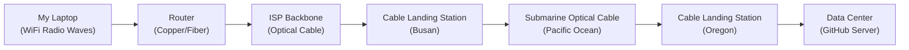
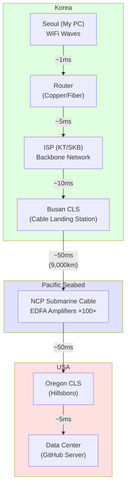

## Introduction

> This document is the 2nd part of the **Internet Infrastructure — A Client Developer's Curiosity** series.

Right now, as you read this, your surroundings are filled with invisible electromagnetic waves and light. 2.4GHz radio waves pouring from WiFi routers, 5G millimeter waves flying from cell towers, infrared lasers racing through optical cables in walls — all of these are invisible to your eyes, but they are actually carrying data through air and glass.

In Part 1, we covered the logical layer. We looked at how data is exchanged according to "agreed rules" from a software perspective, such as protocol stacks, DNS resolution, and TLS handshakes. In gaming terms, that was about the **Networking API layer**.

In this part, we descend into the physical world beneath it. We trace the **physical journey** of a data packet leaving your laptop's WiFi antenna as radio waves, traveling through copper wires and optical fibers to the ISP, crossing thousands of kilometers of submarine cables under the sea, and finally reaching an SSD in a massive data center.

Using a game development analogy, if Part 1 was about the API design of the `NetworkTransport` class, this part deals with how packets physically move through Ethernet cables and optical fibers underneath — namely, **hardware and physical infrastructure**.



This entire journey happens in the blink of an eye, within about 100~200ms. Let's unravel the secrets one by one.

---

## Part 1: Radio Waves in the Air — The Last Mile

The first step of Internet communication is sending data from your device to the nearest network equipment. The telecom industry calls this section the **"Last Mile"**. In reality, it's the **first** section, but from the perspective of the telecom provider reaching the subscriber, it means the "last section."

### The Reality of WiFi — 2.4GHz / 5GHz Electromagnetic Waves

WiFi is not mysterious magic. It is the **same kind of electromagnetic wave** as radio, TV broadcasts, and microwaves. Specifically, it is **Non-ionizing Radiation** belonging to the microwave band.

The word "radiation" might sound alarming, but it simply means energy is "radiated" (emitted) into space. It is fundamentally different from ionizing radiation like X-rays or gamma rays. Ionizing radiation has high enough energy to strip electrons from atoms and damage DNA, but WiFi's electromagnetic waves only have enough energy to slightly vibrate water molecules. Both the WHO (World Health Organization) and ICNIRP (International Commission on Non-Ionizing Radiation Protection) conclude that non-ionizing radiation at WiFi levels does not cause significant damage to biological tissues.

Let's compare WiFi frequency bands.

| Band | Frequency | Channels | Features |
|------|--------|---------|------|
| 2.4 GHz | 2.400~2.4835 GHz | 14 (13 in KR) | Wide range, excellent wall penetration, slow |
| 5 GHz | 5.150~5.850 GHz | 25+ (Inc. DFS) | Narrow range, fast, weak against walls |
| 6 GHz (WiFi 6E/7) | 5.925~7.125 GHz | 59 | Very fast, very narrow range |

If multiple devices share the same frequency channel, interference occurs, reducing speed.

### Home Traffic Congestion

If you live in an apartment, you've probably experienced times when WiFi gets particularly slow. This is because **the same frequency channels overlap** with your neighbors' routers.

In the 2.4GHz band, frequencies between channels overlap. The bandwidth of one channel is 22MHz, but the gap between channels is only 5MHz. Therefore, only **channels 1, 6, and 11** are non-overlapping channels. In an environment dense with routers like an apartment complex, if all routers are crowded on channel 1 or 6, bottlenecks occur just like when all players crowd into the same region in a game server.

```
2.4GHz Channel Layout (22MHz Bandwidth)

Ch 1  [████████████████████████]
Ch 2     [████████████████████████]        ← Overlaps with 1
Ch 3        [████████████████████████]     ← Overlaps with 1, 2
Ch 4           [████████████████████████]
Ch 5              [████████████████████████]
Ch 6                 [████████████████████████]  ← No overlap with 1!
...
Ch 11                                  [████████████████████████]

→ Non-overlapping combo: 1, 6, 11
```

There is also the **Handoff** problem. In cellular networks (4G/5G), handoffs between base stations happen automatically. That's why calls don't drop while moving. But handoffs in WiFi are much more primitive. Unless you have Mesh WiFi at home, the device holds onto the current AP (Access Point) until the signal gets extremely weak, then drops it and connects to a new AP at once. This can cause disconnections of hundreds of ms to several seconds.

**Spanning Tree Protocol (STP)** is also an interesting topic. In corporate networks or complex home networks, connecting multiple switches can create a **Network Loop**. Packets circulate infinitely A → B → C → A → B → C…, paralyzing the network.

This is exactly the same problem as an **infinite loop in Pathfinding algorithms** in games. Just as the A* algorithm revisits nodes infinitely if a Closed List is not maintained, STP detects loops in the network topology and **blocks specific ports** to create a tree structure. It doesn't remove the loop but "deactivates" the redundant path, activating it only if the main path fails.

### Classification of Communication Media

Let's comprehensively compare the physical media through which data moves.

| Media | Type | Features | Main Uses |
|------|------|------|-----------|
| Optical Cable | Wired | Ultra-high speed, long distance, no EM interference | Submarine, Backbone, FTTH |
| Copper (UTP) | Wired | Medium speed, short distance (100m), vulnerable to EM | Home/Office LAN |
| WiFi | Wireless | Medium speed, short distance (tens of m), interference | Indoor |
| Cellular (4G/5G) | Wireless | Med~High speed, medium distance (several km), base stations needed | Mobile communication |
| Satellite | Wireless | Low~Med speed, ultra-long distance, high latency (GEO: ~600ms) | Remote areas, maritime, aviation |
| Bluetooth | Wireless | Low speed (~3Mbps), ultra-short distance (~10m) | IoT, peripherals |

Each has clear trade-offs, and the choice depends on the usage.

---

## Part 2: Submarine Optical Cables — The Aorta of Light

The **Submarine Optical Cable** acts as the aorta for intercontinental data movement on the global Internet.

Many think "Internet = Satellite Communication," but in reality, **more than 95%** of global intercontinental communication traffic is transmitted via submarine optical cables. Satellites are closer to auxiliary means for places cables can't reach, like the middle of the ocean or polar regions. The reason is simple. Light is extremely fast, and optical fibers provide enormous bandwidth.

### Physics of Optical Fiber — Total Internal Reflection

How can optical fibers transmit light for thousands of kilometers? The secret lies in **Total Internal Reflection**.

Optical fibers consist of two layers.

```
Optical Fiber Cross-section

        ┌─────────────────────────────────┐
        │        Cladding                 │
        │     Low Refractive Index (n₂ = ~1.46) │
        │   ┌───────────────────────────┐   │
        │   │      Core                 │   │
        │   │  High Refractive Index (n₁ = ~1.48) │
        │   │                           │   │
        │   │   ～～～ Path of Light ～～～    │   │
        │   │  ╱    ╲    ╱    ╲    ╱    │   │
        │   │ ╱      ╲  ╱      ╲  ╱     │   │
        │   │╱        ╲╱        ╲╱      │   │
        │   └───────────────────────────┘   │
        └─────────────────────────────────┘
```

- **Core**: The central part where light actually passes. Has a high refractive index (n₁ ≈ 1.48).
- **Cladding**: The outer shell surrounding the core. Has a low refractive index (n₂ ≈ 1.46).

When light travels from a medium with a high refractive index (Core) to a medium with a low refractive index (Cladding), if the angle of incidence is greater than the **Critical Angle**, the light cannot pass through the boundary and is **totally reflected**. This is total internal reflection. It's the same principle as when the water surface looks like a mirror at certain angles when looking up from underwater.

Light inside the optical fiber repeats this total reflection thousands, tens of thousands of times, advancing while "trapped" inside the core. Since light doesn't escape, energy loss is very low, which is the key principle allowing light transmission over thousands of kilometers.

### Single-mode vs Multi-mode Optical Fiber

There are two types of optical fibers.

| Feature | Single-mode | Multi-mode |
|------|----------------------|---------------------|
| Core Diameter | ~9 μm | ~50 μm |
| Path of Light | One (Close to straight) | Multiple (Various angles) |
| Transmission Distance | Tens~Thousands of km | Hundreds of m ~ 2 km |
| Usage | Submarine cables, Long-distance backbone | Inside buildings, Data centers |
| Light Source | Laser Diode | LED or VCSEL |
| Cost | Source expensive, Cable cheap | Source cheap, Cable cheap |

In single-mode, light travels straight along a single path, so the signal remains clear without spreading even over long distances. In multi-mode, light travels by reflecting along multiple paths, causing **Modal Dispersion** as arrival times for each path differ slightly. This dispersion blurs signals over long distances, so multi-mode is used only for short distances.

Naturally, **Single-mode optical fiber** is used for submarine cables. The core diameter is only 9μm — just 1/8th the diameter of a human hair (~70μm).

### The Miracle of EDFA Optical Amplifiers

No matter how efficient optical fiber is, light gradually attenuates as it travels thousands of kilometers. The loss rate of modern optical fibers is about 0.2dB/km, meaning signal intensity drops to about 1/10 after 50km. It is impossible to send signals from Busan to Oregon, USA (about 9,000km) without attenuation.

The solution to this problem is **EDFA (Erbium-Doped Fiber Amplifier)**.

```
EDFA Working Principle

   Pump Laser (980nm)
        │
        ▼
┌──────────────────────────────────┐
│  Erbium-Doped Fiber (~10-30m)      │
│                                  │
│  Weak Signal ──→  Erbium Ions ──→  Amplified Signal  │
│  (1550nm)       (Excited State)     (1550nm, Amplified)  │
│                                  │
│  [Stimulated Emission: Excited       │
│   Erbium ions emit additional light   │
│   of the same wavelength → Amplify]   │
└──────────────────────────────────┘
```

Let's explain the principle step by step.

1. **Doping**: Add **Erbium (Er³⁺)** ions, a rare earth element, to the optical fiber core.
2. **Pumping**: Shoot a separate **Pump Laser** (980nm or 1480nm) to raise Erbium ions to an **Excited State**. It's like applying a buff in a game to make them "ready."
3. **Stimulated Emission**: When the attenuated signal light (1550nm) passes through the excited Erbium ions, the ions emit additional light of the **same wavelength, same phase, and same direction**. This is the stimulated emission phenomenon predicted by Einstein and is also the basic principle of lasers.
4. **Result**: The weakened signal light comes out amplified by **20~30dB (100~1000 times)** after passing through the Erbium fiber.

These EDFAs are placed on submarine cables at **50~90km intervals**. There are about 100~150 amplifiers lying on the seabed from Busan to Oregon, USA. Amplifiers need power, so a copper conductor is included inside the submarine cable to supply **9,000~20,000V DC** power from the landing station.

However, EDFAs also have limitations. During amplification, light spontaneously emitted by Erbium ions, **ASE (Amplified Spontaneous Emission)** noise, is also amplified. Passing through more than 100 amplifiers accumulates this noise, eroding the signal. To correct this, **FEC (Forward Error Correction)** coding is applied — a mathematical technique where the receiver detects and corrects errors.

### Submarine Cable Specifications

Let's look at the actual specifications of modern submarine optical cables.

| Item | Value |
|------|------|
| Outer Diameter | 17~21mm (About garden hose size) |
| Weight | ~7 tons/km (Deep sea), ~10 tons/km (Shallow) |
| Cable Lifespan | ~25 years |
| Power Supply | 9,000~20,000V DC |
| Fiber Pairs | Max 24 pairs (Latest) |
| Transmission Capacity | Max hundreds of Tbps (Latest SDM tech) |

The surprising fact is that the outer diameter of this cable responsible for global communication is only **17~21mm** — just slightly larger than a garden hose at your home. In shallow waters (within 1,000m depth), it is wrapped in steel wire armor to prevent physical damage from sharks, anchors, trawlers, etc., making it thicker, but in deep sea sections, water pressure acts as protection, so it is relatively light.

### Visualizing the Data Journey

Let's visualize the entire path and approximate latency of data traveling from Seoul to a GitHub server (US West).



Total Round Trip Time (RTT): About **120~200ms**. The speed of light is about 300,000 km/s in a vacuum, but it slows down to about **200,000 km/s** inside optical fibers due to the refractive index. Just traveling 9,000km one way takes about 45ms, and routing, amplification, and processing delays are added.

---

## Part 3: Cable Landing Stations (CLS) and Geopolitics

Just as **Multiplayer Server Region Selection** directly affects latency in games, where submarine cables land and what paths they connect to are directly linked to a country's Internet performance and security.

### Busan — Korea's Submarine Cable Hub

A **Cable Landing Station (CLS)** is a facility where submarine optical cables come up from the sea to land. It connects the optical fibers of the submarine cable to the terrestrial network, supplies power to amplifiers, and monitors 24/7.

Korea's major CLS are as follows:

| Location | Operator | Major Cables |
|------|--------|---------------|
| **Busan** (Largest) | KT, SK Broadband, Digital Edge, etc. | NCP, APCN-2, EAC-C2C, SJC |
| Geoje | KT | APCN-2 |
| Jeju | KT | APG, etc. |

Busan is the largest gathering place for submarine cables in Korea. Geographically, it acts as a hub for cables extending to Japan, China, Southeast Asia, and the US. A particularly notable cable is the **NCP (New Cross Pacific)**.

**NCP Cable Key Specs**:
- Path: Busan → (Pacific) → Hillsboro, Oregon, USA
- Total Length: Approx. 13,618km
- Capacity: Max ~70Tbps
- Participants: Microsoft, Facebook (Meta), Amazon, Telxius, etc.

Besides NCP, major submarine cables passing through Korea include:

- **APCN-2**: Connecting Korea-Japan-China-Taiwan-Hong Kong-Philippines-Singapore-Malaysia
- **EAC-C2C**: Korea-Japan-Taiwan-Philippines-Singapore
- **SJC**: Korea-Japan-China-Hong Kong-Singapore-Brunei

### The Rise of Carrier-Neutral Data Centers

Traditionally, telecom companies operated closed data centers connecting only their own networks. However, **Carrier-Neutral** data centers are rising rapidly.

Look at the model of **Equinix**, a representative carrier-neutral data center company. Multiple telecom companies like KT, SK Broadband, LG U+, etc., house their equipment in one data center building and **Directly Interconnect** within the building. When data moves from ISP A to ISP B, latency becomes extremely low because it connects via a single optical patch cable within the same building without going through an external network.

### Geopolitical Threat Cases

Submarine cables are the aorta of global communication, but at the same time, they are **surprisingly vulnerable**. Let's look at events that occurred in recent years.

**2022 Tonga Volcanic Eruption**

In January 2022, the Hunga Tonga-Hunga Ha'apai submarine volcano erupted massively in Tonga, South Pacific. The turbidity current generated by the explosion severed the only submarine cable connecting Tonga, and Tonga was effectively **cut off from the Internet for about 5 weeks**. Until satellite communication was partially restored, 100,000 citizens were isolated from the outside world.

**Houthi Rebels' Submarine Cable Threat in the Red Sea**

Yemen's Houthi rebels have repeatedly threatened submarine cables passing through the Red Sea. About 16 submarine cables connecting Europe and Asia pass through the Red Sea, and severing these cables would have a profound impact on Europe-Asia communication. In early 2024, some cables in the Red Sea region were actually damaged, forcing some communication paths to detour.

**Baltic Sea Submarine Cable Sabotage Suspicion (2023~2024)**

In October 2023, a submarine communication cable was damaged along with the Balticconnector gas pipeline between Finland and Estonia. It is presumed to be intentional/unintentional damage by the anchor of a Chinese-registered cargo ship, an event that once again highlighted the physical vulnerability of submarine infrastructure. Similar incidents recurred in the Baltic Sea in 2024.

**US Team Telecom's PLCN License Denial**

PLCN (Pacific Light Cable Network) was a submarine cable project directly connecting Los Angeles, USA, and Hong Kong. However, Team Telecom, an advisory body to the US FCC, denied the license for the Hong Kong connection section citing **risk of eavesdropping by Chinese intelligence agencies**. Eventually, the route was changed to Taiwan and the Philippines instead of Hong Kong. This is a case showing that submarine cables are directly linked to national security.

**Korea's CI (Critical Infrastructure) Designation Issue**

It has been pointed out that the only facility designated as a National Critical Infrastructure (CI) related to submarine cables in Korea is **one KT CLS in Busan**. Other CLSs or the submarine cables themselves are not designated as CI, so protection systems against physical attacks or natural disasters may be insufficient. As seen in the 2022 Tonga case, submarine cable severance can mean national communication paralysis, so discussions on strengthening security are underway.

---

## Part 4: Data Centers — The Brain of the Internet

If you are a game developer, you encounter the word **"Server"** every day. Game server, build server, CI/CD server... But have you ever thought about where these servers physically exist? The place where your code flies when you `git push`, the reality of AWS or Azure, the place where GitHub Actions run — that is the **Data Center**.

### Physical Structure and Power

Modern large data centers, especially AI training data centers, consume **over 100MW** of power. This is equivalent to the power consumption of an entire small US city (about 80,000 households). This is why big tech companies like Microsoft, Google, and Amazon are contracting with nuclear power plants or trying to introduce Small Modular Reactors (SMRs).

Data center reliability is classified by **Uptime Institute's Tier ratings**.

| Tier | Availability | Downtime/Year | Power Path | Features |
|------|--------|------------|---------|------|
| Tier 1 | 99.671% | 28.8 hours | Single | Basic Infrastructure |
| Tier 2 | 99.741% | 22 hours | Single+Reserves | Partial Redundancy |
| Tier 3 | 99.982% | 1.6 hours | Dual (Active-Passive) | Concurrent Maintainability |
| Tier 4 | 99.995% | 26 mins | Dual+Dual (Active-Active) | Fault Tolerant |

Just as game services aim for "Five Nines (99.999%)," cloud services pursue high availability. Tier 4 data centers have **Redundancy** in power supply paths, cooling systems, and network connections, so even if one side completely fails, the service does not stop.

There are also interesting security threats. In a scenario called **Cyber-Physical Attack**, hackers could hack the data center's cooling system (HVAC) to remotely raise the temperature, causing servers to overheat and automatically shutdown. It's an attack that paralyzes services by manipulating the physical environment rather than stealing data.

### 24 Hours of a Data Center Technician

Data centers operate 24/7/365. Technicians usually work in **12-hour shifts**. Their daily lives are full of concepts familiar to game developers.

**Hot-swap Component Replacement**

Replacing hard disks, SSDs, memory, power supply units (PSU), etc., while the server is **running** is called hot-swapping. It is designed to allow parts to be removed and inserted without turning off the server. In a RAID configuration, if one disk fails, you simply remove the failed disk and insert a new one, and data is automatically Rebuilt.

The core is **replacing components without service interruption**. It's the same philosophy as deploying Hotfixes without turning off servers in a live service.

**Hot/Cold Aisle Containment**

In data centers, server racks are arranged in rows, with **Hot Aisles** and **Cold Aisles** alternating.

```
Data Center Cold/Hot Aisle Layout (Top View)

     Cool Air (↓)        Exhaust Air (↑)        Cool Air (↓)
         │                    │                    │
    ┌────┴────┐          ┌────┴────┐          ┌────┴────┐
    │ Cold    │          │ Hot     │          │ Cold    │
    │ Aisle   │          │ Aisle   │          │ Aisle   │
    │         │          │         │          │         │
    └────┬────┘          └────┬────┘          └────┬────┘
    ┌────┴────┐          ┌────┴────┐          ┌────┴────┐
    │ Server  │ ←Inhale  Exhaust→ │ Server  │ ←Inhale  Exhaust→ │ Server  │
    │ Rack    │          │ Rack    │          │ Rack    │
    │ (Front) │          │ (Rear)  │          │ (Front) │
    └─────────┘          └─────────┘          └─────────┘
```

Cool air is inhaled from the front of the server, cools internal heat-generating components, and hot air is exhausted to the rear. Cold Aisles are sealed to prevent cool air leakage, and hot air in Hot Aisles is collected to the ceiling and sent to cooling units.

Latest data centers are also introducing **Immersion Cooling**. Submerging the entire server in non-conductive coolant is much more efficient than air cooling. Like liquid cooling in car engines, it is especially advantageous for AI training servers with extreme heat generation.

**The Art of Cable Management**

The amount of cables connecting thousands of servers in a data center is beyond imagination. If network cables, power cables, optical patch cables, etc., get tangled, maintenance becomes impossible. So data center technicians classify cables by color, organize them with cable trays and velcro ties, and document cable paths. This work is sometimes called an "Art."

Data center technicians patch without turning off services, monitor failures, respond to traffic spikes, and perform hardware replacements.

### The Fatal Limitation of SSDs — Charge Leakage

Here is one somewhat shocking fact. **Data stored on SSDs is not permanent.**

SSDs (Solid State Drives) store data by trapping electrons in a microscopic structure called **Floating Gate Transistor**.

```
Floating Gate Transistor Structure (Simplified)

    Control Gate
    ═══════════════════
    Insulator (Oxide)
    ───────────────────
    Floating Gate       ← "Prison" where electrons are trapped
    ───────────────────
    Tunnel Oxide        ← Very thin insulation layer (~7nm)
    ═══════════════════
    Substrate

    Electrons present → 0 (Programmed state)
    No electrons → 1 (Erased state)
```

The problem is that the **Tunnel Oxide is not a perfect insulator**. Due to the **Quantum Tunneling** effect of quantum mechanics, electrons escape the insulation layer very slowly. If power is connected, data is periodically refreshed to replenish electrons, but if left without power, electrons gradually escape, and data "evaporates."

Especially as the number of bits per cell increases (QLC > TLC > MLC > SLC), the difference in charge levels becomes minute, so even slight electron leakage causes data read errors.

| Type | Bits/Cell | Unpowered Lifespan (25°C, Ref) | Features |
|------|---------|--------------------------|------|
| SLC | 1 | ~10 years | Highest durability, expensive |
| MLC | 2 | ~3-5 years | Server/Enterprise |
| TLC | 3 | ~1-3 years | Consumer (Most common) |
| QLC | 4 | ~6 months-1 year | High capacity/Cheap, lowest durability |

> **Caution**: The above lifespan is an approximate reference value. Actual data retention period varies greatly depending on **temperature, accumulated P/E cycle consumption, controller policy, and manufacturer specs**. JEDEC standard (JESD218) test conditions may differ from actual usage environments.

Temperature is also an important variable. According to JEDEC standards, the data retention period of enterprise SSDs (40°C environment) is only about 3 months, and consumer SSDs (30°C environment) is about 1 year. This is because electron tunneling accelerates in high-temperature environments.

On the other hand, **HDD (Hard Disk Drive)** and **Magnetic Tape** use different principles.

- **HDD**: Records 0s and 1s with the direction of the magnetic field on the surface of a rotating magnetic disk. Magnetic recording is maintained for **years to decades** without power. If mechanical parts (motor, head) fail, it becomes unreadable, but the data itself remains on the platter.
- **Magnetic Tape (LTO)**: One of the oldest digital storage media and also the longest-lived. The latest LTO-9 tape stores 18TB in a single cartridge and can preserve data for **over 30 years** in appropriate storage environments (18~24°C, 40~50% humidity). This is why large companies like Google and Meta still use magnetic tape for Cold Storage.

In summary, SSDs are fast but data slowly evaporates without power; HDDs are slow but preserve data long without power; and magnetic tape has the slowest access speed but the longest preservation period.

This is an important fact showing the physical limits of digital data. Thinking "It's forever if I upload it to the cloud" is a misconception. Cloud storage is ultimately stored on physical SSDs/HDDs, and it is safe because operators (AWS, Azure, etc.) continuously supply power, replace aging disks, and replicate data. If infrastructure maintenance stops, digital data physically disappears.

---

## Conclusion

In this article, we traced the physical journey of data. We watched WiFi waves fly through the air to reach a router, light racing thousands of km via total internal reflection inside optical fibers, Erbium amplifiers reviving attenuated light every 50-90km, entering the Pacific submarine cable from the Busan CLS to reach the US, and finally being stored in a server in a massive data center.

As game developers, we send data with a single line of `NetworkTransport.Send()`, but behind that single line are laser light running through a garden-hose-thick submarine cable, Erbium amplifiers silently amplifying light at 5,000m undersea, data center technicians guarding servers in 12-hour shifts, and SSDs where electrons are slowly escaping due to quantum tunneling.

There is a saying, "The Internet is not in the clouds, but under the sea." I hope you felt the meaning of that through this part.

---

## References

- [TeleGeography - Submarine Cable Map](https://www.submarinecablemap.com/) — Real-time map of global submarine cables
- [TeleGeography - Submarine Cable FAQ](https://www2.telegeography.com/submarine-cable-faqs-702702) — Submarine Cable FAQ
- [Uptime Institute - Tier Classification](https://uptimeinstitute.com/tiers) — Data Center Tier Rating Explanation
- [JEDEC - SSD Endurance and Data Retention](https://www.jedec.org/) — SSD Data Retention Standards
- [Corning - How Does Fiber Optics Work?](https://www.corning.com/optical-communications/worldwide/en/home/resources/education.html) — Optical Fiber Working Principle Education Material
- [Internet Society - Internet Infrastructure](https://www.internetsociety.org/) — General Internet Infrastructure Education Material
