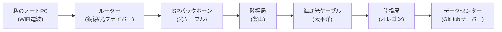
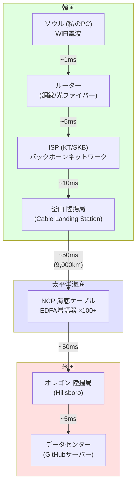

## 序論

> この文書は **インターネットインフラ — クライアント開発者の好奇心** シリーズの第2編です。

今この記事を読んでいるあなたの周りは目に見えない電磁波と光で満ちています。WiFiルーターから降り注ぐ2.4GHzの電波、セルタワーから飛んでくる5Gミリ波、壁の中の光ケーブルを疾走する赤外線レーザー — これらすべてがあなたの目に見えないだけで、実際に空気とガラスを横切ってデータを運んでいます。

第1編で私たちは論理的階層を扱いました。プロトコルスタック、DNS解析、TLSハンドシェイクなどソフトウェアの観点からデータがどのように「約束されたルール」に従ってやり取りされるかを見てきました。それはゲームで言えば **ネットワーキングAPIレイヤー** に相当する話でした。

今回の第2編ではその下にある物理的世界へ降ります。データパケットが私のノートパソコンのWiFiアンテナを離れて電磁波になり、銅線と光ファイバーに乗ってISPを経て、海の下数千kmの海底ケーブルを通過し、最終的に巨大なデータセンターのSSDに到達する **物理的旅路** を追跡します。

ゲーム開発に例えるなら、第1編が `NetworkTransport` クラスのAPI設計を扱ったものなら、今回の編はその下で実際にパケットがイーサネットケーブルと光ファイバーに乗って物理的にどう移動するか — つまり **ハードウェアと物理インフラ** を扱うものです。



この全ての旅路は瞬きする間、約100〜200ms以内に起こります。その秘密を一つずつ解き明かしてみましょう。

---

## Part 1：空中の電波 — ラストワンマイル

インターネット通信の最初の段階は、あなたの機器から最も近いネットワーク機器までデータを送ることです。この区間を通信業界では **「ラストワンマイル (Last Mile)」** と呼びます。実際には最後ではなく **最初** の区間ですが、通信会社の立場から加入者に到達する「最後の区間」という意味です。

### WiFiの実体 — 2.4GHz / 5GHz 電磁波

WiFiは神秘的な魔法ではありません。ラジオ、TV放送、電子レンジと **同一の種類の電磁波 (Electromagnetic Wave)** です。具体的にはマイクロ波帯域に属する **非電離放射線 (Non-ionizing Radiation)** です。

「放射線」という単語が入っていて不安になるかもしれませんが、これはエネルギーが空間に「放射（放出）」されるという意味に過ぎません。X線やガンマ線のような電離放射線とは根本的に異なります。電離放射線は原子から電子を引き剥がすほどエネルギーが高くDNAを損傷させますが、WiFiの電磁波は水分子をわずかに振動させる程度のエネルギーしかありません。WHO（世界保健機関）とICNIRP（国際非電離放射線防護委員会）のどちらもWiFiレベルの非電離放射線が生体組織に有意な損傷を起こさないと結論付けています。

WiFiの周波数帯域を比較してみましょう。

| 帯域 | 周波数 | チャンネル数 | 特徴 |
|------|--------|---------|------|
| 2.4 GHz | 2.400〜2.4835 GHz | 14個 (韓国13個) | 広い範囲、壁透過力優秀、遅い |
| 5 GHz | 5.150〜5.850 GHz | 25個+ (DFS含む) | 狭い範囲、速い、壁に弱い |
| 6 GHz (WiFi 6E/7) | 5.925〜7.125 GHz | 59個 | 非常に速い、非常に狭い範囲 |

同じ周波数チャンネルを複数の機器が共有すると干渉（Interference）が発生して速度が低下します。

### 家庭内トラフィック混雑

アパートに住んでいるならWiFiが特に遅くなる時間帯を経験したことがあるでしょう。これは隣人のルーターと **同じ周波数チャンネルが重なるため** です。

2.4GHz帯域ではチャンネル間の周波数が重なります。一つのチャンネルの帯域幅は22MHzですが、チャンネル間の間隔は5MHzしかありません。したがって **チャンネル1、6、11** だけがお互いに重ならない非重複チャンネルです。アパート団地のようにルーターが密集した環境ですべてのルーターがチャンネル1や6に集まっていると、まるでゲームサーバーですべてのプレイヤーが同じリージョン（Region）に集まったかのようにボトルネックが発生します。

```
2.4GHz チャンネル配置 (22MHz帯域幅)

Ch 1  [████████████████████████]
Ch 2     [████████████████████████]        ← 1と重なる
Ch 3        [████████████████████████]     ← 1, 2と重なる
Ch 4           [████████████████████████]
Ch 5              [████████████████████████]
Ch 6                 [████████████████████████]  ← 1と重ならない！
...
Ch 11                                  [████████████████████████]

→ 非重複の組み合わせ：1, 6, 11
```

**ハンドオフ (Handoff)** 問題もあります。セルラーネットワーク（4G/5G）では基地局間のハンドオフが自動的に行われます。移動中でも通話が途切れない理由です。しかしWiFiでのハンドオフはずっと原始的です。家にメッシュ（Mesh）WiFiがない限り、機器が現在のAP（Access Point）との信号が極度に弱くなるまで耐えてから一度切れて新しいAPに接続します。この時数百ms〜数秒の断絶が発生する可能性があります。

**スパニングツリープロトコル (STP)** も興味深いテーマです。企業ネットワークや複雑な家庭ネットワークでスイッチが複数台接続されると **ネットワークループ (Loop)** が生じる可能性があります。パケットがA → B → C → A → B → C…と無限に循環しながらネットワークを麻痺させます。

これはゲームで **経路探索 (Pathfinding) アルゴリズムの無限ループ** と全く同じ問題です。A*アルゴリズムで閉じたリスト（Closed List）を維持しなければ既に訪問したノードを無限に再訪問するように、STPはネットワークトポロジーでループを検知して **特定ポートを遮断 (Blocking)** してツリー構造にします。ループを除去するのではなく、余分な経路を「非活性化」しておき主経路に障害が生じれば活性化する方式です。

### 通信媒体の分類

データが移動する物理的媒体を総合的に比較してみましょう。

| 媒体 | 種類 | 特徴 | 主な使用先 |
|------|------|------|-----------|
| 光ケーブル | 有線 | 超高速、長距離、電磁波干渉なし | 海底、バックボーン、FTTH |
| 銅線(UTP) | 有線 | 中速、短距離(100m)、電磁波干渉に弱い | 家庭/オフィスLAN |
| WiFi | 無線 | 中速、短距離(数十m)、干渉あり | 室内 |
| セルラー(4G/5G) | 無線 | 中〜高速、中距離(数km)、基地局必要 | 移動通信 |
| 衛星 | 無線 | 低〜中速、超長距離、高い遅延(GEO: ~600ms) | 奥地、海洋、航空 |
| Bluetooth | 無線 | 低速(~3Mbps)、超短距離(~10m) | IoT、周辺機器 |

それぞれのトレードオフが明確で、用途によって選択が変わります。

---

## Part 2：海底光ケーブル — 光の大動脈

全世界のインターネットで大陸間データ移動の大動脈の役割をするのがまさに **海底光ケーブル** です。

「インターネット＝衛星通信」と考えている方が多いですが、実際に全世界の大陸間通信トラフィックの **95%以上** が海底光ケーブルを通じて伝送されます。衛星は海の真ん中や極地方などケーブルが届かない場所のための補助手段に近いです。その理由は単純です。光は非常に速く、光ファイバーは莫大な帯域幅を提供するからです。

### 光ファイバーの物理学 — 全反射 (Total Internal Reflection)

光ファイバーがどうやって光を数千kmも伝達できるのでしょうか？秘密は **全反射 (Total Internal Reflection)** にあります。

光ファイバーは二つの層で構成されます。

```
光ファイバー断面図

        ┌─────────────────────────────────┐
        │        クラッディング (Cladding)    │
        │     屈折率低い (n₂ = ~1.46)       │
        │   ┌───────────────────────────┐   │
        │   │      コア (Core)           │   │
        │   │  屈折率高い (n₁ = ~1.48)    │   │
        │   │                           │   │
        │   │   ～～～ 光の経路 ～～～     │   │
        │   │  ╱    ╲    ╱    ╲    ╱    │   │
        │   │ ╱      ╲  ╱      ╲  ╱     │   │
        │   │╱        ╲╱        ╲╱      │   │
        │   └───────────────────────────┘   │
        └─────────────────────────────────┘
```

- **コア (Core)**：光が実際に通過する中心部。屈折率が高いです（n₁ ≈ 1.48）。
- **クラッディング (Cladding)**：コアを囲む外皮。屈折率が低いです（n₂ ≈ 1.46）。

光が屈折率の高い媒質（コア）から屈折率の低い媒質（クラッディング）へ進む時、入射角が **臨界角 (Critical Angle)** より大きければ光は境界面を通過できず **完全に反射** されます。これが全反射です。まるで水面の下から水面を見上げる時、特定角度以上で水面が鏡のように見えるのと同じ原理です。

光ファイバー内部の光はこの全反射を数千、数万回繰り返してコアの中に「閉じ込められたまま」前進します。光が抜け出せないのでエネルギー損失が非常に少なく、これが光を数千kmまで伝送できる核心原理です。

### シングルモード vs マルチモード光ファイバー

光ファイバーには2種類があります。

| 特性 | シングルモード (Single-mode) | マルチモード (Multi-mode) |
|------|----------------------|---------------------|
| コア直径 | 約 9 μm | 約 50 μm |
| 光の経路 | 一つ（直線に近い） | 複数（多様な角度） |
| 伝送距離 | 数十〜数千 km | 数百 m 〜 2 km |
| 用途 | 海底ケーブル、長距離バックボーン | 建物内部、データセンター内 |
| 光源 | レーザーダイオード | LED または VCSEL |
| コスト | 光源高い、ケーブル安い | 光源安い、ケーブル安い |

シングルモードでは光が一つの経路で直進するため、信号が遠くに行っても広がらず鮮明です。マルチモードでは光が複数の経路で反射しながら進むため、各経路の到着時間が微細に異なり **モード分散 (Modal Dispersion)** が発生します。この分散が長距離で信号を崩すため、マルチモードは短距離でのみ使用します。

海底ケーブルに使用されるのは当然 **シングルモード光ファイバー** です。コア直径がわずか9μm — 人の髪の毛の直径（約70μm）の1/8に過ぎません。

### EDFA 光増幅器の奇跡

いくら光ファイバーが効率的だと言っても、光は数千kmを進むと徐々に減衰します。現代の光ファイバーの損失率は約0.2dB/kmですが、50kmを過ぎると信号強度が約1/10に落ちます。釜山から米国オレゴンまで約9,000kmを減衰なしで送ることは不可能です。

この問題を解決するのが **EDFA (Erbium-Doped Fiber Amplifier)**、つまりエルビウム添加光ファイバー増幅器です。

```
EDFA 動作原理

   ポンプ用レーザー (980nm)
        │
        ▼
┌──────────────────────────────────┐
│  エルビウムドープ光ファイバー (~10-30m) │
│                                  │
│  弱い信号光 ──→  エルビウムイオン ──→  増幅された信号光 │
│  (1550nm)       (励起状態)       (1550nm, 増幅)  │
│                                  │
│  [誘導放出：励起されたエルビウムイオンが │
│   信号光によって同じ波長の光を        │
│   追加で放出 → 増幅]              │
└──────────────────────────────────┘
```

原理を段階別に説明します。

1. **ドーピング (Doping)**：光ファイバーコアに希土類元素である **エルビウム (Erbium, Er³⁺)** イオンを添加します。
2. **ポンピング (Pumping)**：別の **ポンプ用レーザー**（980nmまたは1480nm）を撃ってエルビウムイオンを **励起状態 (Excited State)** に上げます。まるでゲームでバフをかけて「準備状態」にするようなものです。
3. **誘導放出 (Stimulated Emission)**：減衰した信号光（1550nm）が励起されたエルビウムイオンを通過する時、イオンは **同じ波長、同じ位相、同じ方向の光** を追加で放出します。これがアインシュタインが予測した誘導放出現象であり、レーザーの基本原理でもあります。
4. **結果**：弱くなった信号光がエルビウム光ファイバーを通過した後、 **20〜30dB（100〜1000倍）** 増幅されて出てきます。

このEDFAが海底ケーブルに **50〜90km間隔** で配置されます。釜山から米国オレゴンまで約100〜150個の増幅器が海底に置かれているわけです。増幅器は電力が必要なので、海底ケーブル内部に銅導体が含まれており、陸揚局から **9,000〜20,000V DC** 電力を供給します。

ただし、EDFAにも限界があります。増幅過程でエルビウムイオンが自発的に放出する光、つまり **ASE (Amplified Spontaneous Emission)** ノイズが一緒に増幅されます。増幅器を100個以上経るとこのノイズが累積して信号を侵食します。これを補正するために **FEC (Forward Error Correction)** コーディングが適用されます — 受信側でエラーを検知して訂正する数学的技法です。

ただし増幅器をあまりに多く経るとノイズも一緒に増幅されるため、原本信号の品質を維持するためのエラー訂正が必要です。

### 海底ケーブル仕様

現代の海底光ケーブルの実際の仕様を見てみましょう。

| 項目 | 数値 |
|------|------|
| 外径 | 17〜21mm（庭のホース程度） |
| 重量 | 約 7トン/km（深海）、約 10トン/km（浅海） |
| ケーブル寿命 | 約 25年 |
| 電力供給 | 9,000〜20,000V DC |
| 光ファイバーペア数 | 最大 24ペア（最新） |
| 伝送容量 | 最大数百 Tbps（最新SDM技術） |

驚くべき事実は、全世界の通信を担うこのケーブルの外径がわずか **17〜21mm** — 皆さんの家の庭のホースより少し大きいくらいだということです。浅海（水深1,000m以内）区間ではサメ、アンカー、トロール漁船などによる物理的損傷を防ぐために鉄線アーマー（Armor）で巻いて外径が大きくなりますが、深海区間では水圧が保護の役割をするので比較的軽いです。

### データの旅路の可視化

ソウルからGitHubサーバー（米国西部）までデータが移動する全体経路と各区間の大まかな遅延時間を可視化してみましょう。



総往復遅延 (RTT)：約 **120〜200ms**。光の速度は真空中で秒速約30万kmですが、光ファイバー内では屈折率のため約 **20万km/s** に遅くなります。9,000kmを片道移動するだけで約45msがかかり、ルーティング、増幅、プロセッシング遅延が追加されます。

---

## Part 3：陸揚局(CLS)と地政学

ゲームで **マルチプレイヤーサーバーのリージョン(Region)選択** が遅延時間に直接的な影響を与えるように、海底ケーブルがどこに着陸し（Landing）、どのような経路で連結されるかは一国のインターネット性能と安保に直結します。

### 釜山 — 韓国の海底ケーブルハブ

**陸揚局 (Cable Landing Station, CLS)** は海底光ケーブルが海から陸へ上がってくる施設です。海底ケーブルの光ファイバーを陸上ネットワークに連結し、増幅器に電力を供給し、24時間モニタリングする場所です。

韓国の主要陸揚局は以下の通りです。

| 位置 | 運営社 | 主要連結ケーブル |
|------|--------|---------------|
| **釜山** (最大規模) | KT, SKブロードバンド, Digital Edgeなど | NCP, APCN-2, EAC-C2C, SJC |
| 巨済 | KT | APCN-2 |
| 済州 | KT | APGなど |

釜山は韓国の海底ケーブル最大集結地です。地理的に日本、中国、東南アジア、米国へ伸びていくケーブルたちのハブの役割を果たします。特に注目すべきケーブルは **NCP (New Cross Pacific)** です。

**NCPケーブル主要仕様**：
- 経路：釜山 → (太平洋) → 米国オレゴン州ヒルズボロ (Hillsboro)
- 総長さ：約 13,618km
- 伝送容量：最大 約 70Tbps
- 参加社：Microsoft, Facebook(Meta), Amazon, Telxiusなど

NCP以外にも韓国を経由する主要海底ケーブルがあります。

- **APCN-2 (Asia Pacific Cable Network 2)**：韓国-日本-中国-台湾-香港-フィリピン-シンガポール-マレーシアを連結
- **EAC-C2C (East Asia Crossing - Cable 2 Cable)**：韓国-日本-台湾-フィリピン-シンガポール
- **SJC (Southeast Asia-Japan Cable)**：韓国-日本-中国-香港-シンガポール-ブルネイ

### キャリア中立データセンターの浮上

伝統的に通信会社は自社ネットワークのみ連結する閉鎖的なデータセンターを運営していました。しかし最近は **キャリア中立 (Carrier-Neutral)** データセンターが急浮上しています。

キャリア中立データセンターの代表企業である **エクイニクス (Equinix)** のモデルを見てみましょう。一つのデータセンター建物の中にKT、SKブロードバンド、LG U+など多数の通信会社が装備を入居させ、彼らが建物内で **直接連結 (Direct Interconnection)** します。データがISP AからISP Bへ移動する時、外部ネットワークを経由せず同じ建物の中で光パッチケーブル一つで連結されるため、遅延時間が極度に低くなります。

### 地政学的脅威の事例

海底ケーブルは全世界通信の大動脈ですが、同時に **驚くほど脆弱** です。ここ数年間発生した事件を見てみましょう。

**2022年 トンガ火山爆発**

2022年1月、南太平洋のトンガでフンガ・トンガ＝フンガ・ハアパイ (Hunga Tonga-Hunga Ha'apai) 海底火山が大爆発しました。爆発で発生した海底地滑り (turbidity current) がトンガを連結する唯一の海底ケーブルを切断し、トンガは **約5週間事実上インターネットが途絶** しました。衛星通信が一部復旧するまで10万人の国民が外部世界と断絶される事態が起きました。

**紅海フーシ派反乱軍の海底ケーブル脅威**

イエメンのフーシ派反乱軍は紅海を通過する海底ケーブルに対する脅威を数回示唆しました。紅海には欧州-アジアを連結する約16本の海底ケーブルが通過しており、これらケーブルが切断されれば欧州-アジア間通信に甚大な影響を及ぼします。2024年初めには実際に紅海地域のケーブル一部が損傷し、一部の通信経路が迂回しなければなりませんでした。

**バルト海海底ケーブルサボタージュ疑惑 (2023~2024)**

2023年10月、フィンランド-エストニア間のBalticconnectorガス管と共に海底通信ケーブルが損傷しました。中国船籍貨物船のアンカーによる意図的/非意図的損傷と推定され、これは海底インフラの物理的脆弱性を再び浮き彫りにした事件でした。2024年にもバルト海で類似の事件が繰り返されました。

**米国 Team TelecomのPLCNライセンス拒否**

PLCN (Pacific Light Cable Network) は米国ロサンゼルスと香港を直接連結する海底ケーブルプロジェクトでした。しかし米国連邦通信委員会 (FCC) の諮問機関であるTeam Telecomは **中国情報機関の盗聴リスク** を理由に香港連結区間のライセンスを拒否しました。結局香港の代わりに台湾とフィリピンへ経路が変更されました。これは海底ケーブルが国家安保と直接的に連結されていることを示す事例です。

**韓国のCI (Critical Infrastructure) 指定問題**

韓国で海底ケーブル関連国家核心インフラ (CI) に指定された施設は **釜山KT陸揚局1箇所** だけという指摘があります。他の陸揚局や海底ケーブル自体はCIに指定されておらず、物理的攻撃や自然災害に対する防護体系が不十分である可能性があります。2022年トンガの事例で見られるように、海底ケーブル切断はすなわち国家的通信麻痺を意味する可能性があるため、これに対するセキュリティ強化の議論が行われています。

---

## Part 4：データセンター — インターネットの頭脳

ゲーム開発者なら **「サーバー」** という単語に毎日接します。ゲームサーバー、ビルドサーバー、CI/CDサーバー… しかしこれらサーバーが物理的にどこに存在するのか考えてみたことはありますか？あなたが `git push` すればコードが飛んでいくその場所、AWSやAzureの実体、GitHub Actionsが回る場所 — それがまさに **データセンター** です。

### 物理的構造と電力

現代の大型データセンター、特にAI学習用データセンターは **100MW以上** の電力を消費します。これは米国の中小都市（約8万世帯）全体の電力消費量に匹敵します。Microsoft, Google, Amazonなどのビッグテック企業が原子力発電所と契約したり、直接小型モジュール原子炉 (SMR) を導入しようとする理由がここにあります。

データセンターの信頼性は **Uptime Instituteのティア (Tier) 等級** で分類されます。

| 等級 | 可用性 | ダウンタイム/年 | 電力経路 | 特徴 |
|------|--------|------------|---------|------|
| Tier 1 | 99.671% | 28.8時間 | 単一 | 基本インフラ |
| Tier 2 | 99.741% | 22時間 | 単一+予備 | 部分二重化 |
| Tier 3 | 99.982% | 1.6時間 | 二重 (Active-Passive) | メンテナンス中無中断 |
| Tier 4 | 99.995% | 26分 | 二重+二重 (Active-Active) | 障害耐性 (Fault Tolerant) |

ゲームサービスで "Five Nines (99.999%)" を目標とするように、クラウドサービスも高い可用性を追求します。Tier 4データセンターは電力供給経路、冷却システム、ネットワーク連結すべてが **二重化 (Redundancy)** されており、片方が完全に故障してもサービスが中断されません。

興味深いセキュリティ脅威もあります。 **サイバー物理攻撃 (Cyber-Physical Attack)** と呼ばれるシナリオでは、ハッカーがデータセンターの冷却システム (HVAC) をハッキングしてリモートで温度を上げればサーバーが過熱して自動シャットダウンする可能性があります。データを盗むのではなく物理的環境を操作してサービスを麻痺させる攻撃です。

### データセンター技術者の24時間

データセンターは24時間365日運営されます。技術者たちは通常 **12時間交代勤務** をします。彼らの日常はゲーム開発者にも馴染みのある概念で溢れています。

**ホットスワップ (Hot-swap) 部品交換**

サーバーが **稼働中の状態で** ハードディスク、SSD、メモリ、電源供給装置 (PSU) などを交換することをホットスワップと言います。サーバーを消さずに部品を抜いて挿せるように設計されたものです。RAID構成でディスク一つが故障すれば、故障したディスクだけ抜いて新しいものを挿せば自動的にデータが再構成 (Rebuild) されます。

核心は **サービス中断なしに構成要素を交換** することです。ライブサービスでサーバーを消さずにホットフィックス (Hotfix) を配布するのと同じ哲学です。

**Hot/Cold Aisle Containment**

データセンターでサーバーラックは一列に配置され、 **熱い空気通路 (Hot Aisle)** と **冷たい空気通路 (Cold Aisle)** が交互に配置されます。

```
データセンター Cold/Hot Aisle 配置（上から見下ろした様子）

     冷却空気 (↓)        排出空気 (↑)        冷却空気 (↓)
         │                    │                    │
    ┌────┴────┐          ┌────┴────┐          ┌────┴────┐
    │ Cold    │          │ Hot     │          │ Cold    │
    │ Aisle   │          │ Aisle   │          │ Aisle   │
    │         │          │         │          │         │
    └────┬────┘          └────┬────┘          └────┬────┘
    ┌────┴────┐          ┌────┴────┐          ┌────┴────┐
    │ サーバー  │ ←吸入  排出→ │ サーバー  │ ←吸入  排出→ │ サーバー  │
    │ ラック    │          │ ラック    │          │ ラック    │
    │ (前面)   │          │ (後面)   │          │ (前面)   │
    └─────────┘          └─────────┘          └─────────┘
```

サーバーの前面から冷たい空気を吸入し、内部発熱部品を冷却した後、後面へ熱い空気を排出します。Cold Aisleは密閉して冷たい空気が漏れないようにし、Hot Aisleの熱い空気は天井へ集めて冷却装置へ送ります。

最新データセンターでは **液浸冷却 (Immersion Cooling)** も導入しています。サーバー全体を非伝導性冷却液に浸す方式で、空気冷却よりはるかに効率的です。まるで自動車エンジンの水冷式冷却のように、発熱が激しいAI学習サーバーに特に有利です。

**ケーブル管理の芸術**

データセンターで数千台のサーバーを連結するケーブルの量は想像を超えます。ネットワークケーブル、電源ケーブル、光パッチケーブルなどが複雑に絡まればメンテナンスが不可能になります。そのためデータセンター技術者たちはケーブルを色別に分類し、ケーブルトレイとベルクロタイで整理し、ケーブル経路を文書化します。この作業は一種の「芸術」と呼ばれたりもします。

データセンター技術者はサービスを消さずにパッチし、障害をモニタリングし、トラフィック暴走に対応し、ハードウェア交換を実行します。

### SSDの致命的限界 — 電荷漏出

ここで多少衝撃的な事実を一つ紹介します。 **SSDに保存されたデータは永久的ではありません。**

SSD (Solid State Drive) は **フローティングゲートトランジスタ (Floating Gate Transistor)** という微細構造に電子 (electron) を閉じ込めてデータを保存します。

```
フローティングゲートトランジスタ構造（簡略化）

    コントロールゲート (Control Gate)
    ═══════════════════
    絶縁体 (Oxide)
    ───────────────────
    フローティングゲート (Floating Gate)  ← 電子が閉じ込められる「監獄」
    ───────────────────
    トンネル酸化膜 (Tunnel Oxide)     ← 非常に薄い絶縁層 (~7nm)
    ═══════════════════
    基板 (Substrate)

    電子あり → 0 (プログラムされた状態)
    電子なし → 1 (消去された状態)
```

問題は **トンネル酸化膜が完璧な絶縁体ではないということ** です。量子力学の **トンネリング効果 (Quantum Tunneling)** により、電子は非常にゆっくり絶縁層を抜け出します。電源が連結されていれば周期的にデータを更新 (Refresh) して電子を補充しますが、電源なしで放置すれば電子が徐々に脱出してデータが「蒸発」します。

特にセルあたりのビット数が多いほど (QLC > TLC > MLC > SLC)、電荷レベルの差が微細になるため、わずかな電子漏出でもデータ判読エラーが発生します。

| タイプ | セルあたりビット | 無電源寿命 (25°C, 参考値) | 特徴 |
|------|---------|--------------------------|------|
| SLC | 1 | 約 10年 | 最も耐久性高い、高価 |
| MLC | 2 | 約 3〜5年 | サーバー/エンタープライズ用 |
| TLC | 3 | 約 1〜3年 | 一般消費者用（最も普遍的） |
| QLC | 4 | 約 6ヶ月〜1年 | 大容量/低価格、耐久性最も低い |

> **注意**：上記の寿命は大まかな参考値であり、実際のデータ保存期間は **温度、累積P/Eサイクル消耗量、コントローラーポリシー、メーカー仕様** により大きく異なります。JEDEC標準 (JESD218) のテスト条件と実際の使用環境は異なる場合があります。

温度も重要な変数です。JEDEC標準によると、エンタープライズSSD（40°C環境）のデータ保存期間は約3ヶ月に過ぎず、消費者用SSD（30°C環境）は約1年です。高温環境では電子トンネリングが加速するためです。

一方 **HDD (Hard Disk Drive)** と **磁気テープ (Magnetic Tape)** は異なる原理を使用します。

- **HDD**：回転する磁気ディスク表面に磁場の方向で0と1を記録します。磁気記録は電源がなくても **数年から数十年** 維持されます。機械的部品（モーター、ヘッド）が故障すれば読めなくなりますが、データ自体はプラッターに残っています。
- **磁気テープ (LTO)**：最も古いデジタル保存媒体の一つであり、同時に最も長寿な媒体でもあります。最新LTO-9テープは単一カートリッジに18TBを保存し、適切な保管環境（18〜24°C、40〜50%湿度）で **30年以上** データを保存できます。Google, Metaなどの大企業がコールドストレージ (Cold Storage) として磁気テープを依然として使用する理由です。

まとめると、SSDは速いが電源なしではデータが徐々に蒸発し、HDDは遅いが電源なしでも長く保存され、磁気テープはアクセス速度が最も遅いが保存期間は最も長いです。

これはデジタルデータの物理的限界を示す重要な事実です。「クラウドに上げれば永遠だ」という考えは錯覚です。クラウドストレージも結局物理的SSD/HDDに保存され、運営主体（AWS, Azureなど）が持続的に電力を供給し、老朽ディスクを交換し、データを複製 (Replication) してくれるから安全なのです。インフラ維持が止まれば、デジタルデータは物理的に消滅します。

---

## 結び

この記事で私たちはデータの物理的旅路を追跡しました。WiFi電波が空中を飛んでルーターに到達し、光ファイバーの中で光が全反射を繰り返して数千kmを疾走し、エルビウム増幅器が50〜90kmごとに減衰した光を蘇らせ、釜山陸揚局から太平洋海底ケーブルへ進入し米国へ到達し、巨大なデータセンターのサーバーに最終保存される過程を見てきました。

ゲーム開発者として私たちは `NetworkTransport.Send()` 一行でデータを送りますが、その一行の後ろには庭のホースの太さの海底ケーブルの中を走るレーザー光、海底5,000mで黙々と光を増幅するエルビウム増幅器、12時間交代でサーバーを守るデータセンター技術者、そして量子トンネリングにより徐々に電子が脱出するSSDがあります。

「インターネットは雲の上にあるのではなく、海の下にある」という言葉があります。今回の編を通じてその意味を体感していただければ幸いです。

---

## 参考資料

- [TeleGeography - Submarine Cable Map](https://www.submarinecablemap.com/) — 全世界海底ケーブルリアルタイム地図
- [TeleGeography - Submarine Cable FAQ](https://www2.telegeography.com/submarine-cable-faqs-702702) — 海底ケーブルFAQ
- [Uptime Institute - Tier Classification](https://uptimeinstitute.com/tiers) — データセンターティア等級説明
- [JEDEC - SSD Endurance and Data Retention](https://www.jedec.org/) — SSDデータ保存標準
- [Corning - How Does Fiber Optics Work?](https://www.corning.com/optical-communications/worldwide/en/home/resources/education.html) — 光ファイバー動作原理教育資料
- [Internet Society - Internet Infrastructure](https://www.internetsociety.org/) — インターネットインフラ全般教育資料
