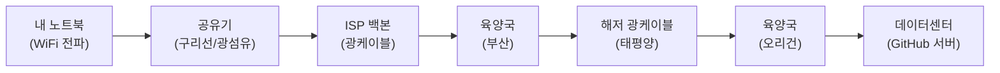
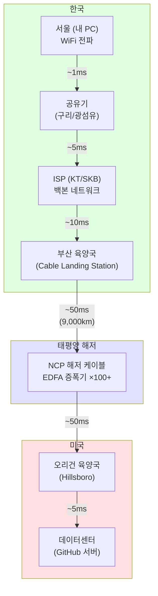

## 서론

> 이 문서는 **인터넷 인프라 — 클라이언트 개발자의 호기심** 시리즈의 2번째 편입니다.

지금 이 글을 읽고 있는 여러분의 주변은 보이지 않는 전자파와 빛으로 가득합니다. WiFi 라우터에서 쏟아지는 2.4GHz 전파, 셀 타워에서 날아오는 5G 밀리미터파, 벽 속 광케이블을 질주하는 적외선 레이저 — 이 모든 것이 여러분의 눈에 보이지 않을 뿐, 실제로 공기와 유리를 가로지르며 데이터를 실어나르고 있습니다.

1편에서 우리는 논리적 계층을 다뤘습니다. 프로토콜 스택, DNS 해석, TLS 핸드셰이크 등 소프트웨어 관점에서 데이터가 어떻게 "약속된 규칙"에 따라 주고받아지는지를 살펴봤습니다. 그것은 게임으로 치면 **네트워킹 API 레이어**에 해당하는 이야기였습니다.

이번 편에서는 그 아래에 있는 물리적 세계로 내려갑니다. 데이터 패킷이 내 노트북의 WiFi 안테나를 떠나 전자파가 되고, 구리선과 광섬유를 타고 ISP를 거쳐, 바다 밑 수천 km의 해저 케이블을 통과해, 최종적으로 거대한 데이터센터의 SSD에 도달하는 **물리적 여정**을 추적합니다.

게임 개발에 비유하면, 1편이 `NetworkTransport` 클래스의 API 설계를 다룬 것이라면, 이번 편은 그 아래에서 실제로 패킷이 이더넷 케이블과 광섬유를 타고 물리적으로 어떻게 이동하는지 — 즉 **하드웨어와 물리 인프라**를 다루는 것입니다.



이 전체 여정은 눈 깜짝할 사이, 약 100~200ms 안에 일어납니다. 그 비밀을 하나씩 풀어보겠습니다.

---

## Part 1: 공중의 전파 — 라스트 마일

인터넷 통신의 첫 단계는 여러분의 기기에서 가장 가까운 네트워크 장비까지 데이터를 보내는 것입니다. 이 구간을 통신 업계에서는 **"라스트 마일(Last Mile)"**이라고 부릅니다. 실제로는 마지막이 아니라 **첫 번째** 구간이지만, 통신사 입장에서 가입자에게 도달하는 "마지막 구간"이라는 의미입니다.

### WiFi의 실체 — 2.4GHz / 5GHz 전자파

WiFi는 신비로운 마법이 아닙니다. 라디오, TV 방송, 전자레인지와 **동일한 종류의 전자파(Electromagnetic Wave)**입니다. 구체적으로는 마이크로파 대역에 속하는 **비이온화 방사선(Non-ionizing Radiation)**입니다.

"방사선"이라는 단어가 들어가 있어서 불안할 수 있지만, 이는 에너지가 공간으로 "방사(방출)"된다는 뜻일 뿐입니다. X선이나 감마선 같은 이온화 방사선과는 근본적으로 다릅니다. 이온화 방사선은 원자에서 전자를 떼어낼 만큼 에너지가 높아 DNA를 손상시키지만, WiFi의 전자파는 물 분자를 약간 진동시키는 정도의 에너지밖에 없습니다. WHO(세계보건기구)와 ICNIRP(국제비전리방사선방호위원회) 모두 WiFi 수준의 비이온화 방사선이 생체 조직에 유의미한 손상을 일으키지 않는다고 결론짓고 있습니다.

WiFi의 주파수 대역을 비교해봅시다.

| 대역 | 주파수 | 채널 수 | 특징 |
|------|--------|---------|------|
| 2.4 GHz | 2.400~2.4835 GHz | 14개 (한국 13개) | 넓은 범위, 벽 투과력 우수, 느림 |
| 5 GHz | 5.150~5.850 GHz | 25개+ (DFS 포함) | 좁은 범위, 빠름, 벽에 약함 |
| 6 GHz (WiFi 6E/7) | 5.925~7.125 GHz | 59개 | 매우 빠름, 매우 좁은 범위 |

같은 주파수 채널을 여러 기기가 공유하면 간섭(Interference)이 발생하여 속도가 저하됩니다.

### 가정 내 트래픽 혼잡

아파트에 살고 계시다면 WiFi가 유독 느려지는 시간대를 경험해보셨을 겁니다. 이것은 이웃들의 공유기와 **같은 주파수 채널이 겹치기 때문**입니다.

2.4GHz 대역에서는 채널 간 주파수가 겹칩니다. 한 채널의 대역폭은 22MHz인데, 채널 간 간격은 5MHz밖에 되지 않습니다. 따라서 **채널 1, 6, 11**만이 서로 겹치지 않는 비중첩 채널입니다. 아파트 단지처럼 공유기가 밀집한 환경에서 모든 공유기가 채널 1이나 6에 몰려 있으면 마치 게임 서버에서 모든 플레이어가 같은 리전(Region)에 몰린 것처럼 병목이 발생합니다.

```
2.4GHz 채널 배치 (22MHz 대역폭)

채널 1  [████████████████████████]
채널 2     [████████████████████████]        ← 1과 겹침
채널 3        [████████████████████████]     ← 1, 2와 겹침
채널 4           [████████████████████████]
채널 5              [████████████████████████]
채널 6                 [████████████████████████]  ← 1과 안 겹침!
...
채널 11                                  [████████████████████████]

→ 비중첩 조합: 1, 6, 11
```

**핸드오프(Handoff)** 문제도 있습니다. 셀룰러 네트워크(4G/5G)에서는 기지국 간 핸드오프가 자동으로 이루어집니다. 이동 중에도 통화가 끊기지 않는 이유입니다. 하지만 WiFi에서의 핸드오프는 훨씬 원시적입니다. 집에 메시(Mesh) WiFi가 없는 한, 기기가 현재 AP(Access Point)와의 신호가 극도로 약해질 때까지 버티다가 한 번에 끊기고 새 AP에 연결합니다. 이 때 수백 ms ~ 수 초의 단절이 발생할 수 있습니다.

**스패닝 트리 프로토콜(STP)**도 흥미로운 주제입니다. 기업 네트워크나 복잡한 가정 네트워크에서 스위치가 여러 대 연결되면 **네트워크 루프(Loop)**가 생길 수 있습니다. 패킷이 A → B → C → A → B → C… 무한히 순환하면서 네트워크를 마비시킵니다.

이것은 게임에서 **경로 탐색(Pathfinding) 알고리즘의 무한 루프**와 정확히 같은 문제입니다. A* 알고리즘에서 닫힌 목록(Closed List)을 유지하지 않으면 이미 방문한 노드를 무한히 재방문하듯이, STP는 네트워크 토폴로지에서 루프를 감지하고 **특정 포트를 차단(Blocking)**하여 트리 구조로 만듭니다. 루프를 제거하는 것이 아니라, 여분의 경로를 "비활성화"해두고 주 경로에 장애가 생기면 활성화하는 방식입니다.

### 통신 매체 분류

데이터가 이동하는 물리적 매체를 종합적으로 비교해봅시다.

| 매체 | 종류 | 특징 | 주요 사용처 |
|------|------|------|-----------|
| 광케이블 | 유선 | 초고속, 장거리, 전자파 간섭 없음 | 해저, 백본, FTTH |
| 구리선(UTP) | 유선 | 중속, 단거리(100m), 전자파 간섭에 취약 | 가정/사무실 LAN |
| WiFi | 무선 | 중속, 단거리(수십 m), 간섭 있음 | 실내 |
| 셀룰러(4G/5G) | 무선 | 중~고속, 중거리(수 km), 기지국 필요 | 이동통신 |
| 위성 | 무선 | 저~중속, 초장거리, 높은 지연(GEO: ~600ms) | 오지, 해양, 항공 |
| 블루투스 | 무선 | 저속(~3Mbps), 초단거리(~10m) | IoT, 주변기기 |

각각의 트레이드오프가 명확하고, 용도에 따라 선택이 달라집니다.

---

## Part 2: 해저 광케이블 — 빛의 대동맥

전 세계 인터넷에서 대륙 간 데이터 이동의 대동맥 역할을 하는 것이 바로 **해저 광케이블**입니다.

"인터넷 = 위성 통신"이라고 생각하시는 분이 많지만, 실제로 전 세계 대륙 간 통신 트래픽의 **95% 이상**이 해저 광케이블을 통해 전송됩니다. 위성은 바다 한가운데나 극지방 등 케이블이 닿지 않는 곳을 위한 보조 수단에 가깝습니다. 그 이유는 단순합니다. 빛은 매우 빠르고, 광섬유는 엄청난 대역폭을 제공하기 때문입니다.

### 광섬유의 물리학 — 전반사(Total Internal Reflection)

광섬유가 어떻게 빛을 수천 km나 전달할 수 있을까요? 비밀은 **전반사(Total Internal Reflection)**에 있습니다.

광섬유는 두 층으로 구성됩니다.

```
광섬유 단면도

        ┌─────────────────────────────────┐
        │        클래딩 (Cladding)          │
        │     굴절률 낮음 (n₂ = ~1.46)      │
        │   ┌───────────────────────────┐   │
        │   │      코어 (Core)           │   │
        │   │  굴절률 높음 (n₁ = ~1.48)  │   │
        │   │                           │   │
        │   │   ～～～ 빛의 경로 ～～～    │   │
        │   │  ╱    ╲    ╱    ╲    ╱    │   │
        │   │ ╱      ╲  ╱      ╲  ╱     │   │
        │   │╱        ╲╱        ╲╱      │   │
        │   └───────────────────────────┘   │
        └─────────────────────────────────┘
```

- **코어(Core)**: 빛이 실제로 통과하는 중심부. 굴절률이 높습니다 (n₁ ≈ 1.48).
- **클래딩(Cladding)**: 코어를 둘러싼 외피. 굴절률이 낮습니다 (n₂ ≈ 1.46).

빛이 굴절률 높은 매질(코어)에서 굴절률 낮은 매질(클래딩)로 진행할 때, 입사각이 **임계각(Critical Angle)**보다 크면 빛은 경계면을 통과하지 못하고 **완전히 반사**됩니다. 이것이 전반사입니다. 마치 수면 아래에서 수면을 올려다볼 때, 특정 각도 이상에서 수면이 거울처럼 보이는 것과 같은 원리입니다.

광섬유 내부의 빛은 이 전반사를 수천, 수만 번 반복하며 코어 안에 "갇힌 채로" 전진합니다. 빛이 빠져나가지 않으므로 에너지 손실이 매우 적고, 이것이 빛을 수천 km까지 전송할 수 있는 핵심 원리입니다.

### 싱글모드 vs 멀티모드 광섬유

광섬유에는 두 가지 종류가 있습니다.

| 특성 | 싱글모드 (Single-mode) | 멀티모드 (Multi-mode) |
|------|----------------------|---------------------|
| 코어 직경 | 약 9 μm | 약 50 μm |
| 빛의 경로 | 하나 (직선에 가까움) | 여러 개 (다양한 각도) |
| 전송 거리 | 수십~수천 km | 수백 m ~ 2 km |
| 용도 | 해저케이블, 장거리 백본 | 건물 내부, 데이터센터 내 |
| 광원 | 레이저 다이오드 | LED 또는 VCSEL |
| 비용 | 광원 비쌈, 케이블 저렴 | 광원 저렴, 케이블 저렴 |

싱글모드에서는 빛이 하나의 경로로 직진하므로, 신호가 멀리 가도 퍼지지 않아 선명합니다. 멀티모드에서는 빛이 여러 경로로 반사되면서 진행하기 때문에, 각 경로의 도착 시간이 미세하게 달라져 **모드 분산(Modal Dispersion)**이 발생합니다. 이 분산이 장거리에서 신호를 뭉개뜨리므로, 멀티모드는 단거리에만 사용합니다.

해저 케이블에 사용되는 것은 당연히 **싱글모드 광섬유**입니다. 코어 직경이 겨우 9μm — 사람 머리카락 직경(약 70μm)의 1/8에 불과합니다.

### EDFA 광증폭기의 기적

아무리 광섬유가 효율적이라 해도, 빛은 수천 km를 진행하면 서서히 감쇠합니다. 현대 광섬유의 손실률은 약 0.2dB/km인데, 50km를 지나면 신호 세기가 약 1/10로 떨어집니다. 부산에서 미국 오리건까지 약 9,000km를 감쇠 없이 보내는 것은 불가능합니다.

이 문제를 해결하는 것이 **EDFA(Erbium-Doped Fiber Amplifier)**, 즉 어븀 첨가 광섬유 증폭기입니다.

```
EDFA 동작 원리

   펌프 레이저 (980nm)
        │
        ▼
┌──────────────────────────────────┐
│  어븀 도핑 광섬유 (약 10~30m)      │
│                                  │
│  약한 신호광 ──→  어븀 이온 ──→  증폭된 신호광  │
│  (1550nm)       (들뜸 상태)     (1550nm, 증폭)  │
│                                  │
│  [유도 방출: 들뜬 어븀 이온이        │
│   신호광에 의해 같은 파장의 빛을      │
│   추가로 방출 → 증폭]              │
└──────────────────────────────────┘
```

원리를 단계별로 설명하겠습니다.

1. **도핑(Doping)**: 광섬유 코어에 희토류 원소인 **어븀(Erbium, Er³⁺)** 이온을 첨가합니다.
2. **펌핑(Pumping)**: 별도의 **펌프 레이저**(980nm 또는 1480nm)를 쏘아 어븀 이온을 **들뜬 상태(Excited State)**로 올립니다. 마치 게임에서 버프를 걸어 "준비 상태"로 만드는 것입니다.
3. **유도 방출(Stimulated Emission)**: 감쇠된 신호광(1550nm)이 들뜬 어븀 이온을 지나갈 때, 이온은 **같은 파장, 같은 위상, 같은 방향의 빛**을 추가로 방출합니다. 이것이 아인슈타인이 예측한 유도 방출 현상이며, 레이저의 기본 원리이기도 합니다.
4. **결과**: 약해진 신호광이 어븀 광섬유를 통과한 후 **20~30dB(100~1000배)** 증폭되어 나옵니다.

이 EDFA가 해저 케이블에 **50~90km 간격**으로 배치됩니다. 부산에서 미국 오리건까지 약 100~150개의 증폭기가 해저에 놓여 있는 셈입니다. 증폭기는 전력이 필요하므로, 해저 케이블 내부에 구리 도체가 포함되어 있어 육양국에서 **9,000~20,000V DC** 전력을 공급합니다.

단, EDFA에도 한계가 있습니다. 증폭 과정에서 어븀 이온이 자발적으로 방출하는 빛, 즉 **ASE(Amplified Spontaneous Emission)** 노이즈가 함께 증폭됩니다. 증폭기를 100개 이상 거치면 이 노이즈가 누적되어 신호를 잠식합니다. 이를 보정하기 위해 **FEC(Forward Error Correction)** 코딩이 적용됩니다 — 수신측에서 오류를 감지하고 정정하는 수학적 기법입니다.

다만 증폭기를 너무 많이 거치면 노이즈도 함께 증폭되므로, 원본 신호의 품질을 유지하기 위한 에러 정정이 필요합니다.

### 해저 케이블 제원

현대 해저 광케이블의 실제 제원을 살펴봅시다.

| 항목 | 수치 |
|------|------|
| 외경 | 17~21mm (정원 호스 정도) |
| 무게 | 약 7톤/km (심해), 약 10톤/km (천해) |
| 케이블 수명 | 약 25년 |
| 전력 공급 | 9,000~20,000V DC |
| 광섬유 쌍 수 | 최대 24쌍 (최신) |
| 전송 용량 | 최대 수백 Tbps (최신 SDM 기술) |

놀라운 사실은 전 세계 통신을 책임지는 이 케이블의 외경이 고작 **17~21mm** — 여러분 집의 정원 호스보다 약간 큰 정도라는 것입니다. 천해(수심 1,000m 이내) 구간에서는 상어, 앵커, 트롤어선 등에 의한 물리적 손상을 방지하기 위해 철선 아머(Armor)로 감싸 외경이 더 커지지만, 심해 구간에서는 수압이 보호 역할을 하므로 비교적 가볍습니다.

### 데이터 여정 시각화

서울에서 GitHub 서버(미국 서부)까지 데이터가 이동하는 전체 경로와 각 구간의 대략적 지연시간을 시각화해봅시다.



총 왕복 지연(RTT): 약 **120~200ms**. 빛의 속도는 진공에서 초속 약 30만 km이지만, 광섬유 내에서는 굴절률 때문에 약 **20만 km/s**로 느려집니다. 9,000km를 편도로 이동하는 데만 약 45ms가 소요되고, 라우팅, 증폭, 프로세싱 지연이 추가됩니다.

---

## Part 3: 육양국(CLS)과 지정학

게임에서 **멀티플레이어 서버의 리전(Region) 선택**이 지연시간에 직접적인 영향을 미치듯, 해저 케이블이 어디에 착륙하고(Landing), 어떤 경로로 연결되느냐는 한 나라의 인터넷 성능과 안보에 직결됩니다.

### 부산 — 한국의 해저 케이블 허브

**육양국(Cable Landing Station, CLS)**은 해저 광케이블이 바다에서 육지로 올라오는 시설입니다. 해저 케이블의 광섬유를 육상 네트워크에 연결하고, 증폭기에 전력을 공급하며, 24시간 모니터링하는 곳입니다.

한국의 주요 육양국은 다음과 같습니다.

| 위치 | 운영사 | 주요 연결 케이블 |
|------|--------|---------------|
| **부산** (최대 규모) | KT, SK브로드밴드, Digital Edge 등 | NCP, APCN-2, EAC-C2C, SJC |
| 거제 | KT | APCN-2 |
| 제주 | KT | APG 등 |

부산은 한국의 해저 케이블 최대 집결지입니다. 지리적으로 일본, 중국, 동남아시아, 미국으로 뻗어나가는 케이블들의 허브 역할을 합니다. 특히 주목할 케이블은 **NCP(New Cross Pacific)**입니다.

**NCP 케이블 주요 사양**:
- 경로: 부산 → (태평양) → 미국 오리건주 힐스보로(Hillsboro)
- 총 길이: 약 13,618km
- 전송 용량: 최대 약 70Tbps
- 참여사: Microsoft, Facebook(Meta), Amazon, Telxius 등

NCP 외에도 한국을 경유하는 주요 해저 케이블들이 있습니다.

- **APCN-2(Asia Pacific Cable Network 2)**: 한국-일본-중국-대만-홍콩-필리핀-싱가포르-말레이시아를 연결
- **EAC-C2C(East Asia Crossing - Cable 2 Cable)**: 한국-일본-대만-필리핀-싱가포르
- **SJC(Southeast Asia-Japan Cable)**: 한국-일본-중국-홍콩-싱가포르-브루나이

### 캐리어 중립 데이터센터의 부상

전통적으로 통신사들은 자사 네트워크만 연결하는 폐쇄적인 데이터센터를 운영했습니다. 하지만 최근에는 **캐리어 중립(Carrier-Neutral)** 데이터센터가 급부상하고 있습니다.

캐리어 중립 데이터센터의 대표 기업인 **에퀴닉스(Equinix)**의 모델을 봅시다. 하나의 데이터센터 건물 안에 KT, SK브로드밴드, LG U+ 등 다수의 통신사가 장비를 입주시키고, 이들이 건물 내에서 **직접 연결(Direct Interconnection)**합니다. 데이터가 ISP A에서 ISP B로 이동할 때, 외부 네트워크를 거치지 않고 같은 건물 안에서 광 패치 케이블 하나로 연결되므로 지연시간이 극도로 낮아집니다.

### 지정학적 위협 사례들

해저 케이블은 전 세계 통신의 대동맥이지만, 동시에 **놀라울 정도로 취약**합니다. 최근 몇 년간 발생한 사건들을 살펴봅시다.

**2022년 통가 화산 폭발**

2022년 1월, 남태평양의 통가에서 홍가 통가-홍가 하아파이(Hunga Tonga-Hunga Ha'apai) 해저 화산이 대폭발했습니다. 폭발로 발생한 해저 산사태(turbidity current)가 통가를 연결하는 유일한 해저 케이블을 절단했고, 통가는 **약 5주간 사실상 인터넷이 두절**되었습니다. 위성 통신이 일부 복구되기 전까지 10만 명의 국민이 외부 세계와 단절되는 사태가 벌어졌습니다.

**홍해 후티 반군의 해저 케이블 위협**

예멘 후티 반군은 홍해를 통과하는 해저 케이블들에 대한 위협을 여러 차례 시사했습니다. 홍해에는 유럽-아시아를 연결하는 약 16개의 해저 케이블이 통과하며, 이 케이블들이 절단되면 유럽-아시아 간 통신에 심대한 영향을 미칩니다. 2024년 초에는 실제로 홍해 지역 케이블 일부가 손상되어 일부 통신 경로가 우회해야 했습니다.

**발트해 해저 케이블 사보타주 의혹 (2023~2024)**

2023년 10월 핀란드-에스토니아 간 Balticconnector 가스관과 함께 해저 통신 케이블이 손상되었습니다. 중국 선적 화물선의 앵커에 의한 의도적/비의도적 손상으로 추정되며, 이는 해저 인프라의 물리적 취약성을 다시 한번 부각시킨 사건이었습니다. 2024년에도 발트해에서 유사한 사건이 반복되었습니다.

**미국 Team Telecom의 PLCN 라이선스 거부**

PLCN(Pacific Light Cable Network)은 미국 로스앤젤레스와 홍콩을 직접 연결하는 해저 케이블 프로젝트였습니다. 하지만 미국 연방통신위원회(FCC)의 자문기구인 Team Telecom은 **중국 정보기관의 도청 위험**을 이유로 홍콩 연결 구간의 라이선스를 거부했습니다. 결국 홍콩 대신 대만과 필리핀으로 경로가 변경되었습니다. 이는 해저 케이블이 국가 안보와 직접적으로 연결되어 있음을 보여주는 사례입니다.

**한국의 CI(Critical Infrastructure) 지정 문제**

한국에서 해저 케이블 관련 국가 핵심 인프라(CI)로 지정된 시설은 **부산 KT 육양국 1곳**뿐이라는 지적이 있습니다. 다른 육양국이나 해저 케이블 자체는 CI로 지정되지 않아, 물리적 공격이나 자연재해에 대한 방호 체계가 미흡할 수 있습니다. 2022년 통가의 사례에서 보듯, 해저 케이블 절단은 곧 국가적 통신 마비를 의미할 수 있으므로, 이에 대한 보안 강화 논의가 이루어지고 있습니다.

---

## Part 4: 데이터 센터 — 인터넷의 두뇌

게임 개발자라면 **"서버"**라는 단어를 매일 접합니다. 게임 서버, 빌드 서버, CI/CD 서버… 하지만 이 서버들이 물리적으로 어디에 존재하는지 생각해보셨나요? 여러분이 `git push` 하면 코드가 날아가는 그곳, AWS나 Azure의 실체, GitHub Actions가 돌아가는 장소 — 그것이 바로 **데이터센터**입니다.

### 물리적 구조와 전력

현대의 대형 데이터센터, 특히 AI 학습용 데이터센터는 **100MW 이상**의 전력을 소비합니다. 이것은 미국 중소도시(약 8만 가구) 전체의 전력 소비량과 맞먹습니다. Microsoft, Google, Amazon 등의 빅테크 기업들이 원자력 발전소와 계약하거나, 직접 소형 모듈 원자로(SMR)를 도입하려는 이유가 여기에 있습니다.

데이터센터의 신뢰성은 **Uptime Institute의 티어(Tier) 등급**으로 분류됩니다.

| 등급 | 가용성 | 다운타임/년 | 전력 경로 | 특징 |
|------|--------|------------|---------|------|
| Tier 1 | 99.671% | 28.8시간 | 단일 | 기본 인프라 |
| Tier 2 | 99.741% | 22시간 | 단일+예비 | 부분 이중화 |
| Tier 3 | 99.982% | 1.6시간 | 이중 (Active-Passive) | 유지보수 중 무중단 |
| Tier 4 | 99.995% | 26분 | 이중+이중 (Active-Active) | 장애 내성 (Fault Tolerant) |

게임 서비스에서 "Five Nines(99.999%)"를 목표로 하듯, 클라우드 서비스도 높은 가용성을 추구합니다. Tier 4 데이터센터는 전력 공급 경로, 냉각 시스템, 네트워크 연결 모두가 **이중화(Redundancy)**되어 있어, 한 쪽이 완전히 고장 나도 서비스가 중단되지 않습니다.

흥미로운 보안 위협도 있습니다. **사이버-물리 공격(Cyber-Physical Attack)**이라 불리는 시나리오에서는, 해커가 데이터센터의 냉각 시스템(HVAC)을 해킹하여 원격으로 온도를 올리면 서버가 과열되어 자동 셧다운될 수 있습니다. 데이터를 훔치는 것이 아니라 물리적 환경을 조작하여 서비스를 마비시키는 공격입니다.

### 데이터센터 기술자의 24시간

데이터센터는 24시간 365일 운영됩니다. 기술자들은 보통 **12시간 교대 근무**를 합니다. 그들의 일상은 게임 개발자에게도 친숙한 개념들로 가득합니다.

**핫스왑(Hot-swap) 부품 교체**

서버가 **가동 중인 상태에서** 하드디스크, SSD, 메모리, 전원 공급 장치(PSU) 등을 교체하는 것을 핫스왑이라 합니다. 서버를 끄지 않고 부품을 빼고 꽂을 수 있도록 설계된 것입니다. RAID 구성에서 디스크 하나가 고장 나면, 고장난 디스크만 빼고 새 것을 꽂으면 자동으로 데이터가 재구성(Rebuild)됩니다.

핵심은 **서비스 중단 없이 구성요소를 교체**하는 것입니다. 라이브 서비스에서 서버를 끄지 않고 핫픽스(Hotfix)를 배포하는 것과 같은 철학입니다.

**Hot/Cold Aisle Containment**

데이터센터에서 서버 랙은 일렬로 배치되며, **뜨거운 공기 통로(Hot Aisle)**와 **차가운 공기 통로(Cold Aisle)**가 교대로 배치됩니다.

```
데이터센터 Cold/Hot Aisle 배치 (위에서 내려다본 모습)

     냉각 공기 (↓)        배출 공기 (↑)        냉각 공기 (↓)
         │                    │                    │
    ┌────┴────┐          ┌────┴────┐          ┌────┴────┐
    │ Cold    │          │ Hot     │          │ Cold    │
    │ Aisle   │          │ Aisle   │          │ Aisle   │
    │         │          │         │          │         │
    └────┬────┘          └────┬────┘          └────┬────┘
    ┌────┴────┐          ┌────┴────┐          ┌────┴────┐
    │ 서버 랙  │ ←흡입  배출→ │ 서버 랙  │ ←흡입  배출→ │ 서버 랙  │
    │ (전면)   │          │ (후면)   │          │ (전면)   │
    └─────────┘          └─────────┘          └─────────┘
```

서버의 전면에서 차가운 공기를 흡입하고, 내부 발열 부품을 냉각한 후, 후면으로 뜨거운 공기를 배출합니다. Cold Aisle은 밀폐하여 차가운 공기가 새지 않도록 하고, Hot Aisle의 뜨거운 공기는 천장으로 모아 냉각 장치로 보냅니다.

최신 데이터센터에서는 **액침 냉각(Immersion Cooling)**도 도입하고 있습니다. 서버 전체를 비전도성 냉각액에 담그는 방식으로, 공기 냉각보다 훨씬 효율적입니다. 마치 자동차 엔진의 수냉식 냉각처럼, 발열이 극심한 AI 학습 서버에 특히 유리합니다.

**케이블 관리의 예술**

데이터센터에서 수천 대의 서버를 연결하는 케이블의 양은 상상을 초월합니다. 네트워크 케이블, 전원 케이블, 광 패치 케이블 등이 복잡하게 얽히면 유지보수가 불가능해집니다. 그래서 데이터센터 기술자들은 케이블을 색상별로 분류하고, 케이블 트레이와 벨크로 타이로 정리하며, 케이블 경로를 문서화합니다. 이 작업은 일종의 "예술"로 불리기도 합니다.

데이터센터 기술자는 서비스를 끄지 않고 패치하고, 장애를 모니터링하며, 트래픽 폭주에 대응하고, 하드웨어 교체를 수행합니다.

### SSD의 치명적 한계 — 전하 누출

여기서 다소 충격적인 사실을 하나 소개하겠습니다. **SSD에 저장된 데이터는 영구적이지 않습니다.**

SSD(Solid State Drive)는 **플로팅 게이트 트랜지스터(Floating Gate Transistor)**라는 미세 구조에 전자(electron)를 가두어 데이터를 저장합니다.

```
플로팅 게이트 트랜지스터 구조 (간략화)

    컨트롤 게이트 (Control Gate)
    ═══════════════════
    절연체 (Oxide)
    ───────────────────
    플로팅 게이트 (Floating Gate)  ← 전자가 갇히는 "감옥"
    ───────────────────
    터널 산화막 (Tunnel Oxide)     ← 매우 얇은 절연층 (~7nm)
    ═══════════════════
    기판 (Substrate)

    전자 있음 → 0 (프로그래밍된 상태)
    전자 없음 → 1 (소거된 상태)
```

문제는 **터널 산화막이 완벽한 절연체가 아니라는 것**입니다. 양자역학의 **터널링 효과(Quantum Tunneling)**에 의해, 전자는 아주 천천히 절연층을 빠져나갑니다. 전원이 연결되어 있으면 주기적으로 데이터를 갱신(Refresh)하여 전자를 보충하지만, 전원 없이 방치하면 전자가 서서히 탈출하여 데이터가 "증발"합니다.

특히 셀당 비트 수가 많을수록(QLC > TLC > MLC > SLC), 전하 수준의 차이가 미세해지므로 약간의 전자 누출로도 데이터 판독 오류가 발생합니다.

| 타입 | 셀당 비트 | 무전원 수명 (25°C) | 특징 |
|------|---------|------------------|------|
| SLC | 1 | 약 10년 | 가장 내구성 높음, 고가 |
| MLC | 2 | 약 3~5년 | 서버/엔터프라이즈용 |
| TLC | 3 | 약 1~3년 | 일반 소비자용 (가장 보편적) |
| QLC | 4 | 약 6개월~1년 | 대용량/저가, 내구성 가장 낮음 |

온도도 중요한 변수입니다. JEDEC 표준에 따르면, 엔터프라이즈 SSD(40°C 환경)의 데이터 보존 기간은 약 3개월에 불과하고, 소비자용 SSD(30°C 환경)는 약 1년입니다. 고온 환경에서는 전자 터널링이 가속되기 때문입니다.

반면 **HDD(Hard Disk Drive)**와 **자기 테이프(Magnetic Tape)**는 다른 원리를 사용합니다.

- **HDD**: 회전하는 자기 디스크 표면에 자기장의 방향으로 0과 1을 기록합니다. 자기 기록은 전원이 없어도 **수년에서 수십 년** 유지됩니다. 기계적 부품(모터, 헤드)이 고장나면 읽을 수 없게 되지만, 데이터 자체는 플래터에 남아 있습니다.
- **자기 테이프(LTO)**: 가장 오래된 디지털 저장 매체 중 하나이며, 동시에 가장 장수하는 매체이기도 합니다. 최신 LTO-9 테이프는 단일 카트리지에 18TB를 저장하며, 적절한 보관 환경(18~24°C, 40~50% 습도)에서 **30년 이상** 데이터를 보존할 수 있습니다. Google, Meta 등의 대형 기업들이 콜드 스토리지(Cold Storage)로 자기 테이프를 여전히 사용하는 이유입니다.

정리하면, SSD는 빠르지만 전원 없이는 데이터가 서서히 증발하고, HDD는 느리지만 전원 없이도 오래 보존되며, 자기 테이프는 접근 속도가 가장 느리지만 보존 기간은 가장 깁니다.

이것은 디지털 데이터의 물리적 한계를 보여주는 중요한 사실입니다. "클라우드에 올리면 영원하다"라는 생각은 착각입니다. 클라우드 저장소도 결국 물리적 SSD/HDD에 저장되며, 운영 주체(AWS, Azure 등)가 지속적으로 전력을 공급하고, 노후 디스크를 교체하고, 데이터를 복제(Replication)해주기 때문에 안전한 것입니다. 인프라 유지가 멈추면, 디지털 데이터는 물리적으로 소멸합니다.

---

## 마무리

이 글에서 우리는 데이터의 물리적 여정을 추적했습니다. WiFi 전파가 공중을 날아 공유기에 도달하고, 광섬유 속에서 빛이 전반사를 반복하며 수천 km를 질주하고, 어븀 증폭기가 50~90km마다 감쇠된 빛을 되살리며, 부산 육양국에서 태평양 해저 케이블로 진입해 미국에 도달하고, 거대한 데이터센터의 서버에 최종 저장되는 과정을 살펴봤습니다.

게임 개발자로서 우리는 `NetworkTransport.Send()` 한 줄로 데이터를 보내지만, 그 한 줄 뒤에는 정원 호스 굵기의 해저 케이블 속을 달리는 레이저 빛, 해저 5,000m에서 묵묵히 빛을 증폭하는 어븀 증폭기, 12시간 교대로 서버를 지키는 데이터센터 기술자, 그리고 양자 터널링에 의해 서서히 전자가 탈출하는 SSD가 있습니다.

"인터넷은 구름 위에 있는 것이 아니라, 바다 밑에 있다"는 말이 있습니다. 이번 편을 통해 그 의미를 체감하셨길 바랍니다.

---

## 참고 자료

- [TeleGeography - Submarine Cable Map](https://www.submarinecablemap.com/) — 전 세계 해저 케이블 실시간 지도
- [TeleGeography - Submarine Cable FAQ](https://www2.telegeography.com/submarine-cable-faqs-702702) — 해저 케이블 FAQ
- [Uptime Institute - Tier Classification](https://uptimeinstitute.com/tiers) — 데이터센터 티어 등급 설명
- [JEDEC - SSD Endurance and Data Retention](https://www.jedec.org/) — SSD 데이터 보존 표준
- [Corning - How Does Fiber Optics Work?](https://www.corning.com/optical-communications/worldwide/en/home/resources/education.html) — 광섬유 동작 원리 교육 자료
- [Internet Society - Internet Infrastructure](https://www.internetsociety.org/) — 인터넷 인프라 전반 교육 자료
