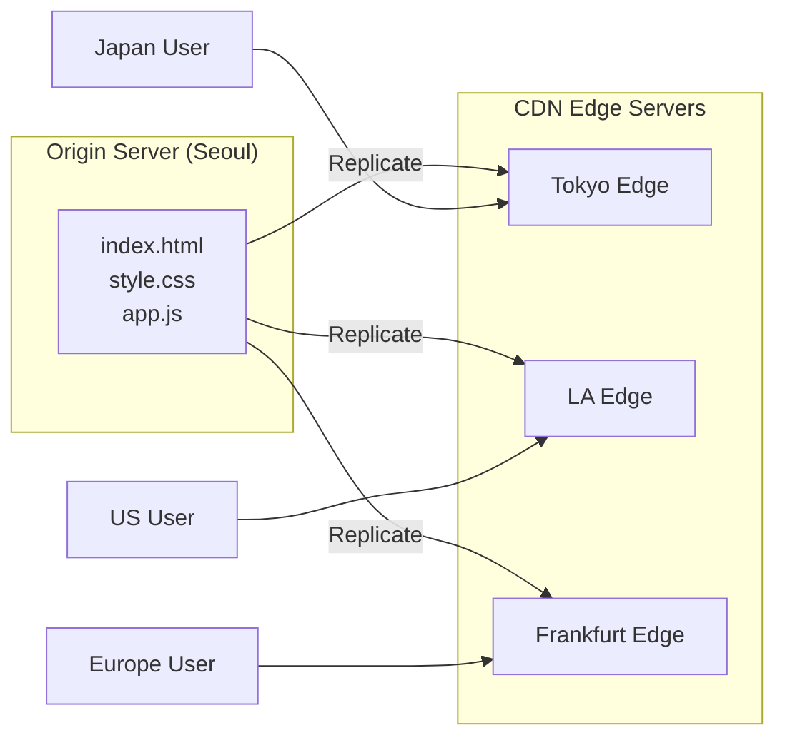
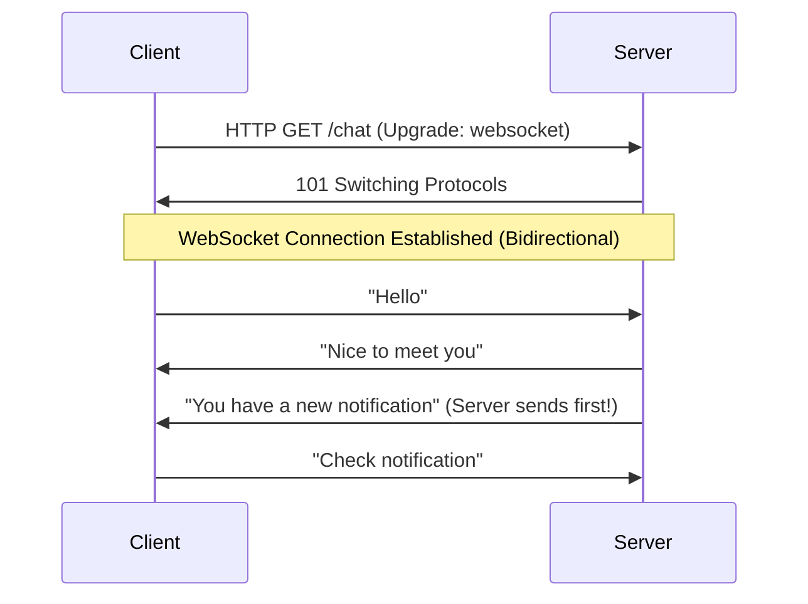
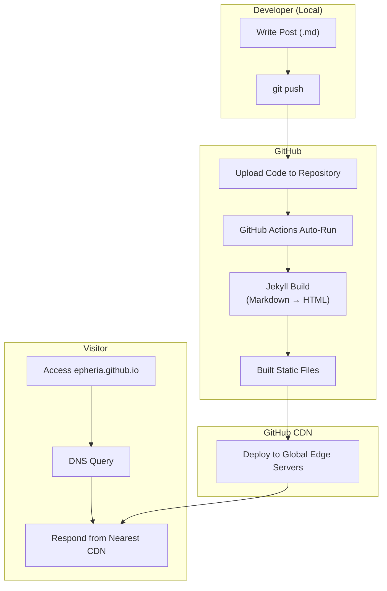
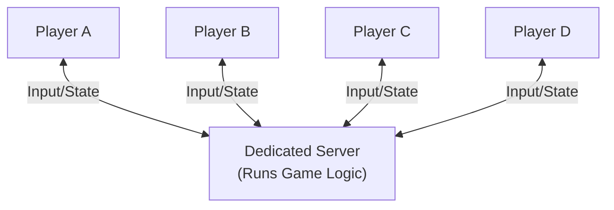
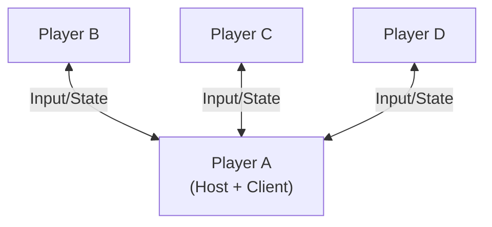
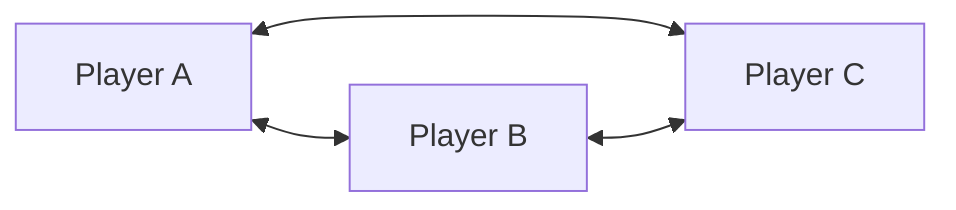
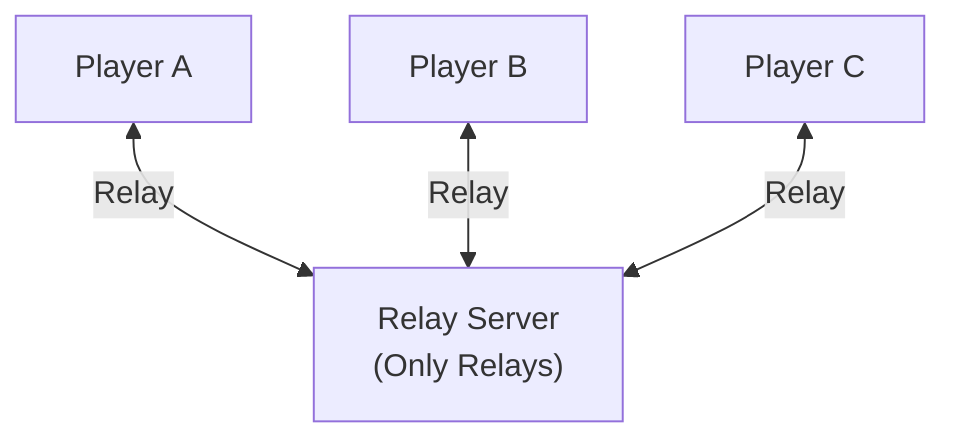
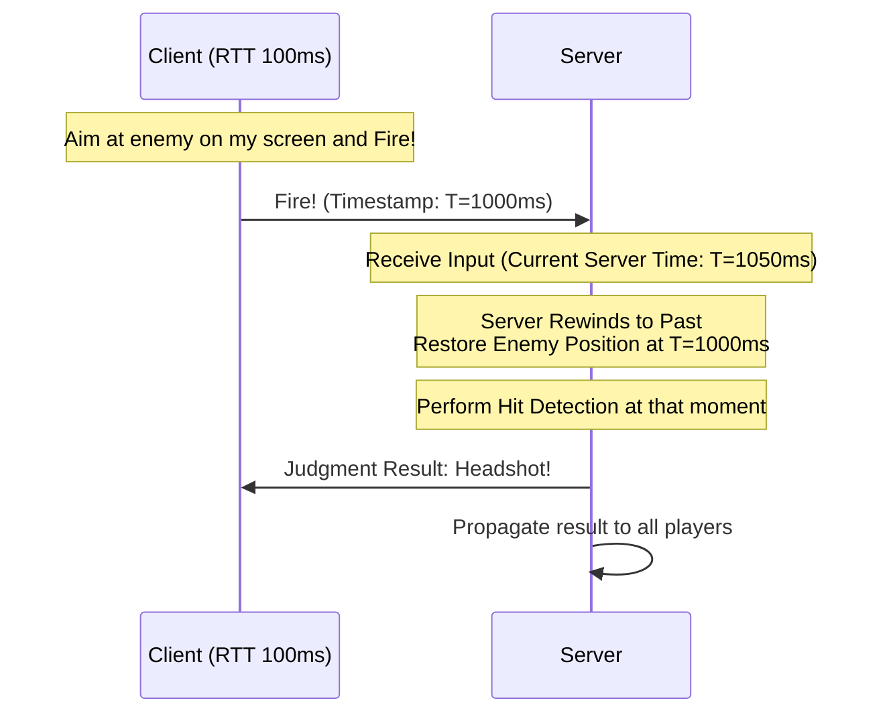
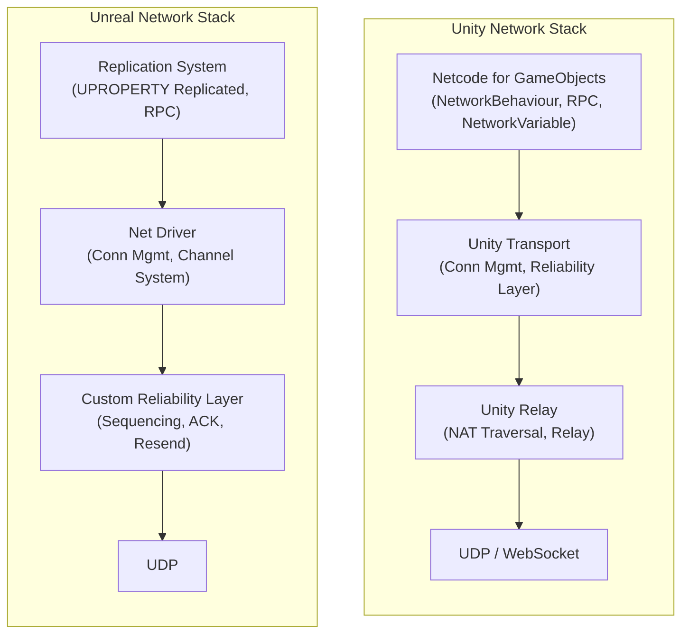
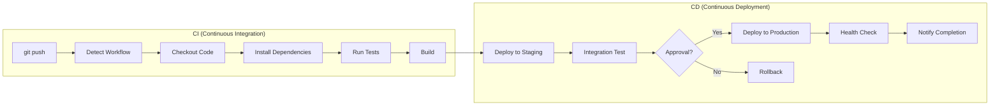

## Introduction

> This document is the 3rd part of the **Internet Infrastructure — A Client Developer's Curiosity** series.

"The Internet runs 24/7 without rest." It feels obvious, but if you step back and think about it, a question arises. **Who is running it?**

Is someone sitting in front of a monitor 24 hours a day? Of course not. What keeps the Internet running non-stop is **programs**. More precisely, it's a `while(true)` loop running endlessly. Just as Unity's `Update()` is called every frame, server programs wait for requests, process them, and respond within an infinite loop.

In Part 1, we looked at **Logical Infrastructure** like DNS, HTTP, and routing — the traffic rules of the digital ocean. In Part 2, we explored **Physical Infrastructure** like submarine cables, data centers, and CDNs — the physical structure of the digital ocean itself.

Now in Part 3, we look at the **Software** actually running on that infrastructure. What types of server programs exist, how game servers differ from web servers, and automation pipelines deploying code to servers — let's draw the full picture of infrastructure software from a client developer's perspective.

---

## Part 1: Comprehensive Guide to Server Types

The word "Server" is both familiar and vague to game developers. Is the server in "Game server is down" the same as the one in "Web server deployed"? In this part, we define the essence of a server and categorize types based on communication patterns.

### Web/Hosting Server (HTTP-based)

The most common server type. Everything that works when you type a URL into a browser falls here.

**Static Hosting: GitHub Pages, Netlify, Vercel**

Servers that deliver pre-built HTML/CSS/JS files as-is. When a request comes, it finds the file in the file system and responds. No logic is executed on the server side.

To use an analogy, it's like a **Vending Machine**. Press a button, and a predetermined drink comes out. You can't ask for a custom drink. But it's fast, stable, and costs almost nothing.

**Dynamic Web Server: Node.js, Django, Spring Boot**

Servers that generate pages on the server side for each request. They query databases and show different content based on user information.

Analogously, it's a **Made-to-Order Restaurant**. Even if you order the same menu, you can customize it like "Make it spicy," "No onions." Instead, it takes cooking time after ordering.

**API Server: REST, GraphQL**

Servers that exchange **data only**, not entire web pages. They respond in JSON format, cleanly separating frontend (client) and backend (server). Mobile apps, SPAs (Single Page Applications), and game clients can all share the same API server.

```
// REST API Example
GET /api/players/12345
→ { "name": "Epheria", "level": 42, "guild": "DevOps Knights" }
```

**CDN (Content Delivery Network)**

A system that places copies of content on edge servers worldwide. Users receive content from the nearest edge server.

For Unity developers, it's like an **Asset Cache Pool**. Just as Addressables loads directly from local if the asset is in the local cache without going to the remote server, CDN doesn't need to go to the origin server if the cache is in a nearby edge server.



### Real-time Server (WebSocket)

HTTP-based servers have a fundamental limitation. **Only the client can send requests; the server cannot send first.** It's like a letter system — you get a reply only if you send a letter. The other party cannot send a letter first.

Think of a chat app. If the other person sent a message, but you don't know until you ask "Any new messages?", it would be inconvenient. **WebSocket** emerged to overcome this limitation.

Once connected, WebSocket allows **bidirectional communication**. It's not a letter system but a **Phone Call**. Once you call, both sides can speak at any time.



**WebSocket Uses:**
- **Chat**: Slack, Discord, KakaoTalk Web
- **Real-time Data**: Stock quotes, sports live scores
- **Collaboration Tools**: Google Docs concurrent editing, Figma real-time collaboration
- **Games**: Web-based games, matchmaking lobbies, real-time scoreboards

The relationship with game development is also important. While full-fledged game servers mostly use custom UDP/TCP, WebSocket is used in matchmaking lobbies or web-based casual games. Unity's Netcode for GameObjects also supports WebSocket transport layer internally.

### How GitHub Pages Works — The Case of This Blog

Theory alone might not give a good sense, so let's look specifically at how **this blog** you are reading right now works.



**Overall Flow:**
1. Developer (Me) writes a post in Markdown and `git push`.
2. Code is uploaded to the GitHub repository.
3. GitHub Actions workflow runs automatically to perform Jekyll build.
4. Built static HTML/CSS/JS files are deployed to GitHub CDN.
5. When a visitor accesses `epheria.github.io`, GitHub CDN responds after DNS query.

**Reality of "Access Rights":**

"Anyone can access my blog" means **GET requests are public**. It's like knocking on an open store door. Anyone can view pages with GET requests, but **writing (push) is only possible for authenticated users**. You cannot modify blog content without authenticating with my GitHub account.

---

## Part 2: Game Server Architecture

If you are a game developer, this part will be the most interesting. Web servers and game servers share the name "server," but their internal workings are completely different. Just like a car and an airplane are both "vehicles" but have completely different engine structures.

### Fundamental Difference Between Game Server vs Web Server

Web servers **Respond only when a Request comes**. It's a "Wait until a guest rings the bell" method. If no one rings, the server waits quietly.

Game servers are different. Even if no one sends input, **they calculate and synchronize the state of all players every frame (16~33ms)**. Enemy AI moves, physics simulation keeps running, projectiles fly. It's a "Track and update every guest's location every moment" method.

| Feature | Web Server | Game Server |
|------|--------|---------|
| Communication | Request-Response | Continuous State Sync |
| Update Cycle | On Request | Every Tick (16~33ms) |
| State Mgmt | Stateless (Mostly) | Stateful (Essential) |
| Latency Sensitivity | Hundreds of ms OK | Tens of ms Critical |
| Protocol | HTTP/HTTPS (TCP) | Custom UDP or TCP |

### 4 Architectures

Server architecture varies by game genre, scale, and requirements. Understanding the pros and cons of each helps you see "why this game chose this method."

#### 1. Dedicated Server

Executes game logic on a separate machine (or cloud instance). All clients connect to this server, and **the server governs the 'truth' of the game**.



- **Representative Games**: Valorant, WoW, Fortnite, CS2
- **Pros**: Strong anti-cheat (Server Authority), fair experience for all players
- **Cons**: High server operation costs, latency based on server location

#### 2. Listen Server

One of the players acts as the **Host**. The host's computer acts as both game server and client, and other players connect to this host.



- **Representative Games**: Co-op Indie Games, Small Scale Multiplayer
- **Pros**: No server cost, relatively simple implementation
- **Cons**: Host Advantage (Host has 0ms latency), session ends if host leaves

#### 3. P2P (Peer-to-Peer)

All players are **directly connected** to each other. No central server; each player's input is sent to all other players.



- **Representative Games**: Fighting Games (Street Fighter 6, Tekken 8)
- **Pros**: Minimum latency (Direct connection), no server cost
- **Cons**: Vulnerable to cheats, connection count increases geometrically with player count (n(n-1)/2)

#### 4. Relay Server

A structure adding a **Relay Server** to the P2P idea. Instead of connecting directly, players go through a relay server. Solves cases where direct connection is impossible due to NAT (Network Address Translation) in home routers.



- **Representative Games/Services**: Unity Relay, Steam Networking
- **Pros**: Easy NAT traversal, simplified infrastructure setup
- **Cons**: Slightly added latency due to relay server detour

#### Architecture Comparison Table

| Architecture | Anti-Cheat | Cost | Scalability | Latency | Examples |
|---------|----------|------|-------|------|---------|
| Dedicated | Best | High | High | Med | Valorant, WoW |
| Listen | Low | None | Low | Med | Co-op Indie |
| P2P | Lowest | None | Lowest | Lowest | Fighting Games |
| Relay | Med | Low | Med | Med | Unity Relay |

> Real commercial games often mix these. For example, matchmaking on a dedicated server, in-game voice chat via P2P.

### Tick Rate and Interpolation

If there is one key metric for game servers, it is **Tick Rate**.

Tick Rate is the **server's `FixedUpdate` cycle**. Just as physics calculations in Unity run at fixed intervals in `FixedUpdate`, game servers simulate game state at fixed intervals.

```
Tick Rate 30  = Update every 33ms   (Casual games, MMOs)
Tick Rate 64  = Update every 15.6ms  (Some competitive FPS)
Tick Rate 128 = Update every 7.8ms   (VALORANT — 128 tick official support)
```

> **Note**: CS2 (Counter-Strike 2) uses a **sub-tick** system instead of a fixed tick rate. Sub-tick sends the exact input time between ticks to the server, implementing precise judgment without relying on tick rate.

Here arises a problem. Client FPS is 60~240, but Server Tick Rate is 30~128. **The client draws the screen more often than the server.** What should the client show until a new state comes from the server?

The answer is **Interpolation**. A technique to smoothly connect between two snapshots received from the server.

```
Server Tick 1: Enemy Pos = (10, 0, 0)
Server Tick 2: Enemy Pos = (12, 0, 0)

Client Frames:
  Frame 1: Interpolate → (10.0, 0, 0)
  Frame 2: Interpolate → (10.5, 0, 0)
  Frame 3: Interpolate → (11.0, 0, 0)
  Frame 4: Interpolate → (11.5, 0, 0)
  Frame 5: Interpolate → (12.0, 0, 0)  ← Next Server Tick Arrives
```

For Unity developers, it's exactly like **blending between animation keyframes**. If the arm is down at keyframe 0 and up at keyframe 30, frames in between are naturally filled by interpolation. In game networking, the client fills between "keyframes (snapshots)" sent by the server with interpolation.

---

## Part 3: Key Techniques of Game Netcode

The speed of light is finite. It takes 100~200ms for a packet to round-trip from Seoul to a US server. This is a law of physics and cannot be reduced by software. Then how can FPS games create a sense of immediate response? The answer is **Software Tricks**.

### Client-Side Prediction

In an FPS game, what if the character moves only after waiting for the server response when you press W? If the Seoul↔US server RTT (Round Trip Time) is 150ms, the character takes a step 0.15 seconds after pressing W. Unplayable.

**Client-Side Prediction** solves this. My character's movement is **executed immediately without waiting for server response**. The client runs physics simulation locally to calculate the predicted position and simultaneously sends input to the server.

```
[Time 0ms] W Key Input → Client: Move forward immediately (Prediction)
                       → Send Input to Server

[Time 75ms] Server: Receive Input, Calculate Movement on Server

[Time 150ms] Server Response Arrives
             → Server Position vs Client Predicted Position
             → If same: OK
             → If different: Smoothly correct (Reconciliation)
```

When the server response arrives, if the prediction was correct, nothing happens. If the prediction was wrong (hit a wall, collided with another player), it **smoothly corrects (Reconciliation)** to the correct position given by the server.

It's similar to predicting and rendering the current frame with previous frame data via temporal reprojection in shader programming — **predicting an unconfirmed future to show it in advance, then correcting it later**.

### Server Authority

"What the server says is the truth." — This is the core of the Server Authority model.

In multiplayer games, the client is **Responsible for Rendering**, and the server is **Responsible for Judgment**. Even if the client sends "I teleported and am inside the enemy base," the server rejects it saying "That's impossible from your previous position."

It's like a **Referee** in sports. No matter how much a player (client) claims "It's a goal!", if the referee (server) rules "Offside," that is final. This structure is the **foundation of Anti-Cheat**.

```
// Principles of Server Authority Model
Client: "Set my HP to 999!" → Server: "Reject. Your HP is 43."
Client: "Teleport!" → Server: "Reject. Impossible movement from previous position."
Client: "Damage 100 to enemy!" → Server: "Check range... Reject. Too far."
```

This is why dedicated servers are strong against cheating. Since all important game judgments (hit detection, damage calculation, item acquisition, etc.) happen on the server, even if the client is hacked, manipulating the server's judgment itself is very difficult. However, the Server Authority model doesn't block all cheats perfectly. Information cheats like wallhacks or input automation like aimbots run on the client side, so separate anti-cheat solutions are needed.

### Lag Compensation

Recall the moment you aimed and shot an enemy in an FPS game. On your screen, it definitely hit the head, but from the server's perspective, that enemy had already moved elsewhere 100ms ago. Because what you saw was the enemy's position 100ms ago.

If left as is, players with high latency would never be able to hit shots. **Lag Compensation** solves this problem.



The server records **past positions of all players for a certain time (History Buffer)**. When a client's fire request arrives, the server **Rewinds** to the past by that client's latency amount and performs hit detection with the enemy position at that moment.

Analogously, it's like **rewinding and playing back to a specific point in a replay system**. "Where was the enemy at the exact moment this player shot?" is checked from past records.

### Rollback Netcode

The **GGPO** (Good Game Peace Out) library, the networking standard for fighting games, popularized this technique.

**Working Principle:**
1. If opponent input hasn't arrived yet, **repeat previous frame's input** to proceed (Prediction).
2. Actual input arrives.
3. If prediction correct: Proceed as is.
4. If prediction wrong: **Rewind to past point (Rollback)** → Resimulate with correct input → Fast forward to present.

```
Frame 1: No opponent input → "Must be standing still" (Prediction)
Frame 2: No opponent input → "Still standing still" (Prediction)
Frame 3: Actual input arrives! "Punched at Frame 1"
→ Rewind to Frame 1
→ Resimulate Frame 1 with Punch input
→ Resimulate Frame 2
→ Fast forward to Frame 3
→ Display only final result on screen
```

Previously, **Delay-based Netcode** was mainstream. Pausing frames and waiting until opponent input arrives. High latency causes perceived input delay, giving a "sluggish" feel.

Rollback Netcode proceeds first and rewinds if wrong, maintaining **immediate responsiveness** even with latency. It's especially suitable for fighting games because it's 1:1, so there's less game state to resimulate. Doing Rewind+Resimulate every time in a Battle Royale with 100 players is unrealistic.

### Unity/Unreal Network Stack

In real game engines, networking is divided into several layers. Each layer handles a specific role.



| Layer | Unity | Unreal | Role |
|------|-------|--------|------|
| Game Logic | Netcode for GameObjects | Replication System | Var Sync, RPC Calls |
| Transport Mgmt | Unity Transport | Net Driver | Conn Estab, Packet Mgmt |
| NAT/Relay | Unity Relay | None (Custom or 3rd party) | Firewall/NAT Traversal |
| Protocol | UDP / WebSocket | UDP | Actual Packet Transmission |

Both engines use UDP as the default protocol. TCP causes latency waiting for retransmission upon packet loss, but UDP ignores lost packets and sends the next one. In games, **current enemy position** is more important than enemy position 2 frames ago.

---

## Part 4: CI/CD — Automation Reaching Servers

We've looked at server types and internal workings of game servers. Finally, let's learn about the **CI/CD Pipeline** — how code written by developers gets deployed to servers worldwide.

### Era of Manual Deployment vs Automated Pipeline

In the old days, deployment was like this:

```
1. Open FTP client and connect to server
2. Manually upload locally built files
3. Connect to server via SSH
4. Manually restart service
5. "Does it work?" Check in browser
6. If not, back to step 1...
```

Doing it manually leads to mistakes. Missing files, wrong settings, forgetting tests. To solve these problems, **CI/CD (Continuous Integration / Continuous Deployment)** pipelines emerged.

### CI/CD Overall Flow



**CI (Continuous Integration):**
1. Developer `git push`
2. Detected by GitHub Actions / Jenkins / GitLab CI, etc.
3. Code Checkout (Clone Repository)
4. Install Dependencies (`npm install`, `bundle install`, etc.)
5. Run Automated Tests (Unit Test, Integration Test)
6. Build (Source Code → Executable Artifact)

**CD (Continuous Deployment):**
7. Deploy to Staging (Test) Server first
8. Integration Test in Staging
9. (Optional) Manager Approval
10. Deploy to Production (Real) Server
11. Health Check — Verify server is running normally
12. Notify Completion (Slack, Email, etc.)

### GitHub Pages CI/CD — This Blog's Case

This blog you are reading is also deployed via CI/CD. Let's see what `.github/workflows/pages-deploy.yml` workflow does:

```
1. Detect push to main branch
2. Checkout repository in Ubuntu environment (fetch-depth: 0)
3. Setup Ruby 3.2 environment
4. bundle install (Install Jekyll and dependencies)
5. Jekyll Build (JEKYLL_ENV=production)
   → Markdown files converted to HTML
6. Deploy built static files to GitHub Pages
```

When I `git push` from my terminal, the updated blog is available worldwide in about 2-3 minutes. Manual work is **zero**. This is the power of CI/CD.

### Comparison with Game Server Deployment

Blogs are done by uploading static files to CDN, but game server deployment is much more complex.

**Cloud Game Server Services:**
- **AWS GameLift**: Amazon's game server hosting
- **Azure PlayFab**: Microsoft's game backend platform
- **Google Agones**: Kubernetes-based game server orchestration

**Auto Scaling:**

Technology that **automatically increases or decreases** server instances based on user count. Like opening more rides when lines get long at a theme park and closing some when lines shorten.

```
Weekday 3 AM: 500 users → 2 server instances
Weekend 8 PM: 50,000 users → 100 server instances (Auto Increase)
New Season Launch: 500,000 users → 1,000 server instances (Auto Increase)
```

This saves costs usually and increases servers only during traffic spikes. Keeping servers at max capacity always would incur hundreds of thousands of dollars in unnecessary costs monthly.

**Region Distribution:**

To provide a good experience to global players, servers must be placed in each region. Like opening chain stores nationwide.

```
US West (Oregon)     — NA Players
Europe (Frankfurt)   — EU Players
Asia (Tokyo/Seoul)   — Asia Players
South America (São Paulo) — SA Players
```

CI/CD pipeline deploys new versions to all these regions **simultaneously**. Servers worldwide are updated with a single `git push` from a developer.

---

## Conclusion

Through this series, we looked at three layers of the Internet.

- **Part 1**: DNS, HTTP, Routing — **Traffic Rules** of the digital ocean (Logical Infrastructure)
- **Part 2**: Submarine Cables, Data Centers, CDN — **Physical Structure** of the digital ocean (Physical Infrastructure)
- **Part 3**: Server, Netcode, CI/CD — **Ships and Automation Systems** sailing on the digital ocean (Software)

### The Cloud is Someone Else's Computer

Contrary to the abstract image the word "Cloud" gives, its reality is **Someone Else's Computer**. AWS, Azure, GCP are all ultimately physical servers in someone's data center. "Uploaded to the cloud" means "Running my program on a computer in Amazon/Microsoft/Google's data center."

And all of this is an **artificial ecosystem 100% dependent on electricity**. Submarine cables, data centers, routers examined in Part 2 — all these physical infrastructures are useless without electricity. If power is cut, the digital ocean evaporates instantly.

### If Everything Stops — A Thought Experiment

Here, let's do a thought experiment as game developers.

**If an apocalyptic event occurs and all power grids collapse?**

The first things to disappear are **Server Processes**. The `while(true)` loops examined in Part 1 — web servers, game servers, API servers — all these programs terminate immediately. All sessions, KV Caches, game states in RAM evaporate simultaneously with power cut. Matchmaking lobbies worldwide become empty in an instant.

Next to collapse is **Network Infrastructure**. 1,900 Anycast instances of 13 DNS root servers from Part 1, EDFA optical amplifiers in submarine cables from Part 2 — all this equipment does not work without power. If DNS dies, domain names lose meaning; if routers die, packets cannot find paths. The network called the Internet itself vanishes.

And here, the **SSD Charge Leakage** covered in Part 2 delivers the final blow.

If data centers are left without power, electrons trapped in SSD floating gates start to escape slowly. TLC SSDs in 1-3 years, QLC in 6 months — data becomes corrupted to an unreadable level. Ironically, much of humanity's latest knowledge — AI model weights, training data, code repositories — is stored on these very SSDs.

| Time Elapsed | What is Lost |
| --- | --- |
| 0 sec | RAM (Server process, Session, KV Cache) |
| Minutes | UPS battery depleted → Data center full shutdown |
| 6mo~1yr | QLC SSD data corruption starts |
| 1~3 yrs | Most TLC SSD data lost |
| 3~10 yrs | MLC/SLC SSD data lost |
| 10yrs+ | HDD magnetic field weakens, only Magnetic Tape survives |

**Fate of AI Models** is particularly interesting. ChatGPT, Claude, Gemini — all these models are programs running on GPU clusters in data centers. Model weights are float arrays of hundreds of GBs to TBs (as covered in [LLM Guide](/posts/llm-guide/)). If power is cut:

1. **Inference**: Immediately impossible. Matrix multiplication cannot be performed without power to GPUs.
2. **Weight Preservation**: Model files (safetensors, GGUF, etc.) stored on SSDs will be damaged by charge leakage within years.
3. **Training Data**: Internet crawl data, papers, code — mostly distributed on SSD/HDD. Fragments will be lost over time.
4. **Re-training Impossible**: Even if hardware is restored, if training data itself disappears, the same model cannot be reproduced.

The human brain is a **biological computer** self-sufficient with just glucose and oxygen. But AI can exist only on the **entire stack of industrial civilization** — semiconductor factories, power plants, submarine cables, cooling systems. No matter how intelligent AI seems, it is a flower blooming on the soil of physical infrastructure. If the soil disappears, the flower withers too.

### A Netrunner's Dream — Can We Excavate the Old Net?

If you played Cyberpunk 2077, you remember the setting where **Netrunners** explore the ruins of the Old Net to excavate lost data. Based on the real network knowledge covered in this series, let's look at how Cyberpunk's Net was designed and if it's possible in reality.

#### How the Internet in Cyberpunk World Was Destroyed

The Net in the Cyberpunk world was originally built on the same physical foundation as the real Internet — wired, wireless, cell networks, microwave transceivers. Just much more expanded than reality, a massive network connecting appliances and cyberware (body implants). Netrunners connected directly to the brain via neural interface plugs with equipment called **Cyberdecks** and experienced the Net as a 3D virtual space.

In 2022, legendary hacker **Rache Bartmoss** released the **R.A.B.I.D.S. virus** into the Net upon his death. This virus infected over 3/4 of the Net in months, virtually destroying the global network. This is the **DataKrash**.

> *"After the DataKrash, only fragments of the global Net could be salvaged — archipelagos of algorithms and code separated by abysses of nothingness."*
> — Cyberpunk RED Lore

Attempts to rebuild the Net failed, and as Rogue AIs threatened the remaining networks, the Net security agency **NetWatch** built the **Blackwall** in 2044. The Blackwall is not a simple firewall but a **powerful AI disguised as ICE (Intrusion Countermeasure Electronics)**. Described in-game as *"a torn trash bag taped over a broken window"*, it's closer to a makeshift measure than a perfect solution.

The Blackwall separates cyberspace into two areas:

| Area | Description |
| --- | --- |
| **Inside Blackwall (Shallow Net)** | Limited network usable by humans. Fragmented into corporate/national intranets. |
| **Outside Blackwall (Old Net/Deep Net)** | Ruins of the Internet before DataKrash. Dangerous zone roamed by Rogue AIs. |

#### Network of 2077 — Air-gapped Physical Servers

In 2077, the "Internet" as we know it does not exist. Instead, a system called **NET Architecture** is used.

The core of NET Architecture is surprisingly directly linked to technologies covered in this series:

- **Physical Server Based**: Each NET Architecture is built on independent physical servers.
- **Air-gapped**: Isolated systems not connected to the global network.
- **Physical Access Essential**: To hack, you must physically infiltrate the building and jack into an Access Point.
- **Hierarchical Structure**: Consists of several "Floors", with files, control nodes, and security ICE placed on each floor.

```
Real Air-gapped System vs Cyberpunk NET Architecture:

Reality (Military/Defense Network):
  Physical Server → External network blocked → USB/Physical access only

Cyberpunk 2077:
  Physical Server → Blocked from beyond Blackwall → Physical access via Jack-in Port
  → Internal visualized as VR virtual space → Netrunner explores "Floors"
```

In other words, what Cyberpunk Netrunners do is **Local Hacking after Physical Infiltration**, not remote hacking. This is essentially the same as attacking air-gapped systems in reality (USB drop, physical access). That's exactly why Netrunners must infiltrate buildings first in the game — because the Internet is gone.

#### Reality's Apocalypse is Harsher than Cyberpunk

Here, an interesting difference is revealed. The way the Internet is destroyed in Cyberpunk vs. Reality is fundamentally different.

| Element | Cyberpunk (Software Destruction) | Reality (Physical Destruction) |
| --- | --- | --- |
| **Cause** | R.A.B.I.D.S. Virus | Power Grid Collapse |
| **Hardware** | Servers Alive (Power maintained) | Servers Stopped |
| **Data** | Floats "like ghosts" in Old Net | Physical extinction via SSD charge leakage |
| **Network** | Contaminated but exists | Completely vanished (Routers, DNS, EDFA all off) |
| **Excavation** | Jack-in to virtual space via Cyberdeck | Physically collecting HDDs from ruins |
| **Hazards** | Rogue AI, Black ICE | Radiation, Building Collapse, No Power |

In Cyberpunk, the virus **contaminated the software**, but hardware and power infrastructure remained alive. So the Old Net "exists" even as ruins, and Netrunners can access it in virtual space. Data remains on servers, and network paths can be traversed (though dangerous).

But if power collapses in reality? **The network doesn't remain as ruins; it completely evaporates.**

- 1,900 DNS root servers covered in Part 1 — All off.
- EDFA optical amplifiers in submarine cables covered in Part 2 — All off.
- `while(true)` server loops covered in this part — All terminated.
- And over time, even stored data physically disappears due to SSD charge leakage covered in Part 2.

Cyberpunk's Old Net is "Ruins you can explore, though dangerous." Reality's Internet is closer to "A mirage whose very existence vanishes."

#### Real-Life Netrunner — Data Scavenger

Then is it completely impossible to revive data from the old Internet in reality? Not necessarily.

**Physically Survivable Data:**

- **HDD**: Recorded via magnetic fields, lasts years~decades without power.
- **Magnetic Tape (LTO)**: Preserved for 30+ years. Offsite backups of national agencies or large corporations are mostly kept on tape in underground facilities.
- **Internet Archive's Wayback Machine**: If snapshots of the Internet are backed up on tape, "Excavating the Old Internet" is literally possible.

But the excavation method is completely different from Cyberpunk Netrunners. Not surfing virtual space, but **physically entering ruined data centers and collecting hard drives**. It's a picture closer to Fallout than Cyberpunk.

```
Cyberpunk Netrunner vs Real-Life "Data Scavenger":

Cyberpunk:   Equip Cyberdeck → Connect Jack-in Port → Enter Old Net Virtual Space
             → Evade Rogue AI → Extract info from data stream

Reality:     Equip Gas Mask → Physically Enter Ruined Data Center → Search Server Racks
             → Physically Collect HDD/Tape → Connect Manual Generator
             → Attempt Data Extraction → Piece together damaged fragments like a puzzle
```

And even if data is revived, recalling the **DNSSEC Key Signing Ceremony** from Part 1 — the Internet's Root of Trust relies on encryption keys stored in HSMs in physical vaults. If these keys are lost, certificate chains must be rebuilt from scratch even if the network is restored. Just as NetWatch had to build a "New Trust System" called Blackwall in Cyberpunk, in reality, trust in the digital world must be rebuilt from scratch.

Maybe this is the most realistic insight the Cyberpunk world shows us — **The Internet is not eternal.** It is a structure built on power, hardware, software, and human consensus — amazingly sophisticated but surprisingly fragile.

### View as a Game Developer

As a client developer, you might not need to know the deep internal workings of servers. But having the **Big Picture** of infrastructure allows you to understand "Why this API is slow," "Why the server team chose this design," "Why deployment takes time."

The Internet we use for granted every day is a sophisticated and massive structure built upon tens of thousands of km of submarine cables, hundreds of thousands of servers, and protocols piled up over decades. And on that structure, we build games.

I hope this series has helped sketch the overall shape of that marvelous structure, even if just a little.

---

## References

- [Valve Developer Wiki - Source Multiplayer Networking](https://developer.valvesoftware.com/wiki/Source_Multiplayer_Networking) — Valve's Netcode Design Docs (CS, TF2, etc.)
- [Gabriel Gambetta - Fast-Paced Multiplayer](https://www.gabrielgambetta.com/client-server-game-architecture.html) — 4-part series visually explaining game netcode techniques
- [GGPO - Good Game Peace Out](https://www.ggpo.net/) — Original library for Rollback Netcode
- [Unity Multiplayer Docs - Netcode for GameObjects](https://docs-multiplayer.unity3d.com/) — Official Unity Multiplayer Documentation
- [Unreal Engine - Networking Overview](https://docs.unrealengine.com/en-US/networking-overview-for-unreal-engine/) — Official Unreal Networking Documentation
- [GitHub Actions Documentation](https://docs.github.com/en/actions) — Official GitHub CI/CD Pipeline Documentation
- [AWS GameLift Documentation](https://docs.aws.amazon.com/gamelift/) — AWS Game Server Hosting Service
