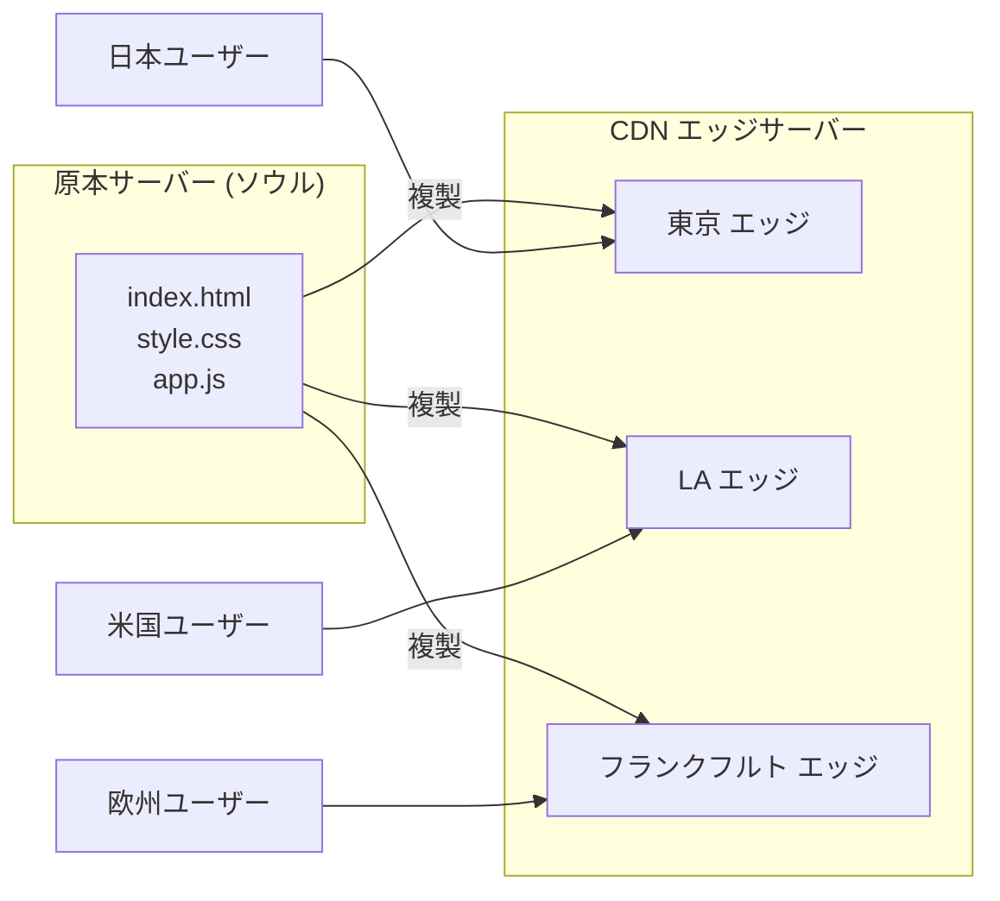
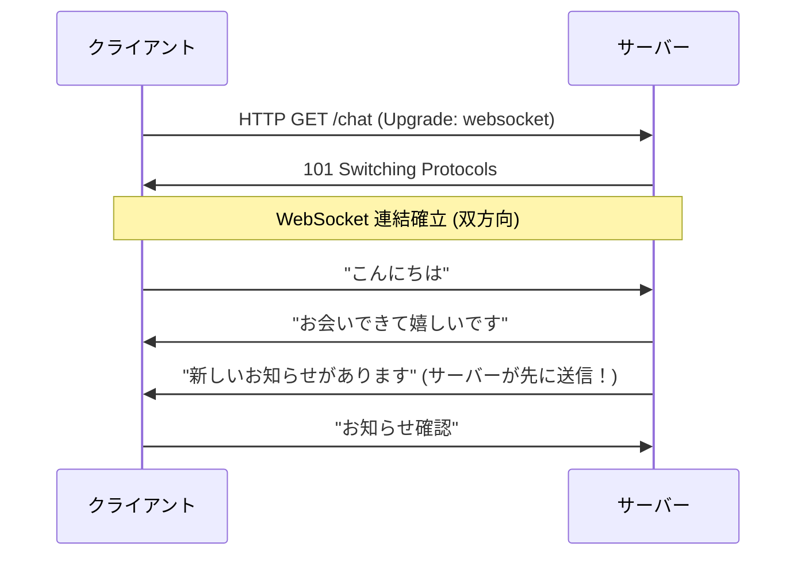
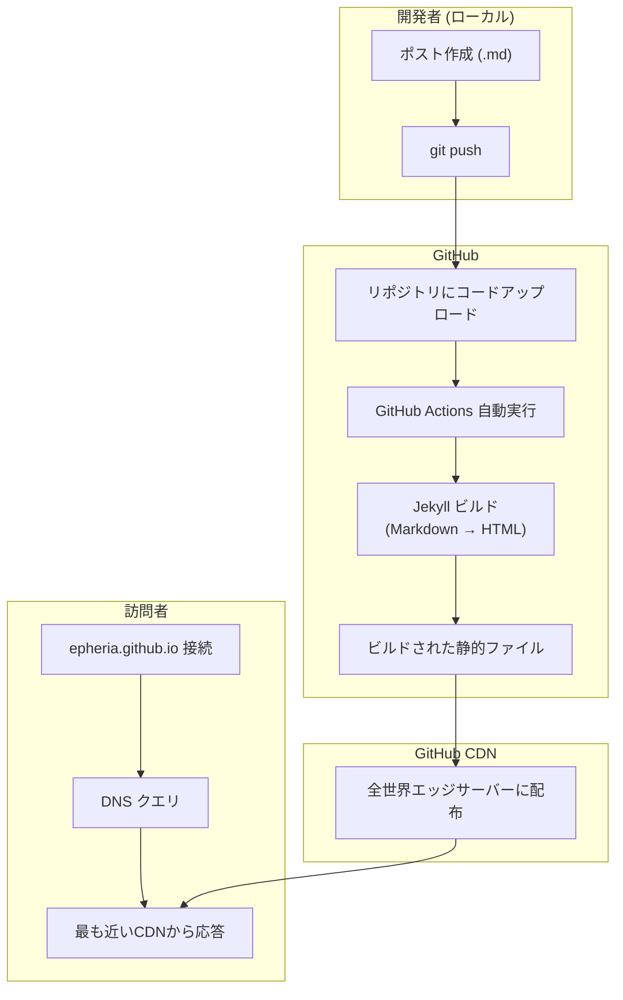
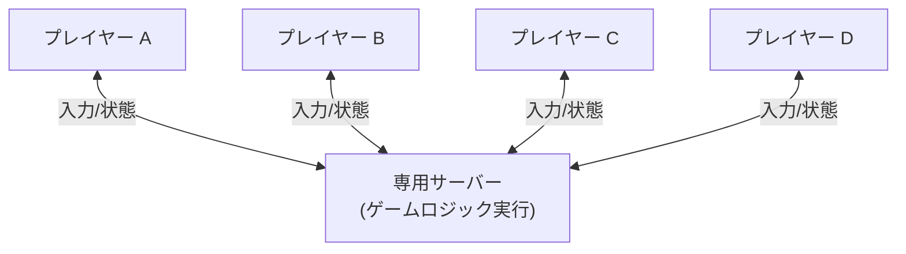
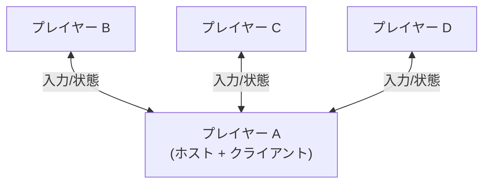
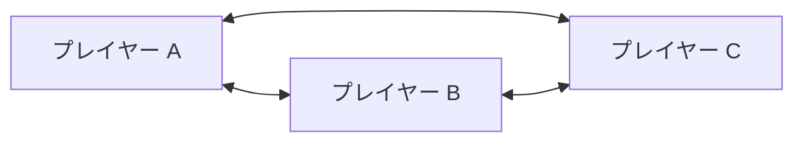
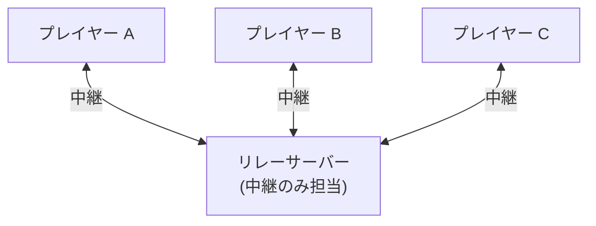
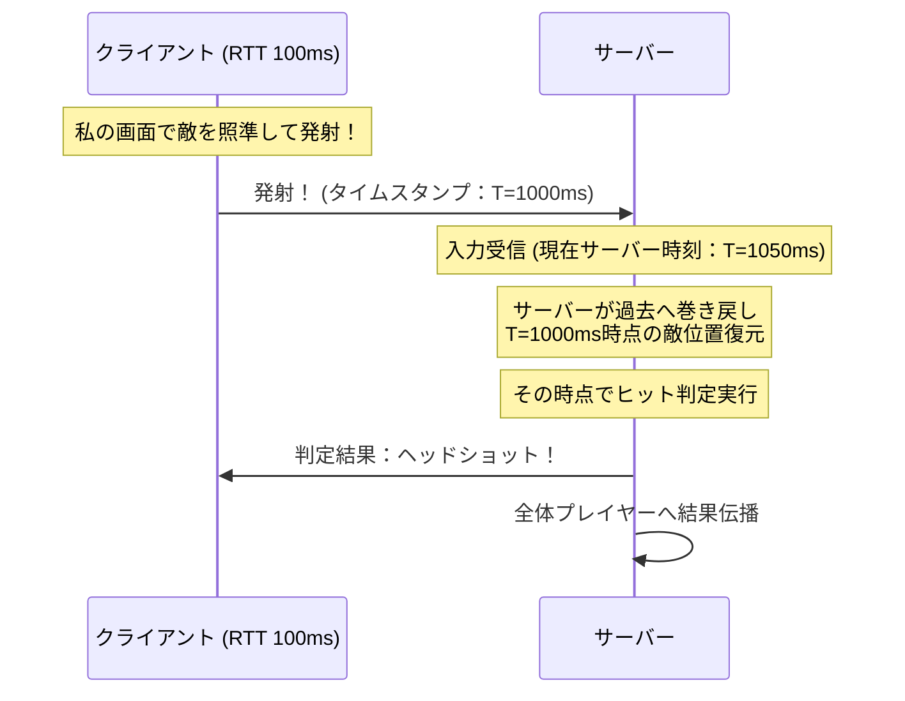
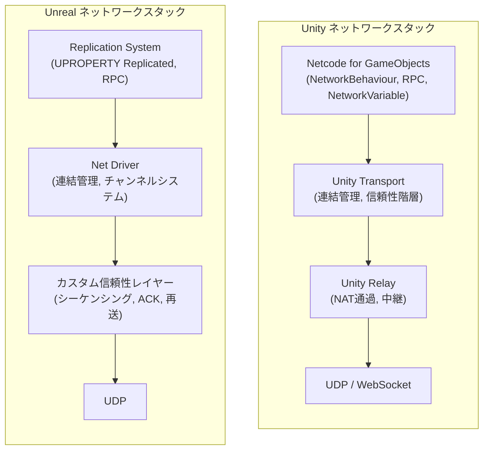
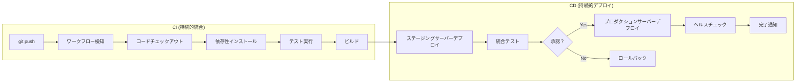

## 序論

> この文書は **インターネットインフラ — クライアント開発者の好奇心** シリーズの第3編です。

「インターネットは24時間365日休まず回る。」当然の話のように感じられますが、一歩下がって考えてみると質問が浮かびます。 **その主体は誰でしょうか？**

人が24時間モニターの前に座っているのでしょうか？もちろん違います。インターネットを休まず回しているのは **プログラム** です。より正確に言えば、絶えず回る `while(true)` ループです。Unityの `Update()` が毎フレーム呼び出されるように、サーバープログラムも無限ループの中でリクエストを待ち、処理し、応答します。

第1編ではDNS、HTTP、ルーティングのような **論理的インフラ** — デジタル海の交通ルールを見てきました。第2編では海底ケーブル、データセンター、CDNのような **物理的インフラ** — デジタル海そのものの物理的構造を探求しました。

さて第3編ではそのインフラの上で実際に動作する **ソフトウェア** を見ていきます。サーバープログラムにはどのような種類があるのか、ゲームサーバーはウェブサーバーと何が違うのか、そしてコードをサーバーにデプロイする自動化パイプラインまで — クライアント開発者の視点でインフラソフトウェアの全体像を描いてみましょう。

---

## Part 1：サーバー類型総整理

「サーバー」という単語はゲーム開発者にとって馴染みがありながらも曖昧です。「ゲームサーバー落ちた」と言う時のサーバーと、「ウェブサーバーデプロイした」と言う時のサーバーは同じものでしょうか？このパートではサーバーの本質を定義し、通信パターンによってどのような類型があるか整理します。

### ウェブ/ホスティングサーバー (HTTPベース)

最も一般的なサーバー類型です。私たちがブラウザにURLを入力すると動作するすべてがここに該当します。

**静的ホスティング：GitHub Pages, Netlify, Vercel**

あらかじめビルドされたHTML/CSS/JSファイルをそのまま伝達するサーバーです。リクエストが来るとファイルシステムで該当ファイルを探して応答します。サーバー側でロジックを実行しません。

例えるなら、 **自動販売機** と同じです。ボタンを押すと決まった飲み物が出てきます。カスタムドリンクを作ってくれと言うことはできません。しかし速く、安定的で、コストがほとんどかかりません。

**動的ウェブサーバー：Node.js, Django, Spring Boot**

リクエストごとにサーバー側でページを生成するサーバーです。データベースを照会し、ユーザー情報によって異なる内容を見せます。

例えるなら、 **注文制作食堂** です。同じメニューを頼んでも「辛くしてください」「玉ねぎ抜いてください」のようなカスタマイズが可能です。代わりに注文後調理時間が必要です。

**APIサーバー：REST, GraphQL**

ウェブページ全体ではなく **データのみ** やり取りするサーバーです。JSON形式で応答し、フロントエンド（クライアント）とバックエンド（サーバー）を綺麗に分離します。モバイルアプリ、SPA (Single Page Application)、ゲームクライアントすべて同じAPIサーバーを共有できます。

```
// REST API 例
GET /api/players/12345
→ { "name": "Epheria", "level": 42, "guild": "DevOps Knights" }
```

**CDN (Content Delivery Network)**

全世界のエッジサーバーにコンテンツのコピーを配置するシステムです。ユーザーは最も近いエッジサーバーからコンテンツを受け取ります。

Unity開発者に馴染みのある比喩で、 **アセットキャッシュプール** と同じです。Addressablesでローカルキャッシュにアセットがあればリモートサーバーまで行く必要なくローカルですぐロードするように、CDNも近いエッジサーバーにキャッシュがあれば原本サーバーまで行く必要がありません。



### リアルタイムサーバー (WebSocket)

HTTPベースサーバーには根本的な限界があります。 **クライアントだけがリクエストを送ることができ、サーバーは先に送れない** ということです。まるで手紙システムのようです — 手紙を送ってこそ返事が来ます。相手が先に手紙を送ってくれることはできません。

チャットアプリを考えてみましょう。相手がメッセージを送ったのに、私が「新しいメッセージある？」と聞く前まで知らなければ不便でしょう。このような限界を克服するために **WebSocket** が登場しました。

WebSocketは一度連結すれば **双方向通信** が可能です。手紙システムではなく **電話通話** です。一度電話をかければ両方ともいつでも話せます。



**WebSocket 使用先：**
- **チャット**：Slack, Discord, カカオトークウェブ
- **リアルタイムデータ**：株式相場, スポーツライブスコア
- **協業ツール**：Google Docs 同時編集, Figma リアルタイム共同作業
- **ゲーム**：ウェブベースゲーム, マッチメイキングロビー, リアルタイムスコアボード

ゲーム開発との関係も重要です。本格的なゲームサーバーは大部分カスタムUDP/TCPを使用しますが、マッチメイキングロビーやウェブベースカジュアルゲームではWebSocketを活用します。UnityのNetcode for GameObjectsも内部的にWebSocket伝送階層をサポートします。

### GitHub Pages 動作原理 — このブログの事例

理論だけでは感覚が掴みにくいかもしれないので、今皆さんが読んでいる **このブログ** がどのように動作するのか具体的に見てみましょう。



**全体フロー：**
1. 開発者（私）がMarkdownでポストを作成し `git push`
2. GitHubリポジトリにコードがアップロードされる
3. GitHub Actionsワークフローが自動的に実行されJekyllビルド実行
4. ビルドされた静的HTML/CSS/JSファイルがGitHub CDNに配布される
5. 訪問者が `epheria.github.io` に接続するとDNSクエリ後GitHub CDNが応答

**「アクセス権限」の実体：**

「誰でも私のブログに接続できる」というのは **GETリクエストが公開** されているという意味です。公開された店のドアを叩けば開けてくれるのと同じです。誰でもGETリクエストでページを見ることができますが、 **書き込み(push)は認証されたユーザーのみ** 可能です。私のGitHubアカウントで認証しなければブログ内容を修正できません。

---

## Part 2：ゲームサーバーアーキテクチャ

ゲーム開発者ならこのパートが最も興味深いでしょう。ウェブサーバーとゲームサーバーは同じ「サーバー」という名前を共有しますが、内部動作方式は完全に異なります。まるで自動車と飛行機が同じ「乗り物」ですがエンジン構造が全く異なるように。

### ゲームサーバー vs ウェブサーバーの根本的違い

ウェブサーバーは **リクエスト(Request)が来る時だけ応答(Response)** します。「お客さんがベルを押せば出て行って応対する」方式です。誰もベルを押さなければサーバーは静かに待機します。

ゲームサーバーは違います。誰も入力を送らなくても、 **毎フレーム(16〜33ms)ごとにすべてのプレイヤーの状態を計算して同期** します。敵NPCはAIに従って動き、物理シミュレーションは回り続け、投射体は飛びます。「毎瞬間すべてのお客さんの位置を把握してアップデートする」方式です。

| 特性 | ウェブサーバー | ゲームサーバー |
|------|--------|---------|
| 通信パターン | リクエスト-応答 | 持続的状態同期 |
| アップデート周期 | リクエスト時 | 毎Tick (16〜33ms) |
| 状態管理 | Stateless (大部分) | Stateful (必須) |
| 遅延敏感度 | 数百ms許容 | 数十msが致命的 |
| プロトコル | HTTP/HTTPS (TCP) | カスタムUDPまたはTCP |

### 4つのアーキテクチャ

ゲームのジャンル、規模、要件によってサーバーアーキテクチャが変わります。それぞれの長所と短所を理解すれば、「このゲームはなぜこの方式を選択したのか」が見え始めます。

#### 1. 専用サーバー (Dedicated Server)

別のマシン（またはクラウドインスタンス）でゲームロジックを実行します。すべてのクライアントがこのサーバーに接続し、 **サーバーがゲームの「真実」を管掌** します。



- **代表ゲーム**：Valorant, WoW, Fortnite, CS2
- **長所**：強力なチート防止（サーバー権威）、すべてのプレイヤーに公平な経験
- **短所**：サーバー運営コストが高い、サーバー位置によるレイテンシ発生

#### 2. リッスンサーバー (Listen Server)

プレイヤーのうち一人が **ホスト** の役割を兼ねます。ホストのコンピュータがゲームサーバーでありクライアントとして動作し、残りのプレイヤーがこのホストに接続します。



- **代表ゲーム**：Co-opインディゲーム、小規模マルチプレイヤー
- **長所**：サーバーコストなし、実装が相対的に簡単
- **短所**：ホストに有利（Host Advantage — ホストはレイテンシ0ms）、ホストが離脱するとセッション終了

#### 3. P2P (Peer-to-Peer)

すべてのプレイヤーが互いに **直接連結** されます。中央サーバーがなく、各プレイヤーの入力が他のすべてのプレイヤーに伝達されます。



- **代表ゲーム**：格闘ゲーム（ストリートファイター6、鉄拳8）
- **長所**：最小遅延（直接連結）、サーバーコスト不要
- **短所**：チートに脆弱、プレイヤー数が増えると連結数が幾何級数的に増加 (n(n-1)/2)

#### 4. リレーサーバー (Relay Server)

P2Pのアイデアに **中継サーバー** を追加した構造です。プレイヤー同士直接連結する代わりに、リレーサーバーを経由します。家庭用ルーターのNAT (Network Address Translation) のため直接連結が不可能な場合を解決します。



- **代表ゲーム/サービス**：Unity Relay, Steam Networking
- **長所**：NAT越えが容易、インフラ構築簡素化
- **短所**：リレーサーバーを経由するため直接連結より遅延が若干追加

#### アーキテクチャ比較テーブル

| アーキテクチャ | チート防止 | コスト | 拡張性 | 遅延 | 代表ゲーム |
|---------|----------|------|-------|------|---------|
| 専用 | 最高 | 高い | 高い | 中間 | Valorant, WoW |
| リッスン | 低い | なし | 低い | 中間 | Co-opインディ |
| P2P | 最低 | なし | 最低 | 最低 | 格闘ゲーム |
| リレー | 中間 | 低い | 中間 | 中間 | Unity Relay |

> 実際の商用ゲームはこれらを混合して使用することもあります。例えば、マッチメイキングは専用サーバーで、インゲームボイスチャットはP2Pで処理するといった具合です。

### Tick Rateと補間 (Interpolation)

ゲームサーバーの核心指標が一つあるとすれば、まさに **Tick Rate** です。

Tick Rateは **サーバーの `FixedUpdate` 周期** です。Unityで物理演算が `FixedUpdate` で固定間隔で実行されるように、ゲームサーバーも固定間隔でゲーム状態をシミュレーションします。

```
Tick Rate 30  = 33msごとにアップデート   (カジュアルゲーム, MMO)
Tick Rate 64  = 15.6msごとにアップデート  (一部競争FPS)
Tick Rate 128 = 7.8msごとにアップデート   (VALORANT — 128 tick公式サポート)
```

> **参考**：CS2 (Counter-Strike 2) は固定されたtick rateの代わりに **sub-tick** システムを使用します。sub-tickはtick間の正確な入力時点をサーバーに伝達し、tick rateに依存せずに精密な判定を実装する方式です。

ここで問題が生じます。クライアントのFPSは60〜240ですが、サーバーのTick Rateは30〜128です。 **クライアントがサーバーより頻繁に画面を描画します。** サーバーから新しい状態が来るまでクライアントは何を見せるべきでしょうか？

正解は **補間 (Interpolation)** です。サーバーから受け取った2つのスナップショットの間を滑らかに繋ぐ技法です。

```
サーバー Tick 1：敵位置 = (10, 0, 0)
サーバー Tick 2：敵位置 = (12, 0, 0)

クライアントフレーム：
  フレーム 1：補間 → (10.0, 0, 0)
  フレーム 2：補間 → (10.5, 0, 0)
  フレーム 3：補間 → (11.0, 0, 0)
  フレーム 4：補間 → (11.5, 0, 0)
  フレーム 5：補間 → (12.0, 0, 0)  ← 次のサーバーTick到着
```

Unity開発者に馴染みのある比喩で、 **アニメーションのキーフレーム間をブレンディング** することと正確に同じです。キーフレーム0で腕が下がっていてキーフレーム30で腕が上がっていれば、その間のフレームは補間で自然に満たされます。ゲームネットワーキングでもサーバーが送る「キーフレーム（スナップショット）」間をクライアントが補間で埋めます。

---

## Part 3：ゲームネットコードの核心技法

光の速度は有限です。ソウルから米国サーバーまでパケットが往復するのに100〜200msかかります。これは物理法則なのでソフトウェアで減らすことはできません。それならどうやってFPSゲームで即刻的な反応感を作り出せるのでしょうか？正解は **ソフトウェア的トリック** です。

### クライアント予測 (Client-Side Prediction)

FPSゲームでWキーを押した時、サーバー応答を待ってからキャラクターが動くとしたらどうでしょうか？ソウル↔米国サーバーRTT (Round Trip Time) が150msなら、Wキーを押して0.15秒後にようやくキャラクターが一歩踏み出します。プレイ不可能です。

**クライアント予測** はこの問題を解決します。自分のキャラクターの動きは **サーバー応答を待たずに即時実行** します。クライアントがローカルで物理シミュレーションを回して予測位置を計算し、同時にサーバーにも入力を伝送します。

```
[時間 0ms] Wキー入力 → クライアント：即時前に移動 (予測)
                     → サーバーへ入力伝送

[時間 75ms] サーバー：入力受信、サーバー側で移動計算

[時間 150ms] サーバー応答到着
             → サーバーが言った位置 vs クライアントが予測した位置
             → 同じなら：OK
             → 違えば：スムーズに補正 (Reconciliation)
```

サーバー応答が到着した時、予測が合っていれば何も起きません。予測が間違っていれば（壁にぶつかったり、他のプレイヤーと衝突したり）サーバーが教えた正しい位置へ **スムーズに補正 (Reconciliation)** します。

シェーダープログラミングでフレーム補間 (temporal reprojection) を通じて以前のフレームデータで現在のフレームを予測レンダリングするのと似た発想です — **まだ確定していない未来を予測して先に見せて、後で補正すること** ですね。

### サーバー権威 (Server Authority)

「サーバーが言ったことが真実だ。」 — これがサーバー権威モデルの核心です。

マルチプレイヤーゲームでクライアントは **レンダリング担当**、サーバーは **判定担当** です。クライアントが「私テレポートして敵基地の中にいるよ」とサーバーに送っても、サーバーは「君の以前の位置からそれは不可能だ」と拒否します。

スポーツでの **審判** と同じです。選手（クライアント）がいくら「ゴールですよ！」と抗議しても、審判（サーバー）が「オフサイド」と判定すればそれが最終です。この構造が **アンチチートの基盤** です。

```
// サーバー権威モデルの原則
クライアント：「私の体力999に設定！」→ サーバー：「拒否。君の体力は43だよ。」
クライアント：「瞬間移動！」→ サーバー：「拒否。以前の位置から不可能な移動だよ。」
クライアント：「敵にダメージ100！」→ サーバー：「射程確認...拒否。遠すぎる。」
```

専用サーバーがチート防止に強い理由がまさにこれです。ゲームのすべての重要な判定（ヒット判定、ダメージ計算、アイテム獲得など）がサーバーで行われるため、クライアントをハッキングしてもサーバーの判定自体を操作することは非常に難しいです。ただしサーバー権威モデルがすべてのチートを完璧に防ぐわけではありません。ウォールハック (wallhack) のような情報型チートやエイムボットのような入力自動化はクライアント側で動作するため、別途のアンチチートソリューションが必要です。

### 遅延補償 (Lag Compensation)

FPSゲームで敵を照準して撃った瞬間を思い出してみましょう。私の画面では確かに頭に当たったのに、サーバーの立場でその敵はすでに100ms前に他の場所に移動した状態です。私が見たのは100ms前の敵の位置だからです。

このままだとレイテンシが高いプレイヤーは永遠に銃を当てられなくなります。 **遅延補償** はこの問題を解決します。



サーバーはすべてのプレイヤーの **過去位置を一定時間記録 (ヒストリーバッファ)** しています。クライアントの発射リクエストが到着すると、サーバーは該当クライアントのレイテンシだけ **過去へ巻き戻し (Rewind)** してその時点の敵位置でヒット判定を実行します。

例えるなら、ゲーム内 **リプレイシステムで特定時点へ巻き戻し再生** することと同じです。「このプレイヤーが銃を撃ったその瞬間、敵はどこにいたのか」を過去記録から確認するのです。

### ロールバックネットコード (Rollback Netcode)

格闘ゲームのネットワーキング標準である **GGPO** (Good Game Peace Out) ライブラリがこの技法を大衆化させました。

**動作原理：**
1. 相手の入力がまだ到着していなければ、 **以前のフレームの入力を繰り返して** ゲームを進行 (予測)
2. 実際の入力が到着
3. 予測が合っていれば：そのまま進行
4. 予測が間違っていれば： **過去時点へ巻き戻し (Rollback)** → 正しい入力で再シミュレーション → 現在まで早送り

```
フレーム 1：相手入力なし → 「じっと立っているだろう」 (予測)
フレーム 2：相手入力なし → 「ずっと立っているだろう」 (予測)
フレーム 3：実際入力到着！「フレーム1でパンチを放った」
→ フレーム1へ巻き戻し
→ パンチ入力でフレーム1 再シミュレーション
→ フレーム2 再シミュレーション
→ フレーム3まで早送り
→ 画面には最終結果のみ表示
```

以前は **ディレイベースネットコード** が主流でした。相手入力が到着するまでフレームを止めて待つ方式ですね。レイテンシが高いと入力遅延が体感され「鈍い」感じを与えます。

ロールバックネットコードはとりあえず進行して間違っていれば巻き戻すため、レイテンシがあっても **即刻的な反応感** を維持します。格闘ゲームに特に適している理由は、1:1対戦なので再シミュレーションすべきゲーム状態が少ないためです。100人が戦うバトルロイヤルで毎回巻き戻し+再シミュレーションをすることは非現実的です。

### Unity/Unreal ネットワークスタック

実際のゲームエンジンでネットワーキングは複数の階層に分かれています。各階層が特定の役割を担当します。



| 階層 | Unity | Unreal | 役割 |
|------|-------|--------|------|
| ゲームロジック | Netcode for GameObjects | Replication System | 変数同期, RPC呼び出し |
| 伝送管理 | Unity Transport | Net Driver | 連結確立, パケット管理 |
| NAT/リレー | Unity Relay | なし (直接実装またはサードパーティ) | ファイアウォール/NAT通過 |
| プロトコル | UDP / WebSocket | UDP | 実際パケット伝送 |

両エンジンともUDPを基本プロトコルとして使用します。TCPはパケット損失時に再送を待つため遅延が発生しますが、UDPは損失したパケットを無視して次のパケットを送ります。ゲームでは2フレーム前の敵位置より **今現在の敵位置** が重要だからです。

---

## Part 4：CI/CD — コードがサーバーに到達する自動化

これまでサーバーの種類とゲームサーバーの内部動作を見てきました。最後に、開発者が作成したコードがどのように全世界のサーバーにデプロイされるのか — **CI/CDパイプライン** を見てみましょう。

### 手動デプロイの時代 vs 自動化パイプライン

昔はデプロイがこうでした：

```
1. FTPクライアントを開いてサーバーに接続
2. ローカルでビルドしたファイルを手動でアップロード
3. SSHでサーバーに接続
4. 手動でサービス再起動
5. 「うまくいったかな？」ブラウザで確認
6. ダメならまた1番へ...
```

人が直接やるのでミスが発生します。ファイルを忘れたり、設定を間違えて変えたり、テストを忘れたり。このような問題を解決するために **CI/CD (Continuous Integration / Continuous Deployment)** パイプラインが登場しました。

### CI/CD 全体フロー



**CI (Continuous Integration) — 持続的統合：**
1. 開発者が `git push`
2. GitHub Actions / Jenkins / GitLab CI などが検知
3. コードチェックアウト (リポジトリ複製)
4. 依存性インストール (`npm install`, `bundle install` など)
5. 自動テスト実行 (ユニットテスト, 統合テスト)
6. ビルド (ソースコード → 実行可能なアーティファクト)

**CD (Continuous Deployment) — 持続的デプロイ：**
7. ステージング（テスト）サーバーに先にデプロイ
8. ステージングで統合テスト
9. (必要時) 管理者承認
10. プロダクション（実際）サーバーにデプロイ
11. ヘルスチェック — サーバーが正常動作するか確認
12. 完了通知 (Slack, Email など)

### GitHub PagesのCI/CD — このブログの事例

今読んでいるこのブログもCI/CDでデプロイされます。 `.github/workflows/pages-deploy.yml` ワークフローがすることをみてみましょう：

```
1. main ブランチに push 検知
2. Ubuntu 環境でリポジトリチェックアウト (fetch-depth: 0)
3. Ruby 3.2 環境設定
4. bundle install (Jekyllと依存性インストール)
5. Jekyll ビルド (JEKYLL_ENV=production)
   → Markdown ファイルたちが HTML に変換される
6. ビルドされた静的ファイルを GitHub Pages にデプロイ
```

私がターミナルで `git push` をすれば、約2〜3分後に全世界どこでもアップデートされたブログを見ることができます。手動作業は **0** です。これがCI/CDの力です。

### ゲームサーバーデプロイとの比較

ブログは静的ファイルをCDNに上げれば終わりですが、ゲームサーバーデプロイはずっと複雑です。

**クラウドゲームサーバーサービス：**
- **AWS GameLift**：Amazonのゲームサーバーホスティング
- **Azure PlayFab**：Microsoftのゲームバックエンドプラットフォーム
- **Google Agones**：Kubernetesベースのゲームサーバーオーケストレーション

**Auto Scaling — 自動拡張：**

接続者数によってサーバーインスタンスを **自動的に増やしたり減らしたりする** 技術です。遊園地で行列が長くなれば追加のアトラクションを開場し、行列が減れば一部を閉めるのと同じです。

```
平日明け方3時：接続者500人 → サーバーインスタンス2個
週末夕方8時：接続者50,000人 → サーバーインスタンス100個 (自動増加)
新シーズン開始：接続者500,000人 → サーバーインスタンス1,000個 (自動増加)
```

こうすれば普段はコストを節約し、接続爆発時にのみサーバーを増やせます。もしサーバーを常に最大値で維持すれば毎月数億ウォンの不必要なコストが発生します。

**リージョン分散配置：**

全世界のプレイヤーに良い経験を提供するには、各地域にサーバーを配置しなければなりません。全国にチェーン店を開くようなものです。

```
米国西部 (Oregon)     — 北米プレイヤー
欧州 (Frankfurt)      — 欧州プレイヤー
アジア (Tokyo/Seoul)   — アジアプレイヤー
南米 (São Paulo)      — 南米プレイヤー
```

CI/CDパイプラインがこれらすべてのリージョンに **同時に** 新バージョンをデプロイします。開発者の `git push` 一回で全世界のサーバーがアップデートされます。

---

## 結論

このシリーズを通じてインターネットの3つの層を見てきました。

- **第1編**：DNS、HTTP、ルーティング — デジタル海の **交通ルール** (論理的インフラ)
- **第2編**：海底ケーブル、データセンター、CDN — デジタル海の **物理的構造** (物理的インフラ)
- **第3編**：サーバー、ネットコード、CI/CD — デジタル海の上を航海する **船舶と自動化システム** (ソフトウェア)

### クラウドは他人のコンピュータだ

「クラウド」という単語が与える抽象的なイメージとは異なり、その実体は **他人のコンピュータ** です。AWS、Azure、GCPすべて結局誰かのデータセンターにある物理的サーバーです。「クラウドに上げた」という言葉は「Amazon/Microsoft/Googleのデータセンターにあるコンピュータで私のプログラムを回している」という意味です。

そしてこれらすべては **電力に100%依存する人工生態系** です。第2編で見た海底ケーブル、データセンター、ルーター — これらすべての物理的インフラは電気がなければ無用の長物です。電気が切れればデジタル海は即座に蒸発します。

### もしすべてが止まったら — 思考実験

ここでゲーム開発者らしく一つの思考実験をしてみましょう。

**地球終末級アポカリプスが発生し、すべての電力グリッドが崩壊したら？**

最も先に消えるのは **サーバープロセス** です。この記事Part 1で見た `while(true)` ループたち — ウェブサーバー、ゲームサーバー、APIサーバー — これらすべてのプログラムが即時終了します。RAMに上がっていたすべてのセッション、KV Cache、ゲーム状態が電源遮断と同時に蒸発します。全世界のマッチメイキングロビーが一瞬で空になるのです。

次に崩れるのは **ネットワークインフラ** です。第1編で扱ったDNSルートサーバー13個のAnycastインスタンス1,900台、第2編で扱った海底ケーブルのEDFA光増幅器 — これらすべての装備が電力なしでは動作しません。DNSが死ねばドメイン名は意味を失い、ルーターが死ねばパケットは経路を見つけられません。インターネットというネットワーク自体が消滅します。

そしてここで第2編で扱った **SSDの電荷漏出** が決定打を放ちます。

データセンターの電源が切れたまま放置されれば、SSDのフローティングゲートに閉じ込められた電子たちが徐々に脱出し始めます。TLC SSDは1〜3年、QLCは6ヶ月でデータが読めないレベルに損傷します。皮肉にも、人類の最新知識 — AIモデルの重み、学習データ、コードリポジトリ — の相当数がまさにこのSSDの上に保存されています。

| 時間経過 | 損失するもの |
| --- | --- |
| 0秒 | RAM (サーバープロセス, セッション, KV Cache) |
| 数分 | UPSバッテリー消耗 → データセンター完全シャットダウン |
| 6ヶ月〜1年 | QLC SSDデータ損傷開始 |
| 1〜3年 | TLC SSDデータ大部分消失 |
| 3〜10年 | MLC/SLC SSDデータ消失 |
| 10年+ | HDD磁場弱化開始, 磁気テープのみ生存 |

**AIモデルの運命** は特に興味深いです。ChatGPT、Claude、Gemini — これらすべてのモデルはデータセンターのGPUクラスター上で回るプログラムです。モデルの重みは数百GB〜数TBのfloat配列です（[LLMガイド](/posts/llm-guide/)で扱ったように）。電力が切れれば：

1. **推論 (Inference)**：即時不可能。GPUに電源がなければ行列乗算を実行できません。
2. **重み保存**：SSDに保存されたモデルファイル(safetensors, GGUFなど)は数年内に電荷漏出で損傷します。
3. **学習データ**：インターネットクロールデータ、論文、コード — 大部分SSD/HDDに分散保存。時間が経てばバラバラに消失します。
4. **再学習不可**：たとえハードウェアを復旧しても、学習データ自体が消えれば同じモデルを再現できません。

人間の脳はブドウ糖と酸素さえあれば自給自足する **生物学的コンピュータ** です。しかしAIは半導体工場、発電所、海底ケーブル、冷却システムという **産業文明の全体スタック** の上でのみ存在できます。AIがいくら知能的に見えても、それは物理的インフラという土壌の上に咲いた花です。土壌が消えれば花も共に枯れます。

### ネットランナーの夢 — 旧インターネットを発掘できるだろうか？

サイバーパンク2077をプレイした方なら、 **ネットランナー** がオールドネット (Old Net) の廃墟を探検して失われたデータを発掘する設定を覚えているでしょう。このシリーズで扱った実際のネットワーク知識を基に、サイバーパンクのネットがどのように設計されたのか、そしてそれが現実で可能なのか見てみましょう。

#### サイバーパンク世界のインターネットはどう破壊されたか

サイバーパンク世界のネットはもともと現実のインターネットと同一の物理的基盤の上に建てられていました — 有線、無線、セルネットワーク、マイクロ波送受信機。ただ現実よりはるかに拡張され家電製品とサイバーウェア（人体インプラント）まで連結された巨大なネットワークでした。ネットランナーは **サイバーデッキ (Cyberdeck)** という装備で神経インターフェースプラグを通じて脳に直接連結し、ネットを3D仮想空間として体験しました。

2022年、伝説的ハッカー **ラチェ・バートモス (Rache Bartmoss)** が自身の死に合わせて **R.A.B.I.D.S. ウイルス** をネットに解き放ちます。このウイルスは数ヶ月でネットの3/4以上を感染させ、グローバルネットワークを事実上破壊しました。これが **データクラッシュ (DataKrash)** です。

> *"データクラッシュ以後、全世界ネットの破片だけがかろうじて収拾された — 無の深淵に分かれたアルゴリズムとコードの群島。"*
> — Cyberpunk RED 世界観設定

ネットを再建しようとする試みが失敗し、暴走AI (Rogue AI) たちが残ったネットワークを脅かすと、ネットセキュリティ機関 **ネットウォッチ (NetWatch)** が2044年に **ブラックウォール (Blackwall)** を構築します。ブラックウォールの正体は単純なファイアウォールではなく **ICE (Intrusion Countermeasure Electronics) に偽装した強力なAI** です。ゲーム内で *"割れた窓にテープで貼った破れたゴミ袋"* と描写されるほど、完璧な解決策ではない臨時方便に近いです。

ブラックウォールはサイバースペースを2つの領域に分離します：

| 領域 | 説明 |
| --- | --- |
| **ブラックウォール内側 (Shallow Net)** | 人間が使用可能な制限されたネットワーク。企業別/国家別イントラネットに断片化 |
| **ブラックウォール外側 (オールドネット/ディープネット)** | データクラッシュ以前のインターネットの廃墟。暴走AIたちが徘徊する危険地帯 |

#### 2077年のネットワーク — エアギャップ物理サーバー

2077年時点で私たちが知る「インターネット」は存在しません。代わりに **NETアーキテクチャ** というシステムが使用されます。

NETアーキテクチャの核心は驚くことにこのシリーズで扱った技術と直結します：

- **物理的サーバー基盤**：各NETアーキテクチャは独立した物理サーバーの上に構築されます
- **エアギャップ (Air-gapped)**：グローバルネットワークに連結されていない孤立したシステムです
- **物理的アクセス必須**：ハッキングするには建物に直接浸透してアクセスポイント (Access Point) にジャックインしなければなりません
- **階層構造**：複数の「階 (Floor)」で構成され、各階にファイル、コントロールノード、セキュリティICEが配置されます

```
現実のエアギャップシステム vs サイバーパンクのNETアーキテクチャ：

現実 (軍事/国防ネットワーク)：
  物理サーバー → 外部ネットワーク完全遮断 → USB/物理アクセスのみ可能

サイバーパンク2077：
  物理サーバー → ブラックウォール向こうと遮断 → ジャックインポートで物理アクセス
  → 内部をVR仮想空間で可視化 → ネットランナーが「階」を探検
```

つまり、サイバーパンクのネットランナーがすることは **遠隔ハッキングではなく物理的浸透後のローカルハッキング** です。これは現実でエアギャップシステムを攻撃する方式（USBドロップ、物理的アクセス）と本質的に同一です。ゲームでネットランナーが建物にまず潜入しなければならない理由がまさにこれです — インターネットが消えたからです。

#### 現実のアポカリプスはサイバーパンクより過酷だ

ここで興味深い違いが現れます。サイバーパンクのインターネットと現実のインターネットが破壊される方式が根本的に異なります。

| 要素 | サイバーパンク (ソフトウェア破壊) | 現実 (物理的破壊) |
| --- | --- | --- |
| **破壊原因** | R.A.B.I.D.S. ウイルス | 電力グリッド崩壊 |
| **ハードウェア状態** | サーバーは生きている (電力維持) | サーバー自体が停止 |
| **データ残存** | オールドネットに「幽霊のように」漂う | SSD電荷漏出で物理的消滅 |
| **ネットワーク状態** | 汚染されたが存在する | 完全に消滅 (ルーター, DNS, EDFA 全部消える) |
| **発掘方式** | サイバーデッキで仮想空間にジャックイン | 廃墟でHDDを物理的に回収 |
| **危険要素** | 暴走AI, ブラックICE | 放射能, 建物崩壊, 電力不在 |

サイバーパンクではウイルスが **ソフトウェアを汚染** させましたが、ハードウェアと電力インフラは生きています。だからオールドネットが廃墟状態であれ「存在」し、ネットランナーが仮想空間でアクセスできます。データがサーバーに残っており、ネットワーク経路も（危険ですが）通過できます。

しかし現実で電力が崩壊すれば？ **ネットワークが廃墟として残るのではなく完全に蒸発します。**

- 第1編で扱ったDNSルートサーバー1,900台 — 全部消えます
- 第2編で扱った海底ケーブルEDFA光増幅器 — 全部消えます
- この編で扱った `while(true)` サーバーループ — 全部終了します
- そして時間が経てば、第2編で扱ったSSDの電荷漏出で保存されたデータさえ物理的に消えます

サイバーパンクのオールドネットは「危険だが探検できる廃墟」です。現実のインターネットは「存在自体が消滅する蜃気楼」に近いです。

#### 現実版ネットランナー — データスカベンジャー

それなら現実で旧インターネットのデータを蘇らせることは完全に不可能でしょうか？必ずしもそうではありません。

**物理的に生存可能なデータ：**

- **HDD**：磁場で記録され電源なしでも数年〜数十年持つ
- **磁気テープ (LTO)**：30年以上保存。国家機関や大企業のオフサイトバックアップは主に地下施設にテープで保管
- **Internet ArchiveのWayback Machine**：インターネットのスナップショットがテープにバックアップされていれば、「旧インターネット発掘」が文字通り可能

しかし発掘方式はサイバーパンクのネットランナーと完全に異なります。仮想空間をサーフィンするのではなく、 **実際の廃墟となったデータセンターに入り物理的にハードドライブを回収すること** です。サイバーパンクよりはフォールアウトに近い絵ですね。

```
サイバーパンクネットランナー vs 現実版「データスカベンジャー」：

サイバーパンク： サイバーデッキ装着 → ジャックインポート連結 → オールドネット仮想空間進入
             → 暴走AI回避 → データストリームから情報抽出

現実：        防毒マスク装着 → 廃墟データセンター物理的進入 → サーバーラック探索
             → HDD/テープ物理的回収 → 手動発電機連結
             → データ抽出試み → 損傷した破片をパズルのように合わせる
```

そしてたとえデータを蘇らせても、第1編で扱った **DNSSECキー署名式** を思い出してみれば — インターネットの信頼ルート (Root of Trust) は物理的金庫室のHSMに保存された暗号化キーに依存します。このキーたちが消失すれば、ネットワークを復旧しても証明書チェーンを最初から再構築しなければなりません。サイバーパンクでネットウォッチがブラックウォールという「新しい信頼体系」を立てなければならなかったように、現実でもデジタル世界の信頼を最初から積み上げ直さなければならないのです。

もしかしたらこれがサイバーパンク世界観が私たちに見せてくれる最も現実的な洞察かもしれません — **インターネットは永遠ではない。** それは電力とハードウェアとソフトウェアと人間の合意の上に建てられた、驚くほど精巧だが驚くほど脆弱な構造物です。

### ゲーム開発者としての視線

クライアント開発者としてサーバーの内部動作まで深く知る必要はないかもしれません。しかしインフラの **全体像** を持っていれば、「なぜこのAPIが遅いのか」、「なぜサーバーチームがこんな設計を選んだのか」、「なぜデプロイに時間がかかるのか」を理解できます。

私たちが毎日当たり前に使うインターネットは、数万kmの海底ケーブルの上に、数十万台のサーバーの上に、数十年にわたって積み上げられたプロトコルに上に乗っている精巧で巨大な構造物です。そしてその構造物の上で私たちはゲームを作ります。

このシリーズがその驚異的な構造物の全体像を少しでも描けたことを願います。

---

## 参考資料

- [Valve Developer Wiki - Source Multiplayer Networking](https://developer.valvesoftware.com/wiki/Source_Multiplayer_Networking) — Valveのネットコード設計文書 (CS, TF2など)
- [Gabriel Gambetta - Fast-Paced Multiplayer](https://www.gabrielgambetta.com/client-server-game-architecture.html) — ゲームネットコード技法を視覚的に説明する4部作
- [GGPO - Good Game Peace Out](https://www.ggpo.net/) — ロールバックネットコードの元祖ライブラリ
- [Unity Multiplayer Docs - Netcode for GameObjects](https://docs-multiplayer.unity3d.com/) — Unity公式マルチプレイヤー文書
- [Unreal Engine - Networking Overview](https://docs.unrealengine.com/en-US/networking-overview-for-unreal-engine/) — Unreal公式ネットワーキング文書
- [GitHub Actions Documentation](https://docs.github.com/en/actions) — GitHub CI/CDパイプライン公式文書
- [AWS GameLift Documentation](https://docs.aws.amazon.com/gamelift/) — AWSゲームサーバーホスティングサービス
