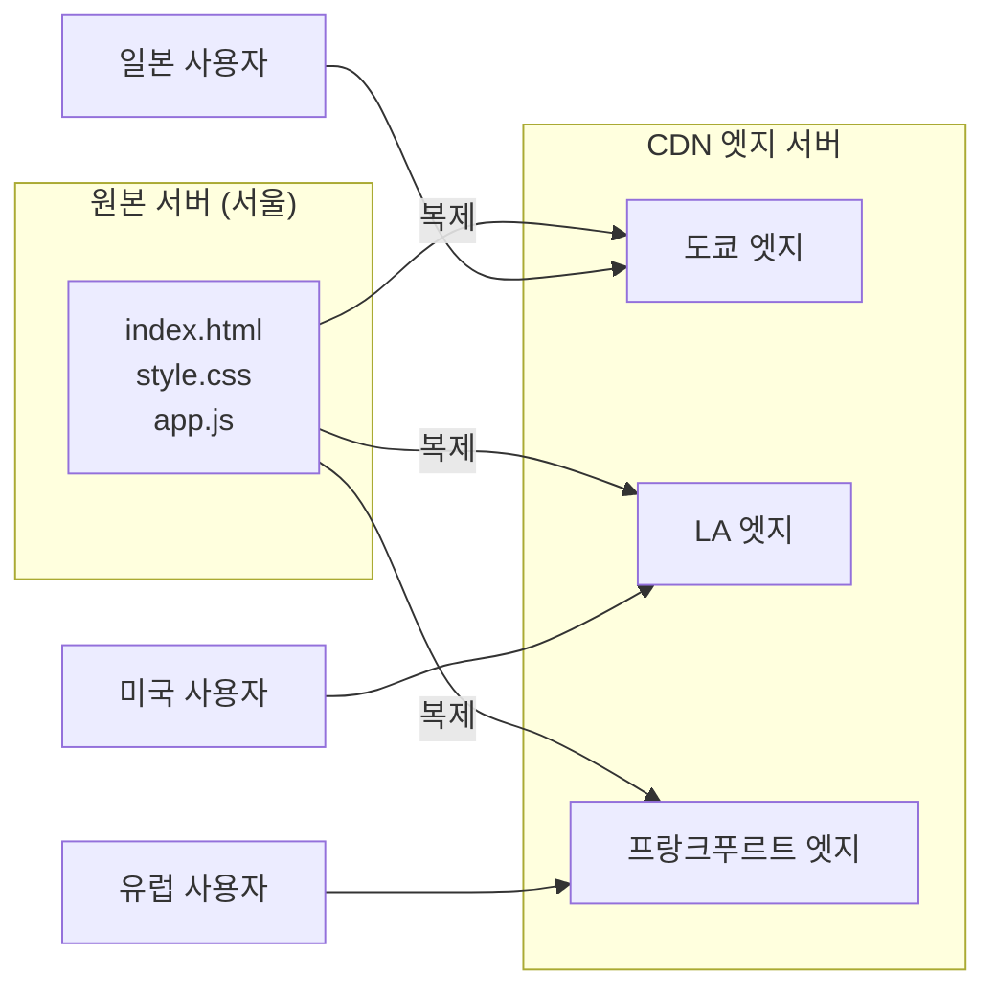
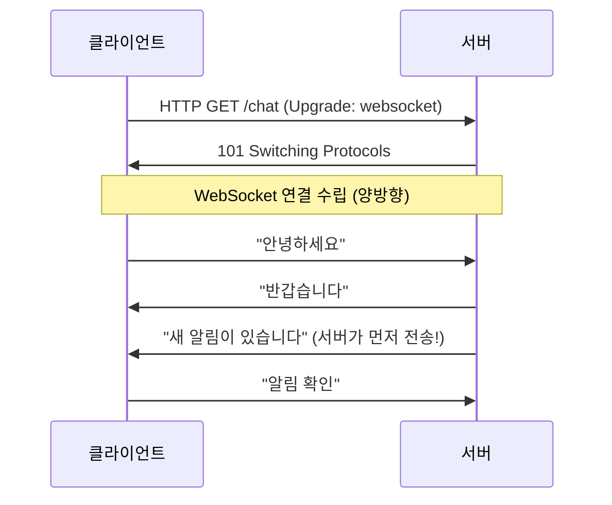
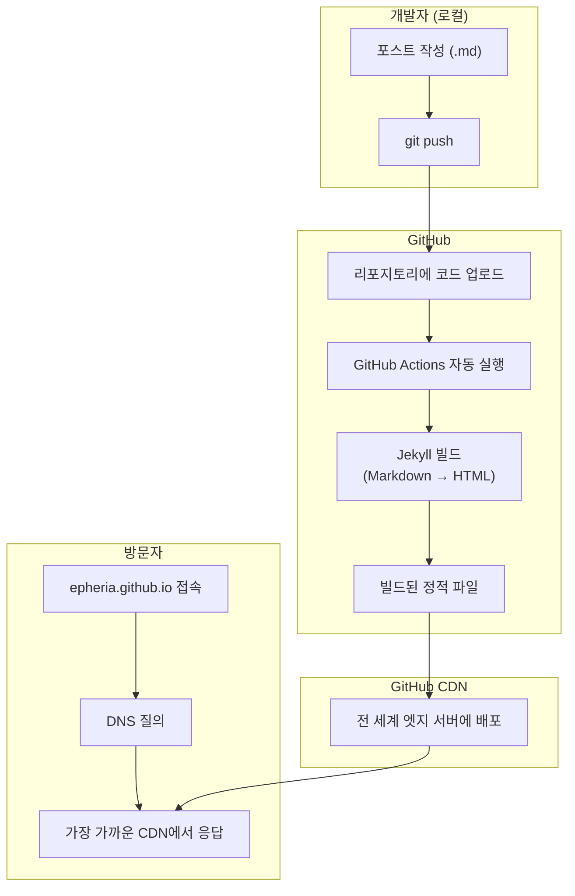
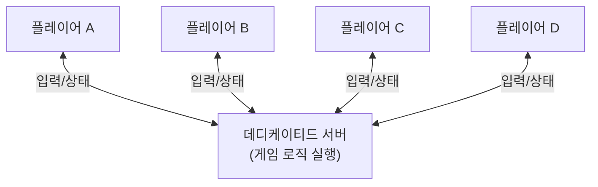
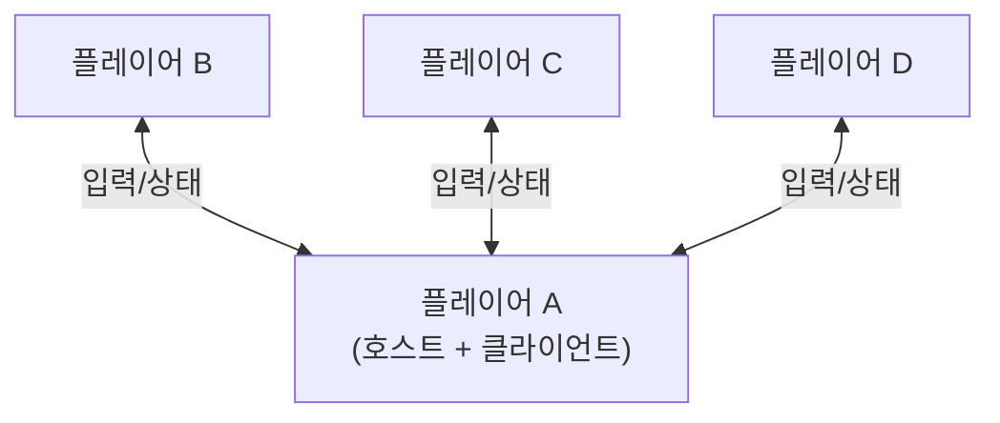
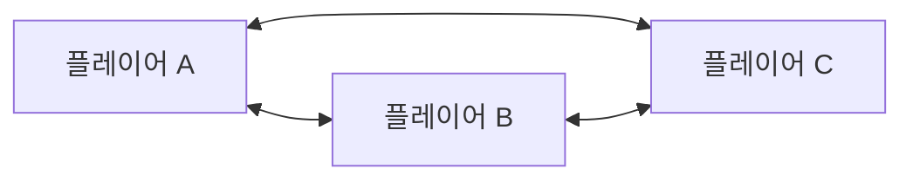
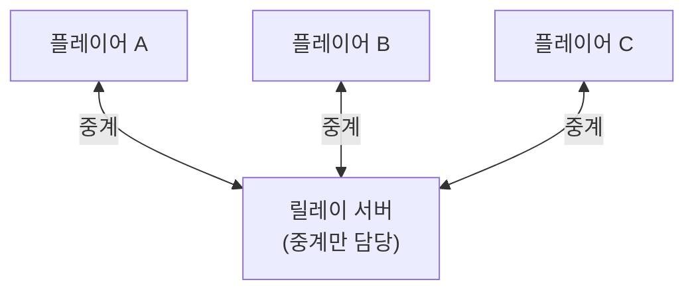
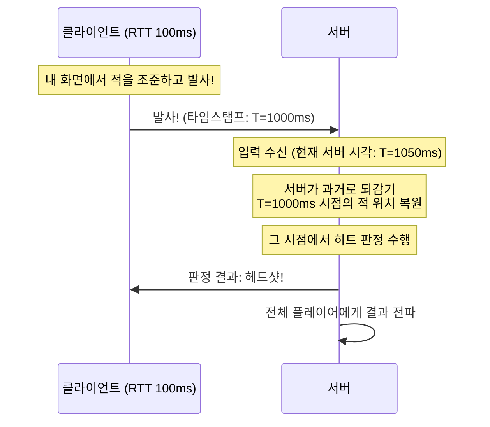
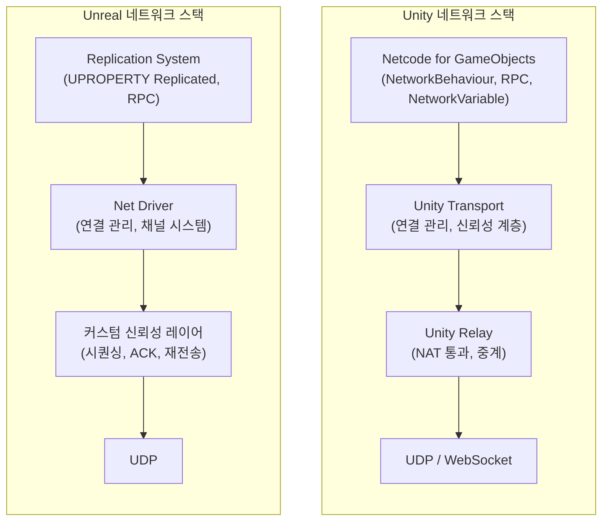
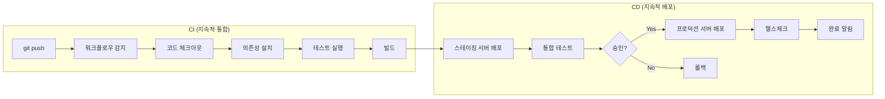

## 서론

> 이 문서는 **인터넷 인프라 — 클라이언트 개발자의 호기심** 시리즈의 3번째 편입니다.

"인터넷은 24시간 365일 쉬지 않고 돌아간다." 당연한 이야기처럼 느껴지지만, 한 발짝 물러서 생각해 보면 질문이 떠오릅니다. **그 주체는 누구일까요?**

사람이 24시간 모니터 앞에 앉아 있는 걸까요? 물론 아닙니다. 인터넷을 쉬지 않고 굴리는 것은 **프로그램**입니다. 더 정확히 말하면, 끊임없이 돌아가는 `while(true)` 루프입니다. Unity의 `Update()`가 매 프레임 호출되듯, 서버 프로그램도 무한 루프 안에서 요청을 기다리고, 처리하고, 응답합니다.

1편에서는 DNS, HTTP, 라우팅 같은 **논리적 인프라** — 디지털 바다의 교통 규칙을 살펴봤습니다. 2편에서는 해저 케이블, 데이터센터, CDN 같은 **물리적 인프라** — 디지털 바다 그 자체의 물리적 구조를 탐구했습니다.

이제 3편에서는 그 인프라 위에서 실제로 동작하는 **소프트웨어**를 살펴봅니다. 서버 프로그램은 어떤 종류가 있는지, 게임 서버는 웹 서버와 무엇이 다른지, 그리고 코드를 서버에 배포하는 자동화 파이프라인까지 — 클라이언트 개발자의 시각에서 인프라 소프트웨어의 전체 그림을 그려봅시다.

---

## Part 1: 서버 유형 총정리

"서버"라는 단어는 게임 개발자에게 익숙하면서도 모호합니다. "게임 서버 죽었어"라고 할 때의 서버와, "웹 서버 배포했어"라고 할 때의 서버는 같은 것일까요? 이 파트에서는 서버의 본질을 정의하고, 통신 패턴에 따라 어떤 유형들이 있는지 정리합니다.

### 웹/호스팅 서버 (HTTP 기반)

가장 흔한 서버 유형입니다. 우리가 브라우저에 URL을 입력하면 동작하는 모든 것이 여기에 해당합니다.

**정적 호스팅: GitHub Pages, Netlify, Vercel**

미리 빌드된 HTML/CSS/JS 파일을 그대로 전달하는 서버입니다. 요청이 오면 파일 시스템에서 해당 파일을 찾아 응답합니다. 서버 측에서 로직을 실행하지 않습니다.

비유하자면, **자동판매기**와 같습니다. 버튼을 누르면 정해진 음료가 나옵니다. 커스텀 음료를 만들어 달라고 할 수는 없습니다. 하지만 빠르고, 안정적이며, 비용이 거의 들지 않습니다.

**동적 웹 서버: Node.js, Django, Spring Boot**

요청마다 서버 측에서 페이지를 생성하는 서버입니다. 데이터베이스를 조회하고, 사용자 정보에 따라 다른 내용을 보여줍니다.

비유하자면, **주문 제작 식당**입니다. 같은 메뉴를 시켜도 "맵게 해주세요", "양파 빼주세요" 같은 커스터마이징이 가능합니다. 대신 주문 후 조리 시간이 필요합니다.

**API 서버: REST, GraphQL**

웹 페이지 전체가 아니라 **데이터만** 주고받는 서버입니다. JSON 형식으로 응답하며, 프론트엔드(클라이언트)와 백엔드(서버)를 깔끔하게 분리합니다. 모바일 앱, SPA(Single Page Application), 게임 클라이언트 모두 같은 API 서버를 공유할 수 있습니다.

```
// REST API 예시
GET /api/players/12345
→ { "name": "Epheria", "level": 42, "guild": "DevOps Knights" }
```

**CDN (Content Delivery Network)**

전 세계 엣지 서버에 콘텐츠의 복사본을 배치하는 시스템입니다. 사용자는 가장 가까운 엣지 서버에서 콘텐츠를 받습니다.

Unity 개발자에게 익숙한 비유로, **에셋 캐시 풀**과 같습니다. Addressables에서 로컬 캐시에 에셋이 있으면 리모트 서버까지 갈 필요 없이 로컬에서 바로 로드하듯, CDN도 가까운 엣지 서버에 캐시가 있으면 원본 서버까지 갈 필요가 없습니다.



### 실시간 서버 (WebSocket)

HTTP 기반 서버에는 근본적인 한계가 있습니다. **클라이언트만 요청을 보낼 수 있고, 서버는 먼저 보낼 수 없다**는 것입니다. 마치 편지 시스템과 같습니다 — 편지를 보내야만 답장이 옵니다. 상대방이 먼저 편지를 보내줄 수는 없습니다.

채팅 앱을 생각해봅시다. 상대방이 메시지를 보냈는데, 내가 "새 메시지 있어?"라고 물어보기 전까지 모른다면 불편하겠죠. 이런 한계를 극복하기 위해 **WebSocket**이 등장했습니다.

WebSocket은 한 번 연결하면 **양방향 통신**이 가능합니다. 편지 시스템이 아니라 **전화 통화**입니다. 한 번 전화를 걸면 양쪽 모두 언제든 말할 수 있습니다.



**WebSocket 사용처:**
- **채팅**: Slack, Discord, 카카오톡 웹
- **실시간 데이터**: 주식 시세, 스포츠 라이브 스코어
- **협업 도구**: Google Docs 동시 편집, Figma 실시간 공동 작업
- **게임**: 웹 기반 게임, 매치메이킹 로비, 실시간 스코어보드

게임 개발과의 관계도 중요합니다. 본격적인 게임 서버는 대부분 커스텀 UDP/TCP를 사용하지만, 매치메이킹 로비나 웹 기반 캐주얼 게임에서는 WebSocket을 활용합니다. Unity의 Netcode for GameObjects도 내부적으로 WebSocket 전송 계층을 지원합니다.

### GitHub Pages 작동 원리 — 이 블로그의 사례

이론만으로는 감이 잘 안 올 수 있으니, 지금 여러분이 읽고 계신 **이 블로그**가 어떻게 동작하는지 구체적으로 살펴봅시다.



**전체 흐름:**
1. 개발자(저)가 Markdown으로 포스트를 작성하고 `git push`
2. GitHub 리포지토리에 코드가 업로드됨
3. GitHub Actions 워크플로우가 자동으로 실행되어 Jekyll 빌드 수행
4. 빌드된 정적 HTML/CSS/JS 파일이 GitHub CDN에 배포됨
5. 방문자가 `epheria.github.io`에 접속하면 DNS 질의 후 GitHub CDN이 응답

**"접근 권한"의 실체:**

"아무나 내 블로그에 접속할 수 있다"는 것은 **GET 요청이 공개**되어 있다는 뜻입니다. 공개된 가게 문을 두드리면 열어주는 것과 같습니다. 누구든 GET 요청으로 페이지를 볼 수 있지만, **쓰기(push)는 인증된 사용자만** 가능합니다. 제 GitHub 계정으로 인증하지 않으면 블로그 내용을 수정할 수 없습니다.

---

## Part 2: 게임 서버 아키텍처

게임 개발자라면 이 파트가 가장 흥미로울 것입니다. 웹 서버와 게임 서버는 같은 "서버"라는 이름을 공유하지만, 내부 동작 방식은 완전히 다릅니다. 마치 자동차와 비행기가 같은 "탈 것"이지만 엔진 구조가 전혀 다른 것처럼요.

### 게임 서버 vs 웹 서버의 근본적 차이

웹 서버는 **요청(Request)이 올 때만 응답(Response)**합니다. "손님이 벨을 누르면 나가서 응대하는" 방식입니다. 아무도 벨을 누르지 않으면 서버는 조용히 대기합니다.

게임 서버는 다릅니다. 아무도 입력을 보내지 않더라도, **매 프레임(16~33ms)마다 모든 플레이어의 상태를 계산하고 동기화**합니다. 적 NPC는 AI에 따라 움직이고, 물리 시뮬레이션은 계속 돌아가며, 투사체는 날아갑니다. "매 순간 모든 손님의 위치를 파악하고 업데이트하는" 방식입니다.

| 특성 | 웹 서버 | 게임 서버 |
|------|--------|---------|
| 통신 패턴 | 요청-응답 | 지속적 상태 동기화 |
| 업데이트 주기 | 요청 시 | 매 Tick (16~33ms) |
| 상태 관리 | Stateless (대부분) | Stateful (필수) |
| 지연 민감도 | 수백ms 허용 | 수십ms가 치명적 |
| 프로토콜 | HTTP/HTTPS (TCP) | 커스텀 UDP 또는 TCP |

### 4가지 아키텍처

게임의 장르, 규모, 요구사항에 따라 서버 아키텍처가 달라집니다. 각각의 장단점을 이해하면, "이 게임은 왜 이런 방식을 선택했는지"가 보이기 시작합니다.

#### 1. 데디케이티드 서버 (Dedicated Server)

별도의 머신(또는 클라우드 인스턴스)에서 게임 로직을 실행합니다. 모든 클라이언트가 이 서버에 접속하고, **서버가 게임의 "진실"을 관장**합니다.



- **대표 게임**: 발로란트, WoW, 포트나이트, CS2
- **장점**: 강력한 치트 방지(서버 권위), 모든 플레이어에게 공정한 경험
- **단점**: 서버 운영 비용이 높음, 서버 위치에 따른 레이턴시 발생

#### 2. 리슨 서버 (Listen Server)

플레이어 중 한 명이 **호스트** 역할을 겸합니다. 호스트의 컴퓨터가 게임 서버이자 클라이언트로 동작하고, 나머지 플레이어가 이 호스트에 접속합니다.



- **대표 게임**: Co-op 인디 게임, 소규모 멀티플레이어
- **장점**: 서버 비용 없음, 구현이 상대적으로 간단
- **단점**: 호스트에게 유리(Host Advantage — 호스트는 레이턴시 0ms), 호스트가 이탈하면 세션 종료

#### 3. P2P (Peer-to-Peer)

모든 플레이어가 서로 **직접 연결**됩니다. 중앙 서버가 없으며, 각 플레이어의 입력이 다른 모든 플레이어에게 전달됩니다.



- **대표 게임**: 격투 게임 (스트리트 파이터 6, 철권 8)
- **장점**: 최소 지연(직접 연결), 서버 비용 불필요
- **단점**: 치트에 취약, 플레이어 수가 늘면 연결 수가 기하급수적으로 증가 (n(n-1)/2)

#### 4. 릴레이 서버 (Relay Server)

P2P의 아이디어에 **중계 서버**를 추가한 구조입니다. 플레이어끼리 직접 연결하는 대신, 릴레이 서버를 경유합니다. 가정집 공유기의 NAT(Network Address Translation) 때문에 직접 연결이 불가능한 경우를 해결합니다.



- **대표 게임/서비스**: Unity Relay, Steam Networking
- **장점**: NAT 뚫기 쉬움, 인프라 구축 간소화
- **단점**: 릴레이 서버를 경유하므로 직접 연결보다 지연이 약간 추가

#### 아키텍처 비교 테이블

| 아키텍처 | 치트 방지 | 비용 | 확장성 | 지연 | 대표 게임 |
|---------|----------|------|-------|------|---------|
| 데디케이티드 | 최고 | 높음 | 높음 | 중간 | 발로란트, WoW |
| 리슨 | 낮음 | 없음 | 낮음 | 중간 | Co-op 인디 |
| P2P | 최저 | 없음 | 최저 | 최저 | 격투 게임 |
| 릴레이 | 중간 | 낮음 | 중간 | 중간 | Unity Relay |

> 실제 상용 게임은 이들을 혼합해서 사용하기도 합니다. 예를 들어, 매치메이킹은 데디케이티드 서버에서, 인게임 보이스챗은 P2P로 처리하는 식입니다.

### Tick Rate와 보간 (Interpolation)

게임 서버의 핵심 지표가 하나 있다면, 바로 **Tick Rate**입니다.

Tick Rate는 **서버의 `FixedUpdate` 주기**입니다. Unity에서 물리 연산이 `FixedUpdate`에서 고정 간격으로 실행되듯, 게임 서버도 고정 간격으로 게임 상태를 시뮬레이션합니다.

```
Tick Rate 30  = 33ms마다 업데이트   (캐주얼 게임, MMO)
Tick Rate 64  = 15.6ms마다 업데이트  (일부 경쟁 FPS)
Tick Rate 128 = 7.8ms마다 업데이트   (VALORANT — 128 tick 공식 지원)
```

> **참고**: CS2(Counter-Strike 2)는 고정된 tick rate 대신 **sub-tick** 시스템을 사용합니다. sub-tick은 tick 사이의 정확한 입력 시점을 서버에 전달하여, tick rate에 의존하지 않고도 정밀한 판정을 구현하는 방식입니다.

여기서 문제가 생깁니다. 클라이언트의 FPS는 60~240인데, 서버의 Tick Rate는 30~128입니다. **클라이언트가 서버보다 더 자주 화면을 그립니다.** 서버에서 새 상태가 오기 전까지 클라이언트는 무엇을 보여줘야 할까요?

정답은 **보간(Interpolation)**입니다. 서버에서 받은 두 개의 스냅샷 사이를 부드럽게 이어주는 기법입니다.

```
서버 Tick 1: 적 위치 = (10, 0, 0)
서버 Tick 2: 적 위치 = (12, 0, 0)

클라이언트 프레임:
  프레임 1: 보간 → (10.0, 0, 0)
  프레임 2: 보간 → (10.5, 0, 0)
  프레임 3: 보간 → (11.0, 0, 0)
  프레임 4: 보간 → (11.5, 0, 0)
  프레임 5: 보간 → (12.0, 0, 0)  ← 다음 서버 Tick 도착
```

Unity 개발자에게 익숙한 비유로, **애니메이션의 키프레임 사이를 블렌딩**하는 것과 정확히 같습니다. 키프레임 0에서 팔이 내려가 있고 키프레임 30에서 팔이 올라가 있으면, 그 사이 프레임들은 보간으로 자연스럽게 채워집니다. 게임 네트워킹에서도 서버가 보내주는 "키프레임(스냅샷)" 사이를 클라이언트가 보간으로 채웁니다.

---

## Part 3: 게임 넷코드의 핵심 기법

빛의 속도는 유한합니다. 서울에서 미국 서버까지 패킷이 왕복하는 데 100~200ms가 걸립니다. 이것은 물리 법칙이므로 소프트웨어로 줄일 수 없습니다. 그렇다면 어떻게 FPS 게임에서 즉각적인 반응감을 만들어낼 수 있을까요? 정답은 **소프트웨어적 트릭**입니다.

### 클라이언트 예측 (Client-Side Prediction)

FPS 게임에서 W키를 눌렀을 때, 서버 응답을 기다렸다가 캐릭터가 움직인다면 어떨까요? 서울↔미국 서버 RTT(Round Trip Time)가 150ms라면, W키를 누르고 0.15초 후에야 캐릭터가 한 발 내딛습니다. 플레이 불가능입니다.

**클라이언트 예측**은 이 문제를 해결합니다. 내 캐릭터의 움직임은 **서버 응답을 기다리지 않고 즉시 실행**합니다. 클라이언트가 로컬에서 물리 시뮬레이션을 돌려 예측 위치를 계산하고, 동시에 서버에도 입력을 전송합니다.

```
[시간 0ms] W키 입력 → 클라이언트: 즉시 앞으로 이동 (예측)
                     → 서버로 입력 전송

[시간 75ms] 서버: 입력 수신, 서버 측에서 이동 계산

[시간 150ms] 서버 응답 도착
             → 서버가 말한 위치 vs 클라이언트가 예측한 위치
             → 같으면: OK
             → 다르면: 스무스하게 보정 (Reconciliation)
```

서버 응답이 도착했을 때, 예측이 맞았으면 아무 일도 일어나지 않습니다. 예측이 틀렸으면(벽에 부딪혔거나, 다른 플레이어와 충돌했거나) 서버가 알려준 올바른 위치로 **부드럽게 보정(Reconciliation)**합니다.

셰이더 프로그래밍에서 프레임 보간(temporal reprojection)을 통해 이전 프레임 데이터로 현재 프레임을 예측 렌더링하는 것과 비슷한 발상입니다 — **아직 확정되지 않은 미래를 예측해서 미리 보여주고, 나중에 보정하는 것**이죠.

### 서버 권위 (Server Authority)

"서버가 말한 것이 진실이다." — 이것이 서버 권위 모델의 핵심입니다.

멀티플레이어 게임에서 클라이언트는 **렌더링 담당**, 서버는 **판정 담당**입니다. 클라이언트가 "나 텔레포트해서 적 기지 안에 있어"라고 서버에 보내도, 서버는 "너의 이전 위치에서 그건 불가능해"라고 거부합니다.

스포츠에서의 **심판**과 같습니다. 선수(클라이언트)가 아무리 "골이에요!"라고 항의해도, 심판(서버)이 "오프사이드"라고 판정하면 그것이 최종입니다. 이 구조가 **안티치트의 기반**입니다.

```
// 서버 권위 모델의 원칙
클라이언트: "내 체력 999로 설정!" → 서버: "거부. 네 체력은 43이야."
클라이언트: "순간이동!" → 서버: "거부. 이전 위치에서 불가능한 이동이야."
클라이언트: "적에게 데미지 100!" → 서버: "사거리 확인... 거부. 너무 멀어."
```

데디케이티드 서버가 치트 방지에 강한 이유가 바로 이것입니다. 게임의 모든 중요한 판정(히트 판정, 데미지 계산, 아이템 획득 등)이 서버에서 이루어지기 때문에, 클라이언트를 해킹하더라도 서버의 판정 자체를 조작하기는 매우 어렵습니다. 다만 서버 권위 모델이 모든 치트를 완벽히 막는 것은 아닙니다. 월핵(wallhack) 같은 정보형 치트나 에임봇 같은 입력 자동화는 클라이언트 측에서 동작하므로, 별도의 안티치트 솔루션이 필요합니다.

### 지연 보상 (Lag Compensation)

FPS 게임에서 적을 정조준해서 쏜 순간을 떠올려봅시다. 내 화면에서는 분명히 머리에 맞았는데, 서버 입장에서 그 적은 이미 100ms 전에 다른 곳으로 이동한 상태입니다. 내가 본 것은 100ms 전의 적 위치이기 때문입니다.

이대로라면 레이턴시가 높은 플레이어는 영원히 총을 맞출 수 없게 됩니다. **지연 보상**은 이 문제를 해결합니다.



서버는 모든 플레이어의 **과거 위치를 일정 시간 동안 기록(히스토리 버퍼)**하고 있습니다. 클라이언트의 발사 요청이 도착하면, 서버는 해당 클라이언트의 레이턴시만큼 **과거로 되감기(Rewind)**하여 그 시점의 적 위치로 히트 판정을 수행합니다.

비유하자면, 게임 내 **리플레이 시스템에서 특정 시점으로 되감기 재생**하는 것과 같습니다. "이 플레이어가 총을 쏜 그 순간, 적은 어디에 있었는지"를 과거 기록에서 확인하는 것입니다.

### 롤백 넷코드 (Rollback Netcode)

격투 게임의 네트워킹 표준인 **GGPO**(Good Game Peace Out) 라이브러리가 이 기법을 대중화시켰습니다.

**작동 원리:**
1. 상대방 입력이 아직 도착하지 않았으면, **이전 프레임의 입력을 반복**하여 게임을 진행 (예측)
2. 실제 입력이 도착
3. 예측이 맞았으면: 그대로 진행
4. 예측이 틀렸으면: **과거 시점으로 되감기(Rollback)** → 올바른 입력으로 재시뮬레이션 → 현재까지 빨리감기

```
프레임 1: 상대 입력 없음 → "가만히 서있겠지" (예측)
프레임 2: 상대 입력 없음 → "계속 서있겠지" (예측)
프레임 3: 실제 입력 도착! "프레임 1에서 펀치를 날렸음"
→ 프레임 1로 되감기
→ 펀치 입력으로 프레임 1 재시뮬레이션
→ 프레임 2 재시뮬레이션
→ 프레임 3까지 빨리감기
→ 화면에는 최종 결과만 표시
```

이전에는 **딜레이 기반 넷코드**가 주류였습니다. 상대 입력이 도착할 때까지 프레임을 멈추고 기다리는 방식이죠. 레이턴시가 높으면 입력 지연이 체감되어 "둔한" 느낌을 줍니다.

롤백 넷코드는 일단 진행하고 틀리면 되감기 때문에, 레이턴시가 있어도 **즉각적인 반응감**을 유지합니다. 격투 게임에 특히 적합한 이유는, 1:1 대전이라 재시뮬레이션해야 할 게임 상태가 적기 때문입니다. 100명이 싸우는 배틀로얄에서 매번 되감기+재시뮬레이션을 하는 것은 비현실적입니다.

### Unity/Unreal 네트워크 스택

실제 게임 엔진에서 네트워킹은 여러 계층으로 나뉘어 있습니다. 각 계층이 특정 역할을 담당합니다.



| 계층 | Unity | Unreal | 역할 |
|------|-------|--------|------|
| 게임 로직 | Netcode for GameObjects | Replication System | 변수 동기화, RPC 호출 |
| 전송 관리 | Unity Transport | Net Driver | 연결 수립, 패킷 관리 |
| NAT/릴레이 | Unity Relay | 없음 (직접 구현 또는 서드파티) | 방화벽/NAT 통과 |
| 프로토콜 | UDP / WebSocket | UDP | 실제 패킷 전송 |

두 엔진 모두 UDP를 기본 프로토콜로 사용합니다. TCP는 패킷 손실 시 재전송을 기다리느라 지연이 발생하지만, UDP는 손실된 패킷을 무시하고 다음 패킷을 보냅니다. 게임에서는 2프레임 전의 적 위치보다 **지금 당장의 적 위치**가 중요하기 때문입니다.

---

## Part 4: CI/CD — 코드가 서버에 도달하는 자동화

지금까지 서버의 종류와 게임 서버의 내부 동작을 살펴봤습니다. 마지막으로, 개발자가 작성한 코드가 어떻게 전 세계 서버에 배포되는지 — **CI/CD 파이프라인**을 알아봅시다.

### 수동 배포의 시대 vs 자동화 파이프라인

옛날에는 배포가 이랬습니다:

```
1. FTP 클라이언트를 열고 서버에 접속
2. 로컬에서 빌드한 파일을 수동으로 업로드
3. SSH로 서버에 접속
4. 수동으로 서비스 재시작
5. "잘 되나?" 브라우저에서 확인
6. 안 되면 다시 1번으로...
```

사람이 직접 하니 실수가 발생합니다. 파일을 빼먹거나, 설정을 잘못 바꾸거나, 테스트를 깜빡하거나. 이런 문제를 해결하기 위해 **CI/CD(Continuous Integration / Continuous Deployment)** 파이프라인이 등장했습니다.

### CI/CD 전체 흐름



**CI (Continuous Integration) — 지속적 통합:**
1. 개발자가 `git push`
2. GitHub Actions / Jenkins / GitLab CI 등이 감지
3. 코드 체크아웃 (리포지토리 복제)
4. 의존성 설치 (`npm install`, `bundle install` 등)
5. 자동 테스트 실행 (유닛 테스트, 통합 테스트)
6. 빌드 (소스 코드 → 실행 가능한 아티팩트)

**CD (Continuous Deployment) — 지속적 배포:**
7. 스테이징(테스트) 서버에 먼저 배포
8. 스테이징에서 통합 테스트
9. (필요시) 관리자 승인
10. 프로덕션(실제) 서버에 배포
11. 헬스체크 — 서버가 정상 동작하는지 확인
12. 완료 알림 (Slack, 이메일 등)

### GitHub Pages의 CI/CD — 이 블로그의 사례

지금 읽고 계신 이 블로그도 CI/CD로 배포됩니다. `.github/workflows/pages-deploy.yml` 워크플로우가 하는 일을 살펴봅시다:

```
1. main 브랜치에 push 감지
2. Ubuntu 환경에서 리포지토리 체크아웃 (fetch-depth: 0)
3. Ruby 3.2 환경 설정
4. bundle install (Jekyll과 의존성 설치)
5. Jekyll 빌드 (JEKYLL_ENV=production)
   → Markdown 파일들이 HTML로 변환됨
6. 빌드된 정적 파일을 GitHub Pages에 배포
```

제가 터미널에서 `git push`를 하면, 약 2~3분 후 전 세계 어디서든 업데이트된 블로그를 볼 수 있습니다. 수동 작업은 **0**입니다. 이것이 CI/CD의 힘입니다.

### 게임 서버 배포와의 비교

블로그는 정적 파일을 CDN에 올리면 끝이지만, 게임 서버 배포는 훨씬 복잡합니다.

**클라우드 게임 서버 서비스:**
- **AWS GameLift**: Amazon의 게임 서버 호스팅
- **Azure PlayFab**: Microsoft의 게임 백엔드 플랫폼
- **Google Agones**: Kubernetes 기반 게임 서버 오케스트레이션

**Auto Scaling — 자동 확장:**

접속자 수에 따라 서버 인스턴스를 **자동으로 늘리거나 줄이는** 기술입니다. 놀이공원에서 줄이 길어지면 추가 놀이기구를 개장하고, 줄이 줄면 일부를 닫는 것과 같습니다.

```
평일 새벽 3시: 접속자 500명 → 서버 인스턴스 2개
주말 저녁 8시: 접속자 50,000명 → 서버 인스턴스 100개 (자동 증가)
새 시즌 출시: 접속자 500,000명 → 서버 인스턴스 1,000개 (자동 증가)
```

이렇게 하면 평소에는 비용을 절약하고, 접속 폭주 시에만 서버를 늘릴 수 있습니다. 만약 서버를 항상 최대치로 유지하면 매달 수억 원의 불필요한 비용이 발생합니다.

**리전 분산 배치:**

전 세계 플레이어에게 좋은 경험을 제공하려면, 각 지역에 서버를 배치해야 합니다. 전국에 체인점을 여는 것과 같습니다.

```
미국 서부 (Oregon)     — 북미 플레이어
유럽 (Frankfurt)      — 유럽 플레이어
아시아 (Tokyo/Seoul)   — 아시아 플레이어
남미 (São Paulo)      — 남미 플레이어
```

CI/CD 파이프라인이 이 모든 리전에 **동시에** 새 버전을 배포합니다. 개발자의 `git push` 한 번으로 전 세계 서버가 업데이트됩니다.

---

## 결론

이 시리즈를 통해 인터넷의 세 가지 층을 살펴봤습니다.

- **1편**: DNS, HTTP, 라우팅 — 디지털 바다의 **교통 규칙** (논리적 인프라)
- **2편**: 해저 케이블, 데이터센터, CDN — 디지털 바다의 **물리적 구조** (물리적 인프라)
- **3편**: 서버, 넷코드, CI/CD — 디지털 바다 위를 항해하는 **선박과 자동화 시스템** (소프트웨어)

### 클라우드는 남의 컴퓨터다

"클라우드"라는 단어가 주는 추상적인 이미지와 달리, 그 실체는 **남의 컴퓨터**입니다. AWS, Azure, GCP 모두 결국 누군가의 데이터센터에 있는 물리적 서버입니다. "클라우드에 올렸다"는 말은 "Amazon/Microsoft/Google의 데이터센터에 있는 컴퓨터에서 내 프로그램을 돌리고 있다"는 뜻입니다.

그리고 이 모든 것은 **전력에 100% 의존하는 인공 생태계**입니다. 2편에서 살펴본 해저 케이블, 데이터센터, 라우터 — 이 모든 물리적 인프라는 전기 없이는 무용지물입니다. 전기가 끊기면 디지털 바다는 즉시 증발합니다.

### 만약 모든 것이 멈춘다면 — 사고 실험

여기서 게임 개발자답게 한 가지 사고 실험을 해봅시다.

**지구 종말급 아포칼립스가 발생하고, 모든 전력 그리드가 붕괴된다면?**

가장 먼저 사라지는 것은 **서버 프로세스**입니다. 이 글 Part 1에서 살펴본 `while(true)` 루프들 — 웹 서버, 게임 서버, API 서버 — 이 모든 프로그램이 즉시 종료됩니다. RAM에 올라가 있던 모든 세션, KV Cache, 게임 상태가 전원 차단과 동시에 증발합니다. 전 세계의 매치메이킹 로비가 한순간에 텅 비는 것입니다.

다음으로 무너지는 것은 **네트워크 인프라**입니다. 1편에서 다룬 DNS 루트 서버 13개의 Anycast 인스턴스 1,900대, 2편에서 다룬 해저 케이블의 EDFA 광증폭기 — 이 모든 장비가 전력 없이는 작동하지 않습니다. DNS가 죽으면 도메인 이름은 의미를 잃고, 라우터가 죽으면 패킷은 경로를 찾을 수 없습니다. 인터넷이라는 네트워크 자체가 소멸합니다.

그리고 여기서 2편에서 다뤘던 **SSD의 전하 누출**이 결정타를 날립니다.

데이터센터의 전원이 끊긴 채 방치되면, SSD의 플로팅 게이트에 갇힌 전자들이 서서히 탈출하기 시작합니다. TLC SSD는 1~3년, QLC는 6개월이면 데이터가 읽을 수 없는 수준으로 손상됩니다. 아이러니하게도, 인류의 최신 지식 — AI 모델의 가중치, 학습 데이터, 코드 저장소 — 상당수가 바로 이 SSD 위에 저장되어 있습니다.

| 시간 경과 | 손실되는 것 |
| --- | --- |
| 0초 | RAM (서버 프로세스, 세션, KV Cache) |
| 수 분 | UPS 배터리 소진 → 데이터센터 완전 셧다운 |
| 6개월~1년 | QLC SSD 데이터 손상 시작 |
| 1~3년 | TLC SSD 데이터 대부분 소실 |
| 3~10년 | MLC/SLC SSD 데이터 소실 |
| 10년+ | HDD 자기장 약화 시작, 자기 테이프만 생존 |

**AI 모델의 운명**은 특히 흥미롭습니다. ChatGPT, Claude, Gemini — 이 모든 모델은 데이터센터의 GPU 클러스터 위에서 돌아가는 프로그램입니다. 모델 가중치는 수백 GB~수 TB의 float 배열입니다 ([LLM 가이드](/posts/llm-guide/)에서 다뤘듯이). 전력이 끊기면:

1. **추론(Inference)**: 즉시 불가능. GPU에 전원이 없으면 행렬 곱셈을 수행할 수 없습니다.
2. **가중치 보존**: SSD에 저장된 모델 파일(safetensors, GGUF 등)은 수년 내 전하 누출로 손상됩니다.
3. **학습 데이터**: 인터넷 크롤링 데이터, 논문, 코드 — 대부분 SSD/HDD에 분산 저장. 시간이 지나면 조각조각 소실됩니다.
4. **재학습 불가**: 설령 하드웨어를 복구해도, 학습 데이터 자체가 사라지면 같은 모델을 재현할 수 없습니다.

인간의 뇌는 포도당과 산소만 있으면 자급자족하는 **생물학적 컴퓨터**입니다. 하지만 AI는 반도체 공장, 발전소, 해저 케이블, 냉각 시스템이라는 **산업 문명의 전체 스택** 위에서만 존재할 수 있습니다. AI가 아무리 지능적으로 보여도, 그것은 물리적 인프라라는 토양 위에 피어난 꽃입니다. 토양이 사라지면 꽃도 함께 시듭니다.

### 넷러너의 꿈 — 구 인터넷을 발굴할 수 있을까?

사이버펑크 2077을 플레이하신 분이라면, **넷러너**가 올드넷(Old Net)의 폐허를 탐험하며 잃어버린 데이터를 발굴하는 설정을 기억하실 겁니다. 이 시리즈에서 다룬 실제 네트워크 지식을 바탕으로, 사이버펑크의 넷이 어떻게 설계되었는지, 그리고 그것이 현실에서 가능한지 살펴봅시다.

#### 사이버펑크 세계의 인터넷은 어떻게 파괴되었는가

사이버펑크 세계의 넷은 원래 현실 인터넷과 동일한 물리적 기반 위에 세워져 있었습니다 — 유선, 무선, 셀 네트워크, 마이크로웨이브 송수신기. 다만 현실보다 훨씬 확장되어 가전제품과 사이버웨어(인체 임플란트)까지 연결된 거대한 네트워크였죠. 넷러너는 **사이버덱(Cyberdeck)**이라는 장비로 신경 인터페이스 플러그를 통해 뇌에 직접 연결하고, 넷을 3D 가상 공간으로 체험했습니다.

2022년, 전설적 해커 **라체 바르트모스(Rache Bartmoss)**가 자신의 죽음에 맞춰 **R.A.B.I.D.S. 바이러스**를 넷에 풀어놓습니다. 이 바이러스는 수 개월 만에 넷의 3/4 이상을 감염시켰고, 글로벌 네트워크를 사실상 파괴했습니다. 이것이 **데이터크래시(DataKrash)**입니다.

> *"데이터크래시 이후, 전 세계 넷의 파편들만 겨우 수습되었다 — 무(無)의 심연으로 갈라진 알고리즘과 코드의 군도(群島)."*
> — Cyberpunk RED 세계관 설정

넷을 재건하려는 시도가 실패하고, 폭주 AI(Rogue AI)들이 남은 네트워크를 위협하자, 넷 보안 기관 **넷워치(NetWatch)**가 2044년에 **블랙월(Blackwall)**을 구축합니다. 블랙월의 정체는 단순한 방화벽이 아니라 **ICE(Intrusion Countermeasure Electronics)로 위장한 강력한 AI**입니다. 게임 내에서 *"깨진 창문에 테이프로 붙인 찢어진 쓰레기봉투"*로 묘사될 정도로, 완벽한 해결책이 아닌 임시방편에 가깝습니다.

블랙월은 사이버스페이스를 두 영역으로 분리합니다:

| 영역 | 설명 |
| --- | --- |
| **블랙월 안쪽 (Shallow Net)** | 인간이 사용 가능한 제한된 네트워크. 기업별/국가별 인트라넷으로 파편화 |
| **블랙월 바깥 (올드넷/딥넷)** | 데이터크래시 이전 인터넷의 폐허. 폭주 AI들이 배회하는 위험 지대 |

#### 2077년의 네트워크 — 에어갭 물리 서버

2077년 시점에서 우리가 아는 "인터넷"은 존재하지 않습니다. 대신 **NET 아키텍처**라는 시스템이 사용됩니다.

NET 아키텍처의 핵심은 놀랍게도 이 시리즈에서 다룬 기술과 직결됩니다:

- **물리적 서버 기반**: 각 NET 아키텍처는 독립된 물리 서버 위에 구축됩니다
- **에어갭(Air-gapped)**: 글로벌 네트워크에 연결되지 않은 고립된 시스템입니다
- **물리적 접근 필수**: 해킹하려면 건물에 직접 침투해서 접근점(Access Point)에 잭인해야 합니다
- **계층 구조**: 여러 "층(Floor)"으로 구성되어, 각 층에 파일, 컨트롤 노드, 보안 ICE가 배치됩니다

```
현실의 에어갭 시스템 vs 사이버펑크의 NET 아키텍처:

현실 (군사/국방 네트워크):
  물리 서버 → 외부 네트워크 완전 차단 → USB/물리 접근만 가능

사이버펑크 2077:
  물리 서버 → 블랙월 너머와 차단 → 잭인 포트로 물리 접근
  → 내부를 VR 가상 공간으로 시각화 → 넷러너가 "층"을 탐험
```

즉, 사이버펑크의 넷러너가 하는 일은 **원격 해킹이 아니라 물리적 침투 후 로컬 해킹**입니다. 이것은 현실에서 에어갭 시스템을 공격하는 방식(USB 드롭, 물리적 접근)과 본질적으로 동일합니다. 게임에서 넷러너가 건물에 먼저 잠입해야 하는 이유가 바로 이겁니다 — 인터넷이 사라졌으니까요.

#### 현실의 아포칼립스는 사이버펑크보다 가혹하다

여기서 흥미로운 차이가 드러납니다. 사이버펑크의 인터넷과 현실의 인터넷이 파괴되는 방식이 근본적으로 다릅니다.

| 요소 | 사이버펑크 (소프트웨어 파괴) | 현실 (물리적 파괴) |
| --- | --- | --- |
| **파괴 원인** | R.A.B.I.D.S. 바이러스 | 전력 그리드 붕괴 |
| **하드웨어 상태** | 서버는 살아있음 (전력 유지) | 서버 자체가 정지 |
| **데이터 잔존** | 올드넷에 "유령처럼" 떠다님 | SSD 전하 누출로 물리적 소멸 |
| **네트워크 상태** | 오염되었지만 존재함 | 완전히 소멸 (라우터, DNS, EDFA 전부 꺼짐) |
| **발굴 방식** | 사이버덱으로 가상 공간에 잭인 | 폐허에서 HDD를 물리적으로 수거 |
| **위험 요소** | 폭주 AI, 블랙 ICE | 방사능, 건물 붕괴, 전력 부재 |

사이버펑크에서는 바이러스가 **소프트웨어를 오염**시켰지만, 하드웨어와 전력 인프라는 살아있습니다. 그래서 올드넷이 폐허 상태로나마 "존재"하고, 넷러너가 가상 공간에서 접근할 수 있습니다. 데이터가 서버에 남아있고, 네트워크 경로도 (위험하지만) 통과할 수 있습니다.

하지만 현실에서 전력이 붕괴되면? **네트워크가 폐허로 남는 것이 아니라 완전히 증발합니다.**

- 1편에서 다뤘던 DNS 루트 서버 1,900대 — 전부 꺼집니다
- 2편에서 다뤘던 해저 케이블 EDFA 광증폭기 — 전부 꺼집니다
- 이 편에서 다룬 `while(true)` 서버 루프 — 전부 종료됩니다
- 그리고 시간이 지나면, 2편에서 다뤘던 SSD의 전하 누출로 저장된 데이터마저 물리적으로 사라집니다

사이버펑크의 올드넷은 "위험하지만 탐험할 수 있는 폐허"입니다. 현실의 인터넷은 "존재 자체가 소멸하는 신기루"에 가깝습니다.

#### 현실판 넷러너 — 데이터 스캐빈저

그렇다면 현실에서 구 인터넷의 데이터를 되살리는 것은 완전히 불가능할까요? 꼭 그렇지는 않습니다.

**물리적으로 생존 가능한 데이터:**

- **HDD**: 자기장으로 기록되어 전원 없이도 수년~수십 년 버팀
- **자기 테이프(LTO)**: 30년 이상 보존. 국가 기관이나 대형 기업의 오프사이트 백업은 주로 지하 시설에 테이프로 보관
- **Internet Archive의 Wayback Machine**: 인터넷의 스냅샷이 테이프에 백업되어 있다면, "구 인터넷 발굴"이 문자 그대로 가능

하지만 발굴 방식은 사이버펑크의 넷러너와 완전히 다릅니다. 가상 공간을 서핑하는 것이 아니라, **실제 폐허가 된 데이터센터에 들어가 물리적으로 하드 드라이브를 수거하는 것**입니다. 사이버펑크보다는 폴아웃에 더 가까운 그림이죠.

```
사이버펑크 넷러너 vs 현실판 "데이터 스캐빈저":

사이버펑크:  사이버덱 장착 → 잭인 포트 연결 → 올드넷 가상 공간 진입
             → 폭주 AI 회피 → 데이터 스트림에서 정보 추출

현실:        방독면 장착 → 폐허 데이터센터 물리적 진입 → 서버 랙 탐색
             → HDD/테이프 물리적 수거 → 수동 발전기 연결
             → 데이터 추출 시도 → 손상된 조각들을 퍼즐처럼 맞추기
```

그리고 설령 데이터를 되살려도, 1편에서 다뤘던 **DNSSEC 키 서명 의식**을 떠올려보면 — 인터넷의 신뢰 루트(Root of Trust)는 물리적 금고실의 HSM에 저장된 암호화 키에 의존합니다. 이 키들이 소실되면, 네트워크를 복구하더라도 인증서 체인을 처음부터 재구축해야 합니다. 사이버펑크에서 넷워치가 블랙월이라는 "새로운 신뢰 체계"를 세워야 했던 것처럼, 현실에서도 디지털 세계의 신뢰를 처음부터 다시 쌓아올려야 하는 것입니다.

어쩌면 이것이 사이버펑크 세계관이 우리에게 보여주는 가장 현실적인 통찰일지 모릅니다 — **인터넷은 영원하지 않다.** 그것은 전력과 하드웨어와 소프트웨어와 인간의 합의 위에 세워진, 놀랍도록 정교하지만 놀랍도록 취약한 구조물입니다.

### 게임 개발자로서의 시선

클라이언트 개발자로서 서버의 내부 동작까지 깊이 알 필요는 없을 수 있습니다. 하지만 인프라의 **전체 그림**을 가지고 있으면, "왜 이 API가 느린지", "왜 서버 팀이 이런 설계를 선택했는지", "왜 배포에 시간이 걸리는지"를 이해할 수 있습니다.

우리가 매일 당연하게 사용하는 인터넷은, 수만 km의 해저 케이블 위에, 수십만 대의 서버 위에, 수십 년에 걸쳐 쌓아올린 프로토콜 위에 올라가 있는 정교하고 거대한 구조물입니다. 그리고 그 구조물 위에서 우리는 게임을 만듭니다.

이 시리즈가 그 경이로운 구조물의 전체 모습을 조금이나마 그려드렸기를 바랍니다.

---

## 참고 자료

- [Valve Developer Wiki - Source Multiplayer Networking](https://developer.valvesoftware.com/wiki/Source_Multiplayer_Networking) — 밸브의 넷코드 설계 문서 (CS, TF2 등)
- [Gabriel Gambetta - Fast-Paced Multiplayer](https://www.gabrielgambetta.com/client-server-game-architecture.html) — 게임 넷코드 기법을 시각적으로 설명하는 4부작
- [GGPO - Good Game Peace Out](https://www.ggpo.net/) — 롤백 넷코드의 원조 라이브러리
- [Unity Multiplayer Docs - Netcode for GameObjects](https://docs-multiplayer.unity3d.com/) — Unity 공식 멀티플레이어 문서
- [Unreal Engine - Networking Overview](https://docs.unrealengine.com/en-US/networking-overview-for-unreal-engine/) — Unreal 공식 네트워킹 문서
- [GitHub Actions Documentation](https://docs.github.com/en/actions) — GitHub CI/CD 파이프라인 공식 문서
- [AWS GameLift Documentation](https://docs.aws.amazon.com/gamelift/) — AWS 게임 서버 호스팅 서비스
