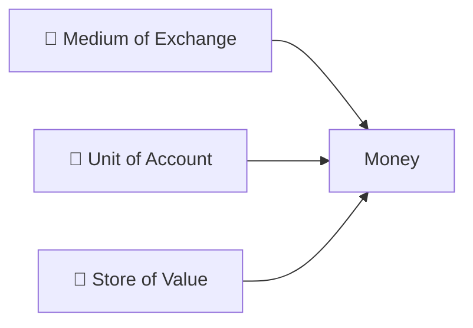
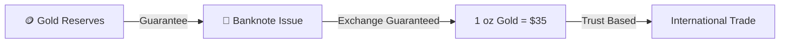
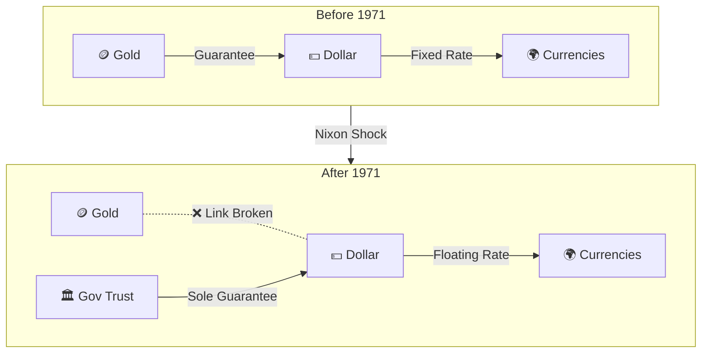

[](https://hits.sh/epheria.github.io/posts/CryptoCurrency01/)

## Introduction

> This document is part 1 of the **Cryptocurrency — Understanding Money in the Digital Age** series.

Just a few years ago, saying "Bitcoin will reach 100 million KRW" was mostly treated as crazy talk. Now, when it breaks below 100 million, people say "Bitcoin is dead." This alone shows how fast the times are changing.

I also started with the question, "What on earth is this digital scrap, and why is it so expensive?" Out of curiosity, I read a few related books, and honestly, I felt more like I took the red pill about the **existing financial system** than Bitcoin. Once you realize that the money we take for granted every day stands on a shakier foundation than you thought, understanding why Bitcoin appeared becomes natural.

But if we step back a bit, most of us cannot answer more fundamental questions. **"What is money, anyway?"**, **"Why is a 10,000 KRW bill worth 10,000 KRW?"**, and **"How can a digital scrap have a value of tens of millions of won?"**

This series consists of two articles that take the "red pill" on traditional finance, from the philosophical essence of money to the technical structure of Bitcoin.

| Part | Title | Core Topic |
|---|------|----------|
| Part 1 (This article) | Essence of Money | Philosophy of Value, History of Money, Limits of Fiat Money |
| Part 2 | Anatomy of Bitcoin | Technical Structure of Blockchain, Proof of Work, UTXO, Halving |

First, let's dig into the essence of **money**, something we use every day but don't really know the identity of.

---

## Part 1: What is Value — Philosophy of Money

### Secret of 10,000 KRW in Your Wallet

Let's open your wallet for a moment. Suppose there is a 10,000 KRW bill. With this single piece of paper, we can have a nice lunch or buy a movie ticket. But have you ever thought about this?

> The **manufacturing cost of this paper is about 54 KRW**.

If you take a 54 KRW piece of paper to a restaurant, you can eat 10,000 KRW worth of food. Why? Because King Sejong is printed on it? Because it has the Bank of Korea mark? If you think about it carefully, this is quite strange. A 54 KRW paper having a value of 10,000 KRW means there is 9,946 KRW worth of "something" more in it. That something is not material. It is **agreed trust**.

To understand this, we first need to look into the concept of "value" itself.

### Paradox of Value: Water and Diamonds

There is a famous paradox in economics. **"Water is essential for survival but almost free, while diamonds are almost useless but incredibly expensive."** This is called the **Diamond-Water Paradox**.

Without water for survival, you die within 3 days, but no one in history has died because they didn't have a diamond. Then why are diamonds tens of thousands of times more expensive than water? Philosophers and economists have debated this paradox for centuries.

| Theory | Core Argument |
|------|---------|
| **Labor Theory of Value** (Marx) | Value is determined by the amount of labor input |
| **Marginal Utility Theory** (Menger, Walras) | Value is determined by the subjective satisfaction of an additional unit |
| **Simmel's Theory of Value** | Value arises from the **distance** between the object and the subject |

Marginal Utility Theory explains this paradox neatly. Because water is abundant, the satisfaction (marginal utility) of drinking one more cup is low. On the other hand, because diamonds are scarce, the satisfaction (marginal utility) of obtaining one more is high. **It is not total utility, but the utility of the last unit that determines the price.**

But what if we take this to the middle of a desert? In a desert, a cup of water becomes much more expensive than a diamond. The moment water becomes scarce, marginal utility reverses. This is not just a theory. It is a core insight showing how **context-dependent** value is.

### Georg Simmel: The Philosophy of Money

German sociologist **Georg Simmel** explored the essence of money most deeply in his book "The Philosophy of Money (Philosophie des Geldes)" published in 1900. It is surprising that this book written 120 years ago provides a key frame for understanding Bitcoin.

Simmel's core insight is this:

> **Value is not inherent in the object itself, but arises when the subject desires the object but cannot fully possess it — that is, when there is a 'distance' between the subject and the object.**

 Simply put, **the fact that it is hard to get creates value.** This is exactly why luxury brands intentionally limit production, why premiums are attached to limited edition goods, and why you have to wait months on a waiting list even after paying tens of millions of won to buy an Hermes Birkin bag. Hermes intentionally doesn't make more bags even though they can. Because that "distance" maintains value.

Simmel goes further here. **Money is a tool to overcome this 'distance'.** The medium called money connects the distance between me and the object I want. And in this process, money becomes an increasingly **abstract** entity — from gold coins to banknotes, from banknotes to numbers, and from numbers eventually to pure **trust**.

Simmel called this process of abstraction **"dematerialization of money"**. This trend he predicted in 1900 became reality in the form of Bitcoin in 2009.

### To Be Money: Three Conditions

For something to function as money, it must satisfy three conditions.



| Function | Description | Example |
|------|------|------|
| **Medium of Exchange** | Allows exchanging goods without barter | Can buy any goods with KRW |
| **Unit of Account** | Expresses the value of all goods in a single unit | Price of all goods is displayed in Won (₩) |
| **Store of Value** | Can transfer current value to the future | Save money earned today and use it 10 years later |

Critically important here is the **third function — Store of Value**.

Let's take a realistic example. Suppose you worked hard in 2015 and saved 100 million won. You put that money in a bank deposit. In 2025, 10 years later, the principal is still 100 million won. But while 100 million won could get a small apartment jeonse in the outskirts of Seoul in 2015, it's difficult to even get a half-jeonse in the same area with 100 million won in 2025. The number is the same, but **purchasing power has significantly decreased.** Your money failed to perform the "Store of Value" function properly.

What if the central bank can print money infinitely? Inflation explodes, and money's "store of value" function collapses. This is actually happening in the real world, and this is the fundamental reason why Bitcoin appeared.

---

## Part 2: Evolution of Money — From Seashells to Digital

### Era of Barter: "Double Coincidence of Wants" Problem

Humanity's first transaction method was Barter. But barter had a fatal problem. In economics, this is called the **"Double Coincidence of Wants"** problem.

> If I have an apple and need fish, but the person with fish wants wood, not an apple? The transaction does not happen.

Let's move to real life. You, a freelance programmer, need treatment at a dentist. You tell the dentist, "I'll make you a website instead of paying for treatment," but the dentist says, "I already have a website, I need a car." Transaction fails. You go to a car dealer, and the dealer says, "I have a car but I need an apple orchard." To solve this endless chain, you need **something everyone wants**.

For a transaction to occur, the dual condition "the other person wants what I have, and at the same time I want what the other person has" must be met. To solve this inefficiency, humanity started using **something everyone wants** as an intermediate medium. This is the beginning of money.

### Era of Commodity Money: From Salt to Gold

Initially, objects with value in themselves were used as money. This is called **Commodity Money**.

| Era | Money | Why Selected |
|------|------|-------------|
| Ancient | Salt, Seashells | Preservability, Portability, Universal Demand |
| Ancient~Medieval | Cattle, Grain | Practical Value, Universal Demand |
| 7th Century BC~ | Gold/Silver Coins | Scarcity, Durability, Divisibility, Homogeneity |

Interestingly, the English word "salary" comes from the Latin "salarium" (salt allowance). Roman soldiers received part of their salary in salt. Salt acted as money in that era. The English idiom "He's not worth his salt" also came from here.

But whether salt, cattle, or grain, commodity money had limitations. Cattle cannot be cut in half (they die if cut), grain rots over time, and salt melts when wet. Humanity needed a better medium, and eventually reached **Gold**.

The reason gold reigned as money for thousands of years is that it almost perfectly satisfies the physical properties required for money.

```
[Why Gold is Perfect Money]

✅ Scarcity     — Mined amount is limited (All gold mined in history fits in about 3.4 Olympic swimming pools)
✅ Durability     — Does not rust or corrode (Gold from ancient Egypt still shines)
✅ Divisibility — Can be melted and divided into small units
✅ Homogeneity     — Any lump of gold has the same value if weight is same
✅ Portability     — Can contain large value in relatively small amount
❌ Limitation       — Hard to transport in large quantities, authenticity verification needed
```

Why gold specifically? Looking at the periodic table gives the answer. Most elements are unsuitable for money. Gaseous, liquid at room temperature, radioactive, too reactive, or too common. Elements passing all these filters are very few, and among them, gold had both appropriate scarcity and ease of processing. Gold becoming money was not a coincidence but a **chemical necessity**.

### Banknotes and Gold Standard: "Keep Gold for Me"

Carrying gold directly was inconvenient and dangerous. It was common for medieval merchants to be robbed by bandits while transporting gold to another city. So people deposited gold with goldsmiths (later banks) and received a receipt saying **"Bring this paper and I will return X amount of gold"**. This is the beginning of **Banknotes**.

Over time, people started using the receipt itself for transactions instead of retrieving gold. "I don't need to go get gold, I'll give you this paper. You can take this and change it to gold too." This is the birth of **paper money**.

But here, **bankers realized something.** Out of 100 people who deposited gold, only about 10-20 people came to retrieve gold at once. The gold of the remaining 80 people was just sitting in the safe. Bankers thought. "Can't we issue more receipts with the idling gold and lend them out to get interest?" This is the birth of **Fractional Reserve Banking**.

```
[Principle of Fractional Reserve Banking]

Keeping 100kg gold in safe

→ Issue 100kg receipts (To original owners)
→ Issue additional 80kg receipts (For lending)
→ 180kg receipts circulating in market, but only 100kg in safe

As long as everyone doesn't come to find gold at the same time... no problem.
```

Of course, if everyone comes to find gold at the same time, the bank goes bankrupt. This is a **Bank Run**. Numerous banks in history collapsed this way. And this structure is still alive in the modern banking system. If you have 10 million won in your bank account now, the bank actually holds only a part of that money (usually less than 10%), and lent the rest to others. The "10 million won" you see is just a number in a database.

The key is, at this stage, the value of paper money is still **guaranteed** by gold. This is called **Convertible Money** or **Gold Standard**.



Since the UK officially adopted the gold standard in 1816, this system became the foundation of the world economy for about 150 years.

### Bretton Woods System: Day Dollar Became King

In 1944, as World War II was ending, 730 representatives from 44 allied nations gathered at a small resort called **Bretton Woods** in New Hampshire, USA. It was to discuss how to reorganize the post-war world economic order.

Why did the US take the lead? Simple. During WWII, countries in Europe and Asia sent their gold to the US to buy war supplies. When the war ended, about 70% of the world's gold was piled up in the US Fort Knox gold depository. It was natural for the one with the most gold to set the rules of the game.

The conclusion was:

> **Make the US dollar the key currency, allow only dollars to be exchangeable for gold, and peg all other currencies to the dollar.**

In other words, **Dollar = Agent of Gold**. 1 ounce of gold = fixed at $35, and other countries pegged their currencies to the dollar at a fixed exchange rate. This is the **Bretton Woods System**.

```
[Structure of Bretton Woods System]

                     🪙 Gold
                         │
                    1 oz Gold = $35
                         │
                    💵 US Dollar (USD)
                   ╱     │     ╲
           £ Pound   ¥ Yen   ₣ Franc
          (Fixed)  (Fixed) (Fixed)

→ Each country's currency pegged to Dollar
→ Dollar pegged to Gold
→ Indirectly all currencies connected to Gold
```

For this system to work, one premise was needed: **The US must hold enough gold.** When other countries say "Change dollars to gold," the US had to respond. This promise was the basis of the entire system.

### Nixon Shock: Farewell to Gold

In the 1960s, the US focused on two huge expenditures. Fighting the **Vietnam War** overseas, and pouring massive budget into President Lyndon Johnson's **"Great Society"** program — poverty eradication, health insurance, education expansion — domestically. "Guns and Butter" — an ambitious plan to cover both war costs and welfare costs.

The problem was, where does this money come from? The answer was simple. **They printed dollars.** Gold reserves remained the same, but dollar issuance kept increasing.

The first person to detect this was French President **Charles de Gaulle**. He publicly criticized the Bretton Woods system as "exorbitant privilege of the US". The US printed paper (dollars) to buy real goods from other countries, and other countries had to accept it trusting only the promise that they could change that paper to gold. De Gaulle loaded dollar bundles on French naval ships and sent them to the US to exchange for gold. Other countries started to follow.

As gold started to drain, on August 15, 1971, US President **Richard Nixon** made a historic declaration through Sunday evening TV broadcast:

> **"We will no longer exchange dollars for gold."**

This is the **Nixon Shock**. Nixon called this measure "temporary," but gold convertibility was never restored. At this moment, the foundation of the world currency system changed.



After this moment, money is no longer guaranteed by the physical substance called gold. The value of money is based only on **"The government declaring this paper has value, and people believing it."** This is **Fiat Money**.

"Fiat" means **"Let it be done"** in Latin. Same etymology as God saying "Let there be light (Fiat Lux)" in the Bible. Literally, a system where it becomes money if the government **orders (fiat)** "This is money".

Let's summarize briefly. Before 1971, the structure was:

> "This banknote can be exchanged for gold in the safe" → **Physical Guarantee**

After 1971, it changed to:

> "This banknote is money because the government declared it so" → **Declarative Value**

This was the beginning of the largest economic experiment in human history. And this experiment is still ongoing.

---

## Part 3: Shadow of Fiat Money — Invisible Tax

### How Money is Created: Principles of Modern Money Creation

Many people know "Government prints money," but reality is a bit more complex. There are two ways money is created in modern economy.

**First, Central Bank's Base Money Issuance.** Bank of Korea (or US Federal Reserve) directly issues currency. Printing banknotes falls here, but in modern times, it's mostly entering numbers into accounts **electronically**. Literally, money is created by typing numbers into a computer.

**Second, Commercial Bank's Credit Creation.** This is the more interesting part. Explained fractional reserve banking earlier, this principle works in modern times too. When a bank lends money, it doesn't take money out of a safe. **Entering a number into a loan account becomes money.** If you borrow 100 million won from a bank, the bank doesn't bring 100 million from somewhere, but writes the number "100,000,000" in your account. At this moment, the total amount of money existing in the world increases by 100 million.

```
[Modern Money Creation Process]

Central Bank:  Control Base Money (M0) by setting base rate, buying/selling bonds
     ↓
Commercial Bank:  Execute Loan → Enter number in account → Money "Created"
     ↓
Credit Multiplier:  Deposit → Loan → Deposit again → Loan again (Repeat)
     ↓
Result:     Currency amount several to dozens of times the base money circulates in economy

Ex) Base Money 1 million won, Reserve Ratio 10%
      → Theoretical Max Money Supply: 1 million × (1/0.1) = 10 million won
      → 10 million won "Created" from 1 million won base money
```

In this system, **about 90% of money is created by commercial bank loans.** Physical currency printed by central bank is only a tiny fraction of the total. Ultimately, modern monetary system is **a system built on debt**. Money is created when someone takes a loan, and disappears when loan is repaid. If all debts in the world are repaid simultaneously, money almost disappears too.

### Inflation: Secret Dilution of Money Value

In fiat money system, central banks can **theoretically print unlimited money.** In gold standard, gold reserves set limit on currency issuance, but fiat money has no such physical constraint.

If more money is released into market, amount of goods and services remains same but amount of money increases, so purchasing power of one unit of currency falls. This is the essence of **inflation**.

Analogy: Divided a pizza into 8 slices, then someone divided it again into 16 slices. Number of slices doubled, but total amount of pizza is same. Each slice reduced to half. Money is same. If amount of money circulating in market doubles, value (purchasing power) of each currency unit becomes half.

In real world, this can be verified with numbers:

```
[Change in Purchasing Power of US Dollar]

1970 $1.00 ████████████████████████████████████████  100%
1980 $0.60 ████████████████████████                   60%
1990 $0.42 █████████████████                           42%
2000 $0.33 █████████████                               33%
2010 $0.26 ██████████                                  26%
2020 $0.18 ███████                                     18%
2025 $0.15 ██████                                      15%

→ Purchasing power of US Dollar fell about 85% since 1970
→ Over 95% fall since 1913 (Fed establishment)
```

What you could buy with $1 in 1970 requires about $6.5 in 2025. Korea is same. Jajangmyeon was 1,500 won in 1990s, now 7,000~8,000 won. Quality of Jajangmyeon didn't improve 5 times. Value of money reduced to 1/5.

This is not bank robber stealing money from safe, but **diluting value of money itself**. Economists call this **"Invisible Tax"**. People resist if government raises taxes, but people don't know well if more currency is issued. They accept rising prices as "economy is bad". But essence is same. **Quietly taking your wealth**.

### Quantitative Easing: Unprecedented Money Supply Expansion

After 2008 financial crisis, central banks worldwide took super strong measure called **Quantitative Easing (QE)**. QE is policy where central bank purchases government bonds etc. in bulk to release massive money into market.

Unfolding the process a bit more:

1. Government lacks finance → Issues government bonds (=debt certificates)
2. Central bank buys these bonds → **Creates money from nothing** to pay for bonds
3. Government spends received money → Money released into market
4. Money in market increases → Interest rate goes down → Loans activated

| Period | Event | US Fed Balance Sheet Scale |
|------|--------|------------------------|
| 2007 | Pre-Financial Crisis | Approx $0.9 Trillion |
| 2014 | End of QE3 | Approx $4.5 Trillion |
| 2020 | COVID Pandemic | Approx $7.2 Trillion |
| 2022 | Peak | Approx $8.9 Trillion |

About **10 times** money flowed into system in 15 years. From 0.9T to 8.9T. Scale might not be felt well. 8.9T dollars is amount equivalent to **about 5 times Korea's GDP**.

Boosts economy in short term, but drops value of money in long term. Rapid price rise appeared worldwide in 2021~2022 was one of direct results of this QE. US recorded highest inflation in 40 years (9.1%), Korea also exceeded 5% consumer price inflation in 2022.

You will remember **Stimulus Check** US government paid directly to citizens during COVID. If asked "Where did money come from?", answer is simple. **Printed it.** Of course, price returned as subsequent inflation.

### Lifespan of Fiat Money Proven by History

Historically, average lifespan of fiat money is about **27 years**. Cases of currencies eventually losing value or replaced after abandoning gold standard are countless.

| Country | Period | What Happened |
|------|------|----------------|
| Weimar Germany | 1921~1923 | Overissue of money for war reparations → Billions of marks for a loaf of bread. Children played stacking bundles of bills like blocks, joke that pasting bills on wall is cheaper than wallpaper became reality |
| Zimbabwe | 2007~2008 | Overissue of money to cover government deficit → 100 trillion Zimbabwe dollar bill issued. Prices doubled every 24 hours |
| Venezuela | 2016~Present | Oil income decrease + Overissue of money → Annual inflation over 1 million%. Pricing goods by weight of money was faster than counting |
| Turkey | 2021~2023 | Abnormal low interest policy → Lira value plunge. Purchasing power dropped to 1/3 in 3 years |

Common point of all cases: **Government could not resist temptation of money issuance.**

Problem lies in **structural incentive**. Next election for politician is 4~5 years later. Issuing more money to boost current economy raises approval rating now, cost of inflation is paid by future citizens. Raising taxes loses votes, but money issuance is not well visible. Almost no government in history resisted this temptation.

"Those who have power to increase money supply eventually abuse that power" — This is lesson repeatedly proven by thousands of years of monetary history.

---

## Part 4: Dawn of Digital Currency — Attempts Before Bitcoin

Bitcoin didn't fall from sky suddenly. Attempts to create digital currency existed for decades, and Bitcoin was born learning lessons from failures of each attempt.

### Cypherpunk Movement

In 1990s, there was group of cryptographers and programmers called **Cypherpunk**. Co-founded by Eric Hughes, Tim May, John Gilmore, this movement exchanged ideas via cryptography mailing list. They believed privacy and freedom of individuals could be protected through cryptography. Their core creed was:

> **"Privacy is not a choice but a right, and cryptography is the tool to protect it."**

Looking at member list of this group, there are surprising names. Julian Assange of WikiLeaks, Bram Cohen of BitTorrent, and Adam Back who invented Proof of Work (PoW), key element of Bitcoin. Cypherpunk mailing list was essentially birthplace of Bitcoin.

Various ideas for digital currency came out from this group.

| Project | Year | Developer | Core Idea | Reason for Failure |
|----------|------|--------|-------------|----------|
| **DigiCash** | 1989 | David Chaum | Anonymous e-cash using blind signature | Reliance on central server → Ended with company bankruptcy |
| **HashCash** | 1997 | Adam Back | First proposal of PoW concept | Spam prevention system, not currency |
| **b-money** | 1998 | Wei Dai | Theoretical proposal of decentralized e-cash | Stayed as theory, not implemented |
| **Bit Gold** | 1998 | Nick Szabo | PoW + Byzantine Fault Tolerance | Double spending problem unresolved |

Bitcoin is culmination of all these prior studies. Satoshi Nakamoto's white paper directly cites HashCash, b-money etc. Bitcoin didn't come from nothing, but **built on 20 years of failure and learning**.

Common obstacle of all these attempts was **Double Spending Problem**.

### Double Spending Problem: Achilles Heel of Digital Currency

Digital data is **infinitely copyable.** This is most fundamental problem of digital currency.

Physical cash cannot be double spent. If I give 10,000 KRW bill to A, I no longer have that bill in my hand. But digital file? Even if I send photo via KakaoTalk, original remains in my gallery. Even if I send music file to friend, it remains on my computer. Infinite copying possible with `Ctrl+C`, `Ctrl+V`.

```
[Double Spending Problem]

Physical Cash:
  Me ─── 10,000 KRW Bill ───→ A    ✅ I no longer have 10,000 KRW

Digital Currency (Problem):
  Me ─── Copy 1BTC ───→ A     ❌ I still have 1BTC
  Me ─── Copy 1BTC ───→ B     ❌ Infinite copy possible
```

This is a problem programmers can understand intuitively. Recall item duplication bug in game. If users can duplicate items, game economy collapses. Double spending problem of digital currency is essentially same.

How do existing digital payments (card, transfer) solve this? **Trusted Third Party**, i.e., bank manages ledger. Bank processes record "Subtract 10,000 from A's account, add 10,000 to B's account" in **single ledger**.

But this method has fundamental problems:

1. **Single Point of Failure** — If bank server down, all transactions stop. Recall experience unable to use KakaoPay during 2022 Kakao Data Center fire
2. **Censorship Possibility** — Bank or government can freeze specific person's account. Case of truck protesters' accounts frozen in Canada in 2022
3. **Trust Cost** — Fees, labor costs, system costs occur to maintain intermediary. Reason why overseas remittance fee reaches 3~7%
4. **Privacy Violation** — All transaction history exposed to intermediary. Bank knows everything about where and what you bought
5. **Business Hour Constraint** — Transfer impossible or delayed on "days financial institutions rest". Even in 2026, transfers on weekend sometimes processed on Monday

**Core innovation of Bitcoin is solving double spending problem without this "Trusted Third Party".** System enabling transfer of value without bank, 24/365, anywhere in world, without anyone's permission. Why this is revolutionary, let's examine in detail in Part 5.

---

## Part 5: Emergence of Satoshi Nakamoto

### World of 2008: Perfect Timing

October 31, 2008, when Satoshi Nakamoto's white paper was released, was **historically perfect timing**.

On September 15, 2008, **Lehman Brothers**, 4th largest investment bank in US, went bankrupt. 158-year history financial giant collapsed overnight. Then insurance giant AIG received bailout, banks worldwide shook one after another. Millions lost homes, tens of millions lost jobs.

But how was government response? **"Too Big to Fail"**, bailed out banks with taxes. Banks took risk, but taxpayers paid price. Wall Street CEOs took millions of dollars in bonuses while receiving bailout.

People were angry, but couldn't do anything. Financial system was monopolized by few institutions, ordinary people had no choice but to rely on that system. At this very moment, Satoshi's white paper appears.

### 9-Page White Paper

On October 31, 2008, an email was posted on cryptography mailing list. Sent by someone using name **Satoshi Nakamoto**. Title was:

> **"Bitcoin: A Peer-to-Peer Electronic Cash System"**

It was a 9-page white paper. 9 pages. System to replace 158-year history Lehman Brothers was contained in 9 pages. Contained in this short document was **method to implement digital currency without trusted third party combining cryptography and economic incentives**.

First sentence of white paper is:

> "A purely peer-to-peer version of electronic cash would allow online payments to be sent directly from one party to another without going through a financial institution."

And on January 3, 2009, Satoshi mined first block (Genesis Block) of Bitcoin network. In this block, Satoshi engraved a meaningful message:

> **"The Times 03/Jan/2009 Chancellor on brink of second bailout for banks"**

It was headline of UK newspaper The Times at the time. News that they try to save banks with taxes again. Why Satoshi chose this message is self-evident. **"This is why I made Bitcoin."**

### Satoshi's Awareness of Problem

Satoshi pinpointed fundamental problem of existing financial system in white paper:

> **"The root problem with conventional currency is all the trust that's required to make it work. The central bank must be trusted not to debase the currency, but the history of fiat currencies is full of breaches of that trust."**

This is not simple technical problem raising. **Philosophical, economic problem raising**. Everything we examined in Part 3 — inflation, quantitative easing, historical failure of fiat money — Satoshi summarized in one sentence.

Declaration to make value of money depend not on trust in **people (institutions)**, but on **mathematics and cryptography**.

### Core of Solution: Replacing Trust with Code

Summarizing Satoshi's solution in one sentence:

> **"Verification instead of Trust, Algorithm instead of Institution."**

| Existing System | Bitcoin |
|------------|---------|
| Bank manages ledger | All participants hold copy of ledger |
| **Trust** bank | **Verify** mathematical proof |
| Recorded on central server | Recorded on distributed network |
| Bank approves transaction | Network consensus approves transaction |
| Personal info needed | Only cryptographic key needed |
| Transaction within business hours | 24 hours 365 days |
| Limited by borders | Anywhere with Internet |

Analogy: Existing system is **sending letter via post office (bank)**. Post office can lose letter, censor, or cannot send on rest days. Bitcoin is **sending directly like email**. Without intermediary, immediately, anywhere in world.

How this structure works — specific technologies of blockchain, proof of work, UTXO, halving — will be covered deeply in Part 2.

### Who is Satoshi?

Identity of Satoshi Nakamoto is not revealed even in 2026. Certainties are:

- Estimated to hold about **1.1 million BTC** (Early mined portion). Worth tens of trillions of won at current price
- Stopped public activity after December 2010. Last email only said "Moved on to other things"
- **Never moved** estimated holding Bitcoin even once. Didn't spend even one Satoshi (1/100 millionth BTC) despite having tens of trillions
- Used British English, mainly active in specific time zone based on UTC

Numerous candidates mentioned — Nick Szabo, Hal Finney, Craig Wright etc. Craig Wright claimed himself to be Satoshi, but not recognized in court. Hal Finney is person who received first Bitcoin transaction from Satoshi, one of most likely candidates, but died of ALS in 2014.

Satoshi hiding identity and leaving symbolizes Bitcoin's philosophy itself. **System not relying on specific individual or institution.** System working even if founder disappears. Company without CEO, party without representative. This is essence of **Decentralization**.

Think of Linux. Linux runs even if Linus Torvalds retires tomorrow. Bitcoin is same. 16 years since Satoshi disappeared, but Bitcoin network never stopped even once.

---

## Part 6: Why Bitcoin Has Value

Now can systematically answer question "Why digital scrap has value".

### Source of Value: Comparison with Gold

Recall Simmel's theory of value earlier. "Distance creates value." What is that "distance" in Bitcoin? **Absolute upper limit of 21 million total.** Cannot make more even if wanted. Any president, any central bank governor, even Satoshi Nakamoto himself.

| Attribute | Gold | Bitcoin | Fiat Money |
|------|---------|------------------|---------------|
| **Scarcity** | Finite reserves on Earth | 21 million upper limit (Guaranteed by code) | ❌ Unlimited issuance possible |
| **Durability** | Does not corrode | Permanent as long as network exists | Physical wear, disappearance by policy |
| **Divisibility** | Physically difficult | Divisible up to 1/100 millionth (1 satoshi) | Legal minimum unit exists |
| **Portability** | Heavy and bulky | Transferable anywhere on Internet | Physical cash is inefficient |
| **Verifiability** | Professional equipment needed | Anyone can verify on blockchain | Authenticity verification needed |
| **Censorship Resistance** | Physical confiscation possible | Accessible only with private key | Account freezing possible |
| **Decentralization** | Physically dispersible | Distributed on tens of thousands of nodes | ❌ Controlled by central bank |
| **Issuance Plan** | Unpredictable (Mine discovery etc.) | 100% predictable by code | ❌ Dependent on government discretion |
| **Transfer Cost** | High cost like transport, insurance | Few dollars fee | 3~7% fee for overseas transfer |
| **Border Limit** | Customs, export limit | No limit with Internet | Forex regulation, limit constraint |

Bitcoin has advantages of gold (scarcity, durability) while solving disadvantages of gold (portability, divisibility). So Bitcoin is called **"Digital Gold"**.

How to send 100 million won worth of gold to another country? Buy insurance, hire transport company, pass customs. Takes days, cost considerable. To send 100 million won worth of Bitcoin to another country? Input address on smartphone and press "Send". Arrives in 10 minutes. Fee few dollars.

### 5 Attributes Creating Bitcoin's Value

1. **Supply must be limited** — Bitcoin limited to 21 million. Gold is also finite but new mines can be discovered. Bitcoin upper limit fixed by code
2. **Counterfeiting must be impossible** — Guaranteed by SHA-256 and blockchain. Gold allows sophisticated counterfeiting, but Bitcoin mathematically impossible to counterfeit
3. **Ownership must be clear** — Guaranteed by Public Key/Private Key cryptography. Court order nor hacker can take your Bitcoin (as long as protecting private key)
4. **Transfer must be easy** — Transferable anywhere in world via P2P network
5. **No intervention of specific entity** — Decentralized consensus mechanism. No one can "turn off" Bitcoin network

When these five are all met, digital asset can have value.

### Vision of Coinbase CEO Brian Armstrong

Coinbase CEO Brian Armstrong presented firm vision for long-term value of Bitcoin and innovation of financial system in recent interview. Summarizing few key points:

- **Asset Tokenization**: Making traditional assets like real estate, stocks, art into tokens on blockchain allows anyone in world to participate in investment with small amount. Owning 0.001% of Manhattan building while in Korea becomes possible. Realization of financial democratization
- **Payment Means for AI Agents**: As AI performs tasks increasingly autonomously, payments between AI agents become necessary. For AI unable to open bank account, cryptocurrency becomes only payment means
- **Remittance Revolution**: Currently overseas remittance fee averages 6.3%. Sending 1 million won from Philippines to Korea loses 63,000 won as fee. Using cryptocurrency reduces this cost to hundreds of won level

Armstrong predicts **cryptocurrency will maximize efficiency across finance such as remittance, lending, fundraising within next 10 years**, recommending allocating certain portion of assets to Bitcoin.

---

## Conclusion: Asking Future of Money

In this article we examined:

```
[Money Evolution Timeline]

Barter → Commodity Money(Gold) → Gold Standard Note → Bretton Woods → Nixon Shock → Fiat Money → ???
                                                                              ↑
                                                                          Bitcoin
```

History of money was **process of trust object becoming increasingly abstract**:
- Barter: Trust object itself
- Gold: Trust material called gold
- Gold Standard Note: Trust promise "this paper exchanges for gold"
- Fiat Money: Trust government
- Bitcoin: **Trust Math and Code**

At each stage there was skepticism "Can this be money". Medieval merchants would have said "Accept paper instead of gold? Crazy talk!". That is current reality. "Digital scrap is money? Crazy talk!" — Future will judge this.

Knowing history of money, Bitcoin no longer looks like just "speculation" or "gambling". Of course speculative element exists. But at its root is **attempt to solve thousands of years of repeated failure of money with technology**. Whether that attempt succeeds or fails is yet unknown. Important thing is **understanding**.

In Part 2, I will explain **how Bitcoin implements all this specifically** — anatomy of technology like blockchain structure, SHA-256 hash, Merkle Tree, UTXO, Proof of Work, Halving etc.

---

## References

- [Satoshi Nakamoto, "Bitcoin: A Peer-to-Peer Electronic Cash System" (2008)](https://bitcoin.org/bitcoin.pdf)
- [Georg Simmel, "The Philosophy of Money" (1900)](https://en.wikipedia.org/wiki/The_Philosophy_of_Money)
- [Georg Simmel's Theory of Value — Seoul National University Paper](https://s-space.snu.ac.kr/handle/10371/87326)
- [History of Money — Wikipedia](https://en.wikipedia.org/wiki/History_of_money)
- [Gold Standard — Namuwiki](https://namu.wiki/w/%EA%B8%88%EB%B3%B8%EC%9C%84%EC%A0%9C%EB%8F%84)
- [Nixon Shock — Wikipedia](https://en.wikipedia.org/wiki/Nixon_shock)
- [Bitcoin Whitepaper Korean Translation](https://mincheol.im/bitcoin)
- [Reading Bitcoin Whitepaper — Xangle](https://xangle.io/research/detail/887)
- [What is Fiat Money — Medium](https://kwlim.medium.com/fiat-money%EB%9E%80-%EB%AC%B4%EC%97%87%EC%9D%BC%EA%B9%8C-9882b9878e42)
- [Monetary Evolution: How Societies Shaped Money — arXiv](https://arxiv.org/html/2501.10443v1)
- [Fractional-Reserve Banking — Investopedia](https://www.investopedia.com/terms/f/fractionalreservebanking.asp)
- [2008 Financial Crisis — Federal Reserve History](https://www.federalreservehistory.org/essays/great-recession-and-its-aftermath)
