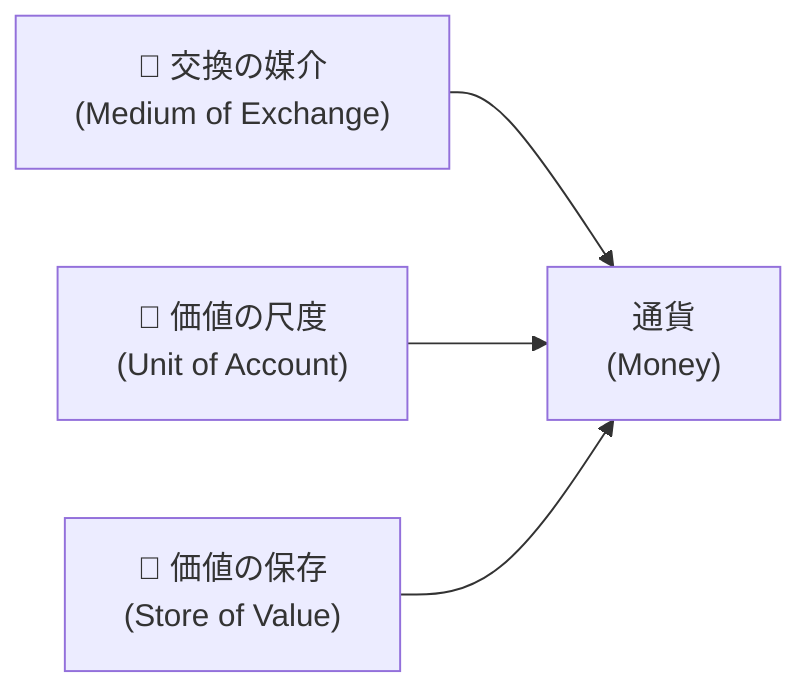
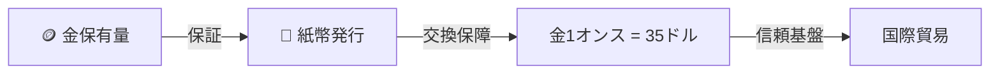
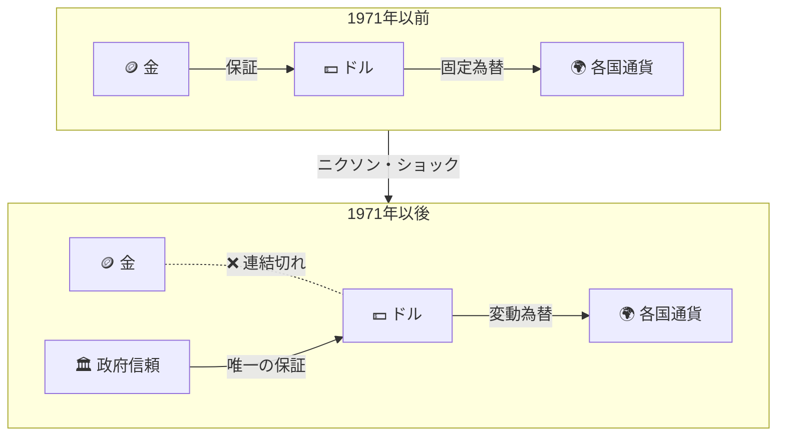

[](https://hits.sh/epheria.github.io/posts/CryptoCurrency01/)

## 序論

> この文書は **暗号通貨 — デジタル時代の通貨を理解する** シリーズの1番目の編です。

数年前まで「ビットコインが1億行く」と言えば狂った声という反応が大部分だった。ところが今は1億が割れれば「ビットコイン亡びた」という話が出る。これだけ見ても時代がどれほど早く変わっているか分かる。

私も元々「一体このデジタル切れ端が何で、なぜこんなに高いんだ？」という疑問から出発した。好奇心に関連書籍を何冊か探して読んだが、正直ビットコインより **既存金融システム** について赤い薬を飲んだ感じだった。私たちが毎日当然のように使うお金というのが思ったより粗末な基盤の上に立っているということを知れば、ビットコインがなぜ登場したのかは自然に理解できる。

しかし一歩後ろに退いて考えてみれば、私たちの大部分はもっと根本的な質問に答えられない。**「通貨とは一体何なのか？」**、**「1万ウォン札はなぜ1万ウォンの価値があるのか？」**、そして **「デジタル切れ端がどうやって数千万ウォンの価値を持つことができるのか？」**

このシリーズは通貨の哲学的本質からビットコインの技術的構造まで、伝統金融に対する「赤い薬」を飲んでみる2編の記事だ。

| 編 | タイトル | 核心テーマ |
|---|------|----------|
| 1編 (本文) | 通貨の本質 | 価値の哲学、通貨の歴史、法定通貨の限界 |
| 2編 | ビットコインの解剖学 | ブロックチェーン、作業証明、UTXO、半減期の技術的構造 |

まず私たちが毎日使いながらもその正体をちゃんと知らないもの、**通貨** の本質から掘り下げてみよう。

---

## Part 1: 価値とは何か — 通貨の哲学

### 財布の中の1万ウォンの秘密

ちょっと財布を開けてみよう。1万ウォン札が一枚あるとしよう。この紙一枚で私たちは美味しい昼食を食べることができ、映画チケットを買うことができる。ところが一回でもこんな考えをしたことあるか？

> この紙の **製造原価は約54ウォン** だ。

54ウォンの紙を持って食堂に行けば1万ウォン分の飯を食べられる。なぜ？ そこに世宗大王が印刷されているから？ 韓国銀行マークがあるから？ よく考えてみれば、これはかなり変なことだ。54ウォンの紙が1万ウォンの価値を持つというのは、その中に9,946ウォンの「何か」がもっと入っているという意味だ。その何かは物質ではない。**合意された信頼** だ。

これを理解するには、まず「価値」という概念自体を覗き見なければならない。

### 価値の逆説：水とダイヤモンド

経済学で有名な逆説が一つある。**「水は生存に必須だがほぼタダで、ダイヤモンドは使い道がほとんどないが途方もなく高い。」** これを **水とダイヤモンドの逆説**(Diamond-Water Paradox)という。

生存に水がなければ3日以内に死ぬが、ダイヤモンドがなくて死んだ人は歴史上一人もいない。ところがなぜダイヤモンドが水より数万倍高いのか？ この逆説について哲学者たちと経済学者たちは数百年論争してきた。

| 理論 | 核心主張 |
|------|---------|
| **労働価値論** (マルクス) | 価値は投入された労働量によって決定される |
| **限界効用理論** (メンガー、ワルラス) | 価値は追加1単位の主観的満足によって決定される |
| **ジンメルの価値論** | 価値は対象と主体の間の **距離** から発生する |

限界効用理論はこの逆説をすっきりと説明する。水は豊富なので一杯をもっと飲むことの満足（限界効用）は低い。反面ダイヤモンドは希少なので一つをもっと得る満足（限界効用）は高い。**総有用性ではなく、最後の一単位の有用性が価格を決定する** のだ。

ところがこれを砂漠の真ん中に持って行けばどうだろうか？ 砂漠で水一杯はダイヤモンド一粒よりはるかに高くなる。水が希少になる瞬間、限界効用が逆転するのだ。これは単純な理論ではない。価値というものがどれほど **脈絡依存的** なのかを見せる核心洞察だ。

### ゲオルク・ジンメル：お金の哲学

ドイツの社会学者 **ゲオルク・ジンメル**(Georg Simmel)は1900年に出版した『お金の哲学(Philosophie des Geldes)』で通貨の本質を最も深く探求した。120年前に書かれたこの本がビットコインを理解するのに核心的なフレームを提供するのは驚くべきだ。

ジンメルの核心洞察はこうだ：

> **価値とは対象自体に内在するのではなく、主体が対象を欲求するが完全に所有できない時 — 即ち主体と対象の間に「距離」が存在する時 — 発生する。**

簡単に言えば、**得にくいという事実自体が価値を作り出す。** 高級ブランドが意図的に生産量を制限する理由、限定版商品にプレミアムが付く理由、エルメスバーキンバッグを買うには数千万ウォンを払っても待機リストで数ヶ月を待たなければならない理由がまさにこれだ。エルメスはバッグをもっとたくさん作れるのにわざと作らない。その「距離」が価値を維持させるからだ。

ジンメルはここでもっと進む。**お金（通貨）はこの「距離」を克服するための道具** だというのだ。私が願う物と私の間の距離をお金という媒介体が連結してくれる。そしてこの過程でお金はますます **抽象的** な存在になる — 金貨から紙幣へ、紙幣から数字へ、数字から結局純粋な **信頼** へ。

この抽象化の過程をジンメルは **「お金の脱物質化」** と呼んだ。彼が1900年に予言したこの流れが、2009年にビットコインという形態で現実になった。

### 通貨になるには：三つの条件

あるものが通貨として機能するには必ず三つの条件を充足しなければならない。



| 機能 | 説明 | 例示 |
|------|------|------|
| **交換の媒介** | 物々交換なしに財貨を交換できるようにしてくれる | ウォンでどんな商品でも買える |
| **価値の尺度** | すべての財貨の価値を一つの単位で表現する | すべての商品の価格がウォン(₩)で表示される |
| **価値の保存** | 現在の価値を未来に移転できる | 今日稼いだお金を貯蓄して10年後に使用 |

ここで決定的に重要なのは **三番目の機能 — 価値の保存** だ。

一つの現実的な例を挙げてみよう。2015年にあなたが一生懸命働いて1億ウォンを集めたとしよう。そのお金を銀行預金に入れておいた。10年が過ぎた2025年、元金はそのまま1億ウォンだ。しかし2015年に1億ならソウル郊外に小さいアパートチョンセを求めることができたが、2025年の1億では同じ地域の半チョンセも難しい。数字は同じだが **購買力は深刻に減った。** あなたの通貨が「価値の保存」機能をまともに遂行できなかったのだ。

中央銀行が通貨を無限に刷り出せるとしたら？ インフレーションが爆発し、通貨の「価値保存」機能は崩れる。現実世界で実際にこんなことが起きており、これがビットコインが登場した根本的な理由だ。

---

## Part 2: 通貨の進化 — 貝殻からデジタルまで

### 物々交換の時代：「欲求の二重一致」問題

人類最初の取引方式は物々交換(Barter)だった。しかし物々交換には致命的な問題があった。経済学でこれを **「欲求の二重一致」(Double Coincidence of Wants)** 問題と呼ぶ。

> 私がリンゴを持っていて魚が必要だが、魚を持った人がリンゴではなく木を望むなら？ 取引は成立しない。

実生活に移してみればこうだ。フリーランサープログラマーであるあなたが歯科で治療を受けなければならない。歯科医師に「治療費の代わりにウェブサイト作ってあげますよ」と言ったら、歯科医師は「もうウェブサイトあるんですけど、私は車が必要です」と言う。取引にならない。自動車ディーラーを訪ねて行ったら、ディーラーは「車はあるけどリンゴ農場が必要です」と言う。この終わりのないチェーンを解決するには **みんなが望む何か** が必要だ。

取引が成立するには「私が持ったものを相手が望み、同時に相手が持ったものを私が望む」二重条件が充足されなければならない。この非効率を解決するために人類は **みんなが望む何か** を中間媒介体として使い始めた。これが通貨の始まりだ。

### 商品通貨の時代：塩から金まで

初期にはそれ自体で価値がある物を通貨として使用した。これを **商品通貨(Commodity Money)** という。

| 時代 | 通貨 | なぜ選択されたか |
|------|------|-------------|
| 古代 | 塩、貝殻 | 保存性、運搬性、普遍的需要 |
| 古代~中世 | 牛、穀物 | 実用的価値、普遍的需要 |
| BC 7世紀~ | 金・銀鋳貨 | 希少性、耐久性、分割可能性、均質性 |

面白いのは、"salary"(給与)という英語単語がラテン語 "salarium"(塩配給)から来たという事実だ。ローマ軍人たちは給与の一部を塩で受け取った。塩がその時代の通貨役割をしたのだ。「その人は自分の塩代もできない人だ(He's not worth his salt)」という英語慣用句もここから来た。

しかし塩でも牛でも穀物でも、商品通貨には限界があった。牛は半分に切ることができず（切れば死ぬ）、穀物は時間が経てば腐り、塩は雨に濡れれば溶ける。人類はより良い媒介体を必要とし、結局 **金(Gold)** に到達した。

金が数千年間通貨として君臨した理由は通貨に要求される物理的属性をほぼ完璧に充足するからだ。

```
[金が完璧な通貨である理由]

✅ 希少性     — 採掘量が制限的だ (歴史上採掘された全体金はオリンピック規格プール約3.4個分)
✅ 耐久性     — 錆びず腐食しない (古代エジプトの金が今も輝く)
✅ 分割可能性 — 溶かして小さい単位に分けられる
✅ 均質性     — どんな金塊でも同じ重さなら同じ価値だ
✅ 携帯性     — 相対的に少ない量で大きな価値を盛れる
❌ 限界       — 大量運搬が難しく、真偽鑑別が必要だ
```

なぜよりによって金だったのか？ 元素周期律表を見ればその答えがある。大部分の元素は通貨になるのに不適合だ。気体状態だったり、常温で液体だったり、放射性だったり、あまりに反応性が高かったり、あまりにありふれていたり。このフィルターを全部通過する元素は極少数であり、その中で適切な希少性と加工容易性をすべて備えたのが金だった。金が通貨になったのは偶然ではなく **化学的必然** だったわけだ。

### 銀行券と金本位制：「私の代わりに金を預かって」

金を直接持ち歩くのは不便で危険だった。中世商人が他の都市に金を運搬して山賊に奪われることはよくあることだった。それで人々は金を金細工師（後に銀行）に預けて、代わりに **「この紙を持ってくれば金Xほど返します」** という保管証を受け取った。これが **銀行券(Banknote)** の始まりだ。

時間が流れて人々は金を探していく代わりに保管証自体を取引に使い始めた。「私が金を取りに行く必要なく、この紙を君にあげるよ。君もこれを持っていけば金に変えられるから。」これが **紙幣** の誕生だ。

ところでここで **銀行家たちが何かに気づいた。** 金を預けた人100人のうち、一度に金を探しに来る人は10~20人程度だった。残り80人の金は金庫でただ遊んでいた。銀行家たちは考えた。「遊んでいる金で保管証をもっと発行して貸してあげれば利子を受け取れるのではないか？」これが **部分支給準備制度(Fractional Reserve Banking)** の誕生だ。

```
[部分支給準備制度の原理]

金庫に金100kg保管中

→ 保管証100kg分発行 (元所有者たちに)
→ 保管証80kg分追加発行 (貸出用)
→ 市場には180kg分の保管証が出回るが、金庫には100kgだけ

みんなが同時に金を探しに来ない限り... 何の問題もない。
```

もちろん、みんなが同時に金を探しに来れば銀行が破産する。これが **取り付け騒ぎ(Bank Run)** だ。歴史上数多くの銀行がこの方式で崩れた。そしてこの構造は現代銀行システムにもそのまま生きている。今あなたの銀行口座に1,000万ウォンがあるなら、銀行はそのお金の一部（普通10%未満）だけ実際に保有しており、残りは他の人に貸し出した。あなたが見る「1,000万ウォン」はデータベースの数字だけだ。

核心は、この段階で紙幣の価値はまだ金によって **保証** されているという点だ。これを **兌換通貨(Convertible Money)** あるいは **金本位制(Gold Standard)** という。



1816年イギリスが公式的に金本位制を採択した後、このシステムは約150年間世界経済の根幹になった。

### ブレトンウッズ体制：ドルが王になった日

1944年、第2次世界大戦が終わる頃、44個連合国代表730人が米国ニューハンプシャーの **ブレトンウッズ** という小さい保養地に集まった。戦後世界経済秩序をどう再編するかを論議するためだった。

なぜ米国が主導権を握ったのか？ 簡単だ。2次世界大戦当時、ヨーロッパとアジアの国家は戦争物資を買うために自国の金を米国に送った。戦争が終わった時、全世界の金の約70%が米国フォートノックス金保管所に積まれていた。金を最も多く持った者がゲームのルールを決めるのは自然なことだった。

結論はこうだった：

> **米国ドルを基軸通貨とし、ドルだけ金に交換可能にし、他のすべての通貨はドルに固定する。**

即ち、**ドル = 金の代理人** だった。金1オンス = 35ドルに固定され、他の国々は自国通貨をドルに固定為替レートで連動させた。これが **ブレトンウッズ体制(Bretton Woods System)** だ。

```
[ブレトンウッズ体制の構造]

                     🪙 金 (Gold)
                         │
                    金1オンス = $35
                         │
                    💵 米国ドル (USD)
                   ╱     │     ╲
           £ ポンド   ¥ 円     ₣ フラン
          (固定為替)  (固定為替) (固定為替)

→ 各国通貨はドルに固定
→ ドルは金に固定
→ 間接的にすべての通貨が金に連結
```

このシステムが作動するには一つの前提が必要だった：**米国が十分な金を保有していなければならない。** 他の国が「ドルを金に変えてくれ」と言う時、米国は応じなければならなかった。この約束が全体システムの基盤だった。

### ニクソン・ショック：金との決別

1960年代、米国は二つの巨大な支出に没頭した。海外では **ベトナム戦争** を行い、国内ではリンドン・ジョンソン大統領の **「偉大な社会」** プログラム — 貧困退治、医療保険、教育拡大 — に莫大な予算を注ぎ込んでいた。「銃とバターを同時に(Guns and Butter)」 — 戦争費用と福祉費用をすべて賄うという野心的な計画だった。

問題は、このお金がどこから出るかだった。答えは簡単だった。**ドルを刷り出した。** 金保有量はそのままなのにドル発行量だけずっと増えた。

これを一番最初に見抜いた人がフランスの **シャルル・ド・ゴール** 大統領だった。彼はブレトンウッズ体制を「米国の途方もない特権(exorbitant privilege)」と公開的に批判した。米国は紙（ドル）を刷って他の国の実物財貨を買い、他の国はその紙を金に変えられるという約束だけ信じて受け入れなければならなかった。ド・ゴールはフランス海軍艦艇にドルの束を積んで米国に送って金に変えてきた。他の国々も真似し始めた。

金が抜け始めると、1971年8月15日、米国の **リチャード・ニクソン** 大統領は日曜日夕方TV生放送を通じて歴史的な宣言をする：

> **「もうドルを金に交換してあげない。」**

これが **ニクソン・ショック(Nixon Shock)** だ。ニクソンはこの措置を「一時的」だとしたが、金兌換は再び復元されなかった。この瞬間、全世界通貨システムの根本が変わった。



この瞬間以後、通貨はもう金という実物によって保証されない。通貨の価値はただ **「政府がこの紙に価値があると宣言し、人々がそれを信じること」** にのみ基盤する。これが **法定通貨(Fiat Money)** だ。

"Fiat"はラテン語で **「そうなれ」(Let it be done)** という意味だ。聖書で神が「光あれ(Fiat Lux)」と言ったのと同じ語源だ。文字通り、政府が「これはお金だ」と **命令(fiat)** すればお金になるシステムだ。

ちょっと整理しよう。1971年以前にはこういう構造だった：

> 「この紙幣は金庫にある金と交換されます」 → **実物保証**

1971年以後にはこう変わった：

> 「この紙幣を政府がお金だと宣言したのでお金です」 → **宣言的価値**

これは人類歴史上最も巨大な経済的実験の始まりだった。そしてこの実験はまだ進行中だ。

---

## Part 3: 法定通貨の影 — 見えない税金

### お金はどう作られるか：現代通貨創造の原理

多くの人々が「政府がお金を刷り出す」と知っているが、現実はもう少し複雑だ。現代経済でお金が作られる方式は二つだ。

**第一、中央銀行の本源通貨発行。** 韓国銀行（または米国の連邦準備銀行）が直接通貨を発行することだ。紙幣を印刷するのもここに該当するが、現代には大部分 **電子的に** 口座に数字を入力する方式だ。文字通り、コンピュータに数字をタイピングすればお金ができる。

**第二、商業銀行の信用創造。** これがより興味深い部分だ。先ほど部分支給準備制度を説明したが、現代にもこの原理が作動する。銀行が貸出をしてくれる時、金庫からお金を取り出してあげるのではない。**貸出口座に数字を入力すればそれがお金になる。** あなたが銀行から1億を借りれば、銀行はどこからか1億を持ってくるのではなく、あなたの口座に「100,000,000」という数字を書き入れる。この瞬間、世の中に存在するお金の総量が1億増える。

```
[現代通貨創造過程]

中央銀行:  基準金利設定、国債買入/売却で本源通貨(M0)調節
     ↓
商業銀行:  貸出実行 → 口座に数字入力 → お金が「生成」される
     ↓
信用乗数:  預金 → 貸出 → 再び預金 → 再び貸出 (反復)
     ↓
結果:     本源通貨の数~数十倍の通貨量が経済に流通

例示) 本源通貨100万ウォン、支給準備率10%
      → 理論的最大通貨量: 100万 × (1/0.1) = 1,000万ウォン
      → 100万ウォンの本源通貨から1,000万ウォンのお金が「創造」される
```

このシステムで **お金の約90%は商業銀行の貸出によって作られる。** 中央銀行が刷り出す物理的通貨は全体の極一部に過ぎない。結局現代通貨システムは **借金の上に建てられたシステム** だ。誰かが貸出を受けてこそお金ができ、貸出を返せばお金が消える。全世界のすべての負債が同時に償還されれば、お金もほぼ消える。

### インフレーション：通貨価値の隠密な希釈

法定通貨システムで中央銀行は **理論的に無制限の通貨を刷り出せる。** 金本位制では金保有量が通貨発行の限界を設定したが、法定通貨ではそんな物理的制約がない。

より多くの通貨が市中に出回れば、財貨とサービスの量はそのままでお金の量だけ増えるので通貨一単位の購買力が落ちる。これが **インフレーション** の本質だ。

比喩すればこうだ。ピザ一枚を8切れに分けたが、誰かが再び16切れに分けた。切れ数は2倍になったが、ピザの全体量はそのままだ。各切れは半分に減る。お金も同様だ。市中に出回るお金の量が2倍になれば、各通貨単位の価値（購買力）は半分になる。

現実世界でこれは数値で確認できる：

```
[米国ドルの購買力変化]

1970年 $1.00 ████████████████████████████████████████  100%
1980年 $0.60 ████████████████████████                   60%
1990年 $0.42 █████████████████                           42%
2000年 $0.33 █████████████                               33%
2010年 $0.26 ██████████                                  26%
2020年 $0.18 ███████                                     18%
2025年 $0.15 ██████                                      15%

→ 1970年以後米国ドルの購買力は約85%下落
→ 1913年(連邦準備銀行設立)以後で計算すれば95%以上下落
```

1970年に1ドルで買えたものを2025年には約6.5ドルあってこそ買える。韓国も同様だ。1990年代にジャージャー麺が1,500ウォンだったが、今は7,000~8,000ウォンだ。ジャージャー麺の質が5倍良くなったのではない。通貨の価値が5分の1に減ったのだ。

これは銀行強盗が金庫からお金を盗むのではなく、**お金の価値自体を希釈させること** だ。経済学者たちはこれを **「見えない税金(Invisible Tax)」** と呼ぶ。政府が税金を上げれば人々が反発するが、通貨をもっと発行すれば人々はよく知らない。物価が上がるのを「景気が悪くて」程度に受け入れる。しかし本質は同じだ。**あなたの富を静かに持っていくこと** だ。

### 量的緩和：前例のない通貨供給拡大

2008年金融危機以後、世界各国の中央銀行は **量的緩和(Quantitative Easing, QE)** という超強手を置いた。量的緩和とは中央銀行が国債などを大量買入して市中に通貨を大規模に解き放つ政策だ。

どんな過程でなされるかもう少し解いてみればこうだ：

1. 政府が財政が不足だ → 国債(=借金証書)を発行する
2. 中央銀行がこの国債を買入する → **無からお金を作って** 国債代金を支払う
3. 政府は受け取ったお金で支出する → 市中にお金が出回る
4. 市中にお金が多くなる → 金利が下がる → 貸出が活性化される

| 時期 | イベント | 米国連準バランスシート規模 |
|------|--------|------------------------|
| 2007年 | 金融危機直前 | 約0.9兆ドル |
| 2014年 | QE3終了 | 約4.5兆ドル |
| 2020年 | コロナパンデミック | 約7.2兆ドル |
| 2022年 | ピーク | 約8.9兆ドル |

15年で約 **10倍** の通貨がシステムに流入した。0.9兆から8.9兆に。規模感がよく来ないかもしれない。8.9兆ドルは **韓国GDPの約5倍** に該当する金額だ。

短期的には景気を浮揚させるが、長期的には通貨の価値を落とす。2021~2022年に全世界的に現れた急激な物価上昇はこの量的緩和の直接的な結果の一つだった。米国は40年ぶりに最高インフレーション(9.1%)を記録し、韓国も2022年消費者物価上昇率が5%を超えた。

コロナ当時米国政府が国民に直接現金を支給した **景気浮揚小切手(Stimulus Check)** を覚えているだろう。「お金がどこから出たの？」と聞けば、答えは簡単だ。**刷り出した。** もちろんその代価は以後のインフレーションで戻ってきた。

### 歴史が証明する法定通貨の寿命

歴史的に法定通貨の平均寿命は約 **27年** だ。金本位制を放棄した後結局価値を失ったり代替された通貨の事例は数え切れないほど多い。

| 国家 | 時期 | 何が起きたか |
|------|------|----------------|
| ワイマールドイツ | 1921~1923 | 戦争賠償金支払いのための通貨乱発 → パン一塊に数十億マルク。子供たちが紙幣の束をブロックのように積んで遊び、壁紙の代わりに紙幣を壁に塗るのがもっと安いという冗談が現実になった |
| ジンバブエ | 2007~2008 | 政府財政赤字保全のための通貨乱発 → 100兆ジンバブエドル紙幣発行。物価が24時間ごとに2倍に上がった |
| ベネズエラ | 2016~現在 | 石油収入減少 + 通貨乱発 → 年間インフレーション100万%超過。通貨の重さで物の値段をつけるのが数えるより早いほどだった |
| トルコ | 2021~2023 | 非正常的低金利政策 → リラ貨価値急落。3年で購買力が1/3に下落 |

すべての事例の共通点：**政府が通貨発行の誘惑に勝てなかった。**

問題は **構造的インセンティブ** にある。政治家にとって次の選挙は4~5年後だ。通貨をもっと発行して今景気を浮揚させれば直ちに支持率が上がり、インフレーションの代価は未来の国民が払う。税金を上げれば票を失うが、通貨発行は目によく見えない。この誘惑に勝った政府は歴史上ほとんどない。

「通貨発行量を増やせる権限を持った者は結局その権限を濫用する」 — これが数千年の通貨歴史が反復的に証明してきた教訓だ。

---

## Part 4: デジタル通貨の黎明 — ビットコイン以前の試み

ビットコインが突然空からぽとりと落ちたわけではない。デジタル通貨を作ろうとする試みは数十年前からあり、各試みの失敗から教訓を得てビットコインが誕生した。

### サイファーパンク運動

1990年代、**サイファーパンク(Cypherpunk)** と呼ばれる暗号学者とプログラマーたちのグループがあった。エリック・ヒューズ、ティム・メイ、ジョン・ギルモアが共同創立したこの運動は暗号学メーリングリストを通じてアイデアを交換した。彼らは暗号学を通じて個人のプライバシーと自由を守れると信じた。彼らの核心信条はこうだった：

> **「プライバシーは選択ではなく権利であり、暗号学はそれを守る道具だ。」**

このグループのメンバー目録を見れば驚くべき名前がある。ウィキリークスのジュリアン・アサンジ、BitTorrentのブラム・コーエン、そしてビットコインの核心要素である作業証明(Proof of Work)を発明したアダム・バック(Adam Back)。サイファーパンクメーリングリストは事実上ビットコインの産室だった。

このグループでデジタル通貨に対する多様なアイデアが出た。

| プロジェクト | 年度 | 開発者 | 核心アイデア | 失敗理由 |
|----------|------|--------|-------------|----------|
| **DigiCash** | 1989 | David Chaum | ブラインド署名を利用した匿名電子通貨 | 中央サーバー依存 → 会社破産で終了 |
| **HashCash** | 1997 | Adam Back | 作業証明(PoW)概念最初提案 | 通貨ではなくスパム防止システム |
| **b-money** | 1998 | Wei Dai | 脱中央化電子通貨理論的提案 | 理論に終わる、実装されず |
| **Bit Gold** | 1998 | Nick Szabo | 作業証明 + ビザンチン障害許容 | 二重支払い問題未解決 |

ビットコインはこれらすべての先行研究の集大成だ。サトシ・ナカモトの白書にはHashCash、b-moneyなどが直接引用されている。ビットコインは無から出たのではなく、**20年間の失敗と学習の上に建てられたもの** だ。

これらすべての試みの共通的難関は **二重支払い問題(Double Spending Problem)** だった。

### 二重支払い問題：デジタル通貨のアキレス腱

デジタルデータは **コピーが無限に可能だ。** これはデジタル通貨の最も根本的な問題だ。

物理的現金は二重支払いが不可能だ。1万ウォン札をAにあげれば私の手にはもうその紙幣がない。しかしデジタルファイルは？ 写真をカカオトークで送っても私のギャラリーには原本がそのままある。音楽ファイルを友達に送っても私のコンピュータにはそのまま残っている。`Ctrl+C`, `Ctrl+V`で無限コピーが可能だ。

```
[二重支払い問題]

物理的現金:
  私 ─── 1万ウォン紙幣 ───→ A    ✅ 私にもう1万ウォンなし

デジタル通貨 (問題):
  私 ─── 1BTCコピー ───→ A     ❌ 私にも依然として1BTCあり
  私 ─── 1BTCコピー ───→ B     ❌ 無限コピー可能
```

これはプログラマーなら直観的に理解できる問題だ。ゲームでアイテムコピーバグを思い出してみろ。ユーザーがアイテムをコピーできればゲーム経済が崩れる。デジタル通貨の二重支払い問題は本質的に同じだ。

既存デジタル決済（カード、口座振替）はこの問題をどう解決するか？ **信頼される第三者(Trusted Third Party)**、即ち銀行が帳簿を管理する。「Aの口座から1万ウォンを引き、Bの口座に1万ウォンを足す」という記録を銀行が **単一帳簿** で処理する。

しかしこの方式には根本的な問題がある：

1. **単一失敗点(Single Point of Failure)** — 銀行サーバーがダウンすればすべての取引が止まる。2022年カカオデータセンター火災の時カカオペイを使えなかった経験を思い出してみろ
2. **検閲可能性** — 銀行や政府が特定人の口座を凍結できる。2022年カナダでトラックデモ隊の口座が凍結された事例がある
3. **信頼費用** — 仲介者を維持するための手数料、人件費、システム費用が発生する。海外送金手数料が3~7%に達する理由だ
4. **プライバシー侵害** — すべての取引内訳が仲介者に露出する。銀行はあなたがどこで何を買ったか全部知っている
5. **営業時間制約** — 「金融機関が休む日」には振替ができなかったり遅延される。2026年にも週末に送金すれば月曜日に処理される場合がある

**ビットコインの核心革新はまさにこの「信頼される第三者」なしに二重支払い問題を解決したことだ。** 銀行なしに、24時間365日、全世界どこへでも、誰の許可もなしに価値を転送できるシステム。これがなぜ革命的なのかはPart 5で詳しく見てみよう。

---

## Part 5: サトシ・ナカモトの登場

### 2008年の世界：完璧なタイミング

サトシ・ナカモトの白書が発表された2008年10月31日は **歴史的に完璧なタイミング** だった。

2008年9月15日、米国4位の投資銀行 **リーマン・ブラザーズ** が破産した。158年歴史の金融恐竜が一夜にして崩れたのだ。続いて保険巨人AIGが救済金融を受け、全世界の銀行が相次いで揺れた。数百万人が家を失い、数千万人が働き口を失った。

ところが政府の対応はどうだったか？ **「銀行が大きすぎて潰れさせられない(Too Big to Fail)」** と税金で銀行を救済した。リスクを抱え込んだのは銀行だったが、代価を払ったのは納税者だった。ウォール街のCEOたちは救済金融を受けながらも数百万ドルのボーナスを取りまとめた。

人々は怒ったが、できることがなかった。金融システムは少数の機関が独占しており、一般人はそのシステムに依存するしかなかった。まさにこの時点で、サトシの白書が登場する。

### 9ページの白書

2008年10月31日、暗号学メーリングリストに一通のメールが上がってきた。**サトシ・ナカモト(Satoshi Nakamoto)** という名前を使う誰かが送ったものだった。タイトルは：

> **"Bitcoin: A Peer-to-Peer Electronic Cash System"**

9ページの白書だった。9ページ。158年歴史のリーマン・ブラザーズを代替するというシステムが9ページに込められていた。この短い文書に込められたのは、**暗号学と経済的インセンティブを結合して信頼される第三者なしにデジタル通貨を実装する方法** だった。

白書の最初の文はこうだ：

> 「純粋なP2P電子通貨は金融機関を経由せず一当事者が他の当事者に直接オンライン支払いをできるようにしてくれるだろう。」

そして2009年1月3日、サトシはビットコインネットワークの最初のブロック（ジェネシスブロック）を採掘した。このブロックにサトシは意味深長なメッセージを刻み込んだ：

> **"The Times 03/Jan/2009 Chancellor on brink of second bailout for banks"**
> (タイムズ 2009.1.3 — 英国財務長官、銀行2次救済金融直前)

当時英国新聞タイムズのヘッドラインだった。銀行をまた税金で救おうとしているというニュース。サトシがなぜこのメッセージを選択したかは自明だ。**「これが私がビットコインを作った理由だ。」**

### サトシの問題意識

サトシは白書で既存金融システムの根本的問題を正確に指摘する：

> **「既存通貨の根本的な問題はそれを作動させるために必要なすべての信頼だ。中央銀行が通貨の価値を落とさないだろうと信頼しなければならないが、法定通貨の歴史はその信頼の裏切りで満ちている。」**

これは単純な技術的問題提起ではない。**哲学的、経済的問題提起** だ。Part 3で私たちが見たすべて — インフレーション、量的緩和、法定通貨の歴史的失敗 — をサトシは一文で要約したのだ。

通貨の価値を **人（機関）** に対する信頼に依存するのではなく、**数学と暗号学** に依存するようにさせるという宣言だった。

### 解決策の核心：信頼をコードで代替する

サトシの解決策を一文で要約すればこうだ：

> **「信頼(Trust)の代わりに検証(Verification)を、機関(Institution)の代わりにアルゴリズム(Algorithm)を。」**

| 既存システム | ビットコイン |
|------------|---------|
| 銀行が帳簿を管理 | すべての参加者が帳簿写本を保有 |
| 銀行を **信頼** | 数学的証明を **検証** |
| 中央サーバーに記録 | 分散したネットワークに記録 |
| 銀行が取引を承認 | ネットワーク合意で取引を承認 |
| 個人情報必要 | 暗号学的キーだけ必要 |
| 営業時間内取引 | 24時間365日 |
| 国境によって制限 | インターネットがあればどこでも |

比喩すればこうだ。既存システムは **手紙を郵便局（銀行）を通じて送ること** だ。郵便局が手紙を紛失したり、検閲したり、休む日には送れない。ビットコインは **電子メールのように直接送ること** だ。仲介者なしに、即時、全世界どこへでも。

この構造がどのように作動するか — ブロックチェーン、作業証明、UTXO、半減期の具体的技術 — は2編で深く扱う。

### サトシは誰か？

サトシ・ナカモトの正体は2026年現在までも明かされていない。確かなのは次のようだ：

- 約 **110万BTC** を保有したと推定される（初期採掘分）。現在相場で数十兆ウォンに該当する
- 2010年12月以後公開活動を中断した。最後のメールには「他の仕事に移った」とだけ書かれていた
- 保有推定ビットコインを **ただ一度も動かさなかった**。数十兆ウォンを置いても1サトシ（1億分の1BTC）も使わなかった
- イギリス式英語を使用し、UTC基準特定時間帯に主に活動した

数多くの候補が取り上げられた — ニック・スザボ、ハル・フィニー、クレイグ・ライトなど。クレイグ・ライトは自らサトシだと主張したが、裁判所で認められなかった。ハル・フィニーはサトシから最初のビットコイン転送を受けた人物であり、最も有力な候補の一人だったが、2014年ALS（ルー・ゲーリッグ病）で死亡した。

サトシが自分の正体を隠して去ったこと自体がビットコインの哲学を象徴する。**特定個人や機関に依存しないシステム。** 創始者さえ消えても作動するシステム。CEOがいない会社、代表がいない政党。これがまさに **脱中央化(Decentralization)** の本質だ。

リナックスを考えてみよう。リーナス・トーバルズが明日引退してもリナックスは回る。ビットコインも同様だ。サトシが消えて16年になったが、ビットコインネットワークはただ一度も止まらなかった。

---

## Part 6: ビットコインが価値を持つ理由

「デジタル切れ端がなぜ価値があるのか」という質問にこれで体系的に答えられる。

### 価値の根源：金との比較

先ほどジンメルの価値論を思い出してみよう。「距離が価値を作る。」ビットコインでその「距離」は何なのか？ **総2,100万個という絶対的上限** だ。もっと作りたくても作れない。どんな大統領も、どんな中央銀行総裁も、さらにサトシ・ナカモト本人も。

| 属性 | 金(Gold) | ビットコイン(Bitcoin) | 法定通貨(Fiat) |
|------|---------|------------------|---------------|
| **希少性** | 地球上有閑な埋蔵量 | 2,100万個上限 (コードで保障) | ❌ 無制限発行可能 |
| **耐久性** | 腐食しない | ネットワークが存在する限り永久 | 物理的摩耗、政策による消滅 |
| **分割可能性** | 物理的に難しい | 1億分の1 (1 satoshi)まで分割 | 法的最小単位存在 |
| **携帯性** | 重く体積が大きい | インターネットどこでも転送可能 | 物理的現金は非効率 |
| **検証可能性** | 専門装備必要 | 誰でもブロックチェーンで検証可能 | 偽造鑑別必要 |
| **検閲抵抗性** | 物理的没収可能 | 個人キーさえあればアクセス可能 | 口座凍結可能 |
| **脱中央化** | 物理的に分散可能 | 数万個ノードに分散 | ❌ 中央銀行が統制 |
| **発行計画** | 予測不可 (鉱山発見など) | コードによって100%予測可能 | ❌ 政府裁量に依存 |
| **移転費用** | 運搬費、保険料など高費用 | 手数料数ドル水準 | 海外送金3~7%手数料 |
| **国境制限** | 税関、搬出制限 | インターネットさえあれば制限なし | 外為規制、限度制限 |

ビットコインは金の長所（希少性、耐久性）を持ちながら金の短所（携帯性、分割可能性）を解決した。だからビットコインを **「デジタルゴールド(Digital Gold)」** と呼ぶのだ。

1億ウォン分の金を他の国に送るにはどうしなければならないか？ 保険に加入し、運送業者を雇い、税関を通過しなければならない。数日かかり、費用も相当だ。1億ウォン分のビットコインを他の国に送るには？ スマートフォンでアドレスを入力して「送信」を押せばいい。10分以内に到着する。手数料は数ドル。

### ビットコインの価値を作る5つの属性

1. **供給が制限されなければならない** — ビットコインは2,100万個に制限。金も有限だが新しい鉱山が発見され得る。ビットコインはコードで上限が確定されている
2. **偽造が不可能でなければならない** — SHA-256とブロックチェーンが保障。金は精巧な偽造が可能だが、ビットコインは数学的に偽造が不可能だ
3. **所有権が明確でなければならない** — 公開キー/個人キー暗号学が保障。裁判所命令も、ハッカーもあなたのビットコインを奪えない（個人キーを守る限り）
4. **移転(転送)が容易でなければならない** — P2Pネットワークで全世界どこでも転送可能
5. **特定主体の介入があってはならない** — 脱中央化された合意メカニズム。誰もビットコインネットワークを「消す」ことができない

この五つがすべて充足される時、デジタル資産は価値を持つことができる。

### コインベースCEOブライアン・アームストロングのビジョン

コインベースCEOブライアン・アームストロングは最近のインタビューでビットコインの長期的価値と金融システムの革新に対する確固たるビジョンを提示した。いくつか核心ポイントを整理すると：

- **資産トークン化**: 不動産、株式、美術品など伝統資産をブロックチェーン上のトークンにすれば、全世界誰でも少額で投資に参加できる。韓国にいながらマンハッタンビルの0.001%を所有することが可能になる。金融民主化の実現だ
- **AIエージェントの決済手段**: AIがますます自律的に業務を遂行するようになれば、AIエージェント間に決済が必要になる。銀行口座を作れないAIにとって暗号通貨は唯一の決済手段になる
- **送金革命**: 現在海外送金手数料は平均6.3%だ。フィリピンから韓国に100万ウォンを送れば6万3千ウォンが手数料で消える。暗号通貨を利用すればこの費用が数百ウォン水準に減る

アームストロングは **今後10年内に暗号通貨が送金、貸出、資金調達など金融全般にわたって効率性を極大化するだろう** と展望し、資産の一定部分をビットコインに配分することを勧告した。

---

## 整理：通貨の未来を問う

この記事で私たちは次を調べた：

```
[通貨の進化タイムライン]

物々交換 → 商品通貨(金) → 金本位紙幣 → ブレトンウッズ → ニクソン・ショック → 法定通貨 → ???
                                                                              ↑
                                                                          ビットコイン
```

通貨の歴史は **信頼の対象がますます抽象化される過程** だった：
- 物々交換：物自体を信頼
- 金：金という物質を信頼
- 金本位紙幣：「この紙が金と交換される」という約束を信頼
- 法定通貨：政府を信頼
- ビットコイン：**数学とコードを信頼**

各段階ごとに「これが通貨になれるか」という懐疑論があった。中世商人たちは「金の代わりに紙を受け取れと？ 狂った声！」と言っただろう。それが今の現実だ。「デジタル切れ端がお金だと？ 狂った声！」 — これは未来が判断するだろう。

通貨の歴史を知れば、ビットコインがもはや「投機」や「賭博」だけに見えなくなる。もちろん投機的要素があるのは事実だ。しかしその根本には **数千年間繰り返された通貨の失敗を技術で解決しようとする試み** がある。その試みが成功するか失敗するかはまだ分からない。重要なのは **理解** だ。

2編ではビットコインがこれらすべてを **具体的にどう実装するのか** — ブロックチェーンの構造、SHA-256ハッシュ、マークルツリー、UTXO、作業証明、半減期など — 技術の解剖学を解いてみる。

---

## 参考資料

- [Satoshi Nakamoto, "Bitcoin: A Peer-to-Peer Electronic Cash System" (2008)](https://bitcoin.org/bitcoin.pdf)
- [Georg Simmel, "The Philosophy of Money" (1900)](https://en.wikipedia.org/wiki/The_Philosophy_of_Money)
- [ゲオルク・ジンメルの価値論 — ソウル大学校論文](https://s-space.snu.ac.kr/handle/10371/87326)
- [貨幣史 — ウィキペディア](https://ja.wikipedia.org/wiki/%E8%B2%A8%E5%B9%A3%E5%8F%B2)
- [金本位制 — ナムウィキ](https://namu.wiki/w/%EA%B8%88%EB%B3%B8%EC%9C%84%EC%A0%9C%EB%8F%84)
- [ニクソン・ショック — ウィキペディア](https://ja.wikipedia.org/wiki/%E3%83%8B%E3%82%AF%E3%82%BD%E3%83%B3%E3%83%BB%E3%82%B7%E3%83%A7%E3%83%83%E3%82%AF)
- [ビットコイン白書韓国語翻訳版](https://mincheol.im/bitcoin)
- [ビットコイン白書読み — Xangle](https://xangle.io/research/detail/887)
- [Fiat Moneyとは何か — Medium](https://kwlim.medium.com/fiat-money%EB%9E%80-%EB%AC%B4%EC%97%87%EC%9D%BC%EA%B9%8C-9882b9878e42)
- [Monetary Evolution: How Societies Shaped Money — arXiv](https://arxiv.org/html/2501.10443v1)
- [Fractional-Reserve Banking — Investopedia](https://www.investopedia.com/terms/f/fractionalreservebanking.asp)
- [2008 Financial Crisis — Federal Reserve History](https://www.federalreservehistory.org/essays/great-recession-and-its-aftermath)
