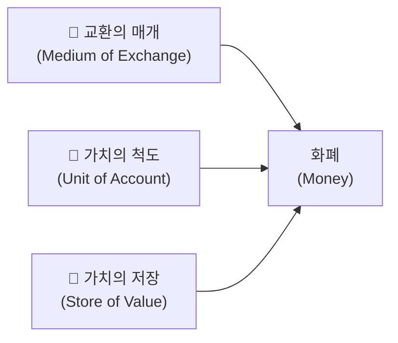
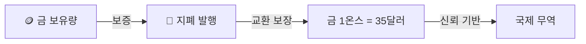
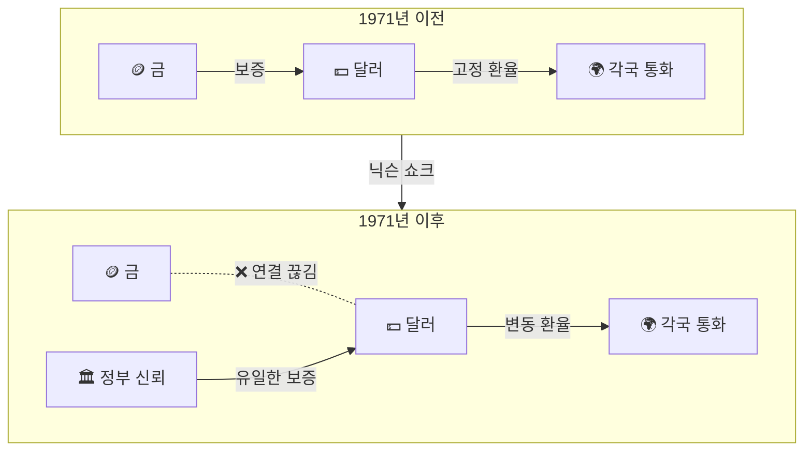

[](https://hits.sh/epheria.github.io/posts/CryptoCurrency01/)

## 서론

> 이 문서는 **암호화폐 — 디지털 시대의 화폐를 이해하기** 시리즈의 1번째 편입니다.

몇 년 전만 해도 "비트코인이 1억 간다"고 하면 미친 소리라는 반응이 대부분이었다. 그런데 지금은 1억이 깨지면 "비트코인 망했다"는 이야기가 나온다. 이것만 봐도 시대가 얼마나 빠르게 변하고 있는지 알 수 있다.

나도 원래 "대체 이 디지털 쪼가리가 뭐길래 왜 이렇게 비싼거지?"라는 의문에서 출발했다. 호기심에 관련 서적을 몇 권 찾아 읽었는데, 솔직히 비트코인보다 **기존 금융 시스템**에 대해 빨간약을 먹은 느낌이었다. 우리가 매일 당연하게 쓰는 돈이라는 게 생각보다 허술한 기반 위에 서 있다는 걸 알게 되면, 비트코인이 왜 등장했는지는 자연스럽게 이해된다.

하지만 한 발짝 뒤로 물러나서 생각해보면, 우리 대부분은 더 근본적인 질문에 답하지 못한다. **"화폐란 대체 무엇인가?"**, **"1만원짜리 지폐는 왜 1만원의 가치가 있는가?"**, 그리고 **"디지털 쪼가리가 어떻게 수천만 원의 가치를 가질 수 있는가?"**

이 시리즈는 화폐의 철학적 본질부터 비트코인의 기술적 구조까지, 전통 금융에 대한 "빨간약"을 먹어보는 2편의 글이다.

| 편 | 제목 | 핵심 주제 |
|---|------|----------|
| 1편 (본 글) | 화폐의 본질 | 가치의 철학, 화폐의 역사, 법정화폐의 한계 |
| 2편 | 비트코인의 해부학 | 블록체인, 작업증명, UTXO, 반감기의 기술적 구조 |

먼저 우리가 매일 사용하면서도 그 정체를 제대로 모르는 것, **화폐**의 본질부터 파헤쳐보자.

---

## Part 1: 가치란 무엇인가 — 화폐의 철학

### 지갑 속 1만원의 비밀

잠깐 지갑을 열어보자. 1만원짜리 지폐가 한 장 있다고 하자. 이 종이 한 장으로 우리는 맛있는 점심을 먹을 수 있고, 영화표를 살 수 있다. 그런데 한 번이라도 이런 생각을 해본 적 있는가?

> 이 종이의 **제조 원가는 약 54원**이다.

54원짜리 종이를 들고 식당에 가면 1만원어치 밥을 먹을 수 있다. 왜? 거기에 세종대왕이 인쇄되어 있으니까? 한국은행 마크가 있으니까? 곰곰이 생각해보면, 이건 꽤 이상한 일이다. 54원짜리 종이가 1만원의 가치를 가진다는 건, 그 안에 9,946원의 "무언가"가 더 들어있다는 뜻이다. 그 무언가는 물질이 아니다. **합의된 신뢰**다.

이것을 이해하려면, 먼저 "가치"라는 개념 자체를 들여다봐야 한다.

### 가치의 역설: 물과 다이아몬드

경제학에서 유명한 역설이 하나 있다. **"물은 생존에 필수적이지만 거의 공짜이고, 다이아몬드는 쓸모가 거의 없지만 엄청나게 비싸다."** 이것을 **물-다이아몬드 역설**(Diamond-Water Paradox)이라 한다.

생존에 물이 없으면 3일 안에 죽지만, 다이아몬드가 없어서 죽은 사람은 역사상 한 명도 없다. 그런데 왜 다이아몬드가 물보다 수만 배 비쌀까? 이 역설에 대해 철학자들과 경제학자들은 수백 년간 논쟁해왔다.

| 이론 | 핵심 주장 |
|------|---------|
| **노동가치론** (마르크스) | 가치는 투입된 노동량에 의해 결정된다 |
| **한계효용이론** (멩거, 왈라스) | 가치는 추가 1단위의 주관적 만족에 의해 결정된다 |
| **짐멜의 가치론** | 가치는 대상과 주체 사이의 **거리**에서 발생한다 |

한계효용이론은 이 역설을 깔끔하게 설명한다. 물은 풍부하기 때문에 한 잔을 더 마시는 것의 만족(한계효용)은 낮다. 반면 다이아몬드는 희소하기 때문에 하나를 더 얻는 것의 만족(한계효용)은 높다. **총 유용성이 아니라, 마지막 한 단위의 유용성이 가격을 결정하는 것**이다.

그런데 이걸 사막 한가운데로 가져가면 어떨까? 사막에서 물 한 잔은 다이아몬드 한 알보다 훨씬 비싸진다. 물이 희소해지는 순간, 한계효용이 역전되는 것이다. 이건 단순한 이론이 아니다. 가치라는 게 얼마나 **맥락 의존적**인지를 보여주는 핵심 통찰이다.

### 게오르그 짐멜: 돈의 철학

독일의 사회학자 **게오르그 짐멜**(Georg Simmel)은 1900년에 출간한 『돈의 철학(Philosophie des Geldes)』에서 화폐의 본질을 가장 깊이 있게 탐구했다. 120년 전에 쓰인 이 책이 비트코인을 이해하는 데 핵심적인 프레임을 제공한다는 게 놀랍다.

짐멜의 핵심 통찰은 이렇다:

> **가치란 대상 자체에 내재하는 것이 아니라, 주체가 대상을 욕구하되 완전히 소유하지 못할 때 — 즉 주체와 대상 사이에 '거리'가 존재할 때 — 발생한다.**

쉽게 말하면, **얻기 어렵다는 사실 자체가 가치를 만들어낸다.** 명품 브랜드가 의도적으로 생산량을 제한하는 이유, 한정판 상품에 프리미엄이 붙는 이유, 에르메스 버킨백을 사려면 수천만 원을 내고도 대기 리스트에서 몇 달을 기다려야 하는 이유가 바로 이것이다. 에르메스는 가방을 더 많이 만들 수 있는데도 일부러 안 만든다. 그 "거리"가 가치를 유지시키기 때문이다.

짐멜은 여기서 더 나아간다. **돈(화폐)은 이 '거리'를 극복하기 위한 도구**라는 것이다. 내가 원하는 물건과 나 사이의 거리를 돈이라는 매개체가 연결해준다. 그리고 이 과정에서 돈은 점점 더 **추상적**인 존재가 된다 — 금화에서 지폐로, 지폐에서 숫자로, 숫자에서 결국 순수한 **신뢰**로.

이 추상화의 과정을 짐멜은 **"돈의 탈물질화"**라고 불렀다. 그가 1900년에 예언한 이 흐름이, 2009년에 비트코인이라는 형태로 현실이 되었다.

### 화폐가 되려면: 세 가지 조건

어떤 것이 화폐로 기능하려면 반드시 세 가지 조건을 충족해야 한다.



| 기능 | 설명 | 예시 |
|------|------|------|
| **교환의 매개** | 물물교환 없이 재화를 교환할 수 있게 해준다 | 원화로 어떤 상품이든 살 수 있다 |
| **가치의 척도** | 모든 재화의 가치를 하나의 단위로 표현한다 | 모든 상품의 가격이 원(₩)으로 표시된다 |
| **가치의 저장** | 현재의 가치를 미래로 이전할 수 있다 | 오늘 번 돈을 저축했다가 10년 후에 사용 |

여기서 결정적으로 중요한 것은 **세 번째 기능 — 가치의 저장**이다.

한 가지 현실적인 예를 들어보자. 2015년에 당신이 열심히 일해서 1억 원을 모았다고 치자. 그 돈을 은행 예금에 넣어뒀다. 10년이 지난 2025년, 원금은 그대로 1억 원이다. 하지만 2015년에 1억이면 서울 외곽에 작은 아파트 전세를 구할 수 있었는데, 2025년의 1억으로는 같은 지역 반전세도 어렵다. 숫자는 같지만 **구매력은 심각하게 줄었다.** 당신의 화폐가 "가치의 저장" 기능을 제대로 수행하지 못한 것이다.

중앙은행이 화폐를 무한히 찍어낼 수 있다면? 인플레이션이 폭발하고, 화폐의 "가치 저장" 기능은 무너진다. 현실 세계에서 실제로 이런 일이 벌어지고 있으며, 이것이 비트코인이 등장한 근본적인 이유다.

---

## Part 2: 화폐의 진화 — 조개껍데기에서 디지털까지

### 물물교환의 시대: "욕구의 이중 일치" 문제

인류 최초의 거래 방식은 물물교환(Barter)이었다. 하지만 물물교환에는 치명적인 문제가 있었다. 경제학에서 이를 **"욕구의 이중 일치"(Double Coincidence of Wants)** 문제라고 부른다.

> 내가 사과를 가지고 있고 생선이 필요한데, 생선을 가진 사람이 사과가 아니라 나무를 원한다면? 거래는 성립하지 않는다.

실생활로 옮겨보면 이렇다. 프리랜서 프로그래머인 당신이 치과에서 치료를 받아야 한다. 치과의사에게 "치료비 대신 웹사이트 만들어 드릴게요"라고 했더니, 치과의사는 "이미 웹사이트 있는데요, 저는 차가 필요해요"라고 한다. 거래가 안 된다. 자동차 딜러를 찾아갔더니, 딜러는 "차는 있는데 사과 농장이 필요해요"라고 한다. 이 끝없는 체인을 해결하려면 **모두가 원하는 무언가**가 필요하다.

거래가 성립하려면 "내가 가진 것을 상대가 원하고, 동시에 상대가 가진 것을 내가 원하는" 이중 조건이 충족되어야 한다. 이 비효율을 해결하기 위해 인류는 **모두가 원하는 무언가**를 중간 매개체로 사용하기 시작했다. 이것이 화폐의 시작이다.

### 상품화폐의 시대: 소금에서 금까지

초기에는 그 자체로 가치가 있는 물건을 화폐로 사용했다. 이를 **상품화폐(Commodity Money)**라 한다.

| 시대 | 화폐 | 왜 선택되었나 |
|------|------|-------------|
| 고대 | 소금, 조개껍데기 | 보존성, 운반성, 보편적 수요 |
| 고대~중세 | 소, 곡물 | 실용적 가치, 보편적 수요 |
| BC 7세기~ | 금·은 주화 | 희소성, 내구성, 분할 가능성, 균질성 |

재미있는 건, "salary"(급여)라는 영어 단어가 라틴어 "salarium"(소금 배급)에서 왔다는 사실이다. 로마 군인들은 급여의 일부를 소금으로 받았다. 소금이 그 시대의 화폐 역할을 했던 것이다. "그 사람은 자기 소금값도 못하는 사람이야(He's not worth his salt)"라는 영어 관용구도 여기서 왔다.

하지만 소금이든 소든 곡물이든, 상품화폐에는 한계가 있었다. 소는 반으로 자를 수 없고(자르면 죽는다), 곡물은 시간이 지나면 썩고, 소금은 비에 젖으면 녹는다. 인류는 더 나은 매개체를 필요로 했고, 결국 **금(Gold)**에 도달했다.

금이 수천 년간 화폐로 군림한 이유는 화폐에 요구되는 물리적 속성을 거의 완벽하게 충족하기 때문이다.

```
[금이 완벽한 화폐인 이유]

✅ 희소성     — 채굴량이 제한적이다 (역사상 채굴된 전체 금은 올림픽 규격 수영장 약 3.4개 분량)
✅ 내구성     — 녹슬지 않고 부식되지 않는다 (고대 이집트의 금이 지금도 빛난다)
✅ 분할 가능성 — 녹여서 작은 단위로 나눌 수 있다
✅ 균질성     — 어떤 금덩이든 같은 무게면 같은 가치다
✅ 휴대성     — 상대적으로 적은 양으로 큰 가치를 담을 수 있다
❌ 한계       — 대량 운반이 어렵고, 진위 감별이 필요하다
```

왜 하필 금이었을까? 원소 주기율표를 보면 그 답이 있다. 대부분의 원소는 화폐가 되기에 부적합하다. 기체 상태이거나, 상온에서 액체이거나, 방사성이거나, 너무 반응성이 높거나, 너무 흔하거나. 이 필터를 다 통과하는 원소는 극소수이고, 그중에서 적절한 희소성과 가공 용이성을 모두 갖춘 것이 금이었다. 금이 화폐가 된 건 우연이 아니라 **화학적 필연**이었던 셈이다.

### 은행권과 금본위제: "나 대신 금을 맡아줘"

금을 직접 들고 다니는 것은 불편하고 위험했다. 중세 상인이 다른 도시로 금을 운반하다가 산적에게 털리는 일은 흔한 일이었다. 그래서 사람들은 금을 금세공업자(나중에 은행)에게 맡기고, 대신 **"이 종이를 가져오면 금 X만큼 돌려드립니다"**라는 보관증을 받았다. 이것이 **은행권(Banknote)**의 시작이다.

시간이 흘러 사람들은 금을 찾아가는 대신 보관증 자체를 거래에 사용하기 시작했다. "내가 금을 가지러 갈 필요 없이, 이 종이를 네게 줄게. 너도 이걸 가져가면 금으로 바꿀 수 있으니까." 이것이 **지폐**의 탄생이다.

그런데 여기서 **은행가들이 뭔가를 알아챘다.** 금을 맡긴 사람 100명 중, 한꺼번에 금을 찾으러 오는 사람은 10~20명 정도였다. 나머지 80명의 금은 금고에 그냥 놀고 있었다. 은행가들은 생각했다. "놀고 있는 금으로 보관증을 더 발행해서 빌려주면 이자를 받을 수 있지 않을까?" 이것이 **부분지급준비제도(Fractional Reserve Banking)**의 탄생이다.

```
[부분지급준비제도의 원리]

금고에 금 100kg 보관 중

→ 보관증 100kg분 발행 (원래 소유자들에게)
→ 보관증 80kg분 추가 발행 (대출용)
→ 시장에는 180kg분의 보관증이 돌아다니지만, 금고에는 100kg뿐

모두가 동시에 금을 찾으러 오지 않는 한... 아무 문제 없다.
```

물론, 모두가 동시에 금을 찾으러 오면 은행이 파산한다. 이것이 **뱅크런(Bank Run)**이다. 역사상 수많은 은행이 이 방식으로 무너졌다. 그리고 이 구조는 현대 은행 시스템에도 그대로 살아있다. 지금 당신의 은행 계좌에 1,000만 원이 있다면, 은행은 그 돈의 일부(보통 10% 미만)만 실제로 보유하고 있고, 나머지는 다른 사람에게 대출해줬다. 당신이 보는 "1,000만 원"은 데이터베이스의 숫자일 뿐이다.

핵심은, 이 단계에서 지폐의 가치는 아직 금에 의해 **보증**되고 있다는 점이다. 이것을 **태환 화폐(Convertible Money)** 혹은 **금본위제(Gold Standard)**라 한다.



1816년 영국이 공식적으로 금본위제를 채택한 이후, 이 시스템은 약 150년간 세계 경제의 근간이 되었다.

### 브레턴우즈 체제: 달러가 왕이 된 날

1944년, 제2차 세계대전이 끝나갈 무렵, 44개 연합국 대표 730명이 미국 뉴햄프셔의 **브레턴우즈**라는 작은 휴양지에 모였다. 전후 세계 경제 질서를 어떻게 재편할 것인가를 논의하기 위해서였다.

왜 미국이 주도권을 잡았을까? 간단하다. 2차 세계대전 당시, 유럽과 아시아의 국가들은 전쟁 물자를 사기 위해 자국의 금을 미국에 보냈다. 전쟁이 끝났을 때, 전 세계 금의 약 70%가 미국 포트녹스 금 보관소에 쌓여 있었다. 금을 가장 많이 가진 자가 게임의 규칙을 정하는 것은 자연스러운 일이었다.

결론은 이랬다:

> **미국 달러를 기축통화로 삼고, 달러만 금으로 교환 가능하게 하며, 다른 모든 통화는 달러에 고정한다.**

즉, **달러 = 금의 대리인**이었다. 금 1온스 = 35달러로 고정되었고, 다른 나라들은 자국 화폐를 달러에 고정 환율로 연동시켰다. 이것이 **브레턴우즈 체제(Bretton Woods System)**다.

```
[브레턴우즈 체제의 구조]

                     🪙 금 (Gold)
                         │
                    금 1온스 = $35
                         │
                    💵 미국 달러 (USD)
                   ╱     │     ╲
           £ 파운드   ¥ 엔화   ₣ 프랑
          (고정환율)  (고정환율) (고정환율)

→ 각국 화폐는 달러에 고정
→ 달러는 금에 고정
→ 간접적으로 모든 화폐가 금에 연결
```

이 시스템이 작동하려면 한 가지 전제가 필요했다: **미국이 충분한 금을 보유하고 있어야 한다.** 다른 나라가 "달러를 금으로 바꿔달라"고 할 때, 미국은 응해야 했다. 이 약속이 전체 시스템의 기반이었다.

### 닉슨 쇼크: 금과의 이별

1960년대, 미국은 두 가지 거대한 지출에 몰두했다. 해외에서는 **베트남 전쟁**을 치르고, 국내에서는 린든 존슨 대통령의 **"위대한 사회"** 프로그램 — 빈곤 퇴치, 의료보험, 교육 확대 — 에 막대한 예산을 쏟아붓고 있었다. "총과 버터를 동시에(Guns and Butter)" — 전쟁 비용과 복지 비용을 모두 감당하겠다는 야심찬 계획이었다.

문제는, 이 돈이 어디서 나오느냐였다. 답은 간단했다. **달러를 찍어냈다.** 금 보유량은 그대로인데 달러 발행량만 계속 늘어났다.

이걸 가장 먼저 간파한 사람이 프랑스의 **샤를 드골** 대통령이었다. 그는 브레턴우즈 체제를 "미국의 엄청난 특권(exorbitant privilege)"이라고 공개적으로 비판했다. 미국은 종이(달러)를 찍어서 다른 나라의 실물 재화를 사고, 다른 나라는 그 종이를 금으로 바꿀 수 있다는 약속만 믿고 받아들여야 했다. 드골은 프랑스 해군 함정에 달러 뭉치를 실어 미국으로 보내 금으로 바꿔왔다. 다른 나라들도 따라하기 시작했다.

금이 빠져나가기 시작하자, 1971년 8월 15일, 미국의 **리처드 닉슨** 대통령은 일요일 저녁 TV 생방송을 통해 역사적인 선언을 한다:

> **"더 이상 달러를 금으로 교환해주지 않겠다."**

이것이 **닉슨 쇼크(Nixon Shock)**다. 닉슨은 이 조치를 "일시적"이라고 했지만, 금 태환은 다시 복원되지 않았다. 이 순간, 전 세계 화폐 시스템의 근본이 바뀌었다.



이 순간 이후, 화폐는 더 이상 금이라는 실물에 의해 보증되지 않는다. 화폐의 가치는 오직 **"정부가 이 종이에 가치가 있다고 선언하고, 사람들이 그것을 믿는 것"** 에만 기반한다. 이것이 **법정화폐(Fiat Money)**다.

"Fiat"은 라틴어로 **"그렇게 되라"(Let it be done)**는 뜻이다. 성경에서 신이 "빛이 있으라(Fiat Lux)"라고 한 것과 같은 어원이다. 말 그대로, 정부가 "이것은 돈이다"라고 **명령(fiat)**하면 돈이 되는 시스템이다.

잠깐 정리하자. 1971년 이전에는 이런 구조였다:

> "이 지폐는 금고에 있는 금과 교환될 수 있습니다" → **실물 보증**

1971년 이후에는 이렇게 바뀌었다:

> "이 지폐를 정부가 돈이라고 선언했으므로 돈입니다" → **선언적 가치**

이것은 인류 역사상 가장 거대한 경제적 실험의 시작이었다. 그리고 이 실험은 아직 진행 중이다.

---

## Part 3: 법정화폐의 그늘 — 보이지 않는 세금

### 돈은 어떻게 만들어지는가: 현대 화폐 창조의 원리

많은 사람들이 "정부가 돈을 찍어낸다"고 알고 있는데, 현실은 조금 더 복잡하다. 현대 경제에서 돈이 만들어지는 방식은 두 가지다.

**첫째, 중앙은행의 본원통화 발행.** 한국은행(또는 미국의 연방준비은행)이 직접 화폐를 발행하는 것이다. 지폐를 인쇄하는 것도 여기에 해당하지만, 현대에는 대부분 **전자적으로** 계좌에 숫자를 입력하는 방식이다. 문자 그대로, 컴퓨터에 숫자를 타이핑하면 돈이 생긴다.

**둘째, 상업은행의 신용 창조.** 이것이 더 흥미로운 부분이다. 앞서 부분지급준비제도를 설명했는데, 현대에도 이 원리가 작동한다. 은행이 대출을 해줄 때, 금고에서 돈을 꺼내서 주는 게 아니다. **대출 계좌에 숫자를 입력하면 그것이 돈이 된다.** 당신이 은행에서 1억을 대출받으면, 은행은 어딘가에서 1억을 가져오는 게 아니라, 당신의 계좌에 "100,000,000"이라는 숫자를 써넣는다. 이 순간, 세상에 존재하는 돈의 총량이 1억 늘어난다.

```
[현대 화폐 창조 과정]

중앙은행:  기준금리 설정, 국채 매입/매각으로 본원통화(M0) 조절
     ↓
상업은행:  대출 실행 → 계좌에 숫자 입력 → 돈이 "생성"됨
     ↓
신용승수:  예금 → 대출 → 다시 예금 → 다시 대출 (반복)
     ↓
결과:     본원통화의 수~수십 배의 통화량이 경제에 유통

예시) 본원통화 100만 원, 지급준비율 10%
      → 이론적 최대 통화량: 100만 × (1/0.1) = 1,000만 원
      → 100만 원의 본원통화에서 1,000만 원의 돈이 "창조"됨
```

이 시스템에서 **돈의 약 90%는 상업은행의 대출에 의해 만들어진다.** 중앙은행이 찍어내는 물리적 화폐는 전체의 극히 일부에 불과하다. 결국 현대 화폐 시스템은 **빚 위에 세워진 시스템**이다. 누군가가 대출을 받아야 돈이 생기고, 대출을 갚으면 돈이 사라진다. 전 세계의 모든 부채가 동시에 상환되면, 돈도 거의 사라진다.

### 인플레이션: 화폐 가치의 은밀한 희석

법정화폐 시스템에서 중앙은행은 **이론적으로 무제한의 화폐를 찍어낼 수 있다.** 금본위제에서는 금 보유량이 화폐 발행의 한계를 설정했지만, 법정화폐에서는 그런 물리적 제약이 없다.

더 많은 화폐가 시중에 풀리면, 재화와 서비스의 양은 그대로인데 돈의 양만 늘어나므로 화폐 한 단위의 구매력이 떨어진다. 이것이 **인플레이션**의 본질이다.

비유하자면 이렇다. 피자 한 판을 8조각으로 나눴는데, 누군가가 다시 16조각으로 나눴다. 조각 수는 2배가 되었지만, 피자의 전체 양은 그대로다. 각 조각은 절반으로 줄어든다. 돈도 마찬가지다. 시중에 돌아다니는 돈의 양이 2배가 되면, 각 화폐 단위의 가치(구매력)는 절반이 된다.

현실 세계에서 이것은 수치로 확인할 수 있다:

```
[미국 달러의 구매력 변화]

1970년 $1.00 ████████████████████████████████████████  100%
1980년 $0.60 ████████████████████████                   60%
1990년 $0.42 █████████████████                           42%
2000년 $0.33 █████████████                               33%
2010년 $0.26 ██████████                                  26%
2020년 $0.18 ███████                                     18%
2025년 $0.15 ██████                                      15%

→ 1970년 이후 미국 달러의 구매력은 약 85% 하락
→ 1913년(연방준비은행 설립) 이후로 따지면 95% 이상 하락
```

1970년에 1달러로 살 수 있던 것을 2025년에는 약 6.5달러가 있어야 살 수 있다. 한국도 마찬가지다. 1990년대에 자장면이 1,500원이었는데, 지금은 7,000~8,000원이다. 짜장면의 질이 5배 좋아진 게 아니다. 화폐의 가치가 5분의 1로 줄어든 것이다.

이것은 은행 강도가 금고에서 돈을 훔치는 것이 아니라, **돈의 가치 자체를 희석시키는 것**이다. 경제학자들은 이를 **"보이지 않는 세금(Invisible Tax)"**이라 부른다. 정부가 세금을 올리면 사람들이 반발하지만, 화폐를 더 발행하면 사람들은 잘 모른다. 물가가 오르는 것을 "경기가 안 좋아서" 정도로 받아들인다. 하지만 본질은 같다. **당신의 부를 조용히 가져가는 것**이다.

### 양적완화: 전례 없는 화폐 공급 확대

2008년 금융위기 이후, 세계 각국의 중앙은행은 **양적완화(Quantitative Easing, QE)**라는 초강수를 두었다. 양적완화란 중앙은행이 국채 등을 대량 매입하여 시중에 화폐를 대규모로 풀어넣는 정책이다.

어떤 과정으로 이루어지는지 좀 더 풀어보면 이렇다:

1. 정부가 재정이 부족하다 → 국채(=빚 증서)를 발행한다
2. 중앙은행이 이 국채를 매입한다 → **무에서 돈을 만들어** 국채 대금을 지불한다
3. 정부는 받은 돈으로 지출한다 → 시중에 돈이 풀린다
4. 시중에 돈이 많아진다 → 금리가 내려간다 → 대출이 활성화된다

| 시기 | 이벤트 | 미국 연준 대차대조표 규모 |
|------|--------|------------------------|
| 2007년 | 금융위기 직전 | 약 0.9조 달러 |
| 2014년 | QE3 종료 | 약 4.5조 달러 |
| 2020년 | 코로나 팬데믹 | 약 7.2조 달러 |
| 2022년 | 피크 | 약 8.9조 달러 |

15년 만에 약 **10배**의 화폐가 시스템에 유입되었다. 0.9조에서 8.9조로. 규모감이 잘 안 와닿을 수 있다. 8.9조 달러는 **한국 GDP의 약 5배**에 해당하는 금액이다.

단기적으로는 경기를 부양하지만, 장기적으로는 화폐의 가치를 떨어뜨린다. 2021~2022년에 전 세계적으로 나타난 급격한 물가 상승은 이 양적완화의 직접적인 결과 중 하나였다. 미국은 40년 만에 최고 인플레이션(9.1%)을 기록했고, 한국도 2022년 소비자물가 상승률이 5%를 넘겼다.

코로나 당시 미국 정부가 국민들에게 직접 현금을 지급한 **경기부양 수표(Stimulus Check)**를 기억할 것이다. "돈이 어디서 나왔지?"라고 물으면, 답은 간단하다. **찍어냈다.** 물론 그 대가는 이후의 인플레이션으로 돌아왔다.

### 역사가 증명하는 법정화폐의 수명

역사적으로 법정화폐의 평균 수명은 약 **27년**이다. 금본위제를 포기한 후 결국 가치를 잃거나 대체된 화폐의 사례는 수없이 많다.

| 국가 | 시기 | 무슨 일이 있었나 |
|------|------|----------------|
| 바이마르 독일 | 1921~1923 | 전쟁 배상금 지불을 위한 화폐 남발 → 빵 한 덩이에 수십억 마르크. 아이들이 지폐 뭉치를 블록처럼 쌓아 놀았고, 벽지 대신 지폐를 벽에 바르는 게 더 싸다는 농담이 현실이 되었다 |
| 짐바브웨 | 2007~2008 | 정부 재정 적자 보전을 위한 화폐 남발 → 100조 짐바브웨 달러 지폐 발행. 물가가 24시간마다 2배로 올랐다 |
| 베네수엘라 | 2016~현재 | 석유 수입 감소 + 화폐 남발 → 연간 인플레이션 100만% 초과. 화폐 무게로 물건값을 매기는 것이 세는 것보다 빠를 정도였다 |
| 터키 | 2021~2023 | 비정상적 저금리 정책 → 리라화 가치 급락. 3년 만에 구매력이 1/3로 하락 |

모든 사례의 공통점: **정부가 화폐 발행의 유혹을 이기지 못했다.**

문제는 **구조적 인센티브**에 있다. 정치인에게 다음 선거는 4~5년 뒤다. 화폐를 더 발행해서 지금 경기를 부양하면 당장 지지율이 오르고, 인플레이션의 대가는 미래의 국민이 치른다. 세금을 올리면 표를 잃지만, 화폐 발행은 눈에 잘 보이지 않는다. 이 유혹을 이긴 정부는 역사상 거의 없다.

"화폐 발행량을 늘릴 수 있는 권한을 가진 자는 결국 그 권한을 남용한다" — 이것이 수천 년의 화폐 역사가 반복적으로 증명해온 교훈이다.

---

## Part 4: 디지털 화폐의 여명 — 비트코인 이전의 시도들

비트코인이 갑자기 하늘에서 뚝 떨어진 것은 아니다. 디지털 화폐를 만들려는 시도는 수십 년 전부터 있었고, 각 시도의 실패에서 교훈을 얻어 비트코인이 탄생했다.

### 사이퍼펑크 운동

1990년대, **사이퍼펑크(Cypherpunk)**라 불리는 암호학자와 프로그래머들의 그룹이 있었다. 에릭 휴즈, 팀 메이, 존 길모어가 공동 창립한 이 운동은 암호학 메일링 리스트를 통해 아이디어를 교환했다. 이들은 암호학을 통해 개인의 프라이버시와 자유를 지킬 수 있다고 믿었다. 이들의 핵심 신조는 이랬다:

> **"프라이버시는 선택이 아니라 권리이며, 암호학은 그것을 지키는 도구다."**

이 그룹의 멤버 목록을 보면 놀라운 이름들이 있다. 위키리크스의 줄리안 어산지, BitTorrent의 브램 코헨, 그리고 비트코인의 핵심 요소인 작업증명(Proof of Work)을 발명한 아담 백(Adam Back). 사이퍼펑크 메일링 리스트는 사실상 비트코인의 산실이었다.

이 그룹에서 디지털 화폐에 대한 다양한 아이디어가 나왔다.

| 프로젝트 | 연도 | 개발자 | 핵심 아이디어 | 실패 이유 |
|----------|------|--------|-------------|----------|
| **DigiCash** | 1989 | David Chaum | 블라인드 서명을 이용한 익명 전자화폐 | 중앙 서버 의존 → 회사 파산으로 종료 |
| **HashCash** | 1997 | Adam Back | 작업증명(PoW) 개념 최초 제안 | 화폐가 아닌 스팸 방지 시스템 |
| **b-money** | 1998 | Wei Dai | 탈중앙화 전자화폐 이론적 제안 | 이론에 그침, 구현되지 않음 |
| **Bit Gold** | 1998 | Nick Szabo | 작업증명 + 비잔틴 장애 허용 | 이중지불 문제 미해결 |

비트코인은 이 모든 선행 연구의 집대성이다. 사토시 나카모토의 백서에는 HashCash, b-money 등이 직접 인용되어 있다. 비트코인은 무에서 나온 게 아니라, **20년간의 실패와 학습 위에 세워진 것**이다.

이 모든 시도의 공통적 난관은 **이중지불 문제(Double Spending Problem)**였다.

### 이중지불 문제: 디지털 화폐의 아킬레스건

디지털 데이터는 **복사가 무한히 가능하다.** 이것은 디지털 화폐의 가장 근본적인 문제다.

물리적 현금은 이중지불이 불가능하다. 1만원짜리 지폐를 A에게 주면 내 손에는 더 이상 그 지폐가 없다. 하지만 디지털 파일은? 사진을 카카오톡으로 보내도 내 갤러리에는 원본이 그대로 있다. 음악 파일을 친구에게 보내도 내 컴퓨터에는 그대로 남아있다. `Ctrl+C`, `Ctrl+V`로 무한 복제가 가능하다.

```
[이중지불 문제]

물리적 현금:
  나 ─── 1만원 지폐 ───→ A    ✅ 나에게 더 이상 1만원 없음

디지털 화폐 (문제):
  나 ─── 1BTC 복사 ───→ A     ❌ 나에게도 여전히 1BTC 있음
  나 ─── 1BTC 복사 ───→ B     ❌ 무한 복제 가능
```

이것은 프로그래머라면 직관적으로 이해할 수 있는 문제다. 게임에서 아이템 복사 버그를 떠올려보라. 유저가 아이템을 복제할 수 있으면 게임 경제가 무너진다. 디지털 화폐의 이중지불 문제는 본질적으로 같다.

기존 디지털 결제(카드, 계좌이체)는 이 문제를 어떻게 해결하는가? **신뢰받는 제3자(Trusted Third Party)**, 즉 은행이 장부를 관리한다. "A의 계좌에서 1만원을 빼고, B의 계좌에 1만원을 더한다"는 기록을 은행이 **단일 장부**에서 처리한다.

하지만 이 방식에는 근본적인 문제가 있다:

1. **단일 실패점(Single Point of Failure)** — 은행 서버가 다운되면 모든 거래가 멈춘다. 2022년 카카오 데이터센터 화재 때 카카오페이를 못 썼던 경험을 떠올려보라
2. **검열 가능성** — 은행이나 정부가 특정인의 계좌를 동결할 수 있다. 2022년 캐나다에서 트럭 시위대의 계좌가 동결된 사례가 있다
3. **신뢰 비용** — 중개자를 유지하기 위한 수수료, 인건비, 시스템 비용이 발생한다. 해외 송금 수수료가 3~7%에 달하는 이유다
4. **프라이버시 침해** — 모든 거래 내역이 중개자에게 노출된다. 은행은 당신이 어디서 무엇을 샀는지 다 알고 있다
5. **영업시간 제약** — "금융기관이 쉬는 날"에는 이체가 안 되거나 지연된다. 2026년에도 주말에 송금하면 월요일에 처리되는 경우가 있다

**비트코인의 핵심 혁신은 바로 이 "신뢰받는 제3자" 없이 이중지불 문제를 해결한 것이다.** 은행 없이, 24시간 365일, 전 세계 어디로든, 누구의 허락도 없이 가치를 전송할 수 있는 시스템. 이것이 왜 혁명적인지는 Part 5에서 자세히 살펴보자.

---

## Part 5: 사토시 나카모토의 등장

### 2008년의 세계: 완벽한 타이밍

사토시 나카모토의 백서가 발표된 2008년 10월 31일은 **역사적으로 완벽한 타이밍**이었다.

2008년 9월 15일, 미국 4위의 투자은행 **리먼 브라더스**가 파산했다. 158년 역사의 금융 공룡이 하룻밤에 무너진 것이다. 이어 보험 거인 AIG가 구제금융을 받았고, 전 세계 은행들이 줄줄이 흔들렸다. 수백만 명이 집을 잃었고, 수천만 명이 일자리를 잃었다.

그런데 정부의 대응은 어땠나? **"은행이 너무 커서 망하게 놔둘 수 없다(Too Big to Fail)"**며 세금으로 은행을 구제했다. 리스크를 떠안은 건 은행이었지만, 대가를 치른 건 납세자였다. 월스트리트의 CEO들은 구제금융을 받으면서도 수백만 달러의 보너스를 챙겼다.

사람들은 분노했지만, 할 수 있는 일이 없었다. 금융 시스템은 소수의 기관이 독점하고 있었고, 일반인은 그 시스템에 의존하는 수밖에 없었다. 바로 이 시점에, 사토시의 백서가 등장한다.

### 9페이지의 백서

2008년 10월 31일, 암호학 메일링 리스트에 한 통의 이메일이 올라왔다. **사토시 나카모토(Satoshi Nakamoto)**라는 이름을 사용하는 누군가가 보낸 것이었다. 제목은:

> **"Bitcoin: A Peer-to-Peer Electronic Cash System"**

9페이지짜리 백서였다. 9페이지. 158년 역사의 리먼 브라더스를 대체하겠다는 시스템이 9페이지에 담겨 있었다. 이 짧은 문서에 담긴 것은, **암호학과 경제적 인센티브를 결합하여 신뢰받는 제3자 없이 디지털 화폐를 구현하는 방법**이었다.

백서의 첫 문장은 이렇다:

> "순수한 P2P 전자화폐는 금융 기관을 거치지 않고 한 당사자가 다른 당사자에게 직접 온라인 지불을 할 수 있게 해줄 것이다."

그리고 2009년 1월 3일, 사토시는 비트코인 네트워크의 첫 번째 블록(제네시스 블록)을 채굴했다. 이 블록에 사토시는 의미심장한 메시지를 새겨 넣었다:

> **"The Times 03/Jan/2009 Chancellor on brink of second bailout for banks"**
> (타임스 2009.1.3 — 영국 재무장관, 은행 2차 구제금융 직전)

당시 영국 신문 타임스의 헤드라인이었다. 은행을 또 세금으로 구하려 한다는 뉴스. 사토시가 왜 이 메시지를 선택했는지는 자명하다. **"이것이 내가 비트코인을 만든 이유다."**

### 사토시의 문제의식

사토시는 백서에서 기존 금융 시스템의 근본적 문제를 정확히 짚는다:

> **"기존 화폐의 근본적인 문제는 그것을 작동시키기 위해 필요한 모든 신뢰다. 중앙은행이 화폐의 가치를 떨어뜨리지 않을 것이라고 신뢰해야 하지만, 법정화폐의 역사는 그 신뢰의 배반으로 가득하다."**

이것은 단순한 기술적 문제 제기가 아니다. **철학적, 경제적 문제 제기**다. Part 3에서 우리가 살펴본 모든 것 — 인플레이션, 양적완화, 법정화폐의 역사적 실패 — 을 사토시는 한 문장으로 요약한 것이다.

화폐의 가치를 **사람(기관)**에 대한 신뢰에 의존하는 것이 아니라, **수학과 암호학**에 의존하게 만들겠다는 선언이었다.

### 해결책의 핵심: 신뢰를 코드로 대체하다

사토시의 해결책을 한 문장으로 요약하면 이렇다:

> **"신뢰(Trust) 대신 검증(Verification)을, 기관(Institution) 대신 알고리즘(Algorithm)을."**

| 기존 시스템 | 비트코인 |
|------------|---------|
| 은행이 장부를 관리 | 모든 참여자가 장부 사본을 보유 |
| 은행을 **신뢰** | 수학적 증명을 **검증** |
| 중앙 서버에 기록 | 분산된 네트워크에 기록 |
| 은행이 거래를 승인 | 네트워크 합의로 거래를 승인 |
| 개인정보 필요 | 암호학적 키만 필요 |
| 영업시간 내 거래 | 24시간 365일 |
| 국경에 의해 제한 | 인터넷이 있으면 어디서든 |

비유하자면 이렇다. 기존 시스템은 **편지를 우체국(은행)을 통해 보내는 것**이다. 우체국이 편지를 분실하거나, 검열하거나, 쉬는 날에는 보낼 수 없다. 비트코인은 **이메일처럼 직접 보내는 것**이다. 중개자 없이, 즉시, 전 세계 어디로든.

이 구조가 어떻게 작동하는지 — 블록체인, 작업증명, UTXO, 반감기의 구체적 기술 — 은 2편에서 깊이 다루겠다.

### 사토시는 누구인가?

사토시 나카모토의 정체는 2026년 현재까지도 밝혀지지 않았다. 확실한 것은 다음과 같다:

- 약 **110만 BTC**를 보유한 것으로 추정된다 (초기 채굴분). 현재 시세로 수십조 원에 해당한다
- 2010년 12월 이후 공개 활동을 중단했다. 마지막 이메일에는 "다른 일로 넘어갔다"고만 적혀 있었다
- 보유 추정 비트코인을 **단 한 번도 움직이지 않았다**. 수십조 원을 놓고도 한 사토시(1억분의 1 BTC)도 쓰지 않았다
- 영국식 영어를 사용했으며, UTC 기준 특정 시간대에 주로 활동했다

수많은 후보가 거론되었다 — 닉 재보, 할 피니, 크레이그 라이트 등. 크레이그 라이트는 스스로 사토시라고 주장했지만, 법원에서 인정받지 못했다. 할 피니는 사토시로부터 최초의 비트코인 전송을 받은 인물이며, 가장 유력한 후보 중 하나였지만, 2014년 ALS(루게릭병)로 사망했다.

사토시가 자신의 정체를 숨기고 떠난 것 자체가 비트코인의 철학을 상징한다. **특정 개인이나 기관에 의존하지 않는 시스템.** 창시자조차 사라져도 작동하는 시스템. CEO가 없는 회사, 대표가 없는 정당. 이것이 바로 **탈중앙화(Decentralization)**의 본질이다.

리눅스를 생각해보자. 리누스 토발즈가 내일 은퇴해도 리눅스는 돌아간다. 비트코인도 마찬가지다. 사토시가 사라진 지 16년이 되었지만, 비트코인 네트워크는 단 한 번도 멈추지 않았다.

---

## Part 6: 비트코인이 가치를 가지는 이유

"디지털 쪼가리가 왜 가치가 있냐"는 질문에 이제 체계적으로 답할 수 있다.

### 가치의 근원: 금과의 비교

앞서 짐멜의 가치론을 떠올려보자. "거리가 가치를 만든다." 비트코인에서 그 "거리"는 무엇인가? **총 2,100만 개라는 절대적 상한**이다. 더 만들고 싶어도 만들 수 없다. 어떤 대통령도, 어떤 중앙은행 총재도, 심지어 사토시 나카모토 본인도.

| 속성 | 금(Gold) | 비트코인(Bitcoin) | 법정화폐(Fiat) |
|------|---------|------------------|---------------|
| **희소성** | 지구상 유한한 매장량 | 2,100만 개 상한 (코드로 보장) | ❌ 무제한 발행 가능 |
| **내구성** | 부식되지 않음 | 네트워크가 존재하는 한 영구 | 물리적 마모, 정책에 의한 소멸 |
| **분할 가능성** | 물리적으로 어려움 | 1억분의 1 (1 satoshi)까지 분할 | 법적 최소 단위 존재 |
| **휴대성** | 무겁고 부피가 큼 | 인터넷 어디서든 전송 가능 | 물리적 현금은 비효율적 |
| **검증 가능성** | 전문 장비 필요 | 누구나 블록체인에서 검증 가능 | 위조 감별 필요 |
| **검열 저항성** | 물리적 몰수 가능 | 개인 키만 있으면 접근 가능 | 계좌 동결 가능 |
| **탈중앙화** | 물리적으로 분산 가능 | 수만 개 노드에 분산 | ❌ 중앙은행이 통제 |
| **발행 계획** | 예측 불가 (광산 발견 등) | 코드에 의해 100% 예측 가능 | ❌ 정부 재량에 의존 |
| **이전 비용** | 운반비, 보험료 등 고비용 | 수수료 수달러 수준 | 해외 송금 3~7% 수수료 |
| **국경 제한** | 세관, 반출 제한 | 인터넷만 있으면 제한 없음 | 외환 규제, 한도 제한 |

비트코인은 금의 장점(희소성, 내구성)을 가지면서 금의 단점(휴대성, 분할 가능성)을 해결했다. 그래서 비트코인을 **"디지털 금(Digital Gold)"**이라 부르는 것이다.

1억 원어치의 금을 다른 나라에 보내려면 어떻게 해야 할까? 보험에 가입하고, 운송 업체를 고용하고, 세관을 통과해야 한다. 며칠이 걸리고, 비용도 상당하다. 1억 원어치의 비트코인을 다른 나라에 보내려면? 스마트폰에서 주소를 입력하고 "전송"을 누르면 된다. 10분 안에 도착한다. 수수료는 몇 달러.

### 비트코인의 가치를 만드는 5가지 속성

1. **공급이 제한되어야 한다** — 비트코인은 2,100만 개로 제한. 금도 유한하지만 새 광산이 발견될 수 있다. 비트코인은 코드로 상한이 확정되어 있다
2. **위조가 불가능해야 한다** — SHA-256과 블록체인이 보장. 금은 정교한 위조가 가능하지만, 비트코인은 수학적으로 위조가 불가능하다
3. **소유권이 명확해야 한다** — 공개 키/개인 키 암호학이 보장. 법원 명령도, 해커도 당신의 비트코인을 빼앗을 수 없다 (개인 키를 지키는 한)
4. **이전(전송)이 용이해야 한다** — P2P 네트워크로 전 세계 어디든 전송 가능
5. **특정 주체의 개입이 없어야 한다** — 탈중앙화된 합의 메커니즘. 아무도 비트코인 네트워크를 "끌 수" 없다

이 다섯 가지가 모두 충족될 때, 디지털 자산은 가치를 가질 수 있다.

### 코인베이스 CEO 브라이언 암스트롱의 비전

코인베이스 CEO 브라이언 암스트롱은 최근 인터뷰에서 비트코인의 장기적 가치와 금융 시스템의 혁신에 대한 확고한 비전을 제시했다. 몇 가지 핵심 포인트를 정리하면:

- **자산 토큰화**: 부동산, 주식, 미술품 등 전통 자산을 블록체인 위의 토큰으로 만들면, 전 세계 누구나 소액으로 투자에 참여할 수 있다. 한국에 있으면서 맨해튼 빌딩의 0.001%를 소유하는 것이 가능해진다. 금융 민주화의 실현이다
- **AI 에이전트의 결제 수단**: AI가 점점 자율적으로 업무를 수행하게 되면, AI 에이전트 간에 결제가 필요해진다. 은행 계좌를 만들 수 없는 AI에게 암호화폐는 유일한 결제 수단이 된다
- **송금 혁명**: 현재 해외 송금 수수료는 평균 6.3%다. 필리핀에서 한국으로 100만 원을 보내면 6만 3천 원이 수수료로 사라진다. 암호화폐를 이용하면 이 비용이 수백 원 수준으로 줄어든다

암스트롱은 **향후 10년 내에 암호화폐가 송금, 대출, 자금 조달 등 금융 전반에 걸쳐 효율성을 극대화할 것**이라고 전망하며, 자산의 일정 부분을 비트코인에 배분할 것을 권고했다.

---

## 정리: 화폐의 미래를 묻다

이 글에서 우리는 다음을 살펴보았다:

```
[화폐의 진화 타임라인]

물물교환 → 상품화폐(금) → 금본위 지폐 → 브레턴우즈 → 닉슨 쇼크 → 법정화폐 → ???
                                                                              ↑
                                                                          비트코인
```

화폐의 역사는 **신뢰의 대상이 점점 더 추상화되는 과정**이었다:
- 물물교환: 물건 자체를 신뢰
- 금: 금이라는 물질을 신뢰
- 금본위 지폐: "이 종이가 금과 교환된다"는 약속을 신뢰
- 법정화폐: 정부를 신뢰
- 비트코인: **수학과 코드를 신뢰**

각 단계마다 "이것이 화폐가 될 수 있냐"는 회의론이 있었다. 중세 상인들은 "금 대신 종이를 받으라고? 미친 소리!"라고 했을 것이다. 그것이 지금의 현실이다. "디지털 쪼가리가 돈이라고? 미친 소리!" — 이것은 미래가 판단할 것이다.

화폐의 역사를 알고 나면, 비트코인이 더 이상 "투기"나 "도박"으로만 보이지 않게 된다. 물론 투기적 요소가 있는 건 사실이다. 하지만 그 근본에는 **수천 년간 반복된 화폐의 실패를 기술로 해결하려는 시도**가 있다. 그 시도가 성공할지 실패할지는 아직 모른다. 중요한 것은 **이해**다.

2편에서는 비트코인이 이 모든 것을 **구체적으로 어떻게 구현하는지** — 블록체인의 구조, SHA-256 해시, 머클트리, UTXO, 작업증명, 반감기 등 — 기술의 해부학을 풀어보겠다.

---

## 참고 자료

- [Satoshi Nakamoto, "Bitcoin: A Peer-to-Peer Electronic Cash System" (2008)](https://bitcoin.org/bitcoin.pdf)
- [Georg Simmel, "The Philosophy of Money" (1900)](https://en.wikipedia.org/wiki/The_Philosophy_of_Money)
- [게오르그 짐멜의 가치론 — 서울대학교 논문](https://s-space.snu.ac.kr/handle/10371/87326)
- [화폐사 — 위키백과](https://ko.wikipedia.org/wiki/%ED%99%94%ED%8F%90%EC%82%AC)
- [금본위제도 — 나무위키](https://namu.wiki/w/%EA%B8%88%EB%B3%B8%EC%9C%84%EC%A0%9C%EB%8F%84)
- [닉슨 쇼크 — 위키백과](https://ko.wikipedia.org/wiki/%EB%8B%89%EC%8A%A8_%EC%B6%A9%EA%B2%A9)
- [비트코인 백서 한국어 번역판](https://mincheol.im/bitcoin)
- [비트코인 백서 읽기 — Xangle](https://xangle.io/research/detail/887)
- [Fiat Money란 무엇일까 — Medium](https://kwlim.medium.com/fiat-money%EB%9E%80-%EB%AC%B4%EC%97%87%EC%9D%BC%EA%B9%8C-9882b9878e42)
- [Monetary Evolution: How Societies Shaped Money — arXiv](https://arxiv.org/html/2501.10443v1)
- [Fractional-Reserve Banking — Investopedia](https://www.investopedia.com/terms/f/fractionalreservebanking.asp)
- [2008 Financial Crisis — Federal Reserve History](https://www.federalreservehistory.org/essays/great-recession-and-its-aftermath)
