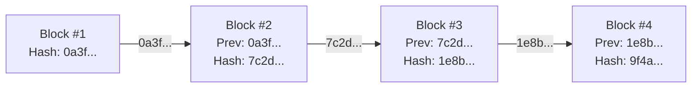
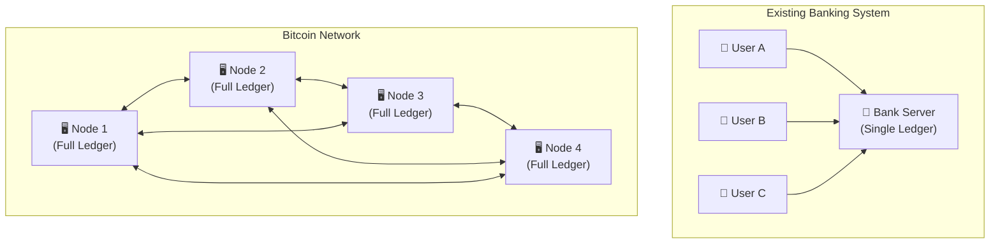
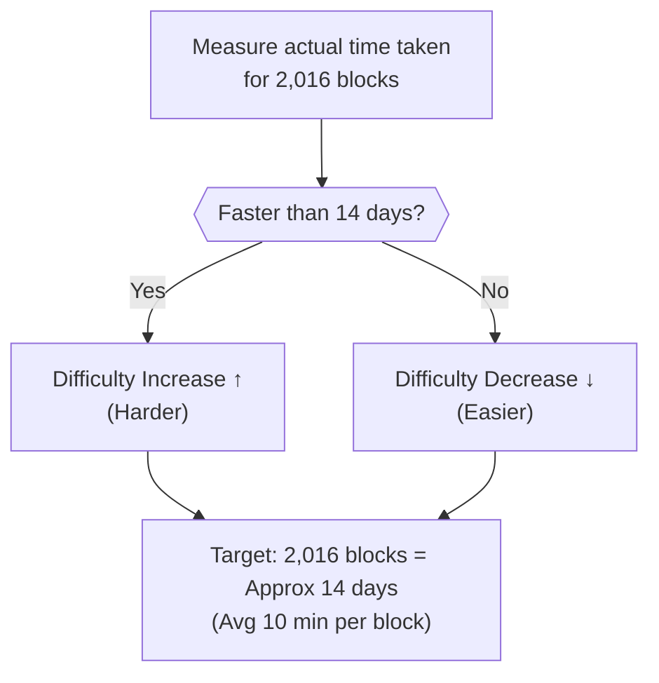
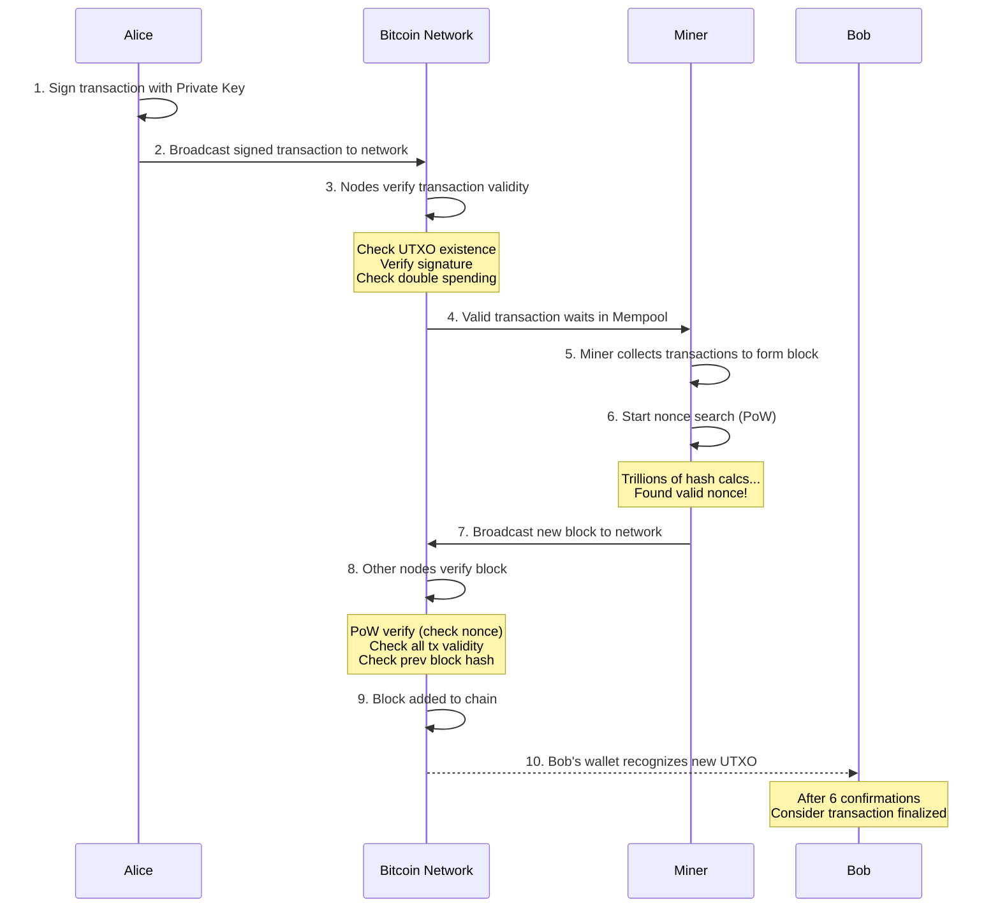

[](https://hits.sh/epheria.github.io/posts/CryptoCurrency02/)

## Introduction

> This document is part 2 of the **Cryptocurrency — Understanding Money in the Digital Age** series.

In [Part 1](/posts/CryptoCurrency01/), we examined the philosophical essence of money, the transition from the gold standard to fiat money, and the context in which Bitcoin emerged. Why a 54 KRW paper has a value of 10,000 KRW, the story of money standing on pure credit after the Nixon Shock, and the background of Satoshi Nakamoto declaring "I will replace trust with code."

Now it's time to dissect the **technical structure** of Bitcoin in earnest.

Understanding Bitcoin's internal structure clarifies the answers to "Why does it have value?" and "Why is it secure?" at a technical level. Instead of a one-line answer like "It's a distributed ledger" to the question "What is blockchain?", let's look inside.

Core components covered in this article:

| Component | Role | Analogy |
|----------|------|------|
| **SHA-256 Hash** | Generating data fingerprint | Document seal |
| **Blockchain** | Immutable transaction ledger | Unalterable public ledger |
| **Merkle Tree** | Efficient verification of transaction data | Book table of contents |
| **UTXO** | Bitcoin ownership model | Bills in wallet |
| **Proof of Work (PoW)** | Consensus mechanism for block generation | Math competition |
| **Halving** | Supply reduction mechanism | Depletion of gold mine |

---

## Part 1: SHA-256 Hash — Fingerprint of Data

### What is a Hash Function?

To understand Bitcoin, you must first understand **Hash Function**. A hash function is a one-way function that converts input of any size into **output of fixed size**.

If you are a programmer, you might have used `GetHashCode()` or `HashMap`. The concept is similar. However, the **cryptographic hash function** used in Bitcoin has much more powerful properties.

```
[SHA-256 Hash Function]

Input: "Hello"
Output: 185f8db32271fe25f561a6fc938b2e264306ec304eda518007d1764826381969

Input: "Hello!"  (Added one exclamation mark)
Output: 334d016f755cd6dc58c53a86e183882f8ec14f52fb05345887c8a5edd42c87b7

Input: Full Bitcoin Whitepaper (9 pages)
Output: b1674191a88ec5cdd733e4240a81803105dc412d6c6708d53ab94fc248f4f553
```

Whether the input size is one character or hundreds of pages, the output is always a 64-character (256-bit) hexadecimal string. And if the input changes by even 1 bit, the output changes completely. Compare the hash values of "Hello" and "Hello!" — just one exclamation mark difference, but the output is a completely different string.

### Core Properties of SHA-256

The hash function Bitcoin uses is **SHA-256 (Secure Hash Algorithm 256-bit)**. Designed by the NSA and published as a standard by NIST in 2001. Five key properties of this function:

| Property | Description | Intuitive Analogy |
|------|------|-----------|
| **Deterministic** | Same input always produces same output | Same person's fingerprint is always same |
| **Fast Computation** | Can calculate hash quickly for any input | Fingerprint is easy to take |
| **Pre-image Resistance** | Practically impossible to backtrack input from output | Cannot reconstruct appearance from fingerprint alone |
| **Collision Resistance** | Extremely low probability of different inputs producing same output ($2^{256}$ possible outputs) | Probability of another person having same fingerprint is almost 0 |
| **Avalanche Effect** | Changing 1 bit of input changes output completely | Even twins have different fingerprints |

Let's grasp how big $2^{256}$ is. **Number of atoms in the observable universe is about $10^{80}$**, and $2^{256}$ is about $10^{77}$. Similar scale. Probability of accidentally finding a hash collision is similar to picking a specific atom randomly from all atoms in the universe.

Especially **Pre-image Resistance** is critical to Bitcoin's security. Knowing the hash value doesn't allow restoring the original data means **it's hard to solve the problem but easy to verify the answer**. This is the core principle of Bitcoin mining.

Analogy to a math test: "Find the cube root of 371,293" is hard to solve. But if someone says "The answer is 71.8", $71.8^3 = 369,955$... no, wrong. **Verification is instant** with a calculator. Bitcoin mining works on this principle. Finding the answer is insanely hard, but checking if it's correct takes one calculation.

---

## Part 2: Blockchain — Chain of Irreversible Records

### Structure of a Block

Bitcoin's transaction data is contained in a unit called **Block**. To use an analogy familiar to programmers, a block is like a **bundle of records INSERTed into a database table**. Except it's a table where **UPDATE or DELETE is absolutely impossible** once INSERTed.

Let's look at the structure of each block.

```
┌─────────────────────────────────────────┐
│              Block Header                │
│                                          │
│  ┌─────────────────────────────────────┐ │
│  │ Version         : Version info      │ │
│  │ Previous Hash   : Hash of prev block │ │ ← Core of chain connection
│  │ Merkle Root     : Summary hash of txs│ │
│  │ Timestamp       : Block creation time│ │
│  │ Difficulty Target: Current mining diff│ │
│  │ Nonce           : Value miners find  │ │ ← Core of mining
│  └─────────────────────────────────────┘ │
│                                          │
│  ┌─────────────────────────────────────┐ │
│  │           Transactions               │ │
│  │                                      │ │
│  │  TX1: Alice → Bob (0.5 BTC)         │ │
│  │  TX2: Carol → Dave (1.2 BTC)        │ │
│  │  TX3: Eve → Frank (0.3 BTC)         │ │
│  │  ...                                 │ │
│  └─────────────────────────────────────┘ │
└─────────────────────────────────────────┘
```

The block header is **only 80 bytes**. Inside these 80 bytes, it summarizes thousands of transactions, ensures connection with the previous block, and contains mining difficulty. Efficient design.

The most important field here is **Previous Hash**. This connects blocks into a **chain**.

### Principle of Chain: Why Tamper-Proof?



Each block includes the **hash of the previous block** in its own header. This hash is generated from **all data** (header + transaction data) of the previous block.

Using a data structure familiar to programmers, blockchain is similar to **Linked List**. Each node has a pointer to the previous node. But there is a crucial difference. While a pointer in a normal linked list is just a memory address, the "pointer" in blockchain is a **cryptographic hash of the entire content of the previous block**. If content changes, the pointer breaks.

```
[Normal Linked List vs Blockchain]

Normal Linked List:
  Node1(data, ptr→) → Node2(data, ptr→) → Node3(data, ptr→)
  Modifying data of Node2 keeps ptr same → Tampering undetectable

Blockchain:
  Block1(data, hash) → Block2(data, prev_hash=hash(Block1)) → Block3(...)
  Modifying data of Block2 changes hash(Block2)
  → Mismatch with prev_hash of Block3 → Tampering detected instantly!
```

What happens if someone tampers with transaction data of Block #2?

1. Data of Block #2 changes → Hash of Block #2 changes (Avalanche effect!)
2. Block #3 expects "Previous Hash = 7c2d...", but tampered Block #2 hash is completely different
3. So Block #3 must be recomputed → Block #4 too → Block #5 too → ... **Recompute all subsequent blocks**
4. And recomputing each block requires **Mining (Proof of Work)** — trillions of hash calculations needed

```
[Cost of Tampering Attempt]

Attempting to tamper Block #2:
  Recompute Block #2 (Mining needed: ~10 min) +
  Recompute Block #3 (Mining needed: ~10 min) +
  Recompute Block #4 (Mining needed: ~10 min) +
  ... Recompute all blocks up to now

  Meanwhile, honest nodes keep adding new blocks

→ Virtually impossible unless controlling over 51% of network total hash power
```

Modifying one block requires remaking all blocks after it. And copies of that blockchain are distributed across tens of thousands of computers worldwide. This is why blockchain is said to be "immutable".

Analogy to game development: In MMORPG, hacking one server's database to modify your character's gold might be possible (though hard). But **what if the same database is replicated across 18,000 servers worldwide, constantly cross-checking each other?** Hacking one is instantly rejected by the other 17,999 saying "This is manipulated".

### Distributed Ledger: Tens of Thousands of Copies

Complete copies of Bitcoin blockchain are stored in about **18,000+ Full Nodes** worldwide as of 2025. Total size of blockchain is about **580GB**. Anyone with a computer and internet can run a full node. No permission needed.



- **Existing System**: If one bank server goes down, all services stop (Single Point of Failure). 2022 Kakao Data Center fire is a prime example.
- **Bitcoin**: Even if a few nodes go down, network operates normally (Distributed Fault Tolerance). Bitcoin network has **never been down once** since January 3, 2009. 99.99...% uptime. No bank, no IT company has achieved this record.

---

## Part 3: Merkle Tree — Efficient Transaction Verification

### Why Merkle Tree Needed

Thousands of transactions can fit in one block. Currently averages **about 2,000~3,000** transactions per block. To check "Is this transaction really included in this block?", do we have to search through 3,000 transactions one by one?

**Merkle Tree** solves this problem with $O(\log n)$ efficiency. Data structure invented by Ralph Merkle in 1979. Combining binary tree structure with hash function, if you studied CS, recall efficiency of **Binary Search**.

### Structure of Merkle Tree

```
                    ┌───────────┐
                    │ Merkle Root│  ← Stored in Block Header (32 bytes)
                    │  Hash(AB+CD)│
                    └─────┬─────┘
                   ┌──────┴──────┐
              ┌────┴────┐   ┌────┴────┐
              │ Hash(AB) │   │ Hash(CD) │
              └────┬────┘   └────┬────┘
            ┌──────┴──────┐  ┌──────┴──────┐
         ┌──┴──┐     ┌──┴──┐  ┌──┴──┐   ┌──┴──┐
         │H(TX1)│     │H(TX2)│  │H(TX3)│   │H(TX4)│
         └──────┘     └──────┘  └──────┘   └──────┘
            ↑            ↑         ↑           ↑
           TX1          TX2       TX3         TX4
```

Working Principle:
1. Hash each transaction (TX) individually
2. Combine adjacent two hashes and hash again
3. Repeat this process to create one final **Merkle Root**

Easy to understand if you imagine a tournament bracket. If 4 players, 2 matches in round 1, 1 match in final to decide winner. Merkle Tree is same, hashes "compete" up to decide one final root. That single root represents thousands of transactions entirely.

### Efficient Verification: SPV (Simplified Payment Verification)

If you want to check if TX3 is included in this block, you don't need to download the entire transaction list. Just **3 hash values** are needed:

```
Data needed for verification (Merkle Proof):
1. H(TX3) — Target to verify
2. H(TX4) — Hash pairing with TX3
3. Hash(AB) — Hash of opposite subtree

Verification Process:
H(TX3) + H(TX4) → Hash(CD) ← Calculate directly
Hash(AB) + Hash(CD) → Merkle Root ← Calculate directly
→ Compare with Merkle Root in Block Header, if matches, proves TX3 is included in this block!
```

Let's see how efficient this is in numbers:

| Tx Count in Block | Data for Full Verification | Hash Count for Merkle Proof |
|--------------|----------------------|------------------------|
| 4 | All 4 | 2 |
| 1,000 | All 1,000 | ~10 |
| 10,000 | All 10,000 | ~14 |
| 100,000 | All 100,000 | ~17 |

Verifying a specific transaction among 100,000 transactions requires only **17 hashes**. This is the power of $O(\log n)$.

Thanks to this, **SPV (Simplified Payment Verification)** clients are possible. Without downloading entire blockchain (~580GB), having only block headers (80 bytes per block) allows verifying inclusion of specific transactions. Smartphone Bitcoin wallets are possible thanks to this Merkle Tree.

---

## Part 4: UTXO — Bitcoin's Ownership Model

### Account Balance vs UTXO

Banking systems or Ethereum use **Account Model**. Manage one number "A's account balance: 10,000 won". The balance we see in banking apps is exactly this.

Bitcoin is fundamentally different. Uses **UTXO (Unspent Transaction Output)** model. Bitcoin has no concept of "balance". Really. Nowhere in Bitcoin software code is there a variable "balance".

Instead, **sum of unused individual transaction outputs** is your Bitcoin.

```
[Account Model vs UTXO Model]

Account Model (Bank, Ethereum):
  Alice's Balance: 1.5 BTC (One number)
  → Stored in DB: UPDATE accounts SET balance = 1.5 WHERE user = 'Alice'

UTXO Model (Bitcoin):
  UTXOs owned by Alice:
    UTXO #1: 0.7 BTC (Received from TX_abc, 2024-03-15)
    UTXO #2: 0.3 BTC (Received from TX_def, 2024-05-22)
    UTXO #3: 0.5 BTC (Received from TX_ghi, 2024-08-01)
    ─────────────────
    Total:     1.5 BTC

  → "Balance 1.5 BTC" is just wallet software summing these UTXOs up to show
```

### Analogy with Cash Bills

Easiest way to understand UTXO is comparing to **cash bills**.

If you have one 10,000 won bill and one 5,000 won bill in wallet, banking app would show "Balance 15,000 won", but in reality you have **"One 10,000 won bill + One 5,000 won bill"**. These two have subtle but important difference.

How to buy something worth 7,000 won?

```
[UTXO Transaction Example: Alice → Sends 0.7 BTC to Bob]

Input:
  UTXO #1: 1.0 BTC (Alice received before)
  → "Spend" this UTXO (Handing over the bill)

Output:
  Output #1: 0.7 BTC → Bob's address       (Payment = New UTXO creation)
  Output #2: 0.29 BTC → Alice's address     (Change = New UTXO creation)
  (Remaining 0.01 BTC = Fee to miner, not output anywhere)

Result:
  UTXO #1 (1.0 BTC) → Destroyed (Spent) ← Gone forever
  New UTXO: 0.7 BTC (Owned by Bob)     → Created
  New UTXO: 0.29 BTC (Owned by Alice)  → Created (Change)
```

Exactly same as paying 10,000 won bill at convenience store for 7,000 won item, 10,000 won bill disappears and you receive 3,000 won change.

Key is **UTXO cannot be partially used**. Just as you cannot tear 10,000 won bill in half to use as 5,000 won, you cannot use part of 1 BTC UTXO. Must spend entire thing and receive change as new UTXO.

If you don't make change UTXO? That difference all goes to miner as fee. There is an actual case where early Bitcoin user mistakenly omitted change output and donated(?) hundreds of BTC to miner.

### Why UTXO Model?

Why did Bitcoin choose this complex UTXO model instead of "balance" model? Reasons are quite compelling:

| Advantage | Description |
|------|------|
| **Parallel Verification** | Each UTXO independent so verify concurrently. Account model must process transactions of same account sequentially |
| **Privacy** | Easy to use new address for every transaction. Change going to new address makes tracking harder |
| **Double Spending Prevention** | UTXO destroyed once used — Cannot reuse. Just verify "Is this UTXO already used?" |
| **Auditability** | Trace origin of all Bitcoins to Genesis Block. Bitcoin is money with history |
| **State Minimization** | Manage "Unspent UTXO List" instead of full transaction history. Current UTXO set about 70 million |

---

## Part 5: Proof of Work (PoW) — Real Meaning of Mining

### What is Mining

When saying "Bitcoin mining", many imagine pickaxing in gold mine. But actually completely different task. More accurate analogy is **Giant Math Lottery**.

**Mining is task of finding nonce value where hash result of block header satisfies specific condition (Difficulty Target).**

```
Miner's Task:

1. Collect transaction data from mempool (queue) to form block
2. Complete block header (Previous hash, Merkle root, timestamp etc.)
3. Start nonce value from 0 and increment by 1:
   - Calculate SHA-256(SHA-256(Block Header))  ← Double Hash!
   - If result < Difficulty Target → Success! Block Found!
   - Else → Increment nonce by 1 and retry
4. Find nonce satisfying condition after billions, trillions of attempts
```

Programmers will realize this is **Brute Force** search. No shortcut. Due to irreversible property of hash function, **cannot predict by calculation** "which nonce will produce hash satisfying condition". Just have to try one by one.

```python
# Mining in pseudo code:
while True:
    block_header.nonce += 1
    hash_result = sha256(sha256(block_header))
    if hash_result < difficulty_target:
        broadcast(block)  # Success! Broadcast block to network
        reward = block_reward + sum(tx_fees)  # Receive reward
        break
```

### Meaning of Difficulty Target

Difficulty Target defines **how small the hash result value must be**. More zeros at front of hash result means stricter condition.

```
[Hash Condition by Difficulty]

Low Difficulty:  Hash starts with "0" OK
              → Success 1 in 16 times (6.25%)

Medium Difficulty:  Hash must start with "00000"
              → 16^5 = Approx 1 in 1 million success

High Difficulty:  Hash must start with "0000000000"
              → 16^10 = Approx 1 in 1 trillion success

Actual (2025): Need about 19 zeros in front of hash
              → Astronomical number of attempts needed
```

Analogy: **Rolling 1 billion sided die until getting number below specific value.** "Come out 1 or less" — 1 in 1 billion. Hard to find, but **verification is instant**. Other nodes put submitted nonce into block header and run SHA-256 once to check correctness.

This is Bitcoin's core **Asymmetry**:
- **Mining (Production)**: Trillions of calculations → Takes ~10 min
- **Verification (Check)**: 1 calculation → Takes milliseconds

### Difficulty Adjustment: Always 10 Minutes

Bitcoin is designed to generate **1 block every 10 minutes on average**. Why 10 minutes? Tradeoff Satoshi chose. Too fast causes many collisions (orphan blocks) due to network propagation delay, too slow decreases usability.

If computing power (hashrate) participating in mining increases, blocks are found faster, so Bitcoin automatically adjusts difficulty **every 2,016 blocks (approx 2 weeks)**.



Difficulty adjustment formula is surprisingly simple:

$$	ext{New Difficulty} = 	ext{Old Difficulty} 	imes \frac{	ext{Actual Time Taken}}{14	ext{ Days}}$$

If actual time was 7 days (too fast), difficulty doubles. If 21 days (too slow), difficulty drops to 2/3. Safety device exists to adjust max 4 times only.

Thanks to this auto-adjustment mechanism, Bitcoin maintains **constant block generation speed** from early days mining with personal laptops to current era with hundreds of thousands of dedicated ASIC miners since 2009 launch. Hashrate increased over $10^{20}$ times, but block time is still about 10 minutes.

### Economics of Mining: Why Honest is Profitable

Reason miners don't cheat is not **morality** but **economic incentive**. This is most genius part of Bitcoin design, core application of **Game Theory**.

Satoshi didn't rely on human goodwill. Instead designed incentives **so selfish behavior contributes to system security**.

| Behavior | Reward | Risk |
|------|------|--------|
| **Honest Mining** | Block Reward (Current 3.125 BTC) + Transaction Fee | None (Certain Reward) |
| **Dishonest Mining (51% Attack)** | Double Spending Gain | Cost to maintain 51% hashrate + Risk of Bitcoin price crash |

To perform 51% attack, must control majority of global mining computing power. As of 2025, cost required is tens of trillions of won scale. Buying ASIC miners, supplying electricity, operating cooling facilities costs astronomical amount.

And even if attack succeeds, if news "Bitcoin hacked" spreads, Bitcoin price crashes making attacker's gain worthless. Investing tens of trillions to succeed in attack, but if result drops Bitcoin value, attacker's holding Bitcoin becomes worthless too. **Like burning own house**.

In other words, **Honest mining is economically rational**. Miner acts honestly with selfish motive to maximize own profit, and consequently entire network becomes secure. This incentive structure designed by Satoshi Nakamoto is Bitcoin's core innovation.

Economics calls this **Nash Equilibrium** — State where no participant has reason to change strategy. "Honest mining" is optimal strategy for all miners, so no one has incentive to deviate.

---

## Part 6: Halving — Programmed Scarcity

### Bitcoin's Issuance Schedule

Recall Simmel's value theory from Part 1. "Distance creates value." Core mechanism creating this "distance" in Bitcoin is **Halving**.

Bitcoin has absolute upper limit of **total issuance 21 million** set by code. Central bank cannot decide "Let's print more money". No government, no institution, even Satoshi Nakamoto himself cannot change this number (without consensus of network participants).

In actual Bitcoin Core source code (C++), this rule is implemented like this:

```cpp
// Bitcoin Core Source Code (validation.cpp)
CAmount GetBlockSubsidy(int nHeight, const Consensus::Params& consensusParams)
{
    int halvings = nHeight / consensusParams.nSubsidyHalvingInterval; // 210,000
    if (halvings >= 64)
        return 0;
    CAmount nSubsidy = 50 * COIN; // Initial Reward: 50 BTC
    nSubsidy >>= halvings; // Bitshift (÷2) every halving
    return nSubsidy;
}
```

`>>=` is bitwise right shift operator, same as dividing value by half. These few lines of code define entire monetary policy of Bitcoin. Monetary policy made by thousands of central bank employees replaced by 10 lines of code.

New Bitcoins are issued only through mining. And **every 210,000 blocks (approx 4 years), mining reward is cut in half.** This is **Halving**.

```
[Bitcoin Halving Schedule]

Halving   Date       Block Reward        Cumulative Supply    Bitcoin Price (At time)
─────────────────────────────────────────────────────────────────
 #0    2009.01    50.0    BTC/Block    ~10,500,000 BTC    $0
 #1    2012.11    25.0    BTC/Block    ~15,750,000 BTC    ~$12
 #2    2016.07    12.5    BTC/Block    ~18,375,000 BTC    ~$650
 #3    2020.05     6.25   BTC/Block    ~19,687,500 BTC    ~$8,700
 #4    2024.04     3.125  BTC/Block    ~20,343,750 BTC    ~$64,000
 #5    2028(Est)  1.5625  BTC/Block    ~20,671,875 BTC    ???
 ...
 #33   2140(Est)  0.00000001 BTC     21,000,000 BTC (Limit)
```

Quick-witted ones might have found pattern. Bitcoin price tends to rise significantly within 1~2 years after halving. Whether coincidence or necessity by supply reduction is debated, but basic economic principle is price rise pressure created when supply halves while demand is constant.

### Exponential Decay: Why 21 Million?

Let's look at mathematical principle of halving. If initial block reward is 50 BTC and halves every 210,000 blocks, total issuance is calculated as **sum of geometric series**:

$$	ext{Total Issuance} = 210{,}000 	imes 50 	imes \sum_{i=0}^{\infty} \frac{1}{2^i} = 210{,}000 	imes 50 	imes 2 = 21{,}000{,}000$$

Since infinite geometric series $\sum_{i=0}^{\infty} \frac{1}{2^i} = 2$, total issuance converges exactly to **21 million BTC**. Last Bitcoin is estimated to be mined around 2140.

Why did Satoshi choose number 21 million? No certain answer, but one strong theory. Global money supply (M1) at 2009 was about **21 trillion dollars**. If Bitcoin replaces this, 1 BTC = 1 million dollars. Clean number. Coincidence?

### After 2140: When Reward Becomes 0?

Frequently asked question. "If mining reward becomes 0, won't miners leave? Network security?"

Answer is in **Transaction Fees**. Miner's income consists of "Block Reward + Transaction Fees". As block reward decreases, relative proportion of transaction fees increases. Actually after 2024 halving, transaction fees exceeded block reward in some blocks.

Design intent is as Bitcoin becomes widely used, total transaction fees will increase, maintaining mining incentive.

### Design as Deflationary Currency

| Category | Fiat Money (KRW) | Bitcoin |
|------|----------------|---------|
| **Total Issuance** | No Upper Limit | 21 million BTC |
| **Issuance Authority** | Central Bank Discretion | Auto-determined by Code |
| **Issuance Speed** | Unpredictable | 100% Predictable (Check with one line of code) |
| **Inflation** | Target approx 2~5% annually | Issuance decreases 50% every halving |
| **Long-term Trend** | Currency Value Drop (Inflation) | Currency Value Rise (Deflationary) |

Fiat money is structure where "value decreases over time". So people try to spend money quickly or invest (Keynesian economics claims this circulates economy). Reason why thinking about investment rather than saving when receiving salary is here — leaving it alone decreases value.

Bitcoin is structure where "becomes scarce over time". Supply decreases but if demand increases, value per unit goes up. This is why Bitcoin is called **Deflationary Currency**.

FYI, estimated **4 million BTC** already permanently lost (Early miners losing private keys etc.). Famous case of miner losing hundreds of millions of dollars worth Bitcoin by throwing hard drive in trash. Practically circulating Bitcoin is much less than 21 million.

---

## Part 7: Big Picture — Lifecycle of Bitcoin Transaction

Combining everything learned so far, let's trace entire process of Alice sending Bitcoin to Bob. Moment puzzle pieces fit into one picture.



### Step-by-Step Detail

**Step 1-2: Transaction Creation and Signing**

Alice digitally signs transaction with her **Private Key**. This signature is cryptographic proof "Alice really approved this transaction".

Used here is **Elliptic Curve Digital Signature Algorithm (ECDSA)**. Simply put:
- **Private Key**: 256-bit random number. Only proof you "own" your Bitcoin
- **Public Key**: Mathematically derived from private key. Safe to reveal to others
- **Address**: Hash of public key. Used when receiving Bitcoin
- **Signature**: Sign transaction data with private key. Verifiable with public key

Not showing ID to bank teller, but verifying self with mathematical proof. **No need to call bank "Please approve transaction".**

**Step 3: Transaction Verification**

Network nodes check:
- Does UTXO Alice refers to actually exist? → Query UTXO set
- Is Alice's signature valid? → ECDSA verify
- Has this UTXO been used already? (Double spending check) → Check in UTXO set
- Input sum ≥ Output sum? (Not trying to spend money don't have?)

Code performs all these verifications **automatically**. No room for human judgment.

**Step 4-6: Mining**

Valid transactions enter queue called **Mempool**. Mempool is "waiting room for valid transactions not yet included in block". Miner selects transactions from mempool to form block, usually **prioritizing high fee transactions**. Similar to auction — higher fee offered, faster processed.

Miner forms block, then performs proof of work to find valid nonce. Hundreds of thousands of miners worldwide participate in this "lottery" simultaneously, first miner finding answer takes reward.

**Step 7-9: Block Confirmation**

When valid block found, propagated to network, other nodes verify and add to chain. This propagation usually spreads worldwide in **seconds**. If all nodes add same block to chain, ledger of entire network synchronizes.

**Step 10: Final Confirmation**

Generally, after **6 confirmations (approx 1 hour)**, transaction is considered virtually irreversible. To reverse 6 blocks, attacker must regenerate 6 blocks faster than honest chain, probability decreases exponentially if attacker's hashrate is less than 50% of total.

Satoshi's white paper calculates this probability exactly. If attacker holds 10% of total hashrate, probability of catching up after 6 blocks is about **0.024%**. Even with 30%, only **17.7%**. Waiting 6 blocks is virtually safe.

---

## Part 8: Limits and Future of Bitcoin

Bitcoin is not perfect system. Every technology has tradeoffs. Let's honestly examine major limits and attempts to solve them.

### Known Limits

| Limit | Detail | Response/Solution Attempt |
|------|------|---------------|
| **Processing Speed** | Approx 7 tx/sec (Visa: Approx 24,000) | Lightning Network (Layer 2) |
| **Energy Consumption** | Annual approx 100~150 TWh (Small country level) | Diversify energy sources, Utilise surplus energy |
| **Scalability** | Block size 1MB limit → Tx volume limit | SegWit, Taproot upgrade |
| **Price Volatility** | Can fluctuate over 50% in short term | Gradual decrease trend with market maturity |
| **Usability** | Lost private key = Permanent asset loss | Multisig wallet, Hardware wallet development |

Adding one perspective on energy consumption. Is Bitcoin's energy consumption "waste"? Counterargument is: Compare with total energy consumption of global banking system (buildings, employees, servers, ATMs, security etc.)? Compare with environmental impact of gold mining? About **58%** of Bitcoin mining uses renewable energy, higher ratio than other industries. Of course this doesn't solve problem completely, but calling it "energy waste" without context is unfair.

### Lightning Network: Layer 2 Solution

**Lightning Network** to solve processing speed problem is Layer 2 built on top of Bitcoin blockchain.

```
[Layer 1 vs Layer 2]

Layer 1 (Bitcoin Blockchain):
  - All transactions recorded in block
  - Slow but final and secure (Approx 10 min/block)
  - Suitable for large settlement, final payment

Layer 2 (Lightning Network):
  - Open channel between two parties, instant tx within channel
  - Record final balance to blockchain only when closing channel
  - Suitable for small fast daily payments
  - Can process millions per second
```

Using analogy familiar in game development, similar to **Network Synchronization**:
- Layer 1 is Server Authoritative model — Server processes everything so slow but certain
- Layer 2 is Client Prediction — Process locally fast and synchronize with server later

Through Lightning Network, El Salvador actually pays for coffee with Bitcoin. In 2021 El Salvador adopted Bitcoin as **legal tender** for first time in world.

### Energy Becomes Currency — Elon Musk's Prediction

In late 2025, Elon Musk made an intriguing prediction during a podcast with Indian entrepreneur Nikhil Kamath.

> **"Energy is the real currency. Governments can print money, but they cannot print energy."**

Musk argued that as AI and robotics advance, the value of human labor will fundamentally change, and **"money as a concept will disappear."** In that world, the true measure of value will be **energy**. This is why he called Bitcoin a **"Physics-based Currency."**

Why energy? From a physics perspective, every valuable operation in the universe (computation, movement, production, communication) is ultimately an **energy conversion**. Mining gold, manufacturing semiconductors, running servers — all require energy. Energy cannot be created by law or manipulated politically. **No government can circumvent the laws of thermodynamics.**

Connecting this to Bitcoin's context, the logic links up:

```
[Fiat Money vs Bitcoin: Energy Perspective]

Fiat Money:
  Basis of Value = Government credit (Abstract, mutable)
  Issuance Cost  = Paper + Ink (Approaching zero)
  Manipulation   = High (Quantitative easing, interest rate control, etc.)

Bitcoin:
  Basis of Value = Energy invested + Mathematical scarcity (Physical, immutable)
  Issuance Cost  = Electrical energy + Computing power (Actual physical cost)
  Manipulation   = None (Cannot change laws of thermodynamics)
```

As we explored in Part 1, fiat money has value "because the government says it does." Bitcoin's value, on the other hand, has **real energy condensed** into it. Mining 1 BTC currently consumes approximately **266,000 kWh** of electricity — about 9 years of electricity for an average American household. This energy is irrecoverable. Irreversible. Permanently "burned" into SHA-256 hashes.

NVIDIA CEO Jensen Huang has expressed a similar view. In the AI era, the equation **computing power = energy = value** is becoming increasingly clear.

Of course, counterarguments exist. The mere fact of consuming energy doesn't create value. Spending energy to dig a hole and fill it back up doesn't generate value. Bitcoin's energy consumption has value because that energy is used for **Proof of Work that maintains network security**. Energy invested in Bitcoin is the cost of maintaining the service called "immutable global ledger."

What if energy production costs drop dramatically in the future? (Fusion power, etc.) If mining costs decrease, more miners participate, difficulty rises, and equilibrium is restored. Bitcoin's difficulty adjustment mechanism absorbs this scenario too. **Cheaper energy → more miners → difficulty increase → more energy per block → back to equilibrium.** Bitcoin is a system designed to constantly absorb available energy.

Whether Musk's prediction proves correct or not, one thing is clear: Bitcoin occupies a unique position as **a mechanism that converts energy into value in the digital world**. This is a fundamentally different characteristic from any other cryptocurrency (PoS-based) or fiat currency.

### Quantum Computing Threat — Doomsday Scenario for Bitcoin?

"Can quantum computers break Bitcoin?" — If you've been interested in cryptocurrency, you've heard this question at least once. When Google unveiled its **105-qubit quantum chip 'Willow'** in December 2024, this question heated up again.

Willow performed a computation that would take conventional supercomputers **10 septillion years** (10,000,000,000,000,000,000,000,000 years) in just **5 minutes**. Hearing such numbers, one might think "Can't Bitcoin's trillion-year hash calculations be cracked in seconds too?" But reality isn't that simple.

#### Two Attack Vectors of Quantum Computers Against Bitcoin

Bitcoin depends on two cryptographic systems, and the quantum threat level differs for each:

| Crypto System | Purpose | Quantum Attack Algorithm | Threat Level |
|-----------|------|-------------------|----------|
| **ECDSA (secp256k1)** | Transaction signing (Private key → Public key) | **Shor's Algorithm** (Exponential speedup) | **High** — Can extract private key from public key |
| **SHA-256** | Mining (Proof of Work), Block linking | **Grover's Algorithm** (Square root speedup) | **Low** — Only reduces $2^{256}$ to $2^{128}$ |

This difference is crucial. The quantum threat is **not uniform.**

**Shor's Algorithm and ECDSA**: The most serious threat is against the transaction signing system. Bitcoin currently uses ECDSA to prove "this transaction was authorized by the Bitcoin owner." Shor's algorithm can reverse this process — extracting the private key from the public key alone. If successful, one could **freely spend someone else's Bitcoin**.

**Grover's Algorithm and SHA-256**: Grover's algorithm can be applied to SHA-256 used in mining, but it provides only **square root level speedup**. $2^{256}$ attempts become $2^{128}$. If you can't grasp how large $2^{128}$ is — it's **340,282,366,920,938,463,463,374,607,431,768,211,456**. Still astronomically large for brute force. SHA-256 remains effectively secure even against quantum computers.

#### Gap Between Reality and Requirement: 105 Qubits vs Millions of Qubits

So how powerful a quantum computer is needed to break Bitcoin's ECDSA?

```
[Current Quantum Computers vs Level Needed to Break Bitcoin]

Google Willow (2024):
  105 physical qubits
  Single-qubit error rate: 0.035%
  Two-qubit error rate: 0.33%

Level needed for ECDSA cracking:
  Approx 2,330 logical qubits (minimum theoretical)
  → With error correction: millions of physical qubits needed

Level needed for SHA-256 cracking:
  Approx 2.5 million logical qubits
  → With error correction: tens of millions to hundreds of millions physical qubits

Current gap:
  105 qubits → millions of qubits
  Approx 10,000x ~ 1,000,000x gap
```

The difference between "logical qubits" and "physical qubits" matters here. Quantum computers are extremely unstable. Qubits easily produce errors from minute vibrations, temperature changes, and electromagnetic waves in the environment (called **decoherence**). To create one stable "logical qubit," thousands of physical qubits are needed for error correction.

If you're a game developer, this analogy might resonate. Think about **physics simulation precision**. Some tasks are fine with `float` precision, others require `double`. Quantum computers similarly require vastly different qubit counts for simple calculations (where some errors are tolerable) versus cryptographic cracking (where perfect accuracy is required).

As of February 2026, Iceberg Quantum's **Pinnacle Architecture** succeeded in reducing the physical qubits needed for RSA-2048 cracking to under 100,000 using QLDPC codes — approximately 10x reduction from previous estimates. This signals rapidly improving quantum computing efficiency, but it's still a long way from breaking Bitcoin.

Blockstream CEO Adam Back maintains that "a cryptographically meaningful quantum threat is likely **20 to 40 years away**."

#### What If Quantum Computers Actually Break Bitcoin?

We need to see the bigger picture here. A quantum computer capable of breaking Bitcoin's ECDSA means **it's not just Bitcoin's problem.**

```
[What Collapses Together If Quantum Computers Break ECDSA]

✗ Bitcoin, Ethereum, and all cryptocurrencies
✗ HTTPS (Foundation of internet security)
✗ Online banking (TLS/SSL)
✗ Digital signatures (E-government, contracts, certificates)
✗ VPN, SSH, encrypted email
✗ Military communication encryption
✗ Nuclear launch code security

→ Entire digital infrastructure of human civilization under threat
→ Worrying about "Bitcoin is at risk" at this point is like
  worrying "the picture frame is crooked" when the house is on fire
```

Therefore, at the point quantum computers become a realistic threat, not just Bitcoin but **all of humanity's digital security systems will be transitioning to post-quantum cryptography**. And Bitcoin is no exception.

#### Bitcoin's Defense: Post-Quantum Cryptography

Bitcoin can be upgraded through **Soft Forks**. The transition to quantum-resistant signature schemes is already being researched:

- **NIST Standardization**: In 2024, the U.S. National Institute of Standards and Technology published 3 post-quantum cryptography standards (CRYSTALS-Kyber, CRYSTALS-Dilithium, SPHINCS+)
- **Bitcoin Community**: Introduction of quantum-resistant signature algorithms through BIP (Bitcoin Improvement Proposal) is under discussion
- **Hash-based Signatures**: Since SHA-256 itself has high quantum resistance, transitioning to hash-based signatures like Lamport signatures can provide additional security

Another defense mechanism Bitcoin has is **address reuse avoidance**. Bitcoin addresses are hashes of public keys, and the public key itself is not exposed to the network until a transaction is sent. Since Shor's algorithm needs the **public key** to extract the private key, Bitcoin stored in never-used addresses is safe from quantum computers.

In summary, a realistic assessment of the quantum threat:

| Scenario | Probability | Impact on Bitcoin |
|----------|------|-------------|
| Cryptographic quantum computer within 10 years | Very low | Sufficient transition time |
| Within 20~30 years | Possible | Post-quantum crypto upgrade expected complete |
| Quantum computer secretly developed suddenly | Extremely low | All digital security threatened simultaneously |
| Quantum computer never becomes practical | Possible | No impact on Bitcoin |

In conclusion, quantum computers are a **theoretical threat** to Bitcoin but not an **immediate danger**. Bitcoin has overcome numerous technical challenges and upgraded over its 15-year history, and preparations for the quantum threat are already underway. However, the pace of technological advancement is inherently unpredictable — a fact worth keeping in mind.

---

## Summary: Trust Made by Code

Over 2 articles we examined from philosophical essence of money to technical structure of Bitcoin.

### Core Summary

```
[5 Core Innovations of Bitcoin]

1. Decentralization    — P2P network without single point of failure (18,000+ nodes)
2. Immutability   — Blocks connected by hash chain (Modifying breaks entire chain)
3. Double Spending Prevention — UTXO model + Network consensus (Spent money destroyed)
4. Programmed Scarcity — 21 million limit + Halving (10 lines of code is monetary policy)
5. Incentive Design — Structure where honest participation is economically rational (Game Theory)
```

Compressing all this into one sentence:

> **Bitcoin is "Money that doesn't require trusting people".**

No need to trust bank processes transaction honestly → Code verifies. No need to trust central bank won't overissue currency → Code limits issuance. No need to trust miner is honest → Incentive enforces honesty.

### Why You Should Know This

1. **Financial Literacy** — Understanding essence of money is essential cultivation for living in modern society. Knowing inflation is "money value dropping" not "prices rising" changes economic decision making
2. **Technical Understanding** — Blockchain, cryptography, distributed systems applied beyond finance to various fields. Games attempting NFT, blockchain-based asset systems etc.
3. **Economic Judgment** — Understanding inflation, monetary policy, alternative assets helps personal economic decisions. Saving, investing, what to invest in
4. **Preparing for Future** — Digital currency is already reality, digitalization of money including CBDC (Central Bank Digital Currency) accelerating. Bank of Korea also researching digital won

### Lastly

Not saying invest in Bitcoin or not. Important thing is **Understanding**. Understanding what money is, why current financial system works like this, and what problems alternative called Bitcoin tries to solve. That was goal of this series.

Let's finish by recalling message left by Satoshi Nakamoto:

> **"The root problem with conventional currency is all the trust that's required to make it work."**

Moving object of trust from people to code. That is experiment Bitcoin attempts, still ongoing.

Recommend everyone take some time to properly learn what Bitcoin is. More interesting and deeper than you think.

---

## References

- [Satoshi Nakamoto, "Bitcoin: A Peer-to-Peer Electronic Cash System" (2008)](https://bitcoin.org/bitcoin.pdf)
- [How Bitcoin Works — Bitcoin.org](https://bitcoin.org/en/how-it-works)
- [How Bitcoin Works: Fundamental Blockchain Structure — Gemini](https://www.gemini.com/cryptopedia/how-does-bitcoin-work-blockchain-halving)
- [Merkle Tree examined with Bitcoin Core Source Code — Medium](https://medium.com/pocs/bitcoin01-01-%EB%B9%84%ED%8A%B8%EC%BD%94%EC%9D%B8-%EC%BD%94%EC%96%B4-%EC%86%8C%EC%8A%A4%EC%BD%94%EB%93%9C%EB%A1%9C-%EC%82%B4%ED%8E%B4%EB%B3%B4%EB%8A%94-%EB%A8%B8%ED%81%B4-%ED%8A%B8%EB%A6%AC-3b93d59c989b)
- [UTXO — Understanding Bitcoin Transaction — Medium](https://medium.com/@coineasy/%EC%97%91%EC%86%8C-%EB%A7%90%EA%B3%A0-utxo-%EB%B9%84%ED%8A%B8%EC%BD%94%EC%9D%B8%EC%9D%98-%ED%8A%B8%EB%9E%9C%EC%9E%AD%EC%85%98%EC%9D%84-%EC%95%8C%EC%95%84%EB%B3%B4%EC%9E%90-power-5c9a2182bd6b)
- [SHA-256 Hash Algorithm — losskatsu.github.io](https://losskatsu.github.io/blockchain/sha256/)
- [Blockchain Consensus Algorithm Analysis — Bitcoin Proof of Work — Medium](https://medium.com/pocs/bitcoin01-01-%EB%B9%84%ED%8A%B8%EC%BD%94%EC%9D%B8-%EC%BD%94%EC%96%B4-%EC%86%8C%EC%8A%A4%EC%BD%94%EB%93%9C%EB%A1%9C-%EC%82%B4%ED%8E%B4%EB%B3%B4%EB%8A%94-%EB%A8%B8%ED%81%B4-%ED%8A%B8%EB%A6%AC-3b93d59c989b)
- [Bitcoin Halving: Definition and Date — Ledger](https://www.ledger.com/academy/crypto/bitcoin-halving)
- [Bitcoin Halving — Exact Date and Principle — CryptoNews](https://cryptonews.com/academy/bitcoin-halving/)
- [Bitcoin Core Source Code — GitHub](https://github.com/bitcoin/bitcoin)
- [Bitcoin Energy Consumption — Cambridge Bitcoin Electricity Consumption Index](https://ccaf.io/cbnsi/cbeci)
- [Lightning Network — lightning.network](https://lightning.network/)
