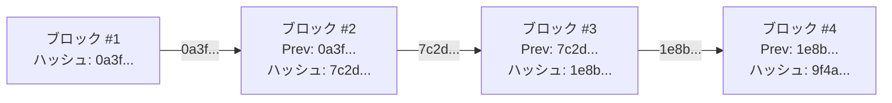
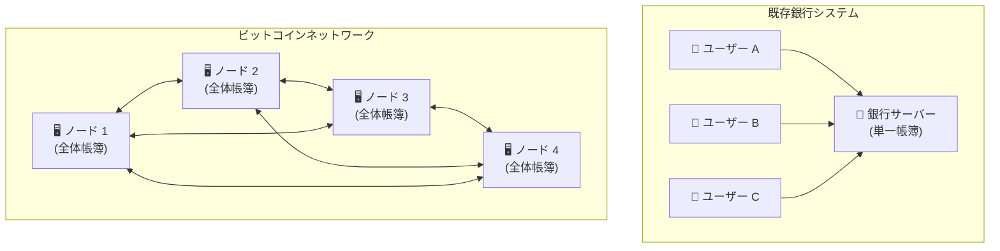
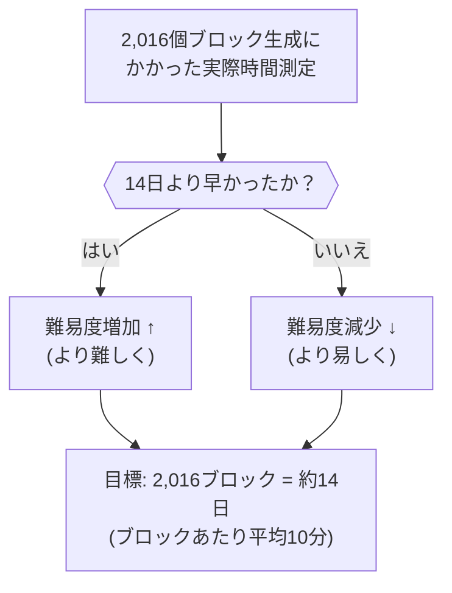
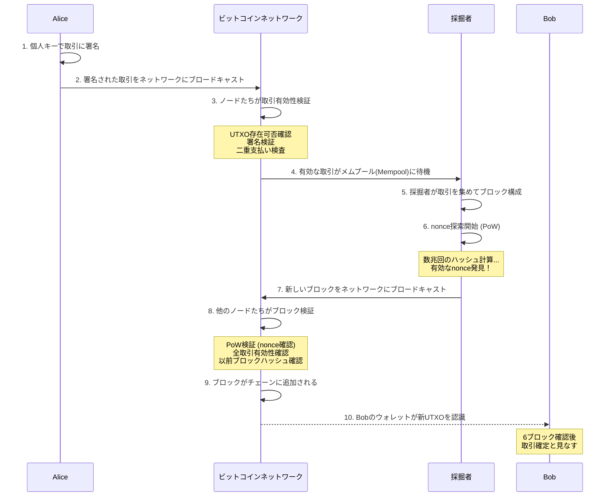

[](https://hits.sh/epheria.github.io/posts/CryptoCurrency02/)

## 序論

> この文書は **暗号通貨 — デジタル時代の通貨を理解する** シリーズの2番目の編です。

[1編](/posts/CryptoCurrency01/)で私たちは通貨の哲学的本質、金本位制から法定通貨への転換、そしてビットコインが登場するようになった脈絡を調べた。54ウォンの紙が1万ウォンの価値を持つ理由、ニクソン・ショック以後通貨が純粋な信用のあ上に立つようになった話、そしてサトシ・ナカモトが「信頼をコードで代替する」と宣言した背景まで。

もう本格的にビットコインの **技術的構造** を解剖する番だ。

ビットコインの内部構造を理解すれば、「なぜ価値があるのか」と「なぜ安全なのか」に対する答えが技術的水準で明確になる。「ブロックチェーンが何か」という質問に「分散元帳だ」という1行の答えの代わりに、本当の中を覗いてみよう。

この記事で扱う核心コンポーネント：

| コンポーネント | 役割 | 比喩 |
|----------|------|------|
| **SHA-256 ハッシュ** | データの指紋（フィンガープリント）生成 | 文書の判子 |
| **ブロックチェーン** | 変調不可能な取引帳簿 | 修正不可能な公開帳簿 |
| **マークルツリー** | 取引データの効率的検証 | 本の目次 |
| **UTXO** | ビットコインの所有権モデル | 財布の中の紙幣たち |
| **作業証明(PoW)** | ブロック生成のための合意メカニズム | 数学コンテスト |
| **半減期(Halving)** | 供給減少メカニズム | 金鉱の枯渇 |

---

## Part 1: SHA-256 ハッシュ — データの指紋

### ハッシュ関数とは？

ビットコインを理解するにはまず **ハッシュ関数(Hash Function)** を理解しなければならない。ハッシュ関数はどんな大きさの入力でも **固定された大きさの出力** に変換する一方向関数だ。

プログラマーなら `GetHashCode()` や `HashMap` を使ったことがあるだろう。概念は似ている。しかしビットコインで使用する **暗号学的ハッシュ関数** はそれよりはるかに強力な特性を持つ。

```
[SHA-256 ハッシュ関数]

入力: "Hello"
出力: 185f8db32271fe25f561a6fc938b2e264306ec304eda518007d1764826381969

入力: "Hello!"  (感嘆符一つ追加)
出力: 334d016f755cd6dc58c53a86e183882f8ec14f52fb05345887c8a5edd42c87b7

入力: ビットコイン白書全文 (9ページ)
出力: b1674191a88ec5cdd733e4240a81803105dc412d6c6708d53ab94fc248f4f553
```

入力の大きさが一文字でも数百ページでも、出力は常に64字(256ビット)の16進数文字列だ。そして入力がたった1ビットだけ変わっても出力は完全に変わる。"Hello"と"Hello!"のハッシュ値を比較してみろ — 感嘆符一つの違いなのに出力は完全に違う文字列だ。

### SHA-256の核心特性

ビットコインが使用するハッシュ関数は **SHA-256(Secure Hash Algorithm 256-bit)** だ。米国国家安全保障局(NSA)が設計し2001年NISTが標準として発表した。この関数の核心特性五つ：

| 特性 | 説明 | 直観的比喩 |
|------|------|-----------|
| **決定論的** | 同じ入力は常に同じ出力を同る | 同じ人の指紋は常に同じだ |
| **高速計算** | どんな入力でも早くハッシュを計算できる | 指紋は撮りやすい |
| **逆算不可** | 出力から入力を逆追跡することが事実上不可能だ | 指紋だけ見て外見を復元できない |
| **衝突抵抗** | 違う入力が同じ出力を作る確率が極度に低い ($2^{256}$個の可能な出力) | 他の人が同じ指紋を持つ確率はほぼ0 |
| **雪崩効果** | 入力を1ビットだけ変えても出力が完全に変わる | 双子も指紋が違う |

$2^{256}$ がどれほど大きな数字か感覚を掴んでみよう。**観測可能な宇宙の原子数が約 $10^{80}$個** なのに、$2^{256}$ は約 $10^{77}$ だ。似たスケールだ。ハッシュ衝突を偶然発見する確率は、宇宙のすべての原子の中から特定原子一つを無作為に拾うのと似た水準だ。

特に **逆算不可(Pre-image Resistance)** 特性がビットコインのセキュリティに決定的だ。ハッシュ値を知っても元のデータを復元できないということは、**問題を解くのは難しいが正解を検証するのは易しい** という意味だ。これこそがビットコイン採掘の核心原理だ。

数学試験に比喩すればこうだ。「371,293の三乗根を求めよ」は解くのが難しい。しかし誰か「答えは71.8だ」と言えば、$71.8^3 = 369,955$... いや、違うな。計算機で **検証は直ちに** できる。ビットコイン採掘もこの原理だ。答えを探すのは狂うほど難しいが、合っているか確認するのは一度の計算で終わる。

---

## Part 2: ブロックチェーン — 元に戻せない記録の鎖

### ブロックの構造

ビットコインの取引(Transaction)データは **ブロック(Block)** という単位に盛られる。プログラマーに馴染み深い比喩を使えば、ブロックは **データベースのテーブルにINSERTされるレコード束** に近い。ただし一度INSERTされれば **絶対UPDATEやDELETEが不可能な** テーブルだ。

各ブロックの構造を見てみよう。

```
┌─────────────────────────────────────────┐
│              Block Header                │
│                                          │
│  ┌─────────────────────────────────────┐ │
│  │ Version         : バージョン情報     │ │
│  │ Previous Hash   : 以前ブロックのハッシュ │ │ ← チェーン連結の核心
│  │ Merkle Root     : 取引たちの要約ハッシュ │ │
│  │ Timestamp       : ブロック生成時刻   │ │
│  │ Difficulty Target: 現在採掘難易度   │ │
│  │ Nonce           : 採掘者が探す値     │ │ ← 採掘の核心
│  └─────────────────────────────────────┘ │
│                                          │
│  ┌─────────────────────────────────────┐ │
│  │           Transactions               │ │
│  │                                      │ │
│  │  TX1: Alice → Bob (0.5 BTC)         │ │
│  │  TX2: Carol → Dave (1.2 BTC)        │ │
│  │  TX3: Eve → Frank (0.3 BTC)         │ │
│  │  ...                                 │ │
│  └─────────────────────────────────────┘ │
└─────────────────────────────────────────┘
```

ブロックヘッダーは **たった80バイト** だ。この80バイトの中に数千件の取引を要約し、以前ブロックとの連結を保障し、採掘難易度を込めている。効率的な設計だ。

ここで最も重要なフィールドは **Previous Hash**(以前ブロックのハッシュ)だ。これがブロックたちを **チェーン** に連結する。

### チェーンの原理：なぜ変調が不可能なのか



各ブロックは **以前ブロックのハッシュ** を自分のヘッダーに含んでいる。このハッシュは以前ブロックの **すべてのデータ**(ヘッダー + 取引データ)から生成されたものだ。

プログラマーに馴染み深いデータ構造で比喩すれば、ブロックチェーンは **リンクリスト(Linked List)** と似ている。各ノードが以前ノードに対するポインタを持っている。しかし決定的な違いがある。一般リンクリストのポインタはメモリアドレスに過ぎないが、ブロックチェーンの「ポインタ」は **以前ブロックの全体内容に対する暗号学的ハッシュ** だ。内容が変わればポインタが壊れる。

```
[一般リンクリスト vs ブロックチェーン]

一般リンクリスト:
  Node1(data, ptr→) → Node2(data, ptr→) → Node3(data, ptr→)
  Node2のdataを修正してもptrはそのままで → 変調感知不可

ブロックチェーン:
  Block1(data, hash) → Block2(data, prev_hash=hash(Block1)) → Block3(...)
  Block2のdataを修正すればhash(Block2)が変わる
  → Block3のprev_hashと不一致 → 変調直ちに感知！
```

もし誰かブロック #2の取引データを変調すれば何が起きるか？

1. ブロック #2のデータが変更される → ブロック #2のハッシュが変わる (雪崩効果！)
2. ブロック #3は "Previous Hash = 7c2d..." を期待するが、変調されたブロック #2のハッシュは全く違う値
3. したがってブロック #3も再計算しなければならない → ブロック #4も → ブロック #5も → ... **以後すべてのブロックを再計算**
4. そして各ブロックの再計算には **採掘(作業証明)** が必要だ — 数兆回のハッシュ計算が必要

```
[変調試みの費用]

ブロック #2 変調試み:
  ブロック #2 再計算 (採掘必要: ~10分) +
  ブロック #3 再計算 (採掘必要: ~10分) +
  ブロック #4 再計算 (採掘必要: ~10分) +
  ... 現在までのすべてのブロック再計算

  その間正直なノードたちは継続して新しいブロックを追加中

→ ネットワーク全体ハッシュパワーの51%以上を掌握しない限り事実上不可能
```

一つのブロックを操作すればその後ろのすべてのブロックを作り直さなければならない。そしてそのブロックチェーンの写本が全世界数万台のコンピュータに分散されている。これがブロックチェーンが「変調不可能だ」と言う理由だ。

ゲーム開発で比喩すればこうだ。MMORPGでサーバー一つのデータベースをハッキングして自分のキャラクターのゴールドを修正するのは（難しいが）可能かもしれない。しかし **全世界18,000台のサーバーに同一のデータベースが複製されており、互いに絶えず対照しているなら？** 一台をハッキングしたところで残り17,999台が「これ操作されたね」と直ちに拒否する。

### 分散帳簿：数万個のコピー

ビットコインブロックチェーンの完全な写本は2025年基準全世界約 **18,000個以上のフルノード(Full Node)** に保存されている。ブロックチェーンの全体サイズは約 **580GB** 程度だ。誰でもコンピュータとインターネットさえあればフルノードを運営できる。許可が必要ない。



- **既存システム**: 銀行サーバー一つがダウンすればすべてのサービスが止まる (単一失敗点)。2022年カカオデータセンター火災が代表的事例だ
- **ビットコイン**: ノード数個がダウンしてもネットワークは正常作動する (分散耐故障性)。ビットコインネットワークは2009年1月3日以後 **一度もダウンしたことがない。** 99.99...%稼動率。どんな銀行も、どんなIT企業もこの記録を達成できなかった。

---

## Part 3: マークルツリー — 効率的な取引検証

### なぜマークルツリーが必要か

一つのブロックには数千件の取引が入ることができる。現在平均的に一つのブロックに **約2,000~3,000件** の取引が盛られる。「この取引が本当にこのブロックに含まれているか？」を確認するには、3,000件の取引を一つ一つ探さなければならないか？

**マークルツリー(Merkle Tree)** はこの問題を $O(\log n)$ の効率で解決する。ラルフ・マークル(Ralph Merkle)が1979年に発明したデータ構造だ。二分木構造にハッシュ関数を結合したものだが、CSを勉強した人なら **二分探索(Binary Search)** の効率性を思い出せば良い。

### マークルツリーの構造

```
                    ┌───────────┐
                    │ Merkle Root│  ← ブロックヘッダーに保存 (32バイト)
                    │  Hash(AB+CD)│
                    └─────┬─────┘
                   ┌──────┴──────┐
              ┌────┴────┐   ┌────┴────┐
              │ Hash(AB) │   │ Hash(CD) │
              └────┬────┘   └────┬────┘
            ┌──────┴──────┐  ┌──────┴──────┐
         ┌──┴──┐     ┌──┴──┐  ┌──┴──┐   ┌──┴──┐
         │H(TX1)│     │H(TX2)│  │H(TX3)│   │H(TX4)│
         └──────┘     └──────┘  └──────┘   └──────┘
            ↑            ↑         ↑           ↑
           TX1          TX2       TX3         TX4
```

作動原理：
1. 各取引(TX)を個別的にハッシュする
2. 隣接した二つのハッシュを合わせて再びハッシュする
3. この過程を反復して最終的に一つの **マークルルート(Merkle Root)** を作る

トーナメント対戦表を思い出せば理解しやすい。4人の選手がいれば1回戦で2試合、決勝で1試合をして優勝者が出る。マークルツリーも同様に、ハッシュたちが「対決」して上がっていき最終ルート一つが決定される。そのルート一つが数千件の取引全体を代表する。

### 効率的検証：SPV (Simplified Payment Verification)

TX3がこのブロックに含まれているか確認したいなら、全体取引目録をダウンロードする必要がない。**たった3つのハッシュ値** さえあれば良い：

```
検証に必要なデータ (Merkle Proof):
1. H(TX3) — 検証対象
2. H(TX4) — TX3とペアを成すハッシュ
3. Hash(AB) — 反対側サブツリーのハッシュ

検証過程:
H(TX3) + H(TX4) → Hash(CD) ← 直接計算
Hash(AB) + Hash(CD) → Merkle Root ← 直接計算
→ ブロックヘッダーのMerkle Rootと比較して一致すればTX3がこのブロックに含まれていることを証明！
```

これがどれほど効率的か数字で見よう：

| ブロック内取引数 | 全体検証時必要なデータ | マークル証明時必要なハッシュ数 |
|--------------|----------------------|------------------------|
| 4件 | 4件全部 | 2個 |
| 1,000件 | 1,000件全部 | ~10個 |
| 10,000件 | 10,000件全部 | ~14個 |
| 100,000件 | 100,000件全部 | ~17個 |

10万件の取引のうち特定取引を検証するのに **17個のハッシュ** さえあれば良い。これが $O(\log n)$ の力だ。

このおかげで **SPV(Simplified Payment Verification)** クライアントが可能になる。全体ブロックチェーン(~580GB)をダウンロードしなくても、ブロックヘッダー（ブロックあたり80バイト）だけ持っていれば特定取引の包含可否を検証できる。スマートフォンのビットコインウォレットが可能な理由がまさにこのマークルツリーのおかげだ。

---

## Part 4: UTXO — ビットコインの所有権モデル

### 口座残高 vs UTXO

銀行システムやイーサリアムは **口座(Account)モデル** を使用する。「Aの口座残高：10,000ウォン」という一つの数字を管理する。私たちが銀行アプリで見る残額がまさにこれだ。

ビットコインは根本的に異なる。**UTXO(Unspent Transaction Output, 未使用取引出力)** モデルを使用する。ビットコインには「残高」という概念がない。本当だ。ビットコインソフトウェアコードどこにも "balance" という変数はいない。

代わりに、まだ使用していない **個別取引出力値の合計** があなたのビットコインだ。

```
[口座モデル vs UTXOモデル]

口座モデル (銀行、イーサリアム):
  Aliceの残高: 1.5 BTC (一つの数字)
  → DBに保存: UPDATE accounts SET balance = 1.5 WHERE user = 'Alice'

UTXOモデル (ビットコイン):
  Aliceが所有したUTXOたち:
    UTXO #1: 0.7 BTC (TX_abcで受け取り, 2024-03-15)
    UTXO #2: 0.3 BTC (TX_defで受け取り, 2024-05-22)
    UTXO #3: 0.5 BTC (TX_ghiで受け取り, 2024-08-01)
    ─────────────────
    合計:     1.5 BTC

  → "残高 1.5 BTC" はウォレットソフトウェアがこのUTXOたちを合算して見せているもの
```

### 現金紙幣との比喩

UTXOを理解する最も簡単な方法は **現金紙幣** に比喩することだ。

財布に1万ウォン札1枚と5千ウォン札1枚があるなら、銀行アプリは「残高15,000ウォン」と表示するだろうが、実際には **「1万ウォン札一枚 + 5千ウォン札一枚」** があるのだ。この二つは微妙だが重要な違いがある。

7,000ウォン分の物を買うにはどうするか？

```
[UTXO取引例示: Alice → Bobに0.7 BTC転送]

入力 (Input):
  UTXO #1: 1.0 BTC (Aliceが以前受け取ったもの)
  → このUTXOを「消費」する (紙幣を渡すこと)

出力 (Output):
  出力 #1: 0.7 BTC → Bobのアドレス       (支払金 = 新UTXO生成)
  出力 #2: 0.29 BTC → Aliceのアドレス     (お釣り = 新UTXO生成)
  (残り 0.01 BTC = 採掘者へ行く手数料、どこにも出力されない)

結果:
  UTXO #1 (1.0 BTC) → 消滅 (Spent) ← 永遠に消える
  新UTXO: 0.7 BTC (Bob所有)     → 生成
  新UTXO: 0.29 BTC (Alice所有)  → 生成 (お釣り)
```

コンビニで1万ウォン札を出して7千ウォン分を買えば、1万ウォン札が消えて3千円をお釣りで受け取るのと正確に同じだ。

核心は **UTXOは部分使用が不可能だ** ということだ。1万ウォン札を半分に破って5千ウォンとして使えないように、1 BTCのUTXOの一部だけ使えない。全体を消費し、残金を新UTXOで返してもらわなければならない。

お釣りUTXOを作らなければ？ その差はすべて採掘者に手数料として戻る。実際に初期ビットコインユーザーの中でお釣り出力を落として数百BTCを採掘者に寄付(?)した事例がある。

### なぜUTXOモデルなのか？

なぜビットコインは「残高」モデルの代わりにこの複雑なUTXOモデルを選択したのか？ その理由がかなり説得力がある：

| 長所 | 説明 |
|------|------|
| **並列検証** | 各UTXOが独立的なので同時に検証可能。口座モデルは同一口座の取引を順次処理しなければならない |
| **プライバシー** | 毎取引ごとに新アドレスを使いやすい。お釣りが新アドレスへ行けば追跡が難しくなる |
| **二重支払い防止** | UTXOは一度使用されれば消滅 — 再使用不可。「このUTXOが既に使用されたか？」だけ確認すれば良い |
| **監査容易性** | すべてのビットコインの出処をジェネシスブロックまで追跡可能。ビットコインは歴史があるお金だ |
| **状態最小化** | 全体取引内訳の代わりに「未使用UTXO目録」だけ管理すれば良い。現在UTXOセットは約7千万個 |

---

## Part 5: 作業証明(PoW) — 採掘の本当の意味

### 採掘とは何か

「ビットコイン採掘」と言えば多くの人々が金鉱でつるはしを振るうイメージを思い浮かべる。しかし実際には全く違う作業だ。比喩的により正確なイメージは **巨大な数学宝くじ** だ。

**採掘(Mining)とはブロックヘッダーのハッシュ値が特定条件(難易度目標)を満足するnonce値を探す作業だ。**

```
採掘者の作業:

1. メムプール(待機列)から取引データを集めてブロックを構成する
2. ブロックヘッダーを完成する (以前ハッシュ、マークルルート、タイムスタンプなど)
3. nonce値を0から始めて1ずつ増加させながら:
   - SHA-256(SHA-256(ブロックヘッダー)) を計算する  ← 二重ハッシュ！
   - 結果が難易度目標(Target)より小さければ → 成功！ ブロック発見！
   - そうでなければ → nonceを1増加させて再試行
4. 数十億、数兆回の試みの末に条件を満足するnonceを探す
```

プログラマーならこれが **ブルートフォース(Brute Force)** 探索だということに気づくだろう。近道がない。ハッシュ関数の逆算不可特性のため、「どんなnonceを入れれば条件を満足するハッシュが出るか」を **計算で予測できない。** ただ一つ一つ全部やってみなければならない。

```python
# 採掘をpseudo codeで表現すれば:
while True:
    block_header.nonce += 1
    hash_result = sha256(sha256(block_header))
    if hash_result < difficulty_target:
        broadcast(block)  # 成功！ ブロックをネットワークに伝播
        reward = block_reward + sum(tx_fees)  # 報酬受領
        break
```

### 難易度目標の意味

難易度目標(Difficulty Target)とは **ハッシュ結果値がどれほど小さくなければならないか** を定義する。ハッシュ結果の前部分に0が多いほど条件が厳しくなる。

```
[難易度によるハッシュ条件]

低い難易度:  ハッシュが "0" で始まればOK
              → 16回中1回程度で成功 (6.25%)

中間難易度:  ハッシュが "00000" で始まらなければならない
              → 16^5 = 約100万回中1回程度で成功

高い難易度:  ハッシュが "0000000000" で始まらなければならない
              → 16^10 = 約1兆回中1回程度で成功

実際 (2025): ハッシュの前に0が約19個必要
              → 天文学的回数の試みが必要
```

比喩すれば、**10億面体サイコロを投げて特定数字以下が出るまで繰り返すこと** と同じだ。「1以下が出ろ」 — 10億回中1回。探すのは難しいが、**検証は直ちに可能だ。** 他のノードたちは提出されたnonceをブロックヘッダーに入れてSHA-256を一度だけ回せば正解可否を確認できる。

これがビットコインの核心的な **非対称性** だ：
- **採掘 (生産)**: 数兆回の計算 → 約10分所要
- **検証 (確認)**: 1回の計算 → ミリ秒所要

### 難易度調節：常に10分

ビットコインは **平均10分に1個のブロック** が生成されるように設計されている。なぜ10分か？ サトシが選択したトレードオフだ。早すぎればネットワーク伝播遅延のため衝突(orphan blocks)が多くなり、遅すぎれば使用性が落ちる。

採掘に参加するコンピューティングパワー（ハッシュレート）が増加すればブロックがより早く発見されるので、ビットコインは **2,016ブロックごとに（約2週間）** 難易度を自動的に調節する。



難易度調節公式は驚くほど簡単だ：

$$	ext{新難易度} = 	ext{既存難易度} 	imes \frac{	ext{実際所要時間}}{14	ext{日}}$$

実際所要時間が7日だったら（早すぎたら）難易度が2倍に上がる。21日だったら（遅すぎたら）難易度が2/3に下がる。最大4倍までだけ調節されるように安全装置もある。

この自動調節メカニズムのおかげでビットコインは2009年発足以来、初期個人ノートパソコンで採掘していた時代から現在専用ASIC採掘機が数十万台回る時代まで、**一定なブロック生成速度** を維持している。ハッシュレートが $10^{20}$ 倍以上増加したが、ブロック時間は依然として約10分だ。

### 採掘の経済学：なぜ正直なのが利益か

採掘者が不正行為をしない理由は **道徳** ではなく **経済的インセンティブ** のためだ。これはビットコイン設計で最も天才的な部分であり、**ゲーム理論(Game Theory)** の核心応用だ。

サトシは人間の善意に依存しなかった。代わりに **利己的な行動自体がシステムのセキュリティに寄与するように** インセンティブを設計した。

| 行動 | 報酬 | リスク |
|------|------|--------|
| **正直な採掘** | ブロック報酬(現在3.125 BTC) + 取引手数料 | なし (確実な報酬) |
| **不正採掘(51%攻撃)** | 二重支払い利益 | 51%ハッシュパワー維持費用 + ビットコイン価格暴落リスク |

51%攻撃を実行するには全世界採掘コンピューティングパワーの過半を掌握しなければならない。2025年基準でこれに必要な費用は数十兆ウォン規模だ。ASIC採掘機を購入し、電気を供給し、冷却施設を運営するのに天文学的費用がかかる。

そしてもし攻撃が成功しても、「ビットコインがハッキングされた」というニュースが広がればビットコイン価格が暴落して攻撃者が得る利益も無価値になる。数十兆を投資して攻撃に成功したところで、その結果でビットコインの価値が落ちれば攻撃者の保有ビットコインも無価値になる。**自分の家に火をつける格好** だ。

即ち、**正直に採掘することが経済的に合理的** だ。採掘者は自分の利益を極大化しようとする利己的動機で正直に行動し、その結果ネットワーク全体が安全になる。サトシ・ナカモトが設計したこのインセンティブ構造こそがビットコインの核心革新だ。

これを経済学では **ナッシュ均衡(Nash Equilibrium)** と呼ぶ — すべての参加者が自分の戦略を変える理由がない状態。「正直な採掘」がすべての採掘者に最適戦略なので、誰も離脱するインセンティブがない。

---

## Part 6: 半減期(Halving) — プログラミングされた希少性

### ビットコインの発行スケジュール

1編でジンメルの価値論を思い出してみよう。「距離が価値を作る。」ビットコインでこの「距離」を作る核心メカニズムがまさに **半減期** だ。

ビットコインには **総発行量2,100万個** という絶対的上限がコードによって決まっている。中央銀行が「お金をもっと刷ろう」と決定できない。どんな政府も、どんな機関も、さらにサトシ・ナカモト自身さえもこの数字を変えられない（ネットワーク参加者の合意なしには）。

実際ビットコインコアソースコード(C++)でこのルールはこう実装されている：

```cpp
// ビットコインコアソースコード (validation.cpp)
CAmount GetBlockSubsidy(int nHeight, const Consensus::Params& consensusParams)
{
    int halvings = nHeight / consensusParams.nSubsidyHalvingInterval; // 210,000
    if (halvings >= 64)
        return 0;
    CAmount nSubsidy = 50 * COIN; // 初期報酬: 50 BTC
    nSubsidy >>= halvings; // 半減期ごとにビットシフト(÷2)
    return nSubsidy;
}
```

`>>=` はビット右シフト演算子で、値を半分に割るのと同じだ。この数行のコードがビットコインの通貨政策全体を定義する。中央銀行の数千人職員が作る通貨政策がコード10行に代替されたのだ。

新しいビットコインは採掘を通じてのみ発行される。そして **210,000ブロックごとに（約4年）採掘報酬が半分に減る。** これが **半減期(Halving)** だ。

```
[ビットコイン半減期スケジュール]

半減期   時期       ブロック報酬        累積発行量        ビットコイン価格(当時)
─────────────────────────────────────────────────────────────────
 #0    2009.01    50.0    BTC/ブロック    ~10,500,000 BTC    $0
 #1    2012.11    25.0    BTC/ブロック    ~15,750,000 BTC    ~$12
 #2    2016.07    12.5    BTC/ブロック    ~18,375,000 BTC    ~$650
 #3    2020.05     6.25   BTC/ブロック    ~19,687,500 BTC    ~$8,700
 #4    2024.04     3.125  BTC/ブロック    ~20,343,750 BTC    ~$64,000
 #5    2028(予定)  1.5625  BTC/ブロック    ~20,671,875 BTC    ???
 ...
 #33   2140(予定)  0.00000001 BTC     21,000,000 BTC (上限)
```

勘の良い方はパターンを発見しただろう。半減期以後1~2年内にビットコイン価格が大きく上昇する傾向がある。これが偶然なのか、供給減少による必然なのかは論争があるが、需要が一定な状態で供給が半分に減れば価格上昇圧力が生じるのは経済学の基本原理だ。

### 幾何級数的減少：なぜ2,100万なのか

半減期の数学的原理を見てみよう。初期ブロック報酬が50 BTCで、210,000ブロックごとに半分に減るなら、総発行量は **等比級数の和** で計算される：

$$	ext{総発行量} = 210{,}000 	imes 50 	imes \sum_{i=0}^{\infty} \frac{1}{2^i} = 210{,}000 	imes 50 	imes 2 = 21{,}000{,}000$$

無限等比級数 $\sum_{i=0}^{\infty} \frac{1}{2^i} = 2$ なので、総発行量は正確に **2,100万 BTC** に収束する。最後のビットコインが採掘される時点は2140年頃と推定される。

なぜサトシは2,100万という数字を選択したのか？ 確実な答えは分からないが、一つの有力な理論がある。2009年当時全世界通貨供給量(M1)が約 **21兆ドル** だった。ビットコインがこれを代替するなら、1 BTC = 100万ドルになる。すっきりした数字だ。偶然だろうか？

### 2140年以後：報酬が0になれば？

よく出る質問だ。「採掘報酬が0になれば採掘者たちが去るのではないか？ ネットワークセキュリティは？」

答えは **取引手数料** にある。採掘者の収入は「ブロック報酬 + 取引手数料」で構成される。ブロック報酬が減れば、相対的に取引手数料の比重が大きくなる。実際に2024年半減期以後、一部ブロックでは取引手数料がブロック報酬を超過する場合も現れている。

ビットコインが広く使われるほど取引手数料総和は増加するだろうし、これが採掘のインセンティブを維持するだろうというのが設計の意図だ。

### デフレ通貨としての設計

| 区分 | 法定通貨 (ウォン) | ビットコイン |
|------|----------------|---------|
| **総発行量** | 上限なし | 2,100万 BTC |
| **発行権限** | 中央銀行裁量 | コードによって自動決定 |
| **発行速度** | 予測不可 | 100% 予測可能 (コード一行で確認) |
| **インフレーション** | 毎年約2~5%目標 | 半減期ごとに発行量50%減少 |
| **長期趨勢** | 通貨価値下落 (インフレーション) | 通貨価値上昇 (デフレ的) |

法定通貨は「時間が経つほど価値が減る」構造だ。だから人々はお金を早く使ったり投資しようとする（これが経済を循環させるというのがケインズ経済学の主張だ）。給料を貰えば貯蓄より投資を悩む理由がここにある — 放っておけば価値が減るから。

ビットコインは「時間が経つほど希少になる」構造だ。供給は減るのに需要が増加すれば、単位あたり価値は上がる。これがビットコインを **デフレ通貨** と呼ぶ理由だ。

参考までに、すでに約 **400万 BTC** が永久に紛失されたと推定される（初期採掘者たちが個人キーを失くした場合など）。ハードドライブをゴミ箱に捨てた採掘者が数億ドル分のビットコインを失った有名な事例もある。実質的に流通可能なビットコインは2,100万個よりはるかに少ない。

---

## Part 7: 全体図 — ビットコイン・トランザクションのライフサイクル

今まで学んだすべてを総合して、AliceがBobにビットコインを送る全体過程を追跡してみよう。今までのパズルピースが一つの絵に合わせられる瞬間だ。



### 段階別詳細説明

**Step 1-2: 取引生成と署名**

Aliceは自分の **個人キー(Private Key)** で取引にデジタル署名をする。この署名は「この取引をAliceが本当に承認した」という暗号学的証明だ。

ここで使われるのが **楕円曲線デジタル署名アルゴリズム(ECDSA)** だ。簡単に説明すれば：
- **個人キー**: 256ビット乱数。これがあなたのビットコインを「所有」する唯一の証拠
- **公開キー**: 個人キーから数学的に誘導される。他の人に公開しても安全
- **アドレス**: 公開キーのハッシュ。ビットコインを受け取るとき使用
- **署名**: 個人キーで取引データに署名。公開キーで検証可能

銀行職員に身分証を見せるのではなく、数学的証明で本人を確認するのだ。**銀行に電話して「取引承認してください」と言う必要がない。**

**Step 3: 取引検証**

ネットワークのノードたちは次を確認する：
- Aliceが参照するUTXOが実際に存在するか？ → UTXOセットで照会
- Aliceの署名が有効か？ → ECDSA検証
- このUTXOが既に使用されていないか？ (二重支払い検査) → UTXOセットで確認
- 入力合計 ≥ 出力合計か？ (ないお金を使おうとしているのではないか？)

これらすべての検証を **コードが自動的に** 実行する。人の判断が介入する余地がない。

**Step 4-6: 採掘**

有効な取引たちは **メムプール(Mempool)** という待機列に入る。メムプールは「まだブロックに含まれていない有効な取引たちの待合室」だ。採掘者はメムプールから取引を選択してブロックを構成するが、普通 **手数料が高い取引を優先的に** 選択する。オークションと似ている — より高い手数料を提示すればより早く処理される。

採掘者はブロックを構成した後、有効なnonceを探すために作業証明を実行する。全世界数十万台の採掘機が同時にこの「宝くじ」に参加し、一番先に正解を見つけた採掘者が報酬を持っていく。

**Step 7-9: ブロック確定**

有効なブロックが発見されればネットワークに伝播され、他のノードたちが検証した後チェーンに追加する。この伝播は普通 **数秒** で全世界に広がる。すべてのノードが同じブロックをチェーンに追加すれば、ネットワーク全体の帳簿が同期化される。

**Step 10: 最終確認**

一般的に **6ブロックの確認（約1時間）** が過ぎれば取引が事実上元に戻せないと見なされる。6ブロックを戻すには攻撃者が正直なチェーンより早く6個のブロックを再生成しなければならないが、この確率は攻撃者のハッシュパワーが全体の50%未満なら幾何級数的に小さくなる。

サトシの白書にはこの確率が正確に計算されている。攻撃者が全体ハッシュパワーの10%を保有した場合、6ブロック後に追いつく確率は約 **0.024%** だ。30%を保有した場合でも **17.7%** に過ぎない。6ブロックを待てば事実上安全だ。

---

## Part 8: ビットコインの限界と未来

ビットコインが完璧なシステムではない。どんな技術でもトレードオフがある。主要限界とこれを解決するための試みたちを正直に見てみよう。

### 知られた限界

| 限界 | 詳細 | 対応/解決試み |
|------|------|---------------|
| **処理速度** | 秒あたり約7件の取引処理 (Visa: 約24,000件) | ライトニングネットワーク(Layer 2) |
| **エネルギー消費** | 年間約100~150 TWh (小規模国家水準) | エネルギー源泉多角化、剰余エネルギー活用 |
| **拡張性** | ブロックサイズ1MB制限 → 取引量限界 | SegWit、タップルート(Taproot)アップグレード |
| **価格変動性** | 短期間に50%以上騰落可能 | 市場成熟による漸進的減少趨勢 |
| **使用性** | 個人キー紛失 = 資産永久喪失 | マルチシグウォレット、ハードウェアウォレット発展 |

エネルギー消費については一つの観点を追加しよう。ビットコインのエネルギー消費が「浪費」か？ これに対する反論はこうだ：全世界銀行システム（建物、職員、サーバー、ATM、セキュリティなど）の総エネルギー消費と比較すれば？ 金採掘の環境影響と比較すれば？ ビットコイン採掘の約 **58%** は再生可能エネルギーを使用しており、これは他の産業より高い比率だ。もちろんこれが問題を完全に解決しはしないが、脈絡なしに「エネルギー浪費」とだけ言うのは公正ではない。

### ライトニングネットワーク：Layer 2 解決策

処理速度問題を解決するための **ライトニングネットワーク(Lightning Network)** はビットコインブロックチェーンの上に構築される2次レイヤー(Layer 2)だ。

```
[Layer 1 vs Layer 2]

Layer 1 (ビットコインブロックチェーン):
  - すべての取引がブロックに記録される
  - 遅いが最終的で安全 (約10分/ブロック)
  - 大きな金額の精算、最終決済に適合

Layer 2 (ライトニングネットワーク):
  - 二当事者間チャンネルを開き、チャンネル内で即時取引
  - チャンネルを閉じるときだけ最終残額をブロックチェーンに記録
  - 少額の早い日常決済に適合
  - 秒あたり数百万件処理可能
```

ゲーム開発で馴染み深い比喩を使えば、**ネットワーク同期化** と似ている：
- Layer 1はサーバー権威的モデル(Authoritative Server) — すべてをサーバーが処理するので遅いが確実だ
- Layer 2はクライアント予測(Client Prediction) — ローカルで早く処理して後でサーバーと同期化する

ライトニングネットワークを通じてエルサルバドルでは実際にコーヒーをビットコインで決済している。2021年エルサルバドルは世界で初めてビットコインを **法定通貨** として採択した。

### 量子コンピュータ脅威

よく出る懸念だ。「量子コンピュータがビットコインを破れるのではないか？」

理論的に量子コンピュータは二つの脅威を提起する：
1. **ショアアルゴリズム**: ECDSA署名を破れる（公開キーから個人キーを抽出）
2. **グローバーアルゴリズム**: SHA-256ハッシュの逆算を加速化（ただし $2^{256}$ を $2^{128}$ に減らす程度）

しかし現実的に：
- ビットコインを破れる量子コンピュータは現在技術で数十年後に可能だと推定
- ビットコインプロトコルは **アップグレード可能** だ — 量子コンピュータが現実になる前に量子耐性暗号に転換できる
- 量子コンピュータがSHA-256を破るなら、ビットコインだけでなく **インターネットセキュリティ全体** が崩れる（HTTPS、オンラインバンキング、電子署名などすべて同じ暗号学原理に基盤）

---

## 整理：コードが作った信頼

2編にわたり私たちは通貨の哲学的本質からビットコインの技術的構造までを見てきた。

### 核心要約

```
[ビットコインの5つの核心革新]

1. 脱中央化    — 単一失敗点のないP2Pネットワーク (18,000+ ノード)
2. 変調不可   — ハッシュチェーンで連結されたブロックたち (修正すればチェーン全体が壊れる)
3. 二重支払い防止 — UTXOモデル + ネットワーク合意 (使ったお金は消滅)
4. プログラミングされた希少性 — 2,100万個上限 + 半減期 (コード10行が通貨政策)
5. インセンティブ設計 — 正直な参加が経済的に合理的な構造 (ゲーム理論)
```

これらすべてを一つの文で圧縮すれば：

> **ビットコインは「人を信頼しなくてもいいお金」だ。**

銀行が取引を正直に処理すると信頼する必要ない → コードが検証する。中央銀行が通貨を乱発しないと信頼する必要ない → コードが発行量を制限する。採掘者が正直だと信頼する必要ない → インセンティブが正直を強制する。

### なぜこれを知らなければならないか

1. **金融リテラシー** — 通貨の本質を理解することは現代社会を生きていくのに必須的な教養だ。インフレーションが「物価が上がること」ではなく「通貨価値が落ちること」であることを知るだけでも経済的意思決定が変わる
2. **技術的理解** — ブロックチェーン、暗号学、分散システムは金融を超えて多様な分野に適用されている。ゲームでもNFT、ブロックチェーン基盤資産システムなどが試みられている
3. **経済的判断力** — インフレーション、通貨政策、代案資産に対する理解は個人の経済的意思決定に役立つ。貯蓄するか、投資するか、何に投資するか
4. **未来対比** — デジタル通貨はすでに現実であり、CBDC（中央銀行デジタル通貨）を含む通貨のデジタル化は加速している。韓国銀行もデジタルウォンを研究中だ

### 最後に

ビットコインに投資しろとか投資するなという話ではない。重要なのは **理解** だ。通貨が何で、なぜ現在の金融システムがこのように作動し、ビットコインという代案がどんな問題を解決しようとするのかを理解すること。それがこのシリーズの目標だった。

サトシ・ナカモトが残したメッセージを噛みしめて締めくくろう：

> **「既存通貨の根本的な問題はそれを作動させるために必要なすべての信頼だ。」**

信頼の対象を人からコードに移すこと。それがビットコインが試みる、まだ進行中の実験だ。

みんな時間少しでも割いてビットコインが何か一度ちゃんと調べてみることをお勧めする。思ったより面白く、思ったより深い。

---

## 参考資料

- [Satoshi Nakamoto, "Bitcoin: A Peer-to-Peer Electronic Cash System" (2008)](https://bitcoin.org/bitcoin.pdf)
- [How Bitcoin Works — Bitcoin.org](https://bitcoin.org/en/how-it-works)
- [How Bitcoin Works: Fundamental Blockchain Structure — Gemini](https://www.gemini.com/cryptopedia/how-does-bitcoin-work-blockchain-halving)
- [ビットコインコアソースコードで見るマークルツリー — Medium](https://medium.com/pocs/bitcoin01-01-%EB%B9%84%ED%8A%B8%EC%BD%94%EC%9D%B8-%EC%BD%94%EC%96%B4-%EC%86%8C%EC%8A%A4%EC%BD%94%EB%93%9C%EB%A1%9C-%EC%82%B4%ED%8E%B4%EB%B3%B4%EB%8A%94-%EB%A8%B8%ED%81%B4-%ED%8A%B8%EB%A6%AC-3b93d59c989b)
- [UTXO — ビットコイントランザクション理解 — Medium](https://medium.com/@coineasy/%EC%97%91%EC%86%8C-%EB%A7%90%EA%B3%A0-utxo-%EB%B9%84%ED%8A%B8%EC%BD%94%EC%9D%B8%EC%9D%98-%ED%8A%B8%EB%9E%9C%EC%9E%AD%EC%85%98%EC%9D%84-%EC%95%8C%EC%95%84%EB%B3%B4%EC%9E%90-power-5c9a2182bd6b)
- [SHA-256 ハッシュアルゴリズム — losskatsu.github.io](https://losskatsu.github.io/blockchain/sha256/)
- [ブロックチェーン合意アルゴリズム分析 — ビットコインの作業証明 — Medium](https://medium.com/pocs/bitcoin01-01-%EB%B9%84%ED%8A%B8%EC%BD%94%EC%9D%B8-%EC%BD%94%EC%96%B4-%EC%86%8C%EC%8A%A4%EC%BD%94%EB%93%9C%EB%A1%9C-%EC%82%B4%ED%8E%B4%EB%B3%B4%EB%8A%94-%EB%A8%B8%ED%81%B4-%ED%8A%B8%EB%A6%AC-3b93d59c989b)
- [ビットコイン半減期：定義及び発生時期 — Ledger](https://www.ledger.com/academy/crypto/bitcoin-halving)
- [ビットコイン半減期 — 正確な日付と原理 — CryptoNews](https://cryptonews.com/academy/bitcoin-halving/)
- [ビットコインコアソースコード — GitHub](https://github.com/bitcoin/bitcoin)
- [Bitcoin Energy Consumption — Cambridge Bitcoin Electricity Consumption Index](https://ccaf.io/cbnsi/cbeci)
- [Lightning Network — lightning.network](https://lightning.network/)
