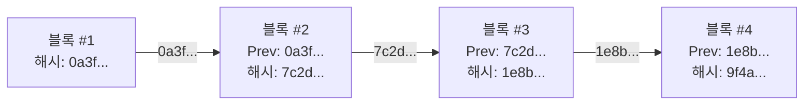
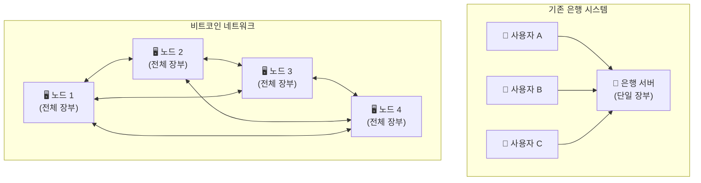
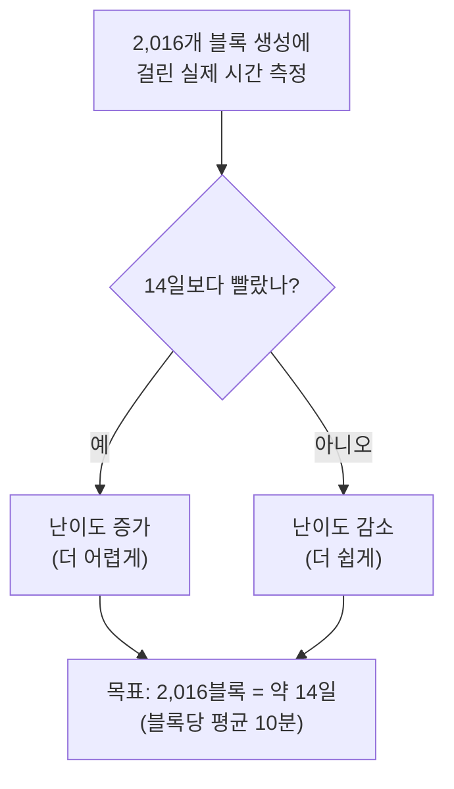
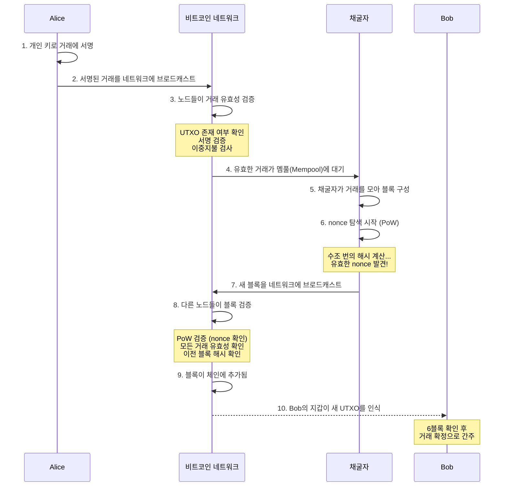

[](https://hits.sh/epheria.github.io/posts/CryptoCurrency02/)

## 서론

> 이 문서는 **암호화폐 — 디지털 시대의 화폐를 이해하기** 시리즈의 2번째 편입니다.

[1편](/posts/CryptoCurrency01/)에서 우리는 화폐의 철학적 본질, 금본위제에서 법정화폐로의 전환, 그리고 비트코인이 등장하게 된 맥락을 살펴보았다. 54원짜리 종이가 1만원의 가치를 가지는 이유, 닉슨 쇼크 이후 화폐가 순수한 신용 위에 서게 된 이야기, 그리고 사토시 나카모토가 "신뢰를 코드로 대체하겠다"고 선언한 배경까지.

이제 본격적으로 비트코인의 **기술적 구조**를 해부할 차례다.

비트코인의 내부 구조를 이해하면, "왜 가치가 있는가"와 "왜 안전한가"에 대한 답이 기술적 수준에서 명확해진다. "블록체인이 뭐냐"라는 질문에 "분산 원장이다"라는 1줄짜리 답 대신, 진짜 속을 들여다보자.

이 글에서 다루는 핵심 컴포넌트:

| 컴포넌트 | 역할 | 비유 |
|----------|------|------|
| **SHA-256 해시** | 데이터의 지문(핑거프린트) 생성 | 문서의 도장 |
| **블록체인** | 변조 불가능한 거래 장부 | 수정 불가능한 공개 장부 |
| **머클 트리** | 거래 데이터의 효율적 검증 | 책의 목차 |
| **UTXO** | 비트코인의 소유권 모델 | 지갑 속 지폐들 |
| **작업증명(PoW)** | 블록 생성을 위한 합의 메커니즘 | 수학 경시대회 |
| **반감기(Halving)** | 공급 감소 메커니즘 | 금광의 고갈 |

---

## Part 1: SHA-256 해시 — 데이터의 지문

### 해시 함수란?

비트코인을 이해하려면 먼저 **해시 함수(Hash Function)**를 이해해야 한다. 해시 함수는 어떤 크기의 입력이든 **고정된 크기의 출력**으로 변환하는 일방향 함수다.

프로그래머라면 `GetHashCode()`나 `HashMap`을 써본 적이 있을 것이다. 개념은 비슷하다. 하지만 비트코인에서 사용하는 **암호학적 해시 함수**는 그보다 훨씬 강력한 특성을 가진다.

```
[SHA-256 해시 함수]

입력: "Hello"
출력: 185f8db32271fe25f561a6fc938b2e264306ec304eda518007d1764826381969

입력: "Hello!"  (느낌표 하나 추가)
출력: 334d016f755cd6dc58c53a86e183882f8ec14f52fb05345887c8a5edd42c87b7

입력: 비트코인 백서 전문 (9페이지)
출력: b1674191a88ec5cdd733e4240a81803105dc412d6c6708d53ab94fc248f4f553
```

입력의 크기가 한 글자든 수백 페이지든, 출력은 항상 64자(256비트)의 16진수 문자열이다. 그리고 입력이 단 1비트만 달라져도 출력은 완전히 달라진다. "Hello"와 "Hello!"의 해시값을 비교해보라 — 느낌표 하나 차이인데 출력은 완전히 다른 문자열이다.

### SHA-256의 핵심 특성

비트코인이 사용하는 해시 함수는 **SHA-256(Secure Hash Algorithm 256-bit)**이다. 미국 국가안보국(NSA)이 설계하고 2001년 NIST가 표준으로 발표했다. 이 함수의 핵심 특성 다섯 가지:

| 특성 | 설명 | 직관적 비유 |
|------|------|-----------|
| **결정론적** | 같은 입력은 항상 같은 출력을 만든다 | 같은 사람의 지문은 항상 같다 |
| **고속 계산** | 어떤 입력이든 빠르게 해시를 계산할 수 있다 | 지문은 찍기 쉽다 |
| **역산 불가** | 출력에서 입력을 역추적하는 것이 사실상 불가능하다 | 지문만 보고 외모를 복원할 수 없다 |
| **충돌 저항** | 다른 입력이 같은 출력을 만들 확률이 극도로 낮다 ($2^{256}$개의 가능한 출력) | 다른 사람이 같은 지문을 가질 확률은 거의 0 |
| **눈사태 효과** | 입력을 1비트만 바꿔도 출력이 완전히 달라진다 | 쌍둥이도 지문이 다르다 |

$2^{256}$이 얼마나 큰 숫자인지 감을 잡아보자. **관측 가능한 우주의 원자 수가 약 $10^{80}$개**인데, $2^{256}$은 약 $10^{77}$이다. 비슷한 스케일이다. 해시 충돌을 우연히 발견할 확률은, 우주의 모든 원자 중에서 특정 원자 하나를 무작위로 집는 것과 비슷한 수준이다.

특히 **역산 불가(Pre-image Resistance)** 특성이 비트코인의 보안에 결정적이다. 해시 값을 알아도 원래 데이터를 복원할 수 없다는 것은, **문제를 풀기는 어렵지만 정답을 검증하기는 쉽다**는 뜻이다. 이것이 바로 비트코인 채굴의 핵심 원리다.

수학 시험에 비유하면 이렇다. "371,293의 세제곱근을 구하라"는 풀기 어렵다. 하지만 누군가 "답은 71.8이다"라고 하면, $71.8^3 = 369,955$... 아니네, 틀렸다. 계산기로 **검증은 즉시** 할 수 있다. 비트코인 채굴도 이 원리다. 답을 찾기는 미치도록 어렵지만, 맞는지 확인하는 건 한 번의 계산으로 끝난다.

---

## Part 2: 블록체인 — 되돌릴 수 없는 기록의 사슬

### 블록의 구조

비트코인의 거래(Transaction) 데이터는 **블록(Block)**이라는 단위에 담긴다. 프로그래머에게 익숙한 비유를 쓰자면, 블록은 **데이터베이스의 테이블에 INSERT되는 레코드 묶음**에 가깝다. 다만 한 번 INSERT되면 **절대 UPDATE나 DELETE가 불가능한** 테이블이다.

각 블록의 구조를 살펴보자.

```
┌─────────────────────────────────────────┐
│              Block Header                │
│                                          │
│  ┌─────────────────────────────────────┐ │
│  │ Version         : 버전 정보         │ │
│  │ Previous Hash   : 이전 블록의 해시   │ │ ← 체인 연결의 핵심
│  │ Merkle Root     : 거래들의 요약 해시  │ │
│  │ Timestamp       : 블록 생성 시각     │ │
│  │ Difficulty Target: 현재 채굴 난이도   │ │
│  │ Nonce           : 채굴자가 찾는 값   │ │ ← 채굴의 핵심
│  └─────────────────────────────────────┘ │
│                                          │
│  ┌─────────────────────────────────────┐ │
│  │           Transactions               │ │
│  │                                      │ │
│  │  TX1: Alice → Bob (0.5 BTC)         │ │
│  │  TX2: Carol → Dave (1.2 BTC)        │ │
│  │  TX3: Eve → Frank (0.3 BTC)         │ │
│  │  ...                                 │ │
│  └─────────────────────────────────────┘ │
└─────────────────────────────────────────┘
```

블록 헤더는 **단 80바이트**다. 이 80바이트 안에 수천 건의 거래를 요약하고, 이전 블록과의 연결을 보장하고, 채굴 난이도를 담고 있다. 효율적인 설계다.

여기서 가장 중요한 필드는 **Previous Hash**(이전 블록의 해시)다. 이것이 블록들을 **체인**으로 연결한다.

### 체인의 원리: 왜 변조가 불가능한가



각 블록은 **이전 블록의 해시**를 자신의 헤더에 포함하고 있다. 이 해시는 이전 블록의 **모든 데이터**(헤더 + 거래 데이터)로부터 생성된 것이다.

프로그래머에게 익숙한 자료구조로 비유하자면, 블록체인은 **링크드 리스트(Linked List)**와 비슷하다. 각 노드가 이전 노드에 대한 포인터를 가지고 있다. 하지만 결정적인 차이가 있다. 일반 링크드 리스트의 포인터는 메모리 주소일 뿐이지만, 블록체인의 "포인터"는 **이전 블록의 전체 내용에 대한 암호학적 해시**다. 내용이 바뀌면 포인터가 깨진다.

```
[일반 링크드 리스트 vs 블록체인]

일반 링크드 리스트:
  Node1(data, ptr→) → Node2(data, ptr→) → Node3(data, ptr→)
  Node2의 data를 수정해도 ptr은 그대로 → 변조 감지 불가

블록체인:
  Block1(data, hash) → Block2(data, prev_hash=hash(Block1)) → Block3(...)
  Block2의 data를 수정하면 hash(Block2)가 달라짐
  → Block3의 prev_hash와 불일치 → 변조 즉시 감지!
```

만약 누군가 블록 #2의 거래 데이터를 변조한다면 무슨 일이 벌어지는가?

1. 블록 #2의 데이터가 변경됨 → 블록 #2의 해시가 달라짐 (눈사태 효과!)
2. 블록 #3은 "Previous Hash = 7c2d..."을 기대하는데, 변조된 블록 #2의 해시는 전혀 다른 값
3. 따라서 블록 #3도 재계산해야 함 → 블록 #4도 → 블록 #5도 → ... **이후 모든 블록을 재계산**
4. 그리고 각 블록의 재계산에는 **채굴(작업증명)**이 필요하다 — 수조 번의 해시 계산이 필요

```
[변조 시도의 비용]

블록 #2 변조 시도:
  블록 #2 재계산 (채굴 필요: ~10분) +
  블록 #3 재계산 (채굴 필요: ~10분) +
  블록 #4 재계산 (채굴 필요: ~10분) +
  ... 현재까지의 모든 블록 재계산

  그 동안 정직한 노드들은 계속 새 블록을 추가 중

→ 네트워크 전체 해시파워의 51% 이상을 장악하지 않는 한 사실상 불가능
```

한 블록을 조작하면 그 뒤의 모든 블록을 다시 만들어야 한다. 그리고 그 블록체인의 사본이 전 세계 수만 대의 컴퓨터에 분산되어 있다. 이것이 블록체인이 "변조 불가능하다"고 말하는 이유다.

게임 개발로 비유하면 이렇다. MMORPG에서 서버 하나의 데이터베이스를 해킹해서 자기 캐릭터의 골드를 수정하는 건 (어렵지만) 가능할 수 있다. 하지만 **전 세계 18,000대의 서버에 동일한 데이터베이스가 복제되어 있고, 서로 끊임없이 대조하고 있다면?** 한 대를 해킹해봤자 나머지 17,999대가 "이거 조작됐네"라고 즉시 거부한다.

### 분산 장부: 수만 개의 복사본

비트코인 블록체인의 완전한 사본은 2025년 기준 전 세계 약 **18,000개 이상의 풀 노드(Full Node)**에 저장되어 있다. 블록체인의 전체 크기는 약 **580GB** 정도다. 누구든 컴퓨터와 인터넷만 있으면 풀 노드를 운영할 수 있다. 허가가 필요 없다.



- **기존 시스템**: 은행 서버 하나가 다운되면 모든 서비스가 멈춘다 (단일 실패점). 2022년 카카오 데이터센터 화재가 대표적 사례다
- **비트코인**: 노드 몇 개가 다운되어도 네트워크는 정상 작동한다 (분산 내결함성). 비트코인 네트워크는 2009년 1월 3일 이후 **한 번도 다운된 적이 없다.** 99.99...% 가동률. 어떤 은행도, 어떤 IT 기업도 이 기록을 달성하지 못했다

---

## Part 3: 머클 트리 — 효율적인 거래 검증

### 왜 머클 트리가 필요한가

하나의 블록에는 수천 건의 거래가 들어갈 수 있다. 현재 평균적으로 한 블록에 **약 2,000~3,000건**의 거래가 담긴다. "이 거래가 정말 이 블록에 포함되어 있나?"를 확인하려면, 3,000건의 거래를 하나하나 뒤져야 할까?

**머클 트리(Merkle Tree)**는 이 문제를 $O(\log n)$의 효율로 해결한다. 랄프 머클(Ralph Merkle)이 1979년에 발명한 자료구조다. 이진 트리 구조에 해시 함수를 결합한 것인데, CS를 공부한 사람이라면 **이진 탐색(Binary Search)**의 효율성을 떠올리면 된다.

### 머클 트리의 구조

```
                    ┌───────────┐
                    │ Merkle Root│  ← 블록 헤더에 저장 (32바이트)
                    │  Hash(AB+CD)│
                    └─────┬─────┘
                   ┌──────┴──────┐
              ┌────┴────┐   ┌────┴────┐
              │ Hash(AB) │   │ Hash(CD) │
              └────┬────┘   └────┬────┘
            ┌──────┴──────┐  ┌──────┴──────┐
         ┌──┴──┐     ┌──┴──┐  ┌──┴──┐   ┌──┴──┐
         │H(TX1)│     │H(TX2)│  │H(TX3)│   │H(TX4)│
         └──────┘     └──────┘  └──────┘   └──────┘
            ↑            ↑         ↑           ↑
           TX1          TX2       TX3         TX4
```

작동 원리:
1. 각 거래(TX)를 개별적으로 해시한다
2. 인접한 두 해시를 합쳐서 다시 해시한다
3. 이 과정을 반복하여 최종적으로 하나의 **머클 루트(Merkle Root)**를 만든다

토너먼트 대진표를 떠올리면 이해가 쉽다. 4명의 선수가 있으면 1회전에서 2경기, 결승에서 1경기를 해서 우승자가 나온다. 머클 트리도 마찬가지로, 해시들이 "대결"하며 올라가서 최종 루트 하나가 결정된다. 그 루트 하나가 수천 건의 거래 전체를 대표한다.

### 효율적 검증: SPV (Simplified Payment Verification)

TX3이 이 블록에 포함되어 있는지 확인하고 싶다면, 전체 거래 목록을 다운로드할 필요가 없다. **단 3개의 해시 값**만 있으면 된다:

```
검증에 필요한 데이터 (Merkle Proof):
1. H(TX3) — 검증 대상
2. H(TX4) — TX3과 짝을 이루는 해시
3. Hash(AB) — 반대편 서브트리의 해시

검증 과정:
H(TX3) + H(TX4) → Hash(CD) ← 직접 계산
Hash(AB) + Hash(CD) → Merkle Root ← 직접 계산
→ 블록 헤더의 Merkle Root와 비교하여 일치하면 TX3이 이 블록에 포함되어 있음을 증명!
```

이것이 얼마나 효율적인지 숫자로 보자:

| 블록 내 거래 수 | 전체 검증 시 필요한 데이터 | 머클 증명 시 필요한 해시 수 |
|--------------|----------------------|------------------------|
| 4건 | 4건 전부 | 2개 |
| 1,000건 | 1,000건 전부 | ~10개 |
| 10,000건 | 10,000건 전부 | ~14개 |
| 100,000건 | 100,000건 전부 | ~17개 |

10만 건의 거래 중 특정 거래를 검증하는 데 **17개의 해시**만 있으면 된다. 이것이 $O(\log n)$의 힘이다.

이 덕분에 **SPV(Simplified Payment Verification)** 클라이언트가 가능해진다. 전체 블록체인(~580GB)을 다운로드하지 않고도, 블록 헤더(블록당 80바이트)만 가지고 있으면 특정 거래의 포함 여부를 검증할 수 있다. 스마트폰 비트코인 지갑이 가능한 이유가 바로 이 머클 트리 덕분이다.

---

## Part 4: UTXO — 비트코인의 소유권 모델

### 계좌 잔고 vs UTXO

은행 시스템이나 이더리움은 **계좌(Account) 모델**을 사용한다. "A의 계좌 잔고: 10,000원"이라는 하나의 숫자를 관리한다. 우리가 은행 앱에서 보는 잔액이 바로 이것이다.

비트코인은 근본적으로 다르다. **UTXO(Unspent Transaction Output, 미사용 거래 출력)** 모델을 사용한다. 비트코인에는 "잔고"라는 개념이 없다. 정말이다. 비트코인 소프트웨어 코드 어디에도 "balance"라는 변수는 없다.

대신, 아직 사용하지 않은 **개별 거래 출력값들의 합**이 당신의 비트코인이다.

```
[계좌 모델 vs UTXO 모델]

계좌 모델 (은행, 이더리움):
  Alice의 잔고: 1.5 BTC (하나의 숫자)
  → DB에 저장: UPDATE accounts SET balance = 1.5 WHERE user = 'Alice'

UTXO 모델 (비트코인):
  Alice가 소유한 UTXO들:
    UTXO #1: 0.7 BTC (TX_abc에서 받음, 2024-03-15)
    UTXO #2: 0.3 BTC (TX_def에서 받음, 2024-05-22)
    UTXO #3: 0.5 BTC (TX_ghi에서 받음, 2024-08-01)
    ─────────────────
    합계:     1.5 BTC

  → "잔고 1.5 BTC"는 지갑 소프트웨어가 이 UTXO들을 합산해서 보여주는 것
```

### 현금 지폐와의 비유

UTXO를 이해하는 가장 쉬운 방법은 **현금 지폐**에 비유하는 것이다.

지갑에 1만원짜리 1장과 5천원짜리 1장이 있다면, 은행 앱은 "잔고 15,000원"이라고 표시하겠지만, 실제로는 **"1만원짜리 한 장 + 5천원짜리 한 장"**이 있는 것이다. 이 둘은 미묘하지만 중요한 차이가 있다.

7,000원짜리 물건을 사려면 어떻게 할까?

```
[UTXO 거래 예시: Alice → Bob에게 0.7 BTC 전송]

입력 (Input):
  UTXO #1: 1.0 BTC (Alice가 이전에 받은 것)
  → 이 UTXO를 "소비"한다 (지폐를 건네는 것)

출력 (Output):
  출력 #1: 0.7 BTC → Bob의 주소       (지불금 = 새 UTXO 생성)
  출력 #2: 0.29 BTC → Alice의 주소     (거스름돈 = 새 UTXO 생성)
  (나머지 0.01 BTC = 채굴자에게 가는 수수료, 어디에도 출력되지 않음)

결과:
  UTXO #1 (1.0 BTC) → 소멸 (Spent) ← 영원히 사라짐
  새 UTXO: 0.7 BTC (Bob 소유)     → 생성
  새 UTXO: 0.29 BTC (Alice 소유)  → 생성 (거스름돈)
```

편의점에서 1만원짜리 지폐를 내고 7천원짜리를 사면, 1만원짜리가 사라지고 3천원을 거슬러 받는 것과 정확히 같다.

핵심은 **UTXO는 부분 사용이 불가능하다**는 것이다. 1만원짜리 지폐를 반으로 찢어 5천원으로 쓸 수 없는 것처럼, 1 BTC짜리 UTXO의 일부만 사용할 수 없다. 전체를 소비하고, 잔돈을 새 UTXO로 돌려받아야 한다.

거스름돈 UTXO를 만들지 않으면? 그 차이는 모두 채굴자에게 수수료로 돌아간다. 실제로 초기 비트코인 사용자 중 실수로 거스름돈 출력을 빠뜨려 수백 BTC를 채굴자에게 기부(?)한 사례가 있다.

### 왜 UTXO 모델인가?

왜 비트코인은 "잔고" 모델 대신 이 복잡한 UTXO 모델을 선택했을까? 그 이유가 꽤 설득력 있다:

| 장점 | 설명 |
|------|------|
| **병렬 검증** | 각 UTXO가 독립적이므로 동시에 검증 가능. 계좌 모델은 동일 계좌의 거래를 순차 처리해야 한다 |
| **프라이버시** | 매 거래마다 새 주소를 사용하기 쉬움. 거스름돈이 새 주소로 가면 추적이 어려워진다 |
| **이중지불 방지** | UTXO는 한 번 사용되면 소멸 — 재사용 불가. "이 UTXO가 이미 사용되었는가?"만 확인하면 된다 |
| **감사 용이성** | 모든 비트코인의 출처를 제네시스 블록까지 추적 가능. 비트코인은 역사가 있는 돈이다 |
| **상태 최소화** | 전체 거래 내역 대신 "미사용 UTXO 목록"만 관리하면 됨. 현재 UTXO 세트는 약 7천만 개 |

---

## Part 5: 작업증명(PoW) — 채굴의 진짜 의미

### 채굴이란 무엇인가

"비트코인 채굴"이라 하면 많은 사람들이 금광에서 곡괭이질하는 이미지를 떠올린다. 하지만 실제로는 전혀 다른 작업이다. 비유적으로 더 정확한 이미지는 **거대한 수학 복권**이다.

**채굴(Mining)이란 블록 헤더의 해시 값이 특정 조건(난이도 목표)을 만족하는 nonce 값을 찾는 작업이다.**

```
채굴자의 작업:

1. 멤풀(대기열)에서 거래 데이터를 모아 블록을 구성한다
2. 블록 헤더를 완성한다 (이전 해시, 머클 루트, 타임스탬프 등)
3. nonce 값을 0부터 시작하여 1씩 증가시키며:
   - SHA-256(SHA-256(블록 헤더)) 를 계산한다  ← 이중 해시!
   - 결과가 난이도 목표(Target)보다 작으면 → 성공! 블록 발견!
   - 아니면 → nonce를 1 증가시키고 다시 시도
4. 수십억, 수조 번의 시도 끝에 조건을 만족하는 nonce를 찾는다
```

프로그래머라면 이것이 **브루트포스(Brute Force)** 탐색이라는 걸 알아챌 것이다. 지름길이 없다. 해시 함수의 역산 불가 특성 때문에, "어떤 nonce를 넣으면 조건을 만족하는 해시가 나올까"를 **계산으로 예측할 수 없다.** 그냥 하나하나 다 해봐야 한다.

```python
# 채굴을 pseudo code로 표현하면:
while True:
    block_header.nonce += 1
    hash_result = sha256(sha256(block_header))
    if hash_result < difficulty_target:
        broadcast(block)  # 성공! 블록을 네트워크에 전파
        reward = block_reward + sum(tx_fees)  # 보상 수령
        break
```

### 난이도 목표의 의미

난이도 목표(Difficulty Target)란 **해시 결과값이 얼마나 작아야 하는가**를 정의한다. 해시 결과의 앞부분에 0이 많을수록 조건이 까다로워진다.

```
[난이도에 따른 해시 조건]

낮은 난이도:  해시가 "0"으로 시작하면 OK
              → 16번 중 1번 꼴로 성공 (6.25%)

중간 난이도:  해시가 "00000"으로 시작해야 함
              → 16^5 = 약 100만 번 중 1번 꼴로 성공

높은 난이도:  해시가 "0000000000"으로 시작해야 함
              → 16^10 = 약 1조 번 중 1번 꼴로 성공

실제 (2025): 해시 앞에 0이 약 19개 필요
              → 천문학적 횟수의 시도 필요
```

비유하자면, **10억 면체 주사위를 던져서 특정 숫자 이하가 나올 때까지 반복하는 것**과 같다. "1 이하가 나와라" — 10억 번 중 1번. 찾기는 어렵지만, **검증은 즉시 가능하다.** 다른 노드들은 제출된 nonce를 블록 헤더에 넣고 SHA-256을 한 번만 돌리면 정답 여부를 확인할 수 있다.

이것이 비트코인의 핵심적인 **비대칭성**이다:
- **채굴 (생산)**: 수조 번의 계산 → 약 10분 소요
- **검증 (확인)**: 1번의 계산 → 밀리초 소요

### 난이도 조절: 항상 10분

비트코인은 **평균 10분에 1개의 블록**이 생성되도록 설계되어 있다. 왜 10분인가? 사토시가 선택한 트레이드오프다. 너무 빠르면 네트워크 전파 지연 때문에 충돌(orphan blocks)이 많아지고, 너무 느리면 사용성이 떨어진다.

채굴에 참여하는 컴퓨팅 파워(해시레이트)가 증가하면 블록이 더 빨리 발견되므로, 비트코인은 **2,016블록마다(약 2주)** 난이도를 자동으로 조절한다.



난이도 조절 공식은 놀라울 정도로 간단하다:

$$\text{새 난이도} = \text{기존 난이도} \times \frac{\text{실제 소요 시간}}{14\text{일}}$$

실제 소요 시간이 7일이었다면(너무 빨랐다면) 난이도가 2배로 올라간다. 21일이었다면(너무 느렸다면) 난이도가 2/3로 내려간다. 최대 4배까지만 조절되도록 안전장치도 있다.

이 자동 조절 메커니즘 덕분에 비트코인은 2009년 출범 이래, 초기 개인 노트북으로 채굴하던 시절부터 현재 전용 ASIC 채굴기가 수십만 대 돌아가는 시대까지, **일정한 블록 생성 속도**를 유지하고 있다. 해시레이트가 $10^{20}$ 배 이상 증가했지만, 블록 시간은 여전히 약 10분이다.

### 채굴의 경제학: 왜 정직한 것이 이득인가

채굴자가 부정행위를 하지 않는 이유는 **도덕**이 아니라 **경제적 인센티브** 때문이다. 이것은 비트코인 설계에서 가장 천재적인 부분이며, **게임이론(Game Theory)**의 핵심 응용이다.

사토시는 인간의 선의에 의존하지 않았다. 대신 **이기적인 행동 자체가 시스템의 보안에 기여하도록** 인센티브를 설계했다.

| 행동 | 보상 | 리스크 |
|------|------|--------|
| **정직한 채굴** | 블록 보상(현재 3.125 BTC) + 거래 수수료 | 없음 (확실한 보상) |
| **부정 채굴(51% 공격)** | 이중지불 이득 | 51% 해시파워 유지 비용 + 비트코인 가격 폭락 리스크 |

51% 공격을 수행하려면 전 세계 채굴 컴퓨팅 파워의 과반을 장악해야 한다. 2025년 기준으로 이에 필요한 비용은 수십조 원 규모다. ASIC 채굴기를 구매하고, 전기를 공급하고, 냉각 시설을 운영하는 데 천문학적 비용이 든다.

그리고 만약 공격이 성공하더라도, "비트코인이 해킹당했다"는 뉴스가 퍼지면 비트코인 가격이 폭락하여 공격자가 얻는 이득도 무가치해진다. 수십조를 투자해서 공격에 성공해봤자, 그 결과로 비트코인의 가치가 떨어지면 공격자의 보유 비트코인도 무가치해진다. **자기 집에 불을 지르는 격**이다.

즉, **정직하게 채굴하는 것이 경제적으로 합리적**이다. 채굴자는 자신의 이익을 극대화하려는 이기적 동기로 정직하게 행동하고, 그 결과 네트워크 전체가 안전해진다. 사토시 나카모토가 설계한 이 인센티브 구조야말로 비트코인의 핵심 혁신이다.

이것을 경제학에서는 **내쉬 균형(Nash Equilibrium)**이라 부른다 — 모든 참여자가 자신의 전략을 바꿀 이유가 없는 상태. "정직한 채굴"이 모든 채굴자에게 최적 전략이므로, 아무도 이탈할 인센티브가 없다.

---

## Part 6: 반감기(Halving) — 프로그래밍된 희소성

### 비트코인의 발행 스케줄

1편에서 짐멜의 가치론을 떠올려보자. "거리가 가치를 만든다." 비트코인에서 이 "거리"를 만드는 핵심 메커니즘이 바로 **반감기**다.

비트코인에는 **총 발행량 2,100만 개**라는 절대적 상한이 코드에 의해 정해져 있다. 중앙은행이 "돈을 더 찍자"고 결정할 수 없다. 어떤 정부도, 어떤 기관도, 심지어 사토시 나카모토 자신조차도 이 숫자를 바꿀 수 없다 (네트워크 참여자의 합의 없이는).

실제 비트코인 코어 소스코드(C++)에서 이 규칙은 이렇게 구현되어 있다:

```cpp
// 비트코인 코어 소스코드 (validation.cpp)
CAmount GetBlockSubsidy(int nHeight, const Consensus::Params& consensusParams)
{
    int halvings = nHeight / consensusParams.nSubsidyHalvingInterval; // 210,000
    if (halvings >= 64)
        return 0;
    CAmount nSubsidy = 50 * COIN; // 초기 보상: 50 BTC
    nSubsidy >>= halvings; // 반감기마다 비트시프트(÷2)
    return nSubsidy;
}
```

`>>=` 는 비트 우시프트 연산자로, 값을 절반으로 나누는 것과 같다. 이 몇 줄의 코드가 비트코인의 통화 정책 전체를 정의한다. 중앙은행의 수천 명 직원이 만드는 통화 정책이 코드 10줄로 대체된 것이다.

새로운 비트코인은 채굴을 통해서만 발행된다. 그리고 **210,000블록마다 (약 4년) 채굴 보상이 절반으로 줄어든다.** 이것이 **반감기(Halving)**다.

```
[비트코인 반감기 스케줄]

반감기   시기       블록 보상        누적 발행량        비트코인 가격(당시)
─────────────────────────────────────────────────────────────────
 #0    2009.01    50.0    BTC/블록    ~10,500,000 BTC    $0
 #1    2012.11    25.0    BTC/블록    ~15,750,000 BTC    ~$12
 #2    2016.07    12.5    BTC/블록    ~18,375,000 BTC    ~$650
 #3    2020.05     6.25   BTC/블록    ~19,687,500 BTC    ~$8,700
 #4    2024.04     3.125  BTC/블록    ~20,343,750 BTC    ~$64,000
 #5    2028(예정)  1.5625  BTC/블록    ~20,671,875 BTC    ???
 ...
 #33   2140(예정)  0.00000001 BTC     21,000,000 BTC (상한)
```

눈치 빠른 분은 패턴을 발견했을 것이다. 반감기 이후 1~2년 내에 비트코인 가격이 크게 상승하는 경향이 있다. 이것이 우연인지, 공급 감소에 의한 필연인지는 논쟁이 있지만, 수요가 일정한 상태에서 공급이 절반으로 줄어들면 가격 상승 압력이 생기는 것은 경제학의 기본 원리다.

### 기하급수적 감소: 왜 2,100만인가

반감기의 수학적 원리를 살펴보자. 초기 블록 보상이 50 BTC이고, 210,000블록마다 절반으로 줄어든다면, 총 발행량은 **등비급수의 합**으로 계산된다:

$$\text{총 발행량} = 210{,}000 \times 50 \times \sum_{i=0}^{\infty} \frac{1}{2^i} = 210{,}000 \times 50 \times 2 = 21{,}000{,}000$$

무한등비급수 $\sum_{i=0}^{\infty} \frac{1}{2^i} = 2$ 이므로, 총 발행량은 정확히 **2,100만 BTC**로 수렴한다. 마지막 비트코인이 채굴되는 시점은 2140년경으로 추정된다.

왜 사토시는 2,100만이라는 숫자를 선택했을까? 확실한 답은 알 수 없지만, 한 가지 유력한 이론이 있다. 2009년 당시 전 세계 통화 공급량(M1)이 약 **21조 달러**였다. 비트코인이 이를 대체한다면, 1 BTC = 100만 달러가 된다. 깔끔한 숫자다. 우연일까?

### 2140년 이후: 보상이 0이 되면?

자주 나오는 질문이다. "채굴 보상이 0이 되면 채굴자들이 떠나지 않나? 네트워크 보안은?"

답은 **거래 수수료**에 있다. 채굴자의 수입은 "블록 보상 + 거래 수수료"로 구성된다. 블록 보상이 줄어들면, 상대적으로 거래 수수료의 비중이 커진다. 실제로 2024년 반감기 이후, 일부 블록에서는 거래 수수료가 블록 보상을 초과하는 경우도 나타나고 있다.

비트코인이 널리 사용될수록 거래 수수료 총합은 증가할 것이며, 이것이 채굴의 인센티브를 유지할 것이라는 게 설계의 의도다.

### 디플레이션 화폐로서의 설계

| 구분 | 법정화폐 (원화) | 비트코인 |
|------|----------------|---------|
| **총 발행량** | 상한 없음 | 2,100만 BTC |
| **발행 권한** | 중앙은행 재량 | 코드에 의해 자동 결정 |
| **발행 속도** | 예측 불가 | 100% 예측 가능 (코드 한 줄로 확인) |
| **인플레이션** | 매년 약 2~5% 목표 | 반감기마다 발행량 50% 감소 |
| **장기 추세** | 화폐 가치 하락 (인플레이션) | 화폐 가치 상승 (디플레이션적) |

법정화폐는 "시간이 지날수록 가치가 줄어드는" 구조다. 그래서 사람들은 돈을 빨리 쓰거나 투자하려 한다 (이것이 경제를 순환시킨다는 것이 케인스 경제학의 주장이다). 월급을 받으면 저축보다 투자를 고민하는 이유가 여기에 있다 — 가만히 두면 가치가 줄어드니까.

비트코인은 "시간이 지날수록 희소해지는" 구조다. 공급은 줄어드는데 수요가 증가하면, 단위당 가치는 올라간다. 이것이 비트코인을 **디플레이션 화폐**라 부르는 이유다.

참고로, 이미 약 **400만 BTC**가 영구적으로 분실된 것으로 추정된다 (초기 채굴자들이 개인 키를 잃어버린 경우 등). 하드 드라이브를 쓰레기통에 버린 채굴자가 수억 달러어치의 비트코인을 잃어버린 유명한 사례도 있다. 실질적으로 유통 가능한 비트코인은 2,100만 개보다 훨씬 적다.

---

## Part 7: 전체 그림 — 비트코인 트랜잭션의 생명주기

지금까지 배운 모든 것을 종합하여, Alice가 Bob에게 비트코인을 보내는 전체 과정을 추적해보자. 지금까지의 퍼즐 조각들이 하나의 그림으로 맞춰지는 순간이다.



### 단계별 상세 설명

**Step 1-2: 거래 생성과 서명**

Alice는 자신의 **개인 키(Private Key)**로 거래에 디지털 서명을 한다. 이 서명은 "이 거래를 Alice가 진짜 승인했다"는 암호학적 증명이다.

여기서 사용되는 것이 **타원곡선 디지털 서명 알고리즘(ECDSA)**이다. 간단히 설명하면:
- **개인 키**: 256비트 난수. 이것이 당신의 비트코인을 "소유"하는 유일한 증거
- **공개 키**: 개인 키에서 수학적으로 유도됨. 다른 사람에게 공개해도 안전
- **주소**: 공개 키의 해시. 비트코인을 받을 때 사용
- **서명**: 개인 키로 거래 데이터에 서명. 공개 키로 검증 가능

은행 직원에게 신분증을 보여주는 것이 아니라, 수학적 증명으로 본인을 확인하는 것이다. **은행에 전화해서 "거래 승인해주세요"라고 할 필요가 없다.**

**Step 3: 거래 검증**

네트워크의 노드들은 다음을 확인한다:
- Alice가 참조하는 UTXO가 실제로 존재하는가? → UTXO 세트에서 조회
- Alice의 서명이 유효한가? → ECDSA 검증
- 이 UTXO가 이미 사용되지 않았는가? (이중지불 검사) → UTXO 세트에서 확인
- 입력 합계 ≥ 출력 합계인가? (없는 돈을 쓰려는 게 아닌가?)

이 모든 검증을 **코드가 자동으로** 수행한다. 사람의 판단이 개입할 여지가 없다.

**Step 4-6: 채굴**

유효한 거래들은 **멤풀(Mempool)**이라는 대기열에 들어간다. 멤풀은 "아직 블록에 포함되지 않은 유효한 거래들의 대기실"이다. 채굴자는 멤풀에서 거래를 선택하여 블록을 구성하는데, 보통 **수수료가 높은 거래를 우선적으로** 선택한다. 경매와 비슷하다 — 더 높은 수수료를 제시하면 더 빨리 처리된다.

채굴자는 블록을 구성한 후, 유효한 nonce를 찾기 위해 작업증명을 수행한다. 전 세계 수십만 대의 채굴기가 동시에 이 "복권"에 참여하고, 가장 먼저 정답을 찾은 채굴자가 보상을 가져간다.

**Step 7-9: 블록 확정**

유효한 블록이 발견되면 네트워크에 전파되고, 다른 노드들이 검증한 후 체인에 추가한다. 이 전파는 보통 **수 초** 만에 전 세계로 퍼진다. 모든 노드가 같은 블록을 체인에 추가하면, 네트워크 전체의 장부가 동기화된다.

**Step 10: 최종 확인**

일반적으로 **6블록의 확인(약 1시간)**이 지나면 거래가 사실상 되돌릴 수 없는 것으로 간주된다. 6블록을 되돌리려면 공격자가 정직한 체인보다 빠르게 6개의 블록을 재생성해야 하는데, 이 확률은 공격자의 해시파워가 전체의 50% 미만이면 기하급수적으로 작아진다.

사토시의 백서에는 이 확률이 정확히 계산되어 있다. 공격자가 전체 해시파워의 10%를 보유한 경우, 6블록 뒤에 따라잡을 확률은 약 **0.024%**다. 30%를 보유한 경우에도 **17.7%**에 불과하다. 6블록을 기다리면 사실상 안전하다.

---

## Part 8: 비트코인의 한계와 미래

비트코인이 완벽한 시스템은 아니다. 어떤 기술이든 트레이드오프가 있다. 주요 한계와 이를 해결하기 위한 시도들을 정직하게 살펴보자.

### 알려진 한계

| 한계 | 상세 | 대응/해결 시도 |
|------|------|---------------|
| **처리 속도** | 초당 약 7건의 거래 처리 (Visa: 약 24,000건) | 라이트닝 네트워크(Layer 2) |
| **에너지 소비** | 연간 약 100~150 TWh (소규모 국가 수준) | 에너지 원천 다변화, 잉여 에너지 활용 |
| **확장성** | 블록 크기 1MB 제한 → 거래량 한계 | SegWit, 탭루트(Taproot) 업그레이드 |
| **가격 변동성** | 단기간에 50% 이상 등락 가능 | 시장 성숙에 따른 점진적 감소 추세 |
| **사용성** | 개인 키 분실 = 자산 영구 상실 | 멀티시그 지갑, 하드웨어 지갑 발전 |

에너지 소비에 대해서는 한 가지 관점을 추가하자. 비트코인의 에너지 소비가 "낭비"인가? 이에 대한 반론은 이렇다: 전 세계 은행 시스템(건물, 직원, 서버, ATM, 보안 등)의 총 에너지 소비와 비교하면? 금 채굴의 환경 영향과 비교하면? 비트코인 채굴의 약 **58%**는 재생 가능 에너지를 사용하고 있으며, 이는 다른 산업보다 높은 비율이다. 물론 이것이 문제를 완전히 해결하지는 않지만, 맥락 없이 "에너지 낭비"라고만 하는 것은 공정하지 않다.

### 라이트닝 네트워크: Layer 2 해결책

처리 속도 문제를 해결하기 위한 **라이트닝 네트워크(Lightning Network)**는 비트코인 블록체인 위에 구축되는 2차 레이어(Layer 2)이다.

```
[Layer 1 vs Layer 2]

Layer 1 (비트코인 블록체인):
  - 모든 거래가 블록에 기록됨
  - 느리지만 최종적이고 안전함 (약 10분/블록)
  - 큰 금액의 정산, 최종 결제에 적합

Layer 2 (라이트닝 네트워크):
  - 두 당사자 간 채널을 열고, 채널 내에서 즉시 거래
  - 채널을 닫을 때만 최종 잔액을 블록체인에 기록
  - 소액의 빠른 일상 결제에 적합
  - 초당 수백만 건 처리 가능
```

게임 개발에서 익숙한 비유를 쓰자면, **네트워크 동기화**와 비슷하다:
- Layer 1은 서버 권위적 모델(Authoritative Server) — 모든 것을 서버가 처리하므로 느리지만 확실하다
- Layer 2는 클라이언트 예측(Client Prediction) — 로컬에서 빠르게 처리하고 나중에 서버와 동기화한다

라이트닝 네트워크를 통해 엘살바도르에서는 실제로 커피를 비트코인으로 결제하고 있다. 2021년 엘살바도르는 세계 최초로 비트코인을 **법정 통화**로 채택했다.

### 양자 컴퓨터 위협

자주 나오는 우려다. "양자 컴퓨터가 비트코인을 깰 수 있지 않나?"

이론적으로 양자 컴퓨터는 두 가지 위협을 제기한다:
1. **쇼어 알고리즘**: ECDSA 서명을 깰 수 있음 (공개 키에서 개인 키를 추출)
2. **그로버 알고리즘**: SHA-256 해시의 역산을 가속화 (하지만 $2^{256}$을 $2^{128}$로 줄이는 정도)

하지만 현실적으로:
- 비트코인을 깰 수 있는 양자 컴퓨터는 현재 기술로 수십 년 뒤에나 가능할 것으로 추정
- 비트코인 프로토콜은 **업그레이드 가능**하다 — 양자 컴퓨터가 현실이 되기 전에 양자 내성 암호로 전환할 수 있다
- 양자 컴퓨터가 SHA-256을 깬다면, 비트코인뿐 아니라 **인터넷 보안 전체**가 무너진다 (HTTPS, 온라인 뱅킹, 전자 서명 등 모두 같은 암호학 원리에 기반)

---

## 정리: 코드가 만든 신뢰

2편에 걸쳐 우리는 화폐의 철학적 본질에서부터 비트코인의 기술적 구조까지를 살펴보았다.

### 핵심 요약

```
[비트코인의 5가지 핵심 혁신]

1. 탈중앙화    — 단일 실패점 없는 P2P 네트워크 (18,000+ 노드)
2. 변조 불가   — 해시 체인으로 연결된 블록들 (수정하면 체인 전체가 깨짐)
3. 이중지불 방지 — UTXO 모델 + 네트워크 합의 (쓴 돈은 소멸)
4. 프로그래밍된 희소성 — 2,100만 개 상한 + 반감기 (코드 10줄이 통화 정책)
5. 인센티브 설계 — 정직한 참여가 경제적으로 합리적인 구조 (게임이론)
```

이 모든 것을 하나의 문장으로 압축하면:

> **비트코인은 "사람을 신뢰하지 않아도 되는 돈"이다.**

은행이 거래를 정직하게 처리할 것이라 신뢰할 필요 없다 → 코드가 검증한다. 중앙은행이 화폐를 남발하지 않을 것이라 신뢰할 필요 없다 → 코드가 발행량을 제한한다. 채굴자가 정직할 것이라 신뢰할 필요 없다 → 인센티브가 정직을 강제한다.

### 왜 이것을 알아야 하는가

1. **금융 리터러시** — 화폐의 본질을 이해하는 것은 현대 사회를 살아가는 데 필수적인 교양이다. 인플레이션이 "물가가 오르는 것"이 아니라 "화폐 가치가 떨어지는 것"임을 아는 것만으로도 경제적 의사결정이 달라진다
2. **기술적 이해** — 블록체인, 암호학, 분산 시스템은 금융을 넘어 다양한 분야에 적용되고 있다. 게임에서도 NFT, 블록체인 기반 자산 시스템 등이 시도되고 있다
3. **경제적 판단력** — 인플레이션, 통화정책, 대안 자산에 대한 이해는 개인의 경제적 의사결정에 도움이 된다. 저축할지, 투자할지, 무엇에 투자할지
4. **미래 대비** — 디지털 화폐는 이미 현실이며, CBDC(중앙은행 디지털화폐)를 포함한 화폐의 디지털화는 가속되고 있다. 한국은행도 디지털 원화를 연구 중이다

### 마지막으로

비트코인에 투자하라거나 투자하지 말라는 이야기가 아니다. 중요한 것은 **이해**다. 화폐가 무엇이고, 왜 현재의 금융 시스템이 이렇게 작동하며, 비트코인이라는 대안이 어떤 문제를 해결하려고 하는지를 이해하는 것. 그것이 이 시리즈의 목표였다.

사토시 나카모토가 남긴 메시지를 되새기며 마무리하자:

> **"기존 화폐의 근본적인 문제는 그것을 작동시키기 위해 필요한 모든 신뢰다."**

신뢰의 대상을 사람에서 코드로 옮기는 것. 그것이 비트코인이 시도하는, 아직 진행 중인 실험이다.

다들 시간 조금이라도 내서 비트코인이 뭔지 한번 제대로 알아보는 걸 추천한다. 생각보다 재밌고, 생각보다 깊다.

---

## 참고 자료

- [Satoshi Nakamoto, "Bitcoin: A Peer-to-Peer Electronic Cash System" (2008)](https://bitcoin.org/bitcoin.pdf)
- [How Bitcoin Works — Bitcoin.org](https://bitcoin.org/en/how-it-works)
- [How Bitcoin Works: Fundamental Blockchain Structure — Gemini](https://www.gemini.com/cryptopedia/how-does-bitcoin-work-blockchain-halving)
- [비트코인 코어 소스코드로 살펴보는 머클 트리 — Medium](https://medium.com/pocs/bitcoin01-01-%EB%B9%84%ED%8A%B8%EC%BD%94%EC%9D%B8-%EC%BD%94%EC%96%B4-%EC%86%8C%EC%8A%A4%EC%BD%94%EB%93%9C%EB%A1%9C-%EC%82%B4%ED%8E%B4%EB%B3%B4%EB%8A%94-%EB%A8%B8%ED%81%B4-%ED%8A%B8%EB%A6%AC-3b93d59c989b)
- [UTXO — 비트코인 트랜잭션 이해 — Medium](https://medium.com/@coineasy/%EC%97%91%EC%86%8C-%EB%A7%90%EA%B3%A0-utxo-%EB%B9%84%ED%8A%B8%EC%BD%94%EC%9D%B8%EC%9D%98-%ED%8A%B8%EB%9E%9C%EC%9E%AD%EC%85%98%EC%9D%84-%EC%95%8C%EC%95%84%EB%B3%B4%EC%9E%90-power-5c9a2182bd6b)
- [SHA-256 해시 알고리즘 — losskatsu.github.io](https://losskatsu.github.io/blockchain/sha256/)
- [블록체인 합의 알고리즘 분석 — 비트코인의 작업증명 — Medium](https://medium.com/pocs/bitcoin01-01-%EB%B9%84%ED%8A%B8%EC%BD%94%EC%9D%B8-%EC%BD%94%EC%96%B4-%EC%86%8C%EC%8A%A4%EC%BD%94%EB%93%9C%EB%A1%9C-%EC%82%B4%ED%8E%B4%EB%B3%B4%EB%8A%94-%EB%A8%B8%ED%81%B4-%ED%8A%B8%EB%A6%AC-3b93d59c989b)
- [비트코인 반감기: 정의 및 발생 시기 — Ledger](https://www.ledger.com/academy/crypto/bitcoin-halving)
- [비트코인 반감기 — 정확한 날짜와 원리 — CryptoNews](https://cryptonews.com/academy/bitcoin-halving/)
- [비트코인 코어 소스코드 — GitHub](https://github.com/bitcoin/bitcoin)
- [Bitcoin Energy Consumption — Cambridge Bitcoin Electricity Consumption Index](https://ccaf.io/cbnsi/cbeci)
- [Lightning Network — lightning.network](https://lightning.network/)
