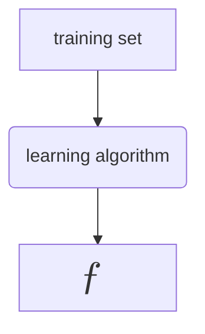

[](https://hits.seeyoufarm.com)

---

<br>

> 해당 포스트는 Andrew Ng 교수님의  [**Machine Learning Specialization**](https://www.coursera.org/specializations/machine-learning-introduction) 특화 과정에 대한 정리 내용을 참고하였습니다.

<br>
<br>

## 목차

> [Linear Regression Model - 선형 회귀 모델](#linear-regression-model---선형-회귀-모델)      
> [Terminology And Notation - 용어와 표기법](#terminology-and-notation---용어와-표기법)      
> [How to represent model - 모델의 표기법](#how-to-represent-model--모델의-표기법)     
> [실습](#실습)

<br>
<br>

## Linear Regression Model - 선형 회귀 모델

{: : width="600" .normal }     

- Linear Regression Model (선형 회귀 모델)은 주어진 데이터 집합들을 가지고 직선을 그린다.
- 이걸 왜 지도학습 방법이라고 부르지? 의문이 들 수 있는데 그 이유는 "right answers" 즉 정답이 있는 데이터를 제공하여 학습시키기 때문이고
- 집의 크기와 모델이 각 주택에 대해 예측해야하는 가격을 모두 갖추고 있기 때문이다.

<br>

## Terminology And Notation - 용어와 표기법

- 위 그림에서는 총 47개의 데이터 포인트들이 존재하는데 이를 데이터 테이블로 표시하면 다음과 같다.

{: : width="600" .normal }     

- 이를 Training Set 학습 세트라고 부른다.
- 주택 가격을 예측하려면 먼저 training set 를 통해 학습하도록 모델을 훈련시켜야 한다.
- 머신러닝에서 input(입력)을 나타내는 표준 표기법은 $x$ 이며, 이를 input(or feature) variable 이라고 한다.
- output(출력)을 나타내는 표준 표기법은 $y$ 이며, 이를 output(or target) variable 이라고 한다.

- 이 training set 에는 총 47개의 row 가 있는데, 각 row 들은 서로 다른 training examples 를 나타낸다.
- $m$ 은 training examples 의 총 개수이다. 여기서는 $m = 47$

- 또한 첫 번째 single training example (단일 훈련 예제)를 나타내기 위해 tuple 처럼 괄호 표기법을 사용한다.

$$ (x, y) = (2104, 407) $$

- 또한 $x, y$ 에 위 첨자 표기법을 사용하여 $i$ 번 째 training example 임을 알려준다.

$$ (x^{(i)}, y^{(i)}) = i^{th} $$

- 지수가 아님에 주의하자. 테이블의 index 임

<br>



<br>

- 입력 특징과 출력 목표를 모두 포함하는 training set 를 학습 알고리즘에 공급해야한다. 그러면 supervised learning 알고리즘이 함수를 생성한다. 이 함수를 $f$ 로 나타낸다.
- 이 $f$ 에 입력값 $x$ 를 가져와서 예측값 $\hat{y}$ (y-hat)을 출력하고 추정하는 것이다.

$$ \large{x \rightarrow f \rightarrow \hat{y}} $$

- 여기서 함수 $f$ 를 model 이라고 하며, input $x$ 는 input feature, model 의 output 은 예측값인 $hat{y}$ 이다.
- $y$ 값은 training set 의 실제 참값인 목표값(target)이고 반대로 $\hat{y}$ 은 추정치이다. 실제 참 값일 수도 있고 아닐 수도 있다.
- 집의 크기와 집값을 예시로 들면 size -> f -> price (estimated)

<br>
<br>

## How to represent Model- 모델의 표기법

- 머신러닝에서 중요한 것 $f$ 를 어떻게 표현할 것인가에 대해 알아보자. $f$ 를 계산할 때 사용할 수학 공식은 다음과 같다.

$$ \large{f_{w,b} (X) = w\mathbf{x} + b} $$

<br>

{: : width="300" .normal }     

- 이 모델은 linear regression (선형 회귀) 라고 부르며 정확하게는 linear regression with one variable 이다.
- 단일 입력 변수 $x$ 밖에 없기 때문에 또 다른이름은 Univariate linear regression (일변량 선형 회귀)라고도 한다. 

<br>

- Notation 정리

|Notation|Description|Python|
|:---:|:---:|:---:|
|$a$|scalar, non bold| |
|$\mathbf{a}$|vector, bold| |
|**Regression**| | |
|$\mathbf{x}$| Training Example feature values| x_train |
|$\mathbf{y}$| Training Example targets| y_train |
|$x^{(i)}, y^{(i)}$| $i^{th}$ training examples | x_i, y_i |
|$m$| Number of training examples | m |
|$w$| parameter : weight | w |
|$b$| parameter : bias | b |
|$f_{w,b}(x^{(i)})$| The result of the model evaulation at $x^{(i)}$ parameterized by $w, b$ : $f_{w,b}(x^{(i)} = wx^{(i)} + b)$| f_wb |

<br>
<br>

## 실습

- 일변수 선형 회귀를 위해 $f_{w,b}$ 모델을 실제로 구현해보자.

- 우선 훈련 예시인 feature/input 인 x_train 과 target 인 y_train 을 생성하고

```python
import numpy as np
import matplotlib.pyplot as plt
plt.style.use('./deeplearning.mplstyle')

x_train = np.array([1.0, 2.0])
y_train = np.array([300.0, 500.0])

print(f"x_train = {x_train}")
print(f"y_train = {y_train}")
```

```console
x_train = [1. 2.]
y_train = [300. 500.]
```

<br>

- 훈련예시의 개수인 m 을 x_train 의 shape 를 받아와 세팅한다.

```python
# m is the number of training examples
print(f"x_train.shape: {x_train.shape}")
m = x_train.shape[0]
print(f"Number of training examples is: {m}")

# 또는 len() 함수를 사용하여 구할 수도 있다.
m = len(x_train)
print(f"Number of training example is: {m}")
```

```console
x_train.shape: (2,)
Number of training examples is: 2
```

<br>

- $i^{th}$ 훈련 예시를 구하자.

```python
i = 0 # Change this to 1 to see (x^1, y^1)

x_i = x_train[i]
y_i = y_train[i]
print(f"(x^({i}), y^({i})) = ({x_i}, {y_i})")
```

```console
(x^(0), y^(0)) = (1.0, 300.0)
```

<br>

- 데이터 Plotting 하기
- 위의 두 점을 matplotlib 의 scatter() 를 사용하여 찍을 수 있다.
- marker 와 c 는 각각 모양과 색상을 뜻한다.

```python
# Plot the data points
plt.scatter(x_train, y_train, marker="x", c="r")

# Set the title
plt.ylabel("Price (in 1000s of dollars)")

# Set the x-axis label
plt.xlabel("Size (1000 sqft)")

plt.show()
```

{: : width="500" .normal }     

<br>

- 모델 $f_{w,b}$ 의 parameter 에 w = 200, b = 100 를 대입해보자.

```python
w = 200
b = 100
```

- $f_{w,b}(x^{(i)})$ 의 수식을 파이썬으로 나타내면 다음과 같다.

```python
def compute_model_output(x, w, b):
    """
    Computes the prediction of a linear model
    Args:
      x (ndarray (m,)): Data, m examples 
      w,b (scalar)    : model parameters  
    Returns
      f_wb (ndarray (m,)): model prediction
    """
    m = x.shape[0]
    f_wb = np.zeros(m)
    for i in range(m):
        f_wb[i] = w * x[i] + b
        
    return f_wb
```

<br>

- plotting 을 하면 다음과 같은 그래프가 그려진다.

```python
tmp_f_wb = compute_model_output(x_train, w, b,)

# Plot our model prediction
plt.plot(x_train, tmp_f_wb, c='b',label='Our Prediction')

# Plot the data points
plt.scatter(x_train, y_train, marker='x', c='r',label='Actual Values')

# Set the title
plt.title("Housing Prices")
# Set the y-axis label
plt.ylabel('Price (in 1000s of dollars)')
# Set the x-axis label
plt.xlabel('Size (1000 sqft)')
plt.legend()
plt.show()
```

{: : width="500" .normal }     

<br>
<br>