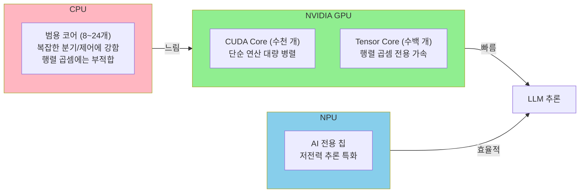
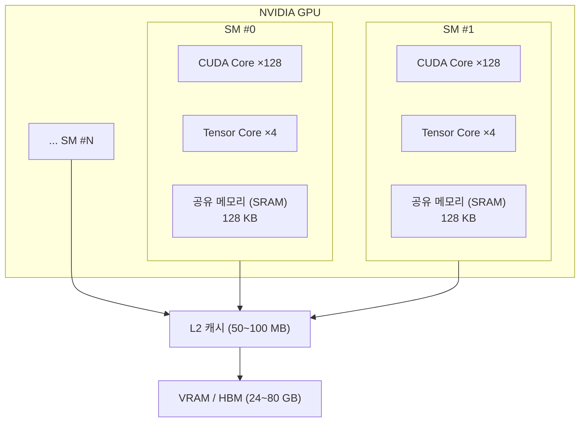
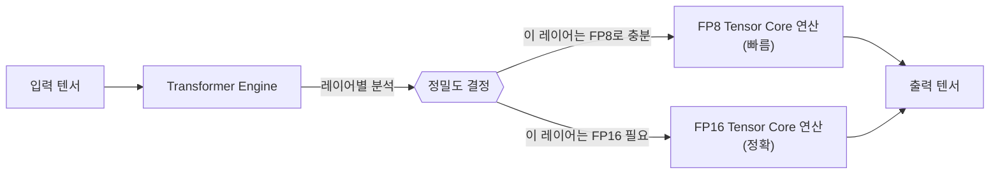
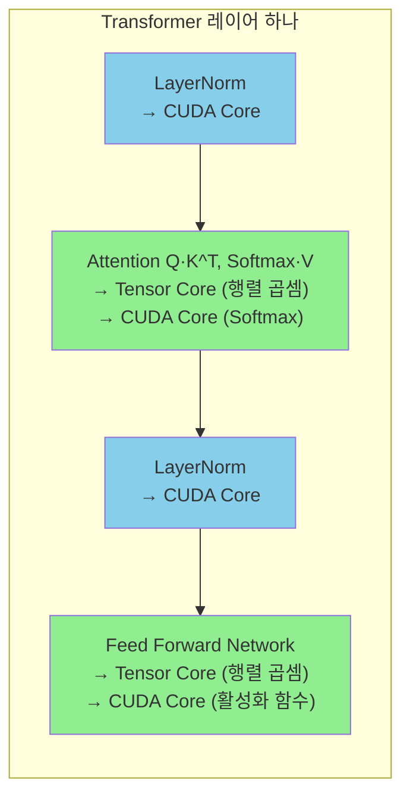
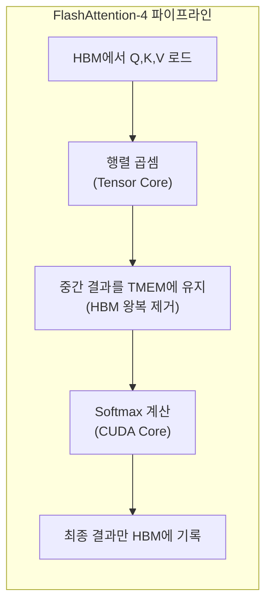
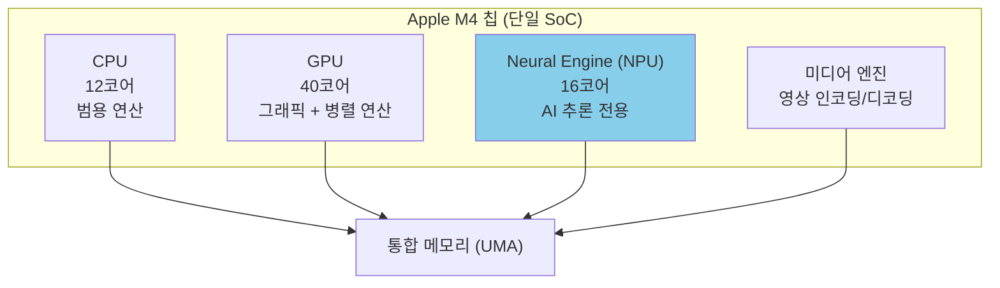
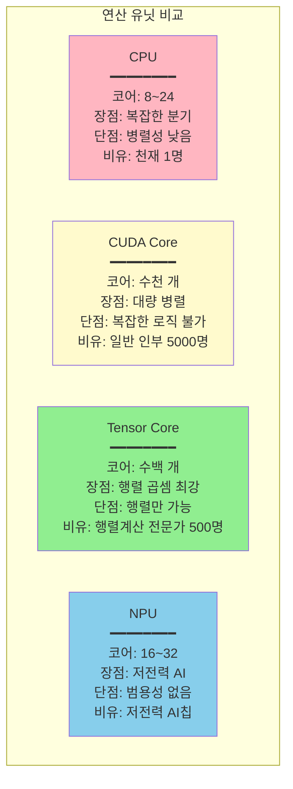
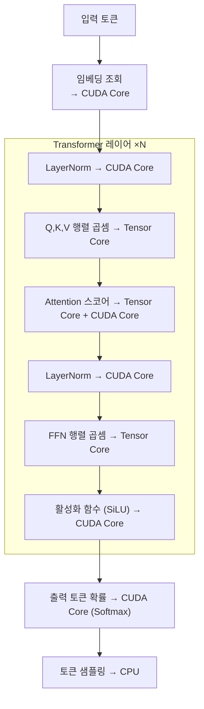

[](https://hits.sh/epheria.github.io/)

---

> 이 문서는 [LLM 동작 원리 - 게임 개발자를 위한 가이드](/posts/llm-guide/)의 7번 섹션 "하드웨어 구성"의 보충 자료입니다.
> 메모리 관련 심화는 [VRAM 심화 가이드](/posts/vram-deep-dive/)를 참조하세요.

---

## 개요: 누가 연산을 수행하는가?

LLM 추론의 핵심은 **행렬 곱셈**입니다. 수십억 개의 숫자를 곱하고 더하는 작업을 반복하는 것이죠. 이 연산을 "누가" 수행하느냐에 따라 속도가 수백~수천 배 차이납니다.



게임 개발자에게 비유하면:
- **CPU** = 게임 로직, AI 의사결정, 물리 시뮬레이션의 복잡한 분기 처리
- **CUDA Core** = 수천 개의 버텍스를 동시에 변환하는 버텍스 셰이더
- **Tensor Core** = 레이 트레이싱의 RT Core처럼, 특정 연산만 극도로 빠르게 하는 전용 유닛
- **NPU** = 모바일 기기의 저전력 이미지 처리 DSP

---

## 1. CUDA Core: 범용 병렬 연산의 기본 단위

### CUDA Core란?

CUDA(Compute Unified Device Architecture) Core는 NVIDIA GPU의 **가장 기본적인 연산 유닛**입니다. 각 CUDA Core는 하나의 부동소수점(float) 또는 정수(int) 연산을 수행할 수 있습니다. GPU가 강력한 이유는 이 코어가 **수천 개** 존재하고, 모두 **동시에** 연산을 수행하기 때문입니다.

### 게임 렌더링에서의 역할

게임 개발자에게 CUDA Core는 사실 매우 익숙합니다. 우리가 작성하는 **셰이더(Shader)**가 바로 CUDA Core에서 실행됩니다:

```
버텍스 셰이더:    각 버텍스 변환 → 하나의 CUDA Core가 처리
프래그먼트 셰이더: 각 픽셀 색상 계산 → 하나의 CUDA Core가 처리
컴퓨트 셰이더:    각 스레드 → 하나의 CUDA Core가 처리
```

1080p 해상도의 프레임을 렌더링할 때, 약 200만 픽셀의 색상을 계산해야 합니다. CPU로 순차 처리하면 극도로 느리지만, 수천 개의 CUDA Core가 동시에 처리하면 16ms(60 FPS) 안에 완료됩니다.

### LLM에서의 역할

LLM 추론에서 CUDA Core는 다음 작업을 수행합니다:

| 연산 | 설명 | CUDA Core의 역할 |
|------|------|-----------------|
| 활성화 함수 | ReLU, GELU, SiLU 등 | 각 원소에 비선형 함수 적용 |
| LayerNorm | 정규화 연산 | 평균/분산 계산, 스케일링 |
| Softmax | 확률 분포 계산 | 지수 함수, 합산, 나눗셈 |
| 원소별 연산 | 덧셈, 잔차 연결(Residual) | 벡터 원소별 병렬 처리 |
| 토큰 샘플링 | Top-K, Top-P 필터링 | 확률 정렬 및 샘플링 |

그러나 LLM의 가장 무거운 연산인 **행렬 곱셈**은 CUDA Core 대신 **Tensor Core**가 담당합니다. CUDA Core가 행렬 곱셈을 못하는 것은 아니지만, Tensor Core에 비해 10~20배 느립니다.

### GPU별 CUDA Core 수

| GPU | CUDA Core 수 | 출시 | 주 용도 |
|-----|-------------|------|--------|
| RTX 3060 | 3,584 | 2021 | 소비자 게이밍 |
| RTX 4090 | 16,384 | 2022 | 소비자 플래그십 |
| RTX 5090 | 21,760 | 2025 | 소비자 플래그십 |
| A100 | 6,912 | 2020 | 데이터센터 AI |
| H100 | 14,592 | 2023 | 데이터센터 AI |
| B200 | 18,432 | 2025 | 데이터센터 AI (Blackwell) |

> **참고**: 데이터센터 GPU(A100, H100, B200)는 소비자용보다 CUDA Core 수가 적을 수 있지만, Tensor Core 수와 메모리 대역폭에서 압도적입니다. LLM 추론에서 중요한 것은 CUDA Core 수보다 **Tensor Core + VRAM 대역폭** 조합입니다.

### CUDA Core 실행 구조: SM과 워프

CUDA Core는 개별적으로 동작하지 않고, **SM(Streaming Multiprocessor)**이라는 단위로 그룹화됩니다:



게임 개발에서의 비유:
- **SM** = Compute Unit (셰이더 실행 단위)
- **워프(Warp, 32스레드)** = SIMD 레인 (32개 스레드가 같은 명령을 동시 실행)
- **공유 메모리** = Unity 컴퓨트 셰이더의 `groupshared` 메모리

```
CUDA 프로그래밍 계층:
Grid (전체 작업)
└── Block (SM에 할당)
    └── Warp (32스레드, 동시 실행)
        └── Thread (각 CUDA Core 하나)

게임 셰이더 비유:
Dispatch
└── Thread Group (Compute Unit에 할당)
    └── Wavefront/Warp (SIMD 실행)
        └── Thread (각 셰이더 인스턴스)
```

---

## 2. Tensor Core: AI 전용 행렬 곱셈 가속기

### Tensor Core란?

Tensor Core는 NVIDIA GPU에 내장된 **행렬 곱셈 전용 하드웨어 유닛**입니다. CUDA Core가 스칼라(숫자 하나) 연산을 수행한다면, Tensor Core는 **행렬 단위**로 연산을 수행합니다.

### 핵심 차이: 스칼라 vs 행렬 연산

```
CUDA Core (스칼라):
  a × b + c = d
  → 1번의 연산으로 1개의 결과

Tensor Core (행렬):
  A(4×4) × B(4×4) + C(4×4) = D(4×4)
  → 1번의 연산으로 64개의 결과 (FMA: Fused Multiply-Add)
```

Tensor Core 하나가 한 클럭에 4x4 행렬의 곱셈-덧셈을 수행합니다. CUDA Core로 같은 연산을 하면 64번의 곱셈과 48번의 덧셈이 필요합니다. 이것이 Tensor Core가 행렬 곱셈에서 **10~20배 빠른** 이유입니다.

게임 개발에서의 비유:
- **CUDA Core** = 범용 셰이더 ALU (모든 종류의 연산)
- **Tensor Core** = RT Core (레이 트레이싱 전용 가속) 또는 텍스처 유닛 (텍스처 필터링 전용 가속)

RT Core가 BVH 탐색을 하드웨어에서 가속하듯, Tensor Core는 행렬 곱셈을 하드웨어에서 가속합니다. 소프트웨어로도 가능하지만, 전용 하드웨어가 압도적으로 빠릅니다.

### Tensor Core의 진화

| 세대 | GPU | 지원 정밀도 | 주요 개선 | LLM 관련 영향 |
|------|-----|-----------|---------|-------------|
| 1세대 | V100 (2017) | FP16 | 최초의 Tensor Core 도입 | AI 학습 가속의 시작 |
| 2세대 | A100 (2020) | FP16, BF16, TF32, INT8 | 희소 행렬(Sparsity) 지원 | 추론 속도 2배, 혼합 정밀도 |
| 3세대 | H100 (2023) | FP16, BF16, FP8, INT8 | FP8 지원, Transformer Engine | FP8로 학습/추론 가능 |
| 4세대 | B200 (2025) | FP16, BF16, FP8, FP4, INT8 | FP4 지원, TMEM | 초저정밀도 추론, FlashAttention-4 |

### 정밀도(Precision)가 중요한 이유

Tensor Core는 여러 **정밀도** 모드를 지원합니다. 정밀도가 낮을수록 연산이 빠르고 메모리를 적게 쓰지만, 정확도가 떨어질 수 있습니다:

```
FP32 (32비트): ████████████████████████████████  정확도 최고, 속도 기본
FP16 (16비트): ████████████████                  정확도 좋음, 2배 빠름
BF16 (16비트): ████████████████                  학습에 적합, 2배 빠름
FP8  (8비트):  ████████                          충분한 정확도, 4배 빠름
FP4  (4비트):  ████                              추론 전용, 8배 빠름
INT8 (8비트):  ████████                          양자화 추론, 4배 빠름
```

**BF16 vs FP16:**
- FP16: 넓은 소수부(mantissa), 좁은 지수부 → 정밀하지만 큰 수 표현 제한
- BF16: 좁은 소수부, 넓은 지수부 → 덜 정밀하지만 큰 수 표현 가능 → 학습의 그래디언트에 적합

게임 비유: HDR 렌더링에서 FP16 텍스처와 R11G11B10 텍스처의 트레이드오프와 유사합니다. 정밀도와 메모리/성능 사이의 균형입니다.

### Transformer Engine: 자동 정밀도 관리

H100부터 도입된 **Transformer Engine**은 Tensor Core 위에서 동작하는 지능형 정밀도 관리 시스템입니다:



각 Transformer 레이어의 데이터 분포를 실시간으로 분석하여, 정확도 손실 없이 가능한 낮은 정밀도를 자동 선택합니다. 수동 양자화 튜닝 없이도 최적의 성능을 얻을 수 있습니다.

### CUDA Core vs Tensor Core: 역할 분담

LLM 추론에서 두 유닛은 협력합니다:



| 연산 단계 | 주 수행자 | 연산 비중 (FLOPs) |
|----------|----------|-----------------|
| 행렬 곱셈 (QKV, FFN) | **Tensor Core** | ~95% |
| Softmax, LayerNorm, 활성화 | **CUDA Core** | ~5% |

전체 연산의 약 95%가 행렬 곱셈이므로, Tensor Core의 성능이 LLM 추론 속도를 사실상 결정합니다.

---

## 3. Tensor Memory (TMEM): Blackwell의 전용 온칩 메모리

### TMEM이란?

Tensor Memory(TMEM)는 NVIDIA **Blackwell(B200)** 아키텍처에서 새로 도입된 **Tensor Core 전용 온칩 메모리**입니다. SM당 256KB의 전용 SRAM으로, Tensor Core가 연산 결과를 VRAM(HBM)으로 내보내지 않고 칩 내부에 유지할 수 있게 합니다.

### 왜 필요한가?

기존 아키텍처(Hopper/H100 이전)에서는 Tensor Core의 중간 결과를 **공유 메모리(SRAM)** 또는 **VRAM(HBM)**에 저장해야 했습니다. 문제는 공유 메모리는 CUDA Core와 공유하므로 경합이 발생하고, HBM은 접근이 느리다는 점입니다.

```
기존 (Hopper 이전):
Tensor Core → 공유 메모리 (CUDA Core와 경합) → HBM (느림)
                    ↑ 병목

Blackwell (TMEM 도입):
Tensor Core → TMEM (전용, 경합 없음) → 필요할 때만 HBM
                    ↑ 병목 해소
```

### 게임 개발 비유

Unity의 렌더링 파이프라인에서 비유하면:
- **기존**: 셰이더가 중간 결과를 매번 RenderTexture(VRAM)에 쓰고 다시 읽음
- **TMEM**: 셰이더 내부의 레지스터/LDS에 중간 결과를 유지 → VRAM 왕복 제거

또는 Compute Shader에서 `groupshared` 메모리를 활용해 글로벌 메모리 접근을 줄이는 최적화와 같은 원리입니다.

### FlashAttention-4와의 관계

FlashAttention-4가 Blackwell에서 1,600+ TFLOPS(초기 보고 기준)를 달성할 수 있었던 핵심 요인 중 하나가 바로 TMEM입니다:



기존에는 Attention의 중간 결과(Q·K^T 행렬)를 HBM에 써야 했지만, TMEM에 유지함으로써 HBM 대역폭 병목을 우회합니다.

### GPU 세대별 온칩 메모리 비교

| 아키텍처 | GPU | 공유 메모리/SM | Tensor Core 전용 메모리 | 비고 |
|---------|-----|-------------|----------------------|------|
| Ampere | A100 | 164 KB | 없음 | CUDA/Tensor Core가 공유 |
| Hopper | H100 | 228 KB | 없음 (개선된 공유 메모리) | TMA로 비동기 접근 |
| Blackwell | B200 | 228 KB | **256 KB TMEM** | Tensor Core 전용 분리 |

---

## 4. NPU (Neural Processing Unit): GPU 밖의 AI 전용 칩

### NPU란?

NPU(Neural Processing Unit)는 AI 추론에 특화된 **독립적인 프로세서**입니다. GPU의 Tensor Core가 GPU 안에 있는 "AI 가속 유닛"이라면, NPU는 CPU/GPU와는 **별개의 칩(또는 코어 블록)**입니다.



### NPU vs GPU: 설계 철학의 차이

| | GPU (NVIDIA) | NPU (Apple Neural Engine 등) |
|--|-------------|---------------------------|
| **설계 목표** | 최대 처리량(throughput) | 최대 전력 효율(perf/watt) |
| **연산 정밀도** | FP32~FP4 (유연) | INT8/FP16 고정 (제한적) |
| **메모리** | 전용 VRAM (최대 80GB) | 시스템 RAM 공유 |
| **소비 전력** | 300~700W | 5~15W |
| **프로그래밍** | CUDA (자유도 높음) | Core ML, ONNX (제한적) |
| **적합한 작업** | 학습 + 대형 모델 추론 | 경량 모델 추론, 온디바이스 AI |

### 주요 NPU 종류

| NPU | 탑재 장치 | 성능 (TOPS) | 특징 |
|-----|---------|-----------|------|
| **Apple Neural Engine** | iPhone, iPad, Mac | 38 TOPS (M4) | UMA로 대용량 메모리 접근 가능 |
| **Qualcomm Hexagon** | Android 스마트폰 | 45 TOPS (SD 8 Gen 3) | 모바일 AI 최적화 |
| **Intel NPU** | 최신 Intel 노트북 | 10~11 TOPS | Windows AI PC |
| **Google TPU** | Google 데이터센터 | 수백 TOPS | 서버급 AI 전용 칩 |

> **TOPS**: Tera Operations Per Second (1조 연산/초). INT8 기준으로 측정하는 것이 일반적입니다.

### NPU가 LLM에 적합한 경우와 부적합한 경우

**적합한 경우:**
- 스마트폰에서 3B 이하 경량 모델 실행 (온디바이스 AI)
- 음성 인식, 이미지 분류 등 작은 모델
- 배터리 수명이 중요한 모바일 환경
- 항상 켜져 있는 백그라운드 AI 기능

**부적합한 경우:**
- 70B+ 대형 모델 추론 (메모리/연산 모두 부족)
- 모델 학습 (학습 기능 없음)
- 복잡한 커스텀 연산 (프로그래밍 자유도 부족)
- 긴 컨텍스트 처리 (KV 캐시 메모리 한계)

### 게임 개발에서 NPU 활용 가능성

| 용도 | 설명 | 현실성 |
|------|------|--------|
| NPC 대화 | 경량 LLM으로 로컬 NPC 대화 생성 | 가능 (3B 모델 수준) |
| 음성 인식 | 플레이어 음성 명령 인식 | 실용적 (Whisper 등) |
| 이미지 인식 | 카메라/AR 기반 게임 기능 | 실용적 |
| 절차적 생성 | AI 기반 콘텐츠/레벨 생성 | 제한적 (모델 크기 한계) |
| 실시간 번역 | 멀티플레이어 채팅 번역 | 가능 (경량 번역 모델) |

---

## 5. 전체 비교: CPU vs CUDA Core vs Tensor Core vs NPU

### 한눈에 비교



### 상세 비교표

| 특성 | CPU | CUDA Core | Tensor Core | NPU |
|------|-----|-----------|-------------|-----|
| **코어 수** | 8~24 | 수천~만 개 | 수백 개 | 16~32 |
| **연산 단위** | 스칼라 | 스칼라 | 행렬 (4×4) | 다양 |
| **클럭당 FLOPs** | 낮음 | 중간 | 매우 높음 | 중간 |
| **소비 전력** | 65~150W | GPU 전체로 300~700W | GPU에 포함 | 5~15W |
| **프로그래밍** | C/C++ | CUDA C++ | CUDA + 라이브러리 | Core ML/ONNX |
| **유연성** | 최고 | 높음 | 낮음 (행렬 전용) | 매우 낮음 |
| **LLM 역할** | 전/후처리 | Softmax, LayerNorm | 행렬 곱셈 (~95%) | 경량 모델 추론 |
| **게임 비유** | 게임 로직 | 버텍스/프래그먼트 셰이더 | RT Core | 모바일 AI 칩 |

### LLM 추론 시 데이터 흐름



---

## 요약

```
LLM 추론의 연산 파이프라인:

CPU:         토큰 전/후처리, 샘플링, I/O
              ↓
CUDA Core:   LayerNorm, Softmax, 활성화 함수 (~5% FLOPs)
              ↓
Tensor Core: 행렬 곱셈 - Attention, FFN (~95% FLOPs) ← 성능의 핵심
              ↓
TMEM:        Tensor Core 중간 결과 보관 (Blackwell)
              ↓
VRAM (HBM):  가중치, KV 캐시, 활성화 데이터 저장 ← 대역폭이 병목
```

**핵심 포인트:**
1. **CUDA Core**는 범용 병렬 연산 유닛. LLM에서는 비행렬 연산(~5%)을 담당
2. **Tensor Core**는 행렬 곱셈 전용 가속기. LLM 추론 성능의 ~95%를 결정
3. **TMEM**은 Blackwell의 Tensor Core 전용 메모리. HBM 왕복을 제거하여 FlashAttention-4 성능의 핵심 요인
4. **NPU**는 저전력 AI 전용 칩. 대형 LLM에는 부적합하지만 모바일/온디바이스 경량 AI에 적합
5. GPU 선택 시 **Tensor Core 세대 + VRAM 용량 + 메모리 대역폭**이 LLM 성능을 결정

---

*이 문서는 [LLM 동작 원리 - 게임 개발자를 위한 가이드](/posts/llm-guide/) 섹션 7 "하드웨어 구성"의 보충 자료입니다.*
*메모리 관련 심화는 [VRAM 심화 가이드](/posts/vram-deep-dive/)를 참조하세요.*
