[](https://hits.sh/epheria.github.io/)

---

## 서론

우리가 개발하고 있는 친숙한 게임은 멀티 그래픽스 API를 지원하는 상용 게임 엔진을 기반으로 합니다. 게임 엔진은 물리 엔진, 렌더링 파이프라인, 오디오 시스템 등 복잡한 하위 시스템들로 구성되어 있고, 이 모든 것이 하나의 통합된 환경에서 동작합니다.

최근 개발 워크플로우에 AI 도구들이 깊숙이 자리잡게 되었습니다. Claude Code, GitHub Copilot, ChatGPT 등의 LLM 기반 도구들을 매일 사용하면서, 자연스럽게 그 내부 원리가 궁금해졌습니다.

게임 엔진의 내부 구조를 이해하면 더 나은 최적화와 디버깅이 가능하듯이, LLM의 동작 원리를 이해하면 이 도구들을 더 효과적으로 활용할 수 있을 것입니다. 이 문서는 게임 개발자의 시각에서 LLM의 내부 구조를 탐구합니다.

---

## Part 1: 기본 개념

LLM을 이해하기 위해 가장 먼저 알아야 할 것은 “이것이 무엇인가”입니다. 복잡한 수식이나 논문을 읽기 전에, 우리에게 익숙한 게임 개발의 개념과 비교하면서 LLM의 본질을 파악해봅시다. 이 파트에서는 메모리 구조, 데이터 흐름, 그리고 학습과 추론의 차이를 다룹니다.

### 1. Unity vs LLM 메모리 구조

게임 개발자에게 메모리 관리는 익숙한 주제입니다. Unity에서 씬을 로드하고, 에셋을 관리하고, 메모리 누수를 방지하는 것은 일상적인 작업이죠. LLM도 결국 메모리에 올라가는 프로그램입니다. 하지만 그 방식은 Unity와 상당히 다릅니다.

가장 큰 차이점은 “언제 무엇을 로드하는가”입니다. Unity는 필요한 것만 그때그때 로드하는 반면, LLM은 시작할 때 모든 것을 한 번에 올려두고 계속 유지합니다. 왜 그럴까요? 그리고 “신경망”이라고 부르는 것이 실제로 메모리에서는 어떤 형태일까요?

### 시각화 vs 실제 메모리

LLM을 설명할 때 종종 신경망 다이어그램을 보게 됩니다. 노드들이 연결된 그래프 형태로 말이죠. 이런 시각화는 개념을 이해하는 데 도움이 되지만, 실제 컴퓨터 메모리에는 전혀 다른 형태로 저장됩니다. 그래프나 노드 같은 것은 없습니다. 그냥 숫자입니다. 아주 많은 숫자요.


**핵심**: 신경망은 개념적으로는 복잡한 그래프지만, 실제로는 **거대한 숫자 배열(float 배열)**입니다.

### Unity vs LLM 로드 방식 비교

Unity에서는 `Addressables`나 `Resources.Load()`를 사용해 필요한 에셋만 로드합니다. 전투 씬에서는 전투 관련 에셋만, 로비 씬에서는 로비 관련 에셋만 메모리에 올립니다. 씬이 전환되면 이전 에셋은 언로드됩니다. 이것이 게임이 수 GB의 에셋을 가지면서도 제한된 메모리에서 동작할 수 있는 이유입니다.

반면 LLM은 완전히 다른 전략을 사용합니다. 서버가 시작될 때 수백 GB에 달하는 모델 가중치 전체를 GPU VRAM에 올립니다. 그리고 서버가 꺼질 때까지 그대로 유지합니다. 왜냐하면 LLM은 어떤 질문이 들어올지 예측할 수 없기 때문입니다. “수학 문제를 풀어줘”가 올지, “시를 써줘”가 올지, “코드를 리뷰해줘”가 올지 모릅니다. 모든 가능성에 대비하려면 모든 가중치가 항상 준비되어 있어야 합니다.

비유하자면, Unity는 **도서관**과 같습니다. 필요한 책을 찾아서 꺼내고, 다 읽으면 다시 꽂습니다. LLM은 **모든 책을 암기한 사람**과 같습니다. 어떤 질문이든 바로 대답할 수 있지만, 그 지식을 항상 머릿속에 담고 있어야 합니다.

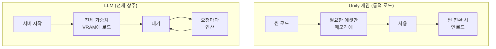

| 특성 | Unity | LLM |
| --- | --- | --- |
| 로드 방식 | 동적 (필요할 때) | 정적 (전체 상주) |
| 메모리 관리 | 씬별 언로드 | 서버 재시작 전까지 유지 |
| 비유 | 도서관 (필요한 책만 꺼냄) | 모든 책을 외운 사람 |

---

### 1-2. 모델 규모와 파라미터

앞서 LLM이 “거대한 float 배열”이라는 것을 확인했습니다. 그렇다면 이 배열이 얼마나 큰 걸까요? LLM 모델을 소개할 때 “7B”, “70B”, “671B” 같은 숫자를 자주 봅니다. 이 숫자가 바로 **파라미터(Parameter) 수**이며, 그 float 배열의 **원소 개수**를 뜻합니다. B는 Billion(10억)의 약자입니다.

**파라미터 = 가중치(weight) = 모델이 학습한 숫자 하나하나**

```
7B  = 70억 개의 float 숫자
70B = 700억 개의 float 숫자
175B = 1,750억 개의 float 숫자 (GPT-3)
671B = 6,710억 개의 float 숫자 (DeepSeek-V3)
```

Unity로 비유하면, 파라미터는 게임의 **모든 에셋에 들어 있는 픽셀이나 버텍스의 총 개수**와 비슷합니다. 3D 모델의 버텍스 하나하나가 위치(x, y, z)를 가지듯이, LLM의 파라미터 하나하나가 특정 float 값을 가집니다. 그리고 이 값들이 모여서 “언어를 이해하는 능력”을 형성합니다.

### 구체적으로 파라미터는 어디에 있는가?

Transformer 내부를 보면, 파라미터는 주로 다음 구성 요소의 **행렬(Matrix)**에 저장됩니다:

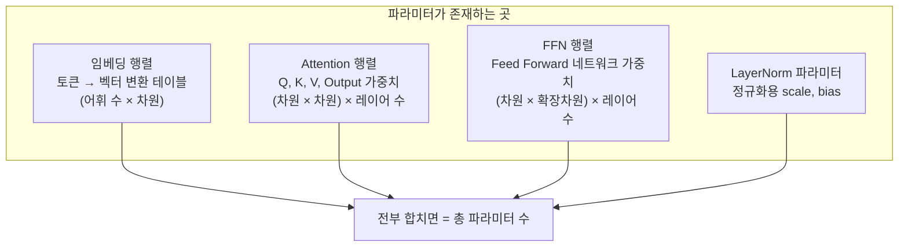

예를 들어, 차원(dimension)이 4096이고 레이어가 32개인 모델이라면:
- **임베딩**: 어휘 수(~50,000) × 4096 ≈ 2억 개
- **Attention (Q,K,V,O)**: 4 × 4096 × 4096 × 32 ≈ 21억 개
- **FFN**: 2 × 4096 × 16384 × 32 ≈ 43억 개
- **기타(LayerNorm 등)**: 수백만 개

이렇게 합치면 약 **7B(70억)**이 됩니다. 이것이 “7B 파라미터 모델”의 실체입니다.

### 파라미터 수와 메모리의 관계

파라미터 하나는 기본적으로 float 숫자 하나입니다. 저장 형식에 따라 메모리 사용량이 달라집니다:

| 정밀도 | 파라미터당 크기 | 7B 모델 | 70B 모델 | 671B 모델 |
| --- | --- | --- | --- | --- |
| FP32 (32비트) | 4 bytes | 28 GB | 280 GB | 2,684 GB |
| FP16 (16비트) | 2 bytes | 14 GB | 140 GB | 1,342 GB |
| INT8 (8비트 양자화) | 1 byte | 7 GB | 70 GB | 671 GB |
| INT4 (4비트 양자화) | 0.5 byte | 3.5 GB | 35 GB | 336 GB |

이 표를 보면 왜 **양자화(Quantization)**가 중요한지 알 수 있습니다. 70B 모델을 FP16 그대로 돌리면 140GB 메모리가 필요하지만, 4비트 양자화를 적용하면 35GB로 줄어들어 Mac의 통합 메모리나 NVIDIA RTX 4090(24GB VRAM)으로도 실행이 가능해집니다. 물론 양자화를 하면 정밀도가 떨어져 응답 품질이 약간 저하될 수 있지만, 최신 양자화 기법은 그 차이를 최소화합니다.

### 파라미터 수 = 모델의 “두뇌 크기”

| 모델 | 파라미터 수 | 대략적 수준 | 비유 |
| --- | --- | --- | --- |
| TinyLlama | 1.1B | 간단한 대화 | 초등학생 |
| Llama 3.2 | 3B | 기본적인 질의응답 | 중학생 |
| Llama 3.1 | 8B | 범용 어시스턴트 | 고등학생 |
| Llama 3.1 | 70B | 전문적 분석 | 대학원생 |
| GPT-4 (추정) | ~1.8T (MoE) | 최상위 범용 | 박사급 전문가 팀 |
| Claude Opus 4.6 | 비공개 | 최상위 범용 | 비공개 |

> **주의**: 파라미터 수가 크다고 무조건 더 좋은 것은 아닙니다. 학습 데이터의 질, 후처리 학습(RLHF), 아키텍처 효율성 등이 모두 영향을 미칩니다. 8B 모델이라도 최신 기법으로 학습하면 이전 세대의 70B 모델을 능가할 수 있습니다 (섹션 8-1 참고).
> 

---

### 2. API 호출 흐름: 프롬프트는 어디로 가는가?

Claude Code에서 프롬프트를 입력하면 어떤 일이 일어날까요? 마치 마법처럼 응답이 돌아오지만, 그 사이에는 복잡한 여정이 있습니다.

우리가 터미널에 타이핑하는 순간, 그 텍스트는 로컬 컴퓨터를 떠나 인터넷을 통해 Anthropic의 서버로 향합니다. 서버에서는 우리의 텍스트를 “토큰”이라는 단위로 쪼개고, 거대한 신경망을 통과시켜 응답을 생성합니다. 이 응답은 다시 인터넷을 통해 우리 터미널로 돌아옵니다.

여기서 중요한 점은 **Stateless**라는 특성입니다. API 서버는 우리가 누구인지, 이전에 무슨 대화를 했는지 기억하지 않습니다. 마치 매번 새로운 사람을 만나는 것과 같습니다. 그래서 Claude Code는 이전 대화 내용을 로컬에 저장해두었다가, 새 메시지와 함께 **기본적으로 전체 대화 히스토리를 서버로 보냅니다** (단, 컨텍스트가 길어지면 자동 압축(auto-compaction)을 통해 이전 대화를 요약하여 전송량을 줄이기도 합니다). 대화가 길어질수록 전송되는 데이터도 늘어나고, 비용도 증가하는 이유가 여기에 있습니다.

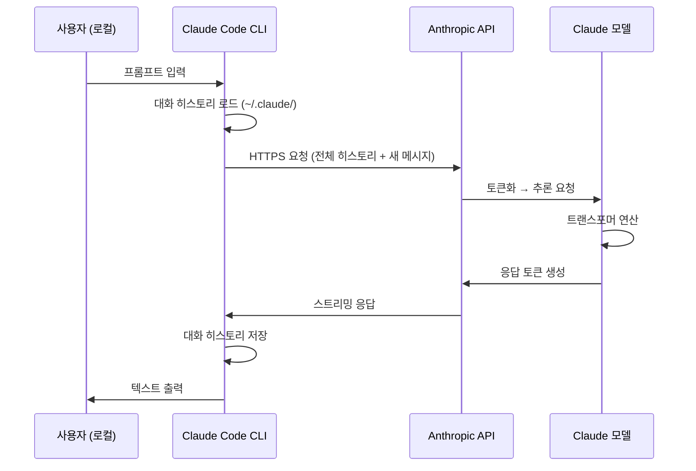

**중요한 특성**:
- **Stateless**: API 서버는 이전 대화를 기억하지 않습니다
- **기본적으로 전체 전송**: 대화할 때마다 히스토리를 보냅니다 (클라이언트에 따라 압축/요약 적용 가능)
- **토큰화는 일반적으로 서버에서**: 텍스트→토큰 변환은 API 서버에서 수행됩니다 (일부 클라이언트는 로컬 토크나이저로 토큰 수를 사전 추정)

---

### 3. 대화 컨텍스트: 어디에 저장되는가?

“어제 물어본 거 기억해?”라고 Claude에게 물으면, Claude는 실제로 “기억”하는 걸까요? 답은 복잡합니다.

LLM 서버 자체는 아무것도 기억하지 않습니다. 완전히 Stateless입니다. 하지만 우리가 사용하는 **클라이언트**(Claude Code, claude.ai 웹, 또는 직접 만든 앱)가 대화 내용을 어딘가에 저장하고, 매번 API 호출 시 함께 보내줍니다.

Claude Code를 사용할 때, 대화 내용은 `~/.claude/projects/` 폴더에 프로젝트별로 저장됩니다. 이 파일들은 순수한 로컬 데이터이므로, 다른 컴퓨터에서 같은 프로젝트를 열면 이전 대화가 보이지 않습니다. 반면 claude.ai 웹은 서버 데이터베이스에 저장하므로, 어디서든 로그인하면 이전 대화를 볼 수 있습니다.

API를 직접 호출한다면? 아무것도 저장되지 않습니다. 개발자가 직접 대화 히스토리를 관리하고, 매 요청마다 필요한 컨텍스트를 함께 보내야 합니다.

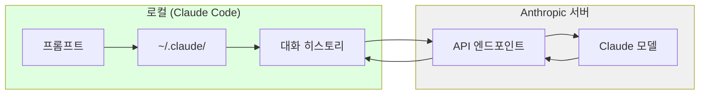

| 사용 방식 | 저장 위치 | 특징 |
| --- | --- | --- |
| Claude Code (CLI) | 로컬 (`~/.claude/projects/`) | 프로젝트별 분리 |
| claude.ai (웹) | Anthropic 서버 DB | 계정에 연동 |
| API 직접 호출 | 저장 없음 | 완전 Stateless |

> **💬 잠깐, 이건 알고 가자**
> 
> 
> **Q. 컨텍스트 윈도우가 뭔가요?** 
> 
> **한 번에 처리할 수 있는 최대 토큰 수**입니다. Claude 3.5는 200K, Claude 4.6은 1M(베타)까지 처리 가능합니다. 대화가 이 한도를 넘으면 오래된 내용부터 잘려나갑니다. Claude Code의 `/compact` 명령은 이를 관리하기 위한 것입니다.
> 
> **Q. 컨텍스트 윈도우가 크면 무조건 좋은 건가요?** 
> 
> **비용과 속도 트레이드오프**가 있습니다. 컨텍스트가 크면 더 많은 정보를 담을 수 있지만, Self-Attention의 O(n²) 특성 때문에 처리 시간과 비용도 증가합니다. 간단한 질문에 1M 컨텍스트는 과합니다.
> 

---

### 4. LLM 세부 작동 흐름

이제 핵심 질문에 답해봅시다: **프롬프트가 응답으로 변환되는 과정에서 실제로 무슨 일이 일어나는가?**

Unity에서 GameObject가 `Awake()` → `Start()` → `Update()` 사이클을 거치듯, LLM도 정해진 파이프라인을 따릅니다. 텍스트가 들어오면 숫자로 변환되고, 복잡한 수학 연산을 거쳐, 다시 텍스트로 변환됩니다.

가장 중요한 점은 LLM이 **한 번에 한 토큰씩** 생성한다는 것입니다. “안녕하세요”라는 응답도 한 번에 나오는 게 아니라, “안” → “녕” → “하” → “세” → “요” 순서로 하나씩 생성됩니다. 각 토큰을 생성할 때마다 전체 트랜스포머 연산이 실행됩니다. 그래서 긴 응답은 시간이 오래 걸리고, 스트리밍으로 한 글자씩 출력되는 것을 볼 수 있습니다.

아래는 프롬프트가 응답이 되기까지의 전체 과정입니다.

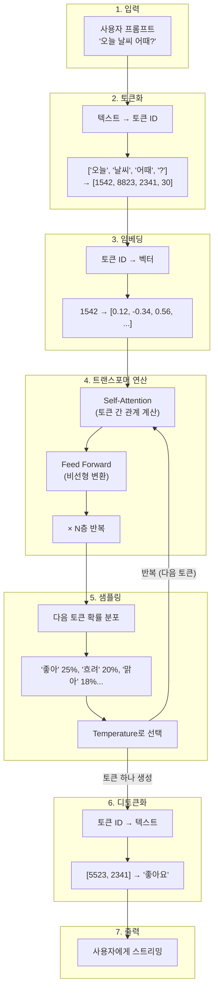

### 각 단계 설명

| 단계 | 설명 | Unity 비유 |
| --- | --- | --- |
| **토큰화** | 텍스트를 숫자 ID로 변환 | 에셋 경로 → Instance ID |
| **임베딩** | ID를 고차원 벡터로 변환 | Prefab → GameObject 인스턴스 |
| **트랜스포머** | 문맥 이해 및 패턴 매칭 | Update() 로직 실행 |
| **샘플링** | 확률적으로 다음 토큰 선택 | Random.Range() |
| **디토큰화** | 숫자 ID를 텍스트로 복원 | 렌더링 결과 화면 출력 |

**핵심 포인트**: LLM은 **한 번에 한 토큰씩** 생성합니다. “좋아요”라는 응답도 “좋” → “아” → “요” 순서로 하나씩 나옵니다.

> **💬 잠깐, 이건 알고 가자**
> 
> 
> **Q. LLM은 정말로 “생각”을 하나요?**
> 아니요. 다음에 올 확률이 높은 토큰을 예측할 뿐입니다. 의식이나 이해가 아닌 **통계적 패턴 매칭**입니다. “오늘 날씨가”라는 입력에 “좋다 25%, 흐리다 20%…” 확률을 계산할 뿐이죠.
> 
> **Q. 토큰이 정확히 뭔가요?**
> 텍스트의 **최소 처리 단위**입니다. 영어는 대략 단어 단위, 한국어는 음절이나 자모 단위로 쪼개집니다. “안녕하세요” → [“안녕”, “하세요”] 또는 [“안”, “녕”, “하”, “세”, “요”]. 모델마다 토큰화 방식이 다릅니다.
> 
> **Q. Temperature가 뭔가요?**
> 응답의 **무작위성을 조절하는 파라미터**입니다. 낮으면(0에 가까우면) 가장 확률 높은 토큰만 선택해 일관된 응답을, 높으면(1 이상) 낮은 확률의 토큰도 선택해 창의적이지만 예측 불가능한 응답을 생성합니다. 게임의 `Random.Range()` 범위를 조절하는 것과 비슷합니다.
> 
> **Q. 왜 응답이 한 글자씩 나오나요?**
> LLM은 한 번에 한 토큰씩 생성하기 때문입니다. 스트리밍은 이 과정을 실시간으로 보여주는 것입니다. 전체 응답이 완성될 때까지 기다리지 않고 바로바로 보여주는 UX 최적화입니다.
> 

---

### 5. 학습 vs 추론: LLM의 두 가지 모드

“Claude랑 대화하면 Claude가 배우는 거야?”라는 질문을 자주 받습니다. 답은 **아니요**입니다.

LLM에는 두 가지 완전히 다른 모드가 있습니다: **학습(Training)**과 **추론(Inference)**. 이 둘은 마치 게임 개발과 게임 플레이처럼 전혀 다른 프로세스입니다.

학습은 오프라인에서 수개월에 걸쳐 진행됩니다. Anthropic의 엔지니어들이 수천 대의 GPU를 동원해 인터넷의 방대한 텍스트 데이터를 처리합니다. 이 과정에서 모델은 언어의 패턴을 “가중치”라는 숫자로 인코딩합니다. 학습이 완료되면 이 가중치들이 파일로 저장되고, 이것이 바로 우리가 “모델”이라고 부르는 것입니다.

추론은 우리가 Claude와 대화할 때 일어나는 일입니다. 이미 학습이 완료된 가중치를 **읽기 전용**으로 사용합니다. 가중치는 변경되지 않습니다. 모델은 새로운 것을 “배우지” 않습니다. 단지 기존에 학습된 패턴을 바탕으로 다음 토큰을 예측할 뿐입니다.

비용 차이도 극명합니다. 학습에는 수천만~수억 달러가 들지만, 추론은 **백만 토큰당 몇 달러** 수준에 불과합니다 (예: Claude Sonnet 4.5 기준 입력 $3/출력 $15 per 1M tokens). 일상적인 짧은 대화(수백 토큰)는 1센트 미만이지만, 출력이 길어지면(수천 토큰) 수 센트까지 올라갈 수 있습니다. 우리가 API 비용으로 지불하는 것은 이 추론 비용입니다.

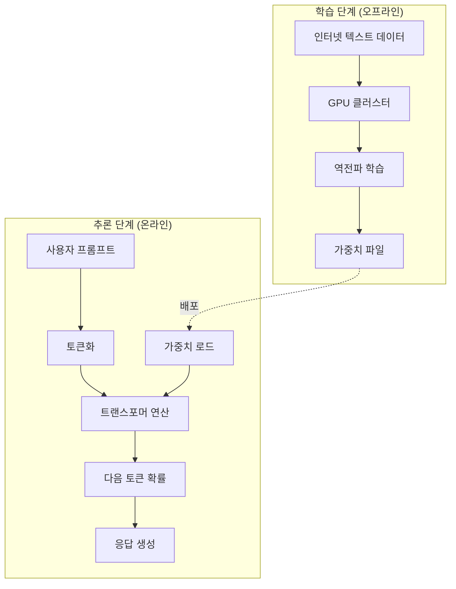

| 구분 | 학습 (Training) | 추론 (Inference) |
| --- | --- | --- |
| **시점** | 오프라인, 수개월 | 온라인, 실시간 |
| **입력** | 수조 개의 텍스트 토큰 | 사용자 프롬프트 |
| **출력** | 가중치 파일 (수백 GB) | 응답 토큰 |
| **목적** | 언어 패턴 학습 | 다음 토큰 예측 |
| **비용** | 수천만~수억 달러 | 백만 토큰(MTok)당 과금 |

**중요**: 우리가 Claude와 대화할 때는 **추론 단계**만 실행됩니다. 모델은 새로운 것을 “학습”하지 않습니다.

> **💬 잠깐, 이건 알고 가자**
> 
> 
> **Q. 내가 대화하면 Claude가 학습하나요?**
> 아니요, **추론만 합니다**. 학습은 오프라인에서 수개월에 걸쳐 진행되며, 대화 시에는 이미 완성된 가중치를 읽기 전용으로 사용합니다. 대화 내용이 모델에 반영되지 않습니다.
> 
> **Q. 왜 LLM 학습에 수억 달러가 드나요?**
> 
> **데이터와 연산량** 때문입니다. 수조 개의 토큰을 처리하려면 수천 대의 고가 GPU(H100 등)를 수개월간 풀가동해야 합니다. 전기료만 해도 수천만 달러 단위입니다. 반면 추론은 기존 가중치를 재사용하므로 비교적 저렴합니다. → 이것이 일론 머스크가 우주에 데이터 센터를 구축하려는 이유입니다. 우주 진공 상태의 복사 냉각과 태양광 발전을 활용하면 비용을 대폭 절감할 수 있습니다(스타 클라우드).
> 

---

## Part 2: 내부 구조 (심화)

Part 1에서는 LLM이 무엇이고 어떻게 사용되는지 개요를 살펴봤습니다. 이제 조금 더 깊이 들어가봅시다. “트랜스포머”라는 아키텍처는 무엇이고, 왜 GPU가 필요하며, 서버는 어떻게 운영되는지 알아봅니다.

이 파트의 내용은 LLM을 사용하는 데 필수는 아니지만, 내부 구조를 이해하면 왜 특정 동작이 느린지, 왜 비용이 그렇게 책정되는지, 어떤 한계가 있는지 더 잘 이해할 수 있습니다.

### 6. 트랜스포머 아키텍처: 핵심 원리

2017년 Google이 발표한 "Attention Is All You Need" 논문은 AI 역사의 전환점이었습니다. 이 논문에서 소개된 **트랜스포머(Transformer)** 아키텍처는 이후 모든 주요 LLM의 기반이 되었습니다. GPT(**G**enerative **P**re-trained **T**ransformer)의 T가 바로 이 트랜스포머이며, Claude, Gemini 역시 동일한 아키텍처를 사용합니다.

트랜스포머의 핵심 아이디어는 **Self-Attention**입니다. 문장의 각 단어(토큰)가 다른 모든 단어와의 관계를 계산합니다. “The cat sat on the mat. It was soft.”라는 문장에서 “It”이 무엇을 가리키는지 어떻게 알 수 있을까요? Self-Attention은 “It”과 “cat”, “It”과 “mat” 사이의 관련도를 계산해서 “It”이 “mat”을 가리킨다는 것을 파악합니다.

Unity 개발자에게 익숙한 비유를 들자면, 모든 GameObject가 다른 모든 GameObject와의 거리를 계산하는 것과 비슷합니다. n개의 오브젝트가 있다면 n×n 번의 계산이 필요합니다. 이것이 LLM이 긴 텍스트를 처리할 때 느려지는 이유입니다 - O(n²) 복잡도 때문입니다.

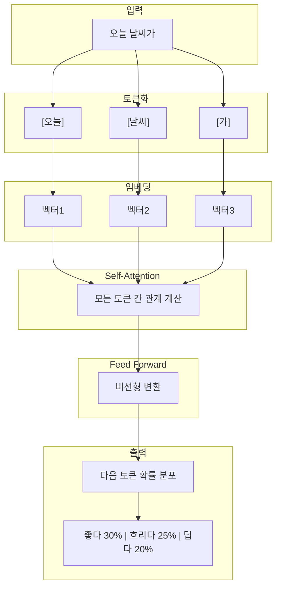

### Self-Attention이란?

모든 토큰이 다른 모든 토큰과의 관계를 계산합니다.

예를 들어 “The cat sat on the mat. It was soft.”에서:
- “It”이 무엇을 가리키는가?
- “cat”과의 관계? “mat”과의 관계?
- Self-Attention이 이 관계를 계산합니다

**Unity 비유**: 모든 GameObject가 다른 모든 GameObject와의 거리를 계산하는 것과 비슷합니다. O(n²) 복잡도입니다.

> **💬 잠깐, 이건 알고 가자**
> 
> 
> **Q. 대화가 길어지면 왜 느려지나요?**
> 
> **컨텍스트 전체를 매번 처리**하기 때문입니다. Self-Attention은 O(n²)이므로 토큰이 2배 → 연산 4배입니다. Claude Code의 `/compact` 명령으로 컨텍스트를 정리하면 속도가 개선됩니다.
> 
> **Q. 같은 Transformer인데 왜 새 버전이 더 똑똑한가요?**
> Transformer라는 “엔진”은 같지만, 그 위에 쌓이는 기술이 **5가지 축**에서 동시에 진화하기 때문입니다: (1) 사전 학습 데이터 품질 (2) RLHF→DPO→RLVR 후처리 (3) MoE, FlashAttention 아키텍처 (4) Extended Thinking 추론 시간 확장 (5) 지식 증류. 자세한 내용은 [섹션 8-1](#)에서 다룹니다.
> 

---

### 6-1. 맘바(Mamba)와 상태 공간 모델(SSM): 트랜스포머의 대안

트랜스포머의 O(n²) 복잡도는 근본적인 한계입니다. 컨텍스트가 4K에서 128K로 늘어나면 연산량은 32배가 아니라 **1,024배**로 폭증합니다. 게임으로 비유하면, 씬의 오브젝트가 늘어날 때마다 모든 오브젝트 쌍의 충돌 검사를 brute-force로 수행하는 것과 같습니다. 당연히 더 효율적인 방법이 필요합니다.

2024~2025년을 기점으로 **맘바(Mamba)**라는 새로운 아키텍처가 급부상했습니다. 맘바는 **상태 공간 모델(State Space Model, SSM)** 기반으로, 입력 데이터를 순차적으로 처리하면서 **고정된 크기의 내부 상태(Internal State)**를 동적으로 업데이트하는 방식을 취합니다.

핵심 차이를 게임으로 비유하면:

- **트랜스포머**: 매 프레임마다 **화면 전체를 처음부터 다시 렌더링**하는 방식
- **맘바**: **가속 구조(Acceleration Structure)**를 활용해 변화가 있는 부분만 효율적으로 처리하는 방식

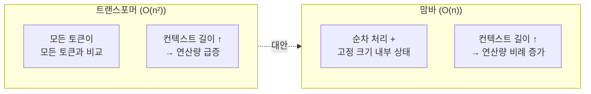

맘바의 가장 큰 장점은 **선형 시간 복잡도 O(n)**를 달성했다는 점입니다. 데이터가 길어져도 연산량이 비례적으로만 증가합니다. 또한 추론 시 이전 토큰 정보를 고정 크기의 상태 벡터에 압축 저장하므로, 트랜스포머처럼 과거 데이터를 전부 다시 훑을 필요가 없습니다.

| 특성 | 트랜스포머 | 맘바 (SSM) |
| --- | --- | --- |
| 시간 복잡도 | O(n²) | O(n) |
| 긴 컨텍스트 처리 | 토큰 수 증가 시 급격히(이차) 저하 | 선형 증가로 증가폭이 완만 (토큰당 추론 비용은 거의 일정) |
| VRAM 점유 | 컨텍스트 길이에 따라 급증 (KV 캐시) | 고정 크기 내부 상태 유지 |
| 강점 | 복잡한 논리, 정밀한 패턴 매칭 | 긴 문서 분석, 무한 대화 NPC |
| 대표 모델 | GPT-4, Claude | Codestral Mamba |

> **게임 개발자를 위한 시사점**: 게임 내 NPC가 플레이어와 수 시간에 걸쳐 대화를 나눠야 한다면, 트랜스포머의 O(n²)는 치명적입니다. 맘바 기반 경량 모델은 이런 시나리오에 훨씬 적합합니다.
> 

> **💬 잠깐, 이건 알고 가자**
> 
> 
> **Q. 맘바가 트랜스포머를 대체하나요?**
> 
> **아직은 아닙니다. 보완 관계입니다.** 맘바는 O(n) 선형 복잡도로 긴 컨텍스트에 뛰어나지만, 복잡한 논리적 추론에서는 트랜스포머의 정밀한 Self-Attention이 아직 우세합니다. 현재 트렌드는 아래에서 다룰 **하이브리드 아키텍처**입니다.
> 

---

### 6-2. 하이브리드 아키텍처: 트랜스포머 + 맘바

“둘 다 좋으면 합치면 되지 않나요?” 맞습니다. 최신 연구의 최전선에서는 **트랜스포머의 정밀한 문맥 이해 능력**과 **맘바의 효율적인 선형 스케일링**을 결합한 **하이브리드 아키텍처**가 주목받고 있습니다.

**Jamba**: 트랜스포머 층과 맘바 층을 특정 비율로 교차 배치하고, 여기에 MoE 구조를 결합해 처리량과 성능의 균형을 맞춘 모델입니다. 가까운 문맥은 맘바가 빠르게 처리하고, 먼 문맥 간의 복잡한 관계는 트랜스포머가 정밀하게 처리하는 분업 체계입니다.

**Routing Mamba (RoM)**: Microsoft에서 제안한 기법으로, 맘바 내부의 선형 투영 전문가들을 희소하게 선택함으로써 연산 효율을 23% 이상 향상시키면서도 대형 모델에 필적하는 성능을 입증했습니다.

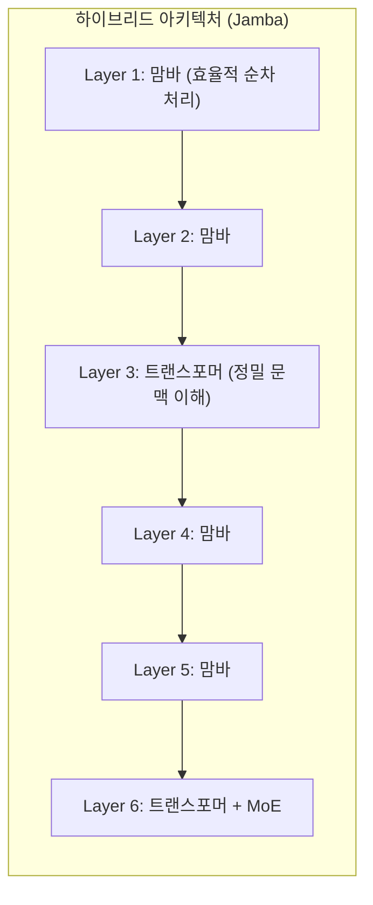

Unity로 비유하면, 하이브리드 아키텍처는 게임에서 **LOD(Level of Detail)** 시스템과 비슷합니다. 가까운 오브젝트는 고해상도로, 먼 오브젝트는 저해상도로 처리하듯, 가까운 문맥은 가볍게, 복잡한 관계는 정밀하게 처리합니다.

| 아키텍처 | 주요 특징 | 대표 모델 |
| --- | --- | --- |
| Transformer | 정밀한 문맥 이해 및 패턴 매칭 | GPT-4, Claude 3.5 |
| Mamba (SSM) | 선형 스케일링, 긴 컨텍스트 최적화 | Codestral Mamba |
| MoE | 연산량 대비 거대한 파라미터 수용 | DeepSeek-V3, Mixtral |
| Hybrid (Jamba/RoM) | 고성능과 고효율의 최적 균형 | Jamba, Samba |

---

### 6-3. 레이 트레이싱과 셀프 어텐션: 의외의 공통점

흥미롭게도 LLM의 어텐션 메커니즘과 현대 그래픽스의 핵심인 **레이 트레이싱(Ray Tracing)**은 기술적으로 매우 유사한 도전 과제를 안고 있습니다. 게임 개발자라면 이 유사성이 반가울 것입니다.

두 기술 모두 **“데이터 간의 복잡한 관계망 탐색”**이 핵심이며, 이를 위해 고도의 가속 구조를 필요로 합니다:

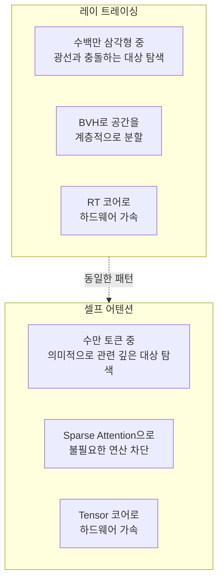

| 개념 | 레이 트레이싱 | 셀프 어텐션 |
| --- | --- | --- |
| **탐색 대상** | 광선-삼각형 충돌 | 토큰-토큰 관계 |
| **가속 구조** | BVH (Bounding Volume Hierarchy) | Sparse Transformer, MoE |
| **희소성 활용** | 보이지 않는 부분 연산 생략 | 불필요한 토큰 간 연산 차단 |
| **전용 하드웨어** | RT 코어 | Tensor 코어, TMEM |
| **최적화 방향** | Traversal Shader (프로그래밍 가능) | 도메인별 가중치 동적 조절 |

**핵심**: 게임 개발자가 그래픽 최적화에서 얻은 통찰력(공간 분할, 희소성 활용, 하드웨어 가속)은 LLM 추론 시스템을 이해하고 설계하는 데 직접적으로 적용할 수 있습니다. 같은 GPU 위에서 같은 문제를 다른 도메인에서 풀고 있는 셈입니다.

---

### 7. 하드웨어 구성: GPU vs NPU vs CPU

왜 LLM은 GPU에서 돌아갈까요? CPU로는 안 되나요? 내 맥북의 Neural Engine은요?

LLM의 핵심 연산은 **행렬 곱셈**입니다. (그래서 선형대수학이 필요한거였군요..) 

수억~수천억 개의 숫자를 곱하고 더하는 작업을 수없이 반복합니다. CPU는 복잡한 연산을 순차적으로 잘 처리하지만, 단순한 연산을 병렬로 대량 처리하는 데는 약합니다. 반면 GPU는 수천 개의 작은 코어가 동시에 단순 연산을 처리할 수 있도록 설계되었습니다.

NVIDIA의 데이터센터 GPU(A100, H100)는 80GB까지의 전용 **VRAM**을 가지고 있어, 양자화나 멀티 GPU 분산을 적용하면 대형 모델의 가중치를 효율적으로 적재할 수 있습니다(70B FP16 ≈ 140GB이므로 단일 GPU에는 양자화 없이 전량 상주가 어렵습니다). 또한 Tensor Core라는 AI 연산 전용 유닛이 있어 행렬 연산을 극도로 빠르게 처리합니다.

### VRAM: LLM의 작업 공간

- **VRAM(Video RAM)**은 GPU에 직접 탑재된 전용 고속 메모리입니다. 게임에서 텍스처와 프레임 버퍼가 VRAM에 올라가듯, LLM에서는 **모델 가중치, KV 캐시, 중간 연산 결과**가 VRAM에 상주합니다.

왜 시스템 RAM이 아닌 VRAM이 중요한가? **대역폭** 때문입니다. GPU가 데이터를 처리하려면 메모리에서 읽어와야 하는데, VRAM의 대역폭은 시스템 RAM 대비 10~50배 이상 빠릅니다.

```
시스템 RAM (DDR5):    ~50 GB/s    ← CPU용
GPU VRAM (HBM3e):     ~3,000 GB/s ← GPU용 (약 60배 차이)
```

게임 개발에서 텍스처를 VRAM에 올려야 실시간 렌더링이 가능하듯, LLM 가중치도 VRAM에 올라가 있어야 실시간 추론이 가능합니다. 가중치가 시스템 RAM에만 있으면, PCIe 버스를 통해 GPU로 전달하는 과정이 극심한 병목이 됩니다.

**VRAM에 올라가는 것들:**

| 구성 요소 | 설명 | 70B 모델 (FP16) 기준 |
| --- | --- | --- |
| 모델 가중치 | 학습된 파라미터 전체 | ~140 GB |
| KV 캐시 | 이전 토큰의 Key/Value (대화 길이에 비례) | ~수 GB |
| 활성화 메모리 | 순전파 중간 연산 결과 | ~수 GB |

VRAM이 부족하면 모델의 일부를 시스템 RAM으로 내리는 **offloading**이 발생하고, 추론 속도가 급격히 저하됩니다. 이것이 양자화(INT4/INT8)로 가중치 크기를 줄이는 주된 이유입니다.

> **📖 더 알아보기**:
> 
> - GPU 메모리 계층(HBM → L2 → SRAM → 레지스터)과 VRAM 용량 계산법 → [VRAM 심화 가이드](/posts/vram-deep-dive/)
> - CUDA Core, Tensor Core, TMEM, NPU의 상세 동작 원리 → [GPU 연산 유닛 심화 가이드](/posts/gpu-compute-deep-dive/)

최근에는 **NPU(Neural Processing Unit)**도 주목받고 있습니다. Apple Silicon의 Neural Engine, 스마트폰의 AI 칩 등이 여기에 해당합니다. NPU는 GPU보다 저전력이지만 성능도 낮습니다. 경량 모델(7B 파라미터 정도)은 NPU로 로컬에서 실행할 수 있지만, Claude 같은 대형 모델은 여전히 데이터센터 GPU가 필요합니다.

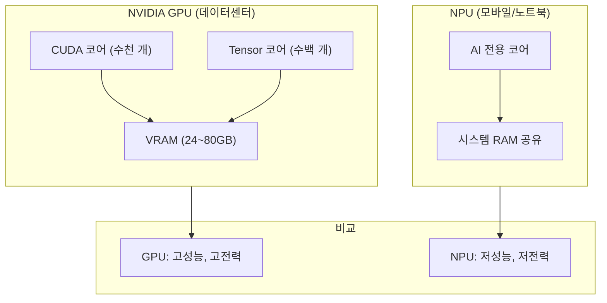

### 메모리 구조 비교

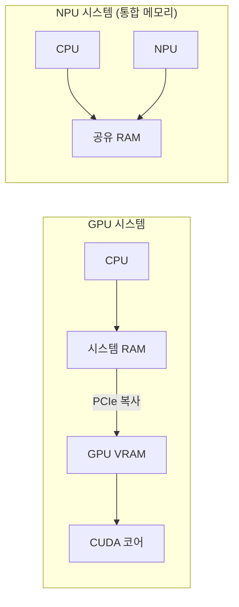

| 특성 | GPU (NVIDIA) | NPU (Apple Silicon 등) |
| --- | --- | --- |
| 메모리 | 전용 VRAM (80GB까지) | 시스템 RAM 공유 |
| 대역폭 | HBM 전용 (~3TB/s) | SoC 통합 메모리 공유 (~400GB/s+)* |
| 용도 | 서버, 학습, 대형 모델 | 모바일, 경량 모델 |

*NPU의 400GB/s+는 SoC 전체의 통합 메모리 대역폭이며, CPU·GPU·NPU가 공유합니다. GPU의 3TB/s는 HBM 전용 대역폭이므로 직접 비교 시 주의가 필요합니다.

### Apple Silicon 통합 메모리 아키텍처 (UMA) 심화

Apple Silicon(M1~M5)의 가장 큰 특징은 **Unified Memory Architecture(UMA)**입니다. 이 아키텍처에서는 CPU, GPU, Neural Engine이 **물리적으로 동일한 메모리 풀**을 공유합니다. 즉, Mac의 시스템 RAM이 곧 GPU가 사용하는 VRAM 역할을 합니다.

HBM (High Bandwidth Memory)

이것은 NVIDIA의 전통적인 구조와 근본적으로 다릅니다:

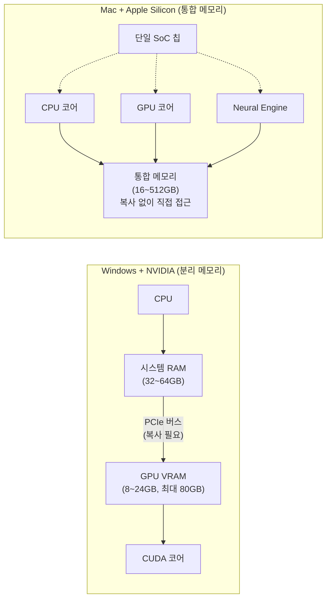

**핵심 차이점: 데이터 복사가 필요 없다**

NVIDIA 시스템에서 LLM을 실행하려면, 모델 가중치를 시스템 RAM에서 GPU VRAM으로 PCIe 버스를 통해 **복사**해야 합니다. 이 과정이 병목이 됩니다. 또한 VRAM 용량이 제한적이어서(소비자용 RTX 5090이 약 32GB), 큰 모델은 VRAM에 다 담기지 않아 CPU RAM과 GPU VRAM 사이를 왔다 갔다(offloading) 해야 하며, 이때 성능이 급격히 하락합니다.

반면 Apple Silicon에서는 **Zero-Copy 접근**이 가능합니다. CPU든 GPU든 Neural Engine이든 같은 메모리 주소의 데이터를 직접 읽을 수 있습니다. 텐서(Tensor) 데이터를 GPU로 “복사”할 필요가 없고, 배열이 통합 메모리에 그대로 있으면 어떤 프로세서든 바로 연산에 사용합니다. Apple의 MLX 프레임워크에서는 이를 다음과 같이 활용합니다:

> “Arrays live in unified memory and can be executed on CPU or GPU without explicit ‘copy to device’ or ‘copy back’ calls.”
> 

**메모리 용량의 장점**

| 구성 | 사용 가능한 LLM 메모리 | 대략적 모델 규모 |
| --- | --- | --- |
| NVIDIA RTX 4090 | 24GB VRAM | ~13B (4bit 양자화) |
| NVIDIA RTX 5090 | 32GB VRAM | ~20B (4bit 양자화) |
| M4 MacBook Pro | 24GB 통합 메모리 | ~13B (4bit 양자화) |
| M4 Max MacBook Pro | 64~128GB 통합 메모리 | ~70B (4bit 양자화) |
| Mac Studio M2/M4 Ultra | 192~512GB 통합 메모리 | ~200B+ (4bit 양자화) |

Mac Studio 512GB 구성에서는 강한 양자화(INT4 등)를 적용하면 DeepSeek의 671B 파라미터 모델까지 로컬에서 로드할 수 있습니다. 다만 추론 속도는 실서비스 대비 크게 느리며(~수 tok/s), 실용적 사용보다는 실험/프로토타이핑 용도에 가깝습니다. 동일한 모델을 NVIDIA GPU로 실시간 서빙하려면 여러 장의 데이터센터급 GPU(A100/H100 80GB × 여러 장)가 필요하며, 비용이 수천만 원에서 수억 원에 달합니다.

**성능 비교: 처리량 vs 효율성**

| 지표 | NVIDIA RTX 4090 | Apple M4 Max |
| --- | --- | --- |
| 메모리 대역폭 | ~1TB/s | ~546GB/s |
| Llama 7B 추론 속도 | ~50-60 tokens/s | ~30-40 tokens/s |
| 소비 전력 | ~450W | ~40-80W |
| Tokens/Watt (효율) | ~0.13 t/W | ~0.50 t/W |
| 최대 메모리 용량 | 24GB (소비자) | 128GB (노트북) |

**결론**: NVIDIA GPU는 **절대적인 처리량(throughput)**에서 우세합니다. 순수 연산 속도와 학습(Training)에서는 NVIDIA가 압도적입니다. 하지만 Apple Silicon은 **전력 대비 효율성**, **메모리 용량의 확장성**, **데이터 복사 없는 Zero-Copy 접근**에서 강점을 가집니다. 특히 대형 모델을 로컬에서 돌려야 할 때, 전용 VRAM 분리에 따른 용량 제약이 없다는 점이 가장 큰 실용적 장점입니다(물리적 상한은 있으나, 소비자 GPU의 24~32GB VRAM 대비 훨씬 여유 있음).

### MLX: Apple Silicon 전용 ML 프레임워크

Apple은 자사 칩에 최적화된 오픈소스 ML 프레임워크 **MLX**를 제공합니다. MLX는 통합 메모리 아키텍처를 최대한 활용하도록 설계되었으며, NumPy와 유사한 API로 사용이 간편합니다.

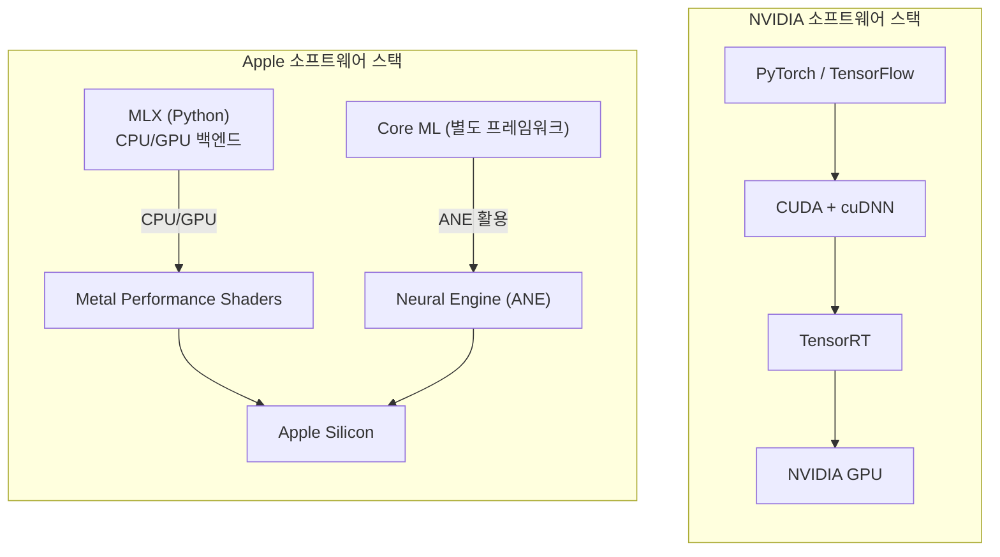

| 특성 | NVIDIA CUDA 생태계 | Apple MLX 생태계 |
| --- | --- | --- |
| 성숙도 | 매우 높음 (10년+) | 초기 (2023년~) |
| 라이브러리 | FlashAttention, bitsandbytes, TensorRT 등 | mlx-lm, mlx-vlm 등 |
| 모델 지원 | 거의 모든 모델 | Llama, Qwen, Mistral 등 주요 모델 |
| 학습 지원 | 완전 지원 | 제한적 (Fine-tuning 위주) |
| 추론 성능 | 최고 수준 | 빠르게 개선 중 |

**게임 개발자를 위한 시사점**: 만약 로컬에서 LLM을 활용한 게임 내 AI 기능(NPC 대화, 절차적 콘텐츠 생성 등)을 고려한다면, Mac에서는 MLX + 경량 모델 조합으로 프로토타이핑이 가능합니다. 프로덕션 서버에서는 여전히 NVIDIA GPU 기반 인프라가 표준입니다.

### FlashAttention-4: 하드웨어-소프트웨어 공동 설계의 정점

NVIDIA의 최신 **Blackwell(B200)** 아키텍처와 함께 공개된 **FlashAttention-4**는 어텐션 연산의 물리적 한계를 돌파하기 위한 알고리즘의 정점입니다. (※ 아래 성능 수치는 공식 테크니컬 리포트 발표 전 초기 벤치마크 보고 기준이며, 정식 논문을 통한 재현 검증이 필요합니다.) 기존의 어텐션 기법은 GPU의 고대역폭 메모리(HBM)와 칩 내부 공유 메모리 사이의 빈번한 데이터 이동으로 인해 연산기(ALU)가 유휴 상태에 머무는 **메모리 바운드(Memory-bound)** 현상을 겪었습니다.

게임 개발자에게 익숙한 비유를 들자면, 셰이더에서 텍스처 샘플링이 병목이 되어 GPU의 연산 유닛이 놀고 있는 상황과 같습니다.

FlashAttention-4는 세 가지 핵심 혁신으로 이를 해결합니다:

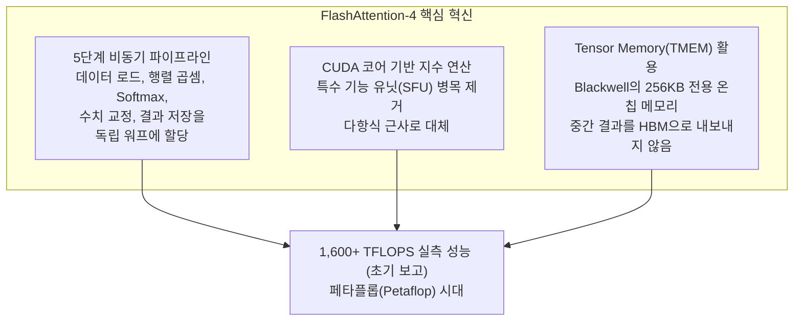

| FlashAttention 버전 | 핵심 개선 | 게임 비유 |
| --- | --- | --- |
| **v1 (2022)** | 타일링으로 HBM 접근 최소화 | 텍스처 아틀라스로 드로우콜 줄이기 |
| **v2 (2023)** | 병렬화 개선, 더 나은 워크 분배 | GPU 점유율 최적화 |
| **v3 (2024)** | H100 전용 최적화 | 특정 하드웨어 셰이더 최적화 |
| **v4 (2025)** | Blackwell 공동 설계, 비동기 파이프라인 | 하드웨어-소프트웨어 공동 설계 (커스텀 렌더 파이프라인) |

이것은 게임 그래픽에서 **하드웨어 세대에 맞춘 렌더링 파이프라인 최적화**와 정확히 같은 진화 방향입니다. GPU 세대가 바뀔 때마다 새로운 하드웨어 기능을 활용해 더 높은 성능을 끌어내듯, LLM 추론도 하드웨어와 소프트웨어가 함께 진화하고 있습니다.

---

### 8. 서버 운영 방식: 항상 켜져 있는가?

Claude를 호출하면 즉시 응답이 옵니다. 그렇다면 Anthropic의 서버는 항상 켜져 있고, Claude 모델은 항상 준비되어 있는 걸까요?

답은 **예, 하지만 효율적으로**입니다.

수백 GB에 달하는 모델 가중치를 매 요청마다 디스크에서 읽어오면 엄청나게 느릴 것입니다. 그래서 서버가 시작될 때 가중치 전체를 GPU VRAM에 로드하고, 서버가 꺼질 때까지 유지합니다. 가중치는 **항상 메모리에 상주**합니다.

하지만 **연산은 요청 시에만** 수행됩니다. 아무도 Claude를 호출하지 않으면 GPU는 대기 상태입니다. 요청이 들어오면 그제서야 트랜스포머 연산이 시작됩니다.

또한 여러 사용자의 요청을 **배치(batch)**로 묶어서 처리합니다. GPU는 한 번에 하나의 요청만 처리하는 것보다, 여러 요청을 묶어서 동시에 처리할 때 더 효율적입니다. 이것이 요청이 몰리는 시간대에 응답이 조금 느려질 수 있는 이유이기도 합니다.

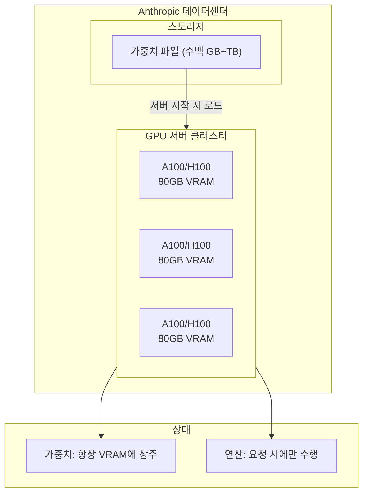

**운영 방식**:
- 가중치는 서버 시작 시 VRAM에 로드되어 **항상 상주**
- 연산은 요청이 들어올 때만 수행
- 여러 요청이 동시에 처리될 수 있음 (배치 처리)

---

### 8-1. 모델 버전이 올라가면 무엇이 달라지는가?

Claude 3 → 3.5 → 3.7 → 4 → 4.5 → 4.6, GPT-3.5 → 4 → 4o → o1, 모델 버전이 올라갈 때마다 성능이 눈에 띄게 좋아집니다. 그런데 모두 같은 Transformer 아키텍처를 사용한다고 했는데, 도대체 **무엇이 바뀌길래** 이렇게 좋아지는 걸까요?

게임으로 비유하면, 같은 Unity 엔진을 사용하더라도 최적화 기법, 에셋 품질, 셰이더 기술, 레벨 디자인이 달라지면 완전히 다른 게임이 나오는 것과 같습니다. LLM도 마찬가지로, Transformer라는 “엔진”은 같지만 그 위에 쌓이는 기술들이 세대마다 크게 진화합니다.

성능 개선은 크게 **5가지 축**에서 동시에 이루어집니다:

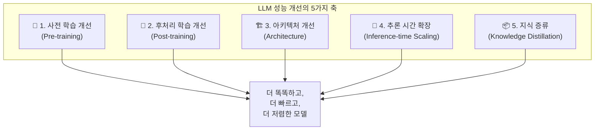

---

### 축 1: 사전 학습 개선 (Pre-training)

사전 학습은 모델이 “세상의 지식”을 흡수하는 단계입니다. 같은 Transformer 구조라도 **무엇을 먹이느냐**에 따라 결과가 완전히 달라집니다.

**데이터 품질의 혁명**

초기 LLM(GPT-2, GPT-3)은 인터넷에서 크롤링한 텍스트를 거의 그대로 학습했습니다. “많으면 많을수록 좋다”는 철학이었죠. 하지만 2024~2025년에 이 접근의 한계가 드러났습니다. 데이터를 2배로 늘려도 성능 향상이 미미해지는 **수확 체감(Diminishing Returns)** 현상이 나타났고, 고품질 텍스트 데이터가 고갈되기 시작했습니다.

이제는 양보다 **질**이 중요합니다:

| 세대 | 데이터 전략 | 비유 |
| --- | --- | --- |
| 초기 (GPT-3) | 인터넷 크롤링 데이터 대량 투입 | 모든 책을 닥치는 대로 읽기 |
| 중기 (Claude 3) | 필터링 + 도메인별 비율 조정 | 교과서 위주로 읽되, 분야별 균형 맞추기 |
| 현재 (Claude 4.5+) | 합성 데이터 + 커리큘럼 학습 + 긴 문맥 학습 단계 | 전문가가 만든 교재 + 단계별 난이도 학습 |

**합성 데이터(Synthetic Data)**: 기존의 강력한 모델을 활용해 고품질 학습 데이터를 인공적으로 생성합니다. 예를 들어, 수학 문제와 풀이 과정, 코드와 설명, 논리적 추론 체인 등을 대규모로 생성하여 학습 데이터에 포함시킵니다.

**커리큘럼 학습**: 게임의 난이도 설계처럼, 쉬운 패턴부터 어려운 패턴 순으로 학습 순서를 설계합니다. 또한 긴 문맥(long-context) 처리를 위한 전용 학습 단계를 별도로 추가합니다.

**스케일링 법칙의 진화**

초기에는 **Chinchilla 법칙**이 지배적이었습니다. “모델 크기와 데이터 양을 비례적으로 늘려라”는 규칙이죠. 하지만 2025년에는 이 법칙을 깨는 접근이 주류가 되었습니다. 8B 파라미터의 작은 모델이라도 수조 개의 토큰으로 과도하게(over-train) 학습시키면, 이전 세대의 훨씬 큰 모델보다 뛰어난 성능을 보입니다. “작지만 오래 학습한 모델”이 “크지만 적게 학습한 모델”보다 나을 수 있다는 발견입니다.

---

### 축 2: 후처리 학습 개선 (Post-training)

사전 학습으로 “지식”을 갖춘 모델은 아직 날것(raw)입니다. 질문에 엉뚱한 답을 하거나, 유해한 내용을 생성하거나, 지시를 잘 따르지 못합니다. **후처리 학습**은 이 날것의 모델을 “유용하고 안전한 어시스턴트”로 변환하는 과정입니다.

게임으로 비유하면, 사전 학습이 “게임 엔진과 에셋을 만드는 것”이라면, 후처리 학습은 “QA 테스트와 밸런싱 패치”에 해당합니다.

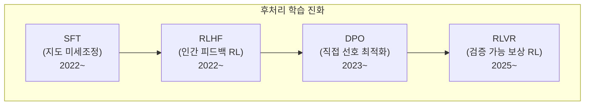

**SFT (Supervised Fine-Tuning)**: 사람이 직접 작성한 “질문-답변” 쌍으로 모델을 미세조정합니다. “이렇게 물으면 이렇게 답해라”를 가르치는 방식입니다. 간단하지만 사람이 일일이 답변을 작성해야 하므로 확장성에 한계가 있습니다.

**RLHF (Reinforcement Learning from Human Feedback)**: ChatGPT를 가능하게 한 핵심 기술입니다. 모델이 여러 응답을 생성하면, 사람이 “A 응답이 B보다 낫다”고 순위를 매깁니다. 이 선호 데이터로 **보상 모델(Reward Model)**을 학습하고, 이 보상 모델을 가이드 삼아 LLM을 강화학습(PPO 알고리즘)으로 개선합니다.

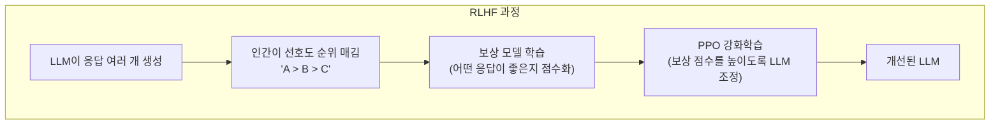

**DPO (Direct Preference Optimization, 2023~)**: RLHF의 복잡한 보상 모델 단계를 건너뛰는 기법입니다. 인간 선호 데이터를 사용해 LLM을 **직접** 최적화합니다. 보상 모델이 필요 없어 학습 파이프라인이 단순해지고 안정적입니다. Claude 3.5 세대부터 이런 류의 최적화가 적극 활용되기 시작했습니다.

**RLVR (Reinforcement Learning with Verifiable Rewards, 2025~)**: 2025년의 가장 중요한 돌파구입니다. 수학 문제나 코드처럼 **정답을 자동으로 검증할 수 있는** 영역에서, 인간 없이도 대규모 강화학습이 가능해졌습니다. DeepSeek R1이 이 방식으로 학습되어 큰 주목을 받았습니다.

| 방식 | 원리 | 장점 | 한계 |
| --- | --- | --- | --- |
| **SFT** | 정답을 직접 보여줌 | 단순, 안정적 | 인간 작성 필요 |
| **RLHF** | 인간 선호도 → 보상 모델 → 강화학습 | 미묘한 품질 향상 | 복잡하고 비용 높음 |
| **DPO** | 인간 선호도 → 직접 최적화 | 간단한 파이프라인 | RLHF 대비 일부 성능 열세 |
| **RLVR** | 자동 검증 → 대규모 강화학습 | 인간 불필요, 무한 확장 | 검증 가능 영역에 한정 |

**왜 세대마다 좋아지는가?**: 각 세대는 더 정교한 후처리 기법, 더 많은 선호 데이터, 더 나은 보상 모델을 사용합니다. Claude 4.x 시리즈는 “reward hacking”(보상을 속이는 행동)이 이전 세대 대비 65% 감소했는데, 이는 후처리 학습의 정교함이 향상된 결과입니다.

---

### 축 3: 아키텍처 개선 (Architecture)

Transformer의 기본 골격(Self-Attention + Feed Forward)은 유지하되, 세부 구성 요소가 세대마다 진화합니다. Unity에서 렌더링 파이프라인의 핵심 구조는 유지하면서도 셰이더, LOD, 오클루전 컬링 등이 개선되는 것과 같습니다.

**Attention 메커니즘의 진화**

| 기법 | 설명 | 효과 |
| --- | --- | --- |
| **Multi-Head Attention** | 원본 Transformer (2017) | 기본 |
| **Grouped-Query Attention (GQA)** | Key-Value 헤드를 그룹으로 공유 | 메모리 절약, 추론 속도 향상 |
| **Sliding Window Attention** | 가까운 토큰만 직접 Attention | 긴 문맥 효율 개선 |
| **Multi-Head Latent Attention** | KV를 저차원 잠재 공간으로 압축 | 메모리 대폭 절약 (DeepSeek-V2) |
| **FlashAttention** | GPU 메모리 접근 패턴 최적화 | 2~4배 속도 향상, 메모리 절약 |

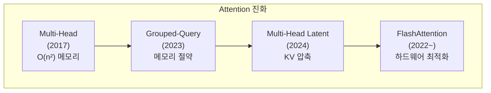

**Mixture of Experts (MoE): 게임 체인저**

MoE는 최근 LLM 성능 향상의 가장 큰 요인 중 하나입니다. 개념은 간단합니다:

기존 Dense 모델: 모든 입력이 **모든** 파라미터를 통과합니다.
MoE 모델: 각 입력이 **일부 전문가(Expert)만** 통과합니다.

```mermaid
flowchart TB
    subgraph Dense["Dense 모델 (기존)"]
        direction LR
        I1["입력 토큰"] --> FFN["하나의 거대한 FFN<br/>(모든 파라미터 사용)"]
        FFN --> O1["출력"]
    end

    subgraph MoE["MoE 모델"]
        direction TB
        I2["입력 토큰"] --> Router["라우터<br/>(어떤 전문가에게 보낼지 결정)"]
        Router -->|"선택"| E1["전문가 1<br/>(수학)"]
        Router -->|"선택"| E2["전문가 2<br/>(코드)"]
        Router -.->|"비활성"| E3["전문가 3<br/>(언어)"]
        Router -.->|"비활성"| E4["전문가 4<br/>(논리)"]
        E1 --> Mix["가중 합산"]
        E2 --> Mix
        Mix --> O2["출력"]
    end
```

게임으로 비유하면, Dense 모델은 “모든 직원이 모든 업무를 처리하는 회사”이고, MoE는 “전문 부서가 나뉘어 있어 해당 부서만 업무를 처리하는 회사”입니다. 전체 직원(파라미터) 수는 많지만, 실제로 일하는 직원은 소수입니다.

**DeepSeek-V3/R1의 예**: 총 671B 파라미터를 가지지만, 한 번의 추론에 실제 활성화되는 파라미터는 37B뿐입니다. 즉, 671B의 “지식 용량”을 가지면서도 37B 모델 수준의 “연산 비용”만 들입니다.

| 모델 | 총 파라미터 | 활성 파라미터 | 전문가 수 |
| --- | --- | --- | --- |
| GPT-4 (추정) | ~1.8T | ~280B | 16개 |
| Mixtral 8x7B | 47B | 13B | 8개 |
| DeepSeek-V3 | 671B | 37B | 256개 |

MoE 덕분에 모델의 “지식 용량”은 커지면서도 추론 비용은 크게 늘지 않아, **같은 비용으로 더 똑똑한 모델**을 만들 수 있게 되었습니다.

---

### 축 4: 추론 시간 확장 (Inference-time Scaling)

2024~2025년의 가장 혁신적인 발견은 **“생각하는 시간을 늘리면 더 똑똑해진다”**는 것입니다. 이전에는 모델 성능을 높이려면 학습 데이터를 늘리거나 모델을 키워야 했습니다. 하지만 추론 시간 확장은 **이미 학습된 모델**을 더 똑똑하게 쓰는 방법입니다.

게임으로 비유하면, 같은 AI 에이전트라도 “1초 안에 결정”하는 것과 “10초 동안 여러 가능성을 탐색한 후 결정”하는 것의 차이입니다. 모델 자체를 바꾸지 않아도, 더 오래 생각하게 하면 더 나은 결과가 나옵니다.

```mermaid
flowchart TB
    subgraph Traditional["기존 방식: 학습 시간 확장"]
        T1["더 많은 데이터"] --> T2["더 오래 학습"]
        T2 --> T3["더 좋은 모델"]
        T4["비용: 수천만 달러"]
    end

    subgraph New["새로운 방식: 추론 시간 확장"]
        N1["같은 모델"] --> N2["더 오래 생각하게 함"]
        N2 --> N3["더 좋은 답변"]
        N4["비용: 토큰당 약간 증가"]
    end
```

**Extended Thinking (확장 사고)**

Claude 3.7 Sonnet에서 처음 도입된 이 기능은, 모델이 응답하기 전에 **내부적으로 단계별 추론(Chain-of-Thought)**을 수행합니다. 사용자에게 보이지 않는 “사고 토큰”을 수백~수만 개 생성하면서 문제를 분석합니다.

```mermaid
flowchart LR
    subgraph Without["Extended Thinking 없이"]
        Q1["2^10 = ?"] --> A1["1024"]
    end

    subgraph With["Extended Thinking 사용"]
        Q2["복잡한 수학 문제"] --> Think["내부 사고 과정<br/>(사용자에게 비공개)"]
        Think --> Step1["1단계: 문제 분석"]
        Step1 --> Step2["2단계: 접근법 선택"]
        Step2 --> Step3["3단계: 계산 수행"]
        Step3 --> Step4["4단계: 검증"]
        Step4 --> A2["최종 답변"]
    end
```

DeepMind의 연구에 따르면, 학습에 적용되던 **스케일링 법칙(Scaling Law)**이 추론 시간에도 동일하게 적용됩니다. 추론에 2배의 연산을 투입하면, 일정 비율의 성능 향상이 따라옵니다. 이것이 수학, 물리, 코딩 등 복잡한 문제에서 특히 큰 성능 점프를 가능하게 합니다.

**DeepSeek R1의 “Aha Moment”**: DeepSeek R1-Zero(순수 강화학습으로만 학습된 모델)는 학습이 진행될수록 추론 토큰 수가 수백 개에서 수만 개로 자연스럽게 증가했습니다. 더 흥미로운 것은, 모델이 스스로 **“잠깐, 다시 생각해보자”**라고 이전 추론을 되돌아보는 행동(reflection)을 자발적으로 학습했다는 점입니다. 이를 연구자들은 “Aha moment”라고 불렀습니다.

| 모델 | 추론 방식 | 주요 성과 |
| --- | --- | --- |
| GPT-4 (기존) | 직접 응답 | 범용 성능 우수 |
| OpenAI o1 | 학습된 Chain-of-Thought | AIME 상위권, USAMO 예선 통과 수준 |
| DeepSeek R1 | 순수 RL + 자발적 추론 | o1과 동급, 오픈소스 |
| Claude 3.7+ | Extended Thinking (하이브리드) | 코드/수학/과학 대폭 향상 |

---

### 축 5: 지식 증류 (Knowledge Distillation)

큰 모델의 “지식”을 작은 모델로 전달하는 기술입니다. 게임에서 고사양 셰이더의 결과를 저사양용 텍스처로 “베이킹”하는 것과 비슷합니다.

```mermaid
flowchart LR
    Teacher["교사 모델<br/>(670B, 느리고 비쌈)"] -->|"추론 과정과<br/>답변을 전달"| Student["학생 모델<br/>(7B, 빠르고 저렴)"]
    Student --> Result["교사의 70~90%<br/>성능 달성"]
```

DeepSeek R1(671B)의 추론 능력을 1.5B~70B 크기의 작은 모델로 증류한 결과, 학생 모델이 자체 학습한 것보다 훨씬 뛰어난 추론 능력을 보였습니다. Qwen-REDI-1.5B(15억 파라미터)는 증류를 통해 MATH-500 벤치마크에서 83.1%를 달성했는데, 이는 이전 세대의 훨씬 큰 모델을 능가하는 수치입니다.

이 기술 덕분에 **Haiku 같은 경량 모델**도 이전 세대의 플래그십 모델에 근접한 성능을 낼 수 있게 됩니다. 세대가 올라갈수록 작은 모델의 성능이 급격히 좋아지는 이유입니다.

---

### Claude 모델 세대별 실제 변화

이 모든 기술이 실제로 어떻게 적용되었는지, Claude의 진화를 통해 살펴봅시다:

```mermaid
flowchart TB
    subgraph Evolution["Claude 모델 진화"]
        direction TB
        C3["Claude 3 (2024.03)<br/>3-tier 도입 (Opus/Sonnet/Haiku)<br/>비전 기능 추가<br/>200K 컨텍스트"]
        C35["Claude 3.5 Sonnet (2024.06)<br/>중간 모델이 플래그십 성능 돌파<br/>'크다고 좋은 게 아니다'"]
        C35v2["Claude 3.5 v2 (2024.10)<br/>Computer Use 도입<br/>최초의 에이전트 기능"]
        C37["Claude 3.7 Sonnet (2025.02)<br/>Extended Thinking 도입<br/>하이브리드 추론"]
        C4["Claude 4 (2025.05)<br/>Reward hacking 65% 감소<br/>코딩 성능 대폭 향상"]
        C45["Claude 4.5 Opus (2025.11)<br/>67% 가격 인하 + 76% 출력 효율<br/>SWE-bench 80.9%"]
        C46["Claude 4.6 Opus (2026.02)<br/>1M 컨텍스트 (베타)<br/>멀티 에이전트 협업"]

        C3 --> C35 --> C35v2 --> C37 --> C4 --> C45 --> C46
    end
```

| 세대 | 핵심 개선 | 적용된 기술 |
| --- | --- | --- |
| **3 → 3.5** | 작은 모델의 성능 역전 | 데이터 품질 개선, 후처리 최적화 |
| **3.5 → 3.7** | 복잡한 문제 해결력 점프 | Extended Thinking (추론 시간 확장) |
| **3.7 → 4** | 안정성과 신뢰도 향상 | Reward hacking 방지, 후처리 정교화 |
| **4 → 4.5** | 비용 대비 성능 혁신 | 아키텍처 효율화, 출력 최적화 |
| **4.5 → 4.6** | 대규모 작업 처리 능력 | 1M 컨텍스트, 에이전트 협업 |

**비용 변화도 주목할 만합니다:**

```
Claude 4.1 Opus:  $15 / $75 (입력/출력 MTok)
Claude 4.5 Opus:  $5 / $25  (입력/출력 MTok) ← 67% 인하
Claude 4.6 Opus:  $5 / $25  (입력/출력 MTok) ← 동일 가격, 성능 향상
```

세대가 올라갈수록 **같은 가격에 더 높은 성능**, 또는 **같은 성능을 더 낮은 가격**에 제공하는 추세가 뚜렷합니다. 이는 아키텍처 효율화(MoE 등), 학습 기법 개선, 추론 최적화가 복합적으로 작용한 결과입니다.

> **💬 잠깐, 이건 알고 가자**
> 
> 
> **Q. Claude 4.5가 4.1보다 싸면서 더 좋은 게 어떻게 가능한가요?**
> 아키텍처 효율화(MoE 등)로 같은 답을 **76% 적은 토큰으로 생성**, 학습 기법 개선, 추론 최적화가 복합 작용한 결과입니다. 기술이 성숙할수록 같은 성능을 더 적은 연산으로 달성할 수 있습니다.
> 
> **Q. MoE(Mixture of Experts)가 뭔가요?**
> 모델 내부에 여러 “전문가 네트워크”를 두고, 입력에 따라 **일부 전문가만 활성화**하는 기법입니다. DeepSeek-V3는 총 671B 파라미터 중 추론 시 37B만 활성화합니다. 게임에서 전체 맵을 메모리에 두되 보이는 부분만 렌더링하는 **오클루전 컬링**과 비슷합니다.
> 
> **Q. Extended Thinking(확장 사고)이 뭔가요?**
> 모델이 답변 전에 **내부적으로 단계별 추론**을 수행하는 기능입니다. 사용자에게 보이지 않는 “사고 토큰”을 수백~수만 개 생성하며 문제를 분석합니다. 시험에서 머릿속으로 풀이를 정리한 후 답을 쓰는 것과 같습니다. 다만 사고 토큰도 비용에 포함됩니다.
> 

### 핵심 요약

LLM 성능 개선은 단일 요인이 아닌 **다섯 가지 축의 동시 진화**로 이루어집니다:

| 축 | 핵심 아이디어 | 게임 개발 비유 |
| --- | --- | --- |
| **사전 학습** | 더 좋은 데이터로 더 효율적으로 학습 | 더 좋은 에셋과 리소스 |
| **후처리 학습** | 인간/자동 피드백으로 행동 교정 | QA 테스트와 밸런스 패치 |
| **아키텍처** | 내부 구조 효율화 (MoE, GQA 등) | 렌더링 파이프라인 최적화 |
| **추론 시간 확장** | 생각 시간을 늘려 정확도 향상 | AI 에이전트의 탐색 깊이 증가 |
| **지식 증류** | 큰 모델의 능력을 작은 모델로 전달 | LOD처럼 품질을 압축 전달 |

---

## Part 3: 추론 최적화 기술

Part 2에서 LLM의 내부 구조를 살펴봤다면, 이제 실제로 이 모델을 **빠르고 효율적으로 실행**하기 위한 최적화 기술들을 알아봅시다. 게임 개발에서 프로파일링과 최적화가 필수이듯, LLM 추론에서도 다양한 최적화 기법이 성능과 비용을 좌우합니다.

### 9. 투기적 디코딩(Speculative Decoding): 작은 모델과 큰 모델의 협력

LLM 응답이 한 글자씩 느리게 출력되는 근본적인 이유를 기억하시나요? 각 토큰을 생성할 때마다 수천억 개의 파라미터를 가진 **전체 신경망을 한 번씩 통과**해야 하기 때문입니다. 토큰 100개를 생성하려면 이 거대한 연산을 100번 반복해야 합니다.

**투기적 디코딩(Speculative Decoding)**은 이 순차적 병목을 해결하기 위해 **작은 ‘초안(Draft)’ 모델과 큰 ‘대상(Target)’ 모델을 협력**시키는 전략입니다.

원리는 간단합니다:
1. **작은 모델**(예: 1B)이 빠르게 5~10개의 토큰을 미리 생성(추측)합니다
2. **큰 모델**(예: 70B)이 이 토큰들을 한 번에 **병렬로 검증**합니다
3. 큰 모델의 예측과 일치하면 **단 한 번의 실행으로 여러 토큰을 확정**합니다
4. 불일치하는 지점부터 다시 시작합니다

```mermaid
flowchart LR
    subgraph Draft["초안 모델 (1B, 빠름)"]
        D1["빠르게 5개 토큰 생성<br/>'오늘 날씨가 참 좋'"]
    end

    subgraph Target["대상 모델 (70B, 정확)"]
        T1["5개 토큰을 한 번에 병렬 검증"]
        T2["'오늘 날씨가 참' ✅ 일치<br/>'좋' ❌ 불일치 → '맑'으로 교정"]
    end

    Draft --> Target
    Target --> Result["4개 토큰을 한 번에 확정!<br/>4배 가속 효과"]
```

게임으로 비유하면, **오클루전 컬링(Occlusion Culling)**과 비슷합니다. 보이지 않는 객체의 렌더링을 미리 건너뛰어 성능을 확보하듯, 작은 모델이 “대부분 맞을” 토큰들을 미리 생성해서 큰 모델의 연산 횟수를 줄입니다.

최신 기법인 **DFlash**는 블록 확산(Block Diffusion) 모델을 도입해 초안 생성 자체를 병렬화함으로써 기존 투기적 디코딩보다 **2.5배 이상의 추가 속도 향상**을 보고했습니다 (arXiv 프리프린트 기준, 재현 검증 필요).

**핵심**: 투기적 디코딩은 **모델 품질을 전혀 손상시키지 않으면서** 추론 속도를 2~5배 가속하는 기법입니다. 최종 출력은 항상 큰 모델의 품질을 보장합니다.

---

### 10. 양자화(Quantization) 심화: 모델을 압축하는 기술

Part 1에서 양자화가 메모리를 줄여준다는 것을 간략히 언급했습니다. 이제 조금 더 깊이 들어가봅시다.

양자화는 모델의 가중치를 **32비트 또는 16비트 부동 소수점에서 8비트, 4비트 정수로 압축**하는 기술입니다. 정밀도를 소폭 희생하는 대신 메모리 사용량을 **4~8배** 줄여줍니다.

게임 개발자에게 이것은 매우 익숙한 개념입니다. **텍스처 압축(BC7, ASTC)**과 정확히 같은 논리입니다:

```mermaid
flowchart TB
    subgraph Texture["게임: 텍스처 압축"]
        direction LR
        TX1["원본 텍스처<br/>(RGBA 32bit)"] --> TX2["ASTC 압축<br/>(4~8bit/pixel)"]
        TX2 --> TX3["시각적 차이 최소화<br/>VRAM 4~8배 절약"]
    end

    subgraph Quantize["LLM: 가중치 양자화"]
        direction LR
        Q1["원본 가중치<br/>(FP16/32)"] --> Q2["INT4/INT8 양자화"]
        Q2 --> Q3["성능 차이 최소화<br/>VRAM 4~8배 절약"]
    end

    Texture -.->|"같은 원리"| Quantize
```

**양자화 기법의 진화**

| 기법 | 원리 | 특징 |
| --- | --- | --- |
| **기본 INT8** | 가중치를 8비트 정수로 변환 | 간단하고 안정적 |
| **GPTQ** | 학습 데이터 기반 최적 양자화 | 4비트에서도 높은 품질 |
| **AWQ** | 중요 가중치를 선별 보호 | 4비트에서 GPTQ보다 우수 |
| **GGUF** | CPU/GPU 혼합 실행 지원 | llama.cpp에서 표준 포맷 |
| **SPEQ** | 가중치 비트 공유로 초안 모델 생성 | 투기적 디코딩과 결합, 추가 메모리 없음 |

특히 4비트 양자화는 **70B 모델을 35GB로 압축**해서 일반 하이엔드 그래픽 카드나 Mac에서 구동할 수 있게 만드는 결정적 기술입니다. 최신 양자화 기법(AWQ, SPEQ 등)은 하드웨어-알고리즘 공동 설계로 품질 손실을 더욱 최소화하고 있습니다.

---

### 11. KV Cache와 PagedAttention: 연산 재사용의 미학

트랜스포머가 토큰을 생성할 때, Self-Attention 연산에서 각 토큰의 **Key(K)**와 **Value(V)** 행렬 값을 계산합니다. 만약 이 값을 저장하지 않는다면, 새 토큰을 생성할 때마다 **이전 토큰 전체를 처음부터 다시 계산**해야 합니다. 100번째 토큰을 생성할 때 1~99번째 토큰의 K, V를 모두 재계산하는 셈입니다.

**KV Cache**는 이전에 계산한 K, V 값을 메모리에 캐싱해서 재사용하는 최적화 기법입니다.

```mermaid
flowchart LR
    subgraph NoCache["KV Cache 없이"]
        NC1["토큰 1~99의 K,V<br/>매번 재계산"] --> NC2["100번째 토큰 생성"]
        NC2 --> NC3["토큰 1~100의 K,V<br/>다시 전부 계산"]
        NC3 --> NC4["101번째 토큰 생성"]
    end

    subgraph WithCache["KV Cache 사용"]
        WC1["토큰 1~99의 K,V<br/>캐시에 저장됨 ✅"] --> WC2["100번째만 새로 계산"]
        WC2 --> WC3["캐시에 추가 ✅"] --> WC4["101번째만 새로 계산"]
    end
```

게임 엔진 비유로는, KV Cache가 없는 것은 **매 프레임마다 전체 씬 그래프를 처음부터 리빌드**하는 것과 같습니다. KV Cache는 이전 프레임의 결과를 캐시해서 재사용하는 **Temporal Re-projection**과 유사합니다.

**PagedAttention: 가상 메모리처럼 KV Cache 관리**

문제가 있습니다. KV Cache는 대화가 길어질수록 커지고, 여러 사용자가 동시에 요청하면 VRAM이 부족해집니다. 또한 캐시 크기가 가변적이라 **메모리 단편화**가 심해집니다.

**PagedAttention**은 운영체제의 **가상 메모리(Virtual Memory)** 관리 기법을 그대로 차용한 해결책입니다. KV Cache를 고정 크기의 페이지 단위로 분할 관리하여, VRAM 단편화를 해결하고 더 많은 사용자의 동시 요청을 처리합니다.

```mermaid
flowchart TB
    subgraph Traditional["기존 KV Cache"]
        T1["사용자 A: [████████░░░░]"]
        T2["사용자 B: [██░░░░░░░░░░]"]
        T3["빈 공간 많지만 단편화로 사용 불가"]
    end

    subgraph Paged["PagedAttention"]
        P1["페이지 풀: [A][A][B][A][A][B][Free][Free]"]
        P2["가상 메모리처럼 페이지 단위 할당"]
        P3["단편화 없이 효율적 VRAM 사용"]
    end
```

이것은 게임에서 **오픈월드의 리소스 페이징 시스템**과 기술적으로 유사합니다. 가시 영역에 따라 메모리를 페이지 단위로 관리하는 것처럼, PagedAttention은 동적으로 KV Cache를 관리합니다.

| 기술 | 역할 | 게임 비유 |
| --- | --- | --- |
| **KV Cache** | 이전 토큰 연산 결과 캐싱 | Temporal Re-projection |
| **PagedAttention** | 가변 캐시의 효율적 메모리 관리 | 가상 메모리/리소스 페이징 |

---

## Part 4: 실용 정보

이론을 알았으니 이제 실용적인 부분을 살펴봅시다. 우리가 매일 사용하는 Claude Code는 어떻게 동작할까요? GPT, Claude, Gemini 중 어떤 것을 언제 써야 할까요? 비용은 어떻게 절약할 수 있을까요?

이 파트는 LLM을 더 효과적으로 활용하기 위한 실전 정보를 담고 있습니다.

### 12. Claude Code 동작 방식

Claude Code를 사용하면서 궁금한 점이 있었을 것입니다. 파일을 읽을 때는 왜 빠르고, 질문에 답할 때는 왜 시간이 걸릴까요? `/compact` 명령은 무엇을 하는 걸까요? 토큰 비용은 언제 발생할까요?

Claude Code는 **로컬 처리**와 **API 호출**을 영리하게 조합합니다.

파일 읽기(`Read`), 검색(`Grep`, `Glob`), Git 명령, 터미널 실행 등의 **도구 실행 자체**는 로컬에서 수행되어 빠르게 완료됩니다. 하지만 중요한 점은, 모델이 도구를 **호출하기로 결정**하는 과정(출력 토큰)과 도구 **결과가 모델 컨텍스트에 들어가는 과정**(입력 토큰)에서 토큰이 과금된다는 것입니다. 즉, 도구 실행은 무료이지만 그 전후의 모델 상호작용은 유료입니다.

진짜 토큰을 소모하지 않는 것은 `/help`, `/clear` 같은 **CLI 내부 명령**뿐입니다. 이 명령들은 모델 추론 없이 CLI가 자체 처리합니다.

반면 “이 코드를 설명해줘”, “버그를 찾아줘” 같은 요청은 AI의 “판단”이 필요합니다. 이때 Claude Code는 현재 대화 컨텍스트와 함께 Anthropic API를 호출하고, 여기서 토큰 비용이 발생합니다. 파일 읽기나 검색도 모델이 “어떤 파일을 읽을지” 판단하는 과정이 포함되므로 토큰을 사용합니다.

또한 Claude Code는 **Prompt Caching**을 적극 활용합니다. CLAUDE.md, 시스템 프롬프트 등 반복되는 내용은 캐시되어 비용이 90%까지 절감됩니다. 이것이 첫 번째 메시지보다 이후 메시지의 비용이 더 낮은 이유입니다.

```mermaid
flowchart TB
    subgraph User["사용자 입력"]
        U1["명령어 입력"]
    end

    subgraph CLIOnly["CLI 내부 처리 (토큰 소모 없음)"]
        L1["슬래시 명령<br/>/help, /clear, /cost"]
    end

    subgraph ToolUse["도구 사용 (실행은 로컬, 전후 과정에서 토큰 소모)"]
        L2["파일 읽기/쓰기<br/>Read, Write, Edit"]
        L3["검색<br/>Grep, Glob"]
        L4["Git 명령<br/>git status, git diff"]
        L5["터미널 실행<br/>Bash"]
    end

    subgraph API["API 호출 (토큰 소모)"]
        A1["모델이 도구 호출 결정<br/>(출력 토큰)"]
        A2["도구 결과를 컨텍스트에 포함<br/>(입력 토큰)"]
        A3["최종 응답 생성<br/>(출력 토큰)"]
    end

    subgraph Cache["Prompt Caching"]
        C1["시스템 프롬프트 캐시<br/>(90% 비용 절감)"]
        C2["이전 대화 컨텍스트 캐시"]
    end

    U1 -->|"CLI 명령"| CLIOnly
    U1 -->|"AI 요청"| Cache
    Cache --> API
    A1 -->|"도구 필요"| ToolUse
    ToolUse -->|"결과 반환"| A2
    A2 --> A3

    style CLIOnly fill:#90EE90
    style ToolUse fill:#FFFACD
    style API fill:#FFB6C1
```

### 토큰 소모 구분

| 작업 | 토큰 소모 | 설명 |
| --- | --- | --- |
| `/help`, `/clear`, `/cost` | **없음** | CLI가 자체 처리하는 내부 명령 |
| 파일 읽기/쓰기 (Read, Write, Edit) | **있음** | 도구 실행은 로컬이지만, 모델의 호출 결정(출력 토큰)과 결과의 컨텍스트 포함(입력 토큰)에서 과금 |
| 검색 (Grep, Glob) | **있음** | 위와 동일 |
| Git/터미널 명령 (Bash) | **있음** | 위와 동일 |
| 대화형 질문/코드 설명 | **있음** | 모델 추론 전체가 과금 |

### Prompt Caching이란?

```
첫 번째 요청:
[시스템 프롬프트 10,000 토큰] + [사용자 메시지 100 토큰]
→ 전체 과금

두 번째 요청:
[시스템 프롬프트 캐시 히트] + [사용자 메시지 100 토큰]
→ 시스템 프롬프트는 90% 할인
```

Claude Code는 이 캐싱을 활용해 반복되는 시스템 프롬프트(CLAUDE.md, 프로젝트 컨텍스트 등)의 비용을 크게 줄입니다.

> **💬 잠깐, 이건 알고 가자**
> 
> 
> **Q. Claude Code에서 토큰을 아끼려면?**
> 
> **구체적인 요청을 하세요.** “이 코드베이스 개선해줘” 같은 모호한 요청은 모델이 많은 파일을 탐색하며 토큰을 소모합니다. “auth.ts의 login 함수에 입력 검증 추가해줘”처럼 구체적으로 요청하면 최소한의 파일 읽기로 작업이 완료됩니다. 또한 작업 주제가 바뀌면 `/clear`로 컨텍스트를 초기화하면 불필요한 히스토리 전송을 줄일 수 있습니다.
> 
> **Q. Prompt Caching이 뭔가요?**
> 반복되는 시스템 프롬프트의 비용을 **90% 절감**하는 기술입니다. CLAUDE.md, 프로젝트 컨텍스트 등은 매 요청마다 동일하게 전송되는데, 캐시 히트 시 비용이 크게 할인됩니다. Claude Code가 자동 활용합니다.
> 

### 도구 결과의 토큰 비효율성과 LSP/MCP 대안

도구를 여러 번 호출하면 **이전 결과가 모두 누적되어 매 API 호출마다 재전송**됩니다. 도구를 5번 호출하면 첫 번째 결과가 5번 과금되는 구조입니다. 따라서 **도구 결과의 크기**가 곧 비용입니다.

예를 들어 "HomeHandler의 부모 클래스가 뭐야?"라는 질문에 `Read(HomeHandler.cs)`를 실행하면 파일 전체 500줄(~5,000 토큰)이 컨텍스트에 들어가지만, 실제로 필요한 건 `class HomeHandler : AbstractHandler` 한 줄뿐입니다.

- *LSP(Language Server Protocol)**는 이 문제의 근본적 해결책입니다. 에디터와 언어 서버 사이의 표준 프로토콜로, 컴파일러 수준의 분석 결과를 **최소한의 데이터**로 반환합니다. 파일 전체 대신 타입 정보 한 줄(~20 토큰)만 돌려주므로 **100배 이상 효율적**입니다.

| 질문: "이 심볼의 타입은?" | 반환 데이터 | 토큰 규모 |
| --- | --- | --- |
| **Read** (파일 전체 읽기) | 500줄 전체 | ~5,000 |
| **Grep** (패턴 매칭) | 매칭 라인들 | ~500 |
| **LSP** (의미적 질의) | 타입/시그니처만 | ~20~30 |

Claude Code는 TypeScript, Python 등에서 LSP를 자동 활용합니다. 하지만 **C#의 LSP 서버(OmniSharp/Roslyn)는 현재 Claude Code 플러그인이 없어 사용할 수 없습니다.** 즉, Unity/C# 프로젝트에서 기본 도구만 쓰면 LSP 혜택 없이 Read/Grep에 의존하게 됩니다.

**대안이 Rider MCP입니다.** MCP(Model Context Protocol)는 Anthropic이 설계한 "AI 모델 ↔ 도구 서버" 프로토콜입니다. JetBrains Rider는 MCP 서버를 내장하고 있어, Claude Code가 Rider의 코드 분석 엔진(PSI)에 직접 접근할 수 있습니다. PSI는 LSP의 언어 서버와 동등한 수준의 의미적 분석을 제공합니다.

```
TypeScript:  모델 ←→ LSP (ts-server) ←→ 컴파일러 분석    ✅ 자동 지원
C# (기본):   모델 ←→ Read/Grep ←→ 파일 시스템           ❌ 비효율적
C# (MCP):   모델 ←→ Rider MCP ←→ PSI 엔진/IDE 인덱스   ✅ LSP 수준 효율
```

| Rider MCP 도구 | 대체하는 기본 도구 | 효율 개선 |
| --- | --- | --- |
| `get_symbol_info(file, line, col)` | Read (파일 전체) | 심볼 정보만 반환 (~50 토큰 vs ~5,000) |
| `get_file_problems(file)` | Read + 모델 분석 | 에러 목록만 반환, 분석 라운드트립 제거 |
| `rename_refactoring(old, new)` | Grep + 파일별 Edit | **1회 호출**로 전체 참조 수정 |
| `search_in_files_by_text()` | Grep | IDE 인덱스 활용, 더 정확한 결과 |

> **⚠️ 참고**: C# LSP 지원(`csharp-lsp` 또는 `omnisharp` 플러그인)이 Claude Code에 추가되면, Rider 없이도 효율적인 코드 탐색이 가능해질 수 있습니다.
> 

---

### 13. 주요 LLM 모델 비교 (GPT vs Claude vs Gemini)

> **📅 비교 기준 시점**: 아래 비교는 **2024년 하반기 플래그십 모델**(GPT-4, Claude 3.5, Gemini 1.5) 기준입니다. 2025~2026년에는 GPT-4o/o3, Claude 4.5/4.6, Gemini 2.0/2.5 등 후속 모델이 출시되어 컨텍스트 윈도우, 성능, 가격이 크게 변동되었습니다. 최신 정보는 각 공식 문서를 참조하세요.
> 

“GPT가 좋아요, Claude가 좋아요?” - 개발자들 사이에서 자주 나오는 질문입니다. 정답은 “용도에 따라 다르다”입니다.

세 모델 모두 Transformer 아키텍처를 기반으로 하고, RLHF(인간 피드백 강화학습)로 미세조정되었으며, 토큰 단위로 예측합니다. 근본적인 원리는 같습니다. 하지만 각 회사의 철학과 최적화 방향에 따라 강점이 다릅니다.

**GPT (OpenAI)**는 가장 넓은 생태계를 가지고 있습니다. 플러그인, GPTs, DALL-E 연동 등 다양한 기능이 있고, 가장 많은 사용자와 커뮤니티를 보유하고 있습니다. 범용적인 대화와 창작 작업에 강합니다.

**Claude (Anthropic)**는 코드 작업과 긴 문서 처리에 강점이 있습니다. 200K 토큰의 컨텍스트 윈도우로 긴 코드베이스나 문서를 한 번에 분석할 수 있고, Constitutional AI로 더 안전하고 일관된 응답을 생성합니다. 코딩 어시스턴트로서의 평가가 높습니다.

**Gemini (Google)**는 멀티모달과 초대용량 컨텍스트가 강점입니다. 1M+ 토큰을 처리할 수 있어 책 한 권 전체를 분석할 수 있고, Google 서비스들과 긴밀하게 연동됩니다. 이미지, 비디오, 오디오를 함께 처리하는 작업에 적합합니다.

```mermaid
flowchart LR
    GPT["🟢 GPT (OpenAI)<br/>Decoder-only | 128K 컨텍스트<br/>강점: 생태계, 플러그인"]
    Claude["🟠 Claude (Anthropic)<br/>Constitutional AI | 200K 컨텍스트<br/>강점: 코드, 긴 문서, 안전성"]
    Gemini["🔵 Gemini (Google)<br/>Multimodal | 1M+ 컨텍스트<br/>강점: 멀티모달, Google 통합"]

    GPT ~~~ Claude ~~~ Gemini
```

### Constitutional AI란? (Claude의 특징)

```mermaid
flowchart LR
    subgraph Traditional["기존 RLHF"]
        T1["모델 응답"] --> T2["인간 평가"]
        T2 --> T3["피드백으로 학습"]
    end

    subgraph Constitutional["Constitutional AI"]
        C1["모델 응답"] --> C2["모델 자체 평가"]
        C2 --> C3["'이 응답이 해로운가?'"]
        C3 --> C4["자체 개선"]
    end
```

Constitutional AI는 모델이 **자체적으로 응답을 평가하고 개선**하는 방식입니다. 인간 평가자만으로는 처리할 수 없는 규모의 피드백이 가능합니다.

### 컨텍스트 윈도우 비교

```
GPT-4:        ████████░░░░░░░░░░░░ 128K 토큰
Claude 3.5:   ██████████░░░░░░░░░░ 200K 토큰
Gemini 1.5:   ████████████████████ 1M+ 토큰
```

### 각 모델의 적합한 용도

| 모델 | 적합한 용도 |
| --- | --- |
| **GPT** | 범용 대화, 플러그인 활용, 이미지 생성(DALL-E) |
| **Claude** | 긴 코드 분석, 문서 요약, 안전성 중요 작업 |
| **Gemini** | 멀티모달 작업, Google 서비스 연동, 초대용량 컨텍스트 |

### 공통점

모든 주요 LLM은:
- **Transformer 기반** 아키텍처 사용
- **RLHF**로 미세조정
- **토큰 단위** 예측
- **Stateless** (서버가 대화를 기억하지 않음)

---

### 14. 전체 흐름 요약

지금까지 살펴본 내용을 하나의 그림으로 정리해봅시다.

LLM의 생애주기는 크게 세 단계로 나뉩니다: 학습, 배포, 추론.

**학습 단계**에서 인터넷의 방대한 텍스트 데이터가 GPU 클러스터를 통해 처리되고, 그 결과물이 “가중치 파일”로 저장됩니다. 이 과정에 수개월과 수억 달러가 소요됩니다.

**배포 단계**에서 학습된 가중치 파일이 서비스 서버의 GPU VRAM에 로드됩니다. 이제 모델이 추론 요청을 받을 준비가 되었습니다.

**추론 단계**에서 사용자의 프롬프트가 들어오면, 토큰화 → 트랜스포머 연산 → 다음 토큰 예측 → 응답 생성 순서로 처리됩니다. 이 과정이 토큰 하나당 한 번씩 반복되어 완전한 응답이 만들어집니다.

우리가 Claude와 대화할 때 경험하는 것은 이 추론 단계의 마지막 부분입니다. 하지만 그 뒤에는 수년간의 연구, 수억 달러의 투자, 수만 대의 GPU가 있습니다.

```mermaid
flowchart TB
    subgraph Phase1["1. 학습 (오프라인)"]
        A1["텍스트 데이터"] --> A2["GPU 클러스터 학습"]
        A2 --> A3["가중치 파일"]
    end

    subgraph Phase2["2. 배포"]
        B1["가중치 → GPU VRAM 로드"]
    end

    subgraph Phase3["3. 추론 (온라인)"]
        C1["프롬프트 입력"]
        C2["토큰화"]
        C3["트랜스포머 연산"]
        C4["다음 토큰 예측"]
        C5["응답 생성"]

        C1 --> C2 --> C3 --> C4
        C4 -->|반복| C3
        C4 --> C5
    end

    A3 --> B1
    B1 --> C3
```

---

### 15. 더 알아보기 (간략 소개)

이 문서는 LLM의 핵심 개념을 게임 개발자의 시각에서 설명했습니다. 하지만 LLM의 세계는 훨씬 더 넓고 깊습니다. 더 깊이 탐구하고 싶다면 아래 주제들을 추천합니다.

**RAG(Retrieval-Augmented Generation)**는 LLM의 지식 한계를 극복하기 위해 외부 문서 검색을 결합하는 방식입니다. LLM이 모르는 최신 정보나 특정 도메인 지식이 필요할 때, 관련 문서를 검색해서 프롬프트에 첨부합니다. 게임에서 서버에 최신 데이터를 요청하는 것과 같습니다.

**Fine-tuning**은 사전 학습된 모델을 특정 도메인에 맞게 추가 학습하는 기법입니다. 예를 들어, 범용 모델을 게임 관련 텍스트로 미세조정하면 게임 도메인에 특화된 응답을 생성할 수 있습니다.

| 주제 | 설명 |
| --- | --- |
| **토큰 경제학** | 입력/출력 토큰별 가격 책정 방식과 비용 최적화 |
| **컨텍스트 윈도우** | 최대 처리 가능한 토큰 수와 그 한계 |
| **Fine-tuning** | 사전 학습된 모델을 특정 도메인에 맞게 추가 학습 |
| **RAG** | 외부 문서 검색을 통한 지식 확장 |
| **LoRA / QLoRA** | 적은 비용으로 대형 모델을 미세조정하는 기법 |
| **ONNX** | 게임 엔진에서 신경망을 실행하기 위한 표준 포맷 |

---

## Part 5: 게임 엔진과 LLM 통합

지금까지 LLM의 원리와 최적화를 살펴봤다면, 이제 가장 실전적인 질문에 답해봅시다: **게임 엔진 안에서 LLM을 어떻게 실행할 수 있는가?** Unity와 Unreal Engine 모두 신경망을 엔진 내부에서 실행하기 위한 도구를 제공하고 있습니다.

### 16. Unity Sentis (Inference Engine)

Unity는 신경망 모델을 게임 엔진 내부에서 실행하기 위해 **Sentis**(최신 명칭 **Inference Engine**) 라이브러리를 지속적으로 강화하고 있습니다. Sentis는 훈련된 신경망을 **ONNX 형식**으로 임포트하여 사용자의 로컬 하드웨어(CPU, GPU, NPU)에서 실시간으로 추론할 수 있게 합니다.

```mermaid
flowchart TB
    subgraph Pipeline["Unity Sentis 파이프라인"]
        direction LR
        M1["학습된 모델<br/>(PyTorch, TensorFlow)"] --> M2["ONNX 변환"]
        M2 --> M3["Unity Sentis 임포트"]
        M3 --> M4["런타임 추론<br/>(CPU/GPU/NPU)"]
        M4 --> M5["게임 로직에 반영"]
    end
```

**게임 개발자를 위한 핵심 최적화 전략**:

**프레임 슬라이싱(Frame Slicing)**: 복잡한 모델의 추론 연산이 단일 프레임의 시간을 초과하여 메인 스레드를 점유하는 경우, `ScheduleIterable` 메서드를 사용하여 연산을 **여러 프레임에 나누어 실행**합니다. 이렇게 하면 프레임 드랍 없이 AI 추론을 수행할 수 있습니다.

```
// 개념적 예시 - 추론을 여러 프레임에 분산
var enumerator = worker.ScheduleIterable(inputTensor);
while (enumerator.MoveNext()) {
    yield return null; // 다음 프레임에 계속
}
var output = worker.PeekOutput();
```

**멀티 백엔드 지원**: 하드웨어 특성에 따라 최적의 연산 방식을 선택합니다:

| 백엔드 | 용도 | 특징 |
| --- | --- | --- |
| **GPU Compute** | 대부분의 추론 | Compute Shader 활용, 가장 빠름 |
| **NPU 전용** | 모바일, Apple Silicon | 저전력, 상시 작동 |
| **Burst CPU** | GPU 사용 불가 시 | Burst 컴파일러 최적화 |

**레이어별 제어**: 모델의 특정 레이어를 정밀하게 조작하거나, 텐서 데이터를 가공하여 시각적 효과나 게임 로직에 직접 반영할 수 있습니다.

> **실전 팁**: NPC 대화, 이미지 분류, 행동 예측 등 **경량 모델(수 MB ~ 수백 MB)**은 Sentis로 온디바이스 실행이 충분합니다. 대형 LLM(수 GB 이상)은 클라우드 API를 사용하는 것이 현실적입니다.
> 

> **💬 잠깐, 이건 알고 가자**
> 
> 
> **Q. Unity에서 대형 LLM도 돌릴 수 있나요?**
> 직접 실행은 어렵습니다. Sentis는 ONNX 포맷의 **경량 모델**에 최적화되어 있습니다. Claude 같은 대형 모델은 **클라우드 API 호출 + Sentis 경량 모델 조합**이 현실적입니다. 복잡한 판단은 API, 실시간 반응은 온디바이스로 분리하세요.
> 
> **Q. 추론이 게임 프레임을 떨어뜨리지 않나요?**
> 
> **프레임 슬라이싱**으로 해결합니다. `ScheduleIterable`로 추론 연산을 여러 프레임에 나누어 실행하면, 60FPS를 유지하면서 AI 추론을 병행할 수 있습니다.
> 

---

### 17. Unreal Engine NNE (Neural Network Engine)

Unreal Engine 5.5~5.6에서 선보인 **NNE(Neural Network Engine)** 플러그인은 엔진의 렌더 파이프라인과 신경망 연산을 유기적으로 결합합니다. 특히 **렌더 종속성 그래프(RDG)**와의 통합을 통해, 그래픽 파이프라인 내부에서 AI 모델이 직접 데이터를 주고받을 수 있습니다.

NNE는 세 가지 런타임 인터페이스를 제공합니다:

```mermaid
flowchart TB
    subgraph NNE["Unreal NNE 런타임"]
        direction TB
        CPU["INNERuntimeCPU<br/>게임 스레드 / 비동기 태스크<br/>GPU 예산 부족 시 사용"]
        GPU["INNERuntimeGPU<br/>CPU 메모리 → GPU 연산<br/>렌더링 독립 대규모 추론"]
        RDG["INNERuntimeRDG<br/>렌더 파이프라인 통합<br/>RDG 버퍼 직접 소비/생산"]
    end

    CPU --> UseCase1["NPC AI, 경로 탐색"]
    GPU --> UseCase2["대규모 모델 추론"]
    RDG --> UseCase3["실시간 포스트 프로세싱<br/>AI 업스케일링"]
```

| 런타임 | 데이터 흐름 | 적합한 용도 |
| --- | --- | --- |
| **INNERuntimeCPU** | CPU만 사용 | GPU 예산 부족 환경, 간단한 AI |
| **INNERuntimeGPU** | CPU → GPU 전송 후 연산 | 렌더링과 독립적인 대규모 추론 |
| **INNERuntimeRDG** | RDG 버퍼 직접 접근 (GPU 전용) | 포스트 프로세싱, 업스케일링 |

**RDG 통합의 의미**: INNERuntimeRDG는 렌더링 파이프라인의 일부로 동작하며, CPU readback 없는 순수 GPU 연산이 가능합니다. AI 기반 업스케일링이나 실시간 스타일 트랜스퍼 같은 효과를 엔진 내부에서 직접 구현할 수 있습니다.

> **💬 잠깐, 이건 알고 가자**
> 
> 
> **Q. Unity Sentis와 Unreal NNE의 핵심 차이는?**
> Sentis는 **ONNX 포맷 범용 추론**에 초점, NNE는 **렌더 파이프라인(RDG) 직접 통합**이 강점입니다. AI 기반 포스트 프로세싱이나 업스케일링은 NNE의 INNERuntimeRDG가, 게임 로직용 추론은 Sentis의 프레임 슬라이싱이 더 적합합니다.
> 

---

### 18. MetaHuman과 AI 기반 디지털 휴먼

Epic Games는 **MetaHuman Creator**와 **Animator** 시스템을 AI 기술과 결합하여 극사실적인 디지털 휴먼을 가속화하고 있습니다. 이것이 LLM과 결합되면 “진짜 대화하는 것 같은 NPC”가 가능해집니다.

```mermaid
flowchart LR
    subgraph AI_NPC["AI 기반 디지털 휴먼 NPC"]
        direction TB
        LLM["LLM 추론<br/>(대화 생성)"]
        TTS["TTS<br/>(텍스트 → 음성)"]
        Face["오디오 기반<br/>페이셜 애니메이션"]
        ML["ML Deformer<br/>(실시간 근육/옷 시뮬레이션)"]

        LLM --> TTS --> Face
        ML --> Face
    end

    Player["플레이어 음성 입력"] --> AI_NPC
    AI_NPC --> Output["실시간 대화하는<br/>극사실적 NPC"]
```

**핵심 기술들**:

- **오디오 기반 애니메이션**: 녹음된 오디오나 실시간 음성 입력을 분석해 MetaHuman의 페이셜 컨트롤러를 자동 구동합니다. LLM이 텍스트를 생성하고, TTS가 음성으로 변환하면, 이 시스템이 자동으로 입 모양과 표정을 만듭니다.
- **ML Deformer**: 머신러닝으로 오프라인 고밀도 시뮬레이션(근육, 옷)을 실시간 환경으로 가져옵니다. 게임에서 “베이킹”하는 것과 비슷한데, ML이 더 높은 품질의 변형을 가능하게 합니다.
- **Persona Device (UEFN)**: 창작자가 고유한 성격을 가진 AI NPC를 손쉽게 배치하고, 플레이어와 대화 가능한 환경을 구축할 수 있는 시스템입니다.

---

## Part 6: 에이전트 워크플로우와 자율형 NPC

LLM을 단순히 “텍스트 생성기”로 사용하는 것은 이 기술의 잠재력을 극히 일부만 활용하는 것입니다. 2026년 게임 AI의 핵심 트렌드는 LLM이 **스스로 목표를 세우고, 도구를 사용하며, 작업을 완수하는** 에이전트 워크플로우의 도입입니다.

### 19. FSM에서 에이전트로: 게임 AI의 패러다임 전환

현재 대부분의 게임 AI는 **FSM(Finite State Machine)**이나 **행동 트리(Behavior Tree)**로 구현됩니다. 우리 프로젝트의 StageManager도 FSM을 사용하죠. 이 방식은 예측 가능하고 안정적이지만, 미리 정의하지 않은 상황에는 대응할 수 없습니다.

**에이전트 워크플로우**는 이를 보완합니다:

```mermaid
flowchart TB
    subgraph FSM["기존: FSM 기반 NPC"]
        direction TB
        F1["Idle"] -->|"플레이어 발견"| F2["Chase"]
        F2 -->|"사거리 도달"| F3["Attack"]
        F3 -->|"체력 낮음"| F4["Flee"]
        F4 -->|"안전"| F1
        F5["미리 정의된 상태만 가능<br/>예상 못한 상황 = 멈춤"]
    end

    subgraph Agent["새로운: 에이전트 NPC"]
        direction TB
        A1["인지<br/>(월드 상태 파악)"]
        A2["계획<br/>(목표 달성 전략 수립)"]
        A3["실행<br/>(도구/API 호출)"]
        A4["평가<br/>(결과 분석, 계획 수정)"]
        A1 --> A2 --> A3 --> A4 --> A1
        A5["유연한 대응 가능<br/>예상 못한 상황 = 적응"]
    end
```

**에이전트의 3대 핵심 요소**:

| 요소 | 설명 | 예시 |
| --- | --- | --- |
| **자율성(Autonomy)** | 고수준 목표만으로 스스로 하위 작업 생성 | “마을의 치안을 유지하라” → 순찰, 도적 추적, 주민 보호를 스스로 결정 |
| **도구 활용(Tool Use)** | 게임 세계의 API를 스스로 호출 | 아이템 제작, NPC와 협상, 물리적 데이터 접근 |
| **반성 및 학습(Reflection)** | 실패 원인을 분석하고 계획 수정 | “추적에 실패했으니 다음엔 매복 전략을 사용하자” |

> **💬 잠깐, 이건 알고 가자**
> 
> 
> **Q. 에이전트 워크플로우가 기존 FSM/행동 트리를 대체하나요?**
> 
> **대체보다는 보완**입니다. FSM은 예측 가능하고 성능 오버헤드가 적어 실시간 전투에 여전히 최적입니다. 에이전트는 유연한 대화, 동적 퀘스트, 플레이어 적응형 행동에 적합합니다. **핵심 게임플레이는 FSM, 내러티브와 상호작용은 에이전트**로 분리하는 하이브리드 접근이 효과적입니다.
> 
> **Q. 에이전트 NPC의 가장 큰 리스크는?**
> 
> **비용과 레이턴시**입니다. 클라우드 LLM을 호출하면 응답에 수백 ms~수 초가 걸리고, 토큰 비용이 발생합니다. 따라서 경량 모델 온디바이스 실행 + 중요 판단만 클라우드 호출하는 **계층적 설계**가 필수입니다.
> 

---

### 20. 에이전트 설계 패턴

효과적인 자율형 NPC를 구축하기 위한 실전 설계 패턴입니다:

**패턴 1: 단일 에이전트 루프**

가장 기본적인 구조입니다. 인지 → 계획 → 실행 → 평가의 루프를 반복하며 상태를 갱신합니다. 단일 NPC의 자율적 행동에 적합합니다.

**패턴 2: 감독자-작업자 스웜 (Supervisor-Worker Swarm)**

관리자 에이전트가 복잡한 퀘스트를 설계하면, 하위 전문 에이전트들이 대화문 작성, 보상 밸런싱, 맵 배치 등을 나누어 수행합니다. 대규모 콘텐츠 자동 생성에 적합합니다.

**패턴 3: 인간 개입형 하이브리드 (Human-in-the-Loop)**

민감한 시나리오(스토리 전개, 윤리적 판단)에서는 에이전트의 결정을 게임 마스터나 개발자가 검토하고 승인하는 단계를 둡니다.

```mermaid
flowchart TB
    subgraph Patterns["에이전트 설계 패턴"]
        direction LR
        P1["단일 에이전트 루프<br/>인지→계획→실행→평가"]
        P2["감독자-작업자 스웜<br/>관리자가 하위 에이전트 조율"]
        P3["인간 개입형 하이브리드<br/>민감한 결정은 인간이 승인"]
    end

    P1 -->|"적합"| U1["단일 NPC 행동"]
    P2 -->|"적합"| U2["대규모 콘텐츠 생성"]
    P3 -->|"적합"| U3["스토리/윤리 민감 영역"]
```

---

### 21. 동적 난이도 조절과 절차적 콘텐츠 생성

에이전트 워크플로우는 NPC 행동뿐만 아니라 **게임 시스템 전반의 최적화**에 기여합니다.

실제 사례에서 AI 에이전트가 플레이어의 숙련도, 플레이 스타일, 감정 상태를 실시간으로 트래킹하여 게임의 난이도와 내러티브 분기를 실시간으로 조정하는 시스템이 구축되었습니다. 이를 통해 **플레이어 유지율 25% 이상 향상**, **새로운 콘텐츠 제작 시간 35% 단축** 등의 실질적 성과가 보고되고 있습니다.

게임 개발자를 위한 전략적 제언:

| 전략 | 설명 |
| --- | --- |
| **클라우드 + 온디바이스 분리** | 월드 설계/코드 생성은 클라우드 대형 모델, NPC 실시간 반응은 온디바이스 경량 모델 |
| **양자화 + KV Cache 최적화** | 개발 초기부터 파이프라인에 통합하여 타겟 플랫폼 성능 보장 |
| **에이전트 인터페이스 설계** | 게임 엔진의 물리 데이터와 LLM 추론을 연결하는 가교 설계에 집중 |

---

## 빠른 참조: Q&A 인덱스

각 섹션의 **💬 잠깐, 이건 알고 가자** 콜아웃에서 자주 묻는 질문들을 다루고 있습니다. 아래는 질문별 위치 안내입니다.

| 질문 | 해당 섹션 |
| --- | --- |
| LLM은 정말로 “생각”을 하나요? | [Section 4 (LLM 세부 작동 흐름)](#) |
| 토큰이 정확히 뭔가요? / Temperature? | [Section 4 (LLM 세부 작동 흐름)](#) |
| 컨텍스트 윈도우가 뭔가요? | [Section 3 (대화 컨텍스트)](#) |
| 대화하면 Claude가 학습하나요? | [Section 5 (학습 vs 추론)](#) |
| 대화가 길어지면 왜 느려지나요? | [Section 6 (트랜스포머)](#) |
| 맘바가 트랜스포머를 대체하나요? | [Section 6-1 (맘바)](#) |
| MoE / Extended Thinking / 모델 비용? | [Section 8-1 (모델 버전 개선)](#) |
| 토큰 아끼려면? / Prompt Caching? | [Section 12 (Claude Code)](#) |
| Unity/Unreal에서 LLM 실행? | [Section 16-17 (게임 엔진 통합)](#) |
| 에이전트가 FSM을 대체하나요? | [Section 19 (에이전트 워크플로우)](#) |

> **💡 팁**: 각 섹션을 읽다가 궁금한 점이 생기면, 해당 섹션 끝의 콜아웃을 확인하세요. 본문의 맥락 안에서 바로 답을 찾을 수 있습니다.
> 

---

## 요약

한눈에 보는 LLM 핵심 개념입니다. 이 표 하나로 문서 전체의 핵심을 복습할 수 있습니다.

| 개념 | 핵심 포인트 |
| --- | --- |
| **신경망** | 복잡해 보이지만 실제로는 거대한 float 배열 |
| **파라미터** | float 숫자의 총 개수 (7B = 70억 개), 클수록 메모리 필요 |
| **메모리** | Unity는 동적 로드, LLM은 전체 상주 |
| **Stateless** | 서버는 대화를 기억하지 않음, 기본적으로 전체 히스토리 전송 (압축/요약 예외) |
| **토큰** | 한 번에 하나씩 생성, 확률적 선택 |
| **학습 vs 추론** | 학습은 오프라인/고비용, 추론은 온라인/저비용 |
| **Self-Attention** | 모든 토큰이 서로의 관계를 계산 (O(n²)) |
| **Mamba (SSM)** | O(n) 선형 복잡도로 긴 컨텍스트 효율적 처리 |
| **하이브리드 아키텍처** | Transformer + Mamba + MoE의 결합 (Jamba 등) |
| **Apple UMA** | Mac의 RAM = VRAM, Zero-Copy로 대형 모델 로컬 실행 가능 |
| **FlashAttention** | 어텐션 연산의 메모리 접근 패턴 최적화, v4에서 1,600+ TFLOPS (초기 보고 기준) |
| **모델 개선 5축** | 데이터 품질 + 후처리(RLHF/DPO/RLVR) + 아키텍처(MoE) + 추론 시간 확장 + 지식 증류 |
| **투기적 디코딩** | 작은 모델이 추측, 큰 모델이 검증 → 품질 유지하며 2~5배 가속 |
| **양자화** | FP16 → INT4로 가중치 압축, 메모리 4~8배 절약 |
| **KV Cache** | 이전 토큰 연산 캐시, PagedAttention으로 메모리 효율 관리 |
| **Claude Code** | 로컬 처리 + 필요시 API 호출 + Prompt Caching |
| **게임 엔진 통합** | Unity Sentis, Unreal NNE로 온디바이스 AI 추론 |
| **에이전트 워크플로우** | FSM을 넘어 자율적 인지-계획-실행-평가 루프 |

---

*이 문서는 게임 개발자의 관점에서 LLM의 동작 원리를 설명합니다. 기술적 정확성보다는 직관적 이해에 초점을 맞추었습니다.*

**마지막 업데이트**: 2026-02-12

---

## 참고 자료 (References)

이 문서에서 다룬 내용의 원본 소스와 더 깊이 학습할 수 있는 자료들입니다. 논문은 기술적으로 깊이 있고, 시각적 자료는 입문자에게 친절합니다. 관심 분야에 맞게 선택해서 읽어보세요.

### 핵심 논문

| 논문 | 설명 | 링크 |
| --- | --- | --- |
| **Attention Is All You Need** (2017) | Transformer 아키텍처 원본 논문 | [arXiv](https://arxiv.org/abs/1706.03762) |
| **Constitutional AI** (2022) | Claude의 학습 방식 (Anthropic) | [arXiv](https://arxiv.org/abs/2212.08073) |
| **Language Models are Few-Shot Learners** (2020) | GPT-3 논문 (OpenAI) | [arXiv](https://arxiv.org/abs/2005.14165) |

### 공식 문서

| 자료 | 설명 | 링크 |
| --- | --- | --- |
| **Anthropic Documentation** | Claude API, Prompt Caching, 토큰 등 | [docs.anthropic.com](https://docs.anthropic.com/) |
| **OpenAI Documentation** | GPT API, 토큰화, 파라미터 설명 | [platform.openai.com/docs](https://platform.openai.com/docs) |
| **Google AI Documentation** | Gemini API, 멀티모달 등 | [ai.google.dev](https://ai.google.dev/) |

### 시각적/입문용 자료

| 자료 | 설명 | 링크 |
| --- | --- | --- |
| **The Illustrated Transformer** | Transformer를 시각적으로 쉽게 설명 | [jalammar.github.io](https://jalammar.github.io/illustrated-transformer/) |
| **What Is ChatGPT Doing…** | Stephen Wolfram의 비전문가용 LLM 설명 | [writings.stephenwolfram.com](https://writings.stephenwolfram.com/2023/02/what-is-chatgpt-doing-and-why-does-it-work/) |
| **3Blue1Brown - Neural Networks** | 신경망 기초를 영상으로 설명 | [YouTube](https://www.youtube.com/playlist?list=PLZHQObOWTQDNU6R1_67000Dx_ZCJB-3pi) |

### 아키텍처 및 최적화

| 자료 | 설명 | 링크 |
| --- | --- | --- |
| **Mamba: Linear-Time Sequence Modeling** | 맘바(SSM) 원본 논문 | [arXiv](https://arxiv.org/abs/2312.00752) |
| **Jamba: Hybrid Transformer-Mamba** | 하이브리드 아키텍처 논문 | [OpenReview](https://openreview.net/forum?id=JFPaD7lpBD) |
| **FlashAttention-4** | 페타플롭 어텐션 최적화 (초기 벤치마크, 정식 논문 미발표) | [Medium](https://medium.com/@changtimwu/flashattention-4-breaking-the-petaflop-barrier-in-gpu-attention-kernels-be9444311af0) |
| **DFlash: Block Diffusion Speculative Decoding** | 투기적 디코딩 가속 (프리프린트) | [arXiv](https://arxiv.org/html/2602.06036v1) |
| **Routing Mamba (Microsoft)** | MoE + Mamba 결합 | [Microsoft Research](https://www.microsoft.com/en-us/research/publication/routing-mamba-scaling-state-space-models-with-mixture-of-experts-projection/) |

### 게임 엔진 통합

| 자료 | 설명 | 링크 |
| --- | --- | --- |
| **Unity Sentis (Inference Engine)** | Unity 온디바이스 ML 추론 | [Unity Docs](https://docs.unity3d.com/Packages/com.unity.ai.inference@latest/) |
| **Unreal Engine NNE** | Unreal 신경망 엔진 개요 | [Epic Games](https://dev.epicgames.com/documentation/en-us/unreal-engine/neural-network-engine-overview-in-unreal-engine) |
| **MetaHuman & AI** | 디지털 휴먼 + AI 통합 | [UE 5.5 Release Notes](https://dev.epicgames.com/documentation/en-us/unreal-engine/unreal-engine-55-release-notes) |
| **Agentic AI in Gaming** | 게임에서의 에이전트 AI 사례 | [DigitalDefynd](https://digitaldefynd.com/IQ/agentic-ai-in-gaming/) |
| **Apple MLX vs NVIDIA** | Mac에서의 로컬 LLM 추론 비교 | [Markus Schall](https://www.markus-schall.de/en/2025/11/apple-mlx-vs-nvidia-how-local-ki-inference-works-on-the-mac/) |

### 심화 학습

| 주제 | 추천 자료 |
| --- | --- |
| **양자화 (Quantization)** | “LLM.int8()” 논문, llama.cpp 프로젝트 |
| **KV Cache** | “Efficient Transformers: A Survey” 논문 |
| **RAG** | LangChain 문서, “Retrieval-Augmented Generation” 원본 논문 |
| **Fine-tuning** | Hugging Face PEFT 라이브러리 문서 |
| **에이전트 워크플로우** | “The 2026 Guide to AI Agent Workflows” (Vellum AI) |
| **State Space Models** | “What Is A Mamba Model?” (IBM) |