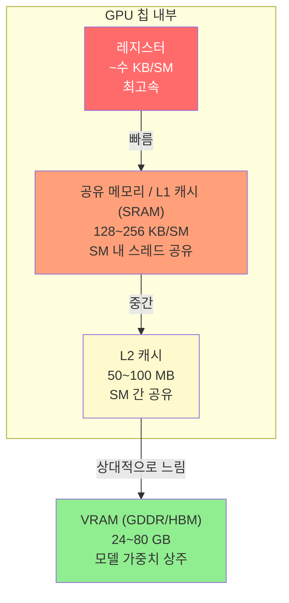
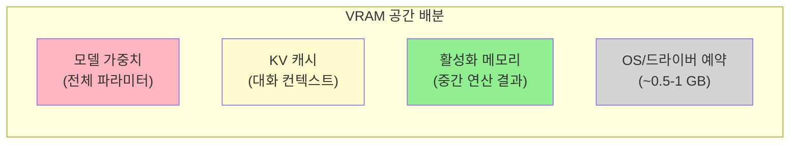
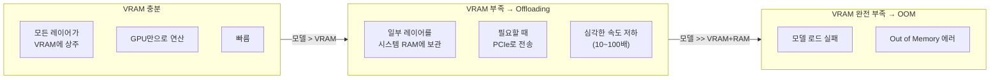

[](https://hits.sh/epheria.github.io/)

---

> 이 문서는 [LLM 동작 원리 - 게임 개발자를 위한 가이드](/posts/llm-guide/)의 7번 섹션 "하드웨어 구성"의 보충 자료입니다.

---

## 1. GPU 메모리 계층 구조

### 게임 렌더링 파이프라인과의 비유

게임 개발자에게 GPU 메모리 계층은 낯설지 않습니다. 셰이더가 텍스처를 샘플링할 때 텍스처 캐시를 통해 VRAM에 접근하듯, LLM 추론도 동일한 메모리 계층을 거칩니다. 차이점은 접근하는 데이터가 텍스처 픽셀이 아니라 **가중치 행렬의 float 값**이라는 것뿐입니다.

### 계층 구조

```
레지스터 (Registers)
│  용량: ~수 KB/SM  |  대역폭: 최대  |  지연: 최소 (~1 cycle)
│  역할: 현재 연산 중인 값 보유
▼
공유 메모리 / L1 캐시 (SRAM)
│  용량: 128~256 KB/SM  |  대역폭: ~수십 TB/s  |  지연: ~수십 cycle
│  역할: SM(Streaming Multiprocessor) 내 스레드 간 데이터 공유
│  게임 비유: 셰이더의 groupshared 메모리
▼
L2 캐시
│  용량: 50~100 MB (칩 전체)  |  대역폭: ~수 TB/s  |  지연: ~수백 cycle
│  역할: SM 간 공유 데이터 캐싱
│  게임 비유: 텍스처 캐시
▼
VRAM (GDDR / HBM)
   용량: 24~80 GB  |  대역폭: ~1~3 TB/s (GDDR7 ~ HBM3e)  |  지연: ~수백 cycle
   역할: 모델 가중치, KV 캐시, 활성화 데이터 저장
   게임 비유: 텍스처/메시/프레임 버퍼가 올라가는 GPU 메모리
```

### Mermaid 다이어그램



### 각 계층의 역할 (LLM 추론 기준)

| 계층 | 용량 | 대역폭 | LLM에서의 역할 | 게임 렌더링 비유 |
|------|------|--------|--------------|----------------|
| **레지스터** | ~수 KB/SM | 최대 | 현재 행렬 곱셈의 피연산자 | 셰이더 변수 |
| **SRAM (L1/공유)** | 128~256 KB/SM | ~수십 TB/s | Attention 타일링 연산의 중간 결과 (FlashAttention 핵심) | groupshared 메모리 |
| **L2 캐시** | 50~100 MB | ~수 TB/s | 자주 접근하는 가중치/KV 캐시 캐싱 | 텍스처 캐시 |
| **VRAM (GDDR/HBM)** | 24~80 GB | ~1~3 TB/s | 전체 모델 가중치, KV 캐시, 활성화 저장 | 텍스처/프레임 버퍼 |

### 왜 메모리 계층이 중요한가: Memory-bound 문제

LLM 추론의 핵심 병목은 **연산 속도가 아니라 메모리 대역폭**입니다. GPU의 연산 유닛(Tensor Core)은 데이터가 도착하기만 하면 극도로 빠르게 처리할 수 있지만, VRAM에서 데이터를 읽어오는 속도가 연산을 따라가지 못합니다. 이것을 **Memory-bound** 상태라고 합니다.

게임으로 비유하면, 셰이더 코드 자체는 간단한데 텍스처 샘플링이 병목이 되어 GPU 점유율(occupancy)이 낮은 상황과 같습니다.

```
연산 능력:  ████████████████████ (1,000+ TFLOPS)
VRAM 대역폭: ████████░░░░░░░░░░░░ (~3 TB/s)
                             ↑ 여기가 병목!
```

FlashAttention 시리즈(v1~v4)는 바로 이 문제를 해결합니다. VRAM 접근을 최소화하고, 가능한 한 SRAM(공유 메모리) 안에서 연산을 완료하여 VRAM 대역폭 병목을 우회합니다.

---

## 2. VRAM 용량과 모델 적재 실무

### VRAM에 올라가는 것들

LLM 추론 시 VRAM을 차지하는 요소는 크게 세 가지입니다:



### (1) 모델 가중치 (Model Weights)

학습이 완료된 파라미터 전체입니다. 모델이 로드될 때 한 번 올라가고, 서버가 꺼질 때까지 상주합니다.

**계산 공식:**

```
가중치 메모리 = 파라미터 수 × 정밀도 바이트

예시: Llama 3.1 70B (FP16)
= 70,000,000,000 × 2 bytes
= 140,000,000,000 bytes
= 140 GB
```

| 모델 | 파라미터 | FP16 | INT8 (양자화) | INT4 (양자화) |
|------|---------|------|-------------|-------------|
| Llama 3.2 3B | 3B | 6 GB | 3 GB | 1.5 GB |
| Llama 3.1 8B | 8B | 16 GB | 8 GB | 4 GB |
| Llama 3.1 70B | 70B | 140 GB | 70 GB | 35 GB |
| DeepSeek-V3 | 671B (MoE, 활성 37B) | ~1,342 GB* | ~671 GB* | ~336 GB* |

*MoE 모델은 전체 Expert 가중치가 VRAM에 상주해야 하므로, **메모리 요구량은 전체 파라미터(671B) 기준**으로 계산합니다. 단, 토큰당 실제 연산에는 활성 파라미터(37B)만 사용되므로 **추론 속도(연산 비용)**는 유사 규모의 Dense 모델(~37B) 수준입니다.

### (2) KV 캐시 (Key-Value Cache)

Transformer가 이전 토큰의 정보를 저장하는 캐시입니다. **대화가 길어질수록 커집니다.**

**계산 공식:**

```
KV 캐시 메모리 = 2 × 레이어 수 × KV 헤드 수 × 헤드 차원 × 시퀀스 길이 × 배치 크기 × 정밀도 바이트

※ GQA/MQA를 사용하는 모델은 KV 헤드 수가 Query 헤드 수보다 작아 KV 캐시가 크게 줄어듭니다.

예시: Llama 3.1 70B (GQA: KV 헤드 8개, 헤드 차원 128), 4096 토큰, 배치 1 (FP16)
= 2 × 80 × 8 × 128 × 4096 × 1 × 2 bytes
≈ 1.25 GB
```

KV 캐시는 **동적**입니다. 사용자와의 대화가 길어질수록 계속 커지며, 컨텍스트 윈도우 전체(128K 토큰 등)를 사용하면 수십 GB에 달할 수 있습니다.

| 컨텍스트 길이 | KV 캐시 (70B, GQA, FP16) | 비고 |
|-------------|------------------------|------|
| 2,048 토큰 | ~0.6 GB | 짧은 대화 |
| 8,192 토큰 | ~2.5 GB | 일반 대화 |
| 32,768 토큰 | ~10 GB | 긴 문서 분석 |
| 128,000 토큰 | ~39 GB | 전체 컨텍스트 윈도우 |

이것이 **GQA(Grouped Query Attention)**나 **MQA(Multi-Query Attention)** 같은 기법이 중요한 이유입니다. KV 캐시의 Key/Value 헤드 수를 줄여 메모리를 절약합니다.

### (3) 활성화 메모리 (Activation Memory)

순전파(forward pass) 중 각 레이어의 중간 연산 결과입니다. 추론에서는 학습보다 작지만, 배치 크기에 비례하여 증가합니다.

일반적으로 추론 시 활성화 메모리는 가중치나 KV 캐시에 비해 상대적으로 작아(수 GB 수준), 전체 VRAM 예산에서 차지하는 비율이 낮습니다.

### VRAM 총 요구량 계산 예시

```
Llama 3.1 70B (INT4 양자화, 8K 컨텍스트, 배치 1):

가중치:        35 GB (INT4)
KV 캐시:       ~1.3 GB (INT8 KV 양자화 + GQA 적용)
활성화:         ~2 GB
OS/드라이버:    ~1 GB
─────────────────────
총 필요:       ~39.3 GB

→ NVIDIA A100 80GB: 여유 있음
→ NVIDIA RTX 4090 24GB: 부족 → offloading 필요
→ Mac M4 Max 64GB (UMA): 가능 (단, 속도는 느림)
```

### VRAM이 부족할 때: Offloading

VRAM에 모델이 다 안 들어가면 어떻게 될까?



**Offloading 시 성능 저하가 극심한 이유:**

```
VRAM (HBM3e) 대역폭:  ~3,000 GB/s
PCIe 5.0 대역폭:       ~64 GB/s   ← 약 47배 느림
```

게임으로 비유하면, 텍스처 스트리밍에서 VRAM이 부족해 매 프레임마다 시스템 RAM에서 텍스처를 올려야 하는 상황입니다. 프레임 드롭이 심각해지듯, LLM 추론 속도도 급격히 떨어집니다.

### 실전 GPU 선택 가이드

| 모델 규모 | 추천 최소 VRAM | 추천 GPU | 비고 |
|----------|--------------|---------|------|
| ~3B (INT4) | 4 GB | 내장 GPU, 모바일 NPU | 간단한 로컬 실행 가능 |
| ~8B (INT4) | 6 GB | RTX 3060 12GB, M4 16GB | 범용 어시스턴트 수준 |
| ~13B (INT4) | 10 GB | RTX 4070 12GB, M4 Pro 24GB | 실용적인 로컬 모델 |
| ~34B (INT4) | 20 GB | RTX 4090 24GB, M4 Max 36GB | 준전문가 수준 |
| ~70B (INT4) | 40 GB | A100 80GB, M4 Max 64GB | 전문 분석 수준 |
| ~200B+ (INT4) | 128 GB+ | 멀티 GPU, Mac Studio Ultra | 대형 모델, 연구용 |

---

## 요약

```
VRAM = LLM의 작업 책상
├── 책상이 넓을수록 (VRAM 많을수록) → 큰 모델을 올릴 수 있음
├── 책상에서 손까지의 거리 (대역폭) → 연산 속도를 결정
├── 책상이 좁으면 (VRAM 부족) → 바닥에 놓고 왔다 갔다 (offloading) → 느려짐
└── 양자화 = 책을 요약본으로 바꿔서 책상 공간 절약
```

**핵심 포인트:**
1. LLM 추론은 **Memory-bound** — 연산 속도보다 메모리 대역폭이 병목
2. VRAM에는 가중치 + KV 캐시 + 활성화가 올라감 — 대화가 길어지면 KV 캐시가 커짐
3. VRAM이 부족하면 offloading으로 10~100배 느려짐 — 양자화로 가중치 크기를 줄이는 것이 핵심 전략
4. FlashAttention은 VRAM 접근을 최소화하여 Memory-bound 병목을 우회하는 기법

---

*이 문서는 [LLM 동작 원리 - 게임 개발자를 위한 가이드](/posts/llm-guide/) 섹션 7 "하드웨어 구성"의 보충 자료입니다.*
