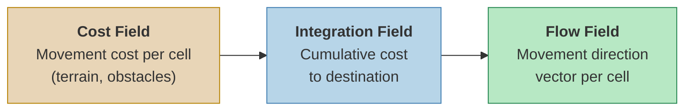
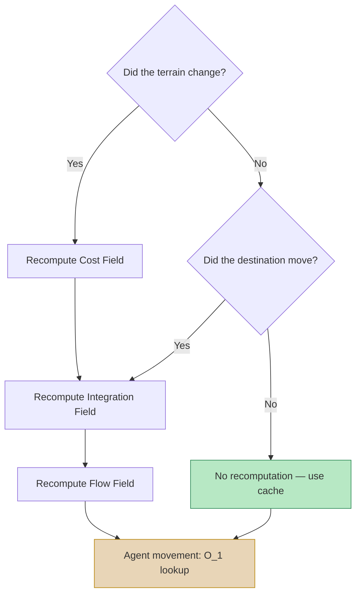

## Introduction

Imagine 3,000 zombies swarming toward the player. If you compute an individual path for each zombie? A single A* search traverses hundreds to thousands of nodes, and you'd have to repeat that 3,000 times. Framerate tanks instantly.

**Flow Field pathfinding** approaches this problem in a fundamentally different way. Instead of giving each agent a path, it **inscribes "where to go" across the entire space.** An agent simply reads the direction at the spot where it stands.

This post covers the core concepts of Flow Field and its 3-stage pipeline, and analyzes why it is practically the only viable option for large-scale crowd simulation.

> The video below shows an early implementation where 3,000 agents track the player in real time via Flow Field. The entire pipeline is parallelized with Unity Jobs + Burst.



---

## Part 1: The Limits of Traditional Pathfinding

### A* Algorithm — Fast, but Doesn't Scale

A* is the de facto standard for game pathfinding. It leverages heuristics to find the shortest path faster than Dijkstra and is a perfect solution for a handful of agents.

But the story changes as agent count grows.

#### Cost When You Have N Agents

A*'s time complexity **depends on grid size and path length**. In general, it's $$ O(E \log V) $$ where $$ E $$ is the number of explored edges and $$ V $$ is the number of nodes. The problem is that **this must be repeated for every agent**.

| Agent Count | A* Total Cost | Flow Field Total Cost |
|:-----------:|:----------:|:------------------:|
| 1 | $$ O(E \log V) $$ | $$ O(V) $$ |
| 10 | $$ O(10 \cdot E \log V) $$ | $$ O(V) $$ |
| 100 | $$ O(100 \cdot E \log V) $$ | $$ O(V) $$ |
| 3,000 | $$ O(3000 \cdot E \log V) $$ | $$ O(V) $$ |

Flow Field computes the entire grid **only once, regardless of agent count**. The more agents you have, the more dramatic the advantage over A* becomes.

#### Additional Issues with A*

- **Redundant paths**: Agents heading for the same destination recompute nearly identical paths
- **Dynamic obstacles**: Every agent's path must be recomputed whenever the environment changes
- **Memory**: Each agent must store its own path list (waypoint array)
- **Crowd flow**: Individual paths don't produce natural crowd flow (overlapping at bottlenecks)

---

## Part 2: The Core Idea Behind Flow Field

### Computing a "Field," Not a "Path"

While A* finds **a path from start to goal**, Flow Field computes **a direction from every point to the goal**.

An analogy:

> **A* is like a GPS navigator** — you have to search for a route from each starting point.
> **Flow Field is like terrain where water flows** — no matter where you drop water, it naturally flows downhill to the lowest point.

Once the Flow Field is complete, each agent's movement becomes trivial:

```
1. Determine which cell I'm in
2. Read the direction vector of that cell
3. Move in that direction
```

**The lookup cost per agent is $$ O(1) $$.** Whether it's 3,000 or 10,000 agents makes no difference.

### The 3-Stage Pipeline

Flow Field computes three independent fields sequentially:


_Cost Field → Integration Field (Dijkstra) → Flow Field (direction vectors). A natural detour around obstacles (black squares) emerges._



Because each stage is independent:
- **Cost Field** is only recomputed when terrain changes (barricade placed/destroyed)
- **Integration Field** is only recomputed when the destination moves
- **Flow Field** is only recomputed when the Integration Field changes

This **caching strategy** is what makes Flow Field practical for real-time games.

---

## Part 3: Cost Field — Representing the World as a Grid

### Grid Structure

The Cost Field is a 2D grid that divides the game world into **uniform square cells**.

| Parameter | Description | Typical Values |
|:--------:|:----:|:----------:|
| Cell Size | Length of one cell edge | 0.5 – 2.0 units |
| Grid Width × Height | Grid dimensions | 200×200 – 500×500 |
| Data Type | Storage per cell | `byte` (0–255) |

Cell size is a **tradeoff between precision and performance**:
- **Small cells** (0.5): Precise obstacle representation, but 4× the computation
- **Large cells** (2.0): Fast computation, but may fail to represent narrow passages

### What the Cost Values Mean

The cost assigned to each cell represents **"how difficult is it to traverse this cell."**

| Cost | Meaning | Example |
|:----:|:----:|:----:|
| 1 | Flat ground | Roads, level terrain |
| 2–4 | Rough terrain | Mud, shallow water, gentle slopes |
| 5–10 | High-cost terrain | Steep slopes, deep water |
| 255 | Impassable | Walls, buildings, cliffs |

#### Slope-Based Cost Calculation

In actual 3D terrain, height differences must be reflected in the cost. The slope is calculated from the height difference $$ \Delta h $$ between adjacent cells:

$$
\text{slope} = \frac{\Delta h}{\text{cellSize}}
$$

This slope is then converted to a cost based on thresholds:

| Slope Range | Classification | Additional Cost |
|:----------:|:----:|:--------:|
| 0 – 0.3 | Gentle | +0 |
| 0.3 – 0.6 | Moderate | +3 |
| 0.6 – 1.0 | Steep | +8 |
| Above 1.0 | Impassable | 255 |

This produces the natural behavior of agents **detouring around steep hills**.

### Dynamic Cost Updates

The environment can change during gameplay:
- Barricade placed → Set the cell to 255 (impassable)
- Barricade destroyed → Restore original cost
- Bridge built → Set water cells' cost to 1

Dynamic updates to the Cost Field only need to **modify the changed cells**, so the cost is very low. However, when the Cost Field changes, the Integration Field and Flow Field must be recomputed.

---

## Part 4: Integration Field — Cumulative Cost to the Destination

### Concept

The Integration Field is the result of computing **"the total cost to travel from this cell to the destination"** for every cell in the grid.

The computation method is a **variant of Dijkstra's algorithm**. Starting from the destination cell, costs propagate outward to neighboring cells:

```
1. Destination cell cumulative cost = 0
2. Destination's neighbors = neighbor's cost value
3. Neighbor's neighbors = previous cumulative cost + that cell's cost value
4. Repeat until all reachable cells are filled
```

#### Example: 5×5 Grid

With the destination at center `(2,2)` and all cells having a cost of 1:

```
┌─────┬─────┬─────┬─────┬─────┐
│  4  │  3  │  2  │  3  │  4  │   Integration
│     │     │     │     │     │   Field
├─────┼─────┼─────┼─────┼─────┤
│  3  │  2  │  1  │  2  │  3  │   (Cumulative cost
│     │     │     │     │     │    from destination)
├─────┼─────┼─────┼─────┼─────┤
│  2  │  1  │  0  │  1  │  2  │   0 = Destination
│     │     │     │     │     │
├─────┼─────┼─────┼─────┼─────┤
│  3  │  2  │  1  │  2  │  3  │
│     │     │     │     │     │
├─────┼─────┼─────┼─────┼─────┤
│  4  │  3  │  2  │  3  │  4  │
│     │     │     │     │     │
└─────┴─────┴─────┴─────┴─────┘
```

When obstacles are present, the cumulative cost reflects routes that detour around them:

```
┌─────┬─────┬─────┬─────┬─────┐
│  6  │  5  │  4  │  3  │  4  │
│     │     │     │     │     │
├─────┼─────┼─────┼─────┼─────┤
│  5  │ ### │ ### │  2  │  3  │   ### = Wall (255)
│     │     │     │     │     │
├─────┼─────┼─────┼─────┼─────┤
│  4  │ ### │  0  │  1  │  2  │   The wall causes
│     │     │     │     │     │   left-side cells to have
├─────┼─────┼─────┼─────┼─────┤   much higher costs
│  3  │  2  │  1  │  2  │  3  │
│     │     │     │     │     │
├─────┼─────┼─────┼─────┼─────┤
│  4  │  3  │  2  │  3  │  4  │
│     │     │     │     │     │
└─────┴─────┴─────┴─────┴─────┘
```

### Dijkstra vs Dial's Algorithm

Standard Dijkstra uses a priority queue (heap) with $$ O(V \log V) $$ complexity. However, we can exploit the fact that Flow Field costs are **integers (bytes)** to use a faster algorithm.

**Dial's Algorithm** is a specialization of Dijkstra that uses a **Circular Bucket Queue**:

| | Dijkstra (Heap) | Dial's Algorithm |
|:---:|:---:|:---:|
| Data Structure | Binary / Fibonacci heap | Circular bucket array |
| Insertion | $$ O(\log V) $$ | $$ O(1) $$ |
| Extract-Min | $$ O(\log V) $$ | $$ O(1) $$ amortized |
| Total Complexity | $$ O(V \log V) $$ | $$ O(V + C) $$ |
| Constraint | None | Edge weights must be small integers |

Here $$ C $$ is the maximum edge weight. Since Cost Field values are `byte` (0–255), **Dial's Algorithm is a perfect fit.** In practice, accounting for diagonal costs ($$ \times 1.414 $$) leads to a system with **362 buckets**.

#### How Dial's Algorithm Works

```
Bucket array: [0] [1] [2] [3] ... [C_max]
                ↑
            Current index

1. Insert destination cell into bucket[0]
2. While the current index's bucket is not empty:
   a. Remove a cell
   b. Examine 8-directional neighbors
   c. New cost = current cost + neighbor's cost
   d. Insert neighbor into bucket[new cost % bucket count]
3. When current bucket is empty, advance to next bucket
4. Repeat until all cells are processed
```

Since the heap's $$ O(\log V) $$ insertion/extraction becomes $$ O(1) $$, real-world benchmarks show it is **30–50% faster.**

### Diagonal Movement Cost

In 8-directional movement, diagonals are $$ \sqrt{2} \approx 1.414 $$ times farther than cardinal directions. Without accounting for this, diagonal movement costs the same as straight movement, producing unnatural paths.

$$
\text{cost}\_\text{diagonal} = \text{neighbor cost} \times \lfloor \sqrt{2} \times \text{scale} \rfloor
$$

To keep integer arithmetic, a common approach is to multiply costs by a scale factor (e.g., 10):
- Cardinal movement: cost × 10
- Diagonal movement: cost × 14 (≈ 10 × 1.414)

### Multi-Target (Multi-Source Seeding)

In a zombie survival game, the destination isn't just one point. **Multiple destinations exist simultaneously** — the player, NPCs, strongholds, etc.

Multiple destinations are handled simply:

```
1. Insert all destination cells into bucket[0] (cost = 0)
2. Run Dial's Algorithm as usual
```

Result: Each cell's cumulative cost becomes **the cost to the nearest destination**. Agents naturally head toward whichever destination is closest. This is how a single Flow Field handles multiple targets.


_Left: Territory partitioned by destination (based on nearest target). Right: Unified Flow Field — arrow color indicates the nearest destination._

---

## Part 5: Flow Field — Generating Direction Vectors

### From Integration Field to Flow Field

Once the Integration Field is complete, computing the Flow Field is straightforward. For each cell, simply record **the direction toward the neighbor with the lowest cumulative cost**:

```
For each cell:
  1. Compare Integration values of 8-directional neighbors
  2. Select the direction of the neighbor with the smallest value
  3. Normalize and store the direction vector
```

#### Example: Integration Field → Flow Field

```
Integration Field:          Flow Field (directions):

 4  3  2  3  4              ↘  ↓  ↓  ↓  ↙
 3  2  1  2  3              →  ↘  ↓  ↙  ←
 2  1  0  1  2              →  →  ●  ←  ←
 3  2  1  2  3              →  ↗  ↑  ↖  ←
 4  3  2  3  4              ↗  ↑  ↑  ↑  ↖
```

`●` is the destination (cost 0). All arrows naturally point toward the destination.

### Normalized Direction Vectors

Each cell in the Flow Field stores a **normalized 2D vector `(x, y)`**:

$$
\vec{d} = \text{normalize}(\text{neighbor}\_\text{min} - \text{current})
$$

By storing **floating-point vectors** rather than restricting to 8 discrete directions, Bilinear Interpolation can produce smooth movement at cell boundaries.

### Why This Stage Is Perfect for Parallelization

Flow Field computation is **completely independent per cell**. Computing cell A's direction does not depend on cell B's result. Therefore:
- Parallelizable per cell with `IJobParallelFor`
- Burst compilation enables automatic SIMD vectorization
- Also implementable as a GPU compute shader

In contrast, the Integration Field (Dial's Algorithm) has sequential dependencies and must run on a single thread. This is one of the **reasons for separating the pipeline** into stages.

---

## Part 6: Agent Movement — O(1) Lookup

### Basic Movement

Once the Flow Field is complete, the agent movement logic is extremely simple:

```csharp
// Pseudocode
Vector2 worldPos = agent.position;
int cellX = (int)(worldPos.x / cellSize);
int cellY = (int)(worldPos.y / cellSize);
int index = cellY * gridWidth + cellX;

Vector2 direction = flowField[index];  // O(1) lookup
agent.velocity = direction * speed;
```

**This cost remains constant no matter how many agents there are.** The Flow Field computation is already done; agents just perform an array lookup.

### Bilinear Interpolation

If directions change abruptly at cell boundaries, agents can zigzag. **Bilinear interpolation** solves this.

Based on the agent's exact position, it computes a weighted average of the direction vectors from the 4 surrounding cells:

$$
\vec{d}\_\text{interpolated} = (1-t_x)(1-t_y)\vec{d}\_{00} + t_x(1-t_y)\vec{d}\_{10} + (1-t_x)t_y\vec{d}\_{01} + t_x \cdot t_y \cdot \vec{d}\_{11}
$$

Here $$ t_x, t_y $$ are the relative position within the cell (0–1).

```
Interpolation effect at cell boundaries:

No interpolation:         With interpolation:
 ↓  ↓  →  →              ↓  ↘  →  →
 ↓  ↓  →  →              ↓  ↘  ↗→ →
 ↓  ↓  →  →              ↓  ↘→ →  →

Agent trajectory:        Agent trajectory:
 ┃              ╲
 ┃               ╲
 ┗━━━━━            ╲━━━━
 (sharp turn)       (smooth curve)
```

With interpolation, **thousands of agents moving simultaneously produce a natural flow**.

---

## Part 7: Performance Analysis — Why It Works in Real-Time Games

### Memory Usage

Based on a 200×200 grid:

| Field | Size per Cell | Total Size |
|:----:|:---------:|:---------:|
| Cost Field | 1 byte | 40 KB |
| Integration Field | 2 bytes (ushort) | 80 KB |
| Flow Field | 8 bytes (float2) | 320 KB |
| **Total** | | **440 KB** |

With A*, storing paths for 3,000 agents averaging 50 waypoints each: 3,000 × 50 × 8 bytes = **1.2 MB**. Flow Field **uses less memory** as well.

### Computation Time (Benchmark Reference)

200×200 grid, Unity Burst + Jobs:

| Stage | Parallelization | Approx. Time |
|:----:|:------:|:----------:|
| Cost Field | `IJobParallelFor` | ~0.1ms |
| Integration Field (Dial's) | `IJob` (single thread) | ~0.5ms |
| Flow Field | `IJobParallelFor` | ~0.1ms |
| **Total** | | **~0.7ms** |

And this only occurs **when the destination moves**. If you recompute at 0.5-second intervals, only **2 times/sec × 0.7ms = 1.4ms** per second is spent on pathfinding.

Meanwhile, running A* 3,000 times takes **tens of milliseconds** even after optimization.

### Real-World Profiling — 20,000 Agent Stress Test


_Left: Per-system frame time budget (based on 16.6ms target). Right: NativeArray memory usage. Flow Field Jobs themselves are only 2ms — a fraction of the total._

In our actual project, rendering uses GPU Instancing + VAT animation. Stress testing with 20,000 agents yielded these results:

| Metric | Value |
|:----:|:----:|
| p50 Frame Time | 7.71ms |
| p90 Frame Time | 8.34ms |
| p99 Frame Time | 9.25ms |
| vs. 60fps Budget (16.67ms) | **~54% headroom** |
| Total Draw Calls | 152 |
| Triangles/Frame | 41.2M |

Even with 20,000 agents, p99 is 9.25ms — roughly half the 60fps budget. Pathfinding itself isn't the bottleneck. Instead, **agent sorting (NativeArray.Sort)** was identified as consuming ~36.6% of frame time — which will be covered in a separate post.

### Caching Strategy Summary



In most frames, agents **use the cached Flow Field without any recomputation**.

---

## Summary: A* vs Flow Field

| Aspect | A* | Flow Field |
|:----:|:--:|:----------:|
| Computation Target | Path from start to goal | Direction vectors for entire space |
| Cost per Agent | $$ O(E \log V) $$ | $$ O(1) $$ (lookup only) |
| Total Cost for N Agents | $$ O(N \cdot E \log V) $$ | $$ O(V) $$ (independent of N) |
| Dynamic Environment Response | Recompute all agents | Recompute field once |
| Memory | Path stored per agent | 3 fixed grids |
| Movement Quality | Individually optimal paths | Smooth crowd flow |
| Best Use Case | Few agents, diverse destinations | Many agents, shared destinations |

**Flow Field is not always superior.** If you have 10 agents each heading to a different destination, A* is far more efficient. Flow Field shines in scenarios where **"many agents share a small number of destinations"** — zombie survival is exactly this case.

---

## Upcoming Posts

This post covered the concepts behind Flow Field and its 3-stage pipeline. The next post will cover the practical optimizations applied when **scaling from 3,000 to 10,000 agents** using this Flow Field:

- **3K→10K Scaling** — Burst SortJob, GPU Instancing + VAT, spatial hashing for separation steering, Tiered LOD, Frustum Culling
- **Dial's Algorithm Deep Dive** — Circular bucket queue internals and implementation, 362-bucket system, real implementation patterns in Unity Jobs
- **Multi-Goal & Layered Flow Field** — Multiple destinations, layer separation strategies, cross-platform benchmarks

---

## References

- Emerson, E. (2013). *[Crowd Pathfinding and Steering Using Flow Field Tiles](http://www.gameaipro.com/GameAIPro/GameAIPro_Chapter23_Crowd_Pathfinding_and_Steering_Using_Flow_Field_Tiles.pdf)*. Game AI Pro.
- Pentheny, G. (2013). *[Efficient Crowd Simulation for Mobile Games](http://www.gameaipro.com/GameAIPro/GameAIPro_Chapter22_Efficient_Crowd_Simulation_for_Mobile_Games.pdf)*. Game AI Pro.
- Dial, R.B. (1969). *Algorithm 360: Shortest-path forest with topological ordering*. Communications of the ACM, 12(11).
