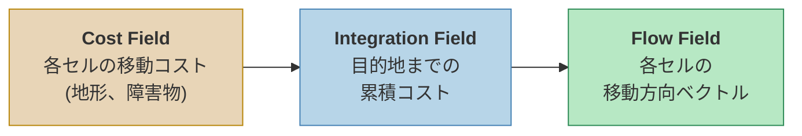
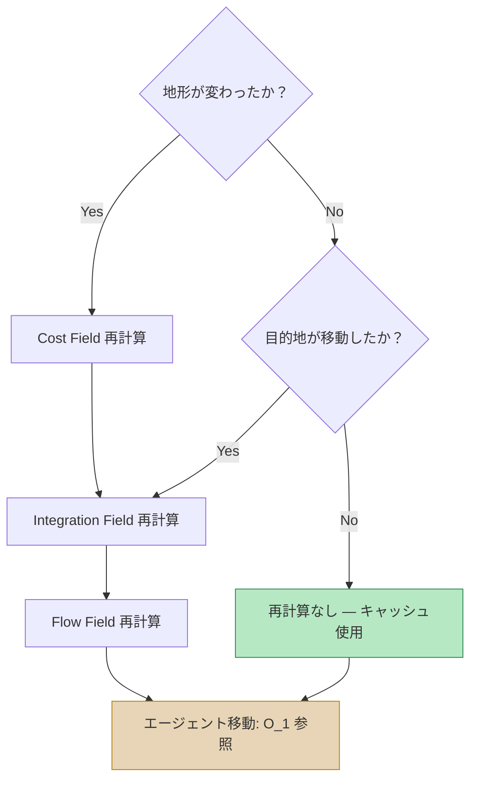

## はじめに

3,000体のゾンビがプレイヤーに向かって押し寄せてくる場面を想像してほしい。各ゾンビに個別の経路を計算するとしたら？ A*一回あたり数百〜数千ノードを探索し、それを3,000回繰り返さなければならない。フレームレートはあっという間に崩壊する。

**Flow Field パスファインディング**はこの問題に根本的に異なるアプローチで挑む。個々のエージェントに経路を与える代わりに、**空間全体に「どこへ向かうべきか」を刻み込む。** エージェントは自分がいる場所の方向を読み取るだけでよい。

この記事では、Flow Fieldの核心概念と3段階パイプラインを解説し、なぜ大規模群衆シミュレーションにおいて事実上唯一の選択肢であるかを分析する。

> 以下の動画は実装の初期バージョンで、3,000エージェントがFlow Fieldを通じてリアルタイムでプレイヤーを追跡する様子である。パイプライン全体がUnity Jobs + Burstで並列化されている。



---

## Part 1: 従来のパスファインディングの限界

### A*アルゴリズム — 高速だがスケールしない

A*はゲームパスファインディングの事実上の標準である。ヒューリスティックを活用してDijkstraより高速に最短経路を見つけ、少数のエージェントには完璧な解法だ。

しかし、エージェント数が増えると話が変わる。

#### エージェントN体の場合のコスト

A*の時間計算量は**グリッドサイズと経路長に依存**する。一般的に $$ O(E \log V) $$ で、$$ E $$ は探索した辺の数、$$ V $$ はノード数である。問題は**これをエージェントごとに繰り返す**必要があることだ。

| エージェント数 | A* 総コスト | Flow Field 総コスト |
|:-----------:|:----------:|:------------------:|
| 1 | $$ O(E \log V) $$ | $$ O(V) $$ |
| 10 | $$ O(10 \cdot E \log V) $$ | $$ O(V) $$ |
| 100 | $$ O(100 \cdot E \log V) $$ | $$ O(V) $$ |
| 3,000 | $$ O(3000 \cdot E \log V) $$ | $$ O(V) $$ |

Flow Fieldは**エージェント数に関係なく**グリッド全体を一度だけ計算する。エージェントが多いほど、A*に対する優位性は劇的に大きくなる。

#### A*のその他の問題点

- **経路の重複**: 同じ目的地に向かうエージェントが類似した経路を繰り返し計算する
- **動的障害物**: 環境が変化するたびに全エージェントの経路を再計算する必要がある
- **メモリ**: エージェントごとに経路リスト（ウェイポイント配列）を保存する必要がある
- **群衆フロー**: 個別の経路では自然な群衆の流れが生まれない（ボトルネック地点で重なる）

---

## Part 2: Flow Fieldの核心アイデア

### 「経路」ではなく「フィールド」を計算する

A*が**「出発点→到着点」の経路**を求めるのに対し、Flow Fieldは**「すべての地点→到着点」の方向**を計算する。

たとえるなら：

> **A*はナビゲーション** — 出発地ごとに経路を新たに検索する必要がある。
> **Flow Fieldは水が流れる地形** — どこに水を落としても、自然に最も低い場所へ流れていく。

Flow Fieldが完成すると、各エージェントの移動はシンプルになる：

```
1. 自分がどのセルにいるか確認する
2. そのセルの方向ベクトルを読み取る
3. その方向に移動する
```

**エージェントあたりの参照コストは $$ O(1) $$** である。3,000体でも10,000体でも変わらない。

### 3段階パイプライン

Flow Fieldは3つの独立したフィールドを順次計算する：


_Cost Field → Integration Field (Dijkstra) → Flow Field (方向ベクトル)。障害物（黒い四角）の周りを自然に迂回する流れが生成される。_



各段階が独立しているため：
- **Cost Field**は地形が変わった時のみ再計算（バリケード設置/破壊）
- **Integration Field**は目的地が移動した時のみ再計算
- **Flow Field**はIntegration Fieldが変わった時のみ再計算

この**キャッシング戦略**がFlow Fieldをリアルタイムゲームで実用的にする核心である。

---

## Part 3: Cost Field — 世界をグリッドで表現する

### グリッド構造

Cost Fieldはゲームワールドを**均一な正方形セル**で分割した2Dグリッドである。

| パラメータ | 説明 | 一般的な値 |
|:--------:|:----:|:----------:|
| Cell Size | セル一辺の長さ | 0.5 ~ 2.0 ユニット |
| Grid Width × Height | グリッドサイズ | 200×200 ~ 500×500 |
| データ型 | セルあたりの保存サイズ | `byte` (0~255) |

セルサイズは**精度とパフォーマンスのトレードオフ**である：
- **小さいセル** (0.5): 精密な障害物表現、計算量4倍増加
- **大きいセル** (2.0): 高速な計算、狭い通路を表現できない可能性がある

### コスト値の意味

各セルに割り当てられるコスト(cost)は、**「このセルを通過するのがどれほど困難か」** を表す。

| コスト | 意味 | 例 |
|:----:|:----:|:----:|
| 1 | 平地 | 道路、平坦な地面 |
| 2~4 | 悪路 | 泥、浅い水、緩やかな傾斜 |
| 5~10 | 高コスト地形 | 急な傾斜、深い水 |
| 255 | 通行不可 | 壁、建物、崖 |

#### 傾斜度に基づくコスト算出

実際の3D地形では、高低差をコストに反映する必要がある。隣接セル間の高低差 $$ \Delta h $$ で傾斜度を計算する：

$$
\text{slope} = \frac{\Delta h}{\text{cellSize}}
$$

この傾斜度を閾値に応じてコストに変換する：

| 傾斜度範囲 | 分類 | 追加コスト |
|:----------:|:----:|:--------:|
| 0 ~ 0.3 | 緩やか | +0 |
| 0.3 ~ 0.6 | 普通 | +3 |
| 0.6 ~ 1.0 | 急峻 | +8 |
| 1.0 以上 | 通行不可 | 255 |

これにより、エージェントが**急な丘を避けて迂回する**自然な行動が生まれる。

### 動的コスト更新

ゲーム中に環境が変化する場合がある：
- バリケード設置 → 該当セルを255（通行不可）に変更
- バリケード破壊 → 元のコストに復元
- 橋の建設 → 水上セルのコストを1に変更

Cost Fieldの動的更新は**変更されたセルのみ**修正すればよいため、コストは非常に低い。ただし、Cost Fieldが変わるとIntegration FieldとFlow Fieldを再計算する必要がある。

---

## Part 4: Integration Field — 目的地までの累積コスト

### 概念

Integration Fieldは、**「このセルから目的地まで行くのにかかる総コスト」** をすべてのセルについて計算した結果である。

計算方式は**Dijkstraアルゴリズムの変形**である。目的地セルから開始し、隣接セルへコストを伝播させる：

```
1. 目的地セルの累積コスト = 0
2. 目的地の隣接セル = 隣接セルのcost値
3. 隣接の隣接 = 前の累積コスト + 該当セルのcost値
4. 到達可能なすべてのセルが埋まるまで繰り返す
```

#### 例: 5×5グリッド

目的地が中央 `(2,2)` で、すべてのセルのCostが1の単純なケース：

```
┌─────┬─────┬─────┬─────┬─────┐
│  4  │  3  │  2  │  3  │  4  │   Integration
│     │     │     │     │     │   Field
├─────┼─────┼─────┼─────┼─────┤
│  3  │  2  │  1  │  2  │  3  │   (目的地からの
│     │     │     │     │     │    累積コスト)
├─────┼─────┼─────┼─────┼─────┤
│  2  │  1  │  0  │  1  │  2  │   0 = 目的地
│     │     │     │     │     │
├─────┼─────┼─────┼─────┼─────┤
│  3  │  2  │  1  │  2  │  3  │
│     │     │     │     │     │
├─────┼─────┼─────┼─────┼─────┤
│  4  │  3  │  2  │  3  │  4  │
│     │     │     │     │     │
└─────┴─────┴─────┴─────┴─────┘
```

障害物がある場合、その周囲を迂回する経路の累積コストが反映される：

```
┌─────┬─────┬─────┬─────┬─────┐
│  6  │  5  │  4  │  3  │  4  │
│     │     │     │     │     │
├─────┼─────┼─────┼─────┼─────┤
│  5  │ ### │ ### │  2  │  3  │   ### = 壁 (255)
│     │     │     │     │     │
├─────┼─────┼─────┼─────┼─────┤
│  4  │ ### │  0  │  1  │  2  │   壁があるため
│     │     │     │     │     │   左側セルのコストが
├─────┼─────┼─────┼─────┼─────┤   大幅に増加
│  3  │  2  │  1  │  2  │  3  │
│     │     │     │     │     │
├─────┼─────┼─────┼─────┼─────┤
│  4  │  3  │  2  │  3  │  4  │
│     │     │     │     │     │
└─────┴─────┴─────┴─────┴─────┘
```

### Dijkstra vs Dial's Algorithm

標準のDijkstraは優先度キュー（ヒープ）を使用し、$$ O(V \log V) $$ の計算量を持つ。しかし、Flow Fieldのコストが**整数(byte)** であることを活用すれば、より高速なアルゴリズムを使用できる。

**Dial's Algorithm**は**円形バケットキュー(Circular Bucket Queue)** を使用するDijkstraの特殊化バージョンである：

| | Dijkstra (ヒープ) | Dial's Algorithm |
|:---:|:---:|:---:|
| データ構造 | 二分ヒープ / フィボナッチヒープ | 円形バケット配列 |
| 挿入 | $$ O(\log V) $$ | $$ O(1) $$ |
| 最小値抽出 | $$ O(\log V) $$ | $$ O(1) $$ amortized |
| 全体計算量 | $$ O(V \log V) $$ | $$ O(V + C) $$ |
| 制約条件 | なし | 辺の重みが整数かつ範囲が小さいこと |

ここで $$ C $$ は最大辺重みである。Cost Fieldのコストが `byte`(0~255)であるため、**Dial's Algorithmが完璧にマッチする。** 実装では対角線コスト（$$ \times 1.414 $$）まで考慮して**362個のバケット**を使用する。

#### Dial's Algorithmの動作原理

```
バケット配列: [0] [1] [2] [3] ... [C_max]
                ↑
            現在のインデックス

1. 目的地セルをバケット[0]に入れる
2. 現在のインデックスのバケットが空になるまで：
   a. セルを取り出す
   b. 8方向の隣接セルを検査する
   c. 新コスト = 現在のコスト + 隣接セルのcost
   d. 隣接セルをバケット[新コスト % バケット数]に入れる
3. 現在のバケットが空になったら次のバケットへ移動
4. すべてのセルが処理されるまで繰り返す
```

ヒープの $$ O(\log V) $$ の挿入/抽出が $$ O(1) $$ に変わるため、実測でも**30~50%高速**になる。

### 対角線移動コスト

8方向移動において対角線は直線より $$ \sqrt{2} \approx 1.414 $$ 倍遠い距離である。これを反映しないと、対角線移動が直線と同じコストになり、不自然な経路が生成される。

$$
\text{cost}\_\text{diagonal} = \text{neighbor cost} \times \lfloor \sqrt{2} \times \text{scale} \rfloor
$$

整数演算を維持するために、コストにスケールファクタ（例：10）を掛ける方式がよく使われる：
- 直線移動: cost × 10
- 対角線移動: cost × 14 (≈ 10 × 1.414)

### 複数目的地 (Multi-Source Seeding)

ゾンビサバイバルでは目的地が一つだけではない。プレイヤー、NPC、拠点など**複数の目的地が同時に存在**する。

複数目的地の処理はシンプルである：

```
1. すべての目的地セルをバケット[0]に入れる (コスト = 0)
2. 通常通りDial's Algorithmを実行する
```

結果：各セルの累積コストは**最も近い目的地までのコスト**になる。エージェントは自然に最も近い目的地へ向かう。これが単一のFlow Fieldで複数目的地を処理する方法である。


_左：目的地ごとの領域分割（最も近い目的地基準）。右：統合Flow Field — 矢印の色が最も近い目的地を示す。_

---

## Part 5: Flow Field — 方向ベクトルの生成

### Integration FieldからFlow Fieldへ

Integration Fieldが完成すると、Flow Fieldの計算はシンプルである。各セルで**最も低い累積コストを持つ隣接セルの方向**を記録すればよい：

```
各セルについて：
  1. 8方向の隣接セルのIntegration値を比較
  2. 最小値を持つ隣接セルの方向を選択
  3. 方向ベクトルを正規化して保存
```

#### 例: Integration Field → Flow Field

```
Integration Field:          Flow Field (方向):

 4  3  2  3  4              ↘  ↓  ↓  ↓  ↙
 3  2  1  2  3              →  ↘  ↓  ↙  ←
 2  1  0  1  2              →  →  ●  ←  ←
 3  2  1  2  3              →  ↗  ↑  ↖  ←
 4  3  2  3  4              ↗  ↑  ↑  ↑  ↖
```

`●`は目的地（コスト0）である。すべての矢印が自然に目的地を向いている。

### 正規化された方向ベクトル

Flow Fieldの各セルには**正規化された2Dベクトル `(x, y)`** が格納される：

$$
\vec{d} = \text{normalize}(\text{neighbor}\_\text{min} - \text{current})
$$

8方向に限定せず**実数ベクトルで保存**すれば、Bilinear Interpolation（双線形補間）によりセル境界で滑らかな移動が可能になる。

### この段階が並列化に最適な理由

Flow Fieldの計算は**各セルが完全に独立**している。セルAの方向を計算する際にセルBの結果は必要ない。したがって：
- `IJobParallelFor`でセル単位の並列化が可能
- BurstコンパイルによるSIMD自動ベクトル化
- GPUコンピュートシェーダーでの実装も可能

一方、Integration Field（Dial's Algorithm）は逐次的な依存性があるためシングルスレッドで実行する必要がある。これが**パイプラインを分離する理由**の一つである。

---

## Part 6: エージェントの移動 — O(1)参照

### 基本的な移動

Flow Fieldが完成すると、エージェントの移動ロジックは極めてシンプルになる：

```csharp
// 疑似コード
Vector2 worldPos = agent.position;
int cellX = (int)(worldPos.x / cellSize);
int cellY = (int)(worldPos.y / cellSize);
int index = cellY * gridWidth + cellX;

Vector2 direction = flowField[index];  // O(1) 参照
agent.velocity = direction * speed;
```

**エージェントがどれだけ多くても、このコストは変わらない。** Flow Fieldの計算はすでに完了しており、エージェントは配列参照をするだけである。

### Bilinear Interpolation（双線形補間）

セル境界で方向が急激に変わると、エージェントがジグザグに動いてしまうことがある。これを解決するのが**双線形補間**である。

エージェントの正確な位置を基準に、隣接する4つのセルの方向ベクトルを加重平均する：

$$
\vec{d}\_\text{interpolated} = (1-t_x)(1-t_y)\vec{d}\_{00} + t_x(1-t_y)\vec{d}\_{10} + (1-t_x)t_y\vec{d}\_{01} + t_x \cdot t_y \cdot \vec{d}\_{11}
$$

ここで $$ t_x, t_y $$ はセル内での相対位置（0~1）である。

```
セル境界での補間効果：

補間なし:                補間あり:
 ↓  ↓  →  →              ↓  ↘  →  →
 ↓  ↓  →  →              ↓  ↘  ↗→ →
 ↓  ↓  →  →              ↓  ↘→ →  →

エージェント軌跡:           エージェント軌跡:
 ┃              ╲
 ┃               ╲
 ┗━━━━━            ╲━━━━
 (折れ曲がり)             (滑らかな曲線)
```

補間を適用すると、**数千体のエージェントが同時に移動しても自然な流れ**が生まれる。

---

## Part 7: パフォーマンス分析 — なぜリアルタイムゲームで実現可能なのか

### メモリ使用量

200×200グリッド基準：

| フィールド | セルあたりサイズ | 全体サイズ |
|:----:|:---------:|:---------:|
| Cost Field | 1 byte | 40 KB |
| Integration Field | 2 bytes (ushort) | 80 KB |
| Flow Field | 8 bytes (float2) | 320 KB |
| **合計** | | **440 KB** |

A*で3,000エージェントに平均50ウェイポイントずつ経路を保存すると：3,000 × 50 × 8 bytes = **1.2 MB**。Flow Fieldの方が**メモリも少なく**済む。

### 計算時間（実測参考）

200×200グリッド、Unity Burst + Jobs基準：

| 段階 | 並列化 | おおよその時間 |
|:----:|:------:|:----------:|
| Cost Field | `IJobParallelFor` | ~0.1ms |
| Integration Field (Dial's) | `IJob` (シングルスレッド) | ~0.5ms |
| Flow Field | `IJobParallelFor` | ~0.1ms |
| **合計** | | **~0.7ms** |

しかもこれは**目的地が移動した時にのみ**発生する。0.5秒間隔で再計算すれば、**毎秒2回 × 0.7ms = 1.4ms**のみがパスファインディングに使用される。

一方、A*を3,000回実行すると、最適化後でも**数十ms**を要する。

### 実測プロファイリング — 20,000エージェント ストレステスト


_左：システム別フレームタイム予算（16.6ms基準）。右：NativeArrayメモリ使用量。Flow Field Jobs自体は2msで全体のごく一部に過ぎない。_

実際のプロジェクトでGPU Instancing + VATアニメーションでレンダリングしながら、20,000エージェントでストレステストした結果：

| 指標 | 数値 |
|:----:|:----:|
| p50 フレームタイム | 7.71ms |
| p90 フレームタイム | 8.34ms |
| p99 フレームタイム | 9.25ms |
| 60fps予算 (16.67ms) に対して | **余裕 ~54%** |
| 総ドローコール | 152 |
| トライアングル/フレーム | 41.2M |

20,000エージェントでもp99が9.25msで、60fps予算の半分程度である。パスファインディング自体がボトルネックではなく、**エージェントのソート（NativeArray.Sort）** がフレームの~36.6%を占めることが判明した — この部分は別の記事で扱う。

### キャッシング戦略のまとめ



ほとんどのフレームでは**再計算なしにキャッシュされたFlow Fieldを使用**する。

---

## まとめ: A* vs Flow Field

| 項目 | A* | Flow Field |
|:----:|:--:|:----------:|
| 計算対象 | 出発→到着の経路 | 空間全体の方向ベクトル |
| エージェントあたりのコスト | $$ O(E \log V) $$ | $$ O(1) $$ （参照のみ） |
| Nエージェントの総コスト | $$ O(N \cdot E \log V) $$ | $$ O(V) $$ （Nに無関係） |
| 動的環境への対応 | 全エージェント再計算 | フィールド1回再計算 |
| メモリ | エージェントごとに経路保存 | グリッド3枚（固定） |
| 移動品質 | 個別最適経路 | 滑らかな群衆フロー |
| 最適な用途 | 少数エージェント、多様な目的地 | 多数エージェント、共有目的地 |

**Flow Fieldが常に優れているわけではない。** エージェントが10体でそれぞれ異なる目的地へ向かうなら、A*の方がはるかに効率的である。Flow Fieldは**「多数のエージェントが少数の目的地を共有する」** シナリオで力を発揮する — ゾンビサバイバルはまさにこのケースである。

---

## 次回の記事の予告

今回の記事ではFlow Fieldの概念と3段階パイプラインを解説した。次回の記事では、このFlow Fieldをベースに**3,000から10,000エージェントまでスケーリング**する際に適用した実践的な最適化を扱う：

- **3K→10K スケーリング** — Burst SortJob、GPU Instancing + VAT、空間ハッシングによる分離ステアリング、Tiered LOD、Frustum Culling
- **Dial's Algorithm 詳解** — 円形バケットキューの構造と実装、362バケットシステム、Unity Jobsでの実装パターン
- **Multi-Goal & Layered Flow Field** — 複数目的地、レイヤー分離戦略、クロスプラットフォームベンチマーク

---

## 参考資料

- Emerson, E. (2013). *[Crowd Pathfinding and Steering Using Flow Field Tiles](http://www.gameaipro.com/GameAIPro/GameAIPro_Chapter23_Crowd_Pathfinding_and_Steering_Using_Flow_Field_Tiles.pdf)*. Game AI Pro.
- Pentheny, G. (2013). *[Efficient Crowd Simulation for Mobile Games](http://www.gameaipro.com/GameAIPro/GameAIPro_Chapter22_Efficient_Crowd_Simulation_for_Mobile_Games.pdf)*. Game AI Pro.
- Dial, R.B. (1969). *Algorithm 360: Shortest-path forest with topological ordering*. Communications of the ACM, 12(11).
