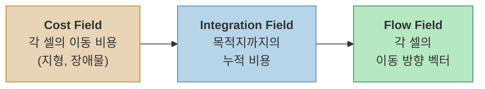
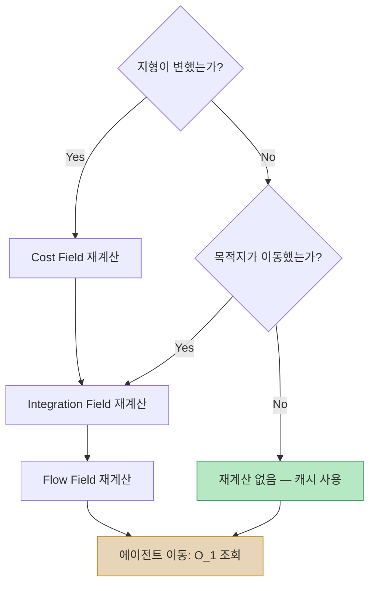

## 서론

3,000마리의 좀비가 플레이어를 향해 몰려온다고 상상해보자. 각 좀비에게 개별 경로를 계산해준다면? A* 하나당 수백~수천 노드를 탐색하고, 그것을 3,000번 반복해야 한다. 프레임은 순식간에 바닥을 친다.

**Flow Field 패스파인딩**은 이 문제를 근본적으로 다른 방식으로 접근한다. 개별 에이전트에게 경로를 주는 대신, **공간 전체에 "어디로 가야 하는지"를 새긴다.** 에이전트는 자신이 서 있는 곳의 방향만 읽으면 된다.

이 포스트에서는 Flow Field의 핵심 개념과 3단계 파이프라인을 다루고, 왜 대규모 군중 시뮬레이션에서 사실상 유일한 선택지인지를 분석한다.

> 아래 영상은 실제 구현 초기 버전으로, 3,000 에이전트가 Flow Field를 통해 실시간으로 플레이어를 추적하는 모습이다. 전체 파이프라인이 Unity Jobs + Burst로 병렬화되어 있다.



---

## Part 1: 전통적 패스파인딩의 한계

### A* 알고리즘 — 빠르지만 스케일하지 않는다

A*는 게임 패스파인딩의 사실상 표준이다. 휴리스틱을 활용해 Dijkstra보다 빠르게 최단 경로를 찾으며, 소수의 에이전트에게는 완벽한 해법이다.

하지만 에이전트 수가 늘어나면 이야기가 달라진다.

#### 에이전트 N개일 때의 비용

A*의 시간 복잡도는 **그리드 크기와 경로 길이에 의존**한다. 일반적으로 $$ O(E \log V) $$ 에서 $$ E $$ 는 탐색한 간선 수, $$ V $$ 는 노드 수다. 문제는 **이것을 에이전트마다 반복**해야 한다는 것이다.

| 에이전트 수 | A* 총 비용 | Flow Field 총 비용 |
|:-----------:|:----------:|:------------------:|
| 1 | $$ O(E \log V) $$ | $$ O(V) $$ |
| 10 | $$ O(10 \cdot E \log V) $$ | $$ O(V) $$ |
| 100 | $$ O(100 \cdot E \log V) $$ | $$ O(V) $$ |
| 3,000 | $$ O(3000 \cdot E \log V) $$ | $$ O(V) $$ |

Flow Field는 **에이전트 수에 무관하게** 전체 그리드를 한 번만 계산한다. 에이전트가 많을수록 A* 대비 이점이 극적으로 커진다.

#### A*의 추가 문제들

- **경로 중복**: 같은 목적지를 향하는 에이전트들이 유사한 경로를 반복 계산
- **동적 장애물**: 환경이 바뀔 때마다 모든 에이전트의 경로를 재계산해야 함
- **메모리**: 에이전트마다 경로 리스트(웨이포인트 배열)를 저장해야 함
- **군중 흐름**: 개별 경로가 자연스러운 군중 흐름을 만들지 못함 (병목 지점에서 겹침)

---

## Part 2: Flow Field의 핵심 아이디어

### "경로"가 아니라 "필드"를 계산한다

A*가 **"출발점 → 도착점"의 경로**를 찾는다면, Flow Field는 **"모든 지점 → 도착점"의 방향**을 계산한다.

비유하자면:

> **A*는 네비게이션** — 출발지마다 경로를 새로 검색해야 한다.
> **Flow Field는 물이 흐르는 지형** — 어디에 물을 떨어뜨려도 자연스럽게 가장 낮은 곳으로 흐른다.

Flow Field가 완성되면, 각 에이전트의 이동은 단순해진다:

```
1. 내가 어떤 셀에 있는지 확인한다
2. 그 셀의 방향 벡터를 읽는다
3. 그 방향으로 이동한다
```

**에이전트당 조회 비용은 $$ O(1) $$** 이다. 3,000마리든 10,000마리든 차이가 없다.

### 3단계 파이프라인

Flow Field는 3개의 독립적인 필드를 순차적으로 계산한다:


_Cost Field → Integration Field (Dijkstra) → Flow Field (방향 벡터). 장애물(검은 사각형) 주변으로 자연스럽게 우회하는 흐름이 생성된다._



각 단계가 독립적이기 때문에:
- **Cost Field**는 지형이 바뀔 때만 재계산 (바리케이드 설치/파괴)
- **Integration Field**는 목적지가 이동할 때만 재계산
- **Flow Field**는 Integration Field가 바뀔 때만 재계산

이 **캐싱 전략**이 Flow Field를 실시간 게임에서 실용적으로 만드는 핵심이다.

---

## Part 3: Cost Field — 세상을 그리드로 표현하기

### 그리드 구조

Cost Field는 게임 월드를 **균일한 정사각 셀**로 분할한 2D 그리드다.

| 파라미터 | 설명 | 일반적인 값 |
|:--------:|:----:|:----------:|
| Cell Size | 셀 한 변의 길이 | 0.5 ~ 2.0 유닛 |
| Grid Width × Height | 그리드 크기 | 200×200 ~ 500×500 |
| 데이터 타입 | 셀당 저장 크기 | `byte` (0~255) |

셀 크기는 **정밀도와 성능의 트레이드오프**다:
- **작은 셀** (0.5): 정밀한 장애물 표현, 계산량 4배 증가
- **큰 셀** (2.0): 빠른 계산, 좁은 통로를 표현하지 못할 수 있음

### 비용 값의 의미

각 셀에 할당되는 비용(cost)은 **"이 셀을 지나가는 것이 얼마나 어려운가"** 를 나타낸다.

| 비용 | 의미 | 예시 |
|:----:|:----:|:----:|
| 1 | 평지 | 도로, 평탄한 지면 |
| 2~4 | 험지 | 진흙, 얕은 물, 완만한 경사 |
| 5~10 | 고비용 지형 | 가파른 경사, 깊은 물 |
| 255 | 통행 불가 | 벽, 건물, 절벽 |

#### 경사도 기반 비용 산출

실제 3D 지형에서는 높이 차이를 비용에 반영해야 한다. 인접 셀 간의 높이 차이 $$ \Delta h $$ 로 경사도를 계산한다:

$$
\text{slope} = \frac{\Delta h}{\text{cellSize}}
$$

이 경사도를 임계값에 따라 비용으로 변환한다:

| 경사도 범위 | 분류 | 추가 비용 |
|:----------:|:----:|:--------:|
| 0 ~ 0.3 | 완만 | +0 |
| 0.3 ~ 0.6 | 보통 | +3 |
| 0.6 ~ 1.0 | 가파름 | +8 |
| 1.0 이상 | 통행 불가 | 255 |

이렇게 하면 에이전트가 **가파른 언덕을 피해 우회**하는 자연스러운 행동이 만들어진다.

### 동적 비용 업데이트

게임 중 환경이 변할 수 있다:
- 바리케이드 설치 → 해당 셀을 255(통행 불가)로 변경
- 바리케이드 파괴 → 원래 비용으로 복원
- 다리 건설 → 물 위 셀의 비용을 1로 변경

Cost Field의 동적 업데이트는 **변경된 셀만** 수정하면 되므로 비용이 매우 낮다. 다만, Cost Field가 바뀌면 Integration Field와 Flow Field를 재계산해야 한다.

---

## Part 4: Integration Field — 목적지까지의 누적 비용

### 개념

Integration Field는 **"이 셀에서 목적지까지 가는 데 드는 총 비용"** 을 모든 셀에 대해 계산한 결과물이다.

계산 방식은 **Dijkstra 알고리즘의 변형**이다. 목적지 셀에서 시작하여, 인접 셀로 비용을 확산시킨다:

```
1. 목적지 셀의 누적 비용 = 0
2. 목적지의 이웃 셀 = 이웃 셀의 cost값
3. 이웃의 이웃 = 이전 누적 비용 + 해당 셀의 cost값
4. 모든 도달 가능한 셀이 채워질 때까지 반복
```

#### 예시: 5×5 그리드

목적지가 좌하단 `(0,0)`이고, 모든 셀의 Cost가 1인 단순한 경우:

```
┌─────┬─────┬─────┬─────┬─────┐
│  4  │  3  │  2  │  3  │  4  │   Integration
│     │     │     │     │     │   Field
├─────┼─────┼─────┼─────┼─────┤
│  3  │  2  │  1  │  2  │  3  │   (목적지로부터의
│     │     │     │     │     │    누적 비용)
├─────┼─────┼─────┼─────┼─────┤
│  2  │  1  │  0  │  1  │  2  │   0 = 목적지
│     │     │     │     │     │
├─────┼─────┼─────┼─────┼─────┤
│  3  │  2  │  1  │  2  │  3  │
│     │     │     │     │     │
├─────┼─────┼─────┼─────┼─────┤
│  4  │  3  │  2  │  3  │  4  │
│     │     │     │     │     │
└─────┴─────┴─────┴─────┴─────┘
```

장애물이 있으면 그 셀을 우회하는 경로의 누적 비용이 반영된다:

```
┌─────┬─────┬─────┬─────┬─────┐
│  6  │  5  │  4  │  3  │  4  │
│     │     │     │     │     │
├─────┼─────┼─────┼─────┼─────┤
│  5  │ ### │ ### │  2  │  3  │   ### = 벽 (255)
│     │     │     │     │     │
├─────┼─────┼─────┼─────┼─────┤
│  4  │ ### │  0  │  1  │  2  │   벽 때문에
│     │     │     │     │     │   좌측 셀들의 비용이
├─────┼─────┼─────┼─────┼─────┤   크게 증가
│  3  │  2  │  1  │  2  │  3  │
│     │     │     │     │     │
├─────┼─────┼─────┼─────┼─────┤
│  4  │  3  │  2  │  3  │  4  │
│     │     │     │     │     │
└─────┴─────┴─────┴─────┴─────┘
```

### Dijkstra vs Dial's Algorithm

표준 Dijkstra는 우선순위 큐(힙)를 사용하며 $$ O(V \log V) $$ 의 복잡도를 가진다. 하지만 Flow Field의 비용이 **정수(byte)** 라는 점을 활용하면 더 빠른 알고리즘을 쓸 수 있다.

**Dial's Algorithm**은 **원형 버킷 큐(Circular Bucket Queue)** 를 사용하는 Dijkstra의 특수화 버전이다:

| | Dijkstra (힙) | Dial's Algorithm |
|:---:|:---:|:---:|
| 자료구조 | 이진 힙 / 피보나치 힙 | 원형 버킷 배열 |
| 삽입 | $$ O(\log V) $$ | $$ O(1) $$ |
| 최솟값 추출 | $$ O(\log V) $$ | $$ O(1) $$ amortized |
| 전체 복잡도 | $$ O(V \log V) $$ | $$ O(V + C) $$ |
| 제약 조건 | 없음 | 간선 가중치가 정수이고 범위가 작아야 함 |

여기서 $$ C $$ 는 최대 간선 가중치다. Cost Field의 비용이 `byte`(0~255)이므로 **Dial's Algorithm이 완벽하게 들어맞는다.** 실제 구현에서는 대각선 비용($$ \times 1.414 $$)까지 고려하여 **362개 버킷**을 사용한다.

#### Dial's Algorithm 동작 원리

```
버킷 배열: [0] [1] [2] [3] ... [C_max]
                ↑
            현재 인덱스

1. 목적지 셀을 버킷[0]에 넣는다
2. 현재 인덱스의 버킷이 빌 때까지:
   a. 셀을 꺼낸다
   b. 8방향 이웃을 검사한다
   c. 새 비용 = 현재 비용 + 이웃의 cost
   d. 이웃을 버킷[새 비용 % 버킷 수]에 넣는다
3. 현재 버킷이 비면 다음 버킷으로 이동
4. 모든 셀이 처리될 때까지 반복
```

힙의 $$ O(\log V) $$ 삽입/추출이 $$ O(1) $$ 로 바뀌므로, 실측에서도 **30~50% 더 빠르다.**

### 대각선 이동 비용

8방향 이동에서 대각선은 직선보다 $$ \sqrt{2} \approx 1.414 $$ 배 먼 거리다. 이를 반영하지 않으면 대각선 이동이 직선과 같은 비용이 되어 부자연스러운 경로가 만들어진다.

$$
\text{cost}\_\text{diagonal} = \text{neighbor cost} \times \lfloor \sqrt{2} \times \text{scale} \rfloor
$$

정수 연산을 유지하기 위해 비용에 스케일 팩터(예: 10)를 곱하는 방식을 많이 사용한다:
- 직선 이동: cost × 10
- 대각선 이동: cost × 14 (≈ 10 × 1.414)

### 다중 목적지 (Multi-Source Seeding)

좀비 서바이벌에서는 목적지가 하나가 아니다. 플레이어, NPC, 거점 등 **여러 목적지가 동시에 존재**한다.

다중 목적지는 간단하게 처리된다:

```
1. 모든 목적지 셀을 버킷[0]에 넣는다 (비용 = 0)
2. 평소대로 Dial's Algorithm 실행
```

결과: 각 셀의 누적 비용은 **가장 가까운 목적지까지의 비용**이 된다. 에이전트는 자연스럽게 가장 가까운 목적지로 향한다. — 이것이 단일 Flow Field로 다중 목적지를 처리하는 방법이다.


_왼쪽: 목적지별 영역 분할 (가장 가까운 목적지 기준). 오른쪽: 통합 Flow Field — 화살표 색상이 가장 가까운 목적지를 나타낸다._

---

## Part 5: Flow Field — 방향 벡터 생성

### Integration Field에서 Flow Field로

Integration Field가 완성되면, Flow Field 계산은 간단하다. 각 셀에서 **가장 낮은 누적 비용을 가진 이웃 방향**을 기록하면 된다:

```
각 셀에 대해:
  1. 8방향 이웃의 Integration 값을 비교
  2. 가장 작은 값을 가진 이웃의 방향을 선택
  3. 방향 벡터를 정규화하여 저장
```

#### 예시: Integration Field → Flow Field

```
Integration Field:          Flow Field (방향):

 4  3  2  3  4              ↘  ↓  ↓  ↓  ↙
 3  2  1  2  3              →  ↘  ↓  ↙  ←
 2  1  0  1  2              →  →  ●  ←  ←
 3  2  1  2  3              →  ↗  ↑  ↖  ←
 4  3  2  3  4              ↗  ↑  ↑  ↑  ↖
```

`●`은 목적지(비용 0)이다. 모든 화살표가 자연스럽게 목적지를 향하고 있다.

### 정규화된 방향 벡터

Flow Field의 각 셀에는 **정규화된 2D 벡터 `(x, y)`** 가 저장된다:

$$
\vec{d} = \text{normalize}(\text{neighbor}\_\text{min} - \text{current})
$$

8방향으로 한정하지 않고 **실수 벡터로 저장**하면, Bilinear Interpolation(이중선형 보간)으로 셀 경계에서 부드러운 이동이 가능해진다.

### 이 단계가 병렬화에 완벽한 이유

Flow Field 계산은 **각 셀이 완전히 독립적**이다. 셀 A의 방향을 계산할 때 셀 B의 결과가 필요하지 않다. 따라서:
- `IJobParallelFor`로 셀 단위 병렬화 가능
- Burst 컴파일로 SIMD 자동 벡터라이징
- GPU 컴퓨트 셰이더로도 구현 가능

반면, Integration Field(Dial's Algorithm)은 순차적 의존성이 있어 단일 스레드로 실행해야 한다. 이것이 **파이프라인을 분리하는 이유** 중 하나다.

---

## Part 6: 에이전트 이동 — O(1) 조회

### 기본 이동

Flow Field가 완성되면, 에이전트의 이동 로직은 극도로 단순하다:

```csharp
// 의사 코드
Vector2 worldPos = agent.position;
int cellX = (int)(worldPos.x / cellSize);
int cellY = (int)(worldPos.y / cellSize);
int index = cellY * gridWidth + cellX;

Vector2 direction = flowField[index];  // O(1) 조회
agent.velocity = direction * speed;
```

**에이전트가 아무리 많아도 이 비용은 변하지 않는다.** Flow Field 계산은 이미 끝나 있고, 에이전트는 배열 조회만 하면 된다.

### Bilinear Interpolation (이중선형 보간)

셀 경계에서 방향이 급격히 바뀌면 에이전트가 지그재그로 움직일 수 있다. 이를 해결하는 것이 **이중선형 보간**이다.

에이전트의 정확한 위치를 기준으로, 인접 4개 셀의 방향 벡터를 가중 평균한다:

$$
\vec{d}\_\text{interpolated} = (1-t_x)(1-t_y)\vec{d}\_{00} + t_x(1-t_y)\vec{d}\_{10} + (1-t_x)t_y\vec{d}\_{01} + t_x \cdot t_y \cdot \vec{d}\_{11}
$$

여기서 $$ t_x, t_y $$ 는 셀 내에서의 상대 위치 (0~1)다.

```
셀 경계에서의 보간 효과:

보간 없음:                보간 있음:
 ↓  ↓  →  →              ↓  ↘  →  →
 ↓  ↓  →  →              ↓  ↘  ↗→ →
 ↓  ↓  →  →              ↓  ↘→ →  →

에이전트 궤적:           에이전트 궤적:
 ┃              ╲
 ┃               ╲
 ┗━━━━━            ╲━━━━
 (꺾임)             (부드러운 곡선)
```

보간을 적용하면 **수천 에이전트가 동시에 이동해도 자연스러운 흐름**이 만들어진다.

---

## Part 7: 성능 분석 — 왜 실시간 게임에서 가능한가

### 메모리 사용량

200×200 그리드 기준:

| 필드 | 셀당 크기 | 전체 크기 |
|:----:|:---------:|:---------:|
| Cost Field | 1 byte | 40 KB |
| Integration Field | 2 bytes (ushort) | 80 KB |
| Flow Field | 8 bytes (float2) | 320 KB |
| **합계** | | **440 KB** |

A*에서 3,000 에이전트에 평균 50 웨이포인트씩 경로를 저장하면: 3,000 × 50 × 8 bytes = **1.2 MB**. Flow Field가 **메모리도 더 적게** 사용한다.

### 계산 시간 (실측 참고)

200×200 그리드, Unity Burst + Jobs 기준:

| 단계 | 병렬화 | 대략적 시간 |
|:----:|:------:|:----------:|
| Cost Field | `IJobParallelFor` | ~0.1ms |
| Integration Field (Dial's) | `IJob` (단일 스레드) | ~0.5ms |
| Flow Field | `IJobParallelFor` | ~0.1ms |
| **합계** | | **~0.7ms** |

그리고 이것은 **목적지가 이동할 때만** 발생한다. 0.5초 간격으로 재계산하면, **초당 2회 × 0.7ms = 1.4ms**만 패스파인딩에 사용된다.

반면, A* 3,000회는 최적화 후에도 **수십ms**가 소요된다.

### 실측 프로파일링 — 20,000 에이전트 스트레스 테스트


_왼쪽: 시스템별 프레임 타임 예산 (16.6ms 기준). 오른쪽: NativeArray 메모리 사용량. Flow Field Jobs 자체는 2ms로 전체의 일부에 불과하다._

실제 프로젝트에서 GPU Instancing + VAT 애니메이션으로 렌더링하며, 20,000 에이전트로 스트레스 테스트한 결과:

| 지표 | 수치 |
|:----:|:----:|
| p50 프레임 타임 | 7.71ms |
| p90 프레임 타임 | 8.34ms |
| p99 프레임 타임 | 9.25ms |
| 60fps 예산 (16.67ms) 대비 | **여유 ~54%** |
| 총 드로우 콜 | 152 |
| 삼각형/프레임 | 41.2M |

20,000 에이전트에서도 p99가 9.25ms로 60fps 예산의 절반 수준이다. 패스파인딩 자체가 병목이 아니라, **에이전트 정렬(NativeArray.Sort)** 이 프레임의 ~36.6%를 차지하는 것으로 식별되었다 — 이 부분은 별도 포스트에서 다룬다.

### 캐싱 전략 정리



대부분의 프레임에서는 **재계산 없이 캐시된 Flow Field를 사용**한다.

---

## 정리: A* vs Flow Field

| 항목 | A* | Flow Field |
|:----:|:--:|:----------:|
| 계산 대상 | 출발→도착 경로 | 전체 공간의 방향 벡터 |
| 에이전트당 비용 | $$ O(E \log V) $$ | $$ O(1) $$ (조회만) |
| N 에이전트 총 비용 | $$ O(N \cdot E \log V) $$ | $$ O(V) $$ (N 무관) |
| 동적 환경 대응 | 모든 에이전트 재계산 | 필드 1회 재계산 |
| 메모리 | 에이전트당 경로 저장 | 그리드 3장 (고정) |
| 이동 품질 | 개별 최적 경로 | 부드러운 군중 흐름 |
| 최적 사용처 | 소수 에이전트, 다양한 목적지 | 다수 에이전트, 공유 목적지 |

**Flow Field가 항상 우월한 것은 아니다.** 에이전트가 10명이고 각자 다른 목적지로 향한다면 A*가 훨씬 효율적이다. Flow Field는 **"많은 에이전트가 적은 수의 목적지를 공유"** 하는 시나리오에서 빛난다 — 좀비 서바이벌이 정확히 이 케이스다.

---

## 다음 포스트 예고

이번 포스트에서는 Flow Field의 개념과 3단계 파이프라인을 다뤘다. 다음 포스트에서는 이 Flow Field를 기반으로 **3,000에서 10,000 에이전트까지 스케일링**하며 적용한 실전 최적화를 다룬다:

- **3K→10K 스케일링** — Burst SortJob, GPU Instancing + VAT, 공간 해싱 분리 스티어링, Tiered LOD, Frustum Culling
- **Dial's Algorithm 심화** — 원형 버킷 큐의 구조와 구현, 362-버킷 시스템, Unity Jobs에서의 실제 구현 패턴
- **Multi-Goal & Layered Flow Field** — 다중 목적지, 레이어 분리 전략, 크로스 플랫폼 벤치마크

---

## 참고 자료

- Emerson, E. (2013). *[Crowd Pathfinding and Steering Using Flow Field Tiles](http://www.gameaipro.com/GameAIPro/GameAIPro_Chapter23_Crowd_Pathfinding_and_Steering_Using_Flow_Field_Tiles.pdf)*. Game AI Pro.
- Pentheny, G. (2013). *[Efficient Crowd Simulation for Mobile Games](http://www.gameaipro.com/GameAIPro/GameAIPro_Chapter22_Efficient_Crowd_Simulation_for_Mobile_Games.pdf)*. Game AI Pro.
- Dial, R.B. (1969). *Algorithm 360: Shortest-path forest with topological ordering*. Communications of the ACM, 12(11).
