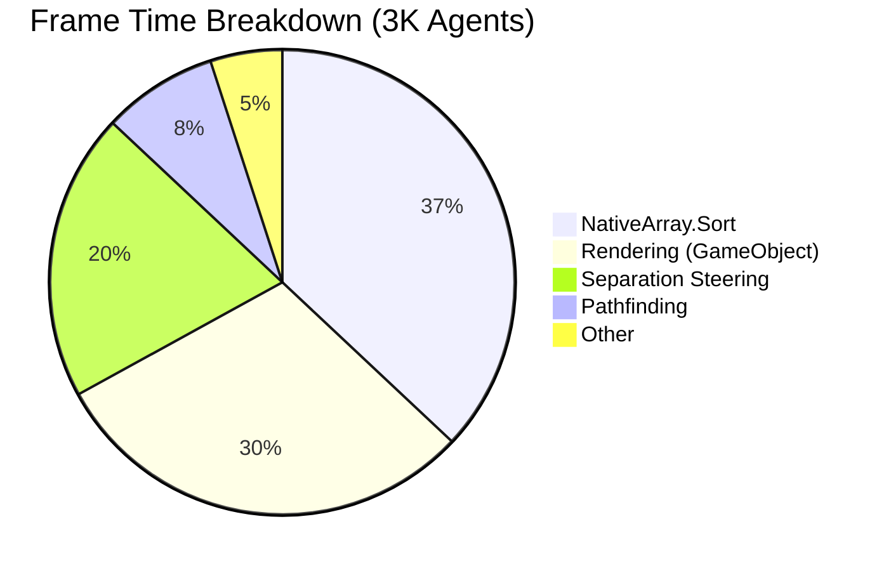
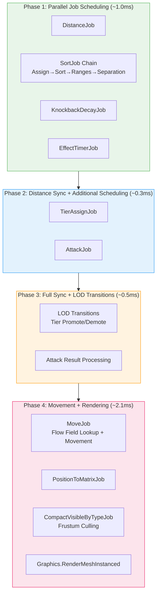
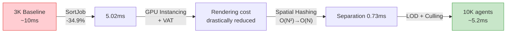

## Introduction

In the [previous post](/posts/FlowFieldPathfinding/), we covered the concept of Flow Field pathfinding and its three-stage pipeline. Since a Flow Field is computed in $$ O(V) $$ regardless of the number of agents, pathfinding itself is not the bottleneck.

So what actually causes frame drops at 3,000 agents? And what needs to change to scale up to 10,000?

In this post, we identify the real bottlenecks through actual profiling data and walk through the five key optimizations that enabled scaling from 3,000 to 10,000 agents.

> The video below demonstrates 10,000 agents running with VAT animations and actual zombie models after all optimizations have been applied.



---

## Part 1: Identifying the Bottlenecks — It Wasn't Pathfinding

### Profiling Results

When analyzing a frame at 3,000 agents with Unity Profiler, the Flow Field pipeline (Cost → Integration → Flow) accounted for **less than 10% of the frame**. The real bottlenecks were somewhere else entirely.

| Bottleneck | Frame Share | Cause |
|:----:|:----------:|:----:|
| NativeArray.Sort | ~37% | Sorting for separation steering blocks the main thread |
| Rendering | ~30% | Component overhead from GameObject-based rendering |
| Separation Calc | ~20% | Agent collision avoidance at $$ O(N^2) $$ |
| Pathfinding | <10% | Flow Field recomputation (already efficient) |



The data tells a clear story: **no matter how much you optimize the pathfinding algorithm, the frame time only improves by 10%.** To achieve real performance gains, you have to tackle the other 90%.

### Deciding the Optimization Order

We prioritized optimizations based on bottleneck share and implementation difficulty:

| Order | Optimization | Expected Impact | Difficulty |
|:----:|:------:|:---------:|:-----:|
| 1 | Burst SortJob | ~37% frame time reduction | One-line change |
| 2 | GPU Instancing + VAT | Massive rendering cost reduction | Shader + architecture change |
| 3 | Spatial Hash Separation | $$ O(N^2) → O(N) $$ | Job pipeline redesign |
| 4 | Tiered LOD | Eliminate unnecessary computation | New system |
| 5 | Frustum Culling | Reduce GPU load | Additional Job |

Start with the least effort for the greatest impact.

---

## Part 2: Burst SortJob — 37% Reduction with a Single Line

### The Problem: Main Thread Blocking

To perform separation steering, agents need to be sorted by cell index. Placing agents in the same cell contiguously in memory speeds up neighbor lookups.

The problem was that `NativeArray.Sort()` runs **synchronously on the main thread**. For 20,000 agents, this sort took **~2.9ms** — a whopping 37% of the total frame time. Meanwhile, 19 Job Worker threads sat idle.

```
[Before] Synchronous sort on the main thread
──────────────────────────────────────────────────
Main Thread: ████ Sort (2.9ms) ████ Separation ████
Worker 1~19: ░░░░░░░░░░░░░░░░ (idle) ░░░░░░░░░░░░░░░░
```

### The Fix: .SortJob()

The Unity Collections package provides a `.SortJob()` extension method for `NativeArray`. Internally, it uses a Burst-compiled merge sort and can be **chained into the Job dependency graph**.

```csharp
// Before: blocks the main thread
_data.CellAgentPairs.Sort(new CellIndexComparer());

// After: Burst SortJob, runs on worker threads
var h2 = _data.CellAgentPairs
    .SortJob(new CellIndexComparer())
    .Schedule(h1);  // Chain to the previous job handle
```

This is a **single-line change**. Replacing `.Sort()` with `.SortJob().Schedule()` moves the sort to a worker thread, freeing the main thread.

```
[After] Async sort on worker threads via Burst SortJob
──────────────────────────────────────────────────
Main Thread: ░░░░░░░░░░░░░░ (free for other work) ░░░░░░░░░░░░░░
Worker 1:    ████ SortJob ████ → Separation ████
```

### The Full Job Chain

The SortJob is phase 2 of a 4-phase separation steering pipeline. The entire chain runs on worker threads in dependency order:

```csharp
// Phase 1: Assign cell index to each agent
var h1 = assignJob.Schedule(_activeCount, 64);

// Phase 2: Sort by cell index (Burst SortJob)
var h2 = _data.CellAgentPairs
    .SortJob(new CellIndexComparer())
    .Schedule(h1);

// Phase 3: Build (start index, count) per cell
var h3 = rangesJob.Schedule(h2);

// Phase 4: Separation using 3×3 neighbor cells
var handle = sepJob.Schedule(_activeCount, 64, h3);
```

The main thread **only schedules this chain and returns immediately**. All actual computation happens on worker threads.

### Results

| Metric | Before | After | Improvement |
|:----:|:------:|:-----:|:----:|
| Total Separation | 3.34ms | 0.73ms | **-78%** |
| p50 Frame Time | 7.71ms | 5.02ms | **-34.9%** |
| Job Worker Utilization | ~0% | 9.0% | — |

A single-line change improved p50 from 7.71ms to 5.02ms. This was the optimization with the **greatest impact for the least effort**.

> **Lesson learned**: The first step of optimization is always profiling. If we had gone with our gut feeling that "pathfinding must be slow," we would have missed the actual bottleneck (Sort).

---

## Part 3: GPU Instancing + VAT — Zero-GameObject Architecture

### The Problem: The Cost of GameObjects

If you create each of the 3,000 zombies as a GameObject:

```
1 zombie = Transform + MeshRenderer + Animator + Collider
→ 3,000 = 12,000+ CPU-side components
→ 10,000 = 40,000+ CPU-side components
```

Transform synchronization, Animator updates, rendering culling — all of this is per-frame cost that the Unity engine must handle. At 10,000, this alone exceeds the frame budget.

### The Fix: Eliminate GameObjects Entirely

**GPU Instancing**: Using `Graphics.RenderMeshInstanced()`, instances sharing the same mesh and material can be rendered in a **single draw call**, up to 1,023 at a time. Transforms are managed as a `NativeArray<float4x4>` matrix array, updated each frame by a Burst Job.

```csharp
// PositionToMatrixJob (Burst compiled, IJobParallelFor)
// Position + velocity direction → TRS matrix conversion
float4x4 matrix = float4x4.TRS(position, rotation, scale);
Matrices[index] = matrix;

// Rendering: batch by type
for (int offset = 0; offset < visibleCount; offset += 1023)
{
    int batchSize = math.min(1023, visibleCount - offset);
    var batch = matrices.GetSubArray(offset, batchSize);
    Graphics.RenderMeshInstanced(renderParams, mesh, 0, batch);
}
```

**VAT (Vertex Animation Texture)**: Plays animations on the GPU without an Animator. The concept is straightforward:

1. Offline, bake **every vertex position for every frame** of the zombie walk animation into a texture
2. At runtime, the shader **samples the texture row corresponding to the current time**
3. The sampled values **deform the vertex positions**

```
Texture layout:
  U axis → vertex index (0 ~ 4,349)
  V axis → frame index (0 ~ 59)

  Each texel = RGBAHalf = (x, y, z) offset of that vertex at that frame
  VRAM cost: ~1MB per clip (4,350 verts × 60 frames × RGBAHalf)
```

### Phase Offset: Preventing Synchronization

A pitfall of VAT is that all zombies play **the same frame at the same time**. Thousands of zombies performing perfectly synchronized dance moves looks unnatural.

The fix is to give each agent a different starting phase using a **hash based on world coordinates**:

```hlsl
// Hash from world XZ coordinates → different starting phase per agent
float phaseOffset = frac(worldPos.x * 0.137 + worldPos.z * 0.241);
float time = (_Time.y * _AnimSpeed + phaseOffset * _AnimLength)
             % _AnimLength;

// Interpolate between adjacent frames → smooth animation
float frameFloat = (time / _AnimLength) * (_FrameCount - 1);
float frame0 = floor(frameFloat);
float frame1 = frame0 + 1;
float blend = frameFloat - frame0;
```

This produces naturally desynchronized animations **without passing any additional per-instance data** — using only position.

### Root Motion Stripping

If root motion is included in the VAT, the zombie walks away in shader space instead of staying in place. To prevent this, we **strip the XZ offset of vertex 0 (the root bone)**:

```hlsl
if (_StripRootMotion > 0.5)
{
    // Sample root bone (vertex 0) XZ offset
    float2 rootUV0 = float2(0.5 / _TexWidth, v0);
    float3 rootOffset0 = tex2Dlod(_VATPosTex, float4(rootUV0, 0, 0)).xyz;
    // Remove root's XZ movement from the current vertex
    offset0.xz -= rootOffset0.xz;
}
```

### Before vs After

```
[Before] GameObject-based
───────────────────────────────────
CPU: Transform × 10K + Animator × 10K + MeshRenderer × 10K
GPU: 10,000 draw calls (no batching)
→ Physically impossible

[After] NativeArray + GPU Instancing + VAT
───────────────────────────────────
CPU: NativeArray<float4x4> update (Burst Job)
GPU: ~58 draw calls (batched at 1,023 each)
→ 10,000 agents @ 60fps
```

---

## Part 4: Spatial Hash Separation Steering — O(N²) → O(N)

### The Problem: N² Comparisons

Separation Steering calculates a repulsion force to prevent agents from overlapping. A naive implementation compares **every pair of agents**:

$$
\text{Comparisons} = \frac{N(N-1)}{2}
$$

| Agent Count | Comparisons |
|:----------:|:---------:|
| 1,000 | 499,500 |
| 3,000 | 4,498,500 |
| 10,000 | **49,995,000** |

At 10,000 agents, that is **50 million** distance calculations per frame. Even Burst-compiled, this scale is unmanageable.

### The Fix: Cell-Based Spatial Hashing

The key idea is to **only compare nearby agents**. Since the Flow Field already uses a grid, we reuse the same grid structure.


#### Step 1: AssignCellsJob

Convert each agent's world position to a grid cell index.

```csharp
// (position.x, position.z) → (cellX, cellZ) → 1D index
int cellX = (int)(position.x / cellSize);
int cellZ = (int)(position.z / cellSize);
int cellIndex = cellZ * gridWidth + cellX;

CellAgentPairs[i] = new int2(cellIndex, agentIndex);
```

#### Step 2: SortJob

Sorting by cell index places **agents in the same cell contiguously** in the array:

```
Before sorting: [(5,A), (2,B), (5,C), (2,D), (3,E)]
After sorting:  [(2,B), (2,D), (3,E), (5,A), (5,C)]
                  ▲ Cell 2 ▲       ▲Cell3▲  ▲ Cell 5 ▲
```

This is the Burst SortJob we covered in Part 2.

#### Step 3: BuildCellRangesJob

A single pass through the sorted array records the `(start index, count)` for each cell:

```csharp
CellRanges[cellIndex] = new int2(startIndex, count);
// Example: CellRanges[2] = (0, 2)  → 2 entries starting at index 0
//          CellRanges[3] = (2, 1)  → 1 entry starting at index 2
//          CellRanges[5] = (3, 2)  → 2 entries starting at index 3
```

#### Step 4: ComputeSeparationJob

Each agent checks only **its own cell plus the 8 surrounding cells — a 3×3 neighborhood**:

```csharp
for (int dx = -1; dx <= 1; dx++)
    for (int dz = -1; dz <= 1; dz++)
    {
        int2 checkCell = myCell + new int2(dx, dz);
        int cellIdx = CellToIndex(checkCell);
        int2 range = CellRanges[cellIdx];  // O(1) lookup
        
        for (int k = range.x; k < range.x + range.y; k++)
        {
            int otherIdx = SortedPairs[k].y;
            float3 diff = myPos - Positions[otherIdx];
            float dist = math.length(diff);
            
            if (dist > 0 && dist < radius)
            {
                // Quadratic falloff: stronger push at closer range
                float strength = (1 - dist / radius);
                strength *= strength;
                force += math.normalize(diff) * strength;
            }
        }
    }
```

### Why O(N)?

- Cells checked per agent: always **9** (3×3)
- Agents per cell: varies by density, measured average of **5–15**
- Comparisons per agent: 9 × average density = **effectively constant**
- Total comparisons: $$ O(N \times \text{const}) = O(N) $$

| | Naive | Spatial Hashing |
|:---:|:---:|:---:|
| 10,000 agents | 49,995,000 comparisons | ~90,000–150,000 comparisons |
| Complexity | $$ O(N^2) $$ | $$ O(N) $$ |

Bonus: thanks to the sorted array, agents in the same cell are **contiguous in memory**. CPU cache lines are utilized efficiently, yielding performance gains beyond the raw comparison count reduction.

---

## Part 5: Tiered LOD — Distance-Based Quality Scaling

### The Idea

There is no need to run Rigidbody physics and an Animator on a zombie that appears as a dot in the corner of the screen. We apply **different processing levels based on distance** from the player.


_Left: Tier thresholds by distance with hysteresis (Promote 20m / Demote 25m). Right: CPU cost vs. agent count per tier — Tier 0 has 3,500 agents but costs only 0.5ms; Tier 2 has just 200 agents but costs 2.5ms._

| Tier | Distance | Representation | Physics | Animation |
|:----:|:----:|:----:|:----:|:----------:|
| **Tier 0** | > 50m | NativeArray + GPU Instancing | None | VAT (GPU) |
| **Tier 1** | 25–50m | NativeArray + GPU Instancing | None | VAT (GPU) |
| **Tier 2** | < 20m | GameObject + Rigidbody | MovePosition | Animator (planned) |

Tier 0/1 are **pure data**. Only position and velocity stored in `NativeArray`, rendered via GPU Instancing. The CPU cost is limited to the Move Job and Matrix Job.

Only Tier 2 uses GameObjects — these are full-spec zombies capable of close-quarters combat with the player. Capped at 300 concurrent instances.

### Hysteresis: Preventing Boundary Jitter

The promote distance (20m) and demote distance (25m) are intentionally different. This 5m gap **prevents the tier from toggling back and forth** at the boundary.

```
Distance: 0m ────── 20m ──── 25m ──── 50m ──── 55m ────→
          │  Tier 2  │ Gap(5m)│  Tier 1  │ Gap(5m)│ Tier 0
          │          │        │          │        │
          └─ Promote ┘        │          └─ Promote┘
                 └─── Demote ─┘                └─── Demote ─┘
```

### Per-Frame Transition Limit

If 100 zombies cross the 20m line simultaneously, you would need to instantiate 100 GameObjects in a single frame. To prevent this, transitions are capped at **10 per frame**:

```csharp
[SerializeField] private int _maxPromotionsPerFrame = 10;
[SerializeField] private int _maxDemotionsPerFrame = 10;
```

The rest carry over to the next frame. To the player, the transition happens naturally over 10 frames (~167ms).

---

## Part 6: Frustum Culling — Don't Draw What You Can't See

Sending off-screen zombies to the GPU is pure waste. A Burst-compiled `CompactVisibleByTypeJob` handles this every frame.

### How It Works

1. Extract the camera's **6 frustum planes** (top/bottom/left/right/near/far)
2. Test each agent's **AABB (Axis-Aligned Bounding Box)** against the 6 planes
3. **Compact only agents inside all planes** into the output array

```csharp
// 6-plane test
bool visible = true;
for (int p = 0; p < 6; p++)
{
    float4 plane = FrustumPlanes[p];
    float dist = math.dot(plane.xyz, center) + plane.w;
    float radius = math.dot(math.abs(plane.xyz), extents);
    if (dist + radius < 0f)
    {
        visible = false;
        break;  // Fail fast if outside any plane
    }
}
```

### Per-Type Compaction

Since zombie types (Fast/Slow) use different meshes and materials, visible zombies are compacted separately by type:

```
Output array layout:
[Type 0 matrices: 0 ~ Capacity-1]
[Type 1 matrices: Capacity ~ 2×Capacity-1]

Actual counts per type recorded in VisibleCounts
→ At render time, issue draw calls for exactly the right count per type
```

If the camera shows only 1/4 of the map, rendering cost drops to **roughly 1/4**.

---

## Part 7: SoA Data Layout — The Memory Structure Burst Loves

### AoS vs SoA

The traditional OOP approach uses **AoS (Array of Structures)**:

```csharp
// AoS: all data for one zombie is contiguous
struct Zombie {
    float3 Position;    // 12B
    float3 Velocity;    // 12B
    float Health;       // 4B
    byte State;         // 1B
    byte Tier;          // 1B
    // ... ~80B total per zombie
}
Zombie[] zombies = new Zombie[10000];
```

**SoA (Structure of Arrays)** stores **the same field across all entities contiguously**:

```csharp
// SoA: same type of data is contiguous
NativeArray<float3> Positions;     // 10K × 12B = 120KB (contiguous)
NativeArray<float3> Velocities;    // 10K × 12B = 120KB (contiguous)
NativeArray<float> Healths;        // 10K × 4B  = 40KB  (contiguous)
NativeArray<byte> States;          // 10K × 1B  = 10KB  (contiguous)
NativeArray<byte> AiTiers;         // 10K × 1B  = 10KB  (contiguous)
```

### Why SoA Is Faster

When the Move Job updates positions, it **sequentially accesses only the Positions array**:

```
[AoS] Reading Positions — only 12B useful per 80B stride
┌─────────────────────────────────────────────────┐
│ Pos₀ Vel₀ HP₀ ... │ Pos₁ Vel₁ HP₁ ... │ Pos₂  │
│ ████ ░░░░░░░░░░░░░ │ ████ ░░░░░░░░░░░░░ │ ████  │
└─────────────────────────────────────────────────┘
  64B cache line → 12B used → 15% efficiency

[SoA] Positions array — contiguous 12B packed with no gaps
┌─────────────────────────────────────────────────┐
│ Pos₀ │ Pos₁ │ Pos₂ │ Pos₃ │ Pos₄ │ Pos₅ │ ... │
│ ████ │ ████ │ ████ │ ████ │ ████ │ ████ │ ... │
└─────────────────────────────────────────────────┘
  64B cache line → 60B used → 93% efficiency
```

Additionally, when the Burst compiler detects an SoA layout, it applies **SIMD (SSE/AVX) auto-vectorization**. Processing 4 `float3` values at once yields a theoretical 4x speedup.

In the actual project, zombie data is managed across 17 NativeArrays. Position, Velocity, Health, State, Tier, Type, Matrix, and more — **each Job selectively accesses only the arrays it needs**, maximizing cache efficiency.

---

## Part 8: The Full Frame Pipeline

Here is the frame pipeline with all optimizations applied. Each phase depends on the results of the previous phase, and we **schedule as much as possible in parallel**:



**Core principle**: The main thread handles **only scheduling and synchronization**. All actual computation runs on Burst-compiled worker threads.

---

## Final Results

### Profiling Comparison

| Metric | 3K (Before Opt.) | 10K (After Opt.) | 20K (Stress Test) |
|:----:|:-------------:|:--------------:|:-------------------:|
| p50 Frame Time | ~10ms | ~5.2ms | 7.71ms |
| Rendering | Debug capsules | GPU Instancing + VAT | GPU Instancing + VAT |
| Separation Steering | ~3.3ms | ~0.73ms | ~0.73ms |
| Draw Calls | - | 58 (batched) | 152 |
| Triangles/Frame | - | - | 41.2M |
| Job Worker Utilization | ~0% | ~9% | ~3.6% |

10,000 agents actually have a **lower per-agent frame cost** than 3,000. This is the result of eliminating bottlenecks and redesigning the pipeline around data-oriented principles.

### Per-Optimization Contribution



### Remaining Challenges

The optimizations covered in this post achieved 10,000 agents at 60fps, but we didn't stop here. Upcoming posts will cover:

- **Multi-Goal & Layered Flow Field** — More complex AI behaviors with multiple destinations and layer separation
- **Cross-Platform Benchmarks** — Optimization results on Apple Silicon (M4/M4 Pro)

---

## References

- Unity Technologies. *[Burst User Guide](https://docs.unity3d.com/Packages/com.unity.burst@latest)*. Unity Documentation.
- Unity Technologies. *[NativeArray.SortJob](https://docs.unity3d.com/Packages/com.unity.collections@latest)*. Unity Collections Package.
- Framebuffer. (2018). *[Spatial Hashing](https://www.gamedev.net/tutorials/programming/general-and-gameplay-programming/spatial-hashing-r2697/)*. GameDev.net.
- Reynolds, C. (1999). *[Steering Behaviors For Autonomous Characters](http://www.red3d.com/cwr/steer/)*. GDC Proceedings.
