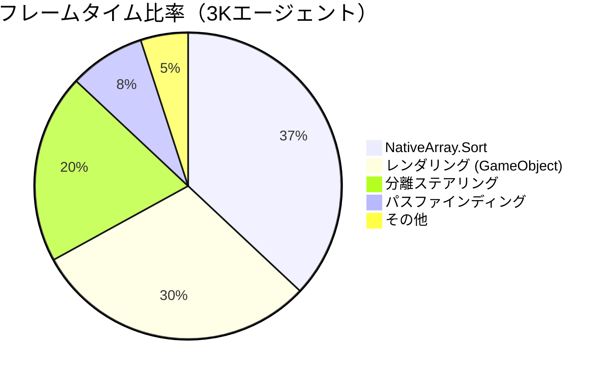
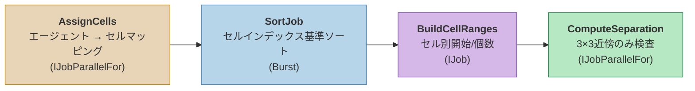
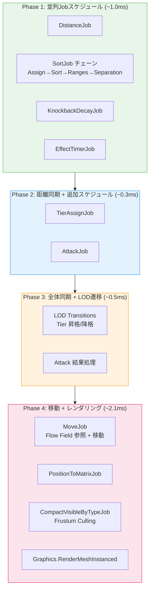
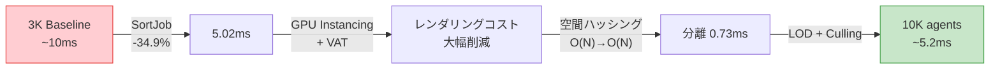

## はじめに

[前回の記事](/posts/FlowFieldPathfinding/)では、Flow Fieldパスファインディングの概念と3段階パイプラインを解説した。Flow Fieldはエージェント数に関係なく $$ O(V) $$ で計算されるため、パスファインディング自体はボトルネックではない。

では、3,000エージェントでフレームレートが低下する原因は何か？そして10,000エージェントまでスケールアップするには何を変える必要があるのか？

この記事では、実際のプロファイリングデータに基づいてボトルネックを特定し、5つの主要な最適化を適用して3,000 → 10,000エージェントまでスケーリングした過程を解説する。

> 以下の動画は、すべての最適化適用後、VATアニメーションと実際のゾンビモデルで10,000エージェントが動作するデモだ。



---

## Part 1: ボトルネックの特定 — パスファインディングではなかった

### プロファイリング結果

3,000エージェントでUnity Profilerによりフレームを分析した結果、Flow Fieldパイプライン（Cost → Integration → Flow）は**フレームの10%未満**だった。本当のボトルネックは全く別の場所にあった。

| ボトルネック | フレーム比率 | 原因 |
|:----:|:----------:|:----:|
| NativeArray.Sort | ~37% | 分離ステアリング用ソートがメインスレッドをブロッキング |
| レンダリング | ~30% | GameObjectベースレンダリングのコンポーネントオーバーヘッド |
| 分離計算 | ~20% | エージェント間衝突回避 $$ O(N^2) $$ 演算 |
| パスファインディング | <10% | Flow Field再計算（既に効率的） |



このデータが示すことは明確だ。**パスファインディングアルゴリズムをどれだけ改善してもフレームは10%しか改善しない。**本当の性能向上には残りの90%を攻略する必要がある。

### 最適化の順序決定

ボトルネックの比率と実装難易度を基準に最適化順序を決定した：

| 順序 | 最適化 | 予想効果 | 難易度 |
|:----:|:------:|:---------:|:-----:|
| 1 | Burst SortJob | フレーム ~37% 削減 | 一行変更 |
| 2 | GPU Instancing + VAT | レンダリングコスト大幅削減 | シェーダー + アーキテクチャ変更 |
| 3 | 空間ハッシング分離ステアリング | $$ O(N^2) → O(N) $$ | Jobパイプライン再設計 |
| 4 | Tiered LOD | 不要な演算の排除 | システム追加 |
| 5 | Frustum Culling | GPU負荷削減 | Job追加 |

最も少ない労力で最大の効果が得られるものから適用する。

---

## Part 2: Burst SortJob — 一行で37%削減

### 問題：メインスレッドのブロッキング

分離ステアリングのためにエージェントをセルインデックス基準でソートする必要がある。同じセルのエージェントをメモリ上で連続配置することで、近傍検索が高速化されるためだ。

問題は`NativeArray.Sort()`が**メインスレッドで同期的に実行される**ことだった。20,000エージェント基準でこのソートに**~2.9ms**かかっており、これは全フレームタイムの37%に相当した。その間、19個のJob Workerスレッドはアイドル状態だった。

```
[Before] メインスレッドでの同期ソート
──────────────────────────────────────────────────
Main Thread: ████ Sort (2.9ms) ████ Separation ████
Worker 1~19: ░░░░░░░░░░░░░░░░ (待機) ░░░░░░░░░░░░░░░░
```

### 解決策：.SortJob()

Unity Collectionsパッケージは`NativeArray`に`.SortJob()`拡張メソッドを提供している。これは内部的にBurstコンパイルされたMerge Sortを使用し、**Jobチェーンに組み込む**ことができる。

```csharp
// Before: メインスレッドブロッキング
_data.CellAgentPairs.Sort(new CellIndexComparer());

// After: Burst SortJob、ワーカースレッドで実行
var h2 = _data.CellAgentPairs
    .SortJob(new CellIndexComparer())
    .Schedule(h1);  // 前のJobハンドルにチェイニング
```

**一行の変更**だ。`.Sort()`を`.SortJob().Schedule()`に置き換えれば、ソートがワーカースレッドに移動し、メインスレッドは解放される。

```
[After] Burst SortJobによるワーカースレッドでの非同期ソート
──────────────────────────────────────────────────
Main Thread: ░░░░░░░░░░░░░░ (他の処理を実行) ░░░░░░░░░░░░░░
Worker 1:    ████ SortJob ████ → Separation ████
```

### 全体のJobチェーン

SortJobは分離ステアリングパイプラインの4段階中2段階目に該当する。チェーン全体がワーカースレッドで依存関係の順序に従って実行される：

```csharp
// Phase 1: 各エージェントのセルインデックス割り当て
var h1 = assignJob.Schedule(_activeCount, 64);

// Phase 2: セルインデックス基準ソート（Burst SortJob）
var h2 = _data.CellAgentPairs
    .SortJob(new CellIndexComparer())
    .Schedule(h1);

// Phase 3: セル別（開始インデックス、個数）構築
var h3 = rangesJob.Schedule(h2);

// Phase 4: 3×3近傍セルベースの分離計算
var handle = sepJob.Schedule(_activeCount, 64, h3);
```

メインスレッドはこのチェーンを**スケジュールするだけで即座にリターン**する。実際の演算はすべてワーカースレッドで行われる。

### 結果

| 指標 | Before | After | 改善 |
|:----:|:------:|:-----:|:----:|
| Separation全体 | 3.34ms | 0.73ms | **-78%** |
| p50フレームタイム | 7.71ms | 5.02ms | **-34.9%** |
| Job Worker稼働率 | ~0% | 9.0% | — |

一行の変更でp50が7.71ms → 5.02msに改善された。**最小の労力で最大の効果**を得た最適化だ。

> **教訓**：最適化の第一歩は常にプロファイリングだ。直感で「パスファインディングが遅いはず」と思い込んでいたら、実際のボトルネック（Sort）を見逃していただろう。

---

## Part 3: GPU Instancing + VAT — Zero-GameObjectアーキテクチャ

### 問題：GameObjectのコスト

3,000体のゾンビをそれぞれGameObjectとして生成すると：

```
ゾンビ1体 = Transform + MeshRenderer + Animator + Collider
→ 3,000体 = CPU側コンポーネント12,000個以上
→ 10,000体 = CPU側コンポーネント40,000個以上
```

Transform同期、Animator更新、レンダリングカリング — すべてUnityエンジンが毎フレーム処理するコストだ。10,000体ではこれだけでフレーム予算を超過する。

### 解決策：GameObjectを排除する

**GPU Instancing**：`Graphics.RenderMeshInstanced()`を使用すれば、同じメッシュ+マテリアルを共有するインスタンスを**単一ドローコール**で最大1,023個までレンダリングできる。Transformは`NativeArray<float4x4>`マトリックス配列で管理し、Burst Jobが毎フレーム更新する。

```csharp
// PositionToMatrixJob（Burstコンパイル、IJobParallelFor）
// 位置 + 速度方向 → TRSマトリックス変換
float4x4 matrix = float4x4.TRS(position, rotation, scale);
Matrices[index] = matrix;

// レンダリング：タイプ別にバッチ分割
for (int offset = 0; offset < visibleCount; offset += 1023)
{
    int batchSize = math.min(1023, visibleCount - offset);
    var batch = matrices.GetSubArray(offset, batchSize);
    Graphics.RenderMeshInstanced(renderParams, mesh, 0, batch);
}
```

**VAT (Vertex Animation Texture)**：Animatorなしでgpu上でアニメーションを再生する。原理はシンプルだ：

1. オフラインでゾンビの歩行アニメーションの**全フレーム、全頂点位置**をテクスチャに保存
2. ランタイムにシェーダーが**現在の時刻に対応するテクスチャ行**をサンプリング
3. サンプリングした値で**頂点位置を変形**

```
テクスチャレイアウト：
  U軸 → 頂点インデックス (0 ~ 4,349)
  V軸 → フレームインデックス (0 ~ 59)

  各テクセル = RGBAHalf = 該当フレームにおける該当頂点の (x, y, z) オフセット
  VRAMコスト：~1MB per クリップ (4,350 verts × 60 frames × RGBAHalf)
```

### 位相オフセット：同期の回避

VATの落とし穴は、すべてのゾンビが**同じタイミングで同じフレーム**を再生することだ。数千体が完璧に同期した群舞を踊ると不自然になる。

解決策は**ワールド座標ベースのハッシュ**でエージェントごとに開始位相をずらすことだ：

```hlsl
// ワールドXZ座標でハッシュ → エージェントごとに異なる開始位相
float phaseOffset = frac(worldPos.x * 0.137 + worldPos.z * 0.241);
float time = (_Time.y * _AnimSpeed + phaseOffset * _AnimLength)
             % _AnimLength;

// 隣接フレーム補間 → 滑らかなアニメーション
float frameFloat = (time / _AnimLength) * (_FrameCount - 1);
float frame0 = floor(frameFloat);
float frame1 = frame0 + 1;
float blend = frameFloat - frame0;
```

このコードで**インスタンスごとの追加データ転送なしに**、位置だけで自然な非同期アニメーションが実現できる。

### ルートモーションのストリッピング

VATにルートモーションが含まれると、ゾンビが定位置で移動する代わりにシェーダー空間で歩き去ってしまう。これを防ぐために**頂点0（ルートボーン）のXZオフセットを除去**する：

```hlsl
if (_StripRootMotion > 0.5)
{
    // ルートボーン（vertex 0）のXZオフセットをサンプリング
    float2 rootUV0 = float2(0.5 / _TexWidth, v0);
    float3 rootOffset0 = tex2Dlod(_VATPosTex, float4(rootUV0, 0, 0)).xyz;
    // 現在の頂点からルートのXZ移動分を除去
    offset0.xz -= rootOffset0.xz;
}
```

### Before vs After

```
[Before] GameObjectベース
───────────────────────────────────
CPU: Transform × 10K + Animator × 10K + MeshRenderer × 10K
GPU: 10,000ドローコール（バッチングなし）
→ 物理的に不可能

[After] NativeArray + GPU Instancing + VAT
───────────────────────────────────
CPU: NativeArray<float4x4> 更新（Burst Job）
GPU: ~58ドローコール（1,023個ずつバッチング）
→ 10,000エージェント @ 60fps
```

---

## Part 4: 空間ハッシング分離ステアリング — O(N²) → O(N)

### 問題：N²比較

分離ステアリング（Separation Steering）は、エージェントが互いに重ならないよう押し出す力を計算する。素朴な実装は**全エージェントペア**を比較する：

$$
\text{比較回数} = \frac{N(N-1)}{2}
$$

| エージェント数 | 比較回数 |
|:----------:|:---------:|
| 1,000 | 499,500 |
| 3,000 | 4,498,500 |
| 10,000 | **49,995,000** |

10,000エージェントでは毎フレーム**5,000万回**の距離計算が必要になる。Burstでコンパイルしてもこの規模は処理しきれない。

### 解決策：セルベース空間ハッシング

核心となるアイデアは**近くのエージェントだけを比較する**ことだ。Flow Fieldが既にグリッドを使用しているため、同じグリッド構造を再利用する。



#### Step 1: AssignCellsJob

各エージェントのワールド座標をグリッドセルインデックスに変換する。

```csharp
// (position.x, position.z) → (cellX, cellZ) → 1Dインデックス
int cellX = (int)(position.x / cellSize);
int cellZ = (int)(position.z / cellSize);
int cellIndex = cellZ * gridWidth + cellX;

CellAgentPairs[i] = new int2(cellIndex, agentIndex);
```

#### Step 2: SortJob

セルインデックス基準でソートすると、**同じセルのエージェントが配列内で連続**して配置される：

```
ソート前: [(5,A), (2,B), (5,C), (2,D), (3,E)]
ソート後: [(2,B), (2,D), (3,E), (5,A), (5,C)]
              ▲ セル2 ▲         ▲セル3▲   ▲ セル5 ▲
```

これがPart 2で解説したBurst SortJobだ。

#### Step 3: BuildCellRangesJob

ソート済み配列を一度走査し、各セルの`(開始インデックス、個数)`を記録する：

```csharp
CellRanges[cellIndex] = new int2(startIndex, count);
// 例: CellRanges[2] = (0, 2)  → インデックス0から2個
//     CellRanges[3] = (2, 1)  → インデックス2から1個
//     CellRanges[5] = (3, 2)  → インデックス3から2個
```

#### Step 4: ComputeSeparationJob

各エージェントは**自身のセル + 周囲8セル = 3×3範囲**のみを検査する：

```csharp
for (int dx = -1; dx <= 1; dx++)
    for (int dz = -1; dz <= 1; dz++)
    {
        int2 checkCell = myCell + new int2(dx, dz);
        int cellIdx = CellToIndex(checkCell);
        int2 range = CellRanges[cellIdx];  // O(1) ルックアップ
        
        for (int k = range.x; k < range.x + range.y; k++)
        {
            int otherIdx = SortedPairs[k].y;
            float3 diff = myPos - Positions[otherIdx];
            float dist = math.length(diff);
            
            if (dist > 0 && dist < radius)
            {
                // 二次減衰：近いほど強く押し出す
                float strength = (1 - dist / radius);
                strength *= strength;
                force += math.normalize(diff) * strength;
            }
        }
    }
```

### なぜO(N)なのか

- 各エージェントが検査するセル：常に**9個**（3×3）
- セルあたりのエージェント数：密度により異なるが、実測平均**5~15個**
- エージェントあたりの比較回数：9 × 平均密度 = **定数に近い**
- 全体の比較回数：$$ O(N \times \text{const}) = O(N) $$

| | 素朴な実装 | 空間ハッシング |
|:---:|:---:|:---:|
| 10,000エージェント | 49,995,000比較 | ~90,000~150,000比較 |
| 計算量 | $$ O(N^2) $$ | $$ O(N) $$ |

追加の利点：ソート済み配列のおかげで、同じセルのエージェントが**メモリ上で連続**配置される。CPUキャッシュラインが効率的に活用され、単純な比較回数以上の性能向上が得られる。

---

## Part 5: Tiered LOD — 距離ベースの品質差別化

### アイデア

画面の隅で点のようにしか見えないゾンビにRigidbody物理とAnimatorを動かす必要はない。プレイヤーとの**距離に応じて処理レベルを差別化**する。


_左：距離別Tier区間とヒステリシス（Promote 20m / Demote 25m）。右：Tier別エージェント数対CPUコスト — Tier 0が3,500体だが0.5ms、Tier 2は200体で2.5ms。_

| Tier | 距離 | 表現 | 物理 | アニメーション |
|:----:|:----:|:----:|:----:|:----------:|
| **Tier 0** | > 50m | NativeArray + GPU Instancing | なし | VAT (GPU) |
| **Tier 1** | 25~50m | NativeArray + GPU Instancing | なし | VAT (GPU) |
| **Tier 2** | < 20m | GameObject + Rigidbody | MovePosition | Animator（予定） |

Tier 0/1は**純粋なデータ**だ。`NativeArray`に位置/速度のみ格納し、GPU Instancingでレンダリングする。CPUコストはMove JobとMatrix Jobだけだ。

Tier 2のみGameObjectを使用し、プレイヤーとの近接戦闘が可能なフルスペックゾンビだ。同時最大300体に制限する。

### ヒステリシス：境界での振動防止

昇格距離（20m）と降格距離（25m）を異なる値に設定する。この5mのギャップが**境界線でTierが繰り返し切り替わること**を防止する。

```
距離:  0m ────── 20m ──── 25m ──── 50m ──── 55m ────→
       │  Tier 2  │ ギャップ(5m) │  Tier 1  │ ギャップ(5m) │ Tier 0
       │          │        │          │        │
       └─ 昇格 ───┘        │          └─ 昇格 ──┘
              └─── 降格 ───┘                └─── 降格 ───┘
```

### フレームあたりの遷移制限

100体が同時に20mラインを越えると、1フレームで100個のGameObjectを生成しなければならない。これを防ぐために**フレームあたり最大10個**に遷移を制限する：

```csharp
[SerializeField] private int _maxPromotionsPerFrame = 10;
[SerializeField] private int _maxDemotionsPerFrame = 10;
```

残りは次フレームに繰り越される。プレイヤーの体感では10フレーム（~167ms）かけて自然に遷移する。

---

## Part 6: Frustum Culling — 見えないものは描画しない

カメラ外のゾンビをGPUに送るのは純粋な無駄だ。BurstコンパイルされたCompactVisibleByTypeJobが毎フレーム処理する。

### 動作方式

1. カメラの**視錐台6平面**（上/下/左/右/近/遠）を抽出
2. 各エージェントの**AABB（軸平行バウンディングボックス）**と6平面をテスト
3. **すべての平面の内側**にあるエージェントのみ出力配列にコンパクト化

```csharp
// 6平面テスト
bool visible = true;
for (int p = 0; p < 6; p++)
{
    float4 plane = FrustumPlanes[p];
    float dist = math.dot(plane.xyz, center) + plane.w;
    float radius = math.dot(math.abs(plane.xyz), extents);
    if (dist + radius < 0f)
    {
        visible = false;
        break;  // 1つでも外なら即座に除外
    }
}
```

### タイプ別分離コンパクト化

ゾンビタイプ（Fast/Slow）別に異なるメッシュとマテリアルを使用するため、可視ゾンビをタイプ別に分離コンパクト化する：

```
出力配列レイアウト：
[Type 0 マトリックス: 0 ~ Capacity-1]
[Type 1 マトリックス: Capacity ~ 2×Capacity-1]

各タイプの実数をVisibleCountsに記録
→ レンダリング時にタイプ別に正確な個数分だけドローコールを発行
```

カメラがマップ全体の1/4だけを映している場合、レンダリングコストも**~1/4に減少**する。

---

## Part 7: SoAデータレイアウト — Burstが好むメモリ構造

### AoS vs SoA

従来のOOP方式は**AoS（Array of Structures）**だ：

```csharp
// AoS: ゾンビ1体のすべてのデータが連続
struct Zombie {
    float3 Position;    // 12B
    float3 Velocity;    // 12B
    float Health;       // 4B
    byte State;         // 1B
    byte Tier;          // 1B
    // ... 合計 ~80B per zombie
}
Zombie[] zombies = new Zombie[10000];
```

**SoA（Structure of Arrays）**は**同じフィールドをまとめて**格納する：

```csharp
// SoA: 同じ種類のデータが連続
NativeArray<float3> Positions;     // 10K × 12B = 120KB（連続）
NativeArray<float3> Velocities;    // 10K × 12B = 120KB（連続）
NativeArray<float> Healths;        // 10K × 4B  = 40KB （連続）
NativeArray<byte> States;          // 10K × 1B  = 10KB （連続）
NativeArray<byte> AiTiers;         // 10K × 1B  = 10KB （連続）
```

### なぜSoAが速いのか

Move Jobが位置を更新する際、**Positions配列のみを逐次アクセス**する：

```
[AoS] Positionsを読む時 — 80Bごとに12Bだけ有効
┌─────────────────────────────────────────────────┐
│ Pos₀ Vel₀ HP₀ ... │ Pos₁ Vel₁ HP₁ ... │ Pos₂  │
│ ████ ░░░░░░░░░░░░░ │ ████ ░░░░░░░░░░░░░ │ ████  │
└─────────────────────────────────────────────────┘
  キャッシュライン64B中12Bのみ使用 → 効率15%

[SoA] Positions配列 — 連続する12Bが隙間なく並ぶ
┌─────────────────────────────────────────────────┐
│ Pos₀ │ Pos₁ │ Pos₂ │ Pos₃ │ Pos₄ │ Pos₅ │ ... │
│ ████ │ ████ │ ████ │ ████ │ ████ │ ████ │ ... │
└─────────────────────────────────────────────────┘
  キャッシュライン64B中60B使用 → 効率93%
```

さらにBurstコンパイラがSoAレイアウトを検出すると、**SIMD（SSE/AVX）の自動ベクトライゼーション**を適用する。`float3`を4つ同時に処理するため、理論上4倍高速になる。

実際のプロジェクトでは17個のNativeArrayでゾンビデータを管理している。Position、Velocity、Health、State、Tier、Type、Matrixなど、**各Jobが必要な配列のみ選択的にアクセス**し、キャッシュ効率を最大化している。

---

## Part 8: 全体フレームパイプライン

すべての最適化が適用された後のフレームパイプラインだ。各Phaseが前のPhaseの結果に依存する構造で、**可能な限り並列にスケジュール**する：



**核心原則**：メインスレッドは**スケジューリングと同期のみ**を担当し、実際の演算はすべてBurstコンパイルされたワーカースレッドで実行する。

---

## 最終結果

### プロファイリング比較

| 指標 | 3K（最適化前） | 10K（最適化後） | 20K（ストレステスト） |
|:----:|:-------------:|:--------------:|:-------------------:|
| p50フレームタイム | ~10ms | ~5.2ms | 7.71ms |
| レンダリング方式 | デバッグカプセル | GPU Instancing + VAT | GPU Instancing + VAT |
| 分離ステアリング | ~3.3ms | ~0.73ms | ~0.73ms |
| ドローコール | - | 58（バッチング） | 152 |
| 三角形/フレーム | - | - | 41.2M |
| Job Worker稼働率 | ~0% | ~9% | ~3.6% |

10,000エージェントが3,000よりも**エージェントあたりのフレームコストがむしろ低い**。ボトルネックを除去し、パイプラインをデータ指向に再設計した結果だ。

### 最適化別の貢献度



### まだ残っている課題

この記事で紹介した最適化で10,000エージェント @ 60fpsを達成したが、ここで終わりではない。後続の記事では：

- **Multi-Goal & Layered Flow Field** — 複数目的地とレイヤー分離によるより複雑なAI行動の実装
- **クロスプラットフォームベンチマーク** — Apple Silicon（M4/M4 Pro）での最適化結果

---

## 参考資料

- Unity Technologies. *[Burst User Guide](https://docs.unity3d.com/Packages/com.unity.burst@latest)*. Unity Documentation.
- Unity Technologies. *[NativeArray.SortJob](https://docs.unity3d.com/Packages/com.unity.collections@latest)*. Unity Collections Package.
- Framebuffer. (2018). *[Spatial Hashing](https://www.gamedev.net/tutorials/programming/general-and-gameplay-programming/spatial-hashing-r2697/)*. GameDev.net.
- Reynolds, C. (1999). *[Steering Behaviors For Autonomous Characters](http://www.red3d.com/cwr/steer/)*. GDC Proceedings.
