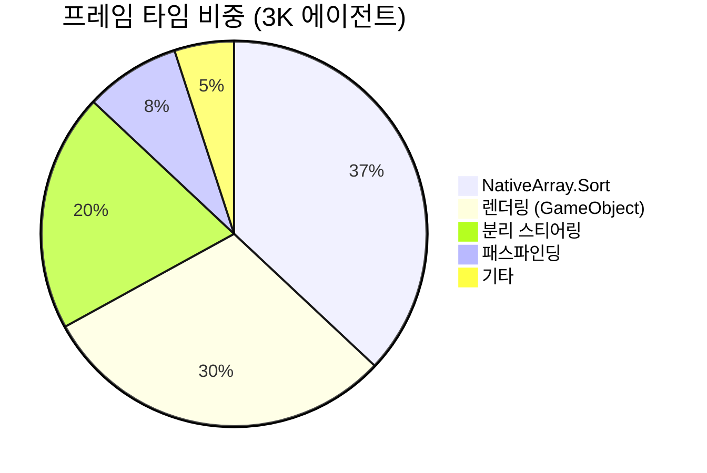
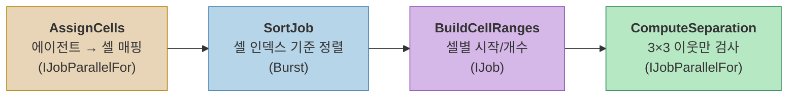
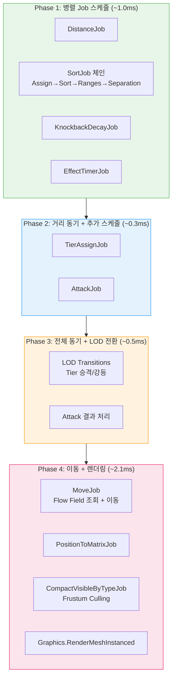
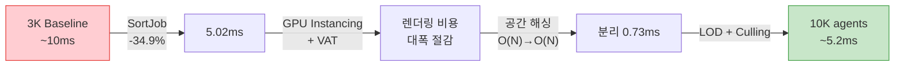

## 서론

[이전 포스트](/posts/FlowFieldPathfinding/)에서 Flow Field 패스파인딩의 개념과 3단계 파이프라인을 다뤘다. Flow Field는 에이전트 수와 무관하게 $$ O(V) $$ 로 계산되므로, 패스파인딩 자체는 병목이 아니다.

그렇다면 3,000 에이전트에서 프레임이 떨어지는 원인은 무엇인가? 그리고 10,000 에이전트까지 스케일업하려면 무엇을 바꿔야 하는가?

이 포스트에서는 실제 프로파일링 데이터를 기반으로 병목을 식별하고, 5가지 핵심 최적화를 적용하여 3,000 → 10,000 에이전트까지 스케일링한 과정을 다룬다.

> 아래 영상은 모든 최적화 적용 후, VAT 애니메이션과 실제 좀비 모델로 10,000 에이전트가 동작하는 데모다.



---

## Part 1: 병목 식별 — 패스파인딩이 아니었다

### 프로파일링 결과

3,000 에이전트에서 Unity Profiler로 프레임을 분석한 결과, Flow Field 파이프라인(Cost → Integration → Flow)은 **프레임의 10% 미만**이었다. 진짜 병목은 완전히 다른 곳에 있었다.

| 병목 | 프레임 비중 | 원인 |
|:----:|:----------:|:----:|
| NativeArray.Sort | ~37% | 분리 스티어링용 정렬이 메인 스레드를 블로킹 |
| 렌더링 | ~30% | GameObject 기반 렌더링의 컴포넌트 오버헤드 |
| 분리 계산 | ~20% | 에이전트 간 충돌 회피 $$ O(N^2) $$ 연산 |
| 패스파인딩 | <10% | Flow Field 재계산 (이미 효율적) |



이 데이터가 말해주는 것은 명확하다. **패스파인딩 알고리즘을 아무리 개선해도 프레임은 10%밖에 안 좋아진다.** 진짜 성능을 끌어올리려면 나머지 90%를 공략해야 한다.

### 최적화 순서 결정

병목 비중과 구현 난이도를 기준으로 최적화 순서를 결정했다:

| 순서 | 최적화 | 예상 효과 | 난이도 |
|:----:|:------:|:---------:|:-----:|
| 1 | Burst SortJob | 프레임 ~37% 절감 | 한 줄 변경 |
| 2 | GPU Instancing + VAT | 렌더링 비용 대폭 절감 | 셰이더 + 아키텍처 변경 |
| 3 | 공간 해싱 분리 스티어링 | $$ O(N^2) → O(N) $$ | Job 파이프라인 재설계 |
| 4 | Tiered LOD | 불필요한 연산 제거 | 시스템 추가 |
| 5 | Frustum Culling | GPU 부하 절감 | Job 추가 |

가장 적은 노력으로 가장 큰 효과를 내는 것부터 적용한다.

---

## Part 2: Burst SortJob — 한 줄로 37% 절감

### 문제: 메인 스레드 블로킹

분리 스티어링을 위해 에이전트를 셀 인덱스 기준으로 정렬해야 한다. 같은 셀의 에이전트를 메모리상 연속으로 배치해야 이웃 검색이 빨라지기 때문이다.

문제는 `NativeArray.Sort()`가 **메인 스레드에서 동기적으로 실행**된다는 것이었다. 20,000 에이전트 기준으로 이 정렬에 **~2.9ms**가 소요되었고, 이는 전체 프레임 타임의 37%에 달했다. 그 동안 19개의 Job Worker 스레드는 놀고 있었다.

```
[Before] 메인 스레드에서 동기 정렬
──────────────────────────────────────────────────
Main Thread: ████ Sort (2.9ms) ████ Separation ████
Worker 1~19: ░░░░░░░░░░░░░░░░ (대기) ░░░░░░░░░░░░░░░░
```

### 해법: .SortJob()

Unity Collections 패키지는 `NativeArray`에 `.SortJob()` 확장 메서드를 제공한다. 이것은 내부적으로 Burst 컴파일된 Merge Sort를 사용하며, **Job 체인에 편입**할 수 있다.

```csharp
// Before: 메인 스레드 블로킹
_data.CellAgentPairs.Sort(new CellIndexComparer());

// After: Burst SortJob, 워커 스레드에서 실행
var h2 = _data.CellAgentPairs
    .SortJob(new CellIndexComparer())
    .Schedule(h1);  // 이전 Job 핸들에 체이닝
```

**한 줄 변경**이다. `.Sort()`를 `.SortJob().Schedule()`로 바꾸면, 정렬이 워커 스레드로 이동하고 메인 스레드는 해방된다.

```
[After] Burst SortJob으로 워커 스레드에서 비동기 정렬
──────────────────────────────────────────────────
Main Thread: ░░░░░░░░░░░░░░ (다른 작업 수행) ░░░░░░░░░░░░░░
Worker 1:    ████ SortJob ████ → Separation ████
```

### 전체 Job 체인

SortJob은 분리 스티어링 파이프라인의 4단계 중 2단계에 해당한다. 전체 체인이 워커 스레드에서 종속성 순서로 실행된다:

```csharp
// Phase 1: 각 에이전트의 셀 인덱스 할당
var h1 = assignJob.Schedule(_activeCount, 64);

// Phase 2: 셀 인덱스 기준 정렬 (Burst SortJob)
var h2 = _data.CellAgentPairs
    .SortJob(new CellIndexComparer())
    .Schedule(h1);

// Phase 3: 셀별 (시작 인덱스, 개수) 빌드
var h3 = rangesJob.Schedule(h2);

// Phase 4: 3×3 이웃 셀 기반 분리 계산
var handle = sepJob.Schedule(_activeCount, 64, h3);
```

메인 스레드는 이 체인을 **스케줄만 하고 즉시 반환**한다. 실제 연산은 모두 워커 스레드에서 일어난다.

### 결과

| 지표 | Before | After | 개선 |
|:----:|:------:|:-----:|:----:|
| Separation 전체 | 3.34ms | 0.73ms | **-78%** |
| p50 프레임 타임 | 7.71ms | 5.02ms | **-34.9%** |
| Job Worker 활용률 | ~0% | 9.0% | — |

한 줄 변경으로 p50이 7.71ms → 5.02ms로 개선되었다. **가장 적은 노력으로 가장 큰 효과**를 얻은 최적화다.

> **교훈**: 최적화의 첫 단계는 항상 프로파일링이다. 직감으로 "패스파인딩이 느릴 것"이라 생각했다면, 실제 병목(Sort)을 놓쳤을 것이다.

---

## Part 3: GPU Instancing + VAT — Zero-GameObject 아키텍처

### 문제: GameObject의 비용

3,000개의 좀비를 각각 GameObject로 만들면:

```
좀비 1개 = Transform + MeshRenderer + Animator + Collider
→ 3,000개 = CPU 측 컴포넌트 12,000개 이상
→ 10,000개 = CPU 측 컴포넌트 40,000개 이상
```

Transform 동기화, Animator 업데이트, 렌더링 컬링 — 모두 Unity 엔진이 매 프레임 처리해야 하는 비용이다. 10,000개면 이것만으로 프레임 예산을 초과한다.

### 해법: GameObject를 없앤다

**GPU Instancing**: `Graphics.RenderMeshInstanced()`를 사용하면, 같은 메시+머티리얼을 공유하는 인스턴스를 **단일 드로우 콜**로 최대 1,023개까지 렌더링할 수 있다. Transform은 `NativeArray<float4x4>` 매트릭스 배열로 관리하고, Burst Job이 매 프레임 갱신한다.

```csharp
// PositionToMatrixJob (Burst 컴파일, IJobParallelFor)
// 위치 + 속도 방향 → TRS 매트릭스 변환
float4x4 matrix = float4x4.TRS(position, rotation, scale);
Matrices[index] = matrix;

// 렌더링: 타입별로 배치 분할
for (int offset = 0; offset < visibleCount; offset += 1023)
{
    int batchSize = math.min(1023, visibleCount - offset);
    var batch = matrices.GetSubArray(offset, batchSize);
    Graphics.RenderMeshInstanced(renderParams, mesh, 0, batch);
}
```

**VAT (Vertex Animation Texture)**: Animator 없이 GPU에서 애니메이션을 재생한다. 원리는 간단하다:

1. 오프라인에서 좀비 걷기 애니메이션의 **모든 프레임, 모든 버텍스 위치**를 텍스처에 저장
2. 런타임에 셰이더가 **현재 시간에 해당하는 텍스처 행**을 샘플링
3. 샘플링한 값으로 **버텍스 위치를 변형**

```
텍스처 레이아웃:
  U축 → 버텍스 인덱스 (0 ~ 4,349)
  V축 → 프레임 인덱스 (0 ~ 59)

  각 텍셀 = RGBAHalf = 해당 프레임에서 해당 버텍스의 (x, y, z) 오프셋
  VRAM 비용: ~1MB per 클립 (4,350 verts × 60 frames × RGBAHalf)
```

### 위상 오프셋: 동기화 방지

VAT의 함정은 모든 좀비가 **같은 타이밍에 같은 프레임**을 재생한다는 것이다. 수천 마리가 완벽히 동기화된 군무를 추면 부자연스럽다.

해법은 **월드 좌표 기반 해시**로 에이전트마다 시작 위상을 다르게 하는 것이다:

```hlsl
// 월드 XZ 좌표로 해시 → 에이전트마다 다른 시작 위상
float phaseOffset = frac(worldPos.x * 0.137 + worldPos.z * 0.241);
float time = (_Time.y * _AnimSpeed + phaseOffset * _AnimLength)
             % _AnimLength;

// 인접 프레임 보간 → 부드러운 애니메이션
float frameFloat = (time / _AnimLength) * (_FrameCount - 1);
float frame0 = floor(frameFloat);
float frame1 = frame0 + 1;
float blend = frameFloat - frame0;
```

이 코드로 **인스턴스별 추가 데이터 전달 없이**, 위치만으로 자연스러운 비동기 애니메이션이 만들어진다.

### 루트 모션 스트리핑

VAT에 루트 모션이 포함되면, 좀비가 제자리에서 이동하는 대신 셰이더 공간에서 걸어나가버린다. 이를 방지하기 위해 **버텍스 0(루트 본)의 XZ 오프셋을 제거**한다:

```hlsl
if (_StripRootMotion > 0.5)
{
    // 루트 본(vertex 0)의 XZ 오프셋을 샘플링
    float2 rootUV0 = float2(0.5 / _TexWidth, v0);
    float3 rootOffset0 = tex2Dlod(_VATPosTex, float4(rootUV0, 0, 0)).xyz;
    // 현재 버텍스에서 루트의 XZ 이동분을 제거
    offset0.xz -= rootOffset0.xz;
}
```

### Before vs After

```
[Before] GameObject 기반
───────────────────────────────────
CPU: Transform × 10K + Animator × 10K + MeshRenderer × 10K
GPU: 10,000 드로우 콜 (배칭 없이)
→ 물리적으로 불가능

[After] NativeArray + GPU Instancing + VAT
───────────────────────────────────
CPU: NativeArray<float4x4> 갱신 (Burst Job)
GPU: ~58 드로우 콜 (1,023개씩 배칭)
→ 10,000 에이전트 @ 60fps
```

---

## Part 4: 공간 해싱 분리 스티어링 — O(N²) → O(N)

### 문제: N² 비교

분리 스티어링(Separation Steering)은 에이전트가 서로 겹치지 않도록 밀어내는 힘을 계산한다. 순진한 구현은 **모든 에이전트 쌍**을 비교한다:

$$
\text{비교 횟수} = \frac{N(N-1)}{2}
$$

| 에이전트 수 | 비교 횟수 |
|:----------:|:---------:|
| 1,000 | 499,500 |
| 3,000 | 4,498,500 |
| 10,000 | **49,995,000** |

10,000 에이전트면 매 프레임 **5천만 번**의 거리 계산이 필요하다. Burst로 컴파일해도 이 규모는 감당할 수 없다.

### 해법: 셀 기반 공간 해싱

핵심 아이디어는 **가까운 에이전트만 비교**하는 것이다. Flow Field가 이미 그리드를 사용하므로, 같은 그리드 구조를 재활용한다.



#### Step 1: AssignCellsJob

각 에이전트의 월드 좌표를 그리드 셀 인덱스로 변환한다.

```csharp
// (position.x, position.z) → (cellX, cellZ) → 1D 인덱스
int cellX = (int)(position.x / cellSize);
int cellZ = (int)(position.z / cellSize);
int cellIndex = cellZ * gridWidth + cellX;

CellAgentPairs[i] = new int2(cellIndex, agentIndex);
```

#### Step 2: SortJob

셀 인덱스 기준으로 정렬하면, **같은 셀의 에이전트가 배열에서 연속**으로 배치된다:

```
정렬 전: [(5,A), (2,B), (5,C), (2,D), (3,E)]
정렬 후: [(2,B), (2,D), (3,E), (5,A), (5,C)]
              ▲ 셀2 ▲         ▲셀3▲   ▲ 셀5 ▲
```

이것이 Part 2에서 다룬 Burst SortJob이다.

#### Step 3: BuildCellRangesJob

정렬된 배열을 한 번 순회하며, 각 셀의 `(시작 인덱스, 개수)`를 기록한다:

```csharp
CellRanges[cellIndex] = new int2(startIndex, count);
// 예: CellRanges[2] = (0, 2)  → 인덱스 0부터 2개
//     CellRanges[3] = (2, 1)  → 인덱스 2부터 1개
//     CellRanges[5] = (3, 2)  → 인덱스 3부터 2개
```

#### Step 4: ComputeSeparationJob

각 에이전트는 **자신의 셀 + 주변 8개 셀 = 3×3 범위**만 검사한다:

```csharp
for (int dx = -1; dx <= 1; dx++)
    for (int dz = -1; dz <= 1; dz++)
    {
        int2 checkCell = myCell + new int2(dx, dz);
        int cellIdx = CellToIndex(checkCell);
        int2 range = CellRanges[cellIdx];  // O(1) 조회
        
        for (int k = range.x; k < range.x + range.y; k++)
        {
            int otherIdx = SortedPairs[k].y;
            float3 diff = myPos - Positions[otherIdx];
            float dist = math.length(diff);
            
            if (dist > 0 && dist < radius)
            {
                // 이차 감쇠: 가까울수록 강하게 밀어냄
                float strength = (1 - dist / radius);
                strength *= strength;
                force += math.normalize(diff) * strength;
            }
        }
    }
```

### 왜 O(N)인가

- 각 에이전트가 검사하는 셀: 항상 **9개** (3×3)
- 셀당 에이전트 수: 밀도에 따라 다르지만, 실측 평균 **5~15개**
- 에이전트당 비교 횟수: 9 × 평균밀도 = **상수에 가까움**
- 전체 비교 횟수: $$ O(N \times \text{const}) = O(N) $$

| | 순진한 구현 | 공간 해싱 |
|:---:|:---:|:---:|
| 10,000 에이전트 | 49,995,000 비교 | ~90,000~150,000 비교 |
| 복잡도 | $$ O(N^2) $$ | $$ O(N) $$ |

추가 이점: 정렬된 배열 덕분에 같은 셀 에이전트들이 **메모리상 연속**으로 배치된다. CPU 캐시 라인이 효율적으로 활용되어, 단순 비교 횟수 이상의 성능 향상을 얻는다.

---

## Part 5: Tiered LOD — 거리 기반 품질 차등

### 아이디어

화면 한구석에 점처럼 보이는 좀비에게 Rigidbody 물리와 Animator를 돌릴 필요는 없다. 플레이어와의 **거리에 따라 처리 수준을 차등** 적용한다.


_왼쪽: 거리별 Tier 구간과 히스테리시스(Promote 20m / Demote 25m). 오른쪽: Tier별 에이전트 수 대비 CPU 비용 — Tier 0이 3,500개지만 0.5ms, Tier 2는 200개인데 2.5ms._

| Tier | 거리 | 표현 | 물리 | 애니메이션 |
|:----:|:----:|:----:|:----:|:----------:|
| **Tier 0** | > 50m | NativeArray + GPU Instancing | 없음 | VAT (GPU) |
| **Tier 1** | 25~50m | NativeArray + GPU Instancing | 없음 | VAT (GPU) |
| **Tier 2** | < 20m | GameObject + Rigidbody | MovePosition | Animator (예정) |

Tier 0/1은 **순수 데이터**다. `NativeArray`에 위치/속도만 저장하고, GPU Instancing으로 렌더링한다. CPU 비용은 Move Job과 Matrix Job뿐이다.

Tier 2만 GameObject를 사용하며, 플레이어와 근접 전투가 가능한 풀 스펙 좀비다. 동시 최대 300개로 제한한다.

### 히스테리시스: 경계에서의 떨림 방지

승격 거리(20m)와 강등 거리(25m)를 다르게 설정한다. 이 5m 갭이 **경계선에서 Tier가 반복 전환되는 것**을 방지한다.

```
거리:  0m ────── 20m ──── 25m ──── 50m ──── 55m ────→
       │  Tier 2  │ 갭(5m) │  Tier 1  │ 갭(5m) │ Tier 0
       │          │        │          │        │
       └─ 승격 ───┘        │          └─ 승격 ──┘
              └─── 강등 ───┘                └─── 강등 ───┘
```

### 프레임당 전환 제한

100마리가 동시에 20m 선을 넘으면 한 프레임에 100개의 GameObject를 생성해야 한다. 이를 방지하기 위해 **프레임당 최대 10개**로 전환을 제한한다:

```csharp
[SerializeField] private int _maxPromotionsPerFrame = 10;
[SerializeField] private int _maxDemotionsPerFrame = 10;
```

나머지는 다음 프레임으로 이월된다. 플레이어가 느끼기엔 10프레임(~167ms)에 걸쳐 자연스럽게 전환된다.

---

## Part 6: Frustum Culling — 보이지 않는 것은 그리지 않는다

카메라 밖의 좀비를 GPU에 보내는 것은 순수한 낭비다. Burst 컴파일된 `CompactVisibleByTypeJob`이 매 프레임 처리한다.

### 동작 방식

1. 카메라의 **절두체 6개 평면**(상/하/좌/우/근/원)을 추출
2. 각 에이전트의 **AABB(축 정렬 바운딩 박스)** 와 6개 평면을 테스트
3. **모든 평면 안쪽**에 있는 에이전트만 출력 배열에 압축

```csharp
// 6개 평면 테스트
bool visible = true;
for (int p = 0; p < 6; p++)
{
    float4 plane = FrustumPlanes[p];
    float dist = math.dot(plane.xyz, center) + plane.w;
    float radius = math.dot(math.abs(plane.xyz), extents);
    if (dist + radius < 0f)
    {
        visible = false;
        break;  // 하나라도 밖이면 즉시 탈락
    }
}
```

### 타입별 분리 압축

좀비 타입(Fast/Slow)별로 다른 메시와 머티리얼을 사용하므로, 보이는 좀비를 타입별로 분리 압축한다:

```
출력 배열 레이아웃:
[Type 0 매트릭스: 0 ~ Capacity-1]
[Type 1 매트릭스: Capacity ~ 2×Capacity-1]

각 타입의 실제 개수를 VisibleCounts에 기록
→ 렌더링 시 타입별로 정확한 개수만큼만 드로우 콜 발행
```

카메라가 전체 맵의 1/4만 비추고 있다면, 렌더링 비용도 **~1/4로 감소**한다.

---

## Part 7: SoA 데이터 레이아웃 — Burst가 좋아하는 메모리 구조

### AoS vs SoA

전통적인 OOP 방식은 **AoS(Array of Structures)** 다:

```csharp
// AoS: 좀비 하나의 모든 데이터가 연속
struct Zombie {
    float3 Position;    // 12B
    float3 Velocity;    // 12B
    float Health;       // 4B
    byte State;         // 1B
    byte Tier;          // 1B
    // ... 총 ~80B per zombie
}
Zombie[] zombies = new Zombie[10000];
```

**SoA(Structure of Arrays)** 는 **같은 필드끼리 모아서** 저장한다:

```csharp
// SoA: 같은 종류의 데이터가 연속
NativeArray<float3> Positions;     // 10K × 12B = 120KB (연속)
NativeArray<float3> Velocities;    // 10K × 12B = 120KB (연속)
NativeArray<float> Healths;        // 10K × 4B  = 40KB  (연속)
NativeArray<byte> States;          // 10K × 1B  = 10KB  (연속)
NativeArray<byte> AiTiers;         // 10K × 1B  = 10KB  (연속)
```

### 왜 SoA가 빠른가

Move Job이 위치를 갱신할 때, **Positions 배열만 순차 접근**한다:

```
[AoS] Positions를 읽을 때 — 80B마다 12B만 유효
┌─────────────────────────────────────────────────┐
│ Pos₀ Vel₀ HP₀ ... │ Pos₁ Vel₁ HP₁ ... │ Pos₂  │
│ ████ ░░░░░░░░░░░░░ │ ████ ░░░░░░░░░░░░░ │ ████  │
└─────────────────────────────────────────────────┘
  캐시 라인 64B 중 12B만 사용 → 효율 15%

[SoA] Positions 배열 — 연속된 12B가 빈틈 없이 나열
┌─────────────────────────────────────────────────┐
│ Pos₀ │ Pos₁ │ Pos₂ │ Pos₃ │ Pos₄ │ Pos₅ │ ... │
│ ████ │ ████ │ ████ │ ████ │ ████ │ ████ │ ... │
└─────────────────────────────────────────────────┘
  캐시 라인 64B 중 60B 사용 → 효율 93%
```

추가로 Burst 컴파일러가 SoA 레이아웃을 감지하면 **SIMD(SSE/AVX) 자동 벡터라이징**을 적용한다. `float3` 4개를 한 번에 처리하므로 이론상 4배 빨라진다.

실제 프로젝트에서는 17개의 NativeArray로 좀비 데이터를 관리한다. Position, Velocity, Health, State, Tier, Type, Matrix 등 **각 Job이 필요한 배열만 선택적으로 접근**하여 캐시 효율을 극대화한다.

---

## Part 8: 전체 프레임 파이프라인

최적화가 모두 적용된 후의 프레임 파이프라인이다. 각 Phase가 이전 Phase의 결과에 의존하는 구조로, **가능한 한 병렬로 스케줄**한다:



**핵심 원칙**: 메인 스레드는 **스케줄링과 동기화만** 담당하고, 실제 연산은 모두 Burst 컴파일된 워커 스레드에서 수행한다.

---

## 최종 결과

### 프로파일링 비교

| 지표 | 3K (최적화 전) | 10K (최적화 후) | 20K (스트레스 테스트) |
|:----:|:-------------:|:--------------:|:-------------------:|
| p50 프레임 타임 | ~10ms | ~5.2ms | 7.71ms |
| 렌더링 방식 | 디버그 캡슐 | GPU Instancing + VAT | GPU Instancing + VAT |
| 분리 스티어링 | ~3.3ms | ~0.73ms | ~0.73ms |
| 드로우 콜 | - | 58 (배칭) | 152 |
| 삼각형/프레임 | - | - | 41.2M |
| Job Worker 활용률 | ~0% | ~9% | ~3.6% |

10,000 에이전트가 3,000보다 **에이전트당 프레임 비용이 오히려 낮다**. 병목을 제거하고 파이프라인을 데이터 지향으로 재설계한 결과다.

### 최적화별 기여도



### 아직 남은 과제

이 포스트에서 다룬 최적화로 10,000 에이전트 @ 60fps를 달성했지만, 여기서 멈추지 않았다. 후속 포스트에서는:

- **Multi-Goal & Layered Flow Field** — 다중 목적지와 레이어 분리로 더 복잡한 AI 행동 구현
- **크로스 플랫폼 벤치마크** — Apple Silicon(M4/M4 Pro)에서의 최적화 결과

---

## 참고 자료

- Unity Technologies. *[Burst User Guide](https://docs.unity3d.com/Packages/com.unity.burst@latest)*. Unity Documentation.
- Unity Technologies. *[NativeArray.SortJob](https://docs.unity3d.com/Packages/com.unity.collections@latest)*. Unity Collections Package.
- Framebuffer. (2018). *[Spatial Hashing](https://www.gamedev.net/tutorials/programming/general-and-gameplay-programming/spatial-hashing-r2697/)*. GameDev.net.
- Reynolds, C. (1999). *[Steering Behaviors For Autonomous Characters](http://www.red3d.com/cwr/steer/)*. GDC Proceedings.
