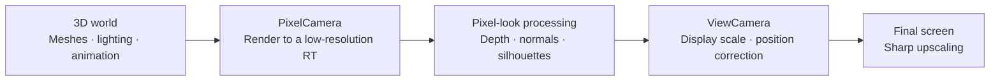
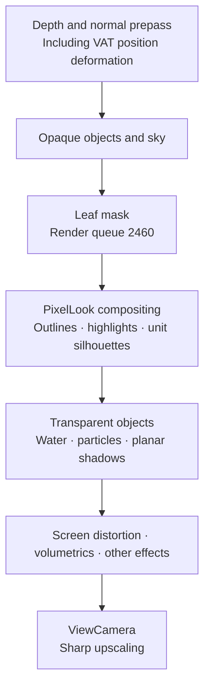

[](https://hits.sh/epheria.github.io/)

## Rethinking Pixel Art While Improving the Renderer

I recently made substantial rendering changes in ProjectSurvivorRevive. I added outlines to ordinary Lit materials and reduced the tendency for small soldiers and zombies to disappear into the ground. I also fixed the upscaling that caused pixel blocks to alternate in width during slow camera movement.

At first, I thought a low-resolution RenderTexture enlarged with Point filtering would get close to the image I wanted. Pixel blocks did appear, but building faces were difficult to read, and outlines made small units look even more crowded. Pixels that looked fine in a still frame presented different problems once the camera moved.

The important questions were **which shape information to preserve in a limited number of pixels, and how consistently that information remains visible during motion**. Following the implementation order, I will start with the pixel grid and upscaling, then explain how the pipeline selects shape and lighting information.

The cover image shows the project's current rendering of a forest and buildings. The internal RT is 640×360, and the final Game view is 1920×1080. Terrain, rocks, trees, and water use Critter environment assets; the buildings use Synty's POLYGON Apocalypse assets. The low-resolution camera and the project's Sharp upscaling and PixelLook processing also apply to the buildings' URP/Lit materials.

First, it helps to separate the responsibilities of the underlying [Critter 3D Pixel Camera](https://marketplace.unity.com/packages/tools/camera/critter-3d-pixel-camera-263695). The camera determines **where to sample and how many samples to render**, while the environment shaders determine **which shading and boundaries to preserve in those samples**. I compared the installed camera 2.3.1 and environment 2.3.2 documentation with the actual C#, Shader Graph, and HLSL implementations. The following sections distinguish Critter's original behavior from the project's modifications.

The implementation discussed here uses Unity **6000.3.11f1 / URP 17.3.0**, at rendering improvement commit `5bd1a11e7`. The code examples are pseudocode explaining the core calculations, not complete shaders that can be pasted into a project unchanged.

## 1. World Pixels and Screen Pixels Are Different

### Critter Renders the World with Fewer Pixels from the Start

Critter centers on two orthographic cameras and a display quad. PixelCamera renders the 3D world into the internal RT, and ViewCamera displays a quad carrying that RT on the final screen.



Changing PixelCamera's resolution and changing ViewCamera's display scale have different effects. The former determines how many texels represent an object; the latter determines how large those already-rendered texels appear on the screen.

`PixelCameraManager` connects the generated RT to PixelCamera's `targetTexture`. `UpscaledCanvas` passes the same RT to the display material's `_LowResTexture`. The vendor's original `UpscaleShaderURP` graph has a simple structure: sample this texture with UV0 and output its color as Unlit. Because the RT uses Point filtering, it enlarges the nearest texel's color unchanged.

The first step in creating pixel blocks is therefore not a mosaic post-process applied to a high-resolution image. **Triangle visibility, materials, and lighting results are recorded directly on the pixel grid of a small render target.** This does not reduce the model's vertex count or animation data to match the pixel count. The quad's display shader itself does not contain depth outlines, palette restrictions, or dithering.

The current base-resolution policy holds the RT height constant and calculates its width from the screen aspect ratio. A height of 360 at 16:9 produces 640×360, but the width is not always 640 at other window aspect ratios.

### Orthographic Projection Defines a World-Space Texel Interval

Let the orthographic camera's `orthographicSize` be $$O$$ and the internal RT height be $$H$$. The length covered by one texel in the camera plane is then as follows. Unity defines `orthographicSize` as half the vertical viewing extent in its [camera documentation](https://docs.unity3d.com/6000.3/Documentation/ScriptReference/Camera-orthographicSize.html).

$$
\Delta_{\text{world}} = \frac{2O}{H}
$$

For example, with $$O=15$$ and $$H=360$$, one texel covers approximately 0.0833m, and 1m projected onto the camera plane spans 12 texels. Projection direction affects actual lengths along tilted ground and the height of a character, so this does not mean that 1m in every direction equals 12 texels. The cover and debug captures use $$O=24$$, while the stone detail comparisons use $$O=20$$.

In orthographic projection, equal lengths parallel to the camera plane occupy the same pixel length regardless of depth. This is why a single $$\Delta_{\text{world}}$$ can define the camera's movement grid. Applying this calculation alone to a perspective camera, where object sizes change with distance, does not provide the same stability.

If a building window is smaller than one texel, making its frame more detailed in the model will not make it appear reliably in the current view. Asset creation therefore needs to account for how many texels each object occupies from the target camera.

### World Zoom and Display Zoom Preserve Different Amounts of Information

Critter's `GameCameraZoom` changes PixelCamera's orthographic extent, while `ViewCameraZoom` changes the viewing extent used to display the completed RT. Ignoring the edge-margin correction, the difference is:

| Change | Internal texels allocated to the same object | Size of one texel on screen |
|:--|:--|:--|
| World orthographic half-height 15 → 7.5, display zoom unchanged | Approximately twice the density | Unchanged |
| World view unchanged, display zoom 1 → 0.5 | Unchanged | Approximately doubled |

Both make objects larger on screen, but the first re-renders a narrower world region to capture more detail. The second magnifies the center of the RT, making only the existing pixel blocks larger. The zoom-in detail ramp discussed later is a project policy combining these two controls.

## 2. Point Filtering Does Not Guarantee Integer Scaling

Displaying 640×360 at 1920×1080 gives a vertical scale of 3. It appears that each source texel should occupy a 3×3 block of screen pixels.

However, the previous implementation enlarged the display quad by 1.01 to prevent uncovered screen edges. Critter's camera display area also had an inward adjustment of `1 - 2/H` based on height. Combining those corrections produced this effective scale:

$$
S_{\text{legacy}} = 3 \times \frac{1.01}{1 - 2/360} \approx 3.047
$$

One texel cannot occupy 3.047 screen pixels. When Point samples are placed on the output grid, some blocks become 3 pixels wide and others become 4 pixels wide. As the camera moves, the locations of the 4-pixel-wide blocks change as well.

[Point filtering](https://docs.unity3d.com/6000.3/Documentation/ScriptReference/FilterMode.Point.html) selects the nearest texel. It does not align the display scale or the starting position of the screen grid.

The solution was to separate the margin needed to cover the screen from the displayed size of a texel. The quad remains large enough, but its UV coordinates are mapped back to the reference region.

```hlsl
// Conceptual code: coverage is the factor used to enlarge the quad.
float2 rtUv = (canvasUv - 0.5) * coverage + 0.5;
```

The texel size in the center stays unchanged, while clamp stretches the edge texels across the narrow strips extending beyond the RT. This is different from overscan, which renders additional world content outside the visible screen.

Including the raw ViewCamera zoom $$z$$, Sharp mode's display scale is:

$$
S_{\text{sharp}} = \frac{H_{\text{output}}}{H_{\text{RT}} \lvert z \rvert}
$$

| Internal RT and display conditions | Screen height | Sharp scale |
|:--|--:|--:|
| 640×360, zoom 1 | 1080 | 3 |
| 640×360, zoom 1 | 1440 | 4 |
| 640×360, zoom 0.8 | 1080 | 3.75 |
| 1920×1080, zoom 1 | 1440 | Approximately 1.333 |

The screen resolution being 1440p does not by itself imply non-integer scaling. The internal RT and zoom must be considered together. Even at an integer scale, boundary blending can occur if texel edges do not line up with screen pixel edges, so the starting position also needs alignment.

### Non-Integer Scaling Uses a Narrow Boundary Blend

Continuous zoom and variable window sizes make non-integer scaling difficult to avoid entirely. Sharp upscaling therefore keeps the flat color inside each texel while placing a narrow blending region only at its boundaries.

```hlsl
// Conceptual code: remap texel coordinates, then read with linear sampling.
float2 texelPosition = rtUv * rtSize;
float2 seam = floor(texelPosition + 0.5);
float2 texelsPerScreenPixel = max(fwidth(texelPosition), epsilon);

float2 offset = (texelPosition - seam)
  / texelsPerScreenPixel * sharpness;
float2 sampleUv = (seam + clamp(offset, -0.5, 0.5)) / rtSize;
```

`fwidth` measures how much the texel coordinates change across one screen pixel. That value adjusts the blending width in screen-pixel units. The project's default width when stationary is 0.5 screen pixels.


_Legacy is on the left and Sharp on the right. Both captures show the same stationary scene with Critter Toon stone structures; material-native outlines, PixelLook, and volumetric lighting remain enabled in both. The internal RT is 640×360, the output is 1920×1080, and the raw display zoom is 0.8. A 400×280 region was cropped at identical screen coordinates, then each crop was enlarged 2× with nearest sampling for comparison. Because Legacy's margin-scale correction also changes, the two images differ slightly in composition._

The current RT's `filterMode` is Point, but the Sharp shader reads the remapped UV with an explicit linear sampler. The RT's filter setting alone therefore does not identify the final upscaling method. Sharp softens boundary changes at non-integer scales; it does not turn a 3.75× display into an image where every block has exactly the same integer width.

### Camera AA and Display Boundary Blending Are Separate

The current render pipeline asset has an MSAA value of 1, and the camera does not use FXAA, SMAA, or TAA. Sharp's boundary blending is a **display-stage filter** independent of those settings. Saying only that all AA is disabled for pixel art does not fully describe the current image.

The vendor's original RT used ARGB32, but the project changed it to `DefaultHDR` to preserve emissive and post-processing values. An HDR format does not define the final palette, and the actual storage format depends on the platform. Likewise, Point filtering on the display RT does not force every source texture in the world materials to use Point filtering.

## 3. Separate the Roles of the Two Grids During Camera Movement

Moving the low-resolution camera through continuous coordinates constantly changes the sampling positions even on stationary buildings. Thin window frames and diagonals can appear in one frame and disappear in the next.

### VoxelGridMovement Aligns the Camera's Sampling Position

Critter's `PixelCameraManager` rotates the position of its tracked `FollowedTransform` into a coordinate basis aligned with the camera, then rounds it to the world-space texel interval calculated earlier. The tracked object should be controlled instead of directly moving the world camera's Transform because the manager determines the actual camera position again in `LateUpdate`.

```csharp
// Conceptual code: orient a grid fixed at the world origin along the camera axes.
var cameraSpacePosition = WorldToCameraBasis(desiredPosition);
var snappedPosition = Round(cameraSpacePosition / worldTexelSize)
  * worldTexelSize;
pixelCamera.position = CameraBasisToWorld(snappedPosition);
```

The actual code uses `InverseTransformDirection`, not `InverseTransformPoint`. This is not a local grid that subtracts the camera position as its origin. It is **a grid fixed at the world origin and oriented along the camera's right/up/forward directions**. All three axes are rounded, but right/up are the axes directly corresponding to pixel positions in the orthographic image.

Despite Voxel appearing in the feature's name, it does not turn meshes into cubes or voxelize their vertices. The separate `VoxelGridAdjuster` also only aligns an attached object's position to the same grid. It does not provide per-object display residual correction, so applying it to all moving units can actually make their stepped movement more visible.

### SubpixelAdjustments Passes the Remaining Error to the Display Stage

World sampling becomes stable during translation with a fixed camera orientation and texel interval. However, camera movement limited to low-resolution texel steps makes slow panning look stepped. ViewCamera receives the residual between the requested and snapped positions and corrects the display position.

Let the RT aspect ratio be $$a$$ and the camera-plane residual between the requested and snapped positions be $$(d_x,d_y)$$. The tracked object's viewport coordinates are:

$$
v = \left(\frac12+\frac{d_x}{2Oa},\;\frac12+\frac{d_y}{2O}\right)
$$

The vendor's code obtains this position with `WorldToViewportPoint`. Multiplying by the display quad's reference size $$(2Oa,2O)$$ to obtain ViewCamera's position gives back $$(d_x,d_y)$$.

$$
\left(v-\frac12\right)\odot(2Oa,2O)=(d_x,d_y)
$$

The camera rendering the world stays on the grid, while only the display position of the already-rendered image moves by the residual. This does not render additional world views at intermediate positions or reconstruct missing window frames.

With $$O=15$$ and $$H=360$$, a residual of 0.03m is approximately 0.36 RT texels. At 3× enlargement, that becomes approximately 1.08 pixels on the final screen. Here, **subpixel means a position smaller than one texel of the low-resolution RT**. It does not mean using an LCD's RGB subpixels, nor does it always mean less than one final-screen pixel. The original Point display still has output-raster steps, but it can divide a large low-resolution texel-sized movement into movements on the finer output grid.

### The Project Uses Different Display Policies for Motion and Rest

The display position also needs a policy: always snap it to screen pixels, or allow continuous coordinates.

| Display-position policy | Benefit | Tradeoff |
|:--|:--|:--|
| SnapToPixels | A stationary image aligned to the output grid | Slow movement advances 1 pixel every few frames |
| Smooth | Continuous display movement | Boundary blending remains depending on the stopping position |
| SmoothWhileMoving | Continuous correction during movement, grid alignment after stopping | A short settling period immediately after stopping |

The current default is `SmoothWhileMoving`. During movement, it uses a continuous residual and a boundary-blending width of 1 screen pixel. After stopping, it settles onto the output grid over approximately 0.15 seconds and returns to a stationary width of 0.5 pixels. Timing uses real time, not the game's `timeScale`.

The camera position is what gets snapped. Mesh animation, moving units, and every shadow sample are not automatically aligned. Rotation also changes the direction of the camera-aligned grid, so the stability achieved during translation should not be assumed to persist unchanged. The vendor's example and the project's free-rotation path disable `VoxelGridMovement` and `SubpixelAdjustments` during rotation, then enable them again afterward.

Zoom also changes the sampling grid when $$2O/H$$ changes. Stabilizing movement along a fixed grid is different from freezing every pixel pattern during rotation or zoom.

The still comparison images above show upscaling differences. A single photograph does not verify the perceived smoothness of continuous movement or temporal shimmer.

## 4. Critter's Environment Shaders Simplify Shading and Boundaries

Low-resolution rendering alone can mix small texture patterns with continuous shading. Critter's environment shaders use Toon shading and optional outlines to help distinguish faces. **Discretizing screen resolution and discretizing lighting values are separate stages.**

### ToonRamp Quantizes Lighting into Steps

The installed `ToonRamp` subgraph can be expressed with the following formula. $$S$$ is Shades, $$B$$ is Brightness, and $$M$$ is MinimumDarkness.

$$
R(x)=\operatorname{lerp}\left(M,1,
\operatorname{saturate}\left(\frac{\lceil Sx+B\rceil}{S}\right)\right)
$$

`ceil` raises continuous lighting values to discrete steps, and the brightness offset moves their transition points. The ordinary Toon and leaf paths use the normal/light dot product remapped as $$(N\cdot L+1)/2$$. This result selects and interpolates between dark and bright colors, then combines ambient lighting, the main light's color and shadows, additional lights, and other contributions.

This does not replace the final RGB values with a fixed palette. $$M$$ is also not a lower bound on final-screen brightness: it is **the lower bound of the ramp used to select a lighting color**. Subsequent light and shadow calculations can change the screen color again. The grass and flower billboard paths differ from the leaf path by using a fixed Toon input of 0.5 instead of shading variations based on face orientation.

### The Original Outlines Read Four Neighbors in the Material

`PixelOutlineSetupFeatureUnity6` requests depth, normal, and color inputs. Its name suggests a Feature that draws full-screen outlines, but the installed Unity 6 version's `RecordRenderGraph` contains no compositing draw. The actual outline calculations run in the environment materials that call `Outlines.hlsl`.

It compares depth and normals at the current position with those one texel above, below, left, and right. The original depth test uses raw depth $$D$$, not linear depth in meters, to calculate:

$$
E_D(p)=\sum_{q\in N_4(p)}\bigl(D(p)-D(q)\bigr)
$$

The sign and threshold select silhouette candidates. If no depth edge is found, it uses the directional bias and magnitude of the normal difference. Depth edges take priority over normal edges. This raw-depth threshold is not a physical length like the 0.5m used later, so its numbers must not be copied directly for comparison.

The ordinary Toon graph uses the detected strength as **the weight of an Overlay blend**. It does not simply replace the color with black or an outline color. Depth and normal strengths and colors vary between materials, and some have negative normal strength, so the original normal boundaries cannot always be described as bright highlights.

The ordinary `Toon` graph participates in these outlines, but the Terrain and instanced-vegetation graphs do not have the same outline nodes even though they share ToonLighting. Ordinary Lit materials do not participate either. This is why the project adds a separate full-screen PixelLook stage.

### Leaves Face the Camera, but Their Lighting Follows the Canopy

Critter's billboard vegetation rotates the small leaf and grass polygons toward the camera plane, reducing the chance of faces turning edge-on and disappearing. Buildings and tree trunks do not become billboards as part of this behavior.

The `Billboard` subgraph adds a vertex offset rotated by the inverse view matrix to the instance origin. Its basic placement before wind deformation can be understood as follows:

```hlsl
// Conceptual code: offset is each vertex's relative position after scaling.
float3 worldPosition = instanceOrigin
  + mul((float3x3)UNITY_MATRIX_I_V, offset);
```

The inspected leaf and grass graphs are Opaque and do not enable Alpha Clip. Instead of cutting a leaf shape from a color texture, **the polygon's own boundary forms its silhouette**. Their UVs do not sample a color sprite; they weight how much each part bends in the wind.

The important distinction is that positions and normals are treated differently. `MeshInstancesBehaviour` samples positions and normals from the original canopy surface and passes instance transforms and normals to GPU buffers. Although leaf vertex positions face the camera, lighting normals use the sampled canopy surface directions. All leaves can face forward while the canopy as a whole retains the shading of a rounded volume.

Instances are submitted with `DrawMeshInstancedIndirect`. This is a way to draw many leaves, not the operation that creates pixelization. The submission disables shadow casting, but opaque depth writing is separate, so the leaves remain in depth. Wind is also processed as vertex deformation; snapping the camera to a grid does not eliminate every change in the leaves' pixel patterns.

## 5. The Project's Outlines Select the Boundaries That Matter

Some of Critter's original Toon materials already had their own outlines. Ordinary Lit buildings and separate VAT units did not receive the same processing, so different rules emphasized their shapes within the same image.

The added `PixelLookFeature` reads the world camera's color, depth, and normals. After opaque objects and the sky have been drawn, but before transparent objects, it generates a leaf mask and runs full-screen compositing. The roles of these URP textures are described in the [RenderGraph frame data documentation](https://docs.unity3d.com/6000.3/Documentation/Manual/urp/render-graph-frame-data-reference.html).


_PixelLook outlines and highlights are OFF on the left and ON on the right. A 620×500 region was cropped at the same coordinates from the same stationary scene and placed side by side. The comparison shows added boundaries on broad faces and corners of the stone structures. Critter Toon material shading, native outlines, and volumetric lighting remain in both images, so OFF does not mean that every outline has been removed._

### Depth Differences Separate Flat Faces from Silhouettes

The current pixel $$p$$ and its four neighboring pixels $$q$$ are read as linear eye depth to calculate:

$$
L(p) = \sum_{q \in N_4(p)} \bigl(d(q) - d(p)\bigr)
$$

On flat faces and constant slopes in orthographic projection, depth changes in opposite directions cancel. At the silhouette of a nearby object, the background depth behind it produces a larger positive value. The project uses values greater than 0.5m as environment-outline candidates.

Instead of replacing the line color with black, it darkens the original color to 0.45 times its value. This avoids turning stone and brown roofs into the same black strip and preserves their color relationships. Neighboring depth and normal samples use `LOAD` at integer texel coordinates so boundaries are not interpolated during detection.

### Normal Differences Also Need a Convexity Condition

Highlighting corners from normal differences alone creates bright lines where walls meet the ground or around tree bases. A change in surface orientation is not enough to distinguish a convex edge from a concave joint.

The current implementation also checks a second depth difference using opposing neighbors:

$$
C(p,q) = d(q) + d(q_{\text{opposite}}) - 2d(p)
$$

It accumulates highlight candidates when this value exceeds the minimum of 0.02m and the view-space normal difference passes the configured bias-direction test. The depth condition is a heuristic for suppressing stray lines at joints in the project's orthographic view, not an exact reconstruction of geometric curvature for every mesh.


_This is the compositing shader's debug view. Red indicates environment outlines; green indicates corner highlights. If both conditions overlap on a pixel, the outline takes priority. Volumetric lighting and camera post-processing were disabled for this capture so the classification colors remain visible._

Brightening both faces of a corner makes a thin edge look like a thick strip. The normal bias selects one side of the edge. In the image above, boundaries on structures and trunks are emphasized rather than outlines around the entire canopy.

## 6. Small Units Need to Preserve Their Interior Pixels

Applying the inward outline used on buildings to small soldiers removes information from their bodies. In a part only 5 texels wide, darkening one texel on each side leaves just 3 texels showing the original body.

Units therefore use silhouettes that occupy one background texel outside the body. A unit marker is recorded in the alpha channel of the DepthNormals output. If a neighboring unit is at least 0.6m closer than the current pixel, that pixel becomes a rim candidate. Pixels belonging to an occluding building fail the depth condition, so unit outlines do not show through buildings.

**I also separated the decision that a line is needed from the decision of which side should retain it.** Outlining all four sides made small characters look thick. The current default, `AwayFromLight`, keeps the line on the side opposite the main light's projected screen-space direction.

Silhouettes are reduced where the background and body are already easy to distinguish. The shader compares an approximate lightness value obtained by taking the square root of weighted luminance in linear RGB. It begins fading the line at a difference of 0.15 and removes it at 0.25. This is an adaptation condition for unit rims, not an exact CIELAB color-difference calculation.

```hlsl
// Conceptual code: add less outline where the unit is already distinguishable.
float contrast = abs(PerceivedLightness(unitColor)
  - PerceivedLightness(backgroundColor));
float rimWeight = 1 - smoothstep(fadeStart, fadeEnd, contrast);

float3 rimBase = lerp(unitColor, backgroundColor, backgroundMix);
float3 rimColor = rimBase * rimKeep;
```

The current `backgroundMix` is 0.5 and `rimKeep` is 0.4. Using only the unit's color for a zombie in dark clothing also makes its rim dark, merging limbs and outlines. Mixing in some background color preserves a lightness difference between the body and rim as well.

The environment images above demonstrate the processing of buildings and vegetation; they are not validation images for soldier or zombie silhouettes. Unit processing is a separate implementation in the project's current shaders.

## 7. Keep Leaves in Depth, but Exclude Them from Outlines

Leaves and grass consist of overlapping small billboard polygons. Applying environment outlines to every polygon's depth step, especially inside a canopy, produces black dots and tiny lines. This is not just a question of whether Alpha Clip is enabled: multiple thin faces need to read as a single larger mass.

Moving these cards into a transparent queue reduces outlines but introduces a different problem. In paths where leaves do not remain in the depth texture, volumetric lighting uses the distance to the ground behind the tree. Fog that should stop in front of the tree accumulates over a longer interval, washing out the canopy.

The chosen approach keeps leaves in opaque depth while excluding only their outlines and highlights. Leaf materials are grouped into dedicated render queue **2460**, and that queue's `DepthOnly` passes are drawn again to create a mask. Existing depth ensures that only visible leaves remain in the mask.

The compositing shader skips environment outlines and highlights in masked areas. Leaf-card boundaries and structural building edges are therefore not emphasized by the same rule. Leaving the queue assignment out of a new leaf material brings the dotted lines back. Conversely, putting a building into that queue also removes its outlines.

## 8. VAT Depth Must Follow the Animation

The project's zombies move with VAT, or Vertex Animation Texture. If vertices deform only in the Forward pass while DepthOnly and DepthNormals draw the original mesh, color and depth represent different poses. Outlines and occlusion tests cannot follow the body that is actually visible.

This implementation adds the corresponding animation deformation to the depth passes of zombie and evacuee VAT. The Forward and depth passes need the same position deformation for unit markers and silhouette candidates to match the body on screen.

Not every VAT implementation reconstructs normals to the same degree. Ordinary zombies and evacuees use deformed positions with input mesh normals, while the zombie horde derives face normals from derivatives of the deformed positions. The presence of a `DepthNormals` pass alone does not guarantee accurate deformed normals.

## 9. Lighting and Volumetrics Share the Pixel Grid

### Project Unit Quantization Differs from Critter ToonRamp

The units' main light also uses stepped shading. The default setting of 3 snaps the main-light scalar onto a grid divided into three intervals:

$$
Q(x) = \frac{\lfloor \operatorname{clamp}(x,0,1) \cdot 3 + 0.5 \rfloor}{3}
$$

Possible outputs include $$0, 1/3, 2/3, 1$$. Ambient and additional lighting are added, and material colors multiply the lighting result, so the final screen is not restricted to exactly three colors or three brightness levels. The project quantizes the main light, including shadow attenuation, while leaving ambient and additional lighting continuous.

Stepped shading helps distinguish faces, but adding too many highlights to already small units produces more visual noise than readable shape. The current default additive corner-highlight amount for units is 0; outer silhouettes are responsible for body readability.

Dithering is another option. Representing intermediate values with pixel patterns can reduce continuous gradients, but the coordinate system anchoring those patterns determines whether they shimmer during movement. **This PixelLook implementation does not add dithering or a final palette restriction.** It should not be confused with Bayer dithering used in the project's separate map-transition effect.

### Critter Volumetrics Sample World-Space Rays for Each Pixel

Volumetric light rays are part of the same image. Critter's `PixelWorldPosition` graph constructs a world-space position on the orthographic camera plane from RT UVs. Let the camera position be $$C$$ and the full viewing area's world-space width and height be $$W_w,H_w$$. The basic relationship is:

$$
P(u,v)=C+(u-0.5)W_w\,\mathbf{right}
             +(v-0.5)H_w\,\mathbf{up}
$$

This graph does not use `floor` or `round` to quantize world vertices to integers. Pixel in its name means **the world position corresponding to the current image sample**.

The volumetric path uses that position and depth to determine the interval sampled along a camera ray, then samples the shadow map and cloud attenuation at multiple points. The accumulated light is also stepped. Compositing this effect on PixelCamera records the rays on the low-resolution RT grid and enlarges them with the world. Its sampling grid differs from that of high-resolution rays rendered separately by the display camera after the image has already been enlarged.

The rays add atmosphere, but bright fog covering foreground edges reduces shape contrast. In the current project, volumetric lighting is composited after outlines. Beyond comparing the effect on and off, it is necessary to check that structures remain readable in the final image with actual lighting over them.

## 10. Zooming Out and In Use Different Resolution Policies

The gameplay RT is not permanently fixed at 640×360. `CameraRig` uses base multiplier tiers of 1, 1.5, and 3. At a 16:9 output, these correspond to 640×360, 960×540, and 1920×1080. Width is calculated from the actual screen aspect ratio.

Increasing the orthographic extent and RT resolution by the same ratio as the zoom-out tier rises preserves $$2O/H$$. This policy shows a wider world while maintaining the internal texel density allocated to the same object. The additional screen area still has a rendering cost that must be considered.

For zooming in, I added a range that increases world detail instead of continually magnifying large pixels. As the requested zoom $$q$$ decreases from 0.5 to 0.25, the correction multiplier $$k$$ increases from 1 to 2.

$$
k = \operatorname{clamp}\left(\frac{0.5}{q},1,2\right),\qquad
O' = \frac{O}{k},\qquad z' = qk
$$

The display extent $$O'z'=Oq$$ preserves the requested field of view. RT dimensions remain unchanged while PixelCamera renders a smaller world region. Within the ramp, this increases the texels allocated to an object without changing the displayed texel size. New model detail enters the internal RT; this is not reconstruction of the existing image.

## 11. Pass Order and Cost Are Part of the Pixel Look

The current world-rendering order is:



PixelLook runs at `BeforeRenderingTransparents`, so it does not directly apply the same outlines to water and particles. It also checks the Game camera type, world layer, and `MainCamera` tag to avoid adding the pass to ViewCamera or auxiliary cameras. Running depth-based effects again on the camera displaying an already-processed world image would mix compositing in different coordinate systems.

RenderGraph declares read dependencies on color, depth, and normals, writes the composited result into a new color texture, and connects subsequent passes to that texture. This must not be simplified into simultaneously reading and writing the same texture. Unity's [RenderGraph pass-writing documentation](https://docs.unity3d.com/6000.3/Documentation/Manual/urp/render-graph-write-render-pass.html) explains the distinction between registering and executing a pass.

The cost is not just the time spent on full-screen compositing. The normal-requested prepass, VAT depth submissions, and additional leaf-mask draws must be included. A small RT does not reduce vertex-processing and draw-submission costs by the same ratio.

640×360 has 1/9 the color-pixel count of 1920×1080, but this does not mean total GPU time becomes 1/9 as well. Shadow maps, compute work, UI, and display passes have their own resolutions and workloads.

No performance benchmark was conducted during these captures. Editor measurements from earlier improvement records were not generalized to these images or to a shipping Player's performance. Leaf-mask cost in particular depends on polygon count and needs evaluation at the scale of an actual battlefield.

## Looking Back at the Implementation

The most striking fix was the quad's 1% coverage enlargement. A small adjustment to cover the screen broke integer scaling and caused changing block widths during camera panning. Adjusting shader sharpness alone could not solve it.

Outlines required different choices for different subjects. Building faces gained lines, leaf cards lost them, and small units used background pixels instead of pixels inside their bodies. The rules that made shapes readable depended on their pixel budgets and mesh structures.

Future work may include settling stationary views at zoom points close to integer scaling and reviewing the RT cap at maximum zoom-out on 1440p displays. These are follow-up tasks, not currently implemented features. Free camera rotation also requires separate checks of grid correction and volumetric projection.

## Capture Conditions and Implementation Files

The images use modifications already applied to the project's shared camera prefab and renderer. The cover and debug captures use a temporary capture setup that retains the existing natural environment and replaces only the buildings with Synty assets. Detail comparisons use earlier captures of Critter stone structures whose face boundaries and pixel blocks are clear. Neither set represents the rendering of an unchanged original Critter package, and the original scenes and assets were not overwritten.

The Game view is 1920×1080 and the internal RT is 640×360. Each A/B comparison was paused with `Time.timeScale = 0`, preserving the camera pose. Cover and debug captures use an orthographic half-height of 24 with volumetric lighting and camera post-processing OFF. Stone detail comparisons use a half-height of 20 and compare the final image under identical conditions with volumetric lighting enabled. Captures come from the final Game view, not a separate re-render of PixelCamera. Comparison images were only cropped and enlarged with the stated nearest sampling.

Original comparison captures: [outlines OFF](/assets/img/post/survivor/3d-pixel-rendering/edges-off.png), [ON](/assets/img/post/survivor/3d-pixel-rendering/edges-on.png), [Legacy upscaling](/assets/img/post/survivor/3d-pixel-rendering/upscale-legacy.png), and [Sharp upscaling](/assets/img/post/survivor/3d-pixel-rendering/upscale-sharp.png). Detailed conditions are recorded in the [capture metadata](/assets/img/post/survivor/3d-pixel-rendering/capture-metadata.json).

The vendor documentation used to analyze Critter is the packaged `3D_Pixel_Camera_Documentation_2.3.1.pdf` and `Critter_Environment_Documentation_2.3.2.pdf`. I compared the documentation with the following installed files. Even for files in vendor paths, project modifications were distinguished from original behavior.

| Critter file | Principle checked |
|:--|:--|
| `PixelCameraManager.cs` · `CanvasViewCamera.cs` | World-grid snapping and display residual correction |
| `UpscaledCanvas.cs` · `UpscaleShaderURP.shadergraph` | Connecting the RT to a quad and displaying it enlarged |
| `ToonRamp.shadersubgraph` · `ToonLighting.shadersubgraph` | Stepped shading and interpolation between two material colors |
| `PixelOutlineSetupFeatureUnity6.cs` · `Outlines.hlsl` · `Toon.shadergraph` | Input texture requests, boundary detection, and Overlay compositing |
| `Billboard.shadersubgraph` · `MeshInstancesBehaviour.cs` | Camera-oriented vertex placement and surface normal sampling |
| `PixelWorldPosition.shadersubgraph` · `RaymarchLogic.hlsl` | Per-pixel ray positions and accumulated shadow and cloud contributions |

Entry points for the project's improvements are:

| Implementation file | Responsibility |
|:--|:--|
| `PixelCanvasCoverageFitter.cs` | Separating coverage from scale, subpixel movement, and stationary settling |
| `PixelUpscaleSample.hlsl` | UV correction and boundary-blending samples |
| `CameraRig.cs` | RT tiers and the zoom-in detail ramp |
| `PixelLookFeature.cs` · `PixelLookPass.cs` | Camera selection, leaf mask, and RenderGraph compositing |
| `PixelLookSettings.cs` · `PixelLook.asset` | Tuning values for outlines, silhouettes, and main-light steps |
| `PixelLookEdges.shader` | Selecting lines from depth, normals, and markers |
| `PixelLookCommon.hlsl` | Unit markers and main-light quantization |

Camera and pass code lives in `Assets/Scripts/GameMode/` and `Assets/Scripts/Core/Rendering/`; upscaling and compositing shaders live in `Assets/Shaders/Rendering/`. Shared unit functions live in `Assets/VFX/Shaders/`. The modified shared camera prefab and upscale material are in ThirdParty paths, so package updates must also be checked for preservation of the project's changes.
