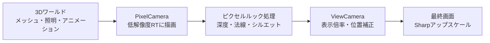
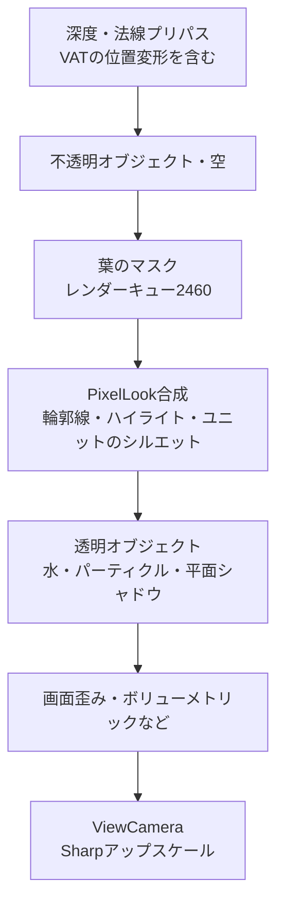

[](https://hits.sh/epheria.github.io/)

## レンダリングを修正しながら考え直したピクセルアート

最近、ProjectSurvivorReviveのレンダリングを大きく見直しました。通常のLitマテリアルにも輪郭線を適用し、小さな兵士やゾンビが地面に埋もれて見える問題を減らしました。カメラをゆっくり動かすとピクセルブロックの幅が交互に変わっていたアップスケールも、同時に修正しました。

最初は、低解像度のRenderTextureを作り、Pointフィルターで拡大すれば、目指す絵に近づくと考えていました。実際にピクセルブロックはできましたが、建物の面は読み取りにくく、小さなユニットは線のせいでかえって潰れて見えました。静止画では問題なかったピクセルにも、カメラが動くと別の問題が現れました。

今回の改善で重要だったのは、**限られたピクセルにどの形状情報を残すか、その情報が動いている間もどれだけ一貫して見えるか**でした。実装順に沿って、まずピクセルグリッドとアップスケールを取り上げ、その上で形状と照明の情報をどう選ぶかを説明します。

冒頭の画像は、プロジェクトの現在のレンダリングで表現した森と建物です。内部RTは640×360、最終Game viewは1920×1080です。地形、岩、木、水にはCritterの環境アセットを使用し、建物にはSyntyのPOLYGON Apocalypseアセットを配置しました。建物のURP/Litマテリアルにも、低解像度カメラとプロジェクトのSharpアップスケール、PixelLook処理が適用されています。

まず、基盤となった[Critter 3D Pixel Camera](https://marketplace.unity.com/packages/tools/camera/critter-3d-pixel-camera-263695)の役割を分けて考える必要があります。カメラは**どこを、いくつのサンプルで描くか**を、環境シェーダーは**そのサンプルにどの明暗と境界を残すか**を担当します。インストール済みのカメラ2.3.1、環境2.3.2のドキュメントと、実際のC#、Shader Graph、HLSLを照合しました。以下では、Critterの基本動作とプロジェクトで変更した処理を区別して説明します。

この記事の実装基準はUnity **6000.3.11f1 / URP 17.3.0**、レンダリング改善コミット`5bd1a11e7`です。サンプルコードは主要な計算を説明するための擬似コードであり、そのまま貼り付けて使う完成シェーダーではありません。

## 1. ワールドのピクセルと画面のピクセルは異なります

### Critterは最初から少ないピクセルでワールドを描きます

Critterの中心は、2台の正投影カメラと表示用クアッドです。PixelCameraが3Dワールドを内部RTに描画し、ViewCameraがそのRTを持つクアッドを最終画面に表示します。



PixelCameraの解像度を変えることと、ViewCameraの表示倍率を変えることでは結果が異なります。前者は物体を何個のテクセルで表現するかを決め、後者はすでに描かれたテクセルを画面上でどれだけ大きく見せるかを決めます。

`PixelCameraManager`は、生成したRTをPixelCameraの`targetTexture`に接続します。`UpscaledCanvas`は同じRTを表示マテリアルの`_LowResTexture`に渡します。ベンダーの元の`UpscaleShaderURP`グラフは、このテクスチャをUV0でサンプリングしてUnlitの色として出力する、単純な構造です。RTがPointフィルターなので、最も近いテクセルの色をそのまま拡大します。

したがって、ピクセルブロックを作る最初の段階は、高解像度画像にモザイクを重ねるポストエフェクトではありません。**三角形の可視性、材質と照明の結果を、最初から小さなレンダーターゲットのピクセルグリッドに記録します。** モデルの頂点数やアニメーションデータも、ピクセル数に合わせて減るわけではありません。クアッドの表示シェーダー自体には、深度に基づく輪郭線、パレット制限、ディザリングは含まれていません。

現在の基本解像度ポリシーでは、RTの高さを維持し、画面のアスペクト比に合わせて幅を計算します。高さ360で16:9なら640×360になりますが、ウィンドウの比率が変わっても幅が常に640になるわけではありません。

### 正投影ではワールドのテクセル間隔を定義できます

正投影カメラの`orthographicSize`を$$O$$、内部RTの高さを$$H$$とすると、カメラ平面上で1テクセルが担当する長さは次のようになります。`orthographicSize`が画面の縦方向の範囲の半分であるという定義は、[Unityのカメラドキュメント](https://docs.unity3d.com/6000.3/Documentation/ScriptReference/Camera-orthographicSize.html)で確認できます。

$$
\Delta_{\text{world}} = \frac{2O}{H}
$$

たとえば$$O=15$$、$$H=360$$なら、1テクセルは約0.0833mで、カメラ平面に投影された1mは12テクセルです。傾いた地面の実際のワールド長やキャラクターの身長には投影方向が影響するため、どの方向の1mも12テクセルになるという意味ではありません。この記事の代表画像とデバッグ画像では$$O=24$$、岩の詳細比較では$$O=20$$を使用しました。

正投影では、カメラ平面に平行な同じ長さは、深度に関係なく同じピクセル長になります。1つの$$\Delta_{\text{world}}$$でカメラ移動グリッドを定義できる理由です。距離によって物体の大きさが変わる透視投影カメラに、この計算だけをそのまま適用して同じ安定性を得ることはできません。

建物の窓が1テクセルより小さいなら、モデルの窓枠をさらに精密に作っても、現在の視野では安定して表示されません。アセット制作の段階から、目標とするカメラで物体が占めるテクセル数を確認する必要があるのは、このためです。

### ワールドのズームと表示のズームでは情報量が異なります

Critterの`GameCameraZoom`はPixelCameraの正投影範囲を、`ViewCameraZoom`は完成したRTを見る範囲を変えます。端の余白補正を除けば、次のように比較できます。

| 変更 | 同じ物体に割り当てられる内部テクセル | 画面上の1テクセルの大きさ |
|:--|:--|:--|
| ワールドの正投影半高を15 → 7.5に変更し、表示ズームは維持 | 密度は約2倍 | 維持 |
| ワールドの視野を維持し、表示ズームを1 → 0.5に変更 | 維持 | 約2倍 |

どちらも画面上で物体が大きくなりますが、前者はより狭いワールドを再描画して細部の情報を得ます。後者はRTの中央を拡大するため、既存のピクセルブロックだけが大きくなります。後述するズームイン時のディテールランプは、この2つの制御を組み合わせたプロジェクトのポリシーです。

## 2. Pointフィルターでも整数倍率は崩れることがあります

640×360を1920×1080に表示すると、縦方向の倍率は3です。元の1テクセルが画面の3×3ピクセルを占めるように見えます。

しかし、以前の実装では画面の端に隙間ができないように、表示クアッドを1.01倍に拡大していました。Critterカメラの表示領域には、高さを基準とした`1 - 2/H`の内側への縮小補正もありました。この2つの補正が重なると、実際の倍率は次のようになります。

$$
S_{\text{legacy}} = 3 \times \frac{1.01}{1 - 2/360} \approx 3.047
$$

1テクセルを3.047個の画面ピクセルで表現することはできません。Pointサンプルを出力グリッドに配置すると、3ピクセル幅になるブロックと4ピクセル幅になるブロックができます。カメラが動くと、4ピクセル幅になるブロックの位置も変わります。

[Pointフィルター](https://docs.unity3d.com/6000.3/Documentation/ScriptReference/FilterMode.Point.html)は、近いテクセルを選ぶ方法です。表示倍率や画面グリッドの開始位置まで揃える機能ではありません。

解決策は、画面を覆うための余裕と、テクセルの表示サイズを分離することでした。クアッドは十分大きく保ちつつ、拡大したクアッドのUVを基準領域に戻します。

```hlsl
// 概念コード: coverageはクアッドを拡大した比率です。
float2 rtUv = (canvasUv - 0.5) * coverage + 0.5;
```

中央のテクセルサイズは維持され、RTの外にはみ出す端の細い帯では、clampによって端のテクセルを引き延ばします。画面外のワールドを追加で描画するoverscanとは動作が異なります。

Sharpモードの表示倍率は、未補正のViewCameraズーム$$z$$を含めると次のようになります。

$$
S_{\text{sharp}} = \frac{H_{\text{output}}}{H_{\text{RT}} \lvert z \rvert}
$$

| 内部RTと表示条件 | 画面の高さ | Sharp倍率 |
|:--|--:|--:|
| 640×360・ズーム1 | 1080 | 3 |
| 640×360・ズーム1 | 1440 | 4 |
| 640×360・ズーム0.8 | 1080 | 3.75 |
| 1920×1080・ズーム1 | 1440 | 約1.333 |

1440pという画面解像度自体が、非整数倍率を意味するわけではありません。内部RTとズームを併せて見る必要があります。倍率が整数でも、テクセル境界が画面ピクセルの境界からずれていれば境界のブレンドが発生するため、開始位置の整列も必要です。

### 非整数倍率には狭い境界ブレンドを使います

連続ズームと多様なウィンドウサイズに対応すると、非整数倍率を完全に避けるのは難しくなります。そのためSharpアップスケールでは、テクセル内部の均一な色を維持しながら、境界だけに狭いブレンド領域を設けています。

```hlsl
// 概念コード: テクセル座標を再配置し、linearサンプルで読みます。
float2 texelPosition = rtUv * rtSize;
float2 seam = floor(texelPosition + 0.5);
float2 texelsPerScreenPixel = max(fwidth(texelPosition), epsilon);

float2 offset = (texelPosition - seam)
  / texelsPerScreenPixel * sharpness;
float2 sampleUv = (seam + clamp(offset, -0.5, 0.5)) / rtSize;
```

`fwidth`で、画面の1ピクセル内でテクセル座標がどれだけ変化するかを求めます。その値でブレンド幅を画面ピクセル単位に合わせます。プロジェクトの静止時の標準幅は、画面の0.5ピクセルです。


_左がLegacy、右がSharpです。Critter Toonの岩の構造物がある同じ静止場面を撮影し、マテリアル自身の輪郭線、PixelLook、ボリューメトリック照明は両方で維持しました。内部RTは640×360、出力は1920×1080、未補正の表示ズームは0.8です。同じ画面座標から400×280の領域を切り出し、比較のためにそれぞれnearest方式で2倍に拡大しました。Legacyの余白倍率補正も同時に変わるため、2枚の画像の構図には小さな違いがあります。_

現在のRTの`filterMode`はPointですが、Sharpシェーダーは明示的なlinearサンプラーで上記のUVを読みます。したがって、RTのフィルター設定だけで最終的なアップスケール方式を判断してはいけません。Sharpは非整数倍率での境界の変化を緩和しますが、3.75倍の画面を、すべてのブロックが厳密に同じ整数幅になる画面には変えません。

### カメラのAAと表示境界のブレンドは別です

現在のレンダーパイプラインアセットのMSAA値は1で、カメラのFXAA、SMAA、TAAも使用していません。前述のSharpの境界ブレンドは、これらの設定とは独立した**表示段階のフィルター**です。ピクセルアートではすべてのAAを切る、という一文だけでは現在の画面を説明できません。

ベンダーの元のRTはARGB32でしたが、プロジェクトでは発光やポストプロセスの値を保持するため、`DefaultHDR`に変更しました。HDR形式が最終パレットを決めるわけではなく、実際の保存形式もプラットフォームによって決まります。また、表示用RTのPoint設定は、ワールドマテリアルのすべての元テクスチャまでPointに強制するという意味ではありません。

## 3. カメラ移動時は2つのグリッドの役割を分けます

低解像度カメラを連続座標で動かすと、静止している建物でもピクセルのサンプル位置が変わり続けます。細い窓枠や斜線は、あるフレームで現れ、次のフレームで消えることがあります。

### VoxelGridMovementはカメラのサンプル位置を揃えます

Critterの`PixelCameraManager`は、追従対象`FollowedTransform`の位置をカメラの向きを基準とした座標に回転し、先ほど求めたワールドのテクセル間隔で丸めます。ワールドカメラのTransformを直接動かすよりも追従対象を制御すべきなのは、managerが`LateUpdate`で実際のカメラ位置を決め直すためです。

```csharp
// 概念コード: ワールド原点に固定したグリッドの向きだけをカメラ軸に合わせます。
var cameraSpacePosition = WorldToCameraBasis(desiredPosition);
var snappedPosition = Round(cameraSpacePosition / worldTexelSize)
  * worldTexelSize;
pixelCamera.position = CameraBasisToWorld(snappedPosition);
```

実際のコードは`InverseTransformPoint`ではなく`InverseTransformDirection`を使用します。カメラ位置を原点として差し引くローカルグリッドではなく、**ワールド原点に固定され、カメラのright/up/forward方向に配置されたグリッド**です。3軸すべてを丸めますが、正投影画像のピクセル位置に直接対応する軸はright/upです。

この機能の名前にはVoxelが含まれますが、メッシュを立方体に変えたり、頂点をボクセル化したりはしません。別の`VoxelGridAdjuster`も、取り付けたオブジェクトの位置を同じグリッドに揃えるだけです。オブジェクトごとの表示残差補正がないため、動くユニットに一括適用すると、かえって段階的な移動が目立つことがあります。

### SubpixelAdjustmentsは残った誤差を表示段階に渡します

カメラの向きとテクセル間隔が固定された平行移動では、ワールドのサンプリングが安定します。しかし、低解像度のテクセル間隔だけでカメラが動くと、ゆっくりしたパンが階段状に見えます。ViewCameraは要求位置とスナップ位置の残差を受け取り、表示位置を補正します。

RTのアスペクト比を$$a$$、要求位置とスナップ位置の間のカメラ平面上の残差を$$(d_x,d_y)$$とすると、追従対象のビューポート座標は次のようになります。

$$
v = \left(\frac12+\frac{d_x}{2Oa},\;\frac12+\frac{d_y}{2O}\right)
$$

ベンダーのコードは、この位置を`WorldToViewportPoint`で求めます。表示クアッドの基準サイズ$$(2Oa,2O)$$を掛けてViewCameraの位置に変換すると、再び$$(d_x,d_y)$$になります。

$$
\left(v-\frac12\right)\odot(2Oa,2O)=(d_x,d_y)
$$

ワールドを描くカメラはグリッド上に保ち、すでに描いた画像の表示位置だけを残差分だけ動かす構造です。中間位置のワールドを追加で描画したり、消えた窓枠を復元したりする方式ではありません。

$$O=15$$、$$H=360$$で残差が0.03mなら、約0.36 RTテクセルです。3倍に拡大すると、最終画面では約1.08ピクセルになります。ここでの**サブピクセルは、低解像度RTの1テクセルより小さい位置**を意味します。LCDのRGBサブピクセルを使うという意味でも、常に最終画面の1ピクセルより小さいという意味でもありません。元のPoint表示には出力ラスタライズによる段差が残りますが、低解像度の1テクセル単位の大きな移動を、より細かい出力グリッド上の移動に分けることができます。

### プロジェクトでは移動時と静止時の表示ポリシーを分離しました

表示位置も常に画面ピクセルにスナップするのか、連続座標を許すのかを選ぶ必要があります。

| 表示位置のポリシー | 得られるもの | 受け入れるもの |
|:--|:--|:--|
| SnapToPixels | 出力グリッドに整列した静止画 | ゆっくりした移動が数フレームごとに1ピクセルずつ進む |
| Smooth | 連続的な表示移動 | 止まった位置によって境界ブレンドが残る |
| SmoothWhileMoving | 移動中は連続補正、停止後はグリッドに整列 | 停止直後の短い収束区間 |

現在のデフォルトは`SmoothWhileMoving`です。移動中は連続的な残差と画面の1ピクセル幅の境界ブレンドを使い、停止すると約0.15秒かけて出力グリッドに収束しながら、静止時の0.5ピクセル幅に戻ります。この時間はゲームの`timeScale`ではなく、実時間を基準にしています。

スナップする対象はカメラ位置です。メッシュアニメーション、移動するユニット、影のすべてのサンプルが自動的に整列するわけではありません。回転するとカメラ基準のグリッドの向きも変わるため、平行移動で得られた安定性をそのまま期待することはできません。ベンダーのサンプルとプロジェクトの自由回転処理では、回転中に`VoxelGridMovement`と`SubpixelAdjustments`を切り、回転が終わると再び有効にします。

ズームによって$$2O/H$$が変わる場合にも、サンプルグリッドは変化します。同じグリッド上の移動を安定させる機能と、回転やズーム中にすべてのピクセルパターンを固定する機能は、区別する必要があります。

前述の静止比較画像は、アップスケールの違いを示しています。連続移動の感触や時間的なちらつきまで、1枚の写真で検証したわけではありません。

## 4. Critterの環境シェーダーは明暗と境界を単純化します

低解像度レンダリングだけでは、小さなテクスチャ模様と連続的な明暗が混ざって見えることがあります。Critterの環境シェーダーは、Toonの明暗と選択的な輪郭線で面の区別を助けます。**画面解像度の離散化と照明値の離散化は、別の段階です。**

### ToonRampは光の値を段階に揃えます

インストール済みの`ToonRamp`サブグラフの計算を記号で表すと、次のようになります。$$S$$はShades、$$B$$はBrightness、$$M$$はMinimumDarknessです。

$$
R(x)=\operatorname{lerp}\left(M,1,
\operatorname{saturate}\left(\frac{\lceil Sx+B\rceil}{S}\right)\right)
$$

`ceil`が連続的な光の値を段階的に切り上げ、明るさのオフセットが段階の切り替わる位置を移動させます。通常のToonと葉の処理では、法線と光源方向の内積を$$(N\cdot L+1)/2$$に変換した値を使います。この結果で暗い色と明るい色を選択・補間し、環境光、メインライトの色と影、追加ライトなどを組み合わせます。

最終RGBそのものを固定パレットに置き換えるわけではありません。$$M$$も最終画面の明るさの下限ではなく、**照明に使う色を選ぶランプの下限**です。その後の光源と影の計算によって、画面の色は再び変わります。草や花のビルボード処理では、面の向きによる明暗の変化ではなく、固定のToon入力0.5を使う点も、葉の処理とは異なります。

### 元の輪郭線はマテリアルで4近傍を読みます

`PixelOutlineSetupFeatureUnity6`は、深度、法線、色の入力を要求します。名前だけを見ると全画面に線を描くFeatureに見えますが、インストール済みのUnity 6版の`RecordRenderGraph`には合成の描画処理がありません。実際の線の計算は、`Outlines.hlsl`を呼び出す環境マテリアルで実行されます。

現在位置と上下左右1テクセル分の深度、法線を比較します。元の深度判定では、線形のm単位ではなく、生の深度$$D$$で次の差分を作ります。

$$
E_D(p)=\sum_{q\in N_4(p)}\bigl(D(p)-D(q)\bigr)
$$

値の符号としきい値でシルエット候補を選び、深度の線がなければ法線差の方向バイアスと大きさを使います。深度の線が法線の線より優先されます。この生の深度しきい値は、後述する0.5mのような物理的な長さではないため、数値をそのまま移して比較してはいけません。

通常のToonグラフは、判定した強度を**Overlayブレンドの重み**として使います。単に黒や輪郭線の色に置き換えるわけではありません。マテリアルごとに深度と法線の強度や色が異なり、法線の強度を負に設定した場合もあるため、元の法線境界を常に明るいハイライトとして説明することはできません。

通常の`Toon`グラフはこの輪郭線処理に参加しますが、Terrainやインスタンシング植生のグラフはToonLightingを共有していても、同じ輪郭線ノードを持ちません。通常のLitマテリアルも、この処理には参加しません。プロジェクトで別の全画面PixelLookを作った理由です。

### 葉はカメラを向きますが照明は樹冠の方向に従います

Critterのビルボード植生は、葉や草の小さなポリゴンをカメラ平面の向きに回転させ、面が横を向いて見えなくなることを減らします。建物や木の幹まで、このビルボードに変わるわけではありません。

`Billboard`サブグラフは、インスタンスの原点に、逆ビュー行列で回転させた頂点オフセットを加えます。風による変形前の基本配置は、次のように考えられます。

```hlsl
// 概念コード: offsetはサイズを適用した各頂点の相対位置です。
float3 worldPosition = instanceOrigin
  + mul((float3x3)UNITY_MATRIX_I_V, offset);
```

確認した葉と草のグラフはOpaqueで、Alpha Clipを有効にしていません。色テクスチャを切り抜いて葉の形を作るのではなく、**ポリゴンそのものの境界がシルエットを作ります。** UVも色のスプライトを読むためには使わず、風でどの部分がどれだけ曲がるかの重み付けに使います。

重要なのは、位置と法線を別々に扱う点です。`MeshInstancesBehaviour`は元の樹冠表面から位置と法線をサンプリングし、インスタンスの変換と法線をGPUバッファーに渡します。葉の頂点位置はカメラを向いても、照明用の法線には、サンプルを取得した樹冠表面の方向を使います。葉がすべて正面を向いていても、樹冠全体には丸い塊としての明暗が残ります。

インスタンスは`DrawMeshInstancedIndirect`で描画を送信します。これは多くの葉を描く方法であり、ピクセル化を生み出す演算ではありません。この描画ではシャドウキャストを無効にしていますが、不透明の深度書き込みは別なので、葉は深度に残ります。風も頂点変形で処理するため、カメラをグリッドに揃えたからといって、すべての葉のピクセル変化がなくなるわけではありません。

## 5. プロジェクトの輪郭線は必要な境界を選び直します

既存のCritterの一部のToonマテリアルには、独自の輪郭線がありました。通常のLitの建物や別のVATユニットは同じ処理を受けず、画面内で形状を強調するルールが異なっていました。

追加した`PixelLookFeature`は、ワールドカメラの色、深度、法線を読みます。不透明オブジェクトと空を描いた後、透明オブジェクトを描く前に、葉のマスクと全画面合成を実行します。URPで使うテクスチャの役割は、[RenderGraphのフレームデータドキュメント](https://docs.unity3d.com/6000.3/Documentation/Manual/urp/render-graph-frame-data-reference.html)にまとめられています。


_左はPixelLookの輪郭線とハイライトがOFF、右はONです。同じ静止場面から620×500の領域を同じ座標で切り出し、横に並べました。岩の構造物の大きな面と折れ曲がる角で、追加された境界を比較できます。Critter Toonマテリアルの明暗と独自の輪郭線、ボリューメトリック照明は両方に残っているため、OFFがすべての輪郭線を除去したという意味ではありません。_

### 深度差分は平らな面とシルエットを区別します

現在のピクセル$$p$$と上下左右の4近傍$$q$$の線形視点深度を読み、次の値を計算します。

$$
L(p) = \sum_{q \in N_4(p)} \bigl(d(q) - d(p)\bigr)
$$

正投影の平らな面や一定の傾斜では、反対方向の深度変化が相殺されます。手前の物体のシルエットでは、奥の背景の深度が入ることで正の値が大きくなります。プロジェクトでは、0.5mを超える値を環境輪郭線の候補に使います。

線の色を黒で覆う代わりに、元の色を0.45倍に暗くします。岩と茶色い屋根が同じ黒い帯になるのを減らし、物体同士の色の関係を残すための選択です。深度と法線の近傍サンプルは、整数テクセル座標の`LOAD`で読み、判定の途中で境界が補間されないようにしました。

### 法線差には凸の条件を加えます

法線差だけで角を明るくすると、壁が地面に接する場所や木の根元にも明るい線ができます。形が折れ曲がったという事実だけでは、凸の角と凹の接合部を区別しにくいためです。

現在の実装では、向かい合う近傍の深度から2次差分も確認します。

$$
C(p,q) = d(q) + d(q_{\text{opposite}}) - 2d(p)
$$

この値が少なくとも0.02mを超え、ビュー空間の法線差が指定したバイアス方向の条件を満たす場合に、ハイライト候補を累積します。深度条件は、プロジェクトの正投影視野で接合部の余計な線を抑えるためのヒューリスティックです。あらゆるメッシュの幾何学的な曲率を正確に復元する計算ではありません。


_合成シェーダーのデバッグビューです。赤は環境輪郭線、緑は角のハイライトです。同じピクセルに両方の条件が重なると、輪郭線が優先されます。判定色を確認できるように、ボリューメトリックとカメラのポストプロセスを切った状態で撮影しました。_

明るい線を両方の面に作ると、細い境界が太い帯に見えます。法線バイアスは、角の片側を選ぶために使います。上の画像でも、樹冠全体に線を付けるのではなく、主に構造物と幹の境界が強調されています。

## 6. 小さなユニットは体の内側のピクセルを節約します

建物に使った内側の輪郭線を小さな兵士にも適用すると、胴体の情報が減ります。幅が5テクセルの部分で両側を1テクセルずつ暗くすると、元の体を示す幅は3テクセルしか残りません。

そこでユニットには、体の外側にある背景の1テクセルを使うシルエットを適用しました。DepthNormals出力のアルファにユニットの印を記録し、周囲に現在のピクセルより0.6m以上手前にあるユニットがあれば、現在のピクセルを縁の候補にします。手前を遮る建物のピクセルでは深度条件が成立しないため、ユニットの線が建物を突き抜けて表示されることはありません。

**線が必要かという判定と、どの側に線を残すかという判定も分けました。** 4方向すべてを囲むと、小さなキャラクターが太く見えたためです。現在のデフォルトは、画面に投影したメインライトの反対側に線を残す`AwayFromLight`です。

背景と体がすでに明確に区別できる場所では、シルエットを減らします。線形RGBの加重輝度の平方根を取った近似明度を比較し、差が0.15から線を減らし、0.25でなくします。正確なCIELABの色差計算ではなく、ユニットの縁を適応させるための条件です。

```hlsl
// 概念コード: すでに区別できるユニットには線をあまり加えません。
float contrast = abs(PerceivedLightness(unitColor)
  - PerceivedLightness(backgroundColor));
float rimWeight = 1 - smoothstep(fadeStart, fadeEnd, contrast);

float3 rimBase = lerp(unitColor, backgroundColor, backgroundMix);
float3 rimColor = rimBase * rimKeep;
```

現在の`backgroundMix`は0.5、`rimKeep`は0.4です。黒い服のゾンビに自身の色だけを使うと、縁まで黒くなり、手足と線が一体化します。背景色を一部混ぜると、体と縁の間にも明るさの差を残せます。

上の環境画像は建物と植生の処理を示すものであり、兵士やゾンビのシルエットの検証画像としては使っていません。ユニット処理は、現在のプロジェクトシェーダーの別の実装です。

## 7. 葉は深度に残し輪郭線から除外します

葉と草は、小さなビルボードポリゴンが重なる構造です。特に樹冠の中でポリゴン1枚ごとの深度段差に環境輪郭線を適用すると、黒い点や短い線ができます。これはアルファクリップの使用有無だけの問題ではなく、複数の薄い面を大きな塊として読み取る場面の問題です。

カードを透明キューに移すと輪郭線は減りますが、別の問題が起きます。葉が深度テクスチャに残らない描画経路では、ボリューメトリック照明が木ではなく、その奥の地面までの距離を使います。木の手前で止まるべき霧がより長く蓄積され、樹冠が薄く見えます。

採用した方法は、葉を不透明の深度に維持し、輪郭線とハイライトだけを除外することです。葉のマテリアルを専用のレンダーキュー**2460**に集め、そのキューの`DepthOnly`パスを再描画してマスクを作ります。既存の深度を使うため、画面に見えている葉だけがマスクに残ります。

合成シェーダーは、マスク領域の環境輪郭線とハイライトをスキップします。葉のカード境界と建物の構造的な境界を、同じルールで強調しないわけです。新しい葉のマテリアルを作るときにキューの指定を忘れると、点模様の線が再び現れます。逆に建物が同じキューを使うと、建物の線まで消えます。

## 8. VATの深度もアニメーションに追従する必要があります

プロジェクトのゾンビはVAT(Vertex Animation Texture)で動きます。Forwardパスでだけ頂点を変形し、DepthOnlyとDepthNormalsでは元のメッシュを描くと、色と深度が異なるポーズを示します。輪郭線と遮蔽の判定は、実際に見えている体に追従できません。

今回の実装では、ゾンビと避難民のVATの深度パスにも、対応するアニメーション変形を組み込みました。Forwardと深度パスが同じ位置変形を使うことで、ユニットの印とシルエット候補が画面上の体と一致します。

法線の処理まで、すべてのVATが同じ水準で復元するわけではありません。通常のゾンビと避難民は変形後の位置と入力メッシュの法線を使い、ゾンビの群れは変形後の位置の微分から面法線を求めます。シェーダーに`DepthNormals`パスがあるという事実だけで、変形後の法線まで正確だと判断してはいけません。

## 9. 照明とボリューメトリックも同じピクセルグリッドで考えます

### プロジェクトのユニットの量子化はCritterのToonRampとは異なります

ユニットのメインライトには、段階的な明暗も適用しました。デフォルト値の3は、次のようにメインライトのスカラー値を3分割したグリッドに合わせるという意味です。

$$
Q(x) = \frac{\lfloor \operatorname{clamp}(x,0,1) \cdot 3 + 0.5 \rfloor}{3}
$$

出力可能な値には、$$0, 1/3, 2/3, 1$$が含まれます。環境光と追加ライトは加算され、マテリアル色はその照明結果に掛けられるため、最終画面が厳密に3色や3段階の明るさに制限されるわけでもありません。プロジェクトでは、影の減衰を含むメインライトに量子化を適用し、環境光と追加ライトは連続値のまま残しています。

段階的な明暗は面の区別を助けますが、すでに小さいユニットにハイライトまで多く入れると、形状よりも細かなノイズが増えます。現在のユニットの角のハイライトの標準増分は0で、体の視認性は外側のシルエットが担当します。

ディザリングは別の選択肢です。ピクセルパターンで中間値を表現すれば連続したグラデーションを減らせますが、パターンをどの座標系に固定するかによって、移動中にちらつきが生じます。**今回のPixelLookには、ディザリングや最終パレット制限を追加していません。** プロジェクトの別のマップ切り替えエフェクトで使うBayerディザと混同しないようにする必要があります。

### Critterのボリューメトリックは各ピクセルでワールドの光線をサンプリングします

ボリューメトリックの光線も、同じ画面の一部です。Critterの`PixelWorldPosition`グラフは、RTのUVから正投影カメラ平面のワールド位置を作ります。カメラ位置を$$C$$、視野全体のワールドでの横幅と高さを$$W_w,H_w$$とすると、基本関係は次のようになります。

$$
P(u,v)=C+(u-0.5)W_w\,\mathbf{right}
             +(v-0.5)H_w\,\mathbf{up}
$$

このグラフには、`floor`や`round`でワールドの頂点を整数化する演算はありません。名前にあるPixelは、**現在の画像サンプルに対応するワールド位置**を意味します。

ボリューメトリック処理は、この位置と深度を使ってカメラ光線のサンプリング区間を決め、複数の地点のシャドウマップと雲による減衰をサンプリングします。累積した光にも段階化が入ります。エフェクトをPixelCamera側で合成すると、光線が低解像度RTのグリッドに記録され、ワールドと一緒に拡大されます。すでに拡大された画面の表示カメラで別途描く高解像度の光線とは、サンプルグリッドが異なります。

光線は雰囲気を作りますが、前景の線まで明るい霧で覆うと形状のコントラストが減ります。現在のプロジェクトでは、輪郭線の後にボリューメトリック照明が合成されます。エフェクトのOFFとONの比較だけを見るのではなく、実際の照明が重なった最終画面で構造物が読み取れるかを確認する必要があります。

## 10. ズームアウトとズームインでは別の解像度ポリシーを使います

ゲームプレイの内部RTは、常に640×360に固定されているわけではありません。`CameraRig`は基本倍率ティアとして1、1.5、3を使います。16:9の出力では、640×360、960×540、1920×1080に対応します。幅は実際の画面のアスペクト比に合わせて計算します。

ズームアウトのティアが上がるとき、正投影範囲とRT解像度を同じ比率で増やすと、$$2O/H$$が維持されます。より広いワールドを見ながらも、同じ物体が内部RTで占めるテクセル密度を維持するためのポリシーです。増えた画面領域を処理するため、レンダリングコストも併せて考える必要があります。

ズームインでは、大きなピクセルを拡大し続ける代わりに、ワールドのディテールを増やす区間を追加しました。要求ズーム$$q$$が0.5から0.25へ下がる区間で、補正倍率$$k$$が1から2へ増えます。

$$
k = \operatorname{clamp}\left(\frac{0.5}{q},1,2\right),\qquad
O' = \frac{O}{k},\qquad z' = qk
$$

表示範囲は$$O'z'=Oq$$で、要求された視野を維持します。RTのサイズはそのままで、PixelCameraがより狭いワールド領域を描画します。ランプ区間では、表示テクセルの大きさを維持しながら、物体に割り当てるテクセル数を増やします。新しいモデルの細部が内部RTに入るのであり、既存画像を復元する方式ではありません。

## 11. パスの順序とコストもピクセルルックの一部です

現在のワールドレンダリングの順序は、次のとおりです。



PixelLookは`BeforeRenderingTransparents`で実行されるため、水やパーティクルに直接同じ輪郭線を作りません。また、Gameタイプ、ワールドレイヤー、`MainCamera`タグを確認し、ViewCameraや補助カメラにはこのパスを追加しません。すでに処理されたワールド画像を表示するカメラが深度ベースのエフェクトを再実行すると、異なる座標系の合成が混ざってしまいます。

RenderGraphでは、色、深度、法線の読み取り依存関係を宣言し、合成結果を新しい色テクスチャに記録したうえで、後続のパスがそのテクスチャを使うように接続します。同じテクスチャを同時に読み書きする方式に単純化してはいけません。登録と実行の区別は、[UnityのRenderGraphパス作成ドキュメント](https://docs.unity3d.com/6000.3/Documentation/Manual/urp/render-graph-write-render-pass.html)を参照できます。

コストは、全画面合成の時間だけではありません。法線を要求することで生じるプリパス、VATの深度描画の送信、葉のマスクの追加描画も併せて見る必要があります。RTが小さくても、頂点処理や描画の送信コストまで同じ比率で減るわけではありません。

640×360の色ピクセル数は1920×1080の1/9ですが、GPU時間全体が1/9になるという意味ではありません。シャドウマップ、コンピュート、UI、表示パスは、それぞれの解像度と処理量を持ちます。

今回の撮影では、性能ベンチマークを実施していません。以前の改善記録にあるEditorの数値を、今回の画像やリリースPlayerの性能に一般化してはいません。特に葉のマスクはポリゴン数によって別のコストが生じるため、実際の戦場規模で確認すべき対象です。

## 実装を振り返って

今回、最も印象に残った修正は、クアッドの1%の余白拡大でした。画面を覆うための小さな補正が整数倍率を崩し、カメラのパンでブロック幅が変わる原因になっていました。シェーダーの鮮明さを調整するだけでは解決できない問題でした。

輪郭線では、逆の選択が必要でした。建物の面には線を加えましたが、葉のカードからは線を除き、小さなユニットでは体の内側ではなく背景ピクセルを使いました。形状を読み取りやすくするルールは、対象のピクセル数とメッシュ構造によって異なりました。

今後は、停止時に整数倍率に近いズーム位置へ収束させるポリシーと、1440pで最大ズームアウトしたときのRT上限を検討する余地があります。この2項目は現在実装されている機能ではなく、今後の課題です。カメラを自由に回転させる場合にも、グリッド補正とボリューメトリック投影を別々に確認する必要があります。

## 撮影条件と実装ファイル

写真は、プロジェクト共通のカメラPrefabとレンダラーにすでに適用済みの変更を使った結果です。代表画像とデバッグ画像は、既存の自然環境を維持しながら、建物だけをSyntyアセットに置き換えた一時的な撮影構成です。詳細比較には、面の境界とピクセルブロックがよく分かるCritterの岩の構造物の、以前の撮影画像を使いました。どちらもCritterの元のパッケージそのままのレンダリング結果を意味するものではなく、元のシーンやアセットを上書きしていません。

Game viewは1920×1080、内部RTは640×360です。各A/Bでは`Time.timeScale = 0`で停止させ、カメラの姿勢を維持しました。代表画像とデバッグ画像は正投影半高24で、ボリューメトリックとカメラのポストプロセスはOFFです。岩の詳細比較は正投影半高20で、ボリューメトリック照明を有効にした同じ条件の最終画面を比較しました。キャプチャはPixelCameraだけの再描画ではなく、最終Game viewを使い、比較画像には切り抜きと明記したnearest拡大のみを行いました。

元の比較画像: [輪郭線OFF](/assets/img/post/survivor/3d-pixel-rendering/edges-off.png)、[ON](/assets/img/post/survivor/3d-pixel-rendering/edges-on.png)、[Legacyアップスケール](/assets/img/post/survivor/3d-pixel-rendering/upscale-legacy.png)、[Sharpアップスケール](/assets/img/post/survivor/3d-pixel-rendering/upscale-sharp.png)。具体的な画像条件は、[撮影メタデータ](/assets/img/post/survivor/3d-pixel-rendering/capture-metadata.json)に記録しています。

Critterの動作分析に使ったベンダーのドキュメントは、パッケージに含まれる`3D_Pixel_Camera_Documentation_2.3.1.pdf`と`Critter_Environment_Documentation_2.3.2.pdf`です。ドキュメントの説明を、以下のインストール済みファイルと照合しました。ベンダーのパスにあるファイルでも、現在のプロジェクトで変更した部分は元の動作と区別しました。

| Critterのファイル | 確認した仕組み |
|:--|:--|
| `PixelCameraManager.cs`・`CanvasViewCamera.cs` | ワールドグリッドへのスナップと表示残差の補正 |
| `UpscaledCanvas.cs`・`UpscaleShaderURP.shadergraph` | RTのクアッドへの接続と拡大表示 |
| `ToonRamp.shadersubgraph`・`ToonLighting.shadersubgraph` | 段階的な明暗と2つの材質色の補間 |
| `PixelOutlineSetupFeatureUnity6.cs`・`Outlines.hlsl`・`Toon.shadergraph` | 入力テクスチャの要求、境界の判定、Overlay合成 |
| `Billboard.shadersubgraph`・`MeshInstancesBehaviour.cs` | カメラの向きに合わせた頂点配置と表面法線のサンプリング |
| `PixelWorldPosition.shadersubgraph`・`RaymarchLogic.hlsl` | ピクセルごとの光線位置と影・雲の累積 |

プロジェクトで改善した部分のエントリーポイントは、次のとおりです。

| 実装ファイル | 担当する部分 |
|:--|:--|
| `PixelCanvasCoverageFitter.cs` | coverageと倍率の分離、サブピクセル移動と停止時の収束 |
| `PixelUpscaleSample.hlsl` | UV補正と境界ブレンドのサンプリング |
| `CameraRig.cs` | RTのティアとズームイン時のディテールランプ |
| `PixelLookFeature.cs`・`PixelLookPass.cs` | カメラ選択、葉のマスク、RenderGraph合成 |
| `PixelLookSettings.cs`・`PixelLook.asset` | 輪郭線、シルエット、メインライトの段階の調整値 |
| `PixelLookEdges.shader` | 深度、法線、印による線の選択 |
| `PixelLookCommon.hlsl` | ユニットの印とメインライトの量子化 |

カメラとパスのコードは`Assets/Scripts/GameMode/`と`Assets/Scripts/Core/Rendering/`に、アップスケールと合成シェーダーは`Assets/Shaders/Rendering/`にあります。ユニット共通の関数は`Assets/VFX/Shaders/`にあります。変更済みの共通カメラPrefabとアップスケールマテリアルはThirdPartyのパスにあるため、パッケージ更新時にプロジェクトの変更が保持されるかも確認する必要があります。
