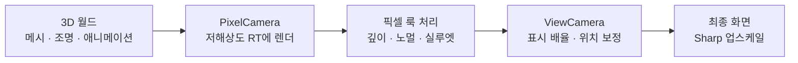
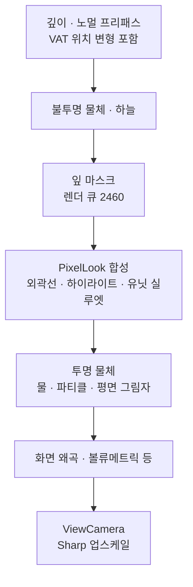

[](https://hits.sh/epheria.github.io/)

## 렌더링을 고치면서 다시 생각한 픽셀 아트

최근 ProjectSurvivorRevive의 렌더링을 크게 손봤습니다. 일반 Lit 머티리얼에도 윤곽선을 적용하고, 작은 병사와 좀비가 바닥에 묻히는 문제를 줄였습니다. 카메라를 천천히 움직일 때 픽셀 블록의 폭이 번갈아 바뀌던 업스케일도 함께 고쳤습니다.

처음에는 저해상도 RenderTexture를 만들고 Point 필터로 확대하면 원하는 그림에 가까워질 것이라고 생각했습니다. 실제로 픽셀 블록은 생겼지만, 건물의 면은 잘 읽히지 않고 작은 유닛은 선 때문에 더 뭉쳤습니다. 정지 화면에서 괜찮았던 픽셀도 카메라가 움직이면 다른 문제가 나타났습니다.

이번 개선에서 중요했던 것은 **제한된 픽셀에 어떤 형태 정보를 남길지, 그 정보가 움직이는 동안 얼마나 일관되게 보일지**였습니다. 구현 순서에 따라 픽셀 격자와 업스케일을 먼저 살펴보고, 그 위에 형태와 조명 정보를 어떻게 고르는지 설명하겠습니다.

상단 이미지는 프로젝트의 현재 렌더링으로 표현한 숲과 건물입니다. 내부 RT는 640×360, 최종 Game view는 1920×1080입니다. 지형·돌·나무·물에는 Critter 환경 에셋을 사용하고, 건물에는 Synty의 POLYGON Apocalypse 에셋을 배치했습니다. 건물의 URP/Lit 머티리얼에도 저해상도 카메라와 프로젝트의 Sharp 업스케일·PixelLook 처리가 적용됩니다.

기반이 된 [Critter 3D Pixel Camera](https://marketplace.unity.com/packages/tools/camera/critter-3d-pixel-camera-263695)의 동작부터 구분할 필요가 있습니다. 카메라는 **어디를 몇 개의 표본으로 그릴지**, 환경 셰이더는 **그 표본에 어떤 명암과 경계를 남길지**를 담당합니다. 설치된 카메라 2.3.1·환경 2.3.2 문서와 실제 C#·Shader Graph·HLSL을 대조했습니다. 아래에서는 Critter의 기본 원리와 프로젝트에서 변경한 처리를 구분해 설명합니다.

이 글의 구현 기준은 Unity **6000.3.11f1 / URP 17.3.0**, 렌더링 개선 커밋 `5bd1a11e7`입니다. 예제 코드는 핵심 계산을 설명하기 위한 의사코드이며, 그대로 붙여 넣는 완성 셰이더는 아닙니다.

## 1. 월드의 픽셀과 화면의 픽셀은 다릅니다

### Critter는 처음부터 적은 픽셀로 월드를 그립니다

Critter의 중심은 두 대의 직교 카메라와 표시용 쿼드입니다. PixelCamera가 3D 월드를 내부 RT에 그리고, ViewCamera가 그 RT를 가진 쿼드를 최종 화면에 표시합니다.



PixelCamera의 해상도를 바꾸는 것과 ViewCamera의 표시 배율을 바꾸는 것은 결과가 다릅니다. 전자는 물체를 몇 개의 텍셀로 표현할지 결정하고, 후자는 이미 그려진 텍셀을 화면에서 얼마나 크게 보여줄지 결정합니다.

`PixelCameraManager`는 생성한 RT를 PixelCamera의 `targetTexture`에 연결합니다. `UpscaledCanvas`는 같은 RT를 표시 머티리얼의 `_LowResTexture`로 넘깁니다. 공급자 원래 `UpscaleShaderURP` 그래프는 이 텍스처를 UV0로 표본 추출해 Unlit 색으로 출력하는 단순한 구조입니다. RT가 Point 필터이므로 가장 가까운 텍셀의 색을 그대로 확대합니다.

따라서 픽셀 블록을 만드는 첫 단계는 고해상도 이미지에 모자이크를 덧씌우는 후처리가 아닙니다. **삼각형의 가시성, 재질과 조명 결과를 처음부터 작은 렌더 타깃의 픽셀 격자에 기록합니다.** 모델의 정점 수나 애니메이션 데이터가 픽셀 수만큼 줄어드는 것도 아닙니다. 쿼드 표시 셰이더 자체에는 깊이 윤곽선, 팔레트 제한, 디더링이 들어 있지 않습니다.

현재 기본 해상도 정책은 RT 높이를 유지하고 화면 비율에 맞춰 가로를 계산합니다. 높이 360에서 16:9이면 640×360이 되지만, 다른 창 비율에서도 가로가 항상 640인 것은 아닙니다.

### 직교 투영에서는 월드 텍셀 간격을 정의할 수 있습니다

직교 카메라의 `orthographicSize`를 $$O$$, 내부 RT의 높이를 $$H$$라고 하면 카메라 평면에서 한 텍셀이 담당하는 길이는 다음과 같습니다. `orthographicSize`가 화면 세로 범위의 절반이라는 정의는 [Unity 카메라 문서](https://docs.unity3d.com/6000.3/Documentation/ScriptReference/Camera-orthographicSize.html)에서 확인할 수 있습니다.

$$
\Delta_{\text{world}} = \frac{2O}{H}
$$

예를 들어 $$O=15$$, $$H=360$$이면 한 텍셀은 약 0.0833m이고, 카메라 평면에 투영된 1m는 12텍셀입니다. 기울어진 지면의 실제 월드 길이나 캐릭터 키에는 투영 방향이 영향을 주므로 모든 방향의 1m가 12텍셀이라는 뜻은 아닙니다. 이 글의 대표·디버그 사진에서는 $$O=24$$, 돌 상세 비교에서는 $$O=20$$을 사용했습니다.

직교 투영에서는 카메라 평면에 평행한 동일 길이가 깊이와 관계없이 같은 픽셀 길이를 가집니다. 하나의 $$\Delta_{\text{world}}$$로 카메라 이동 격자를 정의할 수 있는 이유입니다. 거리에 따라 물체의 크기가 달라지는 원근 카메라에 이 계산만 그대로 적용해서 같은 안정성을 얻을 수는 없습니다.

건물 창문이 한 텍셀보다 작다면 모델에 창틀을 더 정교하게 만들어도 현재 시야에서는 안정적으로 나타나지 않습니다. 에셋 제작 단계부터 목표 카메라에서 물체가 차지할 텍셀 수를 확인해야 하는 이유입니다.

### 월드 줌과 표시 줌은 정보량이 다릅니다

Critter의 `GameCameraZoom`은 PixelCamera의 직교 범위를, `ViewCameraZoom`은 완성된 RT를 보는 범위를 바꿉니다. 가장자리 여유 보정을 제외하면 다음과 같이 비교할 수 있습니다.

| 변경 | 같은 물체에 할당되는 내부 텍셀 | 화면에서 한 텍셀의 크기 |
|:--|:--|:--|
| 월드 직교 반높이 15 → 7.5, 표시 줌 유지 | 약 2배 밀도 | 유지 |
| 월드 시야 유지, 표시 줌 1 → 0.5 | 유지 | 약 2배 |

둘 다 화면에서 물체가 커지지만 첫 번째는 더 좁은 월드를 다시 렌더해 세부 정보를 얻습니다. 두 번째는 RT 중앙을 확대하므로 기존 픽셀 블록만 커집니다. 뒤에서 설명할 줌인 디테일 램프는 이 두 제어를 조합한 프로젝트 정책입니다.

## 2. Point 필터를 써도 정수 배율은 깨질 수 있습니다

640×360을 1920×1080에 표시하면 세로 기준 배율은 3입니다. 원본 텍셀 하나가 화면의 3×3 픽셀을 차지할 것처럼 보입니다.

하지만 이전 구현에서는 화면 가장자리가 비지 않도록 표시 쿼드를 1.01배 키웠습니다. Critter 카메라의 표시 영역에는 높이 기준 `1 - 2/H`의 안쪽 당김도 있었습니다. 두 보정이 겹치면 실제 배율은 다음과 같습니다.

$$
S_{\text{legacy}} = 3 \times \frac{1.01}{1 - 2/360} \approx 3.047
$$

3.047개의 화면 픽셀로 한 텍셀을 표현할 수는 없습니다. Point 표본을 출력 격자에 배치하면 어떤 블록은 3픽셀, 어떤 블록은 4픽셀이 됩니다. 카메라가 이동할 때 4픽셀 폭의 블록이 되는 위치도 바뀝니다.

[Point 필터](https://docs.unity3d.com/6000.3/Documentation/ScriptReference/FilterMode.Point.html)는 가까운 텍셀을 선택하는 방법입니다. 표시 배율이나 화면 격자의 시작 위치까지 맞춰 주는 기능은 아닙니다.

해결은 화면을 덮기 위한 여유와 텍셀의 표시 크기를 분리하는 것이었습니다. 쿼드는 충분히 크게 유지하되, 확대된 쿼드의 UV를 기준 영역으로 되돌립니다.

```hlsl
// 개념 코드: coverage는 쿼드를 키운 비율입니다.
float2 rtUv = (canvasUv - 0.5) * coverage + 0.5;
```

중앙의 텍셀 크기는 유지되고, RT 밖으로 나가는 가장자리의 좁은 띠는 clamp로 끝 텍셀을 늘립니다. 화면 밖 월드를 추가로 렌더하는 overscan과는 동작이 다릅니다.

Sharp 모드의 표시 배율은 원시 ViewCamera 줌 $$z$$를 포함하면 다음과 같습니다.

$$
S_{\text{sharp}} = \frac{H_{\text{output}}}{H_{\text{RT}} \lvert z \rvert}
$$

| 내부 RT · 표시 조건 | 화면 높이 | Sharp 배율 |
|:--|--:|--:|
| 640×360 · 줌 1 | 1080 | 3 |
| 640×360 · 줌 1 | 1440 | 4 |
| 640×360 · 줌 0.8 | 1080 | 3.75 |
| 1920×1080 · 줌 1 | 1440 | 약 1.333 |

1440p라는 화면 해상도 자체가 비정수 배율을 뜻하지는 않습니다. 내부 RT와 줌을 함께 봐야 합니다. 배율이 정수여도 텍셀 경계가 화면 픽셀 경계와 어긋나면 경계 혼합이 생기므로 시작 위치의 정렬까지 필요합니다.

### 비정수 배율에는 좁은 경계 혼합을 사용합니다

연속 줌과 다양한 창 크기를 지원하면 비정수 배율을 완전히 피하기 어렵습니다. 그래서 Sharp 업스케일은 텍셀 내부의 평평한 색을 유지하면서 경계에만 좁은 혼합 구간을 둡니다.

```hlsl
// 개념 코드: 텍셀 좌표를 재배치한 뒤 linear 표본으로 읽습니다.
float2 texelPosition = rtUv * rtSize;
float2 seam = floor(texelPosition + 0.5);
float2 texelsPerScreenPixel = max(fwidth(texelPosition), epsilon);

float2 offset = (texelPosition - seam)
  / texelsPerScreenPixel * sharpness;
float2 sampleUv = (seam + clamp(offset, -0.5, 0.5)) / rtSize;
```

`fwidth`로 텍셀 좌표가 화면 한 픽셀에서 얼마나 변하는지 구합니다. 그 값으로 혼합 폭을 화면 픽셀 단위에 맞춥니다. 프로젝트의 정지 상태 기본 폭은 0.5 화면 픽셀입니다.


_왼쪽 Legacy, 오른쪽 Sharp입니다. Critter Toon 돌 구조물의 같은 정지 장면을 촬영했으며, 머티리얼 자체 윤곽선·PixelLook·볼류메트릭 조명은 양쪽에 유지했습니다. 내부 RT 640×360, 출력 1920×1080, 원시 표시 줌 0.8입니다. 동일한 화면 좌표에서 400×280 영역을 자르고, 비교를 위해 각각 nearest 방식으로 2배 확대했습니다. Legacy의 여유 배율 보정도 함께 바뀌므로 두 이미지의 구도에는 작은 차이가 있습니다._

현재 RT의 `filterMode`는 Point이지만 Sharp 셰이더는 명시적인 linear 샘플러로 위 UV를 읽습니다. 따라서 RT의 필터 설정만 보고 최종 업스케일 방식을 판단하면 안 됩니다. Sharp는 비정수 배율의 경계 변화를 완화하지만, 3.75배 화면을 모든 블록이 정확히 같은 정수 폭인 화면으로 만들지는 못합니다.

### 카메라 AA와 표시 경계의 혼합은 별개입니다

현재 렌더 파이프라인 자산의 MSAA 값은 1이고 카메라의 FXAA·SMAA·TAA도 사용하지 않습니다. 앞의 Sharp 경계 혼합은 이 설정들과 독립적인 **표시 단계의 필터**입니다. 픽셀 아트에서 모든 AA를 끈다는 한 문장만으로 현재 화면을 설명할 수는 없습니다.

공급자 원래 RT는 ARGB32였지만 프로젝트에서는 발광과 후처리 값을 유지하도록 `DefaultHDR`로 변경했습니다. HDR 형식이 최종 팔레트를 정해 주는 것은 아니며, 실제 저장 형식도 플랫폼에 따라 결정됩니다. 또한 표시 RT의 Point 설정은 월드 머티리얼의 모든 원본 텍스처까지 Point로 강제한다는 뜻이 아닙니다.

## 3. 카메라가 움직일 때는 두 격자의 역할을 나눕니다

저해상도 카메라를 연속 좌표로 움직이면 정지한 건물도 픽셀 샘플 위치를 계속 바꿉니다. 얇은 창틀이나 대각선은 한 프레임에 나타났다가 다음 프레임에 사라질 수 있습니다.

### VoxelGridMovement는 카메라의 표본 위치를 맞춥니다

Critter의 `PixelCameraManager`는 추적 대상 `FollowedTransform`의 위치를 카메라 방향 기준 좌표로 회전하고, 앞서 구한 월드 텍셀 간격으로 반올림합니다. 월드 카메라의 Transform을 직접 움직이기보다 추적 대상을 제어해야 하는 이유는 manager가 `LateUpdate`에서 실제 카메라 위치를 다시 결정하기 때문입니다.

```csharp
// 개념 코드: 월드 원점에 고정된 격자의 방향만 카메라 축에 맞춥니다.
var cameraSpacePosition = WorldToCameraBasis(desiredPosition);
var snappedPosition = Round(cameraSpacePosition / worldTexelSize)
  * worldTexelSize;
pixelCamera.position = CameraBasisToWorld(snappedPosition);
```

실제 코드는 `InverseTransformPoint`가 아니라 `InverseTransformDirection`을 사용합니다. 카메라 위치를 원점으로 빼는 로컬 격자가 아니라 **월드 원점에 고정되고 카메라 right/up/forward 방향으로 놓인 격자**입니다. 세 축을 모두 반올림하되, 직교 영상의 픽셀 위치와 직접 대응하는 축은 right/up입니다.

이 기능의 이름에 Voxel이 들어가지만 메시를 정육면체로 바꾸거나 정점을 복셀화하지는 않습니다. 별도 `VoxelGridAdjuster`도 부착한 객체의 위치를 같은 격자에 맞출 뿐입니다. 객체별 표시 잔차 보정이 없으므로 움직이는 유닛에 일괄 적용하면 오히려 계단식 이동이 드러날 수 있습니다.

### SubpixelAdjustments는 남은 오차를 표시 단계로 보냅니다

카메라 방향과 텍셀 간격이 고정된 평행 이동에서는 월드 샘플링이 안정됩니다. 그러나 저해상도 텍셀 간격으로만 카메라가 움직이면 느린 패닝이 계단처럼 보입니다. ViewCamera는 요청 위치와 스냅 위치의 잔차를 받아 표시 위치를 보정합니다.

RT 종횡비를 $$a$$, 요청 위치와 스냅 위치 사이의 카메라 평면 잔차를 $$(d_x,d_y)$$라고 하면 추적 대상의 뷰포트 좌표는 다음과 같습니다.

$$
v = \left(\frac12+\frac{d_x}{2Oa},\;\frac12+\frac{d_y}{2O}\right)
$$

공급자 코드는 이 위치를 `WorldToViewportPoint`로 구합니다. 표시 쿼드의 기준 크기 $$(2Oa,2O)$$를 곱해 ViewCamera의 위치로 바꾸면 다시 $$(d_x,d_y)$$가 됩니다.

$$
\left(v-\frac12\right)\odot(2Oa,2O)=(d_x,d_y)
$$

월드를 그리는 카메라는 격자에 남기고, 이미 그린 이미지의 표시 위치만 잔차만큼 옮기는 구조입니다. 중간 위치의 월드를 추가 렌더하거나 사라진 창틀을 복원하는 방식은 아닙니다.

$$O=15$$, $$H=360$$에서 잔차 0.03m는 약 0.36 RT 텍셀입니다. 3배 확대하면 최종 화면에서는 약 1.08픽셀입니다. 여기서 **서브픽셀은 저해상도 RT 한 텍셀보다 작은 위치**를 뜻합니다. LCD의 RGB 서브픽셀을 사용한다는 뜻도, 항상 최종 화면 1픽셀보다 작다는 뜻도 아닙니다. 원래 Point 표시에는 출력 래스터의 계단이 남지만, 저해상도 한 텍셀 단위의 큰 이동을 더 미세한 출력 격자의 이동으로 나눌 수 있습니다.

### 프로젝트에서는 이동과 정지의 표시 정책을 분리했습니다

표시 위치도 항상 화면 픽셀에 스냅할지, 연속 좌표를 허용할지 선택이 필요합니다.

| 표시 위치 정책 | 얻는 것 | 감수하는 것 |
|:--|:--|:--|
| SnapToPixels | 출력 격자에 정렬된 정지 화면 | 느린 이동이 몇 프레임마다 1픽셀씩 진행 |
| Smooth | 연속적인 표시 이동 | 멈춘 위치에 따라 경계 혼합이 남음 |
| SmoothWhileMoving | 이동 중 연속 보정, 정지 후 격자 정렬 | 정지 직후 짧은 안착 구간 |

현재 기본값은 `SmoothWhileMoving`입니다. 움직일 때는 연속 잔차와 1 화면 픽셀 폭의 경계 혼합을 사용하고, 멈추면 약 0.15초 동안 출력 격자에 안착하면서 정지 폭 0.5픽셀로 돌아갑니다. 시간은 게임의 `timeScale`이 아니라 실시간 기준입니다.

스냅하는 대상은 카메라 위치입니다. 메시 애니메이션, 이동하는 유닛, 그림자의 모든 표본이 자동으로 정렬되는 것은 아닙니다. 회전하면 카메라 기준 격자의 방향도 바뀌므로 평행 이동에서 얻은 안정성을 그대로 기대할 수 없습니다. 공급자 예제와 프로젝트의 자유 회전 경로는 회전 중 `VoxelGridMovement`와 `SubpixelAdjustments`를 끄고, 회전이 끝나면 다시 켭니다.

줌으로 $$2O/H$$가 바뀌는 경우에도 표본 격자는 달라집니다. 같은 격자 위의 이동을 안정화하는 기능과 회전·줌 중 모든 픽셀 패턴을 고정하는 기능을 구분해야 합니다.

위 정지 비교 사진은 업스케일의 차이를 보여줍니다. 연속 이동의 체감과 시간적 떨림까지 사진 한 장으로 검증한 것은 아닙니다.

## 4. Critter의 환경 셰이더는 명암과 경계를 단순화합니다

저해상도 렌더링만으로는 작은 텍스처 무늬와 연속 명암이 뒤섞일 수 있습니다. Critter 환경 셰이더는 Toon 명암과 선택적인 윤곽선으로 면의 구분을 돕습니다. **화면 해상도의 이산화와 조명값의 이산화는 서로 다른 단계**입니다.

### ToonRamp는 빛의 값을 계단에 맞춥니다

설치된 `ToonRamp` 서브그래프의 계산을 기호로 옮기면 다음과 같습니다. $$S$$는 Shades, $$B$$는 Brightness, $$M$$은 MinimumDarkness입니다.

$$
R(x)=\operatorname{lerp}\left(M,1,
\operatorname{saturate}\left(\frac{\lceil Sx+B\rceil}{S}\right)\right)
$$

`ceil`이 연속적인 빛의 값을 단계로 끌어올리고, 밝기 오프셋이 단계의 전환 위치를 옮깁니다. 일반 Toon·잎 경로에서는 법선과 광원 방향의 내적을 $$(N\cdot L+1)/2$$로 옮긴 값을 사용합니다. 이 결과로 어두운 색과 밝은 색을 선택·보간하고 환경광, 주광의 색과 그림자, 추가 광원 등을 결합합니다.

최종 RGB 자체를 고정된 팔레트로 치환하는 것은 아닙니다. $$M$$도 최종 화면 밝기의 하한이 아니라 **조명에 사용할 색을 고르는 램프의 하한**입니다. 이후 광원과 그림자 계산에 따라 화면 색은 다시 달라집니다. 잔디·꽃의 빌보드 경로는 면 방향에 따른 명암 변화 대신 고정 Toon 입력 0.5를 사용하는 점도 나뭇잎 경로와 다릅니다.

### 원래 윤곽선은 머티리얼에서 네 이웃을 읽습니다

`PixelOutlineSetupFeatureUnity6`는 깊이·노멀·색 입력을 요청합니다. 이름만 보면 전체 화면에 선을 그리는 Feature처럼 보이지만, 설치된 Unity 6 버전의 `RecordRenderGraph`에는 합성 드로우가 없습니다. 실제 선 계산은 `Outlines.hlsl`을 호출하는 환경 머티리얼에서 실행됩니다.

현재 위치와 상하좌우 한 텍셀의 깊이·노멀을 비교합니다. 원래 깊이 판정은 선형 m 단위가 아닌 원시 깊이 $$D$$로 다음 차분을 만듭니다.

$$
E_D(p)=\sum_{q\in N_4(p)}\bigl(D(p)-D(q)\bigr)
$$

값의 부호와 임계값으로 실루엣 후보를 고르고, 깊이 선이 없으면 노멀 차의 방향 바이어스와 크기를 사용합니다. 깊이 선이 노멀 선보다 우선합니다. 이 원시 깊이 임계값은 뒤에서 사용할 0.5m와 같은 물리 길이가 아니므로 숫자를 그대로 옮겨 비교하면 안 됩니다.

일반 Toon 그래프는 판정된 강도를 **Overlay 블렌드의 가중치**로 사용합니다. 단순히 검정이나 외곽선 색으로 교체하는 것은 아닙니다. 머티리얼마다 깊이·노멀 강도와 색이 다르고 노멀 강도를 음수로 둔 경우도 있어, 원래 노멀 경계가 항상 밝은 하이라이트라고 설명할 수는 없습니다.

일반 `Toon` 그래프는 이 윤곽선에 참여하지만 Terrain·인스턴스 식생 그래프는 ToonLighting을 공유해도 같은 윤곽선 노드는 갖지 않습니다. 일반 Lit 머티리얼 역시 이 경로에 참여하지 않습니다. 프로젝트에서 별도 전체 화면 PixelLook을 만든 이유입니다.

### 나뭇잎은 카메라를 향하지만 조명은 수관의 방향을 따릅니다

Critter의 빌보드 식생은 잎과 잔디의 작은 다각형을 카메라 평면 방향으로 회전시켜 면이 옆으로 눕고 사라지는 일을 줄입니다. 건물과 나무줄기까지 이 빌보드로 바뀌지는 않습니다.

`Billboard` 서브그래프는 인스턴스 원점에 역 뷰 행렬로 회전한 정점 오프셋을 더합니다. 바람 변형 전의 기본 배치는 다음처럼 생각할 수 있습니다.

```hlsl
// 개념 코드: offset은 크기를 적용한 각 정점의 상대 위치입니다.
float3 worldPosition = instanceOrigin
  + mul((float3x3)UNITY_MATRIX_I_V, offset);
```

확인한 잎·잔디 그래프는 Opaque이며 Alpha Clip을 켜지 않습니다. 색상 텍스처를 잘라 잎 모양을 만드는 대신 **다각형 자체의 경계가 실루엣을 만듭니다.** UV도 색상 스프라이트를 읽는 데 쓰이지 않고, 바람에 어느 부분이 얼마나 휘는지 가중하는 데 쓰입니다.

중요한 부분은 위치와 노멀을 서로 다르게 다룬다는 점입니다. `MeshInstancesBehaviour`는 원본 수관 표면에서 위치와 노멀을 표본 추출하고, 인스턴스의 변환과 노멀을 GPU 버퍼에 전달합니다. 잎의 정점 위치는 카메라를 향해도 조명용 노멀은 표본을 뽑은 수관 표면의 방향을 사용합니다. 잎이 모두 정면을 향하면서도 수관 전체에는 둥근 덩어리의 명암이 남습니다.

인스턴스는 `DrawMeshInstancedIndirect`로 제출됩니다. 이는 많은 잎을 그리는 방법이지 픽셀화를 만드는 연산은 아닙니다. 해당 제출은 그림자 캐스팅을 끄지만, 불투명 깊이 기록은 별개라 잎은 깊이에 남습니다. 바람도 정점 변형으로 처리되므로 카메라 격자에 맞췄다는 이유만으로 모든 잎의 픽셀 변화가 없어지지는 않습니다.

## 5. 프로젝트의 윤곽선은 필요한 경계를 다시 고릅니다

기존 Critter의 일부 Toon 머티리얼에는 자체 윤곽선이 있었습니다. 일반 Lit 건물이나 별도 VAT 유닛은 같은 처리를 받지 않아 화면 안에서 형태를 강조하는 규칙이 달랐습니다.

추가한 `PixelLookFeature`는 월드 카메라의 색·깊이·노멀을 읽습니다. 불투명 물체와 하늘을 그린 뒤, 투명 물체를 그리기 전에 잎 마스크와 전체 화면 합성을 실행합니다. URP에서 사용하는 텍스처의 역할은 [RenderGraph 프레임 데이터 문서](https://docs.unity3d.com/6000.3/Documentation/Manual/urp/render-graph-frame-data-reference.html)에 정리되어 있습니다.


_왼쪽 PixelLook 외곽선·하이라이트 OFF, 오른쪽 ON입니다. 같은 정지 장면에서 620×500 영역을 동일한 좌표로 잘라 나란히 배치했습니다. 돌 구조물의 큰 면과 꺾이는 모서리에서 추가된 경계를 비교할 수 있습니다. Critter Toon 머티리얼의 명암·자체 윤곽선과 볼류메트릭 조명은 양쪽에 남아 있으므로, OFF가 모든 윤곽선을 제거했다는 뜻은 아닙니다._

### 깊이 차분은 평평한 면과 실루엣을 구분합니다

현재 픽셀 $$p$$와 상하좌우 네 이웃 $$q$$의 선형 눈 깊이를 읽고 다음 값을 계산합니다.

$$
L(p) = \sum_{q \in N_4(p)} \bigl(d(q) - d(p)\bigr)
$$

직교 투영의 평평한 면과 일정한 경사에서는 반대 방향의 깊이 변화가 상쇄됩니다. 가까운 물체의 실루엣에서는 뒤쪽 배경의 깊이가 들어오면서 양수가 커집니다. 프로젝트는 0.5m를 넘는 값을 환경 외곽선의 후보로 사용합니다.

선 색을 검정으로 덮는 대신 원래 색을 0.45배로 어둡게 합니다. 돌과 갈색 지붕이 같은 검정 띠로 통일되는 것을 줄이고, 물체의 색 관계를 남기기 위한 선택입니다. 깊이·노멀 이웃 표본은 정수 텍셀 좌표의 `LOAD`로 읽어 판정 과정에서 경계가 보간되지 않도록 했습니다.

### 노멀 차에는 볼록 조건을 더합니다

노멀 차만으로 모서리를 밝히면 벽이 지면에 붙는 곳이나 나무 밑동에도 밝은 선이 생깁니다. 형태가 꺾였다는 사실만으로 볼록한 모서리와 오목한 접합부를 구분하기 어렵기 때문입니다.

현재 구현은 마주 보는 이웃의 깊이로 2차 차분도 확인합니다.

$$
C(p,q) = d(q) + d(q_{\text{opposite}}) - 2d(p)
$$

이 값이 최소 0.02m를 넘고, 뷰 공간 노멀 차가 정해 둔 바이어스 방향을 통과하는 경우에 하이라이트 후보를 누적합니다. 깊이 조건은 프로젝트의 직교 시야에서 접합부의 잡선을 억제하기 위한 휴리스틱입니다. 모든 메시의 기하학적 곡률을 정확히 복원하는 계산은 아닙니다.


_합성 셰이더의 디버그 뷰입니다. 빨강은 환경 외곽선, 초록은 모서리 하이라이트입니다. 같은 픽셀에 두 조건이 겹치면 외곽선이 우선합니다. 판정 색을 확인할 수 있도록 볼류메트릭과 카메라 후처리를 끈 상태로 촬영했습니다._

밝은 선을 양쪽 면에 모두 만들면 얇은 경계가 두꺼운 띠로 보입니다. 노멀 바이어스는 모서리의 한쪽을 선택하는 데 사용합니다. 위 사진에서도 수관 전체에 선을 두르는 대신 구조물과 줄기의 경계가 주로 강조됩니다.

## 6. 작은 유닛은 몸 안쪽의 픽셀을 아껴야 합니다

건물에 사용한 안쪽 외곽선을 작은 병사에도 적용하면 몸통의 정보가 줄어듭니다. 폭이 5텍셀인 부분에서 양쪽 한 텍셀씩 어둡게 만들면 원래 몸을 보여 주는 폭은 3텍셀만 남습니다.

그래서 유닛에는 몸의 바깥쪽 배경 한 텍셀을 쓰는 실루엣을 적용했습니다. DepthNormals 출력의 알파에 유닛 표식을 기록하고, 주변에 현재 픽셀보다 0.6m 이상 앞선 유닛이 있으면 현재 픽셀을 테두리 후보로 삼습니다. 앞을 가리는 건물 픽셀에는 깊이 조건이 성립하지 않으므로 유닛 선이 건물 위로 뚫고 나오지 않습니다.

**선이 필요하다는 판정과 어느 면에 선을 남길지의 판정도 나눴습니다.** 네 면을 모두 감싸면 작은 캐릭터가 두꺼워 보였기 때문입니다. 현재 기본값은 화면에 투영한 주광의 반대쪽에 선을 남기는 `AwayFromLight`입니다.

배경과 몸이 이미 잘 구분되는 곳에는 실루엣을 줄입니다. 선형 RGB의 가중 휘도에 제곱근을 취한 근사 명도값을 비교하고, 차이가 0.15부터 선을 줄여 0.25에서 없앱니다. 정확한 CIELAB 색차 계산은 아니며, 유닛 테두리의 적응 조건입니다.

```hlsl
// 개념 코드: 이미 구분되는 유닛에는 선을 덜 더합니다.
float contrast = abs(PerceivedLightness(unitColor)
  - PerceivedLightness(backgroundColor));
float rimWeight = 1 - smoothstep(fadeStart, fadeEnd, contrast);

float3 rimBase = lerp(unitColor, backgroundColor, backgroundMix);
float3 rimColor = rimBase * rimKeep;
```

현재 `backgroundMix`는 0.5, `rimKeep`은 0.4입니다. 검은 옷의 좀비에 자기 색만 사용하면 테두리까지 검어져 팔다리와 선이 하나로 붙습니다. 배경색을 일부 섞으면 몸과 테두리 사이에도 밝기 차이를 남길 수 있습니다.

위 환경 사진은 건물과 식생의 처리를 보여주며, 병사·좀비 실루엣의 검증 이미지로 사용하지는 않습니다. 유닛 처리는 현재 프로젝트 셰이더의 별도 구현입니다.

## 7. 잎은 깊이에 남기고, 외곽선에서 제외합니다

나뭇잎과 잔디는 작은 빌보드 다각형이 겹친 구조입니다. 특히 수관 안에서 다각형 하나하나의 깊이 단차에 환경 외곽선을 적용하면 검은 점과 작은 선이 생깁니다. 이것은 알파 클립 사용 여부만의 문제가 아니라 여러 얇은 면을 큰 덩어리로 읽어야 하는 상황의 문제입니다.

카드를 투명 큐로 옮기면 외곽선은 줄어들지만 다른 문제가 생깁니다. 잎이 깊이 텍스처에 남지 않는 경로에서는 볼류메트릭 조명이 나무가 아닌 뒤쪽 지면까지의 거리를 사용합니다. 나무 앞에서 멈춰야 할 안개가 더 길게 쌓이면서 수관이 옅어집니다.

채택한 방식은 잎을 불투명 깊이에 유지하고, 외곽선·하이라이트만 제외하는 것입니다. 잎 머티리얼을 전용 렌더 큐 **2460**에 모으고, 해당 큐의 `DepthOnly` 패스를 다시 그려 마스크를 만듭니다. 기존 깊이를 사용하므로 화면에 보이는 잎만 마스크에 남습니다.

합성 셰이더는 마스크 영역의 환경 외곽선과 하이라이트를 건너뜁니다. 나뭇잎의 카드 경계와 건물의 구조적 경계를 같은 규칙으로 강조하지 않는 셈입니다. 새 잎 머티리얼을 만들 때 큐를 누락하면 점무늬 선이 다시 나타납니다. 반대로 건물이 같은 큐를 사용하면 건물의 선까지 빠집니다.

## 8. VAT의 깊이도 애니메이션을 따라야 합니다

프로젝트의 좀비는 VAT(Vertex Animation Texture)로 움직입니다. Forward 패스에서만 정점을 변형하고 DepthOnly·DepthNormals에서는 원래 메시를 그리면 색과 깊이가 서로 다른 자세를 나타냅니다. 윤곽선과 가림 판정은 실제로 보이는 몸을 따라갈 수 없습니다.

이번 구현에서는 좀비·피난민 VAT의 깊이 패스에도 해당 애니메이션 변형을 넣었습니다. Forward와 깊이 패스가 같은 위치 변형을 사용해야 유닛 표식과 실루엣 후보가 화면의 몸과 맞습니다.

노멀 처리까지 모든 VAT가 같은 수준으로 복원하는 것은 아닙니다. 일반 좀비·피난민은 변형된 위치와 입력 메시의 노멀을 사용하고, 좀비 무더기는 변형된 위치의 미분으로 면 노멀을 구합니다. 셰이더에 `DepthNormals` 패스가 있다는 사실만으로 변형된 노멀까지 정확하다고 판단해서는 안 됩니다.

## 9. 조명과 볼류메트릭도 같은 픽셀 격자에서 봅니다

### 프로젝트 유닛의 양자화는 Critter ToonRamp와 다릅니다

유닛의 주광에는 계단식 명암도 적용했습니다. 기본값 3은 다음처럼 주광 스칼라를 3분할한 격자에 맞춘다는 뜻입니다.

$$
Q(x) = \frac{\lfloor \operatorname{clamp}(x,0,1) \cdot 3 + 0.5 \rfloor}{3}
$$

가능한 출력에는 $$0, 1/3, 2/3, 1$$이 포함됩니다. 환경광과 추가 광원은 더해지고, 머티리얼 색은 그 조명 결과에 곱해지므로 최종 화면이 정확히 세 가지 색이나 세 가지 밝기로 제한되는 것도 아닙니다. 프로젝트는 그림자 감쇠를 포함한 주광에 양자화를 적용하고, 환경광과 추가 광원은 연속값으로 남깁니다.

계단 명암은 면의 구분을 돕지만, 이미 작은 유닛에 하이라이트까지 많이 넣으면 형태보다 잡티가 늘어납니다. 현재 유닛 모서리 하이라이트의 기본 증가분은 0이며, 몸의 가독성은 바깥 실루엣이 담당합니다.

디더링은 또 다른 선택입니다. 픽셀 패턴으로 중간값을 표현하면 연속 그라데이션을 줄일 수 있지만, 패턴을 어느 좌표계에 고정하느냐에 따라 이동 중 반짝임이 생깁니다. **이번 PixelLook에는 디더링이나 최종 팔레트 제한을 추가하지 않았습니다.** 프로젝트의 별도 지도 전환 효과에서 쓰는 Bayer 디더와 혼동하지 않아야 합니다.

### Critter 볼류메트릭은 픽셀마다 월드의 광선을 조사합니다

볼류메트릭 광선도 같은 화면의 일부입니다. Critter의 `PixelWorldPosition` 그래프는 RT의 UV에서 직교 카메라 평면의 월드 위치를 만듭니다. 카메라 위치를 $$C$$, 전체 시야의 월드 가로·세로 길이를 $$W_w,H_w$$라고 하면 기본 관계는 다음과 같습니다.

$$
P(u,v)=C+(u-0.5)W_w\,\mathbf{right}
             +(v-0.5)H_w\,\mathbf{up}
$$

이 그래프에는 `floor`나 `round`로 월드 정점을 정수화하는 연산이 없습니다. 이름의 Pixel은 **현재 영상 표본에 대응하는 월드 위치**라는 뜻입니다.

볼류메트릭 경로는 이 위치와 깊이를 이용해 카메라 광선의 조사 구간을 정하고, 여러 지점의 그림자 맵과 구름 감쇠를 표본 추출합니다. 누적한 빛에도 단계화가 들어갑니다. 효과를 PixelCamera 쪽에서 합성하면 광선이 저해상도 RT의 격자로 기록되고 월드와 함께 확대됩니다. 이미 커진 화면의 표시 카메라에서 별도로 그리는 고해상도 광선과는 표본 격자가 다릅니다.

광선은 분위기를 만들지만 전경의 선까지 밝은 안개로 덮으면 형태 대비가 줄어듭니다. 현재 프로젝트에서는 외곽선 뒤에 볼류메트릭 조명이 합성됩니다. 효과를 끄고 켜는 비교만 볼 것이 아니라, 실제 조명이 덮인 최종 화면에서 구조물이 읽히는지 확인해야 합니다.

## 10. 줌아웃과 줌인은 서로 다른 해상도 정책을 씁니다

게임플레이의 내부 RT는 항상 640×360으로 고정되어 있지 않습니다. `CameraRig`는 기본 배율 티어 1, 1.5, 3을 사용합니다. 16:9 출력에서는 640×360, 960×540, 1920×1080에 해당합니다. 가로 크기는 실제 화면 비율을 따라 계산합니다.

줌아웃 티어가 올라갈 때 직교 범위와 RT 해상도를 같은 비율로 키우면 $$2O/H$$가 유지됩니다. 더 넓은 월드를 보면서도 같은 물체가 내부 RT에서 차지하는 텍셀 밀도를 유지하기 위한 정책입니다. 늘어난 화면 영역을 처리하므로 렌더링 비용은 함께 고려해야 합니다.

줌인에서는 큰 픽셀을 계속 확대하기보다 월드 디테일을 늘리는 구간을 추가했습니다. 요청 줌 $$q$$가 0.5에서 0.25로 내려가는 구간에서 보정 배율 $$k$$가 1에서 2로 증가합니다.

$$
k = \operatorname{clamp}\left(\frac{0.5}{q},1,2\right),\qquad
O' = \frac{O}{k},\qquad z' = qk
$$

표시 범위는 $$O'z'=Oq$$로 요청한 시야를 유지합니다. RT 크기는 그대로이고 PixelCamera가 더 좁은 월드 영역을 렌더합니다. 램프 구간에서는 표시 텍셀 크기를 유지하면서 물체에 할당하는 텍셀 수를 늘립니다. 새로운 모델 세부 정보가 내부 RT에 들어오는 것이지 기존 이미지를 복원하는 방식은 아닙니다.

## 11. 패스 순서와 비용까지 픽셀 룩의 일부입니다

현재 월드 렌더링의 순서는 다음과 같습니다.



PixelLook은 `BeforeRenderingTransparents`에서 실행되므로 물과 파티클에 직접 같은 외곽선을 만들지 않습니다. 또한 Game 타입, 월드 레이어, `MainCamera` 태그를 확인해 ViewCamera나 보조 카메라에는 이 패스를 넣지 않습니다. 이미 처리된 월드 화면을 표시하는 카메라가 깊이 기반 효과를 다시 실행하면 서로 다른 좌표계의 합성이 섞입니다.

RenderGraph에서는 색·깊이·노멀의 읽기 의존성을 선언하고, 합성 결과를 새 색 텍스처에 기록한 뒤 이후 패스가 그 텍스처를 사용하도록 연결합니다. 같은 텍스처를 동시에 읽고 쓰는 방식으로 단순화하면 안 됩니다. 등록과 실행의 구분은 [Unity의 RenderGraph 패스 작성 문서](https://docs.unity3d.com/6000.3/Documentation/Manual/urp/render-graph-write-render-pass.html)를 참고할 수 있습니다.

비용은 전체 화면 합성만의 시간이 아닙니다. 노멀을 요구하면서 발생하는 프리패스, VAT의 깊이 제출, 잎 마스크의 추가 드로우를 함께 봐야 합니다. RT가 작아도 정점 처리와 드로우 제출 비용까지 같은 비율로 줄어들지는 않습니다.

640×360의 색 픽셀 수는 1920×1080의 1/9이지만, 전체 GPU 시간이 1/9이 된다는 뜻은 아닙니다. 그림자 맵, 컴퓨트, UI와 표시 패스는 각자의 해상도와 작업량을 가집니다.

이번 촬영에서는 성능 벤치마크를 수행하지 않았습니다. 이전 개선 기록의 Editor 수치를 이번 이미지나 출시 Player의 성능으로 일반화하지 않았습니다. 특히 잎 마스크는 다각형 수에 따라 별도 비용이 생기므로 실제 전장 규모에서 확인할 대상입니다.

## 구현을 돌아보며

이번에 가장 인상적이었던 수정은 쿼드의 1% 여유 확대였습니다. 화면을 덮기 위한 작은 보정이 정수 배율을 깨고, 카메라 패닝에서 블록 폭이 바뀌는 원인이 되었습니다. 셰이더의 선명도만 조절해서는 해결할 수 없는 문제였습니다.

윤곽선에서는 반대의 선택이 필요했습니다. 건물의 면에는 선을 더했지만 잎 카드에서는 선을 뺐고, 작은 유닛에서는 몸 안쪽 대신 배경 픽셀을 사용했습니다. 형상을 잘 읽게 만드는 규칙은 대상이 가진 픽셀 수와 메시 구조에 따라 달랐습니다.

앞으로는 정지 시 정수 배율에 가까운 줌 지점으로 안착시키는 정책과 1440p 최대 줌아웃의 RT 상한을 검토할 여지가 있습니다. 두 항목은 현재 구현된 기능이 아니라 후속 과제입니다. 카메라를 자유롭게 회전시키는 경우에도 격자 보정과 볼류메트릭 투영을 별도로 확인해야 합니다.

## 촬영 조건과 구현 파일

사진은 프로젝트 공용 카메라 프리팹과 렌더러에 이미 적용된 변경을 사용한 결과입니다. 대표·디버그 사진은 기존 자연환경을 유지하면서 건물만 Synty 에셋으로 교체한 임시 촬영 구성입니다. 상세 비교에는 면 경계와 픽셀 블록이 잘 드러나는 Critter 돌 구조물의 이전 촬영본을 사용했습니다. 어느 쪽도 Critter 원본 패키지 그대로의 렌더링 결과를 뜻하지 않으며, 원본 씬과 에셋은 덮어쓰지 않았습니다.

Game view는 1920×1080, 내부 RT는 640×360입니다. 각 A/B에서는 `Time.timeScale = 0`으로 정지시키고 카메라 포즈를 유지했습니다. 대표·디버그 사진은 직교 반높이 24, 볼류메트릭과 카메라 후처리 OFF입니다. 돌 상세 비교는 직교 반높이 20이며, 볼류메트릭 조명을 켠 동일 조건의 최종 화면을 비교했습니다. 캡처는 PixelCamera 단독 재렌더가 아닌 최종 Game view를 사용했으며, 비교 이미지는 자르기와 명시한 nearest 확대만 수행했습니다.

원본 비교 사진: [외곽선 OFF](/assets/img/post/survivor/3d-pixel-rendering/edges-off.png), [ON](/assets/img/post/survivor/3d-pixel-rendering/edges-on.png), [Legacy 업스케일](/assets/img/post/survivor/3d-pixel-rendering/upscale-legacy.png), [Sharp 업스케일](/assets/img/post/survivor/3d-pixel-rendering/upscale-sharp.png). 구체적인 이미지 조건은 [촬영 메타데이터](/assets/img/post/survivor/3d-pixel-rendering/capture-metadata.json)에 남겼습니다.

Critter 동작 분석에 사용한 공급자 문서는 패키지에 포함된 `3D_Pixel_Camera_Documentation_2.3.1.pdf`와 `Critter_Environment_Documentation_2.3.2.pdf`입니다. 문서의 설명을 다음 설치 파일과 대조했습니다. 공급자 경로에 있는 파일이라도 현재 프로젝트에서 수정한 부분은 원래 동작과 구분했습니다.

| Critter 파일 | 확인한 원리 |
|:--|:--|
| `PixelCameraManager.cs` · `CanvasViewCamera.cs` | 월드 격자 스냅과 표시 잔차 보정 |
| `UpscaledCanvas.cs` · `UpscaleShaderURP.shadergraph` | RT를 쿼드에 연결하고 확대 표시 |
| `ToonRamp.shadersubgraph` · `ToonLighting.shadersubgraph` | 단계 명암과 두 재질색의 보간 |
| `PixelOutlineSetupFeatureUnity6.cs` · `Outlines.hlsl` · `Toon.shadergraph` | 입력 텍스처 요청, 경계 판정, Overlay 합성 |
| `Billboard.shadersubgraph` · `MeshInstancesBehaviour.cs` | 카메라 방향 정점 배치와 표면 노멀 표본 |
| `PixelWorldPosition.shadersubgraph` · `RaymarchLogic.hlsl` | 픽셀별 광선 위치와 그림자·구름 누적 |

프로젝트에서 개선한 부분의 진입점은 다음과 같습니다.

| 구현 파일 | 담당하는 부분 |
|:--|:--|
| `PixelCanvasCoverageFitter.cs` | coverage와 배율 분리, 서브픽셀 이동과 정지 안착 |
| `PixelUpscaleSample.hlsl` | UV 보정과 경계 혼합 표본 |
| `CameraRig.cs` | RT 티어와 줌인 디테일 램프 |
| `PixelLookFeature.cs` · `PixelLookPass.cs` | 카메라 선택, 잎 마스크, RenderGraph 합성 |
| `PixelLookSettings.cs` · `PixelLook.asset` | 윤곽선·실루엣·주광 단계의 튜닝 값 |
| `PixelLookEdges.shader` | 깊이·노멀·표식으로 선을 선택 |
| `PixelLookCommon.hlsl` | 유닛 표식과 주광 양자화 |

카메라·패스 코드는 `Assets/Scripts/GameMode/`와 `Assets/Scripts/Core/Rendering/`, 업스케일·합성 셰이더는 `Assets/Shaders/Rendering/`에 있습니다. 유닛 공통 함수는 `Assets/VFX/Shaders/`에 있습니다. 수정된 공용 카메라 프리팹과 업스케일 머티리얼은 ThirdParty 경로에 있으므로 패키지를 업데이트할 때 프로젝트 변경이 유지되는지도 확인해야 합니다.
