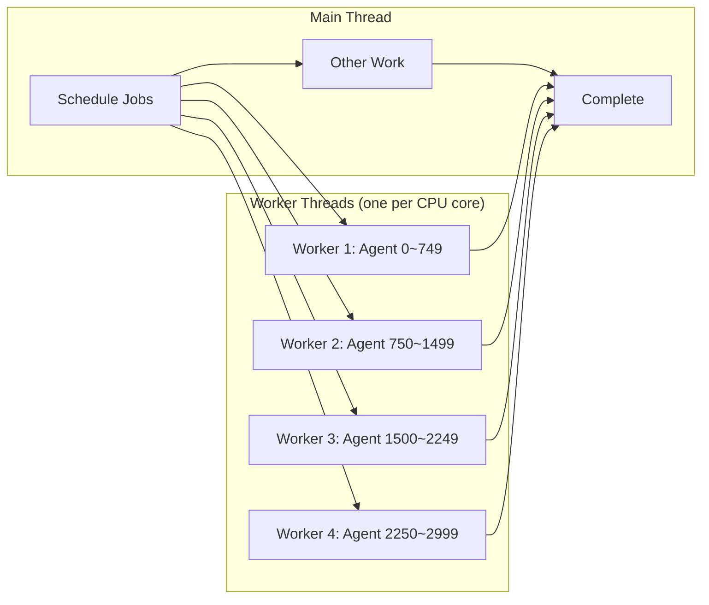
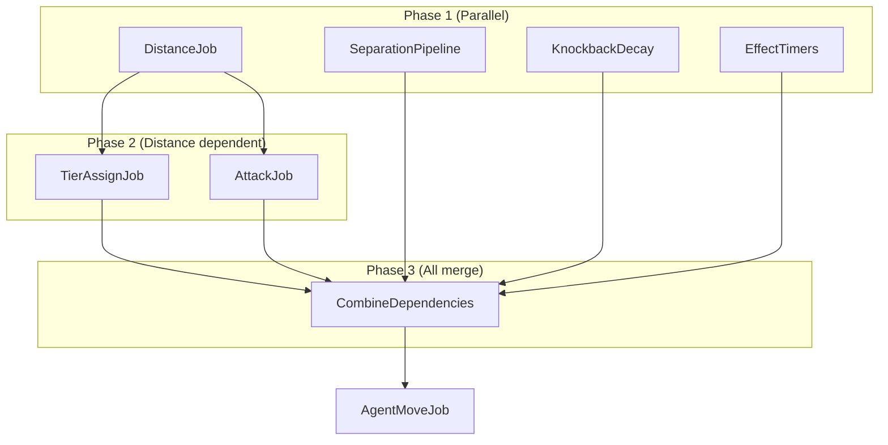

## Introduction

To drive thousands of agents at 60fps in Unity, a single main thread is not enough. Path sampling, separation steering, distance calculations, matrix transforms — all of these must be processed every frame. Running them sequentially in `Update()` costs tens of milliseconds per frame for 3,000 agents.

**C# Job System** and **Burst Compiler** are Unity's official multithreading + high-performance compilation framework designed to solve this problem. This article covers the principles behind both technologies, through to practical usage patterns in real projects.

> If you need foundational multithreading concepts like threads, race conditions, and deadlocks, it's recommended to first read [Multithreaded Programming Complete Guide](/posts/ThreadConcurrency/). That background explains **why** the Job System is designed the way it is.

---

## Part 1: Why the Job System Is Needed

### Unity's Main Thread Bottleneck

Most of Unity's API can **only be called from the main thread**. Familiar APIs like `Transform.position`, `Physics.Raycast`, and `GameObject.Instantiate` are all main-thread-only.

```
Main Thread (16.6ms budget @ 60fps):
├── Input processing        ~0.1ms
├── MonoBehaviour.Update    ~???ms  ← all game logic runs here
├── Physics simulation      ~2ms
├── Animation               ~1ms
├── Render command submit   ~2ms
└── Remaining budget        ???ms
```

Processing movement for 3,000 agents inside `Update()`:

```csharp
// MonoBehaviour approach — sequential execution on the main thread
void Update()
{
    foreach (var agent in agents)  // 3,000 iterations
    {
        Vector3 flowDir = SampleFlowField(agent.position);    // memory access
        Vector3 separation = ComputeSeparation(agent, agents); // O(N) neighbor search
        agent.transform.position += (flowDir + separation) * speed * Time.deltaTime;
    }
}
```

This code has **three problems** simultaneously:

| Problem | Cause | Impact |
|---------|-------|--------|
| Single thread | Cannot use worker threads | CPU core waste |
| Cache miss | Pointer chasing when accessing Transform | Memory bottleneck |
| GC pressure | Managed object allocation/deallocation | Frame spikes |

### Solution: Moving Computation to Worker Threads



The Job System **schedules** work from the main thread, **executes it in parallel** across multiple worker threads, and then **waits for completion** when the results are needed.

---

## Part 2: C# Job System Basics

### Job Interface Types

Unity provides three Job interfaces depending on the use case.

#### IJob — Single-Threaded Work

Work that runs on **a single** worker thread. Suitable for sequential algorithms.

```csharp
[BurstCompile]
public struct ComputeIntegrationFieldJob : IJob
{
    [ReadOnly] public NativeArray<byte> CostField;
    [ReadOnly] public FlowFieldGrid Grid;
    [ReadOnly] public NativeArray<int> GoalIndices;
    [ReadOnly] public int GoalCount;

    public NativeArray<ushort> IntegrationField;

    public void Execute()
    {
        // Dial's Algorithm — processes all cells sequentially
        // Shortest path computation based on bucket queue
        // → Cannot be parallelized, so use IJob
    }
}
```

Algorithms like Dial's Algorithm where **the result of one cell affects the next** cannot be parallelized. In these cases, use `IJob` and maximize single-thread performance with Burst.

#### IJobParallelFor — Parallel Batch Work

**Multiple worker threads split and process** a data array simultaneously. Most agent logic uses this.

```csharp
[BurstCompile]
public struct ComputeFlowFieldJob : IJobParallelFor
{
    [ReadOnly] public NativeArray<ushort> IntegrationField;
    [ReadOnly] public FlowFieldGrid Grid;
    [WriteOnly] public NativeArray<float2> FlowDirections;

    public void Execute(int index)
    {
        // Each cell can be processed independently
        // index = 0 ~ CellCount-1
        // Compare IntegrationField values of 8 neighbors to determine lowest-cost direction
        ushort myCost = IntegrationField[index];
        if (myCost == 0 || myCost >= ushort.MaxValue)
        {
            FlowDirections[index] = float2.zero;
            return;
        }

        int cx = index % Grid.Width;
        int cy = index / Grid.Width;

        ushort bestCost = myCost;
        float2 bestDir = float2.zero;

        // Check 8 neighbors (each cell is independent → parallel-safe)
        CheckNeighbor(cx, cy + 1, ref bestCost, ref bestDir, new float2(0, 1));
        CheckNeighbor(cx, cy - 1, ref bestCost, ref bestDir, new float2(0, -1));
        // ... (8 directions)

        FlowDirections[index] = math.normalizesafe(bestDir);
    }
}
```

**Each call to `Execute(int index)` must be completely independent**. The result of index 0 must not affect index 1. As long as this condition is met, Unity automatically distributes batches across worker threads.

**Batch size (innerloopBatchCount) when scheduling**:

```csharp
// Distribute 10,000 cells in batches of 64 to workers
var handle = flowJob.Schedule(grid.CellCount, 64);
```

A batch size of 64 means "one worker thread processes 64 indices at a time." Too small and scheduling overhead grows; too large and load balancing suffers. The **32–128** range is typical.

#### IJob vs IJobParallelFor Selection Criteria

| Criteria | IJob | IJobParallelFor |
|----------|------|-----------------|
| Data dependency | Dependencies between cells | Each index independent |
| Execution threads | 1 worker | N workers (auto-distributed) |
| Example use cases | Dijkstra, range table construction | Flow direction computation, agent movement, distance calculation |
| Performance | Fast single thread with Burst | Throughput scales with core count |

---

### NativeContainer: Data Used by Jobs

Jobs **cannot access managed objects (class, List, Dictionary, etc.)**. Instead, they use **NativeContainers** provided by Unity. These containers are allocated in native memory (unmanaged heap) and are unaffected by the GC.

#### NativeArray — The Most Basic Container

```csharp
// Allocation — lifetime varies by Allocator type
var positions = new NativeArray<float3>(agentCount, Allocator.Persistent);
var tempBuffer = new NativeArray<int>(256, Allocator.Temp);

// Usage
positions[0] = new float3(1, 0, 3);
float3 pos = positions[0];

// Deallocation — Persistent must be manually disposed
positions.Dispose();
// Temp is automatically released at end of frame (manual release also works)
```

#### NativeArray's Internal Structure: How It Differs from C# Arrays

To fully understand NativeArray, you first need to know C#'s memory model.

**Memory layout of a C# array (`float3[]`):**

```
┌─────────────── Managed Heap (GC-managed) ───────────────┐
│                                                          │
│  float3[] agents = new float3[3000];                     │
│                                                          │
│  [Object Header (16B)] [Length (8B)] [float3 × 3000]     │
│   ↑ tracked by GC     ↑ array length  ↑ actual data     │
│                                                          │
│  • GC manages by generation (Gen0 → Gen1 → Gen2)         │
│  • Memory address can change during GC Compaction        │
│  • No synchronization guarantee for cross-thread access  │
└──────────────────────────────────────────────────────────┘
```

C# arrays are allocated on the managed heap. The GC scans them periodically, and during Compaction **the memory address itself can move**. If the GC moves the address while a worker thread is accessing the array, a **memory access violation** occurs.

You can pin it with the `fixed` keyword or `GCHandle.Alloc(Pinned)`, but pinned objects obstruct GC Compaction and cause **heap fragmentation**. Pinning thousands of arrays severely degrades GC performance.

**Memory layout of NativeArray:**

```
┌─────────── Managed Heap ──────────┐   ┌──── Unmanaged Heap (OS direct) ────┐
│                                    │   │                                    │
│  NativeArray<float3> wrapper       │   │  UnsafeUtility.Malloc(            │
│  ┌─────────────────────┐          │   │      size: 12 × 3000,             │
│  │ void* m_Buffer ──────┼──────────┼──▶│      alignment: 16,               │
│  │ int   m_Length       │          │   │      allocator: Persistent)       │
│  │ Allocator m_Alloc    │          │   │                                    │
│  │ #if SAFETY           │          │   │  [float3][float3][float3]...       │
│  │ AtomicSafetyHandle   │          │   │  ← contiguous memory, no GC →     │
│  │ #endif               │          │   │  ← 16-byte alignment guaranteed → │
│  └─────────────────────┘          │   │                                    │
│   ↑ struct (8~32B)                │   └────────────────────────────────────┘
│   minimal GC overhead             │
└────────────────────────────────────┘
```

NativeArray itself is a **struct** (value type) that holds a **native pointer (`void*`)** internally. The actual data is allocated directly on the **unmanaged heap** via `UnsafeUtility.Malloc()`. This memory:

- **Is completely invisible to the GC** — not in the scan targets, so zero GC overhead
- **Has a fixed address** — does not move during Compaction, safe for worker threads
- **Is allocated at the OS `malloc`/`VirtualAlloc` level** — same memory management as C/C++ native code
- **Is 16-byte aligned** — memory layout optimized for SIMD operations

```csharp
// NativeArray core — simplified version of actual Unity internals
public struct NativeArray<T> : IDisposable where T : struct
{
    [NativeDisableUnsafePtrRestriction]
    internal unsafe void* m_Buffer;    // unmanaged memory pointer
    internal int m_Length;
    internal Allocator m_AllocatorLabel;

#if ENABLE_UNITY_COLLECTIONS_CHECKS
    internal AtomicSafetyHandle m_Safety;  // editor-only safety checks
#endif

    public unsafe T this[int index]
    {
        get => UnsafeUtility.ReadArrayElement<T>(m_Buffer, index);
        set => UnsafeUtility.WriteArrayElement(m_Buffer, index, value);
    }
}
```

**The key difference in one line:**

> A C# array is "an object on the GC-managed heap," while a NativeArray is "a pointer to a memory block borrowed directly from the OS."

This difference is decisive in a multithreaded + Burst environment. Burst uses `void* m_Buffer` directly like a C++ pointer, generating memory accesses with zero overhead.

#### Allocator Types

| Allocator | Lifetime | Internal Implementation | Use Case | Deallocation |
|-----------|----------|------------------------|----------|--------------|
| `Temp` | 1 frame | Thread-local stack allocator | Temporary buffer inside a Job | Automatic (end of frame) |
| `TempJob` | 4 frames | Lock-free bucket allocator | Temporary data passed between Jobs | Manual recommended |
| `Persistent` | Unlimited | OS malloc (VirtualAlloc/mmap) | Data persisted throughout the game | Must be manually disposed |

`Temp` is fastest because it allocates from a thread-local memory pool **without a lock**. `Persistent` involves an OS kernel call so allocation itself is relatively slower, but once allocated, access performance is identical.

Usage patterns in real projects:

```csharp
public class FlowFieldData : IDisposable
{
    // Persistent — grid data persisted throughout the game
    public NativeArray<float> HeightField { get; private set; }
    public NativeArray<byte> CostField { get; private set; }

    public FlowFieldData(FlowFieldGrid grid)
    {
        int cellCount = grid.CellCount;
        HeightField = new NativeArray<float>(cellCount, Allocator.Persistent);
        CostField = new NativeArray<byte>(cellCount, Allocator.Persistent);
    }

    public void Dispose()
    {
        if (HeightField.IsCreated) HeightField.Dispose();
        if (CostField.IsCreated) CostField.Dispose();
    }
}
```

Use the `IDisposable` pattern to ensure release in `OnDestroy()`. **Failing to dispose a Persistent NativeArray causes a native memory leak**.

---

### Safety System: Preventing Race Conditions

One of the biggest advantages of the Job System is **compile-time + runtime safety checks**.

#### [ReadOnly] / [WriteOnly] Attributes

```csharp
[BurstCompile]
public struct ZombieDistanceJob : IJobParallelFor
{
    [ReadOnly] public NativeArray<float3> Positions;   // read-only
    [ReadOnly] public NativeArray<byte> IsAlive;       // read-only
    [ReadOnly] public NativeArray<float3> GoalPositions;
    [ReadOnly] public int GoalCount;

    [WriteOnly] public NativeArray<float> Distances;   // write-only

    public void Execute(int index)
    {
        if (IsAlive[index] == 0)
        {
            Distances[index] = float.MaxValue;
            return;
        }

        float3 pos = Positions[index];
        float minDist = float.MaxValue;

        for (int g = 0; g < GoalCount; g++)
        {
            float dx = pos.x - GoalPositions[g].x;
            float dz = pos.z - GoalPositions[g].z;
            float dist = math.sqrt(dx * dx + dz * dz);
            minDist = math.min(minDist, dist);
        }

        Distances[index] = minDist;
    }
}
```

Marking `[ReadOnly]` means:
1. **Multiple Jobs can read the same NativeArray simultaneously**
2. Attempting to write from that Job causes a **compile error**

Marking `[WriteOnly]` means:
1. Attempting to read from that Job causes an error
2. Burst can apply **write optimizations** (store merging, etc.)

Declaring a NativeArray without attributes allows both **read and write**, but if another Job accesses the same array simultaneously, the Safety System throws an error.

#### Mistakes Caught by the Safety System

```csharp
// Error 1: Two Jobs writing to the same array simultaneously
var jobA = new WriteJob { Data = positions };
var jobB = new WriteJob { Data = positions };  // same array!
var hA = jobA.Schedule(count, 64);
var hB = jobB.Schedule(count, 64);  // 💥 InvalidOperationException

// Error 2: Main thread accessing array while Job is running
var handle = moveJob.Schedule(count, 64);
float3 pos = positions[0];  // 💥 Cannot access before Job completes
handle.Complete();           // Access is allowed only after this

// Error 3: Accessing managed types inside a Job
public struct BadJob : IJob
{
    public List<int> data;  // 💥 Compile error — managed types not allowed
}
```

Thanks to these safety checks, **the hardest parts of multithreaded programming (race conditions, deadlocks) are structurally prevented**.

---

### Job Scheduling and Dependency Chains

Jobs are scheduled with `Schedule()` and synchronized with `Complete()`. The key is ensuring execution order between Jobs through **dependency chains**.

#### Sequential Dependency: The Output of One Job as Input to the Next

```csharp
// Compute Integration Field (IJob — single thread)
var integrationJob = new ComputeIntegrationFieldJob
{
    CostField = data.CostField,
    Grid = grid,
    GoalIndices = goalArray,
    GoalCount = goalArray.Length,
    IntegrationField = layer.IntegrationField,
    BucketHeads = layer.DialBucketHeads,
    NextInBucket = layer.DialNextInBucket,
    Settled = layer.DialSettled
};
var integrationHandle = integrationJob.Schedule();

// Flow Field computation — requires Integration result, so needs dependency
var flowJob = new ComputeFlowFieldJob
{
    IntegrationField = layer.IntegrationField,  // ← output of integrationJob
    Grid = grid,
    FlowDirections = layer.FlowField
};
// Pass integrationHandle as dependency → runs only after Integration completes
var flowHandle = flowJob.Schedule(grid.CellCount, 64, integrationHandle);

flowHandle.Complete();  // Waits until both Jobs complete
```


Passing a `JobHandle` as the last argument to `Schedule()` means **the Job runs only after that handle completes**.

#### Independent Parallel Execution + CombineDependencies

Independent Jobs are scheduled simultaneously to **maximize worker thread utilization**.

```csharp
// Phase 1: Schedule 4 independent Jobs simultaneously
var hDist = ScheduleDistanceJob();        // distance calculation
var hSep  = ScheduleSeparationPipeline(); // separation force calculation
var hKb   = ScheduleKnockbackDecay(dt);   // knockback decay
var hFx   = ScheduleEffectTimers(dt);     // effect timers

// Phase 2: Only sync the Job that needs distance results
hDist.Complete();
var hTier   = ScheduleTierAssign();    // distance → tier assignment
var hAttack = ScheduleAttackJob(dt);   // distance → attack determination

// Phase 3: Merge all prerequisites before movement
var hPreMove = JobHandle.CombineDependencies(
    JobHandle.CombineDependencies(hTier, hAttack, hSep),
    JobHandle.CombineDependencies(hKb, hFx));
hPreMove.Complete();

// Phase 4: Movement Job (reads all previous results)
var hMove = ScheduleMoveJob(dt);
hMove.Complete();
```



Key points of this pattern:
- **Phase 1**: 4 Jobs **run simultaneously on different worker threads**
- **Phase 2**: Only needs Distance results, so scheduled immediately after `hDist.Complete()`
- **Phase 3**: `CombineDependencies` collects all preceding Jobs into a merge point
- **Phase 4**: MoveJob reads all results (Flow, Separation, Knockback, Tier...) so it runs last

---

## Part 3: Burst Compiler

### What Burst Does

Ordinary C# code follows this execution path:

```
Regular C#:  source code → C# compiler → IL (intermediate language) → JIT compiler → native code
              (build time)                                               (runtime)
```

JIT (Just-In-Time) generates general-purpose code. It includes safety checks, bounds checks, and GC integration code, which limits optimization.

Burst **completely bypasses** this path:

```
Burst:    source code → C# compiler → IL → Burst front-end → LLVM IR
           (build time)                      (build time/editor start)
                                                   ↓
                                            LLVM optimization passes
                                            (loop unrolling, inlining,
                                             dead code elimination, constant folding)
                                                   ↓
                                            SIMD auto-vectorization
                                                   ↓
                                            Platform native code
                                            • x86: SSE4.2 / AVX2
                                            • ARM: NEON
                                            • Apple Silicon: NEON + AMX
```

LLVM is the **same backend** used by Clang (C/C++ compiler), Rust, and Swift. This means the code Burst generates achieves performance on par with well-written C++ code.

#### SIMD: Processing Multiple Data with a Single Instruction

**SIMD (Single Instruction, Multiple Data)** is the ability of a CPU to compute multiple values simultaneously with a single instruction.

```
Scalar operation (without SIMD):
  float a0 = b0 + c0;   // instruction 1
  float a1 = b1 + c1;   // instruction 2
  float a2 = b2 + c2;   // instruction 3
  float a3 = b3 + c3;   // instruction 4
  → 4 instructions, 4 cycles

SIMD operation (SSE: 128-bit register):
  ┌────┬────┬────┬────┐     ┌────┬────┬────┬────┐
  │ b0 │ b1 │ b2 │ b3 │  +  │ c0 │ c1 │ c2 │ c3 │
  └────┴────┴────┴────┘     └────┴────┴────┴────┘
           ↓ ADDPS (1 instruction)
  ┌────┬────┬────┬────┐
  │ a0 │ a1 │ a2 │ a3 │
  └────┴────┴────┴────┘
  → 1 instruction, 1 cycle (4x throughput)

AVX2 (256-bit register): 8 floats simultaneously → 8x
```

`float3`, `float4`, `int2`, etc. from `Unity.Mathematics` are types **designed to fit exactly** in these SIMD registers:

| Type | Size | SIMD Register | Notes |
|------|------|---------------|-------|
| `float2` | 8B | SSE lower 64 bits | Suitable for XZ plane operations |
| `float3` | 12B | SSE 128 bits (4th slot unused) | 3D position/velocity |
| `float4` | 16B | SSE 128 bits (fully utilized) | Color, quaternion |
| `float4x4` | 64B | SSE × 4 or AVX × 2 | Transform matrix |
| `int2` | 8B | Integer SIMD | Grid coordinates |

Burst's **auto-vectorization** analyzes loops and converts them to SIMD instructions:

```csharp
// When Burst compiles this code:
for (int i = 0; i < count; i++)
{
    float dx = positions[i].x - goal.x;
    float dz = positions[i].z - goal.z;
    distances[i] = math.sqrt(dx * dx + dz * dz);
}

// It is internally transformed like this (conceptually):
for (int i = 0; i < count; i += 4)  // process 4 at a time
{
    __m128 dx = _mm_sub_ps(load4(pos_x + i), broadcast(goal.x));  // 4 subtractions simultaneously
    __m128 dz = _mm_sub_ps(load4(pos_z + i), broadcast(goal.z));
    __m128 distSq = _mm_add_ps(_mm_mul_ps(dx, dx), _mm_mul_ps(dz, dz));
    _mm_store_ps(distances + i, _mm_sqrt_ps(distSq));               // 4 sqrts simultaneously
}
```

This is the core reason why **the same C# code shows a 10–50x performance difference with and without Burst**. JIT rarely achieves this level of vectorization.

A **10–50x performance improvement** over regular C# code is typical.

### Usage: [BurstCompile]

```csharp
using Unity.Burst;
using Unity.Collections;
using Unity.Jobs;
using Unity.Mathematics;  // float3, int2, math.* usage

[BurstCompile]
public struct PositionToMatrixJob : IJobParallelFor
{
    [ReadOnly] public NativeArray<float3> Positions;
    [ReadOnly] public NativeArray<float3> Velocities;
    [ReadOnly] public NativeArray<byte> IsAlive;
    [ReadOnly] public float3 Scale;
    [ReadOnly] public float DeltaTime;
    [ReadOnly] public float RotationSmoothSpeed;

    [NativeDisableParallelForRestriction]
    public NativeArray<float4x4> Matrices;

    public void Execute(int index)
    {
        if (IsAlive[index] == 0)
        {
            // Dead agents go off-screen
            Matrices[index] = float4x4.TRS(
                new float3(0, -1000, 0), quaternion.identity, float3.zero);
            return;
        }

        float3 pos = Positions[index];
        float3 vel = Velocities[index];

        // Extract forward direction from previous matrix
        float4x4 prev = Matrices[index];
        float3 prevForward = math.normalizesafe(
            new float3(prev.c2.x, prev.c2.y, prev.c2.z));

        // Smooth rotation interpolation toward velocity direction
        float3 targetForward = math.lengthsq(new float2(vel.x, vel.z)) > 0.25f
            ? math.normalizesafe(new float3(vel.x, 0f, vel.z))
            : prevForward;

        float t = math.saturate(RotationSmoothSpeed * DeltaTime);
        float3 smoothForward = math.normalizesafe(
            math.lerp(prevForward, targetForward, t));

        quaternion rot = quaternion.LookRotationSafe(smoothForward, math.up());
        Matrices[index] = float4x4.TRS(pos, rot, Scale);
    }
}
```

Key points in the code:
- Use **`Unity.Mathematics.float3`** instead of `UnityEngine.Vector3`
- Use **`math.sqrt`** instead of `Mathf.Sqrt`
- Use **`quaternion.LookRotationSafe`** instead of `Quaternion.LookRotation`

The `Unity.Mathematics` library provides math types designed so Burst can **directly convert them to SIMD instructions**.

### Burst Constraints

Because Burst compiles to native code, managed C# features cannot be used:

| Allowed | Not Allowed |
|---------|-------------|
| Primitive value types (int, float, bool) | class (reference types) |
| struct | string |
| NativeArray, NativeList | List\<T\>, Dictionary\<K,V\> |
| Unity.Mathematics (float3, int2...) | UnityEngine.Vector3 (managed) |
| `math.*` functions | `Mathf.*`, `Debug.Log` |
| Static readonly fields | virtual methods, interface calls |
| Fixed-size buffers | try-catch, LINQ |

### [NativeDisableParallelForRestriction]

In `IJobParallelFor`, by default **only writes to one's own index are allowed**. That is, `Execute(5)` can write to `Data[5]` but not `Data[3]`.

However, in cases like `PositionToMatrixJob` where you need to read the previous frame's matrix and write back to the same index, the Safety System may block this. Adding `[NativeDisableParallelForRestriction]` removes the index restriction.

```csharp
[NativeDisableParallelForRestriction]
public NativeArray<float4x4> Matrices;  // read and write to the same index

public void Execute(int index)
{
    float4x4 prev = Matrices[index];  // read
    // ... computation ...
    Matrices[index] = newMatrix;       // write (same index)
}
```

**Warning**: Overusing this attribute removes Safety System protection. **Use it only when it is guaranteed that you write only to your own index**.

---

## Part 4: Memory Hierarchy and SoA Layout

To understand Job System + Burst performance, you need to know the CPU's memory hierarchy. Most code optimization ultimately comes down to **"how efficiently you use the cache."**

### CPU Cache Hierarchy: Why Memory Access Patterns Matter

Modern CPUs do not access main memory (RAM) directly. They place multiple levels of **cache** in between, copying frequently accessed data to closer locations.

```
┌──────────┐   ~1 cycle      ┌──────────┐   ~4 cycles     ┌──────────┐
│ CPU Core │ ◀─────────────▶ │ L1 Cache │ ◀──────────────▶ │ L2 Cache │
│(registers)│   32~64 KB     │(per core) │   256~512 KB    │(per core) │
└──────────┘                  └──────────┘                  └──────────┘
                                                                │
                                                          ~12 cycles
                                                                │
                              ┌──────────┐  ~40-80 cycles  ┌──────────┐
                              │ L3 Cache │ ◀──────────────▶│   RAM    │
                              │(shared)   │                  │ (DDR5)   │
                              │ 8~32 MB  │                  │ ~100ns   │
                              └──────────┘                  └──────────┘
```

| Level | Capacity | Latency | Bandwidth |
|-------|----------|---------|-----------|
| L1 cache | 32~64 KB / core | ~1ns (1 cycle) | ~1 TB/s |
| L2 cache | 256 KB~1 MB / core | ~4ns (4 cycles) | ~200 GB/s |
| L3 cache | 8~32 MB (shared) | ~12ns (12 cycles) | ~100 GB/s |
| RAM (DDR5) | 16~64 GB | ~80ns (80 cycles) | ~50 GB/s |

**The speed difference between L1 cache and RAM is about 80x**. The same computation can differ in performance by tens of times depending on whether data is in L1 or fetched from RAM.

#### Cache Lines: The Minimum Unit of Memory Access

CPUs do not fetch memory byte by byte. They fetch in **cache line** units (typically 64 bytes) at a time.

```
float3 positions[5000];  // 12 bytes × 5,000 = 60 KB

When reading positions[0] from memory:
┌──────────────────────── 64 bytes (1 cache line) ──────────────────────┐
│ positions[0] │ positions[1] │ positions[2] │ positions[3] │ pos[4]..  │
│   12 bytes   │   12 bytes   │   12 bytes   │   12 bytes   │ 12+4pad   │
└──────────────────────────────────────────────────────────────────────┘
  ↑ what was requested              ↑ loaded for free (spatial locality)

→ Sequential access to positions[0]~[4] reads all 5 float3s with just 1 cache miss
→ This is why "contiguous memory" is fast
```

Conversely, when objects are scattered across the heap:

```
Agent* agent0 = 0x10000;  // cache line A loaded
Agent* agent1 = 0x50000;  // cache line B loaded (unrelated location from A)
Agent* agent2 = 0x20000;  // cache line C loaded
// → A new cache line is fetched from RAM each time = 3 cache misses
// → ~80ns × 3 = 240ns each (tens of times slower than sequential access)
```

#### Hardware Prefetcher

Modern CPUs have a built-in **hardware prefetcher**. When the memory access pattern is **sequential**, it **prefetches** the next cache line ahead of time.

```
Sequential access (prefetcher active):
  positions[0] → [1] → [2] → [3] → ...
  CPU: "Ah, reading sequentially" → preloads next cache line
  → Most accesses are L1 hits (latency ~1ns)

Random access (prefetcher disabled):
  agents[hash(42)] → agents[hash(7)] → agents[hash(999)] → ...
  CPU: "Can't figure out the pattern" → prefetcher deactivated
  → Most accesses are L2/L3/RAM misses (latency 4~80ns)
```

This is exactly why NativeArray's **contiguous memory layout** matters. When the prefetcher works correctly, effective memory latency nearly disappears.

#### False Sharing: A Hidden Trap in Parallel Programming

When multiple worker threads in `IJobParallelFor` write to **different indices belonging to the same cache line**, **false sharing** occurs.

```
Cache line (64 bytes):
┌──────────┬──────────┬──────────┬──────────┬──────────┐
│ float[0] │ float[1] │ float[2] │ float[3] │ ...      │
│ Worker 0 │ Worker 0 │ Worker 1 │ Worker 1 │ ...      │
└──────────┴──────────┴──────────┴──────────┴──────────┘

Worker 0 writes to float[0] → entire cache line is marked "dirty"
Worker 1 tries to read float[2] → must invalidate Worker 0's cache line and reload
→ Even writing to different data causes interference at the cache line level
```

Unity's `IJobParallelFor` mitigates this with **batch size (innerloopBatchCount)**. A batch size of 64 means one worker processes at least 64 consecutive indices, greatly reducing the probability of two workers accessing the same cache line simultaneously.

### AoS vs SoA

There are two main ways to store agent data:

#### AoS (Array of Structures) — Traditional Approach

```csharp
// GameObject + MonoBehaviour approach
class Agent
{
    public Vector3 position;   // 12 bytes
    public Vector3 velocity;   // 12 bytes
    public float speed;        // 4 bytes
    public float health;       // 4 bytes
    public bool isAlive;       // 1 byte + padding
}
Agent[] agents = new Agent[3000];  // 3,000 objects on heap, each with separate references
```

```
Memory layout:
[Agent0: pos|vel|spd|hp|alive|pad] [Agent1: pos|vel|spd|hp|alive|pad] ...
 ←─── 36+ bytes ───→               ←─── 36+ bytes ───→

When iterating over positions only: loading pos also loads vel, spd, hp, alive into cache line
→ 66% of the cache line is unnecessary data
```

#### SoA (Structure of Arrays) — Job System Approach

```csharp
// NativeArray-based SoA
NativeArray<float3> positions;     // 12 bytes × 3,000 = 36 KB (contiguous)
NativeArray<float3> velocities;    // 12 bytes × 3,000 = 36 KB (contiguous)
NativeArray<float>  speeds;        // 4 bytes  × 3,000 = 12 KB (contiguous)
NativeArray<float>  healths;       // 4 bytes  × 3,000 = 12 KB (contiguous)
NativeArray<byte>   isAlive;       // 1 byte   × 3,000 =  3 KB (contiguous)
```

```
Memory layout:
Positions:  [pos0|pos1|pos2|pos3|pos4|...] ← contiguous float3s, 5~6 per cache line
Velocities: [vel0|vel1|vel2|vel3|vel4|...] ← separate contiguous array
IsAlive:    [0|1|1|1|0|1|1|1|1|0|...]      ← 1 byte, 64 per cache line
```

**When iterating over positions only**, you just read the `Positions` array. A cache line (64 bytes) holds 5 float3s, so **cache efficiency is nearly 100%**.

### Benchmarked Comparison

`ZombieDistanceJob` demonstrates how much SoA benefits 3,000 agents:

```csharp
[BurstCompile]
public struct ZombieDistanceJob : IJobParallelFor
{
    [ReadOnly] public NativeArray<float3> Positions;  // 36 KB contiguous memory
    [ReadOnly] public NativeArray<byte> IsAlive;       // 3 KB contiguous memory
    [ReadOnly] public NativeArray<float3> GoalPositions;
    [ReadOnly] public int GoalCount;

    [WriteOnly] public NativeArray<float> Distances;

    public void Execute(int index)
    {
        if (IsAlive[index] == 0) { Distances[index] = float.MaxValue; return; }

        float3 pos = Positions[index];
        float minDist = float.MaxValue;

        for (int g = 0; g < GoalCount; g++)
        {
            float dx = pos.x - GoalPositions[g].x;
            float dz = pos.z - GoalPositions[g].z;
            minDist = math.min(minDist, math.sqrt(dx * dx + dz * dz));
        }

        Distances[index] = minDist;
    }
}
```

Total memory accessed by this Job:
- `Positions`: 36 KB
- `IsAlive`: 3 KB
- `GoalPositions`: ~240 bytes (20 goals)
- `Distances` (output): 12 KB
- **Total: ~51 KB — fully fits in L2 cache (256KB~1MB)**

With AoS, Agent objects would be scattered across the heap, causing **frequent cache misses due to pointer chasing**.

### Memory Alignment and Its Relationship to SIMD

NativeArray guarantees **16-byte alignment** at allocation. Why this matters:

```
Unaligned access:
  Reading float4 (16B) at address 0x10003
  → Spans a cache line boundary (0x10000~0x1003F, 0x10040~...)
  → Requires 2 cache line loads → performance penalty

16-byte aligned access:
  Reading float4 (16B) at address 0x10000
  → Completely contained within 1 cache line
  → Can use SSE MOVAPS (aligned load) → maximum throughput
```

When `UnsafeUtility.Malloc(size, alignment: 16, allocator)` specifies alignment 16, the returned pointer address is always a multiple of 16. Burst detects this alignment and generates **aligned SIMD load/store** instructions.

### Structural Reason SoA Is Better for SIMD

```
SoA:
  Positions.x: [x0, x1, x2, x3, x4, x5, x6, x7, ...]  ← load 4 at a time with SIMD
  Positions.z: [z0, z1, z2, z3, z4, z5, z6, z7, ...]  ← load 4 at a time with SIMD
  → dx[0..3] = x[0..3] - goal.x  ← 1 SIMD instruction

AoS:
  Agent[0]: {x0, y0, z0}, Agent[1]: {x1, y1, z1}, ...
  → To gather x0, x1, x2, x3, must extract x from each Agent
  → Requires "gather" operation → slow (inefficient even in AVX2)
```

Unity.Mathematics' `float3` is not itself a SoA structure (x, y, z are in one struct), but at the NativeArray level **arrays of the same type are laid out contiguously**, so Burst can vectorize them effectively.

---

## Part 5: Production Pipeline Patterns

### Pattern 1: Sequential Chain (Integration → FlowField)

Jobs with algorithmic dependencies are connected in a sequential chain.

```csharp
private void ScheduleLayerCompute(int layerId)
{
    var layer = data.GetLayer(layerId);

    // Step 1: Compute Integration Field using Dial's Algorithm (IJob)
    var integrationJob = new ComputeIntegrationFieldJob
    {
        CostField = data.CostField,
        Grid = grid,
        GoalIndices = layer.GoalIndices.AsArray(),
        GoalCount = layer.GoalIndices.Length,
        IntegrationField = layer.IntegrationField,
        BucketHeads = layer.DialBucketHeads,
        NextInBucket = layer.DialNextInBucket,
        Settled = layer.DialSettled
    };
    var integrationHandle = integrationJob.Schedule();

    // Step 2: Convert Integration → Flow Direction (IJobParallelFor)
    var flowJob = new ComputeFlowFieldJob
    {
        IntegrationField = layer.IntegrationField,
        Grid = grid,
        FlowDirections = layer.FlowField
    };
    var flowHandle = flowJob.Schedule(grid.CellCount, 64, integrationHandle);

    flowHandle.Complete();
}
```

Passing `integrationHandle` as the dependency to `flowJob.Schedule()` means the FlowField computation **starts automatically** right after Integration completes. The main thread can do other work until `flowHandle.Complete()`.

### Pattern 2: Cell Sort Pipeline (4-Stage Chain)

Separation Steering connects 4 Jobs in a **sequential chain**:

```csharp
private JobHandle ScheduleSeparationPipeline()
{
    // 1. Assign agents to grid cells (parallel)
    var assignJob = new AssignCellsJob
    {
        Positions = data.Positions,
        IsAlive = data.IsAlive,
        Grid = grid,
        CellAgentPairs = data.CellAgentPairs
    };
    var h1 = assignJob.Schedule(activeCount, 64);

    // 2. Sort by cell index (Burst SortJob)
    var h2 = data.CellAgentPairs.SortJob(new CellIndexComparer()).Schedule(h1);

    // 3. Build (start, count) range per cell (single thread)
    var rangesJob = new BuildCellRangesJob
    {
        SortedPairs = data.CellAgentPairs,
        CellRanges = data.CellRanges,
        AgentCount = activeCount,
        CellCount = grid.CellCount
    };
    var h3 = rangesJob.Schedule(h2);

    // 4. Compute separation forces based on 3×3 neighbors (parallel)
    var sepJob = new ComputeSeparationJob
    {
        Positions = data.Positions,
        IsAlive = data.IsAlive,
        SortedPairs = data.CellAgentPairs,
        CellRanges = data.CellRanges,
        Grid = grid,
        SeparationRadius = separationRadius,
        SeparationForces = data.SeparationForces
    };
    var handle = sepJob.Schedule(activeCount, 64, h3);

    return handle;
}
```


In this pipeline, `SortJob` is a **Burst-optimized sort Job** provided by Unity. Calling `NativeArray.SortJob(comparer).Schedule(dependency)` naturally joins the dependency chain.

### Pattern 3: Dirty Flag + Interval-Based Recomputation

Running all Jobs every frame is wasteful. Recompute **only when there are changes**:

```csharp
private void Update()
{
    for (int layerId = 0; layerId < data.LayerCount; layerId++)
    {
        timeSinceLastCompute[layerId] += Time.deltaTime;
        var layer = data.GetLayer(layerId);

        // Skip if no dirty flag and interval hasn't elapsed
        if (!layer.IsDirty && !costFieldDirty
            && timeSinceLastCompute[layerId] < recomputeInterval)
            continue;

        if (ShouldRecompute(layerId))
        {
            timeSinceLastCompute[layerId] = 0f;
            ScheduleLayerCompute(layerId);  // schedule Jobs
        }
    }
}
```

- Goal is stationary: **0 recomputations/second** (completely skipped)
- Goal is moving: **once every 0.5 seconds** (2/second)
- CostField changed: **immediately once** on the next interval

### Pattern 4: Profiler Markers

Use `ProfilerMarker` to measure Job performance:

```csharp
using Unity.Profiling;

private static readonly ProfilerMarker s_ComputeMarker = new("FlowField.Compute");
private static readonly ProfilerMarker s_SeparationMarker = new("FlowField.Separation");

private void ScheduleLayerCompute(int layerId)
{
    s_ComputeMarker.Begin();

    // ... Job scheduling ...

    flowHandle.Complete();
    s_ComputeMarker.End();
}
```

In Unity Profiler, you can **accurately measure the time taken by each Job chain** under names like "FlowField.Compute" and "FlowField.Separation".

---

## Part 6: Performance Differences Created by Burst

### The Power of struct and readonly — FlowFieldGrid

```csharp
public readonly struct FlowFieldGrid
{
    public readonly int Width;
    public readonly int Height;
    public readonly float CellSize;
    public readonly float3 Origin;

    [MethodImpl(MethodImplOptions.AggressiveInlining)]
    public int2 WorldToCell(float3 worldPos)
    {
        int x = (int)((worldPos.x - Origin.x) / CellSize);
        int z = (int)((worldPos.z - Origin.z) / CellSize);
        return new int2(
            math.clamp(x, 0, Width - 1),
            math.clamp(z, 0, Height - 1));
    }

    [MethodImpl(MethodImplOptions.AggressiveInlining)]
    public int CellToIndex(int2 cell) => cell.y * Width + cell.x;

    [MethodImpl(MethodImplOptions.AggressiveInlining)]
    public bool IsInBounds(int2 cell)
        => cell.x >= 0 && cell.x < Width && cell.y >= 0 && cell.y < Height;
}
```

Optimizations Burst applies to this code:
- `readonly struct` → eliminates defensive copies during copying
- `AggressiveInlining` → removes function call overhead, inserts code directly at call site
- `math.clamp` → converts to SIMD `min`/`max` instructions
- Division (`/ CellSize`) → converts to reciprocal multiplication if CellSize is constant

### Actual Performance Numbers

Per-frame cost for 3,000 agents on a 100×100 grid:

| Job | Type | Time | Notes |
|-----|------|------|-------|
| ComputeIntegrationFieldJob | IJob (Burst) | < 0.5ms | Dial's Algorithm, only when dirty |
| ComputeFlowFieldJob | IJobParallelFor | < 0.1ms | 10,000 cells in parallel |
| AssignCellsJob | IJobParallelFor | < 0.1ms | Cell assignment |
| SortJob (Burst) | Built-in | < 0.3ms | NativeArray sort |
| BuildCellRangesJob | IJob | < 0.1ms | Range construction |
| ComputeSeparationJob | IJobParallelFor | < 0.4ms | 3×3 neighbor search |
| AgentMoveJob | IJobParallelFor | < 0.5ms | Movement + collision + interpolation |
| PositionToMatrixJob | IJobParallelFor | < 0.3ms | Transform matrix |
| ZombieDistanceJob | IJobParallelFor | < 0.05ms | Distance calculation |
| ZombieTierAssignJob | IJobParallelFor | < 0.03ms | Tier assignment |
| **Total** | | **< 3ms** | **18% of 60fps budget (16.6ms)** |

Running the same logic in `Update()` without Burst costs **15–25ms**. The Burst + Job System combination achieves a **5–8x performance improvement**.

---

## Part 7: Common Mistakes and Pitfalls

### 1. Don't Call Complete() Too Early

```csharp
// Bad: Complete immediately after Schedule
var handle = job.Schedule(count, 64);
handle.Complete();  // Main thread blocks here — parallel benefit lost

// Good: Insert other work, then Complete later
var handle = job.Schedule(count, 64);
DoOtherMainThreadWork();  // Do other work while Job runs on worker
handle.Complete();
```

### 2. Inside a Job, Only Use Temp When Creating NativeArrays

```csharp
public void Execute()
{
    // When a temporary array is needed inside a Job
    var dx = new NativeArray<int>(8, Allocator.Temp);  // ✅ Only Temp is allowed
    // ... usage ...
    dx.Dispose();  // Explicit disposal recommended
}
```

### 3. Two Jobs Must Not Write to the Same NativeArray

```csharp
// Error: Two Jobs writing to the same array
var jobA = new WriteJob { Output = positions };
var jobB = new WriteJob { Output = positions };
var hA = jobA.Schedule(count, 64);
var hB = jobB.Schedule(count, 64);  // 💥 Safety System error

// Solution: Use dependency chain for sequential execution, or separate output arrays
var hA = jobA.Schedule(count, 64);
var hB = jobB.Schedule(count, 64, hA);  // ✅ B runs after A completes
```

### 4. Always Dispose Persistent Arrays

```csharp
public class MyManager : MonoBehaviour
{
    private NativeArray<float3> _positions;

    void Awake()
    {
        _positions = new NativeArray<float3>(3000, Allocator.Persistent);
    }

    void OnDestroy()
    {
        if (_positions.IsCreated)  // Check if already disposed
            _positions.Dispose();
    }
}
```

Calling `Dispose()` twice without the `IsCreated` check causes a crash.

---

## Summary

| Concept | Role | Key Point |
|---------|------|-----------|
| **IJob** | Single worker thread task | For sequential algorithms (Dijkstra, etc.) |
| **IJobParallelFor** | Parallel batch work | Each index independent, batch size 64 recommended |
| **NativeArray** | GC-free data container | Watch Allocator lifetime, Dispose is mandatory |
| **[ReadOnly]/[WriteOnly]** | Explicit access permissions | Safety System + Burst optimization hint |
| **JobHandle** | Dependency chain | Pass as argument to Schedule() to guarantee execution order |
| **CombineDependencies** | Merge point | Collect results of independent Jobs for the next stage |
| **[BurstCompile]** | Native compilation | LLVM → SIMD auto-vectorization, 10–50x performance |
| **Unity.Mathematics** | Burst-compatible math | float3, int2, math.* — SIMD convertible |
| **SoA layout** | Maximize cache efficiency | Separate NativeArrays per field, fits in L2 cache |
| **readonly struct** | Eliminate defensive copies | Apply to immutable data like Grid |

Flow Field, Separation Steering, AI LOD, and other systems are built on top of this technology stack. Subsequent posts will cover the concrete implementation and problem-solving process for each system.

---

## References

- [Unity Manual — C# Job System](https://docs.unity3d.com/6000.0/Documentation/Manual/job-system.html)
- [Unity Manual — Burst Compiler](https://docs.unity3d.com/Packages/com.unity.burst@1.8/manual/index.html)
- [Unity Manual — NativeContainer](https://docs.unity3d.com/6000.0/Documentation/Manual/job-system-native-container.html)
- [Unity.Mathematics API](https://docs.unity3d.com/Packages/com.unity.mathematics@1.3/api/Unity.Mathematics.html)
