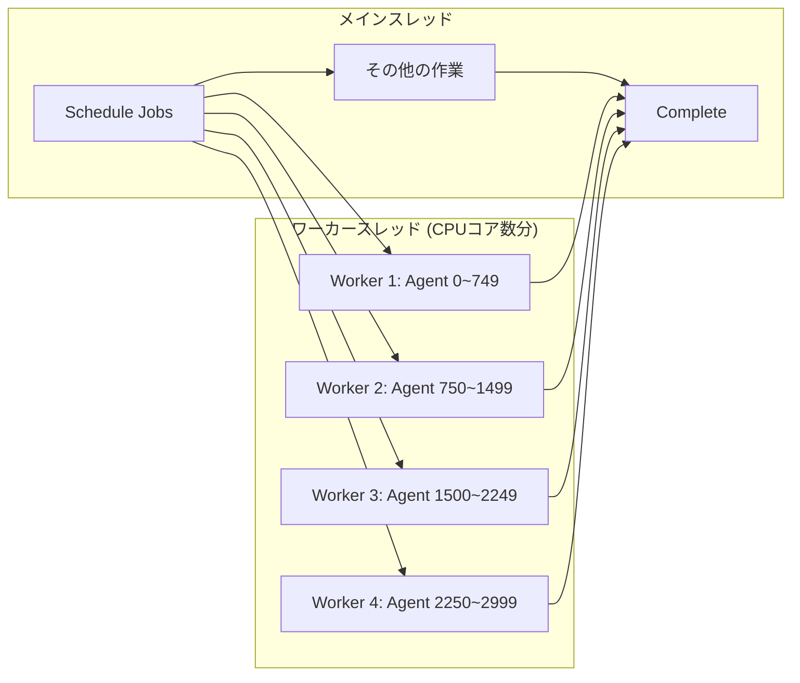
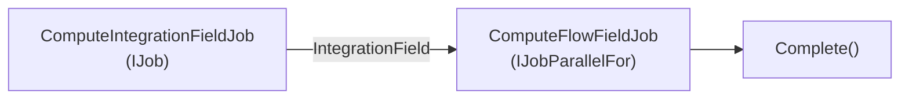
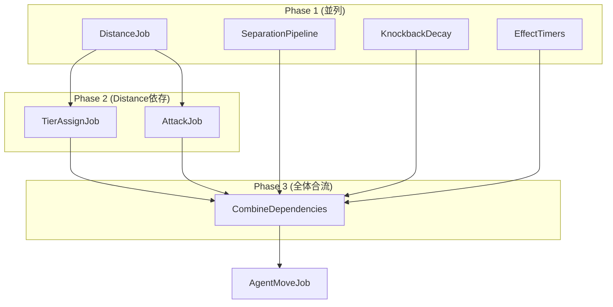
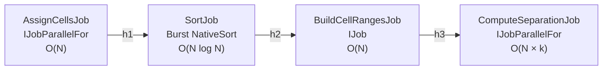

## 序論

Unityで数千体のエージェントを60fpsで動かすには、メインスレッド1本では不可能だ。経路探索、分離ステアリング、距離計算、行列変換 — これらすべての演算を毎フレーム処理しなければならないが、`Update()`で順次実行すると3,000体のエージェントでフレームあたり数十msを要する。

**C# Job System**と**Burst Compiler**はこの問題を解決するUnity公式のマルチスレッド + 高性能コンパイルフレームワークだ。この記事では両技術の原理から実践プロジェクトでの活用パターンまでを解説する。

> スレッド、競合状態、デッドロックなどマルチスレッドの基礎概念が必要であれば、[マルチスレッドプログラミング完全攻略](/posts/ThreadConcurrency/)を先に読むことを推奨する。Job Systemが**なぜ**このように設計されたかの背景になる。

---

## Part 1: なぜJob Systemが必要なのか

### Unityのメインスレッドボトルネック

Unityのほとんどのアプリケーションプログラミングインターフェースは**メインスレッドでのみ**呼び出せる。`Transform.position`、`Physics.Raycast`、`GameObject.Instantiate`などおなじみのアプリケーションプログラミングインターフェースはすべてメインスレッド専用だ。

```
メインスレッド (16.6msバジェット @ 60fps):
├── Input処理              ~0.1ms
├── MonoBehaviour.Update  ~???ms  ← ここでゲームロジックをすべて処理
├── 物理シミュレーション    ~2ms
├── アニメーション          ~1ms
├── レンダリングコマンド発行 ~2ms
└── 残りバジェット          ???ms
```

3,000体のエージェントの移動を`Update()`で処理すると:

```csharp
// MonoBehaviour方式 — メインスレッドで逐次実行
void Update()
{
    foreach (var agent in agents)  // 3,000回ループ
    {
        Vector3 flowDir = SampleFlowField(agent.position);    // メモリアクセス
        Vector3 separation = ComputeSeparation(agent, agents); // O(N) 近傍探索
        agent.transform.position += (flowDir + separation) * speed * Time.deltaTime;
    }
}
```

このコードは**3つの問題**を同時に抱えている:

| 問題 | 原因 | 影響 |
|------|------|------|
| シングルスレッド | ワーカースレッドを活用できない | CPUコアの無駄 |
| キャッシュミス | Transformアクセス時のポインタチェイシング | メモリボトルネック |
| GCプレッシャー | managedオブジェクトの割り当て/解放 | フレームスパイク |

### 解決策: 演算をワーカースレッドに移す



Job Systemはメインスレッドで**作業をスケジュール(Schedule)**し、多数の**ワーカースレッドで並列実行**した後、結果が必要なタイミングで**完了を待機(Complete)**する構造だ。

---

## Part 2: C# Job System基礎

### Jobインターフェースの種類

Unityは用途に応じて3種類のJobインターフェースを提供する。

#### IJob — シングルスレッド作業

ワーカースレッド**1つ**で実行される作業。順次アルゴリズムに適している。

```csharp
[BurstCompile]
public struct ComputeIntegrationFieldJob : IJob
{
    [ReadOnly] public NativeArray<byte> CostField;
    [ReadOnly] public FlowFieldGrid Grid;
    [ReadOnly] public NativeArray<int> GoalIndices;
    [ReadOnly] public int GoalCount;

    public NativeArray<ushort> IntegrationField;

    public void Execute()
    {
        // Dial's Algorithm — 逐次的にすべてのセルを処理
        // バケットキューベースの最短経路計算
        // → 並列化不可能なアルゴリズムなのでIJobを使用
    }
}
```

Dial's Algorithmのように**前のセルの結果が次のセルに影響**するアルゴリズムは並列化できない。このような場合は`IJob`を使いつつ、Burstでシングルスレッド性能を最大化する。

#### IJobParallelFor — 並列バッチ作業

データ配列を**複数のワーカースレッドが分割**して同時処理する。ほとんどのエージェントロジックはこれを使う。

```csharp
[BurstCompile]
public struct ComputeFlowFieldJob : IJobParallelFor
{
    [ReadOnly] public NativeArray<ushort> IntegrationField;
    [ReadOnly] public FlowFieldGrid Grid;
    [WriteOnly] public NativeArray<float2> FlowDirections;

    public void Execute(int index)
    {
        // 各セルは独立して処理可能
        // index = 0 ~ CellCount-1
        // 8方向の隣接セルのIntegrationField値を比較して最小コスト方向を決定
        ushort myCost = IntegrationField[index];
        if (myCost == 0 || myCost >= ushort.MaxValue)
        {
            FlowDirections[index] = float2.zero;
            return;
        }

        int cx = index % Grid.Width;
        int cy = index / Grid.Width;

        ushort bestCost = myCost;
        float2 bestDir = float2.zero;

        // 8方向の隣接セルチェック (各セルが独立 → 並列安全)
        CheckNeighbor(cx, cy + 1, ref bestCost, ref bestDir, new float2(0, 1));
        CheckNeighbor(cx, cy - 1, ref bestCost, ref bestDir, new float2(0, -1));
        // ... (8方向)

        FlowDirections[index] = math.normalizesafe(bestDir);
    }
}
```

`Execute(int index)`の**各呼び出しは完全に独立**していなければならない。index 0の結果がindex 1に影響してはいけない。この条件さえ満たせばUnityが自動的にワーカースレッドにバッチを分配する。

**スケジューリング時のバッチサイズ(innerloopBatchCount)**:

```csharp
// 10,000セルを64個ずつまとめてワーカーに分配
var handle = flowJob.Schedule(grid.CellCount, 64);
```

バッチサイズ64は「ワーカースレッド1つが一度に64個のインデックスを処理する」という意味だ。小さすぎるとスケジューリングのオーバーヘッドが大きくなり、大きすぎると負荷分散がうまくいかない。**32〜128**の範囲が一般的だ。

#### IJob vs IJobParallelFor 選択基準

| 基準 | IJob | IJobParallelFor |
|------|------|-----------------|
| データ依存性 | セル間に依存あり | 各インデックスが独立 |
| 実行スレッド | ワーカー1個 | ワーカーN個 (自動分配) |
| 使用例 | Dijkstra、範囲テーブル構築 | Flow方向計算、エージェント移動、距離計算 |
| 性能特性 | Burst最適化による高速シングルスレッド | コア数に比例するスループット |

---

### NativeContainer: Jobが使用するデータ

Jobは**managedオブジェクト(class、List、Dictionaryなど)にアクセスできない**。代わりにUnityが提供する**NativeContainer**を使用する。これらのコンテナはネイティブメモリ(unmanaged heap)に割り当てられ、GCの影響を受けない。

#### NativeArray — 最も基本的なコンテナ

```csharp
// 割り当て — Allocatorの種類によって寿命が異なる
var positions = new NativeArray<float3>(agentCount, Allocator.Persistent);
var tempBuffer = new NativeArray<int>(256, Allocator.Temp);

// 使用
positions[0] = new float3(1, 0, 3);
float3 pos = positions[0];

// 解放 — Persistentは必ず手動解放
positions.Dispose();
// TempはフレームEndで自動解放 (手動解放も可)
```

#### NativeArrayの内部構造: C#配列との違い

NativeArrayを正しく理解するにはC#のメモリモデルを先に知る必要がある。

**C#配列 (`float3[]`)のメモリ構造:**

```
┌─────────────── Managed Heap (GC管轄) ───────────────┐
│                                                       │
│  float3[] agents = new float3[3000];                  │
│                                                       │
│  [Object Header (16B)] [Length (8B)] [float3 × 3000]  │
│   ↑ GCが追跡         ↑ 配列長      ↑ 実際のデータ  │
│                                                       │
│  • GCが世代別に管理 (Gen0 → Gen1 → Gen2)              │
│  • GC Compaction時にメモリアドレスが変わる可能性あり  │
│  • 別スレッドからアクセス時に同期保証なし             │
└───────────────────────────────────────────────────────┘
```

C#配列はmanaged heapに割り当てられる。GC(Garbage Collector)が定期的にスキャンし、Compactionの過程で**メモリアドレス自体が移動**する可能性がある。ワーカースレッドがこの配列にアクセスしている最中にGCがアドレスを移動させると**メモリアクセス違反(Access Violation)**が発生する。

`fixed`キーワードや`GCHandle.Alloc(Pinned)`で固定(pinning)できるが、固定されたオブジェクトはGC Compactionを妨害して**ヒープフラグメンテーション**を引き起こす。数千の配列を固定するとGCの性能が深刻に低下する。

**NativeArrayのメモリ構造:**

```
┌─────────── Managed Heap ──────────┐   ┌──── Unmanaged Heap (OS直接) ────┐
│                                    │   │                                   │
│  NativeArray<float3> wrapper       │   │  UnsafeUtility.Malloc(           │
│  ┌─────────────────────┐          │   │      size: 12 × 3000,            │
│  │ void* m_Buffer ──────┼──────────┼──▶│      alignment: 16,              │
│  │ int   m_Length       │          │   │      allocator: Persistent)      │
│  │ Allocator m_Alloc    │          │   │                                   │
│  │ #if SAFETY           │          │   │  [float3][float3][float3]...      │
│  │ AtomicSafetyHandle   │          │   │  ← 連続メモリ、GC無関係 →       │
│  │ #endif               │          │   │  ← 16バイトアライメント保証 →   │
│  └─────────────────────┘          │   │                                   │
│   ↑ struct (8~32B)                │   └───────────────────────────────────┘
│   GC負荷ほぼゼロ                  │
└────────────────────────────────────┘
```

NativeArray自体は**struct** (値型)であり、内部に**ネイティブポインタ(`void*`)**を保持する。実際のデータは`UnsafeUtility.Malloc()`を通じて**unmanaged heap**に直接割り当てられる。このメモリは:

- **GCがまったく関与しない** — スキャン対象外なのでGC負荷ゼロ
- **アドレスが固定されている** — Compactionで移動しないのでワーカースレッドから安全
- **OSの`malloc`/`VirtualAlloc`レベルで割り当て** — C/C++ネイティブコードと同じメモリ管理
- **16バイトアライメント** — SIMD演算に最適化されたメモリ配置

```csharp
// NativeArrayのコア — 実際のUnity内部実装の簡略版
public struct NativeArray<T> : IDisposable where T : struct
{
    [NativeDisableUnsafePtrRestriction]
    internal unsafe void* m_Buffer;    // unmanagedメモリポインタ
    internal int m_Length;
    internal Allocator m_AllocatorLabel;

#if ENABLE_UNITY_COLLECTIONS_CHECKS
    internal AtomicSafetyHandle m_Safety;  // エディタ専用安全性チェック
#endif

    public unsafe T this[int index]
    {
        get => UnsafeUtility.ReadArrayElement<T>(m_Buffer, index);
        set => UnsafeUtility.WriteArrayElement(m_Buffer, index, value);
    }
}
```

**核心的な違いを一言でまとめると:**

> C#配列は「GCが管理するヒープ上のオブジェクト」であり、NativeArrayは「OSから直接借りたメモリブロックへのポインタ」だ。

この違いがマルチスレッド + Burst環境で決定的になる。Burstは`void* m_Buffer`をC++ポインタのように直接使用してオーバーヘッドのないメモリアクセスを生成する。

#### Allocatorの種類

| Allocator | 寿命 | 内部実装 | 用途 | 解放 |
|-----------|------|-----------|------|------|
| `Temp` | 1フレーム | スレッドローカルスタックアロケータ | Job内部の一時バッファ | 自動 (フレーム終了) |
| `TempJob` | 4フレーム | ロックフリーバケットアロケータ | Job間受け渡し用一時データ | 手動推奨 |
| `Persistent` | 無制限 | OS malloc (VirtualAlloc/mmap) | ゲーム中ずっと保持するデータ | 必ず手動解放 |

`Temp`が最も速い理由はスレッドローカルメモリプールから**ロック(lock)なし**で割り当てるからだ。`Persistent`はOSカーネル呼び出しを伴うので割り当て自体は相対的に遅いが、一度割り当てた後のアクセス性能は同じだ。

実際のプロジェクトでの使用パターン:

```csharp
public class FlowFieldData : IDisposable
{
    // Persistent — ゲーム中ずっと保持するグリッドデータ
    public NativeArray<float> HeightField { get; private set; }
    public NativeArray<byte> CostField { get; private set; }

    public FlowFieldData(FlowFieldGrid grid)
    {
        int cellCount = grid.CellCount;
        HeightField = new NativeArray<float>(cellCount, Allocator.Persistent);
        CostField = new NativeArray<byte>(cellCount, Allocator.Persistent);
    }

    public void Dispose()
    {
        if (HeightField.IsCreated) HeightField.Dispose();
        if (CostField.IsCreated) CostField.Dispose();
    }
}
```

`IDisposable`パターンで`OnDestroy()`から確実に解放する。**Persistent NativeArrayを解放しないとネイティブメモリリーク**が発生する。

---

### Safety System: 競合状態の防止

Job Systemの最大の利点のひとつは**コンパイル時 + ランタイムの安全性チェック**だ。

#### [ReadOnly] / [WriteOnly] アトリビュート

```csharp
[BurstCompile]
public struct ZombieDistanceJob : IJobParallelFor
{
    [ReadOnly] public NativeArray<float3> Positions;   // 読み取りのみ許可
    [ReadOnly] public NativeArray<byte> IsAlive;       // 読み取りのみ許可
    [ReadOnly] public NativeArray<float3> GoalPositions;
    [ReadOnly] public int GoalCount;

    [WriteOnly] public NativeArray<float> Distances;   // 書き込みのみ許可

    public void Execute(int index)
    {
        if (IsAlive[index] == 0)
        {
            Distances[index] = float.MaxValue;
            return;
        }

        float3 pos = Positions[index];
        float minDist = float.MaxValue;

        for (int g = 0; g < GoalCount; g++)
        {
            float dx = pos.x - GoalPositions[g].x;
            float dz = pos.z - GoalPositions[g].z;
            float dist = math.sqrt(dx * dx + dz * dz);
            minDist = math.min(minDist, dist);
        }

        Distances[index] = minDist;
    }
}
```

`[ReadOnly]`を明示すると:
1. **同じNativeArrayを複数のJobが同時に読み取れる**
2. そのJobで書き込みを試みると**コンパイルエラー**

`[WriteOnly]`を明示すると:
1. そのJobで読み取りを試みるとエラー
2. Burstが**書き込み最適化**(ストア統合など)を適用できる

アトリビュートなしでNativeArrayを宣言すると**読み書き**両方可能だが、同時に別のJobが同じ配列にアクセスするとSafety Systemがエラーをスローする。

#### 安全性チェックが捕捉するミス

```csharp
// エラー1: 同じ配列に2つのJobが同時に書き込み
var jobA = new WriteJob { Data = positions };
var jobB = new WriteJob { Data = positions };  // 同じ配列！
var hA = jobA.Schedule(count, 64);
var hB = jobB.Schedule(count, 64);  // 💥 InvalidOperationException

// エラー2: Jobが実行中なのにメインスレッドからアクセス
var handle = moveJob.Schedule(count, 64);
float3 pos = positions[0];  // 💥 Jobが終わる前にアクセス不可
handle.Complete();           // 以降はアクセス可能

// エラー3: Job内でmanagedタイプにアクセス
public struct BadJob : IJob
{
    public List<int> data;  // 💥 コンパイルエラー — managedタイプ使用不可
}
```

この安全性チェックのおかげで**マルチスレッドプログラミングで最も難しい部分(競合状態、デッドロック)を構造的に防止**できる。

---

### Jobスケジューリングと依存チェーン

Jobは`Schedule()`で予約し`Complete()`で結果を同期する。核心は**依存チェーン(dependency chain)**を通じてJob間の実行順序を保証することだ。

#### 逐次依存: あるJobの出力が次のJobの入力

```csharp
// Integration Field計算 (IJob — シングルスレッド)
var integrationJob = new ComputeIntegrationFieldJob
{
    CostField = data.CostField,
    Grid = grid,
    GoalIndices = goalArray,
    GoalCount = goalArray.Length,
    IntegrationField = layer.IntegrationField,
    BucketHeads = layer.DialBucketHeads,
    NextInBucket = layer.DialNextInBucket,
    Settled = layer.DialSettled
};
var integrationHandle = integrationJob.Schedule();

// Flow Field計算 — Integrationの結果を読むので依存性が必要
var flowJob = new ComputeFlowFieldJob
{
    IntegrationField = layer.IntegrationField,  // ← integrationJobの出力
    Grid = grid,
    FlowDirections = layer.FlowField
};
// integrationHandleを依存性として渡す → Integration完了後にのみ実行
var flowHandle = flowJob.Schedule(grid.CellCount, 64, integrationHandle);

flowHandle.Complete();  // 2つのJobが両方完了するまで待機
```



`Schedule()`の最後の引数で`JobHandle`を渡すと**そのJobが終わった後に実行**されるという意味だ。

#### 独立並列実行 + CombineDependencies

互いに独立したJobは同時にスケジューリングして**ワーカースレッドを最大限活用**する。

```csharp
// Phase 1: 独立した4つのJobを同時にスケジューリング
var hDist = ScheduleDistanceJob();      // 距離計算
var hSep  = ScheduleSeparationPipeline(); // 分離力計算
var hKb   = ScheduleKnockbackDecay(dt);   // ノックバック減衰
var hFx   = ScheduleEffectTimers(dt);     // エフェクトタイマー

// Phase 2: 距離の結果が必要なJobだけ個別に同期
hDist.Complete();
var hTier   = ScheduleTierAssign();    // 距離 → ティア決定
var hAttack = ScheduleAttackJob(dt);   // 距離 → 攻撃判定

// Phase 3: 移動前にすべての前処理を合流
var hPreMove = JobHandle.CombineDependencies(
    JobHandle.CombineDependencies(hTier, hAttack, hSep),
    JobHandle.CombineDependencies(hKb, hFx));
hPreMove.Complete();

// Phase 4: 移動Job (すべての前処理結果を読む)
var hMove = ScheduleMoveJob(dt);
hMove.Complete();
```



このパターンの核心:
- **Phase 1**で4つのJobが**異なるワーカースレッドで同時実行**
- **Phase 2**はDistanceの結果だけ必要なので`hDist.Complete()`後すぐにスケジュール
- **Phase 3**で`CombineDependencies`ですべての先行Jobを合流点に集める
- **Phase 4**のMoveJobはすべての結果(Flow、Separation、Knockback、Tier...)を読むので最後に実行

---

## Part 3: Burst Compiler

### Burstがすること

通常のC#コードは次の経路で実行される:

```
通常のC#:   ソースコード → C#コンパイラ → IL (中間言語) → JITコンパイラ → ネイティブコード
            (ビルド時)                                    (ランタイム)
```

JIT(Just-In-Time)は汎用的なコードを生成する。安全性チェック、境界チェック(bounds check)、GC連携コードが含まれていて最適化に限界がある。

Burstはこの経路を**完全に迂回**する:

```
Burst:    ソースコード → C#コンパイラ → IL → Burstフロントエンド → LLVM IR
           (ビルド時)                       (ビルド時/エディタ起動時)
                                                ↓
                                         LLVM最適化パス
                                         (ループアンローリング、インライン化、
                                          デッドコード除去、定数畳み込み)
                                                ↓
                                         SIMD自動ベクトル化
                                                ↓
                                         Platformネイティブコード
                                         • x86: SSE4.2 / AVX2
                                         • ARM: NEON
                                         • Apple Silicon: NEON + AMX
```

LLVMはClang(C/C++コンパイラ)、Rust、Swiftが使用しているのと**同じバックエンド**だ。つまりBurstが生成するコードはよく書かれたC++コードと同等の性能を発揮する。

#### SIMD: 1つの命令で複数のデータを同時処理

**SIMD(Single Instruction, Multiple Data)**はCPUが1つの命令で複数の値を同時に演算する機能だ。

```
スカラー演算 (SIMDなし):
  float a0 = b0 + c0;   // 命令1
  float a1 = b1 + c1;   // 命令2
  float a2 = b2 + c2;   // 命令3
  float a3 = b3 + c3;   // 命令4
  → 4個の命令、4 cycles

SIMD演算 (SSE: 128-bitレジスタ):
  ┌────┬────┬────┬────┐     ┌────┬────┬────┬────┐
  │ b0 │ b1 │ b2 │ b3 │  +  │ c0 │ c1 │ c2 │ c3 │
  └────┴────┴────┴────┘     └────┴────┴────┴────┘
           ↓ ADDPS (1命令)
  ┌────┬────┬────┬────┐
  │ a0 │ a1 │ a2 │ a3 │
  └────┴────┴────┴────┘
  → 1個の命令、1 cycle (4倍のスループット)

AVX2 (256-bitレジスタ): 8個のfloatを同時 → 8倍
```

`Unity.Mathematics`の`float3`、`float4`、`int2`などはこのSIMDレジスタに**ぴったり合わせて設計**された型だ:

| 型 | サイズ | SIMDレジスタ | 備考 |
|------|------|---------------|------|
| `float2` | 8B | SSE下位64ビット | XZ平面演算に適合 |
| `float3` | 12B | SSE 128ビット (4番目スロット未使用) | 3D位置/速度 |
| `float4` | 16B | SSE 128ビット (完全活用) | カラー、クォータニオン |
| `float4x4` | 64B | SSE × 4 または AVX × 2 | 変換行列 |
| `int2` | 8B | 整数SIMD | グリッド座標 |

Burstの**自動ベクトル化(auto-vectorization)**はループを解析してSIMD命令に変換する:

```csharp
// このコードをBurstがコンパイルすると:
for (int i = 0; i < count; i++)
{
    float dx = positions[i].x - goal.x;
    float dz = positions[i].z - goal.z;
    distances[i] = math.sqrt(dx * dx + dz * dz);
}

// 内部的にこのように変換される (概念):
for (int i = 0; i < count; i += 4)  // 4個ずつまとめて
{
    __m128 dx = _mm_sub_ps(load4(pos_x + i), broadcast(goal.x));  // 4個の減算を同時
    __m128 dz = _mm_sub_ps(load4(pos_z + i), broadcast(goal.z));
    __m128 distSq = _mm_add_ps(_mm_mul_ps(dx, dx), _mm_mul_ps(dz, dz));
    _mm_store_ps(distances + i, _mm_sqrt_ps(distSq));               // 4個のsqrtを同時
}
```

これが**同じC#コードでもBurstの有無で10〜50倍性能差**が生まれる核心的な理由だ。JITはこのレベルのベクトル化をほとんど実行できない。

通常のC#コード比**10〜50倍の性能向上**が一般的だ。

### 使い方: [BurstCompile]

```csharp
using Unity.Burst;
using Unity.Collections;
using Unity.Jobs;
using Unity.Mathematics;  // float3, int2, math.* を使用

[BurstCompile]
public struct PositionToMatrixJob : IJobParallelFor
{
    [ReadOnly] public NativeArray<float3> Positions;
    [ReadOnly] public NativeArray<float3> Velocities;
    [ReadOnly] public NativeArray<byte> IsAlive;
    [ReadOnly] public float3 Scale;
    [ReadOnly] public float DeltaTime;
    [ReadOnly] public float RotationSmoothSpeed;

    [NativeDisableParallelForRestriction]
    public NativeArray<float4x4> Matrices;

    public void Execute(int index)
    {
        if (IsAlive[index] == 0)
        {
            // 死んだエージェントは画面外へ
            Matrices[index] = float4x4.TRS(
                new float3(0, -1000, 0), quaternion.identity, float3.zero);
            return;
        }

        float3 pos = Positions[index];
        float3 vel = Velocities[index];

        // 前フレームのマトリクスからforward方向を抽出
        float4x4 prev = Matrices[index];
        float3 prevForward = math.normalizesafe(
            new float3(prev.c2.x, prev.c2.y, prev.c2.z));

        // 速度方向へのスムーズな回転補間
        float3 targetForward = math.lengthsq(new float2(vel.x, vel.z)) > 0.25f
            ? math.normalizesafe(new float3(vel.x, 0f, vel.z))
            : prevForward;

        float t = math.saturate(RotationSmoothSpeed * DeltaTime);
        float3 smoothForward = math.normalizesafe(
            math.lerp(prevForward, targetForward, t));

        quaternion rot = quaternion.LookRotationSafe(smoothForward, math.up());
        Matrices[index] = float4x4.TRS(pos, rot, Scale);
    }
}
```

コードで注目すべき点:
- `UnityEngine.Vector3`の代わりに**`Unity.Mathematics.float3`**を使用
- `Mathf.Sqrt`の代わりに**`math.sqrt`**を使用
- `Quaternion.LookRotation`の代わりに**`quaternion.LookRotationSafe`**を使用

`Unity.Mathematics`ライブラリはBurstが**SIMD命令に直接変換**できるよう設計された数学型だ。

### Burstの制約事項

Burstはネイティブコードにコンパイルされるため、managed C#の機能は使用できない:

| 使用可能 | 使用不可 |
|-----------|-----------|
| 基本値型 (int, float, bool) | class (参照型) |
| struct | string |
| NativeArray, NativeList | List\<T\>, Dictionary\<K,V\> |
| Unity.Mathematics (float3, int2...) | UnityEngine.Vector3 (managed) |
| `math.*` 関数 | `Mathf.*`, `Debug.Log` |
| 静的readonlyフィールド | virtualメソッド、interface呼び出し |
| fixed-sizeバッファ | try-catch, LINQ |

### [NativeDisableParallelForRestriction]

`IJobParallelFor`では基本的に**自分のインデックスへの書き込みのみ許可**される。つまり`Execute(5)`で`Data[5]`には書けるが`Data[3]`には書けない。

しかし`PositionToMatrixJob`のように前フレームのマトリクスを読んで同じインデックスに再び書く必要がある場合、Safety Systemがこれを阻む可能性がある。このとき`[NativeDisableParallelForRestriction]`を付けるとインデックス制限を解除する。

```csharp
[NativeDisableParallelForRestriction]
public NativeArray<float4x4> Matrices;  // 同じインデックスを読み書き

public void Execute(int index)
{
    float4x4 prev = Matrices[index];  // 読み取り
    // ... 計算 ...
    Matrices[index] = newMatrix;       // 書き込み (同じインデックス)
}
```

**注意**: このアトリビュートを乱用するとSafety Systemの保護がなくなる。**必ず自分のインデックスにのみ書くことが保証される場合のみ使用**すること。

---

## Part 4: メモリ階層とSoAレイアウト

Job System + Burstの性能を理解するにはCPUのメモリ階層構造を知る必要がある。コード最適化のほとんどは結局**「キャッシュをどれだけ効率的に使うか」**に帰結する。

### CPUキャッシュ階層: なぜメモリアクセスパターンが重要か

現代のCPUはメインメモリ(RAM)に直接アクセスしない。中間に複数段階の**キャッシュ(cache)**を置き、頻繁にアクセスするデータを近い場所にコピーしておく。

```
┌──────────┐   ~1 cycle      ┌──────────┐   ~4 cycles     ┌──────────┐
│ CPU Core │ ◀─────────────▶ │ L1 Cache │ ◀──────────────▶ │ L2 Cache │
│ (レジスタ)│   32~64 KB      │ (コア毎)  │   256~512 KB    │ (コア毎)  │
└──────────┘                  └──────────┘                  └──────────┘
                                                                │
                                                          ~12 cycles
                                                                │
                              ┌──────────┐  ~40-80 cycles  ┌──────────┐
                              │ L3 Cache │ ◀──────────────▶│   RAM    │
                              │ (共有)    │                  │ (DDR5)   │
                              │ 8~32 MB  │                  │ ~100ns   │
                              └──────────┘                  └──────────┘
```

| 階層 | 容量 | レイテンシ | 帯域幅 |
|------|------|-----------|--------|
| L1キャッシュ | 32~64 KB / コア | ~1ns (1 cycle) | ~1 TB/s |
| L2キャッシュ | 256 KB~1 MB / コア | ~4ns (4 cycles) | ~200 GB/s |
| L3キャッシュ | 8~32 MB (共有) | ~12ns (12 cycles) | ~100 GB/s |
| RAM (DDR5) | 16~64 GB | ~80ns (80 cycles) | ~50 GB/s |

**L1キャッシュとRAMの速度差は約80倍**だ。同じ演算でもデータがL1にあるか、RAMから取得するかによって性能が数十倍変わる。

#### キャッシュライン: メモリアクセスの最小単位

CPUはメモリをバイト単位で取得しない。**キャッシュライン(Cache Line)**単位(通常64バイト)で一度に取得する。

```
float3 positions[5000];  // 12 bytes × 5,000 = 60 KB

メモリでpositions[0]を読むと:
┌──────────────────────── 64 bytes (1キャッシュライン) ──────────────────────┐
│ positions[0] │ positions[1] │ positions[2] │ positions[3] │ pos[4].. │
│   12 bytes   │   12 bytes   │   12 bytes   │   12 bytes   │ 12+4pad │
└──────────────────────────────────────────────────────────────────────────┘
  ↑ 要求したもの                ↑ 無料で一緒にロードされる (spatial locality)

→ positions[0]~[4]を逐次アクセスするとキャッシュミス1回で5個のfloat3をすべて読める
→ これが「連続メモリ」が速い理由
```

逆に、オブジェクトがヒープのあちこちに散在していると:

```
Agent* agent0 = 0x10000;  // キャッシュラインAをロード
Agent* agent1 = 0x50000;  // キャッシュラインBをロード (Aと無関係の場所)
Agent* agent2 = 0x20000;  // キャッシュラインCをロード
// → 毎回新しいキャッシュラインをRAMから取得 = キャッシュミス3回
// → それぞれ ~80ns × 3 = 240ns (逐次アクセス比数十倍遅い)
```

#### ハードウェアプリフェッチャー(Prefetcher)

現代のCPUには**ハードウェアプリフェッチャー**が内蔵されている。メモリアクセスパターンが**逐次的(sequential)**であれば次に読むキャッシュラインを**事前に取得(prefetch)**する。

```
逐次アクセス (プリフェッチャー動作):
  positions[0] → [1] → [2] → [3] → ...
  CPU: 「連続して読んでいる」→ 次のキャッシュラインを事前ロード
  → ほとんどのアクセスがL1ヒット (レイテンシ ~1ns)

ランダムアクセス (プリフェッチャー無効化):
  agents[hash(42)] → agents[hash(7)] → agents[hash(999)] → ...
  CPU: 「パターンが分からない」→ プリフェッチャー非活性化
  → ほとんどのアクセスがL2/L3/RAMミス (レイテンシ 4~80ns)
```

NativeArrayの**連続メモリ配置**が重要な理由がまさにこれだ。プリフェッチャーが正常動作すると実質的なメモリレイテンシがほぼなくなる。

#### False Sharing: 並列プログラミングの隠れた落とし穴

`IJobParallelFor`で複数のワーカースレッドが**同じキャッシュラインに属する異なるインデックス**に書くと**false sharing**が発生する。

```
キャッシュライン (64 bytes):
┌──────────┬──────────┬──────────┬──────────┬──────────┐
│ float[0] │ float[1] │ float[2] │ float[3] │ ...      │
│ Worker 0 │ Worker 0 │ Worker 1 │ Worker 1 │ ...      │
└──────────┴──────────┴──────────┴──────────┴──────────┘

Worker 0がfloat[0]に書くと → キャッシュライン全体が「dirty」としてマーク
Worker 1がfloat[2]を読もうとすると → Worker 0のキャッシュラインを無効化して再ロード
→ 異なるデータに書いているのにキャッシュラインレベルで干渉が発生
```

Unityの`IJobParallelFor`は**バッチサイズ(innerloopBatchCount)**でこの問題を緩和する。バッチサイズ64は1つのワーカーが最低64個のインデックスを連続して処理するという意味なので、同じキャッシュラインを2つのワーカーが同時にアクセスする確率が大幅に減る。

### AoS vs SoA

エージェントデータを保存する方法は大きく2種類ある:

#### AoS (Array of Structures) — 従来方式

```csharp
// GameObject + MonoBehaviour方式
class Agent
{
    public Vector3 position;   // 12 bytes
    public Vector3 velocity;   // 12 bytes
    public float speed;        // 4 bytes
    public float health;       // 4 bytes
    public bool isAlive;       // 1 byte + padding
}
Agent[] agents = new Agent[3000];  // ヒープに3,000個のオブジェクト、各々別参照
```

```
メモリ配置:
[Agent0: pos|vel|spd|hp|alive|pad] [Agent1: pos|vel|spd|hp|alive|pad] ...
 ←─── 36+ bytes ───→               ←─── 36+ bytes ───→

位置だけ走査する時: posを読むためにvel, spd, hp, aliveもキャッシュラインに一緒にロードされる
→ キャッシュラインの66%が不要なデータ
```

#### SoA (Structure of Arrays) — Job System方式

```csharp
// NativeArrayベースのSoA
NativeArray<float3> positions;     // 12 bytes × 3,000 = 36 KB (連続)
NativeArray<float3> velocities;    // 12 bytes × 3,000 = 36 KB (連続)
NativeArray<float>  speeds;        // 4 bytes  × 3,000 = 12 KB (連続)
NativeArray<float>  healths;       // 4 bytes  × 3,000 = 12 KB (連続)
NativeArray<byte>   isAlive;       // 1 byte   × 3,000 =  3 KB (連続)
```

```
メモリ配置:
Positions:  [pos0|pos1|pos2|pos3|pos4|...] ← 連続したfloat3、キャッシュラインに5~6個格納
Velocities: [vel0|vel1|vel2|vel3|vel4|...] ← 別の連続配列
IsAlive:    [0|1|1|1|0|1|1|1|1|0|...]      ← 1バイト、キャッシュラインに64個格納
```

**位置だけ走査**するとき`Positions`配列だけ読めばいい。キャッシュライン(64バイト)1つにfloat3が5個入るので、**キャッシュ効率がほぼ100%**に達する。

### 実測比較

3,000エージェント基準でSoAがどれだけ有利かを示す例が`ZombieDistanceJob`だ:

```csharp
[BurstCompile]
public struct ZombieDistanceJob : IJobParallelFor
{
    [ReadOnly] public NativeArray<float3> Positions;  // 36 KB連続メモリ
    [ReadOnly] public NativeArray<byte> IsAlive;       // 3 KB連続メモリ
    [ReadOnly] public NativeArray<float3> GoalPositions;
    [ReadOnly] public int GoalCount;

    [WriteOnly] public NativeArray<float> Distances;

    public void Execute(int index)
    {
        if (IsAlive[index] == 0) { Distances[index] = float.MaxValue; return; }

        float3 pos = Positions[index];
        float minDist = float.MaxValue;

        for (int g = 0; g < GoalCount; g++)
        {
            float dx = pos.x - GoalPositions[g].x;
            float dz = pos.z - GoalPositions[g].z;
            minDist = math.min(minDist, math.sqrt(dx * dx + dz * dz));
        }

        Distances[index] = minDist;
    }
}
```

このJobがアクセスする全メモリ:
- `Positions`: 36 KB
- `IsAlive`: 3 KB
- `GoalPositions`: ~240 bytes (20個の目標)
- `Distances`(出力): 12 KB
- **合計: ~51 KB — L2キャッシュ(256KB~1MB)に完全格納**

AoS方式だったらAgentオブジェクトがヒープのあちこちに散在していて**ポインタチェイシングによるキャッシュミスが頻発**していたはずだ。

### メモリアライメントとSIMDの関係

NativeArrayは割り当て時に**16バイトアライメント**を保証する。これが重要な理由:

```
非整列(Unaligned)アクセス:
  アドレス0x10003からfloat4 (16B)を読む
  → キャッシュライン境界をまたぐ (0x10000~0x1003F, 0x10040~...)
  → 2個のキャッシュラインのロードが必要 → 性能ペナルティ

16バイト整列(Aligned)アクセス:
  アドレス0x10000からfloat4 (16B)を読む
  → 1個のキャッシュライン内に完全に収まる
  → SSE MOVAPS (aligned load) が使用可能 → 最大スループット
```

`UnsafeUtility.Malloc(size, alignment: 16, allocator)`でalignmentを16に指定すると、返されるポインタアドレスが常に16の倍数になる。Burstはこのアライメントを検出して**aligned SIMD load/store**命令を生成する。

### SoAがSIMDに有利な構造的理由

```
SoA:
  Positions.x: [x0, x1, x2, x3, x4, x5, x6, x7, ...]  ← SIMDで4個ずつロード
  Positions.z: [z0, z1, z2, z3, z4, z5, z6, z7, ...]  ← SIMDで4個ずつロード
  → dx[0..3] = x[0..3] - goal.x  ← 1 SIMD命令

AoS:
  Agent[0]: {x0, y0, z0}, Agent[1]: {x1, y1, z1}, ...
  → x0, x1, x2, x3を集めるには各AgentからxだけをExtractしなければならない
  → 「gather」演算が必要 → 遅い (AVX2でも非効率)
```

Unity.Mathematicsの`float3`はSoA構造ではない(x,y,zが1つのstructに入っている)が、NativeArrayレベルで**同じ型の配列が連続配置**されるのでBurstが効果的にベクトル化できる。

---

## Part 5: 実践パイプラインパターン

### パターン1: 逐次チェーン (Integration → FlowField)

アルゴリズム的な依存性があるJobは逐次チェーンで接続する。

```csharp
private void ScheduleLayerCompute(int layerId)
{
    var layer = data.GetLayer(layerId);

    // Step 1: Dial's AlgorithmでIntegration Fieldを計算 (IJob)
    var integrationJob = new ComputeIntegrationFieldJob
    {
        CostField = data.CostField,
        Grid = grid,
        GoalIndices = layer.GoalIndices.AsArray(),
        GoalCount = layer.GoalIndices.Length,
        IntegrationField = layer.IntegrationField,
        BucketHeads = layer.DialBucketHeads,
        NextInBucket = layer.DialNextInBucket,
        Settled = layer.DialSettled
    };
    var integrationHandle = integrationJob.Schedule();

    // Step 2: Integration → Flow Direction変換 (IJobParallelFor)
    var flowJob = new ComputeFlowFieldJob
    {
        IntegrationField = layer.IntegrationField,
        Grid = grid,
        FlowDirections = layer.FlowField
    };
    var flowHandle = flowJob.Schedule(grid.CellCount, 64, integrationHandle);

    flowHandle.Complete();
}
```

`integrationHandle`を`flowJob.Schedule()`の依存性として渡すと、Integrationが終わった直後にFlowField計算が**自動的に開始**される。メインスレッドは`flowHandle.Complete()`まで他の作業ができる。

### パターン2: Cell Sortパイプライン (4段階チェーン)

Separation Steeringは4つのJobが**逐次チェーン**で接続される:

```csharp
private JobHandle ScheduleSeparationPipeline()
{
    // 1. エージェントをグリッドセルに割り当て (並列)
    var assignJob = new AssignCellsJob
    {
        Positions = data.Positions,
        IsAlive = data.IsAlive,
        Grid = grid,
        CellAgentPairs = data.CellAgentPairs
    };
    var h1 = assignJob.Schedule(activeCount, 64);

    // 2. セルインデックス基準でソート (Burst SortJob)
    var h2 = data.CellAgentPairs.SortJob(new CellIndexComparer()).Schedule(h1);

    // 3. セル毎の (start, count) 範囲構築 (シングルスレッド)
    var rangesJob = new BuildCellRangesJob
    {
        SortedPairs = data.CellAgentPairs,
        CellRanges = data.CellRanges,
        AgentCount = activeCount,
        CellCount = grid.CellCount
    };
    var h3 = rangesJob.Schedule(h2);

    // 4. 3×3近傍ベースの分離力計算 (並列)
    var sepJob = new ComputeSeparationJob
    {
        Positions = data.Positions,
        IsAlive = data.IsAlive,
        SortedPairs = data.CellAgentPairs,
        CellRanges = data.CellRanges,
        Grid = grid,
        SeparationRadius = separationRadius,
        SeparationForces = data.SeparationForces
    };
    var handle = sepJob.Schedule(activeCount, 64, h3);

    return handle;
}
```



このパイプラインで`SortJob`はUnityが提供する**Burst最適化されたソートJob**だ。`NativeArray.SortJob(comparer).Schedule(dependency)`の形で呼び出すと依存チェーンに自然に合流する。

### パターン3: Dirty Flag + インターバルベース再計算

すべてのJobを毎フレーム実行すると無駄だ。**変更があるときのみ**再計算するパターン:

```csharp
private void Update()
{
    for (int layerId = 0; layerId < data.LayerCount; layerId++)
    {
        timeSinceLastCompute[layerId] += Time.deltaTime;
        var layer = data.GetLayer(layerId);

        // Dirtyフラグもなく intervalも経過していなければスキップ
        if (!layer.IsDirty && !costFieldDirty
            && timeSinceLastCompute[layerId] < recomputeInterval)
            continue;

        if (ShouldRecompute(layerId))
        {
            timeSinceLastCompute[layerId] = 0f;
            ScheduleLayerCompute(layerId);  // Jobスケジューリング
        }
    }
}
```

- 目標が静止状態: **再計算0回/秒** (完全スキップ)
- 目標が移動中: **0.5秒毎に1回** (2回/秒)
- CostField変更: 次のintervalで**即座に1回**

### パターン4: Profilerマーカー

Jobの性能を計測するには`ProfilerMarker`を使う:

```csharp
using Unity.Profiling;

private static readonly ProfilerMarker s_ComputeMarker = new("FlowField.Compute");
private static readonly ProfilerMarker s_SeparationMarker = new("FlowField.Separation");

private void ScheduleLayerCompute(int layerId)
{
    s_ComputeMarker.Begin();

    // ... Jobスケジューリング ...

    flowHandle.Complete();
    s_ComputeMarker.End();
}
```

Unity Profilerで"FlowField.Compute"、"FlowField.Separation"などの名前で**各Jobチェーンの所要時間を正確に計測**できる。

---

## Part 6: Burstが生み出す性能差

### structとreadonlyの力 — FlowFieldGrid

```csharp
public readonly struct FlowFieldGrid
{
    public readonly int Width;
    public readonly int Height;
    public readonly float CellSize;
    public readonly float3 Origin;

    [MethodImpl(MethodImplOptions.AggressiveInlining)]
    public int2 WorldToCell(float3 worldPos)
    {
        int x = (int)((worldPos.x - Origin.x) / CellSize);
        int z = (int)((worldPos.z - Origin.z) / CellSize);
        return new int2(
            math.clamp(x, 0, Width - 1),
            math.clamp(z, 0, Height - 1));
    }

    [MethodImpl(MethodImplOptions.AggressiveInlining)]
    public int CellToIndex(int2 cell) => cell.y * Width + cell.x;

    [MethodImpl(MethodImplOptions.AggressiveInlining)]
    public bool IsInBounds(int2 cell)
        => cell.x >= 0 && cell.x < Width && cell.y >= 0 && cell.y < Height;
}
```

このコードでBurstが適用する最適化:
- `readonly struct` → コピー時の防御的コピーを除去
- `AggressiveInlining` → 関数呼び出しオーバーヘッドを除去、呼び出し元にコードを直接展開
- `math.clamp` → SIMD `min`/`max`命令に変換
- 除算 (`/ CellSize`) → CellSizeが定数なら逆数乗算に変換

### 実際の性能数値

3,000エージェント基準、100×100グリッドでのフレームあたりコスト:

| Job | 種類 | 所要時間 | 備考 |
|-----|------|-----------|------|
| ComputeIntegrationFieldJob | IJob (Burst) | < 0.5ms | Dial's Algorithm、dirtyのときのみ |
| ComputeFlowFieldJob | IJobParallelFor | < 0.1ms | 10,000セル並列 |
| AssignCellsJob | IJobParallelFor | < 0.1ms | セル割り当て |
| SortJob (Burst) | 内蔵 | < 0.3ms | NativeArray整列 |
| BuildCellRangesJob | IJob | < 0.1ms | 範囲構築 |
| ComputeSeparationJob | IJobParallelFor | < 0.4ms | 3×3近傍探索 |
| AgentMoveJob | IJobParallelFor | < 0.5ms | 移動 + 衝突 + 補間 |
| PositionToMatrixJob | IJobParallelFor | < 0.3ms | 変換行列 |
| ZombieDistanceJob | IJobParallelFor | < 0.05ms | 距離計算 |
| ZombieTierAssignJob | IJobParallelFor | < 0.03ms | ティア決定 |
| **合計** | | **< 3ms** | **60fpsバジェット16.6msの18%** |

Burstなしで同じロジックを`Update()`で実行すると**15〜25ms**かかる。Burst + Job Systemの組み合わせで**5〜8倍の性能向上**を達成する。

---

## Part 7: よくあるミスと注意事項

### 1. Complete()を早く呼びすぎてはいけない

```csharp
// 悪い例: スケジュール直後にすぐComplete
var handle = job.Schedule(count, 64);
handle.Complete();  // メインスレッドがここでブロッキング — 並列の利点を失う

// 良い例: 他の作業を挟んで後でComplete
var handle = job.Schedule(count, 64);
DoOtherMainThreadWork();  // Jobがワーカーで実行される間に他の仕事をする
handle.Complete();
```

### 2. Job内でNativeArrayを生成する場合はTempのみ使用

```csharp
public void Execute()
{
    // Job内部で一時配列が必要な場合
    var dx = new NativeArray<int>(8, Allocator.Temp);  // ✅ Tempのみ許可
    // ... 使用 ...
    dx.Dispose();  // 明示的解放を推奨
}
```

### 3. 同じNativeArrayに2つのJobが書いてはいけない

```csharp
// エラー: 2つのJobが同じ配列に書き込み
var jobA = new WriteJob { Output = positions };
var jobB = new WriteJob { Output = positions };
var hA = jobA.Schedule(count, 64);
var hB = jobB.Schedule(count, 64);  // 💥 Safety Systemエラー

// 解決: 依存チェーンで逐次実行するか、出力配列を分離
var hA = jobA.Schedule(count, 64);
var hB = jobB.Schedule(count, 64, hA);  // ✅ Aが終わった後にB実行
```

### 4. Persistent配列は必ずDispose

```csharp
public class MyManager : MonoBehaviour
{
    private NativeArray<float3> _positions;

    void Awake()
    {
        _positions = new NativeArray<float3>(3000, Allocator.Persistent);
    }

    void OnDestroy()
    {
        if (_positions.IsCreated)  // すでに解放済みかチェック
            _positions.Dispose();
    }
}
```

`IsCreated`チェックなしに`Dispose()`を2回呼び出すとクラッシュが発生する。

---

## まとめ

| 概念 | 役割 | 核心ポイント |
|------|------|-------------|
| **IJob** | シングルワーカースレッド作業 | 逐次アルゴリズム用 (Dijkstraなど) |
| **IJobParallelFor** | 並列バッチ作業 | 各インデックス独立、バッチサイズ64推奨 |
| **NativeArray** | GC-freeデータコンテナ | Allocator寿命に注意、Dispose必須 |
| **[ReadOnly]/[WriteOnly]** | アクセス権限の明示 | Safety System + Burst最適化ヒント |
| **JobHandle** | 依存チェーン | Schedule()の引数として渡して実行順序を保証 |
| **CombineDependencies** | 合流点 | 独立したJobの結果を集めて次のステップへ |
| **[BurstCompile]** | ネイティブコンパイル | LLVM → SIMD自動ベクトル化、10〜50倍性能 |
| **Unity.Mathematics** | Burst互換数学 | float3, int2, math.* — SIMD変換可能 |
| **SoAレイアウト** | キャッシュ効率最大化 | NativeArrayで分離、L2キャッシュ格納 |
| **readonly struct** | 防御的コピーの除去 | Gridのような不変データに適用 |

この技術スタックの上にFlow Field、Separation Steering、AI LODなどのシステムが構築される。以降の記事では各システムの具体的な実装と問題解決の過程を解説する。

---

## References

- [Unity Manual — C# Job System](https://docs.unity3d.com/6000.0/Documentation/Manual/job-system.html)
- [Unity Manual — Burst Compiler](https://docs.unity3d.com/Packages/com.unity.burst@1.8/manual/index.html)
- [Unity Manual — NativeContainer](https://docs.unity3d.com/6000.0/Documentation/Manual/job-system-native-container.html)
- [Unity.Mathematics API](https://docs.unity3d.com/Packages/com.unity.mathematics@1.3/api/Unity.Mathematics.html)
