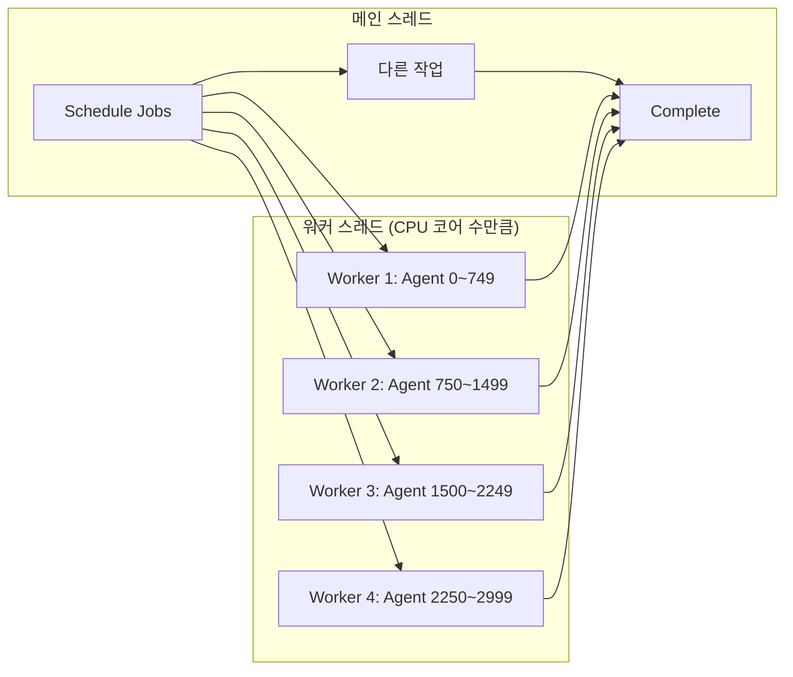
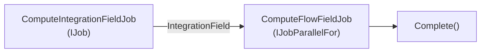
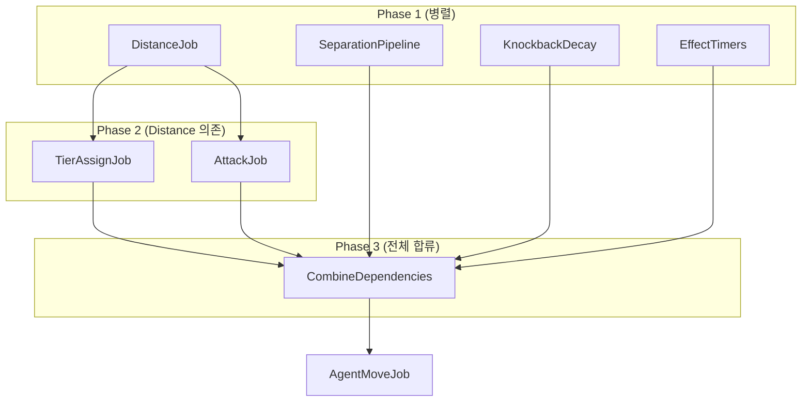
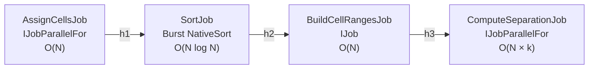

## 서론

Unity에서 수천 개의 에이전트를 60fps로 구동하려면 메인 스레드 하나로는 불가능하다. 경로 탐색, 분리 조향, 거리 계산, 행렬 변환 — 이 모든 연산을 매 프레임 처리해야 하는데, `Update()`에서 순차적으로 돌리면 3,000개 에이전트 기준으로 프레임 하나에 수십 ms가 소요된다.

**C# Job System**과 **Burst Compiler**는 이 문제를 해결하는 Unity의 공식 멀티스레드 + 고성능 컴파일 프레임워크다. 이 글에서는 두 기술의 원리부터 실전 프로젝트에서의 활용 패턴까지 다룬다.

> 스레드, 경합 조건, 데드락 등 멀티스레드 기초 개념이 필요하다면 [멀티스레드 프로그래밍 완전 정복](/posts/ThreadConcurrency/)을 먼저 읽는 것을 권장한다. Job System이 **왜** 이렇게 설계되었는지의 배경이 된다.

---

## Part 1: 왜 Job System이 필요한가

### Unity의 메인 스레드 병목

Unity의 대부분의 API는 **메인 스레드에서만** 호출할 수 있다. `Transform.position`, `Physics.Raycast`, `GameObject.Instantiate` 등 익숙한 API는 전부 메인 스레드 전용이다.

```
메인 스레드 (16.6ms 예산 @ 60fps):
├── Input 처리           ~0.1ms
├── MonoBehaviour.Update  ~???ms  ← 여기서 게임 로직 전부 처리
├── Physics 시뮬레이션    ~2ms
├── 애니메이션            ~1ms
├── 렌더링 커맨드 제출    ~2ms
└── 남은 예산             ???ms
```

3,000개 에이전트의 이동을 `Update()`에서 처리하면:

```csharp
// MonoBehaviour 방식 — 메인 스레드에서 순차 실행
void Update()
{
    foreach (var agent in agents)  // 3,000회 루프
    {
        Vector3 flowDir = SampleFlowField(agent.position);    // 메모리 접근
        Vector3 separation = ComputeSeparation(agent, agents); // O(N) 이웃 탐색
        agent.transform.position += (flowDir + separation) * speed * Time.deltaTime;
    }
}
```

이 코드는 **세 가지 문제**를 동시에 안고 있다:

| 문제 | 원인 | 영향 |
|------|------|------|
| 단일 스레드 | 워커 스레드 활용 불가 | CPU 코어 낭비 |
| 캐시 미스 | Transform 접근 시 포인터 체이싱 | 메모리 병목 |
| GC 압력 | managed 객체 할당/해제 | 프레임 스파이크 |

### 해결: 연산을 워커 스레드로 옮기기



Job System은 메인 스레드에서 **작업을 예약(Schedule)**하고, 다수의 **워커 스레드에서 병렬 실행**한 뒤, 결과가 필요한 시점에 **완료를 대기(Complete)**하는 구조다.

---

## Part 2: C# Job System 기초

### Job 인터페이스 종류

Unity는 용도에 따라 세 가지 Job 인터페이스를 제공한다.

#### IJob — 단일 스레드 작업

워커 스레드 **하나**에서 실행되는 작업. 순차적 알고리즘에 적합하다.

```csharp
[BurstCompile]
public struct ComputeIntegrationFieldJob : IJob
{
    [ReadOnly] public NativeArray<byte> CostField;
    [ReadOnly] public FlowFieldGrid Grid;
    [ReadOnly] public NativeArray<int> GoalIndices;
    [ReadOnly] public int GoalCount;

    public NativeArray<ushort> IntegrationField;

    public void Execute()
    {
        // Dial's Algorithm — 순차적으로 모든 셀을 처리
        // 버킷 큐 기반 최단 경로 계산
        // → 병렬화 불가능한 알고리즘이므로 IJob 사용
    }
}
```

Dial's Algorithm처럼 **이전 셀의 결과가 다음 셀에 영향**을 주는 알고리즘은 병렬화할 수 없다. 이런 경우 `IJob`을 쓰되, Burst로 단일 스레드 성능을 극대화한다.

#### IJobParallelFor — 병렬 배치 작업

데이터 배열을 **여러 워커 스레드가 분할**하여 동시 처리. 대부분의 에이전트 로직은 이것을 사용한다.

```csharp
[BurstCompile]
public struct ComputeFlowFieldJob : IJobParallelFor
{
    [ReadOnly] public NativeArray<ushort> IntegrationField;
    [ReadOnly] public FlowFieldGrid Grid;
    [WriteOnly] public NativeArray<float2> FlowDirections;

    public void Execute(int index)
    {
        // 각 셀은 독립적으로 처리 가능
        // index = 0 ~ CellCount-1
        // 8방향 이웃의 IntegrationField 값을 비교하여 최소 비용 방향 결정
        ushort myCost = IntegrationField[index];
        if (myCost == 0 || myCost >= ushort.MaxValue)
        {
            FlowDirections[index] = float2.zero;
            return;
        }

        int cx = index % Grid.Width;
        int cy = index / Grid.Width;

        ushort bestCost = myCost;
        float2 bestDir = float2.zero;

        // 8방향 이웃 검사 (각 셀이 독립적 → 병렬 안전)
        CheckNeighbor(cx, cy + 1, ref bestCost, ref bestDir, new float2(0, 1));
        CheckNeighbor(cx, cy - 1, ref bestCost, ref bestDir, new float2(0, -1));
        // ... (8방향)

        FlowDirections[index] = math.normalizesafe(bestDir);
    }
}
```

`Execute(int index)`의 **각 호출은 완전히 독립적**이어야 한다. index 0의 결과가 index 1에 영향을 주면 안 된다. 이 조건만 만족하면 Unity가 자동으로 워커 스레드에 배치를 분배한다.

**스케줄링 시 배치 크기(innerloopBatchCount)**:

```csharp
// 10,000개 셀을 64개씩 묶어서 워커에 분배
var handle = flowJob.Schedule(grid.CellCount, 64);
```

배치 크기 64는 "워커 스레드 하나가 한 번에 64개 인덱스를 처리한다"는 의미다. 너무 작으면 스케줄링 오버헤드가 커지고, 너무 크면 부하 분산이 안 된다. **32~128** 범위가 일반적이다.

#### IJob vs IJobParallelFor 선택 기준

| 기준 | IJob | IJobParallelFor |
|------|------|-----------------|
| 데이터 의존성 | 셀 간 의존 있음 | 각 인덱스 독립 |
| 실행 스레드 | 워커 1개 | 워커 N개 (자동 분배) |
| 사용 예시 | Dijkstra, 범위 테이블 구축 | Flow 방향 계산, 에이전트 이동, 거리 계산 |
| 성능 특성 | Burst 최적화로 빠른 단일 스레드 | 코어 수에 비례하는 처리량 |

---

### NativeContainer: Job이 사용하는 데이터

Job은 **managed 객체(class, List, Dictionary 등)에 접근할 수 없다**. 대신 Unity가 제공하는 **NativeContainer**를 사용한다. 이 컨테이너들은 네이티브 메모리(unmanaged heap)에 할당되어 GC의 영향을 받지 않는다.

#### NativeArray — 가장 기본적인 컨테이너

```csharp
// 할당 — Allocator 종류에 따라 수명이 다름
var positions = new NativeArray<float3>(agentCount, Allocator.Persistent);
var tempBuffer = new NativeArray<int>(256, Allocator.Temp);

// 사용
positions[0] = new float3(1, 0, 3);
float3 pos = positions[0];

// 해제 — Persistent는 반드시 수동 해제
positions.Dispose();
// Temp는 프레임 끝에 자동 해제 (수동 해제도 가능)
```

#### NativeArray의 내부 구조: C# 배열과 무엇이 다른가

NativeArray를 제대로 이해하려면 C#의 메모리 모델을 먼저 알아야 한다.

**C# 배열 (`float3[]`)의 메모리 구조:**

```
┌─────────────── Managed Heap (GC 관할) ───────────────┐
│                                                       │
│  float3[] agents = new float3[3000];                  │
│                                                       │
│  [Object Header (16B)] [Length (8B)] [float3 × 3000]  │
│   ↑ GC가 추적         ↑ 배열 길이    ↑ 실제 데이터   │
│                                                       │
│  • GC가 세대별로 관리 (Gen0 → Gen1 → Gen2)            │
│  • GC Compaction 시 메모리 주소가 바뀔 수 있음         │
│  • 다른 스레드에서 접근 시 동기화 보장 없음            │
└───────────────────────────────────────────────────────┘
```

C# 배열은 managed heap에 할당된다. GC(Garbage Collector)가 주기적으로 스캔하며, Compaction 과정에서 **메모리 주소 자체가 이동**할 수 있다. 워커 스레드에서 이 배열을 접근하는 도중에 GC가 주소를 옮기면 **메모리 접근 위반(Access Violation)**이 발생한다.

`fixed` 키워드나 `GCHandle.Alloc(Pinned)`로 고정(pinning)할 수 있지만, 고정된 객체는 GC Compaction을 방해하여 **힙 단편화**를 유발한다. 수천 개 배열을 고정하면 GC 성능이 심각하게 저하된다.

**NativeArray의 메모리 구조:**

```
┌─────────── Managed Heap ──────────┐   ┌──── Unmanaged Heap (OS 직접) ────┐
│                                    │   │                                   │
│  NativeArray<float3> wrapper       │   │  UnsafeUtility.Malloc(           │
│  ┌─────────────────────┐          │   │      size: 12 × 3000,            │
│  │ void* m_Buffer ──────┼──────────┼──▶│      alignment: 16,              │
│  │ int   m_Length       │          │   │      allocator: Persistent)      │
│  │ Allocator m_Alloc    │          │   │                                   │
│  │ #if SAFETY           │          │   │  [float3][float3][float3]...      │
│  │ AtomicSafetyHandle   │          │   │  ← 연속 메모리, GC 무관 →        │
│  │ #endif               │          │   │  ← 16바이트 정렬 보장 →          │
│  └─────────────────────┘          │   │                                   │
│   ↑ struct (8~32B)                │   └───────────────────────────────────┘
│   GC 부담 거의 없음               │
└────────────────────────────────────┘
```

NativeArray 자체는 **struct** (값 타입)이며, 내부에 **네이티브 포인터(`void*`)**를 보유한다. 실제 데이터는 `UnsafeUtility.Malloc()`을 통해 **unmanaged heap**에 직접 할당된다. 이 메모리는:

- **GC가 전혀 관여하지 않는다** — 스캔 대상이 아니므로 GC 부하 0
- **주소가 고정되어 있다** — Compaction으로 이동하지 않아 워커 스레드에서 안전
- **OS의 `malloc`/`VirtualAlloc` 수준에서 할당** — C/C++ 네이티브 코드와 동일한 메모리 관리
- **16바이트 정렬(alignment)** — SIMD 연산에 최적화된 메모리 배치

```csharp
// NativeArray의 핵심 — 실제 Unity 내부 구현의 단순화 버전
public struct NativeArray<T> : IDisposable where T : struct
{
    [NativeDisableUnsafePtrRestriction]
    internal unsafe void* m_Buffer;    // unmanaged 메모리 포인터
    internal int m_Length;
    internal Allocator m_AllocatorLabel;

#if ENABLE_UNITY_COLLECTIONS_CHECKS
    internal AtomicSafetyHandle m_Safety;  // 에디터 전용 안전성 검사
#endif

    public unsafe T this[int index]
    {
        get => UnsafeUtility.ReadArrayElement<T>(m_Buffer, index);
        set => UnsafeUtility.WriteArrayElement(m_Buffer, index, value);
    }
}
```

**핵심 차이를 한 줄로 요약하면:**

> C# 배열은 "GC가 관리하는 힙의 객체"이고, NativeArray는 "OS에서 직접 빌린 메모리 블록에 대한 포인터"다.

이 차이가 멀티스레드 + Burst 환경에서 결정적이다. Burst는 `void* m_Buffer`를 C++ 포인터처럼 직접 사용하여 오버헤드 없는 메모리 접근을 생성한다.

#### Allocator 종류

| Allocator | 수명 | 내부 구현 | 용도 | 해제 |
|-----------|------|-----------|------|------|
| `Temp` | 1프레임 | 스레드 로컬 스택 할당기 | Job 내부 임시 버퍼 | 자동 (프레임 끝) |
| `TempJob` | 4프레임 | 락-프리 버킷 할당기 | Job 간 전달용 임시 데이터 | 수동 권장 |
| `Persistent` | 무제한 | OS malloc (VirtualAlloc/mmap) | 게임 내내 유지되는 데이터 | 반드시 수동 해제 |

`Temp`가 가장 빠른 이유는 스레드 로컬 메모리 풀에서 **락(lock) 없이** 할당하기 때문이다. `Persistent`는 OS 커널 호출을 수반하므로 할당 자체가 상대적으로 느리지만, 한 번 할당하면 이후 접근 성능은 동일하다.

실제 프로젝트에서의 사용 패턴:

```csharp
public class FlowFieldData : IDisposable
{
    // Persistent — 게임 내내 유지되는 그리드 데이터
    public NativeArray<float> HeightField { get; private set; }
    public NativeArray<byte> CostField { get; private set; }

    public FlowFieldData(FlowFieldGrid grid)
    {
        int cellCount = grid.CellCount;
        HeightField = new NativeArray<float>(cellCount, Allocator.Persistent);
        CostField = new NativeArray<byte>(cellCount, Allocator.Persistent);
    }

    public void Dispose()
    {
        if (HeightField.IsCreated) HeightField.Dispose();
        if (CostField.IsCreated) CostField.Dispose();
    }
}
```

`IDisposable` 패턴으로 `OnDestroy()`에서 확실하게 해제한다. **Persistent NativeArray를 해제하지 않으면 네이티브 메모리 누수**가 발생한다.

---

### Safety System: 경합 조건 방지

Job System의 가장 큰 장점 중 하나는 **컴파일 타임 + 런타임 안전성 검사**다.

#### [ReadOnly] / [WriteOnly] 어트리뷰트

```csharp
[BurstCompile]
public struct ZombieDistanceJob : IJobParallelFor
{
    [ReadOnly] public NativeArray<float3> Positions;   // 읽기만 허용
    [ReadOnly] public NativeArray<byte> IsAlive;       // 읽기만 허용
    [ReadOnly] public NativeArray<float3> GoalPositions;
    [ReadOnly] public int GoalCount;

    [WriteOnly] public NativeArray<float> Distances;   // 쓰기만 허용

    public void Execute(int index)
    {
        if (IsAlive[index] == 0)
        {
            Distances[index] = float.MaxValue;
            return;
        }

        float3 pos = Positions[index];
        float minDist = float.MaxValue;

        for (int g = 0; g < GoalCount; g++)
        {
            float dx = pos.x - GoalPositions[g].x;
            float dz = pos.z - GoalPositions[g].z;
            float dist = math.sqrt(dx * dx + dz * dz);
            minDist = math.min(minDist, dist);
        }

        Distances[index] = minDist;
    }
}
```

`[ReadOnly]`를 명시하면:
1. **같은 NativeArray를 여러 Job이 동시에 읽을 수 있다**
2. 해당 Job에서 쓰기를 시도하면 **컴파일 에러**

`[WriteOnly]`를 명시하면:
1. 해당 Job에서 읽기를 시도하면 에러
2. Burst가 **쓰기 최적화**(스토어 합치기 등)를 적용할 수 있다

어트리뷰트 없이 NativeArray를 선언하면 **읽기+쓰기** 모두 가능하지만, 동시에 다른 Job이 같은 배열에 접근하면 Safety System이 에러를 던진다.

#### 안전성 검사가 잡아주는 실수들

```csharp
// 에러 1: 같은 배열에 두 Job이 동시에 쓰기
var jobA = new WriteJob { Data = positions };
var jobB = new WriteJob { Data = positions };  // 같은 배열!
var hA = jobA.Schedule(count, 64);
var hB = jobB.Schedule(count, 64);  // 💥 InvalidOperationException

// 에러 2: Job이 실행 중인데 메인 스레드에서 접근
var handle = moveJob.Schedule(count, 64);
float3 pos = positions[0];  // 💥 Job이 끝나기 전에 접근 불가
handle.Complete();           // 이후에야 접근 가능

// 에러 3: Job 내에서 managed 타입 접근
public struct BadJob : IJob
{
    public List<int> data;  // 💥 컴파일 에러 — managed 타입 사용 불가
}
```

이 안전성 검사 덕분에 **멀티스레드 프로그래밍의 가장 어려운 부분(경합 조건, 데드락)을 구조적으로 방지**할 수 있다.

---

### Job 스케줄링과 의존성 체인

Job은 `Schedule()`으로 예약하고 `Complete()`로 결과를 동기화한다. 핵심은 **의존성 체인(dependency chain)**을 통해 Job 간 실행 순서를 보장하는 것이다.

#### 순차 의존성: 한 Job의 출력이 다음 Job의 입력

```csharp
// Integration Field 계산 (IJob — 단일 스레드)
var integrationJob = new ComputeIntegrationFieldJob
{
    CostField = data.CostField,
    Grid = grid,
    GoalIndices = goalArray,
    GoalCount = goalArray.Length,
    IntegrationField = layer.IntegrationField,
    BucketHeads = layer.DialBucketHeads,
    NextInBucket = layer.DialNextInBucket,
    Settled = layer.DialSettled
};
var integrationHandle = integrationJob.Schedule();

// Flow Field 계산 — Integration 결과를 읽으므로 의존성 필요
var flowJob = new ComputeFlowFieldJob
{
    IntegrationField = layer.IntegrationField,  // ← integrationJob의 출력
    Grid = grid,
    FlowDirections = layer.FlowField
};
// integrationHandle을 의존성으로 전달 → Integration 완료 후에만 실행
var flowHandle = flowJob.Schedule(grid.CellCount, 64, integrationHandle);

flowHandle.Complete();  // 두 Job 모두 완료될 때까지 대기
```



`Schedule()`의 마지막 인자로 `JobHandle`을 전달하면 **해당 Job이 끝난 뒤에 실행**된다는 의미다.

#### 독립 병렬 실행 + CombineDependencies

서로 독립적인 Job은 동시에 스케줄링하여 **워커 스레드를 최대한 활용**한다.

```csharp
// Phase 1: 독립적인 4개 Job을 동시에 스케줄링
var hDist = ScheduleDistanceJob();      // 거리 계산
var hSep  = ScheduleSeparationPipeline(); // 분리력 계산
var hKb   = ScheduleKnockbackDecay(dt);   // 넉백 감쇄
var hFx   = ScheduleEffectTimers(dt);     // 이펙트 타이머

// Phase 2: 거리 결과가 필요한 Job만 따로 동기화
hDist.Complete();
var hTier   = ScheduleTierAssign();    // 거리 → 티어 결정
var hAttack = ScheduleAttackJob(dt);   // 거리 → 공격 판정

// Phase 3: 이동 전 모든 선행 작업을 합류
var hPreMove = JobHandle.CombineDependencies(
    JobHandle.CombineDependencies(hTier, hAttack, hSep),
    JobHandle.CombineDependencies(hKb, hFx));
hPreMove.Complete();

// Phase 4: 이동 Job (모든 선행 결과를 읽음)
var hMove = ScheduleMoveJob(dt);
hMove.Complete();
```



이 패턴의 핵심:
- **Phase 1**에서 4개 Job이 **서로 다른 워커 스레드에서 동시 실행**
- **Phase 2**는 Distance 결과만 필요하므로 `hDist.Complete()` 후 즉시 스케줄
- **Phase 3**에서 `CombineDependencies`로 모든 선행 Job을 합류점으로 모음
- **Phase 4**의 MoveJob은 모든 결과(Flow, Separation, Knockback, Tier...)를 읽으므로 마지막에 실행

---

## Part 3: Burst Compiler

### Burst가 하는 일

일반 C# 코드는 다음 경로로 실행된다:

```
일반 C#:   소스코드 → C# 컴파일러 → IL (중간 언어) → JIT 컴파일러 → 네이티브 코드
            (빌드 시)                                    (런타임)
```

JIT(Just-In-Time)은 범용적인 코드를 생성한다. 안전성 검사, 경계 검사(bounds check), GC 연동 코드가 포함되어 있어 최적화에 한계가 있다.

Burst는 이 경로를 **완전히 우회**한다:

```
Burst:    소스코드 → C# 컴파일러 → IL → Burst 프론트엔드 → LLVM IR
           (빌드 시)                       (빌드 시/에디터 시작)
                                                ↓
                                         LLVM 최적화 패스
                                         (루프 언롤링, 인라이닝,
                                          데드 코드 제거, 상수 폴딩)
                                                ↓
                                         SIMD 자동 벡터화
                                                ↓
                                         Platform 네이티브 코드
                                         • x86: SSE4.2 / AVX2
                                         • ARM: NEON
                                         • Apple Silicon: NEON + AMX
```

LLVM은 Clang(C/C++ 컴파일러), Rust, Swift가 사용하는 것과 **같은 백엔드**다. 즉 Burst가 생성하는 코드는 잘 작성된 C++ 코드와 동급의 성능을 낸다.

#### SIMD: 하나의 명령어로 여러 데이터를 동시 처리

**SIMD(Single Instruction, Multiple Data)**는 CPU가 하나의 명령어로 여러 값을 동시에 연산하는 기능이다.

```
스칼라 연산 (SIMD 없이):
  float a0 = b0 + c0;   // 명령어 1
  float a1 = b1 + c1;   // 명령어 2
  float a2 = b2 + c2;   // 명령어 3
  float a3 = b3 + c3;   // 명령어 4
  → 4개 명령어, 4 cycles

SIMD 연산 (SSE: 128-bit 레지스터):
  ┌────┬────┬────┬────┐     ┌────┬────┬────┬────┐
  │ b0 │ b1 │ b2 │ b3 │  +  │ c0 │ c1 │ c2 │ c3 │
  └────┴────┴────┴────┘     └────┴────┴────┴────┘
           ↓ ADDPS (1 명령어)
  ┌────┬────┬────┬────┐
  │ a0 │ a1 │ a2 │ a3 │
  └────┴────┴────┴────┘
  → 1개 명령어, 1 cycle (4배 처리량)

AVX2 (256-bit 레지스터): 8개 float 동시 → 8배
```

`Unity.Mathematics`의 `float3`, `float4`, `int2` 등은 이 SIMD 레지스터에 **딱 맞게 설계**된 타입이다:

| 타입 | 크기 | SIMD 레지스터 | 비고 |
|------|------|---------------|------|
| `float2` | 8B | SSE 하위 64비트 | XZ 평면 연산에 적합 |
| `float3` | 12B | SSE 128비트 (4번째 슬롯 미사용) | 3D 위치/속도 |
| `float4` | 16B | SSE 128비트 (완전 활용) | 색상, 쿼터니언 |
| `float4x4` | 64B | SSE × 4 또는 AVX × 2 | 변환 행렬 |
| `int2` | 8B | 정수 SIMD | 그리드 좌표 |

Burst의 **자동 벡터화(auto-vectorization)**는 루프를 분석하여 SIMD 명령어로 변환한다:

```csharp
// 이 코드를 Burst가 컴파일하면:
for (int i = 0; i < count; i++)
{
    float dx = positions[i].x - goal.x;
    float dz = positions[i].z - goal.z;
    distances[i] = math.sqrt(dx * dx + dz * dz);
}

// 내부적으로 이렇게 변환된다 (개념):
for (int i = 0; i < count; i += 4)  // 4개씩 묶어서
{
    __m128 dx = _mm_sub_ps(load4(pos_x + i), broadcast(goal.x));  // 4개 뺄셈 동시
    __m128 dz = _mm_sub_ps(load4(pos_z + i), broadcast(goal.z));
    __m128 distSq = _mm_add_ps(_mm_mul_ps(dx, dx), _mm_mul_ps(dz, dz));
    _mm_store_ps(distances + i, _mm_sqrt_ps(distSq));               // 4개 sqrt 동시
}
```

이것이 **같은 C# 코드인데 Burst 유무로 10~50배 성능 차이**가 나는 핵심 이유다. JIT은 이 수준의 벡터화를 거의 수행하지 못한다.

일반 C# 코드 대비 **10~50배 성능 향상**이 일반적이다.

### 사용법: [BurstCompile]

```csharp
using Unity.Burst;
using Unity.Collections;
using Unity.Jobs;
using Unity.Mathematics;  // float3, int2, math.* 사용

[BurstCompile]
public struct PositionToMatrixJob : IJobParallelFor
{
    [ReadOnly] public NativeArray<float3> Positions;
    [ReadOnly] public NativeArray<float3> Velocities;
    [ReadOnly] public NativeArray<byte> IsAlive;
    [ReadOnly] public float3 Scale;
    [ReadOnly] public float DeltaTime;
    [ReadOnly] public float RotationSmoothSpeed;

    [NativeDisableParallelForRestriction]
    public NativeArray<float4x4> Matrices;

    public void Execute(int index)
    {
        if (IsAlive[index] == 0)
        {
            // 죽은 에이전트는 화면 밖으로
            Matrices[index] = float4x4.TRS(
                new float3(0, -1000, 0), quaternion.identity, float3.zero);
            return;
        }

        float3 pos = Positions[index];
        float3 vel = Velocities[index];

        // 이전 매트릭스에서 forward 방향 추출
        float4x4 prev = Matrices[index];
        float3 prevForward = math.normalizesafe(
            new float3(prev.c2.x, prev.c2.y, prev.c2.z));

        // 속도 방향으로 부드러운 회전 보간
        float3 targetForward = math.lengthsq(new float2(vel.x, vel.z)) > 0.25f
            ? math.normalizesafe(new float3(vel.x, 0f, vel.z))
            : prevForward;

        float t = math.saturate(RotationSmoothSpeed * DeltaTime);
        float3 smoothForward = math.normalizesafe(
            math.lerp(prevForward, targetForward, t));

        quaternion rot = quaternion.LookRotationSafe(smoothForward, math.up());
        Matrices[index] = float4x4.TRS(pos, rot, Scale);
    }
}
```

코드에서 주목할 점:
- `UnityEngine.Vector3` 대신 **`Unity.Mathematics.float3`** 사용
- `Mathf.Sqrt` 대신 **`math.sqrt`** 사용
- `Quaternion.LookRotation` 대신 **`quaternion.LookRotationSafe`** 사용

`Unity.Mathematics` 라이브러리는 Burst가 **SIMD 명령어로 직접 변환**할 수 있도록 설계된 수학 타입이다.

### Burst 제약사항

Burst는 네이티브 코드로 컴파일되므로 managed C# 기능을 사용할 수 없다:

| 사용 가능 | 사용 불가 |
|-----------|-----------|
| 기본 값 타입 (int, float, bool) | class (참조 타입) |
| struct | string |
| NativeArray, NativeList | List\<T\>, Dictionary\<K,V\> |
| Unity.Mathematics (float3, int2...) | UnityEngine.Vector3 (managed) |
| `math.*` 함수 | `Mathf.*`, `Debug.Log` |
| 정적 readonly 필드 | virtual 메서드, interface 호출 |
| fixed-size buffer | try-catch, LINQ |

### [NativeDisableParallelForRestriction]

`IJobParallelFor`에서는 기본적으로 **자신의 인덱스에만 쓰기가 허용**된다. 즉 `Execute(5)`에서 `Data[5]`에는 쓸 수 있지만 `Data[3]`에는 쓸 수 없다.

하지만 `PositionToMatrixJob`처럼 이전 프레임의 매트릭스를 읽고 같은 인덱스에 다시 써야 하는 경우, Safety System이 이를 막을 수 있다. 이때 `[NativeDisableParallelForRestriction]`을 붙이면 인덱스 제한을 해제한다.

```csharp
[NativeDisableParallelForRestriction]
public NativeArray<float4x4> Matrices;  // 같은 인덱스를 읽고 쓰기

public void Execute(int index)
{
    float4x4 prev = Matrices[index];  // 읽기
    // ... 계산 ...
    Matrices[index] = newMatrix;       // 쓰기 (같은 인덱스)
}
```

**주의**: 이 어트리뷰트를 남용하면 Safety System의 보호가 사라진다. **반드시 자기 인덱스에만 쓰는 것이 보장될 때만 사용**해야 한다.

---

## Part 4: 메모리 계층과 SoA 레이아웃

Job System + Burst의 성능을 이해하려면 CPU의 메모리 계층 구조를 알아야 한다. 코드 최적화의 대부분은 결국 **"캐시를 얼마나 효율적으로 쓰느냐"**로 귀결된다.

### CPU 캐시 계층: 왜 메모리 접근 패턴이 중요한가

현대 CPU는 메인 메모리(RAM)에 직접 접근하지 않는다. 중간에 여러 단계의 **캐시(cache)**를 두고, 자주 접근하는 데이터를 가까운 곳에 복사해둔다.

```
┌──────────┐   ~1 cycle      ┌──────────┐   ~4 cycles     ┌──────────┐
│ CPU Core │ ◀─────────────▶ │ L1 Cache │ ◀──────────────▶ │ L2 Cache │
│ (레지스터)│   32~64 KB      │ (코어당)  │   256~512 KB    │ (코어당)  │
└──────────┘                  └──────────┘                  └──────────┘
                                                                │
                                                          ~12 cycles
                                                                │
                              ┌──────────┐  ~40-80 cycles  ┌──────────┐
                              │ L3 Cache │ ◀──────────────▶│   RAM    │
                              │ (공유)    │                  │ (DDR5)   │
                              │ 8~32 MB  │                  │ ~100ns   │
                              └──────────┘                  └──────────┘
```

| 계층 | 용량 | 지연 시간 | 대역폭 |
|------|------|-----------|--------|
| L1 캐시 | 32~64 KB / 코어 | ~1ns (1 cycle) | ~1 TB/s |
| L2 캐시 | 256 KB~1 MB / 코어 | ~4ns (4 cycles) | ~200 GB/s |
| L3 캐시 | 8~32 MB (공유) | ~12ns (12 cycles) | ~100 GB/s |
| RAM (DDR5) | 16~64 GB | ~80ns (80 cycles) | ~50 GB/s |

**L1 캐시와 RAM의 속도 차이는 약 80배**다. 같은 연산이라도 데이터가 L1에 있느냐, RAM에서 가져오느냐에 따라 성능이 수십 배 달라진다.

#### 캐시 라인: 메모리 접근의 최소 단위

CPU는 메모리를 바이트 단위로 가져오지 않는다. **캐시 라인(Cache Line)** 단위(보통 64바이트)로 한 번에 가져온다.

```
float3 positions[5000];  // 12 bytes × 5,000 = 60 KB

메모리에서 positions[0]을 읽으면:
┌──────────────────────── 64 bytes (1 캐시 라인) ──────────────────────┐
│ positions[0] │ positions[1] │ positions[2] │ positions[3] │ pos[4].. │
│   12 bytes   │   12 bytes   │   12 bytes   │   12 bytes   │ 12+4pad │
└──────────────────────────────────────────────────────────────────────┘
  ↑ 요청한 것                   ↑ 공짜로 함께 로드됨 (spatial locality)

→ positions[0]~[4]를 순차 접근하면 캐시 미스 1회로 5개 float3를 모두 읽는다
→ 이것이 "연속 메모리"가 빠른 이유
```

반대로, 객체가 힙 여기저기에 흩어져 있으면:

```
Agent* agent0 = 0x10000;  // 캐시 라인 A 로드
Agent* agent1 = 0x50000;  // 캐시 라인 B 로드 (A와 무관한 위치)
Agent* agent2 = 0x20000;  // 캐시 라인 C 로드
// → 매번 새로운 캐시 라인을 RAM에서 가져옴 = 캐시 미스 3회
// → 각각 ~80ns × 3 = 240ns (순차 접근 대비 수십 배 느림)
```

#### 하드웨어 프리페처(Prefetcher)

현대 CPU에는 **하드웨어 프리페처**가 내장되어 있다. 메모리 접근 패턴이 **순차적(sequential)**이면 다음에 읽을 캐시 라인을 **미리 가져온다(prefetch)**.

```
순차 접근 (프리페처 작동):
  positions[0] → [1] → [2] → [3] → ...
  CPU: "아, 연속으로 읽는구나" → 다음 캐시 라인을 미리 로드
  → 대부분의 접근이 L1 히트 (지연 ~1ns)

랜덤 접근 (프리페처 무력화):
  agents[hash(42)] → agents[hash(7)] → agents[hash(999)] → ...
  CPU: "패턴을 모르겠다" → 프리페처 비활성화
  → 대부분의 접근이 L2/L3/RAM 미스 (지연 4~80ns)
```

NativeArray의 **연속 메모리 배치**가 중요한 이유가 바로 이것이다. 프리페처가 정상 작동하면 실질적인 메모리 지연이 거의 사라진다.

#### False Sharing: 병렬 프로그래밍의 숨은 함정

`IJobParallelFor`에서 여러 워커 스레드가 **같은 캐시 라인에 속하는 다른 인덱스**에 쓰면 **false sharing**이 발생한다.

```
캐시 라인 (64 bytes):
┌──────────┬──────────┬──────────┬──────────┬──────────┐
│ float[0] │ float[1] │ float[2] │ float[3] │ ...      │
│ Worker 0 │ Worker 0 │ Worker 1 │ Worker 1 │ ...      │
└──────────┴──────────┴──────────┴──────────┴──────────┘

Worker 0이 float[0]에 쓰면 → 캐시 라인 전체가 "dirty"로 마킹
Worker 1이 float[2]를 읽으려면 → Worker 0의 캐시 라인을 무효화하고 다시 로드
→ 서로 다른 데이터에 쓰는데도 캐시 라인 수준에서 간섭 발생
```

Unity의 `IJobParallelFor`는 **배치 크기(innerloopBatchCount)**로 이 문제를 완화한다. 배치 크기 64는 한 워커가 최소 64개 인덱스를 연속으로 처리한다는 의미이므로, 같은 캐시 라인을 두 워커가 동시에 접근할 확률이 크게 줄어든다.

### AoS vs SoA

에이전트 데이터를 저장하는 방식은 크게 두 가지다:

#### AoS (Array of Structures) — 전통적 방식

```csharp
// GameObject + MonoBehaviour 방식
class Agent
{
    public Vector3 position;   // 12 bytes
    public Vector3 velocity;   // 12 bytes
    public float speed;        // 4 bytes
    public float health;       // 4 bytes
    public bool isAlive;       // 1 byte + padding
}
Agent[] agents = new Agent[3000];  // 힙에 3,000개 객체, 각각 별도 참조
```

```
메모리 배치:
[Agent0: pos|vel|spd|hp|alive|pad] [Agent1: pos|vel|spd|hp|alive|pad] ...
 ←─── 36+ bytes ───→               ←─── 36+ bytes ───→

위치만 순회할 때: pos를 읽으려면 vel, spd, hp, alive도 캐시 라인에 함께 로드됨
→ 캐시 라인의 66%가 불필요한 데이터
```

#### SoA (Structure of Arrays) — Job System 방식

```csharp
// NativeArray 기반 SoA
NativeArray<float3> positions;     // 12 bytes × 3,000 = 36 KB (연속)
NativeArray<float3> velocities;    // 12 bytes × 3,000 = 36 KB (연속)
NativeArray<float>  speeds;        // 4 bytes  × 3,000 = 12 KB (연속)
NativeArray<float>  healths;       // 4 bytes  × 3,000 = 12 KB (연속)
NativeArray<byte>   isAlive;       // 1 byte   × 3,000 =  3 KB (연속)
```

```
메모리 배치:
Positions:  [pos0|pos1|pos2|pos3|pos4|...] ← 연속된 float3, 캐시 라인에 5~6개 적재
Velocities: [vel0|vel1|vel2|vel3|vel4|...] ← 별도 연속 배열
IsAlive:    [0|1|1|1|0|1|1|1|1|0|...]      ← 1바이트, 캐시 라인에 64개 적재
```

**위치만 순회**할 때 `Positions` 배열만 읽으면 된다. 캐시 라인(64바이트) 하나에 float3가 5개 들어가므로, **캐시 효율이 거의 100%**에 달한다.

### 실측 비교

3,000 에이전트 기준으로 SoA가 얼마나 유리한지 보여주는 사례가 `ZombieDistanceJob`이다:

```csharp
[BurstCompile]
public struct ZombieDistanceJob : IJobParallelFor
{
    [ReadOnly] public NativeArray<float3> Positions;  // 36 KB 연속 메모리
    [ReadOnly] public NativeArray<byte> IsAlive;       // 3 KB 연속 메모리
    [ReadOnly] public NativeArray<float3> GoalPositions;
    [ReadOnly] public int GoalCount;

    [WriteOnly] public NativeArray<float> Distances;

    public void Execute(int index)
    {
        if (IsAlive[index] == 0) { Distances[index] = float.MaxValue; return; }

        float3 pos = Positions[index];
        float minDist = float.MaxValue;

        for (int g = 0; g < GoalCount; g++)
        {
            float dx = pos.x - GoalPositions[g].x;
            float dz = pos.z - GoalPositions[g].z;
            minDist = math.min(minDist, math.sqrt(dx * dx + dz * dz));
        }

        Distances[index] = minDist;
    }
}
```

이 Job이 접근하는 전체 메모리:
- `Positions`: 36 KB
- `IsAlive`: 3 KB
- `GoalPositions`: ~240 bytes (20개 목표)
- `Distances`(출력): 12 KB
- **합계: ~51 KB — L2 캐시(256KB~1MB)에 완전히 적재**

AoS 방식이었다면 Agent 객체가 힙 여기저기에 흩어져 있어 **포인터 체이싱으로 캐시 미스가 빈발**했을 것이다.

### 메모리 정렬과 SIMD의 관계

NativeArray는 할당 시 **16바이트 정렬**을 보장한다. 이것이 중요한 이유:

```
비정렬(Unaligned) 접근:
  주소 0x10003에서 float4 (16B) 읽기
  → 캐시 라인 경계를 걸침 (0x10000~0x1003F, 0x10040~...)
  → 2개 캐시 라인 로드 필요 → 성능 페널티

16바이트 정렬(Aligned) 접근:
  주소 0x10000에서 float4 (16B) 읽기
  → 1개 캐시 라인 안에 완전히 포함
  → SSE MOVAPS (aligned load) 사용 가능 → 최대 처리량
```

`UnsafeUtility.Malloc(size, alignment: 16, allocator)`에서 alignment를 16으로 지정하면, 반환되는 포인터 주소가 항상 16의 배수가 된다. Burst는 이 정렬을 감지하여 **aligned SIMD load/store** 명령어를 생성한다.

### SoA가 SIMD에 유리한 구조적 이유

```
SoA:
  Positions.x: [x0, x1, x2, x3, x4, x5, x6, x7, ...]  ← SIMD로 4개씩 로드
  Positions.z: [z0, z1, z2, z3, z4, z5, z6, z7, ...]  ← SIMD로 4개씩 로드
  → dx[0..3] = x[0..3] - goal.x  ← 1 SIMD 명령어

AoS:
  Agent[0]: {x0, y0, z0}, Agent[1]: {x1, y1, z1}, ...
  → x0, x1, x2, x3를 모으려면 각 Agent에서 x만 추출해야 함
  → "gather" 연산 필요 → 느림 (AVX2에서도 비효율적)
```

Unity.Mathematics의 `float3`는 SoA 구조는 아니지만(x,y,z가 하나의 struct에 있음), NativeArray 수준에서 **같은 타입의 배열이 연속 배치**되므로 Burst가 효과적으로 벡터화할 수 있다.

---

## Part 5: 실전 파이프라인 패턴

### 패턴 1: 순차 체인 (Integration → FlowField)

알고리즘적 의존성이 있는 Job은 순차 체인으로 연결한다.

```csharp
private void ScheduleLayerCompute(int layerId)
{
    var layer = data.GetLayer(layerId);

    // Step 1: Dial's Algorithm로 Integration Field 계산 (IJob)
    var integrationJob = new ComputeIntegrationFieldJob
    {
        CostField = data.CostField,
        Grid = grid,
        GoalIndices = layer.GoalIndices.AsArray(),
        GoalCount = layer.GoalIndices.Length,
        IntegrationField = layer.IntegrationField,
        BucketHeads = layer.DialBucketHeads,
        NextInBucket = layer.DialNextInBucket,
        Settled = layer.DialSettled
    };
    var integrationHandle = integrationJob.Schedule();

    // Step 2: Integration → Flow Direction 변환 (IJobParallelFor)
    var flowJob = new ComputeFlowFieldJob
    {
        IntegrationField = layer.IntegrationField,
        Grid = grid,
        FlowDirections = layer.FlowField
    };
    var flowHandle = flowJob.Schedule(grid.CellCount, 64, integrationHandle);

    flowHandle.Complete();
}
```

`integrationHandle`을 `flowJob.Schedule()`의 의존성으로 전달하면, Integration이 끝난 직후에 FlowField 계산이 **자동으로 시작**된다. 메인 스레드는 `flowHandle.Complete()`까지 다른 작업을 할 수 있다.

### 패턴 2: Cell Sort 파이프라인 (4단계 체인)

Separation Steering은 4개 Job이 **순차 체인**으로 연결된다:

```csharp
private JobHandle ScheduleSeparationPipeline()
{
    // 1. 에이전트를 그리드 셀에 할당 (병렬)
    var assignJob = new AssignCellsJob
    {
        Positions = data.Positions,
        IsAlive = data.IsAlive,
        Grid = grid,
        CellAgentPairs = data.CellAgentPairs
    };
    var h1 = assignJob.Schedule(activeCount, 64);

    // 2. 셀 인덱스 기준 정렬 (Burst SortJob)
    var h2 = data.CellAgentPairs.SortJob(new CellIndexComparer()).Schedule(h1);

    // 3. 셀별 (start, count) 범위 구축 (단일 스레드)
    var rangesJob = new BuildCellRangesJob
    {
        SortedPairs = data.CellAgentPairs,
        CellRanges = data.CellRanges,
        AgentCount = activeCount,
        CellCount = grid.CellCount
    };
    var h3 = rangesJob.Schedule(h2);

    // 4. 3×3 이웃 기반 분리력 계산 (병렬)
    var sepJob = new ComputeSeparationJob
    {
        Positions = data.Positions,
        IsAlive = data.IsAlive,
        SortedPairs = data.CellAgentPairs,
        CellRanges = data.CellRanges,
        Grid = grid,
        SeparationRadius = separationRadius,
        SeparationForces = data.SeparationForces
    };
    var handle = sepJob.Schedule(activeCount, 64, h3);

    return handle;
}
```



이 파이프라인에서 `SortJob`은 Unity가 제공하는 **Burst 최적화된 정렬 Job**이다. `NativeArray.SortJob(comparer).Schedule(dependency)` 형태로 호출하면 의존성 체인에 자연스럽게 합류한다.

### 패턴 3: Dirty Flag + 간격 기반 재계산

모든 Job을 매 프레임 실행하면 낭비다. **변경이 있을 때만** 재계산하는 패턴:

```csharp
private void Update()
{
    for (int layerId = 0; layerId < data.LayerCount; layerId++)
    {
        timeSinceLastCompute[layerId] += Time.deltaTime;
        var layer = data.GetLayer(layerId);

        // Dirty 플래그가 없고 interval도 안 됐으면 스킵
        if (!layer.IsDirty && !costFieldDirty
            && timeSinceLastCompute[layerId] < recomputeInterval)
            continue;

        if (ShouldRecompute(layerId))
        {
            timeSinceLastCompute[layerId] = 0f;
            ScheduleLayerCompute(layerId);  // Job 스케줄링
        }
    }
}
```

- 목표가 정지 상태: **재계산 0회/초** (완전 스킵)
- 목표가 이동 중: **0.5초마다 1회** (2회/초)
- CostField 변경: 다음 interval에 **즉시 1회**

### 패턴 4: Profiler 마커

Job의 성능을 측정하려면 `ProfilerMarker`를 사용한다:

```csharp
using Unity.Profiling;

private static readonly ProfilerMarker s_ComputeMarker = new("FlowField.Compute");
private static readonly ProfilerMarker s_SeparationMarker = new("FlowField.Separation");

private void ScheduleLayerCompute(int layerId)
{
    s_ComputeMarker.Begin();

    // ... Job 스케줄링 ...

    flowHandle.Complete();
    s_ComputeMarker.End();
}
```

Unity Profiler에서 "FlowField.Compute", "FlowField.Separation" 등의 이름으로 **각 Job 체인의 소요 시간을 정확히 측정**할 수 있다.

---

## Part 6: Burst가 만드는 성능 차이

### struct와 readonly의 힘 — FlowFieldGrid

```csharp
public readonly struct FlowFieldGrid
{
    public readonly int Width;
    public readonly int Height;
    public readonly float CellSize;
    public readonly float3 Origin;

    [MethodImpl(MethodImplOptions.AggressiveInlining)]
    public int2 WorldToCell(float3 worldPos)
    {
        int x = (int)((worldPos.x - Origin.x) / CellSize);
        int z = (int)((worldPos.z - Origin.z) / CellSize);
        return new int2(
            math.clamp(x, 0, Width - 1),
            math.clamp(z, 0, Height - 1));
    }

    [MethodImpl(MethodImplOptions.AggressiveInlining)]
    public int CellToIndex(int2 cell) => cell.y * Width + cell.x;

    [MethodImpl(MethodImplOptions.AggressiveInlining)]
    public bool IsInBounds(int2 cell)
        => cell.x >= 0 && cell.x < Width && cell.y >= 0 && cell.y < Height;
}
```

이 코드에서 Burst가 적용하는 최적화:
- `readonly struct` → 복사 시 방어적 복사 제거
- `AggressiveInlining` → 함수 호출 오버헤드 제거, 호출부에 코드 직접 삽입
- `math.clamp` → SIMD `min`/`max` 명령어로 변환
- 나눗셈 (`/ CellSize`) → CellSize가 상수면 역수 곱셈으로 변환

### 실제 성능 수치

3,000 에이전트 기준, 100×100 그리드에서의 프레임당 비용:

| Job | 유형 | 소요 시간 | 비고 |
|-----|------|-----------|------|
| ComputeIntegrationFieldJob | IJob (Burst) | < 0.5ms | Dial's Algorithm, dirty일 때만 |
| ComputeFlowFieldJob | IJobParallelFor | < 0.1ms | 10,000 셀 병렬 |
| AssignCellsJob | IJobParallelFor | < 0.1ms | 셀 할당 |
| SortJob (Burst) | 내장 | < 0.3ms | NativeArray 정렬 |
| BuildCellRangesJob | IJob | < 0.1ms | 범위 구축 |
| ComputeSeparationJob | IJobParallelFor | < 0.4ms | 3×3 이웃 탐색 |
| AgentMoveJob | IJobParallelFor | < 0.5ms | 이동 + 충돌 + 보간 |
| PositionToMatrixJob | IJobParallelFor | < 0.3ms | 변환 행렬 |
| ZombieDistanceJob | IJobParallelFor | < 0.05ms | 거리 계산 |
| ZombieTierAssignJob | IJobParallelFor | < 0.03ms | 티어 결정 |
| **합계** | | **< 3ms** | **60fps 예산 16.6ms의 18%** |

Burst 없이 같은 로직을 `Update()`에서 실행하면 **15~25ms**가 소요된다. Burst + Job System 조합으로 **5~8배 성능 향상**을 달성한다.

---

## Part 7: 흔한 실수와 주의사항

### 1. Complete()를 너무 일찍 호출하지 마라

```csharp
// 나쁜 예: 스케줄 직후 바로 Complete
var handle = job.Schedule(count, 64);
handle.Complete();  // 메인 스레드가 여기서 블로킹 — 병렬 이점 상실

// 좋은 예: 다른 작업을 끼워넣고 나중에 Complete
var handle = job.Schedule(count, 64);
DoOtherMainThreadWork();  // Job이 워커에서 실행되는 동안 다른 일 처리
handle.Complete();
```

### 2. Job 내에서 NativeArray를 생성하면 Temp만 사용

```csharp
public void Execute()
{
    // Job 내부에서 임시 배열이 필요한 경우
    var dx = new NativeArray<int>(8, Allocator.Temp);  // ✅ Temp만 허용
    // ... 사용 ...
    dx.Dispose();  // 명시적 해제 권장
}
```

### 3. 같은 NativeArray를 두 Job이 쓰면 안 된다

```csharp
// 에러: 두 Job이 같은 배열에 쓰기
var jobA = new WriteJob { Output = positions };
var jobB = new WriteJob { Output = positions };
var hA = jobA.Schedule(count, 64);
var hB = jobB.Schedule(count, 64);  // 💥 Safety System 에러

// 해결: 의존성 체인으로 순차 실행하거나, 출력 배열을 분리
var hA = jobA.Schedule(count, 64);
var hB = jobB.Schedule(count, 64, hA);  // ✅ A가 끝난 후 B 실행
```

### 4. Persistent 배열은 반드시 Dispose

```csharp
public class MyManager : MonoBehaviour
{
    private NativeArray<float3> _positions;

    void Awake()
    {
        _positions = new NativeArray<float3>(3000, Allocator.Persistent);
    }

    void OnDestroy()
    {
        if (_positions.IsCreated)  // 이미 해제되었는지 체크
            _positions.Dispose();
    }
}
```

`IsCreated` 체크 없이 `Dispose()`를 두 번 호출하면 크래시가 발생한다.

---

## 정리

| 개념 | 역할 | 핵심 포인트 |
|------|------|-------------|
| **IJob** | 단일 워커 스레드 작업 | 순차 알고리즘용 (Dijkstra 등) |
| **IJobParallelFor** | 병렬 배치 작업 | 각 인덱스 독립, 배치 크기 64 권장 |
| **NativeArray** | GC-free 데이터 컨테이너 | Allocator 수명 주의, Dispose 필수 |
| **[ReadOnly]/[WriteOnly]** | 접근 권한 명시 | Safety System + Burst 최적화 힌트 |
| **JobHandle** | 의존성 체인 | Schedule()의 인자로 전달하여 실행 순서 보장 |
| **CombineDependencies** | 합류점 | 독립 Job들의 결과를 모아서 다음 단계로 |
| **[BurstCompile]** | 네이티브 컴파일 | LLVM → SIMD 자동 벡터화, 10~50배 성능 |
| **Unity.Mathematics** | Burst 호환 수학 | float3, int2, math.* — SIMD 변환 가능 |
| **SoA 레이아웃** | 캐시 효율 극대화 | NativeArray별로 분리, L2 캐시 적재 |
| **readonly struct** | 방어적 복사 제거 | Grid 같은 불변 데이터에 적용 |

이 기술 스택 위에서 Flow Field, Separation Steering, AI LOD 등의 시스템이 구축된다. 이후 포스트에서 각 시스템의 구체적인 구현과 문제 해결 과정을 다룬다.

---

## References

- [Unity Manual — C# Job System](https://docs.unity3d.com/6000.0/Documentation/Manual/job-system.html)
- [Unity Manual — Burst Compiler](https://docs.unity3d.com/Packages/com.unity.burst@1.8/manual/index.html)
- [Unity Manual — NativeContainer](https://docs.unity3d.com/6000.0/Documentation/Manual/job-system-native-container.html)
- [Unity.Mathematics API](https://docs.unity3d.com/Packages/com.unity.mathematics@1.3/api/Unity.Mathematics.html)
