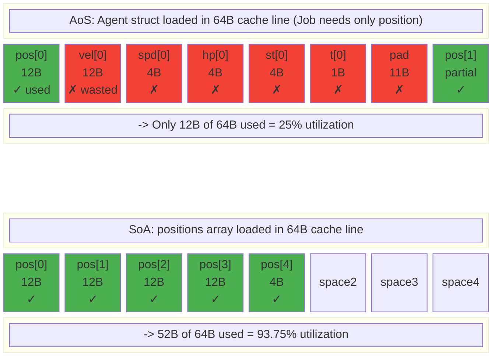
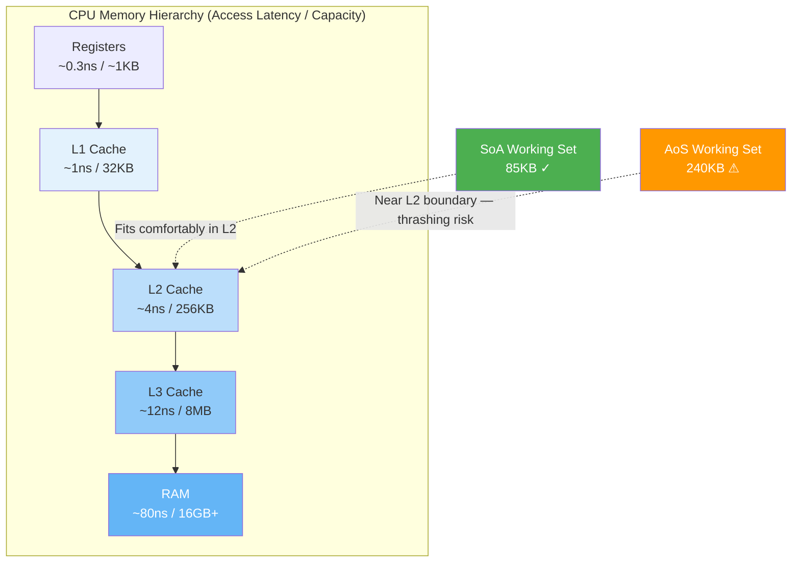
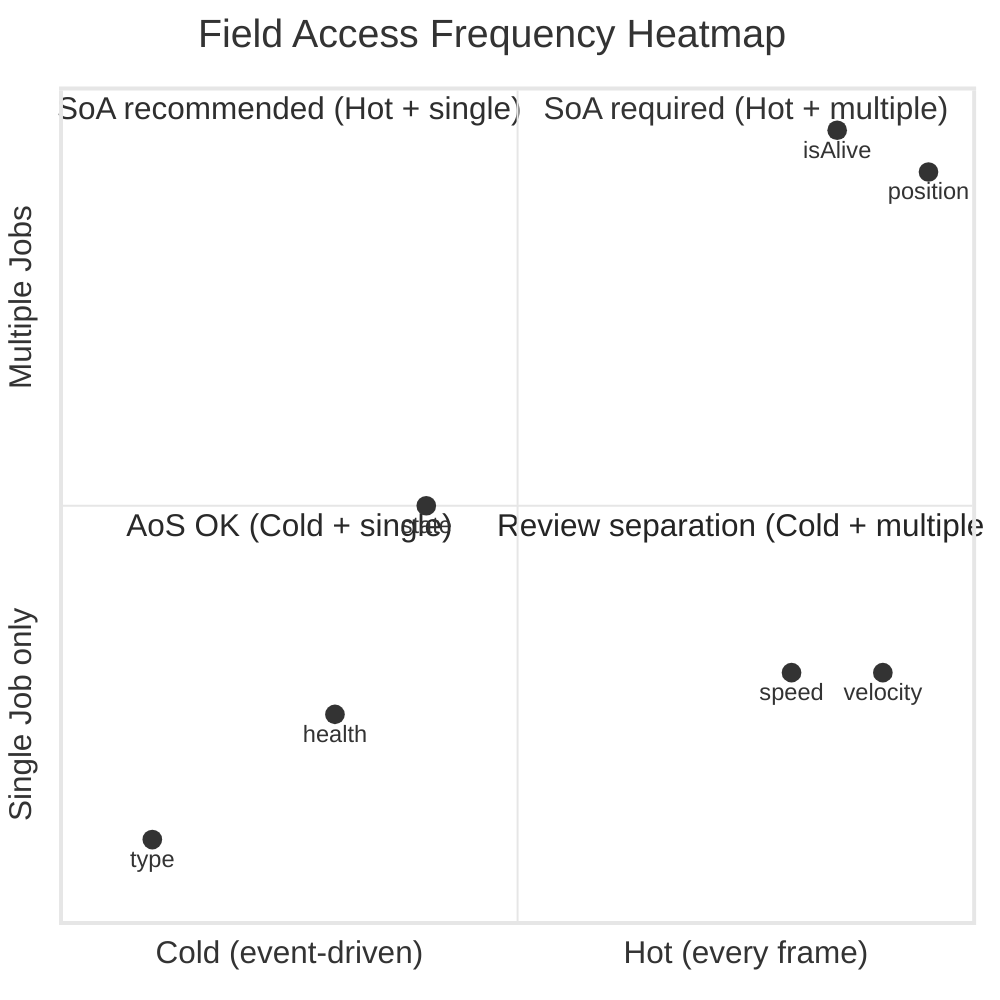
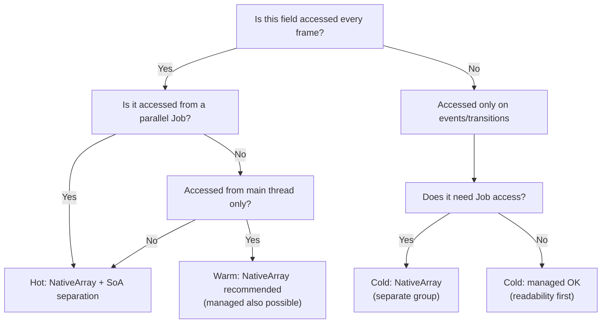
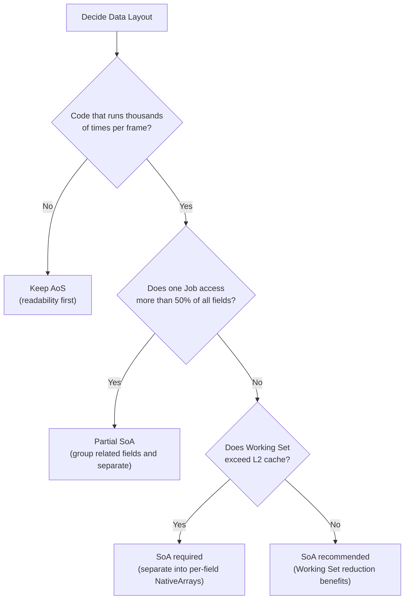

## Introduction

In the [previous post](/posts/UnityJobSystemBurst/), we covered the principles of Unity Job System and Burst Compiler. In Part 4, we explored the cache hierarchy, the basics of AoS vs SoA, and the relationship between memory alignment and SIMD — **confirming that SoA is faster.**

However, several questions remained:
- **Why** is it faster? Can we mathematically analyze the behavior at the cache line level?
- **How** do we convert existing OOP code to SoA?
- **When** should we NOT use SoA?

This post answers those questions. SoA/AoS is not just an array layout technique — it's part of a paradigm called **Data-Oriented Design (DOD)**. You need to understand the paradigm itself to make the right decisions.

> Foundational concepts like cache hierarchy, cache lines (64 bytes), False Sharing, and NativeArray internals were covered in [Job System post Part 4](/posts/UnityJobSystemBurst/#part-4-메모리-계층과-soa-레이아웃), so we won't repeat them here. I recommend reading that section first.

---

## Part 1: The Philosophy of Data-Oriented Design (DOD)

### From OOP to DOD: A Paradigm Shift

The first design paradigm most developers learn is **Object-Oriented Programming (OOP)**. The core question of OOP is:

> "What does this **object** **do**?"

If you're designing an Enemy, you naturally think like this:

```csharp
// OOP: Design centered on the Enemy's "behavior"
abstract class Enemy : MonoBehaviour
{
    protected float health;
    protected float speed;
    protected Vector3 velocity;

    public abstract void UpdateAI();
    public virtual void TakeDamage(float amount) { health -= amount; }
    public virtual void Move() { transform.position += velocity * Time.deltaTime; }
}

class Walker : Enemy
{
    public override void UpdateAI() { /* walking AI */ }
}

class Runner : Enemy
{
    public override void UpdateAI() { /* fast chase AI */ }
    public override void Move() { /* move faster */ }
}
```

This design is intuitive. "A Walker is an Enemy, and a Runner is an Enemy." It directly maps real-world taxonomies to code.

**The problem is performance.** When there are 5,000 enemies:

```
Memory Layout (OOP):
  Walker#0 -> heap address 0x10000 [vtable|health|speed|vel|transform_ptr|...]
  Runner#0 -> heap address 0x50000 [vtable|health|speed|vel|transform_ptr|...]
  Walker#1 -> heap address 0x30000 [vtable|health|speed|vel|transform_ptr|...]
  Runner#1 -> heap address 0x80000 [vtable|health|speed|vel|transform_ptr|...]
  ...
  -> 5,000 objects scattered across the heap
  -> 5,000 virtual function calls per frame (vtable indirection)
  -> Potential cache miss on every access
```

**Data-Oriented Design (DOD)** starts from a completely different question:

> "What data does this system **transform** and **how** does it do so every frame?"

```csharp
// DOD: Design centered on "data transformation"
// Data: contiguous arrays
NativeArray<float3> positions;   // 5,000 positions — contiguous memory
NativeArray<float3> velocities;  // 5,000 velocities — contiguous memory
NativeArray<float>  speeds;      // 5,000 movement speeds — contiguous memory

// Transformation: Job struct
[BurstCompile]
struct MoveJob : IJobParallelFor
{
    [ReadOnly] public NativeArray<float3> Velocities;
    [ReadOnly] public NativeArray<float> Speeds;
    public NativeArray<float3> Positions;
    public float DeltaTime;

    public void Execute(int i)
    {
        Positions[i] += Velocities[i] * Speeds[i] * DeltaTime;
    }
}
```

In OOP, you think "Enemy calls Move()", but in DOD, you think "MoveJob transforms the positions array using the velocities array."

| Aspect | OOP | DOD |
|--------|-----|-----|
| Design Unit | Objects (Enemy, Walker) | Data arrays + transformation functions (Jobs) |
| Memory | Per-object heap allocation, scattered | Per-field contiguous arrays |
| Polymorphism | Virtual functions (vtable) | Data-value branching (byte type) |
| Cache | Pointer chasing -> frequent misses | Sequential access -> optimal for prefetcher |
| Parallelism | Difficult (shared state) | Natural (array partitioning) |

### Mike Acton's 3 Principles

In 2014 at CppCon, Mike Acton from Insomniac Games delivered **"Data-Oriented Design and C++"** — a seminal talk that established DOD. The "3 lies" he identified are:

#### Lie 1: "Software is the platform"

> Software is not the platform. **Hardware is the platform.**

Programmers often think "I develop on C#" or "I develop on Unity." But the code actually runs on **CPU + cache + RAM**.

```
Developer's mental model:    Reality:
  C# code                     CPU pipeline
    |                            |
  Unity API                  Registers -> L1 -> L2 -> L3 -> RAM
    |                            |
  "It'll run fine"           Cache miss 80ns x 5,000 = 0.4ms
```

When you call `Update()` on 5,000 MonoBehaviours with Unity's `foreach`, it looks clean at the C# level, but **at the hardware level, it's 5,000 pointer chases**.

#### Lie 2: "Code is more important than data"

> The purpose of code is **to transform data**. The shape of the data determines the code.

In OOP, you design the class hierarchy first and then fit data into it. DOD is the opposite:

1. What is the **input data**? (positions, velocities)
2. What is the **output data**? (new positions)
3. What **pattern** is the transformation? (1:1 mapping, parallelizable)
4. Then the code becomes `IJobParallelFor`.

Once data access patterns are determined, the code structure follows automatically.

#### Lie 3: "Code that models the world is good code"

> "A Walker is a type of Enemy" is a **real-world taxonomy**, not the **optimal structure for data transformation**.

The difference between Walker and Runner movement logic is just a different `speed` value. The entire virtual function and inheritance hierarchy exists to express a single `float` value difference.

```csharp
// OOP: Express "kind" through inheritance
class Walker : Enemy { speed = 2f; }
class Runner : Enemy { speed = 5f; }

// DOD: Express "kind" through data values
NativeArray<float> speeds;  // speeds[i] = 2f or 5f
// -> 0 virtual function calls, 0 cache misses
```

### Why Game Development Is a Perfect Fit for DOD

Not all software benefits equally from DOD. Game development is particularly suitable for three reasons:

1. **Thousands of homogeneous entities**: Bullets, enemies, particles — thousands to tens of thousands of identically structured data. Perfect conditions for array representation.

2. **Strict frame budgets**: 60fps = 16.6ms per frame. Every entity must be processed each frame, so loop efficiency directly determines the frame budget.

3. **Predictable transformation patterns**: "Update all enemy positions based on velocity", "Check collisions for all bullets" — batch processing with clear inputs/outputs.

### The History of DOD: A Paradigm Forced by Hardware

DOD didn't originate in academia — it evolved in practice **to survive the constraints of game hardware**.

#### PS3 Cell Broadband Engine (2006)

The event that brought DOD into the spotlight in the game industry was the **PlayStation 3's Cell processor**.

```
Cell Architecture:
  PPE (PowerPC) — 1 general-purpose core
  SPE (Synergistic Processing Element) x 6 (for games)
    +-- Each SPE's Local Store: 256 KB
    +-- No direct access to main RAM!
    +-- Must explicitly transfer data to Local Store via DMA
```

To fit game data into the 256KB Local Store, you had to **precisely manage your Working Set size**. DMAing an entire OOP object would fill 256KB instantly. Extracting only the needed fields and DMAing them as contiguous arrays (SoA) was the only solution.

> Naughty Dog's **Jason Gregory** systematized this experience while developing The Last of Us on PS3. His book **"Game Engine Architecture"** (Chapter 16) covers data-oriented runtime system design in detail.

#### Insomniac Games and Mike Acton (2004~2014)

Mike Acton, engine director at Insomniac Games (Ratchet & Clank, Resistance series), applied DOD in practice since the PS2/PS3 era.

- 2004: Presented DOD case studies at GDC on "Pitfalls of Object Oriented Programming"
- 2014: Presented **"Data-Oriented Design and C++"** at CppCon — introducing DOD to the entire C++ community
- 2017: Joined Unity Technologies to lead **DOTS (Data-Oriented Technology Stack)** development

#### Unity DOTS (2018~)

After Mike Acton joined Unity, Unity became the first game engine to offer **DOD as an official framework**:

- **Entity Component System (ECS)**: Automatic SoA layout via Archetype-based storage
- **Job System**: Multi-core batch processing
- **Burst Compiler**: Native code generation via LLVM

This is the background for the `NativeArray` + `IJobParallelFor` + `[BurstCompile]` combination we cover in this series.

```
DOD Timeline:
  2004  Mike Acton presents DOD case studies at GDC
  2006  PS3 Cell — 256KB Local Store forces DOD
  2007  Ulrich Drepper — "What Every Programmer Should Know About Memory"
  2009  Noel Llopis — "Data-Oriented Design" article
  2014  Mike Acton — CppCon "Data-Oriented Design and C++"
  2017  Mike Acton -> joins Unity
  2018  Unity DOTS preview
  2023  Unity ECS 1.0 official release
```

> DOD is not a "latest trend" — it's a **practical philosophy that evolved alongside game hardware for 20 years**. The PS3's 256KB constraint is gone, but the importance of cache efficiency only grows as CPU core counts increase and the memory latency gap widens.

---

## Part 2: Deep Analysis of Memory Layout

We covered cache hierarchy and cache line basics in the previous post. Here we go one level deeper to discuss **quantitative** methods for analyzing memory layout efficiency.

### Stride: The Key Metric for Cache Efficiency

**Stride** is the **byte distance between two consecutive accesses** during iteration.

When iterating over an array, the CPU advances by `stride` bytes on each access. How large this value is relative to the cache line (64 bytes) determines cache efficiency.

#### AoS Stride

```csharp
struct Agent  // 48 bytes
{
    public float3 position;   // 12B (offset 0)
    public float3 velocity;   // 12B (offset 12)
    public float  speed;      // 4B  (offset 24)
    public float  health;     // 4B  (offset 28)
    public int    state;      // 4B  (offset 32)
    public byte   type;       // 1B  (offset 36)
    // padding: 11B -> total 48B (or 40B depending on compiler)
}
NativeArray<Agent> agents; // 5,000 elements
```

Consider a Job that only iterates over `position`:

```
Memory Layout (AoS):
Stride = sizeof(Agent) = 48 bytes

agents[0]: [pos(12B)|vel(12B)|spd(4B)|hp(4B)|st(4B)|type(1B)|pad(11B)]
                                                                        | 48B skip
agents[1]: [pos(12B)|vel(12B)|spd(4B)|hp(4B)|st(4B)|type(1B)|pad(11B)]
                                                                        | 48B skip
agents[2]: [pos(12B)|vel(12B)|spd(4B)|hp(4B)|st(4B)|type(1B)|pad(11B)]

Cache line (64B) fits 1.33 Agents -> only 1~2 positions loaded
-> The remaining 36B (vel, spd, hp, st, type, pad) are loaded into cache
   but never used by this Job
```

#### SoA Stride

```csharp
NativeArray<float3> positions;   // Stride = 12 bytes
NativeArray<float3> velocities;
NativeArray<float>  speeds;
NativeArray<float>  healths;
```

```
Memory Layout (SoA):
Stride = sizeof(float3) = 12 bytes

positions: [pos0(12B)|pos1(12B)|pos2(12B)|pos3(12B)|pos4(12B)|pos5(12B)|...]
           <----------- Cache line (64B): 5 positions loaded ----------->

-> Every byte in the cache line is actually used data
-> Zero unnecessary data loaded
```

### Cache Utilization Formula

Let's define **Cache Utilization** as the ratio of actually used data to total data loaded per cache line:

$$\text{Cache Utilization} = \frac{\text{Useful Bytes per Cache Line}}{\text{Cache Line Size}} = \frac{\left\lfloor \frac{64}{\text{Stride}} \right\rfloor \times \text{Element Size}}{64}$$

| Layout | Stride | Element Size | Per Cache Line | Utilization |
|--------|--------|-------------|----------------|-------------|
| AoS (accessing only position from Agent) | 48B | 12B | 1 | **25%** |
| SoA (positions array) | 12B | 12B | 5 | **93.75%** |
| SoA (speeds array, float) | 4B | 4B | 16 | **100%** |
| SoA (isAlive array, byte) | 1B | 1B | 64 | **100%** |

When accessing only position in AoS, **75% of cache bandwidth is wasted**. SoA utilizes nearly 100%.

The following diagram compares how AoS and SoA data are loaded into the same 64-byte cache line:



This is the fundamental reason why "the same computation, the same Burst compilation, but a different layout results in several times the performance difference."

### Working Set Size Calculation

**Working Set** is the **total memory size** a single Job accesses during its entire execution.

$$\text{Working Set} = \sum_{\text{array}} (\text{element count} \times \text{element size})$$

Which cache tier the Working Set fits into determines performance:

```csharp
// Example: Distance calculation Job for 5,000 agents
[BurstCompile]
struct DistanceJob : IJobParallelFor
{
    [ReadOnly] public NativeArray<float3> Positions;  // 5,000 x 12B = 60 KB
    [ReadOnly] public NativeArray<byte>   IsAlive;    // 5,000 x 1B  =  5 KB
    [WriteOnly] public NativeArray<float> Distances;  // 5,000 x 4B  = 20 KB
    [ReadOnly] public float3 TargetPos;               // 12B

    public void Execute(int i)
    {
        if (IsAlive[i] == 0) { Distances[i] = float.MaxValue; return; }
        Distances[i] = math.distance(Positions[i], TargetPos);
    }
}
// Working Set = 60 + 5 + 20 = 85 KB
```

| Working Set Size | Cache Tier | Expected Performance |
|------------------|------------|---------------------|
| < 32 KB | L1 cache | Best (~1ns/access) |
| 32 KB ~ 256 KB | L2 cache | Good (~4ns/access) |
| 256 KB ~ 8 MB | L3 cache | Moderate (~12ns/access) |
| > 8 MB | RAM | Slow (~80ns/access) |

The following diagram shows cache tier capacities and where AoS/SoA Working Sets fall:



The DistanceJob's Working Set above is 85KB — **it fits entirely in L2 cache**. If the same data were processed in AoS:

```
AoS Working Set = 5,000 x 48B (Agent struct) = 240 KB
-> Near L2 boundary (256KB) — risk of cache thrashing
-> Only position + isAlive are accessed, yet velocity/speed/health/state/type are loaded too
```

**SoA reduces the Working Set itself, allowing it to fit into a smaller cache tier.** This is an effect beyond simple "cache line efficiency."

#### Practical Tips for Working Set Calculation

1. **Sum both read and write arrays.** Whether `[ReadOnly]` or `[WriteOnly]`, it all goes into memory.
2. **Scalar parameters** (float, int, etc.) fit in registers and can be ignored.
3. **IJobParallelFor** processes the entire array in batches, so the active Working Set at any moment is approximately `batchCount x elementSize x arrayCount`. However, since the prefetcher pre-loads data, it's safer to calculate conservatively using the full array size.

### Hardware Prefetcher: The Real Reason SoA Is Fast

Cache utilization explains "how much data is wasted." But the **other half** of why SoA is fast lies in the **Hardware Prefetcher**.

#### How the Prefetcher Works

Modern CPUs have several types of built-in prefetchers. The key one is the **Stride Prefetcher**:

```
Stride Prefetcher operation:
  1. CPU accesses address A
  2. Next access at address A+S (S = stride)
  3. Next access at address A+2S
  4. Prefetcher: "Pattern detected! stride = S"
  5. -> Pre-loads A+3S, A+4S, A+5S into L1/L2
  6. When CPU reaches A+3S, it's already in cache -> 0 misses!
```

On Intel CPUs, the stride is detected after just **2~3 accesses**, and for subsequent accesses, **cache miss latency is completely hidden**.

The following diagram shows the prefetcher timeline during SoA sequential access:

```mermaid
gantt
    title SoA Sequential Access: Stride Prefetcher Timeline
    dateFormat X
    axisFormat %s

    section CPU Access
    pos[0] access (cache miss)       :crit, a0, 0, 80
    pos[1] access (cache hit)        :done, a1, 80, 81
    pos[2] access (cache miss)       :crit, a2, 81, 161
    pos[3] access — stride detected! :done, a3, 161, 162
    pos[4] access (prefetch hit)     :done, a4, 162, 163
    pos[5~4999] all hits             :done, a5, 163, 200

    section Prefetcher
    Learning pattern                  :active, p0, 0, 161
    stride=12B detection complete     :milestone, p1, 161, 161
    Pre-load pos[4]                   :p2, 130, 161
    Continuous prefetch pos[5,6,7...] :p3, 161, 200
```



> Intel Optimization Manual Section 2.5.5.4: The L2 Stride Prefetcher detects strides up to 2KB. The L1 Data Prefetcher detects sequential access within cache lines.

#### Prefetcher Effectiveness: SoA vs AoS

```
SoA (stride = 12B, float3):
  Access: pos[0] -> pos[1] -> pos[2] -> ...
  Address: 0x1000 -> 0x100C -> 0x1018 -> ...
  stride = 12B (constant) ✓
  
  -> Prefetcher detects pattern on 2nd access
  -> From 3rd access onward, cache misses are nearly 0
  -> Out of 5,000 iterations, actual cache misses: only the first 2~3

AoS (stride = 48B, accessing only position from Agent):
  Access: agents[0].pos -> agents[1].pos -> agents[2].pos -> ...
  Address: 0x2000 -> 0x2030 -> 0x2060 -> ...
  stride = 48B (constant) ✓ — prefetcher CAN detect this!
  
  However:
  -> 48B stride nearly crosses a cache line (64B) every time
  -> Only 12B of each prefetched cache line is used (36B wasted)
  -> Prefetching fills the cache with "useless data," evicting other useful data
```

**Key insight**: The prefetcher can detect the stride in AoS too. But the **utilization of prefetched data** differs dramatically between SoA and AoS. Even if the prefetcher works hard, fetching data that's only 25% useful causes cache pollution.

> In Srinath et al.'s "Feedback Directed Prefetching" (HPCA 2007), prefetcher **accuracy** and **coverage** are distinguished. AoS's problem is not coverage but accuracy (the ratio of fetched data actually used) being low.

#### When the Prefetcher Fails

The prefetcher is powerless against **irregular access patterns**:

```csharp
// Prefetcher failure: indirect indexing
NativeArray<int> sortedIndices;  // [42, 7, 3891, 102, ...]
for (int i = 0; i < count; i++)
{
    int idx = sortedIndices[i];
    float3 pos = positions[idx];  // <- random access! irregular stride
    // -> Prefetcher defeated -> potential cache miss on every access
}
```

In such cases, you can use **software prefetch** hints or sort indices to improve access locality.

### Memory Bandwidth: The Bottleneck Beyond Cache

We've discussed cache efficiency and prefetchers, but there's one more perspective: **memory bandwidth**.

In modern CPUs, many batch processing loops are **memory-bound** rather than **compute-bound**. That is, the computation itself is fast, but fetching data is the bottleneck.

#### The Roofline Model View of SoA's Advantage

The **Roofline Model** (Williams et al., 2009) is a framework for visually determining whether a program is compute-bound or memory-bound.

$$\text{Operational Intensity} = \frac{\text{FLOP}}{\text{Bytes Transferred}}$$

| Item | AoS | SoA |
|------|-----|-----|
| Computation (distance calc) | 7 FLOP/entity | 7 FLOP/entity (same) |
| Bytes transferred | 48B/entity (entire Agent) | 16B/entity (pos 12B + dist 4B) |
| Operational Intensity | 7/48 = **0.146** | 7/16 = **0.438** |
| Status | Extremely memory-bound | Less memory-bound |

```
DDR4-3200 bandwidth: ~51.2 GB/s (theoretical), actual ~25 GB/s

AoS: 5,000 x 48B = 240KB transferred -> 240KB / 25GB/s = 0.0096ms
SoA: 5,000 x 16B = 80KB transferred  -> 80KB / 25GB/s  = 0.0032ms

-> SoA consumes 1/3 the memory bandwidth
-> Can process 3x more entities with the same bandwidth
```

From a bandwidth perspective, **the "unused fields" in AoS are not just cache waste but a real cost consuming memory bus bandwidth**. When the Working Set exceeds cache, this cost directly determines performance.

> Loops processing tens of thousands of entities in games are mostly memory-bound. If you draw a Roofline model, the SoA transition can be understood as **"raising operational intensity on the same hardware to escape the memory-bound region."**

### Power-of-2 Stride Trap

Caution is needed when the stride is an exact multiple of the cache line size.

Modern CPU L1 caches use a **set-associative** structure. The cache is divided into "sets," and each memory address maps to a specific set.

```
Stride = 64B (1x cache line size):
  agents[0] -> Set 0
  agents[1] -> Set 0  <- same set!
  agents[2] -> Set 0  <- same set again!
  ...
  -> Accesses concentrate on one set -> other sets are empty but this one overflows
  -> "Cache thrashing" occurs
```

This can happen when the stride is exactly 64, 128, 256, 512, or other powers of two.

**Mitigation:**
- Add or remove padding so the struct size isn't an exact multiple of 64B
- This is rarely a problem in practice, but worth investigating when performance falls below theoretical expectations

### TLB Misses: The Hidden Cost of SoA

Looking at cache efficiency alone, SoA is overwhelmingly advantageous, but from a **TLB (Translation Lookaside Buffer)** perspective, SoA can be disadvantageous.

#### What Is the TLB?

In a virtual memory system, the CPU performs **virtual address -> physical address** translation on every memory access. The TLB caches these translations.

```
Virtual address access -> TLB lookup
  -> Hit: Physical address obtained immediately (~1 cycle)
  -> Miss: Page table walk (~100 cycles, worst case ~1000 cycles)
```

The L1 DTLB typically has **64~128 entries**, each covering a 4KB page. So the TLB coverage range is about `128 x 4KB = 512KB`.

#### Why SoA Is Disadvantageous for TLB

```
AoS — 1 array:
  NativeArray<Agent> agents -> contiguous memory pages
  -> 1 TLB entry covers 4KB (~85 agents)
  -> Sequential access means sequential pages -> minimal TLB misses

SoA — 8 arrays:
  positions[]     -> page group A
  velocities[]    -> page group B
  speeds[]        -> page group C
  healths[]       -> page group D
  isAlive[]       -> page group E
  states[]        -> page group F
  cooldowns[]     -> page group G
  types[]         -> page group H
  -> If a Job accesses 4 arrays -> 4 page groups accessed simultaneously
  -> TLB entry consumption 4x
```

**5,000 agents, MoveJob (4 arrays):**

```
Memory size of each array:
  positions:  5,000 x 12B = 60KB -> 15 pages
  velocities: 5,000 x 12B = 60KB -> 15 pages
  speeds:     5,000 x 4B  = 20KB -> 5 pages
  isAlive:    5,000 x 1B  = 5KB  -> 2 pages
  
  Total TLB entries needed: 37 (about 29% of L1 DTLB)
  -> No problem at 5,000 entities

But if there are 20 arrays and 50,000 entities:
  -> Hundreds of TLB entries needed -> TLB thrashing risk
```

#### Mitigation

1. **Partial SoA**: Bundle fields that are always accessed together into a struct to reduce array count — this is the **hardware-level rationale** for Partial SoA
2. **Huge Pages (2MB)**: Using 2MB pages at the OS level increases TLB coverage by 512x
3. **Array count management**: Keep the number of arrays a single Job accesses to 5~6 or fewer

> Ulrich Drepper's "What Every Programmer Should Know About Memory" Section 4 provides detailed analysis of TLB miss impact. Figure 4.5 in particular shows a graph where performance drops sharply when data size exceeds TLB coverage — this is what can happen when arrays are excessively separated in SoA.

### C# Struct Memory Layout

To accurately calculate AoS stride, you need to know how C# lays out structs in memory.

#### StructLayout and Padding

C# structs use **Sequential layout** by default. Each field is **aligned to its own size**:

```
Alignment rules:
  byte    -> 1-byte aligned (can be placed at any address)
  short   -> 2-byte aligned (even addresses)
  int     -> 4-byte aligned (addresses that are multiples of 4)
  float   -> 4-byte aligned
  float3  -> 4-byte aligned (float x 3, follows float alignment)
  double  -> 8-byte aligned
  float4  -> 16-byte aligned (forced by Burst for SIMD optimization)
```

#### Example 1: Ideal Struct with No Padding

```csharp
struct GoodLayout  // 28 bytes (no padding)
{
    public float3 position;  // offset 0,  12B
    public float  speed;     // offset 12, 4B
    public float  health;    // offset 16, 4B
    public int    state;     // offset 20, 4B
    public int    type;      // offset 24, 4B
}
```

```
Byte map (4B units):
[pos.x ][pos.y ][pos.z ][speed ]
[health][state ][type  ]
Total 28B, 0B padding
```

No padding occurs because all fields are 4-byte aligned.

#### Example 2: Padding Caused by Field Order

```csharp
struct BadLayout  // 32 bytes! (4B padding)
{
    public float3 position;  // offset 0,  12B
    public byte   isAlive;   // offset 12, 1B
    // <- 3B padding (next float must be at a multiple-of-4 address)
    public float  speed;     // offset 16, 4B
    public float  health;    // offset 20, 4B
    public int    state;     // offset 24, 4B
    public byte   type;      // offset 28, 1B
    // <- 3B padding (total struct size must be a multiple of max alignment)
}
```

```
Byte map:
[pos.x ][pos.y ][pos.z ][a|pad ]  <- 3B padding after byte
[speed ][health][state ][t|pad ]  <- 3B padding after byte
Total 32B, 6B padding (18.75% waste)
```

#### Example 3: Eliminating Padding by Reordering Fields

```csharp
struct OptimizedLayout  // 28 bytes (0B padding)
{
    public float3 position;  // offset 0,  12B
    public float  speed;     // offset 12, 4B
    public float  health;    // offset 16, 4B
    public int    state;     // offset 20, 4B
    public byte   isAlive;   // offset 24, 1B
    public byte   type;      // offset 25, 1B
    // <- 2B padding (align struct size to multiple of 4)
}
```

```
Byte map:
[pos.x ][pos.y ][pos.z ][speed ]
[health][state ][a|t|pp]
Total 28B, 2B padding (7% waste) — 4B saved vs BadLayout
```

**Rule: Place larger fields first and smaller fields last to minimize padding.**

#### sizeof Comparison

```csharp
// Verify in the Unity Editor
Debug.Log(UnsafeUtility.SizeOf<GoodLayout>());       // 28
Debug.Log(UnsafeUtility.SizeOf<BadLayout>());         // 32
Debug.Log(UnsafeUtility.SizeOf<OptimizedLayout>());   // 28
```

`UnsafeUtility.SizeOf<T>()` returns the actual memory size. `Marshal.SizeOf()` returns the interop marshaling size, which may differ. Always use `UnsafeUtility.SizeOf<T>()` in Job/Burst contexts.

#### Burst Layout Guarantees

The Burst compiler **always processes structs with Sequential layout**. Unlike the CLR's `StructLayout.Auto` (which allows field reordering), Burst preserves field order as-is. Therefore:

- In Burst Jobs, **field order IS memory order**
- To reduce padding, you must **manually order fields at the code level**
- Burst additionally leverages 16-byte alignment to generate SIMD aligned load/store instructions

#### Padding Increases AoS Stride

```
No-padding struct (28B) x 5,000 = 140 KB -> fits in L2
Padded struct (32B) x 5,000 = 160 KB -> fits in L2 (less headroom)
Heavily padded struct (48B) x 5,000 = 240 KB -> near L2 boundary (risky)
```

A 4-byte padding difference across 5,000 elements becomes **20KB** of memory waste. This is why it's not just about the size of a single struct, but about **whether the entire array fits in cache**.

---

## Part 3: AoS to SoA Conversion Methodology

### Step-by-step Process

A systematic 5-step process for converting existing AoS code to SoA:

#### Step 1: Analyze Access Patterns

Create a table of which fields each system (Job) reads and writes.

```csharp
// Example: hypothetical AoS Agent struct
struct Agent
{
    public float3 position;   // Used by Movement, Distance, Rendering
    public float3 velocity;   // Used by Movement
    public float  speed;      // Used by Movement
    public float  health;     // Used by Combat
    public byte   isAlive;    // Used by all Jobs
    public byte   state;      // Used by AI, Combat
    public byte   type;       // Used only at Spawn time
}
```

Access pattern table:

| Job | Read Fields | Write Fields |
|-----|-------------|-------------|
| MoveJob | position, velocity, speed, isAlive | position |
| DistanceJob | position, isAlive | (separate distances array) |
| AttackJob | distances, isAlive, state | state, attackCooldown |
| RenderJob | position, isAlive | (separate matrices array) |

**Key observation**: Not every Job uses all 7 fields of Agent. MoveJob needs only 4, DistanceJob needs only 2.

Visualizing these access patterns as a heatmap makes it easy to see **which fields are Hot and which are Cold**:



#### Step 2: Identify Data Groups

Group fields with similar access patterns together:

```
Movement group: position, velocity, speed  (MoveJob accesses every frame)
State group:    isAlive, state             (read by multiple Jobs)
Combat group:   health, attackCooldown     (accessed only by CombatJob)
Identity group: type                        (accessed only at spawn, read-only afterward)
```

#### Step 3: Separate into NativeArrays

Based on the groups, separate each field into individual NativeArrays:

```csharp
// Movement
NativeArray<float3> positions;
NativeArray<float3> velocities;
NativeArray<float>  speeds;

// State
NativeArray<byte> isAlive;
NativeArray<byte> states;

// Combat
NativeArray<float> healths;
NativeArray<float> attackCooldowns;

// Identity
NativeArray<byte> types;
```

#### Step 4: Reference Only Needed Arrays in Jobs

```csharp
[BurstCompile]
struct MoveJob : IJobParallelFor
{
    [ReadOnly] public NativeArray<float3> Velocities;
    [ReadOnly] public NativeArray<float>  Speeds;
    [ReadOnly] public NativeArray<byte>   IsAlive;
    public NativeArray<float3> Positions;
    public float DeltaTime;

    public void Execute(int i)
    {
        if (IsAlive[i] == 0) return;
        Positions[i] += Velocities[i] * Speeds[i] * DeltaTime;
    }
}
// Working Set = 60KB + 20KB + 5KB + 60KB = 145 KB (fits comfortably in L2)
```

In AoS: `5,000 x 48B = 240KB` (must load the entire Agent).
SoA MoveJob Working Set is 145KB — **40% reduction**.

#### Step 5: Consolidate Lifecycle in a Management Class

Manage allocation and deallocation of the separated NativeArrays in a single class:

```csharp
public class AgentData : IDisposable
{
    public int Capacity { get; }
    public int ActiveCount { get; set; }

    // Movement
    public NativeArray<float3> Positions;
    public NativeArray<float3> Velocities;
    public NativeArray<float>  Speeds;

    // State
    public NativeArray<byte> IsAlive;
    public NativeArray<byte> States;

    // Combat
    public NativeArray<float> Healths;
    public NativeArray<float> AttackCooldowns;

    // Identity
    public NativeArray<byte> Types;

    public AgentData(int capacity)
    {
        Capacity = capacity;
        Positions        = new NativeArray<float3>(capacity, Allocator.Persistent);
        Velocities       = new NativeArray<float3>(capacity, Allocator.Persistent);
        Speeds           = new NativeArray<float>(capacity, Allocator.Persistent);
        IsAlive          = new NativeArray<byte>(capacity, Allocator.Persistent);
        States           = new NativeArray<byte>(capacity, Allocator.Persistent);
        Healths          = new NativeArray<float>(capacity, Allocator.Persistent);
        AttackCooldowns  = new NativeArray<float>(capacity, Allocator.Persistent);
        Types            = new NativeArray<byte>(capacity, Allocator.Persistent);
    }

    public void Dispose()
    {
        if (Positions.IsCreated) Positions.Dispose();
        if (Velocities.IsCreated) Velocities.Dispose();
        if (Speeds.IsCreated) Speeds.Dispose();
        if (IsAlive.IsCreated) IsAlive.Dispose();
        if (States.IsCreated) States.Dispose();
        if (Healths.IsCreated) Healths.Dispose();
        if (AttackCooldowns.IsCreated) AttackCooldowns.Dispose();
        if (Types.IsCreated) Types.Dispose();
    }
}
```

This pattern is also **DOD's Flyweight pattern**. Only one "behavior logic (Job struct)" exists, while "instance data (NativeArrays)" has N copies.

### Before/After Memory Comparison

Based on 5,000 agents, MoveJob execution:

| Item | AoS | SoA |
|------|-----|-----|
| Memory accessed | 5,000 x 48B = **240 KB** | pos(60) + vel(60) + spd(20) + alive(5) = **145 KB** |
| Cache utilization (position access) | 25% | 93.75% |
| Cache tier | L2 boundary (thrashing risk) | L2 stable |
| Unnecessary data loaded | health, state, type, padding | 0 |

### Partial SoA: Grouping Related Fields

SoA doesn't mean "separate every field into its own array." Fields that are **always accessed together** can be bundled into a struct.

```csharp
// Bad: Separating float3's x, y, z into individual arrays
NativeArray<float> positionsX;  // Pointless separation
NativeArray<float> positionsY;  // float3's x,y,z are always accessed together
NativeArray<float> positionsZ;

// Good: float3 is a single unit
NativeArray<float3> positions;  // x,y,z are always needed together, so this is correct
```

**The criterion for separation is "access pattern":**

- `position`'s `x, y, z` are always read together -> keep as `NativeArray<float3>`
- If `health` and `attackCooldown` are accessed by **the same Job only** -> bundling as `NativeArray<float2>` is OK (float2.x = health, float2.y = cooldown)
- `health` and `position` are accessed by **different Jobs** -> must be separated

This decision ultimately comes from the Step 1 access pattern analysis. Group fields with the same access pattern, separate fields with different patterns.

### Practical Pattern: Managing Entities with Frequent Create/Destroy

The trickiest part of SoA is **dynamic entity addition/removal**. In AoS, you just `new/delete` a single object, but in SoA, you must **manage the same index across all arrays**.

#### Free List Pattern

```csharp
public class SoAEntityPool : IDisposable
{
    // SoA arrays
    public NativeArray<float3> Positions;
    public NativeArray<float3> Velocities;
    public NativeArray<byte>   IsAlive;

    // Reusable index stack
    NativeQueue<int> _freeIndices;
    int _highWaterMark;  // Maximum index ever used

    public int Spawn(float3 pos, float3 vel)
    {
        int idx;
        if (!_freeIndices.TryDequeue(out idx))
        {
            idx = _highWaterMark++;
        }
        Positions[idx] = pos;
        Velocities[idx] = vel;
        IsAlive[idx] = 1;
        return idx;
    }

    public void Despawn(int idx)
    {
        IsAlive[idx] = 0;
        _freeIndices.Enqueue(idx);
    }
}
```

**Free List vs Swap and Pop comparison:**

| Item | Free List | Swap and Pop |
|------|-----------|-------------|
| Index stability | Maintained (safe for external references) | Broken (remapping needed) |
| Array density | Holes occur (fragmentation) | Always compact |
| Job iteration | `if (IsAlive[i])` branch needed | No branch, iterate up to ActiveCount |
| Working Set | Includes dead entities | Only living entities |
| Best for | When external ID references are needed | Extreme performance optimization |

Starting with Free List early in the project and switching to Swap and Pop when profiling reveals branch cost issues is the pragmatic approach.

---

## Part 4: Hot/Cold Data Separation Pattern

### Hot Data vs Cold Data

Not all data is accessed every frame. Data can be classified by access frequency:

```
+----------------------------------------------------+
|  Hot Data (every frame, parallel Jobs)              |
|  positions, velocities, isAlive                     |
|  -> NativeArray + IJobParallelFor required          |
|  -> Cache efficiency directly determines performance|
+----------------------------------------------------+
|  Warm Data (every frame but conditional)            |
|  speeds, distances, separationForces                |
|  -> NativeArray recommended                         |
|  -> Skipped when isAlive == 0, so actual access     |
|     < array size                                    |
+----------------------------------------------------+
|  Cold Data (event/transition only)                  |
|  health, type, state, attackCooldown                |
|  -> NativeArray possible, but managed also OK       |
|  -> Code readability matters more than cache        |
|     efficiency                                      |
+----------------------------------------------------+
```

### Access-Frequency-Based Separation Strategy

Core principle: **Minimize the Hot data Working Set.**

Mixing Cold data into Hot data unnecessarily inflates the Working Set:

```csharp
// Anti-pattern: Hot and Cold in the same struct
struct Agent  // 48B
{
    // Hot (accessed every frame)
    public float3 position;   // 12B
    public float3 velocity;   // 12B

    // Cold (accessed occasionally)
    public float  health;     // 4B
    public float  cooldown;   // 4B
    public int    kills;      // 4B
    public byte   faction;    // 1B
    // ... padding
}

// MoveJob needs only position + velocity,
// but health, cooldown, kills, faction are also loaded into cache
// Working Set: 5,000 x 48B = 240KB (includes Cold data)
```

```csharp
// Correct separation: Hot arrays only
NativeArray<float3> positions;   // Hot
NativeArray<float3> velocities;  // Hot

// MoveJob Working Set: 5,000 x 24B = 120KB (Hot only!)
// -> Fits comfortably in L2
```

**Cold data options:**

Cold data doesn't have to be NativeArray. If access frequency is low and volume is small, managed arrays or Dictionaries are acceptable:

```csharp
// Cold: event-based access
NativeArray<float> healths;          // NativeArray if Job access is needed
float[] attackCooldowns;             // managed is OK if no Job access needed
Dictionary<int, string> agentNames;  // managed is natural for debug/UI only
```

However, Cold data that must be accessed from Jobs still needs to be NativeArray (managed -> Job is not allowed).

### Separation Decision Checklist

Apply these questions to each data field:



The key is **"don't let Cold data mix into the Hot data's Working Set."** This is where SoA and Hot/Cold separation intersect.

### Branch Prediction and SoA: A Hidden Benefit

There's one more lesser-known benefit related to Hot/Cold separation: the interaction with the **Branch Predictor**.

```csharp
// Many Jobs have this pattern:
public void Execute(int i)
{
    if (IsAlive[i] == 0) return;  // <- branch
    Positions[i] += Velocities[i] * Speeds[i] * DeltaTime;
}
```

Modern CPU branch predictors predict the next branch based on recent branch history (Branch History Buffer).

```
SoA — IsAlive array is contiguous:
  [1,1,1,1,1,0,0,0,1,1,1,0,...]  <- 64 values in the same cache line!
  -> Branch predictor learns the pattern quickly
  -> High prediction accuracy -> minimal pipeline stalls

AoS — isAlive is 48B apart:
  Agent[0].isAlive ... (48B gap) ... Agent[1].isAlive ...
  -> Fewer samples accumulate in the branch history buffer
  -> Pattern learning is slower
```

This effect applies not just to boolean fields like `isAlive`, but equally to `state`-based branching.

**A More Fundamental Solution: Eliminate the Branch**

Better than improving branch prediction accuracy is **eliminating the branch entirely**. There are two approaches:

**Method 1: Replace Branch with Multiplication (Branchless)**

```csharp
public void Execute(int i)
{
    // Instead of: if (IsAlive[i] == 0) return;
    float alive = IsAlive[i];  // 0.0f or 1.0f
    Positions[i] += Velocities[i] * Speeds[i] * DeltaTime * alive;
    // -> Dead entities multiply by 0, resulting in no change
    // -> 0 branches, also favorable for SIMD vectorization
}
```

**Method 2: Swap and Pop — Array Compaction**

```csharp
// When an entity dies, swap it with the last living entity
void Kill(int index)
{
    ActiveCount--;
    positions[index]  = positions[ActiveCount];
    velocities[index] = velocities[ActiveCount];
    speeds[index]     = speeds[ActiveCount];
    // ... swap for all SoA arrays
}

// Job iterates only up to ActiveCount — no isAlive check needed!
new MoveJob { ... }.Schedule(ActiveCount, 64);
```

Swap and Pop achieves **branch elimination + Working Set reduction** simultaneously. If only 3,000 of 5,000 are alive, the Working Set shrinks by 40%. However, if index stability is needed (external access by `agentId`), a separate **index remap table** is required.

---

## Part 5: Trade-offs and Decision Criteria

### When AoS Is Better

SoA is not always the answer. AoS is more suitable in these situations:

#### 1. Accessing All Data of a Single Entity

```csharp
// Displaying info for a UI-selected unit
void ShowUnitInfo(int unitId)
{
    // SoA: access unitId index from 8 arrays -> 8 random accesses
    string info = $"HP: {healths[unitId]}, Speed: {speeds[unitId]}, " +
                  $"State: {states[unitId]}, Type: {types[unitId]}...";

    // AoS: 1 access brings all data -> 1~2 cache lines
    var unit = units[unitId];
    string info = $"HP: {unit.health}, Speed: {unit.speed}, " +
                  $"State: {unit.state}, Type: {unit.type}...";
}
```

SoA is optimized for **batch iteration**. When reading all fields of a single entity at once, AoS has better cache efficiency.

#### 2. Cold Path (Event-Based, Small Volume)

```csharp
// Runs once at turn transition, processes only 20 units
void OnTurnEnd()
{
    foreach (var unit in selectedSquad)  // max 20
    {
        unit.health += unit.healRate;
        unit.morale += CalculateMorale(unit);
        unit.fatigue -= unit.restRate;
    }
}
```

This code runs only 20 times. The impact of cache efficiency on performance is **too small to measure**. Applying SoA here only increases code complexity.

#### 3. Entity Count < 100

When there are fewer than 100 entities, the entire AoS Working Set is:
```
100 x 48B = 4.8 KB -> fits entirely in L1 cache (32KB)
```

When it fits in L1, the performance difference between AoS and SoA is negligible. **Cache optimization matters when the Working Set exceeds cache capacity.**

#### 4. Prototype Stage

If release is far off and you're experimenting with gameplay, **readability and ease of modification** are more important than performance. Prototype quickly with AoS, and switch to SoA after profiling confirms a bottleneck — it's not too late.

### Hybrid: The AoSoA Pattern

There's an **AoSoA (Array of Structure of Arrays)** pattern that combines the advantages of SoA and AoS.

```csharp
// AoSoA: Bundle 8 entities into one SoA block
struct AgentBlock8
{
    // 8 agents' position.x laid out contiguously
    public fixed float posX[8];   // 32B — process all at once with SIMD (AVX2)
    public fixed float posY[8];   // 32B
    public fixed float posZ[8];   // 32B
    public fixed float velX[8];   // 32B
    public fixed float velY[8];   // 32B
    public fixed float velZ[8];   // 32B
}
NativeArray<AgentBlock8> blocks;  // 5,000 / 8 = 625 blocks

// Advantage: Perfect match for SIMD 8-wide operations
// Disadvantage: Code complexity increases dramatically
```

AoSoA is an **extreme optimization precisely matched to SIMD width**. It's mainly used in GPU compute shaders or ISPC (Intel SPMD) environments.

**In Unity Jobs + Burst, plain SoA is sufficient in most cases.** Burst's auto-vectorization handles SoA arrays well with SIMD, so there's rarely a need to accept AoSoA's complexity. Consider it only after confirming via Burst Inspector that vectorization isn't happening.

### SoA and False Sharing: batchCount Tuning

SoA maximizes cache efficiency, but it **can worsen False Sharing in parallel processing** because SoA's stride is small.

```
With IJobParallelFor and batchCount=1:
  Thread 0 -> positions[0]    -+
  Thread 1 -> positions[1]     +-- same cache line (12B stride, 5 per 64B line)
  Thread 2 -> positions[2]     |
  Thread 3 -> positions[3]     |
  Thread 4 -> positions[4]    -+
  -> 5 threads trying to write to the same cache line simultaneously
  -> Cache line ping-pongs between cores -> False Sharing!
```

**Solution: Set batchCount based on cache line size**

```csharp
// stride = 12B (float3), cache line = 64B
// 64 / 12 ≈ 5.3 -> minimum 6 elements per batch to own 1 cache line
// In practice, use a generous 64~128

new MoveJob { ... }.Schedule(entityCount, 64);  // <- batchCount = 64
// Thread 0: positions[0..63]   -> owns ~12 cache lines
// Thread 1: positions[64..127] -> separate cache lines
// -> False Sharing eliminated
```

**batchCount rules of thumb:**

| stride | Minimum batchCount | Recommended batchCount |
|--------|-------------------|----------------------|
| 4B (float) | 16 | 64~128 |
| 12B (float3) | 6 | 64~128 |
| 16B (float4) | 4 | 64 |

> In AoS, the stride is large (48B), so there are only 1~2 entities per cache line, making False Sharing unlikely. SoA's small stride makes **batchCount tuning essential**. This is one of SoA's trade-offs.

### Connection to GPU: "GPUs Are Inherently SoA"

Once you understand SoA on the CPU, **GPU optimization extends from the same principles**.

In the GPU's **SIMT (Single Instruction, Multiple Threads)** architecture, when 32 threads (a warp) access memory simultaneously, **accesses to contiguous addresses merge into a single memory transaction (Coalesced Access)**. Scattered addresses result in 32 individual transactions.

```
In a GPU Compute Shader:

// AoS: StructuredBuffer<Agent> — Stride 48B
// Thread 0 -> agents[0].position (address 0)
// Thread 1 -> agents[1].position (address 48)
// Thread 2 -> agents[2].position (address 96)
// -> 32 threads access at 48B intervals -> many memory transactions

// SoA: StructuredBuffer<float3> positions — Stride 12B
// Thread 0 -> positions[0] (address 0)
// Thread 1 -> positions[1] (address 12)
// Thread 2 -> positions[2] (address 24)
// -> 32 threads access contiguously -> merged into few transactions (Coalesced!)
```

| Concept | CPU | GPU |
|---------|-----|-----|
| Memory efficiency unit | Cache line (64B) | Memory transaction (32/128B) |
| Sequential access optimization | Prefetcher | Coalesced Access |
| SoA benefit | Cache utilization up | Transaction count down |
| Scattered access penalty | Cache miss | Uncoalesced (bandwidth waste) |

> NVIDIA's "CUDA C++ Best Practices Guide" Section 9.2 covers Coalesced Access in detail. If you understand SoA on CPU, GPU Compute Shader optimization is **a natural extension of the same mindset**.

### Relationship with Unity DOTS/ECS

Unity's **Entity Component System (ECS)** internally implements a structure similar to SoA automatically.

```
ECS Archetype Memory Layout:
+------------ Chunk (16 KB) ---------------+
| [Position][Position][Position]...        |  <- SoA: same components are contiguous
| [Velocity][Velocity][Velocity]...        |
| [Health]  [Health]  [Health]  ...        |
+------------------------------------------+
```

With ECS, **there's no need to manually implement SoA layout** — the Archetype system handles it automatically.

However, adopting ECS is a decision that changes the entire project architecture. **With just Jobs + Burst**, using the `NativeArray` + `IDisposable` wrapper class pattern, you can achieve cache efficiency equivalent to ECS. Consider team size, learning curve, and existing codebase when making this decision.

### Decision Flowchart



---

## Part 6: Benchmarks

### Benchmark Design

Let's validate the theory with measurements. We compare three configurations:

1. **Managed + AoS**: `float3[]` + plain for loop (baseline)
2. **Burst + AoS**: `NativeArray<AgentAoS>` + `IJobParallelFor` + `[BurstCompile]`
3. **Burst + SoA**: Separate `NativeArray<float3>` + `IJobParallelFor` + `[BurstCompile]`

Task: Distance calculation from 5,000 agents to a target point (a simple computation where cache effects are clearly visible).

### Benchmark Code

Self-contained, drop-in code for a Unity project:

```csharp
using Unity.Burst;
using Unity.Collections;
using Unity.Jobs;
using Unity.Mathematics;
using Unity.Profiling;
using UnityEngine;

public class SoABenchmark : MonoBehaviour
{
    [SerializeField] int entityCount = 5000;
    [SerializeField] int warmupFrames = 60;

    // AoS struct
    struct AgentAoS
    {
        public float3 position;
        public float3 velocity;
        public float  speed;
        public float  health;
        public int    state;
        public byte   type;
    }

    // -- Managed + AoS --
    static readonly ProfilerMarker s_Managed = new("Bench.Managed.AoS");

    void BenchManaged(AgentAoS[] agents, float[] dists, float3 target)
    {
        s_Managed.Begin();
        for (int i = 0; i < agents.Length; i++)
        {
            float3 d = agents[i].position - target;
            dists[i] = math.sqrt(d.x * d.x + d.y * d.y + d.z * d.z);
        }
        s_Managed.End();
    }

    // -- Burst + AoS Job --
    static readonly ProfilerMarker s_BurstAoS = new("Bench.Burst.AoS");

    [BurstCompile]
    struct DistanceAoSJob : IJobParallelFor
    {
        [ReadOnly] public NativeArray<AgentAoS> Agents;
        [WriteOnly] public NativeArray<float> Distances;
        [ReadOnly] public float3 Target;

        public void Execute(int i)
        {
            float3 d = Agents[i].position - Target;
            Distances[i] = math.sqrt(d.x * d.x + d.y * d.y + d.z * d.z);
        }
    }

    // -- Burst + SoA Job --
    static readonly ProfilerMarker s_BurstSoA = new("Bench.Burst.SoA");

    [BurstCompile]
    struct DistanceSoAJob : IJobParallelFor
    {
        [ReadOnly] public NativeArray<float3> Positions;
        [WriteOnly] public NativeArray<float> Distances;
        [ReadOnly] public float3 Target;

        public void Execute(int i)
        {
            float3 d = Positions[i] - Target;
            Distances[i] = math.sqrt(d.x * d.x + d.y * d.y + d.z * d.z);
        }
    }

    NativeArray<AgentAoS> _aosAgents;
    NativeArray<float3>   _soaPositions;
    NativeArray<float>    _distances;
    AgentAoS[]            _managedAgents;
    float[]               _managedDists;
    float3                _target;
    int                   _frame;

    void Start()
    {
        _aosAgents    = new NativeArray<AgentAoS>(entityCount, Allocator.Persistent);
        _soaPositions = new NativeArray<float3>(entityCount, Allocator.Persistent);
        _distances    = new NativeArray<float>(entityCount, Allocator.Persistent);
        _managedAgents = new AgentAoS[entityCount];
        _managedDists  = new float[entityCount];
        _target = new float3(50, 0, 50);

        var rng = new Unity.Mathematics.Random(42);
        for (int i = 0; i < entityCount; i++)
        {
            var pos = rng.NextFloat3() * 100f;
            _aosAgents[i] = new AgentAoS
            {
                position = pos, velocity = rng.NextFloat3(),
                speed = rng.NextFloat(1f, 5f), health = 100f,
                state = 1, type = (byte)(i % 4)
            };
            _soaPositions[i] = pos;
            _managedAgents[i] = _aosAgents[i];
        }
    }

    void Update()
    {
        if (++_frame < warmupFrames) return;

        // 1. Managed + AoS
        BenchManaged(_managedAgents, _managedDists, _target);

        // 2. Burst + AoS
        s_BurstAoS.Begin();
        new DistanceAoSJob
        {
            Agents = _aosAgents, Distances = _distances, Target = _target
        }.Schedule(entityCount, 64).Complete();
        s_BurstAoS.End();

        // 3. Burst + SoA
        s_BurstSoA.Begin();
        new DistanceSoAJob
        {
            Positions = _soaPositions, Distances = _distances, Target = _target
        }.Schedule(entityCount, 64).Complete();
        s_BurstSoA.End();
    }

    void OnDestroy()
    {
        if (_aosAgents.IsCreated) _aosAgents.Dispose();
        if (_soaPositions.IsCreated) _soaPositions.Dispose();
        if (_distances.IsCreated) _distances.Dispose();
    }
}
```

### Expected Results

Checking the `Bench.*` markers in Unity Profiler's Timeline View, you can expect results like these:

| Configuration | 1,000 | 5,000 | 10,000 |
|---------------|-------|-------|--------|
| Managed + AoS | ~0.15ms | ~0.8ms | ~1.6ms |
| Burst + AoS | ~0.02ms | ~0.08ms | ~0.18ms |
| Burst + SoA | ~0.01ms | ~0.04ms | ~0.08ms |

> Actual numbers vary by CPU, cache size, and cache interference from other workloads. What matters is the **relative ratio**.

Key observations:

1. **Managed -> Burst**: ~10x improvement from Burst compilation alone (SIMD + native code)
2. **Burst AoS -> Burst SoA**: ~2x additional improvement from layout change alone (cache efficiency)
3. **Gap widens at scale**: At 10,000, AoS Working Set exceeds L2, causing a sharp performance drop

```
Burst + AoS Working Set:
  10,000 x sizeof(AgentAoS) = 10,000 x 48B = 480 KB -> exceeds L2!
  -> L3 access begins -> 3x latency increase

Burst + SoA Working Set (DistanceJob):
  10,000 x 12B(pos) + 10,000 x 4B(dist) = 160 KB -> fits in L2!
```

**This is what "Burst alone cannot solve cache problems" means.** Burst optimizes computation, but the memory layout is the developer's responsibility.

### SIMD Verification with Burst Inspector

Burst Inspector shows what native code a Job actually compiles to.

**Open**: Unity menu -> `Jobs` -> `Burst` -> `Open Inspector`

**What to check**:

```
Good signs (SoA vectorized well):
  movaps   xmm0, [rdi + rcx*4]     ; aligned SIMD load (128-bit, 4 floats)
  subps    xmm0, xmm1              ; packed subtract (4 at once)
  mulps    xmm0, xmm0              ; packed multiply
  addps    xmm0, xmm2              ; packed add
  sqrtps   xmm0, xmm0              ; packed sqrt (4 at once!)

Bad signs (may appear with AoS):
  movss    xmm0, [rdi + rcx]       ; scalar load (only 1 float)
  vgatherdps ymm0, [rdi + ymm1]    ; gather (collecting scattered data -> slow)
```

- **`movaps`/`addps`/`mulps`**: Packed (vector) operations -> SoA vectorizes contiguous data well
- **`movss`**: Scalar (single) operations -> vectorization failed
- **`vgatherdps`**: Gather -> data is scattered, requiring SIMD to collect it (typical of AoS)

Check the hot loop instructions in Burst Inspector to verify that vectorization is working properly.

### Measuring Cache Misses: Count Them, Don't Just Time Them

The benchmark above measures **execution time**. But to quantitatively prove that "SoA has better cache efficiency," you need to count **the cache misses themselves**.

#### Platform-Specific Measurement Tools

| Platform | Tool | Key Counters |
|----------|------|-------------|
| **Linux** | `perf stat` | `cache-misses`, `cache-references`, `L1-dcache-load-misses` |
| **macOS** | Instruments -> Counters | `L1D_CACHE_MISS_LD`, `INST_RETIRED` |
| **Windows** | Intel VTune | Memory Access Analysis -> L1/L2/L3 Bound |
| **Cross-platform** | Cachegrind (Valgrind) | `D1mr` (L1 data read miss), `DLmr` (LL read miss) |

#### Linux perf Example

When testing with a standalone C# benchmark rather than a Unity build:

```bash
# AoS run — measure cache misses
perf stat -e cache-misses,cache-references,L1-dcache-load-misses ./bench_aos

# SoA run — measure cache misses
perf stat -e cache-misses,cache-references,L1-dcache-load-misses ./bench_soa
```

```
Expected results (5,000 agents, DistanceJob):

AoS:
  cache-references:    ~150,000
  cache-misses:        ~45,000  (miss rate 30%)
  L1-dcache-load-misses: ~80,000

SoA:
  cache-references:    ~40,000
  cache-misses:        ~2,000   (miss rate 5%)
  L1-dcache-load-misses: ~5,000

-> SoA cache misses are about 1/20 of AoS
-> Cache miss difference (~20x) is more dramatic than time difference (~2x)
  (because the CPU partially hides misses via pipeline and prefetcher)
```

> **Why is the cache miss difference larger than the time difference?** Modern CPUs use **Out-of-Order execution** and the **prefetcher** to partially hide cache miss latency. Even when misses drop by 20x, execution time typically only improves by 2~4x. But this doesn't mean "cache misses matter less" — it means the **CPU is burning enormous resources to hide the misses**.

#### Indirect Measurement in Unity

Unity Profiler can't directly read cache miss counters, but you can estimate with **indirect metrics**:

1. **Execution time vs computation ratio**: If the same math operation (distance calculation) shows a large time difference -> memory is the bottleneck
2. **Non-linear performance degradation as entity count increases**: If 1,000->5,000 is 5x entities but 8x slower -> Working Set has crossed a cache boundary
3. **Burst Inspector**: Check for gather instructions (`vgatherdps`) to confirm AoS inefficiency

---

## Summary

### Key Takeaways

| Concept | Description | Application Criteria |
|---------|-------------|---------------------|
| DOD | "Data transformation" centered design | Thousands of homogeneous entities + frame budget |
| Stride | Byte distance between consecutive accesses | stride down = cache utilization up |
| Working Set | Total memory a Job accesses | Within L2 = good, exceeds = SoA required |
| Prefetcher | Detects sequential access patterns and pre-loads | SoA's uniform stride is optimal |
| Bandwidth | Memory bus transfer volume | AoS transfers unused fields too -> waste |
| TLB | Virtual-to-physical address translation cache | Risk of TLB misses with excessive SoA array splitting |
| SoA | Per-field array separation | Hot path + partial field access |
| Partial SoA | Group related fields then separate | Co-accessed fields + TLB pressure mitigation |
| Hot/Cold separation | Classify data by access frequency | Minimize Hot Working Set |
| Swap and Pop | Replace dead entities with the last one | Branch elimination + Working Set reduction |
| batchCount | Job batch size | SoA's small stride requires False Sharing awareness |
| Keep AoS | Keep struct arrays as-is | Cold path, small volume, full field access |

### Next Post

Building on the memory layout principles covered in this post, next we'll dive into **Burst Compiler Internals** — the LLVM pipeline, reading Burst Inspector output, and SIMD optimization patterns.

---

## References

### Talks & Presentations
- **Mike Acton**, "Data-Oriented Design and C++", CppCon 2014 — The seminal talk that established DOD. [YouTube](https://www.youtube.com/watch?v=rX0ItVEVjHc)
- **Scott Meyers**, "CPU Caches and Why You Care", code::dive 2014 — Explains cache fundamentals from a C++ perspective. [YouTube](https://www.youtube.com/watch?v=WDIkqP4JbkE)
- **Chandler Carruth**, "Efficiency with Algorithms, Performance with Data Structures", CppCon 2014 — Impact of data structure choices on performance. [YouTube](https://www.youtube.com/watch?v=fHNmRkzxHWs)
- **Andreas Fredriksson**, "SIMD at Insomniac Games", GDC 2015 — Real-world SoA + SIMD application case study

### Papers & Documents
- **Ulrich Drepper**, "What Every Programmer Should Know About Memory", 2007 — The bible of CPU cache, TLB, and memory hierarchy. [PDF](https://people.freebsd.org/~lstewart/articles/cpumemory.pdf)
- **Samuel Williams et al.**, "Roofline: An Insightful Visual Performance Model for Multicore Architectures", Communications of the ACM, 2009 — Framework for determining compute-bound vs memory-bound
- **Srinath et al.**, "Feedback Directed Prefetching: Improving the Performance and Bandwidth-Efficiency of Hardware Prefetchers", HPCA 2007 — Hardware prefetcher operation principles and efficiency analysis
- **Intel**, "64 and IA-32 Architectures Optimization Reference Manual" — Official documentation on stride prefetcher specs, cache associativity, and TLB structure
- **NVIDIA**, "CUDA C++ Best Practices Guide", Section 9.2 — Coalesced Memory Access (GPU's SoA principle)

### Books
- **Richard Fabian**, "Data-Oriented Design", 2018 — Dedicated DOD book
- **Jason Gregory**, "Game Engine Architecture", 3rd Edition, 2018, Chapter 16 — Practical DOD application in game engines
- **Hennessy & Patterson**, "Computer Architecture: A Quantitative Approach", 6th Edition, Chapter 2 — Quantitative analysis of cache hierarchy (textbook-grade reference)

### Blogs & Articles
- **Noel Llopis**, "Data-Oriented Design (Or Why You Might Be Shooting Yourself in The Foot With OOP)", 2009 — Early DOD literature, the intellectual precursor to Mike Acton's talk

### Unity Official Documentation
- **Unity Documentation**, "Burst Compiler User Guide" — Burst constraints and optimization guide
- **Unity Documentation**, "C# Job System" — NativeContainer, Job interface reference
