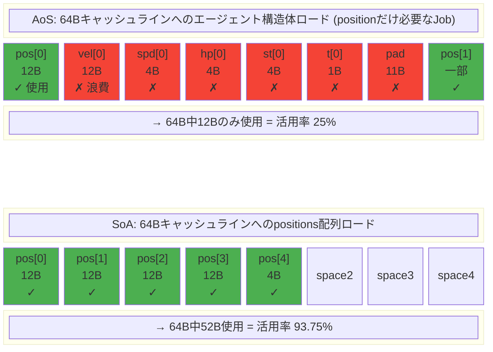
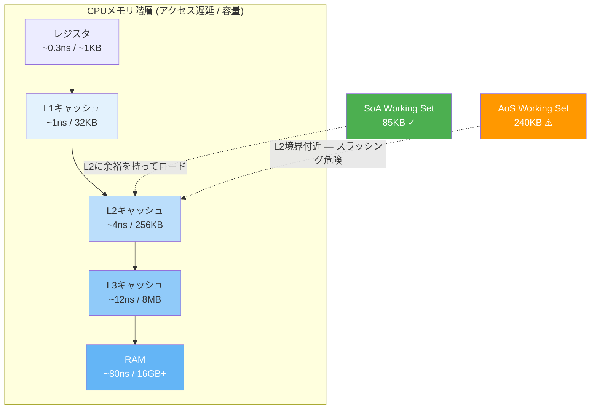
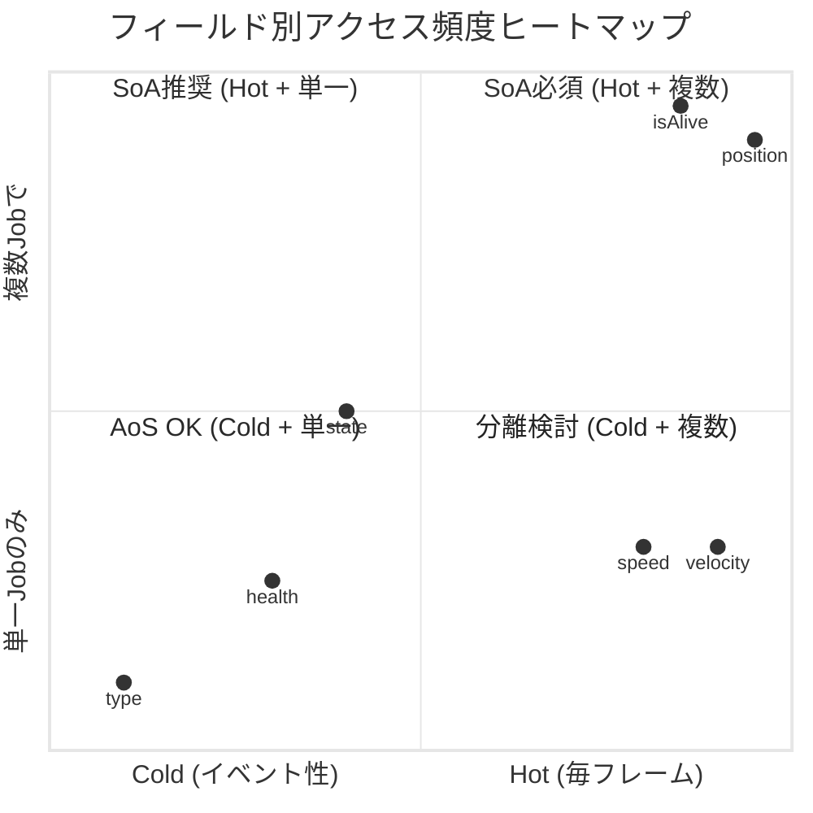
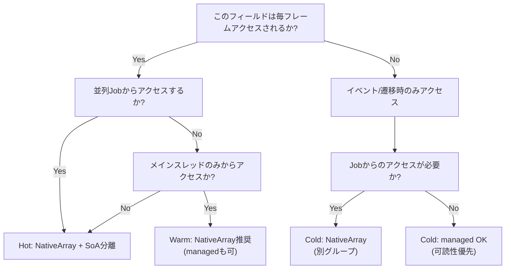
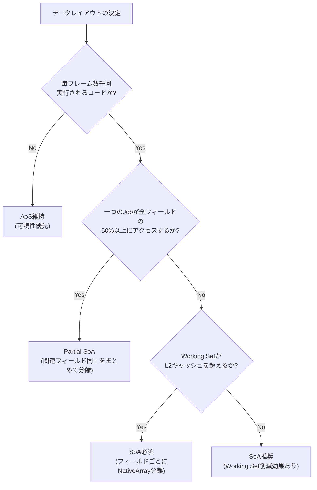

## はじめに

[前回のポスト](/posts/UnityJobSystemBurst/)ではUnity Job SystemとBurst Compilerの原理を扱った。Part 4でキャッシュ階層、AoS vs SoAの基本概念、メモリアラインメントとSIMDの関係を見てきたが — **SoAが速いことは確認できた。**

しかし、いくつかの疑問が残っている：
- **なぜ**速いのか？キャッシュライン単位の動作を数学的に分析できるのか？
- 既存のOOPコードを**どのように**SoAに変換するのか？
- **いつ**SoAを使うべきではないのか？

この記事ではこれらの疑問に答える。SoA/AoSは単純な配列配置技法ではなく、**データ指向設計(Data-Oriented Design)** というパラダイムの一部だ。パラダイムそのものを理解してこそ、正しい判断を下すことができる。

> キャッシュ階層構造、キャッシュライン(64バイト)、False Sharing、NativeArray内部構造などの基礎概念は[Job Systemポスト Part 4](/posts/UnityJobSystemBurst/#part-4-メモリ階層とsoaレイアウト)で扱ったため、ここでは繰り返さない。該当セクションを先に読むことを推奨する。

---

## Part 1: データ指向設計(DOD)の哲学

### OOPからDODへ：パラダイムシフト

ほとんどの開発者が最初に学ぶ設計パラダイムは**オブジェクト指向プログラミング(OOP)**だ。OOPの核心的な問いはこれだ：

> 「この**オブジェクト**は何を**するのか**？」

敵(Enemy)を設計するなら、自然とこう考える：

```csharp
// OOP: 敵の「行動」を中心に設計
abstract class Enemy : MonoBehaviour
{
    protected float health;
    protected float speed;
    protected Vector3 velocity;

    public abstract void UpdateAI();
    public virtual void TakeDamage(float amount) { health -= amount; }
    public virtual void Move() { transform.position += velocity * Time.deltaTime; }
}

class Walker : Enemy
{
    public override void UpdateAI() { /* 歩行AI */ }
}

class Runner : Enemy
{
    public override void UpdateAI() { /* 高速追跡AI */ }
    public override void Move() { /* より速く移動 */ }
}
```

この設計は直感的だ。「WalkerはEnemyであり、RunnerもEnemyである。」現実世界の分類体系をそのままコードに移している。

**問題は性能だ。** 5,000体の敵がいる場合：

```
メモリ配置 (OOP):
  Walker#0 → ヒープアドレス 0x10000 [vtable|health|speed|vel|transform_ptr|...]
  Runner#0 → ヒープアドレス 0x50000 [vtable|health|speed|vel|transform_ptr|...]
  Walker#1 → ヒープアドレス 0x30000 [vtable|health|speed|vel|transform_ptr|...]
  Runner#1 → ヒープアドレス 0x80000 [vtable|health|speed|vel|transform_ptr|...]
  ...
  → 5,000個のオブジェクトがヒープ全体に散在
  → 毎フレーム5,000回の仮想関数呼び出し (vtable間接参照)
  → アクセスのたびにキャッシュミスの可能性
```

**データ指向設計(DOD)**はまったく異なる問いから始まる：

> 「このシステムは毎フレーム**どのデータをどう変換**するのか？」

```csharp
// DOD: 「データ変換」を中心に設計
// データ: 連続配列
NativeArray<float3> positions;   // 5,000個の位置 — 連続メモリ
NativeArray<float3> velocities;  // 5,000個の速度 — 連続メモリ
NativeArray<float>  speeds;      // 5,000個の移動速度 — 連続メモリ

// 変換: Job struct
[BurstCompile]
struct MoveJob : IJobParallelFor
{
    [ReadOnly] public NativeArray<float3> Velocities;
    [ReadOnly] public NativeArray<float> Speeds;
    public NativeArray<float3> Positions;
    public float DeltaTime;

    public void Execute(int i)
    {
        Positions[i] += Velocities[i] * Speeds[i] * DeltaTime;
    }
}
```

OOPでは「EnemyがMove()を呼び出す」と考えるが、DODでは「MoveJobがpositions配列をvelocities配列で変換する」と考える。

| 観点 | OOP | DOD |
|------|-----|-----|
| 設計単位 | オブジェクト (Enemy, Walker) | データ配列＋変換関数 (Job) |
| メモリ | オブジェクトごとのヒープ割り当て、散在 | フィールドごとの連続配列 |
| 多態性 | 仮想関数 (vtable) | データ値による分岐 (byte type) |
| キャッシュ | ポインタチェイシング → ミス頻発 | シーケンシャルアクセス → プリフェッチャ最適 |
| 並列化 | 困難 (共有状態) | 自然 (配列分割) |

### Mike Actonの3つの原則

2014年のCppConでInsomniac GamesのMike Actonが発表した**"Data-Oriented Design and C++"**は、DODを確立した重要な講演だ。彼が指摘した「3つの嘘(lies)」は以下の通りだ：

#### Lie 1:「ソフトウェアがプラットフォームだ」

> ソフトウェアはプラットフォームではない。**ハードウェアがプラットフォームだ。**

プログラマは「C#の上で開発する」や「Unityの上で開発する」と考えがちだ。しかしコードが実際に動くのは**CPU＋キャッシュ＋RAM**だ。

```
開発者の認識:          実際:
  C# コード              CPUパイプライン
    ↓                    ↓
  Unity API           レジスタ → L1 → L2 → L3 → RAM
    ↓                    ↓
  "うまく動くだろう"    キャッシュミス 80ns × 5,000回 = 0.4ms
```

Unityの`foreach`で5,000個のMonoBehaviourの`Update()`を呼び出すと、C#レベルではきれいなコードだが、**ハードウェアレベルでは5,000回のポインタチェイシング**だ。

#### Lie 2:「コードがデータより重要だ」

> コードの目的は**データを変換すること**だ。データの形がコードを決定する。

OOPではクラス階層構造をまず設計し、データをそこに当てはめる。DODでは逆だ：

1. **入力データ**は何か？ (positions, velocities)
2. **出力データ**は何か？ (新しいpositions)
3. 変換は**どんなパターン**か？ (1:1マッピング、並列可能)
4. ならばコードは`IJobParallelFor`になる。

データのアクセスパターンが決まれば、コード構造は自動的についてくる。

#### Lie 3:「世界をモデリングしたコードが良いコードだ」

> 「WalkerはEnemyの一種だ」は**現実の分類体系**であり、**データ変換の最適構造**ではない。

WalkerとRunnerの移動ロジックが異なるのは`speed`値が異なるだけだ。仮想関数と継承階層の全体が、一つの`float`値の違いを表現するために存在している。

```csharp
// OOP: 継承で「種類」を表現
class Walker : Enemy { speed = 2f; }
class Runner : Enemy { speed = 5f; }

// DOD: データ値で「種類」を表現
NativeArray<float> speeds;  // speeds[i] = 2f or 5f
// → 仮想関数呼び出し0回、キャッシュミス0回
```

### ゲーム開発がDODに適している理由

すべてのソフトウェアがDODの恩恵を等しく受けるわけではない。ゲーム開発が特に適している理由は3つだ：

1. **数千の同種エンティティ**: 弾丸、敵、パーティクル — 同じ構造のデータが数千〜数万個。配列で表現するのに完璧な条件。

2. **厳格なフレーム予算**: 60fps = フレームあたり16.6ms。毎フレームすべてのエンティティを処理しなければならないので、ループの効率がフレーム予算そのもの。

3. **予測可能な変換パターン**: 「すべての敵の位置を速度に応じて更新する」「すべての弾丸の衝突を検査する」 — 入出力が明確なバッチ処理。

### DODの歴史：ハードウェアが強制したパラダイム

DODは学界で生まれた理論ではなく、**ゲームハードウェアの制約の中で生き残るために**実戦で発展したパラダイムだ。

#### PS3 Cell Broadband Engine (2006)

DODがゲーム業界で本格的に注目されたきっかけは**PlayStation 3のCellプロセッサ**だ。

```
Cellアーキテクチャ:
  PPE (PowerPC) — 汎用コア1個
  SPE (Synergistic Processing Element) × 6個 (ゲーム用)
    └── 各SPEのLocal Store: 256 KB
    └── メインRAMへの直接アクセス不可！
    └── DMAでデータをLocal Storeに明示的に転送する必要あり
```

256KBのLocal Storeにゲームデータを詰め込むには、**Working Setサイズを精密に管理**する必要があった。OOPの巨大なオブジェクトを丸ごとDMAすれば256KBはすぐに埋まる。必要なフィールドだけを抜き出して連続配列(SoA)でDMAするのが唯一の解法だった。

> Naughty Dogの**Jason Gregory**はPS3でThe Last of Usを開発しながらこの経験を体系化した。彼の著書**"Game Engine Architecture"** (Chapter 16)でデータ指向ランタイムシステム設計を詳しく扱っている。

#### Insomniac GamesとMike Acton (2004〜2014)

Insomniac Games(Ratchet & Clank, Resistanceシリーズ)のエンジンディレクターMike Actonは、PS2/PS3時代からDODを実戦に適用していた。

- 2004: GDCで"Pitfalls of Object Oriented Programming"をテーマにDOD事例を発表
- 2014: CppConで**"Data-Oriented Design and C++"**を発表 — DODをC++コミュニティ全体に広めた
- 2017: Unity Technologiesに合流し、**DOTS(Data-Oriented Technology Stack)**の開発を主導

#### Unity DOTS (2018〜)

Mike ActonがUnityに合流した後、Unityはゲームエンジンとして初めて**DODを公式フレームワーク**として提供した：

- **Entity Component System (ECS)**: Archetypeベースのレイアウト自動化
- **Job System**: マルチコアバッチ処理
- **Burst Compiler**: LLVMベースのネイティブコード生成

これが本シリーズで扱っている`NativeArray` + `IJobParallelFor` + `[BurstCompile]`の組み合わせの背景だ。

```
DODタイムライン:
  2004  Mike Acton、GDCでDOD事例を発表
  2006  PS3 Cell — 256KB Local StoreがDODを強制
  2007  Ulrich Drepper — "What Every Programmer Should Know About Memory"
  2009  Noel Llopis — "Data-Oriented Design" アーティクル
  2014  Mike Acton — CppCon "Data-Oriented Design and C++"
  2017  Mike Acton → Unity合流
  2018  Unity DOTSプレビュー
  2023  Unity ECS 1.0正式リリース
```

> DODは「最新トレンド」ではなく、**20年間ゲームハードウェアとともに進化した実戦哲学**だ。PS3の256KB制約はなくなったが、キャッシュ効率の重要性はCPUコア数とメモリレイテンシの格差が大きくなるほど、ますます高まっている。

---

## Part 2: メモリレイアウト深層分析

前回のポストでキャッシュ階層とキャッシュラインの基本概念を扱った。ここではもう一段踏み込んで、**定量的に**メモリレイアウトの効率を分析する方法を扱う。

### Stride：キャッシュ効率の核心指標

**Stride(ストライド)**とは、イテレーション時に**連続する2つのアクセス間のバイト距離**だ。

配列を走査する際、CPUはアクセスのたびに`stride`バイトずつ先に進む。この値がキャッシュライン(64バイト)に対してどれほど大きいかがキャッシュ効率を決定する。

#### AoSのStride

```csharp
struct Agent  // 48 bytes
{
    public float3 position;   // 12B (offset 0)
    public float3 velocity;   // 12B (offset 12)
    public float  speed;      // 4B  (offset 24)
    public float  health;     // 4B  (offset 28)
    public int    state;      // 4B  (offset 32)
    public byte   type;       // 1B  (offset 36)
    // padding: 11B → 合計48B (またはコンパイラによっては40B)
}
NativeArray<Agent> agents; // 5,000個
```

`position`だけを走査するJobを考えてみよう：

```
メモリ配置 (AoS):
Stride = sizeof(Agent) = 48 bytes

agents[0]: [pos(12B)|vel(12B)|spd(4B)|hp(4B)|st(4B)|type(1B)|pad(11B)]
                                                                        ↓ 48B skip
agents[1]: [pos(12B)|vel(12B)|spd(4B)|hp(4B)|st(4B)|type(1B)|pad(11B)]
                                                                        ↓ 48B skip
agents[2]: [pos(12B)|vel(12B)|spd(4B)|hp(4B)|st(4B)|type(1B)|pad(11B)]

キャッシュライン (64B)にAgentが1.33個 → positionは1〜2個のみロード
→ 残り36B(vel, spd, hp, st, type, pad)はこのJobで使わないがキャッシュに載る
```

#### SoAのStride

```csharp
NativeArray<float3> positions;   // Stride = 12 bytes
NativeArray<float3> velocities;
NativeArray<float>  speeds;
NativeArray<float>  healths;
```

```
メモリ配置 (SoA):
Stride = sizeof(float3) = 12 bytes

positions: [pos0(12B)|pos1(12B)|pos2(12B)|pos3(12B)|pos4(12B)|pos5(12B)|...]
           ←────────── キャッシュライン (64B): position 5個ロード ──────────→

→ キャッシュラインの全バイトが実際に使用されるデータ
→ 不要なデータロード 0
```

### キャッシュ活用率の公式

キャッシュラインにロードされたデータのうち、実際に使用する割合を**キャッシュ活用率(Cache Utilization)**と呼ぼう：

$$\text{Cache Utilization} = \frac{\text{Useful Bytes per Cache Line}}{\text{Cache Line Size}} = \frac{\left\lfloor \frac{64}{\text{Stride}} \right\rfloor \times \text{Element Size}}{64}$$

| レイアウト | Stride | Element Size | キャッシュラインあたりのロード数 | 活用率 |
|----------|--------|-------------|-----------------|--------|
| AoS (Agent全体のうちpositionのみアクセス) | 48B | 12B | 1個 | **25%** |
| SoA (positions配列) | 12B | 12B | 5個 | **93.75%** |
| SoA (speeds配列, float) | 4B | 4B | 16個 | **100%** |
| SoA (isAlive配列, byte) | 1B | 1B | 64個 | **100%** |

AoSでpositionだけにアクセスすると**キャッシュ帯域幅の75%を浪費**する。SoAではほぼ100%を活用する。

次の図は、同じ64バイトのキャッシュラインにAoSとSoAがどのようにロードされるかを比較している：



これが「同じ演算、同じBurstコンパイルなのにレイアウトが異なるだけで性能が数倍差が出る」根本原因だ。

### Working Setサイズの計算

**Working Set**とは、一つのJobが全実行を通じてアクセスする**総メモリサイズ**だ。

$$\text{Working Set} = \sum_{\text{array}} (\text{element count} \times \text{element size})$$

Working Setがどのキャッシュ階層に収まるかによって性能が決まる：

```csharp
// 例: 5,000エージェントの距離計算Job
[BurstCompile]
struct DistanceJob : IJobParallelFor
{
    [ReadOnly] public NativeArray<float3> Positions;  // 5,000 × 12B = 60 KB
    [ReadOnly] public NativeArray<byte>   IsAlive;    // 5,000 × 1B  =  5 KB
    [WriteOnly] public NativeArray<float> Distances;  // 5,000 × 4B  = 20 KB
    [ReadOnly] public float3 TargetPos;               // 12B

    public void Execute(int i)
    {
        if (IsAlive[i] == 0) { Distances[i] = float.MaxValue; return; }
        Distances[i] = math.distance(Positions[i], TargetPos);
    }
}
// Working Set = 60 + 5 + 20 = 85 KB
```

| Working Setサイズ | ロード先キャッシュ | 期待性能 |
|-------------------|-----------|-----------|
| < 32 KB | L1キャッシュ | 最高 (~1ns/アクセス) |
| 32 KB〜256 KB | L2キャッシュ | 良好 (~4ns/アクセス) |
| 256 KB〜8 MB | L3キャッシュ | 普通 (~12ns/アクセス) |
| > 8 MB | RAM | 低速 (~80ns/アクセス) |

次の図は、キャッシュ階層ごとの容量とAoS/SoA Working Setがどこに位置するかを示している：



上記DistanceJobのWorking Setは85KB — **L2キャッシュに完全にロード**される。もしAoS方式で同じデータを処理すると：

```
AoS Working Set = 5,000 × 48B(Agent struct) = 240 KB
→ L2境界 (256KB) 付近 — キャッシュスラッシング危険
→ アクセスするフィールドはposition + isAliveだけなのに、velocity/speed/health/state/typeも一緒にロード
```

**SoAはWorking Set自体を縮小して、より小さなキャッシュ階層に収まるようにする。** これが単純な「キャッシュライン効率」以上の効果だ。

#### Working Set計算の実践ヒント

1. **読み取り配列＋書き込み配列をすべて合算**する。`[ReadOnly]`でも`[WriteOnly]`でもメモリにロードされるのは同じだ。
2. **スカラーパラメータ**(float, intなど)はレジスタに収まるので無視してよい。
3. **IJobParallelFor**は配列全体をバッチ単位で処理するため、一度にアクティブなWorking Setは`batchCount × elementSize × arrayCount`に近い。ただしプリフェッチャが先読みするため、配列全体のサイズで保守的に計算するのが安全だ。

### ハードウェアプリフェッチャ：SoAが速い本当の理由

キャッシュ活用率は「浪費されるデータがどれほどか」を説明する。しかしSoAが速い理由の**残り半分**は**ハードウェアプリフェッチャ(Hardware Prefetcher)**にある。

#### プリフェッチャの動作原理

現代のCPUには複数種類のプリフェッチャが内蔵されている。核心は**Stride Prefetcher**だ：

```
Stride Prefetcherの動作:
  1. CPUがアドレスAにアクセス
  2. 次にアドレスA+Sにアクセス (S = stride)
  3. さらに次にアドレスA+2Sにアクセス
  4. プリフェッチャ: 「パターン検知！stride = S」
  5. → A+3S, A+4S, A+5Sを先にL1/L2にロード
  6. CPUがA+3Sに到達した時、すでにキャッシュにある → ミス0！
```

Intel CPUの場合、**2〜3回のアクセス**だけでstrideを検知し、以降のアクセスでは**キャッシュミス遅延を完全に隠蔽**する。

次の図は、SoAシーケンシャルアクセスでプリフェッチャが動作するタイムラインだ：

```mermaid
gantt
    title SoAシーケンシャルアクセス: Stride Prefetcherタイムライン
    dateFormat X
    axisFormat %s

    section CPUアクセス
    pos[0] アクセス (キャッシュミス)       :crit, a0, 0, 80
    pos[1] アクセス (キャッシュヒット)       :done, a1, 80, 81
    pos[2] アクセス (キャッシュミス)       :crit, a2, 81, 161
    pos[3] アクセス — stride検知!    :done, a3, 161, 162
    pos[4] アクセス (プリフェッチヒット)   :done, a4, 162, 163
    pos[5~4999] すべてヒット         :done, a5, 163, 200

    section Prefetcher
    パターン学習中                   :active, p0, 0, 161
    stride=12B 検知完了           :milestone, p1, 161, 161
    pos[4] 先読みロード               :p2, 130, 161
    pos[5,6,7...] 連続プリフェッチ    :p3, 161, 200
```



> Intel Optimization Manual Section 2.5.5.4: L2 Stride Prefetcherは最大2KBまでのstrideを検知する。L1 Data Prefetcherはキャッシュライン内のシーケンシャルアクセスを検知する。

#### SoA vs AoSでのプリフェッチャ効果

```
SoA (stride = 12B, float3):
  アクセス: pos[0] → pos[1] → pos[2] → ...
  アドレス: 0x1000 → 0x100C → 0x1018 → ...
  stride = 12B (一定) ✓
  
  → プリフェッチャが2回目のアクセスで即座に検知
  → 3回目のアクセスからキャッシュミスほぼ0
  → 5,000個走査中の実際のキャッシュミス: 最初の2〜3回のみ

AoS (stride = 48B, Agent全体のうちpositionのみ):
  アクセス: agents[0].pos → agents[1].pos → agents[2].pos → ...
  アドレス: 0x2000 → 0x2030 → 0x2060 → ...
  stride = 48B (一定) ✓ — プリフェッチャの検知自体は可能！
  
  しかし:
  → 48B stride = キャッシュライン(64B)をほぼ毎回超える
  → プリフェッチしたキャッシュラインのうち12Bしか使わない (残り36B浪費)
  → プリフェッチが「不要なデータ」でキャッシュを埋めて他の有用なデータを追い出す
```

**核心的インサイト**: プリフェッチャはAoSでもstrideを検知できる。しかし**プリフェッチしたデータの活用率**がSoAとAoSで大きく異なる。プリフェッチャが懸命に動いても、取得したデータを25%しか使わないならキャッシュ汚染(cache pollution)が発生する。

> Srinath et al.の"Feedback Directed Prefetching" (HPCA 2007)では、プリフェッチャの**精度(accuracy)**と**カバレッジ(coverage)**を区別する。AoSの問題はカバレッジではなく精度（取得したデータのうち実際に使用する割合）が低いことだ。

#### プリフェッチャが失敗するケース

プリフェッチャは**不規則なアクセスパターン**には無力だ：

```csharp
// プリフェッチャ失敗例: 間接インデキシング
NativeArray<int> sortedIndices;  // [42, 7, 3891, 102, ...]
for (int i = 0; i < count; i++)
{
    int idx = sortedIndices[i];
    float3 pos = positions[idx];  // ← ランダムアクセス！stride不規則
    // → プリフェッチャ無力化 → 毎アクセスでキャッシュミスの可能性
}
```

このような場合には**ソフトウェアプリフェッチ**ヒントを使用するか、インデックスをソートしてアクセスの局所性を高める方法がある。

### メモリ帯域幅：キャッシュの先にあるボトルネック

キャッシュ効率とプリフェッチャを論じたが、もう一つの観点がある。**メモリ帯域幅(bandwidth)**だ。

現代のCPUで多くのバッチ処理ループは**compute-bound(演算ボトルネック)**ではなく**memory-bound(メモリボトルネック)**だ。つまり、演算自体は速いがデータを取得する速度がボトルネックになる。

#### Rooflineモデルで見るSoAの利点

**Rooflineモデル**(Williams et al., 2009)は、プログラムがcompute-boundかmemory-boundかを視覚的に判断するフレームワークだ。

$$\text{Operational Intensity} = \frac{\text{FLOP}}{\text{Bytes Transferred}}$$

| 項目 | AoS | SoA |
|------|-----|-----|
| 演算 (distance計算) | 7 FLOP/エンティティ | 7 FLOP/エンティティ (同一) |
| 転送バイト | 48B/エンティティ (Agent全体) | 16B/エンティティ (pos 12B + dist 4B) |
| Operational Intensity | 7/48 = **0.146** | 7/16 = **0.438** |
| 状態 | 極度のmemory-bound | memory-bound緩和 |

```
DDR4-3200 帯域幅: ~51.2 GB/s (理論), 実際 ~25 GB/s

AoS: 5,000 × 48B = 240KB 転送 → 240KB / 25GB/s = 0.0096ms
SoA: 5,000 × 16B = 80KB 転送  → 80KB / 25GB/s  = 0.0032ms

→ SoAはメモリ帯域幅消費が1/3
→ 同じ帯域幅で3倍多くのエンティティを処理可能
```

帯域幅の観点から見ると、**AoSの「使わないフィールド」は単なるキャッシュの浪費ではなく、メモリバスの帯域幅を消費する実質的なコスト**だ。Working Setがキャッシュを超えると、このコストが直接的に性能を決定する。

> ゲームで数万のエンティティを処理するループはほとんどがmemory-boundだ。Rooflineモデルを描いてみると、SoA変換は**「同じハードウェアでoperational intensityを高めてmemory-bound領域から脱出すること」**として理解できる。

### Power-of-2 Strideの罠

strideがキャッシュラインサイズの正確な倍数のとき、注意が必要だ。

現代CPUのL1キャッシュは**set-associative**構造だ。キャッシュを複数の「set」に分け、各メモリアドレスは特定のsetにのみマッピングされる。

```
Stride = 64B (キャッシュラインサイズの1倍):
  agents[0] → Set 0
  agents[1] → Set 0  ← 同じset！
  agents[2] → Set 0  ← また同じset！
  ...
  → 一つのsetにアクセスが集中 → 他のsetは空いているのにこのsetだけ溢れる
  → 「キャッシュスラッシング(thrashing)」発生
```

これはstrideが正確に64, 128, 256, 512など2のべき乗の場合に発生し得る。

**緩和方法:**
- structサイズが正確に64Bの倍数にならないようにパディングを追加または削除
- 実際に問題になるケースは稀だが、性能が理論値より低い場合に疑うべき項目

### TLBミス：SoAの隠れたコスト

キャッシュ効率だけを見るとSoAが圧倒的に有利だが、**TLB(Translation Lookaside Buffer)**の観点ではSoAが不利になり得る。

#### TLBとは？

仮想メモリシステムにおいて、CPUは**仮想アドレス → 物理アドレス**変換をメモリアクセスのたびに行う。この変換をキャッシュするのがTLBだ。

```
仮想アドレスアクセス → TLB参照
  → Hit: 物理アドレスを即座に取得 (~1 cycle)
  → Miss: ページテーブルウォーク (~100 cycles, 最悪 ~1000 cycles)
```

L1 DTLBは一般的に**64〜128エントリ**を持ち、各エントリが4KBページをカバーする。つまりTLBでカバー可能な範囲は`128 × 4KB = 512KB`程度だ。

#### SoAがTLBに不利な理由

```
AoS — 配列1個:
  NativeArray<Agent> agents → 連続メモリページ
  → TLBエントリ1個で4KB(~85エージェント)をカバー
  → シーケンシャルアクセスなのでページもシーケンシャル → TLBミス最小

SoA — 配列8個:
  positions[]     → ページグループA
  velocities[]    → ページグループB
  speeds[]        → ページグループC
  healths[]       → ページグループD
  isAlive[]       → ページグループE
  states[]        → ページグループF
  cooldowns[]     → ページグループG
  types[]         → ページグループH
  → 一つのJobが4配列にアクセスすると → 4つのページグループに同時アクセス
  → TLBエントリ消費4倍
```

**5,000エージェント、MoveJob(4配列):**

```
各配列のメモリサイズ:
  positions:  5,000 × 12B = 60KB → 15ページ
  velocities: 5,000 × 12B = 60KB → 15ページ
  speeds:     5,000 × 4B  = 20KB → 5ページ
  isAlive:    5,000 × 1B  = 5KB  → 2ページ
  
  必要なTLBエントリ合計: 37個 (L1 DTLBの~29%)
  → 5,000個では問題なし

しかし配列が20個でエンティティが50,000個なら:
  → 数百のTLBエントリが必要 → TLBスラッシング危険
```

#### 緩和方法

1. **Partial SoA**: 常に一緒にアクセスされるフィールドをstructにまとめて配列数を減らす — これがPartial SoAの**ハードウェア的根拠**
2. **Huge Pages (2MB)**: OSレベルで2MBページを使用すればTLBカバレッジが512倍に増加
3. **配列数の管理**: 一つのJobがアクセスする配列を5〜6個以下に維持

> Ulrich Drepperの"What Every Programmer Should Know About Memory" Section 4でTLBミスの影響を詳しく分析している。特にFigure 4.5ではデータサイズがTLBカバレッジを超えた時に性能が急落するグラフを示しており、これがSoAで配列を過度に分離した場合に発生し得る現象だ。

### C#構造体のメモリレイアウト

AoSのstrideを正確に計算するには、C#がstructをメモリにどう配置するかを知る必要がある。

#### StructLayoutとパディング

C#のstructはデフォルトで**Sequentialレイアウト**を使用する。各フィールドは**自身のサイズに合わせてアラインメント(alignment)**される：

```
アラインメント規則:
  byte    → 1バイトアラインメント (任意のアドレスに配置可能)
  short   → 2バイトアラインメント (偶数アドレス)
  int     → 4バイトアラインメント (4の倍数アドレス)
  float   → 4バイトアラインメント
  float3  → 4バイトアラインメント (float × 3なのでfloatのアラインメントに従う)
  double  → 8バイトアラインメント
  float4  → 16バイトアラインメント (SIMD最適化のためにBurstが強制)
```

#### 例1: パディングのない理想的な構造体

```csharp
struct GoodLayout  // 28 bytes (パディングなし)
{
    public float3 position;  // offset 0,  12B
    public float  speed;     // offset 12, 4B
    public float  health;    // offset 16, 4B
    public int    state;     // offset 20, 4B
    public int    type;      // offset 24, 4B
}
```

```
バイトマップ (4B単位):
[pos.x ][pos.y ][pos.z ][speed ]
[health][state ][type  ]
合計 28B, パディング 0B
```

すべてのフィールドが4バイトアラインメントなのでパディングは発生しない。

#### 例2: フィールド順序によるパディング発生

```csharp
struct BadLayout  // 32 bytes! (パディング 4B)
{
    public float3 position;  // offset 0,  12B
    public byte   isAlive;   // offset 12, 1B
    // ← 3B padding (次のfloatが4の倍数アドレスに来る必要があるため)
    public float  speed;     // offset 16, 4B
    public float  health;    // offset 20, 4B
    public int    state;     // offset 24, 4B
    public byte   type;      // offset 28, 1B
    // ← 3B padding (struct全体のサイズが最大アラインメントの倍数である必要があるため)
}
```

```
バイトマップ:
[pos.x ][pos.y ][pos.z ][a|pad ]  ← byte後に3Bパディング
[speed ][health][state ][t|pad ]  ← byte後に3Bパディング
合計 32B, パディング 6B (18.75%浪費)
```

#### 例3: フィールド再配置によるパディング除去

```csharp
struct OptimizedLayout  // 28 bytes (パディング 0B)
{
    public float3 position;  // offset 0,  12B
    public float  speed;     // offset 12, 4B
    public float  health;    // offset 16, 4B
    public int    state;     // offset 20, 4B
    public byte   isAlive;   // offset 24, 1B
    public byte   type;      // offset 25, 1B
    // ← 2B padding (structサイズを4の倍数に合わせる)
}
```

```
バイトマップ:
[pos.x ][pos.y ][pos.z ][speed ]
[health][state ][a|t|pp]
合計 28B, パディング 2B (7%浪費) — BadLayout比4B節約
```

**規則: 大きなフィールドを前に、小さなフィールドを後ろに配置するとパディングが最小化される。**

#### sizeof比較

```csharp
// Unityエディタで確認
Debug.Log(UnsafeUtility.SizeOf<GoodLayout>());       // 28
Debug.Log(UnsafeUtility.SizeOf<BadLayout>());         // 32
Debug.Log(UnsafeUtility.SizeOf<OptimizedLayout>());   // 28
```

`UnsafeUtility.SizeOf<T>()`が実際のメモリサイズを返す。`Marshal.SizeOf()`はinteropマーシャリングサイズなので異なる場合がある。Job/Burstコンテキストでは常に`UnsafeUtility.SizeOf<T>()`を使用する。

#### Burstのレイアウト保証

Burstコンパイラはstructを**常にSequentialレイアウト**で処理する。CLRの`StructLayout.Auto`(フィールド再配置許可)とは異なり、Burstはフィールド順序をそのまま維持する。したがって：

- Burst Jobで使用するstructは**フィールド順序がそのままメモリ順序**
- パディングを減らすには**コードレベルでフィールドを直接整列**する必要がある
- Burstはさらに16バイトアラインメントを活用してSIMD aligned load/storeを生成する

#### パディングがAoSのstrideを大きくする

```
パディングなしのstruct (28B) × 5,000 = 140 KB → L2にロード
パディングありのstruct (32B) × 5,000 = 160 KB → L2にロード (余裕減少)
パディング多のstruct (48B) × 5,000 = 240 KB → L2境界付近 (危険)
```

4バイトのパディング差が5,000個で**20KB**のメモリ浪費になる。これが一つのstructのサイズの問題ではなく、**配列全体のキャッシュロード可否**に影響を与える理由だ。

---

## Part 3: AoS → SoA 変換方法論

### ステップバイステップのプロセス

既存のAoSコードをSoAに変換する体系的な5ステップ：

#### Step 1: アクセスパターン分析

各システム(Job)がどのフィールドを読み書きするかを表に整理する。

```csharp
// 例: 仮想のAoS Agent構造体
struct Agent
{
    public float3 position;   // Movement, Distance, Renderingで使用
    public float3 velocity;   // Movementで使用
    public float  speed;      // Movementで使用
    public float  health;     // Combatで使用
    public byte   isAlive;    // すべてのJobで使用
    public byte   state;      // AI, Combatで使用
    public byte   type;       // Spawn時のみ使用
}
```

アクセスパターン表：

| Job | 読み取りフィールド | 書き込みフィールド |
|-----|-----------|-----------|
| MoveJob | position, velocity, speed, isAlive | position |
| DistanceJob | position, isAlive | (別途distances配列) |
| AttackJob | distances, isAlive, state | state, attackCooldown |
| RenderJob | position, isAlive | (別途matrices配列) |

**核心的観察**: すべてのJobがAgentの7フィールドすべてを使用するわけではない。MoveJobは4個、DistanceJobは2個だけ必要だ。

このアクセスパターンをヒートマップで可視化すると、**どのフィールドがHotでどのフィールドがColdか**が一目でわかる：



#### Step 2: データグループの識別

アクセスパターンが類似するフィールドをグループにまとめる：

```
Movementグループ: position, velocity, speed  (MoveJobが毎フレームアクセス)
Stateグループ:    isAlive, state             (複数Jobで読み取り)
Combatグループ:   health, attackCooldown     (CombatJobのみアクセス)
Identityグループ: type                        (スポーン時のみアクセス、以降読み取り専用)
```

#### Step 3: NativeArrayの分離

グループを基に、各フィールドを個別のNativeArrayに分離する：

```csharp
// Movement
NativeArray<float3> positions;
NativeArray<float3> velocities;
NativeArray<float>  speeds;

// State
NativeArray<byte> isAlive;
NativeArray<byte> states;

// Combat
NativeArray<float> healths;
NativeArray<float> attackCooldowns;

// Identity
NativeArray<byte> types;
```

#### Step 4: Jobで必要な配列のみを参照

```csharp
[BurstCompile]
struct MoveJob : IJobParallelFor
{
    [ReadOnly] public NativeArray<float3> Velocities;
    [ReadOnly] public NativeArray<float>  Speeds;
    [ReadOnly] public NativeArray<byte>   IsAlive;
    public NativeArray<float3> Positions;
    public float DeltaTime;

    public void Execute(int i)
    {
        if (IsAlive[i] == 0) return;
        Positions[i] += Velocities[i] * Speeds[i] * DeltaTime;
    }
}
// Working Set = 60KB + 20KB + 5KB + 60KB = 145 KB (L2に余裕を持ってロード)
```

AoS方式だった場合: `5,000 × 48B = 240KB` (Agent全体をロードする必要があるため)。
SoA方式でのMoveJobのWorking Setは145KB — **40%削減**。

#### Step 5: 管理クラスでライフサイクルを統合

分離されたNativeArrayの割り当てと解放を一つのクラスで管理する：

```csharp
public class AgentData : IDisposable
{
    public int Capacity { get; }
    public int ActiveCount { get; set; }

    // Movement
    public NativeArray<float3> Positions;
    public NativeArray<float3> Velocities;
    public NativeArray<float>  Speeds;

    // State
    public NativeArray<byte> IsAlive;
    public NativeArray<byte> States;

    // Combat
    public NativeArray<float> Healths;
    public NativeArray<float> AttackCooldowns;

    // Identity
    public NativeArray<byte> Types;

    public AgentData(int capacity)
    {
        Capacity = capacity;
        Positions        = new NativeArray<float3>(capacity, Allocator.Persistent);
        Velocities       = new NativeArray<float3>(capacity, Allocator.Persistent);
        Speeds           = new NativeArray<float>(capacity, Allocator.Persistent);
        IsAlive          = new NativeArray<byte>(capacity, Allocator.Persistent);
        States           = new NativeArray<byte>(capacity, Allocator.Persistent);
        Healths          = new NativeArray<float>(capacity, Allocator.Persistent);
        AttackCooldowns  = new NativeArray<float>(capacity, Allocator.Persistent);
        Types            = new NativeArray<byte>(capacity, Allocator.Persistent);
    }

    public void Dispose()
    {
        if (Positions.IsCreated) Positions.Dispose();
        if (Velocities.IsCreated) Velocities.Dispose();
        if (Speeds.IsCreated) Speeds.Dispose();
        if (IsAlive.IsCreated) IsAlive.Dispose();
        if (States.IsCreated) States.Dispose();
        if (Healths.IsCreated) Healths.Dispose();
        if (AttackCooldowns.IsCreated) AttackCooldowns.Dispose();
        if (Types.IsCreated) Types.Dispose();
    }
}
```

このパターンが**DODのFlyweightパターン**でもある。「振る舞いロジック(Job struct)」は一つだけ存在し、「インスタンスデータ(NativeArray)」だけがN個ある構造だ。

### Before/After メモリ比較

5,000エージェント、MoveJob実行基準：

| 項目 | AoS | SoA |
|------|-----|-----|
| アクセスメモリ | 5,000 × 48B = **240 KB** | pos(60) + vel(60) + spd(20) + alive(5) = **145 KB** |
| キャッシュ活用率 (positionアクセス時) | 25% | 93.75% |
| キャッシュ階層 | L2境界 (スラッシング危険) | L2安定 |
| 不要なデータロード | health, state, type, padding | 0 |

### Partial SoA：関連フィールドのグルーピング

SoAが「すべてのフィールドを個別配列に分離せよ」という意味ではない。**常に一緒にアクセスされるフィールド**は一つのstructにまとめてもよい。

```csharp
// Bad: float3のx, y, zを個別配列に分離
NativeArray<float> positionsX;  // 意味のない分離
NativeArray<float> positionsY;  // float3のx,y,zは常に一緒にアクセス
NativeArray<float> positionsZ;

// Good: float3は一つの単位
NativeArray<float3> positions;  // x,y,zが常に一緒に必要なのでこれが正しい
```

**分離の基準は「アクセスパターン」だ:**

- `position`の`x, y, z`は常に一緒に読まれるため → `NativeArray<float3>` 維持
- `health`と`attackCooldown`が**同じJobでのみ**アクセスされるなら → `NativeArray<float2>`にまとめてもOK (float2.x = health, float2.y = cooldown)
- `health`と`position`は**異なるJob**でアクセスされるため → 必ず分離

この判断は結局Step 1のアクセスパターン分析から導かれる。アクセスパターンが同じフィールド同士はまとめ、異なるフィールド同士は分離する。

### 実践パターン：生成/削除が頻繁なエンティティ管理

SoAで最も厄介な部分は**エンティティの動的追加/削除**だ。AoSではオブジェクトを`new/delete`すればよいが、SoAでは**すべての配列で同一のインデックスを管理**する必要がある。

#### Free Listパターン

```csharp
public class SoAEntityPool : IDisposable
{
    // SoA配列
    public NativeArray<float3> Positions;
    public NativeArray<float3> Velocities;
    public NativeArray<byte>   IsAlive;

    // 再利用可能なインデックススタック
    NativeQueue<int> _freeIndices;
    int _highWaterMark;  // 一度でも使用された最大インデックス

    public int Spawn(float3 pos, float3 vel)
    {
        int idx;
        if (!_freeIndices.TryDequeue(out idx))
        {
            idx = _highWaterMark++;
        }
        Positions[idx] = pos;
        Velocities[idx] = vel;
        IsAlive[idx] = 1;
        return idx;
    }

    public void Despawn(int idx)
    {
        IsAlive[idx] = 0;
        _freeIndices.Enqueue(idx);
    }
}
```

**Free List vs Swap and Pop 比較:**

| 項目 | Free List | Swap and Pop |
|------|-----------|-------------|
| インデックス安定性 | 維持される (外部参照安全) | 壊れる (リマップ必要) |
| 配列密度 | 穴が発生 (fragmentation) | 常に密集 |
| Job走査 | `if (IsAlive[i])` 分岐が必要 | 分岐なしでActiveCountまで |
| Working Set | 死んだエンティティも含む | 生きているもののみ |
| 適した状況 | 外部からID参照が必要な場合 | 性能の極限最適化時 |

プロジェクト初期にはFree Listで始め、プロファイリングで分岐コストが問題になった時にSwap and Popに切り替えるのが現実的だ。

---

## Part 4: Hot/Coldデータ分離パターン

### Hot Data vs Cold Data

すべてのデータが毎フレームアクセスされるわけではない。アクセス頻度によってデータを分類できる：

```
┌────────────────────────────────────────────────────┐
│  Hot Data (毎フレーム、並列Job)                       │
│  positions, velocities, isAlive                     │
│  → NativeArray + IJobParallelFor 必須               │
│  → キャッシュ効率が性能を直接決定                      │
├────────────────────────────────────────────────────┤
│  Warm Data (毎フレームだが条件付き)                    │
│  speeds, distances, separationForces                │
│  → NativeArray 推奨                                 │
│  → isAlive == 0ならスキップするため実際のアクセス < 配列サイズ │
├────────────────────────────────────────────────────┤
│  Cold Data (イベント/遷移時のみ)                       │
│  health, type, state, attackCooldown                │
│  → NativeArrayも可能だが、managedでもOK               │
│  → キャッシュ効率よりコードの可読性が重要               │
└────────────────────────────────────────────────────┘
```

### アクセス頻度に基づく分離戦略

核心原則: **HotデータのWorking Setを最小化せよ。**

HotデータにColdデータを混ぜるとWorking Setが不必要に大きくなる：

```csharp
// アンチパターン: HotとColdを同じstructに
struct Agent  // 48B
{
    // Hot (毎フレームアクセス)
    public float3 position;   // 12B
    public float3 velocity;   // 12B

    // Cold (たまにアクセス)
    public float  health;     // 4B
    public float  cooldown;   // 4B
    public int    kills;      // 4B
    public byte   faction;    // 1B
    // ... padding
}

// MoveJobがposition + velocityだけ必要なのに
// health, cooldown, kills, factionもキャッシュに載る
// Working Set: 5,000 × 48B = 240KB (Coldデータ込み)
```

```csharp
// 正しい分離: Hot配列のみ別途
NativeArray<float3> positions;   // Hot
NativeArray<float3> velocities;  // Hot

// MoveJob Working Set: 5,000 × 24B = 120KB (Hotのみ！)
// → L2に余裕を持ってロード
```

**Coldデータのオプション:**

Coldデータは必ずしもNativeArrayである必要はない。アクセス頻度が低く少量であればmanaged配列やDictionaryも許容される：

```csharp
// Cold: イベントベースでアクセス
NativeArray<float> healths;          // Jobでアクセスが必要ならNativeArray
float[] attackCooldowns;             // Jobが不要ならmanagedでもOK
Dictionary<int, string> agentNames;  // デバッグ/UI専用ならmanagedが自然
```

ただし、JobでアクセスするColdデータは依然としてNativeArrayでなければならない (managed → Job不可)。

### 分離判断チェックリスト

データフィールド一つ一つにこの質問を適用する：



核心は**「HotデータのWorking SetにColdデータが混ざらないようにせよ」**ということだ。これがSoAとHot/Cold分離の接点だ。

### 分岐予測とSoA：隠れた利点

Hot/Cold分離に関連して、あまり知られていない利点がもう一つある。**分岐予測器(Branch Predictor)**との相互作用だ。

```csharp
// 多くのJobにこのパターンがある:
public void Execute(int i)
{
    if (IsAlive[i] == 0) return;  // ← 分岐
    Positions[i] += Velocities[i] * Speeds[i] * DeltaTime;
}
```

現代CPUの分岐予測器は最近の分岐履歴(Branch History Buffer)に基づいて次の分岐を予測する。

```
SoA — IsAlive配列が連続:
  [1,1,1,1,1,0,0,0,1,1,1,0,...]  ← 同じキャッシュラインに64個！
  → 分岐予測器がパターンを素早く学習
  → 予測精度が高い → パイプラインストール最小化

AoS — isAliveが48B間隔:
  Agent[0].isAlive ... (48B gap) ... Agent[1].isAlive ...
  → 分岐履歴バッファにより少ないサンプルが蓄積
  → パターン学習が遅い
```

この効果は`isAlive`のようなブーリアンフィールドだけでなく、`state`ベースの分岐でも同様に適用される。

**より根本的な解決：分岐を除去せよ**

分岐予測精度を高めることより**分岐自体を除去**する方がよい。2つの方法がある：

**方法1: 乗算で分岐を代替 (Branchless)**

```csharp
public void Execute(int i)
{
    // if (IsAlive[i] == 0) return; の代わりに:
    float alive = IsAlive[i];  // 0.0f or 1.0f
    Positions[i] += Velocities[i] * Speeds[i] * DeltaTime * alive;
    // → deadエンティティは0を掛けて変化なし
    // → 分岐0回、SIMDベクトル化にも有利
}
```

**方法2: Swap and Pop — 配列圧縮**

```csharp
// エンティティが死んだら配列末尾の生存エンティティと交換
void Kill(int index)
{
    ActiveCount--;
    positions[index]  = positions[ActiveCount];
    velocities[index] = velocities[ActiveCount];
    speeds[index]     = speeds[ActiveCount];
    // ... すべてのSoA配列に対してswap
}

// JobはActiveCountまでのみ走査 — isAliveチェック不要！
new MoveJob { ... }.Schedule(ActiveCount, 64);
```

Swap and Popは**分岐除去＋Working Set縮小**を同時に達成する。5,000個中3,000個だけが生存していれば、Working Setが40%縮小する。ただし、インデックス安定性が必要な場合(外部から`agentId`でアクセス)、別途**インデックスリマップテーブル**が必要だ。

---

## Part 5: トレードオフと判断基準

### AoSの方が良いケース

SoAが常に正解ではない。以下の状況ではAoSの方が適している：

#### 1. 単一エンティティの全データアクセス

```csharp
// UIで選択したユニットの情報を表示する場合
void ShowUnitInfo(int unitId)
{
    // SoA: 8個の配列からそれぞれunitIdインデックスでアクセス → 8回のランダムアクセス
    string info = $"HP: {healths[unitId]}, Speed: {speeds[unitId]}, " +
                  $"State: {states[unitId]}, Type: {types[unitId]}...";

    // AoS: 1回のアクセスですべてのデータを取得 → キャッシュライン1〜2個
    var unit = units[unitId];
    string info = $"HP: {unit.health}, Speed: {unit.speed}, " +
                  $"State: {unit.state}, Type: {unit.type}...";
}
```

SoAは**バッチ走査(batch iteration)**に最適化されている。単一エンティティの全フィールドを一度に読む必要がある場合はAoSの方がキャッシュ効率が良い。

#### 2. Cold Path (イベントベース、少量処理)

```csharp
// ターン切り替え時に1回実行、ユニット20個のみ処理
void OnTurnEnd()
{
    foreach (var unit in selectedSquad)  // 最大20個
    {
        unit.health += unit.healRate;
        unit.morale += CalculateMorale(unit);
        unit.fatigue -= unit.restRate;
    }
}
```

このコードは20回しか実行されない。キャッシュ効率が性能に与える影響は**測定不可能なほど小さい**。ここでSoAを適用するとコードの複雑度だけが上がる。

#### 3. エンティティ数 < 100

エンティティが100個未満なら、AoS全体のWorking Setは：
```
100 × 48B = 4.8 KB → L1キャッシュ(32KB)に完全にロード
```

L1に収まればAoSでもSoAでも性能差はほぼない。**キャッシュ最適化はWorking Setがキャッシュを溢れる時**に意味がある。

#### 4. プロトタイプ段階

リリースまで遠く、ゲームプレイを実験する段階なら**可読性と修正の容易さ**が性能より重要だ。AoSで素早くプロトタイプし、プロファイリングでボトルネックが確認された後にSoAに切り替えても遅くはない。

### ハイブリッド：AoSoAパターン

SoAとAoSの長所を組み合わせた**AoSoA(Array of Structure of Arrays)**パターンがある。

```csharp
// AoSoA: 8個のエンティティを一つのSoAブロックにまとめる
struct AgentBlock8
{
    // 8エージェントのposition.xを連続配置
    public fixed float posX[8];   // 32B — SIMD(AVX2)で一度に処理
    public fixed float posY[8];   // 32B
    public fixed float posZ[8];   // 32B
    public fixed float velX[8];   // 32B
    public fixed float velY[8];   // 32B
    public fixed float velZ[8];   // 32B
}
NativeArray<AgentBlock8> blocks;  // 5,000 / 8 = 625個

// 長所: SIMD 8-wide演算に完璧にマッチ
// 短所: コードの複雑度が急激に増加
```

AoSoAは**SIMD幅に正確に合わせた極限の最適化**だ。GPU compute shaderやISPC(Intel SPMD)のような環境で主に使用される。

**Unity Jobs + Burstではほとんどの場合、通常のSoAで十分だ。** Burstの自動ベクトル化がSoA配列をSIMDでよく処理するため、AoSoAの複雑さを受け入れる必要はほぼない。Burst Inspectorでベクトル化されていないことを確認してから検討しても遅くはない。

### SoAとFalse Sharing：batchCountチューニング

SoAはキャッシュ効率を最大化するが、**並列処理でFalse Sharingを悪化させる可能性がある**。SoAのstrideが小さいためだ。

```
IJobParallelForでbatchCount=1に設定すると:
  Thread 0 → positions[0]    ─┐
  Thread 1 → positions[1]     ├─ 同じキャッシュライン (12B stride, 64Bラインに5個)
  Thread 2 → positions[2]     │
  Thread 3 → positions[3]     │
  Thread 4 → positions[4]    ─┘
  → 5スレッドが同じキャッシュラインに同時書き込みしようとする
  → キャッシュラインがコア間でピンポン → False Sharing!
```

**解決: batchCountをキャッシュライン基準で設定**

```csharp
// stride = 12B (float3), キャッシュライン = 64B
// 64 / 12 ≈ 5.3 → 最低6個ずつまとめてキャッシュライン1個を独占する必要あり
// 実戦では64〜128にゆとりを持って設定
new MoveJob { ... }.Schedule(entityCount, 64);  // ← batchCount = 64
// Thread 0: positions[0..63]   → キャッシュライン~12個を独占
// Thread 1: positions[64..127] → 別のキャッシュライン
// → False Sharing除去
```

**batchCountの経験則:**

| stride | 最小batchCount | 推奨batchCount |
|--------|----------------|----------------|
| 4B (float) | 16 | 64〜128 |
| 12B (float3) | 6 | 64〜128 |
| 16B (float4) | 4 | 64 |

> AoSではstrideが大きいため(48B)、キャッシュラインあたりのエンティティが1〜2個でFalse Sharingはあまり発生しない。SoAはstrideが小さいため**batchCountチューニングが必須**だ。これはSoAのトレードオフの一つだ。

### GPUとの接続：「GPUはもともとSoAだ」

CPUでSoAを理解したなら、**GPU最適化も同じ原理**で拡張できる。

GPUの**SIMT(Single Instruction, Multiple Threads)**アーキテクチャで32スレッド(warp)が同時にメモリにアクセスする際、**連続したアドレスにアクセスすれば一つのメモリトランザクションに統合される(Coalesced Access)**。散在したアドレスにアクセスすれば32回の個別トランザクションが発生する。

```
GPU Compute Shaderで:

// AoS: StructuredBuffer<Agent> — Stride 48B
// Thread 0 → agents[0].position (アドレス 0)
// Thread 1 → agents[1].position (アドレス 48)
// Thread 2 → agents[2].position (アドレス 96)
// → 32スレッドが48B間隔でアクセス → メモリトランザクション多数発生

// SoA: StructuredBuffer<float3> positions — Stride 12B
// Thread 0 → positions[0] (アドレス 0)
// Thread 1 → positions[1] (アドレス 12)
// Thread 2 → positions[2] (アドレス 24)
// → 32スレッドが連続アクセス → 少数のトランザクションに統合 (Coalesced!)
```

| 概念 | CPU | GPU |
|------|-----|-----|
| メモリ効率の単位 | キャッシュライン (64B) | メモリトランザクション (32/128B) |
| シーケンシャルアクセス最適化 | プリフェッチャ | Coalesced Access |
| SoAの利点 | キャッシュ活用率 ↑ | トランザクション数 ↓ |
| 散在アクセスのペナルティ | キャッシュミス | Uncoalesced (帯域幅浪費) |

> NVIDIAの"CUDA C++ Best Practices Guide" Section 9.2でCoalesced Accessを詳しく扱っている。CPUでSoAを理解していれば、GPU Compute Shader最適化は**同じ思考法の自然な拡張**だ。

### Unity DOTS/ECSとの関係

Unityの**Entity Component System(ECS)**は内部的にSoAと類似した構造を自動的に実装する。

```
ECS Archetypeメモリレイアウト:
┌──────────── Chunk (16 KB) ──────────┐
│ [Position][Position][Position]...   │  ← SoA: 同じコンポーネント同士が連続
│ [Velocity][Velocity][Velocity]...   │
│ [Health]  [Health]  [Health]  ...   │
└─────────────────────────────────────┘
```

ECSを使用すれば**SoAレイアウトを手動で実装する必要はない** — Archetypeシステムが自動的に処理する。

しかしECS導入はプロジェクト全体のアーキテクチャを変更する決定だ。**Jobs + Burstだけでも** `NativeArray` + `IDisposable`ラッパークラスパターンを使用すれば、ECSと同等のキャッシュ効率を達成できる。チーム規模、学習曲線、既存コードベースを考慮して判断する。

### 判断フローチャート



---

## Part 6: ベンチマーク

### ベンチマーク設計

理論を実測で検証しよう。3つの構成を比較する：

1. **Managed + AoS**: `float3[]` + 通常forループ (baseline)
2. **Burst + AoS**: `NativeArray<AgentAoS>` + `IJobParallelFor` + `[BurstCompile]`
3. **Burst + SoA**: `NativeArray<float3>`分離 + `IJobParallelFor` + `[BurstCompile]`

タスク: 5,000エージェントの目標地点までの距離計算 (キャッシュ効果が明確に現れる単純な演算)。

### ベンチマークコード

Unityプロジェクトにドロップインできる自己完結コード：

```csharp
using Unity.Burst;
using Unity.Collections;
using Unity.Jobs;
using Unity.Mathematics;
using Unity.Profiling;
using UnityEngine;

public class SoABenchmark : MonoBehaviour
{
    [SerializeField] int entityCount = 5000;
    [SerializeField] int warmupFrames = 60;

    // AoS構造体
    struct AgentAoS
    {
        public float3 position;
        public float3 velocity;
        public float  speed;
        public float  health;
        public int    state;
        public byte   type;
    }

    // ── Managed + AoS ──
    static readonly ProfilerMarker s_Managed = new("Bench.Managed.AoS");

    void BenchManaged(AgentAoS[] agents, float[] dists, float3 target)
    {
        s_Managed.Begin();
        for (int i = 0; i < agents.Length; i++)
        {
            float3 d = agents[i].position - target;
            dists[i] = math.sqrt(d.x * d.x + d.y * d.y + d.z * d.z);
        }
        s_Managed.End();
    }

    // ── Burst + AoS Job ──
    static readonly ProfilerMarker s_BurstAoS = new("Bench.Burst.AoS");

    [BurstCompile]
    struct DistanceAoSJob : IJobParallelFor
    {
        [ReadOnly] public NativeArray<AgentAoS> Agents;
        [WriteOnly] public NativeArray<float> Distances;
        [ReadOnly] public float3 Target;

        public void Execute(int i)
        {
            float3 d = Agents[i].position - Target;
            Distances[i] = math.sqrt(d.x * d.x + d.y * d.y + d.z * d.z);
        }
    }

    // ── Burst + SoA Job ──
    static readonly ProfilerMarker s_BurstSoA = new("Bench.Burst.SoA");

    [BurstCompile]
    struct DistanceSoAJob : IJobParallelFor
    {
        [ReadOnly] public NativeArray<float3> Positions;
        [WriteOnly] public NativeArray<float> Distances;
        [ReadOnly] public float3 Target;

        public void Execute(int i)
        {
            float3 d = Positions[i] - Target;
            Distances[i] = math.sqrt(d.x * d.x + d.y * d.y + d.z * d.z);
        }
    }

    NativeArray<AgentAoS> _aosAgents;
    NativeArray<float3>   _soaPositions;
    NativeArray<float>    _distances;
    AgentAoS[]            _managedAgents;
    float[]               _managedDists;
    float3                _target;
    int                   _frame;

    void Start()
    {
        _aosAgents    = new NativeArray<AgentAoS>(entityCount, Allocator.Persistent);
        _soaPositions = new NativeArray<float3>(entityCount, Allocator.Persistent);
        _distances    = new NativeArray<float>(entityCount, Allocator.Persistent);
        _managedAgents = new AgentAoS[entityCount];
        _managedDists  = new float[entityCount];
        _target = new float3(50, 0, 50);

        var rng = new Unity.Mathematics.Random(42);
        for (int i = 0; i < entityCount; i++)
        {
            var pos = rng.NextFloat3() * 100f;
            _aosAgents[i] = new AgentAoS
            {
                position = pos, velocity = rng.NextFloat3(),
                speed = rng.NextFloat(1f, 5f), health = 100f,
                state = 1, type = (byte)(i % 4)
            };
            _soaPositions[i] = pos;
            _managedAgents[i] = _aosAgents[i];
        }
    }

    void Update()
    {
        if (++_frame < warmupFrames) return;

        // 1. Managed + AoS
        BenchManaged(_managedAgents, _managedDists, _target);

        // 2. Burst + AoS
        s_BurstAoS.Begin();
        new DistanceAoSJob
        {
            Agents = _aosAgents, Distances = _distances, Target = _target
        }.Schedule(entityCount, 64).Complete();
        s_BurstAoS.End();

        // 3. Burst + SoA
        s_BurstSoA.Begin();
        new DistanceSoAJob
        {
            Positions = _soaPositions, Distances = _distances, Target = _target
        }.Schedule(entityCount, 64).Complete();
        s_BurstSoA.End();
    }

    void OnDestroy()
    {
        if (_aosAgents.IsCreated) _aosAgents.Dispose();
        if (_soaPositions.IsCreated) _soaPositions.Dispose();
        if (_distances.IsCreated) _distances.Dispose();
    }
}
```

### 期待結果

Unity ProfilerのTimeline Viewで`Bench.*`マーカーを確認すると、以下のような結果が期待できる：

| 構成 | 1,000 | 5,000 | 10,000 |
|------|-------|-------|--------|
| Managed + AoS | ~0.15ms | ~0.8ms | ~1.6ms |
| Burst + AoS | ~0.02ms | ~0.08ms | ~0.18ms |
| Burst + SoA | ~0.01ms | ~0.04ms | ~0.08ms |

> 実際の数値はCPU、キャッシュサイズ、他のタスクのキャッシュ干渉によって異なる。重要なのは**相対的な比率**だ。

核心的観察：

1. **Managed → Burst**: Burstコンパイルだけで~10倍改善 (SIMD + ネイティブコード)
2. **Burst AoS → Burst SoA**: レイアウト変更だけで~2倍の追加改善 (キャッシュ効率)
3. **規模拡大時に格差拡大**: 10,000個でAoS Working SetがL2を超えると性能低下が急激に

```
Burst + AoS Working Set:
  10,000 × sizeof(AgentAoS) = 10,000 × 48B = 480 KB → L2超過！
  → L3アクセス開始 → 遅延時間3倍増

Burst + SoA Working Set (DistanceJob):
  10,000 × 12B(pos) + 10,000 × 4B(dist) = 160 KB → L2内！
```

**これが「Burstだけではキャッシュ問題を解決できない」という意味だ。** Burstは演算を最適化するが、メモリレイアウトは開発者が決定しなければならない。

### Burst InspectorでSIMDを検証

Burst InspectorはJobが実際にどのようなネイティブコードにコンパイルされたかを表示する。

**開き方**: Unityメニュー → `Jobs` → `Burst` → `Open Inspector`

**確認ポイント**:

```
✅ 良い兆候 (SoAが正しくベクトル化):
  movaps   xmm0, [rdi + rcx*4]     ; aligned SIMDロード (128-bit, 4 float)
  subps    xmm0, xmm1              ; packed subtract (4個同時)
  mulps    xmm0, xmm0              ; packed multiply
  addps    xmm0, xmm2              ; packed add
  sqrtps   xmm0, xmm0              ; packed sqrt (4個同時！)

❌ 悪い兆候 (AoSで発生し得る):
  movss    xmm0, [rdi + rcx]       ; scalarロード (1 floatのみ)
  vgatherdps ymm0, [rdi + ymm1]    ; gather (散在データ収集 → 遅い)
```

- **`movaps`/`addps`/`mulps`**: Packed(ベクトル)演算 → SoAが連続データをうまくベクトル化
- **`movss`**: Scalar(単一)演算 → ベクトル化失敗
- **`vgatherdps`**: Gather → データが散在しているためSIMDで集める必要あり (AoSの典型)

Burst Inspectorでホットループの命令を確認し、ベクトル化が正しく行われているか検証しよう。

### キャッシュミス実測：時間ではなく回数を数えよ

上記ベンチマークは**実行時間**を測定する。しかし「SoAがキャッシュ効率に優れる」という主張を定量的に証明するには、**キャッシュミス回数**自体を数える必要がある。

#### プラットフォーム別測定ツール

| プラットフォーム | ツール | 核心カウンタ |
|--------|------|------------|
| **Linux** | `perf stat` | `cache-misses`, `cache-references`, `L1-dcache-load-misses` |
| **macOS** | Instruments → Counters | `L1D_CACHE_MISS_LD`, `INST_RETIRED` |
| **Windows** | Intel VTune | Memory Access Analysis → L1/L2/L3 Bound |
| **クロスプラットフォーム** | Cachegrind (Valgrind) | `D1mr` (L1 data read miss), `DLmr` (LL read miss) |

#### Linux perf の例

Unityビルドではなくstandalone C#ベンチマークでテストする場合：

```bash
# AoS実行 — キャッシュミス測定
perf stat -e cache-misses,cache-references,L1-dcache-load-misses ./bench_aos

# SoA実行 — キャッシュミス測定
perf stat -e cache-misses,cache-references,L1-dcache-load-misses ./bench_soa
```

```
期待結果 (5,000エージェント、DistanceJob基準):

AoS:
  cache-references:    ~150,000
  cache-misses:        ~45,000  (miss rate 30%)
  L1-dcache-load-misses: ~80,000

SoA:
  cache-references:    ~40,000
  cache-misses:        ~2,000   (miss rate 5%)
  L1-dcache-load-misses: ~5,000

→ SoAのキャッシュミスがAoS比で約1/20
→ 時間差(~2倍)よりキャッシュミス差(~20倍)の方がはるかに劇的
  (CPUがミスをパイプラインとプリフェッチャで部分的に隠蔽するため)
```

> **なぜ時間差よりキャッシュミス差の方が大きいのか？** 現代CPUは**Out-of-Order実行**と**プリフェッチャ**でキャッシュミスの遅延を部分的に隠す。ミスが20倍減っても実行時間は2〜4倍速くなるのが一般的だ。しかしこれは「キャッシュミスがあまり重要でない」という意味ではなく、**CPUがミスを隠すために膨大なリソースを消費している**という意味だ。

#### Unityでの間接測定

Unity Profilerで直接キャッシュミスカウンタを読むことはできないが、**間接指標**で推定できる：

1. **実行時間に対する演算量の比率**: 同一の数学演算(distance計算)なのに時間差が大きければ → メモリがボトルネック
2. **エンティティ数増加時の非線形性能低下**: 1,000→5,000は5倍なのに時間が8倍遅くなれば → Working Setがキャッシュ境界を超えた
3. **Burst Inspector**: gather命令(`vgatherdps`)の存在有無でAoSの非効率を確認

---

## まとめ

### 核心要約

| 概念 | 説明 | 適用基準 |
|------|------|-----------|
| DOD | 「データ変換」中心の設計 | 数千の同種エンティティ＋フレーム予算 |
| Stride | 連続アクセス間のバイト距離 | stride ↓ = キャッシュ活用率 ↑ |
| Working Set | Jobがアクセスする総メモリ | L2以内 = 良好、超過 = SoA必須 |
| Prefetcher | シーケンシャルアクセスパターンを検知して先読みロード | SoAの均一なstrideが最適 |
| 帯域幅 | メモリバス転送量 | AoSは不要なフィールドも転送 → 浪費 |
| TLB | 仮想→物理アドレス変換キャッシュ | SoA配列の過度な分離でTLBミス危険 |
| SoA | フィールドごとの配列分離 | Hot path＋部分フィールドアクセス |
| Partial SoA | 関連フィールドをまとめて分離 | 一緒にアクセスされるフィールド＋TLB圧迫緩和 |
| Hot/Cold分離 | アクセス頻度別のデータ分類 | Hot Working Setの最小化 |
| Swap and Pop | 死んだエンティティを末尾と交換 | 分岐除去＋Working Set縮小 |
| batchCount | Jobバッチサイズ | SoAはstrideが小さいためFalse Sharingに注意 |
| AoS維持 | 構造体配列のまま | Cold path、少量、全フィールドアクセス |

### 次回のポスト

この記事で扱ったメモリレイアウトの原則をもとに、次回は**Burst Compiler内部動作の深堀り** — LLVMパイプライン、Burst Inspectorの読み方、SIMD最適化パターン — を扱う予定だ。

---

## References

### 講演 & 発表
- **Mike Acton**, "Data-Oriented Design and C++", CppCon 2014 — DODを確立した核心的講演。[YouTube](https://www.youtube.com/watch?v=rX0ItVEVjHc)
- **Scott Meyers**, "CPU Caches and Why You Care", code::dive 2014 — キャッシュの基本原理をC++の観点から解説。[YouTube](https://www.youtube.com/watch?v=WDIkqP4JbkE)
- **Chandler Carruth**, "Efficiency with Algorithms, Performance with Data Structures", CppCon 2014 — データ構造の選択が性能に与える影響。[YouTube](https://www.youtube.com/watch?v=fHNmRkzxHWs)
- **Andreas Fredriksson**, "SIMD at Insomniac Games", GDC 2015 — SoA + SIMD実戦適用事例

### 論文 & ドキュメント
- **Ulrich Drepper**, "What Every Programmer Should Know About Memory", 2007 — CPUキャッシュ、TLB、メモリ階層のバイブル。[PDF](https://people.freebsd.org/~lstewart/articles/cpumemory.pdf)
- **Samuel Williams et al.**, "Roofline: An Insightful Visual Performance Model for Multicore Architectures", Communications of the ACM, 2009 — compute-bound vs memory-boundの判断フレームワーク
- **Srinath et al.**, "Feedback Directed Prefetching: Improving the Performance and Bandwidth-Efficiency of Hardware Prefetchers", HPCA 2007 — ハードウェアプリフェッチャの動作原理と効率分析
- **Intel**, "64 and IA-32 Architectures Optimization Reference Manual" — Stride prefetcherスペック、cache associativity、TLB構造の公式文書
- **NVIDIA**, "CUDA C++ Best Practices Guide", Section 9.2 — Coalesced Memory Access (GPUのSoA原理)

### 書籍
- **Richard Fabian**, "Data-Oriented Design", 2018 — DOD専門書籍
- **Jason Gregory**, "Game Engine Architecture", 3rd Edition, 2018, Chapter 16 — ゲームエンジンでのDOD実戦適用
- **Hennessy & Patterson**, "Computer Architecture: A Quantitative Approach", 6th Edition, Chapter 2 — キャッシュ階層の定量的分析 (教科書レベルのリファレンス)

### ブログ & 記事
- **Noel Llopis**, "Data-Oriented Design (Or Why You Might Be Shooting Yourself in The Foot With OOP)", 2009 — DOD初期文献、Mike Acton講演の思想的先駆

### Unity公式ドキュメント
- **Unity Documentation**, "Burst Compiler User Guide" — Burstの制約事項と最適化ガイド
- **Unity Documentation**, "C# Job System" — NativeContainer、Jobインターフェースリファレンス
