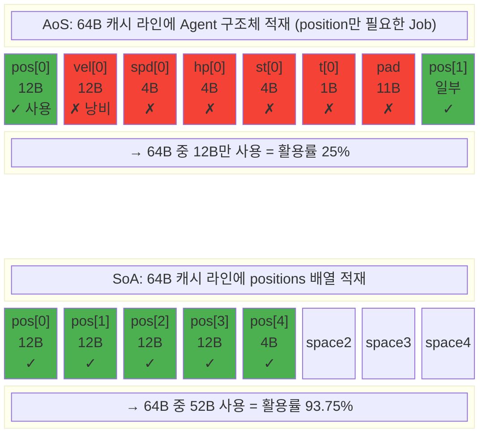
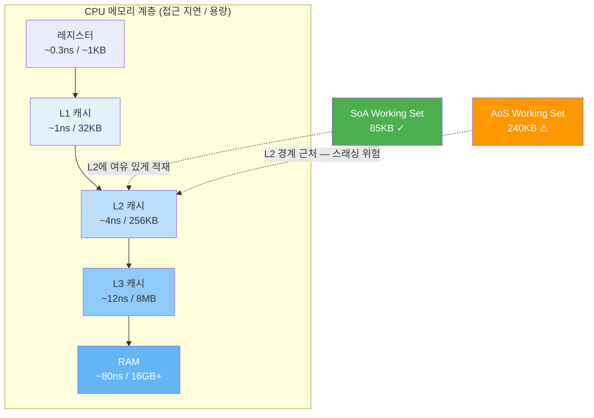
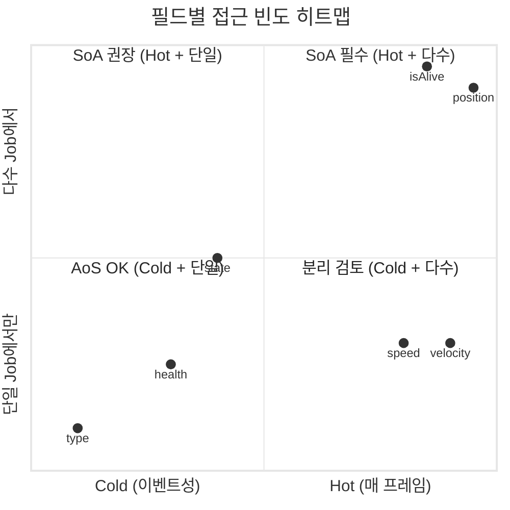
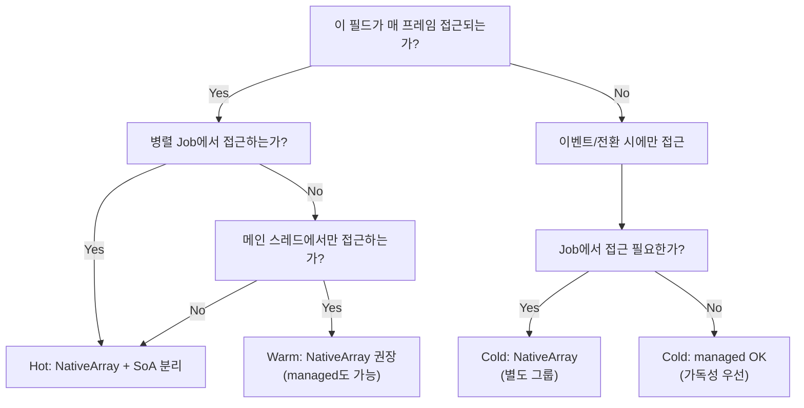
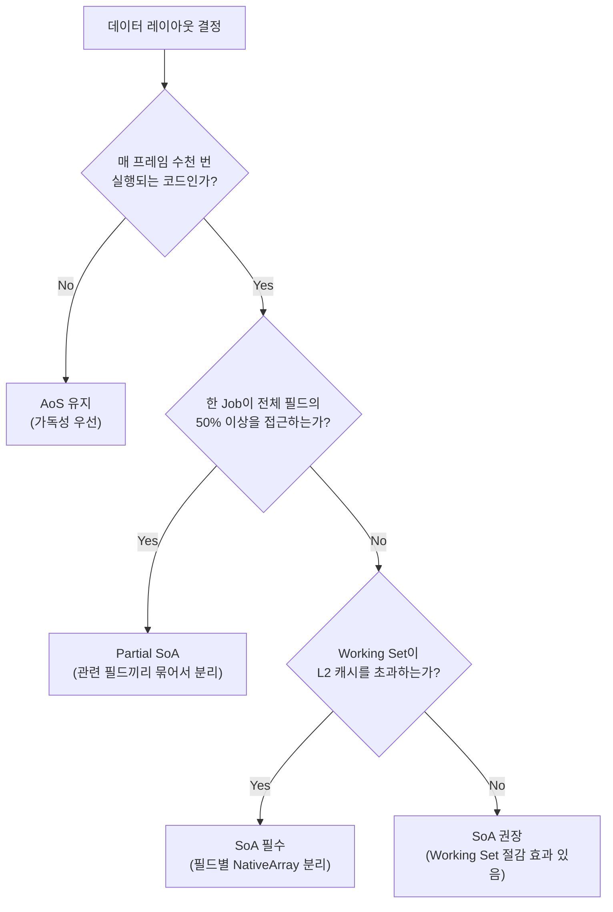

## 서론

[이전 포스트](/posts/UnityJobSystemBurst/)에서 Unity Job System과 Burst Compiler의 원리를 다뤘다. Part 4에서 캐시 계층, AoS vs SoA의 기본 개념, 메모리 정렬과 SIMD의 관계를 살펴봤는데 — **SoA가 빠르다는 것은 확인했다.**

하지만 몇 가지 질문이 남아있다:
- **왜** 빠른가? 캐시 라인 단위의 동작을 수학적으로 분석할 수 있는가?
- 기존 OOP 코드를 **어떻게** SoA로 변환하는가?
- **언제** SoA를 쓰지 말아야 하는가?

이 포스트에서는 이 질문들에 답한다. SoA/AoS는 단순한 배열 배치 기법이 아니라, **데이터 지향 설계(Data-Oriented Design)** 라는 패러다임의 일부다. 패러다임 자체를 이해해야 올바른 판단을 내릴 수 있다.

> 캐시 계층 구조, 캐시 라인(64바이트), False Sharing, NativeArray 내부 구조 등 기초 개념은 [Job System 포스트 Part 4](/posts/UnityJobSystemBurst/#part-4-메모리-계층과-soa-레이아웃)에서 다뤘으므로 여기서는 반복하지 않는다. 해당 섹션을 먼저 읽고 오는 것을 권장한다.

---

## Part 1: 데이터 지향 설계(DOD) 철학

### OOP에서 DOD로: 패러다임 전환

대부분의 개발자가 배우는 첫 번째 설계 패러다임은 **객체 지향 프로그래밍(OOP)**이다. OOP의 핵심 질문은 이것이다:

> "이 **객체**가 무엇을 **하는가**?"

적(Enemy)을 설계한다면, 자연스럽게 이렇게 생각한다:

```csharp
// OOP: 적의 "행위"를 중심으로 설계
abstract class Enemy : MonoBehaviour
{
    protected float health;
    protected float speed;
    protected Vector3 velocity;

    public abstract void UpdateAI();
    public virtual void TakeDamage(float amount) { health -= amount; }
    public virtual void Move() { transform.position += velocity * Time.deltaTime; }
}

class Walker : Enemy
{
    public override void UpdateAI() { /* 걷기 AI */ }
}

class Runner : Enemy
{
    public override void UpdateAI() { /* 빠른 추격 AI */ }
    public override void Move() { /* 더 빠르게 이동 */ }
}
```

이 설계는 직관적이다. "Walker는 Enemy이고, Runner도 Enemy이다." 현실 세계의 분류 체계를 그대로 코드로 옮긴다.

**문제는 성능이다.** 5,000마리의 적이 있을 때:

```
메모리 배치 (OOP):
  Walker#0 → 힙 주소 0x10000 [vtable|health|speed|vel|transform_ptr|...]
  Runner#0 → 힙 주소 0x50000 [vtable|health|speed|vel|transform_ptr|...]
  Walker#1 → 힙 주소 0x30000 [vtable|health|speed|vel|transform_ptr|...]
  Runner#1 → 힙 주소 0x80000 [vtable|health|speed|vel|transform_ptr|...]
  ...
  → 5,000개 객체가 힙 전체에 흩어져 있음
  → 매 프레임 5,000번의 가상 함수 호출 (vtable 간접 참조)
  → 매 접근마다 캐시 미스 가능성
```

**데이터 지향 설계(DOD)**는 완전히 다른 질문에서 시작한다:

> "이 시스템이 매 프레임 **어떤 데이터를 어떻게 변환**하는가?"

```csharp
// DOD: "데이터 변환"을 중심으로 설계
// 데이터: 연속 배열
NativeArray<float3> positions;   // 5,000개 위치 — 연속 메모리
NativeArray<float3> velocities;  // 5,000개 속도 — 연속 메모리
NativeArray<float>  speeds;      // 5,000개 이동속도 — 연속 메모리

// 변환: Job struct
[BurstCompile]
struct MoveJob : IJobParallelFor
{
    [ReadOnly] public NativeArray<float3> Velocities;
    [ReadOnly] public NativeArray<float> Speeds;
    public NativeArray<float3> Positions;
    public float DeltaTime;

    public void Execute(int i)
    {
        Positions[i] += Velocities[i] * Speeds[i] * DeltaTime;
    }
}
```

OOP에서는 "Enemy가 Move()를 호출한다"고 생각하지만, DOD에서는 "MoveJob이 positions 배열을 velocities 배열로 변환한다"고 생각한다.

| 관점 | OOP | DOD |
|------|-----|-----|
| 설계 단위 | 객체 (Enemy, Walker) | 데이터 배열 + 변환 함수 (Job) |
| 메모리 | 객체별 힙 할당, 흩어짐 | 필드별 연속 배열 |
| 다형성 | 가상 함수 (vtable) | 데이터 값으로 분기 (byte type) |
| 캐시 | 포인터 체이싱 → 미스 빈발 | 순차 접근 → 프리페처 최적 |
| 병렬화 | 어려움 (공유 상태) | 자연스러움 (배열 분할) |

### Mike Acton의 3가지 원칙

2014년 CppCon에서 Insomniac Games의 Mike Acton이 발표한 **"Data-Oriented Design and C++"** 는 DOD를 정립한 핵심 강연이다. 그가 지적한 "3가지 거짓말(lies)"은 다음과 같다:

#### Lie 1: "소프트웨어는 플랫폼이다"

> 소프트웨어는 플랫폼이 아니다. **하드웨어가 플랫폼이다.**

프로그래머는 흔히 "C# 위에서 개발한다" 또는 "Unity 위에서 개발한다"고 생각한다. 하지만 코드가 실제로 돌아가는 곳은 **CPU + 캐시 + RAM**이다.

```
개발자의 인식:        실제:
  C# 코드              CPU 파이프라인
    ↓                    ↓
  Unity API           레지스터 → L1 → L2 → L3 → RAM
    ↓                    ↓
  "잘 돌아가겠지"      캐시 미스 80ns × 5,000회 = 0.4ms
```

Unity의 `foreach`로 5,000개 MonoBehaviour의 `Update()`를 호출하면, C# 차원에서는 깔끔한 코드지만, **하드웨어 차원에서는 5,000번의 포인터 체이싱**이다.

#### Lie 2: "코드가 데이터보다 중요하다"

> 코드의 목적은 **데이터를 변환하는 것**이다. 데이터의 형태가 코드를 결정한다.

OOP에서는 클래스 계층 구조를 먼저 설계하고, 데이터를 거기에 끼워 맞춘다. DOD에서는 반대다:

1. **입력 데이터**는 무엇인가? (positions, velocities)
2. **출력 데이터**는 무엇인가? (새로운 positions)
3. 변환은 **어떤 패턴**인가? (1:1 매핑, 병렬 가능)
4. 그러면 코드는 `IJobParallelFor`가 된다.

데이터의 접근 패턴이 결정되면, 코드 구조는 자동으로 따라온다.

#### Lie 3: "세계를 모델링한 코드가 좋은 코드다"

> "Walker는 Enemy의 일종이다"는 **현실의 분류 체계**이지, **데이터 변환의 최적 구조**가 아니다.

Walker와 Runner의 이동 로직이 다른 것은 `speed` 값이 다른 것뿐이다. 가상 함수와 상속 계층 전체가 하나의 `float` 값 차이를 표현하기 위해 존재한다.

```csharp
// OOP: 상속으로 "종류"를 표현
class Walker : Enemy { speed = 2f; }
class Runner : Enemy { speed = 5f; }

// DOD: 데이터 값으로 "종류"를 표현
NativeArray<float> speeds;  // speeds[i] = 2f or 5f
// → 가상 함수 호출 0회, 캐시 미스 0회
```

### 게임 개발이 DOD에 적합한 이유

모든 소프트웨어가 DOD의 이점을 동등하게 누리는 것은 아니다. 게임 개발이 특히 적합한 이유는 세 가지다:

1. **수천 개의 동종 엔티티**: 총알, 적, 파티클 — 같은 구조의 데이터가 수천~수만 개. 배열로 표현하기에 완벽한 조건.

2. **엄격한 프레임 예산**: 60fps = 프레임당 16.6ms. 매 프레임 모든 엔티티를 처리해야 하므로, 루프의 효율이 곧 프레임 예산.

3. **예측 가능한 변환 패턴**: "모든 적의 위치를 속도에 따라 갱신한다", "모든 총알의 충돌을 검사한다" — 입력/출력이 명확한 배치 처리.

### DOD의 역사: 하드웨어가 강제한 패러다임

DOD는 학계에서 탄생한 이론이 아니라, **게임 하드웨어의 제약에서 생존하기 위해** 실전에서 발전한 패러다임이다.

#### PS3 Cell Broadband Engine (2006)

DOD가 게임 업계에서 본격적으로 주목받은 계기는 **PlayStation 3의 Cell 프로세서**다.

```
Cell 아키텍처:
  PPE (PowerPC) — 범용 코어 1개
  SPE (Synergistic Processing Element) × 6개 (게임용)
    └── 각 SPE의 Local Store: 256 KB
    └── 메인 RAM 직접 접근 불가!
    └── DMA로 데이터를 Local Store에 명시적으로 전송해야 함
```

256KB의 Local Store에 게임 데이터를 밀어 넣으려면 **Working Set 크기를 정밀하게 관리**해야 했다. OOP의 거대한 객체를 통째로 DMA하면 256KB를 순식간에 채운다. 필요한 필드만 추려서 연속 배열(SoA)로 DMA하는 것이 유일한 해법이었다.

> Naughty Dog의 **Jason Gregory**는 PS3에서 The Last of Us를 개발하며 이 경험을 체계화했다. 그의 저서 **"Game Engine Architecture"** (Chapter 16)에서 데이터 지향 런타임 시스템 설계를 상세히 다룬다.

#### Insomniac Games와 Mike Acton (2004~2014)

Insomniac Games(Ratchet & Clank, Resistance 시리즈)의 엔진 디렉터 Mike Acton은 PS2/PS3 시대부터 DOD를 실전에 적용했다.

- 2004: GDC에서 "� Pitfalls of Object Oriented Programming" 주제로 DOD 사례 발표
- 2014: CppCon에서 **"Data-Oriented Design and C++"** 발표 — DOD를 C++ 커뮤니티 전체에 알림
- 2017: Unity Technologies에 합류하여 **DOTS(Data-Oriented Technology Stack)** 개발 주도

#### Unity DOTS (2018~)

Mike Acton이 Unity에 합류한 후, Unity는 게임 엔진 최초로 **DOD를 공식 프레임워크**로 제공했다:

- **Entity Component System (ECS)**: Archetype 기반 SoA 레이아웃 자동화
- **Job System**: 멀티코어 배치 처리
- **Burst Compiler**: LLVM 기반 네이티브 코드 생성

이것이 우리가 이 시리즈에서 다루는 `NativeArray` + `IJobParallelFor` + `[BurstCompile]` 조합의 배경이다.

```
DOD 타임라인:
  2004  Mike Acton, GDC에서 DOD 사례 발표
  2006  PS3 Cell — 256KB Local Store가 DOD를 강제
  2007  Ulrich Drepper — "What Every Programmer Should Know About Memory"
  2009  Noel Llopis — "Data-Oriented Design" 아티클
  2014  Mike Acton — CppCon "Data-Oriented Design and C++"
  2017  Mike Acton → Unity 합류
  2018  Unity DOTS 프리뷰
  2023  Unity ECS 1.0 정식 출시
```

> DOD는 "최신 트렌드"가 아니라, **20년간 게임 하드웨어와 함께 진화한 실전 철학**이다. PS3의 256KB 제약은 사라졌지만, 캐시 효율의 중요성은 CPU 코어 수와 메모리 레이턴시 격차가 커질수록 더 중요해지고 있다.

---

## Part 2: 메모리 레이아웃 심층 분석

이전 포스트에서 캐시 계층과 캐시 라인의 기본 개념을 다뤘다. 여기서는 한 단계 더 들어가서, **정량적으로** 메모리 레이아웃의 효율을 분석하는 방법을 다룬다.

### Stride: 캐시 효율의 핵심 지표

**Stride(보폭)**란 순회(iteration) 시 **연속된 두 접근 사이의 바이트 거리**다.

배열을 순회할 때, CPU는 매 접근마다 `stride` 바이트만큼 앞으로 이동한다. 이 값이 캐시 라인(64바이트)에 비해 얼마나 큰지가 캐시 효율을 결정한다.

#### AoS의 Stride

```csharp
struct Agent  // 48 bytes
{
    public float3 position;   // 12B (offset 0)
    public float3 velocity;   // 12B (offset 12)
    public float  speed;      // 4B  (offset 24)
    public float  health;     // 4B  (offset 28)
    public int    state;      // 4B  (offset 32)
    public byte   type;       // 1B  (offset 36)
    // padding: 11B → 총 48B (또는 컴파일러에 따라 40B)
}
NativeArray<Agent> agents; // 5,000개
```

`position`만 순회하는 Job을 생각해보자:

```
메모리 배치 (AoS):
Stride = sizeof(Agent) = 48 bytes

agents[0]: [pos(12B)|vel(12B)|spd(4B)|hp(4B)|st(4B)|type(1B)|pad(11B)]
                                                                        ↓ 48B skip
agents[1]: [pos(12B)|vel(12B)|spd(4B)|hp(4B)|st(4B)|type(1B)|pad(11B)]
                                                                        ↓ 48B skip
agents[2]: [pos(12B)|vel(12B)|spd(4B)|hp(4B)|st(4B)|type(1B)|pad(11B)]

캐시 라인 (64B)에 Agent가 1.33개 → position은 1~2개만 적재
→ 나머지 36B(vel, spd, hp, st, type, pad)는 이 Job에서 쓰지 않지만 캐시에 올라옴
```

#### SoA의 Stride

```csharp
NativeArray<float3> positions;   // Stride = 12 bytes
NativeArray<float3> velocities;
NativeArray<float>  speeds;
NativeArray<float>  healths;
```

```
메모리 배치 (SoA):
Stride = sizeof(float3) = 12 bytes

positions: [pos0(12B)|pos1(12B)|pos2(12B)|pos3(12B)|pos4(12B)|pos5(12B)|...]
           ←────────── 캐시 라인 (64B): position 5개 적재 ──────────→

→ 캐시 라인의 모든 바이트가 실제 사용되는 데이터
→ 불필요한 데이터 로드 0
```

### 캐시 활용률 공식

캐시 라인에 로드된 데이터 중 실제로 사용하는 비율을 **캐시 활용률(Cache Utilization)**이라 하자:

$$\text{Cache Utilization} = \frac{\text{Useful Bytes per Cache Line}}{\text{Cache Line Size}} = \frac{\left\lfloor \frac{64}{\text{Stride}} \right\rfloor \times \text{Element Size}}{64}$$

| 레이아웃 | Stride | Element Size | 캐시 라인당 적재 | 활용률 |
|----------|--------|-------------|-----------------|--------|
| AoS (Agent 전체 중 position만 접근) | 48B | 12B | 1개 | **25%** |
| SoA (positions 배열) | 12B | 12B | 5개 | **93.75%** |
| SoA (speeds 배열, float) | 4B | 4B | 16개 | **100%** |
| SoA (isAlive 배열, byte) | 1B | 1B | 64개 | **100%** |

AoS에서 position만 접근하면 **캐시 대역폭의 75%를 낭비**한다. SoA에서는 거의 100%를 활용한다.

다음 다이어그램은 같은 64바이트 캐시 라인에 AoS와 SoA가 어떻게 적재되는지를 비교한다:



이것이 "같은 연산, 같은 Burst 컴파일인데 레이아웃만 다르면 성능이 수 배 차이나는" 근본 원인이다.

### Working Set 크기 계산

**Working Set**이란 하나의 Job이 전체 실행 동안 접근하는 **총 메모리 크기**다.

$$\text{Working Set} = \sum_{\text{array}} (\text{element count} \times \text{element size})$$

Working Set이 어느 캐시 계층에 들어가느냐에 따라 성능이 결정된다:

```csharp
// 예시: 5,000 에이전트의 거리 계산 Job
[BurstCompile]
struct DistanceJob : IJobParallelFor
{
    [ReadOnly] public NativeArray<float3> Positions;  // 5,000 × 12B = 60 KB
    [ReadOnly] public NativeArray<byte>   IsAlive;    // 5,000 × 1B  =  5 KB
    [WriteOnly] public NativeArray<float> Distances;  // 5,000 × 4B  = 20 KB
    [ReadOnly] public float3 TargetPos;               // 12B

    public void Execute(int i)
    {
        if (IsAlive[i] == 0) { Distances[i] = float.MaxValue; return; }
        Distances[i] = math.distance(Positions[i], TargetPos);
    }
}
// Working Set = 60 + 5 + 20 = 85 KB
```

| Working Set 크기 | 적재 캐시 | 기대 성능 |
|-------------------|-----------|-----------|
| < 32 KB | L1 캐시 | 최고 (~1ns/접근) |
| 32 KB ~ 256 KB | L2 캐시 | 양호 (~4ns/접근) |
| 256 KB ~ 8 MB | L3 캐시 | 보통 (~12ns/접근) |
| > 8 MB | RAM | 느림 (~80ns/접근) |

다음 다이어그램은 캐시 계층별 용량과 AoS/SoA Working Set이 어디에 위치하는지를 보여준다:



위 DistanceJob의 Working Set은 85KB — **L2 캐시에 완전히 적재**된다. 만약 AoS 방식으로 같은 데이터를 처리하면:

```
AoS Working Set = 5,000 × 48B(Agent struct) = 240 KB
→ L2 경계 (256KB) 근처 — 캐시 스레싱 위험
→ 접근하는 필드는 position + isAlive 뿐인데, velocity/speed/health/state/type도 함께 로드
```

**SoA는 Working Set 자체를 줄여서 더 작은 캐시 계층에 들어가게 만든다.** 이것이 단순한 "캐시 라인 효율" 이상의 효과다.

#### Working Set 계산 실전 팁

1. **읽기 배열 + 쓰기 배열 모두 합산**한다. `[ReadOnly]`든 `[WriteOnly]`든 메모리에 올라가는 건 같다.
2. **스칼라 파라미터**(float, int 등)는 레지스터에 들어가므로 무시해도 된다.
3. **IJobParallelFor**는 전체 배열을 배치 단위로 처리하므로, 한 번에 활성화되는 Working Set은 `batchCount × elementSize × arrayCount`에 가깝다. 하지만 프리페처가 미리 로드하므로, 전체 배열 크기로 보수적으로 계산하는 것이 안전하다.

### 하드웨어 프리페처: SoA가 빠른 진짜 이유

캐시 활용률은 "낭비되는 데이터가 얼마인가"를 설명한다. 하지만 SoA가 빠른 이유의 **나머지 절반**은 **하드웨어 프리페처(Hardware Prefetcher)**에 있다.

#### 프리페처의 동작 원리

현대 CPU에는 여러 종류의 프리페처가 내장되어 있다. 핵심은 **Stride Prefetcher**다:

```
Stride Prefetcher 동작:
  1. CPU가 주소 A를 접근
  2. 다음에 주소 A+S를 접근 (S = stride)
  3. 또 다음에 주소 A+2S를 접근
  4. 프리페처: "패턴 감지! stride = S"
  5. → A+3S, A+4S, A+5S를 미리 L1/L2에 로드
  6. CPU가 A+3S에 도달했을 때 이미 캐시에 있음 → 미스 0!
```

Intel CPU의 경우, **2~3회의 접근**만으로 stride를 감지하고, 이후 접근에서는 **캐시 미스 지연을 완전히 은닉**한다.

다음 다이어그램은 SoA 순차 접근에서 프리페처가 동작하는 타임라인이다:

```mermaid
gantt
    title SoA 순차 접근: Stride Prefetcher 타임라인
    dateFormat X
    axisFormat %s

    section CPU 접근
    pos[0] 접근 (캐시 미스)       :crit, a0, 0, 80
    pos[1] 접근 (캐시 히트)       :done, a1, 80, 81
    pos[2] 접근 (캐시 미스)       :crit, a2, 81, 161
    pos[3] 접근 — stride 감지!    :done, a3, 161, 162
    pos[4] 접근 (프리페치 히트)   :done, a4, 162, 163
    pos[5~4999] 모두 히트         :done, a5, 163, 200

    section Prefetcher
    패턴 학습 중                   :active, p0, 0, 161
    stride=12B 감지 완료           :milestone, p1, 161, 161
    pos[4] 미리 로드               :p2, 130, 161
    pos[5,6,7...] 연속 프리페치    :p3, 161, 200
```



> Intel Optimization Manual Section 2.5.5.4: L2 Stride Prefetcher는 최대 2KB까지의 stride를 감지한다. L1 Data Prefetcher는 캐시 라인 내 순차 접근을 감지한다.

#### SoA vs AoS에서의 프리페처 효과

```
SoA (stride = 12B, float3):
  접근: pos[0] → pos[1] → pos[2] → ...
  주소: 0x1000 → 0x100C → 0x1018 → ...
  stride = 12B (일정) ✓
  
  → 프리페처가 2번째 접근에서 즉시 감지
  → 3번째 접근부터 캐시 미스 거의 0
  → 5,000개 순회 중 실제 캐시 미스: 최초 2~3회만

AoS (stride = 48B, Agent 전체 중 position만):
  접근: agents[0].pos → agents[1].pos → agents[2].pos → ...
  주소: 0x2000 → 0x2030 → 0x2060 → ...
  stride = 48B (일정) ✓ — 프리페처 감지 자체는 가능!
  
  하지만:
  → 48B stride = 캐시 라인(64B)을 거의 매번 넘김
  → 프리페치한 캐시 라인 중 12B만 사용 (나머지 36B 낭비)
  → 프리페치가 "쓸모없는 데이터"를 캐시에 채워서 다른 유용한 데이터를 밀어냄
```

**핵심 인사이트**: 프리페처는 AoS에서도 stride를 감지할 수 있다. 하지만 **프리페치한 데이터의 활용률**이 SoA와 AoS에서 크게 다르다. 프리페처가 열심히 일해도, 가져온 데이터를 25%만 쓴다면 캐시 오염(cache pollution)이 발생한다.

> Srinath et al.의 "Feedback Directed Prefetching" (HPCA 2007)에서는 프리페처의 **정확도(accuracy)**와 **커버리지(coverage)**를 구분한다. AoS의 문제는 커버리지가 아니라 정확도(가져온 데이터 중 실제 사용 비율)가 낮다는 것이다.

#### 프리페처가 실패하는 경우

프리페처는 **불규칙 접근 패턴**에서는 무력하다:

```csharp
// 프리페처 실패 예: 간접 인덱싱
NativeArray<int> sortedIndices;  // [42, 7, 3891, 102, ...]
for (int i = 0; i < count; i++)
{
    int idx = sortedIndices[i];
    float3 pos = positions[idx];  // ← 랜덤 접근! stride 불규칙
    // → 프리페처 무력화 → 매 접근마다 캐시 미스 가능
}
```

이런 경우에는 **소프트웨어 프리페치** 힌트를 사용하거나, 인덱스를 정렬하여 접근 지역성을 높이는 방법이 있다.

### 메모리 대역폭: 캐시 너머의 병목

캐시 효율과 프리페처를 논했지만, 한 가지 관점이 더 있다. **메모리 대역폭(bandwidth)**이다.

현대 CPU에서 많은 배치 처리 루프는 **compute-bound(연산 병목)**가 아니라 **memory-bound(메모리 병목)**이다. 즉, 연산 자체는 빠르지만 데이터를 가져오는 속도가 병목이다.

#### Roofline 모델로 보는 SoA의 이점

**Roofline 모델**(Williams et al., 2009)은 프로그램이 compute-bound인지 memory-bound인지를 시각적으로 판단하는 프레임워크다.

$$\text{Operational Intensity} = \frac{\text{FLOP}}{\text{Bytes Transferred}}$$

| 항목 | AoS | SoA |
|------|-----|-----|
| 연산 (distance 계산) | 7 FLOP/엔티티 | 7 FLOP/엔티티 (동일) |
| 전송 바이트 | 48B/엔티티 (Agent 전체) | 16B/엔티티 (pos 12B + dist 4B) |
| Operational Intensity | 7/48 = **0.146** | 7/16 = **0.438** |
| 상태 | 극도의 memory-bound | 덜 memory-bound |

```
DDR4-3200 대역폭: ~51.2 GB/s (이론), 실제 ~25 GB/s

AoS: 5,000 × 48B = 240KB 전송 → 240KB / 25GB/s = 0.0096ms
SoA: 5,000 × 16B = 80KB 전송  → 80KB / 25GB/s  = 0.0032ms

→ SoA는 메모리 대역폭 소비가 1/3
→ 같은 대역폭으로 3배 더 많은 엔티티를 처리 가능
```

대역폭 관점에서 보면, **AoS의 "쓰지 않는 필드"는 단순한 캐시 낭비가 아니라 메모리 버스의 대역폭을 소비하는 실질적인 비용**이다. Working Set이 캐시를 초과하면 이 비용이 직접적으로 성능을 결정한다.

> 게임에서 수만 개의 엔티티를 처리하는 루프는 대부분 memory-bound다. Roofline 모델을 그려보면, SoA 전환은 **"같은 하드웨어에서 operational intensity를 높여 memory-bound 영역에서 탈출하는 것"**으로 이해할 수 있다.

### Power-of-2 Stride 함정

stride가 캐시 라인 크기의 정확한 배수일 때 주의가 필요하다.

현대 CPU의 L1 캐시는 **set-associative** 구조다. 캐시를 여러 "set"으로 나누고, 각 메모리 주소는 특정 set에만 매핑된다.

```
Stride = 64B (캐시 라인 크기의 1배):
  agents[0] → Set 0
  agents[1] → Set 0  ← 같은 set!
  agents[2] → Set 0  ← 또 같은 set!
  ...
  → 한 set에 접근이 집중 → 다른 set은 비어 있는데 이 set만 넘침
  → "캐시 스래싱(thrashing)" 발생
```

이것은 stride가 정확히 64, 128, 256, 512 등 2의 거듭제곱일 때 발생할 수 있다.

**완화 방법:**
- struct 크기가 정확히 64B의 배수가 되지 않도록 패딩을 추가하거나 제거
- 실제로 문제가 되는 경우는 드물지만, 성능이 이론치보다 낮을 때 의심해볼 항목

### TLB 미스: SoA의 숨겨진 비용

캐시 효율만 보면 SoA가 압도적으로 유리하지만, **TLB(Translation Lookaside Buffer)** 관점에서는 SoA가 불리해질 수 있다.

#### TLB란?

가상 메모리 시스템에서 CPU는 **가상 주소 → 물리 주소** 변환을 매 메모리 접근마다 수행한다. 이 변환을 캐싱하는 것이 TLB다.

```
가상 주소 접근 → TLB 조회
  → Hit: 물리 주소 즉시 획득 (~1 cycle)
  → Miss: 페이지 테이블 워크 (~100 cycles, 최악 ~1000 cycles)
```

L1 DTLB는 일반적으로 **64~128 엔트리**를 가지며, 각 엔트리가 4KB 페이지를 커버한다. 즉 TLB로 커버 가능한 범위는 `128 × 4KB = 512KB` 정도다.

#### SoA가 TLB에 불리한 이유

```
AoS — 배열 1개:
  NativeArray<Agent> agents → 연속 메모리 페이지
  → TLB 엔트리 1개로 4KB(~85 에이전트) 커버
  → 순차 접근이므로 페이지도 순차 → TLB 미스 최소

SoA — 배열 8개:
  positions[]     → 페이지 그룹 A
  velocities[]    → 페이지 그룹 B
  speeds[]        → 페이지 그룹 C
  healths[]       → 페이지 그룹 D
  isAlive[]       → 페이지 그룹 E
  states[]        → 페이지 그룹 F
  cooldowns[]     → 페이지 그룹 G
  types[]         → 페이지 그룹 H
  → 한 Job이 4개 배열을 접근하면 → 4개 페이지 그룹 동시 접근
  → TLB 엔트리 소비 4배
```

**5,000 에이전트, MoveJob(4개 배열):**

```
각 배열의 메모리 크기:
  positions:  5,000 × 12B = 60KB → 15 페이지
  velocities: 5,000 × 12B = 60KB → 15 페이지
  speeds:     5,000 × 4B  = 20KB → 5 페이지
  isAlive:    5,000 × 1B  = 5KB  → 2 페이지
  
  총 TLB 엔트리 필요: 37개 (L1 DTLB의 ~29%)
  → 5,000개에서는 문제없음

하지만 배열이 20개이고 엔티티가 50,000개라면:
  → 수백 개의 TLB 엔트리 필요 → TLB 스래싱 위험
```

#### 완화 방법

1. **Partial SoA**: 항상 함께 접근되는 필드를 struct로 묶어 배열 수를 줄인다 — 이것이 Partial SoA의 **하드웨어적 근거**
2. **Huge Pages (2MB)**: OS 레벨에서 2MB 페이지를 사용하면 TLB 커버리지가 512배 증가
3. **배열 수 관리**: 한 Job이 접근하는 배열을 5~6개 이하로 유지

> Ulrich Drepper의 "What Every Programmer Should Know About Memory" Section 4에서 TLB 미스의 영향을 상세히 분석한다. 특히 Figure 4.5에서 데이터 크기가 TLB 커버리지를 초과할 때 성능이 급락하는 그래프를 보여주는데, 이것이 SoA에서 배열을 과도하게 분리할 때 발생할 수 있는 현상이다.

### C# 구조체 메모리 레이아웃

AoS의 stride를 정확히 계산하려면 C#이 struct를 메모리에 어떻게 배치하는지 알아야 한다.

#### StructLayout과 패딩

C#의 struct는 기본적으로 **Sequential 레이아웃**을 사용한다. 각 필드는 **자신의 크기에 맞춰 정렬(alignment)**된다:

```
정렬 규칙:
  byte    → 1바이트 정렬 (아무 주소에 배치 가능)
  short   → 2바이트 정렬 (짝수 주소)
  int     → 4바이트 정렬 (4의 배수 주소)
  float   → 4바이트 정렬
  float3  → 4바이트 정렬 (float × 3이므로 float의 정렬을 따름)
  double  → 8바이트 정렬
  float4  → 16바이트 정렬 (SIMD 최적화를 위해 Burst가 강제)
```

#### 예시 1: 패딩 없는 이상적인 구조체

```csharp
struct GoodLayout  // 28 bytes (패딩 없음)
{
    public float3 position;  // offset 0,  12B
    public float  speed;     // offset 12, 4B
    public float  health;    // offset 16, 4B
    public int    state;     // offset 20, 4B
    public int    type;      // offset 24, 4B
}
```

```
바이트 맵 (4B 단위):
[pos.x ][pos.y ][pos.z ][speed ]
[health][state ][type  ]
총 28B, 패딩 0B
```

모든 필드가 4바이트 정렬이므로 패딩이 발생하지 않는다.

#### 예시 2: 필드 순서에 따른 패딩 발생

```csharp
struct BadLayout  // 32 bytes! (패딩 4B)
{
    public float3 position;  // offset 0,  12B
    public byte   isAlive;   // offset 12, 1B
    // ← 3B padding (다음 float이 4의 배수 주소에 와야 하므로)
    public float  speed;     // offset 16, 4B
    public float  health;    // offset 20, 4B
    public int    state;     // offset 24, 4B
    public byte   type;      // offset 28, 1B
    // ← 3B padding (struct 전체 크기가 최대 정렬의 배수여야 하므로)
}
```

```
바이트 맵:
[pos.x ][pos.y ][pos.z ][a|pad ]  ← byte 뒤 3B 패딩
[speed ][health][state ][t|pad ]  ← byte 뒤 3B 패딩
총 32B, 패딩 6B (18.75% 낭비)
```

#### 예시 3: 필드 재배치로 패딩 제거

```csharp
struct OptimizedLayout  // 28 bytes (패딩 0B)
{
    public float3 position;  // offset 0,  12B
    public float  speed;     // offset 12, 4B
    public float  health;    // offset 16, 4B
    public int    state;     // offset 20, 4B
    public byte   isAlive;   // offset 24, 1B
    public byte   type;      // offset 25, 1B
    // ← 2B padding (struct 크기를 4의 배수로 맞춤)
}
```

```
바이트 맵:
[pos.x ][pos.y ][pos.z ][speed ]
[health][state ][a|t|pp]
총 28B, 패딩 2B (7% 낭비) — BadLayout 대비 4B 절약
```

**규칙: 큰 필드를 앞에, 작은 필드를 뒤에 배치하면 패딩이 최소화된다.**

#### sizeof 비교

```csharp
// Unity 에디터에서 확인
Debug.Log(UnsafeUtility.SizeOf<GoodLayout>());       // 28
Debug.Log(UnsafeUtility.SizeOf<BadLayout>());         // 32
Debug.Log(UnsafeUtility.SizeOf<OptimizedLayout>());   // 28
```

`UnsafeUtility.SizeOf<T>()`가 실제 메모리 크기를 반환한다. `Marshal.SizeOf()`는 interop 마샬링 크기이므로 다를 수 있다. Job/Burst 컨텍스트에서는 항상 `UnsafeUtility.SizeOf<T>()`를 사용한다.

#### Burst의 레이아웃 보장

Burst 컴파일러는 struct를 **항상 Sequential 레이아웃**으로 처리한다. CLR의 `StructLayout.Auto`(필드 재배치 허용)와 달리, Burst는 필드 순서를 그대로 유지한다. 따라서:

- Burst Job에서 사용하는 struct는 **필드 순서가 곧 메모리 순서**
- 패딩을 줄이려면 **코드 레벨에서 필드를 직접 정렬**해야 한다
- Burst는 추가로 16바이트 정렬을 활용하여 SIMD aligned load/store를 생성한다

#### 패딩이 AoS의 stride를 키운다

```
패딩 없는 struct (28B) × 5,000 = 140 KB → L2에 적재
패딩 있는 struct (32B) × 5,000 = 160 KB → L2에 적재 (여유 감소)
패딩 많은 struct (48B) × 5,000 = 240 KB → L2 경계 근처 (위험)
```

4바이트의 패딩 차이가 5,000개면 **20KB**의 메모리 낭비가 된다. 이것이 struct 하나의 크기 문제가 아니라, **배열 전체의 캐시 적재 가능 여부**에 영향을 미치는 이유다.

---

## Part 3: AoS → SoA 변환 방법론

### Step-by-step 프로세스

기존 AoS 코드를 SoA로 변환하는 체계적인 5단계:

#### Step 1: 접근 패턴 분석

각 시스템(Job)이 어떤 필드를 읽고 쓰는지 표로 정리한다.

```csharp
// 예시: 가상의 AoS Agent 구조체
struct Agent
{
    public float3 position;   // Movement, Distance, Rendering에서 사용
    public float3 velocity;   // Movement에서 사용
    public float  speed;      // Movement에서 사용
    public float  health;     // Combat에서 사용
    public byte   isAlive;    // 모든 Job에서 사용
    public byte   state;      // AI, Combat에서 사용
    public byte   type;       // Spawn 시에만 사용
}
```

접근 패턴 표:

| Job | 읽기 필드 | 쓰기 필드 |
|-----|-----------|-----------|
| MoveJob | position, velocity, speed, isAlive | position |
| DistanceJob | position, isAlive | (별도 distances 배열) |
| AttackJob | distances, isAlive, state | state, attackCooldown |
| RenderJob | position, isAlive | (별도 matrices 배열) |

**핵심 관찰**: 모든 Job이 Agent의 7개 필드를 전부 사용하는 것이 아니다. MoveJob은 4개, DistanceJob은 2개만 필요하다.

이 접근 패턴을 히트맵으로 시각화하면 **어떤 필드가 Hot이고 어떤 필드가 Cold인지** 한눈에 보인다:



#### Step 2: 데이터 그룹 식별

접근 패턴이 유사한 필드를 그룹으로 묶는다:

```
Movement 그룹: position, velocity, speed  (MoveJob이 매 프레임 접근)
State 그룹:    isAlive, state             (여러 Job에서 읽기)
Combat 그룹:   health, attackCooldown     (CombatJob에서만 접근)
Identity 그룹: type                        (스폰 시에만 접근, 이후 읽기 전용)
```

#### Step 3: NativeArray 분리

그룹을 기반으로, 각 필드를 개별 NativeArray로 분리한다:

```csharp
// Movement
NativeArray<float3> positions;
NativeArray<float3> velocities;
NativeArray<float>  speeds;

// State
NativeArray<byte> isAlive;
NativeArray<byte> states;

// Combat
NativeArray<float> healths;
NativeArray<float> attackCooldowns;

// Identity
NativeArray<byte> types;
```

#### Step 4: Job에서 필요한 배열만 참조

```csharp
[BurstCompile]
struct MoveJob : IJobParallelFor
{
    [ReadOnly] public NativeArray<float3> Velocities;
    [ReadOnly] public NativeArray<float>  Speeds;
    [ReadOnly] public NativeArray<byte>   IsAlive;
    public NativeArray<float3> Positions;
    public float DeltaTime;

    public void Execute(int i)
    {
        if (IsAlive[i] == 0) return;
        Positions[i] += Velocities[i] * Speeds[i] * DeltaTime;
    }
}
// Working Set = 60KB + 20KB + 5KB + 60KB = 145 KB (L2에 여유 있게 적재)
```

AoS 방식이었다면: `5,000 × 48B = 240KB` (Agent 전체를 로드해야 하므로).
SoA 방식에서 MoveJob의 Working Set은 145KB — **40% 절감**.

#### Step 5: 관리 클래스에서 생명주기 통합

분리된 NativeArray들의 할당과 해제를 하나의 클래스에서 관리한다:

```csharp
public class AgentData : IDisposable
{
    public int Capacity { get; }
    public int ActiveCount { get; set; }

    // Movement
    public NativeArray<float3> Positions;
    public NativeArray<float3> Velocities;
    public NativeArray<float>  Speeds;

    // State
    public NativeArray<byte> IsAlive;
    public NativeArray<byte> States;

    // Combat
    public NativeArray<float> Healths;
    public NativeArray<float> AttackCooldowns;

    // Identity
    public NativeArray<byte> Types;

    public AgentData(int capacity)
    {
        Capacity = capacity;
        Positions        = new NativeArray<float3>(capacity, Allocator.Persistent);
        Velocities       = new NativeArray<float3>(capacity, Allocator.Persistent);
        Speeds           = new NativeArray<float>(capacity, Allocator.Persistent);
        IsAlive          = new NativeArray<byte>(capacity, Allocator.Persistent);
        States           = new NativeArray<byte>(capacity, Allocator.Persistent);
        Healths          = new NativeArray<float>(capacity, Allocator.Persistent);
        AttackCooldowns  = new NativeArray<float>(capacity, Allocator.Persistent);
        Types            = new NativeArray<byte>(capacity, Allocator.Persistent);
    }

    public void Dispose()
    {
        if (Positions.IsCreated) Positions.Dispose();
        if (Velocities.IsCreated) Velocities.Dispose();
        if (Speeds.IsCreated) Speeds.Dispose();
        if (IsAlive.IsCreated) IsAlive.Dispose();
        if (States.IsCreated) States.Dispose();
        if (Healths.IsCreated) Healths.Dispose();
        if (AttackCooldowns.IsCreated) AttackCooldowns.Dispose();
        if (Types.IsCreated) Types.Dispose();
    }
}
```

이 패턴이 **DOD의 Flyweight 패턴**이기도 하다. "행위 로직(Job struct)"은 하나만 존재하고, "인스턴스 데이터(NativeArray)"만 N개인 구조다.

### Before/After 메모리 비교

5,000 에이전트, MoveJob 실행 기준:

| 항목 | AoS | SoA |
|------|-----|-----|
| 접근 메모리 | 5,000 × 48B = **240 KB** | pos(60) + vel(60) + spd(20) + alive(5) = **145 KB** |
| 캐시 활용률 (position 접근 시) | 25% | 93.75% |
| 캐시 계층 | L2 경계 (스레싱 위험) | L2 안정 |
| 불필요한 데이터 로드 | health, state, type, padding | 0 |

### Partial SoA: 관련 필드 묶기

SoA가 "모든 필드를 개별 배열로 분리하라"는 의미는 아니다. **항상 함께 접근되는 필드**는 하나의 struct로 묶어도 된다.

```csharp
// Bad: float3의 x, y, z를 개별 배열로 분리
NativeArray<float> positionsX;  // 의미 없는 분리
NativeArray<float> positionsY;  // float3의 x,y,z는 항상 함께 접근
NativeArray<float> positionsZ;

// Good: float3는 하나의 단위
NativeArray<float3> positions;  // x,y,z가 항상 함께 필요하므로 이게 맞음
```

**분리의 기준은 "접근 패턴"이다:**

- `position`의 `x, y, z`는 항상 함께 읽히므로 → `NativeArray<float3>` 유지
- `health`와 `attackCooldown`이 **같은 Job에서만** 접근된다면 → `NativeArray<float2>`로 묶어도 OK (float2.x = health, float2.y = cooldown)
- `health`와 `position`은 **다른 Job에서** 접근되므로 → 반드시 분리

이 판단은 결국 Step 1의 접근 패턴 분석에서 나온다. 접근 패턴이 같은 필드끼리는 묶고, 다른 필드끼리는 분리한다.

### 실전 패턴: 생성/삭제가 빈번한 엔티티 관리

SoA에서 가장 까다로운 부분은 **엔티티의 동적 추가/삭제**다. AoS에서는 객체 하나를 `new/delete`하면 되지만, SoA에서는 **모든 배열에서 동일한 인덱스를 관리**해야 한다.

#### Free List 패턴

```csharp
public class SoAEntityPool : IDisposable
{
    // SoA 배열들
    public NativeArray<float3> Positions;
    public NativeArray<float3> Velocities;
    public NativeArray<byte>   IsAlive;

    // 재사용 가능한 인덱스 스택
    NativeQueue<int> _freeIndices;
    int _highWaterMark;  // 한 번이라도 사용된 최대 인덱스

    public int Spawn(float3 pos, float3 vel)
    {
        int idx;
        if (!_freeIndices.TryDequeue(out idx))
        {
            idx = _highWaterMark++;
        }
        Positions[idx] = pos;
        Velocities[idx] = vel;
        IsAlive[idx] = 1;
        return idx;
    }

    public void Despawn(int idx)
    {
        IsAlive[idx] = 0;
        _freeIndices.Enqueue(idx);
    }
}
```

**Free List vs Swap and Pop 비교:**

| 항목 | Free List | Swap and Pop |
|------|-----------|-------------|
| 인덱스 안정성 | 유지됨 (외부 참조 안전) | 깨짐 (리맵 필요) |
| 배열 밀도 | 구멍 발생 (fragmentation) | 항상 밀집 |
| Job 순회 | `if (IsAlive[i])` 분기 필요 | 분기 없이 ActiveCount까지 |
| Working Set | 죽은 엔티티도 포함 | 살아있는 것만 |
| 적합한 상황 | 외부에서 ID 참조 필요 시 | 성능 극한 최적화 시 |

프로젝트 초반에는 Free List로 시작하고, 프로파일링에서 분기 비용이 문제가 될 때 Swap and Pop으로 전환하는 것이 현실적이다.

---

## Part 4: Hot/Cold 데이터 분리 패턴

### Hot Data vs Cold Data

모든 데이터가 매 프레임 접근되는 것은 아니다. 접근 빈도에 따라 데이터를 분류할 수 있다:

```
┌────────────────────────────────────────────────────┐
│  Hot Data (매 프레임, 병렬 Job)                      │
│  positions, velocities, isAlive                     │
│  → NativeArray + IJobParallelFor 필수               │
│  → 캐시 효율이 성능을 직접 결정                      │
├────────────────────────────────────────────────────┤
│  Warm Data (매 프레임이지만 조건부)                   │
│  speeds, distances, separationForces                │
│  → NativeArray 권장                                 │
│  → isAlive == 0이면 건너뛰므로 실제 접근 < 배열 크기  │
├────────────────────────────────────────────────────┤
│  Cold Data (이벤트/전환 시에만)                       │
│  health, type, state, attackCooldown                │
│  → NativeArray도 가능하지만, managed도 OK             │
│  → 캐시 효율보다 코드 가독성이 더 중요                │
└────────────────────────────────────────────────────┘
```

### 접근 빈도 기반 분리 전략

핵심 원칙: **Hot 데이터의 Working Set을 최소화하라.**

Hot 데이터에 Cold 데이터를 섞으면 Working Set이 불필요하게 커진다:

```csharp
// Anti-pattern: Hot과 Cold를 같은 struct에
struct Agent  // 48B
{
    // Hot (매 프레임 접근)
    public float3 position;   // 12B
    public float3 velocity;   // 12B

    // Cold (가끔 접근)
    public float  health;     // 4B
    public float  cooldown;   // 4B
    public int    kills;      // 4B
    public byte   faction;    // 1B
    // ... padding
}

// MoveJob이 position + velocity만 필요한데
// health, cooldown, kills, faction도 캐시에 올라옴
// Working Set: 5,000 × 48B = 240KB (Cold 데이터 포함)
```

```csharp
// 올바른 분리: Hot 배열만 따로
NativeArray<float3> positions;   // Hot
NativeArray<float3> velocities;  // Hot

// MoveJob Working Set: 5,000 × 24B = 120KB (Hot만!)
// → L2에 편안하게 적재
```

**Cold 데이터의 옵션:**

Cold 데이터는 반드시 NativeArray일 필요가 없다. 접근 빈도가 낮고 소량이라면 managed 배열이나 Dictionary도 허용된다:

```csharp
// Cold: 이벤트 기반으로 접근
NativeArray<float> healths;          // Job에서 접근해야 하면 NativeArray
float[] attackCooldowns;             // Job 불필요하면 managed도 OK
Dictionary<int, string> agentNames;  // 디버그/UI 전용이면 managed 자연스러움
```

단, Job에서 접근해야 하는 Cold 데이터는 여전히 NativeArray여야 한다 (managed → Job 불가).

### 분리 판단 체크리스트

데이터 필드 하나하나에 이 질문을 적용한다:



핵심은 **"Hot 데이터의 Working Set에 Cold 데이터가 섞이지 않게 하라"**는 것이다. 이것이 SoA와 Hot/Cold 분리의 접점이다.

### 분기 예측과 SoA: 숨겨진 이점

Hot/Cold 분리와 관련하여 잘 알려지지 않은 이점이 하나 더 있다. **분기 예측기(Branch Predictor)**와의 상호작용이다.

```csharp
// 많은 Job에 이런 패턴이 있다:
public void Execute(int i)
{
    if (IsAlive[i] == 0) return;  // ← 분기
    Positions[i] += Velocities[i] * Speeds[i] * DeltaTime;
}
```

현대 CPU의 분기 예측기는 최근 분기 이력(Branch History Buffer)을 기반으로 다음 분기를 예측한다.

```
SoA — IsAlive 배열이 연속:
  [1,1,1,1,1,0,0,0,1,1,1,0,...]  ← 같은 캐시 라인에 64개!
  → 분기 예측기가 패턴을 빠르게 학습
  → 예측 정확도 높음 → 파이프라인 스톨 최소화

AoS — isAlive가 48B 간격:
  Agent[0].isAlive ... (48B gap) ... Agent[1].isAlive ...
  → 분기 이력 버퍼에 더 적은 샘플이 축적
  → 패턴 학습이 느림
```

이 효과는 `isAlive` 같은 불리언 필드뿐 아니라, `state` 기반 분기에서도 동일하게 적용된다.

**더 근본적인 해결: 분기를 제거하라**

분기 예측 정확도를 높이는 것보다 **분기 자체를 제거**하는 것이 더 좋다. 두 가지 방법이 있다:

**방법 1: 곱셈으로 분기 대체 (Branchless)**

```csharp
public void Execute(int i)
{
    // if (IsAlive[i] == 0) return; 대신:
    float alive = IsAlive[i];  // 0.0f or 1.0f
    Positions[i] += Velocities[i] * Speeds[i] * DeltaTime * alive;
    // → dead 엔티티는 0을 곱해서 변화 없음
    // → 분기 0회, SIMD 벡터화에도 유리
}
```

**방법 2: Swap and Pop — 배열 압축**

```csharp
// 엔티티가 죽으면 배열 끝의 살아있는 엔티티와 교체
void Kill(int index)
{
    ActiveCount--;
    positions[index]  = positions[ActiveCount];
    velocities[index] = velocities[ActiveCount];
    speeds[index]     = speeds[ActiveCount];
    // ... 모든 SoA 배열에 대해 swap
}

// Job은 ActiveCount까지만 순회 — isAlive 체크 불필요!
new MoveJob { ... }.Schedule(ActiveCount, 64);
```

Swap and Pop은 **분기 제거 + Working Set 축소**를 동시에 달성한다. 5,000개 중 3,000개만 살아있다면, Working Set이 40% 줄어든다. 단, 인덱스 안정성이 필요한 경우(외부에서 `agentId`로 접근) 별도의 **인덱스 리맵 테이블**이 필요하다.

---

## Part 5: 트레이드오프와 판단 기준

### AoS가 더 나은 경우

SoA가 항상 정답은 아니다. 다음 상황에서는 AoS가 더 적합하다:

#### 1. 단일 엔티티의 전체 데이터 접근

```csharp
// UI에서 선택한 유닛의 정보를 표시할 때
void ShowUnitInfo(int unitId)
{
    // SoA: 8개 배열에서 각각 unitId 인덱스로 접근 → 8번의 랜덤 접근
    string info = $"HP: {healths[unitId]}, Speed: {speeds[unitId]}, " +
                  $"State: {states[unitId]}, Type: {types[unitId]}...";

    // AoS: 1번의 접근으로 모든 데이터를 가져옴 → 캐시 라인 1~2개
    var unit = units[unitId];
    string info = $"HP: {unit.health}, Speed: {unit.speed}, " +
                  $"State: {unit.state}, Type: {unit.type}...";
}
```

SoA는 **배치 순회(batch iteration)**에 최적화되어 있다. 단일 엔티티의 모든 필드를 한 번에 읽어야 할 때는 AoS가 캐시 효율이 더 좋다.

#### 2. Cold Path (이벤트 기반, 소량 처리)

```csharp
// 턴 전환 시 1회 실행, 유닛 20개만 처리
void OnTurnEnd()
{
    foreach (var unit in selectedSquad)  // 최대 20개
    {
        unit.health += unit.healRate;
        unit.morale += CalculateMorale(unit);
        unit.fatigue -= unit.restRate;
    }
}
```

이 코드는 20번만 실행된다. 캐시 효율이 성능에 미치는 영향이 **측정 불가능할 정도로 작다**. 여기서 SoA를 적용하면 코드 복잡도만 올라간다.

#### 3. 엔티티 수 < 100

엔티티가 100개 미만이면 AoS 전체 Working Set이:
```
100 × 48B = 4.8 KB → L1 캐시(32KB)에 완전히 적재
```

L1에 들어가면 AoS든 SoA든 성능 차이가 거의 없다. **캐시 최적화는 Working Set이 캐시를 넘칠 때** 의미가 있다.

#### 4. 프로토타입 단계

출시까지 멀고, 게임플레이를 실험하는 단계라면 **가독성과 수정 용이성**이 성능보다 중요하다. AoS로 빠르게 프로토타입하고, 프로파일링으로 병목이 확인된 후에 SoA로 전환해도 늦지 않다.

### 하이브리드: AoSoA 패턴

SoA와 AoS의 장점을 결합한 **AoSoA(Array of Structure of Arrays)** 패턴이 있다.

```csharp
// AoSoA: 8개 엔티티를 하나의 SoA 블록으로 묶음
struct AgentBlock8
{
    // 8개 에이전트의 position.x를 연속 배치
    public fixed float posX[8];   // 32B — SIMD(AVX2)로 한 번에 처리
    public fixed float posY[8];   // 32B
    public fixed float posZ[8];   // 32B
    public fixed float velX[8];   // 32B
    public fixed float velY[8];   // 32B
    public fixed float velZ[8];   // 32B
}
NativeArray<AgentBlock8> blocks;  // 5,000 / 8 = 625개

// 장점: SIMD 8-wide 연산에 완벽 매칭
// 단점: 코드 복잡도 급격히 증가
```

AoSoA는 **SIMD 너비에 정확히 맞춘 극한 최적화**다. GPU compute shader나 ISPC(Intel SPMD) 같은 환경에서 주로 사용된다.

**Unity Jobs + Burst에서는 대부분의 경우 일반 SoA로 충분하다.** Burst의 자동 벡터화가 SoA 배열을 SIMD로 잘 처리하므로, AoSoA의 복잡도를 감수할 필요가 거의 없다. Burst Inspector에서 벡터화가 안 되는 것을 확인한 후에 고려해도 늦지 않다.

### SoA와 False Sharing: batchCount 튜닝

SoA는 캐시 효율을 극대화하지만, **병렬 처리에서 False Sharing을 악화시킬 수 있다**. SoA의 stride가 작기 때문이다.

```
IJobParallelFor에서 batchCount=1로 설정하면:
  Thread 0 → positions[0]    ─┐
  Thread 1 → positions[1]     ├─ 같은 캐시 라인 (12B stride, 64B 라인에 5개)
  Thread 2 → positions[2]     │
  Thread 3 → positions[3]     │
  Thread 4 → positions[4]    ─┘
  → 5개 스레드가 같은 캐시 라인을 동시에 쓰려고 함
  → 캐시 라인이 코어 간 핑퐁 → False Sharing!
```

**해결: batchCount를 캐시 라인 기준으로 설정**

```csharp
// stride = 12B (float3), 캐시 라인 = 64B
// 64 / 12 ≈ 5.3 → 최소 6개씩 묶어야 캐시 라인 1개를 독점
// 실전에서는 64~128로 넉넉하게 잡는다

new MoveJob { ... }.Schedule(entityCount, 64);  // ← batchCount = 64
// Thread 0: positions[0..63]   → 캐시 라인 ~12개 독점
// Thread 1: positions[64..127] → 별도 캐시 라인
// → False Sharing 제거
```

**batchCount 경험칙:**

| stride | 최소 batchCount | 권장 batchCount |
|--------|----------------|----------------|
| 4B (float) | 16 | 64~128 |
| 12B (float3) | 6 | 64~128 |
| 16B (float4) | 4 | 64 |

> AoS에서는 stride가 크기 때문에(48B) 캐시 라인당 엔티티가 1~2개라 False Sharing이 잘 발생하지 않는다. SoA는 stride가 작아서 **batchCount 튜닝이 필수**다. 이것은 SoA의 트레이드오프 중 하나다.

### GPU와의 연결: "GPU는 원래 SoA다"

CPU에서 SoA를 이해했다면, **GPU 최적화도 같은 원리**로 확장된다.

GPU의 **SIMT(Single Instruction, Multiple Threads)** 아키텍처에서 32개 스레드(warp)가 동시에 메모리를 접근할 때, **연속된 주소를 접근하면 하나의 메모리 트랜잭션으로 합쳐진다(Coalesced Access)**. 흩어진 주소를 접근하면 32번의 개별 트랜잭션이 발생한다.

```
GPU Compute Shader에서:

// AoS: StructuredBuffer<Agent> — Stride 48B
// Thread 0 → agents[0].position (주소 0)
// Thread 1 → agents[1].position (주소 48)
// Thread 2 → agents[2].position (주소 96)
// → 32 스레드가 48B 간격으로 접근 → 메모리 트랜잭션 다수 발생

// SoA: StructuredBuffer<float3> positions — Stride 12B
// Thread 0 → positions[0] (주소 0)
// Thread 1 → positions[1] (주소 12)
// Thread 2 → positions[2] (주소 24)
// → 32 스레드가 연속 접근 → 소수의 트랜잭션으로 합쳐짐 (Coalesced!)
```

| 개념 | CPU | GPU |
|------|-----|-----|
| 메모리 효율 단위 | 캐시 라인 (64B) | 메모리 트랜잭션 (32/128B) |
| 순차 접근 최적화 | 프리페처 | Coalesced Access |
| SoA 이점 | 캐시 활용률 ↑ | 트랜잭션 수 ↓ |
| 흩어진 접근 패널티 | 캐시 미스 | Uncoalesced (대역폭 낭비) |

> NVIDIA의 "CUDA C++ Best Practices Guide" Section 9.2에서 Coalesced Access를 자세히 다룬다. CPU에서 SoA를 이해했다면 GPU Compute Shader 최적화는 **같은 사고방식의 자연스러운 확장**이다.

### Unity DOTS/ECS와의 관계

Unity의 **Entity Component System(ECS)**는 내부적으로 SoA와 유사한 구조를 자동으로 구현한다.

```
ECS Archetype 메모리 레이아웃:
┌──────────── Chunk (16 KB) ──────────┐
│ [Position][Position][Position]...   │  ← SoA: 같은 컴포넌트끼리 연속
│ [Velocity][Velocity][Velocity]...   │
│ [Health]  [Health]  [Health]  ...   │
└─────────────────────────────────────┘
```

ECS를 사용하면 **SoA 레이아웃을 수동으로 구현할 필요가 없다** — Archetype 시스템이 자동으로 처리한다.

하지만 ECS 도입은 프로젝트 전체의 아키텍처를 변경하는 결정이다. **Jobs + Burst만으로도** `NativeArray` + `IDisposable` 래퍼 클래스 패턴을 사용하면 ECS와 동등한 캐시 효율을 달성할 수 있다. 팀 규모, 학습 곡선, 기존 코드베이스를 고려하여 판단한다.

### 판단 플로우차트



---

## Part 6: 벤치마크

### 벤치마크 설계

이론을 실측으로 검증하자. 세 가지 구성을 비교한다:

1. **Managed + AoS**: `float3[]` + 일반 for 루프 (baseline)
2. **Burst + AoS**: `NativeArray<AgentAoS>` + `IJobParallelFor` + `[BurstCompile]`
3. **Burst + SoA**: `NativeArray<float3>` 분리 + `IJobParallelFor` + `[BurstCompile]`

작업: 5,000 에이전트의 목표 지점까지 거리 계산 (캐시 효과가 명확하게 드러나는 단순 연산).

### 벤치마크 코드

Unity 프로젝트에 드롭인할 수 있는 자체 포함 코드:

```csharp
using Unity.Burst;
using Unity.Collections;
using Unity.Jobs;
using Unity.Mathematics;
using Unity.Profiling;
using UnityEngine;

public class SoABenchmark : MonoBehaviour
{
    [SerializeField] int entityCount = 5000;
    [SerializeField] int warmupFrames = 60;

    // AoS 구조체
    struct AgentAoS
    {
        public float3 position;
        public float3 velocity;
        public float  speed;
        public float  health;
        public int    state;
        public byte   type;
    }

    // ── Managed + AoS ──
    static readonly ProfilerMarker s_Managed = new("Bench.Managed.AoS");

    void BenchManaged(AgentAoS[] agents, float[] dists, float3 target)
    {
        s_Managed.Begin();
        for (int i = 0; i < agents.Length; i++)
        {
            float3 d = agents[i].position - target;
            dists[i] = math.sqrt(d.x * d.x + d.y * d.y + d.z * d.z);
        }
        s_Managed.End();
    }

    // ── Burst + AoS Job ──
    static readonly ProfilerMarker s_BurstAoS = new("Bench.Burst.AoS");

    [BurstCompile]
    struct DistanceAoSJob : IJobParallelFor
    {
        [ReadOnly] public NativeArray<AgentAoS> Agents;
        [WriteOnly] public NativeArray<float> Distances;
        [ReadOnly] public float3 Target;

        public void Execute(int i)
        {
            float3 d = Agents[i].position - Target;
            Distances[i] = math.sqrt(d.x * d.x + d.y * d.y + d.z * d.z);
        }
    }

    // ── Burst + SoA Job ──
    static readonly ProfilerMarker s_BurstSoA = new("Bench.Burst.SoA");

    [BurstCompile]
    struct DistanceSoAJob : IJobParallelFor
    {
        [ReadOnly] public NativeArray<float3> Positions;
        [WriteOnly] public NativeArray<float> Distances;
        [ReadOnly] public float3 Target;

        public void Execute(int i)
        {
            float3 d = Positions[i] - Target;
            Distances[i] = math.sqrt(d.x * d.x + d.y * d.y + d.z * d.z);
        }
    }

    NativeArray<AgentAoS> _aosAgents;
    NativeArray<float3>   _soaPositions;
    NativeArray<float>    _distances;
    AgentAoS[]            _managedAgents;
    float[]               _managedDists;
    float3                _target;
    int                   _frame;

    void Start()
    {
        _aosAgents    = new NativeArray<AgentAoS>(entityCount, Allocator.Persistent);
        _soaPositions = new NativeArray<float3>(entityCount, Allocator.Persistent);
        _distances    = new NativeArray<float>(entityCount, Allocator.Persistent);
        _managedAgents = new AgentAoS[entityCount];
        _managedDists  = new float[entityCount];
        _target = new float3(50, 0, 50);

        var rng = new Unity.Mathematics.Random(42);
        for (int i = 0; i < entityCount; i++)
        {
            var pos = rng.NextFloat3() * 100f;
            _aosAgents[i] = new AgentAoS
            {
                position = pos, velocity = rng.NextFloat3(),
                speed = rng.NextFloat(1f, 5f), health = 100f,
                state = 1, type = (byte)(i % 4)
            };
            _soaPositions[i] = pos;
            _managedAgents[i] = _aosAgents[i];
        }
    }

    void Update()
    {
        if (++_frame < warmupFrames) return;

        // 1. Managed + AoS
        BenchManaged(_managedAgents, _managedDists, _target);

        // 2. Burst + AoS
        s_BurstAoS.Begin();
        new DistanceAoSJob
        {
            Agents = _aosAgents, Distances = _distances, Target = _target
        }.Schedule(entityCount, 64).Complete();
        s_BurstAoS.End();

        // 3. Burst + SoA
        s_BurstSoA.Begin();
        new DistanceSoAJob
        {
            Positions = _soaPositions, Distances = _distances, Target = _target
        }.Schedule(entityCount, 64).Complete();
        s_BurstSoA.End();
    }

    void OnDestroy()
    {
        if (_aosAgents.IsCreated) _aosAgents.Dispose();
        if (_soaPositions.IsCreated) _soaPositions.Dispose();
        if (_distances.IsCreated) _distances.Dispose();
    }
}
```

### 기대 결과

Unity Profiler의 Timeline View에서 `Bench.*` 마커를 확인하면 다음과 같은 결과를 기대할 수 있다:

| 구성 | 1,000 | 5,000 | 10,000 |
|------|-------|-------|--------|
| Managed + AoS | ~0.15ms | ~0.8ms | ~1.6ms |
| Burst + AoS | ~0.02ms | ~0.08ms | ~0.18ms |
| Burst + SoA | ~0.01ms | ~0.04ms | ~0.08ms |

> 실제 수치는 CPU, 캐시 크기, 다른 작업의 캐시 간섭에 따라 달라진다. 중요한 것은 **상대적 비율**이다.

핵심 관찰:

1. **Managed → Burst**: Burst 컴파일만으로 ~10배 향상 (SIMD + 네이티브 코드)
2. **Burst AoS → Burst SoA**: 레이아웃 변경만으로 ~2배 추가 향상 (캐시 효율)
3. **규모 확대 시 격차 확대**: 10,000개에서 AoS Working Set이 L2를 초과하면서 성능 저하가 급격해짐

```
Burst + AoS Working Set:
  10,000 × sizeof(AgentAoS) = 10,000 × 48B = 480 KB → L2 초과!
  → L3 접근 시작 → 지연 시간 3배 증가

Burst + SoA Working Set (DistanceJob):
  10,000 × 12B(pos) + 10,000 × 4B(dist) = 160 KB → L2 안에!
```

**이것이 "Burst만으로는 캐시 문제를 해결할 수 없다"는 의미다.** Burst는 연산을 최적화하지만, 메모리 레이아웃은 개발자가 결정해야 한다.

### Burst Inspector로 SIMD 검증

Burst Inspector는 Job이 실제로 어떤 네이티브 코드로 컴파일되었는지 보여준다.

**열기**: Unity 메뉴 → `Jobs` → `Burst` → `Open Inspector`

**확인 포인트**:

```
✅ 좋은 징후 (SoA가 잘 벡터화됨):
  movaps   xmm0, [rdi + rcx*4]     ; aligned SIMD load (128-bit, 4 float)
  subps    xmm0, xmm1              ; packed subtract (4개 동시)
  mulps    xmm0, xmm0              ; packed multiply
  addps    xmm0, xmm2              ; packed add
  sqrtps   xmm0, xmm0              ; packed sqrt (4개 동시!)

❌ 나쁜 징후 (AoS에서 나타날 수 있음):
  movss    xmm0, [rdi + rcx]       ; scalar load (1 float만)
  vgatherdps ymm0, [rdi + ymm1]    ; gather (흩어진 데이터 수집 → 느림)
```

- **`movaps`/`addps`/`mulps`**: Packed(벡터) 연산 → SoA가 연속 데이터를 잘 벡터화
- **`movss`**: Scalar(단일) 연산 → 벡터화 실패
- **`vgatherdps`**: Gather → 데이터가 흩어져 있어서 SIMD로 모아야 함 (AoS의 전형)

Burst Inspector에서 핫 루프의 명령어를 확인하여 벡터화가 제대로 되고 있는지 검증하자.

### 캐시 미스 실측: 시간이 아니라 횟수를 세라

위 벤치마크는 **실행 시간**을 측정한다. 하지만 "SoA가 캐시 효율이 좋다"는 주장을 정량적으로 증명하려면 **캐시 미스 횟수** 자체를 세야 한다.

#### 플랫폼별 측정 도구

| 플랫폼 | 도구 | 핵심 카운터 |
|--------|------|------------|
| **Linux** | `perf stat` | `cache-misses`, `cache-references`, `L1-dcache-load-misses` |
| **macOS** | Instruments → Counters | `L1D_CACHE_MISS_LD`, `INST_RETIRED` |
| **Windows** | Intel VTune | Memory Access Analysis → L1/L2/L3 Bound |
| **크로스플랫폼** | Cachegrind (Valgrind) | `D1mr` (L1 data read miss), `DLmr` (LL read miss) |

#### Linux perf 예시

Unity 빌드가 아닌 standalone C# 벤치마크로 테스트할 때:

```bash
# AoS 실행 — 캐시 미스 측정
perf stat -e cache-misses,cache-references,L1-dcache-load-misses ./bench_aos

# SoA 실행 — 캐시 미스 측정
perf stat -e cache-misses,cache-references,L1-dcache-load-misses ./bench_soa
```

```
기대 결과 (5,000 에이전트, DistanceJob 기준):

AoS:
  cache-references:    ~150,000
  cache-misses:        ~45,000  (miss rate 30%)
  L1-dcache-load-misses: ~80,000

SoA:
  cache-references:    ~40,000
  cache-misses:        ~2,000   (miss rate 5%)
  L1-dcache-load-misses: ~5,000

→ SoA의 캐시 미스가 AoS 대비 약 1/20
→ 시간 차이(~2배)보다 캐시 미스 차이(~20배)가 더 극적
  (CPU가 미스를 파이프라인과 프리페처로 부분 은닉하기 때문)
```

> **왜 시간 차이보다 캐시 미스 차이가 더 큰가?** 현대 CPU는 **Out-of-Order 실행**과 **프리페처**로 캐시 미스의 지연을 부분적으로 숨긴다. 미스가 20배 줄어도 실행 시간은 2~4배만 빨라지는 것이 일반적이다. 하지만 이것은 "캐시 미스가 덜 중요하다"는 뜻이 아니라, **CPU가 미스를 숨기기 위해 엄청난 자원을 소모하고 있다**는 뜻이다.

#### Unity에서 간접 측정

Unity Profiler에서 직접 캐시 미스 카운터를 읽을 수는 없지만, **간접 지표**로 추정할 수 있다:

1. **실행 시간 대비 연산량 비율**: 동일한 수학 연산(distance 계산)인데 시간 차이가 크면 → 메모리가 병목
2. **엔티티 수 증가 시 비선형 성능 저하**: 1,000→5,000은 5배인데 시간이 8배 느려지면 → Working Set이 캐시 경계를 넘은 것
3. **Burst Inspector**: gather 명령어(`vgatherdps`) 존재 여부로 AoS의 비효율 확인

---

## 정리

### 핵심 요약

| 개념 | 설명 | 적용 기준 |
|------|------|-----------|
| DOD | "데이터 변환" 중심 설계 | 수천 동종 엔티티 + 프레임 예산 |
| Stride | 연속 접근 간 바이트 거리 | stride ↓ = 캐시 활용률 ↑ |
| Working Set | Job이 접근하는 총 메모리 | L2 이내 = 양호, 초과 = SoA 필수 |
| Prefetcher | 순차 접근 패턴을 감지해 미리 로드 | SoA의 균일한 stride가 최적 |
| 대역폭 | 메모리 버스 전송량 | AoS는 불필요한 필드도 전송 → 낭비 |
| TLB | 가상→물리 주소 변환 캐시 | SoA 배열 과다 분리 시 TLB 미스 위험 |
| SoA | 필드별 배열 분리 | Hot path + 부분 필드 접근 |
| Partial SoA | 관련 필드 묶어서 분리 | 함께 접근되는 필드 + TLB 압박 완화 |
| Hot/Cold 분리 | 접근 빈도별 데이터 분류 | Hot Working Set 최소화 |
| Swap and Pop | 죽은 엔티티를 끝으로 교체 | 분기 제거 + Working Set 축소 |
| batchCount | Job 배치 크기 | SoA는 stride가 작아 False Sharing 주의 |
| AoS 유지 | 구조체 배열 그대로 | Cold path, 소량, 전체 필드 접근 |

### 다음 포스트

이 포스트에서 다룬 메모리 레이아웃 원칙을 바탕으로, 다음에는 **Burst Compiler 내부 동작 심화** — LLVM 파이프라인, Burst Inspector 읽기, SIMD 최적화 패턴 — 를 다룰 예정이다.

---

## References

### 강연 & 발표
- **Mike Acton**, "Data-Oriented Design and C++", CppCon 2014 — DOD를 정립한 핵심 강연. [YouTube](https://www.youtube.com/watch?v=rX0ItVEVjHc)
- **Scott Meyers**, "CPU Caches and Why You Care", code::dive 2014 — 캐시 기본 원리를 C++ 관점에서 설명. [YouTube](https://www.youtube.com/watch?v=WDIkqP4JbkE)
- **Chandler Carruth**, "Efficiency with Algorithms, Performance with Data Structures", CppCon 2014 — 데이터 구조 선택이 성능에 미치는 영향. [YouTube](https://www.youtube.com/watch?v=fHNmRkzxHWs)
- **Andreas Fredriksson**, "SIMD at Insomniac Games", GDC 2015 — SoA + SIMD 실전 적용 사례

### 논문 & 문서
- **Ulrich Drepper**, "What Every Programmer Should Know About Memory", 2007 — CPU 캐시, TLB, 메모리 계층의 바이블. [PDF](https://people.freebsd.org/~lstewart/articles/cpumemory.pdf)
- **Samuel Williams et al.**, "Roofline: An Insightful Visual Performance Model for Multicore Architectures", Communications of the ACM, 2009 — compute-bound vs memory-bound 판단 프레임워크
- **Srinath et al.**, "Feedback Directed Prefetching: Improving the Performance and Bandwidth-Efficiency of Hardware Prefetchers", HPCA 2007 — 하드웨어 프리페처 동작 원리와 효율 분석
- **Intel**, "64 and IA-32 Architectures Optimization Reference Manual" — Stride prefetcher 스펙, cache associativity, TLB 구조 공식 문서
- **NVIDIA**, "CUDA C++ Best Practices Guide", Section 9.2 — Coalesced Memory Access (GPU의 SoA 원리)

### 서적
- **Richard Fabian**, "Data-Oriented Design", 2018 — DOD 전문 서적
- **Jason Gregory**, "Game Engine Architecture", 3rd Edition, 2018, Chapter 16 — 게임 엔진에서의 DOD 실전 적용
- **Hennessy & Patterson**, "Computer Architecture: A Quantitative Approach", 6th Edition, Chapter 2 — 캐시 계층의 정량적 분석 (교과서급 레퍼런스)

### 블로그 & 아티클
- **Noel Llopis**, "Data-Oriented Design (Or Why You Might Be Shooting Yourself in The Foot With OOP)", 2009 — DOD 초기 문헌, Mike Acton 강연의 사상적 전신

### Unity 공식 문서
- **Unity Documentation**, "Burst Compiler User Guide" — Burst 제약사항과 최적화 가이드
- **Unity Documentation**, "C# Job System" — NativeContainer, Job 인터페이스 레퍼런스
