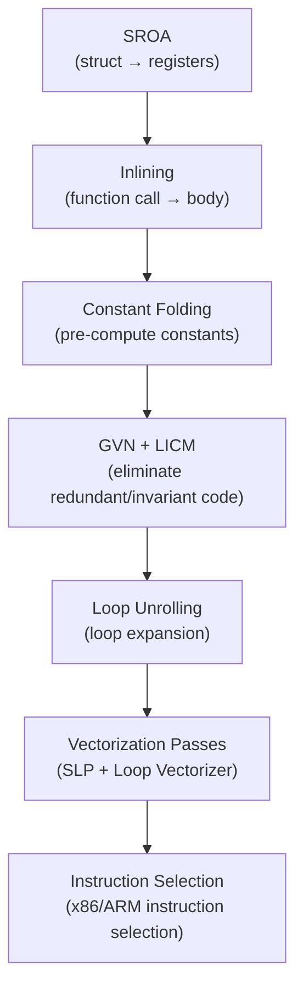

## Introduction

In 2018, Aras Pranckevičius published remarkable results from the ToyPathTracer benchmark. **C# Burst was faster than C++** in some cases — on PC, Burst 140 Mray/s vs C++ 136 Mray/s.

> Aras Pranckevičius, *"Pathtracer 16: Burst & SIMD Optimization"*, 2018

C# faster than C++? Intuitively, this seems wrong. JIT compilation, GC overhead, managed type constraints — aren't all of these factors that make C# slower?

The secret behind Burst's ability to achieve this lies in the **LLVM backend + structural guarantees of the Job System**. In [previous posts](/posts/UnityJobSystemBurst/), we covered the Burst compilation pipeline overview, SIMD basics, and basic `[BurstCompile]` usage. This post digs **deeper inside**:

- What **optimization passes** LLVM applies internally
- How `[BurstCompile]` options **change code generation**
- How to **actually read** Burst Inspector assembly
- **Conditions for success/failure** of auto-vectorization and solutions

---

## Part 1: Dissecting LLVM Optimization Passes

### 1.1 Burst's 4-Stage Compilation Pipeline

In the [Job System post](/posts/UnityJobSystemBurst/#part-3-burst-compiler), we covered the overview of the "C# → IL → LLVM IR → native code" pipeline. Unity's official documentation further divides this into 4 stages:


> Unity Burst Manual v1.8 — *Compilation Pipeline*

#### Stage 1: Method Discovery

Finds Job structs with `[BurstCompile]` and registers the `Execute()` method as a compilation target. Generic instantiation is also handled at this stage.

#### Stage 2: Front End (IL → Burst IR)

Converts the IL (Intermediate Language) generated by the C# compiler into Burst's internal intermediate representation (Burst IR).

**What gets removed at this stage:**
- GC interop code (memory barriers, card table updates)
- vtable-based virtual function dispatch
- boxing/unboxing
- Exception handling infrastructure (try-catch)

**What gets added at this stage:**
- `noalias` metadata — guarantees that NativeContainer parameters don't overlap
- `readonly` metadata — arrays with the `[ReadOnly]` attribute
- Type safety verification — compile error when managed types are used

This `noalias` annotation is the **key reason Burst can generate faster code than C++**. C++ compilers must always consider the possibility of pointer aliasing, but Burst structurally guarantees **"100% alias-free"** thanks to the Job System's Safety System.

> 5argon, *"Unity at GDC: C# to Machine Code"* — There's an example in C++ where a single `__restrict` keyword resulted in 4x performance improvement, but Burst solves this automatically.

#### Stage 3: Middle End (Optimization)

Converts Burst IR to LLVM IR, then applies the LLVM optimization pass pipeline. This is the core topic of this post.

#### Stage 4: Back End (Code Generation)

Converts optimized LLVM IR to native code for the target platform. Proceeds in order: Instruction Selection → Register Allocation → Code Emission.

#### Note: The Reality of "Kernel Theory"

Burst's original design philosophy was to "compile only small performance-critical kernel functions, and leave the rest as managed glue code." However, Sebastian Schoner showed in his 2024 analysis that this "kernel theory" has been **empirically disproven**:

- Disassembly of a simple `OnCreate` method: approximately **16,000 lines** of assembly
- Burst compilation of ECB (EntityCommandBuffer) playback: approximately **64,000 lines** per system

> Sebastian Schoner, *"Burst and the Kernel Theory of Game Performance"*, 2024.12

In real projects, as not just kernels but the complexity of the ECS framework itself (enableable components, query caching, error handling) falls within the Burst compilation scope, compile times can increase dramatically. Practical strategies for this are covered in Part 5.

### 1.2 Key LLVM Optimization Passes

Here we organize the core LLVM passes applied in Burst's Middle End. Let's look at how each pass transforms code using C# pseudocode.

> LLVM Passes Reference — https://llvm.org/docs/Passes.html

#### SROA (Scalar Replacement of Aggregates)

Decomposes structs or arrays into individual scalar values and **places them directly in registers**.

```csharp
// Before SROA:
float3 pos = Positions[i];
float3 vel = Velocities[i];
float3 newPos = pos + vel * dt;  // float3 is a struct — allocated in memory?
Positions[i] = newPos;

// After SROA:
// float3's x, y, z are each separated into registers
float px = Positions_x[i], py = Positions_y[i], pz = Positions_z[i];
float vx = Velocities_x[i], vy = Velocities_y[i], vz = Velocities_z[i];
Positions_x[i] = px + vx * dt;
Positions_y[i] = py + vy * dt;
Positions_z[i] = pz + vz * dt;
```

This pass is **critical** for the performance of Unity.Mathematics types like `float3` and `quaternion`. Without SROA, the overhead of reading and writing structs to memory every time would occur.

#### Inlining (Function Inlining)

Replaces function calls with the function body at the call site.

```csharp
// Before Inlining:
float dist = math.distance(pos, target);
// ↓ The body of math.distance() is inserted

// After Inlining:
float3 d = pos - target;
float dist = math.sqrt(d.x * d.x + d.y * d.y + d.z * d.z);
```

Adding `[MethodImpl(MethodImplOptions.AggressiveInlining)]` lowers the inlining threshold for more aggressive inlining. Most `math.*` functions in `Unity.Mathematics` have this attribute, resulting in zero call overhead when Burst-compiled.

#### LICM (Loop-Invariant Code Motion)

Moves computations that produce the same result every iteration **outside the loop**.

```csharp
// Before LICM:
for (int i = 0; i < count; i++)
{
    float invDt = 1f / DeltaTime;         // ← Same every iteration!
    Velocities[i] = Positions[i] * invDt;
}

// After LICM:
float invDt = 1f / DeltaTime;             // ← Moved outside the loop
for (int i = 0; i < count; i++)
{
    Velocities[i] = Positions[i] * invDt;
}
```

This optimization is easy for developers to miss, but LLVM handles it automatically. However, it won't move function calls with side effects.

#### Constant Folding + Propagation

Pre-computes constants that can be calculated at compile time and propagates the results to usage sites.

```csharp
// Before:
float twoPi = 2f * math.PI;
float angle = twoPi * 0.25f;

// After:
float angle = 1.5707963f;  // Computed at compile time
```

#### GVN (Global Value Numbering)

Eliminates redundant computations of identical expressions.

```csharp
// Before:
float distA = math.sqrt(dx * dx + dz * dz);
// ... other code ...
float distB = math.sqrt(dx * dx + dz * dz);  // Same computation!

// After:
float dist = math.sqrt(dx * dx + dz * dz);
float distA = dist;
float distB = dist;  // Redundancy eliminated
```

#### Loop Unrolling

Replicates the loop body multiple times to reduce branch overhead and expand vectorization opportunities.

```csharp
// Before:
for (int i = 0; i < 8; i++)
    result[i] = data[i] * 2f;

// After (4x unrolled):
result[0] = data[0] * 2f;
result[1] = data[1] * 2f;
result[2] = data[2] * 2f;
result[3] = data[3] * 2f;
result[4] = data[4] * 2f;  // continues...
result[5] = data[5] * 2f;
result[6] = data[6] * 2f;
result[7] = data[7] * 2f;
// → Branch overhead eliminated + SIMD vectorization opportunity expanded
```

#### Pass Application Order

These passes are applied not individually but **in a pipeline sequence**. The result of one pass becomes the input for the next:



### 1.3 Vectorization Passes: Loop Vectorizer vs SLP Vectorizer

LLVM has two independent vectorizers.

> LLVM Vectorizers — https://llvm.org/docs/Vectorizers.html

#### Loop Vectorizer

Transforms a scalar loop into a **vector loop + scalar remainder**.

```csharp
// Before (scalar loop):
for (int i = 0; i < 1000; i++)
    distances[i] = math.distance(positions[i], target);

// After (vectorized, conceptual):
for (int i = 0; i < 1000; i += 4)  // Process 4 at a time
{
    // SSE: 4 floats computed simultaneously
    __m128 dx = _mm_sub_ps(load4(pos_x + i), broadcast(target.x));
    __m128 dz = _mm_sub_ps(load4(pos_z + i), broadcast(target.z));
    __m128 distSq = _mm_add_ps(_mm_mul_ps(dx, dx), _mm_mul_ps(dz, dz));
    _mm_store_ps(distances + i, _mm_sqrt_ps(distSq));
}
// Remainder (unnecessary if 1000 % 4 = 0)
```

The Loop Vectorizer uses a **cost model** to determine the vectorization factor (how many to process at once) and the unroll factor. If the cost outweighs the benefit, it abandons vectorization.

**Epilogue Vectorization**: When the loop count isn't divisible by the vector width, the epilogue handling the remainder can also be **vectorized with a smaller vector width**. Example: main loop AVX2 (8-wide) + epilogue SSE (4-wide).

#### SLP Vectorizer (Superword-Level Parallelism)

Combines independent scalar operations that can be parallelized into vector operations, **even without loops**.

```csharp
// Before (independent scalar calculations):
float ax = bx + cx;
float ay = by + cy;
float az = bz + cz;
float aw = bw + cw;

// After (SLP combines 4 independent additions into 1 SIMD):
__m128 a = _mm_add_ps(b_xyzw, c_xyzw);
```

The SLP Vectorizer analyzes code **bottom-up** to find patterns where operations of the same kind are listed independently, and vectorizes them. This is the mechanism by which `float3` and `float4` operations are automatically converted to SIMD.

---

## Part 2: Complete Guide to [BurstCompile] Options

In the [Job System post](/posts/UnityJobSystemBurst/#burst-제약사항), we covered basic usage and constraints of `[BurstCompile]`. Here we dive deep into how **option parameters** change code generation.

### FloatPrecision

Sets the **precision tolerance range** for floating-point math functions.

| Level | Allowed ULP | Affected Functions | Performance Impact |
|-------|------------|-------------------|-------------------|
| `Standard` (default) | ≤ 3.5 ULP | sin, cos, exp, log, pow, etc. | Baseline |
| `High` | ≤ 1.0 ULP | Same | -5~10% |
| `Medium` | ≤ within range | Same | Slightly faster |
| `Low` | **≤ 350.0 ULP** | Same | **Fastest** |

> Unity Burst Manual v1.8 — *FloatPrecision*

`Low`'s 350 ULP is a significant error margin. The result of `sin(x)` can differ from the actual value by up to 350 ULP. This may be sufficient for game logic, but is risky for physics simulations or financial calculations.

Why `Low` is fast: because it allows the use of hardware-specific instructions like **rsqrt (approximate reciprocal square root)** and **rcp (approximate reciprocal)**. These instructions sacrifice precision for much greater speed (detailed comparison in Part 6).

### FloatMode

Sets the **rearrangement rules** for floating-point operations. This **directly affects vectorization**.

| Mode | Rearrangement | FMA Allowed | NaN/Inf | Reduction Vectorization | Determinism |
|------|--------------|-------------|---------|------------------------|-------------|
| `Default` | Limited | Platform-dependent | Respected | **Not possible** | None |
| `Strict` | Not possible | Not possible | Respected | **Not possible** | Within platform |
| `Fast` | **Allowed** | **Allowed** | Ignored | **Possible** | None |
| `Deterministic` | Limited | Platform-dependent | Respected | Not possible | **Cross-platform** |

**Key point**: `FloatMode.Fast` corresponds to LLVM's `-fassociative-math`. This is the key to floating-point reduction vectorization.

```csharp
// Reduction example:
float sum = 0;
for (int i = 0; i < count; i++)
    sum += values[i];  // sum = ((sum + v[0]) + v[1]) + v[2] + ...
```

IEEE 754 floating-point addition is **non-associative**. `(a + b) + c ≠ a + (b + c)` is possible. Therefore, in `Default`/`Strict`, the addition order cannot be changed, making SIMD 4-wide parallel addition (which requires order changes) impossible.

`Fast` mode lifts this constraint to allow rearrangement → reduction loops get vectorized.

> LLVM Vectorizers — *"By default, the vectorizer will only vectorize reductions for integer types. For floating-point reductions, -fassociative-math (or -ffast-math) is needed."*

#### FloatMode.Deterministic and IEEE 754

For netcode where cross-platform reproducibility matters, `Deterministic` is needed. However, this comes with a performance cost.

The IEEE 754 standard itself **does not guarantee cross-platform reproducibility**. The standard only guarantees identical results for "same operation, same data, same rounding mode", but:
- Two underflow handling methods are permitted (implementation choice)
- Transcendental functions like sin, cos are **completely excluded** from the standard
- decimal↔binary conversion is also not fully specified

`FloatMode.Deterministic` inserts additional operations to suppress these differences, resulting in performance degradation. It's only supported on 64-bit platforms.

For reference, the Box2D physics engine (2024) adopted `-ffp-contract=off` (FMA disabled) + no fast-math + custom `atan2f` implementation to achieve cross-platform determinism. They confirmed identical results on Apple M2 and AMD Ryzen, and surprisingly there was no performance degradation. This demonstrates that **determinism and performance may not necessarily be a trade-off**.

> Erin Catto, *"Determinism"*, Box2D Blog, 2024.08

#### Caution: Options May Have No Effect

Jackson Dunstan's 2019 tests reported cases where FloatMode/FloatPrecision settings **generated identical assembly**. Changing options may not actually change code generation.

> Jackson Dunstan, *"FloatPrecision and FloatMode"*, 2019

**Always verify actual assembly in Burst Inspector.** Changing options without verification wastes time on ineffective optimizations.

### OptimizeFor

| Mode | Unrolling | Code Size | Suitable For |
|------|-----------|-----------|-------------|
| `Default` | Normal | Normal | Most cases |
| `Performance` | **Aggressive** | Large | When hot loops are clearly identified |
| `Size` | Minimal | **Small** | When I-cache pressure is high, mobile |
| `Balanced` | Medium | Medium | Compromise |

`Performance` unrolls loops more and raises the inlining threshold. Hot loop throughput increases, but larger code can increase **instruction cache (I-cache) misses**.

`Size` conversely performs minimal unrolling. Smaller code is favorable for I-cache, but per-loop throughput is lower. This can be advantageous on mobile (ARM with smaller I-cache).

### Other Options

| Option | Description | Use Case |
|--------|------------|----------|
| `CompileSynchronously` | Synchronous compilation instead of async in editor | Debugging: guarantees Burst code is immediately active |
| `DisableSafetyChecks` | Removes safety checks like bounds checking | Release builds (detailed in Part 6) |
| `Debug` | Preserves variable names, disables optimizations | When attaching a native debugger |

### Platform-Specific Branching: Compile-Time Evaluation

```csharp
using static Unity.Burst.Intrinsics.X86;
using static Unity.Burst.Intrinsics.Arm.Neon;

[BurstCompile]
struct PlatformAwareJob : IJobParallelFor
{
    public void Execute(int i)
    {
        if (IsAvx2Supported)
        {
            // AVX2-specific code — only compiled on x86
        }
        else if (IsNeonSupported)
        {
            // ARM NEON-specific code — only compiled on ARM
        }
        else
        {
            // Fallback
        }
    }
}
```

`IsAvx2Supported`, `IsNeonSupported`, etc. are **evaluated at compile time**, and branches not supported on the target platform are eliminated as dead code. This allows writing platform-specific optimizations with zero runtime overhead.

### Option Combination Guide

| Scenario | FloatMode | FloatPrecision | OptimizeFor | Notes |
|----------|-----------|----------------|-------------|-------|
| General game logic | Default | Standard | Default | Safe defaults |
| Hot loop optimization | **Fast** | Low | **Performance** | Reduction vectorization + aggressive unrolling |
| Deterministic netcode | **Deterministic** | Standard | Default | Cross-platform reproducibility |
| Mobile optimization | Fast | Low | **Size** | I-cache benefit |
| Debugging | Default | Standard | Default | + `Debug = true` |
| Precision physics | **Strict** | **High** | Default | IEEE 754 compliant |

---

## Part 3: Burst Inspector Practical Walkthrough

In the [SoA post](/posts/SoAvsAoS/#burst-inspector로-simd-검증), we got a taste of opening Burst Inspector and distinguishing `xxxps` (vector) vs `xxxss` (scalar) instructions. Here we go to the level of **reading actual assembly line by line**.

### 3.1 Minimum Guide to Reading x86 Assembly

This is the minimum knowledge needed to read Burst Inspector output. The goal is not complete x86 understanding, but the **ability to interpret the code Burst generates**.

#### Registers

| Register | Size | Purpose |
|----------|------|---------|
| `xmm0`~`xmm15` | 128-bit | SSE SIMD (float × 4 or double × 2) |
| `ymm0`~`ymm15` | 256-bit | AVX2 SIMD (float × 8 or double × 4) |
| `rdi`, `rsi`, `rcx`, `rdx` | 64-bit | Pointers, indices, counters |
| `rax` | 64-bit | Return value, general purpose |
| `rsp`, `rbp` | 64-bit | Stack pointers (usually ignorable) |

#### Addressing Modes

```
[rdi + rcx*4]
 ↑       ↑  ↑
 base    index  scale

Meaning: rdi pointer + (rcx × 4) byte offset
Example: rdi = NativeArray start address, rcx = loop index, 4 = sizeof(float)
→ The rcx-th element of a float array
```

#### Suffix Rules

| Suffix | Meaning | Processing Unit |
|--------|---------|----------------|
| `ps` | **P**acked **S**ingle | float × 4 (SSE) or × 8 (AVX) |
| `pd` | **P**acked **D**ouble | double × 2 or × 4 |
| `ss` | **S**calar **S**ingle | float × 1 |
| `sd` | **S**calar **D**ouble | double × 1 |

> Unity Learn DOTS Best Practices — *"xxxps instructions (addps, mulps, etc.) are vectorized SIMD, and xxxss instructions (addss, mulss, etc.) are scalar. The goal is to eliminate as many scalar instructions as possible."*

#### Core Instruction Reference

Frequently seen instructions in Burst Inspector and their **actual costs**:

| Instruction | Meaning | Latency | Throughput |
|------------|---------|---------|------------|
| `movaps` | Aligned Packed Single load/store | 3-5 | 0.5 |
| `addps` | Packed addition (float×4) | 3-4 | 0.5 |
| `subps` | Packed subtraction | 3-4 | 0.5 |
| `mulps` | Packed multiplication | 3-5 | 0.5 |
| `divps` | Packed division | 11-14 | 4-5 |
| `sqrtps` | Packed square root | **12-18** | 4-6 |
| `rsqrtps` | Packed reciprocal square root (approx.) | **4** | 1 |
| `rcpps` | Packed reciprocal (approx.) | 4 | 1 |
| `vfmadd231ps` | Fused Multiply-Add (a*b+c) | 4-5 | 0.5 |
| `cmpps` | Packed comparison | 3-4 | 0.5-1 |
| `vblendvps` | Conditional blend (select) | 2 | 1 |
| `movss` | **Scalar** Single load | 3-5 | 0.5 |
| `addss` | **Scalar** addition (float×1) | 3-4 | 0.5 |

> Latency/throughput are cycle counts based on Skylake. Agner Fog, *"Instruction Tables"* (2025.12) — data based on independent measurements, not vendor official values.

**Note the 3-4x difference between `sqrtps` (12-18 cycles) vs `rsqrtps` (4 cycles)**. The performance impact of `FloatPrecision.Low` allowing `rsqrtps` usage is directly evident from these numbers.

### 3.2 Burst Inspector UI

**Opening**: Unity Menu → `Jobs` → `Burst` → `Open Inspector`

Burst Inspector provides **4 views**:

| View | Content | Purpose |
|------|---------|---------|
| **.NET IL** | Intermediate language generated by C# compiler | Verify input to Burst |
| **Unoptimized LLVM IR** | LLVM intermediate representation before optimization | Check state before passes |
| **Optimized LLVM IR** | LLVM intermediate representation after optimization | Verify which optimizations were applied |
| **Final Assembly** | Native assembly for target platform | **The standard for actual performance judgment** |

**Target dropdown**: You can compare assembly results of the same Job compiled for different targets like SSE2, SSE4.2, AVX2, etc.

### 3.3 Practical Walkthrough: DistanceJob

Let's trace the assembly of a simple distance calculation Job.

```csharp
[BurstCompile(FloatMode = FloatMode.Fast, OptimizeFor = OptimizeFor.Performance)]
struct DistanceJob : IJobParallelFor
{
    [ReadOnly] public NativeArray<float3> Positions;
    [WriteOnly] public NativeArray<float> Distances;
    [ReadOnly] public float3 Target;

    public void Execute(int i)
    {
        float3 d = Positions[i] - Target;
        Distances[i] = math.sqrt(d.x * d.x + d.y * d.y + d.z * d.z);
    }
}
```

When viewing this Job in Burst Inspector with SSE4.2 target, the hot loop portion looks roughly like this:

```nasm
; Vectorized loop body (processes 4 float3s simultaneously)
.LBB0_4:                          ; ← Loop start label
    movaps  xmm2, [rdi + rcx*4]  ; Load 4 Positions[i].xyz
    subps   xmm2, xmm0           ; d = pos - target (4 simultaneous)
    mulps   xmm2, xmm2           ; d*d (4 simultaneous)
    ; ... haddps to sum x²+y²+z² ...
    sqrtps  xmm2, xmm2           ; sqrt (4 simultaneous)
    movaps  [rsi + rcx*4], xmm2  ; Distances[i] = result (4 simultaneous)
    add     rcx, 4                ; i += 4
    cmp     rcx, rdx              ; i < count?
    jb      .LBB0_4              ; → Loop repeat

; Scalar remainder (when count is not divisible by 4)
.LBB0_6:
    movss   xmm2, [rdi + rcx*4]  ; Load only 1 Positions[i]
    subss   xmm2, xmm0           ; Scalar subtraction
    ; ...
    sqrtss  xmm2, xmm2           ; Scalar sqrt
    movss   [rsi + rcx*4], xmm2  ; Store only 1
```

**Reading points:**
1. `.LBB0_4` is the vectorized **main loop** — predominantly `xxxps` instructions
2. `.LBB0_6` is the **scalar remainder** — `xxxss` instructions
3. `add rcx, 4` processes 4 at a time
4. `movaps` (aligned) is used → NativeArray's 16-byte alignment is being utilized

### 3.4 Platform-Specific Code Generation Comparison

Compiling the same Job for different targets:

| Feature | x86 SSE4.2 | x86 AVX2 | ARM NEON |
|---------|-----------|----------|----------|
| SIMD register width | 128-bit (xmm) | 256-bit (ymm) | 128-bit (v/q) |
| Simultaneous floats | 4 | **8** | 4 |
| Addition instruction | `addps` | `vaddps` | `fadd` |
| Per-loop processing | 4 | 8 | 4 |
| FMA | Separate (`mulps` + `addps`) | `vfmadd231ps` (1 instr.) | `fmla` (1 instr.) |

On the AVX2 target, using `ymm` registers to process **8 floats at once**, the theoretical throughput is 2x compared to SSE4.2.

> ARM Neon + Burst — https://learn.arm.com/learning-paths/mobile-graphics-and-gaming/using-neon-intrinsics-to-optimize-unity-on-android/

---

## Part 4: Auto-Vectorization — Success and Failure

Unity's official documentation warns:

> **"Loop vectorization is notoriously brittle."**
> — Unity Burst Manual v1.8, *Optimization Guidelines*

### 4.1 Conditions for Successful Vectorization

1. **Simple loops**: Single for loop, no complex control flow
2. **Sequential access**: `data[i]`, `data[i+1]` — contiguous memory access
3. **Data independence**: `Execute(i)`'s result doesn't affect `Execute(j)`
4. **SoA layout**: Same-type data placed contiguously (covered in previous post)
5. **Inlinable functions**: `math.*` functions are inlined via `[AggressiveInlining]`

#### Verification with `Loop.ExpectVectorized()`

```csharp
#define UNITY_BURST_EXPERIMENTAL_LOOP_INTRINSICS
using static Unity.Burst.CompilerServices.Loop;

[BurstCompile]
struct VerifiedJob : IJobParallelFor
{
    [ReadOnly] public NativeArray<float> A;
    [WriteOnly] public NativeArray<float> B;

    public void Execute(int i)
    {
        // Compile error if this loop is not vectorized
        ExpectVectorized();
        B[i] = A[i] * 2f;
    }
}
```

This intrinsic verifies vectorization **at compile time**. It automatically catches cases where adding a single conditional branch broke vectorization. Official documentation measurement: a single branch caused **32 integer operations → regression to 1**.

### 4.2 Patterns Where Vectorization Fails

#### Pattern 1: Floating-Point Reduction

```csharp
// ❌ Cannot vectorize in FloatMode.Default
float sum = 0;
for (int i = 0; i < count; i++)
    sum += values[i];  // loop-carried dependency + FP non-associativity
```

**Cause**: IEEE 754 floating-point addition is non-associative → changing order may change results → compiler refuses vectorization.

**Solution**: Allow rearrangement with `[BurstCompile(FloatMode = FloatMode.Fast)]`.

```csharp
// ✅ Vectorized in FloatMode.Fast
[BurstCompile(FloatMode = FloatMode.Fast)]
struct SumJob : IJob
{
    [ReadOnly] public NativeArray<float> Values;
    public NativeReference<float> Sum;

    public void Execute()
    {
        float sum = 0;
        for (int i = 0; i < Values.Length; i++)
            sum += Values[i];
        Sum.Value = sum;
    }
}
```

#### Pattern 2: Conditional Branches in Loops

```csharp
// ❌ Branches can hinder vectorization
for (int i = 0; i < count; i++)
{
    if (IsAlive[i] == 1)
        Distances[i] = math.distance(Positions[i], target);
    else
        Distances[i] = float.MaxValue;
}
```

**Solution**: Make branchless with `math.select`.

```csharp
// ✅ math.select → SIMD vblendvps (branchless)
for (int i = 0; i < count; i++)
{
    float dist = math.distance(Positions[i], target);
    Distances[i] = math.select(float.MaxValue, dist, IsAlive[i] == 1);
}
```

At the assembly level:
```nasm
; if/else version: uses branch instructions
cmpb    [rbx + rcx], 1
jne     .LBB0_skip        ; ← Branch: pipeline flush on misprediction

; math.select version: branchless blend
cmpps   xmm3, xmm4, 0    ; Compare → generate mask
vblendvps xmm2, xmm5, xmm2, xmm3  ; ← Branchless: select by mask
```

LLVM's **If-Conversion** pass can automatically convert simple conditionals to predication, but it's not guaranteed. Writing explicitly with `math.select` is safer.

#### Pattern 3: Non-Inline Function Calls

```csharp
// ❌ Cannot vectorize if CustomDistance is not inlined
for (int i = 0; i < count; i++)
    Distances[i] = CustomDistance(Positions[i], target);

// ✅ Solution: AggressiveInlining
[MethodImpl(MethodImplOptions.AggressiveInlining)]
static float CustomDistance(float3 a, float3 b) { ... }
```

#### Pattern 4: Aliasing

If there's a **possibility** that two NativeArrays point to the same memory, the compiler conservatively abandons vectorization.

```csharp
// Job NativeArray parameters are automatically noalias → vectorizable
// But passing NativeArray to a function can lose noalias

// ✅ Solve with explicit [NoAlias]
static void Process([NoAlias] NativeArray<float> input,
                    [NoAlias] NativeArray<float> output) { ... }
```

> 5argon (GDC 2018) — *"There's an example in C++ where a single `__restrict` resulted in 4x performance improvement, but Burst solves this automatically thanks to the Job System's Safety System."*

This is **why the `Execute()` method inside a Job is easier to vectorize than regular functions**. A Job's NativeContainer fields are structurally guaranteed to be alias-free.

### 4.3 Unity.Mathematics → SIMD Mapping

Here we organize the key mappings of how `math.*` functions are transformed into SIMD instructions.

| C# (Unity.Mathematics) | x86 SSE/AVX | Simultaneous | Notes |
|-------------------------|-------------|-------------|-------|
| `a + b` (float3) | `addps` | 4 float | SLP vectorization |
| `a * b` (float3) | `mulps` | 4 float | SLP vectorization |
| `math.sqrt(x)` | `sqrtps` | 4 float | 12-18 cycles |
| `math.rsqrt(x)` | `rsqrtps` | 4 float | 4 cycles (approx.) |
| `math.select(a, b, c)` | `vblendvps` | 4 float | **Branchless** |
| `math.dot(a, b)` | `mulps` + `haddps` | 4 → 1 | Horizontal op (expensive) |
| `math.mad(a, b, c)` | `vfmadd231ps` | 4 float | FMA: a*b+c in 1 instruction |
| `math.normalizesafe(v)` | `mulps` + `rsqrtps` + `mulps` | 4 float | Uses rsqrt on Low |

**`math.*` vs `Mathf.*` difference**: Burst recognizes `math.*` functions as **intrinsics** and converts them directly to SIMD instructions. `Mathf.*` is treated as a managed call and may not be inlined/vectorized.

#### Cost of Horizontal Operations

**Horizontal operations** like `math.dot` or `math.csum` are relatively expensive in SIMD. This is because multiple values within a single SIMD register must be summed.

```nasm
; Actual assembly for math.dot(a, b) (SSE):
mulps   xmm0, xmm1        ; a.x*b.x, a.y*b.y, a.z*b.z, a.w*b.w  (1 cycle)
haddps  xmm0, xmm0        ; (xy+zw), (xy+zw), ...                (3 cycles)
haddps  xmm0, xmm0        ; (xy+zw+xy+zw), ...                   (3 cycles)
; → Total 7 cycles: slower than simple mulps+addps due to horizontal reduction
```

`haddps` is a horizontal add with high latency. When possible, it's better to push horizontal operations outside the loop or convert to vertical operations with SoA layout.

### 4.4 Frustum Culling Benchmark

The Frustum Culling benchmark with 4 implementations provided by Unity Learn DOTS Best Practices shows a practical comparison of vectorization strategies.

| Version | Strategy | Key Feature |
|---------|----------|-------------|
| v1 | Loop + early break | Check 6 planes in loop, break on failure |
| v2 | Unrolled, no branch | Unroll 6 plane checks, eliminate branches |
| v3 | Plane packet SIMD | Bundle 4 planes for SIMD processing |
| v4 | Vertical SIMD (4 spheres simultaneous) | Check 4 spheres simultaneously (**fastest**) |

> Unity Learn, *"Getting the Most Out of Burst"*

v4 is fastest because: it **pivoted the data direction vertically**, packing 4 spheres into a single SIMD register. Math operations reduced by **33%** compared to v1.

The lesson from this benchmark: **"Counting the number of math operations in an algorithm is a good predictor of performance."**

---

## Part 5: Compiler Hints and Attributes

### Hint.Likely / Hint.Unlikely

```csharp
using Unity.Burst.CompilerServices;

public void Execute(int i)
{
    if (Hint.Unlikely(IsAlive[i] == 0))
    {
        // This branch rarely executes → cold path
        Distances[i] = float.MaxValue;
        return;
    }
    // hot path: most execution comes here
    Distances[i] = math.distance(Positions[i], target);
}
```

The CPU's branch predictor correctly predicts most branches, but **pipeline flush occurs on misprediction**. The cost varies by architecture:

| Architecture | Misprediction Penalty |
|-------------|----------------------|
| Intel Skylake | ~16.5 cycles |
| Intel Golden Cove (Alder Lake) | ~17 cycles |
| AMD Zen 1 | ~19 cycles |
| Apple M1 | ~8 cycles |

> Agner Fog, *"The Microarchitecture of Intel, AMD, and VIA CPUs"* (2025); Cloudflare, *"Branch predictor: How many 'if's are too many?"*

`Hint.Likely`/`Hint.Unlikely` tells LLVM the expected path of a branch. Based on this:
- **Code layout**: Likely path is fall-through (contiguous placement), unlikely path is handled with a jump → improved I-cache efficiency
- **Loop Vectorizer decision**: Likely path becomes the vectorization target

### Hint.Assume

```csharp
public void Execute(int i)
{
    Hint.Assume(i >= 0 && i < Positions.Length);

    // Now the compiler "knows" i is within bounds,
    // so it won't generate bounds checks
    Distances[i] = math.distance(Positions[i], target);
}
```

`Hint.Assume` guarantees to the compiler that the condition is **always true**. If false, it results in **undefined behavior (UB)**, which is dangerous, but it enables powerful optimizations like bounds check elimination.

### [AssumeRange]

```csharp
[return: AssumeRange(0u, 12u)]
static uint GetMonthIndex() { /* ... */ }

// Since the compiler knows the return value range:
// - Can replace division with multiply+shift (within constant range)
// - Can eliminate dead branches in switch/if
```

### Constant.IsConstantExpression()

```csharp
[MethodImpl(MethodImplOptions.AggressiveInlining)]
static float FastPow(float x, float exponent)
{
    if (Constant.IsConstantExpression(exponent))
    {
        // Special path if exponent is a compile-time constant
        if (exponent == 2f) return x * x;       // 1 multiplication instead of math.pow
        if (exponent == 0.5f) return math.sqrt(x);  // sqrt instead of math.pow
    }
    return math.pow(x, exponent);
}
```

`IsConstantExpression` checks whether the argument **can be evaluated as a constant at compile time**. If the constant propagates after inlining, the condition becomes true, the optimal path is selected, and the rest is eliminated as dead code.

### [BurstDiscard]

```csharp
[BurstCompile]
struct MyJob : IJob
{
    public void Execute()
    {
        DoWork();
        LogDebug("Work done");  // Completely removed in Burst
    }

    [BurstDiscard]
    static void LogDebug(string msg)
    {
        Debug.Log(msg);  // managed code — incompatible with Burst
    }
}
```

Methods with `[BurstDiscard]` have their **body completely removed** during Burst compilation. This is the only way to include managed-only debug code in Burst Jobs.

### [SkipLocalsInit]

```csharp
[BurstCompile, SkipLocalsInit]
struct MyJob : IJobParallelFor
{
    public void Execute(int i)
    {
        // Local variables are NOT zero-initialized
        // → Saves initialization cost for large stack allocations
        float4x4 matrix;  // 64 bytes — zero initialization skipped
        // ...
    }
}
```

C# zero-initializes all local variables by default. `[SkipLocalsInit]` skips this initialization. It provides minor performance benefits in hot loops that use many large structs.

### Function Pointers: "Compilation Barriers"

Function pointers generally **prevent inlining**, degrading performance. However, Sebastian Schoner proposed a strategy that **leverages this inversely**:

- When central ECS component code gets inlined into every system → tens of thousands of assembly lines per system
- Creating a "compilation barrier" with function pointers → blocks inlining → **25% compilation time reduction** (8 min → 6 min)
- Runtime performance degrades, but it's a valid trade-off for development cycles

> Sebastian Schoner, *"Burst and the Kernel Theory"*, 2024.12

In Unity's official benchmarks, Jobs are **1.26x** faster than batched function pointers. When this difference is acceptable, function pointers can be strategically used to reduce compilation time.

---

## Part 6: Common Pitfalls and Optimization Patterns

### Safety Checks and noalias Relationship

**When Safety Checks are enabled, noalias optimization is disabled.**

The Safety System inserts additional code to verify NativeArray access at runtime. This process contaminates aliasing information, preventing LLVM from performing aggressive vectorization.

```csharp
// Editor (Safety Checks ON): noalias optimization disabled → slow
// Build (Safety Checks OFF): noalias optimization enabled → fast

// Explicitly disable for builds:
[BurstCompile(DisableSafetyChecks = true)]
```

**Always disable Safety Checks in release builds.** This is one of the main reasons profiling results in the editor may differ from builds.

### Division → Reciprocal Multiplication

Division (`divps`) is **20-30x slower** than multiplication (`mulps`) (latency 11-14 vs 0.5 cycles).

```csharp
// ❌ Slow: using division
for (int i = 0; i < count; i++)
    Results[i] = Values[i] / constant;

// ✅ Fast: reciprocal multiplication (Burst auto-converts constant division)
// But for variable division, do it manually:
float rcp = math.rcp(divisor);  // 1-time reciprocal calculation
for (int i = 0; i < count; i++)
    Results[i] = Values[i] * rcp;  // Replace with multiplication
```

Burst automatically converts division by constants to reciprocal multiplication, but for **variable division**, you must manually use `math.rcp`.

### sqrt vs rsqrt

| Operation | Instruction | Latency | Precision |
|-----------|-----------|---------|-----------|
| `math.sqrt(x)` | `sqrtps` | **12-18 cycles** | IEEE 754 full precision |
| `math.rsqrt(x)` | `rsqrtps` | **4 cycles** | ~12 bits (~3.5 ULP) |

> Agner Fog, *"Instruction Tables"* (2025) — based on Skylake

`rsqrt` returns an **approximation of the reciprocal square root** in 4 cycles. Setting `FloatPrecision.Low` allows Burst to automatically replace `math.sqrt` with `rsqrt + Newton-Raphson correction`.

```csharp
// Manual rsqrt + 1 Newton-Raphson correction (improved precision):
float rsq = math.rsqrt(x);
rsq = rsq * (1.5f - 0.5f * x * rsq * rsq);  // Newton-Raphson
float result = x * rsq;  // sqrt(x) ≈ x * rsqrt(x)
```

In game code where normalization is frequent, the 3-4x speed advantage of `rsqrtps` accumulates to create significant differences.

### Branch vs Branchless: When Is Each Better

`math.select` (branchless) is **not** always faster than `if/else` (branch).

| Scenario | Faster Option | Reason |
|----------|--------------|--------|
| Branch prediction rate ~50% (random data) | **Branchless** | Pipeline flush every 2nd time → high branch cost |
| Branch prediction rate ~95% (mostly one side) | **Branch** | Prediction is almost always correct, so branchless "always compute both sides" cost is higher |
| Computation within branch is light | **Branchless** | 1 vblendvps vs jne + extra instructions |
| Computation within branch is heavy (sqrt, etc.) | **Branch** | Early exit skips expensive computation |

According to benchmarks, **the crossover point between CMOV (branchless conditional move) and branching is approximately 75% prediction accuracy**. Above 75% accuracy, branching is favorable; below that, branchless is favorable.

> Algorithmica, *"Branchless Programming"* — CMOV vs conditional branch crossover at ~75% prediction accuracy

```csharp
// isAlive is 95% true → branch is favorable
if (IsAlive[i] == 0) { Distances[i] = float.MaxValue; return; }
// Only 5% skip, so branch prediction is almost always correct + early return skips remaining computation

// IsAlive is 50/50 → math.select is favorable
Distances[i] = math.select(float.MaxValue, dist, IsAlive[i] == 1);
// Branchless, so no prediction failures + both-side computation is cheap
```

### [NoAlias] and Aliasing

NativeArray fields in Job structs are automatically treated as noalias, but **passing NativeArray to a separate function** loses the noalias information.

```csharp
// ❌ noalias information lost in function parameters
static void BadProcess(NativeArray<float> input, NativeArray<float> output)
{
    // Compiler: input and output might point to the same memory, so handle conservatively
    for (int i = 0; i < input.Length; i++)
        output[i] = input[i] * 2f;
}

// ✅ Explicit [NoAlias]
static void GoodProcess([NoAlias] NativeArray<float> input,
                        [NoAlias] NativeArray<float> output)
{
    // Compiler: input and output never overlap → aggressive vectorization possible
    for (int i = 0; i < input.Length; i++)
        output[i] = input[i] * 2f;
}
```

### Job vs Function Pointer Performance

Performance comparison of three Burst code execution methods from Unity's official benchmarks:

| Method | Relative Speed | Reason |
|--------|---------------|--------|
| Non-batched Function Pointer | 1.00x (baseline) | Call overhead + limited optimization |
| Batched Function Pointer | **1.53x** | Reduced call overhead via batching |
| **Job** | **1.93x** | Perfect aliasing info + widest optimization opportunity |

> Unity Burst Manual — *Function Pointers vs Jobs*

**Always use Jobs when possible.** Jobs structurally provide the compiler with the most optimization information.

---

## Summary

### Key Takeaways

| Concept | Key Point | Reference |
|---------|-----------|-----------|
| 4-stage pipeline | Discovery → FrontEnd → MiddleEnd → BackEnd | Unity official docs |
| SROA | struct → register decomposition (critical for float3) | LLVM Passes |
| Loop/SLP vectorization | Loops = Loop Vectorizer, straight-line code = SLP | LLVM Vectorizers |
| FloatMode.Fast | Key to reduction vectorization (`-fassociative-math`) | Official docs + LLVM |
| noalias | Job = auto alias-free → can generate faster code than C++ | GDC 2018 |
| Safety Checks OFF | Enables noalias optimization in release | Official docs |
| sqrtps vs rsqrtps | 12-18 vs 4 cycles (3-4x difference) | Agner Fog |
| Loop.ExpectVectorized | Compile-time vectorization verification | Official docs |
| Branch vs branchless | Decide based on prediction rate | Intel manual |

### Next Post

The next topic in this series will be **NativeContainer Deep Dive** — analyzing the internal implementation and performance characteristics of all containers provided by the Job System, including NativeList, NativeHashMap, NativeQueue, and more.

---

## References

- **Unity Burst Manual v1.8** — [docs.unity3d.com](https://docs.unity3d.com/Packages/com.unity.burst@1.8/manual/)
- **LLVM Passes Reference** — [llvm.org/docs/Passes.html](https://llvm.org/docs/Passes.html)
- **LLVM Vectorizers** — [llvm.org/docs/Vectorizers.html](https://llvm.org/docs/Vectorizers.html)
- **Agner Fog**, "Optimizing Software in C++" / "Instruction Tables" (2025) — [agner.org/optimize](https://www.agner.org/optimize/)
- **Intel**, "64 and IA-32 Architectures Optimization Reference Manual" v050 (2024)
- **Aras Pranckevičius**, "Pathtracer 16: Burst & SIMD Optimization" (2018) — [aras-p.info](https://aras-p.info/blog/2018/10/29/Pathtracer-16-Burst-SIMD-Optimization/)
- **Sebastian Schoner**, "Burst and the Kernel Theory of Game Performance" (2024) — [blog.s-schoener.com](https://blog.s-schoener.com/2024-12-12-burst-kernel-theory-game-performance/)
- **5argon**, "Unity at GDC: C# to Machine Code" — [medium.com/@5argon](https://medium.com/@5argon/unity-at-gdc-c-to-machine-code-17ab0deaf66d)
- **Jackson Dunstan**, "FloatPrecision and FloatMode" (2019) — [jacksondunstan.com](https://www.jacksondunstan.com/articles/5224)
- **Unity Learn**, "Getting the Most Out of Burst" — DOTS Best Practices
- **Mike Acton**, "Data-Oriented Design and C++" (CppCon 2014) — [YouTube](https://www.youtube.com/watch?v=rX0ItVEVjHc)
- **ARM**, "Using Neon Intrinsics to Optimize Unity on Android" — [learn.arm.com](https://learn.arm.com/learning-paths/mobile-graphics-and-gaming/using-neon-intrinsics-to-optimize-unity-on-android/)
