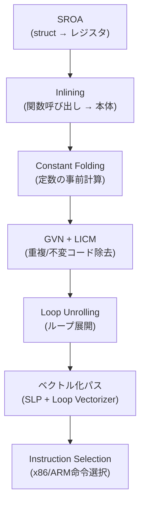

## 序論

2018年、Aras PranckevičiusはToyPathTracerベンチマークで驚くべき結果を発表した。**C# BurstがC++より速い**ケースが存在するということだ — PCでBurst 140 Mray/s vs C++ 136 Mray/s。

> Aras Pranckevičius, *"Pathtracer 16: Burst & SIMD Optimization"*, 2018

C#がC++より速いなんて、直感的におかしい。JITコンパイル、GCオーバーヘッド、managedタイプ制約 — これらすべてがC#を遅くする要因ではないか？

Burstがこれを可能にする秘訣は**LLVMバックエンド + Job Systemの構造的保証**にある。[以前のポスト](/posts/UnityJobSystemBurst/)でBurstのコンパイルパイプライン概要、SIMD基礎、`[BurstCompile]`の基本的な使い方を扱った。このポストでは**その内側**を掘り下げる：

- LLVMが内部的に**どのような最適化パス**を適用するか
- `[BurstCompile]`オプションがコード生成を**どう変えるか**
- Burst Inspectorのアセンブリを**実際に読む方法**
- 自動ベクトル化が**成功/失敗する条件**と解決法

---

## Part 1: LLVM最適化パスの解剖

### 1.1 Burstの4段階コンパイルパイプライン

[Job Systemポスト](/posts/UnityJobSystemBurst/#part-3-burst-compiler)で「C# → IL → LLVM IR → ネイティブコード」パイプラインの概要を扱った。Unity公式ドキュメントはこれを4段階にさらに細分する：


> Unity Burst Manual v1.8 — *Compilation Pipeline*

#### Stage 1: Method Discovery

`[BurstCompile]`が付いたJob structを探し、`Execute()`メソッドをコンパイル対象として登録する。この段階でジェネリックのインスタンス化も処理される。

#### Stage 2: Front End (IL → Burst IR)

C#コンパイラが生成したIL（Intermediate Language）をBurst内部の中間表現（Burst IR）に変換する。

**この段階で除去されるもの：**
- GC連携コード（メモリバリア、カードテーブル更新）
- vtableベースの仮想関数ディスパッチ
- boxing/unboxing
- 例外処理インフラ（try-catch）

**この段階で追加されるもの：**
- `noalias`メタデータ — NativeContainerパラメータが互いに重ならないことを保証
- `readonly`メタデータ — `[ReadOnly]`アトリビュートが付いた配列
- 型安全性検証 — managedタイプ使用時にコンパイルエラー

この`noalias`アノテーションこそが**BurstがC++より速いコードを生成できる核心的な理由**だ。C++コンパイラはポインタエイリアシングの可能性を常に考慮しなければならないが、BurstはJob SystemのSafety Systemのおかげで**「100% alias-free」**を構造的に保証する。

> 5argon, *"Unity at GDC: C# to Machine Code"* — C++で`__restrict`キーワード一つで4倍の性能向上が観測された例があるが、Burstはこれを自動的に解決する。

#### Stage 3: Middle End（最適化）

Burst IRをLLVM IRに変換した後、LLVMの最適化パスパイプラインを適用する。これがこのポストの核心テーマだ。

#### Stage 4: Back End（コード生成）

最適化されたLLVM IRをターゲットプラットフォームのネイティブコードに変換する。Instruction Selection → Register Allocation → Code Emissionの順序で進行する。

#### 参考：「カーネル理論」の現実

Burstの元々の設計哲学は「小さな性能クリティカルなカーネル関数のみをコンパイルし、残りはmanaged glue code」だった。しかしSebastian Schonerは2024年の分析でこの「カーネル理論」が**実証的に反証された**ことを示した：

- 単純な`OnCreate`メソッドのディスアセンブリ：約**16,000行**のアセンブリ
- ECB（EntityCommandBuffer）再生のBurstコンパイル：システムあたり約**64,000行**

> Sebastian Schoner, *"Burst and the Kernel Theory of Game Performance"*, 2024.12

実際のプロジェクトではカーネルだけでなくECSフレームワーク自体の複雑さ（enableable components、query caching、error handling）までBurstコンパイル範囲に入ることで、コンパイル時間が急激に増加しうる。これに対する実践的な対応はPart 5で扱う。

### 1.2 主要LLVM最適化パス

BurstのMiddle Endで適用される核心的なLLVMパスを整理する。各パスがコードをどう変換するかC#疑似コードで見てみよう。

> LLVM Passes Reference — https://llvm.org/docs/Passes.html

#### SROA (Scalar Replacement of Aggregates)

構造体や配列を個別のスカラー値に分解して**レジスタに直接配置**する。

```csharp
// Before SROA:
float3 pos = Positions[i];
float3 vel = Velocities[i];
float3 newPos = pos + vel * dt;  // float3はstruct — メモリに割り当て？
Positions[i] = newPos;

// After SROA:
// float3のx, y, zがそれぞれレジスタに分離
float px = Positions_x[i], py = Positions_y[i], pz = Positions_z[i];
float vx = Velocities_x[i], vy = Velocities_y[i], vz = Velocities_z[i];
Positions_x[i] = px + vx * dt;
Positions_y[i] = py + vy * dt;
Positions_z[i] = pz + vz * dt;
```

このパスが`float3`、`quaternion`のようなUnity.Mathematicsタイプの性能に**決定的**だ。SROAがなければstructを毎回メモリに読み書きするオーバーヘッドが発生する。

#### Inlining（関数インライニング）

関数呼び出しを呼び出し地点に本体で置き換える。

```csharp
// Before Inlining:
float dist = math.distance(pos, target);
// ↓ math.distance()の本体が挿入される

// After Inlining:
float3 d = pos - target;
float dist = math.sqrt(d.x * d.x + d.y * d.y + d.z * d.z);
```

`[MethodImpl(MethodImplOptions.AggressiveInlining)]`を付けるとインライニングの閾値を下げてより積極的にインライニングする。`Unity.Mathematics`の`math.*`関数はほとんどこのアトリビュートが付いているため、Burstコンパイル時の呼び出しオーバーヘッドは0だ。

#### LICM (Loop-Invariant Code Motion)

ループ内で毎回同じ結果を出す計算を**ループの外に**移動する。

```csharp
// Before LICM:
for (int i = 0; i < count; i++)
{
    float invDt = 1f / DeltaTime;         // ← 毎回同じ！
    Velocities[i] = Positions[i] * invDt;
}

// After LICM:
float invDt = 1f / DeltaTime;             // ← ループの外に移動
for (int i = 0; i < count; i++)
{
    Velocities[i] = Positions[i] * invDt;
}
```

開発者が見落としやすい最適化だが、LLVMはこれを自動的に処理する。ただし、副作用のある関数呼び出しは移動しない。

#### Constant Folding + Propagation

コンパイル時に計算可能な定数を事前に計算し、その結果を使用箇所に伝播する。

```csharp
// Before:
float twoPi = 2f * math.PI;
float angle = twoPi * 0.25f;

// After:
float angle = 1.5707963f;  // コンパイル時に計算完了
```

#### GVN (Global Value Numbering)

同一の式の重複計算を除去する。

```csharp
// Before:
float distA = math.sqrt(dx * dx + dz * dz);
// ... 他のコード ...
float distB = math.sqrt(dx * dx + dz * dz);  // 同一の計算！

// After:
float dist = math.sqrt(dx * dx + dz * dz);
float distA = dist;
float distB = dist;  // 重複除去
```

#### Loop Unrolling

ループ本体を複数回複製して分岐オーバーヘッドを減らし、ベクトル化の機会を拡大する。

```csharp
// Before:
for (int i = 0; i < 8; i++)
    result[i] = data[i] * 2f;

// After (4倍アンロール):
result[0] = data[0] * 2f;
result[1] = data[1] * 2f;
result[2] = data[2] * 2f;
result[3] = data[3] * 2f;
result[4] = data[4] * 2f;  // 続く...
result[5] = data[5] * 2f;
result[6] = data[6] * 2f;
result[7] = data[7] * 2f;
// → 分岐オーバーヘッド除去 + SIMDベクトル化機会拡大
```

#### パス適用順序

これらのパスは単独ではなく**パイプラインとして順番に**適用される。あるパスの結果が次のパスの入力になる：



### 1.3 ベクトル化パス：Loop Vectorizer vs SLP Vectorizer

LLVMには2つの独立したベクトル化器がある。

> LLVM Vectorizers — https://llvm.org/docs/Vectorizers.html

#### Loop Vectorizer

スカラーループを**ベクトルループ + スカラー余り（remainder）**に変換する。

```csharp
// Before (スカラーループ):
for (int i = 0; i < 1000; i++)
    distances[i] = math.distance(positions[i], target);

// After (ベクトル化、概念):
for (int i = 0; i < 1000; i += 4)  // 4個ずつ処理
{
    // SSE: 4個のfloatを同時計算
    __m128 dx = _mm_sub_ps(load4(pos_x + i), broadcast(target.x));
    __m128 dz = _mm_sub_ps(load4(pos_z + i), broadcast(target.z));
    __m128 distSq = _mm_add_ps(_mm_mul_ps(dx, dx), _mm_mul_ps(dz, dz));
    _mm_store_ps(distances + i, _mm_sqrt_ps(distSq));
}
// 余り (1000 % 4 = 0なら不要)
```

Loop Vectorizerは**コストモデル**を使用してベクトル化ファクター（一度に何個処理するか）とアンロールファクターを決定する。コストが利益より大きければベクトル化を放棄する。

**エピローグベクトル化**：ループ回数がベクトル幅で割り切れない場合、余りを処理するエピローグも**より小さいベクトル幅で**ベクトル化できる。例：メインループAVX2（8-wide）+ エピローグSSE（4-wide）。

#### SLP Vectorizer (Superword-Level Parallelism)

**ループなしでも**並列可能な独立したスカラー演算をベクトル演算にまとめる。

```csharp
// Before (独立したスカラー計算):
float ax = bx + cx;
float ay = by + cy;
float az = bz + cz;
float aw = bw + cw;

// After (SLPが4つの独立した加算を1つのSIMDに):
__m128 a = _mm_add_ps(b_xyzw, c_xyzw);
```

SLP Vectorizerはコードを**ボトムアップで**分析して、同じ種類の演算が独立して並んでいるパターンを見つけてベクトル化する。これが`float3`、`float4`演算が自動的にSIMDに変換されるメカニズムだ。

---

## Part 2: [BurstCompile]オプション完全ガイド

[Job Systemポスト](/posts/UnityJobSystemBurst/#burst-제약사항)で`[BurstCompile]`の基本的な使い方と制約事項を扱った。ここでは**オプションパラメータ**がコード生成をどう変えるかを深く掘り下げる。

### FloatPrecision

浮動小数点数学関数の**精度許容範囲**を設定する。

| レベル | 許容ULP | 適用関数 | 性能影響 |
|--------|---------|----------|----------|
| `Standard`（デフォルト） | ≤ 3.5 ULP | sin, cos, exp, log, powなど | 基準線 |
| `High` | ≤ 1.0 ULP | 同一 | -5~10% |
| `Medium` | ≤ 範囲内 | 同一 | やや速い |
| `Low` | **≤ 350.0 ULP** | 同一 | **最速** |

> Unity Burst Manual v1.8 — *FloatPrecision*

`Low`の350 ULPはかなりの誤差だ。`sin(x)`の結果が実際の値と最大350 ULP差が出ることがある。ゲームロジックでは十分かもしれないが、物理シミュレーションや金融計算では危険だ。

`Low`が速い理由：**rsqrt（逆平方根近似）**や**rcp（逆数近似）**のようなハードウェア専用命令の使用を許可するためだ。これらの命令は精度を犠牲にする代わりに非常に速い（Part 6で詳細比較）。

### FloatMode

浮動小数点演算の**再配置ルール**を設定する。これが**ベクトル化に直接的な影響**を与える。

| モード | 再配置 | FMA許可 | NaN/Inf | リダクションベクトル化 | 決定論 |
|--------|--------|---------|---------|----------------------|--------|
| `Default` | 制限的 | プラットフォーム依存 | 尊重 | **不可** | なし |
| `Strict` | 不可 | 不可 | 尊重 | **不可** | プラットフォーム内 |
| `Fast` | **許可** | **許可** | 無視 | **可能** | なし |
| `Deterministic` | 制限的 | プラットフォーム依存 | 尊重 | 不可 | **クロスプラットフォーム** |

**核心**：`FloatMode.Fast`はLLVMの`-fassociative-math`に相当する。これが浮動小数点リダクションベクトル化の鍵だ。

```csharp
// リダクション例：
float sum = 0;
for (int i = 0; i < count; i++)
    sum += values[i];  // sum = ((sum + v[0]) + v[1]) + v[2] + ...
```

IEEE 754浮動小数点加算は**非結合的**だ。`(a + b) + c ≠ a + (b + c)`がありうる。したがって`Default`/`Strict`では加算順序を変えられず、SIMD 4-wide並列加算（順序変更必須）が不可能だ。

`Fast`モードはこの制約を解除して再配置を許可する → リダクションループがベクトル化される。

> LLVM Vectorizers — *"By default, the vectorizer will only vectorize reductions for integer types. For floating-point reductions, -fassociative-math (or -ffast-math) is needed."*

#### FloatMode.DeterministicとIEEE 754

クロスプラットフォームの再現性が重要なネットコードでは`Deterministic`が必要だ。しかしこれは性能コストを伴う。

IEEE 754標準自体が**クロスプラットフォームの再現性を保証しない**。標準は「同じ演算、同じデータ、同じ丸めモード」で結果が同一であることのみ保証し：
- アンダーフロー処理方法が2つ許可されている（実装の選択）
- sin、cosのような超越関数は標準から**完全に除外**
- decimal↔binary変換も完全には仕様化されていない

`FloatMode.Deterministic`はこれらの違いを抑制するために追加演算を挿入するため、性能低下が発生する。64ビットプラットフォームでのみサポートされる。

参考として、Box2D物理エンジン（2024）はクロスプラットフォーム決定論を達成するために`-ffp-contract=off`（FMA無効化）+ fast-math禁止 + 独自の`atan2f`実装を採用した。Apple M2とAMD Ryzenで同一の結果を確認し、驚くべきことに性能低下はなかった。これは**決定論と性能が必ずしもトレードオフではない可能性がある**ことを示す事例だ。

> Erin Catto, *"Determinism"*, Box2D Blog, 2024.08

#### 注意：オプションが効果がない場合がある

Jackson Dunstanの2019年テストでFloatMode/FloatPrecision設定が**同一のアセンブリを生成した**事例が報告された。オプションを変えても実際のコード生成が変わらない場合がある。

> Jackson Dunstan, *"FloatPrecision and FloatMode"*, 2019

**必ずBurst Inspectorで実際のアセンブリを確認せよ。** オプションだけ変えて検証しなければ、効果のない最適化に時間を浪費する可能性がある。

### OptimizeFor

| モード | アンローリング | コードサイズ | 適した状況 |
|--------|--------------|------------|-----------|
| `Default` | 普通 | 普通 | ほとんど |
| `Performance` | **積極的** | 大 | ホットループが明確な場合 |
| `Size` | 最小 | **小** | I-cache圧力が高い場合、モバイル |
| `Balanced` | 中間 | 中間 | 折衷案 |

`Performance`はループをより多くアンロールしインライニング閾値を高める。ホットループのスループットは増加するが、コードが大きくなり**命令キャッシュ（I-cache）ミス**が増加しうる。

`Size`は逆に最小限のアンロールのみ行う。コードが小さくなりI-cacheに有利だが、ループあたりのスループットは低い。モバイル（I-cacheが小さいARM）で有利な場合がある。

### その他のオプション

| オプション | 説明 | 用途 |
|-----------|------|------|
| `CompileSynchronously` | エディタで非同期の代わりに同期コンパイル | デバッグ：Burstコードが即座に有効であることを保証 |
| `DisableSafetyChecks` | bounds checkなど安全性検査を除去 | リリースビルド（Part 6で詳細） |
| `Debug` | 変数名保持、最適化無効化 | ネイティブデバッガ接続時 |

### プラットフォーム別分岐：コンパイル時評価

```csharp
using static Unity.Burst.Intrinsics.X86;
using static Unity.Burst.Intrinsics.Arm.Neon;

[BurstCompile]
struct PlatformAwareJob : IJobParallelFor
{
    public void Execute(int i)
    {
        if (IsAvx2Supported)
        {
            // AVX2専用コード — x86でのみコンパイルされる
        }
        else if (IsNeonSupported)
        {
            // ARM NEON専用コード — ARMでのみコンパイルされる
        }
        else
        {
            // フォールバック
        }
    }
}
```

`IsAvx2Supported`、`IsNeonSupported`などは**コンパイル時に評価**されて、該当プラットフォームでサポートされない分岐はdead codeとして除去される。ランタイムオーバーヘッドなしにプラットフォーム別最適化を記述できる。

### オプション組み合わせガイド

| 状況 | FloatMode | FloatPrecision | OptimizeFor | 備考 |
|------|-----------|----------------|-------------|------|
| 一般ゲームロジック | Default | Standard | Default | 安全なデフォルト値 |
| ホットループ最適化 | **Fast** | Low | **Performance** | リダクションベクトル化 + 積極的アンロール |
| 決定論的ネットコード | **Deterministic** | Standard | Default | クロスプラットフォーム再現性 |
| モバイル最適化 | Fast | Low | **Size** | I-cacheの利点 |
| デバッグ | Default | Standard | Default | + `Debug = true` |
| 精密物理 | **Strict** | **High** | Default | IEEE 754準拠 |

---

## Part 3: Burst Inspector 実践ウォークスルー

[SoAポスト](/posts/SoAvsAoS/#burst-inspector로-simd-검증)でBurst Inspectorを開いて`xxxps`（ベクトル）vs `xxxss`（スカラー）命令を区別する方法を味わった。ここでは**実際のアセンブリを一行ずつ読む**レベルまで進む。

### 3.1 x86アセンブリ読解最小ガイド

Burst Inspector出力を読むための最小限の知識だ。完全なx86理解ではなく、**Burstが生成するコードを解釈できるレベル**を目標とする。

#### レジスタ

| レジスタ | サイズ | 用途 |
|----------|--------|------|
| `xmm0`~`xmm15` | 128ビット | SSE SIMD (float × 4 または double × 2) |
| `ymm0`~`ymm15` | 256ビット | AVX2 SIMD (float × 8 または double × 4) |
| `rdi`, `rsi`, `rcx`, `rdx` | 64ビット | ポインタ、インデックス、カウンタ |
| `rax` | 64ビット | 戻り値、汎用 |
| `rsp`, `rbp` | 64ビット | スタックポインタ（通常無視可能） |

#### アドレッシングモード

```
[rdi + rcx*4]
 ↑       ↑  ↑
 ベース   インデックス  スケール

意味: rdiポインタ + (rcx × 4) バイトオフセット
例: rdi = NativeArrayの開始アドレス, rcx = ループインデックス, 4 = sizeof(float)
→ float配列のrcx番目の要素
```

#### 接尾辞ルール

| 接尾辞 | 意味 | 処理単位 |
|--------|------|----------|
| `ps` | **P**acked **S**ingle | float × 4 (SSE) または × 8 (AVX) |
| `pd` | **P**acked **D**ouble | double × 2 または × 4 |
| `ss` | **S**calar **S**ingle | float × 1 |
| `sd` | **S**calar **D**ouble | double × 1 |

> Unity Learn DOTS Best Practices — *「xxxps命令（addps, mulpsなど）はベクトル化されたSIMDで、xxxss命令（addss, mulssなど）はスカラーだ。目標はできるだけ多くのスカラー命令を除去することだ。」*

#### コア命令リファレンス

Burst Inspectorで頻出する命令と**実際のコスト**：

| 命令 | 意味 | レイテンシ | スループット |
|------|------|-----------|------------|
| `movaps` | Aligned Packed Single ロード/ストア | 3-5 | 0.5 |
| `addps` | Packed加算 (float×4) | 3-4 | 0.5 |
| `subps` | Packed減算 | 3-4 | 0.5 |
| `mulps` | Packed乗算 | 3-5 | 0.5 |
| `divps` | Packed除算 | 11-14 | 4-5 |
| `sqrtps` | Packed平方根 | **12-18** | 4-6 |
| `rsqrtps` | Packed逆平方根（近似） | **4** | 1 |
| `rcpps` | Packed逆数（近似） | 4 | 1 |
| `vfmadd231ps` | Fused Multiply-Add (a*b+c) | 4-5 | 0.5 |
| `cmpps` | Packed比較 | 3-4 | 0.5-1 |
| `vblendvps` | 条件付きブレンド（select） | 2 | 1 |
| `movss` | **Scalar** Singleロード | 3-5 | 0.5 |
| `addss` | **Scalar**加算 (float×1) | 3-4 | 0.5 |

> レイテンシ/スループットはSkylake基準のサイクル数。Agner Fog, *"Instruction Tables"* (2025.12) — ベンダー公式値ではなく独自測定に基づくデータ。

**`sqrtps`（12-18サイクル）vs `rsqrtps`（4サイクル）の3〜4倍の差**に注目せよ。`FloatPrecision.Low`が`rsqrtps`の使用を許可することの性能への影響がこの数値から直接的に見て取れる。

### 3.2 Burst Inspector UI

**開き方**：Unityメニュー → `Jobs` → `Burst` → `Open Inspector`

Burst Inspectorは**4つのビュー**を提供する：

| ビュー | 内容 | 用途 |
|--------|------|------|
| **.NET IL** | C#コンパイラが生成した中間言語 | Burstが受け取る入力の確認 |
| **Unoptimized LLVM IR** | 最適化前のLLVM中間表現 | パス適用前の状態確認 |
| **Optimized LLVM IR** | 最適化後のLLVM中間表現 | どの最適化が適用されたか確認 |
| **Final Assembly** | ターゲットプラットフォームのネイティブアセンブリ | **実際の性能判断の基準** |

**ターゲットドロップダウン**：同じJobのアセンブリをSSE2、SSE4.2、AVX2など異なるターゲットでコンパイルした結果を比較できる。

### 3.3 実践ウォークスルー：DistanceJob

簡単な距離計算Jobのアセンブリを追跡してみよう。

```csharp
[BurstCompile(FloatMode = FloatMode.Fast, OptimizeFor = OptimizeFor.Performance)]
struct DistanceJob : IJobParallelFor
{
    [ReadOnly] public NativeArray<float3> Positions;
    [WriteOnly] public NativeArray<float> Distances;
    [ReadOnly] public float3 Target;

    public void Execute(int i)
    {
        float3 d = Positions[i] - Target;
        Distances[i] = math.sqrt(d.x * d.x + d.y * d.y + d.z * d.z);
    }
}
```

Burst InspectorでこのJobをSSE4.2ターゲットで見ると、ホットループ部分はおおよそこのような形だ：

```nasm
; ベクトル化されたループ本体 (4個のfloat3を同時に処理)
.LBB0_4:                          ; ← ループ開始ラベル
    movaps  xmm2, [rdi + rcx*4]  ; Positions[i].xyz 4個分ロード
    subps   xmm2, xmm0           ; d = pos - target (4個同時)
    mulps   xmm2, xmm2           ; d*d (4個同時)
    ; ... haddpsでx²+y²+z²合算 ...
    sqrtps  xmm2, xmm2           ; sqrt (4個同時)
    movaps  [rsi + rcx*4], xmm2  ; Distances[i] = result (4個同時)
    add     rcx, 4                ; i += 4
    cmp     rcx, rdx              ; i < count?
    jb      .LBB0_4              ; → ループ反復

; スカラー余り (countが4で割り切れない場合)
.LBB0_6:
    movss   xmm2, [rdi + rcx*4]  ; Positions[i] 1個だけロード
    subss   xmm2, xmm0           ; スカラー減算
    ; ...
    sqrtss  xmm2, xmm2           ; スカラーsqrt
    movss   [rsi + rcx*4], xmm2  ; 1個だけストア
```

**読み方のポイント：**
1. `.LBB0_4`がベクトル化された**メインループ** — `xxxps`命令が主体
2. `.LBB0_6`が**スカラー余り** — `xxxss`命令
3. `add rcx, 4`で一度に4個ずつ処理
4. `movaps`（aligned）が使用されている → NativeArrayの16バイトアライメントが活用されている

### 3.4 プラットフォーム別コード生成比較

同じJobを異なるターゲットでコンパイルすると：

| 特性 | x86 SSE4.2 | x86 AVX2 | ARM NEON |
|------|-----------|----------|----------|
| SIMDレジスタ幅 | 128ビット (xmm) | 256ビット (ymm) | 128ビット (v/q) |
| float同時処理 | 4個 | **8個** | 4個 |
| 加算命令 | `addps` | `vaddps` | `fadd` |
| ループあたり処理 | 4個 | 8個 | 4個 |
| FMA | 別々 (`mulps` + `addps`) | `vfmadd231ps` 1個 | `fmla` 1個 |

AVX2ターゲットでは`ymm`レジスタを使用して**一度に8個のfloat**を処理するため、理論的にSSE4.2比2倍のスループットだ。

> ARM Neon + Burst — https://learn.arm.com/learning-paths/mobile-graphics-and-gaming/using-neon-intrinsics-to-optimize-unity-on-android/

---

## Part 4: 自動ベクトル化 — 成功と失敗

Unity公式ドキュメントはこう警告する：

> **"Loop vectorization is notoriously brittle."**
> — Unity Burst Manual v1.8, *Optimization Guidelines*

### 4.1 ベクトル化が成功する条件

1. **単純なループ**：単一forループ、複雑な制御フローなし
2. **順次アクセス**：`data[i]`, `data[i+1]` — 連続的なメモリアクセス
3. **データ独立**：`Execute(i)`の結果が`Execute(j)`に影響しない
4. **SoAレイアウト**：同じ型のデータが連続配置（前のポストで扱った）
5. **インライン可能な関数**：`math.*`関数は`[AggressiveInlining]`でインラインされる

#### `Loop.ExpectVectorized()`で検証

```csharp
#define UNITY_BURST_EXPERIMENTAL_LOOP_INTRINSICS
using static Unity.Burst.CompilerServices.Loop;

[BurstCompile]
struct VerifiedJob : IJobParallelFor
{
    [ReadOnly] public NativeArray<float> A;
    [WriteOnly] public NativeArray<float> B;

    public void Execute(int i)
    {
        // このループがベクトル化されなければコンパイルエラー
        ExpectVectorized();
        B[i] = A[i] * 2f;
    }
}
```

このイントリンジックは**コンパイル時に**ベクトル化の可否を検証する。条件分岐一つ追加してベクトル化が壊れた場合を自動的にキャッチする。公式ドキュメントの実測：分岐一つで**32個の整数演算 → 1個に退化**。

### 4.2 ベクトル化が失敗するパターン

#### パターン1：浮動小数点リダクション

```csharp
// ❌ FloatMode.Defaultではベクトル化不可
float sum = 0;
for (int i = 0; i < count; i++)
    sum += values[i];  // loop-carried dependency + FP非結合性
```

**原因**：IEEE 754浮動小数点加算は非結合的 → 順序変更で結果が変わりうる → コンパイラがベクトル化を拒否。

**解決**：`[BurstCompile(FloatMode = FloatMode.Fast)]`で再配置を許可。

```csharp
// ✅ FloatMode.Fastでベクトル化
[BurstCompile(FloatMode = FloatMode.Fast)]
struct SumJob : IJob
{
    [ReadOnly] public NativeArray<float> Values;
    public NativeReference<float> Sum;

    public void Execute()
    {
        float sum = 0;
        for (int i = 0; i < Values.Length; i++)
            sum += Values[i];
        Sum.Value = sum;
    }
}
```

#### パターン2：ループ内の条件分岐

```csharp
// ❌ 分岐がベクトル化を妨害しうる
for (int i = 0; i < count; i++)
{
    if (IsAlive[i] == 1)
        Distances[i] = math.distance(Positions[i], target);
    else
        Distances[i] = float.MaxValue;
}
```

**解決**：`math.select`で無分岐化。

```csharp
// ✅ math.select → SIMD vblendvps (無分岐)
for (int i = 0; i < count; i++)
{
    float dist = math.distance(Positions[i], target);
    Distances[i] = math.select(float.MaxValue, dist, IsAlive[i] == 1);
}
```

アセンブリレベルで：
```nasm
; if/else版：分岐命令使用
cmpb    [rbx + rcx], 1
jne     .LBB0_skip        ; ← 分岐：予測失敗時パイプラインフラッシュ

; math.select版：無分岐ブレンド
cmpps   xmm3, xmm4, 0    ; 比較 → マスク生成
vblendvps xmm2, xmm5, xmm2, xmm3  ; ← 無分岐：マスクで選択
```

LLVMの**If-Conversion**パスが簡単な条件文を自動的にpredicationに変換することもあるが、保証はされない。`math.select`で明示的に記述する方が安全だ。

#### パターン3：非インライン関数呼び出し

```csharp
// ❌ CustomDistanceがインラインされなければベクトル化不可
for (int i = 0; i < count; i++)
    Distances[i] = CustomDistance(Positions[i], target);

// ✅ 解決：AggressiveInlining
[MethodImpl(MethodImplOptions.AggressiveInlining)]
static float CustomDistance(float3 a, float3 b) { ... }
```

#### パターン4：エイリアシング

2つのNativeArrayが同じメモリを指す**可能性**があれば、コンパイラは保守的にベクトル化を放棄する。

```csharp
// JobのNativeArrayパラメータは自動的にnoalias → ベクトル化可能
// しかし関数にNativeArrayを渡すとnoaliasが消えることがある

// ✅ [NoAlias]の明示で解決
static void Process([NoAlias] NativeArray<float> input,
                    [NoAlias] NativeArray<float> output) { ... }
```

> 5argon (GDC 2018) — *「C++で`__restrict`一つで4倍の性能向上が観測された例があるが、BurstはJob SystemのSafety Systemのおかげでこれを自動的に解決する。」*

これが**Job内部の`Execute()`メソッドが一般関数よりベクトル化されやすい理由**だ。JobのNativeContainerフィールドは構造的にalias-freeが保証される。

### 4.3 Unity.Mathematics → SIMDマッピング

`math.*`関数がSIMD命令にどう変換されるか主要なマッピングを整理する。

| C# (Unity.Mathematics) | x86 SSE/AVX | 同時処理 | 備考 |
|-------------------------|-------------|----------|------|
| `a + b` (float3) | `addps` | 4 float | SLPベクトル化 |
| `a * b` (float3) | `mulps` | 4 float | SLPベクトル化 |
| `math.sqrt(x)` | `sqrtps` | 4 float | 12-18サイクル |
| `math.rsqrt(x)` | `rsqrtps` | 4 float | 4サイクル（近似） |
| `math.select(a, b, c)` | `vblendvps` | 4 float | **無分岐** |
| `math.dot(a, b)` | `mulps` + `haddps` | 4 → 1 | 水平演算（高コスト） |
| `math.mad(a, b, c)` | `vfmadd231ps` | 4 float | FMA：1命令でa*b+c |
| `math.normalizesafe(v)` | `mulps` + `rsqrtps` + `mulps` | 4 float | Lowでrsqrt使用 |

**`math.*` vs `Mathf.*`の違い**：Burstは`math.*`関数を**イントリンジックとして認識**し直接SIMD命令に変換する。`Mathf.*`はmanaged呼び出しとして扱われ、インライン/ベクトル化されない場合がある。

#### 水平演算のコスト

`math.dot`や`math.csum`のような**水平演算（horizontal operation）**はSIMDでは比較的高コストだ。一つのSIMDレジスタ内の複数の値を合算する必要があるためだ。

```nasm
; math.dot(a, b) の実際のアセンブリ (SSE):
mulps   xmm0, xmm1        ; a.x*b.x, a.y*b.y, a.z*b.z, a.w*b.w  (1サイクル)
haddps  xmm0, xmm0        ; (xy+zw), (xy+zw), ...                (3サイクル)
haddps  xmm0, xmm0        ; (xy+zw+xy+zw), ...                   (3サイクル)
; → 合計7サイクル：水平リダクションのため単純なmulps+addpsより遅い
```

`haddps`は水平加算（horizontal add）でレイテンシが高い。可能であれば水平演算をループの外に押し出すか、SoAレイアウトで垂直演算（vertical operation）に変換するのが有利だ。

### 4.4 Frustum Cullingベンチマーク

Unity Learn DOTS Best Practicesが提供するFrustum Culling 4種類の実装のベンチマークは、ベクトル化戦略の実践的な比較を示す。

| バージョン | 戦略 | 核心特徴 |
|-----------|------|----------|
| v1 | Loop + early break | 6つの平面をループで検査、失敗時break |
| v2 | Unrolled, no branch | 6つの平面検査を展開して分岐除去 |
| v3 | Plane packet SIMD | 平面を4つずつまとめてSIMD処理 |
| v4 | Vertical SIMD（4球体同時） | 4つの球体を同時に検査（**最速**） |

> Unity Learn, *"Getting the Most Out of Burst"*

v4が最速の理由：**データ方向を垂直に転換**して4つの球体を1つのSIMDレジスタにパッキングしたため。v1比で数学演算数が**33%減少**。

このベンチマークの教訓：**「アルゴリズムの数学演算数を数えることが性能の良い予測変数だ。」**

---

## Part 5: コンパイラヒントとアトリビュート

### Hint.Likely / Hint.Unlikely

```csharp
using Unity.Burst.CompilerServices;

public void Execute(int i)
{
    if (Hint.Unlikely(IsAlive[i] == 0))
    {
        // この分岐はほとんど実行されない → cold path
        Distances[i] = float.MaxValue;
        return;
    }
    // hot path：ほとんどここに来る
    Distances[i] = math.distance(Positions[i], target);
}
```

CPUの分岐予測器はほとんどの分岐を正しく予測するが、**誤予測（misprediction）時にパイプラインフラッシュ**が発生する。そのコストはアーキテクチャによって異なる：

| アーキテクチャ | 誤予測ペナルティ |
|--------------|----------------|
| Intel Skylake | ~16.5サイクル |
| Intel Golden Cove (Alder Lake) | ~17サイクル |
| AMD Zen 1 | ~19サイクル |
| Apple M1 | ~8サイクル |

> Agner Fog, *"The Microarchitecture of Intel, AMD, and VIA CPUs"* (2025); Cloudflare, *"Branch predictor: How many 'if's are too many?"*

`Hint.Likely`/`Hint.Unlikely`はLLVMに分岐の予想経路を伝える。これに基づいて：
- **コードレイアウト**：likely経路はfall-through（連続配置）、unlikely経路はjumpで処理 → I-cache効率向上
- **Loop Vectorizer決定**：likely経路がベクトル化対象

### Hint.Assume

```csharp
public void Execute(int i)
{
    Hint.Assume(i >= 0 && i < Positions.Length);

    // これでコンパイラはiが範囲内であることを「知って」いるので
    // bounds checkを生成しない
    Distances[i] = math.distance(Positions[i], target);
}
```

`Hint.Assume`は条件が**常に真**であるとコンパイラに保証する。偽であれば**未定義動作（UB）**なので危険だが、bounds check除去など強力な最適化を有効にする。

### [AssumeRange]

```csharp
[return: AssumeRange(0u, 12u)]
static uint GetMonthIndex() { /* ... */ }

// コンパイラが戻り値の範囲を知っているので：
// - 除算を乗算+シフトに置き換え可能（定数範囲内なので）
// - switch/if分岐のdead branch除去可能
```

### Constant.IsConstantExpression()

```csharp
[MethodImpl(MethodImplOptions.AggressiveInlining)]
static float FastPow(float x, float exponent)
{
    if (Constant.IsConstantExpression(exponent))
    {
        // exponentがコンパイル時定数であれば特殊経路
        if (exponent == 2f) return x * x;       // math.powの代わりに乗算1回
        if (exponent == 0.5f) return math.sqrt(x);  // math.powの代わりにsqrt
    }
    return math.pow(x, exponent);
}
```

`IsConstantExpression`は引数が**コンパイル時に定数として評価可能か**検査する。インライニング後に定数が伝播すれば条件が真になり最適経路が選択され、残りはdead codeとして除去される。

### [BurstDiscard]

```csharp
[BurstCompile]
struct MyJob : IJob
{
    public void Execute()
    {
        DoWork();
        LogDebug("Work done");  // Burstでは完全に除去される
    }

    [BurstDiscard]
    static void LogDebug(string msg)
    {
        Debug.Log(msg);  // managedコード — Burst不可
    }
}
```

`[BurstDiscard]`が付いたメソッドはBurstコンパイル時に**本体が完全に除去**される。managed専用デバッグコードをBurst Jobに入れる唯一の方法だ。

### [SkipLocalsInit]

```csharp
[BurstCompile, SkipLocalsInit]
struct MyJob : IJobParallelFor
{
    public void Execute(int i)
    {
        // ローカル変数が0で初期化されない
        // → 大型スタック割り当て時の初期化コスト節約
        float4x4 matrix;  // 64バイト — 0初期化スキップ
        // ...
    }
}
```

C#はデフォルトですべてのローカル変数を0で初期化する。`[SkipLocalsInit]`はこの初期化をスキップする。大型structを多用するホットループで微小な性能利点を提供する。

### 関数ポインタ：「コンパイルバリア」

一般的に関数ポインタは**インライニングを防止**して性能を低下させる。しかしSebastian Schonerはこれを**逆に活用**する戦略を提示した：

- 中央ECSコンポーネントのコードがすべてのシステムにインラインされると → システムあたり数万行のアセンブリ
- 関数ポインタで「コンパイルバリア」を作ると → インライン遮断 → **コンパイル時間25%短縮**（8分 → 6分）
- ランタイム性能は低下するが、開発サイクルでは有効なトレードオフ

> Sebastian Schoner, *"Burst and the Kernel Theory"*, 2024.12

Unity公式ベンチマークではJobはbatched function pointer比**1.26倍**速い。この差が許容可能な場合、コンパイル時間短縮のために関数ポインタを戦略的に使用できる。

---

## Part 6: よくある落とし穴と最適化パターン

### Safety Checksとnoaliasの関係

**Safety Checksが有効だとnoalias最適化が無効になる。**

Safety Systemはランタイムに NativeArrayアクセスを検証するための追加コードを挿入する。この過程でエイリアシング情報が汚染され、LLVMが積極的なベクトル化を実行できなくなる。

```csharp
// エディタ（Safety Checks ON）：noalias最適化無効 → 遅い
// ビルド（Safety Checks OFF）：noalias最適化有効 → 速い

// ビルド時に明示的にオフ：
[BurstCompile(DisableSafetyChecks = true)]
```

**リリースビルドではSafety Checksを必ず無効にせよ。** エディタでのプロファイリング結果がビルドと異なりうる主要な原因の一つだ。

### 除算 → 逆数乗算

除算（`divps`）は乗算（`mulps`）より**20〜30倍遅い**（レイテンシ 11-14 vs 0.5サイクル）。

```csharp
// ❌ 遅い：除算使用
for (int i = 0; i < count; i++)
    Results[i] = Values[i] / constant;

// ✅ 速い：逆数乗算（Burstは定数除算を自動変換）
// しかし変数除算は手動で：
float rcp = math.rcp(divisor);  // 1回の逆数計算
for (int i = 0; i < count; i++)
    Results[i] = Values[i] * rcp;  // 乗算で置き換え
```

定数で割る場合はBurstが自動的に逆数乗算に変換するが、**変数で割る場合**は手動で`math.rcp`を使用する必要がある。

### sqrt vs rsqrt

| 演算 | 命令 | レイテンシ | 精度 |
|------|------|-----------|------|
| `math.sqrt(x)` | `sqrtps` | **12-18サイクル** | IEEE 754完全精度 |
| `math.rsqrt(x)` | `rsqrtps` | **4サイクル** | 約12ビット（~3.5 ULP） |

> Agner Fog, *"Instruction Tables"* (2025) — Skylake基準

`rsqrt`は**逆平方根の近似値**を4サイクルで返す。`FloatPrecision.Low`を設定するとBurstが`math.sqrt`を`rsqrt + Newton-Raphson補正`で自動置換できる。

```csharp
// 手動でrsqrt + Newton-Raphson 1回補正（精度向上）：
float rsq = math.rsqrt(x);
rsq = rsq * (1.5f - 0.5f * x * rsq * rsq);  // Newton-Raphson
float result = x * rsq;  // sqrt(x) ≈ x * rsqrt(x)
```

正規化（normalize）が頻繁なゲームコードでは`rsqrtps`の3-4倍の速度利点が累積して有意な差を生む。

### 分岐 vs 無分岐：いつどちらが良いか

`math.select`（無分岐）が常に`if/else`（分岐）より速いわけでは**ない**。

| 状況 | 速い方 | 理由 |
|------|--------|------|
| 分岐予測率 ~50%（ランダムデータ） | **無分岐** | 2回に1回パイプラインフラッシュ → 分岐コスト高い |
| 分岐予測率 ~95%（ほぼ片方） | **分岐** | 予測がほぼ当たるので無分岐の「常に両方計算」コストが大きい |
| 分岐内の計算が軽い | **無分岐** | vblendvps 1個 vs jne + 追加命令 |
| 分岐内の計算が重い（sqrtなど） | **分岐** | early exitで高コスト計算をスキップ |

ベンチマークによると、**CMOV（無分岐条件付き移動）と分岐の交差点は予測精度約75%**だ。75%以上予測が当たれば分岐が有利で、それ以下なら無分岐が有利だ。

> Algorithmica, *"Branchless Programming"* — CMOV vs conditional branch crossover at ~75% prediction accuracy

```csharp
// isAliveが95% true → 分岐が有利
if (IsAlive[i] == 0) { Distances[i] = float.MaxValue; return; }
// 5%だけスキップするので分岐予測がほぼ当たる + early returnで残り計算省略

// IsAliveが50/50 → math.selectが有利
Distances[i] = math.select(float.MaxValue, dist, IsAlive[i] == 1);
// 無分岐なので予測失敗なし + 両方の計算が軽い
```

### [NoAlias]とエイリアシング

Job structのNativeArrayフィールドは自動的にnoalias処理されるが、**別の関数にNativeArrayを渡すと** noalias情報が消える。

```csharp
// ❌ 関数パラメータでnoalias情報損失
static void BadProcess(NativeArray<float> input, NativeArray<float> output)
{
    // コンパイラ：inputとoutputが同じメモリを指すかもしれないので保守的に処理
    for (int i = 0; i < input.Length; i++)
        output[i] = input[i] * 2f;
}

// ✅ [NoAlias]で明示
static void GoodProcess([NoAlias] NativeArray<float> input,
                        [NoAlias] NativeArray<float> output)
{
    // コンパイラ：inputとoutputは絶対重ならない → 積極的ベクトル化可能
    for (int i = 0; i < input.Length; i++)
        output[i] = input[i] * 2f;
}
```

### Job vs Function Pointer性能

Unity公式ベンチマークでの3つのBurstコード実行方式の性能比較：

| 方式 | 相対速度 | 理由 |
|------|----------|------|
| Non-batched Function Pointer | 1.00x（基準） | 呼び出しオーバーヘッド + 制限された最適化 |
| Batched Function Pointer | **1.53x** | バッチングで呼び出しオーバーヘッド減少 |
| **Job** | **1.93x** | 完全なエイリアシング情報 + 最も広い最適化機会 |

> Unity Burst Manual — *Function Pointers vs Jobs*

**可能な限り常にJobを使用せよ。** Jobは構造的にコンパイラに最も多くの最適化情報を提供する。

---

## まとめ

### 核心要約

| 概念 | 核心 | 参照 |
|------|------|------|
| 4段階パイプライン | Discovery → FrontEnd → MiddleEnd → BackEnd | Unity公式ドキュメント |
| SROA | struct → レジスタ分解（float3の核心） | LLVM Passes |
| Loop/SLPベクトル化 | ループ = Loop Vectorizer、直線コード = SLP | LLVM Vectorizers |
| FloatMode.Fast | リダクションベクトル化の鍵（`-fassociative-math`） | 公式ドキュメント + LLVM |
| noalias | Job = 自動alias-free → C++より速いコード生成可能 | GDC 2018 |
| Safety Checks OFF | リリースでnoalias最適化有効化 | 公式ドキュメント |
| sqrtps vs rsqrtps | 12-18 vs 4サイクル（3-4倍の差） | Agner Fog |
| Loop.ExpectVectorized | コンパイル時ベクトル化検証 | 公式ドキュメント |
| 分岐 vs 無分岐 | 予測率ベースで判断 | Intelマニュアル |

### 次のポスト

このシリーズで次に扱うテーマは**NativeContainer深掘り** — NativeList、NativeHashMap、NativeQueueなどJob Systemが提供するすべてのコンテナの内部実装と性能特性を分析する予定だ。

---

## References

- **Unity Burst Manual v1.8** — [docs.unity3d.com](https://docs.unity3d.com/Packages/com.unity.burst@1.8/manual/)
- **LLVM Passes Reference** — [llvm.org/docs/Passes.html](https://llvm.org/docs/Passes.html)
- **LLVM Vectorizers** — [llvm.org/docs/Vectorizers.html](https://llvm.org/docs/Vectorizers.html)
- **Agner Fog**, "Optimizing Software in C++" / "Instruction Tables" (2025) — [agner.org/optimize](https://www.agner.org/optimize/)
- **Intel**, "64 and IA-32 Architectures Optimization Reference Manual" v050 (2024)
- **Aras Pranckevičius**, "Pathtracer 16: Burst & SIMD Optimization" (2018) — [aras-p.info](https://aras-p.info/blog/2018/10/29/Pathtracer-16-Burst-SIMD-Optimization/)
- **Sebastian Schoner**, "Burst and the Kernel Theory of Game Performance" (2024) — [blog.s-schoener.com](https://blog.s-schoener.com/2024-12-12-burst-kernel-theory-game-performance/)
- **5argon**, "Unity at GDC: C# to Machine Code" — [medium.com/@5argon](https://medium.com/@5argon/unity-at-gdc-c-to-machine-code-17ab0deaf66d)
- **Jackson Dunstan**, "FloatPrecision and FloatMode" (2019) — [jacksondunstan.com](https://www.jacksondunstan.com/articles/5224)
- **Unity Learn**, "Getting the Most Out of Burst" — DOTS Best Practices
- **Mike Acton**, "Data-Oriented Design and C++" (CppCon 2014) — [YouTube](https://www.youtube.com/watch?v=rX0ItVEVjHc)
- **ARM**, "Using Neon Intrinsics to Optimize Unity on Android" — [learn.arm.com](https://learn.arm.com/learning-paths/mobile-graphics-and-gaming/using-neon-intrinsics-to-optimize-unity-on-android/)
