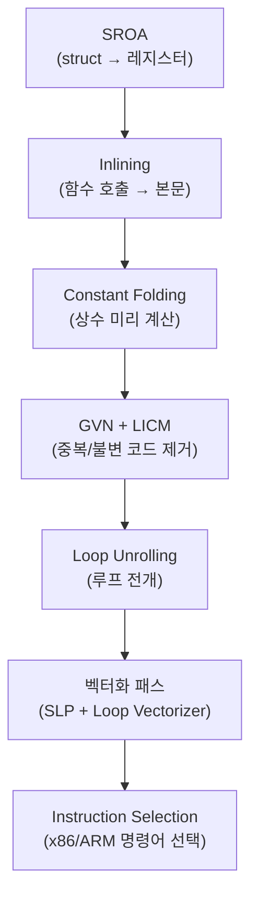

## 서론

2018년, Aras Pranckevičius는 ToyPathTracer 벤치마크에서 놀라운 결과를 발표했다. **C# Burst가 C++보다 빠른** 경우가 존재한다는 것이다 — PC에서 Burst 140 Mray/s vs C++ 136 Mray/s.

> Aras Pranckevičius, *"Pathtracer 16: Burst & SIMD Optimization"*, 2018

C#이 C++보다 빠르다니, 직감적으로 이상하다. JIT 컴파일, GC 오버헤드, managed 타입 제약 — 이 모든 것이 C#을 느리게 만드는 요인 아닌가?

Burst가 이를 가능하게 하는 비결은 **LLVM 백엔드 + Job System의 구조적 보장**에 있다. [이전 포스트들](/posts/UnityJobSystemBurst/)에서 Burst의 컴파일 파이프라인 개요, SIMD 기초, `[BurstCompile]` 기본 사용법을 다뤘다. 이 포스트에서는 **그 안쪽**을 파고든다:

- LLVM이 내부적으로 **어떤 최적화 패스**를 적용하는가
- `[BurstCompile]` 옵션이 코드 생성을 **어떻게 바꾸는가**
- Burst Inspector의 어셈블리를 **실제로 읽는 방법**
- 자동 벡터화가 **성공/실패하는 조건**과 해결법

---

## Part 1: LLVM 최적화 패스 해부

### 1.1 Burst의 4단계 컴파일 파이프라인

[Job System 포스트](/posts/UnityJobSystemBurst/#part-3-burst-compiler)에서 "C# → IL → LLVM IR → 네이티브 코드" 파이프라인의 개요를 다뤘다. Unity 공식 문서는 이를 4단계로 더 세분한다:


> Unity Burst Manual v1.8 — *Compilation Pipeline*

#### Stage 1: Method Discovery

`[BurstCompile]`이 붙은 Job struct를 찾고, `Execute()` 메서드를 컴파일 대상으로 등록한다. 이 단계에서 제네릭 인스턴스화도 처리된다.

#### Stage 2: Front End (IL → Burst IR)

C# 컴파일러가 생성한 IL(Intermediate Language)을 Burst 내부 중간 표현(Burst IR)으로 변환한다.

**이 단계에서 제거되는 것:**
- GC 연동 코드 (메모리 배리어, 카드 테이블 업데이트)
- vtable 기반 가상 함수 디스패치
- boxing/unboxing
- 예외 처리 인프라 (try-catch)

**이 단계에서 추가되는 것:**
- `noalias` 메타데이터 — NativeContainer 파라미터가 서로 겹치지 않음을 보장
- `readonly` 메타데이터 — `[ReadOnly]` 어트리뷰트가 달린 배열
- 타입 안전성 검증 — managed 타입 사용 시 컴파일 에러

이 `noalias` 주석이 바로 **Burst가 C++보다 빠른 코드를 생성할 수 있는 핵심 이유**다. C++ 컴파일러는 포인터 앨리어싱 가능성을 항상 고려해야 하지만, Burst는 Job System의 Safety System 덕분에 **"100% alias-free"**를 구조적으로 보장한다.

> 5argon, *"Unity at GDC: C# to Machine Code"* — C++에서 `__restrict` 키워드 하나로 4배 성능 향상이 관측된 예제가 있으나, Burst는 이를 자동으로 해결한다.

#### Stage 3: Middle End (최적화)

Burst IR을 LLVM IR로 변환한 뒤, LLVM의 최적화 패스 파이프라인을 적용한다. 이것이 이 포스트의 핵심 주제다.

#### Stage 4: Back End (코드 생성)

최적화된 LLVM IR을 타겟 플랫폼의 네이티브 코드로 변환한다. Instruction Selection → Register Allocation → Code Emission 순서로 진행된다.

#### 참고: "커널 이론"의 현실

Burst의 원래 설계 철학은 "작은 성능-핵심 커널 함수만 컴파일하고, 나머지는 managed glue code"였다. 하지만 Sebastian Schoner는 2024년 분석에서 이 "커널 이론"이 **실증적으로 반증**되었음을 보였다:

- 단순한 `OnCreate` 메서드의 디스어셈블리: 약 **16,000줄**의 어셈블리
- ECB(EntityCommandBuffer) 재생의 Burst 컴파일: 시스템당 약 **64,000줄**

> Sebastian Schoner, *"Burst and the Kernel Theory of Game Performance"*, 2024.12

실제 프로젝트에서는 커널뿐 아니라 ECS 프레임워크 자체의 복잡성(enableable components, query caching, error handling)까지 Burst 컴파일 범위에 들어오면서, 컴파일 시간이 급격히 증가할 수 있다. 이에 대한 실전적 대응은 Part 5에서 다룬다.

### 1.2 주요 LLVM 최적화 패스

Burst의 Middle End에서 적용되는 핵심 LLVM 패스들을 정리한다. 각 패스가 코드를 어떻게 변환하는지 C# 의사코드로 살펴보자.

> LLVM Passes Reference — https://llvm.org/docs/Passes.html

#### SROA (Scalar Replacement of Aggregates)

구조체나 배열을 개별 스칼라 값으로 분해하여 **레지스터에 직접 배치**한다.

```csharp
// Before SROA:
float3 pos = Positions[i];
float3 vel = Velocities[i];
float3 newPos = pos + vel * dt;  // float3는 struct — 메모리에 할당?
Positions[i] = newPos;

// After SROA:
// float3의 x, y, z가 각각 레지스터에 분리
float px = Positions_x[i], py = Positions_y[i], pz = Positions_z[i];
float vx = Velocities_x[i], vy = Velocities_y[i], vz = Velocities_z[i];
Positions_x[i] = px + vx * dt;
Positions_y[i] = py + vy * dt;
Positions_z[i] = pz + vz * dt;
```

이 패스가 `float3`, `quaternion` 같은 Unity.Mathematics 타입의 성능에 **결정적**이다. SROA가 없으면 struct를 매번 메모리에 읽고 쓰는 오버헤드가 발생한다.

#### Inlining (함수 인라이닝)

함수 호출을 호출 지점에 본문으로 대체한다.

```csharp
// Before Inlining:
float dist = math.distance(pos, target);
// ↓ math.distance()의 본문이 삽입됨

// After Inlining:
float3 d = pos - target;
float dist = math.sqrt(d.x * d.x + d.y * d.y + d.z * d.z);
```

`[MethodImpl(MethodImplOptions.AggressiveInlining)]`을 붙이면 인라이닝 임계값을 낮춰 더 적극적으로 인라이닝한다. `Unity.Mathematics`의 `math.*` 함수들은 대부분 이 어트리뷰트가 달려 있어, Burst 컴파일 시 호출 오버헤드가 0이다.

#### LICM (Loop-Invariant Code Motion)

루프 안에서 매 반복 동일한 결과를 내는 계산을 **루프 밖으로** 이동한다.

```csharp
// Before LICM:
for (int i = 0; i < count; i++)
{
    float invDt = 1f / DeltaTime;         // ← 매 반복 동일!
    Velocities[i] = Positions[i] * invDt;
}

// After LICM:
float invDt = 1f / DeltaTime;             // ← 루프 밖으로 이동
for (int i = 0; i < count; i++)
{
    Velocities[i] = Positions[i] * invDt;
}
```

개발자가 놓치기 쉬운 최적화지만, LLVM은 이를 자동으로 처리한다. 단, 사이드 이펙트가 있는 함수 호출은 이동하지 않는다.

#### Constant Folding + Propagation

컴파일 타임에 계산 가능한 상수를 미리 계산하고, 그 결과를 사용처에 전파한다.

```csharp
// Before:
float twoPi = 2f * math.PI;
float angle = twoPi * 0.25f;

// After:
float angle = 1.5707963f;  // 컴파일 타임에 계산 완료
```

#### GVN (Global Value Numbering)

동일한 표현식의 중복 계산을 제거한다.

```csharp
// Before:
float distA = math.sqrt(dx * dx + dz * dz);
// ... 다른 코드 ...
float distB = math.sqrt(dx * dx + dz * dz);  // 동일한 계산!

// After:
float dist = math.sqrt(dx * dx + dz * dz);
float distA = dist;
float distB = dist;  // 중복 제거
```

#### Loop Unrolling

루프 본문을 여러 번 복제하여 분기 오버헤드를 줄이고 벡터화 기회를 확장한다.

```csharp
// Before:
for (int i = 0; i < 8; i++)
    result[i] = data[i] * 2f;

// After (4배 언롤):
result[0] = data[0] * 2f;
result[1] = data[1] * 2f;
result[2] = data[2] * 2f;
result[3] = data[3] * 2f;
result[4] = data[4] * 2f;  // 이어서...
result[5] = data[5] * 2f;
result[6] = data[6] * 2f;
result[7] = data[7] * 2f;
// → 분기 오버헤드 제거 + SIMD 벡터화 기회 확대
```

#### 패스 적용 순서

이 패스들은 단독이 아니라 **순서대로 파이프라인으로** 적용된다. 한 패스의 결과가 다음 패스의 입력이 된다:



### 1.3 벡터화 패스: Loop Vectorizer vs SLP Vectorizer

LLVM에는 두 가지 독립적인 벡터화기가 있다.

> LLVM Vectorizers — https://llvm.org/docs/Vectorizers.html

#### Loop Vectorizer

스칼라 루프를 **벡터 루프 + 스칼라 나머지(remainder)**로 변환한다.

```csharp
// Before (스칼라 루프):
for (int i = 0; i < 1000; i++)
    distances[i] = math.distance(positions[i], target);

// After (벡터화, 개념):
for (int i = 0; i < 1000; i += 4)  // 4개씩 처리
{
    // SSE: 4개 float 동시 계산
    __m128 dx = _mm_sub_ps(load4(pos_x + i), broadcast(target.x));
    __m128 dz = _mm_sub_ps(load4(pos_z + i), broadcast(target.z));
    __m128 distSq = _mm_add_ps(_mm_mul_ps(dx, dx), _mm_mul_ps(dz, dz));
    _mm_store_ps(distances + i, _mm_sqrt_ps(distSq));
}
// 나머지 (1000 % 4 = 0이면 불필요)
```

Loop Vectorizer는 **비용 모델(cost model)**을 사용하여 벡터화 팩터(한 번에 몇 개 처리할지)와 언롤 팩터를 결정한다. 비용이 이득보다 크면 벡터화를 포기한다.

**에필로그 벡터화**: 루프 횟수가 벡터 폭으로 나누어지지 않을 때, 나머지를 처리하는 에필로그도 **더 작은 벡터 폭으로** 벡터화할 수 있다. 예: 메인 루프 AVX2(8-wide) + 에필로그 SSE(4-wide).

#### SLP Vectorizer (Superword-Level Parallelism)

**루프 없이도** 병렬 가능한 독립적 스칼라 연산을 벡터 연산으로 합친다.

```csharp
// Before (독립적인 스칼라 계산):
float ax = bx + cx;
float ay = by + cy;
float az = bz + cz;
float aw = bw + cw;

// After (SLP가 4개 독립 덧셈을 1개 SIMD로):
__m128 a = _mm_add_ps(b_xyzw, c_xyzw);
```

SLP Vectorizer는 코드를 **bottom-up으로** 분석하여, 같은 종류의 연산이 독립적으로 나열된 패턴을 찾아 벡터화한다. 이것이 `float3`, `float4` 연산이 자동으로 SIMD로 변환되는 메커니즘이다.

---

## Part 2: [BurstCompile] 옵션 완전 가이드

[Job System 포스트](/posts/UnityJobSystemBurst/#burst-제약사항)에서 `[BurstCompile]`의 기본 사용법과 제약사항을 다뤘다. 여기서는 **옵션 파라미터**가 코드 생성을 어떻게 바꾸는지 깊이 들어간다.

### FloatPrecision

부동소수점 수학 함수의 **정밀도 허용 범위**를 설정한다.

| 레벨 | 허용 ULP | 적용 함수 | 성능 영향 |
|------|---------|-----------|-----------|
| `Standard` (기본) | ≤ 3.5 ULP | sin, cos, exp, log, pow 등 | 기준선 |
| `High` | ≤ 1.0 ULP | 동일 | -5~10% |
| `Medium` | ≤ 범위 내 | 동일 | 약간 빠름 |
| `Low` | **≤ 350.0 ULP** | 동일 | **가장 빠름** |

> Unity Burst Manual v1.8 — *FloatPrecision*

`Low`의 350 ULP는 상당한 오차다. `sin(x)`의 결과가 실제 값과 최대 350 ULP 차이날 수 있다. 게임 로직에서는 충분할 수 있지만, 물리 시뮬레이션이나 금융 계산에서는 위험하다.

`Low`가 빠른 이유: **rsqrt(역제곱근 근사)**와 **rcp(역수 근사)** 같은 하드웨어 전용 명령어의 사용을 허용하기 때문이다. 이 명령어들은 정밀도를 포기하는 대신 매우 빠르다 (Part 6에서 상세 비교).

### FloatMode

부동소수점 연산의 **재배치 규칙**을 설정한다. 이것이 **벡터화에 직접적인 영향**을 미친다.

| 모드 | 재배치 | FMA 허용 | NaN/Inf | 리덕션 벡터화 | 결정론 |
|------|--------|----------|---------|--------------|--------|
| `Default` | 제한적 | 플랫폼 의존 | 존중 | **불가** | 없음 |
| `Strict` | 불가 | 불가 | 존중 | **불가** | 플랫폼 내 |
| `Fast` | **허용** | **허용** | 무시 | **가능** | 없음 |
| `Deterministic` | 제한적 | 플랫폼 의존 | 존중 | 불가 | **크로스플랫폼** |

**핵심**: `FloatMode.Fast`는 LLVM의 `-fassociative-math`에 해당한다. 이것이 부동소수점 리덕션 벡터화의 열쇠다.

```csharp
// 리덕션 예시:
float sum = 0;
for (int i = 0; i < count; i++)
    sum += values[i];  // sum = ((sum + v[0]) + v[1]) + v[2] + ...
```

IEEE 754 부동소수점 덧셈은 **비결합적**이다. `(a + b) + c ≠ a + (b + c)`일 수 있다. 따라서 `Default`/`Strict`에서는 덧셈 순서를 바꿀 수 없어, SIMD 4-wide 병렬 덧셈(순서 변경 필수)이 불가능하다.

`Fast` 모드는 이 제약을 풀어 재배치를 허용한다 → 리덕션 루프가 벡터화된다.

> LLVM Vectorizers — *"By default, the vectorizer will only vectorize reductions for integer types. For floating-point reductions, -fassociative-math (or -ffast-math) is needed."*

#### FloatMode.Deterministic과 IEEE 754

크로스플랫폼 재현성이 중요한 넷코드에서는 `Deterministic`이 필요하다. 하지만 이것은 성능 비용을 수반한다.

IEEE 754 표준 자체가 **크로스플랫폼 재현성을 보장하지 않는다**. 표준은 "같은 연산, 같은 데이터, 같은 라운딩 모드"에서 결과가 동일함만 보장하며:
- 언더플로 처리 방법이 두 가지 허용됨 (구현 선택)
- sin, cos 같은 초월 함수는 표준에서 **완전히 제외**
- decimal↔binary 변환도 완전히 명세되지 않음

`FloatMode.Deterministic`은 이런 차이를 억제하기 위해 추가 연산을 삽입하므로, 성능 저하가 발생한다. 64비트 플랫폼에서만 지원된다.

참고로 Box2D 물리 엔진(2024)은 크로스플랫폼 결정론을 달성하기 위해 `-ffp-contract=off`(FMA 비활성화) + fast-math 금지 + 자체 `atan2f` 구현을 채택했다. Apple M2와 AMD Ryzen에서 동일한 결과를 확인했으며, 놀랍게도 성능 저하는 없었다. 이는 **결정론과 성능이 반드시 트레이드오프가 아닐 수 있음**을 보여주는 사례다.

> Erin Catto, *"Determinism"*, Box2D Blog, 2024.08

#### 주의: 옵션이 효과가 없을 수 있다

Jackson Dunstan의 2019년 테스트에서 FloatMode/FloatPrecision 설정이 **동일한 어셈블리를 생성**한 사례가 보고되었다. 옵션을 바꿔도 실제 코드 생성이 달라지지 않을 수 있다.

> Jackson Dunstan, *"FloatPrecision and FloatMode"*, 2019

**반드시 Burst Inspector에서 실제 어셈블리를 확인하라.** 옵션만 바꾸고 검증하지 않으면 효과가 없는 최적화에 시간을 낭비할 수 있다.

### OptimizeFor

| 모드 | 언롤링 | 코드 크기 | 적합한 상황 |
|------|--------|-----------|------------|
| `Default` | 보통 | 보통 | 대부분 |
| `Performance` | **공격적** | 큼 | 핫 루프가 명확한 경우 |
| `Size` | 최소 | **작음** | I-cache 압력이 높은 경우, 모바일 |
| `Balanced` | 중간 | 중간 | 절충안 |

`Performance`는 루프를 더 많이 언롤하고 인라이닝 임계값을 높인다. 핫 루프의 처리량은 증가하지만, 코드가 커져서 **명령어 캐시(I-cache) 미스**가 증가할 수 있다.

`Size`는 반대로 최소한의 언롤만 수행한다. 코드가 작아져 I-cache에 유리하지만, 루프당 처리량은 낮다. 모바일(I-cache가 작은 ARM)에서 유리할 수 있다.

### 기타 옵션

| 옵션 | 설명 | 용도 |
|------|------|------|
| `CompileSynchronously` | 에디터에서 비동기 대신 동기 컴파일 | 디버깅: Burst 코드가 즉시 활성화됨을 보장 |
| `DisableSafetyChecks` | bounds check 등 안전성 검사 제거 | 릴리스 빌드 (Part 6에서 상세) |
| `Debug` | 변수명 보존, 최적화 비활성화 | 네이티브 디버거 연결 시 |

### 플랫폼별 분기: 컴파일 타임 평가

```csharp
using static Unity.Burst.Intrinsics.X86;
using static Unity.Burst.Intrinsics.Arm.Neon;

[BurstCompile]
struct PlatformAwareJob : IJobParallelFor
{
    public void Execute(int i)
    {
        if (IsAvx2Supported)
        {
            // AVX2 전용 코드 — x86에서만 컴파일됨
        }
        else if (IsNeonSupported)
        {
            // ARM NEON 전용 코드 — ARM에서만 컴파일됨
        }
        else
        {
            // 폴백
        }
    }
}
```

`IsAvx2Supported`, `IsNeonSupported` 등은 **컴파일 타임에 평가**되어, 해당 플랫폼에서 지원하지 않는 분기는 dead code로 제거된다. 런타임 오버헤드 없이 플랫폼별 최적화를 작성할 수 있다.

### 옵션 조합 가이드

| 상황 | FloatMode | FloatPrecision | OptimizeFor | 비고 |
|------|-----------|----------------|-------------|------|
| 일반 게임 로직 | Default | Standard | Default | 안전한 기본값 |
| 핫 루프 최적화 | **Fast** | Low | **Performance** | 리덕션 벡터화 + 공격적 언롤 |
| 결정론적 넷코드 | **Deterministic** | Standard | Default | 크로스플랫폼 재현성 |
| 모바일 최적화 | Fast | Low | **Size** | I-cache 이점 |
| 디버깅 | Default | Standard | Default | + `Debug = true` |
| 정밀 물리 | **Strict** | **High** | Default | IEEE 754 준수 |

---

## Part 3: Burst Inspector 실전 워크스루

[SoA 포스트](/posts/SoAvsAoS/#burst-inspector로-simd-검증)에서 Burst Inspector를 열고 `xxxps`(벡터) vs `xxxss`(스칼라) 명령어를 구분하는 방법을 맛봤다. 여기서는 **실제 어셈블리를 한 줄씩 읽는** 수준까지 간다.

### 3.1 x86 어셈블리 읽기 최소 가이드

Burst Inspector 출력을 읽기 위한 최소한의 지식이다. 완벽한 x86 이해가 아니라, **Burst가 생성하는 코드를 해석할 수 있는 수준**을 목표로 한다.

#### 레지스터

| 레지스터 | 크기 | 용도 |
|----------|------|------|
| `xmm0`~`xmm15` | 128비트 | SSE SIMD (float × 4 또는 double × 2) |
| `ymm0`~`ymm15` | 256비트 | AVX2 SIMD (float × 8 또는 double × 4) |
| `rdi`, `rsi`, `rcx`, `rdx` | 64비트 | 포인터, 인덱스, 카운터 |
| `rax` | 64비트 | 리턴 값, 범용 |
| `rsp`, `rbp` | 64비트 | 스택 포인터 (보통 무시 가능) |

#### 어드레싱 모드

```
[rdi + rcx*4]
 ↑       ↑  ↑
 베이스   인덱스  스케일

의미: rdi 포인터 + (rcx × 4) 바이트 오프셋
예시: rdi = NativeArray의 시작 주소, rcx = 루프 인덱스, 4 = sizeof(float)
→ float 배열의 rcx번째 요소
```

#### 접미사 규칙

| 접미사 | 의미 | 처리 단위 |
|--------|------|-----------|
| `ps` | **P**acked **S**ingle | float × 4 (SSE) 또는 × 8 (AVX) |
| `pd` | **P**acked **D**ouble | double × 2 또는 × 4 |
| `ss` | **S**calar **S**ingle | float × 1 |
| `sd` | **S**calar **D**ouble | double × 1 |

> Unity Learn DOTS Best Practices — *"xxxps 명령어(addps, mulps 등)는 벡터화된 SIMD이고, xxxss 명령어(addss, mulss 등)는 스칼라다. 목표는 가능한 한 많은 스칼라 명령어를 제거하는 것이다."*

#### 핵심 명령어 레퍼런스

Burst Inspector에서 자주 보이는 명령어와 **실제 비용**:

| 명령어 | 의미 | 레이턴시 | 스루풋 |
|--------|------|---------|--------|
| `movaps` | Aligned Packed Single 로드/스토어 | 3-5 | 0.5 |
| `addps` | Packed 덧셈 (float×4) | 3-4 | 0.5 |
| `subps` | Packed 뺄셈 | 3-4 | 0.5 |
| `mulps` | Packed 곱셈 | 3-5 | 0.5 |
| `divps` | Packed 나눗셈 | 11-14 | 4-5 |
| `sqrtps` | Packed 제곱근 | **12-18** | 4-6 |
| `rsqrtps` | Packed 역제곱근 (근사) | **4** | 1 |
| `rcpps` | Packed 역수 (근사) | 4 | 1 |
| `vfmadd231ps` | Fused Multiply-Add (a*b+c) | 4-5 | 0.5 |
| `cmpps` | Packed 비교 | 3-4 | 0.5-1 |
| `vblendvps` | 조건부 블렌드 (select) | 2 | 1 |
| `movss` | **Scalar** Single 로드 | 3-5 | 0.5 |
| `addss` | **Scalar** 덧셈 (float×1) | 3-4 | 0.5 |

> 레이턴시/스루풋은 Skylake 기준 사이클 수. Agner Fog, *"Instruction Tables"* (2025.12) — 벤더 공식 값이 아닌 독자적 측정에 기반한 데이터.

**`sqrtps`(12-18 사이클) vs `rsqrtps`(4 사이클)**의 3~4배 차이에 주목하라. `FloatPrecision.Low`가 `rsqrtps` 사용을 허용하는 것이 성능에 미치는 영향이 이 수치에서 직접적으로 드러난다.

### 3.2 Burst Inspector UI

**열기**: Unity 메뉴 → `Jobs` → `Burst` → `Open Inspector`

Burst Inspector는 **4가지 뷰**를 제공한다:

| 뷰 | 내용 | 용도 |
|----|------|------|
| **.NET IL** | C# 컴파일러가 생성한 중간 언어 | Burst가 받는 입력 확인 |
| **Unoptimized LLVM IR** | 최적화 전 LLVM 중간 표현 | 패스 적용 전 상태 확인 |
| **Optimized LLVM IR** | 최적화 후 LLVM 중간 표현 | 어떤 최적화가 적용되었는지 확인 |
| **Final Assembly** | 타겟 플랫폼 네이티브 어셈블리 | **실제 성능 판단의 기준** |

**타겟 드롭다운**: 같은 Job의 어셈블리를 SSE2, SSE4.2, AVX2 등 다른 타겟으로 컴파일한 결과를 비교할 수 있다.

### 3.3 실전 워크스루: DistanceJob

간단한 거리 계산 Job의 어셈블리를 추적해보자.

```csharp
[BurstCompile(FloatMode = FloatMode.Fast, OptimizeFor = OptimizeFor.Performance)]
struct DistanceJob : IJobParallelFor
{
    [ReadOnly] public NativeArray<float3> Positions;
    [WriteOnly] public NativeArray<float> Distances;
    [ReadOnly] public float3 Target;

    public void Execute(int i)
    {
        float3 d = Positions[i] - Target;
        Distances[i] = math.sqrt(d.x * d.x + d.y * d.y + d.z * d.z);
    }
}
```

Burst Inspector에서 이 Job을 SSE4.2 타겟으로 보면, 핫 루프 부분은 대략 이런 형태다:

```nasm
; 벡터화된 루프 본체 (4개 float3를 동시에 처리)
.LBB0_4:                          ; ← 루프 시작 레이블
    movaps  xmm2, [rdi + rcx*4]  ; Positions[i].xyz 4개분 로드
    subps   xmm2, xmm0           ; d = pos - target (4개 동시)
    mulps   xmm2, xmm2           ; d*d (4개 동시)
    ; ... haddps로 x²+y²+z² 합산 ...
    sqrtps  xmm2, xmm2           ; sqrt (4개 동시)
    movaps  [rsi + rcx*4], xmm2  ; Distances[i] = result (4개 동시)
    add     rcx, 4                ; i += 4
    cmp     rcx, rdx              ; i < count?
    jb      .LBB0_4              ; → 루프 반복

; 스칼라 나머지 (count가 4로 나누어지지 않을 때)
.LBB0_6:
    movss   xmm2, [rdi + rcx*4]  ; Positions[i] 1개만 로드
    subss   xmm2, xmm0           ; 스칼라 뺄셈
    ; ...
    sqrtss  xmm2, xmm2           ; 스칼라 sqrt
    movss   [rsi + rcx*4], xmm2  ; 1개만 저장
```

**읽는 포인트:**
1. `.LBB0_4`가 벡터화된 **메인 루프** — `xxxps` 명령어가 주를 이룸
2. `.LBB0_6`가 **스칼라 나머지** — `xxxss` 명령어
3. `add rcx, 4`로 한 번에 4개씩 처리
4. `movaps`(aligned)가 사용됨 → NativeArray의 16바이트 정렬이 활용되고 있음

### 3.4 플랫폼별 코드 생성 비교

같은 Job을 다른 타겟으로 컴파일하면:

| 특성 | x86 SSE4.2 | x86 AVX2 | ARM NEON |
|------|-----------|----------|----------|
| SIMD 레지스터 폭 | 128비트 (xmm) | 256비트 (ymm) | 128비트 (v/q) |
| float 동시 처리 | 4개 | **8개** | 4개 |
| 덧셈 명령어 | `addps` | `vaddps` | `fadd` |
| 루프당 처리 | 4개 | 8개 | 4개 |
| FMA | 별도 (`mulps` + `addps`) | `vfmadd231ps` 1개 | `fmla` 1개 |

AVX2 타겟에서는 `ymm` 레지스터를 사용하여 **한 번에 8개 float**를 처리하므로, 이론적으로 SSE4.2 대비 2배 처리량이다.

> ARM Neon + Burst — https://learn.arm.com/learning-paths/mobile-graphics-and-gaming/using-neon-intrinsics-to-optimize-unity-on-android/

---

## Part 4: 자동 벡터화 — 성공과 실패

Unity 공식 문서는 이렇게 경고한다:

> **"Loop vectorization is notoriously brittle."**
> — Unity Burst Manual v1.8, *Optimization Guidelines*

### 4.1 벡터화가 성공하는 조건

1. **단순 루프**: 단일 for 루프, 복잡한 제어 흐름 없음
2. **순차 접근**: `data[i]`, `data[i+1]` — 연속적인 메모리 접근
3. **데이터 독립**: `Execute(i)`의 결과가 `Execute(j)`에 영향을 주지 않음
4. **SoA 레이아웃**: 같은 타입의 데이터가 연속 배치 (이전 포스트에서 다룸)
5. **인라인 가능한 함수**: `math.*` 함수는 `[AggressiveInlining]`으로 인라인됨

#### `Loop.ExpectVectorized()`로 검증

```csharp
#define UNITY_BURST_EXPERIMENTAL_LOOP_INTRINSICS
using static Unity.Burst.CompilerServices.Loop;

[BurstCompile]
struct VerifiedJob : IJobParallelFor
{
    [ReadOnly] public NativeArray<float> A;
    [WriteOnly] public NativeArray<float> B;

    public void Execute(int i)
    {
        // 이 루프가 벡터화되지 않으면 컴파일 에러 발생
        ExpectVectorized();
        B[i] = A[i] * 2f;
    }
}
```

이 인트린직은 **컴파일 타임에** 벡터화 여부를 검증한다. 조건 분기 하나 추가했더니 벡터화가 깨진 경우를 자동으로 잡아준다. 공식 문서의 실측: 분기 하나로 **32개 정수 연산 → 1개로 퇴보**.

### 4.2 벡터화가 실패하는 패턴

#### 패턴 1: 부동소수점 리덕션

```csharp
// ❌ FloatMode.Default에서 벡터화 불가
float sum = 0;
for (int i = 0; i < count; i++)
    sum += values[i];  // loop-carried dependency + FP 비결합성
```

**원인**: IEEE 754 부동소수점 덧셈은 비결합적 → 순서 변경 시 결과가 달라짐 → 컴파일러가 벡터화를 거부.

**해결**: `[BurstCompile(FloatMode = FloatMode.Fast)]`로 재배치 허용.

```csharp
// ✅ FloatMode.Fast에서 벡터화
[BurstCompile(FloatMode = FloatMode.Fast)]
struct SumJob : IJob
{
    [ReadOnly] public NativeArray<float> Values;
    public NativeReference<float> Sum;

    public void Execute()
    {
        float sum = 0;
        for (int i = 0; i < Values.Length; i++)
            sum += Values[i];
        Sum.Value = sum;
    }
}
```

#### 패턴 2: 루프 내 조건 분기

```csharp
// ❌ 분기가 벡터화를 방해할 수 있음
for (int i = 0; i < count; i++)
{
    if (IsAlive[i] == 1)
        Distances[i] = math.distance(Positions[i], target);
    else
        Distances[i] = float.MaxValue;
}
```

**해결**: `math.select`로 무분기화.

```csharp
// ✅ math.select → SIMD vblendvps (무분기)
for (int i = 0; i < count; i++)
{
    float dist = math.distance(Positions[i], target);
    Distances[i] = math.select(float.MaxValue, dist, IsAlive[i] == 1);
}
```

어셈블리 수준에서:
```nasm
; if/else 버전: 분기 명령어 사용
cmpb    [rbx + rcx], 1
jne     .LBB0_skip        ; ← 분기: 예측 실패 시 파이프라인 플러시

; math.select 버전: 무분기 블렌드
cmpps   xmm3, xmm4, 0    ; 비교 → 마스크 생성
vblendvps xmm2, xmm5, xmm2, xmm3  ; ← 무분기: 마스크로 선택
```

LLVM의 **If-Conversion** 패스가 간단한 조건문을 자동으로 predication으로 변환하기도 하지만, 보장되지 않는다. `math.select`로 명시적으로 작성하는 것이 안전하다.

#### 패턴 3: 비인라인 함수 호출

```csharp
// ❌ CustomDistance가 인라인되지 않으면 벡터화 불가
for (int i = 0; i < count; i++)
    Distances[i] = CustomDistance(Positions[i], target);

// ✅ 해결: AggressiveInlining
[MethodImpl(MethodImplOptions.AggressiveInlining)]
static float CustomDistance(float3 a, float3 b) { ... }
```

#### 패턴 4: 앨리어싱

두 NativeArray가 같은 메모리를 가리킬 **가능성**이 있으면, 컴파일러는 보수적으로 벡터화를 포기한다.

```csharp
// Job의 NativeArray 파라미터는 자동으로 noalias → 벡터화 가능
// 하지만 함수에 NativeArray를 전달하면 noalias가 사라질 수 있음

// ✅ [NoAlias] 명시로 해결
static void Process([NoAlias] NativeArray<float> input,
                    [NoAlias] NativeArray<float> output) { ... }
```

> 5argon (GDC 2018) — *"C++에서 `__restrict` 하나로 4배 성능 향상이 관측된 예제가 있으나, Burst는 Job System의 Safety System 덕분에 이를 자동으로 해결한다."*

이것이 **Job 내부의 `Execute()` 메서드가 일반 함수보다 벡터화되기 쉬운 이유**다. Job의 NativeContainer 필드는 구조적으로 alias-free가 보장된다.

### 4.3 Unity.Mathematics → SIMD 매핑

`math.*` 함수가 SIMD 명령어로 어떻게 변환되는지 주요 매핑을 정리한다.

| C# (Unity.Mathematics) | x86 SSE/AVX | 동시 처리 | 비고 |
|-------------------------|-------------|-----------|------|
| `a + b` (float3) | `addps` | 4 float | SLP 벡터화 |
| `a * b` (float3) | `mulps` | 4 float | SLP 벡터화 |
| `math.sqrt(x)` | `sqrtps` | 4 float | 12-18 사이클 |
| `math.rsqrt(x)` | `rsqrtps` | 4 float | 4 사이클 (근사) |
| `math.select(a, b, c)` | `vblendvps` | 4 float | **무분기** |
| `math.dot(a, b)` | `mulps` + `haddps` | 4 → 1 | 수평 연산 (비싼 편) |
| `math.mad(a, b, c)` | `vfmadd231ps` | 4 float | FMA: 1 명령어로 a*b+c |
| `math.normalizesafe(v)` | `mulps` + `rsqrtps` + `mulps` | 4 float | Low에서 rsqrt 사용 |

**`math.*` vs `Mathf.*` 차이**: Burst는 `math.*` 함수를 **인트린식으로 인식**하여 직접 SIMD 명령어로 변환한다. `Mathf.*`는 managed 호출로 취급되어 인라인/벡터화가 안 될 수 있다.

#### 수평 연산의 비용

`math.dot`이나 `math.csum` 같은 **수평 연산(horizontal operation)**은 SIMD에서 상대적으로 비싸다. 하나의 SIMD 레지스터 안의 여러 값을 합산해야 하기 때문이다.

```nasm
; math.dot(a, b) 의 실제 어셈블리 (SSE):
mulps   xmm0, xmm1        ; a.x*b.x, a.y*b.y, a.z*b.z, a.w*b.w  (1 사이클)
haddps  xmm0, xmm0        ; (xy+zw), (xy+zw), ...                (3 사이클)
haddps  xmm0, xmm0        ; (xy+zw+xy+zw), ...                   (3 사이클)
; → 총 7 사이클: 수평 리덕션 때문에 단순 mulps+addps보다 느림
```

`haddps`는 수평 덧셈(horizontal add)으로, 레이턴시가 높다. 가능하면 수평 연산을 루프 밖으로 밀어내거나, SoA 레이아웃으로 수직 연산(vertical operation)으로 변환하는 것이 유리하다.

### 4.4 Frustum Culling 벤치마크

Unity Learn DOTS Best Practices에서 제공하는 Frustum Culling 4가지 구현의 벤치마크는 벡터화 전략의 실전적 비교를 보여준다.

| 버전 | 전략 | 핵심 특징 |
|------|------|-----------|
| v1 | Loop + early break | 6개 평면을 루프로 검사, 실패 시 break |
| v2 | Unrolled, no branch | 6개 평면 검사를 풀어서 분기 제거 |
| v3 | Plane packet SIMD | 평면을 4개씩 묶어 SIMD 처리 |
| v4 | Vertical SIMD (4구체 동시) | 4개 구체를 동시에 검사 (**가장 빠름**) |

> Unity Learn, *"Getting the Most Out of Burst"*

v4가 가장 빠른 이유: **데이터 방향을 수직으로 전환**하여 4개 구체를 하나의 SIMD 레지스터에 패킹했기 때문이다. v1 대비 수학 연산 수가 **33% 감소**.

이 벤치마크의 교훈: **"알고리즘의 수학 연산 수를 세는 것이 성능의 좋은 예측 변수다."**

---

## Part 5: 컴파일러 힌트와 어트리뷰트

### Hint.Likely / Hint.Unlikely

```csharp
using Unity.Burst.CompilerServices;

public void Execute(int i)
{
    if (Hint.Unlikely(IsAlive[i] == 0))
    {
        // 이 분기는 거의 실행되지 않음 → cold path
        Distances[i] = float.MaxValue;
        return;
    }
    // hot path: 대부분 여기로 옴
    Distances[i] = math.distance(Positions[i], target);
}
```

CPU의 분기 예측기는 대부분의 분기를 올바르게 예측하지만, **오예측(misprediction) 시 파이프라인 플러시**가 발생한다. 그 비용은 아키텍처마다 다르다:

| 아키텍처 | 오예측 페널티 |
|----------|-------------|
| Intel Skylake | ~16.5 사이클 |
| Intel Golden Cove (Alder Lake) | ~17 사이클 |
| AMD Zen 1 | ~19 사이클 |
| Apple M1 | ~8 사이클 |

> Agner Fog, *"The Microarchitecture of Intel, AMD, and VIA CPUs"* (2025); Cloudflare, *"Branch predictor: How many 'if's are too many?"*

`Hint.Likely`/`Hint.Unlikely`는 LLVM에게 분기의 예상 경로를 알려준다. 이를 기반으로:
- **코드 레이아웃**: likely 경로는 fall-through(연속 배치), unlikely 경로는 jump로 처리 → I-cache 효율 향상
- **Loop Vectorizer 결정**: likely 경로가 벡터화 대상

### Hint.Assume

```csharp
public void Execute(int i)
{
    Hint.Assume(i >= 0 && i < Positions.Length);

    // 이제 컴파일러는 i가 범위 내임을 "알고" 있으므로
    // bounds check를 생성하지 않음
    Distances[i] = math.distance(Positions[i], target);
}
```

`Hint.Assume`은 조건이 **항상 참**이라고 컴파일러에게 보장한다. 거짓이면 **정의되지 않은 동작(UB)**이므로 위험하지만, bounds check 제거 등 강력한 최적화를 활성화한다.

### [AssumeRange]

```csharp
[return: AssumeRange(0u, 12u)]
static uint GetMonthIndex() { /* ... */ }

// 컴파일러가 반환값 범위를 알므로:
// - 나눗셈을 곱셈+시프트로 대체 가능 (상수 범위 내이므로)
// - switch/if 분기의 dead branch 제거 가능
```

### Constant.IsConstantExpression()

```csharp
[MethodImpl(MethodImplOptions.AggressiveInlining)]
static float FastPow(float x, float exponent)
{
    if (Constant.IsConstantExpression(exponent))
    {
        // exponent가 컴파일 타임 상수이면 특수 경로
        if (exponent == 2f) return x * x;       // math.pow 대신 곱셈 1회
        if (exponent == 0.5f) return math.sqrt(x);  // math.pow 대신 sqrt
    }
    return math.pow(x, exponent);
}
```

`IsConstantExpression`은 인자가 **컴파일 타임에 상수로 평가 가능한지** 검사한다. 인라이닝 후 상수가 전파되면 조건이 참이 되어 최적 경로가 선택되고, 나머지는 dead code로 제거된다.

### [BurstDiscard]

```csharp
[BurstCompile]
struct MyJob : IJob
{
    public void Execute()
    {
        DoWork();
        LogDebug("Work done");  // Burst에서는 완전히 제거됨
    }

    [BurstDiscard]
    static void LogDebug(string msg)
    {
        Debug.Log(msg);  // managed 코드 — Burst 불가
    }
}
```

`[BurstDiscard]`가 붙은 메서드는 Burst 컴파일 시 **본문이 완전히 제거**된다. managed 전용 디버그 코드를 Burst Job에 넣을 수 있는 유일한 방법이다.

### [SkipLocalsInit]

```csharp
[BurstCompile, SkipLocalsInit]
struct MyJob : IJobParallelFor
{
    public void Execute(int i)
    {
        // 로컬 변수들이 0으로 초기화되지 않음
        // → 대형 스택 할당 시 초기화 비용 절약
        float4x4 matrix;  // 64바이트 — 0 초기화 생략
        // ...
    }
}
```

C#은 기본적으로 모든 로컬 변수를 0으로 초기화한다. `[SkipLocalsInit]`은 이 초기화를 건너뛴다. 대형 struct를 많이 사용하는 핫 루프에서 미세한 성능 이점을 제공한다.

### 함수 포인터: "컴파일 장벽"

일반적으로 함수 포인터는 **인라이닝을 방지**하여 성능을 저하시킨다. 하지만 Sebastian Schoner는 이를 **역으로 활용**하는 전략을 제시했다:

- 중앙 ECS 컴포넌트의 코드가 모든 시스템에 인라인되면 → 시스템당 수만 줄의 어셈블리
- 함수 포인터로 "컴파일 장벽"을 만들면 → 인라인 차단 → **컴파일 시간 25% 단축** (8분 → 6분)
- 런타임 성능은 저하되지만, 개발 사이클에서는 유효한 트레이드오프

> Sebastian Schoner, *"Burst and the Kernel Theory"*, 2024.12

Unity 공식 벤치마크에서 Job은 batched function pointer 대비 **1.26배** 빠르다. 이 차이가 허용 가능한 경우, 컴파일 시간 단축을 위해 함수 포인터를 전략적으로 사용할 수 있다.

---

## Part 6: 흔한 함정과 최적화 패턴

### Safety Checks와 noalias의 관계

**Safety Checks가 활성화되면 noalias 최적화가 비활성화된다.**

Safety System은 런타임에 NativeArray 접근을 검증하기 위해 추가 코드를 삽입한다. 이 과정에서 앨리어싱 정보가 오염되어, LLVM이 공격적 벡터화를 수행할 수 없게 된다.

```csharp
// 에디터 (Safety Checks ON): noalias 최적화 비활성화 → 느림
// 빌드 (Safety Checks OFF): noalias 최적화 활성화 → 빠름

// 빌드 시 명시적으로 끄기:
[BurstCompile(DisableSafetyChecks = true)]
```

**릴리스 빌드에서는 Safety Checks를 반드시 비활성화하라.** 에디터에서의 프로파일링 결과가 빌드와 다를 수 있는 주요 원인 중 하나다.

### 나눗셈 → 역수 곱셈

나눗셈(`divps`)은 곱셈(`mulps`)보다 **20~30배 느리다** (레이턴시 11-14 vs 0.5 사이클).

```csharp
// ❌ 느림: 나눗셈 사용
for (int i = 0; i < count; i++)
    Results[i] = Values[i] / constant;

// ✅ 빠름: 역수 곱셈 (Burst가 상수 나눗셈은 자동 변환)
// 하지만 변수 나눗셈은 수동으로:
float rcp = math.rcp(divisor);  // 1회 역수 계산
for (int i = 0; i < count; i++)
    Results[i] = Values[i] * rcp;  // 곱셈으로 대체
```

상수로 나누는 경우 Burst가 자동으로 역수 곱셈으로 변환하지만, **변수로 나누는 경우**에는 수동으로 `math.rcp`를 사용해야 한다.

### sqrt vs rsqrt

| 연산 | 명령어 | 레이턴시 | 정밀도 |
|------|--------|---------|--------|
| `math.sqrt(x)` | `sqrtps` | **12-18 사이클** | IEEE 754 완전 정밀도 |
| `math.rsqrt(x)` | `rsqrtps` | **4 사이클** | 약 12비트 (~3.5 ULP) |

> Agner Fog, *"Instruction Tables"* (2025) — Skylake 기준

`rsqrt`는 **역제곱근의 근사치**를 4 사이클에 반환한다. `FloatPrecision.Low`를 설정하면 Burst가 `math.sqrt`를 `rsqrt + Newton-Raphson 보정`으로 자동 대체할 수 있다.

```csharp
// 수동으로 rsqrt + Newton-Raphson 1회 보정 (정밀도 향상):
float rsq = math.rsqrt(x);
rsq = rsq * (1.5f - 0.5f * x * rsq * rsq);  // Newton-Raphson
float result = x * rsq;  // sqrt(x) ≈ x * rsqrt(x)
```

정규화(normalize)가 빈번한 게임 코드에서는 `rsqrtps`의 3-4배 속도 이점이 누적되어 유의미한 차이를 만든다.

### 분기 vs 무분기: 언제 어느 쪽이 나은가

`math.select`(무분기)가 항상 `if/else`(분기)보다 빠른 것은 **아니다**.

| 상황 | 더 빠른 쪽 | 이유 |
|------|-----------|------|
| 분기 예측률 ~50% (랜덤 데이터) | **무분기** | 매 2회마다 파이프라인 플러시 → 분기 비용 높음 |
| 분기 예측률 ~95% (대부분 한 쪽) | **분기** | 예측이 거의 맞으므로 무분기의 "항상 양쪽 계산" 비용이 더 큼 |
| 분기 내 계산이 가벼움 | **무분기** | vblendvps 1개 vs jne + 추가 명령어 |
| 분기 내 계산이 비쌈 (sqrt 등) | **분기** | early exit로 비싼 계산을 건너뜀 |

벤치마크에 따르면, **CMOV(무분기 조건부 이동)와 분기의 교차점은 예측 정확도 약 75%**다. 75% 이상 예측이 맞으면 분기가 유리하고, 그 이하면 무분기가 유리하다.

> Algorithmica, *"Branchless Programming"* — CMOV vs conditional branch crossover at ~75% prediction accuracy

```csharp
// isAlive가 95% true → 분기가 유리
if (IsAlive[i] == 0) { Distances[i] = float.MaxValue; return; }
// 5%만 건너뛰므로 분기 예측이 거의 맞음 + early return으로 나머지 계산 생략

// IsAlive가 50/50 → math.select가 유리
Distances[i] = math.select(float.MaxValue, dist, IsAlive[i] == 1);
// 무분기이므로 예측 실패 없음 + 양쪽 계산이 저렴
```

### [NoAlias]와 앨리어싱

Job struct의 NativeArray 필드는 자동으로 noalias 처리되지만, **별도 함수에 NativeArray를 전달하면** noalias 정보가 사라진다.

```csharp
// ❌ 함수 파라미터에서 noalias 정보 손실
static void BadProcess(NativeArray<float> input, NativeArray<float> output)
{
    // 컴파일러: input과 output이 같은 메모리를 가리킬 수도 있으므로 보수적으로 처리
    for (int i = 0; i < input.Length; i++)
        output[i] = input[i] * 2f;
}

// ✅ [NoAlias]로 명시
static void GoodProcess([NoAlias] NativeArray<float> input,
                        [NoAlias] NativeArray<float> output)
{
    // 컴파일러: input과 output은 절대 겹치지 않음 → 공격적 벡터화 가능
    for (int i = 0; i < input.Length; i++)
        output[i] = input[i] * 2f;
}
```

### Job vs Function Pointer 성능

Unity 공식 벤치마크에서 세 가지 Burst 코드 실행 방식의 성능 비교:

| 방식 | 상대 속도 | 이유 |
|------|-----------|------|
| Non-batched Function Pointer | 1.00x (기준) | 호출 오버헤드 + 제한된 최적화 |
| Batched Function Pointer | **1.53x** | 배칭으로 호출 오버헤드 감소 |
| **Job** | **1.93x** | 완벽한 앨리어싱 정보 + 가장 넓은 최적화 기회 |

> Unity Burst Manual — *Function Pointers vs Jobs*

**가능하면 항상 Job을 사용하라.** Job은 구조적으로 컴파일러에게 가장 많은 최적화 정보를 제공한다.

---

## 정리

### 핵심 요약

| 개념 | 핵심 | 참조 |
|------|------|------|
| 4단계 파이프라인 | Discovery → FrontEnd → MiddleEnd → BackEnd | Unity 공식 문서 |
| SROA | struct → 레지스터 분해 (float3 핵심) | LLVM Passes |
| Loop/SLP 벡터화 | 루프 = Loop Vectorizer, 직선 코드 = SLP | LLVM Vectorizers |
| FloatMode.Fast | 리덕션 벡터화의 열쇠 (`-fassociative-math`) | 공식 문서 + LLVM |
| noalias | Job = 자동 alias-free → C++보다 빠른 코드 가능 | GDC 2018 |
| Safety Checks OFF | 릴리스에서 noalias 최적화 활성화 | 공식 문서 |
| sqrtps vs rsqrtps | 12-18 vs 4 사이클 (3-4배 차이) | Agner Fog |
| Loop.ExpectVectorized | 컴파일 타임 벡터화 검증 | 공식 문서 |
| 분기 vs 무분기 | 예측률 기반 판단 | Intel 매뉴얼 |

### 다음 포스트

이 시리즈에서 다음으로 다룰 주제는 **NativeContainer 심화** — NativeList, NativeHashMap, NativeQueue 등 Job System이 제공하는 모든 컨테이너의 내부 구현과 성능 특성을 분석할 예정이다.

---

## References

- **Unity Burst Manual v1.8** — [docs.unity3d.com](https://docs.unity3d.com/Packages/com.unity.burst@1.8/manual/)
- **LLVM Passes Reference** — [llvm.org/docs/Passes.html](https://llvm.org/docs/Passes.html)
- **LLVM Vectorizers** — [llvm.org/docs/Vectorizers.html](https://llvm.org/docs/Vectorizers.html)
- **Agner Fog**, "Optimizing Software in C++" / "Instruction Tables" (2025) — [agner.org/optimize](https://www.agner.org/optimize/)
- **Intel**, "64 and IA-32 Architectures Optimization Reference Manual" v050 (2024)
- **Aras Pranckevičius**, "Pathtracer 16: Burst & SIMD Optimization" (2018) — [aras-p.info](https://aras-p.info/blog/2018/10/29/Pathtracer-16-Burst-SIMD-Optimization/)
- **Sebastian Schoner**, "Burst and the Kernel Theory of Game Performance" (2024) — [blog.s-schoener.com](https://blog.s-schoener.com/2024-12-12-burst-kernel-theory-game-performance/)
- **5argon**, "Unity at GDC: C# to Machine Code" — [medium.com/@5argon](https://medium.com/@5argon/unity-at-gdc-c-to-machine-code-17ab0deaf66d)
- **Jackson Dunstan**, "FloatPrecision and FloatMode" (2019) — [jacksondunstan.com](https://www.jacksondunstan.com/articles/5224)
- **Unity Learn**, "Getting the Most Out of Burst" — DOTS Best Practices
- **Mike Acton**, "Data-Oriented Design and C++" (CppCon 2014) — [YouTube](https://www.youtube.com/watch?v=rX0ItVEVjHc)
- **ARM**, "Using Neon Intrinsics to Optimize Unity on Android" — [learn.arm.com](https://learn.arm.com/learning-paths/mobile-graphics-and-gaming/using-neon-intrinsics-to-optimize-unity-on-android/)
