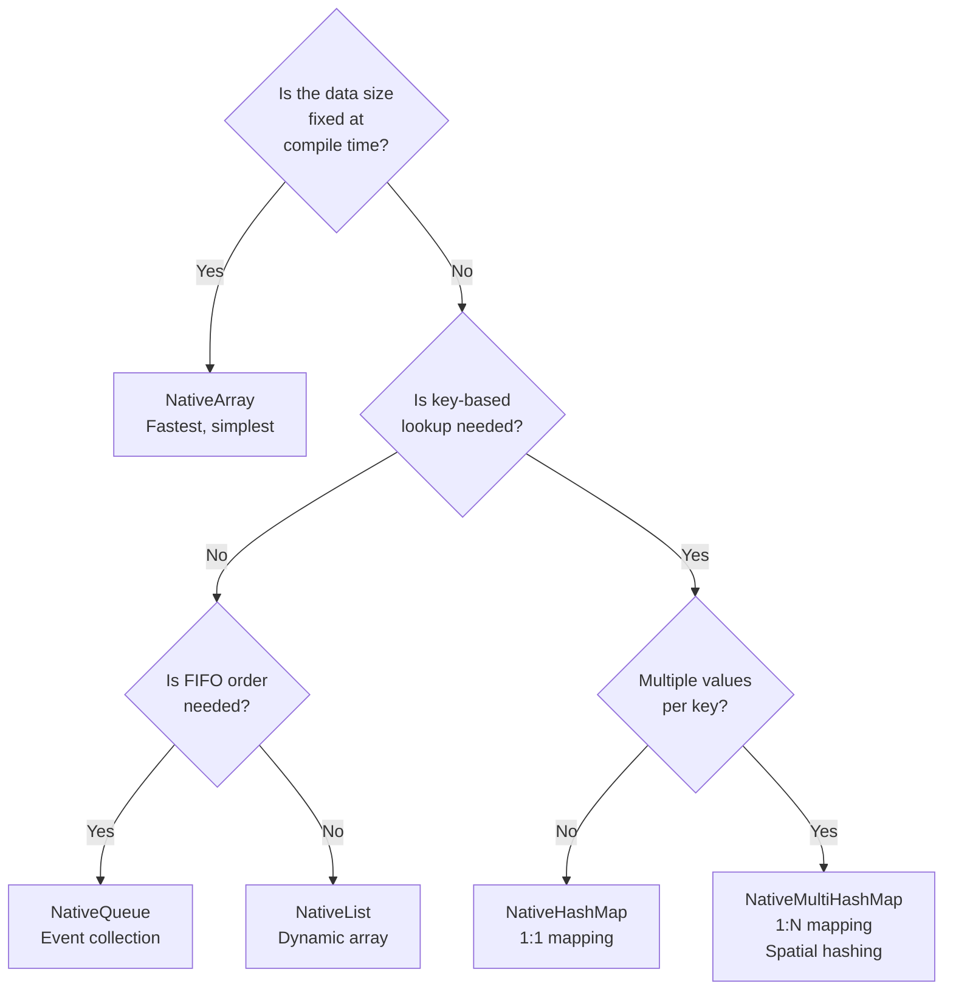
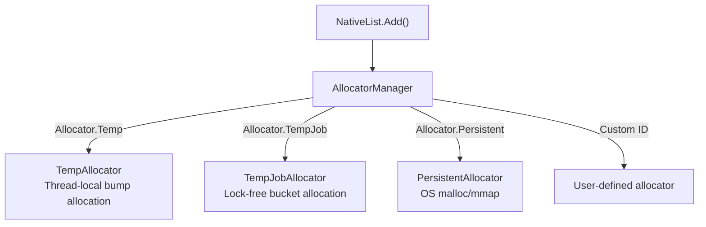
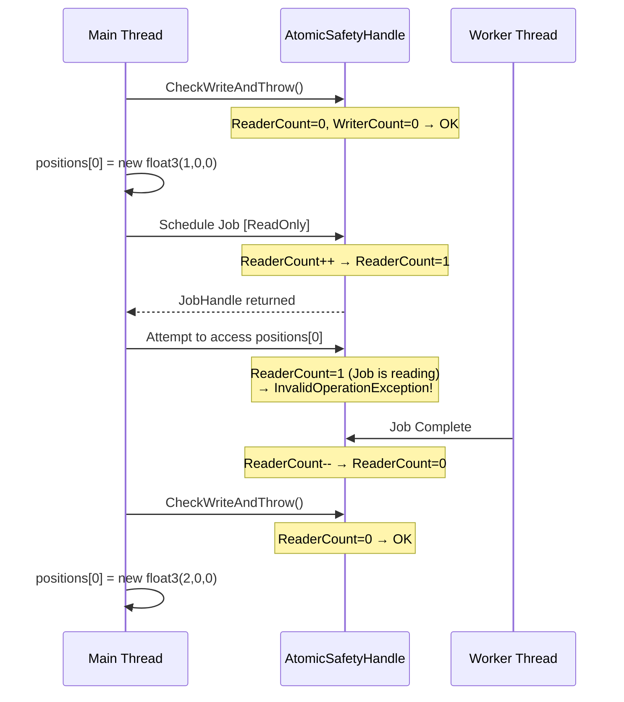

## Introduction

In the [Job System post](/posts/UnityJobSystemBurst/), we dissected the internal structure of NativeArray. We covered the memory model differences from C# arrays, Allocator types, and the basics of how the Safety System works.

However, in practice, NativeArray alone cannot solve everything. You need dynamically-sized lists, fast key-value lookups, and the ability for multiple worker threads to simultaneously enqueue results. Unity's `Unity.Collections` package provides various containers for these needs: **NativeList, NativeHashMap, NativeQueue**, and more.

This post covers three topics:

1. **NativeContainer Ecosystem** — Containers beyond NativeArray and their internal structures
2. **Allocator and AtomicSafetyHandle Internals** — "Why is Temp fast and Persistent slow?", "How exactly does the Safety System detect contention?"
3. **Building Custom NativeContainers** — How to create your own container that integrates with Unity's Safety System

> The basics of NativeArray's structure (void* pointer + unmanaged heap), the Allocator type table, and basic [ReadOnly]/[WriteOnly] usage were covered in the [Job System post](/posts/UnityJobSystemBurst/#nativecontainer-job이-사용하는-데이터), so we won't repeat them here.

---

## Part 1: NativeContainer Ecosystem

### 1.1 Why NativeArray Alone Is Not Enough

NativeArray is a **fixed-size contiguous array**. It's optimal when you know the size in advance, access by index, and all elements share the same type.

However, there are common situations encountered during game runtime:

```csharp
// Scenario 1: Collecting results whose size varies at runtime
// "Filter and gather only alive agents" → the result size is unknown in advance
NativeArray<int> aliveIndices = ???;  // What should the size be?

// Scenario 2: Fast lookup by key
// "What is Entity ID 42's current health?" → need key-based access, not index
float health = ???;  // Not NativeArray[42], but Map[entityId]

// Scenario 3: Multiple Jobs writing results simultaneously
// 10 workers each adding collision pairs they discovered to a single collection
???.Add(new CollisionPair(a, b));  // Must be safe for concurrent writes
```

For these situations, the `Unity.Collections` package provides various containers beyond NativeArray.

### 1.2 NativeList\<T\> — Dynamic Array

This is the container corresponding to managed C#'s `List<T>`. Internally, like NativeArray, it uses contiguous memory on the unmanaged heap, but **the size changes dynamically.**

```csharp
// Basic usage
var list = new NativeList<float3>(initialCapacity: 256, Allocator.TempJob);

list.Add(new float3(1, 0, 0));        // O(1) amortized
list.Add(new float3(2, 0, 0));
float3 first = list[0];               // O(1) index access
list.RemoveAtSwapBack(0);             // O(1) unordered removal
int count = list.Length;               // Current element count
int cap = list.Capacity;              // Allocated capacity

list.Dispose();
```

#### Internal Structure

```
NativeList<T> (struct)
┌─────────────────────────────┐
│  UnsafeList<T>* m_ListData ─┼──▶ ┌── Unmanaged Heap ──────────────────┐
│  #if SAFETY                 │    │  void*  Ptr ──▶ [T][T][T][..][  ]   │
│  AtomicSafetyHandle         │    │  int    Length  (current count)      │
│  #endif                     │    │  int    Capacity (allocated slots)   │
└─────────────────────────────┘    │  Allocator Allocator                │
                                   └─────────────────────────────────────┘
```

Key differences:
- NativeArray holds the `void*` directly inside the struct
- NativeList uses `UnsafeList<T>*` — a **pointer to a pointer**. The reason is that when `Add()` triggers a realloc, the `void* Ptr` can change, and if the NativeList was copied (struct copy) into a Job, the original's Ptr change wouldn't be reflected. By adding one level of indirection, **all copies reference the same UnsafeList**.

#### Growth Policy

```csharp
// Unity's internal growth logic (Collections 2.x, simplified)
void Resize(int newCapacity)
{
    newCapacity = math.max(newCapacity, 64 / UnsafeUtility.SizeOf<T>());
    newCapacity = math.ceilpow2(newCapacity);  // Round up to next power of 2
    
    void* newPtr = UnsafeUtility.Malloc(
        newCapacity * UnsafeUtility.SizeOf<T>(),
        UnsafeUtility.AlignOf<T>(),
        m_Allocator);
    
    UnsafeUtility.MemCpy(newPtr, Ptr, Length * UnsafeUtility.SizeOf<T>());
    UnsafeUtility.Free(Ptr, m_Allocator);
    Ptr = newPtr;
    Capacity = newCapacity;
}
```

Since `math.ceilpow2` rounds capacity up to a power of two, growth frequency is reduced. However, realloc with the `Persistent` Allocator involves **OS malloc + memcpy + free**, so the cost is significant. When possible, **set the initial capacity generously**.

#### Parallel Writing in Jobs: ParallelWriter

If multiple worker threads call `Add()` on a `NativeList` simultaneously, a race condition occurs. Unity provides the **ParallelWriter** pattern for this.

```csharp
// Main thread: Create ParallelWriter
var aliveList = new NativeList<int>(agentCount, Allocator.TempJob);
var writer = aliveList.AsParallelWriter();

// Job definition
[BurstCompile]
struct FilterAliveJob : IJobParallelFor
{
    [ReadOnly] public NativeArray<byte> IsAlive;
    public NativeList<int>.ParallelWriter AliveIndices;
    
    public void Execute(int index)
    {
        if (IsAlive[index] != 0)
            AliveIndices.AddNoResize(index);  // Lock-free atomic add
    }
}

// Schedule
var filterJob = new FilterAliveJob
{
    IsAlive = isAliveArray,
    AliveIndices = writer
};
filterJob.Schedule(agentCount, 64).Complete();

// Use results — order is NOT guaranteed
Debug.Log($"Alive agent count: {aliveList.Length}");
```

**Internal workings of `AddNoResize`:**

```csharp
// Internal implementation (simplified)
public void AddNoResize(T value)
{
    // Atomically acquire an index via Interlocked.Increment
    int idx = Interlocked.Increment(ref ListData->Length) - 1;
    UnsafeUtility.WriteArrayElement(ListData->Ptr, idx, value);
}
```

`Interlocked.Increment` is implemented via the **CPU's LOCK XADD instruction**, atomically assigning indices without locks. However, since realloc must not occur, `AddNoResize` is used, and the main thread must **pre-allocate sufficient capacity**.

> **Note**: `ParallelWriter.AddNoResize()` does **not guarantee element order**. Elements are added in different orders each time depending on worker thread execution order. If order matters, you must sort afterward.

### 1.3 NativeHashMap\<TKey, TValue\> — Hash Table

This corresponds to managed C#'s `Dictionary<TKey, TValue>`. It inserts/looks up/deletes key-value pairs in O(1) average time.

```csharp
var map = new NativeHashMap<int, float>(capacity: 1024, Allocator.Persistent);

map.Add(42, 100f);                      // Insert
map[42] = 95f;                          // Update
bool found = map.TryGetValue(42, out float hp);  // Lookup
map.Remove(42);                         // Delete
bool has = map.ContainsKey(42);         // Existence check

map.Dispose();
```

#### Internal Structure: Open Addressing

Unity's NativeHashMap uses a different hash collision resolution strategy than managed Dictionary.

| | managed Dictionary | NativeHashMap |
|--|---------------------|---------------|
| Collision resolution | Chaining (linked list) | **Open addressing** (linear probing) |
| Memory layout | Scattered (node pointers) | **Contiguous array** |
| Cache efficiency | Low (pointer chasing) | **High** (linear probing) |
| GC impact | Yes | **None** |

```
NativeHashMap internal memory layout:
┌────────────────── Contiguous Memory Block ──────────────────┐
│                                                              │
│  Buckets array (hash → slot mapping):                        │
│  ┌─────┬─────┬─────┬─────┬─────┬─────┬─────┬─────┐         │
│  │  3  │ -1  │  0  │ -1  │  2  │ -1  │  1  │ -1  │         │
│  └─────┴─────┴─────┴─────┴─────┴─────┴─────┴─────┘         │
│   bucket[hash(key) % capacity] → slot index                  │
│   -1 = empty bucket                                          │
│                                                              │
│  Keys array:                                                 │
│  ┌──────┬──────┬──────┬──────┐                              │
│  │ key0 │ key1 │ key2 │ key3 │                              │
│  └──────┴──────┴──────┴──────┘                              │
│                                                              │
│  Values array:                                               │
│  ┌──────┬──────┬──────┬──────┐                              │
│  └──────┴──────┴──────┴──────┘                              │
│                                                              │
│  Next array (for chaining):                                  │
│  ┌──────┬──────┬──────┬──────┐                              │
│  │ -1   │ -1   │ -1   │ -1   │                              │
│  └──────┴──────┴──────┴──────┘                              │
└──────────────────────────────────────────────────────────────┘
```

Why open addressing is suitable for the Job System:
1. **Single contiguous allocation** — All internal arrays allocated with a single Allocator call
2. **Cache-friendly** — On collision, adjacent slots are linearly probed, reusing cache lines
3. **GC-free** — No node objects allocated on the heap

#### Capacity and Hash Collisions

NativeHashMap performance depends heavily on the **load factor** (element count / capacity).

| Load Factor | Avg Probe Length | Performance |
|-------------|-----------------|-------------|
| < 0.5 | ~1.5 probes | Excellent |
| 0.7 | ~2.2 probes | Good |
| 0.9 | ~5.5 probes | Poor |
| > 0.95 | Increases sharply | Dangerous |

> Internally, Unity automatically rehashes when the load factor exceeds a threshold (approximately 0.75). However, rehashing is an O(n) operation that **relocates all data to a new bucket array**, so if you know the expected size, it's better to set the initial capacity generously.

#### ParallelWriter

```csharp
var map = new NativeHashMap<int, float>(capacity, Allocator.TempJob);
var writer = map.AsParallelWriter();

[BurstCompile]
struct PopulateMapJob : IJobParallelFor
{
    [ReadOnly] public NativeArray<int> EntityIds;
    [ReadOnly] public NativeArray<float> Healths;
    public NativeHashMap<int, float>.ParallelWriter MapWriter;
    
    public void Execute(int index)
    {
        MapWriter.TryAdd(EntityIds[index], Healths[index]);
    }
}
```

NativeHashMap's ParallelWriter uses **bucket-level locking**. It's heavier than NativeList's simple Interlocked, but if the hash distribution is even, collisions are rare and actual contention is low.

> **Note**: `TryAdd` returns false and does nothing if the key already exists. When multiple workers insert the same key, "whichever arrives first wins" — a non-deterministic behavior. If determinism is needed, additional logic is required.

### 1.4 NativeMultiHashMap\<TKey, TValue\> — Multiple Values Per Key

A hash map that can store **multiple values** for a single key. It's essential for the very common game pattern of **Spatial Hashing**.

```csharp
var spatialMap = new NativeMultiHashMap<int, int>(capacity, Allocator.TempJob);

// Grid cell → agent IDs in that cell
spatialMap.Add(cellHash, agentId0);
spatialMap.Add(cellHash, agentId1);  // Multiple values for same key
spatialMap.Add(cellHash, agentId2);

// Iteration: iterate over all values for a specific key
if (spatialMap.TryGetFirstValue(cellHash, out int id, out var iterator))
{
    do
    {
        // Process neighbor agent with id
        ProcessNeighbor(id);
    }
    while (spatialMap.TryGetNextValue(out id, ref iterator));
}
```

#### Practical Example: Neighbor Search with Spatial Hashing

When calculating separation forces between agents, checking all agent pairs is O(N²). Spatial hashing reduces this to O(N × K) (K = average agents per cell).

```csharp
// Phase 1: Build spatial hash map
[BurstCompile]
struct BuildSpatialHashJob : IJobParallelFor
{
    [ReadOnly] public NativeArray<float3> Positions;
    [ReadOnly] public float CellSize;
    public NativeMultiHashMap<int, int>.ParallelWriter SpatialMap;
    
    public void Execute(int index)
    {
        int hash = GetCellHash(Positions[index], CellSize);
        SpatialMap.Add(hash, index);
    }
    
    static int GetCellHash(float3 pos, float cellSize)
    {
        int x = (int)math.floor(pos.x / cellSize);
        int z = (int)math.floor(pos.z / cellSize);
        return x * 73856093 ^ z * 19349663;  // Hash function
    }
}

// Phase 2: Neighbor search (check 9 cells)
[BurstCompile]
struct SeparationJob : IJobParallelFor
{
    [ReadOnly] public NativeArray<float3> Positions;
    [ReadOnly] public NativeMultiHashMap<int, int> SpatialMap;
    [ReadOnly] public float CellSize;
    [ReadOnly] public float SeparationRadius;
    
    [WriteOnly] public NativeArray<float3> SeparationForces;
    
    public void Execute(int index)
    {
        float3 myPos = Positions[index];
        float3 force = float3.zero;
        int myX = (int)math.floor(myPos.x / CellSize);
        int myZ = (int)math.floor(myPos.z / CellSize);
        
        // Check surrounding 9 cells
        for (int dx = -1; dx <= 1; dx++)
        for (int dz = -1; dz <= 1; dz++)
        {
            int hash = (myX + dx) * 73856093 ^ (myZ + dz) * 19349663;
            
            if (SpatialMap.TryGetFirstValue(hash, out int other, out var it))
            {
                do
                {
                    if (other == index) continue;
                    float3 diff = myPos - Positions[other];
                    float distSq = math.lengthsq(diff);
                    if (distSq < SeparationRadius * SeparationRadius && distSq > 0.001f)
                    {
                        force += math.normalize(diff) / math.sqrt(distSq);
                    }
                }
                while (SpatialMap.TryGetNextValue(out other, ref it));
            }
        }
        
        SeparationForces[index] = force;
    }
}
```

### 1.5 NativeQueue\<T\> — FIFO Queue

A thread-safe FIFO (First-In, First-Out) queue. Well-suited for **event collection** patterns.

```csharp
var eventQueue = new NativeQueue<DamageEvent>(Allocator.TempJob);

// Add events to the queue from a Job
[BurstCompile]
struct CombatJob : IJobParallelFor
{
    public NativeQueue<DamageEvent>.ParallelWriter EventQueue;
    
    public void Execute(int index)
    {
        if (/* attack check */)
            EventQueue.Enqueue(new DamageEvent { Target = targetId, Amount = 10f });
    }
}

// Consume events on the main thread
while (eventQueue.TryDequeue(out DamageEvent evt))
{
    ApplyDamage(evt.Target, evt.Amount);
}
```

#### Internal Structure: Block-Based Queue

NativeQueue is not a simple circular buffer but is implemented as a **block linked list**.

```
NativeQueue internals:
┌──────────────┐     ┌──────────────┐     ┌──────────────┐
│ Block 0      │────▶│ Block 1      │────▶│ Block 2      │
│ [T][T][T]... │     │ [T][T][T]... │     │ [T][..][  ]  │
│ (full)       │     │ (full)       │     │ (partially   │
└──────────────┘     └──────────────┘     │  used)       │
 ↑ DequeueHead                            └──────────────┘
                                           ↑ EnqueueTail
```

- Each block is a fixed-size array (typically 256 slots)
- When a block fills up, a new block is allocated and linked
- Dequeue operates from the Head block, Enqueue operates from the Tail block
- Empty blocks are returned to a **pool** for reuse

Advantages of this structure:
- **ParallelWriter's Enqueue only accesses the Tail block** → Contention is concentrated at the Tail, but once a block fills up, each thread allocates a new block, keeping actual contention low
- No realloc means existing pointers are never invalidated

### 1.6 NativeReference\<T\> — Single Value Container

A container that holds just one value. Intended for "returning a single result from a Job."

```csharp
var totalHealth = new NativeReference<float>(Allocator.TempJob);

[BurstCompile]
struct SumHealthJob : IJob
{
    [ReadOnly] public NativeArray<float> Healths;
    public NativeReference<float> Total;
    
    public void Execute()
    {
        float sum = 0;
        for (int i = 0; i < Healths.Length; i++)
            sum += Healths[i];
        Total.Value = sum;
    }
}
```

You can achieve the same result with NativeArray\<T\>(1), but NativeReference **clarifies intent** and prevents indexing mistakes.

### 1.7 Unsafe Variants: Safety vs Performance Trade-off

Every Native container has a corresponding `Unsafe`-prefixed variant.

| Native (safe) | Unsafe (unchecked) | Difference |
|---------------|----------------|--------|
| NativeArray\<T\> | UnsafeArray\<T\> | No AtomicSafetyHandle |
| NativeList\<T\> | UnsafeList\<T\> | No bounds check |
| NativeHashMap\<K,V\> | UnsafeHashMap\<K,V\> | No concurrent access check |

```csharp
// NativeList internals — wraps Unsafe and adds Safety
public struct NativeList<T> : INativeDisposable where T : unmanaged
{
    internal UnsafeList<T>* m_ListData;     // Actual data
    
#if ENABLE_UNITY_COLLECTIONS_CHECKS
    internal AtomicSafetyHandle m_Safety;   // Safety checks
    internal static readonly SharedStatic<int> s_staticSafetyId;
#endif
}
```

**Native containers are wrappers around Unsafe containers.** AtomicSafetyHandle catches incorrect access in the editor, and in release builds, `ENABLE_UNITY_COLLECTIONS_CHECKS` is not defined, so **safety check code is stripped from compilation**.

Therefore:
- **During development**: Use Native variants to quickly discover bugs
- **Release builds**: Automatically get Unsafe-level performance
- **Already-verified internal code**: Use Unsafe variants directly to eliminate overhead even in the editor

### 1.8 Container Selection Guide



| Container | Insert | Lookup | Delete | Parallel Write | Primary Use |
|----------|------|------|------|-----------|-----------|
| NativeArray | N/A (fixed) | O(1) index | N/A | Index-based split | SoA data, Job I/O |
| NativeList | O(1) amortized | O(1) index | O(1) SwapBack | ParallelWriter | Filter results, dynamic buffer |
| NativeHashMap | O(1) avg | O(1) avg | O(1) avg | ParallelWriter | Entity mapping, cache |
| NativeMultiHashMap | O(1) avg | O(K) iteration | O(1) avg | ParallelWriter | Spatial hashing, grouping |
| NativeQueue | O(1) | O(1) Dequeue | N/A | ParallelWriter | Events, work queues |
| NativeReference | N/A | O(1) | N/A | None | Single Job result |

---

## Part 2: Allocator Internals

In the [Job System post](/posts/UnityJobSystemBurst/#allocator-종류), we organized the three Allocator types (Temp, TempJob, Persistent) by usage and lifetime in a table. Here, we dig into **how each Allocator actually allocates and frees memory internally**.

### 2.1 AllocatorManager Architecture

All NativeContainers in Unity allocate memory through `AllocatorManager`. The core insight is that **an Allocator is not just a simple enum, but an object implementing a different allocation strategy**.



```csharp
// Core AllocatorManager interface (simplified)
public static unsafe class AllocatorManager
{
    public interface IAllocator
    {
        int Try(ref Block block);  // Attempt allocation/deallocation
    }
    
    public struct Block
    {
        public void* Pointer;
        public long Bytes;
        public int Alignment;
    }
}
```

### 2.2 Temp Allocator: Thread-Local Bump Allocation

The **fastest** allocator. All costs are effectively near zero.

```
Thread-local memory pool (independent per worker thread):
┌──────────────────────────────────────────────┐
│ [in use][in use][in use][    free space      ] │
│                           ↑                    │
│                       Offset (bump pointer)    │
│                                                │
│  Allocation: offset += size (single addition)  │
│  Deallocation: offset = 0 at frame end (reset) │
└────────────────────────────────────────────────┘
```

**Bump Allocation in action:**

```csharp
// Internal implementation concept (simplified)
struct TempAllocator
{
    byte* m_Buffer;     // Pre-allocated memory pool
    int m_Capacity;     // Pool size (typically several MB)
    int m_Offset;       // Current position
    
    void* Allocate(int size, int alignment)
    {
        // Align
        m_Offset = (m_Offset + alignment - 1) & ~(alignment - 1);
        
        void* ptr = m_Buffer + m_Offset;
        m_Offset += size;  // ← This is the entire allocation cost (one addition)
        return ptr;
    }
    
    void RewindAll()
    {
        m_Offset = 0;  // Full reset at frame end
    }
}
```

Why it's fast:
1. **One addition = allocation complete** — No free list traversal, splitting, or coalescing like malloc
2. **Thread-local** — No synchronization with other threads needed. Zero locks, CAS, or memory barriers
3. **No individual deallocation** — Resetting the pointer to 0 at frame end frees all allocations at once

**Constraint**: Memory allocated with Temp is **only valid within that frame (or Job execution scope)**. When `RewindAll()` is called on the next frame, all pointers become invalid.

### 2.3 TempJob Allocator: Lock-Free Bucket Allocation

Used to pass data between Jobs. Slower than Temp, but valid for up to 4 frames.

```
Lock-free bucket allocator:
┌──── Bucket 0 (16B) ────┐ ┌── Bucket 1 (32B) ──┐ ┌── Bucket 2 (64B) ──┐
│ ┌──┐┌──┐┌──┐┌──┐┌──┐ │ │ ┌──┐┌──┐┌──┐   │ │ ┌───┐┌───┐      │
│ │  ││  ││✗ ││  ││✗ │ │ │ │  ││✗ ││  │   │ │ │   ││ ✗ │      │
│ └──┘└──┘└──┘└──┘└──┘ │ │ └──┘└──┘└──┘   │ │ └───┘└───┘      │
└───────────────────────┘ └─────────────────┘ └────────────────────┘
  ✗ = in use

Allocation: Find bucket matching requested size → acquire block from free list via CAS
Deallocation: Return block to free list via CAS
```

**How it works:**

```csharp
// Internal implementation concept (simplified)
struct TempJobAllocator
{
    // Free lists by size (16B, 32B, 64B, 128B, ...)
    FreeList* m_Buckets;
    
    void* Allocate(int size)
    {
        int bucketIndex = CeilLog2(size);  // Select bucket matching the size
        
        // Lock-free CAS loop to acquire block
        while (true)
        {
            void* head = m_Buckets[bucketIndex].Head;
            if (head == null) return AllocateNewBlock(bucketIndex);
            
            void* next = ((FreeNode*)head)->Next;
            if (Interlocked.CompareExchange(
                    ref m_Buckets[bucketIndex].Head, next, head) == head)
                return head;
            // CAS failed → another thread grabbed it first → retry
        }
    }
}
```

A **balance point** between Temp and Persistent:
- Slower than Temp: CAS operations required (possible CPU pipeline stalls)
- Faster than Persistent: Handled in user space without OS kernel calls
- Forced deallocation within 4 frames: Prevents leaks (Safety System throws an error if exceeded)

### 2.4 Persistent Allocator: OS-Level malloc

Unlimited lifetime memory. Used for data that persists throughout the game.

```csharp
// Internally calls platform-specific OS APIs
void* Allocate(int size, int alignment)
{
    // Windows: VirtualAlloc or HeapAlloc
    // Linux/macOS: mmap or posix_memalign
    // → System call to OS kernel
    return UnsafeUtility.Malloc(size, alignment, Allocator.Persistent);
}
```

Why it's slow:
1. **System call** — User mode → kernel mode transition cost (~hundreds of ns)
2. **Free list traversal** — OS heap manager must find a suitable free block
3. **Possible global lock** — Contention occurs when multiple threads call malloc simultaneously

However, once allocated, subsequent data access performance is **identical** to Temp and TempJob. The cost only occurs at allocation/deallocation time.

### 2.5 Allocator Performance Comparison

| Allocator | Allocation Cost | Deallocation Cost | Thread Safety | Lifetime |
|-----------|----------|----------|------------|------|
| Temp | ~1ns (bump) | 0 (full reset) | Thread-local (no lock needed) | 1 frame |
| TempJob | ~10-50ns (CAS) | ~10-50ns (CAS) | Lock-free CAS | 4 frames |
| Persistent | ~100-500ns (syscall) | ~100-500ns | OS internal lock | Unlimited |

**Practical guide:**

```csharp
// ✅ Temp — Temporary calculation buffers inside Jobs
[BurstCompile]
struct MyJob : IJob
{
    public void Execute()
    {
        // Buffer needed only during Job execution
        var scratch = new NativeArray<int>(64, Allocator.Temp);
        // ... use ...
        scratch.Dispose();  // Can explicitly dispose (auto-disposed if not)
    }
}

// ✅ TempJob — Passing data between Jobs
void SchedulePipeline()
{
    var temp = new NativeArray<float>(count, Allocator.TempJob);
    var h1 = new ProduceJob { Output = temp }.Schedule();
    var h2 = new ConsumeJob { Input = temp }.Schedule(h1);
    h2.Complete();
    temp.Dispose();  // Must manually dispose
}

// ✅ Persistent — Kept throughout the game
public class GameData : MonoBehaviour
{
    NativeArray<float3> _positions;
    
    void Awake()
    {
        _positions = new NativeArray<float3>(maxAgents, Allocator.Persistent);
    }
    
    void OnDestroy()
    {
        if (_positions.IsCreated) _positions.Dispose();  // Required!
    }
}
```

### 2.6 Custom Allocator

Starting from Unity Collections 2.x, you can register **custom allocators** via `AllocatorManager.Register()`. Used when specialized memory management is needed.

```csharp
// Custom Allocator implementation example: Ring buffer allocator
[BurstCompile]
public struct RingBufferAllocator : AllocatorManager.IAllocator
{
    byte* m_Buffer;
    int m_Capacity;
    int m_Head;
    
    public int Try(ref AllocatorManager.Block block)
    {
        if (block.Pointer == null)  // Allocation request
        {
            int aligned = (m_Head + block.Alignment - 1) & ~(block.Alignment - 1);
            if (aligned + block.Bytes > m_Capacity)
                return -1;  // Failure
            
            block.Pointer = m_Buffer + aligned;
            m_Head = (int)(aligned + block.Bytes);
            return 0;  // Success
        }
        else  // Deallocation request
        {
            // Ring buffer cannot deallocate individually — only supports full reset
            return 0;
        }
    }
}
```

Use cases for custom Allocators:
- **Pool allocator**: Object pool that mass-allocates/deallocates same-sized objects
- **Double-buffer allocator**: Alternates between frame A and frame B
- **Debug allocator**: Allocation tracking, leak detection, memory guard page insertion

---

## Part 3: How AtomicSafetyHandle Works

In the [Job System post](/posts/UnityJobSystemBurst/#safety-system-경합-조건-방지), we saw 3 types of mistakes the Safety System catches. Here we dig into **how AtomicSafetyHandle internally tracks read/write permissions and detects incorrect access**.

### 3.1 "Runtime Borrow Checker"

Where Rust's borrow checker enforces reference rules at **compile time**, Unity's AtomicSafetyHandle plays a similar role at **runtime**.

| | Rust Borrow Checker | Unity AtomicSafetyHandle |
|--|---------------------|--------------------------|
| Check timing | Compile time | Runtime (editor only) |
| Cost | 0 (no runtime overhead) | Checked on every access in editor |
| Rule | N readers XOR 1 writer | Same rule |
| Release behavior | Compile error → won't build | Check code removed → 0 cost |

The core rule is identical:

> **Either multiple concurrent reads (shared read) or exactly one write (exclusive write) is allowed. You cannot do both simultaneously.**

### 3.2 Internal Structure of AtomicSafetyHandle

```csharp
// Unity internal implementation (simplified)
public struct AtomicSafetyHandle
{
    // Pointer to native-side SafetyNode
    internal IntPtr m_NodePtr;
    
    // Version number — used to detect access after Dispose
    internal int m_Version;
}
```

The actual state is stored in a **SafetyNode**, a native struct:

```
SafetyNode (native side):
┌───────────────────────────────────────┐
│  int    Version          // Current version     │
│  int    ReaderCount      // Active reader count  │
│  int    WriterCount      // Active writer count (0 or 1) │
│  bool   AllowReadOrWrite // Access allowed state │
│  bool   IsDisposed       // Disposal status      │
│  string OwnerTypeName    // Debug: owner type name│
└───────────────────────────────────────┘
```

### 3.3 Permission Tracking Flow

Let's trace how AtomicSafetyHandle operates at each NativeContainer access point.



#### Check Functions

```csharp
// Check functions Unity calls internally
public static class AtomicSafetyHandle
{
    // Called in NativeArray indexer's getter
    public static void CheckReadAndThrow(AtomicSafetyHandle handle)
    {
        // 1. Version check → detect access after Dispose
        if (handle.m_Version != handle.m_NodePtr->Version)
            throw new ObjectDisposedException("Container already disposed");
        
        // 2. Write lock check → block if another Job is writing
        if (handle.m_NodePtr->WriterCount > 0)
            throw new InvalidOperationException("Read attempt on data being written by a Job");
    }
    
    // Called in NativeArray indexer's setter
    public static void CheckWriteAndThrow(AtomicSafetyHandle handle)
    {
        if (handle.m_Version != handle.m_NodePtr->Version)
            throw new ObjectDisposedException("Container already disposed");
        
        if (handle.m_NodePtr->ReaderCount > 0 || handle.m_NodePtr->WriterCount > 0)
            throw new InvalidOperationException("Write attempt on data being accessed by a Job");
    }
}
```

### 3.4 Version Mechanism: Preventing Use-After-Free

The most clever part of AtomicSafetyHandle is the **version number**.

```csharp
var array = new NativeArray<int>(10, Allocator.TempJob);
// array.m_Safety.m_Version = 1
// SafetyNode.Version = 1 → match

array.Dispose();
// SafetyNode.Version = 2 (incremented!)
// array.m_Safety.m_Version = 1 (unchanged)

// Attempt to access after Dispose
int val = array[0];
// CheckReadAndThrow: handle.m_Version(1) != Node.Version(2)
// → ObjectDisposedException!
```

Since NativeArray is a struct that can be copied and exist in multiple places, Dispose cannot invalidate all copies. Instead, by **incrementing the SafetyNode's version**, all existing copies are automatically invalidated through version mismatch.

### 3.5 Editor vs Release Build

```csharp
public unsafe T this[int index]
{
    get
    {
#if ENABLE_UNITY_COLLECTIONS_CHECKS
        AtomicSafetyHandle.CheckReadAndThrow(m_Safety);
        if ((uint)index >= (uint)m_Length)
            throw new IndexOutOfRangeException();
#endif
        return UnsafeUtility.ReadArrayElement<T>(m_Buffer, index);
    }
}
```

`ENABLE_UNITY_COLLECTIONS_CHECKS` is only defined in **the Editor and Development Builds**. In Release Builds:

- `CheckReadAndThrow` → **removed**
- bounds check → **removed**
- `UnsafeUtility.ReadArrayElement` → **Burst compiles to a single memory load instruction**

**Performance cost in the editor:**

| Operation | Without checks | With checks | Overhead |
|------|----------|----------|----------|
| NativeArray indexer (get) | ~1ns | ~5-10ns | 5-10x |
| NativeList.Add | ~5ns | ~15-20ns | 3-4x |
| NativeHashMap.TryGetValue | ~20ns | ~40-50ns | 2-2.5x |

Be aware that when profiling in the editor, **Safety check costs are included**. True performance must be measured with a Release Build.

### 3.6 DisposeSentinel: Memory Leak Detection

A companion system that works alongside AtomicSafetyHandle is **DisposeSentinel**.

```csharp
// During NativeArray creation
public NativeArray(int length, Allocator allocator)
{
    // ...
#if ENABLE_UNITY_COLLECTIONS_CHECKS
    DisposeSentinel.Create(out m_Safety, out m_DisposeSentinel, 
                           callSiteStackDepth: 2, allocator);
#endif
}
```

DisposeSentinel is a managed object with a **finalizer**. When a NativeContainer calls `Dispose()`, the Sentinel is released as well. But if `Dispose()` is not called:

1. The GC runs the Sentinel's finalizer
2. The finalizer prints a **"NativeArray was not disposed"** warning to the console
3. It also displays the stack trace from the allocation point

```
NativeArray object was not disposed. It was allocated at:
  at FlowFieldData..ctor() (FlowFieldData.cs:12)
  at GameManager.Start() (GameManager.cs:45)
```

If you see this message, a NativeContainer was not Disposed somewhere. Since it tells you the allocation location, you can **quickly track down native memory leaks**.

---

## Part 4: Building Custom NativeContainers

There are cases where Unity's built-in containers are not enough. When you need game-specific data structures like fixed-size ring buffers, bitmask arrays, or sparse sets, you can create **Custom NativeContainers**.

### 4.1 Required Components

To fully integrate a Custom NativeContainer with Unity's Job System, four things are needed:

```
Custom NativeContainer Checklist:
┌────────────────────────────────────────────────┐
│ 1. [NativeContainer] attribute                  │
│ 2. AtomicSafetyHandle integration               │
│ 3. IDisposable + DisposeSentinel                │
│ 4. [NativeContainerIs...] marker attributes     │
└────────────────────────────────────────────────┘
```

### 4.2 Practical Example: Implementing NativeRingBuffer\<T\>

Let's implement a fixed-size circular buffer. Useful for real-time data streams (e.g., FPS history for the last N frames, position history for trail effects).

```csharp
using System;
using System.Diagnostics;
using Unity.Burst;
using Unity.Collections;
using Unity.Collections.LowLevel.Unsafe;
using Unity.Jobs;

/// <summary>
/// Fixed-size circular buffer. Overwrites the oldest element when full.
/// Fully integrated with Job System and protected by the Safety System.
/// </summary>
[NativeContainer]  // ① Tells Safety System "this is a NativeContainer"
public unsafe struct NativeRingBuffer<T> : IDisposable where T : unmanaged
{
    // ────────────────── Data ──────────────────
    [NativeDisableUnsafePtrRestriction]
    internal void* m_Buffer;         // Start address of T[] data
    
    internal int m_Capacity;         // Buffer capacity (fixed)
    internal int m_Head;             // Next write position
    internal int m_Count;            // Current element count
    internal Allocator m_Allocator;
    
    // ────────────────── Safety ──────────────────
#if ENABLE_UNITY_COLLECTIONS_CHECKS
    internal AtomicSafetyHandle m_Safety;
    
    [NativeSetClassTypeToNullOnSchedule]
    internal DisposeSentinel m_DisposeSentinel;
#endif
    
    // ────────────────── Create/Dispose ──────────────────
    public NativeRingBuffer(int capacity, Allocator allocator)
    {
        if (capacity <= 0)
            throw new ArgumentException("Capacity must be positive", nameof(capacity));
        
        long totalSize = (long)UnsafeUtility.SizeOf<T>() * capacity;
        m_Buffer = UnsafeUtility.Malloc(totalSize, UnsafeUtility.AlignOf<T>(), allocator);
        UnsafeUtility.MemClear(m_Buffer, totalSize);
        
        m_Capacity = capacity;
        m_Head = 0;
        m_Count = 0;
        m_Allocator = allocator;
        
#if ENABLE_UNITY_COLLECTIONS_CHECKS
        DisposeSentinel.Create(out m_Safety, out m_DisposeSentinel, 2, allocator);
#endif
    }
    
    public void Dispose()
    {
#if ENABLE_UNITY_COLLECTIONS_CHECKS
        DisposeSentinel.Dispose(ref m_Safety, ref m_DisposeSentinel);
#endif
        
        UnsafeUtility.Free(m_Buffer, m_Allocator);
        m_Buffer = null;
        m_Count = 0;
    }
    
    // ────────────────── Properties ──────────────────
    public int Capacity
    {
        get
        {
#if ENABLE_UNITY_COLLECTIONS_CHECKS
            AtomicSafetyHandle.CheckReadAndThrow(m_Safety);
#endif
            return m_Capacity;
        }
    }
    
    public int Count
    {
        get
        {
#if ENABLE_UNITY_COLLECTIONS_CHECKS
            AtomicSafetyHandle.CheckReadAndThrow(m_Safety);
#endif
            return m_Count;
        }
    }
    
    public bool IsFull
    {
        get
        {
#if ENABLE_UNITY_COLLECTIONS_CHECKS
            AtomicSafetyHandle.CheckReadAndThrow(m_Safety);
#endif
            return m_Count == m_Capacity;
        }
    }
    
    public bool IsCreated => m_Buffer != null;
    
    // ────────────────── Write ──────────────────
    
    /// <summary>
    /// Adds an element. Overwrites the oldest element if the buffer is full.
    /// </summary>
    public void PushBack(T value)
    {
#if ENABLE_UNITY_COLLECTIONS_CHECKS
        AtomicSafetyHandle.CheckWriteAndThrow(m_Safety);
#endif
        UnsafeUtility.WriteArrayElement(m_Buffer, m_Head, value);
        m_Head = (m_Head + 1) % m_Capacity;
        
        if (m_Count < m_Capacity)
            m_Count++;
    }
    
    // ────────────────── Read ──────────────────
    
    /// <summary>
    /// Access by index. 0 = oldest element, Count-1 = newest element.
    /// </summary>
    public T this[int index]
    {
        get
        {
#if ENABLE_UNITY_COLLECTIONS_CHECKS
            AtomicSafetyHandle.CheckReadAndThrow(m_Safety);
            if ((uint)index >= (uint)m_Count)
                throw new IndexOutOfRangeException(
                    $"Index {index} out of range [0, {m_Count})");
#endif
            // Logical index starting from the oldest element
            int physicalIndex;
            if (m_Count < m_Capacity)
                physicalIndex = index;  // Haven't wrapped around yet
            else
                physicalIndex = (m_Head + index) % m_Capacity;
            
            return UnsafeUtility.ReadArrayElement<T>(m_Buffer, physicalIndex);
        }
    }
    
    /// <summary>
    /// Returns the most recently added element.
    /// </summary>
    public T Latest
    {
        get
        {
#if ENABLE_UNITY_COLLECTIONS_CHECKS
            AtomicSafetyHandle.CheckReadAndThrow(m_Safety);
            if (m_Count == 0)
                throw new InvalidOperationException("Ring buffer is empty");
#endif
            int latestIndex = (m_Head - 1 + m_Capacity) % m_Capacity;
            return UnsafeUtility.ReadArrayElement<T>(m_Buffer, latestIndex);
        }
    }
    
    // ────────────────── Utilities ──────────────────
    
    /// <summary>
    /// Copies entire contents to a NativeArray (oldest first).
    /// </summary>
    public NativeArray<T> ToNativeArray(Allocator allocator)
    {
#if ENABLE_UNITY_COLLECTIONS_CHECKS
        AtomicSafetyHandle.CheckReadAndThrow(m_Safety);
#endif
        var result = new NativeArray<T>(m_Count, allocator);
        for (int i = 0; i < m_Count; i++)
            result[i] = this[i];
        return result;
    }
    
    public void Clear()
    {
#if ENABLE_UNITY_COLLECTIONS_CHECKS
        AtomicSafetyHandle.CheckWriteAndThrow(m_Safety);
#endif
        m_Head = 0;
        m_Count = 0;
    }
}
```

### 4.3 NativeContainer Attribute Reference

```csharp
// ① [NativeContainer]
// Registers with the Safety System. Without this attribute,
// safety checks won't work even when used in Jobs.
[NativeContainer]
public unsafe struct NativeRingBuffer<T> { ... }

// ② [NativeContainerIsReadOnly]
// Used when defining a read-only wrapper.
// When a struct with this attribute is used in a Job,
// the Safety System recognizes it as "read-only."
[NativeContainer]
[NativeContainerIsReadOnly]
public unsafe struct NativeRingBuffer<T>.ReadOnly { ... }

// ③ [NativeContainerSupportsMinMaxWriteRestriction]
// Supports "write only to your own index range" in IJobParallelFor.
// NativeArray uses this attribute.

// ④ [NativeContainerSupportsDeallocateOnJobCompletion]
// Auto-Dispose on Job completion. Works with [DeallocateOnJobCompletion].

// ⑤ [NativeDisableUnsafePtrRestriction]
// Allows void* fields in the struct. By default, the Safety System
// blocks pointer fields in NativeContainers — this attribute permits them.
```

### 4.4 Usage Example: FPS History Tracking

```csharp
public class FpsTracker : MonoBehaviour
{
    NativeRingBuffer<float> _fpsHistory;
    
    void Awake()
    {
        // Record FPS for the last 300 frames (approximately 5 seconds)
        _fpsHistory = new NativeRingBuffer<float>(300, Allocator.Persistent);
    }
    
    void Update()
    {
        float fps = 1f / Time.unscaledDeltaTime;
        _fpsHistory.PushBack(fps);
    }
    
    // Calculate average FPS in a Job
    public void CalculateAverageFps()
    {
        var fpsArray = _fpsHistory.ToNativeArray(Allocator.TempJob);
        var result = new NativeReference<float>(Allocator.TempJob);
        
        new AverageFpsJob
        {
            FpsValues = fpsArray,
            Average = result
        }.Schedule().Complete();
        
        Debug.Log($"Average FPS: {result.Value:F1}");
        
        fpsArray.Dispose();
        result.Dispose();
    }
    
    [BurstCompile]
    struct AverageFpsJob : IJob
    {
        [ReadOnly] public NativeArray<float> FpsValues;
        public NativeReference<float> Average;
        
        public void Execute()
        {
            float sum = 0;
            for (int i = 0; i < FpsValues.Length; i++)
                sum += FpsValues[i];
            Average.Value = FpsValues.Length > 0 ? sum / FpsValues.Length : 0;
        }
    }
    
    void OnDestroy()
    {
        if (_fpsHistory.IsCreated)
            _fpsHistory.Dispose();
    }
}
```

---

## Part 5: Practical Patterns and Pitfalls

### 5.1 Tracking Memory Leaks

NativeContainer leaks show warnings in the console, but in large projects it can be hard to identify which container is leaking.

#### Using Unity Memory Profiler

```
Window → Analysis → Memory Profiler
→ Capture → Tree Map → "Native" area
→ Filter by "NativeArray", "NativeList", etc.
→ Check stack traces of undisposed allocations
```

#### Dispose Pattern Checklist

```csharp
// ✅ Safe structure following the IDisposable pattern
public class AgentDataManager : MonoBehaviour, IDisposable
{
    NativeArray<float3> _positions;
    NativeArray<float3> _velocities;
    NativeList<int> _aliveIndices;
    bool _isDisposed;
    
    public void Initialize(int count)
    {
        _positions = new NativeArray<float3>(count, Allocator.Persistent);
        _velocities = new NativeArray<float3>(count, Allocator.Persistent);
        _aliveIndices = new NativeList<int>(count, Allocator.Persistent);
    }
    
    public void Dispose()
    {
        if (_isDisposed) return;
        _isDisposed = true;
        
        if (_positions.IsCreated) _positions.Dispose();
        if (_velocities.IsCreated) _velocities.Dispose();
        if (_aliveIndices.IsCreated) _aliveIndices.Dispose();
    }
    
    void OnDestroy() => Dispose();
}
```

Key rules:
1. **Persistent allocation → Dispose is mandatory**
2. **IsCreated check → prevents double Dispose**
3. **Dispose in OnDestroy() → synchronizes with MonoBehaviour lifecycle**

### 5.2 ParallelWriter Pattern Pitfalls

#### Pitfall 1: Insufficient AddNoResize Capacity

```csharp
// ❌ Dangerous: don't know the maximum result count
var results = new NativeList<int>(100, Allocator.TempJob);
var writer = results.AsParallelWriter();

// If AddNoResize exceeds 100 in the Job → buffer overflow!
```

```csharp
// ✅ Safe: allocate for the maximum possible size
var results = new NativeList<int>(agentCount, Allocator.TempJob);  // Worst case
results.SetCapacity(agentCount);  // Ensure capacity
var writer = results.AsParallelWriter();
```

#### Pitfall 2: Non-Deterministic Order of ParallelWriter

```csharp
// Results collected via ParallelWriter have different orders each execution
// Frame 1: [3, 7, 1, 5, 2]
// Frame 2: [1, 3, 2, 7, 5]  ← varies with worker thread scheduling

// If order matters, sort separately or use index-based writes
```

#### Pitfall 3: Duplicate Keys with NativeHashMap ParallelWriter

```csharp
// ❌ Dangerous: when multiple workers add the same key, TryAdd can fail
// "Whichever worker arrives first wins" → non-deterministic behavior

// ✅ Alternative 1: Design that guarantees keys don't overlap
// (e.g., Entity IDs are unique, so each worker adds different keys)

// ✅ Alternative 2: Allow duplicates with NativeMultiHashMap, then merge in post-processing
```

### 5.3 Creating NativeContainers Inside Jobs

```csharp
[BurstCompile]
struct MyJob : IJob
{
    public void Execute()
    {
        // ✅ OK: Temp Allocator
        var temp = new NativeArray<float>(64, Allocator.Temp);
        // ... use ...
        temp.Dispose();
        
        // ❌ Compile error: TempJob cannot be used inside Jobs
        // var bad = new NativeArray<float>(64, Allocator.TempJob);
        
        // ❌ Not recommended: Persistent inside Jobs causes system calls
        // → source of performance degradation
    }
}
```

Inside Jobs, **use only Temp**. Temp's bump allocation is automatically managed within the Job execution scope.

### 5.4 NativeContainer and Burst: Optimization Tips

```csharp
// ❌ Slow: checking NativeList's Length every iteration
for (int i = 0; i < list.Length; i++)  // Safety check on every Length access (editor)
{
    DoSomething(list[i]);
}

// ✅ Fast: cache Length in a local variable
int count = list.Length;
for (int i = 0; i < count; i++)
{
    DoSomething(list[i]);
}
```

```csharp
// ❌ Slow: looking up NativeHashMap every frame
for (int i = 0; i < agents; i++)
{
    if (damageMap.TryGetValue(entityIds[i], out float dmg))
        healths[i] -= dmg;
}

// ✅ Fast: pre-organize data into NativeArray (SoA)
// HashMap lookups are cache-unfriendly — sequential array traversal is much faster
// When possible, use hashmaps only in the "build mapping" phase,
// and use NativeArrays in the "iterative processing" phase
```

---

## Summary

### Series Recap

| Post | Core Question | Answer |
|--------|----------|-----|
| [Job System + Burst](/posts/UnityJobSystemBurst/) | How to safely multithread? | Job Schedule/Complete + Safety System |
| [SoA vs AoS](/posts/SoAvsAoS/) | How to arrange memory? | Data-oriented design + cache optimization |
| [Burst Deep Dive](/posts/BurstCompilerDeepDive/) | What does the compiler do internally? | LLVM pipeline + auto-vectorization |
| **NativeContainer Deep Dive** (this post) | **What to store data in?** | **Container ecosystem + Allocator + Custom** |

### Key Takeaways

1. **Choosing the right container is half the performance battle** — NativeArray (fixed), NativeList (dynamic), NativeHashMap (key-value), NativeMultiHashMap (1:N), NativeQueue (events)
2. **Allocators have completely different implementations** — Temp (~1ns, bump), TempJob (~10-50ns, lock-free), Persistent (~100-500ns, OS system call)
3. **AtomicSafetyHandle is a runtime borrow checker** — Detects contention and use-after-free via read/write counts + version numbers, with zero cost in release
4. **ParallelWriter does not guarantee order** — You must understand and design for non-determinism
5. **Custom NativeContainers let you build game-specific data structures** — The [NativeContainer] attribute + AtomicSafetyHandle integration is the key

### Next Post Preview

We've properly stored data in NativeContainers, processed them fast with Burst, and parallelized with Jobs. But one big topic remains: **the cost of the managed world**. The real reason we need NativeContainers — the impact of the GC (Garbage Collector) on games and Zero-Allocation patterns in managed code — will be covered in the next post.

---

## References

- [Unity Manual — NativeContainer](https://docs.unity3d.com/6000.0/Documentation/Manual/job-system-native-container.html)
- [Unity Collections Package Documentation](https://docs.unity3d.com/Packages/com.unity.collections@2.5/manual/index.html)
- [Unity Manual — Custom NativeContainer](https://docs.unity3d.com/6000.0/Documentation/Manual/job-system-custom-nativecontainer.html)
- [Unity Burst Manual — Safety System](https://docs.unity3d.com/Packages/com.unity.burst@1.8/manual/index.html)
- [Jackson Dunstan — *"NativeArray Allocator Performance"*](https://www.jacksondunstan.com/)
