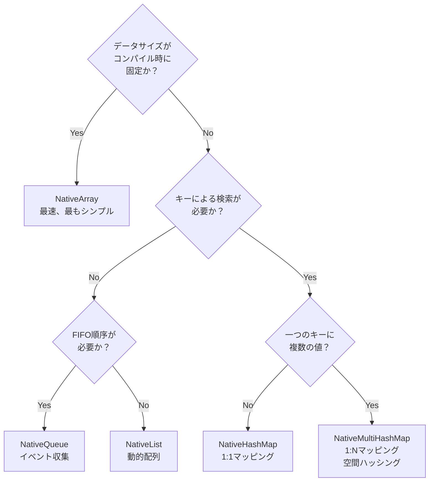
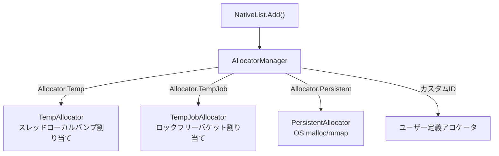
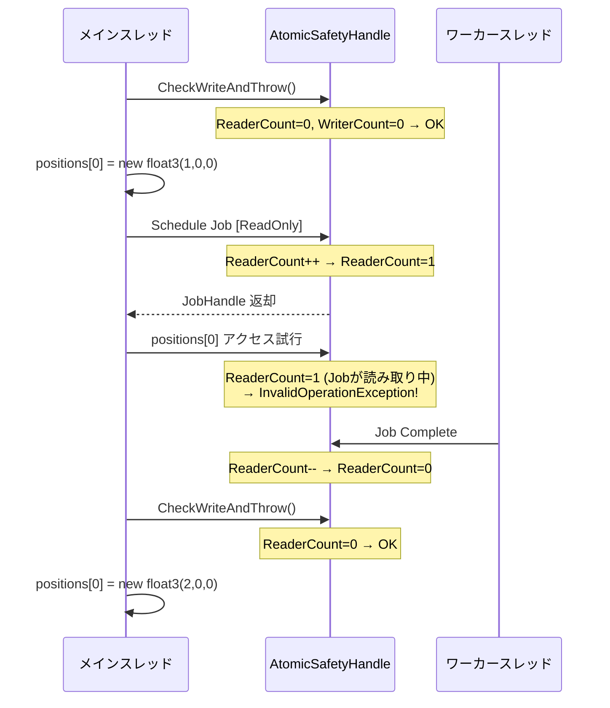

## 序論

[Job Systemポスト](/posts/UnityJobSystemBurst/)でNativeArrayの内部構造を解剖した。C#配列とのメモリモデルの違い、Allocatorの種類、Safety Systemの基本動作まで扱った。

しかし実戦ではNativeArrayだけですべてを解決することはできない。動的サイズのリストが必要で、キーと値のペアで高速に検索する必要があり、複数のワーカースレッドが同時に結果をキューに入れなければならない。Unityの`Unity.Collections`パッケージはこのために**NativeList、NativeHashMap、NativeQueue**など多様なコンテナを提供する。

このポストでは3つを扱う：

1. **NativeContainerエコシステム** — NativeArrayの先にあるコンテナたちとそれぞれの内部構造
2. **AllocatorとAtomicSafetyHandleの内部動作** — 「なぜTempが速くてPersistentが遅いのか」、「Safety Systemは正確にどうやって競合を検知するのか」
3. **Custom NativeContainer制作** — UnityのSafety Systemと連携する独自のコンテナを作る方法

> NativeArrayの基本構造（void*ポインタ + unmanaged heap）、Allocator種類テーブル、[ReadOnly]/[WriteOnly]の基本的な使い方は[Job Systemポスト](/posts/UnityJobSystemBurst/#nativecontainer-job이-사용하는-데이터)で扱ったのでここでは繰り返さない。

---

## Part 1: NativeContainerエコシステム

### 1.1 なぜNativeArrayだけでは不十分なのか

NativeArrayは**固定サイズの連続配列**である。サイズを事前に知っていて、インデックスベースでアクセスし、すべての要素が同じ型のときに最適である。

しかしゲームランタイムでよく遭遇する状況がある：

```csharp
// 状況1: ランタイムにサイズが変わる結果収集
// 「生存エージェントだけフィルタリングして集めよ」→ 結果サイズが事前にわからない
NativeArray<int> aliveIndices = ???;  // サイズはいくつ？

// 状況2: キーで高速検索
// 「Entity ID 42の現在のHPは？」→ インデックスではなくキーでアクセスする必要がある
float health = ???;  // NativeArray[42]ではなくMap[entityId]

// 状況3: 複数のJobが同時に結果を入れる
// 10個のワーカーがそれぞれ発見した衝突ペアを一つのコレクションに追加
???.Add(new CollisionPair(a, b));  // 同時書き込みが安全でなければならない
```

このような状況のために`Unity.Collections`パッケージはNativeArray以外にも多様なコンテナを提供する。

### 1.2 NativeList\<T\> — 動的配列

managed C#の`List<T>`に対応するコンテナである。内部的にはNativeArrayと同様にunmanaged heapの連続メモリを使用するが、**動的にサイズが変わる。**

```csharp
// 基本的な使い方
var list = new NativeList<float3>(initialCapacity: 256, Allocator.TempJob);

list.Add(new float3(1, 0, 0));        // O(1) 償却
list.Add(new float3(2, 0, 0));
float3 first = list[0];               // O(1) インデックスアクセス
list.RemoveAtSwapBack(0);             // O(1) 順序無視削除
int count = list.Length;               // 現在の要素数
int cap = list.Capacity;              // 確保された容量

list.Dispose();
```

#### 内部構造

```
NativeList<T> (struct)
┌─────────────────────────────┐
│  UnsafeList<T>* m_ListData ─┼──▶ ┌── Unmanaged Heap ──────────────┐
│  #if SAFETY                 │    │  void*  Ptr ──▶ [T][T][T][..][  ] │
│  AtomicSafetyHandle         │    │  int    Length  (現在の要素数)    │
│  #endif                     │    │  int    Capacity (確保されたスロット数) │
└─────────────────────────────┘    │  Allocator Allocator             │
                                   └───────────────────────────────────┘
```

核心的な違い：
- NativeArrayは`void*`をstruct内部に直接保持する
- NativeListは`UnsafeList<T>*` — つまり**ポインタのポインタ**である。理由は`Add()`時にreallocが発生すると`void* Ptr`が変わる可能性があるが、JobにNativeListをコピー（struct copy）すると元のPtrの変更が反映されないためである。一段階のインダイレクションを追加して**すべてのコピーが同じUnsafeListを参照**するようにする。

#### 拡張ポリシー

```csharp
// Unity内部の拡張ロジック（Collections 2.x基準、簡略化）
void Resize(int newCapacity)
{
    newCapacity = math.max(newCapacity, 64 / UnsafeUtility.SizeOf<T>());
    newCapacity = math.ceilpow2(newCapacity);  // 次の2の累乗に切り上げ
    
    void* newPtr = UnsafeUtility.Malloc(
        newCapacity * UnsafeUtility.SizeOf<T>(),
        UnsafeUtility.AlignOf<T>(),
        m_Allocator);
    
    UnsafeUtility.MemCpy(newPtr, Ptr, Length * UnsafeUtility.SizeOf<T>());
    UnsafeUtility.Free(Ptr, m_Allocator);
    Ptr = newPtr;
    Capacity = newCapacity;
}
```

`math.ceilpow2`で容量を2の累乗に切り上げるため、拡張頻度が減少する。しかし`Persistent` Allocatorでのreallocは**OS malloc + memcpy + free**を伴うためコストが大きい。可能であれば**初期容量を十分に設定**することが望ましい。

#### Jobでの並列書き込み：ParallelWriter

`NativeList`に複数のワーカースレッドが同時に`Add()`を呼び出すと競合条件が発生する。Unityはこのために**ParallelWriter**パターンを提供する。

```csharp
// メインスレッド：ParallelWriter生成
var aliveList = new NativeList<int>(agentCount, Allocator.TempJob);
var writer = aliveList.AsParallelWriter();

// Job定義
[BurstCompile]
struct FilterAliveJob : IJobParallelFor
{
    [ReadOnly] public NativeArray<byte> IsAlive;
    public NativeList<int>.ParallelWriter AliveIndices;
    
    public void Execute(int index)
    {
        if (IsAlive[index] != 0)
            AliveIndices.AddNoResize(index);  // ロックフリーのアトミック追加
    }
}

// スケジュール
var filterJob = new FilterAliveJob
{
    IsAlive = isAliveArray,
    AliveIndices = writer
};
filterJob.Schedule(agentCount, 64).Complete();

// 結果使用 — 順序は保証されない
Debug.Log($"生存エージェント数: {aliveList.Length}");
```

**`AddNoResize`の内部動作：**

```csharp
// 内部実装（簡略化）
public void AddNoResize(T value)
{
    // Interlocked.Incrementでアトミックにインデックスを取得
    int idx = Interlocked.Increment(ref ListData->Length) - 1;
    UnsafeUtility.WriteArrayElement(ListData->Ptr, idx, value);
}
```

`Interlocked.Increment`は**CPUのLOCK XADD命令**で実装されており、ロックなしでアトミックにインデックスを割り当てる。ただし、reallocが発生してはならないため`AddNoResize`を使用し、メインスレッドで**事前に十分な容量を確保**する必要がある。

> **注意**：`ParallelWriter.AddNoResize()`は要素の**順序を保証しない**。ワーカースレッドの実行順序によって毎回異なる順序で追加される。順序が必要なら後でソートする必要がある。

### 1.3 NativeHashMap\<TKey, TValue\> — ハッシュテーブル

managed C#の`Dictionary<TKey, TValue>`に対応する。O(1)の平均時間でキーと値のペアを挿入/検索/削除する。

```csharp
var map = new NativeHashMap<int, float>(capacity: 1024, Allocator.Persistent);

map.Add(42, 100f);                      // 挿入
map[42] = 95f;                          // 更新
bool found = map.TryGetValue(42, out float hp);  // 検索
map.Remove(42);                         // 削除
bool has = map.ContainsKey(42);         // 存在確認

map.Dispose();
```

#### 内部構造：オープンアドレス法

UnityのNativeHashMapはmanaged Dictionaryとは異なるハッシュ衝突解決戦略を使用する。

| | managed Dictionary | NativeHashMap |
|--|---------------------|---------------|
| 衝突解決 | チェイニング（linked list） | **オープンアドレス法**（linear probing） |
| メモリレイアウト | 分散（ノードポインタ） | **連続配列** |
| キャッシュ効率 | 低い（ポインタチェイシング） | **高い**（線形探索） |
| GCへの影響 | あり | **なし** |

```
NativeHashMap 内部メモリレイアウト:
┌────────────────── 連続メモリブロック ──────────────────┐
│                                                       │
│  Buckets配列（ハッシュ → スロットマッピング）：          │
│  ┌─────┬─────┬─────┬─────┬─────┬─────┬─────┬─────┐  │
│  │  3  │ -1  │  0  │ -1  │  2  │ -1  │  1  │ -1  │  │
│  └─────┴─────┴─────┴─────┴─────┴─────┴─────┴─────┘  │
│   bucket[hash(key) % capacity] → スロットインデックス   │
│   -1 = 空バケット                                      │
│                                                       │
│  Keys配列:                                            │
│  ┌──────┬──────┬──────┬──────┐                       │
│  │ key0 │ key1 │ key2 │ key3 │                       │
│  └──────┴──────┴──────┴──────┘                       │
│                                                       │
│  Values配列:                                          │
│  ┌──────┬──────┬──────┬──────┐                       │
│  └──────┴──────┴──────┴──────┘                       │
│                                                       │
│  Next配列（チェイニング用）：                           │
│  ┌──────┬──────┬──────┬──────┐                       │
│  │ -1   │ -1   │ -1   │ -1   │                       │
│  └──────┴──────┴──────┴──────┘                       │
└───────────────────────────────────────────────────────┘
```

オープンアドレス法がJob Systemに適している理由：
1. **単一の連続割り当て** — Allocator呼び出し1回ですべての内部配列を割り当て
2. **キャッシュフレンドリー** — 衝突時に隣接スロットを線形探索するためキャッシュライン再活用
3. **GCフリー** — ノードオブジェクトをヒープに割り当てない

#### 容量とハッシュ衝突

NativeHashMapの性能は**load factor**（負荷率 = 要素数 / 容量）に大きく依存する。

| Load Factor | 平均探索長 | 性能 |
|-------------|-----------|------|
| < 0.5 | ~1.5回 | 優秀 |
| 0.7 | ~2.2回 | 良好 |
| 0.9 | ~5.5回 | 悪い |
| > 0.95 | 急激に増加 | 危険 |

> Unityは内部的にload factorの閾値（約0.75）を超えると自動的にrehashする。しかしrehashは**全データを新しいバケット配列に再配置**するO(n)演算であるため、予想サイズが事前にわかれば初期容量を大きめに設定するのが望ましい。

#### ParallelWriter

```csharp
var map = new NativeHashMap<int, float>(capacity, Allocator.TempJob);
var writer = map.AsParallelWriter();

[BurstCompile]
struct PopulateMapJob : IJobParallelFor
{
    [ReadOnly] public NativeArray<int> EntityIds;
    [ReadOnly] public NativeArray<float> Healths;
    public NativeHashMap<int, float>.ParallelWriter MapWriter;
    
    public void Execute(int index)
    {
        MapWriter.TryAdd(EntityIds[index], Healths[index]);
    }
}
```

NativeHashMapのParallelWriterは**バケット単位のロック**を使用する。NativeListの単純なInterlockedより重いが、ハッシュ分布が均等であれば衝突が少なく実質的な競合は低い。

> **注意**：`TryAdd`はキーが既に存在する場合falseを返し何もしない。複数のワーカーが同じキーを入れると「先に到着した側が勝つ」非決定的な動作となる。決定論が必要な場合は別途ロジックが必要である。

### 1.4 NativeMultiHashMap\<TKey, TValue\> — 一つのキーに複数の値

一つのキーに**複数の値**を格納できるハッシュマップである。ゲームで非常に頻繁に使われるパターンである**空間ハッシング（Spatial Hashing）**に不可欠である。

```csharp
var spatialMap = new NativeMultiHashMap<int, int>(capacity, Allocator.TempJob);

// グリッドセル → そのセルにいるエージェントID群
spatialMap.Add(cellHash, agentId0);
spatialMap.Add(cellHash, agentId1);  // 同じキーに複数の値
spatialMap.Add(cellHash, agentId2);

// 走査：特定キーのすべての値を走査
if (spatialMap.TryGetFirstValue(cellHash, out int id, out var iterator))
{
    do
    {
        // idで隣接エージェント処理
        ProcessNeighbor(id);
    }
    while (spatialMap.TryGetNextValue(out id, ref iterator));
}
```

#### 実戦：空間ハッシングによる近傍探索

エージェント間の分離力（Separation）計算ですべてのエージェントペアを検査するとO(N²)である。空間ハッシングはこれをO(N × K)に削減する（K = セルあたりの平均エージェント数）。

```csharp
// Phase 1: 空間ハッシュマップ構築
[BurstCompile]
struct BuildSpatialHashJob : IJobParallelFor
{
    [ReadOnly] public NativeArray<float3> Positions;
    [ReadOnly] public float CellSize;
    public NativeMultiHashMap<int, int>.ParallelWriter SpatialMap;
    
    public void Execute(int index)
    {
        int hash = GetCellHash(Positions[index], CellSize);
        SpatialMap.Add(hash, index);
    }
    
    static int GetCellHash(float3 pos, float cellSize)
    {
        int x = (int)math.floor(pos.x / cellSize);
        int z = (int)math.floor(pos.z / cellSize);
        return x * 73856093 ^ z * 19349663;  // ハッシュ関数
    }
}

// Phase 2: 近傍探索（9セル検査）
[BurstCompile]
struct SeparationJob : IJobParallelFor
{
    [ReadOnly] public NativeArray<float3> Positions;
    [ReadOnly] public NativeMultiHashMap<int, int> SpatialMap;
    [ReadOnly] public float CellSize;
    [ReadOnly] public float SeparationRadius;
    
    [WriteOnly] public NativeArray<float3> SeparationForces;
    
    public void Execute(int index)
    {
        float3 myPos = Positions[index];
        float3 force = float3.zero;
        int myX = (int)math.floor(myPos.x / CellSize);
        int myZ = (int)math.floor(myPos.z / CellSize);
        
        // 周辺9セル検査
        for (int dx = -1; dx <= 1; dx++)
        for (int dz = -1; dz <= 1; dz++)
        {
            int hash = (myX + dx) * 73856093 ^ (myZ + dz) * 19349663;
            
            if (SpatialMap.TryGetFirstValue(hash, out int other, out var it))
            {
                do
                {
                    if (other == index) continue;
                    float3 diff = myPos - Positions[other];
                    float distSq = math.lengthsq(diff);
                    if (distSq < SeparationRadius * SeparationRadius && distSq > 0.001f)
                    {
                        force += math.normalize(diff) / math.sqrt(distSq);
                    }
                }
                while (SpatialMap.TryGetNextValue(out other, ref it));
            }
        }
        
        SeparationForces[index] = force;
    }
}
```

### 1.5 NativeQueue\<T\> — FIFOキュー

スレッドセーフなFIFO（First-In, First-Out）キュー。**イベント収集**パターンに適している。

```csharp
var eventQueue = new NativeQueue<DamageEvent>(Allocator.TempJob);

// Jobでイベントをキューに追加
[BurstCompile]
struct CombatJob : IJobParallelFor
{
    public NativeQueue<DamageEvent>.ParallelWriter EventQueue;
    
    public void Execute(int index)
    {
        if (/* 攻撃判定 */)
            EventQueue.Enqueue(new DamageEvent { Target = targetId, Amount = 10f });
    }
}

// メインスレッドでイベント消費
while (eventQueue.TryDequeue(out DamageEvent evt))
{
    ApplyDamage(evt.Target, evt.Amount);
}
```

#### 内部構造：ブロックベースキュー

NativeQueueは単純な円形バッファではなく**ブロック（block）リンクドリスト**で実装されている。

```
NativeQueue 内部:
┌──────────────┐     ┌──────────────┐     ┌──────────────┐
│ Block 0      │────▶│ Block 1      │────▶│ Block 2      │
│ [T][T][T]... │     │ [T][T][T]... │     │ [T][..][  ]  │
│ (満杯)        │     │ (満杯)        │     │ (一部使用)    │
└──────────────┘     └──────────────┘     └──────────────┘
 ↑ DequeueHead                            ↑ EnqueueTail
```

- 各ブロックは固定サイズ（通常256スロット）の配列である
- ブロックが満杯になると新しいブロックを割り当てて連結する
- DequeueはHeadブロックから、EnqueueはTailブロックで行う
- 空のブロックは**プール（pool）**に返却されて再利用される

この構造の利点：
- **ParallelWriterのEnqueueはTailブロックにのみアクセス** → 競合はTailに集中するがブロックが満杯になると新しいブロックを各自割り当てるため実質的な競合は低い
- reallocがないため既存ポインタが無効化されない

### 1.6 NativeReference\<T\> — 単一値コンテナ

たった一つの値を格納するコンテナである。「Jobから単一の結果を返すための」用途である。

```csharp
var totalHealth = new NativeReference<float>(Allocator.TempJob);

[BurstCompile]
struct SumHealthJob : IJob
{
    [ReadOnly] public NativeArray<float> Healths;
    public NativeReference<float> Total;
    
    public void Execute()
    {
        float sum = 0;
        for (int i = 0; i < Healths.Length; i++)
            sum += Healths[i];
        Total.Value = sum;
    }
}
```

NativeArray\<T\>(1)でも同じ結果を得ることができるが、NativeReferenceは**意図を明確に**しインデキシングミスを防止する。

### 1.7 Unsafe変形：安全 vs 性能のトレードオフ

すべてのNativeコンテナには`Unsafe`プレフィックス変形が存在する。

| Native（安全） | Unsafe（検査なし） | 違い |
|---------------|----------------|--------|
| NativeArray\<T\> | UnsafeArray\<T\> | AtomicSafetyHandleなし |
| NativeList\<T\> | UnsafeList\<T\> | bounds checkなし |
| NativeHashMap\<K,V\> | UnsafeHashMap\<K,V\> | 同時アクセス検査なし |

```csharp
// NativeList 内部 — Unsafeをラップしてsafetyを追加
public struct NativeList<T> : INativeDisposable where T : unmanaged
{
    internal UnsafeList<T>* m_ListData;     // 実データ
    
#if ENABLE_UNITY_COLLECTIONS_CHECKS
    internal AtomicSafetyHandle m_Safety;   // 安全性検査
    internal static readonly SharedStatic<int> s_staticSafetyId;
#endif
}
```

**NativeコンテナはUnsafeコンテナのラッパー**である。エディタでAtomicSafetyHandleにより不正なアクセスを検出し、リリースビルドでは`ENABLE_UNITY_COLLECTIONS_CHECKS`が定義されないため**安全検査コードがコンパイルから除去**される。

したがって：
- **開発中**：Native変形を使用してバグを素早く発見
- **リリースビルド**：自動的にUnsafeレベルの性能
- **既に検証済みの内部コード**：Unsafe変形を直接使用してエディタでもオーバーヘッドを除去

### 1.8 コンテナ選択ガイド



| コンテナ | 挿入 | 検索 | 削除 | 並列書き込み | 主な用途 |
|----------|------|------|------|-----------|-----------|
| NativeArray | N/A（固定） | O(1) インデックス | N/A | インデックス別分割 | SoAデータ、Job入出力 |
| NativeList | O(1) 償却 | O(1) インデックス | O(1) SwapBack | ParallelWriter | フィルタリング結果、動的バッファ |
| NativeHashMap | O(1) 平均 | O(1) 平均 | O(1) 平均 | ParallelWriter | Entityマッピング、キャッシュ |
| NativeMultiHashMap | O(1) 平均 | O(K) 走査 | O(1) 平均 | ParallelWriter | 空間ハッシング、グルーピング |
| NativeQueue | O(1) | O(1) Dequeue | N/A | ParallelWriter | イベント、タスクキュー |
| NativeReference | N/A | O(1) | N/A | なし | Job単一結果 |

---

## Part 2: Allocator内部実装

[Job Systemポスト](/posts/UnityJobSystemBurst/#allocator-종류)でAllocator 3種（Temp、TempJob、Persistent）の用途と寿命をテーブルで整理した。ここでは**各Allocatorがメモリを実際にどのように割り当てて解放するのか**内部実装を掘り下げる。

### 2.1 AllocatorManagerアーキテクチャ

UnityのすべてのNativeContainerは`AllocatorManager`を通じてメモリを割り当てる。このシステムの核心は**Allocatorが単なるenumではなく、それぞれ異なる割り当て戦略を実装するオブジェクト**であることだ。



```csharp
// AllocatorManagerの核心インターフェース（簡略化）
public static unsafe class AllocatorManager
{
    public interface IAllocator
    {
        int Try(ref Block block);  // 割り当て/解放の試行
    }
    
    public struct Block
    {
        public void* Pointer;
        public long Bytes;
        public int Alignment;
    }
}
```

### 2.2 Temp Allocator：スレッドローカルバンプ割り当て

**最も高速な**アロケータ。すべてのコストが事実上0に近い。

```
スレッドローカルメモリプール（各ワーカースレッドごとに独立）：
┌──────────────────────────────────────────────┐
│ [使用中][使用中][使用中][    空き領域        ] │
│                           ↑                    │
│                       Offset（バンプポインタ）   │
│                                                │
│  割り当て：offset += size（一回の加算）         │
│  解放：フレーム終了時にoffset = 0（全体リセット）│
└────────────────────────────────────────────────┘
```

**バンプ割り当て（Bump Allocation）**の動作：

```csharp
// 内部実装の概念（簡略化）
struct TempAllocator
{
    byte* m_Buffer;     // 事前に割り当てられたメモリプール
    int m_Capacity;     // プールサイズ（通常数MB）
    int m_Offset;       // 現在位置
    
    void* Allocate(int size, int alignment)
    {
        // アラインメント調整
        m_Offset = (m_Offset + alignment - 1) & ~(alignment - 1);
        
        void* ptr = m_Buffer + m_Offset;
        m_Offset += size;  // ← これが割り当ての全コスト（加算1回）
        return ptr;
    }
    
    void RewindAll()
    {
        m_Offset = 0;  // フレーム終了時に全体リセット
    }
}
```

なぜ高速なのか：
1. **加算1回 = 割り当て完了** — mallocのフリーリスト探索、分割、マージがすべてない
2. **スレッドローカル** — 他のスレッドとの同期が不要。ロック、CAS、メモリバリア0回
3. **個別解放なし** — フレーム終了時にポインタを0に戻すとすべての割り当てが一度に解放

**制約**：Tempで割り当てたメモリは**そのフレーム（またはJob実行範囲）内でのみ有効**である。次のフレームに`RewindAll()`が呼ばれるとすべてのポインタが無効化される。

### 2.3 TempJob Allocator：ロックフリーバケット割り当て

Job間でデータを受け渡すときに使用する。Tempより遅いが、最大4フレームまで有効である。

```
ロックフリーバケットアロケータ：
┌──── バケット0 (16B) ────┐ ┌── バケット1 (32B) ──┐ ┌── バケット2 (64B) ──┐
│ ┌──┐┌──┐┌──┐┌──┐┌──┐ │ │ ┌──┐┌──┐┌──┐   │ │ ┌───┐┌───┐      │
│ │  ││  ││✗ ││  ││✗ │ │ │ │  ││✗ ││  │   │ │ │   ││ ✗ │      │
│ └──┘└──┘└──┘└──┘└──┘ │ │ └──┘└──┘└──┘   │ │ └───┘└───┘      │
└───────────────────────┘ └─────────────────┘ └────────────────────┘
  ✗ = 使用中

割り当て：要求サイズに合うバケット → フリーリストからCASでブロック取得
解放：ブロックをフリーリストにCASで返却
```

**動作原理：**

```csharp
// 内部実装の概念（簡略化）
struct TempJobAllocator
{
    // サイズ別フリーリスト（16B, 32B, 64B, 128B, ...）
    FreeList* m_Buckets;
    
    void* Allocate(int size)
    {
        int bucketIndex = CeilLog2(size);  // サイズに合うバケットを選択
        
        // ロックフリーCASループでブロック取得
        while (true)
        {
            void* head = m_Buckets[bucketIndex].Head;
            if (head == null) return AllocateNewBlock(bucketIndex);
            
            void* next = ((FreeNode*)head)->Next;
            if (Interlocked.CompareExchange(
                    ref m_Buckets[bucketIndex].Head, next, head) == head)
                return head;
            // CAS失敗 → 他のスレッドが先に取得 → リトライ
        }
    }
}
```

TempとPersistentの**バランスポイント**：
- Tempより遅い：CAS演算が必要（CPUパイプラインストールの可能性）
- Persistentより速い：OSカーネル呼び出しなしでユーザースペースで処理
- 4フレーム以内の解放を強制：リーク防止（Safety Systemが超過時にエラー）

### 2.4 Persistent Allocator：OSレベルmalloc

無制限の寿命のメモリ。ゲーム全体を通じて維持されるデータに使用する。

```csharp
// 内部的にプラットフォーム別OS API呼び出し
void* Allocate(int size, int alignment)
{
    // Windows: VirtualAlloc または HeapAlloc
    // Linux/macOS: mmap または posix_memalign
    // → OSカーネルへのシステムコール発生
    return UnsafeUtility.Malloc(size, alignment, Allocator.Persistent);
}
```

なぜ遅いのか：
1. **システムコール** — ユーザーモード → カーネルモード切り替えコスト（~数百ns）
2. **フリーリスト探索** — OSのヒープマネージャが適切な空きブロックを見つける必要がある
3. **グローバルロックの可能性** — 複数のスレッドが同時にmallocを呼び出すと競合発生

しかし一度割り当てれば以後のデータアクセス性能はTemp、TempJobと**同一**である。コストは割り当て/解放の時点でのみ発生する。

### 2.5 Allocator性能比較

| Allocator | 割り当てコスト | 解放コスト | スレッドセーフ | 寿命 |
|-----------|------------|----------|------------|------|
| Temp | ~1ns（バンプ） | 0（全体リセット） | スレッドローカル（ロック不要） | 1フレーム |
| TempJob | ~10-50ns（CAS） | ~10-50ns（CAS） | ロックフリーCAS | 4フレーム |
| Persistent | ~100-500ns（システムコール） | ~100-500ns | OS内部ロック | 無制限 |

**実戦ガイド：**

```csharp
// ✅ Temp — Job内部の一時計算用バッファ
[BurstCompile]
struct MyJob : IJob
{
    public void Execute()
    {
        // Job実行中にのみ必要なバッファ
        var scratch = new NativeArray<int>(64, Allocator.Temp);
        // ... 使用 ...
        scratch.Dispose();  // 明示的解放可能（しなくても自動解放）
    }
}

// ✅ TempJob — Job間のデータ受け渡し
void SchedulePipeline()
{
    var temp = new NativeArray<float>(count, Allocator.TempJob);
    var h1 = new ProduceJob { Output = temp }.Schedule();
    var h2 = new ConsumeJob { Input = temp }.Schedule(h1);
    h2.Complete();
    temp.Dispose();  // 必ず手動で解放
}

// ✅ Persistent — ゲーム全体を通じて維持
public class GameData : MonoBehaviour
{
    NativeArray<float3> _positions;
    
    void Awake()
    {
        _positions = new NativeArray<float3>(maxAgents, Allocator.Persistent);
    }
    
    void OnDestroy()
    {
        if (_positions.IsCreated) _positions.Dispose();  // 必須！
    }
}
```

### 2.6 カスタムAllocator

Unity Collections 2.xから`AllocatorManager.Register()`を通じて**カスタムアロケータ**を登録できる。特殊なメモリ管理が必要なときに使用する。

```csharp
// カスタムAllocator実装例：リングバッファアロケータ
[BurstCompile]
public struct RingBufferAllocator : AllocatorManager.IAllocator
{
    byte* m_Buffer;
    int m_Capacity;
    int m_Head;
    
    public int Try(ref AllocatorManager.Block block)
    {
        if (block.Pointer == null)  // 割り当て要求
        {
            int aligned = (m_Head + block.Alignment - 1) & ~(block.Alignment - 1);
            if (aligned + block.Bytes > m_Capacity)
                return -1;  // 失敗
            
            block.Pointer = m_Buffer + aligned;
            m_Head = (int)(aligned + block.Bytes);
            return 0;  // 成功
        }
        else  // 解放要求
        {
            // リングバッファは個別解放不可 — 全体リセットのみサポート
            return 0;
        }
    }
}
```

カスタムAllocatorの活用事例：
- **プールアロケータ**：同じサイズのオブジェクトを大量に割り当て/解放するオブジェクトプール
- **ダブルバッファアロケータ**：フレームAとフレームBを交互に使用
- **デバッグアロケータ**：割り当て追跡、リーク検出、メモリガードページ挿入

---

## Part 3: AtomicSafetyHandle動作原理

[Job Systemポスト](/posts/UnityJobSystemBurst/#safety-system-경합-조건-방지)でSafety Systemが検出する3つのミスを見た。ここでは**AtomicSafetyHandleが内部的にどのように読み取り/書き込み権限を追跡し、不正なアクセスを検知するのか**メカニズムを掘り下げる。

### 3.1 「ランタイムBorrow Checker」

Rustのborrow checkerが**コンパイル時**に参照規則を強制するなら、UnityのAtomicSafetyHandleは**ランタイム**で同様の役割を果たす。

| | Rust Borrow Checker | Unity AtomicSafetyHandle |
|--|---------------------|--------------------------|
| 検査時点 | コンパイル時 | ランタイム（エディタのみ） |
| コスト | 0（ランタイムオーバーヘッドなし） | エディタでアクセスごとに検査 |
| 規則 | 読み取りN個 XOR 書き込み1個 | 同一の規則 |
| リリース動作 | コンパイルエラー → ビルド不可 | 検査コード除去 → 性能0 |

核心的な規則は同一である：

> **同時に複数の読み取りが可能であるか（shared read）、ただ一つの書き込みのみが可能である（exclusive write）。両方を同時に行うことはできない。**

### 3.2 AtomicSafetyHandleの内部構造

```csharp
// Unity内部実装（簡略化）
public struct AtomicSafetyHandle
{
    // ネイティブ側のSafetyNodeを指すポインタ
    internal IntPtr m_NodePtr;
    
    // バージョン番号 — Dispose後のアクセス検知に使用
    internal int m_Version;
}
```

実際の状態は**SafetyNode**というネイティブ構造体に格納される：

```
SafetyNode（ネイティブ側）：
┌───────────────────────────────────────┐
│  int    Version          // 現在のバージョン │
│  int    ReaderCount      // 読み取り中の数   │
│  int    WriterCount      // 書き込み中の数（0または1） │
│  bool   AllowReadOrWrite // アクセス許可状態 │
│  bool   IsDisposed       // 解放済みかどうか │
│  string OwnerTypeName    // デバッグ：所有者型名 │
└───────────────────────────────────────┘
```

### 3.3 権限追跡フロー

NativeContainerの各アクセス時点でAtomicSafetyHandleがどのように動作するかを追跡する。



#### 検査関数群

```csharp
// Unityが内部的に呼び出す検査関数群
public static class AtomicSafetyHandle
{
    // NativeArrayインデクサのgetterで呼び出し
    public static void CheckReadAndThrow(AtomicSafetyHandle handle)
    {
        // 1. バージョンチェック → Dispose後のアクセス検知
        if (handle.m_Version != handle.m_NodePtr->Version)
            throw new ObjectDisposedException("既に解放されたコンテナ");
        
        // 2. 書き込みロックチェック → 他のJobが書き込み中なら遮断
        if (handle.m_NodePtr->WriterCount > 0)
            throw new InvalidOperationException("Jobが書き込み中のデータに読み取り試行");
    }
    
    // NativeArrayインデクサのsetterで呼び出し
    public static void CheckWriteAndThrow(AtomicSafetyHandle handle)
    {
        if (handle.m_Version != handle.m_NodePtr->Version)
            throw new ObjectDisposedException("既に解放されたコンテナ");
        
        if (handle.m_NodePtr->ReaderCount > 0 || handle.m_NodePtr->WriterCount > 0)
            throw new InvalidOperationException("Jobがアクセス中のデータに書き込み試行");
    }
}
```

### 3.4 バージョン（Version）メカニズム：Use-After-Free防止

AtomicSafetyHandleの最も巧妙な部分は**バージョン番号**である。

```csharp
var array = new NativeArray<int>(10, Allocator.TempJob);
// array.m_Safety.m_Version = 1
// SafetyNode.Version = 1 → 一致

array.Dispose();
// SafetyNode.Version = 2 (増加！)
// array.m_Safety.m_Version = 1 (変わらない)

// Dispose後のアクセス試行
int val = array[0];
// CheckReadAndThrow: handle.m_Version(1) != Node.Version(2)
// → ObjectDisposedException!
```

structであるNativeArrayがコピーされて複数箇所に存在し得るため、Disposeがすべてのコピーを無効化することはできない。代わりに**SafetyNodeのバージョンを増加**させることで、既存のすべてのコピーがバージョン不一致により自動的に無効化される。

### 3.5 エディタ vs リリースビルド

```csharp
public unsafe T this[int index]
{
    get
    {
#if ENABLE_UNITY_COLLECTIONS_CHECKS
        AtomicSafetyHandle.CheckReadAndThrow(m_Safety);
        if ((uint)index >= (uint)m_Length)
            throw new IndexOutOfRangeException();
#endif
        return UnsafeUtility.ReadArrayElement<T>(m_Buffer, index);
    }
}
```

`ENABLE_UNITY_COLLECTIONS_CHECKS`は**エディタとDevelopment Buildでのみ**定義される。Release Buildでは：

- `CheckReadAndThrow` → **除去**
- bounds check → **除去**
- `UnsafeUtility.ReadArrayElement` → **Burstが単一メモリロード命令にコンパイル**

**エディタでの性能コスト：**

| 演算 | 検査なし | 検査込み | オーバーヘッド |
|------|----------|----------|----------|
| NativeArrayインデクサ（get） | ~1ns | ~5-10ns | 5-10× |
| NativeList.Add | ~5ns | ~15-20ns | 3-4× |
| NativeHashMap.TryGetValue | ~20ns | ~40-50ns | 2-2.5× |

エディタでプロファイリングする際に**Safety検査コストが含まれている**ことに注意されたい。真の性能は必ずRelease Buildで測定すべきである。

### 3.6 DisposeSentinel：メモリリーク検出

AtomicSafetyHandleと共に動作する補助システムが**DisposeSentinel**である。

```csharp
// NativeArray生成時
public NativeArray(int length, Allocator allocator)
{
    // ...
#if ENABLE_UNITY_COLLECTIONS_CHECKS
    DisposeSentinel.Create(out m_Safety, out m_DisposeSentinel, 
                           callSiteStackDepth: 2, allocator);
#endif
}
```

DisposeSentinelは**ファイナライザ（finalizer）**を持つmanagedオブジェクトである。NativeContainerが`Dispose()`を呼び出すとSentinelも一緒に解放される。しかし`Dispose()`を呼び出さないと：

1. GCがSentinelのファイナライザを実行
2. ファイナライザで**「NativeArrayがDisposeされていません」**という警告をコンソールに出力
3. 割り当て時点のスタックトレースを一緒に表示

```
NativeArray object was not disposed. It was allocated at:
  at FlowFieldData..ctor() (FlowFieldData.cs:12)
  at GameManager.Start() (GameManager.cs:45)
```

このメッセージが表示されたら、どこかでNativeContainerをDisposeしていないことを意味する。割り当て位置まで教えてくれるため**ネイティブメモリリークを素早く追跡**できる。

---

## Part 4: Custom NativeContainer制作

Unityが提供するコンテナでは解決できない場合がある。固定サイズリングバッファ、ビットマスク配列、スパースセット（sparse set）などゲーム特化のデータ構造が必要なとき**Custom NativeContainer**を作ることができる。

### 4.1 必須構成要素

Custom NativeContainerをUnityのJob Systemと完全に統合するには4つが必要である：

```
Custom NativeContainer チェックリスト:
┌────────────────────────────────────────────────┐
│ 1. [NativeContainer] アトリビュート              │
│ 2. AtomicSafetyHandle 統合                      │
│ 3. IDisposable + DisposeSentinel                │
│ 4. [NativeContainerIs...] マーカーアトリビュート │
└────────────────────────────────────────────────┘
```

### 4.2 実戦：NativeRingBuffer\<T\> 実装

固定サイズの円形バッファを実装する。リアルタイムデータストリーム（例：直近Nフレームの FPS記録、トレイルエフェクトの位置履歴）に有用である。

```csharp
using System;
using System.Diagnostics;
using Unity.Burst;
using Unity.Collections;
using Unity.Collections.LowLevel.Unsafe;
using Unity.Jobs;

/// <summary>
/// 固定サイズ円形バッファ。満杯になると最も古い要素を上書きする。
/// Job Systemと完全に統合され、Safety Systemの保護を受ける。
/// </summary>
[NativeContainer]  // ① Safety Systemに「これはNativeContainerである」と通知
public unsafe struct NativeRingBuffer<T> : IDisposable where T : unmanaged
{
    // ────────────────── データ ──────────────────
    [NativeDisableUnsafePtrRestriction]
    internal void* m_Buffer;         // T[]データの開始アドレス
    
    internal int m_Capacity;         // バッファ容量（固定）
    internal int m_Head;             // 次の書き込み位置
    internal int m_Count;            // 現在の要素数
    internal Allocator m_Allocator;
    
    // ────────────────── Safety ──────────────────
#if ENABLE_UNITY_COLLECTIONS_CHECKS
    internal AtomicSafetyHandle m_Safety;
    
    [NativeSetClassTypeToNullOnSchedule]
    internal DisposeSentinel m_DisposeSentinel;
#endif
    
    // ────────────────── 生成/解放 ──────────────────
    public NativeRingBuffer(int capacity, Allocator allocator)
    {
        if (capacity <= 0)
            throw new ArgumentException("Capacity must be positive", nameof(capacity));
        
        long totalSize = (long)UnsafeUtility.SizeOf<T>() * capacity;
        m_Buffer = UnsafeUtility.Malloc(totalSize, UnsafeUtility.AlignOf<T>(), allocator);
        UnsafeUtility.MemClear(m_Buffer, totalSize);
        
        m_Capacity = capacity;
        m_Head = 0;
        m_Count = 0;
        m_Allocator = allocator;
        
#if ENABLE_UNITY_COLLECTIONS_CHECKS
        DisposeSentinel.Create(out m_Safety, out m_DisposeSentinel, 2, allocator);
#endif
    }
    
    public void Dispose()
    {
#if ENABLE_UNITY_COLLECTIONS_CHECKS
        DisposeSentinel.Dispose(ref m_Safety, ref m_DisposeSentinel);
#endif
        
        UnsafeUtility.Free(m_Buffer, m_Allocator);
        m_Buffer = null;
        m_Count = 0;
    }
    
    // ────────────────── プロパティ ──────────────────
    public int Capacity
    {
        get
        {
#if ENABLE_UNITY_COLLECTIONS_CHECKS
            AtomicSafetyHandle.CheckReadAndThrow(m_Safety);
#endif
            return m_Capacity;
        }
    }
    
    public int Count
    {
        get
        {
#if ENABLE_UNITY_COLLECTIONS_CHECKS
            AtomicSafetyHandle.CheckReadAndThrow(m_Safety);
#endif
            return m_Count;
        }
    }
    
    public bool IsFull
    {
        get
        {
#if ENABLE_UNITY_COLLECTIONS_CHECKS
            AtomicSafetyHandle.CheckReadAndThrow(m_Safety);
#endif
            return m_Count == m_Capacity;
        }
    }
    
    public bool IsCreated => m_Buffer != null;
    
    // ────────────────── 書き込み ──────────────────
    
    /// <summary>
    /// 要素を追加する。バッファが満杯なら最も古い要素を上書きする。
    /// </summary>
    public void PushBack(T value)
    {
#if ENABLE_UNITY_COLLECTIONS_CHECKS
        AtomicSafetyHandle.CheckWriteAndThrow(m_Safety);
#endif
        UnsafeUtility.WriteArrayElement(m_Buffer, m_Head, value);
        m_Head = (m_Head + 1) % m_Capacity;
        
        if (m_Count < m_Capacity)
            m_Count++;
    }
    
    // ────────────────── 読み取り ──────────────────
    
    /// <summary>
    /// インデックスでアクセス。0 = 最も古い要素、Count-1 = 最新の要素。
    /// </summary>
    public T this[int index]
    {
        get
        {
#if ENABLE_UNITY_COLLECTIONS_CHECKS
            AtomicSafetyHandle.CheckReadAndThrow(m_Safety);
            if ((uint)index >= (uint)m_Count)
                throw new IndexOutOfRangeException(
                    $"Index {index} out of range [0, {m_Count})");
#endif
            // 最も古い要素から始まる論理的インデックス
            int physicalIndex;
            if (m_Count < m_Capacity)
                physicalIndex = index;  // まだ一周していない
            else
                physicalIndex = (m_Head + index) % m_Capacity;
            
            return UnsafeUtility.ReadArrayElement<T>(m_Buffer, physicalIndex);
        }
    }
    
    /// <summary>
    /// 最も最近追加された要素を返す。
    /// </summary>
    public T Latest
    {
        get
        {
#if ENABLE_UNITY_COLLECTIONS_CHECKS
            AtomicSafetyHandle.CheckReadAndThrow(m_Safety);
            if (m_Count == 0)
                throw new InvalidOperationException("Ring buffer is empty");
#endif
            int latestIndex = (m_Head - 1 + m_Capacity) % m_Capacity;
            return UnsafeUtility.ReadArrayElement<T>(m_Buffer, latestIndex);
        }
    }
    
    // ────────────────── ユーティリティ ──────────────────
    
    /// <summary>
    /// 全内容をNativeArrayにコピー（最も古い順序）。
    /// </summary>
    public NativeArray<T> ToNativeArray(Allocator allocator)
    {
#if ENABLE_UNITY_COLLECTIONS_CHECKS
        AtomicSafetyHandle.CheckReadAndThrow(m_Safety);
#endif
        var result = new NativeArray<T>(m_Count, allocator);
        for (int i = 0; i < m_Count; i++)
            result[i] = this[i];
        return result;
    }
    
    public void Clear()
    {
#if ENABLE_UNITY_COLLECTIONS_CHECKS
        AtomicSafetyHandle.CheckWriteAndThrow(m_Safety);
#endif
        m_Head = 0;
        m_Count = 0;
    }
}
```

### 4.3 NativeContainerアトリビュート解説

```csharp
// ① [NativeContainer]
// Safety Systemに登録。このアトリビュートがなければJobで使用しても
// 安全性検査が動作しない。
[NativeContainer]
public unsafe struct NativeRingBuffer<T> { ... }

// ② [NativeContainerIsReadOnly]
// 読み取り専用ラッパーを定義するときに使用。
// このアトリビュートが付いたstructをJobで使用すると
// Safety Systemが「読み取りのみ可能」と認識する。
[NativeContainer]
[NativeContainerIsReadOnly]
public unsafe struct NativeRingBuffer<T>.ReadOnly { ... }

// ③ [NativeContainerSupportsMinMaxWriteRestriction]
// IJobParallelForで「自分のインデックス範囲にのみ書き込み」をサポート。
// NativeArrayがこのアトリビュートを使用する。

// ④ [NativeContainerSupportsDeallocateOnJobCompletion]
// Job完了時に自動Dispose。[DeallocateOnJobCompletion]と連動。

// ⑤ [NativeDisableUnsafePtrRestriction]
// structフィールドにvoid*を許可。デフォルトではNativeContainerの
// ポインタフィールドはSafety Systemがブロックするが、このアトリビュートで許可。
```

### 4.4 使用例：FPS履歴トラッキング

```csharp
public class FpsTracker : MonoBehaviour
{
    NativeRingBuffer<float> _fpsHistory;
    
    void Awake()
    {
        // 直近300フレーム（約5秒）のFPSを記録
        _fpsHistory = new NativeRingBuffer<float>(300, Allocator.Persistent);
    }
    
    void Update()
    {
        float fps = 1f / Time.unscaledDeltaTime;
        _fpsHistory.PushBack(fps);
    }
    
    // Jobで平均FPS計算
    public void CalculateAverageFps()
    {
        var fpsArray = _fpsHistory.ToNativeArray(Allocator.TempJob);
        var result = new NativeReference<float>(Allocator.TempJob);
        
        new AverageFpsJob
        {
            FpsValues = fpsArray,
            Average = result
        }.Schedule().Complete();
        
        Debug.Log($"平均FPS: {result.Value:F1}");
        
        fpsArray.Dispose();
        result.Dispose();
    }
    
    [BurstCompile]
    struct AverageFpsJob : IJob
    {
        [ReadOnly] public NativeArray<float> FpsValues;
        public NativeReference<float> Average;
        
        public void Execute()
        {
            float sum = 0;
            for (int i = 0; i < FpsValues.Length; i++)
                sum += FpsValues[i];
            Average.Value = FpsValues.Length > 0 ? sum / FpsValues.Length : 0;
        }
    }
    
    void OnDestroy()
    {
        if (_fpsHistory.IsCreated)
            _fpsHistory.Dispose();
    }
}
```

---

## Part 5: 実戦パターンと落とし穴

### 5.1 メモリリーク追跡法

NativeContainerのリークはコンソールに警告が表示されるが、大規模プロジェクトではどのコンテナがリークしているか見つけるのが難しい。

#### Unity Memory Profiler活用

```
Window → Analysis → Memory Profiler
→ Capture → Tree Map → "Native" 領域
→ "NativeArray", "NativeList" などでフィルタ
→ 解放されていない割り当てのスタックトレース確認
```

#### Disposeパターンチェックリスト

```csharp
// ✅ IDisposableパターンに従う安全な構造
public class AgentDataManager : MonoBehaviour, IDisposable
{
    NativeArray<float3> _positions;
    NativeArray<float3> _velocities;
    NativeList<int> _aliveIndices;
    bool _isDisposed;
    
    public void Initialize(int count)
    {
        _positions = new NativeArray<float3>(count, Allocator.Persistent);
        _velocities = new NativeArray<float3>(count, Allocator.Persistent);
        _aliveIndices = new NativeList<int>(count, Allocator.Persistent);
    }
    
    public void Dispose()
    {
        if (_isDisposed) return;
        _isDisposed = true;
        
        if (_positions.IsCreated) _positions.Dispose();
        if (_velocities.IsCreated) _velocities.Dispose();
        if (_aliveIndices.IsCreated) _aliveIndices.Dispose();
    }
    
    void OnDestroy() => Dispose();
}
```

核心的な規則：
1. **Persistent割り当て → 必ずDispose必要**
2. **IsCreated検査 → 二重Dispose防止**
3. **OnDestroy()でDispose → MonoBehaviourライフサイクルと同期化**

### 5.2 ParallelWriterパターンの落とし穴

#### 落とし穴1：AddNoResize容量不足

```csharp
// ❌ 危険：最大結果数がわからない
var results = new NativeList<int>(100, Allocator.TempJob);
var writer = results.AsParallelWriter();

// JobでAddNoResizeが100個を超えると → バッファオーバーフロー！
```

```csharp
// ✅ 安全：最大可能なサイズで割り当て
var results = new NativeList<int>(agentCount, Allocator.TempJob);  // 最悪のケース
results.SetCapacity(agentCount);  // 容量確保
var writer = results.AsParallelWriter();
```

#### 落とし穴2：ParallelWriterの順序非決定性

```csharp
// ParallelWriterで収集された結果の順序は実行ごとに異なる
// フレーム1: [3, 7, 1, 5, 2]
// フレーム2: [1, 3, 2, 7, 5]  ← ワーカースレッドスケジューリングにより変動

// 順序が重要なら別途ソートするか、インデックスベースの書き込みを使用
```

#### 落とし穴3：NativeHashMap ParallelWriterの重複キー

```csharp
// ❌ 危険：複数のワーカーが同じキーを追加するとTryAddが失敗する可能性がある
// 「先に到着したワーカーが勝つ」→ 非決定的な動作

// ✅ 代案1：キーが重複しないことが保証されている設計
// （例：Entity IDがユニークなので各ワーカーが異なるキーを追加）

// ✅ 代案2：NativeMultiHashMapで重複を許容し、後処理でマージ
```

### 5.3 Job内でのNativeContainer生成

```csharp
[BurstCompile]
struct MyJob : IJob
{
    public void Execute()
    {
        // ✅ OK: Temp Allocator
        var temp = new NativeArray<float>(64, Allocator.Temp);
        // ... 使用 ...
        temp.Dispose();
        
        // ❌ コンパイルエラー：TempJobはJob内部で使用不可
        // var bad = new NativeArray<float>(64, Allocator.TempJob);
        
        // ❌ 非推奨：PersistentもJob内部で使うとシステムコール発生
        // → 性能低下の原因
    }
}
```

Job内部では**Tempのみ使用**すること。Tempのバンプ割り当てはJob実行範囲で自動的に管理される。

### 5.4 NativeContainerとBurst：最適化Tips

```csharp
// ❌ 遅い：NativeListのLengthを毎反復確認
for (int i = 0; i < list.Length; i++)  // Lengthアクセスごとにsafety検査（エディタ）
{
    DoSomething(list[i]);
}

// ✅ 速い：Lengthをローカル変数にキャッシュ
int count = list.Length;
for (int i = 0; i < count; i++)
{
    DoSomething(list[i]);
}
```

```csharp
// ❌ 遅い：NativeHashMapで毎フレーム検索
for (int i = 0; i < agents; i++)
{
    if (damageMap.TryGetValue(entityIds[i], out float dmg))
        healths[i] -= dmg;
}

// ✅ 速い：データをNativeArrayに事前整理（SoA）
// ハッシュマップ検索はキャッシュ非フレンドリー — 連続配列走査の方がはるかに速い
// 可能であればハッシュマップは「マッピング構築」段階でのみ使い、
// 「反復処理」段階ではNativeArrayを使用
```

---

## まとめ

### シリーズ要約

| ポスト | 核心的な問い | 答え |
|--------|----------|-----|
| [Job System + Burst](/posts/UnityJobSystemBurst/) | マルチスレッドをどう安全に？ | Job Schedule/Complete + Safety System |
| [SoA vs AoS](/posts/SoAvsAoS/) | メモリをどう配置する？ | データ指向設計 + キャッシュ最適化 |
| [Burst深掘り](/posts/BurstCompilerDeepDive/) | コンパイラが内部で何をするか？ | LLVMパイプライン + 自動ベクトル化 |
| **NativeContainer深掘り**（この記事） | **何にデータを格納するか？** | **コンテナエコシステム + Allocator + Custom** |

### 核心要約

1. **正しいコンテナ選択が性能の半分を決める** — NativeArray（固定）、NativeList（動的）、NativeHashMap（キーと値）、NativeMultiHashMap（1:N）、NativeQueue（イベント）
2. **Allocatorは実装が完全に異なる** — Temp（~1ns、バンプ）、TempJob（~10-50ns、ロックフリー）、Persistent（~100-500ns、OSシステムコール）
3. **AtomicSafetyHandleはランタイムborrow checkerである** — 読み取り/書き込みカウント + バージョン番号で競合とuse-after-freeを検知し、リリースではコスト0
4. **ParallelWriterは順序を保証しない** — 非決定性を理解して設計する必要がある
5. **Custom NativeContainerでゲーム特化のデータ構造を作れる** — [NativeContainer]アトリビュート + AtomicSafetyHandle統合が核心

### 次回ポスト予告

NativeContainerにデータを正しく格納し、Burstで高速に処理し、Jobで並列化した。しかし一つの大きなテーマが残っている：**managedの世界のコスト**。NativeContainerを使うべき本当の理由 — GC（Garbage Collector）がゲームに与える影響と、managedコードでのZero-Allocationパターンを次回のポストで扱う。

---

## 参考資料

- [Unity Manual — NativeContainer](https://docs.unity3d.com/6000.0/Documentation/Manual/job-system-native-container.html)
- [Unity Collections Package Documentation](https://docs.unity3d.com/Packages/com.unity.collections@2.5/manual/index.html)
- [Unity Manual — Custom NativeContainer](https://docs.unity3d.com/6000.0/Documentation/Manual/job-system-custom-nativecontainer.html)
- [Unity Burst Manual — Safety System](https://docs.unity3d.com/Packages/com.unity.burst@1.8/manual/index.html)
- [Jackson Dunstan — *"NativeArray Allocator Performance"*](https://www.jacksondunstan.com/)
