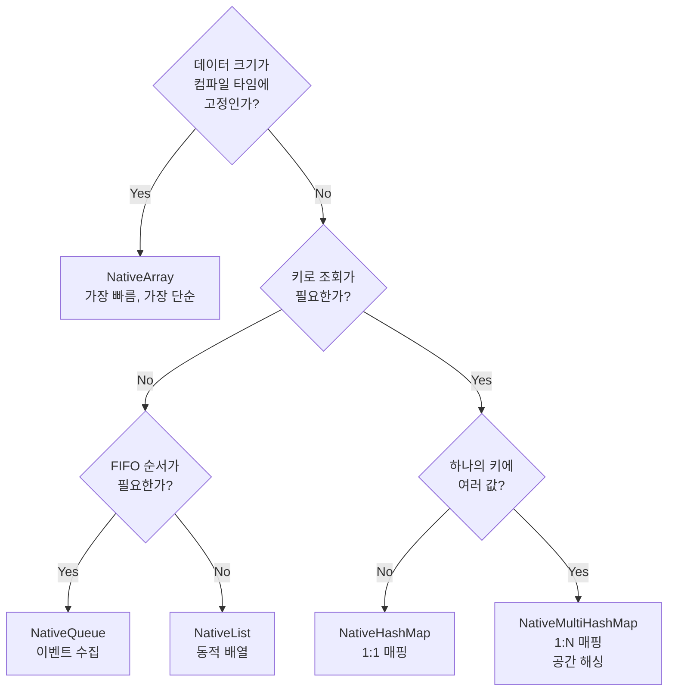
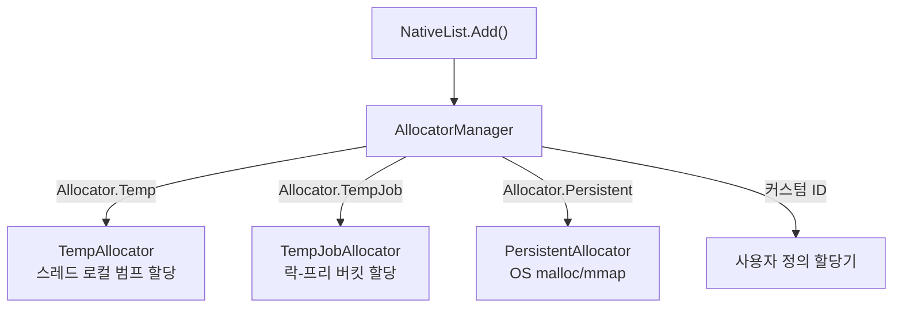
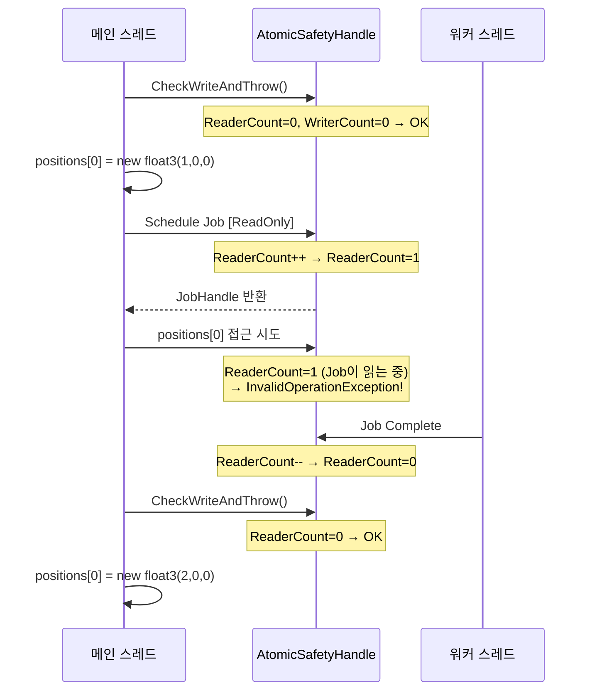

## 서론

[Job System 포스트](/posts/UnityJobSystemBurst/)에서 NativeArray의 내부 구조를 해부했다. C# 배열과의 메모리 모델 차이, Allocator 종류, Safety System의 기본 동작까지 다뤘다.

하지만 실전에서는 NativeArray만으로 모든 것을 해결할 수 없다. 동적 크기의 리스트가 필요하고, 키-값 쌍으로 빠르게 조회해야 하고, 여러 워커 스레드가 동시에 결과를 큐에 넣어야 한다. Unity의 `Unity.Collections` 패키지는 이를 위해 **NativeList, NativeHashMap, NativeQueue** 등 다양한 컨테이너를 제공한다.

이 포스트에서는 세 가지를 다룬다:

1. **NativeContainer 생태계** — NativeArray 너머의 컨테이너들과 각각의 내부 구조
2. **Allocator와 AtomicSafetyHandle의 내부 동작** — "왜 Temp가 빠르고 Persistent가 느린가", "Safety System은 정확히 어떻게 경합을 감지하는가"
3. **Custom NativeContainer 제작** — Unity의 Safety System과 연동되는 나만의 컨테이너를 만드는 방법

> NativeArray의 기본 구조(void* 포인터 + unmanaged heap), Allocator 종류 테이블, [ReadOnly]/[WriteOnly] 기본 사용법은 [Job System 포스트](/posts/UnityJobSystemBurst/#nativecontainer-job이-사용하는-데이터)에서 다뤘으므로 여기서는 반복하지 않는다.

---

## Part 1: NativeContainer 생태계

### 1.1 왜 NativeArray만으로는 부족한가

NativeArray는 **고정 크기 연속 배열**이다. 크기를 미리 알고, 인덱스 기반으로 접근하며, 모든 요소가 같은 타입일 때 최적이다.

하지만 게임 런타임에서 흔히 마주치는 상황들:

```csharp
// 상황 1: 런타임에 크기가 변하는 결과 수집
// "살아있는 에이전트만 필터링해서 모아라" → 결과 크기를 미리 모른다
NativeArray<int> aliveIndices = ???;  // 크기가 몇이지?

// 상황 2: 키로 빠르게 조회
// "Entity ID 42의 현재 체력은?" → 인덱스가 아니라 키로 접근해야 한다
float health = ???;  // NativeArray[42]가 아니라 Map[entityId]

// 상황 3: 여러 Job이 동시에 결과를 넣기
// 10개 워커가 각자 발견한 충돌 쌍을 하나의 컬렉션에 추가
???.Add(new CollisionPair(a, b));  // 동시 쓰기 안전해야 한다
```

이런 상황을 위해 `Unity.Collections` 패키지는 NativeArray 외에 다양한 컨테이너를 제공한다.

### 1.2 NativeList\<T\> — 동적 배열

managed C#의 `List<T>`에 대응하는 컨테이너다. 내부적으로 NativeArray와 마찬가지로 unmanaged heap의 연속 메모리를 사용하되, **동적으로 크기가 변한다.**

```csharp
// 기본 사용
var list = new NativeList<float3>(initialCapacity: 256, Allocator.TempJob);

list.Add(new float3(1, 0, 0));        // O(1) 상각
list.Add(new float3(2, 0, 0));
float3 first = list[0];               // O(1) 인덱스 접근
list.RemoveAtSwapBack(0);             // O(1) 순서 무시 삭제
int count = list.Length;               // 현재 요소 수
int cap = list.Capacity;              // 할당된 용량

list.Dispose();
```

#### 내부 구조

```
NativeList<T> (struct)
┌─────────────────────────────┐
│  UnsafeList<T>* m_ListData ─┼──▶ ┌── Unmanaged Heap ──────────────┐
│  #if SAFETY                 │    │  void*  Ptr ──▶ [T][T][T][..][  ] │
│  AtomicSafetyHandle         │    │  int    Length  (현재 요소 수)    │
│  #endif                     │    │  int    Capacity (할당된 슬롯 수) │
└─────────────────────────────┘    │  Allocator Allocator             │
                                   └───────────────────────────────────┘
```

핵심 차이:
- NativeArray는 `void*`를 struct 내부에 직접 보유한다
- NativeList는 `UnsafeList<T>*` — 즉 **포인터의 포인터**다. 이유는 `Add()` 시 realloc이 발생하면 `void* Ptr`이 바뀔 수 있는데, Job에 NativeList를 복사(struct copy)하면 원본의 Ptr 변경이 반영되지 않기 때문이다. 한 단계 인디렉션을 추가하여 **모든 복사본이 같은 UnsafeList를 참조**하도록 한다.

#### 확장 정책

```csharp
// Unity 내부 확장 로직 (Collections 2.x 기준, 단순화)
void Resize(int newCapacity)
{
    newCapacity = math.max(newCapacity, 64 / UnsafeUtility.SizeOf<T>());
    newCapacity = math.ceilpow2(newCapacity);  // 다음 2의 거듭제곱으로 올림
    
    void* newPtr = UnsafeUtility.Malloc(
        newCapacity * UnsafeUtility.SizeOf<T>(),
        UnsafeUtility.AlignOf<T>(),
        m_Allocator);
    
    UnsafeUtility.MemCpy(newPtr, Ptr, Length * UnsafeUtility.SizeOf<T>());
    UnsafeUtility.Free(Ptr, m_Allocator);
    Ptr = newPtr;
    Capacity = newCapacity;
}
```

`math.ceilpow2`로 용량을 2의 거듭제곱으로 올리므로, 확장 빈도가 줄어든다. 하지만 `Persistent` Allocator에서 realloc은 **OS malloc + memcpy + free**를 수반하므로 비용이 크다. 가능하면 **초기 용량을 넉넉하게 설정**하는 것이 좋다.

#### Job에서의 병렬 쓰기: ParallelWriter

`NativeList`에 여러 워커 스레드가 동시에 `Add()`를 호출하면 경합 조건이 발생한다. Unity는 이를 위해 **ParallelWriter** 패턴을 제공한다.

```csharp
// 메인 스레드: ParallelWriter 생성
var aliveList = new NativeList<int>(agentCount, Allocator.TempJob);
var writer = aliveList.AsParallelWriter();

// Job 정의
[BurstCompile]
struct FilterAliveJob : IJobParallelFor
{
    [ReadOnly] public NativeArray<byte> IsAlive;
    public NativeList<int>.ParallelWriter AliveIndices;
    
    public void Execute(int index)
    {
        if (IsAlive[index] != 0)
            AliveIndices.AddNoResize(index);  // 락-프리 원자적 추가
    }
}

// 스케줄
var filterJob = new FilterAliveJob
{
    IsAlive = isAliveArray,
    AliveIndices = writer
};
filterJob.Schedule(agentCount, 64).Complete();

// 결과 사용 — 순서는 보장되지 않는다
Debug.Log($"살아있는 에이전트 수: {aliveList.Length}");
```

**`AddNoResize`의 내부 동작:**

```csharp
// 내부 구현 (단순화)
public void AddNoResize(T value)
{
    // Interlocked.Increment로 원자적으로 인덱스 획득
    int idx = Interlocked.Increment(ref ListData->Length) - 1;
    UnsafeUtility.WriteArrayElement(ListData->Ptr, idx, value);
}
```

`Interlocked.Increment`는 **CPU의 LOCK XADD 명령어**로 구현되며, 락 없이 원자적으로 인덱스를 할당한다. 단, realloc이 발생하면 안 되므로 `AddNoResize`를 사용하고, 메인 스레드에서 **미리 충분한 용량을 확보**해야 한다.

> **주의**: `ParallelWriter.AddNoResize()`는 요소의 **순서를 보장하지 않는다**. 워커 스레드의 실행 순서에 따라 매번 다른 순서로 추가된다. 순서가 필요하면 이후에 정렬해야 한다.

### 1.3 NativeHashMap\<TKey, TValue\> — 해시 테이블

managed C#의 `Dictionary<TKey, TValue>`에 대응한다. O(1) 평균 시간에 키-값 쌍을 삽입/조회/삭제한다.

```csharp
var map = new NativeHashMap<int, float>(capacity: 1024, Allocator.Persistent);

map.Add(42, 100f);                      // 삽입
map[42] = 95f;                          // 갱신
bool found = map.TryGetValue(42, out float hp);  // 조회
map.Remove(42);                         // 삭제
bool has = map.ContainsKey(42);         // 존재 확인

map.Dispose();
```

#### 내부 구조: 오픈 어드레싱

Unity의 NativeHashMap은 managed Dictionary와 다른 해시 충돌 해결 전략을 사용한다.

| | managed Dictionary | NativeHashMap |
|--|---------------------|---------------|
| 충돌 해결 | 체이닝 (linked list) | **오픈 어드레싱** (linear probing) |
| 메모리 레이아웃 | 분산 (노드 포인터) | **연속 배열** |
| 캐시 효율 | 낮음 (포인터 체이싱) | **높음** (선형 탐색) |
| GC 영향 | 있음 | **없음** |

```
NativeHashMap 내부 메모리 레이아웃:
┌────────────────── 연속 메모리 블록 ──────────────────┐
│                                                       │
│  Buckets 배열 (해시 → 슬롯 매핑):                     │
│  ┌─────┬─────┬─────┬─────┬─────┬─────┬─────┬─────┐  │
│  │  3  │ -1  │  0  │ -1  │  2  │ -1  │  1  │ -1  │  │
│  └─────┴─────┴─────┴─────┴─────┴─────┴─────┴─────┘  │
│   bucket[hash(key) % capacity] → 슬롯 인덱스          │
│   -1 = 빈 버킷                                        │
│                                                       │
│  Keys 배열:                                           │
│  ┌──────┬──────┬──────┬──────┐                       │
│  │ key0 │ key1 │ key2 │ key3 │                       │
│  └──────┴──────┴──────┴──────┘                       │
│                                                       │
│  Values 배열:                                         │
│  ┌──────┬──────┬──────┬──────┐                       │
│  └──────┴──────┴──────┴──────┘                       │
│                                                       │
│  Next 배열 (체이닝용):                                │
│  ┌──────┬──────┬──────┬──────┐                       │
│  │ -1   │ -1   │ -1   │ -1   │                       │
│  └──────┴──────┴──────┴──────┘                       │
└───────────────────────────────────────────────────────┘
```

오픈 어드레싱이 Job System에 적합한 이유:
1. **단일 연속 할당** — Allocator 호출 1회로 모든 내부 배열을 할당
2. **캐시 친화적** — 충돌 시 인접 슬롯을 선형 탐색하므로 캐시 라인 재활용
3. **GC-free** — 노드 객체를 힙에 할당하지 않음

#### 용량과 해시 충돌

NativeHashMap의 성능은 **load factor**(적재율 = 요소 수 / 용량)에 크게 의존한다.

| Load Factor | 평균 탐색 길이 | 성능 |
|-------------|---------------|------|
| < 0.5 | ~1.5회 | 우수 |
| 0.7 | ~2.2회 | 양호 |
| 0.9 | ~5.5회 | 나쁨 |
| > 0.95 | 급격히 증가 | 위험 |

> Unity는 내부적으로 load factor 임계값(약 0.75)을 초과하면 자동으로 rehash한다. 하지만 rehash는 **전체 데이터를 새 버킷 배열로 재배치**하는 O(n) 연산이므로, 예상 크기를 미리 알면 초기 용량을 넉넉하게 잡는 것이 좋다.

#### ParallelWriter

```csharp
var map = new NativeHashMap<int, float>(capacity, Allocator.TempJob);
var writer = map.AsParallelWriter();

[BurstCompile]
struct PopulateMapJob : IJobParallelFor
{
    [ReadOnly] public NativeArray<int> EntityIds;
    [ReadOnly] public NativeArray<float> Healths;
    public NativeHashMap<int, float>.ParallelWriter MapWriter;
    
    public void Execute(int index)
    {
        MapWriter.TryAdd(EntityIds[index], Healths[index]);
    }
}
```

NativeHashMap의 ParallelWriter는 **버킷 단위 락**을 사용한다. NativeList의 단순 Interlocked보다 무겁지만, 해시 분포가 고르면 충돌이 적어 실질적인 경합은 낮다.

> **주의**: `TryAdd`는 키가 이미 존재하면 false를 반환하고 아무것도 하지 않는다. 여러 워커가 같은 키를 넣으면 "먼저 도착한 쪽이 승리"하는 비결정적 동작이다. 결정론이 필요하면 별도 로직이 필요하다.

### 1.4 NativeMultiHashMap\<TKey, TValue\> — 하나의 키에 여러 값

하나의 키에 **여러 값**을 저장할 수 있는 해시맵이다. 게임에서 매우 자주 쓰이는 패턴인 **공간 해싱(Spatial Hashing)**에 핵심적이다.

```csharp
var spatialMap = new NativeMultiHashMap<int, int>(capacity, Allocator.TempJob);

// 그리드 셀 → 해당 셀에 있는 에이전트 ID들
spatialMap.Add(cellHash, agentId0);
spatialMap.Add(cellHash, agentId1);  // 같은 키에 여러 값
spatialMap.Add(cellHash, agentId2);

// 순회: 특정 키의 모든 값을 순회
if (spatialMap.TryGetFirstValue(cellHash, out int id, out var iterator))
{
    do
    {
        // id로 이웃 에이전트 처리
        ProcessNeighbor(id);
    }
    while (spatialMap.TryGetNextValue(out id, ref iterator));
}
```

#### 실전: 공간 해싱으로 이웃 탐색

에이전트 간 분리력(Separation) 계산에서 모든 에이전트 쌍을 검사하면 O(N²)이다. 공간 해싱은 이를 O(N × K)로 줄인다 (K = 셀당 평균 에이전트 수).

```csharp
// Phase 1: 공간 해시맵 구축
[BurstCompile]
struct BuildSpatialHashJob : IJobParallelFor
{
    [ReadOnly] public NativeArray<float3> Positions;
    [ReadOnly] public float CellSize;
    public NativeMultiHashMap<int, int>.ParallelWriter SpatialMap;
    
    public void Execute(int index)
    {
        int hash = GetCellHash(Positions[index], CellSize);
        SpatialMap.Add(hash, index);
    }
    
    static int GetCellHash(float3 pos, float cellSize)
    {
        int x = (int)math.floor(pos.x / cellSize);
        int z = (int)math.floor(pos.z / cellSize);
        return x * 73856093 ^ z * 19349663;  // 해시 함수
    }
}

// Phase 2: 이웃 탐색 (9셀 검사)
[BurstCompile]
struct SeparationJob : IJobParallelFor
{
    [ReadOnly] public NativeArray<float3> Positions;
    [ReadOnly] public NativeMultiHashMap<int, int> SpatialMap;
    [ReadOnly] public float CellSize;
    [ReadOnly] public float SeparationRadius;
    
    [WriteOnly] public NativeArray<float3> SeparationForces;
    
    public void Execute(int index)
    {
        float3 myPos = Positions[index];
        float3 force = float3.zero;
        int myX = (int)math.floor(myPos.x / CellSize);
        int myZ = (int)math.floor(myPos.z / CellSize);
        
        // 주변 9셀 검사
        for (int dx = -1; dx <= 1; dx++)
        for (int dz = -1; dz <= 1; dz++)
        {
            int hash = (myX + dx) * 73856093 ^ (myZ + dz) * 19349663;
            
            if (SpatialMap.TryGetFirstValue(hash, out int other, out var it))
            {
                do
                {
                    if (other == index) continue;
                    float3 diff = myPos - Positions[other];
                    float distSq = math.lengthsq(diff);
                    if (distSq < SeparationRadius * SeparationRadius && distSq > 0.001f)
                    {
                        force += math.normalize(diff) / math.sqrt(distSq);
                    }
                }
                while (SpatialMap.TryGetNextValue(out other, ref it));
            }
        }
        
        SeparationForces[index] = force;
    }
}
```

### 1.5 NativeQueue\<T\> — FIFO 큐

스레드 안전한 FIFO(First-In, First-Out) 큐. **이벤트 수집** 패턴에 적합하다.

```csharp
var eventQueue = new NativeQueue<DamageEvent>(Allocator.TempJob);

// Job에서 이벤트를 큐에 추가
[BurstCompile]
struct CombatJob : IJobParallelFor
{
    public NativeQueue<DamageEvent>.ParallelWriter EventQueue;
    
    public void Execute(int index)
    {
        if (/* 공격 판정 */)
            EventQueue.Enqueue(new DamageEvent { Target = targetId, Amount = 10f });
    }
}

// 메인 스레드에서 이벤트 소비
while (eventQueue.TryDequeue(out DamageEvent evt))
{
    ApplyDamage(evt.Target, evt.Amount);
}
```

#### 내부 구조: 블록 기반 큐

NativeQueue는 단순한 원형 버퍼가 아니라 **블록(block) 링크드 리스트**로 구현되어 있다.

```
NativeQueue 내부:
┌──────────────┐     ┌──────────────┐     ┌──────────────┐
│ Block 0      │────▶│ Block 1      │────▶│ Block 2      │
│ [T][T][T]... │     │ [T][T][T]... │     │ [T][..][  ]  │
│ (가득 참)     │     │ (가득 참)     │     │ (일부 사용)   │
└──────────────┘     └──────────────┘     └──────────────┘
 ↑ DequeueHead                            ↑ EnqueueTail
```

- 각 블록은 고정 크기(보통 256개 슬롯)의 배열이다
- 블록이 가득 차면 새 블록을 할당하여 연결한다
- Dequeue는 Head 블록에서, Enqueue는 Tail 블록에서 수행한다
- 비어있는 블록은 **풀(pool)**에 반환되어 재사용된다

이 구조의 장점:
- **ParallelWriter의 Enqueue가 Tail 블록에만 접근** → 경합이 Tail에 집중되지만 블록이 가득 차면 새 블록을 각자 할당하므로 실질적 경합이 낮다
- realloc이 없어 기존 포인터가 무효화되지 않는다

### 1.6 NativeReference\<T\> — 단일 값 컨테이너

단 하나의 값을 담는 컨테이너다. "Job에서 단일 결과를 반환하기 위한" 용도다.

```csharp
var totalHealth = new NativeReference<float>(Allocator.TempJob);

[BurstCompile]
struct SumHealthJob : IJob
{
    [ReadOnly] public NativeArray<float> Healths;
    public NativeReference<float> Total;
    
    public void Execute()
    {
        float sum = 0;
        for (int i = 0; i < Healths.Length; i++)
            sum += Healths[i];
        Total.Value = sum;
    }
}
```

NativeArray\<T\>(1)로도 같은 결과를 얻을 수 있지만, NativeReference는 **의도를 명확히** 하고 인덱싱 실수를 방지한다.

### 1.7 Unsafe 변형: 안전 vs 성능 트레이드오프

모든 Native 컨테이너에는 `Unsafe` 접두사 변형이 존재한다.

| Native (안전) | Unsafe (무검사) | 차이점 |
|---------------|----------------|--------|
| NativeArray\<T\> | UnsafeArray\<T\> | AtomicSafetyHandle 없음 |
| NativeList\<T\> | UnsafeList\<T\> | bounds check 없음 |
| NativeHashMap\<K,V\> | UnsafeHashMap\<K,V\> | 동시 접근 검사 없음 |

```csharp
// NativeList 내부 — Unsafe를 감싸고 Safety를 추가
public struct NativeList<T> : INativeDisposable where T : unmanaged
{
    internal UnsafeList<T>* m_ListData;     // 실제 데이터
    
#if ENABLE_UNITY_COLLECTIONS_CHECKS
    internal AtomicSafetyHandle m_Safety;   // 안전성 검사
    internal static readonly SharedStatic<int> s_staticSafetyId;
#endif
}
```

**Native 컨테이너는 Unsafe 컨테이너의 래퍼**다. 에디터에서 AtomicSafetyHandle로 잘못된 접근을 잡아내고, 릴리스 빌드에서는 `ENABLE_UNITY_COLLECTIONS_CHECKS`가 정의되지 않아 **안전 검사 코드가 컴파일에서 제거**된다.

따라서:
- **개발 중**: Native 변형을 사용하여 버그를 빠르게 발견
- **릴리스 빌드**: 자동으로 Unsafe 수준의 성능
- **이미 검증된 내부 코드**: Unsafe 변형을 직접 사용하여 에디터에서도 오버헤드 제거

### 1.8 컨테이너 선택 가이드



| 컨테이너 | 삽입 | 조회 | 삭제 | 병렬 쓰기 | 주요 용도 |
|----------|------|------|------|-----------|-----------|
| NativeArray | N/A (고정) | O(1) 인덱스 | N/A | 인덱스별 분할 | SoA 데이터, Job 입출력 |
| NativeList | O(1) 상각 | O(1) 인덱스 | O(1) SwapBack | ParallelWriter | 필터링 결과, 동적 버퍼 |
| NativeHashMap | O(1) 평균 | O(1) 평균 | O(1) 평균 | ParallelWriter | Entity 매핑, 캐시 |
| NativeMultiHashMap | O(1) 평균 | O(K) 순회 | O(1) 평균 | ParallelWriter | 공간 해싱, 그룹핑 |
| NativeQueue | O(1) | O(1) Dequeue | N/A | ParallelWriter | 이벤트, 작업 큐 |
| NativeReference | N/A | O(1) | N/A | 없음 | Job 단일 결과 |

---

## Part 2: Allocator 내부 구현

[Job System 포스트](/posts/UnityJobSystemBurst/#allocator-종류)에서 Allocator 3종(Temp, TempJob, Persistent)의 용도와 수명을 테이블로 정리했다. 여기서는 **각 Allocator가 메모리를 실제로 어떻게 할당하고 해제하는지** 내부 구현을 파고든다.

### 2.1 AllocatorManager 아키텍처

Unity의 모든 NativeContainer는 `AllocatorManager`를 통해 메모리를 할당한다. 이 시스템의 핵심은 **Allocator가 단순한 enum이 아니라, 각각 다른 할당 전략을 구현하는 객체**라는 것이다.



```csharp
// AllocatorManager의 핵심 인터페이스 (단순화)
public static unsafe class AllocatorManager
{
    public interface IAllocator
    {
        int Try(ref Block block);  // 할당/해제 시도
    }
    
    public struct Block
    {
        public void* Pointer;
        public long Bytes;
        public int Alignment;
    }
}
```

### 2.2 Temp Allocator: 스레드 로컬 범프 할당

**가장 빠른** 할당기. 모든 비용이 사실상 0에 가깝다.

```
스레드 로컬 메모리 풀 (각 워커 스레드마다 독립):
┌──────────────────────────────────────────────┐
│ [사용 중][사용 중][사용 중][    빈 공간       ] │
│                           ↑                    │
│                       Offset (범프 포인터)      │
│                                                │
│  할당: offset += size (한 번의 덧셈)            │
│  해제: 프레임 끝에 offset = 0 (전체 리셋)       │
└────────────────────────────────────────────────┘
```

**범프 할당(Bump Allocation)**의 동작:

```csharp
// 내부 구현 개념 (단순화)
struct TempAllocator
{
    byte* m_Buffer;     // 미리 할당된 메모리 풀
    int m_Capacity;     // 풀 크기 (보통 수 MB)
    int m_Offset;       // 현재 위치
    
    void* Allocate(int size, int alignment)
    {
        // 정렬 맞추기
        m_Offset = (m_Offset + alignment - 1) & ~(alignment - 1);
        
        void* ptr = m_Buffer + m_Offset;
        m_Offset += size;  // ← 이것이 전체 할당 비용 (덧셈 1회)
        return ptr;
    }
    
    void RewindAll()
    {
        m_Offset = 0;  // 프레임 끝에 전체 리셋
    }
}
```

왜 빠른가:
1. **덧셈 1회 = 할당 완료** — malloc의 프리 리스트 탐색, 분할, 병합이 모두 없다
2. **스레드 로컬** — 다른 스레드와 동기화가 불필요. 락, CAS, 메모리 배리어 0회
3. **개별 해제 없음** — 프레임 끝에 포인터를 0으로 되돌리면 모든 할당이 한 번에 해제

**제약**: Temp로 할당한 메모리는 **해당 프레임(또는 Job 실행 범위) 내에서만 유효**하다. 다음 프레임에 `RewindAll()`이 호출되면 모든 포인터가 무효화된다.

### 2.3 TempJob Allocator: 락-프리 버킷 할당

Job 간에 데이터를 전달할 때 사용한다. Temp보다 느리지만, 최대 4프레임까지 유효하다.

```
락-프리 버킷 할당기:
┌──── 버킷 0 (16B) ────┐ ┌── 버킷 1 (32B) ──┐ ┌── 버킷 2 (64B) ──┐
│ ┌──┐┌──┐┌──┐┌──┐┌──┐ │ │ ┌──┐┌──┐┌──┐   │ │ ┌───┐┌───┐      │
│ │  ││  ││✗ ││  ││✗ │ │ │ │  ││✗ ││  │   │ │ │   ││ ✗ │      │
│ └──┘└──┘└──┘└──┘└──┘ │ │ └──┘└──┘└──┘   │ │ └───┘└───┘      │
└───────────────────────┘ └─────────────────┘ └────────────────────┘
  ✗ = 사용 중

할당: 요청 크기에 맞는 버킷 → 프리 리스트에서 CAS로 블록 획득
해제: 블록을 프리 리스트에 CAS로 반환
```

**동작 원리:**

```csharp
// 내부 구현 개념 (단순화)
struct TempJobAllocator
{
    // 크기별 프리 리스트 (16B, 32B, 64B, 128B, ...)
    FreeList* m_Buckets;
    
    void* Allocate(int size)
    {
        int bucketIndex = CeilLog2(size);  // 크기에 맞는 버킷 선택
        
        // 락-프리 CAS 루프로 블록 획득
        while (true)
        {
            void* head = m_Buckets[bucketIndex].Head;
            if (head == null) return AllocateNewBlock(bucketIndex);
            
            void* next = ((FreeNode*)head)->Next;
            if (Interlocked.CompareExchange(
                    ref m_Buckets[bucketIndex].Head, next, head) == head)
                return head;
            // CAS 실패 → 다른 스레드가 먼저 가져감 → 재시도
        }
    }
}
```

Temp과 Persistent 사이의 **균형점**:
- Temp보다 느림: CAS 연산 필요 (CPU 파이프라인 스톨 가능)
- Persistent보다 빠름: OS 커널 호출 없이 유저 스페이스에서 처리
- 4프레임 내 해제 강제: 누수 방지 (Safety System이 초과 시 에러)

### 2.4 Persistent Allocator: OS 수준 malloc

무제한 수명의 메모리. 게임 내내 유지되는 데이터에 사용한다.

```csharp
// 내부적으로 플랫폼별 OS API 호출
void* Allocate(int size, int alignment)
{
    // Windows: VirtualAlloc 또는 HeapAlloc
    // Linux/macOS: mmap 또는 posix_memalign
    // → OS 커널로의 시스템 콜 발생
    return UnsafeUtility.Malloc(size, alignment, Allocator.Persistent);
}
```

왜 느린가:
1. **시스템 콜** — 유저 모드 → 커널 모드 전환 비용 (~수백 ns)
2. **프리 리스트 탐색** — OS의 힙 관리자가 적절한 빈 블록을 찾아야 함
3. **글로벌 락 가능** — 여러 스레드가 동시에 malloc을 호출하면 경합 발생

하지만 한 번 할당하면 이후 데이터 접근 성능은 Temp, TempJob과 **동일**하다. 비용은 할당/해제 시점에만 발생한다.

### 2.5 Allocator 성능 비교

| Allocator | 할당 비용 | 해제 비용 | 스레드 안전 | 수명 |
|-----------|----------|----------|------------|------|
| Temp | ~1ns (범프) | 0 (전체 리셋) | 스레드 로컬 (락 불필요) | 1프레임 |
| TempJob | ~10-50ns (CAS) | ~10-50ns (CAS) | 락-프리 CAS | 4프레임 |
| Persistent | ~100-500ns (시스템 콜) | ~100-500ns | OS 내부 락 | 무제한 |

**실전 가이드:**

```csharp
// ✅ Temp — Job 내부의 임시 계산용 버퍼
[BurstCompile]
struct MyJob : IJob
{
    public void Execute()
    {
        // Job 실행 중에만 필요한 버퍼
        var scratch = new NativeArray<int>(64, Allocator.Temp);
        // ... 사용 ...
        scratch.Dispose();  // 명시적 해제 가능 (안 해도 자동 해제)
    }
}

// ✅ TempJob — Job 간 데이터 전달
void SchedulePipeline()
{
    var temp = new NativeArray<float>(count, Allocator.TempJob);
    var h1 = new ProduceJob { Output = temp }.Schedule();
    var h2 = new ConsumeJob { Input = temp }.Schedule(h1);
    h2.Complete();
    temp.Dispose();  // 반드시 수동 해제
}

// ✅ Persistent — 게임 내내 유지
public class GameData : MonoBehaviour
{
    NativeArray<float3> _positions;
    
    void Awake()
    {
        _positions = new NativeArray<float3>(maxAgents, Allocator.Persistent);
    }
    
    void OnDestroy()
    {
        if (_positions.IsCreated) _positions.Dispose();  // 필수!
    }
}
```

### 2.6 커스텀 Allocator

Unity Collections 2.x부터 `AllocatorManager.Register()`를 통해 **커스텀 할당기**를 등록할 수 있다. 특수한 메모리 관리가 필요할 때 사용한다.

```csharp
// 커스텀 Allocator 구현 예시: 링 버퍼 할당기
[BurstCompile]
public struct RingBufferAllocator : AllocatorManager.IAllocator
{
    byte* m_Buffer;
    int m_Capacity;
    int m_Head;
    
    public int Try(ref AllocatorManager.Block block)
    {
        if (block.Pointer == null)  // 할당 요청
        {
            int aligned = (m_Head + block.Alignment - 1) & ~(block.Alignment - 1);
            if (aligned + block.Bytes > m_Capacity)
                return -1;  // 실패
            
            block.Pointer = m_Buffer + aligned;
            m_Head = (int)(aligned + block.Bytes);
            return 0;  // 성공
        }
        else  // 해제 요청
        {
            // 링 버퍼는 개별 해제 불가 — 전체 리셋만 지원
            return 0;
        }
    }
}
```

커스텀 Allocator의 활용 사례:
- **풀 할당기**: 같은 크기의 객체를 대량으로 할당/해제하는 오브젝트 풀
- **이중 버퍼 할당기**: 프레임 A와 프레임 B를 교대로 사용
- **디버그 할당기**: 할당 추적, 누수 탐지, 메모리 가드 페이지 삽입

---

## Part 3: AtomicSafetyHandle 동작 원리

[Job System 포스트](/posts/UnityJobSystemBurst/#safety-system-경합-조건-방지)에서 Safety System이 잡아주는 실수 3가지를 봤다. 여기서는 **AtomicSafetyHandle이 내부적으로 어떻게 읽기/쓰기 권한을 추적하고, 잘못된 접근을 감지하는지** 메커니즘을 파고든다.

### 3.1 "런타임 Borrow Checker"

Rust의 borrow checker가 **컴파일 타임**에 참조 규칙을 강제한다면, Unity의 AtomicSafetyHandle은 **런타임**에 비슷한 역할을 한다.

| | Rust Borrow Checker | Unity AtomicSafetyHandle |
|--|---------------------|--------------------------|
| 검사 시점 | 컴파일 타임 | 런타임 (에디터만) |
| 비용 | 0 (런타임 오버헤드 없음) | 에디터에서 접근마다 검사 |
| 규칙 | 읽기 N개 XOR 쓰기 1개 | 동일한 규칙 |
| 릴리스 동작 | 컴파일 에러 → 빌드 불가 | 검사 코드 제거 → 성능 0 |

핵심 규칙은 동일하다:

> **동시에 여러 읽기가 가능하거나(shared read), 단 하나의 쓰기만 가능하다(exclusive write). 둘을 동시에 할 수 없다.**

### 3.2 AtomicSafetyHandle의 내부 구조

```csharp
// Unity 내부 구현 (단순화)
public struct AtomicSafetyHandle
{
    // 네이티브 측 SafetyNode를 가리키는 포인터
    internal IntPtr m_NodePtr;
    
    // 버전 번호 — Dispose 후 접근 감지에 사용
    internal int m_Version;
}
```

실제 상태는 **SafetyNode**라는 네이티브 구조체에 저장된다:

```
SafetyNode (네이티브 측):
┌───────────────────────────────────────┐
│  int    Version          // 현재 버전 │
│  int    ReaderCount      // 읽기 중인 수 │
│  int    WriterCount      // 쓰기 중인 수 (0 또는 1) │
│  bool   AllowReadOrWrite // 접근 허용 상태 │
│  bool   IsDisposed       // 해제 여부 │
│  string OwnerTypeName    // 디버그: 소유자 타입명 │
└───────────────────────────────────────┘
```

### 3.3 권한 추적 흐름

NativeContainer의 각 접근 시점에서 AtomicSafetyHandle이 어떻게 동작하는지 추적한다.



#### 검사 함수들

```csharp
// Unity가 내부적으로 호출하는 검사 함수들
public static class AtomicSafetyHandle
{
    // NativeArray 인덱서의 getter에서 호출
    public static void CheckReadAndThrow(AtomicSafetyHandle handle)
    {
        // 1. 버전 체크 → Dispose 후 접근 감지
        if (handle.m_Version != handle.m_NodePtr->Version)
            throw new ObjectDisposedException("이미 해제된 컨테이너");
        
        // 2. 쓰기 잠금 체크 → 다른 Job이 쓰는 중이면 차단
        if (handle.m_NodePtr->WriterCount > 0)
            throw new InvalidOperationException("Job이 쓰기 중인 데이터에 읽기 시도");
    }
    
    // NativeArray 인덱서의 setter에서 호출
    public static void CheckWriteAndThrow(AtomicSafetyHandle handle)
    {
        if (handle.m_Version != handle.m_NodePtr->Version)
            throw new ObjectDisposedException("이미 해제된 컨테이너");
        
        if (handle.m_NodePtr->ReaderCount > 0 || handle.m_NodePtr->WriterCount > 0)
            throw new InvalidOperationException("Job이 접근 중인 데이터에 쓰기 시도");
    }
}
```

### 3.4 버전(Version) 메커니즘: Use-After-Free 방지

AtomicSafetyHandle의 가장 교묘한 부분은 **버전 번호**다.

```csharp
var array = new NativeArray<int>(10, Allocator.TempJob);
// array.m_Safety.m_Version = 1
// SafetyNode.Version = 1 → 일치

array.Dispose();
// SafetyNode.Version = 2 (증가!)
// array.m_Safety.m_Version = 1 (변하지 않음)

// Dispose 후 접근 시도
int val = array[0];
// CheckReadAndThrow: handle.m_Version(1) != Node.Version(2)
// → ObjectDisposedException!
```

struct인 NativeArray가 복사되어 여러 곳에 존재할 수 있으므로, Dispose가 모든 복사본을 무효화할 수 없다. 대신 **SafetyNode의 버전을 증가**시키면, 기존의 모든 복사본이 버전 불일치로 자동 무효화된다.

### 3.5 에디터 vs 릴리스 빌드

```csharp
public unsafe T this[int index]
{
    get
    {
#if ENABLE_UNITY_COLLECTIONS_CHECKS
        AtomicSafetyHandle.CheckReadAndThrow(m_Safety);
        if ((uint)index >= (uint)m_Length)
            throw new IndexOutOfRangeException();
#endif
        return UnsafeUtility.ReadArrayElement<T>(m_Buffer, index);
    }
}
```

`ENABLE_UNITY_COLLECTIONS_CHECKS`는 **에디터와 Development Build에서만** 정의된다. Release Build에서는:

- `CheckReadAndThrow` → **제거**
- bounds check → **제거**
- `UnsafeUtility.ReadArrayElement` → **Burst가 단일 메모리 로드 명령어로 컴파일**

**에디터에서의 성능 비용:**

| 연산 | 검사 없이 | 검사 포함 | 오버헤드 |
|------|----------|----------|----------|
| NativeArray 인덱서 (get) | ~1ns | ~5-10ns | 5-10× |
| NativeList.Add | ~5ns | ~15-20ns | 3-4× |
| NativeHashMap.TryGetValue | ~20ns | ~40-50ns | 2-2.5× |

에디터에서 프로파일링할 때 **Safety 검사 비용이 포함**된다는 점에 유의하라. 진짜 성능은 반드시 Release Build로 측정해야 한다.

### 3.6 DisposeSentinel: 메모리 누수 탐지

AtomicSafetyHandle과 함께 동작하는 보조 시스템이 **DisposeSentinel**이다.

```csharp
// NativeArray 생성 시
public NativeArray(int length, Allocator allocator)
{
    // ...
#if ENABLE_UNITY_COLLECTIONS_CHECKS
    DisposeSentinel.Create(out m_Safety, out m_DisposeSentinel, 
                           callSiteStackDepth: 2, allocator);
#endif
}
```

DisposeSentinel은 **파이널라이저(finalizer)**를 가진 managed 객체다. NativeContainer가 `Dispose()`를 호출하면 Sentinel도 함께 해제된다. 하지만 `Dispose()`를 호출하지 않으면:

1. GC가 Sentinel의 파이널라이저를 실행
2. 파이널라이저에서 **"NativeArray가 Dispose되지 않았습니다"** 경고를 콘솔에 출력
3. 할당 시점의 스택 트레이스를 함께 표시

```
NativeArray object was not disposed. It was allocated at:
  at FlowFieldData..ctor() (FlowFieldData.cs:12)
  at GameManager.Start() (GameManager.cs:45)
```

이 메시지가 보이면 어디선가 NativeContainer를 Dispose하지 않은 것이다. 할당 위치까지 알려주므로 **네이티브 메모리 누수를 빠르게 추적**할 수 있다.

---

## Part 4: Custom NativeContainer 제작

Unity가 제공하는 컨테이너로 해결되지 않는 경우가 있다. 고정 크기 링 버퍼, 비트마스크 배열, 스파스 셋(sparse set) 등 게임 특화 자료구조가 필요할 때 **Custom NativeContainer**를 만들 수 있다.

### 4.1 필수 구성 요소

Custom NativeContainer를 Unity의 Job System과 완전히 통합하려면 4가지가 필요하다:

```
Custom NativeContainer 체크리스트:
┌────────────────────────────────────────────────┐
│ 1. [NativeContainer] 어트리뷰트                 │
│ 2. AtomicSafetyHandle 통합                      │
│ 3. IDisposable + DisposeSentinel                │
│ 4. [NativeContainerIs...] 마커 어트리뷰트       │
└────────────────────────────────────────────────┘
```

### 4.2 실전: NativeRingBuffer\<T\> 구현

고정 크기 원형 버퍼를 구현한다. 실시간 데이터 스트림(예: 최근 N프레임의 FPS 기록, 트레일 이펙트의 위치 히스토리)에 유용하다.

```csharp
using System;
using System.Diagnostics;
using Unity.Burst;
using Unity.Collections;
using Unity.Collections.LowLevel.Unsafe;
using Unity.Jobs;

/// <summary>
/// 고정 크기 원형 버퍼. 가득 차면 가장 오래된 요소를 덮어쓴다.
/// Job System과 완전 통합되며, Safety System의 보호를 받는다.
/// </summary>
[NativeContainer]  // ① Safety System에 "이것은 NativeContainer다"라고 알림
public unsafe struct NativeRingBuffer<T> : IDisposable where T : unmanaged
{
    // ────────────────── 데이터 ──────────────────
    [NativeDisableUnsafePtrRestriction]
    internal void* m_Buffer;         // T[] 데이터의 시작 주소
    
    internal int m_Capacity;         // 버퍼 용량 (고정)
    internal int m_Head;             // 다음 쓰기 위치
    internal int m_Count;            // 현재 요소 수
    internal Allocator m_Allocator;
    
    // ────────────────── Safety ──────────────────
#if ENABLE_UNITY_COLLECTIONS_CHECKS
    internal AtomicSafetyHandle m_Safety;
    
    [NativeSetClassTypeToNullOnSchedule]
    internal DisposeSentinel m_DisposeSentinel;
#endif
    
    // ────────────────── 생성/해제 ──────────────────
    public NativeRingBuffer(int capacity, Allocator allocator)
    {
        if (capacity <= 0)
            throw new ArgumentException("Capacity must be positive", nameof(capacity));
        
        long totalSize = (long)UnsafeUtility.SizeOf<T>() * capacity;
        m_Buffer = UnsafeUtility.Malloc(totalSize, UnsafeUtility.AlignOf<T>(), allocator);
        UnsafeUtility.MemClear(m_Buffer, totalSize);
        
        m_Capacity = capacity;
        m_Head = 0;
        m_Count = 0;
        m_Allocator = allocator;
        
#if ENABLE_UNITY_COLLECTIONS_CHECKS
        DisposeSentinel.Create(out m_Safety, out m_DisposeSentinel, 2, allocator);
#endif
    }
    
    public void Dispose()
    {
#if ENABLE_UNITY_COLLECTIONS_CHECKS
        DisposeSentinel.Dispose(ref m_Safety, ref m_DisposeSentinel);
#endif
        
        UnsafeUtility.Free(m_Buffer, m_Allocator);
        m_Buffer = null;
        m_Count = 0;
    }
    
    // ────────────────── 프로퍼티 ──────────────────
    public int Capacity
    {
        get
        {
#if ENABLE_UNITY_COLLECTIONS_CHECKS
            AtomicSafetyHandle.CheckReadAndThrow(m_Safety);
#endif
            return m_Capacity;
        }
    }
    
    public int Count
    {
        get
        {
#if ENABLE_UNITY_COLLECTIONS_CHECKS
            AtomicSafetyHandle.CheckReadAndThrow(m_Safety);
#endif
            return m_Count;
        }
    }
    
    public bool IsFull
    {
        get
        {
#if ENABLE_UNITY_COLLECTIONS_CHECKS
            AtomicSafetyHandle.CheckReadAndThrow(m_Safety);
#endif
            return m_Count == m_Capacity;
        }
    }
    
    public bool IsCreated => m_Buffer != null;
    
    // ────────────────── 쓰기 ──────────────────
    
    /// <summary>
    /// 요소를 추가한다. 버퍼가 가득 차면 가장 오래된 요소를 덮어쓴다.
    /// </summary>
    public void PushBack(T value)
    {
#if ENABLE_UNITY_COLLECTIONS_CHECKS
        AtomicSafetyHandle.CheckWriteAndThrow(m_Safety);
#endif
        UnsafeUtility.WriteArrayElement(m_Buffer, m_Head, value);
        m_Head = (m_Head + 1) % m_Capacity;
        
        if (m_Count < m_Capacity)
            m_Count++;
    }
    
    // ────────────────── 읽기 ──────────────────
    
    /// <summary>
    /// 인덱스로 접근. 0 = 가장 오래된 요소, Count-1 = 가장 최신 요소.
    /// </summary>
    public T this[int index]
    {
        get
        {
#if ENABLE_UNITY_COLLECTIONS_CHECKS
            AtomicSafetyHandle.CheckReadAndThrow(m_Safety);
            if ((uint)index >= (uint)m_Count)
                throw new IndexOutOfRangeException(
                    $"Index {index} out of range [0, {m_Count})");
#endif
            // 가장 오래된 요소부터 시작하는 논리적 인덱스
            int physicalIndex;
            if (m_Count < m_Capacity)
                physicalIndex = index;  // 아직 한 바퀴 돌지 않음
            else
                physicalIndex = (m_Head + index) % m_Capacity;
            
            return UnsafeUtility.ReadArrayElement<T>(m_Buffer, physicalIndex);
        }
    }
    
    /// <summary>
    /// 가장 최근에 추가된 요소를 반환한다.
    /// </summary>
    public T Latest
    {
        get
        {
#if ENABLE_UNITY_COLLECTIONS_CHECKS
            AtomicSafetyHandle.CheckReadAndThrow(m_Safety);
            if (m_Count == 0)
                throw new InvalidOperationException("Ring buffer is empty");
#endif
            int latestIndex = (m_Head - 1 + m_Capacity) % m_Capacity;
            return UnsafeUtility.ReadArrayElement<T>(m_Buffer, latestIndex);
        }
    }
    
    // ────────────────── 유틸리티 ──────────────────
    
    /// <summary>
    /// 전체 내용을 NativeArray로 복사 (가장 오래된 순서).
    /// </summary>
    public NativeArray<T> ToNativeArray(Allocator allocator)
    {
#if ENABLE_UNITY_COLLECTIONS_CHECKS
        AtomicSafetyHandle.CheckReadAndThrow(m_Safety);
#endif
        var result = new NativeArray<T>(m_Count, allocator);
        for (int i = 0; i < m_Count; i++)
            result[i] = this[i];
        return result;
    }
    
    public void Clear()
    {
#if ENABLE_UNITY_COLLECTIONS_CHECKS
        AtomicSafetyHandle.CheckWriteAndThrow(m_Safety);
#endif
        m_Head = 0;
        m_Count = 0;
    }
}
```

### 4.3 NativeContainer 어트리뷰트 해설

```csharp
// ① [NativeContainer]
// Safety System에 등록. 이 어트리뷰트가 없으면 Job에서 사용해도
// 안전성 검사가 작동하지 않는다.
[NativeContainer]
public unsafe struct NativeRingBuffer<T> { ... }

// ② [NativeContainerIsReadOnly]
// 읽기 전용 래퍼를 정의할 때 사용.
// 이 어트리뷰트가 붙은 struct를 Job에서 사용하면
// Safety System이 "읽기만 가능"하다고 인식한다.
[NativeContainer]
[NativeContainerIsReadOnly]
public unsafe struct NativeRingBuffer<T>.ReadOnly { ... }

// ③ [NativeContainerSupportsMinMaxWriteRestriction]
// IJobParallelFor에서 "자기 인덱스 범위에만 쓰기"를 지원.
// NativeArray가 이 어트리뷰트를 사용한다.

// ④ [NativeContainerSupportsDeallocateOnJobCompletion]
// Job 완료 시 자동 Dispose. [DeallocateOnJobCompletion]과 연동.

// ⑤ [NativeDisableUnsafePtrRestriction]
// struct 필드에 void*를 허용. 기본적으로 NativeContainer의
// 포인터 필드는 Safety System이 차단하는데, 이 어트리뷰트로 허용.
```

### 4.4 사용 예시: FPS 히스토리 트래킹

```csharp
public class FpsTracker : MonoBehaviour
{
    NativeRingBuffer<float> _fpsHistory;
    
    void Awake()
    {
        // 최근 300프레임(약 5초)의 FPS를 기록
        _fpsHistory = new NativeRingBuffer<float>(300, Allocator.Persistent);
    }
    
    void Update()
    {
        float fps = 1f / Time.unscaledDeltaTime;
        _fpsHistory.PushBack(fps);
    }
    
    // Job에서 평균 FPS 계산
    public void CalculateAverageFps()
    {
        var fpsArray = _fpsHistory.ToNativeArray(Allocator.TempJob);
        var result = new NativeReference<float>(Allocator.TempJob);
        
        new AverageFpsJob
        {
            FpsValues = fpsArray,
            Average = result
        }.Schedule().Complete();
        
        Debug.Log($"평균 FPS: {result.Value:F1}");
        
        fpsArray.Dispose();
        result.Dispose();
    }
    
    [BurstCompile]
    struct AverageFpsJob : IJob
    {
        [ReadOnly] public NativeArray<float> FpsValues;
        public NativeReference<float> Average;
        
        public void Execute()
        {
            float sum = 0;
            for (int i = 0; i < FpsValues.Length; i++)
                sum += FpsValues[i];
            Average.Value = FpsValues.Length > 0 ? sum / FpsValues.Length : 0;
        }
    }
    
    void OnDestroy()
    {
        if (_fpsHistory.IsCreated)
            _fpsHistory.Dispose();
    }
}
```

---

## Part 5: 실전 패턴과 함정

### 5.1 메모리 누수 추적법

NativeContainer 누수는 콘솔에 경고가 뜨지만, 대규모 프로젝트에서는 어떤 컨테이너가 새는지 찾기 어렵다.

#### Unity Memory Profiler 활용

```
Window → Analysis → Memory Profiler
→ Capture → Tree Map → "Native" 영역
→ "NativeArray", "NativeList" 등으로 필터
→ 해제되지 않은 할당의 스택 트레이스 확인
```

#### Dispose 패턴 체크리스트

```csharp
// ✅ IDisposable 패턴을 따르는 안전한 구조
public class AgentDataManager : MonoBehaviour, IDisposable
{
    NativeArray<float3> _positions;
    NativeArray<float3> _velocities;
    NativeList<int> _aliveIndices;
    bool _isDisposed;
    
    public void Initialize(int count)
    {
        _positions = new NativeArray<float3>(count, Allocator.Persistent);
        _velocities = new NativeArray<float3>(count, Allocator.Persistent);
        _aliveIndices = new NativeList<int>(count, Allocator.Persistent);
    }
    
    public void Dispose()
    {
        if (_isDisposed) return;
        _isDisposed = true;
        
        if (_positions.IsCreated) _positions.Dispose();
        if (_velocities.IsCreated) _velocities.Dispose();
        if (_aliveIndices.IsCreated) _aliveIndices.Dispose();
    }
    
    void OnDestroy() => Dispose();
}
```

핵심 규칙:
1. **Persistent 할당 → 반드시 Dispose 필요**
2. **IsCreated 검사 → 이중 Dispose 방지**
3. **OnDestroy()에서 Dispose → MonoBehaviour 수명주기와 동기화**

### 5.2 ParallelWriter 패턴의 함정

#### 함정 1: AddNoResize 용량 부족

```csharp
// ❌ 위험: 최대 결과 수를 모른다
var results = new NativeList<int>(100, Allocator.TempJob);
var writer = results.AsParallelWriter();

// Job에서 AddNoResize가 100개를 초과하면 → 버퍼 오버플로!
```

```csharp
// ✅ 안전: 최대 가능한 크기로 할당
var results = new NativeList<int>(agentCount, Allocator.TempJob);  // 최악의 경우
results.SetCapacity(agentCount);  // 용량 확보
var writer = results.AsParallelWriter();
```

#### 함정 2: ParallelWriter의 순서 비결정성

```csharp
// ParallelWriter로 수집된 결과의 순서는 실행마다 다르다
// 프레임 1: [3, 7, 1, 5, 2]
// 프레임 2: [1, 3, 2, 7, 5]  ← 워커 스레드 스케줄링에 따라 변동

// 순서가 중요하면 별도로 정렬하거나, 인덱스 기반 쓰기를 사용
```

#### 함정 3: NativeHashMap ParallelWriter의 중복 키

```csharp
// ❌ 위험: 여러 워커가 같은 키를 추가하면 TryAdd가 실패할 수 있다
// "먼저 도착한 워커가 승리" → 비결정적 동작

// ✅ 대안 1: 키가 겹치지 않음이 보장되는 설계
// (예: Entity ID가 유일하므로 각 워커가 다른 키를 추가)

// ✅ 대안 2: NativeMultiHashMap으로 중복 허용 후, 후처리에서 병합
```

### 5.3 Job 내 NativeContainer 생성

```csharp
[BurstCompile]
struct MyJob : IJob
{
    public void Execute()
    {
        // ✅ OK: Temp Allocator
        var temp = new NativeArray<float>(64, Allocator.Temp);
        // ... 사용 ...
        temp.Dispose();
        
        // ❌ 컴파일 에러: TempJob은 Job 내부에서 사용 불가
        // var bad = new NativeArray<float>(64, Allocator.TempJob);
        
        // ❌ 비권장: Persistent도 Job 내부에서 사용하면 시스템 콜 발생
        // → 성능 저하의 원인
    }
}
```

Job 내부에서는 **Temp만 사용**하라. Temp의 범프 할당은 Job 실행 범위에서 자동으로 관리된다.

### 5.4 NativeContainer와 Burst: 최적화 팁

```csharp
// ❌ 느림: NativeList의 Length를 매 반복 확인
for (int i = 0; i < list.Length; i++)  // Length 접근마다 Safety 검사 (에디터)
{
    DoSomething(list[i]);
}

// ✅ 빠름: Length를 로컬 변수에 캐싱
int count = list.Length;
for (int i = 0; i < count; i++)
{
    DoSomething(list[i]);
}
```

```csharp
// ❌ 느림: NativeHashMap에서 매 프레임 조회
for (int i = 0; i < agents; i++)
{
    if (damageMap.TryGetValue(entityIds[i], out float dmg))
        healths[i] -= dmg;
}

// ✅ 빠름: 데이터를 NativeArray로 미리 정리 (SoA)
// 해시맵 조회는 캐시 비친화적 — 연속 배열 순회가 훨씬 빠르다
// 가능하면 해시맵은 "매핑 구축" 단계에서만 쓰고,
// "반복 처리" 단계에서는 NativeArray를 사용
```

---

## 정리

### 시리즈 요약

| 포스트 | 핵심 질문 | 답 |
|--------|----------|-----|
| [Job System + Burst](/posts/UnityJobSystemBurst/) | 멀티스레드를 어떻게 안전하게? | Job Schedule/Complete + Safety System |
| [SoA vs AoS](/posts/SoAvsAoS/) | 메모리를 어떻게 배치? | 데이터 지향 설계 + 캐시 최적화 |
| [Burst 심화](/posts/BurstCompilerDeepDive/) | 컴파일러가 내부에서 뭘 하나? | LLVM 파이프라인 + 자동 벡터화 |
| **NativeContainer 심화** (이 글) | **무엇에 데이터를 담나?** | **컨테이너 생태계 + Allocator + Custom** |

### 핵심 요약

1. **올바른 컨테이너 선택이 성능의 절반이다** — NativeArray(고정), NativeList(동적), NativeHashMap(키-값), NativeMultiHashMap(1:N), NativeQueue(이벤트)
2. **Allocator는 구현이 완전히 다르다** — Temp(~1ns, 범프), TempJob(~10-50ns, 락-프리), Persistent(~100-500ns, OS 시스템 콜)
3. **AtomicSafetyHandle은 런타임 borrow checker다** — 읽기/쓰기 카운트 + 버전 번호로 경합과 use-after-free를 감지하며, 릴리스에서는 비용 0
4. **ParallelWriter는 순서를 보장하지 않는다** — 비결정성을 이해하고 설계해야 한다
5. **Custom NativeContainer로 게임 특화 자료구조를 만들 수 있다** — [NativeContainer] 어트리뷰트 + AtomicSafetyHandle 통합이 핵심

### 다음 포스트 예고

NativeContainer에 데이터를 올바르게 담고, Burst로 빠르게 처리하고, Job으로 병렬화했다. 하지만 한 가지 큰 주제가 남아있다: **managed 세계의 비용**. NativeContainer를 써야 하는 진짜 이유 — GC(Garbage Collector)가 게임에 미치는 영향과, managed 코드에서의 Zero-Allocation 패턴을 다음 포스트에서 다룬다.

---

## 참고 자료

- [Unity Manual — NativeContainer](https://docs.unity3d.com/6000.0/Documentation/Manual/job-system-native-container.html)
- [Unity Collections Package Documentation](https://docs.unity3d.com/Packages/com.unity.collections@2.5/manual/index.html)
- [Unity Manual — Custom NativeContainer](https://docs.unity3d.com/6000.0/Documentation/Manual/job-system-custom-nativecontainer.html)
- [Unity Burst Manual — Safety System](https://docs.unity3d.com/Packages/com.unity.burst@1.8/manual/index.html)
- [Jackson Dunstan — *"NativeArray Allocator Performance"*](https://www.jacksondunstan.com/)
