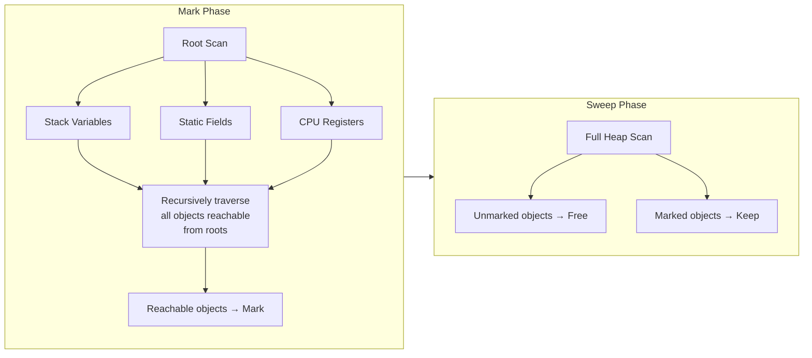
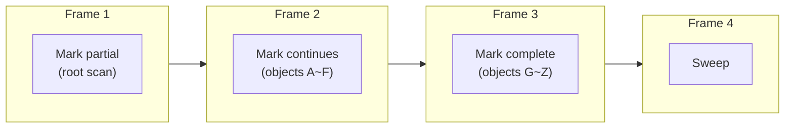
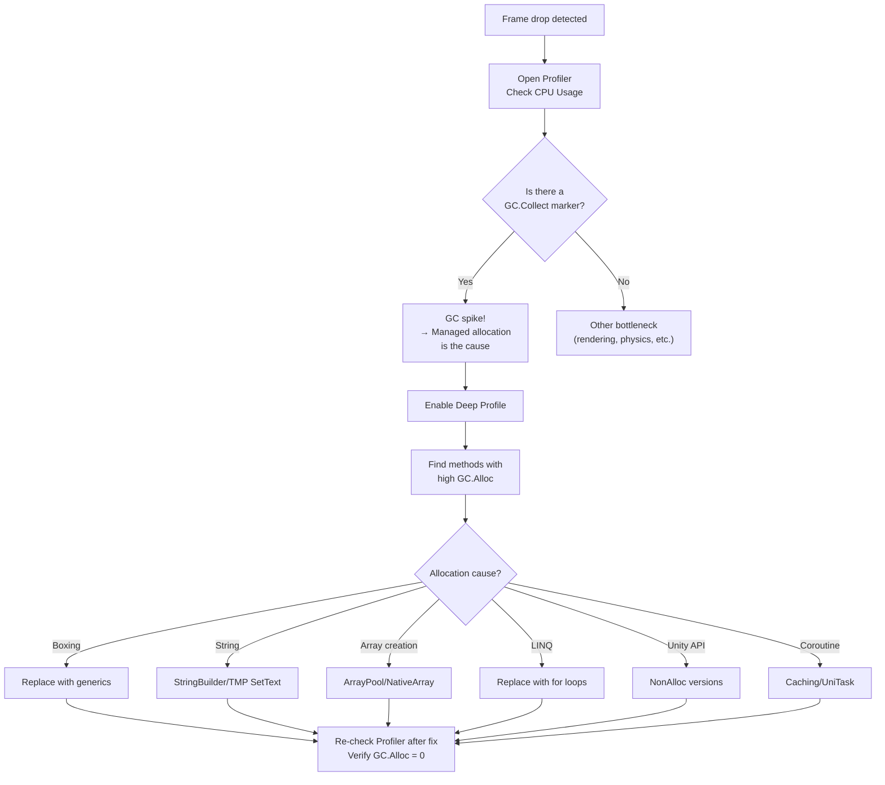

## Introduction

At the end of the [previous post](/posts/NativeContainerDeepDive/), we previewed this:

> The real reason to use NativeContainers — the impact of GC on games

Throughout this series, we've repeatedly encountered the message **"escape the managed world"**. The Job System only allows NativeContainers, Burst won't compile managed types, and SoA layouts only make sense with unmanaged memory.

**Why?** Half the answer lies in cache efficiency, and the other half lies in the **GC (Garbage Collector)**.

GC provides convenience to C# programmers, but in game development, it's the **enemy of 60fps (16.6ms budget)**. When a GC spike of several ms occurs in a single frame, players immediately feel the frame drop.

In this post, we cover:
1. **How Unity's GC works internally** (Boehm GC architecture)
2. **Where GC.Alloc occurs** (comprehensive pattern guide)
3. **How to avoid it** (Zero-Allocation coding patterns)

> In the [Job System post](/posts/UnityJobSystemBurst/#nativearray의-내부-구조-c-배열과-무엇이-다른가), we covered the memory model differences between managed heap vs unmanaged heap. For the basics on why C# arrays are under GC jurisdiction and why NativeArray is GC-free, refer to that section.

---

## Part 1: What Makes Unity's GC Different



### 1.1 .NET GC vs Unity GC

Many developers try to understand Unity's GC based on **".NET's generational GC"**. But Unity's GC is a **completely different implementation**.

| | .NET (CoreCLR) GC | Unity (Boehm) GC |
|--|---------------------|-------------------|
| Implementation | Microsoft's GC | **Boehm-Demers-Weiser GC** |
| Generations | Gen0/1/2 (generational) | **Non-generational** (full heap scan) |
| Compaction | Yes (memory relocation) | **None** (non-compacting) |
| Marking method | Precise | **Conservative** |
| Incremental | Partial support from .NET 5+ | Optional from Unity 2019+ |
| Concurrent | Background GC | **None** (blocks main thread) |

> Unity official documentation: *"Unity uses the Boehm-Demers-Weiser garbage collector. It's a non-generational, non-compacting garbage collector."*

Let's analyze the impact of these differences on game performance one by one.

{% include diagrams/comparison.html
   left_title=".NET GC (CoreCLR)"
   left_items="Generational collection (Gen0/1/2),Compaction eliminates fragmentation,Precise marking,Background GC (Concurrent),Gen0 collection ~0.1ms"
   left_color="#4CAF50"
   right_title="Unity Boehm GC"
   right_items="Non-generational — full heap scan,Non-Compacting — fragmentation accumulates,Conservative marking,Main thread blocking (Stop-the-World),Cost ∝ total heap size"
   right_color="#f44336"
   caption="Why .NET server GC knowledge doesn't directly apply to Unity"
%}

### 1.2 Boehm GC Architecture

#### Mark-Sweep Algorithm

The Boehm GC is a variant of the **Mark-Sweep** algorithm. It operates in two phases:



**Mark Phase:**
1. Find **roots** — references in stack variables, static fields, CPU registers
2. Recursively visit all objects reachable from roots, marking them as "alive (Mark)"
3. Objects unreachable from roots are not marked → **garbage**

**Sweep Phase:**
1. Traverse the entire heap and free memory of unmarked objects
2. Reset mark bits to prepare for the next GC cycle

#### What "Conservative" Marking Means

The most important characteristic of the Boehm GC is **conservative marking**.

```
.NET (Precise GC):
  Metadata precisely tells "is this field a reference or an integer?"
  → Only follows references → 100% accurate dead object identification

Boehm (Conservative GC):
  Can't be certain if a value on the stack or in registers is a pointer or integer
  → If a value looks like a valid address within the heap range, assumes "it might be a reference"
  → May judge actually dead objects as alive (false retention)
```

**Consequences of false retention:**
- Objects that are actually garbage occasionally fail to be collected
- Memory usage may be slightly higher than the theoretical minimum
- But in practice, this rarely becomes a problem — **the real issue is collection cost**

### 1.3 The Cost of Non-Generational

.NET's generational GC leverages the **Generational Hypothesis**:

> "Most objects die shortly after creation"

Therefore, only Gen0 (recent allocations) is frequently inspected, while Gen1/Gen2 (old objects) are inspected rarely. Gen0 collection is very fast — because the target set is small.

```
.NET Generational GC:
┌──── Gen0 ────┐ ┌──── Gen1 ────┐ ┌────── Gen2 ──────┐
│ New objects   │ │ Survived 1x  │ │ Old objects       │
│ Frequent GC   │ │ Occasional   │ │ Rare collection   │
│ ~0.1ms        │ │ ~1ms         │ │ ~10ms             │
└──────────────┘ └──────────────┘ └───────────────────┘

Unity Boehm GC:
┌──────────────── Entire Heap (single generation) ───────┐
│ New objects + old objects + everything                   │
│                                                         │
│ Scans everything every time                             │
│ Cost ∝ heap size (number of alive objects)               │
│                                                         │
│ GC time increases linearly as heap grows                 │
└─────────────────────────────────────────────────────────┘
```

**Key point**: Unity's GC incurs a cost **proportional to the total number of alive objects** every time. If there are 100MB of alive objects on the managed heap, even collecting 1KB of garbage requires scanning the entire 100MB.

This is why the advice to "minimize managed allocations" is **far more important** in Unity than in .NET server development.

### 1.4 The Cost of Non-Compacting: Heap Fragmentation

.NET GC performs compaction — pushing alive objects to one side of memory to create **contiguous free blocks**.

Boehm GC **does not compact**. When objects are freed, holes remain in their place, and new allocations must find appropriately-sized holes to fill.

```
Fragmentation developing over time:

Initial state (clean):
┌──────────────────────────────────────────┐
│ [A][B][C][D][E][F][G][H]    free space   │
└──────────────────────────────────────────┘

After some objects freed:
┌──────────────────────────────────────────┐
│ [A][ ][C][ ][ ][F][ ][H]    free space   │
└──────────────────────────────────────────┘
      ↑     ↑  ↑     ↑
      holes (fragmentation)

New allocation attempt: large array (size of 3 holes combined) needed
→ No contiguous space! → Heap expansion needed
→ Total free space is sufficient, but allocation fails
```

**Real-world impact:**
- Fragmentation accumulates the longer a game runs
- Large array allocations fail despite sufficient total free memory → **unnecessary heap expansion**
- Expanded heap doesn't shrink → **memory usage keeps increasing** (Unity doesn't return heap to OS)
- Increased risk of OS kill on mobile due to out-of-memory

### 1.5 Incremental GC

From Unity 2019.1, the **Incremental GC** option was added.

```
Normal GC (Stop-the-World):
┌── Frame ──┐
│ Update     │ ████████ GC (5ms) ████████ │ Render │
│            │         ↑ stops here        │        │
└────────────┴─────────────────────────────┴────────┘
Total frame time: 16.6ms + 5ms = 21.6ms → Frame drop!

Incremental GC:
┌── Frame 1 ──┐ ┌── Frame 2 ──┐ ┌── Frame 3 ──┐
│ Update │ GC 1ms │ │ Update │ GC 1ms │ │ Update │ GC 1ms │
│        │ (partial) │ │     │ (partial) │ │     │ (partial) │
└────────┴──────────┘ └──────┴──────────┘ └──────┴──────────┘
Distributed 1ms per frame → No frame drops
```

#### How to Enable

```
Project Settings → Player → Other Settings
→ Check "Use incremental GC"

Or via script:
GarbageCollector.incrementalTimeSliceNanoseconds = 3_000_000; // 3ms budget
```

#### How Incremental GC Works

Incremental GC performs the Mark phase **incrementally** across multiple frames.



However, a **write barrier** is needed. While marking is in progress, if the program modifies references, new references may be added to already-scanned objects. The write barrier tracks these changes and adds them to the rescan target list.

**Cost of write barriers:**
- ~1ns overhead added to every reference type field write
- Barrier remains active even when GC is not running
- **1~5% overall performance degradation** possible in code with many reference writes

#### Limitations of Incremental GC

```
⚠️ What Incremental GC solves:
✅ Mitigates frame drops by distributing GC spikes

⚠️ What Incremental GC does NOT solve:
❌ Total cost of GC (just spreads the same work across frames)
❌ Heap fragmentation (still non-compacting)
❌ Scan cost proportional to heap size
❌ Cost of managed allocations themselves
```

**Incremental GC is a "painkiller", not a "cure".** The fundamental solution is to reduce managed allocations themselves.

### 1.6 GC Cost Formula

Roughly modeling the cost of Boehm GC:

$$T_{GC} \approx \alpha \times N_{alive} + \beta \times N_{dead}$$

- $T_{GC}$: Time for 1 GC collection cycle
- $N_{alive}$: Number of alive managed objects (Mark cost)
- $N_{dead}$: Number of dead objects (Sweep cost)
- $\alpha$: Mark cost per object (~10-50ns)
- $\beta$: Sweep cost per object (~5-20ns)

**Key insight**: Since Mark cost dominates, GC time is **proportional to the number of alive objects**. Whether there's a lot or a little garbage (dead objects), GC is slow if there are many alive objects.

This is fundamentally different from .NET's generational GC. .NET GC only promotes objects surviving Gen0 to Gen1, so the cost of "objects that die quickly" is low. Boehm GC scans all alive objects every time.

---

## Part 2: Comprehensive Guide to GC.Alloc Patterns



To reduce GC cost, we need to reduce managed heap allocations (GC.Alloc). The problem is that **allocations are often not explicit**.

### 2.1 Explicit Allocation: new Keyword

The most obvious allocation. Using `new` to create a reference type allocates on the managed heap.

```csharp
// ✅ Allocation occurs — reference types (class)
var enemy = new Enemy();           // GC.Alloc
var list = new List<int>();        // GC.Alloc
var dict = new Dictionary<int, string>();  // GC.Alloc
string name = new string('x', 10); // GC.Alloc

// ❌ No allocation — value types (struct)
var pos = new Vector3(1, 2, 3);    // Stack allocated, GC-irrelevant
var data = new MyStruct();         // Stack allocated
int x = new int();                 // Stack allocated (= 0)
```

**Rule: `new` + `class` = GC.Alloc, `new` + `struct` = stack allocation**

However, even structs are heap-allocated when made into **arrays**:

```csharp
var positions = new Vector3[1000];  // GC.Alloc! The array itself is a reference type
```

### 2.2 Boxing: Hidden Allocation #1

**Boxing** is the process of converting a value type to a reference type. A new object is allocated on the managed heap.

```csharp
// ❌ Boxing occurs
int hp = 100;
object boxed = hp;              // int → object: Int32 box created on heap
IComparable comp = hp;          // int → IComparable: same boxing

// ❌ Commonly overlooked boxing patterns
void LogValue(object value) { Debug.Log(value); }
LogValue(42);                   // int → object: boxing!
LogValue(3.14f);                // float → object: boxing!

// ❌ Boxing in string.Format
string msg = string.Format("HP: {0}, MP: {1}", hp, mp);
// hp and mp are boxed from int → object

// ❌ Boxing with Enum keys in Dictionary<TKey, TValue>
enum EnemyType { Walker, Runner, Boss }
var counts = new Dictionary<EnemyType, int>();
counts[EnemyType.Walker] = 5;
// EqualityComparer<EnemyType>.Default internally causes boxing (before Unity 2021)
```

#### Why Boxing is Dangerous

Boxing allocates a new object on the heap **with every call**. When boxing occurs inside a loop:

```csharp
// 3,000 agents × every frame = 3,000 boxing operations per frame
for (int i = 0; i < agents.Count; i++)
{
    LogValue(agents[i].Health);  // float → object: boxing!
}
// → ~72 KB allocation per frame (24 bytes × 3,000)
// → GC trigger every few frames
```

### 2.3 Closure Capture: Hidden Allocation #2

When a lambda/anonymous method **captures** an external variable, the compiler generates a capture class and allocates it on the heap.

```csharp
// ❌ Closure capture → allocation occurs
float threshold = 0.5f;
var filtered = enemies.Where(e => e.Health > threshold);  
// A class capturing threshold is allocated on the heap

// What the compiler actually generates:
class DisplayClass_0
{
    public float threshold;
    public bool Lambda(Enemy e) => e.Health > threshold;
}
var closure = new DisplayClass_0 { threshold = threshold };  // GC.Alloc!
var filtered = enemies.Where(closure.Lambda);
```

```csharp
// ✅ Lambda without capture → no allocation (C# 9+ static lambda)
var filtered = enemies.Where(static e => e.Health > 0.5f);
// Only uses constants → no capture → no allocation

// ✅ Pattern to avoid capture
void FilterEnemies(List<Enemy> enemies, float threshold)
{
    for (int i = enemies.Count - 1; i >= 0; i--)
    {
        if (enemies[i].Health <= threshold)
            enemies.RemoveAtSwapBack(i);
    }
}
```

### 2.4 String Operations: Hidden Allocation #3

C#'s string is an **immutable reference type**. Every string modification operation allocates a new string object on the heap.

```csharp
// ❌ New string allocated every time
string status = "HP: " + hp + "/" + maxHp;
// "HP: " + hp → boxing + new string
// + "/" → new string
// + maxHp → boxing + new string
// Total 5~6 heap allocations!

// ❌ Creating new string every frame in Update()
void Update()
{
    fpsText.text = $"FPS: {(1f / Time.deltaTime):F0}";
    // New string allocated every frame → GC pressure
}

// ✅ Reuse StringBuilder
private StringBuilder _sb = new StringBuilder(64);

void Update()
{
    if (_frameCount++ % 30 == 0)  // Update only every 30 frames
    {
        _sb.Clear();
        _sb.Append("FPS: ");
        _sb.Append((int)(1f / Time.smoothDeltaTime));
        fpsText.text = _sb.ToString();  // ToString() still allocates
    }
}

// ✅✅ Best: TextMeshPro SetText (no allocation)
void Update()
{
    if (_frameCount++ % 30 == 0)
    {
        tmpText.SetText("FPS: {0}", (int)(1f / Time.smoothDeltaTime));
        // SetText reuses internal char buffer → GC.Alloc 0
    }
}
```

### 2.5 LINQ: Hidden Allocation #4

Almost every LINQ operation allocates **iterator objects** on the heap.

```csharp
// ❌ LINQ chain = allocation chain
var targets = enemies
    .Where(e => e.IsAlive)           // WhereEnumerableIterator alloc + closure
    .OrderBy(e => e.Distance)        // OrderedEnumerable alloc + closure
    .Take(5)                         // TakeIterator alloc
    .ToList();                       // List alloc + internal array alloc
// At least 5~7 heap allocations

// ✅ Replace with for loop
void FindClosest5Alive(List<Enemy> enemies, List<Enemy> result)
{
    result.Clear();
    
    // Simple selection sort (fast enough for small N)
    for (int pick = 0; pick < 5 && pick < enemies.Count; pick++)
    {
        float minDist = float.MaxValue;
        int minIdx = -1;
        
        for (int i = 0; i < enemies.Count; i++)
        {
            if (!enemies[i].IsAlive) continue;
            if (result.Contains(enemies[i])) continue;
            if (enemies[i].Distance < minDist)
            {
                minDist = enemies[i].Distance;
                minIdx = i;
            }
        }
        
        if (minIdx >= 0) result.Add(enemies[minIdx]);
    }
    // 0 allocations (result is pre-created and reused)
}
```

### 2.6 params Arrays: Hidden Allocation #5

When receiving variadic arguments with the `params` keyword, an array is allocated with every call.

```csharp
// Method definition
void SetValues(params int[] values) { /* ... */ }

// ❌ int[] array allocated with every call
SetValues(1, 2, 3);        // new int[] { 1, 2, 3 } allocated
SetValues(10, 20);          // new int[] { 10, 20 } allocated

// ✅ C# 13 params collections (Unity 6+ / .NET 8+)
void SetValues(params ReadOnlySpan<int> values) { /* ... */ }
SetValues(1, 2, 3);  // Stack allocated, GC.Alloc 0

// ✅ Avoid with overloads
void SetValues(int a) { /* ... */ }
void SetValues(int a, int b) { /* ... */ }
void SetValues(int a, int b, int c) { /* ... */ }
// Overloads for most common argument counts → avoid params array
```

### 2.7 Coroutines: Hidden Allocation #6

Unity coroutines (`StartCoroutine`) cause allocations at multiple points.

```csharp
// ❌ Allocation points in coroutines
IEnumerator SpawnWave()
{
    // 1. Coroutine object allocated when StartCoroutine() is called
    // 2. IEnumerator state machine object allocated
    
    for (int i = 0; i < 10; i++)
    {
        SpawnEnemy();
        yield return new WaitForSeconds(0.5f);  // 3. WaitForSeconds allocated every time!
    }
}

StartCoroutine(SpawnWave());
```

```csharp
// ✅ Cache WaitForSeconds
private static readonly WaitForSeconds _wait05 = new WaitForSeconds(0.5f);

IEnumerator SpawnWave()
{
    for (int i = 0; i < 10; i++)
    {
        SpawnEnemy();
        yield return _wait05;  // Reuse cached object → 0 allocation
    }
}

// ✅✅ Best: Use async/await instead of coroutines (UniTask)
// UniTask is struct-based so GC.Alloc 0
async UniTaskVoid SpawnWave(CancellationToken ct)
{
    for (int i = 0; i < 10; i++)
    {
        SpawnEnemy();
        await UniTask.Delay(500, cancellationToken: ct);  // 0 allocation
    }
}
```

### 2.8 Hidden Allocations in Unity APIs

Some Unity APIs internally allocate and return arrays.

```csharp
// ❌ New array allocated with every call
Collider[] hits = Physics.OverlapSphere(pos, radius);     // Array allocation
RaycastHit[] results = Physics.RaycastAll(ray);            // Array allocation
GameObject[] objects = GameObject.FindGameObjectsWithTag("Enemy");  // Array allocation
Renderer[] renderers = GetComponentsInChildren<Renderer>();         // Array allocation

// ✅ Use NonAlloc versions
private Collider[] _hitBuffer = new Collider[32];         // Pre-allocate

void Update()
{
    int count = Physics.OverlapSphereNonAlloc(pos, radius, _hitBuffer);
    for (int i = 0; i < count; i++)
    {
        ProcessHit(_hitBuffer[i]);
    }
}

// ✅ GetComponentsInChildren — List version (reusable)
private List<Renderer> _rendererBuffer = new List<Renderer>(16);

void CacheRenderers()
{
    _rendererBuffer.Clear();
    GetComponentsInChildren(_rendererBuffer);  // Adds to existing List → minimizes array reallocation
}
```

### 2.9 Comprehensive GC.Alloc Pattern Summary

| Pattern | Cause | Cost (approx.) | Solution |
|---------|-------|----------------|----------|
| `new class()` | Reference type creation | 24B+ object | Object pooling, struct |
| Boxing | Value→reference conversion | 12~24B | Generics, concrete types |
| Closure capture | Lambda external variables | 32B+ | Static lambdas, for loops |
| String concatenation | Immutable string creation | Variable | StringBuilder, TMP SetText |
| LINQ | Iterator chain | 32B+ × N | For loops |
| params array | Variadic arguments | 12B + N×4B | Overloads, Span |
| Coroutine yield | WaitForX creation | 20~40B | Caching, UniTask |
| Unity API | Array return | Variable | NonAlloc versions |
| Array creation | `new T[n]` | 12B + N×sizeof(T) | ArrayPool, NativeArray |
| Dictionary Enum key | EqualityComparer boxing | 12~24B | Custom comparer |
| foreach on struct IEnumerator | Interface dispatch boxing | 32B+ | for + indexer |

---

## Part 3: Zero-Allocation Coding Patterns

### 3.1 stackalloc + Span\<T\>

**stackalloc** allocates memory on the **stack**, not the managed heap. Completely unrelated to GC.

```csharp
// ✅ Stack allocation — GC.Alloc 0
void CalculateDistances(Vector3 myPos, Vector3[] targets, int count)
{
    // Allocate float array on stack (auto-freed when function exits)
    Span<float> distances = stackalloc float[count];
    
    for (int i = 0; i < count; i++)
    {
        Vector3 diff = targets[i] - myPos;
        distances[i] = diff.magnitude;
    }
    
    // Use distances...
    float minDist = float.MaxValue;
    for (int i = 0; i < count; i++)
        minDist = Mathf.Min(minDist, distances[i]);
}
// When function ends, distances memory is auto-freed from stack
```

**Span\<T\>** is a "view" over a contiguous memory region. It can point to arrays, stackalloc, or native memory.

```csharp
// Span is a unified view over various memory sources
Span<int> fromArray = new int[] { 1, 2, 3 };     // View of array
Span<int> fromStack = stackalloc int[3];           // View of stack
Span<int> slice = fromArray.Slice(1, 2);           // Partial view (no copy!)

// Methods accepting Span work regardless of memory source
void Process(Span<int> data) { /* ... */ }
Process(fromArray);    // ✅ Array
Process(fromStack);    // ✅ Stack
```

#### stackalloc Caveats

```csharp
// ⚠️ Stack size limit (~1MB)
// stackalloc-ing large arrays causes StackOverflowException!
Span<float> bad = stackalloc float[1_000_000];  // 💥 ~4MB → stack overflow

// ✅ Safe pattern: stack if small, pool if large
void Process(int count)
{
    Span<float> buffer = count <= 256
        ? stackalloc float[count]              // Small → stack (~1KB)
        : new float[count];                     // Large → heap (or ArrayPool)
    
    // Use buffer...
}
```

### 3.2 ArrayPool\<T\>

**ArrayPool** **pools** array instances for reuse. Managed heap allocation occurs only the first time, and afterwards arrays are borrowed from the pool.

```csharp
using System.Buffers;

void ProcessFrame()
{
    // Borrow array from pool (no allocation, only allocates first time if pool empty)
    float[] buffer = ArrayPool<float>.Shared.Rent(1024);
    // Note: Rent(1024) may not return exactly size 1024
    // Returns a power-of-2 rounded size (e.g., 1024)
    
    try
    {
        // Use buffer[0..1023]
        for (int i = 0; i < 1024; i++)
            buffer[i] = ComputeValue(i);
        
        ApplyResults(buffer, 1024);
    }
    finally
    {
        // Must return! Not returning depletes the pool, causing new allocations
        ArrayPool<float>.Shared.Return(buffer);
    }
}
```

#### ArrayPool vs stackalloc vs NativeArray

| | stackalloc | ArrayPool | NativeArray |
|--|-----------|-----------|-------------|
| Memory location | Stack | Managed heap (pooled) | Unmanaged heap |
| GC impact | None | Only on first allocation | None |
| Size limit | ~1KB recommended | Several MB | OS memory limit |
| Job compatible | No | No | **Yes** |
| Burst compatible | No | No | **Yes** |
| Lifetime | Function scope | Until Return | Until Dispose |
| Best for | Small temp buffers | Medium temp arrays | Job/Burst data |



### 3.3 Object Pooling

A pattern of **borrowing and returning** reference type objects (class) from a **pool** instead of new/GC every time.

```csharp
// ObjectPool available from Unity 2021+
using UnityEngine.Pool;

public class ProjectilePool : MonoBehaviour
{
    private ObjectPool<Projectile> _pool;
    
    void Awake()
    {
        _pool = new ObjectPool<Projectile>(
            createFunc: () => Instantiate(projectilePrefab).GetComponent<Projectile>(),
            actionOnGet: p => p.gameObject.SetActive(true),
            actionOnRelease: p => p.gameObject.SetActive(false),
            actionOnDestroy: p => Destroy(p.gameObject),
            defaultCapacity: 50,
            maxSize: 200
        );
    }
    
    public Projectile Spawn(Vector3 pos, Vector3 dir)
    {
        var p = _pool.Get();        // Get from pool (no allocation)
        p.transform.position = pos;
        p.Initialize(dir);
        return p;
    }
    
    public void Despawn(Projectile p)
    {
        _pool.Release(p);           // Return to pool (no GC)
    }
}
```

### 3.4 Struct-Based Design

The most reliable way to fundamentally avoid GC.Alloc is to **design with value types (structs)**.

```csharp
// ❌ class — heap allocation, GC target
class DamageEvent
{
    public int TargetId;
    public float Amount;
    public DamageType Type;
}

// ✅ struct — stack allocation or inline within arrays, GC-irrelevant
struct DamageEvent
{
    public int TargetId;
    public float Amount;
    public DamageType Type;
}
```

#### Criteria for Choosing struct

| Criterion | struct suitable | class suitable |
|-----------|----------------|---------------|
| Size | ≤ 64 bytes | > 64 bytes |
| Lifetime | Short (1-2 frames) | Long (multiple frames) |
| Sharing | OK to copy | Need reference sharing |
| Inheritance | Not needed | Needed |
| Use case | Data transfer, intermediate values | Complex state, polymorphism |

> The 64-byte criterion is due to **copy cost**. Structs are value-copied, so if too large, copy cost can exceed heap allocation cost. Generally, anything at or below cache line size (64B) is safe.



### 3.5 Eliminating Boxing with Generics

```csharp
// ❌ Accepting object causes value type boxing
void Log(object value) => Debug.Log(value);
Log(42);        // boxing!
Log(3.14f);     // boxing!

// ✅ Generics specialize per type, no boxing
void Log<T>(T value) => Debug.Log(value.ToString());
Log(42);        // Log<int> — no boxing
Log(3.14f);     // Log<float> — no boxing
```

```csharp
// ❌ Boxing with Enum key in Dictionary (before Unity 2021)
var dict = new Dictionary<MyEnum, int>();
// Internally, EqualityComparer<MyEnum>.Default causes boxing

// ✅ Eliminate boxing with custom comparer
struct MyEnumComparer : IEqualityComparer<MyEnum>
{
    public bool Equals(MyEnum x, MyEnum y) => x == y;
    public int GetHashCode(MyEnum obj) => (int)obj;
}

var dict = new Dictionary<MyEnum, int>(new MyEnumComparer());
// No boxing
```

### 3.6 Zero-Allocation Update() Pattern

A comprehensive pattern applied in actual game loops:

```csharp
public class AgentManager : MonoBehaviour
{
    // Persistent allocation — once only, in Awake
    private NativeArray<float3> _positions;
    private NativeArray<float3> _velocities;
    private NativeArray<byte> _isAlive;
    
    // Cached arrays — allocated once and reused
    private Collider[] _overlapBuffer = new Collider[64];
    private readonly StringBuilder _debugSb = new StringBuilder(128);
    
    // Cached YieldInstruction
    private static readonly WaitForSeconds _spawnDelay = new WaitForSeconds(1f);
    
    void Awake()
    {
        int maxAgents = 3000;
        _positions = new NativeArray<float3>(maxAgents, Allocator.Persistent);
        _velocities = new NativeArray<float3>(maxAgents, Allocator.Persistent);
        _isAlive = new NativeArray<byte>(maxAgents, Allocator.Persistent);
    }
    
    void Update()
    {
        // ✅ Job + NativeArray → GC.Alloc 0
        var moveJob = new AgentMoveJob
        {
            Positions = _positions,
            Velocities = _velocities,
            IsAlive = _isAlive,
            DeltaTime = Time.deltaTime
        };
        moveJob.Schedule(_positions.Length, 64).Complete();
        
        // ✅ NonAlloc physics query → GC.Alloc 0
        int hitCount = Physics.OverlapSphereNonAlloc(
            transform.position, 10f, _overlapBuffer);
        
        // ✅ Conditional string creation (not every frame)
        #if UNITY_EDITOR
        if (Time.frameCount % 60 == 0)
        {
            _debugSb.Clear();
            _debugSb.Append("Agents: ").Append(_aliveCount);
            Debug.Log(_debugSb);
        }
        #endif
    }
    
    void OnDestroy()
    {
        if (_positions.IsCreated) _positions.Dispose();
        if (_velocities.IsCreated) _velocities.Dispose();
        if (_isAlive.IsCreated) _isAlive.Dispose();
    }
    
    [BurstCompile]
    struct AgentMoveJob : IJobParallelFor
    {
        public NativeArray<float3> Positions;
        [ReadOnly] public NativeArray<float3> Velocities;
        [ReadOnly] public NativeArray<byte> IsAlive;
        [ReadOnly] public float DeltaTime;
        
        public void Execute(int index)
        {
            if (IsAlive[index] == 0) return;
            Positions[index] += Velocities[index] * DeltaTime;
        }
    }
}
```

This pattern achieves **GC.Alloc = 0 bytes within Update()**. All allocations happen once in Awake(), and existing memory is reused at runtime.

---

## Part 4: Tracking GC Spikes with the Profiler

### 4.1 Unity Profiler: GC.Alloc Marker

How to track GC allocations in the Unity Profiler:

```
Window → Analysis → Profiler
→ Select CPU Usage module
→ Check "GC.Alloc" column in the bottom Hierarchy view
→ Click on frames where GC.Alloc is non-zero
→ See which methods allocated how much
```

#### Deep Profile vs Normal Profile

| Mode | Precision | Overhead | Use Case |
|------|-----------|---------|----------|
| Normal | Method-level | Low | Routine profiling |
| Deep Profile | **Every function call** | High (5~10×) | Precise GC.Alloc cause tracking |

When Normal Profile shows "PlayerLoop → Update.ScriptRunBehaviourUpdate → GC.Alloc: 1.2 KB", switch to Deep Profile to trace **which line** the allocation occurs on.

### 4.2 How to Verify GC.Alloc is 0

```csharp
// Editor script: measure GC.Alloc of a specific code block
using Unity.Profiling;

void MeasureAllocation()
{
    // Method 1: Profiler.GetTotalAllocatedMemoryLong()
    long before = UnityEngine.Profiling.Profiler.GetTotalAllocatedMemoryLong();
    
    // --- Code to measure ---
    MyHotFunction();
    // ----------------------
    
    long after = UnityEngine.Profiling.Profiler.GetTotalAllocatedMemoryLong();
    long allocated = after - before;
    Debug.Log($"GC.Alloc: {allocated} bytes");
}

// Method 2: ProfilerRecorder (Unity 2021+)
using Unity.Profiling;

ProfilerRecorder _gcAllocRecorder;

void OnEnable()
{
    _gcAllocRecorder = ProfilerRecorder.StartNew(ProfilerCategory.Memory, "GC.Alloc.In.Frame");
}

void Update()
{
    // Current frame's total GC.Alloc
    if (_gcAllocRecorder.Valid)
        Debug.Log($"Frame GC.Alloc: {_gcAllocRecorder.LastValue} bytes");
}

void OnDisable()
{
    _gcAllocRecorder.Dispose();
}
```

### 4.3 Practical GC Spike Analysis Workflow



### 4.4 GC-Related Runtime APIs

```csharp
// Check GC status
long totalMemory = GC.GetTotalMemory(forceFullCollection: false);
int collectionCount = GC.CollectionCount(generation: 0);  // Always 0 in Unity

// Force GC trigger (during loading screens)
System.GC.Collect();
// Warning: calling during gameplay causes spikes
// Only call at "it's OK to pause" moments like scene transitions, loading screens

// Incremental GC control
GarbageCollector.GCMode = GarbageCollector.Mode.Enabled;    // Default
GarbageCollector.GCMode = GarbageCollector.Mode.Disabled;   // Temporarily disable

// ⚠️ Allocation is still possible while GC is disabled, but collection doesn't happen
// → Memory keeps growing → eventually OOM
// → Only use for short periods (boss fight cutscenes, etc.)
```

#### GC Strategy During Loading Screens

```csharp
IEnumerator LoadScene(string sceneName)
{
    // Show loading screen
    loadingScreen.SetActive(true);
    
    var op = SceneManager.LoadSceneAsync(sceneName);
    
    while (!op.isDone)
    {
        loadingBar.value = op.progress;
        yield return null;
    }
    
    // After loading new scene → large amount of garbage from previous scene
    // Force GC while loading screen is visible
    System.GC.Collect();
    
    // Additional: warm up memory pools
    PrewarmPools();
    
    loadingScreen.SetActive(false);
    // → Clean state when gameplay starts
}
```

---

## Part 5: Practical Checklist

### 5.1 Per-Frame GC.Alloc Budget

| Platform | Target FPS | Frame Budget | Recommended GC.Alloc/Frame |
|----------|-----------|------------|---------------------------|
| PC (High-end) | 60 | 16.6ms | < 1 KB |
| Mobile (Mid-range) | 30 | 33.3ms | < 0.5 KB |
| VR | 90 | 11.1ms | **0 bytes** |
| Competitive games | 144+ | 6.9ms | **0 bytes** |



**In VR and competitive games, GC.Alloc within Update() must be literally 0.**

### 5.2 Hot Path vs Cold Path

You don't need to make all code Zero-Allocation. Distinguish between **hot paths (code executed every frame)** and **cold paths (code executed occasionally)**.

```csharp
// 🔴 Hot path (every frame) — Zero-Allocation required
void Update()
{
    MoveAgents();          // NativeArray + Job
    UpdatePhysics();       // NonAlloc queries
    RenderUI();            // TMP SetText, caching
}

// 🟡 Lukewarm path (1~2 times per second) — caution needed
void OnEnemyKilled()
{
    UpdateScore();         // Small allocations acceptable
    PlayEffect();          // Object pool recommended
}

// 🟢 Cold path (once or rarely) — allocate freely
void Start()
{
    LoadConfig();          // Dictionary, List, etc. freely
    BuildNavMesh();        // LINQ is OK
    InitializePools();     // Initial allocations are fine
}
```

### 5.3 Code Review Checklist

Inside Update(), FixedUpdate(), LateUpdate():

- [ ] No creating classes with `new` keyword?
- [ ] No string concatenation (`+`, `$""`, `Format`)?
- [ ] No LINQ usage (`Where`, `Select`, `OrderBy`, etc.)?
- [ ] No calling methods that take `params` arguments?
- [ ] Using NonAlloc versions instead of Unity APIs that return arrays?
- [ ] No value types being cast to `object` (boxing)?
- [ ] No lambdas capturing external variables?
- [ ] Caching coroutine `yield return new ...`?

---

## Summary

### Series Overview

| Post | Key Question | Answer |
|------|-------------|--------|
| [Job System + Burst](/posts/UnityJobSystemBurst/) | How to multithread safely? | Job Schedule/Complete + Safety System |
| [SoA vs AoS](/posts/SoAvsAoS/) | How to arrange memory? | Data-oriented design + cache optimization |
| [Burst Deep Dive](/posts/BurstCompilerDeepDive/) | What does the compiler do internally? | LLVM pipeline + auto-vectorization |
| [NativeContainer Deep Dive](/posts/NativeContainerDeepDive/) | What to store data in? | Container ecosystem + Allocator + Custom |
| **Mastering Unity GC** (this post) | **Why avoid managed?** | **Boehm GC cost + Zero-Allocation patterns** |

### Key Takeaways

1. **Unity's Boehm GC is different from .NET GC** — non-generational, non-compacting, conservative marking. Scans all alive objects every time, so cost grows with heap size
2. **Incremental GC is a painkiller, not a cure** — only distributes spikes, doesn't solve total cost or fragmentation
3. **GC.Alloc occurs in "invisible places"** — boxing, closures, strings, LINQ, params, coroutines, Unity APIs
4. **The goal is GC.Alloc = 0 on hot paths** — stackalloc/Span, ArrayPool, NativeArray, object pools, struct design
5. **Track precisely with Profiler's GC.Alloc marker and Deep Profile**, and always re-verify after fixes

Through this series, we've completed the **full picture** of writing high-performance code in Unity:

> **Multithreading (Job)** + **High-performance compilation (Burst)** + **Cache-efficient memory (SoA)** + **Correct containers (NativeContainer)** + **GC avoidance (Zero-Allocation)** = **Thousands of agents at 60fps**

---

## References

- [Unity Manual — Managed Memory](https://docs.unity3d.com/6000.0/Documentation/Manual/performance-managed-memory.html)
- [Unity Manual — Incremental Garbage Collection](https://docs.unity3d.com/6000.0/Documentation/Manual/performance-incremental-garbage-collection.html)
- [Unity Blog — *"Feature Preview: Incremental Garbage Collection"*](https://blog.unity.com/engine-platform/feature-preview-incremental-garbage-collection)
- [Boehm GC — *"A garbage collector for C and C++"*](https://www.hboehm.info/gc/)
- [Jackson Dunstan — *"Managed Memory in Unity"* series](https://www.jacksondunstan.com/)
- [Cysharp — UniTask: Zero-Allocation async/await for Unity](https://github.com/Cysharp/UniTask)
