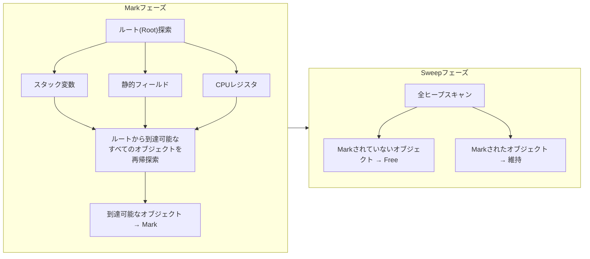
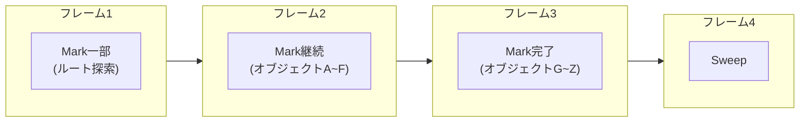
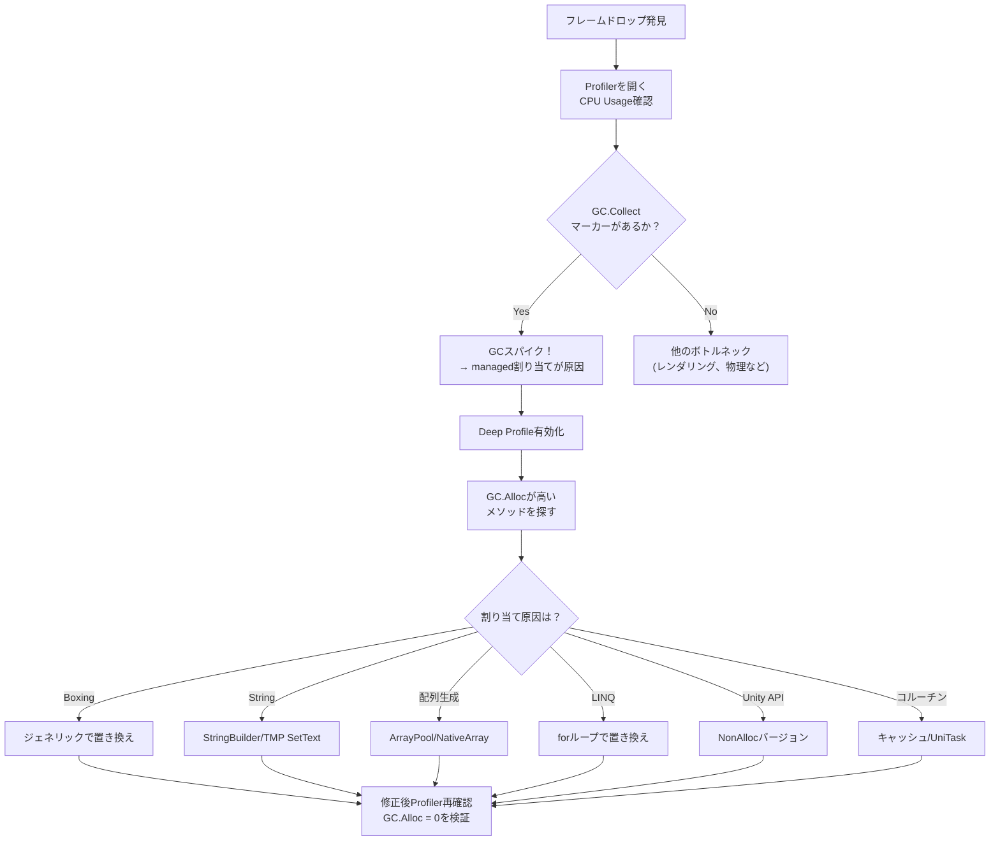

## 序論

[前回のポスト](/posts/NativeContainerDeepDive/)の最後でこう予告した：

> NativeContainerを使うべき本当の理由 — GCがゲームに与える影響

このシリーズで我々は**「managedの世界を脱せよ」**というメッセージを繰り返し目にしてきた。Job SystemはNativeContainerのみ許可し、Burstはmanagedタイプをコンパイルせず、SoAレイアウトはunmanagedメモリでのみ意味がある。

**なぜ？** その答えの半分はキャッシュ効率にあり、残り半分は**GC（Garbage Collector）**にある。

GCはC#プログラマに便利さを提供するが、ゲーム開発では**60fps（16.6ms予算）の敵**だ。1フレームに数msのGCスパイクが発生するとプレイヤーは即座にフレームドロップを体感する。

このポストでは：
1. UnityのGCが**内部的にどう動作するか**（Boehm GCの構造）
2. GC.Allocが**どこで発生するか**（パターン別総整理）
3. **どう避けるか**（Zero-Allocationコーディングパターン）

を扱う。

> [Job Systemポスト](/posts/UnityJobSystemBurst/#nativearray의-내부-구조-c-배열과-무엇이-다른가)でmanaged heap vs unmanaged heapのメモリモデルの違いを扱った。C#配列がGC管轄である理由、NativeArrayがGC-freeである理由の基礎は該当セクションを参照せよ。

---

## Part 1: UnityのGCは何が違うのか

<div class="gc-arch" style="margin:2rem 0;overflow-x:auto;">
<svg viewBox="0 0 700 410" xmlns="http://www.w3.org/2000/svg" style="width:100%;max-width:700px;margin:0 auto;display:block;font-family:system-ui,-apple-system,sans-serif;">
  <defs>
    <filter id="gca-sh"><feDropShadow dx="0" dy="2" stdDeviation="3" flood-opacity="0.15"/></filter>
    <marker id="gca-arr" viewBox="0 0 10 10" refX="10" refY="5" markerWidth="7" markerHeight="7" orient="auto"><path d="M0,1 L10,5 L0,9Z" class="gca-af"/></marker>
    <linearGradient id="gca-g0" x1="0" y1="0" x2="1" y2="0"><stop offset="0%" stop-color="#ffcdd2"/><stop offset="100%" stop-color="#ef9a9a"/></linearGradient>
    <linearGradient id="gca-g1" x1="0" y1="0" x2="1" y2="0"><stop offset="0%" stop-color="#ef9a9a"/><stop offset="100%" stop-color="#e57373"/></linearGradient>
    <linearGradient id="gca-g2" x1="0" y1="0" x2="1" y2="0"><stop offset="0%" stop-color="#c8e6c9"/><stop offset="100%" stop-color="#a5d6a7"/></linearGradient>
    <linearGradient id="gca-g3" x1="0" y1="0" x2="1" y2="0"><stop offset="0%" stop-color="#a5d6a7"/><stop offset="100%" stop-color="#81c784"/></linearGradient>
  </defs>
  <path d="M68,15 L68,192 M68,15 L80,15 M68,192 L80,192" fill="none" stroke-width="2.5" class="gca-bm"/>
  <text x="48" y="104" text-anchor="middle" font-size="12" font-weight="700" class="gca-tm" transform="rotate(-90,48,104)">Managed</text>
  <path d="M68,218 L68,395 M68,218 L80,218 M68,395 L80,395" fill="none" stroke-width="2.5" class="gca-bu"/>
  <text x="48" y="307" text-anchor="middle" font-size="12" font-weight="700" class="gca-tu" transform="rotate(-90,48,307)">Unmanaged</text>
  <rect x="90" y="10" width="570" height="82" rx="12" fill="url(#gca-g0)" filter="url(#gca-sh)"/>
  <text x="375" y="38" text-anchor="middle" font-size="15" font-weight="700" fill="#b71c1c">C#コード（Managed領域）</text>
  <text x="375" y="62" text-anchor="middle" font-size="12" fill="#c62828" opacity=".85">class · string · 配列 · LINQ · コルーチン</text>
  <line x1="375" y1="92" x2="375" y2="110" stroke-width="2" class="gca-al" marker-end="url(#gca-arr)"/>
  <rect x="90" y="110" width="570" height="82" rx="12" fill="url(#gca-g1)" filter="url(#gca-sh)"/>
  <text x="375" y="138" text-anchor="middle" font-size="15" font-weight="700" fill="#b71c1c">Managed Heap — Boehm GC</text>
  <text x="375" y="162" text-anchor="middle" font-size="12" fill="#c62828" opacity=".85">Mark-Sweep · 非世代的 · 非移動 · 保守的マーキング</text>
  <line x1="375" y1="192" x2="375" y2="218" stroke-width="2" class="gca-al" marker-end="url(#gca-arr)"/>
  <rect x="90" y="218" width="570" height="82" rx="12" fill="url(#gca-g2)" filter="url(#gca-sh)"/>
  <text x="375" y="246" text-anchor="middle" font-size="15" font-weight="700" fill="#1b5e20">Unmanaged Heap — Nativeメモリ</text>
  <text x="375" y="270" text-anchor="middle" font-size="12" fill="#2e7d32" opacity=".85">NativeArray · Burst · Job System · malloc</text>
  <line x1="375" y1="300" x2="375" y2="318" stroke-width="2" class="gca-al" marker-end="url(#gca-arr)"/>
  <rect x="90" y="318" width="570" height="82" rx="12" fill="url(#gca-g3)" filter="url(#gca-sh)"/>
  <text x="375" y="346" text-anchor="middle" font-size="15" font-weight="700" fill="#1b5e20">OS / Hardware</text>
  <text x="375" y="370" text-anchor="middle" font-size="12" fill="#2e7d32" opacity=".85">物理メモリ · 仮想メモリ · キャッシュ階層</text>
</svg>
</div>
<style>
.gca-bm{stroke:#e57373}.gca-bu{stroke:#66bb6a}.gca-tm{fill:#e57373}.gca-tu{fill:#66bb6a}.gca-al{stroke:#9e9e9e}.gca-af{fill:#9e9e9e}
[data-mode="dark"] .gc-arch rect{opacity:.82}[data-mode="dark"] .gca-bm{stroke:#ef9a9a}[data-mode="dark"] .gca-bu{stroke:#a5d6a7}[data-mode="dark"] .gca-tm{fill:#ef9a9a}[data-mode="dark"] .gca-tu{fill:#a5d6a7}[data-mode="dark"] .gca-al{stroke:#757575}[data-mode="dark"] .gca-af{fill:#757575}
@media(max-width:768px){.gc-arch svg{min-width:520px}}
</style>

### 1.1 .NET GC vs Unity GC

多くの開発者が**「.NETの世代別GC」**を基準にUnityのGCを理解しようとする。しかしUnityのGCは**完全に異なる実装体**だ。

| | .NET (CoreCLR) GC | Unity (Boehm) GC |
|--|---------------------|-------------------|
| 実装体 | Microsoft's GC | **Boehm-Demers-Weiser GC** |
| 世代 | Gen0/1/2（世代別） | **非世代的**（全ヒープスキャン） |
| Compaction | あり（メモリ移動） | **なし**（非移動） |
| マーキング方式 | 正確（precise） | **保守的（conservative）** |
| Incremental | .NET 5+で部分サポート | Unity 2019+でオプション |
| Concurrent | バックグラウンドGC | **なし**（メインスレッドブロック） |

> Unity公式ドキュメント：*"Unity uses the Boehm-Demers-Weiser garbage collector. It's a non-generational, non-compacting garbage collector."*

この違いがゲーム性能に与える影響を一つずつ分析する。

<div class="gc-cmp" style="margin:2rem 0;overflow-x:auto;">
  <div class="gc-cmp-grid">
    <div class="gc-cmp-left">
      <div class="gc-cmp-badge" style="background:#4CAF50">.NET GC (CoreCLR)</div>
      <ul class="gc-cmp-list">
        <li><span class="gc-cmp-ok">&#10003;</span> 世代別収集（Gen0/1/2）</li>
        <li><span class="gc-cmp-ok">&#10003;</span> Compactionで断片化解消</li>
        <li><span class="gc-cmp-ok">&#10003;</span> 正確な（Precise）マーキング</li>
        <li><span class="gc-cmp-ok">&#10003;</span> バックグラウンドGC（Concurrent）</li>
        <li><span class="gc-cmp-ok">&#10003;</span> Gen0収集 ~0.1ms</li>
      </ul>
    </div>
    <div class="gc-cmp-mid"><span class="gc-cmp-vs">VS</span></div>
    <div class="gc-cmp-right">
      <div class="gc-cmp-badge" style="background:#f44336">Unity Boehm GC</div>
      <ul class="gc-cmp-list">
        <li><span class="gc-cmp-no">&#10007;</span> 非世代的 — 全ヒープスキャン</li>
        <li><span class="gc-cmp-no">&#10007;</span> Non-Compacting — 断片化蓄積</li>
        <li><span class="gc-cmp-no">&#10007;</span> 保守的（Conservative）マーキング</li>
        <li><span class="gc-cmp-no">&#10007;</span> メインスレッドブロック（Stop-the-World）</li>
        <li><span class="gc-cmp-no">&#10007;</span> コスト ∝ 全ヒープサイズ</li>
      </ul>
    </div>
  </div>
  <p class="gc-cmp-cap">.NETサーバー開発のGC知識がUnityにそのまま適用されない理由</p>
</div>
<style>
.gc-cmp-grid{display:grid;grid-template-columns:1fr auto 1fr;align-items:stretch;max-width:740px;margin:0 auto;border-radius:14px;overflow:hidden;box-shadow:0 2px 12px rgba(0,0,0,.08)}
.gc-cmp-left{background:linear-gradient(135deg,#e8f5e9,#c8e6c9);padding:1.25rem 1.5rem}
.gc-cmp-right{background:linear-gradient(135deg,#ffebee,#ffcdd2);padding:1.25rem 1.5rem}
.gc-cmp-mid{display:flex;align-items:center;justify-content:center;padding:0 .5rem;background:linear-gradient(180deg,#e8f5e9,#f5f5f5 50%,#ffebee)}
.gc-cmp-vs{width:42px;height:42px;border-radius:50%;background:linear-gradient(135deg,#555,#333);display:flex;align-items:center;justify-content:center;color:#fff;font-weight:900;font-size:13px;box-shadow:0 2px 8px rgba(0,0,0,.25)}
.gc-cmp-badge{text-align:center;border-radius:20px;padding:5px 16px;font-size:14px;font-weight:700;color:#fff;margin-bottom:.75rem}
.gc-cmp-list{list-style:none;padding:0;margin:0;font-size:13.5px;line-height:2.1}
.gc-cmp-ok{color:#2e7d32;font-weight:700;margin-right:8px}.gc-cmp-no{color:#c62828;font-weight:700;margin-right:8px}
.gc-cmp-cap{text-align:center;margin-top:.75rem;font-size:12.5px;color:var(--text-muted-color,#6c757d);font-style:italic}
[data-mode="dark"] .gc-cmp-left{background:linear-gradient(135deg,#1a3320,#263e2a)}
[data-mode="dark"] .gc-cmp-right{background:linear-gradient(135deg,#3b1a1a,#4a2525)}
[data-mode="dark"] .gc-cmp-mid{background:linear-gradient(180deg,#1a3320,#252528 50%,#3b1a1a)}
[data-mode="dark"] .gc-cmp-list{color:#ddd}
[data-mode="dark"] .gc-cmp-ok{color:#81c784}[data-mode="dark"] .gc-cmp-no{color:#ef9a9a}
[data-mode="dark"] .gc-cmp-grid{box-shadow:0 2px 12px rgba(0,0,0,.3)}
@media(max-width:768px){.gc-cmp-grid{grid-template-columns:1fr!important}.gc-cmp-mid{padding:.5rem 0}}
</style>

### 1.2 Boehm GCアーキテクチャ

#### Mark-Sweepアルゴリズム

Boehm GCは**Mark-Sweep**アルゴリズムの変形だ。2つのフェーズで動作する：



**Markフェーズ：**
1. **ルート(Root)**を見つける — スタック変数、静的フィールド、CPUレジスタにある参照
2. ルートから到達可能なすべてのオブジェクトを再帰的に訪問し「生存(Mark)」表示
3. ルートから到達できないオブジェクトはMarkされない → **ガベージ**

**Sweepフェーズ：**
1. ヒープ全体を巡回しMarkされていないオブジェクトのメモリを解放
2. Markビットを初期化して次のGCサイクルに備える

#### 「保守的（Conservative）」マーキングの意味

Boehm GCの最も重要な特性は**保守的マーキング**だ。

```
.NET (正確なGC):
  メタデータで「このフィールドが参照か整数か」正確に分かる
  → 参照のみ辿る → 死んだオブジェクトを100%正確に判別

Boehm (保守的GC):
  スタックやレジスタの値がポインタか整数か確実でない
  → 値がヒープ範囲内の有効なアドレスのように見えれば「参照かもしれない」と仮定
  → 実際には死んだオブジェクトなのに生きていると判断しうる（false retention）
```

**False retentionの結果：**
- 実際にはガベージなオブジェクトが収集されない場合がたまに発生
- メモリ使用量が理論的最小値よりやや高くなりうる
- しかし実戦でこれが問題になることは稀だ — **本当の問題は収集コスト**だ

### 1.3 非世代的（Non-Generational）のコスト

.NETの世代別GCは**世代仮説（Generational Hypothesis）**を活用する：

> 「ほとんどのオブジェクトは生成直後に死ぬ」

したがってGen0（最近の割り当て）のみ頻繁に検査し、Gen1/Gen2（古いオブジェクト）は稀に検査する。Gen0収集は非常に速い — 対象が少ないからだ。

```
.NET世代別GC:
┌──── Gen0 ────┐ ┌──── Gen1 ────┐ ┌────── Gen2 ──────┐
│ 新しいオブジェクト │ │ 1回生存       │ │ 古いオブジェクト   │
│ 頻繁に収集     │ │ たまに収集    │ │ 稀に収集         │
│ ~0.1ms        │ │ ~1ms         │ │ ~10ms            │
└──────────────┘ └──────────────┘ └──────────────────┘

Unity Boehm GC:
┌──────────────── 全ヒープ（単一世代） ──────────────────┐
│ 新しいオブジェクト + 古いオブジェクト + すべて           │
│                                                       │
│ 毎回全体をスキャン                                     │
│ コスト ∝ ヒープサイズ（生存オブジェクト数）              │
│                                                       │
│ ヒープが大きくなるほどGC時間が線形に増加                │
└───────────────────────────────────────────────────────┘
```

**核心**：UnityのGCは**生存オブジェクトの総量に比例**するコストが毎回発生する。managedヒープに100MBの生存オブジェクトがあれば、1KBのガベージを収集するためにも100MB全体をスキャンする必要がある。

これがUnityで「managed割り当てを最小化せよ」というアドバイスが.NETサーバー開発より**はるかに重要**な理由だ。

### 1.4 非移動（Non-Compacting）のコスト：ヒープ断片化

.NET GCはCompactionを実行する — 生存オブジェクトをメモリの片側に押し込めて**空き領域を連続ブロックに**する。

Boehm GCは**Compactionをしない**。オブジェクトが解放されるとその場所に穴が残り、新しい割り当てはこの穴の中から適切なサイズを探して入る。

```
時間の経過とともに発生する断片化:

初期状態（きれい）:
┌──────────────────────────────────────────┐
│ [A][B][C][D][E][F][G][H]    空き領域     │
└──────────────────────────────────────────┘

一部オブジェクト解放後:
┌──────────────────────────────────────────┐
│ [A][ ][C][ ][ ][F][ ][H]    空き領域     │
└──────────────────────────────────────────┘
      ↑     ↑  ↑     ↑
      穴（断片化）

新規割り当て試行: 大きな配列（穴3つ分のサイズ）が必要
→ 連続空間がない！ → ヒープ拡張が必要
→ 総空き領域は十分なのに割り当て失敗
```

**実戦での影響：**
- ゲームが長時間実行されるほど断片化が蓄積
- 総空きメモリは十分なのに大きな配列割り当てが失敗して**ヒープが不必要に拡張**
- 拡張されたヒープは縮小しない → **メモリ使用量が増加し続ける**（UnityはヒープをOSに返却しない）
- モバイルでメモリ不足によるOSキルのリスク増加

### 1.5 Incremental GC

Unity 2019.1から**Incremental GC**オプションが追加された。

```
通常GC（Stop-the-World）:
┌── フレーム ──┐
│ Update       │ ████████ GC (5ms) ████████ │ Render │
│              │         ↑ ここで停止        │        │
└──────────────┴─────────────────────────────┴────────┘
総フレーム時間: 16.6ms + 5ms = 21.6ms → フレームドロップ！

Incremental GC:
┌── フレーム1 ──┐ ┌── フレーム2 ──┐ ┌── フレーム3 ──┐
│ Update │ GC 1ms │ │ Update │ GC 1ms │ │ Update │ GC 1ms │
│        │ (部分) │ │        │ (部分) │ │        │ (部分) │
└────────┴────────┘ └────────┴────────┘ └────────┴────────┘
各フレームに1msずつ分散 → フレームドロップなし
```

#### 有効化方法

```
Project Settings → Player → Other Settings
→ "Use incremental GC" にチェック

またはスクリプト:
GarbageCollector.incrementalTimeSliceNanoseconds = 3_000_000; // 3ms予算
```

#### Incremental GCの動作原理

Incremental GCはMarkフェーズを複数フレームにわたって**少しずつ**実行する。



しかし**ライトバリア（Write Barrier）**が必要だ。Markが進行中にプログラムが参照を変更すると、すでにスキャンしたオブジェクトに新しい参照が追加される可能性がある。ライトバリアはこのような変更を追跡して再スキャン対象に追加する。

**ライトバリアのコスト：**
- すべての参照型フィールド書き込みに~1nsオーバーヘッド追加
- GCが実行中でなくてもバリアが有効化されている
- 参照書き込みが多いコードで**1~5%の全体性能低下**の可能性

#### Incremental GCの限界

```
⚠️ Incremental GCが解決すること:
✅ GCスパイクを分散してフレームドロップを緩和

⚠️ Incremental GCが解決しないこと:
❌ GCの総コスト（同じ量の作業を複数フレームに分けるだけ）
❌ ヒープ断片化（依然としてnon-compacting）
❌ ヒープサイズに比例するスキャンコスト
❌ managed割り当て自体のコスト
```

**Incremental GCは「鎮痛剤」であって「治療」ではない。** 根本的な解決策はmanaged割り当て自体を減らすことだ。

### 1.6 GCコスト公式

Boehm GCのコストを大まかにモデル化すると：

$$T_{GC} \approx \alpha \times N_{alive} + \beta \times N_{dead}$$

- $T_{GC}$：GC収集1回の所要時間
- $N_{alive}$：生存managedオブジェクト数（Markコスト）
- $N_{dead}$：死んだオブジェクト数（Sweepコスト）
- $\alpha$：オブジェクトあたりMarkコスト（~10-50ns）
- $\beta$：オブジェクトあたりSweepコスト（~5-20ns）

**核心的洞察**：MarkコストがGC支配的であるため、GC時間は**生存オブジェクトの数に比例**する。ガベージ（死んだオブジェクト）が多かろうが少なかろうが、生存オブジェクトが多ければGCは遅い。

これが.NET世代別GCと根本的に異なる点だ。.NET GCはGen0で生き残るオブジェクトのみGen1に昇格するため、「ほとんどすぐ死ぬオブジェクト」のコストが低い。Boehm GCはすべての生存オブジェクトを毎回スキャンする。

---

## Part 2: GC.Alloc発生パターン総整理

<div class="gc-flow" style="margin:2rem 0;overflow-x:auto;">
<svg viewBox="0 0 780 310" xmlns="http://www.w3.org/2000/svg" style="width:100%;max-width:780px;margin:0 auto;display:block;font-family:system-ui,-apple-system,sans-serif;">
  <defs>
    <filter id="gcf-sh"><feDropShadow dx="0" dy="1" stdDeviation="2" flood-opacity="0.12"/></filter>
    <marker id="gcf-arr" viewBox="0 0 10 10" refX="10" refY="5" markerWidth="7" markerHeight="7" orient="auto"><path d="M0,1 L10,5 L0,9Z" class="gcf-af"/></marker>
    <linearGradient id="gcf-wg" x1="0" y1="0" x2="1" y2="0"><stop offset="0%" stop-color="#fff9c4"/><stop offset="100%" stop-color="#fff176"/></linearGradient>
    <linearGradient id="gcf-dg" x1="0" y1="0" x2="1" y2="0"><stop offset="0%" stop-color="#ef5350"/><stop offset="100%" stop-color="#c62828"/></linearGradient>
    <radialGradient id="gcf-pulse"><stop offset="0%" stop-color="#ff5252" stop-opacity="0.3"/><stop offset="100%" stop-color="#ff5252" stop-opacity="0"/></radialGradient>
  </defs>
  <g filter="url(#gcf-sh)">
    <rect class="gcf-src" x="20" y="5" width="148" height="38" rx="8"/><text class="gcf-stx" x="94" y="29" text-anchor="middle" font-size="13" font-weight="600">Boxing</text>
    <rect class="gcf-src" x="20" y="53" width="148" height="38" rx="8"/><text class="gcf-stx" x="94" y="77" text-anchor="middle" font-size="13" font-weight="600">クロージャ</text>
    <rect class="gcf-src" x="20" y="101" width="148" height="38" rx="8"/><text class="gcf-stx" x="94" y="125" text-anchor="middle" font-size="13" font-weight="600">String連結</text>
    <rect class="gcf-src" x="20" y="149" width="148" height="38" rx="8"/><text class="gcf-stx" x="94" y="173" text-anchor="middle" font-size="13" font-weight="600">LINQ</text>
    <rect class="gcf-src" x="20" y="197" width="148" height="38" rx="8"/><text class="gcf-stx" x="94" y="221" text-anchor="middle" font-size="13" font-weight="600">params配列</text>
    <rect class="gcf-src" x="20" y="245" width="148" height="38" rx="8"/><text class="gcf-stx" x="94" y="269" text-anchor="middle" font-size="13" font-weight="600">コルーチンyield</text>
  </g>
  <g fill="none" stroke-width="1.8" class="gcf-lines" marker-end="url(#gcf-arr)">
    <path d="M168,24 C275,24 305,148 375,148"/>
    <path d="M168,72 C265,72 310,148 375,148"/>
    <path d="M168,120 C255,120 320,148 375,148"/>
    <path d="M168,168 C255,168 320,148 375,148"/>
    <path d="M168,216 C265,216 310,148 375,148"/>
    <path d="M168,264 C275,264 305,148 375,148"/>
  </g>
  <rect class="gcf-warn" x="375" y="112" width="175" height="72" rx="14" fill="url(#gcf-wg)" filter="url(#gcf-sh)" stroke="#fbc02d" stroke-width="2"/>
  <text x="462" y="143" text-anchor="middle" font-size="14" font-weight="700" class="gcf-wtx">GC Pressure</text>
  <text x="462" y="165" text-anchor="middle" font-size="12" class="gcf-wtx2">蓄積</text>
  <line x1="550" y1="148" x2="615" y2="148" stroke-width="2.5" class="gcf-dl" marker-end="url(#gcf-arr)"/>
  <circle cx="695" cy="148" r="42" fill="url(#gcf-pulse)">
    <animate attributeName="r" values="35;48;35" dur="2s" repeatCount="indefinite"/>
    <animate attributeName="opacity" values="0.8;0.3;0.8" dur="2s" repeatCount="indefinite"/>
  </circle>
  <rect x="615" y="114" width="160" height="68" rx="14" fill="url(#gcf-dg)" filter="url(#gcf-sh)"/>
  <text x="695" y="144" text-anchor="middle" font-size="15" font-weight="800" fill="#fff">Frame Spike!</text>
  <text x="695" y="165" text-anchor="middle" font-size="11" fill="#ffcdd2">&#9889; フレームドロップ</text>
</svg>
</div>
<style>
.gcf-src{fill:#ffcdd2}.gcf-stx{fill:#c62828}.gcf-lines{stroke:#ef9a9a}.gcf-af{fill:#ef9a9a}.gcf-dl{stroke:#ef5350}
.gcf-wtx{fill:#f57f17}.gcf-wtx2{fill:#f9a825}
[data-mode="dark"] .gcf-src{fill:#5c2a2a}[data-mode="dark"] .gcf-stx{fill:#ef9a9a}
[data-mode="dark"] .gcf-lines{stroke:#e57373}[data-mode="dark"] .gcf-af{fill:#e57373}
[data-mode="dark"] .gcf-warn{opacity:.85}[data-mode="dark"] .gcf-wtx{fill:#fdd835}[data-mode="dark"] .gcf-wtx2{fill:#ffee58}
[data-mode="dark"] .gcf-dl{stroke:#ef5350}
@media(max-width:768px){.gc-flow svg{min-width:600px}}
</style>

GCのコストを減らすにはmanagedヒープ割り当て（GC.Alloc）を減らす必要がある。問題は**割り当てが明示的でない場合が多い**ことだ。

### 2.1 明示的割り当て：newキーワード

最も明確な割り当て。`new`で参照型を生成するとmanagedヒープに割り当てられる。

```csharp
// ✅ 割り当て発生 — 参照型 (class)
var enemy = new Enemy();           // GC.Alloc
var list = new List<int>();        // GC.Alloc
var dict = new Dictionary<int, string>();  // GC.Alloc
string name = new string('x', 10); // GC.Alloc

// ❌ 割り当てなし — 値型 (struct)
var pos = new Vector3(1, 2, 3);    // スタックに割り当て、GC無関係
var data = new MyStruct();         // スタックに割り当て
int x = new int();                 // スタックに割り当て (= 0)
```

**ルール：`new` + `class` = GC.Alloc、`new` + `struct` = スタック割り当て**

ただし、structでも**配列**にするとヒープに割り当てられる：

```csharp
var positions = new Vector3[1000];  // GC.Alloc! 配列自体は参照型
```

### 2.2 Boxing：隠れた割り当て #1

**Boxing**は値型を参照型に変換する過程だ。この時managedヒープに新しいオブジェクトが割り当てられる。

```csharp
// ❌ Boxing発生
int hp = 100;
object boxed = hp;              // int → object: ヒープにInt32ボックス生成
IComparable comp = hp;          // int → IComparable: 同様にboxing

// ❌ よく見落とすBoxingパターン
void LogValue(object value) { Debug.Log(value); }
LogValue(42);                   // int → object: boxing!
LogValue(3.14f);                // float → object: boxing!

// ❌ string.FormatのBoxing
string msg = string.Format("HP: {0}, MP: {1}", hp, mp);
// hpとmpがint → objectにboxingされる

// ❌ Dictionary<TKey, TValue>でEnum キーのBoxing
enum EnemyType { Walker, Runner, Boss }
var counts = new Dictionary<EnemyType, int>();
counts[EnemyType.Walker] = 5;
// EqualityComparer<EnemyType>.Defaultが内部的にboxing（Unity 2021以前）
```

#### Boxingが危険な理由

Boxingは**毎回呼び出しのたびに**新しいオブジェクトをヒープに割り当てる。ループ内でboxingが発生すると：

```csharp
// 3,000エージェント × 毎フレーム = フレームあたり3,000回boxing
for (int i = 0; i < agents.Count; i++)
{
    LogValue(agents[i].Health);  // float → object: boxing!
}
// → フレームあたり~72 KB割り当て（24 bytes × 3,000）
// → 数フレームごとにGCトリガー
```

### 2.3 クロージャキャプチャ：隠れた割り当て #2

ラムダ/匿名メソッドが外部変数を**キャプチャ（capture）**すると、コンパイラがキャプチャクラスを生成してヒープに割り当てる。

```csharp
// ❌ クロージャキャプチャ → 割り当て発生
float threshold = 0.5f;
var filtered = enemies.Where(e => e.Health > threshold);  
// thresholdをキャプチャするクラスがヒープに割り当てられる

// コンパイラが実際に生成するコード:
class DisplayClass_0
{
    public float threshold;
    public bool Lambda(Enemy e) => e.Health > threshold;
}
var closure = new DisplayClass_0 { threshold = threshold };  // GC.Alloc!
var filtered = enemies.Where(closure.Lambda);
```

```csharp
// ✅ キャプチャなしラムダ → 割り当てなし（C# 9+ static ラムダ）
var filtered = enemies.Where(static e => e.Health > 0.5f);
// 定数のみ使用 → キャプチャなし → 割り当てなし

// ✅ キャプチャを避けるパターン
void FilterEnemies(List<Enemy> enemies, float threshold)
{
    for (int i = enemies.Count - 1; i >= 0; i--)
    {
        if (enemies[i].Health <= threshold)
            enemies.RemoveAtSwapBack(i);
    }
}
```

### 2.4 String演算：隠れた割り当て #3

C#のstringは**不変（immutable）参照型**だ。すべてのstring変形演算は新しいstringオブジェクトをヒープに割り当てる。

```csharp
// ❌ 毎回新しいstring割り当て
string status = "HP: " + hp + "/" + maxHp;
// "HP: " + hp → boxing + 新しいstring
// + "/" → 新しいstring
// + maxHp → boxing + 新しいstring
// 計5~6回ヒープ割り当て！

// ❌ Update()で毎フレームstring生成
void Update()
{
    fpsText.text = $"FPS: {(1f / Time.deltaTime):F0}";
    // 毎フレーム新しいstring割り当て → GC圧力
}

// ✅ StringBuilder再利用
private StringBuilder _sb = new StringBuilder(64);

void Update()
{
    if (_frameCount++ % 30 == 0)  // 30フレームごとにのみ更新
    {
        _sb.Clear();
        _sb.Append("FPS: ");
        _sb.Append((int)(1f / Time.smoothDeltaTime));
        fpsText.text = _sb.ToString();  // ToString()は依然として割り当て
    }
}

// ✅✅ 最善：TextMeshProのSetText（割り当てなし）
void Update()
{
    if (_frameCount++ % 30 == 0)
    {
        tmpText.SetText("FPS: {0}", (int)(1f / Time.smoothDeltaTime));
        // SetTextは内部charバッファを再利用 → GC.Alloc 0
    }
}
```

### 2.5 LINQ：隠れた割り当て #4

LINQのほぼすべての演算が**イテレータオブジェクト**をヒープに割り当てる。

```csharp
// ❌ LINQチェーン = 割り当てチェーン
var targets = enemies
    .Where(e => e.IsAlive)           // WhereEnumerableIterator割り当て + クロージャ
    .OrderBy(e => e.Distance)        // OrderedEnumerable割り当て + クロージャ
    .Take(5)                         // TakeIterator割り当て
    .ToList();                       // List割り当て + 内部配列割り当て
// 最低5~7回ヒープ割り当て

// ✅ forループで代替
void FindClosest5Alive(List<Enemy> enemies, List<Enemy> result)
{
    result.Clear();
    
    // 単純選択ソート（Nが小さければ十分速い）
    for (int pick = 0; pick < 5 && pick < enemies.Count; pick++)
    {
        float minDist = float.MaxValue;
        int minIdx = -1;
        
        for (int i = 0; i < enemies.Count; i++)
        {
            if (!enemies[i].IsAlive) continue;
            if (result.Contains(enemies[i])) continue;
            if (enemies[i].Distance < minDist)
            {
                minDist = enemies[i].Distance;
                minIdx = i;
            }
        }
        
        if (minIdx >= 0) result.Add(enemies[minIdx]);
    }
    // 割り当て0回（resultを事前に作っておいて再利用）
}
```

### 2.6 params配列：隠れた割り当て #5

`params`キーワードで可変引数を受け取ると、呼び出しのたびに配列が割り当てられる。

```csharp
// メソッド定義
void SetValues(params int[] values) { /* ... */ }

// ❌ 呼び出しのたびにint[]配列割り当て
SetValues(1, 2, 3);        // new int[] { 1, 2, 3 } 割り当て
SetValues(10, 20);          // new int[] { 10, 20 } 割り当て

// ✅ C# 13 paramsコレクション（Unity 6+ / .NET 8+）
void SetValues(params ReadOnlySpan<int> values) { /* ... */ }
SetValues(1, 2, 3);  // スタック割り当て、GC.Alloc 0

// ✅ オーバーロードで回避
void SetValues(int a) { /* ... */ }
void SetValues(int a, int b) { /* ... */ }
void SetValues(int a, int b, int c) { /* ... */ }
// 最も一般的な引数数に対してオーバーロード → params配列回避
```

### 2.7 コルーチン：隠れた割り当て #6

Unityコルーチン（`StartCoroutine`）は複数の地点で割り当てが発生する。

```csharp
// ❌ コルーチンの割り当て地点
IEnumerator SpawnWave()
{
    // 1. StartCoroutine()呼び出し時にCoroutineオブジェクト割り当て
    // 2. IEnumeratorステートマシンオブジェクト割り当て
    
    for (int i = 0; i < 10; i++)
    {
        SpawnEnemy();
        yield return new WaitForSeconds(0.5f);  // 3. 毎回WaitForSeconds割り当て！
    }
}

StartCoroutine(SpawnWave());
```

```csharp
// ✅ WaitForSecondsキャッシュ
private static readonly WaitForSeconds _wait05 = new WaitForSeconds(0.5f);

IEnumerator SpawnWave()
{
    for (int i = 0; i < 10; i++)
    {
        SpawnEnemy();
        yield return _wait05;  // キャッシュされたオブジェクト再利用 → 割り当て0
    }
}

// ✅✅ 最善：コルーチンの代わりにasync/await（UniTask）
// UniTaskはstruct基盤なのでGC.Alloc 0
async UniTaskVoid SpawnWave(CancellationToken ct)
{
    for (int i = 0; i < 10; i++)
    {
        SpawnEnemy();
        await UniTask.Delay(500, cancellationToken: ct);  // 割り当て0
    }
}
```

### 2.8 Unity APIの隠れた割り当て

Unityの一部APIは内部的に配列を割り当てて返す。

```csharp
// ❌ 毎回呼び出しのたびに新しい配列割り当て
Collider[] hits = Physics.OverlapSphere(pos, radius);     // 配列割り当て
RaycastHit[] results = Physics.RaycastAll(ray);            // 配列割り当て
GameObject[] objects = GameObject.FindGameObjectsWithTag("Enemy");  // 配列割り当て
Renderer[] renderers = GetComponentsInChildren<Renderer>();         // 配列割り当て

// ✅ NonAllocバージョン使用
private Collider[] _hitBuffer = new Collider[32];         // 事前割り当て

void Update()
{
    int count = Physics.OverlapSphereNonAlloc(pos, radius, _hitBuffer);
    for (int i = 0; i < count; i++)
    {
        ProcessHit(_hitBuffer[i]);
    }
}

// ✅ GetComponentsInChildren — Listバージョン（再利用）
private List<Renderer> _rendererBuffer = new List<Renderer>(16);

void CacheRenderers()
{
    _rendererBuffer.Clear();
    GetComponentsInChildren(_rendererBuffer);  // 既存Listに追加 → 配列再割り当て最小化
}
```

### 2.9 GC.Alloc発生パターン総整理

| パターン | 原因 | コスト（概算） | 解決策 |
|---------|------|------------|--------|
| `new class()` | 参照型生成 | 24B+オブジェクト | オブジェクトプーリング、struct |
| Boxing | 値→参照変換 | 12~24B | ジェネリック、具象型使用 |
| クロージャキャプチャ | ラムダの外部変数 | 32B+ | staticラムダ、forループ |
| String連結 | 不変string生成 | 可変 | StringBuilder、TMP SetText |
| LINQ | イテレータチェーン | 32B+ × N | forループ |
| params配列 | 可変引数 | 12B + N×4B | オーバーロード、Span |
| コルーチンyield | WaitForX生成 | 20~40B | キャッシュ、UniTask |
| Unity API | 配列返却 | 可変 | NonAllocバージョン |
| 配列生成 | `new T[n]` | 12B + N×sizeof(T) | ArrayPool、NativeArray |
| Dictionary Enumキー | EqualityComparer boxing | 12~24B | カスタムcomparer |
| foreach on struct IEnumerator | インターフェースディスパッチboxing | 32B+ | for + indexer |

---

## Part 3: Zero-Allocationコーディングパターン

### 3.1 stackalloc + Span\<T\>

**stackalloc**はmanagedヒープではなく**スタック**にメモリを割り当てる。GCとは完全に無関係だ。

```csharp
// ✅ スタックに割り当て — GC.Alloc 0
void CalculateDistances(Vector3 myPos, Vector3[] targets, int count)
{
    // スタックにfloat配列割り当て（関数終了時に自動解放）
    Span<float> distances = stackalloc float[count];
    
    for (int i = 0; i < count; i++)
    {
        Vector3 diff = targets[i] - myPos;
        distances[i] = diff.magnitude;
    }
    
    // distancesを使用...
    float minDist = float.MaxValue;
    for (int i = 0; i < count; i++)
        minDist = Mathf.Min(minDist, distances[i]);
}
// 関数が終わればdistancesメモリがスタックから自動解放
```

**Span\<T\>**は連続メモリ領域に対する「ビュー（view）」だ。配列、stackalloc、ネイティブメモリどこでも指すことができる。

```csharp
// Spanは様々なメモリソースを統合するビュー
Span<int> fromArray = new int[] { 1, 2, 3 };     // 配列のビュー
Span<int> fromStack = stackalloc int[3];           // スタックのビュー
Span<int> slice = fromArray.Slice(1, 2);           // 部分ビュー（コピーなし！）

// Spanを受けるメソッドはメモリソースに無関係に動作
void Process(Span<int> data) { /* ... */ }
Process(fromArray);    // ✅ 配列
Process(fromStack);    // ✅ スタック
```

#### stackalloc注意事項

```csharp
// ⚠️ スタックサイズ制限（~1MB）
// 大きな配列をstackallocするとStackOverflowException！
Span<float> bad = stackalloc float[1_000_000];  // 💥 ~4MB → スタックオーバーフロー

// ✅ 安全パターン：小さければスタック、大きければプール
void Process(int count)
{
    Span<float> buffer = count <= 256
        ? stackalloc float[count]              // 小さければスタック（~1KB）
        : new float[count];                     // 大きければヒープ（またはArrayPool）
    
    // bufferを使用...
}
```

### 3.2 ArrayPool\<T\>

**ArrayPool**は配列インスタンスを**プーリング**して再利用する。managedヒープ割り当ては最初の1回のみ発生し、以降はプールから借りて使う。

```csharp
using System.Buffers;

void ProcessFrame()
{
    // プールから配列を借りる（割り当てなし、プールが空なら最初の1回のみ割り当て）
    float[] buffer = ArrayPool<float>.Shared.Rent(1024);
    // 注意：Rent(1024)が正確に1024サイズを返すとは限らない
    // 2の累乗に切り上げられたサイズ（例：1024）が返される
    
    try
    {
        // buffer[0..1023]を使用
        for (int i = 0; i < 1024; i++)
            buffer[i] = ComputeValue(i);
        
        ApplyResults(buffer, 1024);
    }
    finally
    {
        // 必ず返却！しないとプールが枯渇して新規割り当てが発生
        ArrayPool<float>.Shared.Return(buffer);
    }
}
```

#### ArrayPool vs stackalloc vs NativeArray

| | stackalloc | ArrayPool | NativeArray |
|--|-----------|-----------|-------------|
| メモリ位置 | スタック | managedヒープ（プーリング） | unmanagedヒープ |
| GC影響 | なし | 最初の割り当て時のみ | なし |
| サイズ制限 | ~1KB推奨 | 数MB | OSメモリ限度 |
| Job使用 | 不可 | 不可 | **可能** |
| Burst互換 | 不可 | 不可 | **可能** |
| 寿命 | 関数スコープ | Returnまで | Disposeまで |
| 最適用途 | 小さな一時バッファ | 中サイズ一時配列 | Job/Burstデータ |

<div class="chart-wrapper">
  <div class="chart-title">メモリ割り当て戦略比較</div>
  <canvas id="memoryCompareJa" class="chart-canvas" height="280"></canvas>
</div>
<script>
window.chartConfigs = window.chartConfigs || [];
window.chartConfigs.push({
  id: 'memoryCompareJa',
  type: 'radar',
  data: {
    labels: ['GC影響なし', '大容量対応', 'Job互換', 'Burst互換', '使いやすさ'],
    datasets: [
      {label:'stackalloc',data:[5,1,1,1,4],backgroundColor:'rgba(255,152,0,0.2)',borderColor:'rgba(255,152,0,0.8)',pointBackgroundColor:'rgb(255,152,0)',borderWidth:2,pointRadius:4},
      {label:'ArrayPool',data:[3,4,1,1,5],backgroundColor:'rgba(33,150,243,0.2)',borderColor:'rgba(33,150,243,0.8)',pointBackgroundColor:'rgb(33,150,243)',borderWidth:2,pointRadius:4},
      {label:'NativeArray',data:[5,5,5,5,2],backgroundColor:'rgba(76,175,80,0.2)',borderColor:'rgba(76,175,80,0.8)',pointBackgroundColor:'rgb(76,175,80)',borderWidth:2,pointRadius:4}
    ]
  },
  options: {
    scales: {r: {beginAtZero:true,max:5,ticks:{stepSize:1,display:false},pointLabels:{font:{size:12}},grid:{color:'rgba(128,128,128,0.15)'},angleLines:{color:'rgba(128,128,128,0.15)'}}},
    plugins: {legend:{position:'bottom',labels:{padding:16,usePointStyle:true,pointStyleWidth:10}}},
    responsive: true,
    maintainAspectRatio: true
  }
});
</script>

### 3.3 オブジェクトプーリング

参照型オブジェクト（class）を毎回new/GCせずに**プールから借りて使い返却**するパターン。

```csharp
// Unity 2021+で提供されるObjectPool
using UnityEngine.Pool;

public class ProjectilePool : MonoBehaviour
{
    private ObjectPool<Projectile> _pool;
    
    void Awake()
    {
        _pool = new ObjectPool<Projectile>(
            createFunc: () => Instantiate(projectilePrefab).GetComponent<Projectile>(),
            actionOnGet: p => p.gameObject.SetActive(true),
            actionOnRelease: p => p.gameObject.SetActive(false),
            actionOnDestroy: p => Destroy(p.gameObject),
            defaultCapacity: 50,
            maxSize: 200
        );
    }
    
    public Projectile Spawn(Vector3 pos, Vector3 dir)
    {
        var p = _pool.Get();        // プールから取得（割り当てなし）
        p.transform.position = pos;
        p.Initialize(dir);
        return p;
    }
    
    public void Despawn(Projectile p)
    {
        _pool.Release(p);           // プールに返却（GCなし）
    }
}
```

### 3.4 struct基盤設計

GC.Allocを根本的に避ける最も確実な方法は**値型（struct）で設計**することだ。

```csharp
// ❌ class — ヒープ割り当て、GC対象
class DamageEvent
{
    public int TargetId;
    public float Amount;
    public DamageType Type;
}

// ✅ struct — スタック割り当てまたは配列内インライン、GC無関係
struct DamageEvent
{
    public int TargetId;
    public float Amount;
    public DamageType Type;
}
```

#### structを選ぶべき基準

| 基準 | struct適合 | class適合 |
|------|-----------|----------|
| サイズ | ≤ 64 bytes | > 64 bytes |
| 寿命 | 短い（1-2フレーム） | 長い（複数フレーム） |
| 共有 | コピーしてもOK | 参照共有が必要 |
| 継承 | 不要 | 必要 |
| 用途 | データ伝達、計算中間値 | 複雑な状態、多態性 |

> 64バイト基準は**コピーコスト**のためだ。structは値コピーされるので大きすぎるとコピーコストがヒープ割り当てコストより大きくなりうる。一般的にキャッシュラインサイズ（64B）以下なら安全だ。

<div class="gc-tree" style="margin:2rem 0;overflow-x:auto;">
<svg viewBox="0 0 780 310" xmlns="http://www.w3.org/2000/svg" style="width:100%;max-width:780px;margin:0 auto;display:block;font-family:system-ui,-apple-system,sans-serif;">
  <defs>
    <filter id="gct-sh"><feDropShadow dx="0" dy="1" stdDeviation="2" flood-opacity="0.1"/></filter>
    <marker id="gct-arr" viewBox="0 0 10 10" refX="10" refY="5" markerWidth="7" markerHeight="7" orient="auto"><path d="M0,1 L10,5 L0,9Z" class="gct-af"/></marker>
  </defs>
  <rect x="175" y="10" width="350" height="50" rx="25" class="gct-q" filter="url(#gct-sh)"/>
  <text x="350" y="40" text-anchor="middle" font-size="13" font-weight="700" class="gct-qt">参照共有または継承が必要か？</text>
  <path d="M260,60 L260,90 L150,90 L150,120" fill="none" stroke="#4CAF50" stroke-width="2" marker-end="url(#gct-arr)"/>
  <rect x="193" y="76" width="50" height="20" rx="4" fill="#4CAF50"/><text x="218" y="90" text-anchor="middle" font-size="11" font-weight="700" fill="#fff">はい</text>
  <path d="M440,60 L440,90 L530,90 L530,120" fill="none" stroke="#f44336" stroke-width="2" marker-end="url(#gct-arr)"/>
  <rect x="460" y="76" width="52" height="20" rx="4" fill="#f44336"/><text x="486" y="90" text-anchor="middle" font-size="11" font-weight="700" fill="#fff">いいえ</text>
  <rect x="50" y="120" width="200" height="50" rx="10" class="gct-rb" filter="url(#gct-sh)"/>
  <text x="150" y="150" text-anchor="middle" font-size="13" font-weight="600" class="gct-rbt">classを使用</text>
  <rect x="365" y="120" width="330" height="50" rx="25" class="gct-q" filter="url(#gct-sh)"/>
  <text x="530" y="150" text-anchor="middle" font-size="13" font-weight="700" class="gct-qt">サイズが64バイト以下か？</text>
  <path d="M448,170 L448,203 L390,203 L390,230" fill="none" stroke="#4CAF50" stroke-width="2" marker-end="url(#gct-arr)"/>
  <rect x="408" y="189" width="50" height="20" rx="4" fill="#4CAF50"/><text x="433" y="203" text-anchor="middle" font-size="11" font-weight="700" fill="#fff">はい</text>
  <path d="M612,170 L612,203 L660,203 L660,230" fill="none" stroke="#f44336" stroke-width="2" marker-end="url(#gct-arr)"/>
  <rect x="628" y="189" width="52" height="20" rx="4" fill="#f44336"/><text x="654" y="203" text-anchor="middle" font-size="11" font-weight="700" fill="#fff">いいえ</text>
  <rect x="270" y="230" width="240" height="56" rx="10" class="gct-rg" filter="url(#gct-sh)"/>
  <text x="390" y="254" text-anchor="middle" font-size="13" font-weight="700" class="gct-rgt">structを使用</text>
  <text x="390" y="274" text-anchor="middle" font-size="11" class="gct-rgt2">Zero Allocation</text>
  <rect x="530" y="230" width="240" height="56" rx="10" class="gct-ry" filter="url(#gct-sh)"/>
  <text x="650" y="254" text-anchor="middle" font-size="13" font-weight="600" class="gct-ryt">classを使用</text>
  <text x="650" y="274" text-anchor="middle" font-size="11" class="gct-ryt2">コピーコスト &gt; ヒープ割り当て</text>
</svg>
</div>
<style>
.gct-q{fill:#f5f5f5;stroke:#bdbdbd;stroke-width:1.5}.gct-qt{fill:#333}.gct-af{fill:#9e9e9e}
.gct-rb{fill:#e3f2fd;stroke:#1976d2;stroke-width:2}.gct-rbt{fill:#1565c0}
.gct-rg{fill:#e8f5e9;stroke:#4CAF50;stroke-width:2.5}.gct-rgt{fill:#2e7d32}.gct-rgt2{fill:#388e3c}
.gct-ry{fill:#fff8e1;stroke:#ff9800;stroke-width:2}.gct-ryt{fill:#e65100}.gct-ryt2{fill:#f57c00}
[data-mode="dark"] .gct-q{fill:#2a2a2e;stroke:#616161}[data-mode="dark"] .gct-qt{fill:#e0e0e0}
[data-mode="dark"] .gct-rb{fill:#1a2a3a;stroke:#42a5f5}[data-mode="dark"] .gct-rbt{fill:#90caf9}
[data-mode="dark"] .gct-rg{fill:#1a3320;stroke:#66bb6a}[data-mode="dark"] .gct-rgt{fill:#a5d6a7}[data-mode="dark"] .gct-rgt2{fill:#81c784}
[data-mode="dark"] .gct-ry{fill:#3a2e10;stroke:#ffa726}[data-mode="dark"] .gct-ryt{fill:#ffcc80}[data-mode="dark"] .gct-ryt2{fill:#ffb74d}
@media(max-width:768px){.gc-tree svg{min-width:600px}}
</style>

### 3.5 ジェネリックでBoxing除去

```csharp
// ❌ objectを受けると値型がboxingされる
void Log(object value) => Debug.Log(value);
Log(42);        // boxing!
Log(3.14f);     // boxing!

// ✅ ジェネリックは型ごとに特殊化されboxingなし
void Log<T>(T value) => Debug.Log(value.ToString());
Log(42);        // Log<int> — boxingなし
Log(3.14f);     // Log<float> — boxingなし
```

```csharp
// ❌ DictionaryでEnumキーのboxing（Unity 2021以前）
var dict = new Dictionary<MyEnum, int>();
// 内部的にEqualityComparer<MyEnum>.Defaultがboxing発生

// ✅ カスタムcomparerでboxing除去
struct MyEnumComparer : IEqualityComparer<MyEnum>
{
    public bool Equals(MyEnum x, MyEnum y) => x == y;
    public int GetHashCode(MyEnum obj) => (int)obj;
}

var dict = new Dictionary<MyEnum, int>(new MyEnumComparer());
// boxingなし
```

### 3.6 Zero-Allocation Update()パターン

実際のゲームループで適用する総合パターン：

```csharp
public class AgentManager : MonoBehaviour
{
    // Persistent割り当て — 1回のみ、Awakeで
    private NativeArray<float3> _positions;
    private NativeArray<float3> _velocities;
    private NativeArray<byte> _isAlive;
    
    // キャッシュされた配列 — 1回のみ割り当てて再利用
    private Collider[] _overlapBuffer = new Collider[64];
    private readonly StringBuilder _debugSb = new StringBuilder(128);
    
    // キャッシュされたYieldInstruction
    private static readonly WaitForSeconds _spawnDelay = new WaitForSeconds(1f);
    
    void Awake()
    {
        int maxAgents = 3000;
        _positions = new NativeArray<float3>(maxAgents, Allocator.Persistent);
        _velocities = new NativeArray<float3>(maxAgents, Allocator.Persistent);
        _isAlive = new NativeArray<byte>(maxAgents, Allocator.Persistent);
    }
    
    void Update()
    {
        // ✅ Job + NativeArray → GC.Alloc 0
        var moveJob = new AgentMoveJob
        {
            Positions = _positions,
            Velocities = _velocities,
            IsAlive = _isAlive,
            DeltaTime = Time.deltaTime
        };
        moveJob.Schedule(_positions.Length, 64).Complete();
        
        // ✅ NonAlloc物理クエリ → GC.Alloc 0
        int hitCount = Physics.OverlapSphereNonAlloc(
            transform.position, 10f, _overlapBuffer);
        
        // ✅ 条件付きstring生成（毎フレームではない）
        #if UNITY_EDITOR
        if (Time.frameCount % 60 == 0)
        {
            _debugSb.Clear();
            _debugSb.Append("Agents: ").Append(_aliveCount);
            Debug.Log(_debugSb);
        }
        #endif
    }
    
    void OnDestroy()
    {
        if (_positions.IsCreated) _positions.Dispose();
        if (_velocities.IsCreated) _velocities.Dispose();
        if (_isAlive.IsCreated) _isAlive.Dispose();
    }
    
    [BurstCompile]
    struct AgentMoveJob : IJobParallelFor
    {
        public NativeArray<float3> Positions;
        [ReadOnly] public NativeArray<float3> Velocities;
        [ReadOnly] public NativeArray<byte> IsAlive;
        [ReadOnly] public float DeltaTime;
        
        public void Execute(int index)
        {
            if (IsAlive[index] == 0) return;
            Positions[index] += Velocities[index] * DeltaTime;
        }
    }
}
```

このパターンの**Update()内GC.Alloc = 0 bytes**。すべての割り当てはAwake()で1回発生し、ランタイムでは既存メモリを再利用する。

---

## Part 4: ProfilerでGCスパイクを追跡

### 4.1 Unity Profiler：GC.Allocマーカー

Unity ProfilerでGC割り当てを追跡する方法：

```
Window → Analysis → Profiler
→ CPU Usageモジュール選択
→ 下部Hierarchyビューで「GC.Alloc」カラム確認
→ GC.Allocが0でないフレームをクリック
→ どのメソッドがどれだけ割り当てたか確認
```

#### Deep Profile vs Normal Profile

| モード | 精度 | オーバーヘッド | 用途 |
|--------|------|------------|------|
| Normal | メソッド単位 | 低い | 常時プロファイリング |
| Deep Profile | **すべての関数呼び出し** | 高い（5~10×） | GC.Alloc原因の精密追跡 |

Normal Profileで「PlayerLoop → Update.ScriptRunBehaviourUpdate → GC.Alloc: 1.2 KB」が見えたら、Deep Profileに切り替えて**どの行**で割り当てが発生しているか追跡する。

### 4.2 GC.Allocが0であることを確認する方法

```csharp
// エディタスクリプト：特定コードブロックのGC.Allocを測定
using Unity.Profiling;

void MeasureAllocation()
{
    // 方法1：Profiler.GetTotalAllocatedMemoryLong()
    long before = UnityEngine.Profiling.Profiler.GetTotalAllocatedMemoryLong();
    
    // --- 測定対象コード ---
    MyHotFunction();
    // ----------------------
    
    long after = UnityEngine.Profiling.Profiler.GetTotalAllocatedMemoryLong();
    long allocated = after - before;
    Debug.Log($"GC.Alloc: {allocated} bytes");
}

// 方法2：ProfilerRecorder（Unity 2021+）
using Unity.Profiling;

ProfilerRecorder _gcAllocRecorder;

void OnEnable()
{
    _gcAllocRecorder = ProfilerRecorder.StartNew(ProfilerCategory.Memory, "GC.Alloc.In.Frame");
}

void Update()
{
    // 現在フレームの総GC.Alloc
    if (_gcAllocRecorder.Valid)
        Debug.Log($"Frame GC.Alloc: {_gcAllocRecorder.LastValue} bytes");
}

void OnDisable()
{
    _gcAllocRecorder.Dispose();
}
```

### 4.3 GCスパイク分析実践ワークフロー



### 4.4 GC関連ランタイムAPI

```csharp
// GC状態確認
long totalMemory = GC.GetTotalMemory(forceFullCollection: false);
int collectionCount = GC.CollectionCount(generation: 0);  // Unityでは常に0

// GC手動トリガー（ロード画面で）
System.GC.Collect();
// 注意：ゲームプレイ中に呼び出すとスパイク発生
// シーン遷移、ロード画面など「少し止まっても良い時点」でのみ呼び出す

// Incremental GC制御
GarbageCollector.GCMode = GarbageCollector.Mode.Enabled;    // デフォルト
GarbageCollector.GCMode = GarbageCollector.Mode.Disabled;   // 一時無効化

// ⚠️ GC無効化中でも割り当ては可能だが収集されない
// → メモリが増加し続ける → 最終的にOOM
// → 短い時間（ボス戦カットシーンなど）でのみ使用
```

#### ロード画面でのGC戦略

```csharp
IEnumerator LoadScene(string sceneName)
{
    // ロード画面表示
    loadingScreen.SetActive(true);
    
    var op = SceneManager.LoadSceneAsync(sceneName);
    
    while (!op.isDone)
    {
        loadingBar.value = op.progress;
        yield return null;
    }
    
    // 新シーンロード後 → 前のシーンのガベージが大量発生
    // ロード画面が表示されている間にGCを強制実行
    System.GC.Collect();
    
    // 追加：メモリプールウォームアップ
    PrewarmPools();
    
    loadingScreen.SetActive(false);
    // → ゲームプレイ開始時にクリーンな状態
}
```

---

## Part 5: 実践チェックリスト

### 5.1 フレームあたりGC.Alloc予算

| プラットフォーム | 目標FPS | フレーム予算 | 推奨GC.Alloc/フレーム |
|----------------|--------|------------|---------------------|
| PC（ハイエンド） | 60 | 16.6ms | < 1 KB |
| モバイル（ミッドレンジ） | 30 | 33.3ms | < 0.5 KB |
| VR | 90 | 11.1ms | **0 bytes** |
| 競技ゲーム | 144+ | 6.9ms | **0 bytes** |

<div class="chart-wrapper">
  <div class="chart-title">プラットフォーム別推奨GC.Alloc/フレーム</div>
  <canvas id="gcBudgetJa" class="chart-canvas" height="240"></canvas>
</div>
<script>
window.chartConfigs = window.chartConfigs || [];
window.chartConfigs.push({
  id: 'gcBudgetJa',
  type: 'bar',
  data: {
    labels: ['PC (60fps)', 'モバイル (30fps)', 'VR (90fps)', '競技ゲーム (144+fps)'],
    datasets: [{
      label: 'GC.Alloc',
      data: [1024, 512, 1, 1],
      backgroundColor: ['rgba(33,150,243,0.7)','rgba(255,152,0,0.7)','rgba(244,67,54,0.7)','rgba(244,67,54,0.7)'],
      borderColor: ['rgb(33,150,243)','rgb(255,152,0)','rgb(244,67,54)','rgb(244,67,54)'],
      borderWidth: 2,
      borderRadius: 6
    }]
  },
  options: {
    scales: {
      y: {beginAtZero:true,title:{display:true,text:'bytes'},grid:{color:'rgba(128,128,128,0.1)'}},
      x: {grid:{display:false}}
    },
    plugins: {
      legend: {display:false},
      tooltip: {callbacks:{label:function(ctx){return ctx.parsed.y + ' bytes'}}}
    },
    responsive: true,
    maintainAspectRatio: true
  }
});
</script>

**VRと競技ゲームではUpdate()内のGC.Allocが文字通り0でなければならない。**

### 5.2 ホットパス vs コールドパス

すべてのコードをZero-Allocationにする必要はない。**ホットパス（毎フレーム実行されるコード）**と**コールドパス（たまに実行されるコード）**を区別せよ。

```csharp
// 🔴 ホットパス（毎フレーム） — Zero-Allocation必須
void Update()
{
    MoveAgents();          // NativeArray + Job
    UpdatePhysics();       // NonAllocクエリ
    RenderUI();            // TMP SetText、キャッシュ
}

// 🟡 ぬるいパス（毎秒1~2回） — 注意が必要
void OnEnemyKilled()
{
    UpdateScore();         // 少量の割り当ては許容
    PlayEffect();          // オブジェクトプール使用推奨
}

// 🟢 コールドパス（1回または稀に） — 自由に割り当て
void Start()
{
    LoadConfig();          // Dictionary、Listなど自由に使用
    BuildNavMesh();        // LINQもOK
    InitializePools();     // 初期割り当ては問題なし
}
```

### 5.3 コードレビューチェックリスト

Update()、FixedUpdate()、LateUpdate()内部で：

- [ ] `new`キーワードでclassを生成していないか？
- [ ] string連結（`+`、`$""`、`Format`）をしていないか？
- [ ] LINQ（`Where`、`Select`、`OrderBy`など）を使用していないか？
- [ ] `params`引数を受けるメソッドを呼び出していないか？
- [ ] 配列を返すUnity APIの代わりにNonAllocバージョンを使用しているか？
- [ ] 値型が`object`にキャスト（boxing）されていないか？
- [ ] ラムダが外部変数をキャプチャしていないか？
- [ ] コルーチンの`yield return new ...`をキャッシュしているか？

---

## まとめ

### シリーズ要約

| ポスト | 核心質問 | 答え |
|--------|----------|------|
| [Job System + Burst](/posts/UnityJobSystemBurst/) | マルチスレッドを安全に？ | Job Schedule/Complete + Safety System |
| [SoA vs AoS](/posts/SoAvsAoS/) | メモリをどう配置？ | データ指向設計 + キャッシュ最適化 |
| [Burst深掘り](/posts/BurstCompilerDeepDive/) | コンパイラが内部で何をするか？ | LLVMパイプライン + 自動ベクトル化 |
| [NativeContainer深掘り](/posts/NativeContainerDeepDive/) | 何にデータを入れるか？ | コンテナエコシステム + Allocator + Custom |
| **Unity GC完全攻略**（この記事） | **なぜmanagedを避けるか？** | **Boehm GCコスト + Zero-Allocationパターン** |

### 核心要約

1. **UnityのBoehm GCは.NET GCと異なる** — 非世代的、非移動、保守的マーキング。生存オブジェクト全体を毎回スキャンするのでヒープが大きいほどコストが大きくなる
2. **Incremental GCは鎮痛剤であって治療ではない** — スパイクを分散するだけで、総コストと断片化は解決しない
3. **GC.Allocは「見えない場所」で発生する** — boxing、クロージャ、string、LINQ、params、コルーチン、Unity API
4. **ホットパスのGC.Alloc = 0が目標** — stackalloc/Span、ArrayPool、NativeArray、オブジェクトプール、struct設計
5. **ProfilerのGC.AllocマーカーとDeep Profileで正確に追跡**し、修正後必ず再検証せよ

このシリーズを通じて我々はUnityで高性能コードを書くための**全体像**を完成させた：

> **マルチスレッド（Job）** + **高性能コンパイル（Burst）** + **キャッシュ効率的メモリ（SoA）** + **正しいコンテナ（NativeContainer）** + **GC回避（Zero-Allocation）** = **60fpsで数千エージェント**

---

## 参考資料

- [Unity Manual — Managed Memory](https://docs.unity3d.com/6000.0/Documentation/Manual/performance-managed-memory.html)
- [Unity Manual — Incremental Garbage Collection](https://docs.unity3d.com/6000.0/Documentation/Manual/performance-incremental-garbage-collection.html)
- [Unity Blog — *"Feature Preview: Incremental Garbage Collection"*](https://blog.unity.com/engine-platform/feature-preview-incremental-garbage-collection)
- [Boehm GC — *"A garbage collector for C and C++"*](https://www.hboehm.info/gc/)
- [Jackson Dunstan — *"Managed Memory in Unity"*シリーズ](https://www.jacksondunstan.com/)
- [Cysharp — UniTask: Zero-Allocation async/await for Unity](https://github.com/Cysharp/UniTask)
