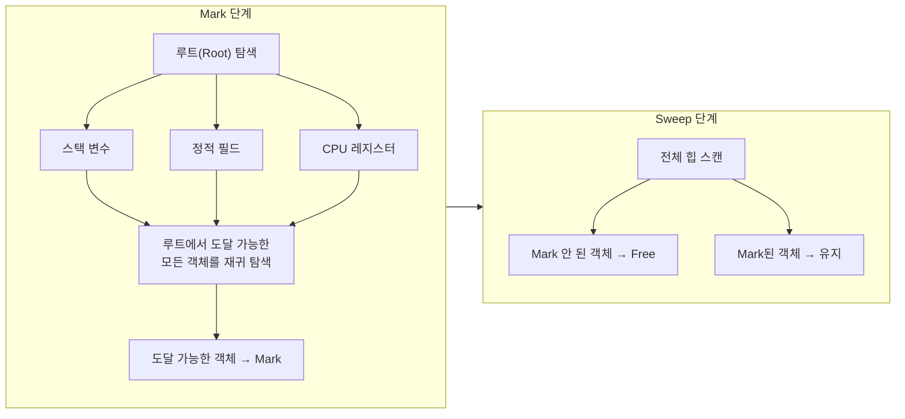
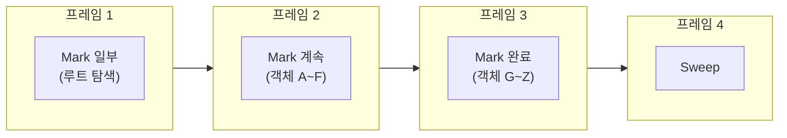
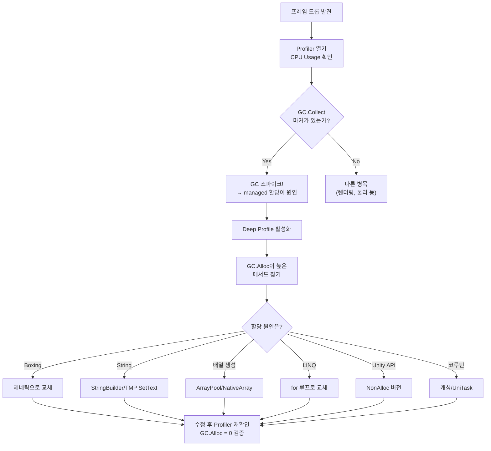

## 서론

[이전 포스트](/posts/NativeContainerDeepDive/)의 마지막에서 이렇게 예고했다:

> NativeContainer를 써야 하는 진짜 이유 — GC가 게임에 미치는 영향

이 시리즈에서 우리는 **"managed 세계를 벗어나라"**는 메시지를 반복적으로 만났다. Job System은 NativeContainer만 허용하고, Burst는 managed 타입을 컴파일하지 않으며, SoA 레이아웃은 unmanaged 메모리에서만 의미가 있다.

**왜?** 그 답의 절반은 캐시 효율에 있고, 나머지 절반은 **GC(Garbage Collector)**에 있다.

GC는 C# 프로그래머에게 편의를 제공하지만, 게임 개발에서는 **60fps(16.6ms 예산)의 적**이다. 한 프레임에 수 ms의 GC 스파이크가 발생하면 플레이어는 즉시 프레임 드롭을 체감한다.

이 포스트에서는:
1. Unity의 GC가 **내부적으로 어떻게 동작하는지** (Boehm GC의 구조)
2. GC.Alloc이 **어디서 발생하는지** (패턴별 총정리)
3. **어떻게 피하는지** (Zero-Allocation 코딩 패턴)

를 다룬다.

> [Job System 포스트](/posts/UnityJobSystemBurst/#nativearray의-내부-구조-c-배열과-무엇이-다른가)에서 managed heap vs unmanaged heap의 메모리 모델 차이를 다뤘다. C# 배열이 GC 관할인 이유, NativeArray가 GC-free인 이유에 대한 기초는 해당 섹션을 참고하라.

---

## Part 1: Unity의 GC는 무엇이 다른가

<div class="gc-arch" style="margin:2rem 0;overflow-x:auto;">
<svg viewBox="0 0 700 410" xmlns="http://www.w3.org/2000/svg" style="width:100%;max-width:700px;margin:0 auto;display:block;font-family:system-ui,-apple-system,sans-serif;">
  <defs>
    <filter id="gca-sh"><feDropShadow dx="0" dy="2" stdDeviation="3" flood-opacity="0.15"/></filter>
    <marker id="gca-arr" viewBox="0 0 10 10" refX="10" refY="5" markerWidth="7" markerHeight="7" orient="auto"><path d="M0,1 L10,5 L0,9Z" class="gca-af"/></marker>
    <linearGradient id="gca-g0" x1="0" y1="0" x2="1" y2="0"><stop offset="0%" stop-color="#ffcdd2"/><stop offset="100%" stop-color="#ef9a9a"/></linearGradient>
    <linearGradient id="gca-g1" x1="0" y1="0" x2="1" y2="0"><stop offset="0%" stop-color="#ef9a9a"/><stop offset="100%" stop-color="#e57373"/></linearGradient>
    <linearGradient id="gca-g2" x1="0" y1="0" x2="1" y2="0"><stop offset="0%" stop-color="#c8e6c9"/><stop offset="100%" stop-color="#a5d6a7"/></linearGradient>
    <linearGradient id="gca-g3" x1="0" y1="0" x2="1" y2="0"><stop offset="0%" stop-color="#a5d6a7"/><stop offset="100%" stop-color="#81c784"/></linearGradient>
  </defs>
  <path d="M68,15 L68,192 M68,15 L80,15 M68,192 L80,192" fill="none" stroke-width="2.5" class="gca-bm"/>
  <text x="48" y="104" text-anchor="middle" font-size="12" font-weight="700" class="gca-tm" transform="rotate(-90,48,104)">Managed</text>
  <path d="M68,218 L68,395 M68,218 L80,218 M68,395 L80,395" fill="none" stroke-width="2.5" class="gca-bu"/>
  <text x="48" y="307" text-anchor="middle" font-size="12" font-weight="700" class="gca-tu" transform="rotate(-90,48,307)">Unmanaged</text>
  <rect x="90" y="10" width="570" height="82" rx="12" fill="url(#gca-g0)" filter="url(#gca-sh)"/>
  <text x="375" y="38" text-anchor="middle" font-size="15" font-weight="700" fill="#b71c1c">C# 코드 (Managed 영역)</text>
  <text x="375" y="62" text-anchor="middle" font-size="12" fill="#c62828" opacity=".85">class · string · 배열 · LINQ · 코루틴</text>
  <line x1="375" y1="92" x2="375" y2="110" stroke-width="2" class="gca-al" marker-end="url(#gca-arr)"/>
  <rect x="90" y="110" width="570" height="82" rx="12" fill="url(#gca-g1)" filter="url(#gca-sh)"/>
  <text x="375" y="138" text-anchor="middle" font-size="15" font-weight="700" fill="#b71c1c">Managed Heap — Boehm GC</text>
  <text x="375" y="162" text-anchor="middle" font-size="12" fill="#c62828" opacity=".85">Mark-Sweep · 비세대적 · 비이동 · 보수적 마킹</text>
  <line x1="375" y1="192" x2="375" y2="218" stroke-width="2" class="gca-al" marker-end="url(#gca-arr)"/>
  <rect x="90" y="218" width="570" height="82" rx="12" fill="url(#gca-g2)" filter="url(#gca-sh)"/>
  <text x="375" y="246" text-anchor="middle" font-size="15" font-weight="700" fill="#1b5e20">Unmanaged Heap — Native Memory</text>
  <text x="375" y="270" text-anchor="middle" font-size="12" fill="#2e7d32" opacity=".85">NativeArray · Burst · Job System · malloc</text>
  <line x1="375" y1="300" x2="375" y2="318" stroke-width="2" class="gca-al" marker-end="url(#gca-arr)"/>
  <rect x="90" y="318" width="570" height="82" rx="12" fill="url(#gca-g3)" filter="url(#gca-sh)"/>
  <text x="375" y="346" text-anchor="middle" font-size="15" font-weight="700" fill="#1b5e20">OS / Hardware</text>
  <text x="375" y="370" text-anchor="middle" font-size="12" fill="#2e7d32" opacity=".85">물리 메모리 · 가상 메모리 · 캐시 계층</text>
</svg>
</div>
<style>
.gca-bm{stroke:#e57373}.gca-bu{stroke:#66bb6a}.gca-tm{fill:#e57373}.gca-tu{fill:#66bb6a}.gca-al{stroke:#9e9e9e}.gca-af{fill:#9e9e9e}
[data-mode="dark"] .gc-arch rect{opacity:.82}[data-mode="dark"] .gca-bm{stroke:#ef9a9a}[data-mode="dark"] .gca-bu{stroke:#a5d6a7}[data-mode="dark"] .gca-tm{fill:#ef9a9a}[data-mode="dark"] .gca-tu{fill:#a5d6a7}[data-mode="dark"] .gca-al{stroke:#757575}[data-mode="dark"] .gca-af{fill:#757575}
@media(max-width:768px){.gc-arch svg{min-width:520px}}
</style>

### 1.1 .NET GC vs Unity GC

많은 개발자가 **".NET의 세대별 GC"**를 기준으로 Unity의 GC를 이해하려 한다. 하지만 Unity의 GC는 **완전히 다른 구현체**다.

| | .NET (CoreCLR) GC | Unity (Boehm) GC |
|--|---------------------|-------------------|
| 구현체 | Microsoft's GC | **Boehm-Demers-Weiser GC** |
| 세대 | Gen0/1/2 (세대별) | **비세대적** (전체 힙 스캔) |
| Compaction | 있음 (메모리 이동) | **없음** (비이동) |
| 마킹 방식 | 정확(precise) | **보수적(conservative)** |
| Incremental | .NET 5+에서 부분 지원 | Unity 2019+에서 옵션 |
| Concurrent | 백그라운드 GC | **없음** (메인 스레드 차단) |

> Unity 공식 문서: *"Unity uses the Boehm-Demers-Weiser garbage collector. It's a non-generational, non-compacting garbage collector."*

이 차이가 게임 성능에 미치는 영향을 하나씩 분석한다.

<div class="gc-cmp" style="margin:2rem 0;overflow-x:auto;">
  <div class="gc-cmp-grid">
    <div class="gc-cmp-left">
      <div class="gc-cmp-badge" style="background:#4CAF50">.NET GC (CoreCLR)</div>
      <ul class="gc-cmp-list">
        <li><span class="gc-cmp-ok">&#10003;</span> 세대별 수집 (Gen0/1/2)</li>
        <li><span class="gc-cmp-ok">&#10003;</span> Compaction으로 단편화 해결</li>
        <li><span class="gc-cmp-ok">&#10003;</span> 정확한(Precise) 마킹</li>
        <li><span class="gc-cmp-ok">&#10003;</span> 백그라운드 GC (Concurrent)</li>
        <li><span class="gc-cmp-ok">&#10003;</span> Gen0 수집 ~0.1ms</li>
      </ul>
    </div>
    <div class="gc-cmp-mid"><span class="gc-cmp-vs">VS</span></div>
    <div class="gc-cmp-right">
      <div class="gc-cmp-badge" style="background:#f44336">Unity Boehm GC</div>
      <ul class="gc-cmp-list">
        <li><span class="gc-cmp-no">&#10007;</span> 비세대적 — 전체 힙 스캔</li>
        <li><span class="gc-cmp-no">&#10007;</span> Non-Compacting — 단편화 누적</li>
        <li><span class="gc-cmp-no">&#10007;</span> 보수적(Conservative) 마킹</li>
        <li><span class="gc-cmp-no">&#10007;</span> 메인 스레드 차단 (Stop-the-World)</li>
        <li><span class="gc-cmp-no">&#10007;</span> 비용 ∝ 전체 힙 크기</li>
      </ul>
    </div>
  </div>
  <p class="gc-cmp-cap">.NET 서버 개발의 GC 지식이 Unity에 그대로 적용되지 않는 이유</p>
</div>
<style>
.gc-cmp-grid{display:grid;grid-template-columns:1fr auto 1fr;align-items:stretch;max-width:740px;margin:0 auto;border-radius:14px;overflow:hidden;box-shadow:0 2px 12px rgba(0,0,0,.08)}
.gc-cmp-left{background:linear-gradient(135deg,#e8f5e9,#c8e6c9);padding:1.25rem 1.5rem}
.gc-cmp-right{background:linear-gradient(135deg,#ffebee,#ffcdd2);padding:1.25rem 1.5rem}
.gc-cmp-mid{display:flex;align-items:center;justify-content:center;padding:0 .5rem;background:linear-gradient(180deg,#e8f5e9,#f5f5f5 50%,#ffebee)}
.gc-cmp-vs{width:42px;height:42px;border-radius:50%;background:linear-gradient(135deg,#555,#333);display:flex;align-items:center;justify-content:center;color:#fff;font-weight:900;font-size:13px;box-shadow:0 2px 8px rgba(0,0,0,.25)}
.gc-cmp-badge{text-align:center;border-radius:20px;padding:5px 16px;font-size:14px;font-weight:700;color:#fff;margin-bottom:.75rem}
.gc-cmp-list{list-style:none;padding:0;margin:0;font-size:13.5px;line-height:2.1}
.gc-cmp-ok{color:#2e7d32;font-weight:700;margin-right:8px}.gc-cmp-no{color:#c62828;font-weight:700;margin-right:8px}
.gc-cmp-cap{text-align:center;margin-top:.75rem;font-size:12.5px;color:var(--text-muted-color,#6c757d);font-style:italic}
[data-mode="dark"] .gc-cmp-left{background:linear-gradient(135deg,#1a3320,#263e2a)}
[data-mode="dark"] .gc-cmp-right{background:linear-gradient(135deg,#3b1a1a,#4a2525)}
[data-mode="dark"] .gc-cmp-mid{background:linear-gradient(180deg,#1a3320,#252528 50%,#3b1a1a)}
[data-mode="dark"] .gc-cmp-list{color:#ddd}
[data-mode="dark"] .gc-cmp-ok{color:#81c784}[data-mode="dark"] .gc-cmp-no{color:#ef9a9a}
[data-mode="dark"] .gc-cmp-grid{box-shadow:0 2px 12px rgba(0,0,0,.3)}
@media(max-width:768px){.gc-cmp-grid{grid-template-columns:1fr!important}.gc-cmp-mid{padding:.5rem 0}}
</style>

### 1.2 Boehm GC 아키텍처

#### Mark-Sweep 알고리즘

Boehm GC는 **Mark-Sweep** 알고리즘의 변형이다. 두 단계로 동작한다:



**Mark 단계:**
1. **루트(Root)**를 찾는다 — 스택 변수, 정적 필드, CPU 레지스터에 있는 참조
2. 루트에서 도달 가능한 모든 객체를 재귀적으로 방문하며 "살아있음(Mark)" 표시
3. 루트에서 도달할 수 없는 객체는 Mark되지 않음 → **가비지**

**Sweep 단계:**
1. 힙 전체를 순회하며 Mark되지 않은 객체의 메모리를 해제
2. Mark 비트를 초기화하여 다음 GC 사이클 준비

#### "보수적(Conservative)" 마킹의 의미

Boehm GC의 가장 중요한 특성은 **보수적 마킹**이다.

```
.NET (정확한 GC):
  메타데이터로 "이 필드가 참조인지 정수인지" 정확히 알 수 있다
  → 참조만 따라감 → 죽은 객체를 100% 정확히 판별

Boehm (보수적 GC):
  스택이나 레지스터의 값이 포인터인지 정수인지 확실하지 않다
  → 값이 힙 범위 안의 유효한 주소처럼 보이면 "참조일 수도 있다"고 가정
  → 실제로는 죽은 객체인데 살아있다고 판단할 수 있음 (false retention)
```

**False retention**의 결과:
- 실제로는 가비지인 객체가 수집되지 않는 경우가 가끔 발생
- 메모리 사용량이 이론적 최소보다 약간 높을 수 있음
- 하지만 실전에서 이것이 문제가 되는 경우는 드물다 — **진짜 문제는 수집 비용**이다

### 1.3 비세대적(Non-Generational)의 비용

.NET의 세대별 GC는 **세대 가설(Generational Hypothesis)**을 활용한다:

> "대부분의 객체는 생성 직후 죽는다"

따라서 Gen0(최근 할당)만 자주 검사하고, Gen1/Gen2(오래된 객체)는 드물게 검사한다. Gen0 수집은 매우 빠르다 — 대상이 적으니까.

```
.NET 세대별 GC:
┌──── Gen0 ────┐ ┌──── Gen1 ────┐ ┌────── Gen2 ──────┐
│ 새로운 객체   │ │ 1회 생존     │ │ 오래된 객체       │
│ 빈번히 수집   │ │ 가끔 수집    │ │ 드물게 수집       │
│ ~0.1ms        │ │ ~1ms         │ │ ~10ms             │
└──────────────┘ └──────────────┘ └───────────────────┘

Unity Boehm GC:
┌──────────────── 전체 힙 (단일 세대) ────────────────┐
│ 새로운 객체 + 오래된 객체 + 모든 것                   │
│                                                       │
│ 매번 전체를 스캔                                      │
│ 비용 ∝ 힙 크기 (살아있는 객체 수)                     │
│                                                       │
│ 힙이 커질수록 GC 시간이 선형으로 증가                  │
└───────────────────────────────────────────────────────┘
```

**핵심**: Unity의 GC는 **살아있는 객체의 총량에 비례**하는 비용이 매번 발생한다. managed 힙에 100MB의 살아있는 객체가 있으면, 1KB의 가비지를 수집하기 위해서도 100MB 전체를 스캔해야 한다.

이것이 Unity에서 "managed 할당을 최소화하라"는 조언이 .NET 서버 개발보다 **훨씬 더 중요**한 이유다.

### 1.4 비이동(Non-Compacting)의 비용: 힙 단편화

.NET GC는 Compaction을 수행한다 — 살아있는 객체를 메모리의 한쪽으로 밀어 넣어 **빈 공간을 연속 블록으로** 만든다.

Boehm GC는 **Compaction을 하지 않는다**. 객체가 해제되면 그 자리에 구멍이 생기고, 새 할당은 이 구멍 중 적절한 크기를 찾아 들어간다.

```
시간이 지나면서 발생하는 단편화:

초기 상태 (깨끗함):
┌──────────────────────────────────────────┐
│ [A][B][C][D][E][F][G][H]    빈 공간     │
└──────────────────────────────────────────┘

일부 객체 해제 후:
┌──────────────────────────────────────────┐
│ [A][ ][C][ ][ ][F][ ][H]    빈 공간     │
└──────────────────────────────────────────┘
      ↑     ↑  ↑     ↑
      구멍들 (단편화)

새 할당 시도: 큰 배열 (구멍 3개 합친 크기) 필요
→ 연속 공간이 없음! → 힙 확장 필요
→ 총 빈 공간은 충분한데도 할당 실패
```

**실전 영향:**
- 게임이 오래 실행될수록 단편화가 누적
- 총 여유 메모리는 충분한데 큰 배열 할당이 실패하여 **힙이 불필요하게 확장**
- 확장된 힙은 줄어들지 않음 → **메모리 사용량이 계속 증가** (Unity는 힙을 OS에 반환하지 않는다)
- 모바일에서 메모리 부족으로 OS 킬 위험 증가

### 1.5 Incremental GC

Unity 2019.1부터 **Incremental GC** 옵션이 추가되었다.

```
일반 GC (Stop-the-World):
┌── 프레임 ──┐
│ Update      │ ████████ GC (5ms) ████████ │ Render │
│             │         ↑ 여기서 멈춤       │        │
└─────────────┴─────────────────────────────┴────────┘
총 프레임 시간: 16.6ms + 5ms = 21.6ms → 프레임 드롭!

Incremental GC:
┌── 프레임 1 ──┐ ┌── 프레임 2 ──┐ ┌── 프레임 3 ──┐
│ Update │ GC 1ms │ │ Update │ GC 1ms │ │ Update │ GC 1ms │
│        │ (부분) │ │        │ (부분) │ │        │ (부분) │
└────────┴────────┘ └────────┴────────┘ └────────┴────────┘
각 프레임에 1ms씩 분산 → 프레임 드롭 없음
```

#### 활성화 방법

```
Project Settings → Player → Other Settings
→ "Use incremental GC" 체크

또는 스크립트:
GarbageCollector.incrementalTimeSliceNanoseconds = 3_000_000; // 3ms 예산
```

#### Incremental GC의 동작 원리

Incremental GC는 Mark 단계를 여러 프레임에 걸쳐 **조금씩** 수행한다.



하지만 **쓰기 배리어(Write Barrier)**가 필요하다. Mark가 진행되는 동안 프로그램이 참조를 변경하면 이미 스캔한 객체에 새로운 참조가 추가될 수 있다. 쓰기 배리어는 이런 변경을 추적하여 재스캔 대상에 추가한다.

**쓰기 배리어의 비용:**
- 모든 참조 타입 필드 쓰기에 ~1ns 오버헤드 추가
- GC가 실행 중이 아닐 때도 배리어가 활성화되어 있음
- 참조 쓰기가 많은 코드에서 **1~5%의 전체 성능 저하** 가능

#### Incremental GC의 한계

```
⚠️ Incremental GC가 해결하는 것:
✅ GC 스파이크를 분산하여 프레임 드롭 완화

⚠️ Incremental GC가 해결하지 않는 것:
❌ GC의 총 비용 (같은 양의 일을 여러 프레임에 나눌 뿐)
❌ 힙 단편화 (여전히 non-compacting)
❌ 힙 크기에 비례하는 스캔 비용
❌ managed 할당 자체의 비용
```

**Incremental GC는 "진통제"이지 "치료"가 아니다.** 근본적인 해결책은 managed 할당 자체를 줄이는 것이다.

### 1.6 GC 비용 공식

Boehm GC의 비용을 대략적으로 모델링하면:

$$T_{GC} \approx \alpha \times N_{alive} + \beta \times N_{dead}$$

- $T_{GC}$: GC 수집 1회 소요 시간
- $N_{alive}$: 살아있는 managed 객체 수 (Mark 비용)
- $N_{dead}$: 죽은 객체 수 (Sweep 비용)
- $\alpha$: 객체당 Mark 비용 (~10-50ns)
- $\beta$: 객체당 Sweep 비용 (~5-20ns)

**핵심 통찰**: Mark 비용이 지배적이므로, GC 시간은 **살아있는 객체의 수에 비례**한다. 가비지(죽은 객체)가 많든 적든, 살아있는 객체가 많으면 GC는 느리다.

이것이 .NET 세대별 GC와 근본적으로 다른 점이다. .NET GC는 Gen0에서 살아남는 객체만 Gen1으로 승격하므로, "대부분 금방 죽는 객체"의 비용이 낮다. Boehm GC는 모든 살아있는 객체를 매번 스캔한다.

---

## Part 2: GC.Alloc 발생 패턴 총정리

<div class="gc-flow" style="margin:2rem 0;overflow-x:auto;">
<svg viewBox="0 0 780 310" xmlns="http://www.w3.org/2000/svg" style="width:100%;max-width:780px;margin:0 auto;display:block;font-family:system-ui,-apple-system,sans-serif;">
  <defs>
    <filter id="gcf-sh"><feDropShadow dx="0" dy="1" stdDeviation="2" flood-opacity="0.12"/></filter>
    <marker id="gcf-arr" viewBox="0 0 10 10" refX="10" refY="5" markerWidth="7" markerHeight="7" orient="auto"><path d="M0,1 L10,5 L0,9Z" class="gcf-af"/></marker>
    <linearGradient id="gcf-wg" x1="0" y1="0" x2="1" y2="0"><stop offset="0%" stop-color="#fff9c4"/><stop offset="100%" stop-color="#fff176"/></linearGradient>
    <linearGradient id="gcf-dg" x1="0" y1="0" x2="1" y2="0"><stop offset="0%" stop-color="#ef5350"/><stop offset="100%" stop-color="#c62828"/></linearGradient>
    <radialGradient id="gcf-pulse"><stop offset="0%" stop-color="#ff5252" stop-opacity="0.3"/><stop offset="100%" stop-color="#ff5252" stop-opacity="0"/></radialGradient>
  </defs>
  <g filter="url(#gcf-sh)">
    <rect class="gcf-src" x="20" y="5" width="148" height="38" rx="8"/><text class="gcf-stx" x="94" y="29" text-anchor="middle" font-size="13" font-weight="600">Boxing</text>
    <rect class="gcf-src" x="20" y="53" width="148" height="38" rx="8"/><text class="gcf-stx" x="94" y="77" text-anchor="middle" font-size="13" font-weight="600">클로저 캡처</text>
    <rect class="gcf-src" x="20" y="101" width="148" height="38" rx="8"/><text class="gcf-stx" x="94" y="125" text-anchor="middle" font-size="13" font-weight="600">String 연결</text>
    <rect class="gcf-src" x="20" y="149" width="148" height="38" rx="8"/><text class="gcf-stx" x="94" y="173" text-anchor="middle" font-size="13" font-weight="600">LINQ</text>
    <rect class="gcf-src" x="20" y="197" width="148" height="38" rx="8"/><text class="gcf-stx" x="94" y="221" text-anchor="middle" font-size="13" font-weight="600">params 배열</text>
    <rect class="gcf-src" x="20" y="245" width="148" height="38" rx="8"/><text class="gcf-stx" x="94" y="269" text-anchor="middle" font-size="13" font-weight="600">코루틴 yield</text>
  </g>
  <g fill="none" stroke-width="1.8" class="gcf-lines" marker-end="url(#gcf-arr)">
    <path d="M168,24 C275,24 305,148 375,148"/>
    <path d="M168,72 C265,72 310,148 375,148"/>
    <path d="M168,120 C255,120 320,148 375,148"/>
    <path d="M168,168 C255,168 320,148 375,148"/>
    <path d="M168,216 C265,216 310,148 375,148"/>
    <path d="M168,264 C275,264 305,148 375,148"/>
  </g>
  <rect class="gcf-warn" x="375" y="112" width="175" height="72" rx="14" fill="url(#gcf-wg)" filter="url(#gcf-sh)" stroke="#fbc02d" stroke-width="2"/>
  <text x="462" y="143" text-anchor="middle" font-size="14" font-weight="700" class="gcf-wtx">GC Pressure</text>
  <text x="462" y="165" text-anchor="middle" font-size="12" class="gcf-wtx2">누적</text>
  <line x1="550" y1="148" x2="615" y2="148" stroke-width="2.5" class="gcf-dl" marker-end="url(#gcf-arr)"/>
  <circle cx="695" cy="148" r="42" fill="url(#gcf-pulse)">
    <animate attributeName="r" values="35;48;35" dur="2s" repeatCount="indefinite"/>
    <animate attributeName="opacity" values="0.8;0.3;0.8" dur="2s" repeatCount="indefinite"/>
  </circle>
  <rect x="615" y="114" width="160" height="68" rx="14" fill="url(#gcf-dg)" filter="url(#gcf-sh)"/>
  <text x="695" y="144" text-anchor="middle" font-size="15" font-weight="800" fill="#fff">Frame Spike!</text>
  <text x="695" y="165" text-anchor="middle" font-size="11" fill="#ffcdd2">&#9889; 프레임 드롭</text>
</svg>
</div>
<style>
.gcf-src{fill:#ffcdd2}.gcf-stx{fill:#c62828}.gcf-lines{stroke:#ef9a9a}.gcf-af{fill:#ef9a9a}.gcf-dl{stroke:#ef5350}
.gcf-wtx{fill:#f57f17}.gcf-wtx2{fill:#f9a825}
[data-mode="dark"] .gcf-src{fill:#5c2a2a}[data-mode="dark"] .gcf-stx{fill:#ef9a9a}
[data-mode="dark"] .gcf-lines{stroke:#e57373}[data-mode="dark"] .gcf-af{fill:#e57373}
[data-mode="dark"] .gcf-warn{opacity:.85}[data-mode="dark"] .gcf-wtx{fill:#fdd835}[data-mode="dark"] .gcf-wtx2{fill:#ffee58}
[data-mode="dark"] .gcf-dl{stroke:#ef5350}
@media(max-width:768px){.gc-flow svg{min-width:600px}}
</style>

GC의 비용을 줄이려면 managed 힙 할당(GC.Alloc)을 줄여야 한다. 문제는 **할당이 명시적이지 않은 경우가 많다**는 것이다.

### 2.1 명시적 할당: new 키워드

가장 명확한 할당. `new`로 참조 타입을 생성하면 managed 힙에 할당된다.

```csharp
// ✅ 할당 발생 — 참조 타입 (class)
var enemy = new Enemy();           // GC.Alloc
var list = new List<int>();        // GC.Alloc
var dict = new Dictionary<int, string>();  // GC.Alloc
string name = new string('x', 10); // GC.Alloc

// ❌ 할당 없음 — 값 타입 (struct)
var pos = new Vector3(1, 2, 3);    // 스택에 할당, GC 무관
var data = new MyStruct();         // 스택에 할당
int x = new int();                 // 스택에 할당 (= 0)
```

**규칙: `new` + `class` = GC.Alloc, `new` + `struct` = 스택 할당**

단, struct라도 **배열**로 만들면 힙에 할당된다:

```csharp
var positions = new Vector3[1000];  // GC.Alloc! 배열 자체는 참조 타입
```

### 2.2 Boxing: 숨겨진 할당 #1

**Boxing**은 값 타입을 참조 타입으로 변환하는 과정이다. 이때 managed 힙에 새 객체가 할당된다.

```csharp
// ❌ Boxing 발생
int hp = 100;
object boxed = hp;              // int → object: 힙에 Int32 박스 생성
IComparable comp = hp;          // int → IComparable: 동일하게 boxing

// ❌ 자주 놓치는 Boxing 패턴
void LogValue(object value) { Debug.Log(value); }
LogValue(42);                   // int → object: boxing!
LogValue(3.14f);                // float → object: boxing!

// ❌ string.Format의 boxing
string msg = string.Format("HP: {0}, MP: {1}", hp, mp);
// hp와 mp가 int → object로 boxing됨

// ❌ Dictionary<TKey, TValue>에서 Enum 키의 boxing
enum EnemyType { Walker, Runner, Boss }
var counts = new Dictionary<EnemyType, int>();
counts[EnemyType.Walker] = 5;
// EqualityComparer<EnemyType>.Default가 내부적으로 boxing (Unity 2021 이전)
```

#### Boxing이 위험한 이유

Boxing은 **매 호출마다** 새 객체를 힙에 할당한다. 루프 안에서 boxing이 발생하면:

```csharp
// 3,000 에이전트 × 매 프레임 = 프레임당 3,000회 boxing
for (int i = 0; i < agents.Count; i++)
{
    LogValue(agents[i].Health);  // float → object: boxing!
}
// → 프레임당 ~72 KB 할당 (24 bytes × 3,000)
// → 수 프레임마다 GC 트리거
```

### 2.3 클로저 캡처: 숨겨진 할당 #2

람다/익명 메서드가 외부 변수를 **캡처(capture)**하면, 컴파일러가 캡처 클래스를 생성하여 힙에 할당한다.

```csharp
// ❌ 클로저 캡처 → 할당 발생
float threshold = 0.5f;
var filtered = enemies.Where(e => e.Health > threshold);  
// threshold를 캡처하는 클래스가 힙에 할당됨

// 컴파일러가 실제로 생성하는 코드:
class DisplayClass_0
{
    public float threshold;
    public bool Lambda(Enemy e) => e.Health > threshold;
}
var closure = new DisplayClass_0 { threshold = threshold };  // GC.Alloc!
var filtered = enemies.Where(closure.Lambda);
```

```csharp
// ✅ 캡처 없는 람다 → 할당 없음 (C# 9+ static 람다)
var filtered = enemies.Where(static e => e.Health > 0.5f);
// 상수만 사용 → 캡처 없음 → 할당 없음

// ✅ 캡처를 피하는 패턴
void FilterEnemies(List<Enemy> enemies, float threshold)
{
    for (int i = enemies.Count - 1; i >= 0; i--)
    {
        if (enemies[i].Health <= threshold)
            enemies.RemoveAtSwapBack(i);
    }
}
```

### 2.4 String 연산: 숨겨진 할당 #3

C#의 string은 **불변(immutable) 참조 타입**이다. 모든 string 변형 연산은 새 string 객체를 힙에 할당한다.

```csharp
// ❌ 매번 새 string 할당
string status = "HP: " + hp + "/" + maxHp;
// "HP: " + hp → boxing + 새 string
// + "/" → 새 string
// + maxHp → boxing + 새 string
// 총 5~6회 힙 할당!

// ❌ Update()에서 매 프레임 string 생성
void Update()
{
    fpsText.text = $"FPS: {(1f / Time.deltaTime):F0}";
    // 매 프레임 새 string 할당 → GC 압력
}

// ✅ StringBuilder 재사용
private StringBuilder _sb = new StringBuilder(64);

void Update()
{
    if (_frameCount++ % 30 == 0)  // 30프레임마다만 갱신
    {
        _sb.Clear();
        _sb.Append("FPS: ");
        _sb.Append((int)(1f / Time.smoothDeltaTime));
        fpsText.text = _sb.ToString();  // ToString()은 여전히 할당
    }
}

// ✅✅ 최선: TextMeshPro의 SetText (할당 없음)
void Update()
{
    if (_frameCount++ % 30 == 0)
    {
        tmpText.SetText("FPS: {0}", (int)(1f / Time.smoothDeltaTime));
        // SetText은 내부 char 버퍼를 재사용 → GC.Alloc 0
    }
}
```

### 2.5 LINQ: 숨겨진 할당 #4

LINQ의 거의 모든 연산이 **이터레이터 객체**를 힙에 할당한다.

```csharp
// ❌ LINQ 체인 = 할당 체인
var targets = enemies
    .Where(e => e.IsAlive)           // WhereEnumerableIterator 할당 + 클로저
    .OrderBy(e => e.Distance)        // OrderedEnumerable 할당 + 클로저
    .Take(5)                         // TakeIterator 할당
    .ToList();                       // List 할당 + 내부 배열 할당
// 최소 5~7회 힙 할당

// ✅ for 루프로 대체
void FindClosest5Alive(List<Enemy> enemies, List<Enemy> result)
{
    result.Clear();
    
    // 단순 선택 정렬 (N이 작으면 충분히 빠름)
    for (int pick = 0; pick < 5 && pick < enemies.Count; pick++)
    {
        float minDist = float.MaxValue;
        int minIdx = -1;
        
        for (int i = 0; i < enemies.Count; i++)
        {
            if (!enemies[i].IsAlive) continue;
            if (result.Contains(enemies[i])) continue;
            if (enemies[i].Distance < minDist)
            {
                minDist = enemies[i].Distance;
                minIdx = i;
            }
        }
        
        if (minIdx >= 0) result.Add(enemies[minIdx]);
    }
    // 할당 0회 (result를 미리 만들어두고 재사용)
}
```

### 2.6 params 배열: 숨겨진 할당 #5

`params` 키워드로 가변 인자를 받으면, 호출마다 배열이 할당된다.

```csharp
// 메서드 정의
void SetValues(params int[] values) { /* ... */ }

// ❌ 호출할 때마다 int[] 배열 할당
SetValues(1, 2, 3);        // new int[] { 1, 2, 3 } 할당
SetValues(10, 20);          // new int[] { 10, 20 } 할당

// ✅ C# 13 params 컬렉션 (Unity 6+ / .NET 8+)
void SetValues(params ReadOnlySpan<int> values) { /* ... */ }
SetValues(1, 2, 3);  // 스택 할당, GC.Alloc 0

// ✅ 오버로드로 회피
void SetValues(int a) { /* ... */ }
void SetValues(int a, int b) { /* ... */ }
void SetValues(int a, int b, int c) { /* ... */ }
// 가장 흔한 인자 수에 대해 오버로드 → params 배열 회피
```

### 2.7 코루틴: 숨겨진 할당 #6

Unity 코루틴(`StartCoroutine`)은 여러 지점에서 할당이 발생한다.

```csharp
// ❌ 코루틴의 할당 지점들
IEnumerator SpawnWave()
{
    // 1. StartCoroutine() 호출 시 Coroutine 객체 할당
    // 2. IEnumerator 상태 머신 객체 할당
    
    for (int i = 0; i < 10; i++)
    {
        SpawnEnemy();
        yield return new WaitForSeconds(0.5f);  // 3. 매번 WaitForSeconds 할당!
    }
}

StartCoroutine(SpawnWave());
```

```csharp
// ✅ WaitForSeconds 캐싱
private static readonly WaitForSeconds _wait05 = new WaitForSeconds(0.5f);

IEnumerator SpawnWave()
{
    for (int i = 0; i < 10; i++)
    {
        SpawnEnemy();
        yield return _wait05;  // 캐싱된 객체 재사용 → 할당 0
    }
}

// ✅✅ 최선: 코루틴 대신 async/await (UniTask)
// UniTask는 struct 기반이므로 GC.Alloc 0
async UniTaskVoid SpawnWave(CancellationToken ct)
{
    for (int i = 0; i < 10; i++)
    {
        SpawnEnemy();
        await UniTask.Delay(500, cancellationToken: ct);  // 할당 0
    }
}
```

### 2.8 Unity API의 숨겨진 할당

Unity의 일부 API는 내부적으로 배열을 할당하여 반환한다.

```csharp
// ❌ 매 호출마다 새 배열 할당
Collider[] hits = Physics.OverlapSphere(pos, radius);     // 배열 할당
RaycastHit[] results = Physics.RaycastAll(ray);            // 배열 할당
GameObject[] objects = GameObject.FindGameObjectsWithTag("Enemy");  // 배열 할당
Renderer[] renderers = GetComponentsInChildren<Renderer>();         // 배열 할당

// ✅ NonAlloc 버전 사용
private Collider[] _hitBuffer = new Collider[32];         // 미리 할당

void Update()
{
    int count = Physics.OverlapSphereNonAlloc(pos, radius, _hitBuffer);
    for (int i = 0; i < count; i++)
    {
        ProcessHit(_hitBuffer[i]);
    }
}

// ✅ GetComponentsInChildren — List 버전 (재사용)
private List<Renderer> _rendererBuffer = new List<Renderer>(16);

void CacheRenderers()
{
    _rendererBuffer.Clear();
    GetComponentsInChildren(_rendererBuffer);  // 기존 List에 추가 → 배열 재할당 최소화
}
```

### 2.9 GC.Alloc 발생 패턴 총정리

| 패턴 | 원인 | 비용(대략) | 해결책 |
|------|------|-----------|--------|
| `new class()` | 참조 타입 생성 | 24B+ 객체 | 오브젝트 풀링, struct |
| Boxing | 값→참조 변환 | 12~24B | 제네릭, 구체 타입 사용 |
| 클로저 캡처 | 람다의 외부 변수 | 32B+ | static 람다, for 루프 |
| String 연결 | 불변 string 생성 | 가변 | StringBuilder, TMP SetText |
| LINQ | 이터레이터 체인 | 32B+ × N | for 루프 |
| params 배열 | 가변 인자 | 12B + N×4B | 오버로드, Span |
| 코루틴 yield | WaitForX 생성 | 20~40B | 캐싱, UniTask |
| Unity API | 배열 반환 | 가변 | NonAlloc 버전 |
| 배열 생성 | `new T[n]` | 12B + N×sizeof(T) | ArrayPool, NativeArray |
| Dictionary Enum 키 | EqualityComparer boxing | 12~24B | 커스텀 comparer |
| foreach on struct IEnumerator | 인터페이스 디스패치 boxing | 32B+ | for + indexer |

---

## Part 3: Zero-Allocation 코딩 패턴

### 3.1 stackalloc + Span\<T\>

**stackalloc**은 managed 힙이 아닌 **스택**에 메모리를 할당한다. GC와 완전히 무관하다.

```csharp
// ✅ 스택에 할당 — GC.Alloc 0
void CalculateDistances(Vector3 myPos, Vector3[] targets, int count)
{
    // 스택에 float 배열 할당 (함수 종료 시 자동 해제)
    Span<float> distances = stackalloc float[count];
    
    for (int i = 0; i < count; i++)
    {
        Vector3 diff = targets[i] - myPos;
        distances[i] = diff.magnitude;
    }
    
    // distances 사용...
    float minDist = float.MaxValue;
    for (int i = 0; i < count; i++)
        minDist = Mathf.Min(minDist, distances[i]);
}
// 함수가 끝나면 distances 메모리가 스택에서 자동 해제
```

**Span\<T\>**는 연속 메모리 영역에 대한 "뷰(view)"다. 배열, stackalloc, 네이티브 메모리 어디든 가리킬 수 있다.

```csharp
// Span은 다양한 메모리 소스를 통합하는 뷰
Span<int> fromArray = new int[] { 1, 2, 3 };     // 배열의 뷰
Span<int> fromStack = stackalloc int[3];           // 스택의 뷰
Span<int> slice = fromArray.Slice(1, 2);           // 부분 뷰 (복사 없음!)

// Span을 받는 메서드는 메모리 소스에 무관하게 동작
void Process(Span<int> data) { /* ... */ }
Process(fromArray);    // ✅ 배열
Process(fromStack);    // ✅ 스택
```

#### stackalloc 주의사항

```csharp
// ⚠️ 스택 크기 제한 (~1MB)
// 큰 배열을 stackalloc하면 StackOverflowException!
Span<float> bad = stackalloc float[1_000_000];  // 💥 ~4MB → 스택 오버플로

// ✅ 안전 패턴: 작으면 스택, 크면 풀
void Process(int count)
{
    Span<float> buffer = count <= 256
        ? stackalloc float[count]              // 작으면 스택 (~1KB)
        : new float[count];                     // 크면 힙 (또는 ArrayPool)
    
    // buffer 사용...
}
```

### 3.2 ArrayPool\<T\>

**ArrayPool**은 배열 인스턴스를 **풀링**하여 재사용한다. managed 힙 할당은 처음 한 번만 발생하고, 이후에는 풀에서 빌려 쓴다.

```csharp
using System.Buffers;

void ProcessFrame()
{
    // 풀에서 배열을 빌린다 (할당 없음, 풀이 비면 첫 1회만 할당)
    float[] buffer = ArrayPool<float>.Shared.Rent(1024);
    // 주의: Rent(1024)가 정확히 1024 크기를 반환하지 않을 수 있다
    // 2의 거듭제곱으로 올림된 크기 (예: 1024)가 반환됨
    
    try
    {
        // buffer[0..1023] 사용
        for (int i = 0; i < 1024; i++)
            buffer[i] = ComputeValue(i);
        
        ApplyResults(buffer, 1024);
    }
    finally
    {
        // 반드시 반환! 안 하면 풀이 고갈되어 새 할당 발생
        ArrayPool<float>.Shared.Return(buffer);
    }
}
```

#### ArrayPool vs stackalloc vs NativeArray

| | stackalloc | ArrayPool | NativeArray |
|--|-----------|-----------|-------------|
| 메모리 위치 | 스택 | managed 힙 (풀링) | unmanaged 힙 |
| GC 영향 | 없음 | 최초 할당 시만 | 없음 |
| 크기 제한 | ~1KB 권장 | 수 MB | OS 메모리 한도 |
| Job 사용 | 불가 | 불가 | **가능** |
| Burst 호환 | 불가 | 불가 | **가능** |
| 수명 | 함수 스코프 | Return까지 | Dispose까지 |
| 최적 용도 | 작은 임시 버퍼 | 중간 크기 임시 배열 | Job/Burst 데이터 |

<div class="chart-wrapper">
  <div class="chart-title">메모리 할당 전략 비교</div>
  <canvas id="memoryCompare" class="chart-canvas" height="280"></canvas>
</div>
<script>
window.chartConfigs = window.chartConfigs || [];
window.chartConfigs.push({
  id: 'memoryCompare',
  type: 'radar',
  data: {
    labels: ['GC 영향 없음', '대용량 지원', 'Job 호환', 'Burst 호환', '사용 편의성'],
    datasets: [
      {label:'stackalloc',data:[5,1,1,1,4],backgroundColor:'rgba(255,152,0,0.2)',borderColor:'rgba(255,152,0,0.8)',pointBackgroundColor:'rgb(255,152,0)',borderWidth:2,pointRadius:4},
      {label:'ArrayPool',data:[3,4,1,1,5],backgroundColor:'rgba(33,150,243,0.2)',borderColor:'rgba(33,150,243,0.8)',pointBackgroundColor:'rgb(33,150,243)',borderWidth:2,pointRadius:4},
      {label:'NativeArray',data:[5,5,5,5,2],backgroundColor:'rgba(76,175,80,0.2)',borderColor:'rgba(76,175,80,0.8)',pointBackgroundColor:'rgb(76,175,80)',borderWidth:2,pointRadius:4}
    ]
  },
  options: {
    scales: {r: {beginAtZero:true,max:5,ticks:{stepSize:1,display:false},pointLabels:{font:{size:12}},grid:{color:'rgba(128,128,128,0.15)'},angleLines:{color:'rgba(128,128,128,0.15)'}}},
    plugins: {legend:{position:'bottom',labels:{padding:16,usePointStyle:true,pointStyleWidth:10}}},
    responsive: true,
    maintainAspectRatio: true
  }
});
</script>

### 3.3 오브젝트 풀링

참조 타입 객체(class)를 매번 new/GC하지 않고 **풀에서 빌려 쓰고 반환**하는 패턴.

```csharp
// Unity 2021+에서 제공하는 ObjectPool
using UnityEngine.Pool;

public class ProjectilePool : MonoBehaviour
{
    private ObjectPool<Projectile> _pool;
    
    void Awake()
    {
        _pool = new ObjectPool<Projectile>(
            createFunc: () => Instantiate(projectilePrefab).GetComponent<Projectile>(),
            actionOnGet: p => p.gameObject.SetActive(true),
            actionOnRelease: p => p.gameObject.SetActive(false),
            actionOnDestroy: p => Destroy(p.gameObject),
            defaultCapacity: 50,
            maxSize: 200
        );
    }
    
    public Projectile Spawn(Vector3 pos, Vector3 dir)
    {
        var p = _pool.Get();        // 풀에서 꺼냄 (할당 없음)
        p.transform.position = pos;
        p.Initialize(dir);
        return p;
    }
    
    public void Despawn(Projectile p)
    {
        _pool.Release(p);           // 풀에 반환 (GC 없음)
    }
}
```

### 3.4 struct 기반 설계

GC.Alloc을 원천적으로 피하는 가장 확실한 방법은 **값 타입(struct)으로 설계**하는 것이다.

```csharp
// ❌ class — 힙 할당, GC 대상
class DamageEvent
{
    public int TargetId;
    public float Amount;
    public DamageType Type;
}

// ✅ struct — 스택 할당 또는 배열 내 인라인, GC 무관
struct DamageEvent
{
    public int TargetId;
    public float Amount;
    public DamageType Type;
}
```

#### struct를 선택해야 하는 기준

| 기준 | struct 적합 | class 적합 |
|------|------------|-----------|
| 크기 | ≤ 64 bytes | > 64 bytes |
| 수명 | 짧음 (1-2 프레임) | 길음 (여러 프레임) |
| 공유 | 복사해도 OK | 참조 공유 필요 |
| 상속 | 불필요 | 필요 |
| 용도 | 데이터 전달, 계산 중간값 | 복잡한 상태, 다형성 |

> 64 bytes 기준은 **복사 비용** 때문이다. struct는 값 복사되므로 너무 크면 복사 비용이 힙 할당 비용보다 커질 수 있다. 일반적으로 캐시 라인 크기(64B) 이하면 안전하다.

<div class="gc-tree" style="margin:2rem 0;overflow-x:auto;">
<svg viewBox="0 0 780 310" xmlns="http://www.w3.org/2000/svg" style="width:100%;max-width:780px;margin:0 auto;display:block;font-family:system-ui,-apple-system,sans-serif;">
  <defs>
    <filter id="gct-sh"><feDropShadow dx="0" dy="1" stdDeviation="2" flood-opacity="0.1"/></filter>
    <marker id="gct-arr" viewBox="0 0 10 10" refX="10" refY="5" markerWidth="7" markerHeight="7" orient="auto"><path d="M0,1 L10,5 L0,9Z" class="gct-af"/></marker>
  </defs>
  <rect x="185" y="10" width="330" height="50" rx="25" class="gct-q" filter="url(#gct-sh)"/>
  <text x="350" y="40" text-anchor="middle" font-size="13" font-weight="700" class="gct-qt">참조 공유 또는 상속이 필요한가?</text>
  <path d="M268,60 L268,90 L150,90 L150,120" fill="none" stroke="#4CAF50" stroke-width="2" marker-end="url(#gct-arr)"/>
  <rect x="198" y="76" width="42" height="20" rx="4" fill="#4CAF50"/><text x="219" y="90" text-anchor="middle" font-size="11" font-weight="700" fill="#fff">Yes</text>
  <path d="M432,60 L432,90 L520,90 L520,120" fill="none" stroke="#f44336" stroke-width="2" marker-end="url(#gct-arr)"/>
  <rect x="460" y="76" width="34" height="20" rx="4" fill="#f44336"/><text x="477" y="90" text-anchor="middle" font-size="11" font-weight="700" fill="#fff">No</text>
  <rect x="50" y="120" width="200" height="50" rx="10" class="gct-rb" filter="url(#gct-sh)"/>
  <text x="150" y="150" text-anchor="middle" font-size="13" font-weight="600" class="gct-rbt">class 사용</text>
  <rect x="355" y="120" width="330" height="50" rx="25" class="gct-q" filter="url(#gct-sh)"/>
  <text x="520" y="150" text-anchor="middle" font-size="13" font-weight="700" class="gct-qt">크기가 64 bytes 이하인가?</text>
  <path d="M438,170 L438,203 L390,203 L390,230" fill="none" stroke="#4CAF50" stroke-width="2" marker-end="url(#gct-arr)"/>
  <rect x="408" y="189" width="42" height="20" rx="4" fill="#4CAF50"/><text x="429" y="203" text-anchor="middle" font-size="11" font-weight="700" fill="#fff">Yes</text>
  <path d="M602,170 L602,203 L650,203 L650,230" fill="none" stroke="#f44336" stroke-width="2" marker-end="url(#gct-arr)"/>
  <rect x="618" y="189" width="34" height="20" rx="4" fill="#f44336"/><text x="635" y="203" text-anchor="middle" font-size="11" font-weight="700" fill="#fff">No</text>
  <rect x="270" y="230" width="240" height="56" rx="10" class="gct-rg" filter="url(#gct-sh)"/>
  <text x="390" y="254" text-anchor="middle" font-size="13" font-weight="700" class="gct-rgt">struct 사용</text>
  <text x="390" y="274" text-anchor="middle" font-size="11" class="gct-rgt2">Zero Allocation</text>
  <rect x="530" y="230" width="240" height="56" rx="10" class="gct-ry" filter="url(#gct-sh)"/>
  <text x="650" y="254" text-anchor="middle" font-size="13" font-weight="600" class="gct-ryt">class 사용</text>
  <text x="650" y="274" text-anchor="middle" font-size="11" class="gct-ryt2">복사 비용 &gt; 힙 할당</text>
</svg>
</div>
<style>
.gct-q{fill:#f5f5f5;stroke:#bdbdbd;stroke-width:1.5}.gct-qt{fill:#333}.gct-af{fill:#9e9e9e}
.gct-rb{fill:#e3f2fd;stroke:#1976d2;stroke-width:2}.gct-rbt{fill:#1565c0}
.gct-rg{fill:#e8f5e9;stroke:#4CAF50;stroke-width:2.5}.gct-rgt{fill:#2e7d32}.gct-rgt2{fill:#388e3c}
.gct-ry{fill:#fff8e1;stroke:#ff9800;stroke-width:2}.gct-ryt{fill:#e65100}.gct-ryt2{fill:#f57c00}
[data-mode="dark"] .gct-q{fill:#2a2a2e;stroke:#616161}[data-mode="dark"] .gct-qt{fill:#e0e0e0}
[data-mode="dark"] .gct-rb{fill:#1a2a3a;stroke:#42a5f5}[data-mode="dark"] .gct-rbt{fill:#90caf9}
[data-mode="dark"] .gct-rg{fill:#1a3320;stroke:#66bb6a}[data-mode="dark"] .gct-rgt{fill:#a5d6a7}[data-mode="dark"] .gct-rgt2{fill:#81c784}
[data-mode="dark"] .gct-ry{fill:#3a2e10;stroke:#ffa726}[data-mode="dark"] .gct-ryt{fill:#ffcc80}[data-mode="dark"] .gct-ryt2{fill:#ffb74d}
@media(max-width:768px){.gc-tree svg{min-width:600px}}
</style>

### 3.5 제네릭으로 Boxing 제거

```csharp
// ❌ object를 받으면 값 타입이 boxing됨
void Log(object value) => Debug.Log(value);
Log(42);        // boxing!
Log(3.14f);     // boxing!

// ✅ 제네릭은 타입별로 특수화되어 boxing 없음
void Log<T>(T value) => Debug.Log(value.ToString());
Log(42);        // Log<int> — boxing 없음
Log(3.14f);     // Log<float> — boxing 없음
```

```csharp
// ❌ Dictionary에서 Enum 키의 boxing (Unity 2021 이전)
var dict = new Dictionary<MyEnum, int>();
// 내부적으로 EqualityComparer<MyEnum>.Default가 boxing 발생

// ✅ 커스텀 comparer로 boxing 제거
struct MyEnumComparer : IEqualityComparer<MyEnum>
{
    public bool Equals(MyEnum x, MyEnum y) => x == y;
    public int GetHashCode(MyEnum obj) => (int)obj;
}

var dict = new Dictionary<MyEnum, int>(new MyEnumComparer());
// boxing 없음
```

### 3.6 Zero-Allocation Update() 패턴

실제 게임 루프에서 적용하는 종합 패턴:

```csharp
public class AgentManager : MonoBehaviour
{
    // Persistent 할당 — 한 번만, Awake에서
    private NativeArray<float3> _positions;
    private NativeArray<float3> _velocities;
    private NativeArray<byte> _isAlive;
    
    // 캐싱된 배열 — 한 번만 할당하고 재사용
    private Collider[] _overlapBuffer = new Collider[64];
    private readonly StringBuilder _debugSb = new StringBuilder(128);
    
    // 캐싱된 YieldInstruction
    private static readonly WaitForSeconds _spawnDelay = new WaitForSeconds(1f);
    
    void Awake()
    {
        int maxAgents = 3000;
        _positions = new NativeArray<float3>(maxAgents, Allocator.Persistent);
        _velocities = new NativeArray<float3>(maxAgents, Allocator.Persistent);
        _isAlive = new NativeArray<byte>(maxAgents, Allocator.Persistent);
    }
    
    void Update()
    {
        // ✅ Job + NativeArray → GC.Alloc 0
        var moveJob = new AgentMoveJob
        {
            Positions = _positions,
            Velocities = _velocities,
            IsAlive = _isAlive,
            DeltaTime = Time.deltaTime
        };
        moveJob.Schedule(_positions.Length, 64).Complete();
        
        // ✅ NonAlloc 물리 쿼리 → GC.Alloc 0
        int hitCount = Physics.OverlapSphereNonAlloc(
            transform.position, 10f, _overlapBuffer);
        
        // ✅ 조건부 string 생성 (매 프레임 X)
        #if UNITY_EDITOR
        if (Time.frameCount % 60 == 0)
        {
            _debugSb.Clear();
            _debugSb.Append("Agents: ").Append(_aliveCount);
            Debug.Log(_debugSb);
        }
        #endif
    }
    
    void OnDestroy()
    {
        if (_positions.IsCreated) _positions.Dispose();
        if (_velocities.IsCreated) _velocities.Dispose();
        if (_isAlive.IsCreated) _isAlive.Dispose();
    }
    
    [BurstCompile]
    struct AgentMoveJob : IJobParallelFor
    {
        public NativeArray<float3> Positions;
        [ReadOnly] public NativeArray<float3> Velocities;
        [ReadOnly] public NativeArray<byte> IsAlive;
        [ReadOnly] public float DeltaTime;
        
        public void Execute(int index)
        {
            if (IsAlive[index] == 0) return;
            Positions[index] += Velocities[index] * DeltaTime;
        }
    }
}
```

이 패턴의 **Update() 내 GC.Alloc = 0 bytes**. 모든 할당은 Awake()에서 1회 발생하고, 런타임에는 기존 메모리를 재사용한다.

---

## Part 4: Profiler로 GC 스파이크 추적

### 4.1 Unity Profiler: GC.Alloc 마커

Unity Profiler에서 GC 할당을 추적하는 방법:

```
Window → Analysis → Profiler
→ CPU Usage 모듈 선택
→ 하단 Hierarchy 뷰에서 "GC.Alloc" 컬럼 확인
→ GC.Alloc이 0이 아닌 프레임을 클릭
→ 어떤 메서드가 얼마나 할당했는지 확인
```

#### Deep Profile vs Normal Profile

| 모드 | 정밀도 | 오버헤드 | 용도 |
|------|--------|---------|------|
| Normal | 메서드 단위 | 낮음 | 상시 프로파일링 |
| Deep Profile | **모든 함수 호출** | 높음 (5~10×) | GC.Alloc 원인 정밀 추적 |

Normal Profile에서 "PlayerLoop → Update.ScriptRunBehaviourUpdate → GC.Alloc: 1.2 KB"가 보이면, Deep Profile로 전환하여 **어떤 줄**에서 할당이 발생하는지 추적한다.

### 4.2 GC.Alloc이 0인지 확인하는 방법

```csharp
// 에디터 스크립트: 특정 코드 블록의 GC.Alloc을 측정
using Unity.Profiling;

void MeasureAllocation()
{
    // 방법 1: Profiler.GetTotalAllocatedMemoryLong()
    long before = UnityEngine.Profiling.Profiler.GetTotalAllocatedMemoryLong();
    
    // --- 측정 대상 코드 ---
    MyHotFunction();
    // ----------------------
    
    long after = UnityEngine.Profiling.Profiler.GetTotalAllocatedMemoryLong();
    long allocated = after - before;
    Debug.Log($"GC.Alloc: {allocated} bytes");
}

// 방법 2: ProfilerRecorder (Unity 2021+)
using Unity.Profiling;

ProfilerRecorder _gcAllocRecorder;

void OnEnable()
{
    _gcAllocRecorder = ProfilerRecorder.StartNew(ProfilerCategory.Memory, "GC.Alloc.In.Frame");
}

void Update()
{
    // 현재 프레임의 총 GC.Alloc
    if (_gcAllocRecorder.Valid)
        Debug.Log($"Frame GC.Alloc: {_gcAllocRecorder.LastValue} bytes");
}

void OnDisable()
{
    _gcAllocRecorder.Dispose();
}
```

### 4.3 GC 스파이크 분석 실전 워크플로



### 4.4 GC 관련 런타임 API

```csharp
// GC 상태 확인
long totalMemory = GC.GetTotalMemory(forceFullCollection: false);
int collectionCount = GC.CollectionCount(generation: 0);  // Unity에서는 항상 0

// GC 수동 트리거 (로딩 화면에서)
System.GC.Collect();
// 주의: 게임 플레이 중에 호출하면 스파이크 발생
// 씬 전환, 로딩 화면 등 "잠깐 멈춰도 되는 시점"에서만 호출

// Incremental GC 제어
GarbageCollector.GCMode = GarbageCollector.Mode.Enabled;    // 기본
GarbageCollector.GCMode = GarbageCollector.Mode.Disabled;   // 일시 비활성화

// ⚠️ GC 비활성화 중에도 할당은 가능하지만 수집이 안 됨
// → 메모리가 계속 증가 → 결국 OOM
// → 짧은 시간(보스전 컷씬 등)에만 사용
```

#### 로딩 화면에서의 GC 전략

```csharp
IEnumerator LoadScene(string sceneName)
{
    // 로딩 화면 표시
    loadingScreen.SetActive(true);
    
    var op = SceneManager.LoadSceneAsync(sceneName);
    
    while (!op.isDone)
    {
        loadingBar.value = op.progress;
        yield return null;
    }
    
    // 새 씬 로드 후 → 이전 씬의 가비지가 대량 발생
    // 로딩 화면이 보이는 동안 GC를 강제 실행
    System.GC.Collect();
    
    // 추가: 메모리 풀 워밍업
    PrewarmPools();
    
    loadingScreen.SetActive(false);
    // → 게임 플레이 시작 시 깨끗한 상태
}
```

---

## Part 5: 실전 체크리스트

### 5.1 프레임별 GC.Alloc 예산

| 플랫폼 | 목표 FPS | 프레임 예산 | 권장 GC.Alloc/프레임 |
|--------|---------|------------|---------------------|
| PC (하이엔드) | 60 | 16.6ms | < 1 KB |
| 모바일 (미드레인지) | 30 | 33.3ms | < 0.5 KB |
| VR | 90 | 11.1ms | **0 bytes** |
| 경쟁 게임 | 144+ | 6.9ms | **0 bytes** |

<div class="chart-wrapper">
  <div class="chart-title">플랫폼별 권장 GC.Alloc / 프레임</div>
  <canvas id="gcBudget" class="chart-canvas" height="240"></canvas>
</div>
<script>
window.chartConfigs = window.chartConfigs || [];
window.chartConfigs.push({
  id: 'gcBudget',
  type: 'bar',
  data: {
    labels: ['PC (60fps)', '모바일 (30fps)', 'VR (90fps)', '경쟁 게임 (144+fps)'],
    datasets: [{
      label: 'GC.Alloc',
      data: [1024, 512, 1, 1],
      backgroundColor: ['rgba(33,150,243,0.7)','rgba(255,152,0,0.7)','rgba(244,67,54,0.7)','rgba(244,67,54,0.7)'],
      borderColor: ['rgb(33,150,243)','rgb(255,152,0)','rgb(244,67,54)','rgb(244,67,54)'],
      borderWidth: 2,
      borderRadius: 6
    }]
  },
  options: {
    scales: {
      y: {beginAtZero:true,title:{display:true,text:'bytes'},grid:{color:'rgba(128,128,128,0.1)'}},
      x: {grid:{display:false}}
    },
    plugins: {
      legend: {display:false},
      tooltip: {callbacks:{label:function(ctx){return ctx.parsed.y + ' bytes'}}}
    },
    responsive: true,
    maintainAspectRatio: true
  }
});
</script>

**VR과 경쟁 게임에서는 Update() 내 GC.Alloc이 문자 그대로 0이어야 한다.**

### 5.2 핫 패스 vs 콜드 패스

모든 코드를 Zero-Allocation으로 만들 필요는 없다. **핫 패스(매 프레임 실행되는 코드)**와 **콜드 패스(가끔 실행되는 코드)**를 구분하라.

```csharp
// 🔴 핫 패스 (매 프레임) — Zero-Allocation 필수
void Update()
{
    MoveAgents();          // NativeArray + Job
    UpdatePhysics();       // NonAlloc queries
    RenderUI();            // TMP SetText, 캐싱
}

// 🟡 미지근한 패스 (매 초 1~2회) — 주의 필요
void OnEnemyKilled()
{
    UpdateScore();         // 약간의 할당 허용
    PlayEffect();          // 오브젝트 풀 사용 권장
}

// 🟢 콜드 패스 (한 번 또는 드물게) — 자유롭게 할당
void Start()
{
    LoadConfig();          // Dictionary, List 등 자유 사용
    BuildNavMesh();        // LINQ도 OK
    InitializePools();     // 초기 할당은 문제 없음
}
```

### 5.3 코드 리뷰 체크리스트

Update(), FixedUpdate(), LateUpdate() 내부에서:

- [ ] `new` 키워드로 class를 생성하지 않는가?
- [ ] string 연결(`+`, `$""`, `Format`)을 하지 않는가?
- [ ] LINQ (`Where`, `Select`, `OrderBy` 등)를 사용하지 않는가?
- [ ] `params` 인자를 받는 메서드를 호출하지 않는가?
- [ ] 배열을 반환하는 Unity API 대신 NonAlloc 버전을 사용하는가?
- [ ] 값 타입이 `object`로 캐스팅(boxing)되지 않는가?
- [ ] 람다가 외부 변수를 캡처하지 않는가?
- [ ] 코루틴의 `yield return new ...`를 캐싱하는가?

---

## 정리

### 시리즈 요약

| 포스트 | 핵심 질문 | 답 |
|--------|----------|-----|
| [Job System + Burst](/posts/UnityJobSystemBurst/) | 멀티스레드를 어떻게 안전하게? | Job Schedule/Complete + Safety System |
| [SoA vs AoS](/posts/SoAvsAoS/) | 메모리를 어떻게 배치? | 데이터 지향 설계 + 캐시 최적화 |
| [Burst 심화](/posts/BurstCompilerDeepDive/) | 컴파일러가 내부에서 뭘 하나? | LLVM 파이프라인 + 자동 벡터화 |
| [NativeContainer 심화](/posts/NativeContainerDeepDive/) | 무엇에 데이터를 담나? | 컨테이너 생태계 + Allocator + Custom |
| **Unity GC 완전 정복** (이 글) | **왜 managed를 피하나?** | **Boehm GC 비용 + Zero-Allocation 패턴** |

### 핵심 요약

1. **Unity의 Boehm GC는 .NET GC와 다르다** — 비세대적, 비이동, 보수적 마킹. 살아있는 객체 전체를 매번 스캔하므로 힙이 클수록 비용이 커진다
2. **Incremental GC는 진통제이지 치료가 아니다** — 스파이크를 분산할 뿐, 총 비용과 단편화는 해결하지 않는다
3. **GC.Alloc은 "보이지 않는 곳"에서 발생한다** — boxing, 클로저, string, LINQ, params, 코루틴, Unity API
4. **핫 패스의 GC.Alloc = 0이 목표다** — stackalloc/Span, ArrayPool, NativeArray, 오브젝트 풀, struct 설계
5. **Profiler의 GC.Alloc 마커와 Deep Profile로 정확히 추적**하고, 수정 후 반드시 재검증하라

이 시리즈를 통해 우리는 Unity에서 고성능 코드를 작성하기 위한 **전체 그림**을 완성했다:

> **멀티스레드(Job)** + **고성능 컴파일(Burst)** + **캐시 효율적 메모리(SoA)** + **올바른 컨테이너(NativeContainer)** + **GC 회피(Zero-Allocation)** = **60fps에서 수천 에이전트**

---

## 참고 자료

- [Unity Manual — Managed Memory](https://docs.unity3d.com/6000.0/Documentation/Manual/performance-managed-memory.html)
- [Unity Manual — Incremental Garbage Collection](https://docs.unity3d.com/6000.0/Documentation/Manual/performance-incremental-garbage-collection.html)
- [Unity Blog — *"Feature Preview: Incremental Garbage Collection"*](https://blog.unity.com/engine-platform/feature-preview-incremental-garbage-collection)
- [Boehm GC — *"A garbage collector for C and C++"*](https://www.hboehm.info/gc/)
- [Jackson Dunstan — *"Managed Memory in Unity"* 시리즈](https://www.jacksondunstan.com/)
- [Cysharp — UniTask: Zero-Allocation async/await for Unity](https://github.com/Cysharp/UniTask)
