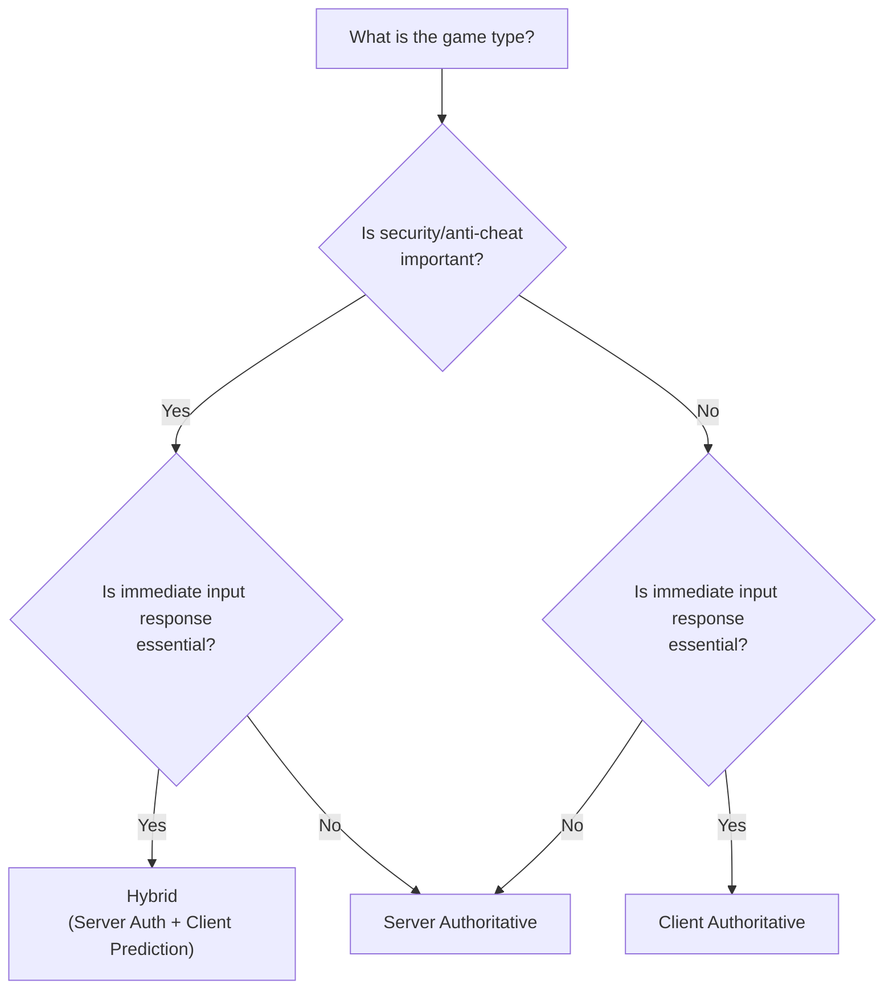

<br>

- So far, I have confirmed two NGO (Netcode for GameObjects) components that allow customizing the authoritative mode:

<br>

1. **NetworkAnimator**
2. **NetworkTransform**

<br>
<br>

```csharp
public class OwnerNetworkAnimator : NetworkAnimator
{
    protected override bool OnIsServerAuthoritative()
    {
        return false;
    }
}
```

<br>

```csharp
public class OwnerNetworkTransform : NetworkTransform
{
    protected override bool OnIsServerAuthoritative()
    {
        return false;
    }
}
```

<br>

- By attaching these derived components instead of the default `NetworkAnimator` or `NetworkTransform`, you can use "Custom Authoritative Modes."

- `return false` → Switch to Owner/Client Authoritative Mode.
- `return true` → Maintain Server Authoritative Mode.

<br>
<br>

---

<br>

## Server Authoritative Mode

- In Server Authoritative Mode, the client's role is to send packets with relevant data via Input (keystrokes, camera rotation, etc.) to the server. The final decisions on physics calculations, logic, and gameplay are made on the server.

<br>

{: : width="1000" .normal }    
_The server makes the final gameplay decisions._

<br>

#### Advantages of Server Authoritative Mode

- **Good for world consistency**
> - Since the server makes all gameplay decisions, actions like a player opening a door or a bot attacking a player happen consistently.
> - If client authority were used, a decision made by Client A and one by Client B would each be delayed by **RTT (Round Trip Time)**, leading to synchronization issues.
> - For example, Client A might attack Client B, but Client B might have already moved behind cover. If all game logic is processed on a single server, consistency can be maintained.

<br>

- **Good for security**
> - Critical data (character stats, position, etc.) can be managed with server authority, preventing cheaters from modifying this data.

<br>
<br>

#### Disadvantages of Server Authoritative Mode

- **Reactivity**
> - The user has to wait for the full RTT: Input → Latency to Server → Server Logic Execution → Latency back to Client.
> - This can make the game feel unresponsive or sluggish to the user.

<br>
<br>

#### Characteristics of Server Authoritative Mode

- In short, you can think of the client in Server Authoritative Mode as only performing user input, data transmission, and rendering.
- NGO is built on server authority, so only the server can use `NetworkVariables`.
- However, when accepting RPCs from clients, you must add validation checks because these RPCs come from untrusted sources.

<br>
<br>

---

<br>

## Owner/Client Authoritative Mode

- While the server still acts as a hub sharing the world state, the client owns its own reality (position, data) and enforces it on the server and other clients.

<br>

{: : width="1000" .normal }    
_The client makes the final gameplay decisions._

<br>

#### Advantages of Client Authoritative Mode

- **Good for Reactivity**
> - While Server Authoritative Mode involves sending input to the server and waiting for results, Client Authoritative Mode processes input and calculation on the client and sends the results to the server.
> - For example, in an FSM, all logic for states can be calculated on the client, and only the current State value needs to be synced to the server.
> - Thus, the server only acts to relay client information to other clients.

<br>
<br>

#### Disadvantages of Client Authoritative Mode

- **Issue: World consistency**
> - Games using client authority can suffer from **"synchronization issues."** A client might think their character moved safely, but in the meantime, an enemy might have stunned them.
> - In other words, the enemy stunned my character in a world different from what I was seeing.
> - If a client makes **"authoritative"** decisions using outdated information, it leads to many problems like desyncs and overlapping physics objects.

<br>
<br>

- **Ownership race conditions**
> - If multiple clients can affect the same shared object, it leads to race conditions and potentially massive chaos.
>       
> - **Multiple clients try to enforce their own reality (calculations, logic) on a common object.**
> - To prevent this, since the server controls ownership, clients should request ownership from the server, wait for it, and then execute the desired client-authoritative logic.

<br>

{: : width="1000" .normal }    
_When enforcing logic without requesting ownership_

<br>

{: : width="1000" .normal }    
_When adding an ownership request_

<br>
<br>

#### Characteristics of Client Authoritative Mode

- Client authority is risky for server-hosted games. Malicious players could cheat or manipulate the match to win.
- However, since the client makes major gameplay decisions, it has the advantage of displaying user input results immediately without waiting hundreds of milliseconds.

- If players have no reason to cheat, Client Authoritative Mode is a great way to increase responsiveness without complex input prediction techniques.

- While Client Authoritative Mode is worth considering for PVE games, I believe Server Authoritative Mode is inevitable for PVP games.

<br>
<br>

---

<br>

## Summary

{: : width="1000" .normal }    

<br>
<br>

---

<br>

## Before Deciding the Authority Mode for Your Project

- Choosing an authority mode is one of the most critical architectural decisions to make early in a project. Changing it later might require rewriting the entire networking code, so consider the game genre and requirements carefully.

<br>

#### Authority Mode Guide by Game Genre

<br>



<br>

| Game Type | Recommended Mode | Reason | Examples |
|:---|:---|:---|:---|
| **FPS / TPS** | Server Auth + Prediction | Anti-cheat essential, responsiveness critical | Overwatch, Valorant |
| **MOBA / RTS** | Server Auth | Click-to-move tolerates some latency | LoL, Starcraft |
| **Party / Casual** | Mixed | Depends on gameplay specifics | Fall Guys |
| **Co-op PVE** | Client Auth | No incentive to cheat, responsiveness first | Outward, It Takes Two |
| **Sandbox** | Client Auth | Freedom first, weak win/loss concept | Minecraft, Roblox |

<br>

#### Hybrid Approach

- In practice, rather than using a single mode, it is common to **mix authority modes per component**.

- For example, set player movement (`NetworkTransform`) and animation (`NetworkAnimator`) to **Client Authority** for immediate responsiveness, while managing game logic data like health or items (`NetworkVariable`) with **Server Authority** for security.

<br>

```
[Client Authority]                   [Server Authority]
├── NetworkTransform (Move)         ├── HP, Stats (NetworkVariable)
├── NetworkAnimator (Anim)          ├── Item Pickup/Use Logic
└── Camera Rotation                 ├── Win Condition Check
                                    └── Spawn/Despawn Management
```

<br>

#### Latency Compensation Techniques

- There are standard techniques to solve responsiveness issues in Server Authoritative Mode.

<br>

| Technique | Description | Target |
|:---|:---|:---|
| **Client-Side Prediction** | Client predicts and reflects input immediately without waiting for server. Corrects upon server response. | Movement, Jumping |
| **Server Reconciliation** | If server response differs from client prediction, rewinds client state to server state and replays. | Used with Client-Side Prediction |
| **Entity Interpolation** | Interpolates positions of other players for smooth display. | Remote Player Rendering |
| **Lag Compensation** | Server rewinds to past positions based on attacker's RTT for hit detection. | Shooting, Hit Detection |

<br>

> For more on latency compensation, I recommend the [Unity Official Docs - Dealing with Latency](https://docs-multiplayer.unity3d.com/netcode/current/learn/dealing-with-latency/).
{: .prompt-tip }

<br>
<br>

---

<br>

## Conclusion

- There is no single correct answer for authority modes. Server Authoritative Mode provides consistency and security, while Client Authoritative Mode offers responsiveness and simplicity. The key is to make a **firm decision early** by comprehensively considering the project's genre, security requirements, and the target platform's network environment.

- In my personal experience, a hybrid approach—adopting Server Authority as the base but separating immediate feedback elements like player movement and animation into Client Authority—was the most practical. Rather than designing a perfect architecture from scratch, I recommend testing both modes during the prototype phase to find the right balance for your project.
