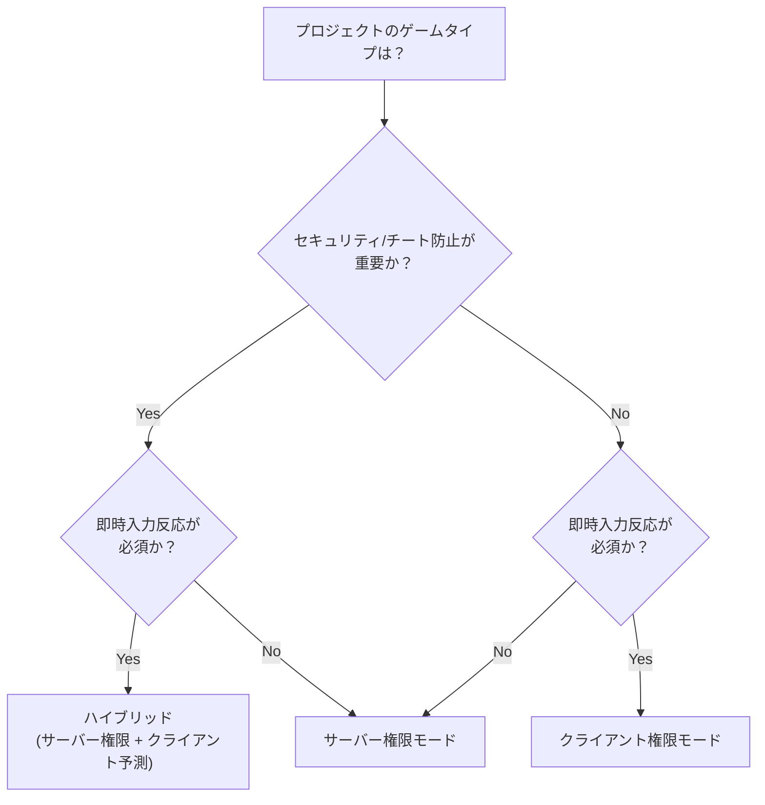

<br>

- これまで確認したところ、権限モード（Authoritative Mode）をカスタマイズできる NGO (Netcode for GameObjects) コンポーネントは、以下の2つです。

<br>

1. **NetworkAnimator**
2. **NetworkTransform**

<br>
<br>

```csharp
public class OwnerNetworkAnimator : NetworkAnimator
{
    protected override bool OnIsServerAuthoritative()
    {
        return false;
    }
}
```

<br>

```csharp
public class OwnerNetworkTransform : NetworkTransform
{
    protected override bool OnIsServerAuthoritative()
    {
        return false;
    }
}
```

<br>

- デフォルトの `NetworkAnimator` や `NetworkTransform` コンポーネントの代わりに、これらを継承した上記のコンポーネントをアタッチすることで、「カスタム権限モード」を使用できます。

- `return false` → 所有者/クライアント権限モードに変更
- `return true` → サーバー権限モードを維持

<br>
<br>

---

<br>

## サーバー権限モード (Server Authoritative Mode)

- サーバー権限モードでは、クライアントの役割は Input（キー入力、カメラ回転など）を通じて関連データをパケットとしてサーバーに送信することです。物理演算、ロジック、ゲームプレイに関する最終決定はサーバーで行われます。

<br>

{: : width="1000" .normal }    
_サーバーが最終的なゲームプレイの決定を下します。_

<br>

#### サーバー権限モードのメリット

- **ワールドの整合性維持に有利 (Good for world consistency)**
> - サーバーがすべてのゲームプレイ決定を下すため、プレイヤーがドアを開けたり、ボットがプレイヤーを攻撃したりといった決定が一貫して行われます。
> - もしクライアント権限を使用する場合、クライアントAが下した決定とクライアントBが下した決定がそれぞれ **RTT (Round Trip Time)** 分だけ遅延し、これにより同期の問題が発生することになります。
> - 例えば、AがBを攻撃したのに、すでにBが遮蔽物の後ろに隠れていた、といった問題が発生する可能性があります。しかし、これらすべてのゲームロジックが一つのサーバーで処理されれば、整合性を維持できます。

<br>

- **セキュリティ強化 (Good for security)**
> - 重要なデータ（キャラクターステータス、位置など）をサーバー権限で管理できるため、不正行為者がそのデータを改ざんするのを防ぐことができます。

<br>
<br>

#### サーバー権限モードの問題点

- **反応性 (Reactivity)**
> - ユーザーが入力を入れる → サーバーまでのレイテンシ発生 → サーバーロジック実行 → 返ってくるレイテンシ発生 まで、全体のRTTを待たなければなりません。
> - これにより反応が遅れて見え、ユーザーにストレスを与える可能性があります。

<br>
<br>

#### サーバー権限モードの特徴

- 極端に言えば、サーバー権限モードでのクライアントは、ユーザー入力、入力データ送信、レンダリングの役割のみを担うと考えれば良いでしょう。
- NGO はサーバー権限を基盤として構成されているため、サーバーのみが `NetworkVariables` を使用できます。
- ただし、クライアントから来る RPC を受け入れる際は、その RPC が信頼できない送信元から来るものであるため、必ず妥当性検証（Validation）を追加する必要があります。

<br>
<br>

---

<br>

## 所有者/クライアント権限モード (Owner/Client Authoritative Mode)

- サーバーは依然としてワールドの状態を共有するハブの役割を果たしますが、クライアントが自身の現実（位置、データ）を所有し、これをサーバーや他のクライアントに強制することになります。

<br>

{: : width="1000" .normal }    
_クライアントが最終的なゲームプレイの決定を下します。_

<br>

#### クライアント権限モードのメリット

- **反応性の向上 (Good for Reactivity)**
> - サーバー権限モードではユーザー入力をサーバーに送り、サーバーでロジックを計算して結果を受け取っていたのに対し、クライアント権限モードでは入力と計算をクライアントで処理し、結果をサーバーに送ると考えれば良いでしょう。
> - 例えば、FSMにおいてすべてのStateに対するロジックはクライアントで計算し、現在のState値だけをサーバーに同期すれば済みます。
> - したがって、サーバーはクライアントの情報を他のクライアントに伝達する役割のみを担うことになります。

<br>
<br>

#### クライアント権限モードの問題点

- **整合性の問題 (Issue: World consistency)**
> - クライアント権限を使用するゲームでは、**「同期ズレ」**が発生する可能性があります。クライアント側ではキャラクターが移動しても何の問題もないと思っていても、その間に敵が自分のキャラクターを気絶させていたかもしれません。
> - つまり、敵は自分が見ているのとは異なる世界で、自分のキャラクターを気絶させたことになります。
> - もしクライアントが古い情報を使用して**「権限のある」**決定を下すことを許せば、同期ズレや物理オブジェクトの重なりといった多くの問題に直面することになります。

<br>
<br>

- **所有権の競合状態 (Ownership race conditions)**
> - 複数のクライアントが同一の共有オブジェクトに影響を与えることができる場合、これは競合状態（Race Condition）に突入し、大きな混乱を引き起こす可能性があります。
>       
> - **多数のクライアントが共通オブジェクトに対して、それぞれの現実（計算、ロジック）を強制しようとします。**
> - これを防ぐためには、サーバーが所有権を制御しているため、競合を防ぐためにクライアントはサーバーに所有権をリクエストし、所有権を待ってから、希望するクライアント権限ロジックを実行するようにしなければなりません。

<br>

{: : width="1000" .normal }    
_権限リクエストなしに自分のロジックを強制した場合_

<br>

{: : width="1000" .normal }    
_権限リクエストを追加した場合_

<br>
<br>

#### クライアント権限モードの特徴

- クライアント権限は、サーバーホスティング主体のゲームでは危険な方法です。悪意のあるプレイヤーがチートを行ったり勝敗を操作してゲームに勝利できてしまうからです。
- しかし、クライアントが主要なゲームプレイ決定を下すため、ユーザーの入力結果を数百ミリ秒待つ必要なく、即座に表示できるというメリットがあります。

- プレイヤーがチートする動機がない場合、クライアント権限モードは複雑な入力予測技術なしで反応性を高める良い方法です。

- PVEゲームではクライアント権限モードを十分に検討できますが、PVPゲームではサーバー権限モードが必然的だと考えます。

<br>
<br>

---

<br>

## まとめ

{: : width="1000" .normal }    

<br>
<br>

---

<br>

## プロジェクトの権限モードを決定する前に

- 権限モードの選択は、プロジェクト初期に下すべき最も重要なアーキテクチャ決定の一つです。後から変更しようとするとネットワーク関連コード全体を書き直すことになる可能性があるため、ゲームのジャンルと要件を十分に考慮した上で決定する必要があります。

<br>

#### ゲームジャンル別 権限モードガイド

<br>



<br>

| ゲームタイプ | 推奨モード | 理由 | 代表的なゲーム |
|:---|:---|:---|:---|
| **FPS / TPS** | サーバー権限 + 予測 | チート防止必須、反応性も重要 | Overwatch, Valorant |
| **MOBA / RTS** | サーバー権限 | クリック移動なのである程度の遅延は許容 | LoL, Starcraft |
| **パーティ / カジュアル** | 状況に応じて混合 | ゲームタイプによる | Fall Guys |
| **協力 PVE** | クライアント権限 | チート動機なし、反応性優先 | Outward, It Takes Two |
| **サンドボックス** | クライアント権限 | 自由度優先、勝敗の概念が薄い | Minecraft, Roblox |

<br>

#### ハイブリッドアプローチ

- 実務では、一つのモードだけを使用するよりも、**コンポーネントごとに権限モードを混合**するケースが多いです。

- 例えば、プレイヤーの移動 (`NetworkTransform`) とアニメーション (`NetworkAnimator`) は **クライアント権限** に設定して即時の反応性を確保し、体力やアイテムといった **ゲームロジックデータ (`NetworkVariable`) はサーバー権限** で管理してセキュリティを維持する方式です。

<br>

```
[クライアント権限]                   [サーバー権限]
├── NetworkTransform (移動)         ├── HP, ステータス (NetworkVariable)
├── NetworkAnimator (アニメ)        ├── アイテム獲得/使用ロジック
└── カメラ回転                       ├── 勝利条件判定
                                    └── スポーン/デスポーン管理
```

<br>

#### レイテンシ補償技術

- サーバー権限モードにおける反応性の問題を解決するための代表的な技術があります。

<br>

| 技術 | 説明 | 適用対象 |
|:---|:---|:---|
| **Client-Side Prediction** | クライアントがサーバー応答を待たずに入力結果を予測して即時反映。サーバー応答が来たら補正。 | 移動、ジャンプなど |
| **Server Reconciliation** | サーバーの応答とクライアントの予測が異なる場合、サーバー状態を基準にクライアント状態を巻き戻して（rewind）補正。 | Client-Side Predictionと共に使用 |
| **Entity Interpolation** | 他のプレイヤーの位置を補間して滑らかに表示。 | リモートプレイヤーの描画 |
| **Lag Compensation** | サーバーがヒット判定時に攻撃者のRTTを考慮して過去時点の位置へ巻き戻して判定。 | 射撃判定、ヒット判定 |

<br>

> レイテンシ補償技術に関する詳細は、[Unity公式ドキュメント - Dealing with Latency](https://docs-multiplayer.unity3d.com/netcode/current/learn/dealing-with-latency/) を参照することをお勧めします。
{: .prompt-tip }

<br>
<br>

---

<br>

## 最後に

- 権限モードに絶対の正解はありません。サーバー権限モードは一貫性とセキュリティを、クライアント権限モードは反応性と簡潔さを提供します。重要なのは、プロジェクトのジャンル、セキュリティ要件、ターゲットプラットフォームのネットワーク環境を総合的に考慮して、**初期に確実な決定を下すこと**です。

- 個人的な経験では、サーバー権限モードを基本として採用しつつ、プレイヤーの移動やアニメーションのように即時の反応が必要な部分だけをクライアント権限に分離するハイブリッド方式が最も実用的でした。完璧なアーキテクチャを最初から設計するよりは、プロトタイプ段階で両方のモードをテストし、プロジェクトに合ったバランス点を見つけることをお勧めします。
