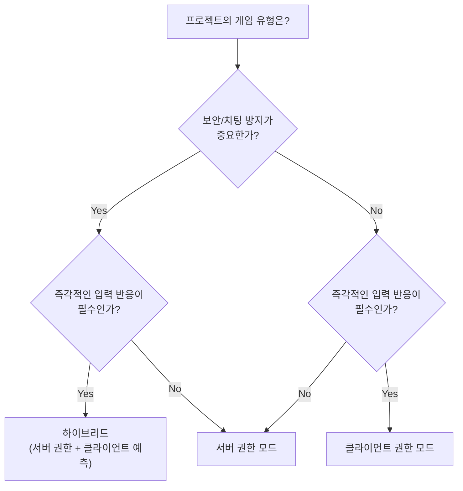

<br>

- 지금까지 확인한 바로는 권한 모드를 커스텀 할 수 있는 NGO(Netcode for GameObject) 컴포넌트는 다음 두 가지이다.

<br>

1. **NetworkAnimator**
2. **NetworkTransform**

<br>
<br>

```csharp
public class OwnerNetworkAnimator : NetworkAnimator
{
    protected override bool OnIsServerAuthoritative()
    {
        return false;
    }
}
```

<br>

```csharp
public class OwnerNetworkTransform : NetworkTransform
{
    protected override bool OnIsServerAuthoritative()
    {
        return false;
    }
}
```

<br>

- NetworkAnimator, NetworkTransform 컴포넌트 대신 해당 컴포넌트를 상속받은 위 두 컴포넌트를 부착해주면 "커스텀 권한 모드"를 사용할 수 있다.

- `return false` → 소유자/클라이언트 권한 모드 변경
- `return true` → 서버 권한 모드 유지

<br>
<br>

---

<br>

## Server Authoritative Mode (서버 권한 모드)

- 서버 권한 모드에서 클라이언트의 역할은 Input (키 입력, 카메라 회전 등) 을 통해 관련된 데이터들을 서버에 패킷을 보내고 물리 연산, 로직, 게임 플레이에 대한 최종 결정은 서버에서 이루어진다.

<br>

{: : width="1000" .normal }    
_서버가 최종 게임 플레이 결정을 내린다._

<br>

#### 서버 권한 모드의 장점

- **Good for world consistency (일관된 월드 상태 유지)**
> - 서버가 모든 게임 플레이 결정을 내리기 때문에, 플레이어가 문을 열거나 봇이 플레이어를 공격하는 등의 결정이 동시에 이루어진다.       
> - 만약 클라이언트 권한을 사용할 경우, 클라이언트 A 에서 내린 결정과 클라이언트 B에서 내린 결정이 각각 **RTT(Rount Trip Time)** 만큼 지연되며, 이로인해 동기화 문제가 발생하게 된다.     
> - 예를 들어, A 가 B를 공격했는데, 이미 B가 엄폐물 뒤에 숨은 경우와 같은 문제가 발생할 수 있다. 그러나 이런 모든 게임 로직이 하나의 서버에서 처리된다면 일관성을 유지할 수 있다.

<br>

- **Good for security (보안 강화)**
> - 중요한 데이터 (캐릭터 스테이터스, 포지션 등)는 서버 권한으로 관리가 가능하며, 이를 통해 부정행위자가 해당 데이터를 변경하지 못하게 막을 수 있다.

<br>
<br>

#### 서버 권한 모드의 문제점

- **Reactivity (반응성)**
> - 유저가 인풋을 입력하고 → 서버까지 레이턴시 발생 → 서버 로직 실행 → 되돌아오는 레이턴시 발생까지 전체 RTT를 기다려야 한다.     
> - 이로 인해 반응성이 늦게 보일 수 있으며 유저에게 답답하게 느껴질 수 있다.

<br>
<br>

#### 서버 권한 모드의 특징

- 단적으로, 서버 권한 모드에서의 클라이언트는 오직 유저 입력과 입력 데이터 전송, 렌더링 역할만 수행한다고 보면 된다.
- NGO 는 서버 권한을 기반으로 구성되어 있어서 서버만이 NetworkVariables 를 사용할 수 있다.
- 하지만 클라이언트로부터 오는 RPC를 수락할 때는 해당 RPC가 신뢰할 수 없는 출처에서 오는 것이므로 반드시 유효성 검사를 추가해야한다.

<br>
<br>

---

<br>

## Owner/Client Authoritative Mode (소유자/클라이언트 권한 모드)

- 서버가 여전히 월드 상태를 공유하는 허브 역할을 하지만, 클라이언트가 자신의 현실(위치, 데이터)을 소유하고 이를 서버와 다른 클라이언트들에게 강요하게 된다.

<br>

{: : width="1000" .normal }    
_클라이언트가 최종 게임 플레이 결정을 내린다._

<br>

#### 클라이언트 권한 모드의 장점

- **Good for Reactivity (반응성 향상)**
> - 서버 권한 모드에서는 유저 입력을 서버에 보내고 서버에서 로직을 계산하고 결과를 받았다면, 클라이언트 권한 모드에서는 입력과 계산을 클라이언트에서 처리하고 결과를 서버에 보내준다고 생각하면 된다.      
> - 예를 들어, FSM 에서 모든 State 들에 대한 로직은 클라이언트에서 계산하고 현재 State 값만 서버에 동기화 해주면 된다.      
> - 따라서, 서버는 오직 클라이언트의 정보를 다른 클라이언트들에게 전달하는 역할만 하게 된다.

<br>
<br>

#### 클라이언트 권한 모드의 문제점

- **Issue: World consistency (일관성 문제)**
> - 클라이언트 권한을 사용하는 게임에서는 **"동기화 문제"**가 발생할 수 있다. 클라이언트 측에서 캐릭터가 이동할 때 아무 문제가 없다고 생각할 수 있지만, 그 동안 적이 내 캐릭터를 기절 시켰을 수 있다.     
> - 즉, 적은 내가 보고 있는 것과는 다른 세계에서 내 캐릭터를 기절시킨 것이다.    
> - 만약, 클라이언트가 오래된 정보를 사용하여 **"권한 있는"** 결정을 내리게 한다면, 동기화 문제, 물리 객체의 중첩과 같은 많은 문제에 직면하게 될 것이다.

<br>
<br>

- **Ownership race conditions (경쟁 상태 돌입)**
> - 여러 클라이언트가 동일한 공유 오브젝트에 영향을 줄 수 있을 경우, 이는 경쟁 상태에 돌입하게 되고 크나큰 혼란을 일으킬 수 있다.      
>       
> - **다수의 클라이언트가 공통 오브젝트에 자신들의 현실(계산,로직)을 강요하려고 한다.**      
> - 이를 방지하기 위해서는 서버가 소유권을 제어하고 있으므로 경쟁 상태를 방지하기 위해 클라이언트들은 서버에 소유권을 요청하고, 소유권을 기다린 후, 원하는 클라이언트 권한 로직을 실행하도록 해야한다.

<br>

{: : width="1000" .normal }    
_권한 요청 없이 자신이 로직을 강요했을 때_

<br>

{: : width="1000" .normal }    
_권한 요청을 추가 했을 때._

<br>
<br>

#### 클라이언트 권한 모드의 특징

- 클라이언트 권한은 서버 호스팅 위주의 게임에서는 위험한 방법이다. 악의적인 플레이어가 치팅하거나 승부를 조작하여 게임에서 승리할 수 있기 때문이다.
- 그러나 클라이언트가 주요한 게임 플레이 결정을 내리기 때문에, 사용자의 입력 결과를 몇백 밀리초를 기다릴 필요 없이 즉시 표시가 가능하다는 장점이 있다.


- 플레이어가 치트할 이유가 없을 경우 클라이언트 권한 모드는 복잡한 입력 예측 기술 없이 반응성을 높일 수 있는 좋은 방법이다.


- PVE 게임에서는 클라이언트 권한 모드를 충분히 고려할 수 있지만, PVP 게임에서는 서버 권한 모드가 필연적이라고 생각한다.

<br>
<br>

---

<br>

## 정리

{: : width="1000" .normal }    

<br>
<br>

---

<br>

## 프로젝트에 권한 모드를 결정하기에 앞서

- 권한 모드의 선택은 프로젝트 초반에 내려야 하는 가장 중요한 아키텍처 결정 중 하나다. 나중에 변경하려면 네트워크 관련 코드 전체를 뒤흎어야 할 수 있으므로, 게임의 장르와 요구사항을 충분히 고려한 뒤 결정해야 한다.

<br>

#### 게임 장르별 권한 모드 가이드

<br>



<br>

| 게임 유형 | 권장 모드 | 이유 | 대표 게임 |
|:---|:---|:---|:---|
| **FPS / TPS** | 서버 권한 + 클라이언트 예측 | 치팅 방지 필수, 반응성도 중요 | 오버워치, 발로란트 |
| **MOBA / RTS** | 서버 권한 | 클릭 기반 이동이라 레이턴시 허용 가능 | LoL, 스타크래프트 |
| **파티 / 캐주얼** | 상황에 따라 혼합 | 게임 유형에 따라 다름 | Fall Guys |
| **협동 PVE** | 클라이언트 권한 | 치팅 동기 없음, 반응성 우선 | 아웃워드, It Takes Two |
| **샌드박스** | 클라이언트 권한 | 자유도 우선, 승패 개념 약함 | 마인크래프트, 로블록스 |

<br>

#### 하이브리드 접근법

- 실무에서는 한 가지 모드만 사용하기보다, **컴포넌트별로 권한 모드를 혼합**하는 경우가 많다.

- 예를 들어, 플레이어의 이동(NetworkTransform)과 애니메이션(NetworkAnimator)은 **클라이언트 권한**으로 설정하여 즉각적인 반응성을 확보하고, 체력이나 아이템 같은 **게임 로직 데이터(NetworkVariable)는 서버 권한**으로 관리하여 보안을 유지하는 방식이다.

<br>

```
[클라이언트 권한]                    [서버 권한]
├── NetworkTransform (이동)         ├── HP, 스탯 (NetworkVariable)
├── NetworkAnimator (애니메이션)     ├── 아이템 획득/사용 로직
└── 카메라 회전                      ├── 승리 조건 판정
                                    └── 스폰/디스폰 관리
```

<br>

#### 레이턴시 보상 기법

- 서버 권한 모드에서 반응성 문제를 해결하기 위한 대표적인 기법들이 있다.

<br>

| 기법 | 설명 | 적용 대상 |
|:---|:---|:---|
| **Client-Side Prediction** | 클라이언트가 서버 응답을 기다리지 않고 입력 결과를 예측하여 즉시 반영. 서버 응답이 오면 보정 | 이동, 점프 등 |
| **Server Reconciliation** | 서버의 응답과 클라이언트 예측이 다를 경우, 서버 상태를 기준으로 클라이언트 상태를 되감기(rewind)하여 보정 | Client-Side Prediction과 함께 사용 |
| **Entity Interpolation** | 다른 플레이어의 위치를 보간하여 부드럽게 표시 | 리모트 플레이어 렌더링 |
| **Lag Compensation** | 서버가 히트 판정 시 공격자의 RTT를 고려하여 과거 시점의 위치로 되감아 판정 | 공격 판정, 히트 판정 |

<br>

> 레이턴시 보상 기법에 대한 더 자세한 내용은 [Unity 공식 문서 - Dealing with Latency](https://docs-multiplayer.unity3d.com/netcode/current/learn/dealing-with-latency/)를 참조하는 것을 추천한다.
{: .prompt-tip }

<br>
<br>

---

<br>

## 마무리

- 권한 모드에 정답은 없다. 서버 권한 모드는 일관성과 보안을, 클라이언트 권한 모드는 반응성과 간결함을 제공한다. 중요한 것은 프로젝트의 장르, 보안 요구사항, 타겟 플랫폼의 네트워크 환경을 종합적으로 고려하여 **초기에 확실한 결정을 내리는 것**이다.

- 개인적인 경험으로는, 서버 권한 모드를 기본으로 채택하되 플레이어의 이동과 애니메이션처럼 즉각적인 반응이 필요한 부분만 클라이언트 권한으로 분리하는 하이브리드 방식이 가장 실용적이었다. 완벽한 아키텍처를 처음부터 설계하기보다는, 프로토타입 단계에서 두 모드를 모두 테스트해보고 프로젝트에 맞는 균형점을 찾는 것을 권장한다.


