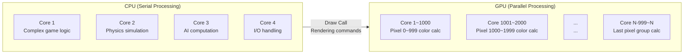
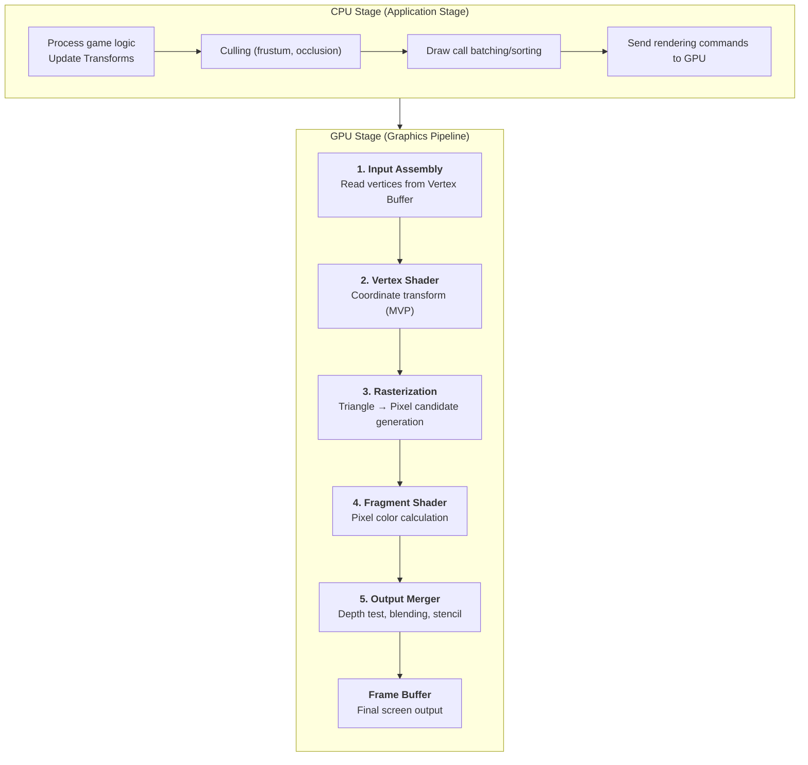
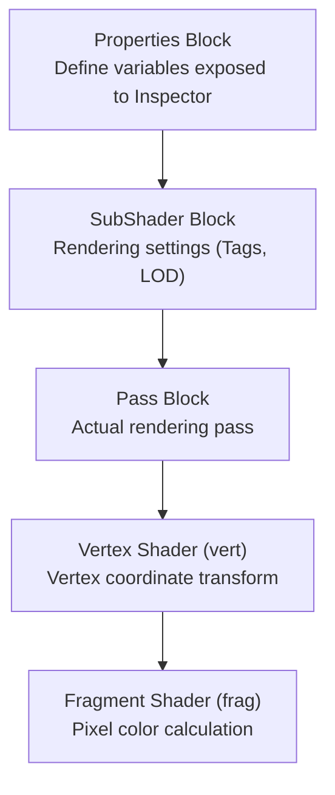
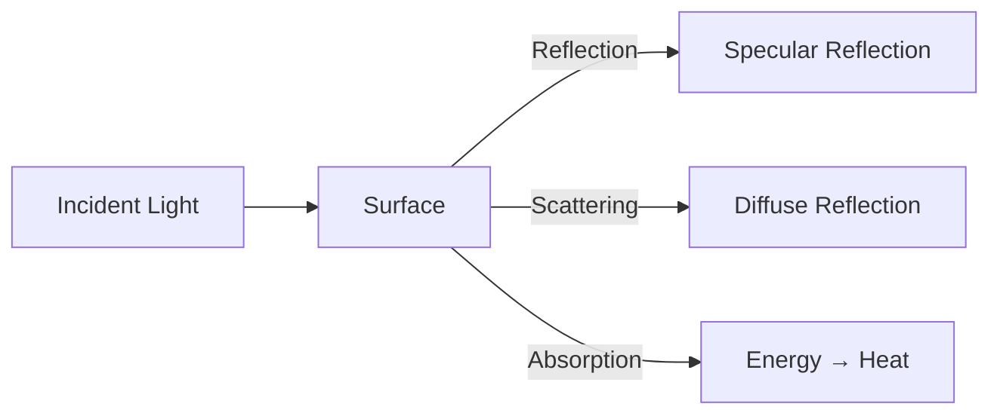
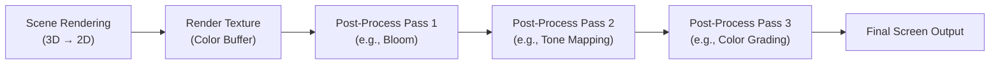
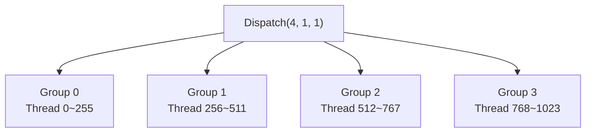
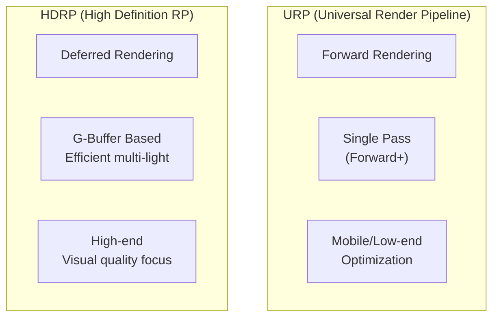

## Introduction

For game developers, shaders often feel like a "realm of magic." You adjust a slider in Unity's Material Inspector and objects shimmer, change color, or become translucent—yet what exactly happens under the hood often remains a mystery.

Understanding shaders means understanding **"how the GPU determines each and every pixel on the screen."** This goes far beyond creating pretty effects—it cultivates the ability to solve problems across performance optimization, rendering debugging, and the entire field of technical art.

This document progressively deepens from the fundamental principles of shaders to implementations in both Unity and Unreal Engine. It's structured so you can follow along even if you're not familiar with graphics programming.

---

## Part 1: The Essence of Shaders

Before studying shaders, there's a fundamental question to answer first: "What exactly is a shader?" and "Why do we need separate hardware called a GPU?" This part covers the identity of shaders and the characteristics of the hardware they run on.

### 1. What Is a Shader?

A Shader is **a program that runs on the GPU**. It serves to transform vertex positions or calculate the final color of pixels within the 3D or 2D graphics pipeline.

"Making on-screen results look beautiful" captures the purpose of shaders well, but in practice, they encompass a much wider range of functionality.

| What Shaders Do | Specific Examples |
| --- | --- |
| Vertex position transformation | Projecting objects to screen coordinates |
| Lighting calculations | Determining surface brightness based on light direction, intensity, and color |
| Texture mapping | Applying 2D images onto 3D surfaces |
| Shadow processing | Shadow Map generation and sampling |
| Post-processing effects | Bloom, HDR Tone Mapping, SSAO |
| Vertex animation | Grass swaying in the wind, wave simulation |
| Special effects | Dissolve, hologram, distortion, outline |

The key point is that shaders **run on the GPU, not the CPU**. This difference is not merely a hardware choice—it's a fundamental difference that changes the very programming paradigm.

---

### 1-1. CPU vs GPU: Why the GPU?

The CPU is a **master of serial processing**. Equipped with complex branching logic, diverse instruction sets, and large caches, it excels at general-purpose computation. The GPU, on the other hand, is a **master of parallel processing**. It performs simple operations simultaneously across thousands to tens of thousands of cores.

Rendering a screen ultimately means **calculating the color of each of millions of pixels**. At 1920×1080 resolution, that's approximately 2 million pixels. These calculations are mostly independent of each other—determining the color of pixel A doesn't require the result of pixel B. This is precisely where the GPU shines.



| Characteristic | CPU | GPU |
| --- | --- | --- |
| Core count | 4–16 (typical) | Thousands to tens of thousands |
| Per-core capability | High performance (complex branching) | Low performance (specialized for simple operations) |
| Suitable tasks | Game logic, AI, physics | Pixel calculations, matrix operations |
| Analogy | 4 genius math professors | Thousands of students who can do basic arithmetic |

The CPU is like 4 genius professors solving difficult problems sequentially, while the GPU is like thousands of students who only know addition and multiplication, each computing one problem simultaneously. Rendering is a task overwhelmingly suited to the latter approach.

> **Q. If GPU cores are simple, can't you write complex logic in shaders?**
>
> You can, but the performance cost is significant. GPU cores dislike branching (if-else). GPUs are most efficient when all threads within the same warp (a group of 32 threads on NVIDIA) execute the same instruction. When branching occurs, some threads must wait, degrading performance. This is called **Warp Divergence**. The common advice to reduce if-statements in shaders originates from this.
{: .prompt-info}

---

### 1-2. Types of Shaders

In the graphics pipeline, shaders execute at different stages, each with clearly distinguished roles. The two most fundamental are the **Vertex Shader** and the **Fragment (Pixel) Shader**.


| Shader Type | Execution Unit | Role | Analogy |
| --- | --- | --- | --- |
| **Vertex Shader** | Once per vertex | 3D coords → Screen coords transform | Building the skeleton of a building |
| **Fragment Shader** | Once per pixel candidate | Determining the final color | Painting the walls |
| Geometry Shader | Once per primitive | Adding/removing geometry | Building extensions (rarely used) |
| Tessellation Shader | Once per patch | Mesh subdivision | Increasing LOD detail |
| Compute Shader | Arbitrary thread groups | General-purpose GPU computation | Any computation on the GPU |

Most shader work takes place in Vertex Shaders and Fragment Shaders. Deeply understanding these two is the core of shader programming.

---

## Part 2: The Rendering Pipeline

Shaders don't operate in isolation. They execute within a defined flow called the **rendering pipeline**, each taking responsibility for its own stage. Without understanding this pipeline, it's difficult to grasp "why shader code must be written this way."

### 2. The Full Rendering Pipeline Flow

The process of drawing a 3D object on screen is called the **rendering pipeline**. In terms familiar to game programmers, **just as the game loop on the CPU runs every frame, the rendering pipeline on the GPU also executes every frame.**



Let's examine each stage one by one.

---

### 2-1. Input Assembly

The first thing the GPU does is **read vertex data from the Vertex Buffer**. A mesh created in a 3D modeling tool is ultimately a collection of vertices, and each vertex contains the following information:

| Vertex Attribute | Description | Example Value |
| --- | --- | --- |
| Position | Position in object space | (1.0, 2.5, -0.3) |
| Normal | Normal vector pointing outward from the surface | (0.0, 1.0, 0.0) |
| Tangent | Tangent vector corresponding to the U direction of the UV | (1.0, 0.0, 0.0, 1.0) |
| UV (TexCoord) | 2D coordinates for texture mapping | (0.5, 0.75) |
| Color | Vertex color (optional) | (1.0, 0.0, 0.0, 1.0) |

These vertices are assembled into triangles through the **Index Buffer**. For example, a single quad is composed of 4 vertices and 6 indices (2 triangles).

```
Vertices: v0(0,0,0) v1(1,0,0) v2(1,1,0) v3(0,1,0)

Indices: [0,1,2] [0,2,3]
         ▲ Triangle 1  ▲ Triangle 2

v3 ─── v2
│ ╲    │     ← Two triangles forming a quad
│   ╲  │
v0 ─── v1
```

The reason **triangles are the fundamental primitive** in graphics is that three points always define a single plane. A quadrilateral's four points may not be coplanar, making rendering ambiguous.

---

### 2-2. Vertex Shader: The Heart of Coordinate Transformation

The core role of the Vertex Shader is **Coordinate Transformation**. It must ultimately transform 3D object vertex positions into screen coordinates. This process passes through several coordinate systems.

#### Coordinate Transformation Order (MVP Transform)

```mermaid
flowchart LR
    A["<b>Object Space</b><br/>Relative to object origin<br/>Model's local coordinates"]
    B["<b>World Space</b><br/>Relative to game world<br/>Absolute scene coordinates"]
    C["<b>View Space</b><br/>Relative to camera<br/>Camera at origin"]
    D["<b>Clip Space</b><br/>After projection<br/>-w to +w range"]
    E["<b>NDC</b><br/>Normalized Device Coordinates<br/>-1 to +1 range"]
    F["<b>Screen Space</b><br/>Actual screen pixel coordinates"]

    A -->|"Model Matrix<br/>(M)"| B
    B -->|"View Matrix<br/>(V)"| C
    C -->|"Projection Matrix<br/>(P)"| D
    D -->|"Perspective Division<br/>(÷w)"| E
    E -->|"Viewport Transform"| F
```



This is the **MVP (Model-View-Projection) Transform**—the most frequently seen operation in shader code.

**Understanding each coordinate space intuitively:**

- **Object Space**: Coordinates as created in the modeling tool. For example, a character's feet at (0,0,0) and head at (0,1.8,0).
- **World Space**: Coordinates after placement in the scene. Transform's position, rotation, and scale are applied.
- **View Space**: A coordinate system where the camera is placed at the origin (0,0,0) and the viewing direction is set along the -Z axis. Note that OpenGL uses -Z while DirectX uses +Z as the camera's forward direction.
- **Clip Space**: Coordinates after applying the projection matrix. Here, **vertices outside the View Frustum are clipped**.
- **NDC (Normalized Device Coordinates)**: Clip coordinates divided by w, normalized to the -1 to +1 range. This is where **Perspective Division** occurs, creating the sense of depth.
- **Screen Space**: The final pixel coordinates mapping NDC to actual screen resolution (e.g., 1920×1080).

In HLSL code, this entire transformation is a single line:

```hlsl
// The core line of the Vertex Shader
float4 clipPos = mul(UNITY_MATRIX_MVP, float4(vertexPos, 1.0));
// = Projection * View * Model * vertexPosition
```

> **Q. Why does the Z-axis direction in View Space matter?**
>
> Unity uses a left-handed coordinate system where the camera's forward direction is +Z. OpenGL uses a right-handed coordinate system where the camera's forward direction is -Z. Unreal uses a left-handed coordinate system but with Z-up. These differences cause frequent sign-flip issues when porting shaders between engines. Most bugs where normal maps appear flipped or reflections appear in the wrong direction originate from this.
{: .prompt-warning}

---

### 2-3. Rasterization

Rasterization is **the process of determining "which pixels fall inside this triangle" by mapping the triangles output by the Vertex Shader onto the pixel grid of the screen.**

This stage is a **Fixed-Function** stage that programmers cannot directly control. The hardware handles it automatically.

```
Three triangle vertices (v0, v1, v2) already transformed to screen coordinates

    v2
   ╱  ╲           ← Triangle outline
  ╱    ╲
 ╱  ■■  ╲         ← ■ = Pixels included in this triangle (Fragments)
╱ ■■■■■■ ╲
v0 ──────── v1

For each ■ pixel (Fragment):
- Position: Calculated via interpolation between vertices
- Normal: Interpolated value of vertex Normals
- UV: Interpolated value of vertex UVs
- Others: Interpolated values of all data passed from vertices
```

The key is **Interpolation**. When a triangle's three vertices each have different Normal, UV, and Color values, each pixel within the triangle is calculated by appropriately blending the three vertex values using **Barycentric Coordinates**.

$$\text{P} = \alpha \cdot v_0 + \beta \cdot v_1 + \gamma \cdot v_2 \quad (\alpha + \beta + \gamma = 1)$$

Here, $\alpha$, $\beta$, $\gamma$ are weights representing how close the pixel is to each vertex. The closer to vertex $v_0$, the larger $\alpha$ becomes, and the more $v_0$'s data is reflected.

Each pixel candidate generated by the rasterizer is called a **Fragment**. This is exactly why the Fragment Shader is called the "Fragment" Shader—it processes **pixel candidates (Fragments)**, not final screen pixels. Some Fragments fail the Depth Test and never become actual pixels.

---

### 2-4. Fragment Shader: Determining Color

The Fragment Shader (= Pixel Shader in DirectX terminology) **determines the final color of each Fragment produced by the rasterizer**. This is where you'll spend the most time in shader programming.

What the Fragment Shader does:
1. **Texture sampling**: Reading colors from textures using UV coordinates
2. **Lighting calculation**: Determining brightness using light direction, surface normals, and camera direction
3. **Shadow processing**: Sampling the Shadow Map to determine shadow coverage
4. **Effect application**: Visual effects like rim light, Fresnel, dissolve, etc.

It receives interpolated data from the rasterizer (Normal, UV, Position, etc.) as input and returns a **float4 color (RGBA)** as output.

```hlsl
// The simplest Fragment Shader
float4 frag(v2f i) : SV_Target
{
    // Read color from texture
    float4 texColor = tex2D(_MainTex, i.uv);

    // Lighting calculation (Lambert)
    float NdotL = saturate(dot(i.normal, _WorldSpaceLightPos0.xyz));

    // Texture color × Lighting
    return texColor * NdotL;
}
```

---

### 2-5. Output Merger: Final Compositing

After the Fragment Shader outputs a color, the **Output Merger** stage makes the final decision about whether to write it to the frame buffer.

| Test | Role | Description |
| --- | --- | --- |
| **Depth Test** | Depth comparison | Discard this Fragment if a closer object already exists |
| **Stencil Test** | Masking | Pass/discard based on stencil buffer values |
| **Blending** | Color compositing | For translucent objects, blend existing and new colors |

Opaque objects are typically rendered in **front-to-back** order. Fragments of objects behind can be rejected early by the Depth Test (Early-Z), allowing the Fragment Shader execution itself to be skipped. This is a critically important performance optimization.

Translucent objects must be rendered in the opposite **back-to-front** order to achieve correct blending results. This is the Transparency Sorting Problem.

> **Q. Does overdraw affect performance?**
>
> Yes, it has a significant impact. When multiple objects overlap at the same pixel position, the Fragment Shader executes multiple times. Especially in scenes with many particles or translucent effects, the Fragment Shader may execute dozens of times for a single pixel. You can verify this by enabling **Overdraw visualization mode** in Unity's Scene View. On mobile, this is a primary cause of fill rate bottlenecks.
{: .prompt-info}

---

## Part 3: Coordinate Systems and Space Transformations

When reading shader code, you'll constantly encounter terms like `objectSpace`, `worldSpace`, `viewSpace`, and `tangentSpace`. Without properly understanding these "spaces," shader code will look like magical incantations. This part delves into the meaning of each space and the essence of transformation matrices.

### 3. What Matrices Do

In 3D graphics, matrices are **tools for coordinate transformation**. Moving positions (Translation), rotating (Rotation), and scaling (Scale)—all of these are accomplished through matrix multiplication.

A single 4×4 matrix can contain all three types of transformations:

$$
\begin{bmatrix}
\text{Scale} \times \text{Rotation} & \text{Translation} \\
0 \quad 0 \quad 0 & 1
\end{bmatrix}
=
\begin{bmatrix}
R_{00} \cdot S_x & R_{01} \cdot S_y & R_{02} \cdot S_z & T_x \\
R_{10} \cdot S_x & R_{11} \cdot S_y & R_{12} \cdot S_z & T_y \\
R_{20} \cdot S_x & R_{21} \cdot S_y & R_{22} \cdot S_z & T_z \\
0 & 0 & 0 & 1
\end{bmatrix}
$$

Why 4×4? 3D coordinates have three components (x, y, z), but to express **Translation as a matrix multiplication, Homogeneous Coordinates** are used. In (x, y, z, **w**), when w=1 it represents a position (Point), and when w=0 it represents a direction (Direction). Direction vectors should not be affected by translation, so w is set to 0.

```hlsl
// Matrix multiplication in shaders (Unity HLSL)
float4 worldPos = mul(unity_ObjectToWorld, float4(objectPos, 1.0)); // Position: w=1
float3 worldNormal = mul((float3x3)unity_ObjectToWorld, objectNormal); // Direction: only 3x3
```

> **Note**: Transforming normal vectors requires using the **Inverse Transpose of the Model matrix**. When non-uniform scale is applied to an object, simply multiplying by the Model matrix will cause normals to no longer be perpendicular to the surface. In Unity, you can use the transpose of `unity_WorldToObject` or the `TransformObjectToWorldNormal()` function.
{: .prompt-warning}

---

### 3-1. Tangent Space

To use Normal Maps, you need to understand **Tangent Space**. This space is a **local coordinate system** defined at each vertex of the surface.

```
             Normal (N)
               ↑
               │
               │
    ───────────┼───────────→ Tangent (T)
              ╱│
             ╱ │
            ╱  │
      Bitangent (B)

T = U direction of UV
B = V direction of UV (= cross(N, T) × handedness)
N = Surface normal
```

The **TBN matrix** is a 3×3 matrix composed of these three vectors (Tangent, Bitangent, Normal) as column vectors, responsible for transformation between tangent space and world space.

$$
\text{TBN} = \begin{bmatrix} T_x & B_x & N_x \\ T_y & B_y & N_y \\ T_z & B_z & N_z \end{bmatrix}
$$

Converting a Normal Map's RGB values (0–1) to the (-1 to +1) range gives you the normal in tangent space. Transforming this with the TBN matrix to world space gives you the world-space normal usable for actual lighting calculations.

```hlsl
// Getting world normal from Normal Map
float3 tangentNormal = tex2D(_BumpMap, i.uv).xyz * 2.0 - 1.0; // 0~1 → -1~+1
float3 worldNormal = normalize(mul(tangentNormal, float3x3(i.tangent, i.bitangent, i.normal)));
```

> **Q. Why are Normal Maps blue?**
>
> A Normal Map's RGB represents the XYZ direction in tangent space. Most surfaces have normals at (0, 0, 1)—pointing straight out from the surface. Encoding this to the 0–1 range gives (0.5, 0.5, 1.0). In RGB, R=0.5, G=0.5, B=1.0 appears blue. Areas with significant bumps have normals that tilt away from this, mixing in red/green tones.
{: .prompt-info}

---

## Part 4: HLSL Basics and Shader Writing

Now that we understand the theory, let's actually write some code. This part covers the core syntax of HLSL (High-Level Shading Language) and shader structure in Unity/Unreal.

### 4. HLSL Core Data Types

These are the most frequently used types in shader code:

| Type | Size | Usage | Example |
| --- | --- | --- | --- |
| `float` | 32bit | High-precision real number | World coordinates, time |
| `half` | 16bit | Low-precision real (mobile optimization) | Colors, UV |
| `fixed` | 11bit | Lowest precision (Unity legacy) | Simple colors |
| `float2` | 64bit | 2D vector | UV coordinates |
| `float3` | 96bit | 3D vector | Position, direction, color (RGB) |
| `float4` | 128bit | 4D vector | Color (RGBA), clip coordinates |
| `float4x4` | 512bit | 4×4 matrix | MVP transform |
| `sampler2D` | - | 2D texture sampler | For texture reads |

**Swizzling** — One of HLSL's powerful features:

```hlsl
float4 color = float4(1.0, 0.5, 0.3, 1.0);

color.rgb;     // float3(1.0, 0.5, 0.3) — first three components
color.rg;      // float2(1.0, 0.5)
color.bgr;     // float3(0.3, 0.5, 1.0) — order changed!
color.rrr;     // float3(1.0, 1.0, 1.0) — repetition also possible
color.xyzw;    // Also accessible via xyzw (= identical to rgba)
```

---

### 4-1. Unity ShaderLab Structure

When writing shaders in Unity, you write HLSL code inside a wrapper language called **ShaderLab**.

```hlsl
Shader "Custom/BasicDiffuse"
{
    Properties
    {
        _MainTex ("Texture", 2D) = "white" {}
        _Color ("Color Tint", Color) = (1,1,1,1)
    }

    SubShader
    {
        Tags { "RenderType"="Opaque" "Queue"="Geometry" }

        Pass
        {
            HLSLPROGRAM
            #pragma vertex vert
            #pragma fragment frag

            #include "Packages/com.unity.render-pipelines.universal/ShaderLibrary/Core.hlsl"
            #include "Packages/com.unity.render-pipelines.universal/ShaderLibrary/Lighting.hlsl"

            // ── Property variable declarations ──
            TEXTURE2D(_MainTex);
            SAMPLER(sampler_MainTex);
            float4 _MainTex_ST;
            float4 _Color;

            // ── Vertex Shader input struct ──
            struct Attributes
            {
                float4 positionOS : POSITION;    // Object Space position
                float3 normalOS   : NORMAL;      // Object Space normal
                float2 uv         : TEXCOORD0;   // UV coordinates
            };

            // ── Vertex → Fragment passing struct ──
            struct Varyings
            {
                float4 positionCS : SV_POSITION; // Clip Space position
                float2 uv         : TEXCOORD0;
                float3 normalWS   : TEXCOORD1;   // World Space normal
            };

            // ── Vertex Shader ──
            Varyings vert(Attributes IN)
            {
                Varyings OUT;
                OUT.positionCS = TransformObjectToHClip(IN.positionOS.xyz);
                OUT.uv = TRANSFORM_TEX(IN.uv, _MainTex);
                OUT.normalWS = TransformObjectToWorldNormal(IN.normalOS);
                return OUT;
            }

            // ── Fragment Shader ──
            float4 frag(Varyings IN) : SV_Target
            {
                // Texture sampling
                float4 texColor = SAMPLE_TEXTURE2D(_MainTex, sampler_MainTex, IN.uv);

                // Get main light
                Light mainLight = GetMainLight();

                // Lambert Diffuse
                float NdotL = saturate(dot(normalize(IN.normalWS), mainLight.direction));

                float3 diffuse = texColor.rgb * _Color.rgb * mainLight.color * NdotL;

                return float4(diffuse, texColor.a);
            }

            ENDHLSL
        }
    }
}
```

Summarizing the flow of this code:



| Block | Role | Analogy |
| --- | --- | --- |
| `Properties` | Externally adjustable parameters | Sliders/color fields in Unity Inspector |
| `SubShader` | Shader group by GPU capability | Similar to LOD settings |
| `Pass` | Corresponds to one draw call | Actual GPU execution unit |
| `Tags` | Specify rendering order and method | Queue, RenderType, etc. |

---

### 4-2. Comparison with Unreal's Material System

Instead of writing shaders directly in code, Unreal Engine primarily uses the **Material Editor** (a node-based visual editor). Of course, you can also write code directly using Custom HLSL nodes.

| Item | Unity | Unreal |
| --- | --- | --- |
| Default authoring method | ShaderLab + HLSL code | Material Editor (node-based) |
| Visual editor | Shader Graph | Material Editor |
| Custom code | Direct .shader file authoring | Custom Expression nodes, .ush/.usf |
| Render pipeline | URP / HDRP / Built-in | Deferred / Forward (selectable via settings) |
| Shading language | HLSL (CG is legacy) | HLSL (wrapped with Unreal macros) |
| Shader model | SM 3.0–6.0 | SM 5.0–6.0 |

In Unreal's Material, connecting to pins like **Base Color, Metallic, Roughness, Normal** is essentially identical to **setting the Fragment Shader's output values**. Unreal internally takes these values and performs PBR lighting calculations.

```
[Unreal Material Editor]                  [Corresponding Unity Shader Code]
┌─────────────────────────┐
│ Texture Sample ─┬─ Base Color    ←→  texColor.rgb
│                 │
│ Constant(0.8) ──── Metallic      ←→  _Metallic
│                 │
│ Constant(0.2) ──── Roughness     ←→  1.0 - _Smoothness
│                 │
│ Normal Map ─────── Normal         ←→  UnpackNormal(tex2D(_BumpMap, uv))
│                 │
│ Constant(0.04)─── Specular       ←→  _SpecColor
└─────────────────────────┘
```

---

## Part 5: Lighting Models

The most essential topic in shaders is **lighting**. Calculating how an object looks when light hits it is arguably the very reason shaders exist.

### 5. The Interaction Between Light and Surfaces

When light strikes a surface, three main phenomena occur:



| Phenomenon | Physical Meaning | Visual Result |
| --- | --- | --- |
| **Diffuse** | Light enters the surface and scatters in multiple directions | The surface's inherent color (flat brightness) |
| **Specular** | Light reflects directly off the surface | Shiny highlights |
| **Ambient** | Approximation of indirect lighting | Minimum brightness in shadowed areas |

---

### 5-1. Lambert Diffuse Model

This is the most fundamental lighting model. Brightness is determined by the dot product of the **light direction (L)** and the **surface normal (N)**.

$$I_{diffuse} = C_{light} \times C_{surface} \times \max(0, \vec{N} \cdot \vec{L})$$

Intuitively, the more perpendicularly light strikes the surface (N·L = 1), the brighter it is. The more obliquely it strikes (N·L → 0), the darker. If light hits from behind (N·L < 0), the surface receives no light.

```
Light striking perpendicularly    Light striking obliquely
     L                           L
     ↓                          ╲
     ↓                           ╲
━━━━━━━━━                  ━━━━━━━━━
  N ↑                          N ↑

N·L = 1.0 (maximum brightness)  N·L ≈ 0.5 (medium brightness)
```

```hlsl
// Lambert Diffuse shader implementation
float NdotL = saturate(dot(normalWS, lightDir));
float3 diffuse = lightColor * albedo * NdotL;
```

The Lambert model is **independent of viewpoint (camera position)**. Diffuse brightness is the same regardless of where the camera is placed. This is the fundamental difference from Specular.

---

### 5-2. Phong / Blinn-Phong Specular Model

When light reflects off a surface and enters the camera, a **Specular Highlight** is visible. The classic models for calculating this are the **Phong model** and its improved variant, the **Blinn-Phong model**.

#### Phong Model

Uses the dot product of the reflection vector (R) and the view vector (V).

$$I_{specular} = C_{light} \times C_{specular} \times \max(0, \vec{R} \cdot \vec{V})^{shininess}$$

$$\vec{R} = 2(\vec{N} \cdot \vec{L})\vec{N} - \vec{L}$$

```
        R (Reflection vector)
       ╱
      ╱     V (View vector)
     ╱     ╱
    ╱     ╱
━━━╱━━━━━╱━━━━━━
   ↑ N
   L (Light)

The larger R·V (viewing closer to the reflection direction), the brighter the highlight
The larger shininess, the smaller and sharper the highlight
```

#### Blinn-Phong Model (More Commonly Used)

Instead of computing the reflection vector, it uses the **Half Vector (H)**. This is faster to compute and visually more natural.

$$\vec{H} = \text{normalize}(\vec{L} + \vec{V})$$

$$I_{specular} = C_{light} \times C_{specular} \times \max(0, \vec{N} \cdot \vec{H})^{shininess}$$

```hlsl
// Blinn-Phong implementation
float3 halfDir = normalize(lightDir + viewDir);
float NdotH = saturate(dot(normalWS, halfDir));
float specular = pow(NdotH, _Shininess) * _SpecIntensity;

// Final color = Ambient + Diffuse + Specular
float3 finalColor = ambient + diffuse + specular * lightColor;
```

> **Q. What's the practical difference between Phong and Blinn-Phong?**
>
> Visually, Blinn-Phong tends to produce slightly wider highlights than Phong. Performance-wise, Blinn-Phong is advantageous. Computing the reflection vector R requires a `reflect()` operation, while the half vector H can be obtained with simple vector addition + normalize. Most game engines (Unity Built-in, Unreal Legacy) use Blinn-Phong as default.
{: .prompt-info}

---

### 5-3. PBR (Physically Based Rendering)

The default lighting model of modern game engines (Unity URP/HDRP, Unreal Engine 4/5) is **PBR (Physically Based Rendering)**. Unlike Phong/Blinn-Phong, it adheres to the **law of energy conservation** and incorporates the **Fresnel effect**, producing far more realistic results.

#### Core PBR Parameters

| Parameter | Range | Meaning |
| --- | --- | --- |
| **Albedo** (Base Color) | RGB color | Surface's inherent color (excluding lighting) |
| **Metallic** | 0.0 – 1.0 | Metallicity (0=non-metal, 1=metal) |
| **Roughness** (= 1 - Smoothness) | 0.0 – 1.0 | Roughness (0=mirror, 1=completely matte) |
| **Normal** | Tangent space vector | Micro-surface undulations |
| **AO** (Ambient Occlusion) | 0.0 – 1.0 | Crevice shadows |

#### Metallic-Roughness Workflow

```
         Roughness = 0           Roughness = 0.5          Roughness = 1.0
         (Perfectly smooth)      (Medium)                  (Completely rough)
Metal=0  [Glass, water drops]    [Plastic]                 [Mud, fabric]
Metal=1  [Chrome mirror]         [Polished metal]          [Rusted iron]
```

#### The Mathematical Foundation of PBR: Cook-Torrance BRDF

PBR's Specular term is based on the **Cook-Torrance model**.

$$f_{spec} = \frac{D \cdot F \cdot G}{4 \cdot (\vec{N} \cdot \vec{L}) \cdot (\vec{N} \cdot \vec{V})}$$

| Term | Name | Role |
| --- | --- | --- |
| **D** | Normal Distribution Function (NDF) | Distribution of microfacet orientations. Wider distribution with higher roughness |
| **F** | Fresnel Term | Reflectivity change with viewing angle. More reflection at grazing angles |
| **G** | Geometry Term | Self-shadowing and masking between microfacets |

Each term has several mathematical models:

| Term | Representative Model | Characteristics |
| --- | --- | --- |
| D | GGX (Trowbridge-Reitz) | Long-tail distribution, realistic highlights. Industry standard |
| F | Schlick Approximation | $F_0 + (1 - F_0)(1 - \cos\theta)^5$, fast and accurate |
| G | Smith GGX | Geometry function consistent with the NDF |

The **Fresnel effect** can be observed in everyday life. When looking straight down at a lake, you can see beneath the water clearly. But looking toward the distant horizon, the sky reflects off the surface. The reflectivity increases as the angle between the line of sight and the surface (Grazing Angle) increases.

```hlsl
// Schlick Fresnel Approximation
float3 FresnelSchlick(float cosTheta, float3 F0)
{
    return F0 + (1.0 - F0) * pow(1.0 - cosTheta, 5.0);
}

// F0: Reflectivity at normal incidence
// Non-metals: ~0.04 (most non-metals)
// Metals: The Albedo color itself is F0
```

> **The Difference Between Metallic and Dielectric (Non-Metal)**
>
> Non-metals (plastic, wood, stone, etc.) have Diffuse as their dominant reflection component with weak Specular (F0 ≈ 0.04). Metals (gold, silver, copper, etc.) have zero Diffuse and are entirely Specular. The Specular color of metals matches their inherent surface color (gold has yellow reflection, copper has orange reflection). This is the essence of the Metallic parameter. When Metallic = 1, Diffuse is completely disabled and the Albedo color is used for Specular.
{: .prompt-info}

---

## Part 6: Practical Shader Techniques

Building on theory, let's examine shader techniques frequently used in actual games. We'll cover both the principles and implementation code for each technique.

### 6. Advanced Texture Mapping

#### Triplanar Mapping

A technique for applying textures to objects without UVs (terrain, procedural meshes). It samples textures from the XY, XZ, and YZ planes of world coordinates, then blends based on normal direction.

```hlsl
float3 TriplanarMapping(float3 worldPos, float3 worldNormal, sampler2D tex, float tiling)
{
    // Sample texture from each of three axes
    float3 xProj = tex2D(tex, worldPos.yz * tiling).rgb;
    float3 yProj = tex2D(tex, worldPos.xz * tiling).rgb;
    float3 zProj = tex2D(tex, worldPos.xy * tiling).rgb;

    // Weights based on normal direction
    float3 blend = abs(worldNormal);
    blend = blend / (blend.x + blend.y + blend.z); // Normalize so sum equals 1

    return xProj * blend.x + yProj * blend.y + zProj * blend.z;
}
```

#### Parallax Mapping

While Normal Maps only alter the surface normal to fake shading, Parallax Mapping **shifts the UV coordinates themselves based on the viewing direction** to create the appearance of actual protrusion.

```hlsl
// Basic Parallax Mapping
float2 ParallaxOffset(float2 uv, float3 viewDirTS, sampler2D heightMap, float scale)
{
    float height = tex2D(heightMap, uv).r;
    float2 offset = viewDirTS.xy / viewDirTS.z * (height * scale);
    return uv - offset;
}
```

---

### 6-1. Rim Light (Fresnel Effect Application)

An effect that makes a character's outline glow. The closer the view direction is to perpendicular with the normal (edges), the brighter it becomes.

```hlsl
float3 RimLight(float3 normalWS, float3 viewDirWS, float3 rimColor, float rimPower)
{
    float rim = 1.0 - saturate(dot(normalWS, viewDirWS));
    rim = pow(rim, rimPower);
    return rimColor * rim;
}

// Usage example
float3 rim = RimLight(IN.normalWS, viewDir, _RimColor.rgb, _RimPower);
finalColor += rim;
```

```
        View direction →
       ╱
      ╱
  ┌──────┐
  │ Dark  │  ← Where N·V is large (front face) → weak rim
  │      │
  ┤Bright!├  ← Where N·V is small (edges) → strong rim
  │      │
  └──────┘
```

---

### 6-2. Dissolve Effect

A technique that discards pixels with `clip()` when the noise texture value is below a threshold.

```hlsl
float4 frag(Varyings IN) : SV_Target
{
    float4 texColor = SAMPLE_TEXTURE2D(_MainTex, sampler_MainTex, IN.uv);

    // Read value from noise texture
    float noise = SAMPLE_TEXTURE2D(_DissolveTex, sampler_DissolveTex, IN.uv).r;

    // Discard pixel if below threshold
    float dissolveAmount = noise - _DissolveThreshold;
    clip(dissolveAmount);

    // Color effect at the boundary (Emission Edge)
    float edge = step(dissolveAmount, _EdgeWidth);
    float3 edgeColor = lerp(float3(0,0,0), _EdgeColor.rgb, edge);

    return float4(texColor.rgb + edgeColor, texColor.a);
}
```

| `_DissolveThreshold` Value | Effect |
| --- | --- |
| 0.0 | Complete object (no dissolution) |
| 0.5 | Approximately half dissolved |
| 1.0 | Completely dissolved |

---

### 6-3. Outline (Cel Shading)

An outline technique frequently used in cel shading (toon shading). There are two main approaches:

**Method 1: Inverted Hull**

In a second Pass, push vertices outward along the normal direction and cull front faces to render only back faces.

```hlsl
// Outline Vertex Shader
Varyings vertOutline(Attributes IN)
{
    Varyings OUT;
    // Push vertices outward along the normal
    float3 expandedPos = IN.positionOS.xyz + IN.normalOS * _OutlineWidth;
    OUT.positionCS = TransformObjectToHClip(expandedPos);
    return OUT;
}

// Outline Fragment Shader — Simply return the outline color
float4 fragOutline(Varyings IN) : SV_Target
{
    return _OutlineColor;
}
```

**Method 2: Post-Process — Sobel Edge Detection**

Apply a Sobel filter to the depth buffer or normal buffer to detect edges. This can be applied to the entire scene, not just characters.

```hlsl
// Sobel kernel for depth edge detection
float SobelDepth(float2 uv, float2 texelSize)
{
    float d00 = SampleDepth(uv + float2(-1,-1) * texelSize);
    float d10 = SampleDepth(uv + float2( 0,-1) * texelSize);
    float d20 = SampleDepth(uv + float2( 1,-1) * texelSize);
    float d01 = SampleDepth(uv + float2(-1, 0) * texelSize);
    float d21 = SampleDepth(uv + float2( 1, 0) * texelSize);
    float d02 = SampleDepth(uv + float2(-1, 1) * texelSize);
    float d12 = SampleDepth(uv + float2( 0, 1) * texelSize);
    float d22 = SampleDepth(uv + float2( 1, 1) * texelSize);

    float gx = d00 + 2*d01 + d02 - d20 - 2*d21 - d22;
    float gy = d00 + 2*d10 + d20 - d02 - 2*d12 - d22;

    return sqrt(gx*gx + gy*gy);
}
```

---

## Part 7: Post-Processing Effects

Post-processing is performing 2D image processing on the frame buffer (render texture) **after the entire scene has been rendered**. Think of it as a filter attached to the camera.

### 7. How Post-Processing Works



Each post-processing pass is essentially applying a shader to a **Full-screen Quad** (a rectangle covering the entire screen). The input is the render texture from the previous pass, and the output is the render texture for the next pass.

---

### 7-1. Bloom

An effect where bright areas appear to bleed light, creating a glowing diffusion.

```
[Processing Steps]

1. Brightness Filter : Extract only areas above brightness threshold
   Original → Texture with only bright areas remaining

2. Gaussian Blur : Apply Gaussian blur across multiple stages
   Bright area texture → Progressively blurred textures (Mip Chain)

3. Upsample & Combine : Add blurred textures back to the original
   Original + Blur = Final result with bright areas appearing to spread
```

```hlsl
// Brightness threshold filter
float3 BrightnessFilter(float3 color, float threshold)
{
    float brightness = max(color.r, max(color.g, color.b));
    float contribution = max(0, brightness - threshold);
    contribution /= max(brightness, 0.00001);
    return color * contribution;
}
```

---

### 7-2. HDR and Tone Mapping

The brightness range of the real world (sun: ~100,000 lux, moonlight: ~0.1 lux) far exceeds what a monitor can display (0–255). **HDR (High Dynamic Range)** rendering uses brightness values beyond the 0–1 range, then compresses them to the monitor's range using **Tone Mapping** at final output.

```hlsl
// ACES Tone Mapping (Industry Standard)
float3 ACESToneMapping(float3 color)
{
    float a = 2.51;
    float b = 0.03;
    float c = 2.43;
    float d = 0.59;
    float e = 0.14;
    return saturate((color * (a * color + b)) / (color * (c * color + d) + e));
}
```

| Tone Mapping Method | Characteristics | Use Case |
| --- | --- | --- |
| Reinhard | Simple, possible loss in bright areas | Learning/testing |
| ACES Filmic | Cinematic look, highlight rolloff | Unity HDRP, UE5 default |
| Neutral | Better saturation retention than ACES | Unity URP default |

---

## Part 8: Compute Shaders

Compute Shaders are **general-purpose GPU programming** tools that are not tied to the rendering pipeline. Rather than drawing something to the screen, they leverage the GPU's parallel computing capabilities to perform arbitrary calculations.

### 8. Why Compute Shaders Are Needed

Compute Shaders are used when you want to utilize the GPU's thousands of cores for purposes other than rendering.

| Use Case | Description |
| --- | --- |
| **Particle simulation** | Parallel physics computation for hundreds of thousands of particles on the GPU |
| **GPU Skinning** | Performing animation bone calculations on the GPU |
| **Procedural terrain generation** | Large-scale noise function computation on the GPU |
| **Post-processing optimization** | Performing complex image processing in Compute |
| **GPU Culling** | Performing frustum/occlusion culling directly on the GPU |
| **Indirect drawing** | Generating draw commands via Compute to minimize CPU involvement |

---

### 8-1. Basic Compute Shader Structure (Unity)

```hlsl
// SimpleCompute.compute
#pragma kernel CSMain

// Input/output buffers
RWStructuredBuffer<float3> _Positions;
float _Time;
uint _Count;

[numthreads(256, 1, 1)]
void CSMain(uint3 id : SV_DispatchThreadID)
{
    if (id.x >= _Count) return;

    float3 pos = _Positions[id.x];

    // Move along Y axis using sine wave
    pos.y = sin(pos.x * 0.5 + _Time) * 2.0;

    _Positions[id.x] = pos;
}
```

```csharp
// C# Dispatch Code
public class ComputeDispatcher : MonoBehaviour
{
    public ComputeShader computeShader;
    private ComputeBuffer positionBuffer;
    private int kernelIndex;

    void Start()
    {
        kernelIndex = computeShader.FindKernel("CSMain");

        // Create buffer and set initial data
        positionBuffer = new ComputeBuffer(count, sizeof(float) * 3);
        positionBuffer.SetData(initialPositions);

        computeShader.SetBuffer(kernelIndex, "_Positions", positionBuffer);
        computeShader.SetInt("_Count", count);
    }

    void Update()
    {
        computeShader.SetFloat("_Time", Time.time);

        // Dispatch: number of thread groups = total count / threads per group
        int threadGroups = Mathf.CeilToInt(count / 256.0f);
        computeShader.Dispatch(kernelIndex, threadGroups, 1, 1);
    }

    void OnDestroy()
    {
        positionBuffer.Release();
    }
}
```

**Understanding the Thread Structure:**

```
[numthreads(256, 1, 1)] = 256 threads per thread group

Dispatch(4, 1, 1) = Execute 4 thread groups

Total threads = 4 × 256 = 1,024
Each thread receives a unique ID via SV_DispatchThreadID (0 ~ 1023)
```



---

## Part 9: Shader Optimization

The performance cost of shaders is greater than you might think. The Fragment Shader executes **millions of times per frame**, so even small inefficiencies snowball.

### 9. Core Optimization Principles

| Principle | Description | Example |
| --- | --- | --- |
| **Minimize branching** | if-else causes Warp Divergence | Replace with `step()`, `lerp()` |
| **Reduce precision** | half is 2× faster than float on mobile | Use half for colors/UVs |
| **Reduce texture accesses** | Texture sampling is expensive | Channel packing, atlases |
| **Move computation to Vertex** | Far fewer vertices than pixels | Calculate fog, some lighting in VS |
| **Watch math functions** | `pow()`, `sin()`, `cos()` are costly | Can be replaced with LUTs (Lookup Textures) |
| **Monitor overdraw** | Watch for excessive translucent/particles | Limit particle size and layer count |

---

### 9-1. Branch Elimination Techniques

```hlsl
// ❌ Inefficient: Branching on the GPU
if (height > 0.5)
    color = rock;
else
    color = grass;

// ✅ Efficient: Mathematical blending
float blend = step(0.5, height);          // 0 or 1
color = lerp(grass, rock, blend);          // Linear interpolation

// ✅ When smooth transitions are needed
float blend = smoothstep(0.4, 0.6, height); // Smooth transition between 0.4~0.6
color = lerp(grass, rock, blend);
```

---

### 9-2. Channel Packing

A technique for reducing texture sampling count by storing different data in each RGBA channel of a single texture.

```
Typical approach (4 textures → 4 samplings):
  Metallic Map    (only R channel used)  → 1 sampling
  Roughness Map   (only R channel used)  → 1 sampling
  AO Map          (only R channel used)  → 1 sampling
  Height Map      (only R channel used)  → 1 sampling

Channel Packing (1 texture → 1 sampling):
  Packed Map:
    R = Metallic
    G = Roughness
    B = AO
    A = Height
```

```hlsl
// Using a channel-packed texture
float4 packed = SAMPLE_TEXTURE2D(_PackedMap, sampler_PackedMap, IN.uv);
float metallic  = packed.r;
float roughness = packed.g;
float ao        = packed.b;
float height    = packed.a;
```

Both Unity and Unreal use this technique as standard in their PBR shaders. Unity URP's default Lit shader's `_MetallicGlossMap` is exactly this kind of channel-packed texture.

---

## Part 10: Render Pipeline Comparison by Engine

### 10. Unity's Render Pipelines

Unity offers three render pipelines:

| Pipeline | Shading Language | Target | Features |
| --- | --- | --- | --- |
| **Built-in RP** | CG/HLSL | Legacy projects | Surface Shader support, no longer updated |
| **URP** | HLSL | Mobile, low-end PC | Single-pass Forward, performance optimized |
| **HDRP** | HLSL | High-end PC, consoles | Deferred by default, physically-based lighting |



#### Forward vs Deferred Rendering

| Item | Forward | Deferred |
| --- | --- | --- |
| Light calculation | Calculate affecting lights per object | Lighting all at once from G-Buffer |
| Light count | Performance drops sharply with many | Robust against light count |
| Transparency | Works naturally | Requires separate Forward Pass |
| Memory | Low | High due to G-Buffer |
| MSAA | Supported | Incompatible with G-Buffer (uses TAA) |
| Best for | Mobile, scenes with few lights | PC/consoles, scenes with many lights |

**What is a G-Buffer?** It's the output of the first pass in Deferred Rendering. For each pixel, it stores Albedo, Normal, Depth, Roughness, etc. in separate render textures. In the second pass, this data is read to calculate lighting all at once.

---

### 10-1. Unreal Engine 5 Rendering Features

UE5 introduced two revolutionary technologies:

| Technology | Description |
| --- | --- |
| **Nanite** | Virtual geometry system. Automatic LOD + streaming for meshes with hundreds of millions of polygons |
| **Lumen** | Software/hardware ray tracing-based global illumination |

Nanite significantly transforms the traditional Vertex Shader stage. It divides meshes into **clusters**, performs visibility determination on the GPU (Compute Shader-based culling), and rasterizes only the necessary clusters. This is a considerably different approach from the traditional "transform each vertex one by one" pipeline.

Lumen replaces traditional Screen Space-based reflections/GI (SSAO, SSR) with **real-time simulation of indirect lighting across the entire scene**. It uses a combination of SDF (Signed Distance Field) tracing and Screen Space tracing.

---

## Part 11: Shader Debugging

Since shaders run on the GPU, it's difficult to set breakpoints and debug step-by-step like CPU code. Instead, the following techniques are used:

### 11. Visual Debugging

The most basic yet effective method is **outputting intermediate values as colors**.

```hlsl
// Normal visualization
return float4(normalWS * 0.5 + 0.5, 1.0); // Convert -1~1 to 0~1 and display as color

// UV visualization
return float4(IN.uv, 0.0, 1.0); // R=U, G=V

// Depth visualization
float depth = Linear01Depth(IN.positionCS.z, _ZBufferParams);
return float4(depth, depth, depth, 1.0);

// Check whether a specific value is zero, positive, or negative
float val = dot(normalWS, lightDir);
return float4(
    val < 0 ? -val : 0,   // R = negative region (red)
    val > 0 ? val : 0,     // G = positive region (green)
    0,
    1.0
);
```

### Debugging Tools

| Tool | Engine | Features |
| --- | --- | --- |
| **RenderDoc** | Unity/Unreal | Frame capture, shader debugging, texture inspection |
| **NVIDIA Nsight** | Unity/Unreal | GPU profiling, shader step-by-step execution |
| **Frame Debugger** | Unity | Draw call order inspection, render target visualization |
| **GPU Visualizer** | Unreal | GPU timing, per-pass cost analysis |
| **PIX** | DirectX-based | Xbox/Windows shader debugging |

> **RenderDoc Usage Tip**: Open `Window > Analysis > RenderDoc` in Unity and capture a frame to inspect step-by-step which shader was executed at each draw call, what the input data was, and what the output looked like. 90% of shader bugs can be traced back to their cause with RenderDoc.
{: .prompt-info}

---

## Part 12: A Roadmap for Deeper Exploration

The world of shaders is far wider and deeper than what this document covers. Here are directions for further study:

### After Building the Foundations (After This Document)

| Topic | Keywords | Difficulty |
| --- | --- | --- |
| Stencil Buffer usage | Portals, masking, outlines | ★★☆ |
| Shadow Mapping implementation | Cascaded Shadow Map, PCF, VSM | ★★★ |
| Screen Space techniques | SSAO, SSR, SSS | ★★★ |
| GPU Instancing / Indirect Draw | DrawMeshInstancedIndirect | ★★★ |
| Ray Marching | SDF, Volumetric Fog, clouds | ★★★★ |
| Tessellation | Hull/Domain Shader, terrain LOD | ★★★ |
| Shader Graph / Material Editor | Visual shader authoring | ★★☆ |

### Recommended Learning Resources

| Resource | Type | Description |
| --- | --- | --- |
| *Real-Time Rendering, 4th Edition* | Book | The bible of graphics theory |
| *GPU Gems* series | Book/Online | Practical techniques collection by NVIDIA |
| *The Book of Shaders* | Online Tutorial | Fragment Shader introduction (GLSL-based) |
| *Catlike Coding* | Blog | High-quality Unity shader tutorials |
| *Ben Cloward* YouTube | Video | Shader Graph / UE Material tutorials |
| *Learn OpenGL* | Online Tutorial | OpenGL-based, but excellent for understanding principles |

---

## Conclusion

A shader is ultimately **"a program that tells the GPU what color to paint each pixel."** On top of this simple definition, complex layers of coordinate transformation, lighting models, texture processing, and post-processing effects stack up to create the game screens we see.

In summary:

1. **Vertex Shaders** transform 3D coordinates to screen coordinates (MVP Transform)
2. **Rasterizers** generate pixel candidates inside triangles and interpolate data
3. **Fragment Shaders** determine the final color of each pixel (lighting, textures, effects)
4. **PBR** represents realistic surfaces through energy conservation and the Fresnel effect
5. **Post-processing** applies camera filter-like effects to the final image
6. **Compute Shaders** perform general-purpose GPU computation beyond rendering

Once you understand shader principles, the question "How do I create this effect?" transforms into the concrete problem of "What input data should I process with what formula?" That is the real reason to study shaders.
