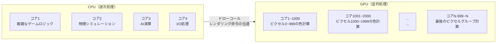
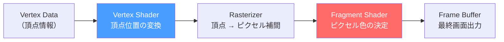
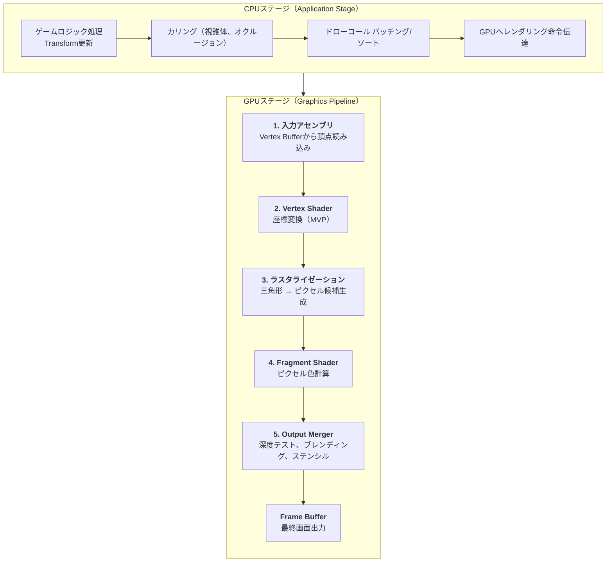
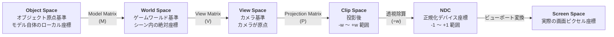
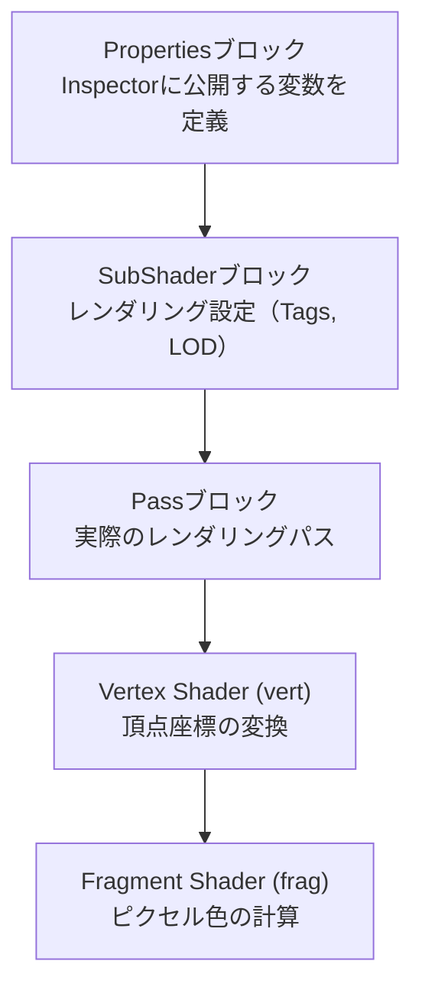
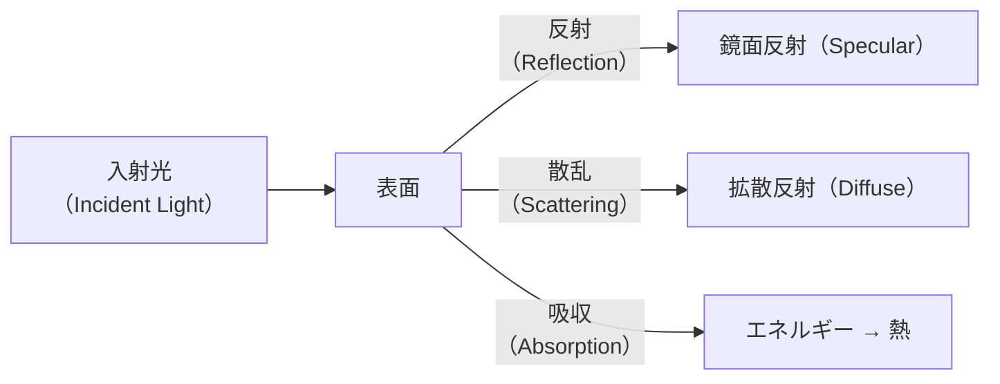
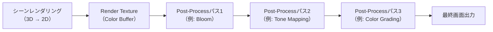
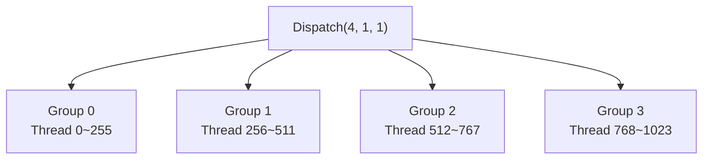
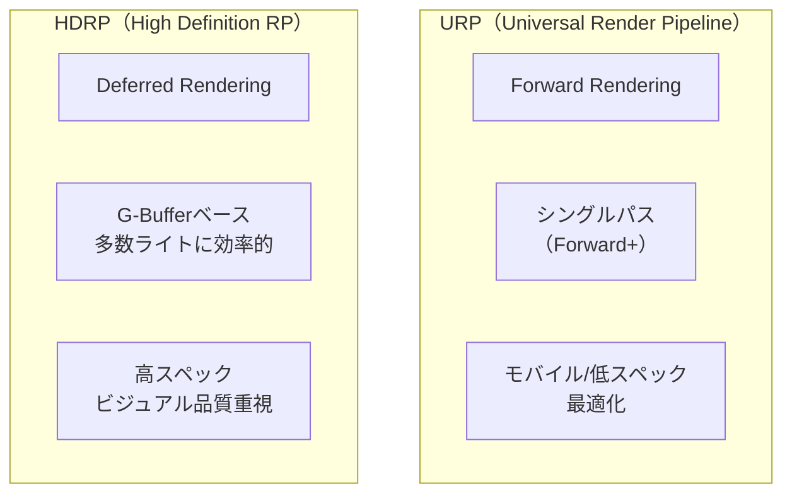

## はじめに

ゲーム開発者にとって、シェーダーは「魔法の領域」のように感じられがちです。UnityのMaterial Inspectorでスライダーを調整すると、オブジェクトが輝いたり、色が変わったり、半透明になったりしますが、その裏で正確に何が起きているのかは、よく分からないことが多いものです。

シェーダーを理解するということは、**「GPUが画面の各ピクセルをどのように決定するか」**を理解するということです。これは単に美しいエフェクトを作ることにとどまらず、パフォーマンス最適化、レンダリングデバッグ、そしてテクニカルアート全般にわたる問題解決能力を養ってくれます。

本稿はシェーダーの基本原理から始まり、UnityとUnrealの両エンジンでの実装まで、段階的に深掘りしていきます。グラフィックスプログラミングに馴染みがなくても追いかけられるように構成しています。

---

## Part 1: Shaderの本質

シェーダーを学ぶ前に、まず答えるべき問いがあります。「シェーダーとは正確には何か？」そして「なぜGPUという別のハードウェアが必要なのか？」このパートでは、シェーダーの正体と、それが動作するハードウェアの特性を取り上げます。

### 1. Shader とは何か？

Shaderは**GPUで実行されるプログラム**です。3Dまたは2Dグラフィックスパイプラインにおいて、頂点(Vertex)の位置を変換したり、ピクセル(Pixel)の最終色を計算する役割を担います。

「画面に映る結果を綺麗にする」というのはシェーダーの目的をよく捉えた表現ですが、実際にはそれよりはるかに多様な機能を含んでいます。

| シェーダーが行うこと | 具体的な例 |
| --- | --- |
| 頂点位置の変換 | オブジェクトを画面座標に投影 |
| ライティング計算 | 光の方向・強度・色に基づく表面の明るさ決定 |
| テクスチャマッピング | 2D画像を3D表面に貼り付ける |
| 影処理 | Shadow Mapの生成とサンプリング |
| ポストプロセス効果 | Bloom、HDR Tone Mapping、SSAO |
| 頂点アニメーション | 風に揺れる草、波のシミュレーション |
| 特殊効果 | ディゾルブ、ホログラム、歪み、アウトライン |

重要なのは、シェーダーが**CPUではなくGPUで実行される**という点です。この違いは単なるハードウェアの選択ではなく、プログラミングパラダイムそのものが変わる根本的な違いです。

---

### 1-1. CPU vs GPU: なぜGPUなのか？

CPUは**逐次処理の達人**です。複雑な分岐ロジック、多様な命令セット、広大なキャッシュを備えており、汎用演算に優れています。一方、GPUは**並列処理の達人**です。単純な演算を数千〜数万のコアで同時に実行します。

画面をレンダリングするということは、結局のところ**数百万個のピクセルそれぞれの色を計算すること**です。1920×1080の解像度なら約200万ピクセルです。これらの計算はほとんど互いに独立しています。ピクセルAの色を決定するのにピクセルBの結果は必要ありません。これこそGPUが真価を発揮するポイントです。



| 特性 | CPU | GPU |
| --- | --- | --- |
| コア数 | 4〜16個（一般的） | 数千〜数万個 |
| コアあたりの能力 | 高性能（複雑な分岐処理） | 低性能（単純演算特化） |
| 適した作業 | ゲームロジック、AI、物理 | ピクセル計算、行列演算 |
| 例え | 天才数学教授4人 | 四則演算ができる学生数千人 |

CPUは天才教授4人が難しい問題を順番に解いていくこと、GPUは足し算・掛け算しかできない学生数千人が同時にそれぞれ一つずつ計算すること。レンダリングは後者に圧倒的に有利な作業です。

> **Q. GPUコアが単純なら、シェーダーで複雑なロジックは書けないのですか？**
>
> 書くことはできますが、パフォーマンスコストが大きくなります。GPUコアは分岐（if-else）を嫌います。GPUは同じワープ（Warp、NVIDIA基準で32スレッドの束）内の全スレッドが同じ命令を実行するときに最も効率的です。分岐が発生すると一部のスレッドが待機状態になり、パフォーマンスが低下します。これを**Warp Divergence（ワープダイバージェンス）**と呼びます。シェーダー最適化でif文を減らすべきというアドバイスはここから来ています。
{: .prompt-info}

---

### 1-2. シェーダーの種類

グラフィックスパイプラインでは、シェーダーはそれぞれ異なるステージで実行され、役割が明確に分かれています。最も基本となるのは**Vertex Shader**と**Fragment（Pixel）Shader**の二つです。



| シェーダーの種類 | 実行単位 | 役割 | 例え |
| --- | --- | --- | --- |
| **Vertex Shader** | 頂点ごとに1回 | 3D座標 → 画面座標の変換 | 建物の骨組みを立てる |
| **Fragment Shader** | ピクセル候補ごとに1回 | 最終色の決定 | 壁にペンキを塗る |
| Geometry Shader | プリミティブごとに1回 | ジオメトリの追加・削除 | 建物の増築（あまり使わない） |
| Tessellation Shader | パッチごとに1回 | メッシュ細分化 | LODディテールの増加 |
| Compute Shader | 任意のスレッドグループ | 汎用GPU演算 | GPUで任意の計算 |

シェーダーの作業のほとんどはVertex ShaderとFragment Shaderで行われます。この二つを深く理解することがシェーダープログラミングの核心です。

---

## Part 2: レンダリングパイプライン

シェーダーは単独では動作しません。**レンダリングパイプライン**という定められたフローの中で、それぞれのステージを担当して実行されます。このパイプラインを理解しなければ、シェーダーコードが「なぜこのように書かなければならないのか」を納得するのは難しいでしょう。

### 2. レンダリングパイプラインの全体フロー

3Dオブジェクトが画面に描画されるまでの過程を**レンダリングパイプライン**と呼びます。ゲームプログラマーに馴染みのある表現で言えば、**CPU側のゲームループが毎フレーム回るように、GPU側のレンダリングパイプラインも毎フレーム実行されます。**



各ステージを一つずつ見ていきましょう。

---

### 2-1. 入力アセンブリ（Input Assembly）

GPUが最初に行うのは、**Vertex Buffer**から頂点データを読み込むことです。3Dモデリングツールで作成したメッシュは結局のところ頂点の集合であり、各頂点には以下の情報が格納されています。

| 頂点属性 | 説明 | 例 |
| --- | --- | --- |
| Position | オブジェクト空間での位置 | (1.0, 2.5, -0.3) |
| Normal | 表面から外向きの法線ベクトル | (0.0, 1.0, 0.0) |
| Tangent | UVのU方向に対応する接線ベクトル | (1.0, 0.0, 0.0, 1.0) |
| UV (TexCoord) | テクスチャマッピング用2D座標 | (0.5, 0.75) |
| Color | 頂点カラー（オプション） | (1.0, 0.0, 0.0, 1.0) |

これらの頂点を**インデックスバッファ（Index Buffer）**を通じて三角形に組み立てます。例えば、一つの四角形（Quad）は4つの頂点と6つのインデックス（三角形2つ）で構成されます。

```
頂点: v0(0,0,0) v1(1,0,0) v2(1,1,0) v3(0,1,0)

インデックス: [0,1,2] [0,2,3]
              ▲ 三角形1  ▲ 三角形2

v3 ─── v2
│ ╲    │     ← 2つの三角形で四角形を構成
│   ╲  │
v0 ─── v1
```

グラフィックスで**三角形が基本プリミティブ**である理由は、3つの点が常に一つの平面を決定するからです。四角形は4つの点が同一平面上にない場合があり、レンダリングが曖昧になる可能性があります。

---

### 2-2. Vertex Shader: 座標変換の核心

Vertex Shaderの核心的な役割は**座標変換（Coordinate Transformation）**です。3Dオブジェクトの頂点位置を最終的に画面（スクリーン）座標に変換しなければなりません。この過程では複数の座標系を経由します。

#### 座標系の変換順序（MVP Transform）



これがまさに**MVP（Model-View-Projection）変換**です。シェーダーコードで最も頻繁に見かける演算です。

**各座標空間を直感的に理解する：**

- **Object Space（オブジェクト空間）**: モデリングツールで作成したそのままの座標。キャラクターの足が(0,0,0)で頭が(0,1.8,0)という具合です。
- **World Space（ワールド空間）**: シーンに配置された後の座標。Transformのposition、rotation、scaleが適用されます。
- **View Space（ビュー空間）**: カメラを原点(0,0,0)に置き、見る方向を-Z軸に設定した座標系。なおOpenGLは-Z、DirectXは+Zがカメラの前方です。
- **Clip Space（クリップ空間）**: 投影行列適用後の座標。ここで**視錐体（View Frustum）外の頂点がクリッピングされます**。
- **NDC（Normalized Device Coordinates）**: クリップ座標をwで割って-1〜+1の範囲に正規化したもの。この時**透視除算（Perspective Division）**が行われ、遠近感が生まれます。
- **Screen Space（スクリーン空間）**: NDCを実際の画面解像度（例: 1920×1080）にマッピングした最終ピクセル座標。

HLSLコードで見ると、これらの変換すべてがたった一行です：

```hlsl
// Vertex Shaderの核心の一行
float4 clipPos = mul(UNITY_MATRIX_MVP, float4(vertexPos, 1.0));
// = Projection * View * Model * vertexPosition
```

> **Q. View SpaceでZ軸の方向がなぜ重要なのですか？**
>
> Unityは左手座標系（Left-Handed）で、カメラの前方が+Zです。OpenGLは右手座標系（Right-Handed）でカメラの前方が-Zです。Unrealは左手座標系ですがZ-upです。この違いにより、エンジン間でシェーダーを移植する際に座標の符号が反転する問題が頻繁に発生します。ノーマルマップが反転して見えたり、反射がおかしな方向に出るバグの原因はほとんどここにあります。
{: .prompt-warning}

---

### 2-3. ラスタライゼーション（Rasterization）

ラスタライゼーションは、**Vertex Shaderが出力した三角形を、画面のピクセルグリッドに合わせて「どのピクセルがこの三角形の中に入るか」を判定する過程**です。

このステージはプログラマーが直接制御できない**固定機能（Fixed-Function）**ステージです。ハードウェアが自動的に処理します。

```
三角形の3頂点 (v0, v1, v2) が画面座標に変換された状態

    v2
   ╱  ╲           ← 三角形の輪郭
  ╱    ╲
 ╱  ■■  ╲         ← ■ = この三角形に含まれるピクセル（Fragment）
╱ ■■■■■■ ╲
v0 ──────── v1

各 ■ ピクセル（Fragment）に対して:
- 位置: 頂点間の補間で計算
- Normal: 頂点Normalの補間値
- UV: 頂点UVの補間値
- その他: 頂点から渡された全データの補間値
```

核心は**補間（Interpolation）**です。三角形の3頂点がそれぞれ異なるNormal、UV、Color値を持っている場合、三角形内部の各ピクセルは**重心座標（Barycentric Coordinates）**を使って3頂点の値を適切に混合して計算されます。

$$\text{P} = \alpha \cdot v_0 + \beta \cdot v_1 + \gamma \cdot v_2 \quad (\alpha + \beta + \gamma = 1)$$

ここで$\alpha$、$\beta$、$\gamma$は、そのピクセルが各頂点にどれだけ近いかを表す重みです。頂点$v_0$に近いほど$\alpha$が大きくなり、$v_0$のデータがより多く反映されます。

ラスタライザーが生成した各ピクセル候補を**Fragment**と呼びます。Fragment Shaderが「Fragment」Shaderと呼ばれる理由がまさにこれです。最終画面のピクセルではなく、**ピクセル候補（Fragment）**を処理するからです。深度テスト（Depth Test）で不合格になると実際のピクセルにならないFragmentもあります。

---

### 2-4. Fragment Shader: 色の決定

Fragment Shader（= Pixel Shader、DirectX用語）は、**ラスタライザーが生成した各Fragmentの最終色を決定**します。シェーダープログラミングで最も多くの時間を費やすのがここです。

Fragment Shaderが行うこと：
1. **テクスチャサンプリング**: UV座標でテクスチャから色を読み取る
2. **ライティング計算**: 光の方向、表面法線、カメラの方向を使って明るさを決定
3. **影処理**: Shadow Mapをサンプリングして影の有無を判定
4. **エフェクト適用**: リムライト、フレネル、ディゾルブなどの視覚効果

入力としてラスタライザーが補間したデータ（Normal、UV、Positionなど）を受け取り、出力として**float4の色（RGBA）**を返します。

```hlsl
// 最も単純なFragment Shader
float4 frag(v2f i) : SV_Target
{
    // テクスチャから色を読み取る
    float4 texColor = tex2D(_MainTex, i.uv);

    // ライティング計算 (Lambert)
    float NdotL = saturate(dot(i.normal, _WorldSpaceLightPos0.xyz));

    // テクスチャ色 × ライティング
    return texColor * NdotL;
}
```

---

### 2-5. Output Merger: 最終合成

Fragment Shaderが色を出力した後、**Output Merger**ステージで最終的にフレームバッファに書き込むかどうかを決定します。

| テスト | 役割 | 説明 |
| --- | --- | --- |
| **Depth Test** | 深度比較 | すでにもっと手前のオブジェクトがあればこのFragmentを破棄 |
| **Stencil Test** | マスキング | ステンシルバッファの値を基準に通過/破棄を決定 |
| **Blending** | 色合成 | 半透明オブジェクトの場合、既存の色と新しい色を混合 |

不透明オブジェクトは通常**手前から奥（Front-to-Back）**の順序でレンダリングします。奥のオブジェクトのFragmentがDepth Testで早期に不合格（Early-Z）となり、Fragment Shaderの実行自体をスキップできるからです。これはパフォーマンス上非常に重要な最適化です。

半透明オブジェクトは逆に**奥から手前（Back-to-Front）**の順序でレンダリングしないと正しいブレンディング結果が得られません。これが半透明オブジェクトのソート問題（Transparency Sorting Problem）です。

> **Q. オーバードロー（Overdraw）はパフォーマンスに影響しますか？**
>
> はい、大きな影響があります。同じピクセル位置に複数のオブジェクトが重なると、Fragment Shaderが複数回実行されます。特にパーティクルや半透明エフェクトが多いシーンでは、1ピクセルに対して何十回もFragment Shaderが実行されることがあります。UnityのScene Viewで**Overdraw表示モード**をオンにすると確認できます。モバイルではこれがfill rateボトルネックの主な原因となります。
{: .prompt-info}

---

## Part 3: 座標系と空間変換

シェーダーコードを読んでいると、`objectSpace`、`worldSpace`、`viewSpace`、`tangentSpace`といった用語が絶え間なく登場します。これらの「空間（Space）」をきちんと理解しなければ、シェーダーコードは魔法の呪文のように見えてしまいます。このパートでは各空間の意味と変換行列の本質に迫ります。

### 3. 行列（Matrix）が行うこと

3Dグラフィックスにおいて行列は**座標変換のツール**です。位置の移動（Translation）、回転（Rotation）、スケーリング（Scale）のすべてが行列の積で実現されます。

4×4行列一つにこれら3種類の変換をすべて格納できます：

$$
\begin{bmatrix}
\text{Scale} \times \text{Rotation} & \text{Translation} \\
0 \quad 0 \quad 0 & 1
\end{bmatrix}
=
\begin{bmatrix}
R_{00} \cdot S_x & R_{01} \cdot S_y & R_{02} \cdot S_z & T_x \\
R_{10} \cdot S_x & R_{11} \cdot S_y & R_{12} \cdot S_z & T_y \\
R_{20} \cdot S_x & R_{21} \cdot S_y & R_{22} \cdot S_z & T_z \\
0 & 0 & 0 & 1
\end{bmatrix}
$$

なぜ4×4なのか？ 3D座標は(x, y, z)の3成分ですが、**移動（Translation）を行列の積で表現するために同次座標（Homogeneous Coordinates）**を使用します。(x, y, z, **w**)においてw=1なら位置（Point）、w=0なら方向（Direction）です。方向ベクトルは移動の影響を受けるべきではないため、w=0に設定します。

```hlsl
// シェーダーでの行列積 (Unity HLSL)
float4 worldPos = mul(unity_ObjectToWorld, float4(objectPos, 1.0)); // 位置: w=1
float3 worldNormal = mul((float3x3)unity_ObjectToWorld, objectNormal); // 方向: 3x3のみ使用
```

> **注意**: 法線ベクトル（Normal）の変換には**Model行列の逆転置行列（Inverse Transpose）**を使用する必要があります。非均一スケール（Non-uniform Scale）が適用されたオブジェクトで単純にModel行列を掛けると、法線が表面に垂直ではなくなります。Unityでは`unity_WorldToObject`の転置を使用するか、`TransformObjectToWorldNormal()`関数を使います。
{: .prompt-warning}

---

### 3-1. タンジェント空間（Tangent Space）

Normal Mapを使用するには**Tangent Space（タンジェント空間）**を理解する必要があります。この空間は表面の各頂点ごとに定義される**ローカル座標系**です。

```
             Normal (N)
               ↑
               │
               │
    ───────────┼───────────→ Tangent (T)
              ╱│
             ╱ │
            ╱  │
      Bitangent (B)

T = UVのU方向
B = UVのV方向 (= cross(N, T) × handedness)
N = 表面法線
```

**TBN行列**はこれら3つのベクトル（Tangent、Bitangent、Normal）を列ベクトルとして構成した3×3行列で、タンジェント空間とワールド空間間の変換を担います。

$$
\text{TBN} = \begin{bmatrix} T_x & B_x & N_x \\ T_y & B_y & N_y \\ T_z & B_z & N_z \end{bmatrix}
$$

Normal MapのRGB値（0〜1）を（-1〜+1）範囲に変換すると、タンジェント空間での法線が得られます。これをTBN行列でワールド空間に変換すると、実際のライティング計算に使用できるワールド法線が得られます。

```hlsl
// Normal Mapからワールド法線を求める
float3 tangentNormal = tex2D(_BumpMap, i.uv).xyz * 2.0 - 1.0; // 0~1 → -1~+1
float3 worldNormal = normalize(mul(tangentNormal, float3x3(i.tangent, i.bitangent, i.normal)));
```

> **Q. Normal Mapはなぜ青いのですか？**
>
> Normal MapのRGBはタンジェント空間でのXYZ方向を表しています。ほとんどの表面は法線が(0, 0, 1)、つまり表面から垂直に外に向かう方向です。これを0〜1範囲にエンコードすると(0.5, 0.5, 1.0)になります。RGBで見るとR=0.5、G=0.5、B=1.0なので青く見えるのです。凹凸が激しい部分では法線が傾き、青から外れて赤色/緑色のトーンが混ざります。
{: .prompt-info}

---

## Part 4: HLSL基礎とシェーダー作成

理論を理解したところで、実際にコードを書いてみましょう。このパートではHLSL（High-Level Shading Language）の核心的な文法と、Unity/Unrealでのシェーダー構造を扱います。

### 4. HLSL 核心データ型

シェーダーコードで最もよく使う型は以下の通りです：

| 型 | サイズ | 用途 | 例 |
| --- | --- | --- | --- |
| `float` | 32bit | 高精度実数 | ワールド座標、時間 |
| `half` | 16bit | 低精度実数（モバイル最適化） | 色、UV |
| `fixed` | 11bit | 最低精度（Unityレガシー） | 単純な色 |
| `float2` | 64bit | 2Dベクトル | UV座標 |
| `float3` | 96bit | 3Dベクトル | 位置、方向、色（RGB） |
| `float4` | 128bit | 4Dベクトル | 色（RGBA）、クリップ座標 |
| `float4x4` | 512bit | 4×4行列 | MVP変換 |
| `sampler2D` | - | 2Dテクスチャサンプラー | テクスチャ読み取り用 |

**Swizzling** — HLSLの強力な機能の一つです：

```hlsl
float4 color = float4(1.0, 0.5, 0.3, 1.0);

color.rgb;     // float3(1.0, 0.5, 0.3) — 最初の3成分
color.rg;      // float2(1.0, 0.5)
color.bgr;     // float3(0.3, 0.5, 1.0) — 順序変更！
color.rrr;     // float3(1.0, 1.0, 1.0) — 繰り返しも可能
color.xyzw;    // xyzwでもアクセス可能（= rgbaと同一）
```

---

### 4-1. Unity ShaderLab 構造

Unityでシェーダーを書く際は、**ShaderLab**というラッパー言語の中にHLSLコードを記述します。

```hlsl
Shader "Custom/BasicDiffuse"
{
    Properties
    {
        _MainTex ("Texture", 2D) = "white" {}
        _Color ("Color Tint", Color) = (1,1,1,1)
    }

    SubShader
    {
        Tags { "RenderType"="Opaque" "Queue"="Geometry" }

        Pass
        {
            HLSLPROGRAM
            #pragma vertex vert
            #pragma fragment frag

            #include "Packages/com.unity.render-pipelines.universal/ShaderLibrary/Core.hlsl"
            #include "Packages/com.unity.render-pipelines.universal/ShaderLibrary/Lighting.hlsl"

            // ── プロパティ変数宣言 ──
            TEXTURE2D(_MainTex);
            SAMPLER(sampler_MainTex);
            float4 _MainTex_ST;
            float4 _Color;

            // ── Vertex Shader 入力構造体 ──
            struct Attributes
            {
                float4 positionOS : POSITION;    // Object Space 位置
                float3 normalOS   : NORMAL;      // Object Space 法線
                float2 uv         : TEXCOORD0;   // UV座標
            };

            // ── Vertex → Fragment 受け渡し構造体 ──
            struct Varyings
            {
                float4 positionCS : SV_POSITION; // Clip Space 位置
                float2 uv         : TEXCOORD0;
                float3 normalWS   : TEXCOORD1;   // World Space 法線
            };

            // ── Vertex Shader ──
            Varyings vert(Attributes IN)
            {
                Varyings OUT;
                OUT.positionCS = TransformObjectToHClip(IN.positionOS.xyz);
                OUT.uv = TRANSFORM_TEX(IN.uv, _MainTex);
                OUT.normalWS = TransformObjectToWorldNormal(IN.normalOS);
                return OUT;
            }

            // ── Fragment Shader ──
            float4 frag(Varyings IN) : SV_Target
            {
                // テクスチャサンプリング
                float4 texColor = SAMPLE_TEXTURE2D(_MainTex, sampler_MainTex, IN.uv);

                // メインライトの取得
                Light mainLight = GetMainLight();

                // Lambert Diffuse
                float NdotL = saturate(dot(normalize(IN.normalWS), mainLight.direction));

                float3 diffuse = texColor.rgb * _Color.rgb * mainLight.color * NdotL;

                return float4(diffuse, texColor.a);
            }

            ENDHLSL
        }
    }
}
```

このコードの流れを整理すると：



| ブロック | 役割 | 例え |
| --- | --- | --- |
| `Properties` | 外部から調整可能なパラメータ | Unity Inspectorのスライダー/カラーフィールド |
| `SubShader` | GPU性能に応じたシェーダーグループ | LOD設定と同様 |
| `Pass` | 1回のドローコールに相当 | 実際のGPU実行単位 |
| `Tags` | レンダリング順序・方式の指定 | Queue、RenderTypeなど |

---

### 4-2. Unreal Material Systemとの比較

Unreal Engineはシェーダーを直接コードで書く代わりに、**Material Editor**（ノードベースのビジュアルエディタ）を主に使用します。もちろんCustom HLSLノードでコードを直接書くこともできます。

| 項目 | Unity | Unreal |
| --- | --- | --- |
| 基本的な作成方法 | ShaderLab + HLSLコード | Material Editor（ノードベース） |
| ビジュアルエディタ | Shader Graph | Material Editor |
| カスタムコード | .shaderファイルを直接作成 | Custom Expressionノード、.ush/.usf |
| レンダーパイプライン | URP / HDRP / Built-in | Deferred / Forward（設定で選択） |
| シェーダー言語 | HLSL（CGはレガシー） | HLSL（Unrealマクロでラッピング） |
| シェーダーモデル | SM 3.0〜6.0 | SM 5.0〜6.0 |

UnrealのMaterialで**Base Color、Metallic、Roughness、Normal**などのピンに接続するのは、実質的に**Fragment Shaderの出力値を設定するのと同じ**です。Unrealが内部でこれらの値を受け取ってPBRライティング演算を実行します。

```
[Unreal Material Editor]                  [Unity Shaderコードとの対応]
┌─────────────────────────┐
│ Texture Sample ─┬─ Base Color    ←→  texColor.rgb
│                 │
│ Constant(0.8) ──── Metallic      ←→  _Metallic
│                 │
│ Constant(0.2) ──── Roughness     ←→  1.0 - _Smoothness
│                 │
│ Normal Map ─────── Normal         ←→  UnpackNormal(tex2D(_BumpMap, uv))
│                 │
│ Constant(0.04)─── Specular       ←→  _SpecColor
└─────────────────────────┘
```

---

## Part 5: ライティングモデル（Lighting Models）

シェーダーで最も核心的なテーマは**ライティング（照明）**です。オブジェクトに光が当たった時にどう見えるかを計算することこそ、シェーダーの存在理由と言えます。

### 5. 光と表面の相互作用

光が表面に当たると、大きく3つの現象が発生します。



| 現象 | 物理的意味 | 視覚的結果 |
| --- | --- | --- |
| **Diffuse（拡散反射）** | 光が表面に入り込み様々な方向に散乱 | 表面固有の色（のっぺりした明るさ） |
| **Specular（鏡面反射）** | 光が表面で直接反射 | 光沢のあるハイライト |
| **Ambient（環境光）** | 間接光の近似 | 影部分の最低明るさ |

---

### 5-1. Lambert Diffuseモデル

最も基本的なライティングモデルです。**光の方向(L)**と**表面法線(N)**の内積で明るさを決定します。

$$I_{diffuse} = C_{light} \times C_{surface} \times \max(0, \vec{N} \cdot \vec{L})$$

直感的に、光が表面に垂直に当たるほど（N·L = 1）明るく、斜めに当たるほど（N·L → 0）暗く、裏から当たると（N·L < 0）光を受けません。

```
光が垂直に当たる時            光が斜めに当たる時
     L                           L
     ↓                          ╲
     ↓                           ╲
━━━━━━━━━                  ━━━━━━━━━
  N ↑                          N ↑

N·L = 1.0（最大の明るさ）     N·L ≈ 0.5（中間の明るさ）
```

```hlsl
// Lambert Diffuse シェーダー実装
float NdotL = saturate(dot(normalWS, lightDir));
float3 diffuse = lightColor * albedo * NdotL;
```

Lambertモデルは**視点（カメラ位置）に無関係**です。カメラをどこに置いてもDiffuseの明るさは同じです。これがSpecularとの根本的な違いです。

---

### 5-2. Phong / Blinn-Phong Specularモデル

表面で光が反射してカメラに入ると**ハイライト（Specular Highlight）**が見えます。これを計算する古典的なモデルが**Phongモデル**とその改良版の**Blinn-Phongモデル**です。

#### Phongモデル

反射ベクトル(R)と視線ベクトル(V)の内積を使用します。

$$I_{specular} = C_{light} \times C_{specular} \times \max(0, \vec{R} \cdot \vec{V})^{shininess}$$

$$\vec{R} = 2(\vec{N} \cdot \vec{L})\vec{N} - \vec{L}$$

```
        R（反射ベクトル）
       ╱
      ╱     V（視線ベクトル）
     ╱     ╱
    ╱     ╱
━━━╱━━━━━╱━━━━━━
   ↑ N
   L（光）

R·Vが大きいほど（反射方向に近い角度で見るほど）ハイライトが明るい
shininessが大きいほどハイライトが小さく鋭くなる
```

#### Blinn-Phongモデル（より多く使用される）

反射ベクトルを求める代わりに、**ハーフベクトル(H)**を使用します。計算がより速く、視覚的にもより自然です。

$$\vec{H} = \text{normalize}(\vec{L} + \vec{V})$$

$$I_{specular} = C_{light} \times C_{specular} \times \max(0, \vec{N} \cdot \vec{H})^{shininess}$$

```hlsl
// Blinn-Phong 実装
float3 halfDir = normalize(lightDir + viewDir);
float NdotH = saturate(dot(normalWS, halfDir));
float specular = pow(NdotH, _Shininess) * _SpecIntensity;

// 最終色 = Ambient + Diffuse + Specular
float3 finalColor = ambient + diffuse + specular * lightColor;
```

> **Q. PhongとBlinn-Phongの実質的な違いは？**
>
> 視覚的にBlinn-PhongはPhongよりハイライトがやや広がる傾向があります。パフォーマンス面ではBlinn-Phongが有利です。反射ベクトルRを求めるには`reflect()`演算が必要ですが、ハーフベクトルHは単純なベクトル加算 + normalizeで求められるからです。ほとんどのゲームエンジン（Unity Built-in、Unreal Legacy）でBlinn-Phongをデフォルトとして使用しています。
{: .prompt-info}

---

### 5-3. PBR（Physically Based Rendering）

現代のゲームエンジン（Unity URP/HDRP、Unreal Engine 4/5）のデフォルトライティングモデルは**PBR（物理ベースレンダリング）**です。Phong/Blinn-Phongとは異なり、**エネルギー保存則**を遵守し**フレネル効果**を反映して、はるかにリアルな結果を生み出します。

#### PBRの核心パラメータ

| パラメータ | 範囲 | 意味 |
| --- | --- | --- |
| **Albedo**（Base Color） | RGB色 | 表面固有の色（ライティング除外） |
| **Metallic** | 0.0 〜 1.0 | 金属性（0=非金属、1=金属） |
| **Roughness**（= 1 - Smoothness） | 0.0 〜 1.0 | 粗さ（0=鏡面、1=完全な艶消し） |
| **Normal** | タンジェント空間ベクトル | 微細表面の凹凸 |
| **AO**（Ambient Occlusion） | 0.0 〜 1.0 | 隙間の影 |

#### Metallic-Roughnessワークフロー

```
         Roughness = 0           Roughness = 0.5          Roughness = 1.0
         （完全に滑らか）         （中間）                   （完全に粗い）
Metal=0  [ガラス、水滴]          [プラスチック]             [泥、布]
Metal=1  [クロムの鏡]            [磨かれた金属]             [錆びた鉄]
```

#### PBRの数学的基盤: Cook-Torrance BRDF

PBRのSpecular項は**Cook-Torranceモデル**を基盤としています。

$$f_{spec} = \frac{D \cdot F \cdot G}{4 \cdot (\vec{N} \cdot \vec{L}) \cdot (\vec{N} \cdot \vec{V})}$$

| 項 | 名前 | 役割 |
| --- | --- | --- |
| **D** | Normal Distribution Function (NDF) | マイクロファセットの方向分布。Roughnessが大きいほど分布が広がる |
| **F** | Fresnel項 | 視線角度による反射率の変化。斜めに見るほど反射が強くなる |
| **G** | Geometry項 | マイクロファセット間のセルフシャドウイング（self-shadowing）とマスキング |

各項には複数の数学モデルがあります：

| 項 | 代表的モデル | 特徴 |
| --- | --- | --- |
| D | GGX (Trowbridge-Reitz) | ロングテール分布、リアルなハイライト。業界標準 |
| F | Schlick近似 | $F_0 + (1 - F_0)(1 - \cos\theta)^5$、計算が速く正確 |
| G | Smith GGX | NDFと整合性のあるGeometry関数 |

**フレネル効果**は日常でも観察できます。湖を真上から見下ろすと水の下がよく見えますが、遠くの水平線を見ると空が反射して見えます。視線と表面のなす角（Grazing Angle）が大きいほど反射率が高くなるのです。

```hlsl
// Schlick Fresnel 近似
float3 FresnelSchlick(float cosTheta, float3 F0)
{
    return F0 + (1.0 - F0) * pow(1.0 - cosTheta, 5.0);
}

// F0: 垂直入射時の反射率
// 非金属: ~0.04（ほとんどの非金属）
// 金属: Albedoの色そのものがF0
```

> **MetallicとDielectric（非金属）の違い**
>
> 非金属（プラスチック、木、石など）はDiffuseが主な反射成分で、Specularは弱いです（F0 ≈ 0.04）。一方、金属（金、銀、銅など）はDiffuseが0で、Specularがすべてです。金属のSpecular色は表面固有の色と同じです（金は黄色い反射、銅はオレンジ色の反射）。これがMetallicパラメータの本質です。Metallic = 1ではDiffuseを完全にオフにし、SpecularにAlbedo色を使用します。
{: .prompt-info}

---

## Part 6: 実践シェーダーテクニック

理論を基に、実際のゲームでよく使われるシェーダーテクニックを見ていきましょう。各テクニックの原理と実装コードを合わせて扱います。

### 6. テクスチャマッピング応用

#### Triplanar Mapping

UVのないオブジェクト（地形、プロシージャルメッシュ）にテクスチャを貼るテクニックです。ワールド座標のXY、XZ、YZ平面からそれぞれテクスチャをサンプリングし、法線方向に応じてブレンディングします。

```hlsl
float3 TriplanarMapping(float3 worldPos, float3 worldNormal, sampler2D tex, float tiling)
{
    // 3つの軸からそれぞれテクスチャサンプリング
    float3 xProj = tex2D(tex, worldPos.yz * tiling).rgb;
    float3 yProj = tex2D(tex, worldPos.xz * tiling).rgb;
    float3 zProj = tex2D(tex, worldPos.xy * tiling).rgb;

    // 法線方向に応じた重み
    float3 blend = abs(worldNormal);
    blend = blend / (blend.x + blend.y + blend.z); // 合計が1になるよう正規化

    return xProj * blend.x + yProj * blend.y + zProj * blend.z;
}
```

#### Parallax Mapping（視差マッピング）

Normal Mapが表面の法線だけを変えて陰影を偽るのに対し、Parallax Mappingは**UV座標自体を視線方向に応じてずらし**、実際に突出しているように見せます。

```hlsl
// 基本Parallax Mapping
float2 ParallaxOffset(float2 uv, float3 viewDirTS, sampler2D heightMap, float scale)
{
    float height = tex2D(heightMap, uv).r;
    float2 offset = viewDirTS.xy / viewDirTS.z * (height * scale);
    return uv - offset;
}
```

---

### 6-1. Rim Light（フレネル効果の応用）

キャラクターの輪郭が光るエフェクトです。視線方向と法線が垂直に近いほど（エッジ部分）明るくなります。

```hlsl
float3 RimLight(float3 normalWS, float3 viewDirWS, float3 rimColor, float rimPower)
{
    float rim = 1.0 - saturate(dot(normalWS, viewDirWS));
    rim = pow(rim, rimPower);
    return rimColor * rim;
}

// 使用例
float3 rim = RimLight(IN.normalWS, viewDir, _RimColor.rgb, _RimPower);
finalColor += rim;
```

```
        視線方向 →
       ╱
      ╱
  ┌──────┐
  │ 暗い  │  ← N·Vが大きい所（正面）→ rim弱い
  │      │
  ┤明るい!├  ← N·Vが小さい所（エッジ）→ rim強い
  │      │
  └──────┘
```

---

### 6-2. Dissolve（ディゾルブエフェクト）

ノイズテクスチャの値がthresholdを下回ると`clip()`でピクセルを破棄するテクニックです。

```hlsl
float4 frag(Varyings IN) : SV_Target
{
    float4 texColor = SAMPLE_TEXTURE2D(_MainTex, sampler_MainTex, IN.uv);

    // ノイズテクスチャから値を読み取る
    float noise = SAMPLE_TEXTURE2D(_DissolveTex, sampler_DissolveTex, IN.uv).r;

    // threshold以下ならピクセル破棄
    float dissolveAmount = noise - _DissolveThreshold;
    clip(dissolveAmount);

    // 境界部分に色効果（Emission Edge）
    float edge = step(dissolveAmount, _EdgeWidth);
    float3 edgeColor = lerp(float3(0,0,0), _EdgeColor.rgb, edge);

    return float4(texColor.rgb + edgeColor, texColor.a);
}
```

| `_DissolveThreshold` の値 | 効果 |
| --- | --- |
| 0.0 | 完全なオブジェクト（消失なし） |
| 0.5 | 半分程度消失 |
| 1.0 | 完全に消失 |

---

### 6-3. Outline（アウトライン / セルシェーディング）

セルシェーディング（Toon Shading）でよく使われるアウトラインテクニックです。大きく2つのアプローチがあります。

**方法1: 裏面拡張（Inverted Hull）**

2番目のPassで頂点を法線方向に押し出し、表面をカリングして裏面のみレンダリングします。

```hlsl
// アウトライン Vertex Shader
Varyings vertOutline(Attributes IN)
{
    Varyings OUT;
    // 法線方向に頂点を押し出す
    float3 expandedPos = IN.positionOS.xyz + IN.normalOS * _OutlineWidth;
    OUT.positionCS = TransformObjectToHClip(expandedPos);
    return OUT;
}

// アウトライン Fragment Shader — 単純にアウトライン色を返す
float4 fragOutline(Varyings IN) : SV_Target
{
    return _OutlineColor;
}
```

**方法2: ポストプロセス — Sobelエッジ検出**

深度バッファや法線バッファにSobelフィルタを適用してエッジを検出します。キャラクターだけでなくシーン全体に適用できます。

```hlsl
// Sobelカーネルで深度エッジ検出
float SobelDepth(float2 uv, float2 texelSize)
{
    float d00 = SampleDepth(uv + float2(-1,-1) * texelSize);
    float d10 = SampleDepth(uv + float2( 0,-1) * texelSize);
    float d20 = SampleDepth(uv + float2( 1,-1) * texelSize);
    float d01 = SampleDepth(uv + float2(-1, 0) * texelSize);
    float d21 = SampleDepth(uv + float2( 1, 0) * texelSize);
    float d02 = SampleDepth(uv + float2(-1, 1) * texelSize);
    float d12 = SampleDepth(uv + float2( 0, 1) * texelSize);
    float d22 = SampleDepth(uv + float2( 1, 1) * texelSize);

    float gx = d00 + 2*d01 + d02 - d20 - 2*d21 - d22;
    float gy = d00 + 2*d10 + d20 - d02 - 2*d12 - d22;

    return sqrt(gx*gx + gy*gy);
}
```

---

## Part 7: ポストプロセス効果（Post-Processing）

ポストプロセスは、**シーン全体がレンダリングされた後**、フレームバッファ（レンダーテクスチャ）に対して2D画像処理を実行することです。カメラに取り付けたフィルターのようなものです。

### 7. ポストプロセスの動作原理



各ポストプロセスパスは、**Full-screen Quad**（画面全体を覆う矩形）にシェーダーを適用するものです。入力は前のパスのレンダーテクスチャで、出力は次のパスに渡すレンダーテクスチャです。

---

### 7-1. Bloom

明るい部分が光が滲むように広がるエフェクトです。

```
[処理ステップ]

1. Brightness Filter : 明るさ閾値以上のみ抽出
   元画像 → 明るい部分だけ残したテクスチャ

2. Gaussian Blur : 複数ステージにわたりガウシアンブラーを適用
   明るい部分テクスチャ → 徐々にぼやけるテクスチャ群（Mip Chain）

3. Upsample & Combine : ブラーされたテクスチャを元画像に加算
   元画像 + ブラー = 明るい箇所が広がって見える最終結果
```

```hlsl
// 明るさ閾値フィルタ
float3 BrightnessFilter(float3 color, float threshold)
{
    float brightness = max(color.r, max(color.g, color.b));
    float contribution = max(0, brightness - threshold);
    contribution /= max(brightness, 0.00001);
    return color * contribution;
}
```

---

### 7-2. HDRとTone Mapping

実世界の明るさの範囲（太陽: 〜100,000 lux、月光: 〜0.1 lux）はモニターが表示できる範囲（0〜255）をはるかに超えています。**HDR（High Dynamic Range）**レンダリングでは0〜1範囲を超える明るさ値を使用し、最終出力時に**Tone Mapping**でモニターの範囲に圧縮します。

```hlsl
// ACES Tone Mapping（業界標準）
float3 ACESToneMapping(float3 color)
{
    float a = 2.51;
    float b = 0.03;
    float c = 2.43;
    float d = 0.59;
    float e = 0.14;
    return saturate((color * (a * color + b)) / (color * (c * color + d) + e));
}
```

| Tone Mapping方式 | 特徴 | 用途 |
| --- | --- | --- |
| Reinhard | シンプル、明るい部分の損失あり | 学習/テスト |
| ACES Filmic | 映画のような色味、ハイライトロールオフ | Unity HDRP、UE5のデフォルト |
| Neutral | ACESより彩度を維持 | Unity URPのデフォルト |

---

## Part 8: Compute Shader

Compute Shaderはレンダリングパイプラインに縛られない**汎用GPUプログラミング**ツールです。画面に何かを描くのではなく、GPUの並列演算能力を活用して任意の計算を実行します。

### 8. Compute Shaderが必要な理由

GPUの数千のコアをレンダリング以外の目的で使用したい時にCompute Shaderを使います。

| ユースケース | 説明 |
| --- | --- |
| **パーティクルシミュレーション** | 数十万パーティクルの物理演算をGPUで並列処理 |
| **GPU Skinning** | アニメーションのボーン計算をGPUで実行 |
| **手続き的地形生成** | ノイズ関数の大規模計算をGPUで実行 |
| **ポストプロセス最適化** | 複雑な画像処理をComputeで実行 |
| **GPU Culling** | GPUで直接視錐体/オクルージョンカリング |
| **間接ドロー** | Computeでドローコマンドを生成しCPU介入を最小化 |

---

### 8-1. Compute Shader基本構造（Unity）

```hlsl
// SimpleCompute.compute
#pragma kernel CSMain

// 入出力バッファ
RWStructuredBuffer<float3> _Positions;
float _Time;
uint _Count;

[numthreads(256, 1, 1)]
void CSMain(uint3 id : SV_DispatchThreadID)
{
    if (id.x >= _Count) return;

    float3 pos = _Positions[id.x];

    // サイン波でY軸移動
    pos.y = sin(pos.x * 0.5 + _Time) * 2.0;

    _Positions[id.x] = pos;
}
```

```csharp
// C# ディスパッチコード
public class ComputeDispatcher : MonoBehaviour
{
    public ComputeShader computeShader;
    private ComputeBuffer positionBuffer;
    private int kernelIndex;

    void Start()
    {
        kernelIndex = computeShader.FindKernel("CSMain");

        // バッファ作成と初期データ設定
        positionBuffer = new ComputeBuffer(count, sizeof(float) * 3);
        positionBuffer.SetData(initialPositions);

        computeShader.SetBuffer(kernelIndex, "_Positions", positionBuffer);
        computeShader.SetInt("_Count", count);
    }

    void Update()
    {
        computeShader.SetFloat("_Time", Time.time);

        // ディスパッチ: スレッドグループ数 = 総数 / グループあたりのスレッド数
        int threadGroups = Mathf.CeilToInt(count / 256.0f);
        computeShader.Dispatch(kernelIndex, threadGroups, 1, 1);
    }

    void OnDestroy()
    {
        positionBuffer.Release();
    }
}
```

**スレッド構造の理解：**

```
[numthreads(256, 1, 1)] = スレッドグループ1つに256スレッド

Dispatch(4, 1, 1) = 4つのスレッドグループを実行

総スレッド数 = 4 × 256 = 1,024
各スレッドはSV_DispatchThreadIDで固有IDを受け取る (0 ~ 1023)
```



---

## Part 9: シェーダー最適化

シェーダーのパフォーマンスコストは想像以上に大きいです。Fragment Shaderは**毎フレーム数百万回**実行されるため、わずかな非効率も雪だるま式に膨らみます。

### 9. 核心的な最適化原則

| 原則 | 説明 | 例 |
| --- | --- | --- |
| **分岐の最小化** | if-elseはWarp Divergenceを引き起こす | `step()`、`lerp()`で代替 |
| **精度を下げる** | モバイルではhalfがfloatの2倍速い | 色/UVにはhalfを使用 |
| **テクスチャアクセスを減らす** | テクスチャサンプリングはコストが高い | チャネルパッキング、アトラス活用 |
| **演算をVertexに移動** | ピクセルより頂点の方がはるかに少ない | フォグや一部のライティングをVSで計算 |
| **数学関数に注意** | `pow()`、`sin()`、`cos()`はコスト高 | LUT（ルックアップテクスチャ）で代替可能 |
| **オーバードローを監視** | 半透明/パーティクルの過多に注意 | パーティクルサイズ、レイヤー数を制限 |

---

### 9-1. 分岐除去テクニック

```hlsl
// ❌ 非効率: GPUでの分岐
if (height > 0.5)
    color = rock;
else
    color = grass;

// ✅ 効率的: 数学的にブレンディング
float blend = step(0.5, height);          // 0 または 1
color = lerp(grass, rock, blend);          // 線形補間

// ✅ 滑らかなトランジションが必要な場合
float blend = smoothstep(0.4, 0.6, height); // 0.4〜0.6の間で滑らかに遷移
color = lerp(grass, rock, blend);
```

---

### 9-2. チャネルパッキング（Channel Packing）

1つのテクスチャのRGBAチャネルにそれぞれ異なるデータを格納し、テクスチャサンプリング回数を減らすテクニックです。

```
一般的なアプローチ（テクスチャ4枚 → 4回サンプリング）:
  Metallic Map    （Rチャネルのみ使用）  → 1回サンプリング
  Roughness Map   （Rチャネルのみ使用）  → 1回サンプリング
  AO Map          （Rチャネルのみ使用）  → 1回サンプリング
  Height Map      （Rチャネルのみ使用）  → 1回サンプリング

チャネルパッキング（テクスチャ1枚 → 1回サンプリング）:
  Packed Map:
    R = Metallic
    G = Roughness
    B = AO
    A = Height
```

```hlsl
// チャネルパッキングされたテクスチャの使用
float4 packed = SAMPLE_TEXTURE2D(_PackedMap, sampler_PackedMap, IN.uv);
float metallic  = packed.r;
float roughness = packed.g;
float ao        = packed.b;
float height    = packed.a;
```

UnityもUnrealもPBRシェーダーでこのテクニックを標準的に使用しています。Unity URPのデフォルトLitシェーダーの`_MetallicGlossMap`がまさにこのチャネルパッキングされたテクスチャです。

---

## Part 10: エンジン別レンダーパイプラインの比較

### 10. Unityのレンダーパイプライン

Unityは3つのレンダーパイプラインを提供しています：

| パイプライン | シェーダー言語 | 対象 | 特徴 |
| --- | --- | --- | --- |
| **Built-in RP** | CG/HLSL | レガシープロジェクト | Surface Shaderサポート、もう更新なし |
| **URP** | HLSL | モバイル、低スペックPC | シングルパスForward、パフォーマンス最適化 |
| **HDRP** | HLSL | 高スペックPC、コンソール | Deferred基本、物理ベースライティング |



#### Forward vs Deferred Rendering

| 項目 | Forward | Deferred |
| --- | --- | --- |
| ライト計算 | オブジェクトごとに影響するライトを計算 | G-Bufferから一括ライティング |
| ライト数 | 多いとパフォーマンス急落 | ライト数に強い |
| 半透明 | 自然に対応 | 別途Forward Passが必要 |
| メモリ | 少ない | G-Bufferにより多い |
| MSAA | サポート | G-Bufferと非互換（TAAを使用） |
| 適した対象 | モバイル、ライトが少ないシーン | PC/コンソール、ライトが多いシーン |

**G-Bufferとは？** Deferred Renderingの最初のパスの出力です。各ピクセルに対してAlbedo、Normal、Depth、Roughnessなどを別々のレンダーテクスチャに格納します。2番目のパスでこのデータを読み取ってライティングを一括計算します。

---

### 10-1. Unreal Engine 5 レンダリングの特徴

UE5は2つの革新的技術を導入しました：

| 技術 | 説明 |
| --- | --- |
| **Nanite** | 仮想ジオメトリシステム。数億ポリゴンメッシュを自動LOD + ストリーミング |
| **Lumen** | ソフトウェア/ハードウェアレイトレーシングベースのグローバルイルミネーション |

Naniteは従来のVertex Shaderステージを大幅に変革します。メッシュを**クラスター**単位に分割し、GPUで可視性判定（Compute Shaderベースのカリング）を行い、必要なクラスターのみをラスタライズします。これは従来の「頂点一つ一つを変換する」パイプラインとはかなり異なるアプローチです。

Lumenは従来のScreen Spaceベースの反射/GI（SSAO、SSR）の代わりに、**シーン全体の間接光をリアルタイムでシミュレーション**します。SDF（Signed Distance Field）トレーシングとScreen Spaceトレーシングを組み合わせて使用します。

---

## Part 11: シェーダーデバッグ

シェーダーはGPUで実行されるため、CPUコードのようにブレークポイントを設定してステップ実行でデバッグすることが困難です。代わりに以下のテクニックを活用します。

### 11. ビジュアルデバッグ

最も基本的かつ効果的な方法は、**中間値を色として出力する**ことです。

```hlsl
// Normal 可視化
return float4(normalWS * 0.5 + 0.5, 1.0); // -1~1を0~1に変換して色として表示

// UV 可視化
return float4(IN.uv, 0.0, 1.0); // R=U, G=V

// Depth 可視化
float depth = Linear01Depth(IN.positionCS.z, _ZBufferParams);
return float4(depth, depth, depth, 1.0);

// 特定の値がゼロ・正・負のいずれかを確認
float val = dot(normalWS, lightDir);
return float4(
    val < 0 ? -val : 0,   // R = 負の領域（赤）
    val > 0 ? val : 0,     // G = 正の領域（緑）
    0,
    1.0
);
```

### デバッグツール

| ツール | エンジン | 機能 |
| --- | --- | --- |
| **RenderDoc** | Unity/Unreal | フレームキャプチャ、シェーダーデバッグ、テクスチャ検査 |
| **NVIDIA Nsight** | Unity/Unreal | GPUプロファイリング、シェーダーのステップ実行 |
| **Frame Debugger** | Unity | ドローコール順序の確認、レンダーターゲットの可視化 |
| **GPU Visualizer** | Unreal | GPUタイミング、パスごとのコスト分析 |
| **PIX** | DirectXベース | Xbox/Windowsシェーダーデバッグ |

> **RenderDoc活用のコツ**: Unityで`Window > Analysis > RenderDoc`を開きフレームをキャプチャすると、各ドローコールでどのシェーダーが実行されたか、入力データは何だったか、出力はどうなったかをステップごとに確認できます。シェーダーバグの90%はRenderDocで原因を突き止めることができます。
{: .prompt-info}

---

## Part 12: さらに深く学ぶためのロードマップ

シェーダーの世界は本稿で扱った内容よりはるかに広く深いものです。以下はさらに学習を進めるための方向性です。

### 基礎を固めた後（本稿の後）

| テーマ | キーワード | 難易度 |
| --- | --- | --- |
| Stencil Bufferの活用 | ポータル、マスキング、アウトライン | ★★☆ |
| Shadow Mappingの実装 | Cascaded Shadow Map、PCF、VSM | ★★★ |
| Screen Spaceテクニック | SSAO、SSR、SSS | ★★★ |
| GPU Instancing / Indirect Draw | DrawMeshInstancedIndirect | ★★★ |
| Ray Marching | SDF、Volumetric Fog、クラウド | ★★★★ |
| Tessellation | Hull/Domain Shader、地形LOD | ★★★ |
| Shader Graph / Material Editor | ビジュアルシェーダー作成 | ★★☆ |

### おすすめ学習資料

| 資料 | タイプ | 説明 |
| --- | --- | --- |
| *Real-Time Rendering, 4th Edition* | 書籍 | グラフィックス理論のバイブル |
| *GPU Gems*シリーズ | 書籍/オンライン | NVIDIA提供、実践テクニック集 |
| *The Book of Shaders* | オンラインチュートリアル | Fragment Shader入門（GLSLベース） |
| *Catlike Coding* | ブログ | Unityシェーダーチュートリアル（高品質） |
| *Ben Cloward* YouTube | 動画 | Shader Graph / UE Material チュートリアル |
| *Learn OpenGL* | オンラインチュートリアル | OpenGLベースだが原理理解に最適 |

---

## まとめ

シェーダーは結局のところ、**「GPUに各ピクセルを何色で塗るか伝えるプログラム」**です。このシンプルな定義の上に、座標変換、ライティングモデル、テクスチャ処理、ポストプロセス効果という複雑なレイヤーが積み重なり、私たちが見るゲーム画面が作られています。

まとめると：

1. **Vertex Shader**は3D座標を画面座標に変換します（MVP Transform）
2. **ラスタライザー**は三角形内部のピクセル候補を生成し、データを補間します
3. **Fragment Shader**は各ピクセルの最終色を決定します（ライティング、テクスチャ、エフェクト）
4. **PBR**はエネルギー保存則とフレネル効果で現実的な表面を表現します
5. **ポストプロセス**は最終画像にカメラフィルターのような効果を適用します
6. **Compute Shader**はレンダリング以外の汎用GPU演算を実行します

シェーダーの原理を理解すれば、「このエフェクトをどう作るか？」という問いが「どの入力データをどんな数式で処理すればよいか？」という具体的な問題に変わります。それこそがシェーダーを学ぶ本当の理由です。
