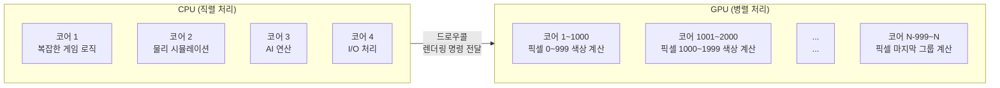
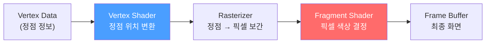
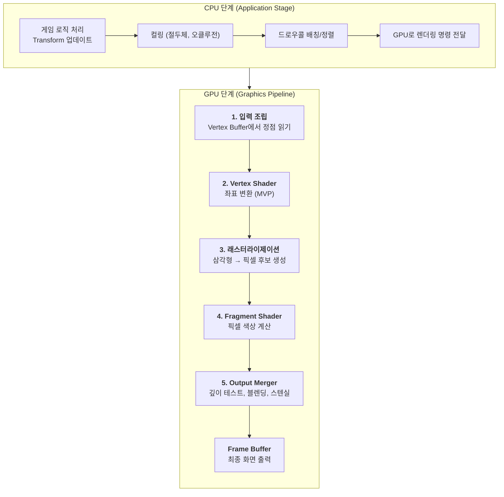
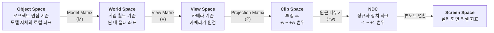
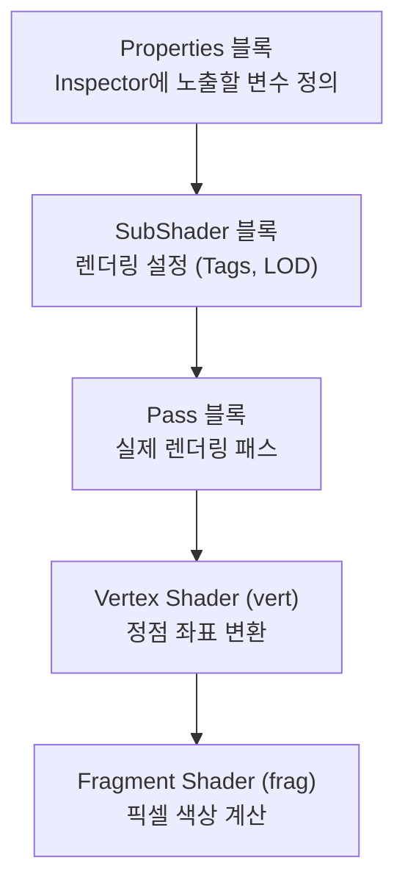
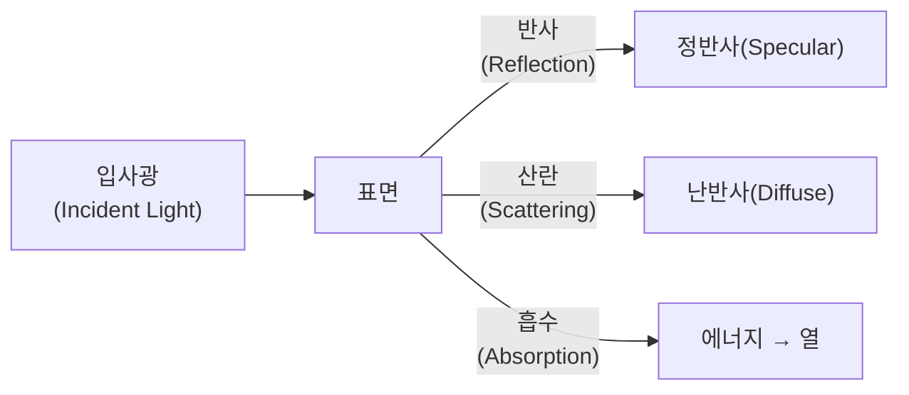
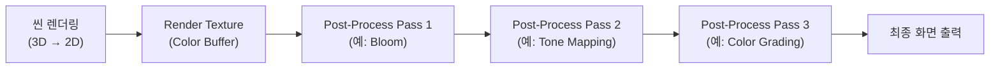
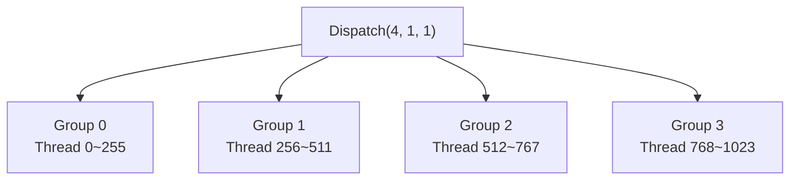
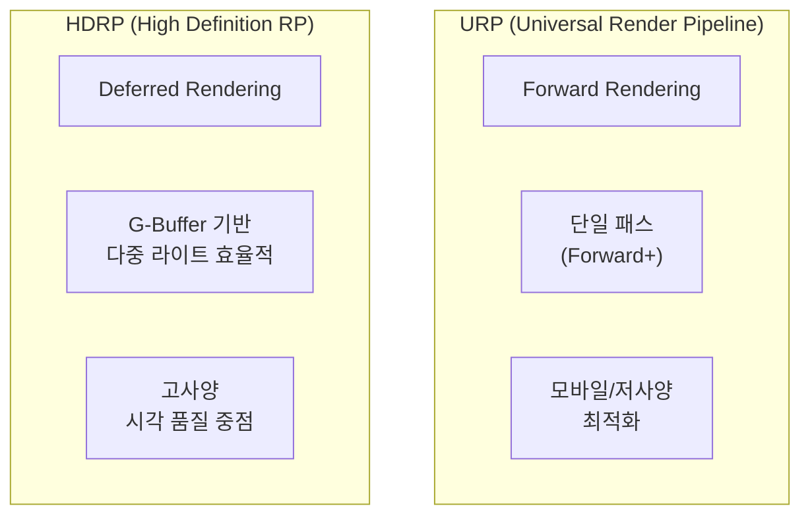

## 서론

게임 개발자에게 셰이더는 "마법의 영역"으로 느껴지기 쉽습니다. Unity의 Material Inspector에서 슬라이더를 조절하면 오브젝트가 반짝이고, 색이 바뀌고, 반투명해지는데, 그 안에서 정확히 무슨 일이 일어나는지는 잘 모르는 경우가 많습니다.

셰이더를 이해한다는 것은 **"GPU가 화면의 픽셀 하나하나를 어떻게 결정하는가"**를 이해하는 것입니다. 이것은 단순히 예쁜 이펙트를 만드는 것을 넘어, 성능 최적화, 렌더링 디버깅, 그리고 기술 아트 전반에 걸친 문제 해결 능력을 키워줍니다.

이 문서는 셰이더의 기본 원리부터 시작하여, Unity와 Unreal 양쪽 엔진에서의 구현까지 점진적으로 깊이를 더해갑니다. 그래픽스 프로그래밍에 익숙하지 않더라도 따라올 수 있도록 구성했습니다.

---

## Part 1: Shader의 본질

셰이더를 공부하기 전에, 가장 먼저 답해야 할 질문이 있습니다. "셰이더란 정확히 무엇인가?" 그리고 "왜 GPU라는 별도의 하드웨어가 필요한가?" 이 파트에서는 셰이더의 정체와, 그것이 동작하는 하드웨어의 특성을 다룹니다.

### 1. Shader 란 무엇인가?

Shader는 **GPU에서 실행되는 프로그램**입니다. 3D 또는 2D 그래픽스 파이프라인에서 정점(Vertex)의 위치를 변환하거나, 픽셀(Pixel)의 최종 색상을 계산하는 역할을 합니다.

"화면에 보이는 결과물을 예쁘게 만든다"는 셰이더의 목적을 잘 짚은 표현이지만, 실제로는 훨씬 다양한 기능을 포함합니다.

| 셰이더가 하는 일 | 구체적 예시 |
| --- | --- |
| 정점 위치 변환 | 오브젝트를 화면 좌표로 투영 |
| 조명 계산 | 빛의 방향, 강도, 색상에 따른 표면 밝기 결정 |
| 텍스처 매핑 | 2D 이미지를 3D 표면에 입히기 |
| 그림자 처리 | Shadow Map 생성 및 샘플링 |
| 후처리 효과 | Bloom, HDR Tone Mapping, SSAO |
| 버텍스 애니메이션 | 바람에 흔들리는 풀, 물결 시뮬레이션 |
| 특수 효과 | 디졸브, 홀로그램, 왜곡, 아웃라인 |

핵심은 셰이더가 **CPU가 아닌 GPU에서 실행된다**는 점입니다. 이 차이는 단순한 하드웨어 선택이 아니라, 프로그래밍 패러다임 자체가 달라지는 근본적인 차이입니다.

---

### 1-1. CPU vs GPU: 왜 GPU인가?

CPU는 **직렬 처리의 달인**입니다. 복잡한 분기 로직, 다양한 명령어, 넓은 캐시를 갖추고 있어 범용 연산에 탁월합니다. 반면 GPU는 **병렬 처리의 달인**입니다. 단순한 연산을 수천, 수만 개의 코어에서 동시에 수행합니다.

화면을 렌더링한다는 것은 결국 **수백만 개의 픽셀 각각에 대해 색상을 계산하는 것**입니다. 1920×1080 해상도라면 약 200만 개의 픽셀입니다. 이 계산들은 대부분 서로 독립적입니다. 픽셀 A의 색상을 결정하는 데 픽셀 B의 결과가 필요하지 않습니다. 이것이 바로 GPU가 빛을 발하는 지점입니다.



| 특성 | CPU | GPU |
| --- | --- | --- |
| 코어 수 | 4~16개 (보통) | 수천~수만 개 |
| 코어당 능력 | 고성능 (복잡한 분기 처리) | 저성능 (단순 연산 특화) |
| 적합한 작업 | 게임 로직, AI, 물리 | 픽셀 계산, 행렬 연산 |
| 비유 | 천재 수학 교수 4명 | 사칙연산 가능한 학생 수천 명 |

CPU는 천재 교수 4명이 어려운 문제를 순서대로 풀어나가는 것이고, GPU는 덧셈·곱셈만 할 줄 아는 학생 수천 명이 동시에 각자 하나씩 계산하는 것입니다. 렌더링은 후자에 압도적으로 유리한 작업입니다.

> **Q. GPU 코어가 단순하다면, 셰이더에서 복잡한 로직을 작성할 수 없나요?**
>
> 작성할 수는 있지만, 성능 비용이 큽니다. GPU 코어는 분기(if-else)를 싫어합니다. GPU는 같은 워프(Warp, NVIDIA 기준 32개 스레드 묶음) 내의 모든 스레드가 같은 명령어를 실행해야 가장 효율적입니다. 분기가 발생하면 일부 스레드는 대기해야 하므로 성능이 저하됩니다. 이를 **Warp Divergence**(워프 발산)라고 합니다. 셰이더 최적화에서 if문을 줄이라는 조언은 여기서 나옵니다.
{: .prompt-info}

---

### 1-2. 셰이더의 종류

그래픽스 파이프라인에서 셰이더는 각각 다른 단계에서 실행되며, 역할이 명확히 구분됩니다. 가장 기본이 되는 두 가지는 **Vertex Shader**와 **Fragment(Pixel) Shader**입니다.



| 셰이더 종류 | 실행 단위 | 역할 | 비유 |
| --- | --- | --- | --- |
| **Vertex Shader** | 정점마다 1회 | 3D 좌표 → 화면 좌표 변환 | 건물의 뼈대 세우기 |
| **Fragment Shader** | 픽셀 후보마다 1회 | 최종 색상 결정 | 벽에 페인트 칠하기 |
| Geometry Shader | 프리미티브마다 1회 | 기하 도형 추가/제거 | 건물 증축 (잘 안 씀) |
| Tessellation Shader | 패치마다 1회 | 메시 세분화 | LOD 디테일 증가 |
| Compute Shader | 임의 스레드 그룹 | 범용 GPU 연산 | GPU에서 아무 계산이나 |

대부분의 셰이더 작업은 Vertex Shader와 Fragment Shader에서 이루어집니다. 이 두 가지를 깊이 이해하는 것이 셰이더 프로그래밍의 핵심입니다.

---

## Part 2: 렌더링 파이프라인

셰이더는 혼자 동작하지 않습니다. **렌더링 파이프라인**이라는 정해진 흐름 속에서 각자의 단계를 맡아 실행됩니다. 이 파이프라인을 이해하지 않으면 셰이더 코드가 "왜 이렇게 작성되어야 하는지" 납득하기 어렵습니다.

### 2. 렌더링 파이프라인의 전체 흐름

3D 오브젝트가 화면에 그려지기까지의 과정을 **렌더링 파이프라인**이라고 합니다. 게임 프로그래머에게 익숙한 표현으로, **CPU에서의 게임 루프가 매 프레임 돌듯이, GPU에서의 렌더링 파이프라인도 매 프레임 실행됩니다.**



각 단계를 하나씩 살펴봅시다.

---

### 2-1. 입력 조립 (Input Assembly)

GPU가 가장 먼저 하는 일은 **Vertex Buffer**에서 정점 데이터를 읽어오는 것입니다. 3D 모델링 툴에서 만든 메시는 결국 정점들의 집합이며, 각 정점에는 다음 정보가 담겨 있습니다.

| 정점 속성 | 설명 | 예시 값 |
| --- | --- | --- |
| Position | 오브젝트 공간에서의 위치 | (1.0, 2.5, -0.3) |
| Normal | 표면에서 바깥으로 향하는 법선 벡터 | (0.0, 1.0, 0.0) |
| Tangent | UV의 U 방향에 해당하는 접선 벡터 | (1.0, 0.0, 0.0, 1.0) |
| UV (TexCoord) | 텍스처 매핑용 2D 좌표 | (0.5, 0.75) |
| Color | 정점 색상 (선택적) | (1.0, 0.0, 0.0, 1.0) |

이 정점들을 **인덱스 버퍼(Index Buffer)**를 통해 삼각형으로 조립합니다. 예를 들어, 사각형(Quad) 하나는 4개의 정점과 6개의 인덱스(삼각형 2개)로 구성됩니다.

```
정점: v0(0,0,0) v1(1,0,0) v2(1,1,0) v3(0,1,0)

인덱스: [0,1,2] [0,2,3]
       ▲ 삼각형1  ▲ 삼각형2

v3 ─── v2
│ ╲    │     ← 두 삼각형으로 사각형 구성
│   ╲  │
v0 ─── v1
```

그래픽스에서 **삼각형이 기본 프리미티브**인 이유는, 세 점이 항상 하나의 평면을 결정하기 때문입니다. 사각형은 네 점이 동일 평면에 있지 않을 수 있어 렌더링이 모호해질 수 있습니다.

---

### 2-2. Vertex Shader: 좌표 변환의 핵심

Vertex Shader의 핵심 역할은 **좌표 변환(Coordinate Transformation)**입니다. 3D 오브젝트의 정점 위치를 최종적으로 화면(스크린) 좌표로 변환해야 합니다. 이 과정에서 여러 좌표계를 거칩니다.

#### 좌표계의 변환 순서 (MVP Transform)



이것이 바로 **MVP(Model-View-Projection) 변환**입니다. 셰이더 코드에서 가장 자주 보는 연산입니다.

**각 좌표계를 직관적으로 이해하기:**

- **Object Space (오브젝트 공간)**: 모델링 툴에서 만든 그대로의 좌표. 캐릭터의 발이 (0,0,0)이고 머리가 (0,1.8,0)인 식입니다.
- **World Space (월드 공간)**: 씬에 배치된 후의 좌표. Transform의 position, rotation, scale이 적용됩니다.
- **View Space (뷰 공간)**: 카메라를 원점(0,0,0)으로 놓고 바라보는 방향을 -Z축으로 설정한 좌표계. 참고로 OpenGL은 -Z, DirectX는 +Z가 카메라 전방입니다.
- **Clip Space (클립 공간)**: 투영 행렬 적용 후의 좌표. 여기서 **절두체(View Frustum) 밖의 정점은 잘려나갑니다(Clipping)**.
- **NDC (Normalized Device Coordinates)**: 클립 좌표를 w로 나눠 -1~+1 범위로 정규화한 것. 이때 **원근 나누기(Perspective Division)**가 일어나 원근감이 생깁니다.
- **Screen Space (스크린 공간)**: NDC를 실제 화면 해상도(예: 1920×1080)에 매핑한 최종 픽셀 좌표.

HLSL 코드로 보면 이 모든 변환이 단 한 줄입니다.

```hlsl
// Vertex Shader의 핵심 한 줄
float4 clipPos = mul(UNITY_MATRIX_MVP, float4(vertexPos, 1.0));
// = Projection * View * Model * vertexPosition
```

> **Q. View Space에서 Z축 방향이 왜 중요한가요?**
>
> Unity는 좌표계가 왼손 좌표계(Left-Handed)이고, 카메라 전방이 +Z입니다. OpenGL은 오른손 좌표계(Right-Handed)이며 카메라 전방이 -Z입니다. Unreal은 왼손 좌표계이지만 Z-up입니다. 이 차이 때문에 셰이더를 엔진 간 이식할 때 좌표 부호가 뒤집히는 문제가 빈번하게 발생합니다. 노말 맵이 뒤집혀 보이거나, 반사가 이상한 방향으로 나타나는 버그의 원인이 대부분 여기 있습니다.
{: .prompt-warning}

---

### 2-3. 래스터라이제이션 (Rasterization)

래스터라이제이션은 **버텍스 셰이더가 출력한 삼각형을, 화면의 픽셀 격자에 맞춰 "어떤 픽셀이 이 삼각형 안에 들어오는지" 판단하는 과정**입니다.

이 단계는 프로그래머가 직접 제어할 수 없는 **고정 함수(Fixed-Function)** 단계입니다. 하드웨어가 알아서 처리합니다.

```
삼각형 정점 3개 (v0, v1, v2)가 화면 좌표로 변환된 상태

    v2
   ╱  ╲           ← 삼각형 윤곽
  ╱    ╲
 ╱  ■■  ╲         ← ■ = 이 삼각형에 포함된 픽셀 (Fragment)
╱ ■■■■■■ ╲
v0 ──────── v1

각 ■ 픽셀(Fragment)에 대해:
- 위치: 정점 간 보간으로 계산
- Normal: 정점 Normal의 보간 값
- UV: 정점 UV의 보간 값
- 기타: 정점에서 넘긴 모든 데이터의 보간 값
```

핵심은 **보간(Interpolation)**입니다. 삼각형의 세 정점이 각각 다른 Normal, UV, Color 값을 가지고 있을 때, 삼각형 내부의 각 픽셀은 **무게중심 좌표(Barycentric Coordinates)**를 이용해 세 정점 값을 적절히 섞어 계산됩니다.

$$\text{P} = \alpha \cdot v_0 + \beta \cdot v_1 + \gamma \cdot v_2 \quad (\alpha + \beta + \gamma = 1)$$

여기서 $\alpha$, $\beta$, $\gamma$는 해당 픽셀이 각 정점에 얼마나 가까운지를 나타내는 가중치입니다. 정점 $v_0$에 가까울수록 $\alpha$가 크고, $v_0$의 데이터가 더 많이 반영됩니다.

래스터라이저가 생성한 각 픽셀 후보를 **Fragment**라고 부릅니다. Fragment Shader가 "Fragment" Shader인 이유가 바로 이것입니다. 최종 화면의 픽셀이 아닌, **픽셀 후보(Fragment)**를 처리하기 때문입니다. 깊이 테스트(Depth Test)에서 탈락하면 실제 픽셀이 되지 못하는 Fragment도 있습니다.

---

### 2-4. Fragment Shader: 색상 결정

Fragment Shader(= Pixel Shader, DirectX 용어)는 **래스터라이저가 만들어낸 각 Fragment의 최종 색상을 결정**합니다. 셰이더 프로그래밍에서 가장 많은 시간을 보내는 곳이 바로 여기입니다.

Fragment Shader가 하는 일:
1. **텍스처 샘플링**: UV 좌표로 텍스처에서 색상을 읽어옴
2. **조명 계산**: 빛의 방향, 표면 법선, 카메라 방향을 이용해 밝기 결정
3. **그림자 처리**: Shadow Map을 샘플링해 그림자 여부 판단
4. **이펙트 적용**: 림라이트, 프레넬, 디졸브 등 시각 효과

입력으로 래스터라이저가 보간한 데이터(Normal, UV, Position 등)를 받고, 출력으로 **float4 색상(RGBA)**을 반환합니다.

```hlsl
// 가장 단순한 Fragment Shader
float4 frag(v2f i) : SV_Target
{
    // 텍스처에서 색상 읽기
    float4 texColor = tex2D(_MainTex, i.uv);

    // 조명 계산 (Lambert)
    float NdotL = saturate(dot(i.normal, _WorldSpaceLightPos0.xyz));

    // 텍스처 색 × 조명
    return texColor * NdotL;
}
```

---

### 2-5. Output Merger: 최종 합성

Fragment Shader가 색상을 출력한 뒤, **Output Merger** 단계에서 최종적으로 프레임 버퍼에 쓸지 말지를 결정합니다.

| 테스트 | 역할 | 설명 |
| --- | --- | --- |
| **Depth Test** | 깊이 비교 | 이미 더 가까운 오브젝트가 있으면 이 Fragment 폐기 |
| **Stencil Test** | 마스킹 | 스텐실 버퍼 값을 기준으로 통과/폐기 결정 |
| **Blending** | 색상 합성 | 반투명 오브젝트의 경우, 기존 색과 새 색을 혼합 |

불투명 오브젝트는 보통 **앞에서 뒤 (Front-to-Back)** 순서로 렌더링합니다. 뒤에 있는 오브젝트의 Fragment가 Depth Test에서 일찍 탈락(Early-Z)하여 Fragment Shader 실행 자체를 건너뛸 수 있기 때문입니다. 이것은 성능상 매우 중요한 최적화입니다.

반투명 오브젝트는 반대로 **뒤에서 앞 (Back-to-Front)** 순서로 렌더링해야 올바른 블렌딩 결과를 얻을 수 있습니다. 이것이 반투명 오브젝트의 정렬 문제(Transparency Sorting Problem)입니다.

> **Q. 오버드로우(Overdraw)가 성능에 영향을 미치나요?**
>
> 네, 큰 영향을 미칩니다. 같은 픽셀 위치에 여러 오브젝트가 겹치면 Fragment Shader가 여러 번 실행됩니다. 특히 파티클이나 반투명 이펙트가 많은 장면에서는 한 픽셀에 대해 수십 번의 Fragment Shader가 실행될 수 있습니다. Unity의 Scene View에서 **Overdraw 시각화 모드**를 켜면 확인할 수 있습니다. 모바일에서는 이것이 fill rate 병목의 주요 원인이 됩니다.
{: .prompt-info}

---

## Part 3: 좌표계와 공간 변환

셰이더 코드를 읽다 보면 `objectSpace`, `worldSpace`, `viewSpace`, `tangentSpace` 같은 용어가 끊임없이 등장합니다. 이 "공간(Space)"들을 제대로 이해하지 않으면 셰이더 코드는 마법의 주문처럼 보입니다. 이 파트에서는 각 공간의 의미와 변환 행렬의 본질을 파고듭니다.

### 3. 행렬(Matrix)이 하는 일

3D 그래픽스에서 행렬은 **좌표 변환의 도구**입니다. 위치를 옮기고(Translation), 회전하고(Rotation), 크기를 바꾸는(Scale) 모든 것이 행렬 곱셈으로 이루어집니다.

4×4 행렬 하나에 이 세 가지 변환을 모두 담을 수 있습니다.

$$
\begin{bmatrix}
\text{Scale} \times \text{Rotation} & \text{Translation} \\
0 \quad 0 \quad 0 & 1
\end{bmatrix}
=
\begin{bmatrix}
R_{00} \cdot S_x & R_{01} \cdot S_y & R_{02} \cdot S_z & T_x \\
R_{10} \cdot S_x & R_{11} \cdot S_y & R_{12} \cdot S_z & T_y \\
R_{20} \cdot S_x & R_{21} \cdot S_y & R_{22} \cdot S_z & T_z \\
0 & 0 & 0 & 1
\end{bmatrix}
$$

왜 4×4인가? 3D 좌표는 (x, y, z) 세 성분이지만, **이동(Translation)을 행렬 곱으로 표현하기 위해 동차 좌표(Homogeneous Coordinates)**를 사용합니다. (x, y, z, **w**)에서 w=1이면 위치(Point), w=0이면 방향(Direction)입니다. 방향 벡터는 이동의 영향을 받지 않아야 하므로 w=0으로 설정합니다.

```hlsl
// 셰이더에서의 행렬 곱 (Unity HLSL)
float4 worldPos = mul(unity_ObjectToWorld, float4(objectPos, 1.0)); // 위치: w=1
float3 worldNormal = mul((float3x3)unity_ObjectToWorld, objectNormal); // 방향: 3x3만 사용
```

> **주의**: 법선 벡터(Normal)의 변환에는 **Model 행렬의 역전치 행렬(Inverse Transpose)**을 사용해야 합니다. 비균일 스케일(Non-uniform Scale)이 적용된 오브젝트에서 단순히 Model 행렬을 곱하면 법선이 표면에 수직하지 않게 됩니다. Unity에서는 `unity_WorldToObject`의 전치를 사용하거나, `TransformObjectToWorldNormal()` 함수를 씁니다.
{: .prompt-warning}

---

### 3-1. 탄젠트 공간 (Tangent Space)

Normal Map을 사용하려면 **Tangent Space(탄젠트 공간)**을 이해해야 합니다. 이 공간은 표면의 각 정점마다 정의되는 **로컬 좌표계**입니다.

```
             Normal (N)
               ↑
               │
               │
    ───────────┼───────────→ Tangent (T)
              ╱│
             ╱ │
            ╱  │
      Bitangent (B)

T = UV의 U 방향
B = UV의 V 방향 (= cross(N, T) × handedness)
N = 표면 법선
```

**TBN 행렬**은 이 세 벡터(Tangent, Bitangent, Normal)를 열 벡터로 구성한 3×3 행렬로, 탄젠트 공간과 월드 공간 사이의 변환을 담당합니다.

$$
\text{TBN} = \begin{bmatrix} T_x & B_x & N_x \\ T_y & B_y & N_y \\ T_z & B_z & N_z \end{bmatrix}
$$

Normal Map의 RGB 값 (0~1)을 (-1~+1) 범위로 변환하면 탄젠트 공간에서의 법선이 됩니다. 이것을 TBN 행렬로 월드 공간으로 변환하면 실제 조명 계산에 사용할 수 있는 월드 법선을 얻습니다.

```hlsl
// Normal Map에서 월드 법선 구하기
float3 tangentNormal = tex2D(_BumpMap, i.uv).xyz * 2.0 - 1.0; // 0~1 → -1~+1
float3 worldNormal = normalize(mul(tangentNormal, float3x3(i.tangent, i.bitangent, i.normal)));
```

> **Q. Normal Map이 왜 파란색인가요?**
>
> Normal Map의 RGB는 탄젠트 공간에서의 XYZ 방향을 나타냅니다. 대부분의 표면은 법선이 (0, 0, 1), 즉 표면에서 수직으로 나가는 방향입니다. 이것을 0~1 범위로 인코딩하면 (0.5, 0.5, 1.0)이 됩니다. RGB로 보면 R=0.5, G=0.5, B=1.0이므로 파란색으로 보이는 것입니다. 요철이 심한 부분은 법선이 기울어지면서 파란색에서 벗어나 빨간색/녹색 톤이 섞입니다.
{: .prompt-info}

---

## Part 4: HLSL 기초와 셰이더 작성

이론을 이해했으니, 실제로 코드를 작성해봅시다. 이 파트에서는 HLSL(High-Level Shading Language)의 핵심 문법과 Unity/Unreal에서의 셰이더 구조를 다룹니다.

### 4. HLSL 핵심 데이터 타입

셰이더 코드에서 가장 자주 사용하는 타입들입니다.

| 타입 | 크기 | 용도 | 예시 |
| --- | --- | --- | --- |
| `float` | 32bit | 고정밀 실수 | 월드 좌표, 시간 |
| `half` | 16bit | 저정밀 실수 (모바일 최적화) | 색상, UV |
| `fixed` | 11bit | 최저정밀 (Unity 레거시) | 단순 색상 |
| `float2` | 64bit | 2D 벡터 | UV 좌표 |
| `float3` | 96bit | 3D 벡터 | 위치, 방향, 색상(RGB) |
| `float4` | 128bit | 4D 벡터 | 색상(RGBA), 클립 좌표 |
| `float4x4` | 512bit | 4×4 행렬 | MVP 변환 |
| `sampler2D` | - | 2D 텍스처 샘플러 | 텍스처 읽기용 |

**Swizzling** — HLSL의 강력한 기능 중 하나입니다.

```hlsl
float4 color = float4(1.0, 0.5, 0.3, 1.0);

color.rgb;     // float3(1.0, 0.5, 0.3) — 앞 세 성분
color.rg;      // float2(1.0, 0.5)
color.bgr;     // float3(0.3, 0.5, 1.0) — 순서 변경!
color.rrr;     // float3(1.0, 1.0, 1.0) — 반복도 가능
color.xyzw;    // xyzw로도 접근 가능 (= rgba와 동일)
```

---

### 4-1. Unity ShaderLab 구조

Unity에서 셰이더를 작성할 때는 **ShaderLab**이라는 래퍼 언어 안에 HLSL 코드를 작성합니다.

```hlsl
Shader "Custom/BasicDiffuse"
{
    Properties
    {
        _MainTex ("Texture", 2D) = "white" {}
        _Color ("Color Tint", Color) = (1,1,1,1)
    }

    SubShader
    {
        Tags { "RenderType"="Opaque" "Queue"="Geometry" }

        Pass
        {
            HLSLPROGRAM
            #pragma vertex vert
            #pragma fragment frag

            #include "Packages/com.unity.render-pipelines.universal/ShaderLibrary/Core.hlsl"
            #include "Packages/com.unity.render-pipelines.universal/ShaderLibrary/Lighting.hlsl"

            // ── 프로퍼티 변수 선언 ──
            TEXTURE2D(_MainTex);
            SAMPLER(sampler_MainTex);
            float4 _MainTex_ST;
            float4 _Color;

            // ── Vertex Shader 입력 구조체 ──
            struct Attributes
            {
                float4 positionOS : POSITION;    // Object Space 위치
                float3 normalOS   : NORMAL;      // Object Space 법선
                float2 uv         : TEXCOORD0;   // UV 좌표
            };

            // ── Vertex → Fragment 전달 구조체 ──
            struct Varyings
            {
                float4 positionCS : SV_POSITION; // Clip Space 위치
                float2 uv         : TEXCOORD0;
                float3 normalWS   : TEXCOORD1;   // World Space 법선
            };

            // ── Vertex Shader ──
            Varyings vert(Attributes IN)
            {
                Varyings OUT;
                OUT.positionCS = TransformObjectToHClip(IN.positionOS.xyz);
                OUT.uv = TRANSFORM_TEX(IN.uv, _MainTex);
                OUT.normalWS = TransformObjectToWorldNormal(IN.normalOS);
                return OUT;
            }

            // ── Fragment Shader ──
            float4 frag(Varyings IN) : SV_Target
            {
                // 텍스처 샘플링
                float4 texColor = SAMPLE_TEXTURE2D(_MainTex, sampler_MainTex, IN.uv);

                // 메인 라이트 가져오기
                Light mainLight = GetMainLight();

                // Lambert Diffuse
                float NdotL = saturate(dot(normalize(IN.normalWS), mainLight.direction));

                float3 diffuse = texColor.rgb * _Color.rgb * mainLight.color * NdotL;

                return float4(diffuse, texColor.a);
            }

            ENDHLSL
        }
    }
}
```

이 코드의 흐름을 정리하면:



| 블록 | 역할 | 비유 |
| --- | --- | --- |
| `Properties` | 외부에서 조절 가능한 파라미터 | Unity Inspector의 슬라이더/색상 필드 |
| `SubShader` | GPU 성능에 따른 셰이더 그룹 | LOD 설정과 유사 |
| `Pass` | 한 번의 드로우콜에 해당 | 실제 GPU 실행 단위 |
| `Tags` | 렌더링 순서, 방식 지정 | Queue, RenderType 등 |

---

### 4-2. Unreal Material System과의 비교

Unreal Engine은 셰이더를 직접 코드로 작성하는 대신, **Material Editor**(노드 기반 비주얼 에디터)를 주로 사용합니다. 물론 Custom HLSL 노드로 코드를 직접 작성할 수도 있습니다.

| 항목 | Unity | Unreal |
| --- | --- | --- |
| 기본 작성 방식 | ShaderLab + HLSL 코드 | Material Editor (노드 기반) |
| 비주얼 에디터 | Shader Graph | Material Editor |
| 커스텀 코드 | .shader 파일 직접 작성 | Custom Expression 노드, .ush/.usf |
| 렌더 파이프라인 | URP / HDRP / Built-in | Deferred / Forward (설정으로 선택) |
| 셰이더 언어 | HLSL (CG는 레거시) | HLSL (Unreal 매크로 래핑) |
| 셰이더 모델 | SM 3.0~6.0 | SM 5.0~6.0 |

Unreal의 Material에서 **Base Color, Metallic, Roughness, Normal** 등의 핀(Pin)에 연결하는 것은 사실상 **Fragment Shader의 출력값을 설정하는 것**과 동일합니다. Unreal이 내부적으로 이 값들을 받아서 PBR 라이팅 연산을 수행합니다.

```
[Unreal Material Editor]                  [Unity Shader 코드와의 대응]
┌─────────────────────────┐
│ Texture Sample ─┬─ Base Color    ←→  texColor.rgb
│                 │
│ Constant(0.8) ──── Metallic      ←→  _Metallic
│                 │
│ Constant(0.2) ──── Roughness     ←→  1.0 - _Smoothness
│                 │
│ Normal Map ─────── Normal         ←→  UnpackNormal(tex2D(_BumpMap, uv))
│                 │
│ Constant(0.04)─── Specular       ←→  _SpecColor
└─────────────────────────┘
```

---

## Part 5: 조명 모델 (Lighting Models)

셰이더에서 가장 핵심적인 주제는 **조명(Lighting)**입니다. 오브젝트에 빛이 닿았을 때 어떻게 보일지를 계산하는 것이야말로 셰이더의 존재 이유라고 할 수 있습니다.

### 5. 빛과 표면의 상호작용

빛이 표면에 닿으면 크게 세 가지 현상이 발생합니다.



| 현상 | 물리적 의미 | 시각적 결과 |
| --- | --- | --- |
| **Diffuse (난반사)** | 빛이 표면에 들어갔다가 여러 방향으로 산란 | 표면의 고유 색상 (밋밋한 밝기) |
| **Specular (정반사)** | 빛이 표면에서 직접 반사 | 반짝이는 하이라이트 |
| **Ambient (환경광)** | 간접광의 근사치 | 그림자 부분의 최소 밝기 |

---

### 5-1. Lambert Diffuse 모델

가장 기본적인 조명 모델입니다. **빛의 방향(L)**과 **표면 법선(N)**의 내적으로 밝기를 결정합니다.

$$I_{diffuse} = C_{light} \times C_{surface} \times \max(0, \vec{N} \cdot \vec{L})$$

직관적으로, 빛이 표면에 수직으로 닿을수록(N·L = 1) 밝고, 비스듬히 닿을수록(N·L → 0) 어둡고, 뒤에서 닿으면(N·L < 0) 빛을 받지 않습니다.

```
빛이 수직으로 닿을 때         빛이 비스듬히 닿을 때
     L                           L
     ↓                          ╲
     ↓                           ╲
━━━━━━━━━                  ━━━━━━━━━
  N ↑                          N ↑

N·L = 1.0 (최대 밝기)        N·L ≈ 0.5 (중간 밝기)
```

```hlsl
// Lambert Diffuse 셰이더 구현
float NdotL = saturate(dot(normalWS, lightDir));
float3 diffuse = lightColor * albedo * NdotL;
```

Lambert 모델은 **시점(카메라 위치)에 무관합니다**. 카메라를 어디에 놓든 Diffuse 밝기는 같습니다. 이것이 Specular와의 근본적인 차이입니다.

---

### 5-2. Phong / Blinn-Phong Specular 모델

표면에서 빛이 반사되어 카메라에 들어오면 **하이라이트(Specular Highlight)**가 보입니다. 이것을 계산하는 고전적인 모델이 **Phong 모델**과 그 개선형인 **Blinn-Phong 모델**입니다.

#### Phong 모델

반사 벡터(R)와 시선 벡터(V)의 내적을 사용합니다.

$$I_{specular} = C_{light} \times C_{specular} \times \max(0, \vec{R} \cdot \vec{V})^{shininess}$$

$$\vec{R} = 2(\vec{N} \cdot \vec{L})\vec{N} - \vec{L}$$

```
        R (반사 벡터)
       ╱
      ╱     V (시선 벡터)
     ╱     ╱
    ╱     ╱
━━━╱━━━━━╱━━━━━━
   ↑ N
   L (빛)

R·V가 클수록 (반사 방향에 가까이 볼수록) 하이라이트가 밝음
shininess가 클수록 하이라이트가 작고 날카로움
```

#### Blinn-Phong 모델 (더 많이 사용)

반사 벡터를 구하는 대신, **하프 벡터(H)**를 사용합니다. 계산이 더 빠르고 시각적으로도 더 자연스럽습니다.

$$\vec{H} = \text{normalize}(\vec{L} + \vec{V})$$

$$I_{specular} = C_{light} \times C_{specular} \times \max(0, \vec{N} \cdot \vec{H})^{shininess}$$

```hlsl
// Blinn-Phong 구현
float3 halfDir = normalize(lightDir + viewDir);
float NdotH = saturate(dot(normalWS, halfDir));
float specular = pow(NdotH, _Shininess) * _SpecIntensity;

// 최종 색상 = Ambient + Diffuse + Specular
float3 finalColor = ambient + diffuse + specular * lightColor;
```

> **Q. Phong과 Blinn-Phong의 실질적 차이는?**
>
> 시각적으로 Blinn-Phong은 Phong보다 하이라이트가 약간 넓게 퍼지는 경향이 있습니다. 성능면에서는 Blinn-Phong이 유리합니다. 반사 벡터 R을 구하려면 `reflect()` 연산이 필요하지만, 하프 벡터 H는 단순한 벡터 덧셈 + normalize로 구할 수 있기 때문입니다. 대부분의 게임 엔진(Unity Built-in, Unreal Legacy)에서 Blinn-Phong을 기본으로 사용합니다.
{: .prompt-info}

---

### 5-3. PBR (Physically Based Rendering)

현대 게임 엔진(Unity URP/HDRP, Unreal Engine 4/5)의 기본 조명 모델은 **PBR(물리 기반 렌더링)**입니다. Phong/Blinn-Phong과 달리, **에너지 보존 법칙**을 준수하고 **프레넬 효과**를 반영하여 훨씬 현실적인 결과를 냅니다.

#### PBR의 핵심 파라미터

| 파라미터 | 범위 | 의미 |
| --- | --- | --- |
| **Albedo** (Base Color) | RGB 색상 | 표면의 고유 색상 (조명 제외) |
| **Metallic** | 0.0 ~ 1.0 | 금속성 (0=비금속, 1=금속) |
| **Roughness** (= 1 - Smoothness) | 0.0 ~ 1.0 | 거칠기 (0=거울, 1=완전 무광) |
| **Normal** | 탄젠트 공간 벡터 | 미세 표면 굴곡 |
| **AO** (Ambient Occlusion) | 0.0 ~ 1.0 | 틈새 그림자 |

#### Metallic-Roughness 워크플로우

```
         Roughness = 0           Roughness = 0.5          Roughness = 1.0
         (완전 매끄러움)          (중간)                    (완전 거침)
Metal=0  [유리, 물방울]          [플라스틱]                [진흙, 천]
Metal=1  [크롬 거울]             [닦은 금속]               [녹슨 철]
```

#### PBR의 수학적 기반: Cook-Torrance BRDF

PBR의 Specular 항은 **Cook-Torrance 모델**을 기반으로 합니다.

$$f_{spec} = \frac{D \cdot F \cdot G}{4 \cdot (\vec{N} \cdot \vec{L}) \cdot (\vec{N} \cdot \vec{V})}$$

| 항 | 이름 | 역할 |
| --- | --- | --- |
| **D** | Normal Distribution Function (NDF) | 미세면(microfacet)의 방향 분포. Roughness가 클수록 분포가 넓어짐 |
| **F** | Fresnel 항 | 시선 각도에 따른 반사율 변화. 비스듬히 볼수록 반사가 강해짐 |
| **G** | Geometry 항 | 미세면 간 그림자(self-shadowing)와 마스킹(masking) |

이 각각의 항에 여러 수학 모델이 있습니다.

| 항 | 대표 모델 | 특징 |
| --- | --- | --- |
| D | GGX (Trowbridge-Reitz) | 긴 꼬리 분포, 현실적인 하이라이트. 업계 표준 |
| F | Schlick 근사 | $F_0 + (1 - F_0)(1 - \cos\theta)^5$, 계산이 빠르고 정확 |
| G | Smith GGX | NDF와 일관된 Geometry 함수 |

**Fresnel 효과**는 일상에서도 관찰할 수 있습니다. 호수를 위에서 내려다보면 물 아래가 잘 보이지만, 멀리 수평선을 보면 하늘이 반사되어 보입니다. 시선과 표면이 이루는 각도(Grazing Angle)가 클수록 반사율이 높아지는 것입니다.

```hlsl
// Schlick Fresnel 근사
float3 FresnelSchlick(float cosTheta, float3 F0)
{
    return F0 + (1.0 - F0) * pow(1.0 - cosTheta, 5.0);
}

// F0: 수직 입사 시 반사율
// 비금속: ~0.04 (대부분의 비금속)
// 금속: Albedo 색상 자체가 F0
```

> **Metallic과 Dielectric(비금속)의 차이**
>
> 비금속(플라스틱, 나무, 돌 등)은 Diffuse가 주된 반사 성분이고 Specular는 약합니다(F0 ≈ 0.04). 반면 금속(금, 은, 구리 등)은 Diffuse가 0이고, Specular가 전부입니다. 금속의 Specular 색상은 표면 고유 색상과 동일합니다(금은 노란색 반사, 구리는 주황색 반사). 이것이 Metallic 파라미터의 본질입니다. Metallic = 1이면 Diffuse를 완전히 꺼버리고 Specular에 Albedo 색상을 사용합니다.
{: .prompt-info}

---

## Part 6: 실전 셰이더 기법

이론을 바탕으로, 실제 게임에서 자주 사용되는 셰이더 기법들을 살펴봅시다. 각 기법의 원리와 구현 코드를 함께 다룹니다.

### 6. 텍스처 매핑 심화

#### Triplanar Mapping

UV가 없는 오브젝트(지형, 프로시저럴 메시)에 텍스처를 입히는 기법입니다. 월드 좌표의 XY, XZ, YZ 평면 각각에서 텍스처를 샘플링한 뒤, 법선 방향에 따라 블렌딩합니다.

```hlsl
float3 TriplanarMapping(float3 worldPos, float3 worldNormal, sampler2D tex, float tiling)
{
    // 세 축에서 각각 텍스처 샘플링
    float3 xProj = tex2D(tex, worldPos.yz * tiling).rgb;
    float3 yProj = tex2D(tex, worldPos.xz * tiling).rgb;
    float3 zProj = tex2D(tex, worldPos.xy * tiling).rgb;

    // 법선 방향에 따른 가중치
    float3 blend = abs(worldNormal);
    blend = blend / (blend.x + blend.y + blend.z); // 합이 1이 되도록 정규화

    return xProj * blend.x + yProj * blend.y + zProj * blend.z;
}
```

#### Parallax Mapping (시차 매핑)

Normal Map이 표면의 법선만 바꿔 음영을 속이는 것이라면, Parallax Mapping은 **UV 좌표 자체를 시선 방향에 따라 밀어** 실제로 돌출된 것처럼 보이게 합니다.

```hlsl
// 기본 Parallax Mapping
float2 ParallaxOffset(float2 uv, float3 viewDirTS, sampler2D heightMap, float scale)
{
    float height = tex2D(heightMap, uv).r;
    float2 offset = viewDirTS.xy / viewDirTS.z * (height * scale);
    return uv - offset;
}
```

---

### 6-1. Rim Light (프레넬 이펙트 응용)

캐릭터 윤곽선이 빛나는 효과입니다. 시선 방향과 법선이 수직에 가까울수록(가장자리) 밝아집니다.

```hlsl
float3 RimLight(float3 normalWS, float3 viewDirWS, float3 rimColor, float rimPower)
{
    float rim = 1.0 - saturate(dot(normalWS, viewDirWS));
    rim = pow(rim, rimPower);
    return rimColor * rim;
}

// 사용 예시
float3 rim = RimLight(IN.normalWS, viewDir, _RimColor.rgb, _RimPower);
finalColor += rim;
```

```
        시선 방향 →
       ╱
      ╱
  ┌──────┐
  │ 어두움│  ← N·V 큰 곳 (정면) → rim 약함
  │      │
  ┤ 밝음!├  ← N·V 작은 곳 (가장자리) → rim 강함
  │      │
  └──────┘
```

---

### 6-2. Dissolve (디졸브 이펙트)

노이즈 텍스처의 값이 threshold보다 작으면 `clip()`으로 픽셀을 폐기하는 기법입니다.

```hlsl
float4 frag(Varyings IN) : SV_Target
{
    float4 texColor = SAMPLE_TEXTURE2D(_MainTex, sampler_MainTex, IN.uv);

    // 노이즈 텍스처에서 값 읽기
    float noise = SAMPLE_TEXTURE2D(_DissolveTex, sampler_DissolveTex, IN.uv).r;

    // threshold 이하면 픽셀 폐기
    float dissolveAmount = noise - _DissolveThreshold;
    clip(dissolveAmount);

    // 경계 부분에 색상 효과 (Emission Edge)
    float edge = step(dissolveAmount, _EdgeWidth);
    float3 edgeColor = lerp(float3(0,0,0), _EdgeColor.rgb, edge);

    return float4(texColor.rgb + edgeColor, texColor.a);
}
```

| `_DissolveThreshold` 값 | 효과 |
| --- | --- |
| 0.0 | 완전한 오브젝트 (사라짐 없음) |
| 0.5 | 절반 정도 사라짐 |
| 1.0 | 완전히 사라짐 |

---

### 6-3. Outline (아웃라인 / 셀 셰이딩)

셀 셰이딩(Toon Shading)에서 자주 사용되는 아웃라인 기법입니다. 크게 두 가지 접근법이 있습니다.

**방법 1: 역면 확장 (Inverted Hull)**

두 번째 Pass에서 정점을 법선 방향으로 밀어내고, 앞면을 컬링하여 뒷면만 렌더링합니다.

```hlsl
// 아웃라인 Vertex Shader
Varyings vertOutline(Attributes IN)
{
    Varyings OUT;
    // 법선 방향으로 정점을 밀어냄
    float3 expandedPos = IN.positionOS.xyz + IN.normalOS * _OutlineWidth;
    OUT.positionCS = TransformObjectToHClip(expandedPos);
    return OUT;
}

// 아웃라인 Fragment Shader — 단순히 아웃라인 색상 반환
float4 fragOutline(Varyings IN) : SV_Target
{
    return _OutlineColor;
}
```

**방법 2: 후처리 (Post-Process) — Sobel Edge Detection**

깊이 버퍼나 노말 버퍼에 Sobel 필터를 적용하여 경계를 검출합니다. 캐릭터뿐 아니라 장면 전체에 적용할 수 있습니다.

```hlsl
// Sobel 커널로 깊이 경계 검출
float SobelDepth(float2 uv, float2 texelSize)
{
    float d00 = SampleDepth(uv + float2(-1,-1) * texelSize);
    float d10 = SampleDepth(uv + float2( 0,-1) * texelSize);
    float d20 = SampleDepth(uv + float2( 1,-1) * texelSize);
    float d01 = SampleDepth(uv + float2(-1, 0) * texelSize);
    float d21 = SampleDepth(uv + float2( 1, 0) * texelSize);
    float d02 = SampleDepth(uv + float2(-1, 1) * texelSize);
    float d12 = SampleDepth(uv + float2( 0, 1) * texelSize);
    float d22 = SampleDepth(uv + float2( 1, 1) * texelSize);

    float gx = d00 + 2*d01 + d02 - d20 - 2*d21 - d22;
    float gy = d00 + 2*d10 + d20 - d02 - 2*d12 - d22;

    return sqrt(gx*gx + gy*gy);
}
```

---

## Part 7: 후처리 효과 (Post-Processing)

후처리는 **장면 전체가 렌더링된 후**, 프레임 버퍼(렌더 텍스처)에 대해 2D 이미지 처리를 수행하는 것입니다. 카메라에 부착된 필터와 비슷합니다.

### 7. 후처리의 작동 원리



각 후처리 패스는 **Full-screen Quad**(화면 전체를 덮는 사각형)에 셰이더를 적용하는 것입니다. 입력은 이전 패스의 렌더 텍스처이고, 출력은 다음 패스로 넘길 렌더 텍스처입니다.

---

### 7-1. Bloom

밝은 부분이 빛이 번지듯 퍼지는 효과입니다.

```
[처리 단계]

1. Brightness Filter : 밝기 임계값 이상만 추출
   원본 → 밝은 부분만 남긴 텍스처

2. Gaussian Blur : 여러 단계에 걸쳐 가우시안 블러 적용
   밝은 부분 텍스처 → 점점 흐려지는 텍스처들 (Mip Chain)

3. Upsample & Combine : 블러된 텍스처를 원본에 더함
   원본 + 블러 = 밝은 곳이 퍼져 보이는 최종 결과
```

```hlsl
// 밝기 임계값 필터
float3 BrightnessFilter(float3 color, float threshold)
{
    float brightness = max(color.r, max(color.g, color.b));
    float contribution = max(0, brightness - threshold);
    contribution /= max(brightness, 0.00001);
    return color * contribution;
}
```

---

### 7-2. HDR과 Tone Mapping

실제 세계의 밝기 범위(태양: ~100,000 lux, 달빛: ~0.1 lux)는 모니터가 표현할 수 있는 범위(0~255)를 훨씬 초과합니다. **HDR(High Dynamic Range)** 렌더링은 0~1 범위를 넘는 밝기 값을 사용하고, 최종 출력 시 **Tone Mapping**으로 모니터 범위에 압축합니다.

```hlsl
// ACES Tone Mapping (업계 표준)
float3 ACESToneMapping(float3 color)
{
    float a = 2.51;
    float b = 0.03;
    float c = 2.43;
    float d = 0.59;
    float e = 0.14;
    return saturate((color * (a * color + b)) / (color * (c * color + d) + e));
}
```

| Tone Mapping 방식 | 특징 | 사용처 |
| --- | --- | --- |
| Reinhard | 단순, 밝은 부분 손실 가능 | 학습/테스트 |
| ACES Filmic | 영화 같은 색감, 하이라이트 롤오프 | Unity HDRP, UE5 기본값 |
| Neutral | ACES보다 채도 유지 | Unity URP 기본값 |

---

## Part 8: Compute Shader

Compute Shader는 렌더링 파이프라인에 종속되지 않는 **범용 GPU 프로그래밍** 도구입니다. 화면에 뭔가를 그리는 것이 아니라, GPU의 병렬 연산 능력을 활용해 임의의 계산을 수행합니다.

### 8. Compute Shader가 필요한 이유

GPU의 수천 개 코어를 렌더링 이외의 목적으로 사용하고 싶을 때 Compute Shader를 씁니다.

| 사용 사례 | 설명 |
| --- | --- |
| **파티클 시뮬레이션** | 수십만 파티클의 물리 연산을 GPU에서 병렬 처리 |
| **GPU Skinning** | 애니메이션 뼈대 계산을 GPU에서 수행 |
| **절차적 지형 생성** | 노이즈 함수를 GPU에서 대규모로 계산 |
| **후처리 최적화** | 복잡한 이미지 처리를 Compute에서 수행 |
| **GPU Culling** | GPU에서 직접 절두체/오클루전 컬링 |
| **간접 드로우** | Compute로 드로우 명령을 생성하여 CPU 개입 최소화 |

---

### 8-1. Compute Shader 기본 구조 (Unity)

```hlsl
// SimpleCompute.compute
#pragma kernel CSMain

// 입출력 버퍼
RWStructuredBuffer<float3> _Positions;
float _Time;
uint _Count;

[numthreads(256, 1, 1)]
void CSMain(uint3 id : SV_DispatchThreadID)
{
    if (id.x >= _Count) return;

    float3 pos = _Positions[id.x];

    // 사인파로 Y축 이동
    pos.y = sin(pos.x * 0.5 + _Time) * 2.0;

    _Positions[id.x] = pos;
}
```

```csharp
// C# 디스패치 코드
public class ComputeDispatcher : MonoBehaviour
{
    public ComputeShader computeShader;
    private ComputeBuffer positionBuffer;
    private int kernelIndex;

    void Start()
    {
        kernelIndex = computeShader.FindKernel("CSMain");

        // 버퍼 생성 및 초기 데이터 설정
        positionBuffer = new ComputeBuffer(count, sizeof(float) * 3);
        positionBuffer.SetData(initialPositions);

        computeShader.SetBuffer(kernelIndex, "_Positions", positionBuffer);
        computeShader.SetInt("_Count", count);
    }

    void Update()
    {
        computeShader.SetFloat("_Time", Time.time);

        // 디스패치: 스레드 그룹 수 = 총 개수 / 그룹당 스레드 수
        int threadGroups = Mathf.CeilToInt(count / 256.0f);
        computeShader.Dispatch(kernelIndex, threadGroups, 1, 1);
    }

    void OnDestroy()
    {
        positionBuffer.Release();
    }
}
```

**스레드 구조 이해:**

```
[numthreads(256, 1, 1)] = 스레드 그룹 하나에 256개 스레드

Dispatch(4, 1, 1) = 4개 스레드 그룹 실행

총 스레드 수 = 4 × 256 = 1,024
각 스레드는 SV_DispatchThreadID로 고유 ID를 받음 (0 ~ 1023)
```



---

## Part 9: 셰이더 최적화

셰이더의 성능 비용은 생각보다 큽니다. Fragment Shader는 **매 프레임 수백만 번** 실행되므로, 작은 비효율도 눈덩이처럼 불어납니다.

### 9. 핵심 최적화 원칙

| 원칙 | 설명 | 예시 |
| --- | --- | --- |
| **분기 최소화** | if-else는 Warp Divergence 유발 | `step()`, `lerp()`로 대체 |
| **정밀도 낮추기** | 모바일에서는 half가 float보다 2배 빠름 | 색상/UV에는 half 사용 |
| **텍스처 접근 줄이기** | 텍스처 샘플링은 비싼 연산 | 채널 패킹, 아틀라스 활용 |
| **연산을 Vertex로 이동** | 픽셀보다 정점이 훨씬 적음 | Fog, 일부 조명을 VS에서 계산 |
| **수학 함수 주의** | `pow()`, `sin()`, `cos()` 비용 높음 | LUT(Lookup Texture)로 대체 가능 |
| **오버드로우 감시** | 반투명/파티클 과다 주의 | 파티클 크기, 레이어 수 제한 |

---

### 9-1. 분기 제거 테크닉

```hlsl
// ❌ 비효율적: GPU에서 분기
if (height > 0.5)
    color = rock;
else
    color = grass;

// ✅ 효율적: 수학적으로 블렌딩
float blend = step(0.5, height);          // 0 또는 1
color = lerp(grass, rock, blend);          // 선형 보간

// ✅ 부드러운 전환이 필요한 경우
float blend = smoothstep(0.4, 0.6, height); // 0.4~0.6 사이에서 부드럽게 전환
color = lerp(grass, rock, blend);
```

---

### 9-2. 채널 패킹 (Channel Packing)

텍스처 하나의 RGBA 채널에 서로 다른 데이터를 저장하여 텍스처 샘플링 횟수를 줄이는 기법입니다.

```
일반적인 접근 (텍스처 4장 → 4회 샘플링):
  Metallic Map    (R 채널만 사용)  → 1회 샘플링
  Roughness Map   (R 채널만 사용)  → 1회 샘플링
  AO Map          (R 채널만 사용)  → 1회 샘플링
  Height Map      (R 채널만 사용)  → 1회 샘플링

채널 패킹 (텍스처 1장 → 1회 샘플링):
  Packed Map:
    R = Metallic
    G = Roughness
    B = AO
    A = Height
```

```hlsl
// 채널 패킹된 텍스처 사용
float4 packed = SAMPLE_TEXTURE2D(_PackedMap, sampler_PackedMap, IN.uv);
float metallic  = packed.r;
float roughness = packed.g;
float ao        = packed.b;
float height    = packed.a;
```

Unity와 Unreal 모두 PBR 셰이더에서 이 기법을 표준으로 사용합니다. Unity URP의 기본 Lit 셰이더의 `_MetallicGlossMap`이 바로 이 채널 패킹된 텍스처입니다.

---

## Part 10: 엔진별 렌더 파이프라인 비교

### 10. Unity의 렌더 파이프라인

Unity는 세 가지 렌더 파이프라인을 제공합니다.

| 파이프라인 | 셰이더 언어 | 대상 | 특징 |
| --- | --- | --- | --- |
| **Built-in RP** | CG/HLSL | 레거시 프로젝트 | Surface Shader 지원, 더 이상 업데이트 없음 |
| **URP** | HLSL | 모바일, 저사양 PC | 단일 패스 Forward, 성능 최적화 |
| **HDRP** | HLSL | 고사양 PC, 콘솔 | Deferred 기본, 물리 기반 라이팅 |



#### Forward vs Deferred Rendering

| 항목 | Forward | Deferred |
| --- | --- | --- |
| 라이트 계산 | 오브젝트별로 영향받는 라이트 계산 | G-Buffer에서 한번에 라이팅 |
| 라이트 수 | 많으면 성능 급감 | 라이트 수에 강건함 |
| 반투명 | 자연스러움 | 별도 Forward Pass 필요 |
| 메모리 | 적음 | G-Buffer로 인해 높음 |
| MSAA | 지원 | G-Buffer와 비호환 (TAA 사용) |
| 적합 대상 | 모바일, 라이트 적은 장면 | PC/콘솔, 라이트 많은 장면 |

**G-Buffer란?** Deferred Rendering에서 첫 번째 패스의 출력입니다. 각 픽셀에 대해 Albedo, Normal, Depth, Roughness 등을 별도의 렌더 텍스처에 저장합니다. 두 번째 패스에서 이 데이터를 읽어 라이팅을 한번에 계산합니다.

---

### 10-1. Unreal Engine 5 렌더링 특징

UE5는 두 가지 혁신적 기술을 도입했습니다.

| 기술 | 설명 |
| --- | --- |
| **Nanite** | 가상 지오메트리 시스템. 수억 폴리곤 메시를 자동 LOD + 스트리밍 |
| **Lumen** | 소프트웨어/하드웨어 레이트레이싱 기반 글로벌 일루미네이션 |

Nanite는 전통적인 Vertex Shader 단계를 크게 변형합니다. 메시를 **클러스터** 단위로 쪼개고, GPU에서 가시성 판단(Compute Shader 기반 컬링)을 수행한 뒤, 필요한 클러스터만 래스터라이즈합니다. 이는 기존의 "정점 하나하나를 변환하는" 파이프라인과는 상당히 다른 접근입니다.

Lumen은 기존의 Screen Space 기반 반사/GI(SSAO, SSR) 대신, **씬 전체의 간접광을 실시간으로 시뮬레이션**합니다. SDF(Signed Distance Field) 트레이싱과 Screen Space 트레이싱을 조합하여 사용합니다.

---

## Part 11: 셰이더 디버깅

셰이더는 GPU에서 실행되므로, CPU 코드처럼 브레이크포인트를 걸고 단계별 디버깅을 하기 어렵습니다. 대신 다음 기법들을 활용합니다.

### 11. 시각적 디버깅

가장 기본적이면서 효과적인 방법은 **중간 값을 색상으로 출력**하는 것입니다.

```hlsl
// Normal 시각화
return float4(normalWS * 0.5 + 0.5, 1.0); // -1~1을 0~1로 변환하여 색상으로 표시

// UV 시각화
return float4(IN.uv, 0.0, 1.0); // R=U, G=V

// Depth 시각화
float depth = Linear01Depth(IN.positionCS.z, _ZBufferParams);
return float4(depth, depth, depth, 1.0);

// 특정 값이 0인지 양수인지 음수인지 확인
float val = dot(normalWS, lightDir);
return float4(
    val < 0 ? -val : 0,   // R = 음수 영역 (빨강)
    val > 0 ? val : 0,     // G = 양수 영역 (초록)
    0,
    1.0
);
```

### 디버깅 도구

| 도구 | 엔진 | 기능 |
| --- | --- | --- |
| **RenderDoc** | Unity/Unreal | 프레임 캡처, 셰이더 디버깅, 텍스처 검사 |
| **NVIDIA Nsight** | Unity/Unreal | GPU 프로파일링, 셰이더 단계별 실행 |
| **Frame Debugger** | Unity | 드로우콜 순서 확인, 렌더 타겟 시각화 |
| **GPU Visualizer** | Unreal | GPU 타이밍, 패스별 비용 분석 |
| **PIX** | DirectX 기반 | Xbox/Windows 셰이더 디버깅 |

> **RenderDoc 활용 팁**: Unity에서 `Window > Analysis > RenderDoc`을 열고 프레임을 캡처하면, 각 드로우콜에서 어떤 셰이더가 실행되었는지, 입력 데이터는 무엇이었는지, 출력은 어떻게 나왔는지를 단계별로 확인할 수 있습니다. 셰이더 버그의 90%는 RenderDoc으로 원인을 찾을 수 있습니다.
{: .prompt-info}

---

## Part 12: 더 깊이 파고들기 위한 로드맵

셰이더의 세계는 이 문서에서 다룬 것보다 훨씬 넓고 깊습니다. 다음은 더 공부하기 위한 방향입니다.

### 기초를 다진 후 (이 문서 이후)

| 주제 | 키워드 | 난이도 |
| --- | --- | --- |
| Stencil Buffer 활용 | 포탈, 마스킹, 아웃라인 | ★★☆ |
| Shadow Mapping 구현 | Cascaded Shadow Map, PCF, VSM | ★★★ |
| Screen Space 기법들 | SSAO, SSR, SSS | ★★★ |
| GPU Instancing / Indirect Draw | DrawMeshInstancedIndirect | ★★★ |
| Ray Marching | SDF, Volumetric Fog, 클라우드 | ★★★★ |
| Tessellation | Hull/Domain Shader, 지형 LOD | ★★★ |
| Shader Graph / Material Editor | 비주얼 셰이더 작성 | ★★☆ |

### 추천 학습 자료

| 자료 | 유형 | 설명 |
| --- | --- | --- |
| *Real-Time Rendering, 4th Edition* | 서적 | 그래픽스 이론의 바이블 |
| *GPU Gems* 시리즈 | 서적/온라인 | NVIDIA 제공, 실전 기법 모음 |
| *The Book of Shaders* | 온라인 튜토리얼 | Fragment Shader 입문 (GLSL 기반) |
| *Catlike Coding* | 블로그 | Unity 셰이더 튜토리얼 (고품질) |
| *Ben Cloward* 유튜브 | 영상 | Shader Graph / UE Material 튜토리얼 |
| *Learn OpenGL* | 온라인 튜토리얼 | OpenGL 기반이지만 원리 이해에 탁월 |

---

## 마무리

셰이더는 결국 **"GPU에게 각 픽셀을 어떤 색으로 칠할지 알려주는 프로그램"**입니다. 이 단순한 정의 위에 좌표 변환, 조명 모델, 텍스처 처리, 후처리 효과라는 복잡한 레이어들이 쌓여 우리가 보는 게임 화면이 만들어집니다.

정리하면:

1. **Vertex Shader**는 3D 좌표를 화면 좌표로 변환합니다 (MVP Transform)
2. **래스터라이저**는 삼각형 내부의 픽셀 후보를 생성하고 데이터를 보간합니다
3. **Fragment Shader**는 각 픽셀의 최종 색상을 결정합니다 (조명, 텍스처, 이펙트)
4. **PBR**은 에너지 보존과 프레넬 효과로 현실적인 표면을 표현합니다
5. **후처리**는 최종 이미지에 카메라 필터 같은 효과를 적용합니다
6. **Compute Shader**는 렌더링 외의 범용 GPU 연산을 수행합니다

셰이더의 원리를 이해하면, "이 이펙트를 어떻게 만들까?"라는 질문이 "어떤 입력 데이터를 어떤 수식으로 처리하면 될까?"라는 구체적인 문제로 바뀝니다. 그것이 셰이더를 공부하는 진짜 이유입니다.
