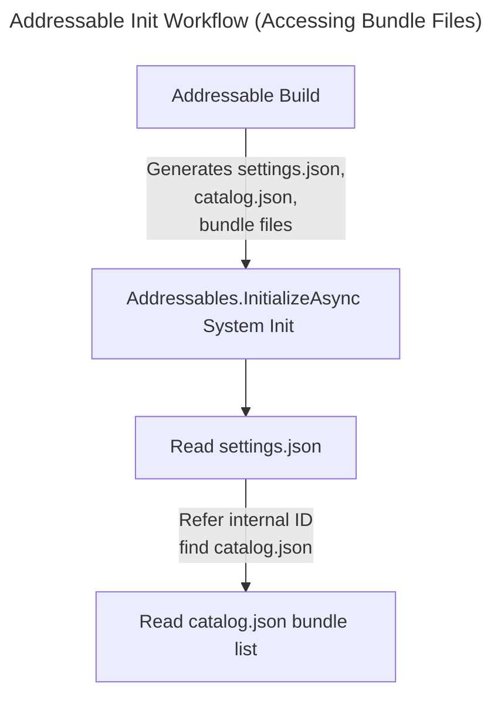
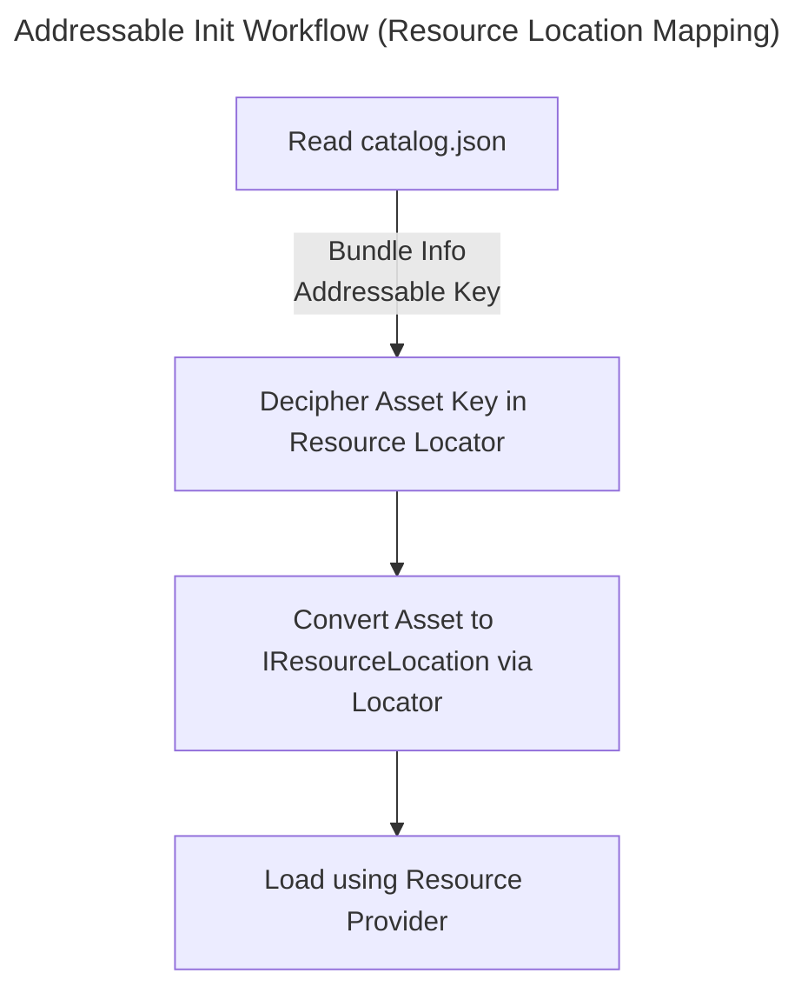

## Table of Contents

> [What are Addressables?](#what-are-addressables)      
> [Creating Addressable Groups and Referencing Assets](#creating-addressable-groups-and-referencing-assets)     
> [Addressable Load/Unload and Memory Structure](#addressable-loadunload-and-memory-structure)     
> [How Unity Identifies AssetBundles](#how-unity-identifies-assetbundles)  
> [Addressable API (Script)](#addressable-api-script)  
> [Addressable Tool - Event Viewer](#using-the-event-viewer)  
> [Core Addressable Files](#core-addressable-files)  

---

## What are Addressables?

- The **Addressable Asset System** allows you to download resource file updates at runtime via a resource build only, without going through an app build.
- It is far superior to AssetBundles in terms of memory efficiency and benefits, such as resolving duplicate dependency issues and not loading entire AssetBundles at once.

{: : width="300" .normal }      
_Structure of Addressable Bundles and Assets_

<br>

- **Comparison: Resources vs. AssetBundle vs. Addressable**
- **Resources**: Included in the app's capacity during the build. This increases the app size and app startup loading time.
- **AssetBundle**: Due to the duplicate dependency issue mentioned earlier, if bundles A and B use the same texture, that texture is loaded into memory from both bundles (i.e., loaded twice).
- **Addressables**: Groups all assets into bundles to resolve duplicate dependencies. At runtime, it compares catalogs to download updated bundles. Assets can be loaded asynchronously using `LoadAssetAsync` instead of `Resources.Load`.

<br>

- Internally, Addressables still group assets by AssetBundle units.
- By wrapping AssetBundles at the Editor level, various customizations are possible when converting Addressable Groups -> AssetBundles.
- It is designed to avoid duplicate references, which was the biggest drawback (dependency issue) of AssetBundles.

<br>
<br>

## Creating Addressable Groups and Referencing Assets

- First, install the **Addressables** package from the Package Manager. (Current version: '1.21.19')

{: : width="800" .normal }

<br>

- Once installed, keep two key points in mind:
1. **Addressable Groups** (Path: Window - Asset Management - Addressables - Groups)
2. **Addressable Folder**

{: : width="600" .normal }     
_Path to Addressable Groups_

<br>

{: : width="800" .normal }      

- When you first download Addressables, the groups window looks like this. Click **Create Addressables Settings**.
- This creates a Scriptable Object and folder structure inside the Assets folder for Addressable settings and schemas.

{: : width="800" .normal }      

<br>

- In the Addressable Groups window, you'll see a **Default Local Group** created.

{: : width="800" .normal }

> **Note**: The concept of an "Addressable Group" is valid only in the Editor. Think of a group as a bundle. Assets like prefabs, materials, textures, images, sounds, animations, animators, and meshes depend on the bundle as key values with their respective addresses. During an Addressable build, they are compressed (LZ4, LZMA, etc.) into a bundle file.
{: .prompt-info}

<br>

- Selecting an asset in the Project folder reveals a checkbox in the Inspector to register it with Addressables.

{: : width="800" .normal }

{: : width="800" .normal }
_Checking the box automatically registers it to an Addressable Group_

<br>

- By default, it is registered under the **Default Local Group**.
- The Addressable Name becomes the key, so simplifying it is recommended. You can also right-click the group to simplify naming.
> {: : width="800" .normal }

<br>

- The Default Local Group's Build & Load Path is set to 'Local' by default.
> {: : width="800" .normal }
>      
> Details on remote builds will be covered in a future post.

<br>

> A crucial point here is designing a structure to separate groups (bundling) for assets to be loaded.     
> If you separate bundles too granularly (Pack Separately), the number of bundles increases, causing the metadata size to grow linearly. This leads to frequent memory overhead from AssetBundle metadata.     
> Conversely, bundling too much together causes duplicate dependency issues and prevents memory from being released for unused assets.
{: .prompt-tip}

<br>

- Therefore, flexible bundle separation design tailored to the project is necessary.
> In the case of *Toyverse*: UI Prefab, Sprite(UI), Sprite(Sticker), Clip Prefab, Character Prefab, Animation, Animator, Data Table, Sound, Particle System, Scene(Lighting Data, Light map, Scene Asset), Texture, Material...

- You can move assets to desired bundles via drag-and-drop.

{: : width="800" .normal }
_Create new groups via Right-click - Create New Group - Packed Asset_

<br>
<br>

## Addressable Load/Unload and Memory Structure

- Assets belonging to an Addressable Bundle individually have a **Reference Count**. This is the same concept as reference counting in C# Garbage Collection.
- When we 'load' an asset key via the Addressable API, the asset's reference count increases along with the bundle's metadata.
- If this reference count is 1 or more, the asset is considered "in use," and both the asset and its bundle's metadata are loaded and maintained in memory.
- Specifically, every time an asset is loaded from a bundle, the bundle's metadata must be loaded. (The more assets in a bundle, the larger this metadata.)

> **What is Bundle Metadata?**     
> Part of the metadata includes a list of all assets in the bundle.     
>      
> Let's distinguish between Assets and Unity Objects.      
> **Assets are files on disk** (PNG, JPG...). **Unity Engine Objects are collections of data serialized by Unity** (Sprite, Mesh, Texture, Material...).    
> This is why importing happens when adding assets to Unity. During this process, assets are converted into appropriate objects for the platform.     
> Since this takes time, the import results are serialized into a single binary file and cached in the Library.    
> **Thus, an AssetBundle is not the original file but a 'Serialized' object usable in Unity.** -> This is likely why Addressable Groups (Bundles) are stored as Scriptable Objects.    
>      
> Addressable Load -> Load & Request Header Info for the asset with the key from AssetBundle -> Load AssetBundle Metadata... This entire process consumes memory.     
> Also, unloaded assets within a loaded AssetBundle incur very little overhead at runtime.     
> As evidence, you can check the memory overhead of AssetBundle metadata using the Unity Memory Profiler.     
>     
> [For more details, refer to the Addressable Memory Structure post](https://epheria.github.io/posts/UnityAddressableMemory/#addressable-loading-process)
>       
> {: : width="800" .normal }
{: .prompt-tip}

<br>

- Let's look at the following diagram for a more intuitive understanding.

{: : width="800" .normal }

- Suppose Bundle A contains Asset1, Asset2, and Asset3. We load Asset2 and Asset3, making their reference counts 1 each.
- Here, Bundle A's reference count becomes 2.

<br>

{: : width="800" .normal }

- If we release Asset3 to unload it, Asset2's ref count remains 1, and Bundle A's ref count becomes 1.

- Even if we explicitly release Asset3 via script, Asset3 is not unloaded from memory.
- That is, just because an asset is no longer referenced (even if shown as inactive in the profiler) doesn't mean Unity immediately unloaded it!
- **In summary, you can load parts (assets) of an AssetBundle, but you cannot unload parts of an AssetBundle!**
- Assets in Bundle A are not unloaded until the AssetBundle itself is unloaded.

<br>

- However, there are **exceptions** to this rule.
1. Using the engine interface `Resources.UnloadUnusedAssets` immediately unloads Asset3. This method is slow, so use it asynchronously or with caution! Also, note that while the profiler might show the ref count, it is unloaded from memory. [See related reference](https://docs.unity3d.com/Packages/com.unity.addressables@1.21/manual/MemoryManagement.html)
2. Or, when loading a scene (scene transition), `UnloadUnusedAssets` is automatically called, unloading unused assets from loaded bundles.

<br>

{: : width="800" .normal }

- If you release Asset2 without exception handling, only then does Asset2's ref count become 0, Bundle A's ref count become 0, and it is unloaded from memory.

<br>

- We've discovered a pitfall: partially unloading assets from a bundle does not unload the asset and bundle metadata.
- Thus, the bundling strategy mentioned above (designing the separation structure of Addressable bundles) is extremely important!
- Refer to the [Addressables Bundling Strategy Reference](https://blog.unity.com/engine-platform/addressables-planning-and-best-practices) to apply settings suitable for your project (Cheat sheet included).

<br>
<br>

## How Unity Identifies AssetBundles

- Since the Addressable system uses AssetBundles internally, it's necessary to know how Unity identifies them.
- AssetBundles have a **Unique Internal ID**.
- Thanks to this ID, Unity does not allow loading duplicate AssetBundles. Trying to load the same bundle twice causes an internal error.
- A problem arises here: if an update is needed for the same bundle (same internal ID), even if the contents are different, an error occurs because duplicate loading isn't allowed.

- However, Addressables provides the following feature:
> - It generates a unique Internal ID when building bundles. (Different Internal ID from the previous version even for the same bundle)     
> - This allows the updated bundle with a different Internal ID to be successfully loaded as a new one.
{: .prompt-info}

<br>
<br>

## Addressable API (Script)

- Let's look at how to use the Addressable API in scripts.
- We'll execute Load -> Instantiate -> Release for a prefab named "MyCube". Let's check the reference count as well.
> {: : width="800" .normal }


```csharp
using System.Collections;
using System.Collections.Generic;
using Unity.VisualScripting;
using UnityEngine;
using UnityEngine.AddressableAssets;

public class BasicAPITest : MonoBehaviour
{
    IEnumerator Start()
    {
        // Initialization
        // Sets up info like AssetBundle list and key list referenced by Addressables
        // Must be called first
        yield return Addressables.InitializeAsync();


        // Load Asset
        // Reference Count + 1
        var loadHandle = Addressables.LoadAssetAsync<GameObject>("MyCube");
        yield return loadHandle;


        // Instantiate
        // Reference Count + 1
        var instantiateHandle = Addressables.InstantiateAsync("MyCube");

        GameObject createdObject = null;
        instantiateHandle.Completed += (result) =>
        {
            createdObject = result.Result;
        };

        yield return instantiateHandle;

        yield return new WaitForSeconds(3);

        // Delete Instance
        // Reference Count -1
        Addressables.ReleaseInstance(createdObject);
        
        // Unload Asset
        // Reference Count -1
        Addressables.Release(loadHandle);
    }
}
```

<br>

## Using the Event Viewer

- To check Addressable reference counts, it's convenient to use the **Event Viewer** tool provided by Addressables.
- First, enable the setting to activate the Event Viewer.
- Note: It might say Event Viewer is deprecated and to use the Profiler, but as of version '1.21.19', you can ignore this.

{: : width="600" .normal }

{: : width="600" .normal }     
_Check via Asset Management - Addressables - Event Viewer_

<br>

- Let's verify MyCube's reference count and script execution result.

{: : width="800" .normal }   
_Ref count increases, MyCube loaded and instantiated_

{: : width="800" .normal }    
_Ref count decreases, unloaded and MyCube destroyed_

<br>

- **Caution**: Asset loading and instantiation should be thought of separately. You don't need to call both simultaneously. This is just for example purposes.

<br>

- Also, I'll explain the difference between these two functions:

```csharp
Addressables.LoadAssetAsync<T>("KeyValue")

Addressables.InstantiateAsync("KeyValue")
```

<br>

- **'Addressables.InstantiateAsync'**
- Mainly used for asynchronous operations, especially when creation happens in multiple places and it's ambiguous to set handler release timing.
- Has higher overhead than the standard MonoBehaviour `Instantiate`.
- Creates and releases the object together, so you must keep it in a local variable and release it later.
- You must explicitly use `Addressables.ReleaseInstance` to release the created object instance.
- **Note**: Releasing destroys the object as well.
- Objects created this way are automatically released on scene transition or by using `Resources.UnloadUnusedAssets`.

```csharp
// Generally recommended to load resource via LoadAssetFromPrimaryKey, then Instantiate and Release.
// However, use this if creation is scattered and release timing is ambiguous.
// (Overhead is higher than basic Instantiate.)
// Objects created this way are auto-released on scene transition.
// But explicit release using ReleaseInstantiateAsset is recommended.
public async Task<GameObject> InstantiateAssetFromPrimaryKey(string primaryKey_, Transform parent = null)
{
    var handle = Addressables.InstantiateAsync(primaryKey_, parent);
    await handle.Task;
    return handle.Result;
}

// Function to release resource and destroy object created via InstantiateAssetFromPrimaryKey
// Note: This destroys the object in addition to releasing the asset. Use with caution.
public void ReleaseInstantiateAsset(GameObject object_)
{
    Addressables.ReleaseInstance(object_);
}
```

<br>

- **'Addressables.LoadAssetAsync'**
- The most recommended loading method. Offers best control and performance.
- You manually get the handler, access the type T via `handler.Result`, and perform operations (like Instantiate).
- Afterward, just release the handler. (Manage handler releases via structures like Dictionaries)
- Loads the asset inside the bundle by referencing the key.

```csharp
public async Task<AsyncOperationHandle<T>> LoadAssetFromPrimaryKey<T>(string primaryKey_)
{
    var handle = Addressables.LoadAssetAsync<T>(primaryKey_);
    await handle.Task;
    switch (handle.Status)
    {
        case AsyncOperationStatus.Succeeded:
            return handle;
        case AsyncOperationStatus.Failed:
        {
            Debug.LogError(handle.OperationException.Message);
            throw new ArgumentOutOfRangeException();
        }
        case AsyncOperationStatus.None:
        default:
            Debug.LogError("[ AddressableManager / LoadAssetFromPrimaryKey ] handle status is none");
            throw new ArgumentOutOfRangeException();                    
    }
}

public void ReleaseAsset<T>(AsyncOperationHandle<T> handler)
{
    if (handler.IsValid())
        Addressables.Release(handler);    
}
```

<br>

#### Addressable Scene Load API

- Another powerful feature is loading bundled scenes.
- Can be used as Additive Scenes.

```csharp
/// <summary>
/// Loads a scene using Addressables.
/// </summary>
/// <param name="sceneName_">Name of the scene to load</param>
/// <param name="loadMode_">Load mode (single / additive)</param>
/// <param name="activeOnLoad_">Whether to activate after load / if false, must call InitializeScene.</param>
/// <returns></returns>
public async UniTask<SceneInstance> LoadSceneFromAddressable(string sceneName_, LoadSceneMode loadMode_, bool activeOnLoad_)
{
    try
    {
        var loadSceneProcess = Addressables.LoadSceneAsync(sceneName_, loadMode_, activeOnLoad_);
        await loadSceneProcess;
        if (!activeOnLoad_)
        {
            await loadSceneProcess.Result.ActivateAsync();
        }

        return loadSceneProcess.Result;
    }
    catch (Exception err)
    {
        await Managers.UIMgr.ShowErrorModal(err.Message);
    }

    return default;
}
```

<br>
<br>

## Core Addressable Files

- I'll cover the Addressable build pipeline in more detail in a future post.
- First, let's simply run a local Addressable build from the Addressable Groups.

<br>

- Before building, disable the following setting.
- Click the 'AddressableAssetSettings' Scriptable Object and look at the Inspector.
> {: : width="800" .normal }    

- Change the **Build Addressables on Play** option to **Do not Build Addressables content on Player build**.
> {: : width="600" .normal }    

- This option selects whether to run the Addressable build together when building the Unity project via Player Settings - Build.
- Since we'll use Jenkins for remote builds, let's turn it off.

<br>

{: : width="800" .normal }    

- In the Addressable Groups toolbar: Profile: Default, Build - New Build - Default Build Script to run a local build. (For Editor)

<br>

- Once built, select **Use Existing Build** in Play Mode Script to simulate an environment similar to downloading/loading on Android.
- **Use Asset Database** is Editor mode.

{: : width="400" .normal }    

<br>

- Navigate to the local project folder to check core files (Saved in Android/iOS depending on platform).
> YourProjectName/Library/com.unity.addressables/aa/Android

<br>

- You'll see the following structure:

{: : width="800" .normal }    

<br>

- Inside the Android folder, two bundle files are created, matching the Addressable Group names in the editor.
> Default Local Group, Prefabs...      
>     
> {: : width="800" .normal }    


- Also, Unity's built-in shader bundle file is included by default. This is a crucial point for future Addressable optimization.

<br>

- Two most important files created during build are **settings.json** and **catalog.json**.
- Let's check the initialization workflow.

<br>



<br>

#### settings.json

{: : width="800" .normal }    
_Viewing settings.json in hierarchy via json viewer_

- `settings.json` records the path and Internal ID of `catalog.json`, which contains info on bundle files generated during build.
- When `Addressables.InitializeAsync()` is called, it references this file to locate `catalog.json`.

<br>

#### catalog.json

{: : width="1000" .normal }    
_Viewing catalog.json in hierarchy via json viewer_

- `catalog.json` contains paths to bundle files in the `m_internalIds` array.
- Addressables reads the catalog file to know the paths of bundle files based on these values.

<br>
<br>

#### ResourceLocator, ResourceLocation, ResourceProvider

- `InitializeAsync` reads `catalog.json` internally.
- It then performs initialization to allow loading actual assets via keys.
- Let's learn about **ResourceLocation, ResourceLocator, and ResourceProvider**.

<br>



<br>

- After reading the catalog, the internal **Resource Locator** converts assets into `IResourceLocation` format using the keys in the catalog.
- `ResourceLocation` contains dependency relations, key values, and which Provider to use for loading.

```csharp
namespace UnityEngine.ResourceManagement.ResourceLocations
{
    public interface IResourceLocation
    {
        string InternalId { get; }
        string ProviderId { get; }
        IList<IResourceLocation> Dependencies { get; }
        int Hash(Type resultType);
        int DependencyHashCode { get; }
        bool HasDependencies { get; }
        object Data { get; }
        string PrimaryKey { get; }
        Type ResourceType { get; }
    }
}
```

- Once converted to `IResourceLocation`, the **Resource Provider** is used to actually load the asset.
- Summary: Asset Key → Resource Locator → Resource Location → Resource Provider → Load Asset.
- Utilizing `ResourceLocation` will be detailed in a future post. (Especially needed for downloading during app startup after Remote build).

<br>
<br>

#### References

[Unity Q&A](https://unitysquare.co.kr/growwith/unityblog/webinarView?id=495&utm_source=facebook-page&utm_medium=social&utm_campaign=kr_unitynews_2403_w4&fbclid=IwAR1HPmSt0lvqK3OcAkn6bUg3WG96mQaOzZUNcMpgalTA9nfxckmOqZKq1fY_aem_Aa3yxpym1h8XGpw_UgmLhyA_Io8b0LwIO2HjAk43iwKst71wFNqe7TkNx5xSJ2f4lHmo8LDrIDRUkVtT8YCKeel6)

[Addressables Official Docs](https://docs.unity3d.com/Packages/com.unity.addressables@1.21/manual/UnloadingAddressableAssets.html?q=UnloadUnusedAssets)

[Addressables Manual Translation](https://velog.io/@hammerimpact/%EC%9C%A0%EB%8B%88%ED%8B%B0-Addressables-%EB%AC%B8%EC%84%9C-%EB%B2%88%EC%97%AD-4%EC%9E%A5-%EC%96%B4%EB%93%9C%EB%A0%88%EC%84%9C%EB%B8%94%EC%9D%98-%EC%82%AC%EC%9A%A9#%EB%A9%94%EB%AA%A8%EB%A6%AC-%EA%B4%80%EB%A6%AC)
